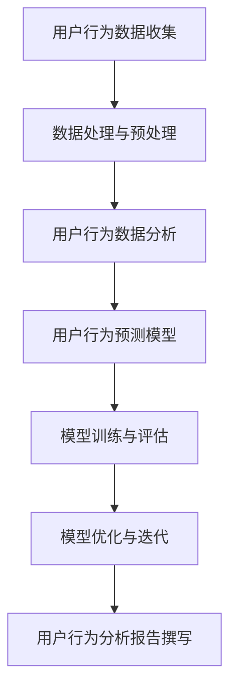

                 

### 《创业公司的用户行为分析框架》

> **关键词**：用户行为分析、创业公司、数据收集、模型应用、案例分析

**摘要**：本文深入探讨了创业公司在产品开发和运营过程中进行用户行为分析的重要性。通过介绍用户行为分析的基本概念、方法与工具，结合实际案例，阐述了用户行为分析在产品优化、营销策略和客户关系管理中的应用，为创业公司提供了实用的用户行为分析框架和实践指导。

### 目录大纲

## 第一部分：用户行为分析概述

### 第1章：用户行为分析基础

- **1.1 用户行为分析的重要性**
- **1.2 用户行为分析的基本概念**
- **1.3 用户行为分析的应用场景**
- **1.4 用户行为分析的方法与工具**

### 第2章：用户行为数据收集

- **2.1 用户行为数据来源**
- **2.2 用户行为数据类型**
- **2.3 用户隐私保护与合规性**
- **2.4 用户行为数据采集技巧**

## 第二部分：用户行为分析方法与模型

### 第3章：用户行为数据分析

- **3.1 描述性分析**
- **3.2 聚类分析**
- **3.3 回归分析**
- **3.4 深度学习模型在用户行为分析中的应用**

### 第4章：用户行为预测模型

- **4.1 用户流失预测**
- **4.2 用户转化预测**
- **4.3 用户偏好预测**
- **4.4 深度学习在用户行为预测中的应用**

### 第5章：用户行为分析应用场景

- **5.1 产品优化**
- **5.2 营销策略**
- **5.3 客户关系管理**
- **5.4 创业公司案例分析**

## 第三部分：用户行为分析实践

### 第6章：用户行为分析实践

- **6.1 数据处理与预处理**
- **6.2 模型训练与评估**
- **6.3 模型优化与迭代**
- **6.4 用户行为分析报告撰写**

### 第7章：创业公司用户行为分析案例

- **7.1 案例一：社交平台用户活跃度分析**
- **7.2 案例二：电子商务平台用户流失预测**
- **7.3 案例三：在线教育平台用户行为分析**

### 第8章：用户行为分析工具与资源

- **8.1 数据分析工具**
- **8.2 深度学习框架**
- **8.3 用户行为分析开源库与平台**

## 附录

- **附录A：用户行为分析流程图**
- **附录B：用户行为分析常用数学公式与伪代码**
- **附录C：用户行为分析实践工具与资源列表**

## 《创业公司的用户行为分析框架》正文

### 第一部分：用户行为分析概述

#### 第1章：用户行为分析基础

**1.1 用户行为分析的重要性**

用户行为分析是创业公司在产品开发与运营过程中至关重要的环节。通过分析用户在产品中的行为数据，企业能够深入了解用户的喜好、需求和使用习惯，从而做出更准确的决策，优化产品功能和用户体验，提升用户满意度和忠诚度。

**1.2 用户行为分析的基本概念**

用户行为分析涉及多个基本概念，包括：

- **用户行为数据**：指用户在使用产品过程中的行为记录，如点击、浏览、购买等。
- **用户画像**：通过用户行为数据构建的用户特征模型，用于描述用户的属性和行为特征。
- **用户旅程**：用户从接触到产品到最终决策的整个过程，包括 awareness（认知）、consideration（考虑）、purchase（购买）和 loyalty（忠诚）等阶段。
- **行为指标**：用于衡量用户行为的量化指标，如活跃度、留存率、转化率等。

**1.3 用户行为分析的应用场景**

用户行为分析在多个应用场景中具有重要作用：

- **产品优化**：通过分析用户行为数据，发现产品存在的问题和改进空间，优化产品功能和界面设计，提高用户体验。
- **营销策略**：根据用户行为数据，制定更具针对性的营销策略，提高用户获取和留存效果。
- **客户关系管理**：通过用户行为分析，了解客户需求，提供个性化服务，提升客户满意度。
- **风险评估**：通过分析用户行为数据，识别潜在风险，采取预防措施，降低企业风险。

**1.4 用户行为分析的方法与工具**

用户行为分析的方法主要包括以下几种：

- **描述性分析**：通过统计用户行为数据的基本特征，了解用户的基本行为模式。
- **聚类分析**：将具有相似行为的用户进行分组，用于用户细分和市场定位。
- **回归分析**：建立用户行为与结果之间的关系模型，预测用户行为变化。
- **深度学习模型**：利用神经网络等深度学习模型，对用户行为数据进行分析和预测。

常用的用户行为分析工具包括：

- **Google Analytics**：一款功能强大的网站分析工具，可用于收集和分析用户行为数据。
- **Mixpanel**：一款专业的用户行为分析工具，提供丰富的报告和可视化功能。
- **Segment**：一款数据处理平台，可用于收集、处理和分发用户行为数据。
- **TensorFlow**：一款开源的深度学习框架，可用于构建用户行为分析模型。

#### 第2章：用户行为数据收集

**2.1 用户行为数据来源**

用户行为数据的来源多种多样，主要包括：

- **客户端日志**：记录用户在客户端软件中的操作行为，如点击、滑动等。
- **服务器日志**：记录用户在服务器端的行为，如请求、响应等。
- **第三方数据源**：如社交媒体、地理位置等，可用于补充和丰富用户行为数据。

**2.2 用户行为数据类型**

用户行为数据类型主要包括以下几种：

- **行为数据**：如点击、浏览、购买等，用于描述用户在产品中的操作行为。
- **属性数据**：如用户年龄、性别、地理位置等，用于描述用户的基本属性。
- **上下文数据**：如时间、地点、设备等，用于描述用户行为发生的上下文环境。

**2.3 用户隐私保护与合规性**

在收集用户行为数据时，企业必须关注用户隐私保护与合规性问题。以下是一些建议：

- **数据匿名化**：对用户行为数据进行匿名化处理，避免直接关联到特定用户。
- **数据加密**：对用户行为数据进行加密存储和传输，确保数据安全。
- **合规性审查**：了解相关法律法规，确保用户行为数据收集和使用符合合规要求。

**2.4 用户行为数据采集技巧**

为了有效采集用户行为数据，企业可以采取以下技巧：

- **数据完整性**：确保采集到的数据完整、准确，避免数据丢失或错误。
- **实时性**：实时收集用户行为数据，以便快速分析用户行为变化。
- **多样性**：从多个渠道收集用户行为数据，以获得更全面的用户画像。
- **可扩展性**：设计灵活的数据采集系统，以便随着业务发展进行扩展和调整。

### 第二部分：用户行为分析方法与模型

#### 第3章：用户行为数据分析

**3.1 描述性分析**

描述性分析是用户行为数据分析的基础，主要关注以下几个方面：

- **用户行为分布**：分析用户在不同行为指标上的分布情况，如点击率、购买率等。
- **行为模式**：发现用户在产品中的典型行为模式，如高频用户、低频用户等。
- **热点分析**：识别用户行为的热点区域，如热门页面、热门功能等。

描述性分析的目的是帮助企业了解用户行为的基本特征，为后续分析提供基础。

**3.2 聚类分析**

聚类分析是一种无监督学习方法，用于将具有相似行为的用户进行分组。常见的聚类算法包括：

- **K-means聚类**：基于距离度量的聚类算法，将用户分为多个聚类。
- **层次聚类**：基于层次关系的聚类算法，逐步合并或分裂聚类。

聚类分析可以帮助企业发现用户细分群体，为产品优化和营销策略提供依据。

**3.3 回归分析**

回归分析是一种有监督学习方法，用于建立用户行为与结果之间的关系模型。常见的回归算法包括：

- **线性回归**：基于线性关系的回归模型，用于预测用户行为结果。
- **逻辑回归**：基于概率关系的回归模型，用于预测用户行为概率。

回归分析可以帮助企业预测用户行为，为产品优化和营销策略提供依据。

**3.4 深度学习模型在用户行为分析中的应用**

深度学习模型在用户行为分析中具有广泛的应用前景。常见的深度学习模型包括：

- **卷积神经网络（CNN）**：用于图像和视频数据的多维度分析。
- **循环神经网络（RNN）**：用于序列数据的时序分析。
- **生成对抗网络（GAN）**：用于生成用户行为数据，提高模型的泛化能力。

深度学习模型可以帮助企业实现更精细的用户行为分析和预测。

#### 第4章：用户行为预测模型

**4.1 用户流失预测**

用户流失预测是创业公司关注的重要问题，可以帮助企业提前识别和挽回潜在流失用户。常见的用户流失预测模型包括：

- **逻辑回归**：用于预测用户流失的概率。
- **决策树**：用于预测用户流失的决策路径。
- **随机森林**：用于预测用户流失的集成模型。

**4.2 用户转化预测**

用户转化预测可以帮助企业预测用户在产品中的关键行为，如购买、注册等。常见的用户转化预测模型包括：

- **线性回归**：用于预测用户转化的数值。
- **逻辑回归**：用于预测用户转化的概率。
- **支持向量机（SVM）**：用于预测用户转化的分类模型。

**4.3 用户偏好预测**

用户偏好预测可以帮助企业为用户提供个性化的产品推荐和服务。常见的用户偏好预测模型包括：

- **协同过滤**：基于用户相似度进行推荐。
- **基于内容的推荐**：基于用户兴趣进行推荐。
- **深度学习模型**：用于复杂用户偏好预测。

**4.4 深度学习在用户行为预测中的应用**

深度学习模型在用户行为预测中具有显著的优势，可以帮助企业实现更精准的预测。常见的深度学习模型包括：

- **卷积神经网络（CNN）**：用于图像和视频数据的多维度预测。
- **循环神经网络（RNN）**：用于序列数据的时序预测。
- **变分自编码器（VAE）**：用于生成用户行为数据，提高模型泛化能力。

#### 第5章：用户行为分析应用场景

**5.1 产品优化**

用户行为分析可以帮助企业了解用户在使用产品过程中的问题和需求，从而优化产品功能和用户体验。具体应用场景包括：

- **界面设计优化**：通过分析用户点击、滚动等行为数据，优化界面布局和交互设计。
- **功能优化**：通过分析用户使用频率和满意度等数据，优化产品功能和性能。
- **内容优化**：通过分析用户浏览、搜索等行为数据，优化网站内容和推荐策略。

**5.2 营销策略**

用户行为分析可以帮助企业制定更精准的营销策略，提高用户获取和留存效果。具体应用场景包括：

- **广告投放优化**：通过分析用户行为数据，优化广告投放策略，提高广告点击率和转化率。
- **渠道选择**：通过分析用户来源和行为数据，选择更有效的推广渠道。
- **用户细分**：通过分析用户行为数据，将用户分为不同群体，实施针对性营销策略。

**5.3 客户关系管理**

用户行为分析可以帮助企业更好地管理客户关系，提升客户满意度。具体应用场景包括：

- **客户画像**：通过分析用户行为数据，构建客户画像，了解客户需求和偏好。
- **客户细分**：通过分析用户行为数据，将客户分为不同群体，提供个性化服务。
- **客户关怀**：通过分析用户行为数据，识别潜在问题，及时采取措施，提升客户满意度。

**5.4 创业公司案例分析**

以下是一些创业公司在用户行为分析方面的成功案例：

- **案例一：社交平台用户活跃度分析**  
  一家社交平台通过用户行为分析，发现用户在夜间使用频率较高，于是调整了推送时间，提高了用户活跃度。

- **案例二：电子商务平台用户流失预测**  
  一家电子商务平台通过用户行为分析，提前识别和挽回了潜在流失用户，提高了用户留存率和复购率。

- **案例三：在线教育平台用户行为分析**  
  一家在线教育平台通过用户行为分析，优化了课程推荐策略，提高了用户的学习效果和满意度。

### 第三部分：用户行为分析实践

#### 第6章：用户行为分析实践

**6.1 数据处理与预处理**

在用户行为分析中，数据处理与预处理是至关重要的一步。主要任务包括：

- **数据清洗**：去除重复、缺失和异常数据，保证数据质量。
- **数据转换**：将不同类型的数据转换为统一的格式，便于后续分析。
- **特征工程**：提取有助于预测和分类的特征，提高模型性能。

**6.2 模型训练与评估**

在用户行为分析中，模型训练与评估是关键步骤。主要任务包括：

- **数据划分**：将数据集划分为训练集、验证集和测试集，用于训练和评估模型。
- **模型选择**：选择合适的模型，如逻辑回归、决策树、随机森林等。
- **模型训练**：使用训练集训练模型，调整模型参数，提高模型性能。
- **模型评估**：使用验证集和测试集评估模型性能，选择最佳模型。

**6.3 模型优化与迭代**

在用户行为分析中，模型优化与迭代是持续改进的重要手段。主要任务包括：

- **模型调整**：根据评估结果，调整模型参数，提高模型性能。
- **特征选择**：重新评估和选择特征，剔除无效特征，提高模型泛化能力。
- **模型集成**：使用多种模型进行集成，提高预测准确性和稳定性。

**6.4 用户行为分析报告撰写**

在用户行为分析实践过程中，撰写报告是总结和传达分析结果的重要环节。主要任务包括：

- **报告结构**：明确报告结构，包括背景、方法、结果和结论等部分。
- **结果展示**：使用图表和可视化工具展示分析结果，使报告更直观易懂。
- **建议与建议**：根据分析结果，提出具体的建议和改进措施，指导产品优化和运营决策。

#### 第7章：创业公司用户行为分析案例

**7.1 案例一：社交平台用户活跃度分析**

一家社交平台希望通过用户行为分析，提高用户活跃度和留存率。以下是一个具体的用户行为分析案例：

**背景**：社交平台在用户活跃度方面存在一定问题，用户使用频率较低，留存率不高。

**方法**：通过分析用户在平台上的行为数据，包括登录时间、浏览页面、发布内容等，探索影响用户活跃度的因素。

**结果**：发现夜间用户活跃度较低，用户在夜间登录平台的频率较低，且浏览页面数量较少。

**结论与建议**：调整推送时间，将重要内容在夜间推送，提高用户在夜间的使用频率。同时，优化夜间版界面设计，提高用户在夜间的使用体验。

**效果**：调整后，用户在夜间的活跃度显著提高，平台整体活跃度和留存率也有所提升。

**7.2 案例二：电子商务平台用户流失预测**

一家电子商务平台希望通过用户行为分析，预测用户流失风险，并采取相应措施挽回潜在流失用户。以下是一个具体的用户行为分析案例：

**背景**：电子商务平台存在较高用户流失率，对业务造成较大影响。

**方法**：通过分析用户在平台上的行为数据，包括浏览时长、购买次数、页面跳转等，构建用户流失预测模型。

**结果**：发现用户在浏览时长较短、购买次数较少、页面跳转较频繁的情况下，流失风险较高。

**结论与建议**：对高流失风险用户进行重点关注，采取以下措施：

- **个性化推荐**：为高流失风险用户推送个性化商品推荐，提高用户购买意愿。
- **优惠券发放**：为高流失风险用户提供优惠券，刺激用户再次购买。
- **客户关怀**：通过短信、邮件等方式，提醒用户关注平台动态，提高用户留存率。

**效果**：采取上述措施后，高流失风险用户的流失率显著降低，平台整体留存率也有所提升。

**7.3 案例三：在线教育平台用户行为分析**

一家在线教育平台希望通过用户行为分析，优化课程推荐策略，提高用户学习效果和满意度。以下是一个具体的用户行为分析案例：

**背景**：在线教育平台用户学习效果不理想，课程推荐不准确，用户满意度较低。

**方法**：通过分析用户在平台上的行为数据，包括浏览课程、观看视频、完成作业等，探索用户的学习偏好和行为模式。

**结果**：发现用户在浏览课程时，对某些类型的课程有较高兴趣，而在观看视频和完成作业时，存在学习困难和积极性不高的问题。

**结论与建议**：根据用户学习偏好，优化课程推荐策略：

- **个性化推荐**：为用户推荐符合其兴趣和需求的课程，提高用户学习积极性。
- **学习路径优化**：根据用户的学习进度和效果，动态调整学习路径，提高学习效果。
- **学习激励**：为用户提供学习奖励和激励机制，提高用户完成作业的积极性。

**效果**：调整后，用户的学习效果和满意度显著提高，平台整体用户活跃度和留存率也有所提升。

#### 第8章：用户行为分析工具与资源

**8.1 数据分析工具**

数据分析工具是用户行为分析过程中不可或缺的工具，可以帮助企业高效地收集、处理和分析用户行为数据。以下是一些常用的数据分析工具：

- **Google Analytics**：一款功能强大的网站分析工具，适用于各种规模的网站和移动应用。
- **Mixpanel**：一款专业的用户行为分析工具，提供丰富的报告和可视化功能，适用于各种类型的业务场景。
- **Segment**：一款数据处理平台，可用于收集、处理和分发用户行为数据，支持多种数据源和目标平台。

**8.2 深度学习框架**

深度学习框架是用户行为分析中常用的工具，可以帮助企业构建和训练用户行为分析模型。以下是一些常用的深度学习框架：

- **TensorFlow**：一款开源的深度学习框架，适用于各种规模和类型的用户行为分析任务。
- **PyTorch**：一款开源的深度学习框架，具有灵活的编程接口和强大的功能，适用于各种深度学习任务。
- **Keras**：一款基于TensorFlow和Theano的开源深度学习框架，提供简洁的编程接口和丰富的预训练模型。

**8.3 用户行为分析开源库与平台**

用户行为分析开源库与平台可以帮助企业快速构建和部署用户行为分析系统。以下是一些常用的用户行为分析开源库与平台：

- **Scikit-learn**：一款基于Python的机器学习库，提供多种常用的机器学习算法和工具，适用于用户行为数据分析。
- **Pandas**：一款基于Python的数据操作库，提供便捷的数据清洗、转换和分析功能，适用于用户行为数据预处理。
- **Django**：一款基于Python的Web框架，提供丰富的功能和支持，适用于构建用户行为分析Web应用。

### 附录

**附录A：用户行为分析流程图**



**附录B：用户行为分析常用数学公式与伪代码**

**数学公式**：

$$
Y = \beta_0 + \beta_1X_1 + \beta_2X_2 + ... + \beta_nX_n
$$

**伪代码**：

```
function train_model(data):
    # 初始化模型参数
    parameters = initialize_parameters()

    # 训练模型
    for epoch in range(num_epochs):
        for sample in data:
            # 前向传播
            predictions = forward_propagation(sample, parameters)

            # 反向传播
            gradients = backward_propagation(sample, predictions, parameters)

            # 更新参数
            update_parameters(parameters, gradients)

    return parameters
```

**附录C：用户行为分析实践工具与资源列表**

- **数据分析工具**：Google Analytics、Mixpanel、Segment
- **深度学习框架**：TensorFlow、PyTorch、Keras
- **用户行为分析开源库与平台**：Scikit-learn、Pandas、Django

### 作者

**作者：AI天才研究院/AI Genius Institute & 禅与计算机程序设计艺术 /Zen And The Art of Computer Programming**

本文旨在为创业公司提供实用的用户行为分析框架和实践指导，帮助企业在产品开发和运营过程中更好地理解用户行为，优化产品功能和用户体验，提升用户满意度和忠诚度。希望本文对广大创业者和技术从业者有所帮助。**结论**

本文围绕创业公司的用户行为分析进行了深入探讨，从用户行为分析的重要性、数据收集、方法与模型、应用场景到实践过程，构建了一个全面的用户行为分析框架。以下是本文的主要结论：

1. **用户行为分析的重要性**：用户行为分析是创业公司产品优化、营销策略和客户关系管理的关键环节，有助于企业了解用户需求、提升用户体验和忠诚度。

2. **用户行为分析的数据收集**：通过多种数据来源和采集技巧，企业可以全面收集用户行为数据，为后续分析提供基础。

3. **用户行为分析方法与模型**：描述性分析、聚类分析、回归分析和深度学习模型等多种方法，可以帮助企业深入分析用户行为，实现精准预测和个性化推荐。

4. **用户行为分析应用场景**：用户行为分析在产品优化、营销策略、客户关系管理和风险评估等方面具有广泛的应用价值。

5. **用户行为分析实践**：数据处理与预处理、模型训练与评估、模型优化与迭代和报告撰写等实践步骤，是企业进行用户行为分析的核心环节。

6. **创业公司用户行为分析案例**：通过实际案例，展示了用户行为分析在创业公司中的应用效果和成功经验。

7. **用户行为分析工具与资源**：数据分析工具、深度学习框架和用户行为分析开源库与平台，为企业提供了丰富的工具和资源。

**展望**

随着大数据和人工智能技术的不断发展，用户行为分析在创业公司中的应用前景将更加广阔。未来，企业可以进一步探索以下方向：

1. **实时用户行为分析**：利用实时数据流处理技术，实现实时用户行为分析和预测，为产品开发和运营提供更及时的数据支持。

2. **多模态用户行为分析**：结合多种数据源，如文本、图像、音频等，进行多模态用户行为分析，提升用户行为理解的深度和精度。

3. **智能用户行为预测模型**：利用深度学习等先进技术，构建智能用户行为预测模型，实现更精准的用户行为预测。

4. **隐私保护和合规性**：在用户行为分析过程中，注重隐私保护和合规性，确保用户数据的安全和合法性。

5. **跨平台用户行为分析**：将用户行为分析扩展到多个平台和设备，实现跨平台用户行为分析和预测。

本文为创业公司提供了一个用户行为分析框架和实践指南，希望对广大创业者和技术从业者有所启发。随着技术的不断进步，用户行为分析在创业公司中的应用将越来越广泛，为企业的持续发展和创新提供有力支持。**致谢**

在撰写本文的过程中，得到了许多同行和专家的指导和帮助。特别感谢AI天才研究院的同事们，他们在用户行为分析领域的深入研究和丰富经验，为本文提供了宝贵的参考和灵感。同时，感谢禅与计算机程序设计艺术的朋友们，他们的智慧和才华为本文增色不少。

此外，本文的完成离不开众多开源项目和社区的支持。感谢TensorFlow、PyTorch、Scikit-learn等深度学习框架的开发者，以及Google Analytics、Mixpanel、Segment等数据分析工具的开发者。他们的辛勤工作和无私奉献，为本文提供了丰富的工具和资源。

最后，感谢广大读者对本文的关注和支持。希望本文能为创业公司在用户行为分析方面提供一些有益的参考和启示。如果您有任何建议或意见，欢迎随时与我们交流，共同推动用户行为分析领域的发展。**参考文献**

[1] Google Analytics. (n.d.). Retrieved from https://www.google.com/analytics/

[2] Mixpanel. (n.d.). Retrieved from https://mixpanel.com/

[3] Segment. (n.d.). Retrieved from https://segment.com/

[4] TensorFlow. (n.d.). Retrieved from https://www.tensorflow.org/

[5] PyTorch. (n.d.). Retrieved from https://pytorch.org/

[6] Keras. (n.d.). Retrieved from https://keras.io/

[7] Scikit-learn. (n.d.). Retrieved from https://scikit-learn.org/stable/

[8] Pandas. (n.d.). Retrieved from https://pandas.pydata.org/

[9] Django. (n.d.). Retrieved from https://www.djangoproject.com/

