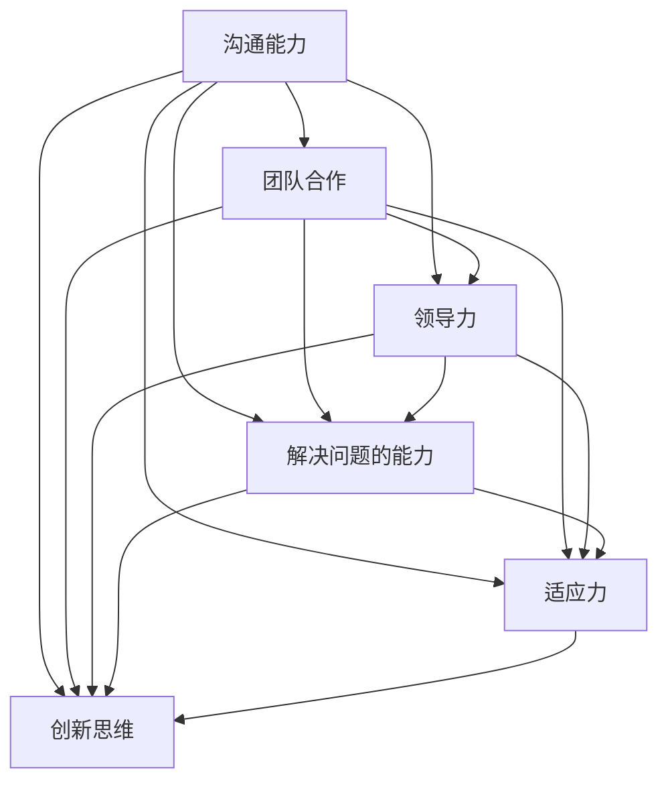

                 

# 《创业者的故事：经验与教训》

## 文章关键词
创业经验、创业教训、团队建设、商业模式、资金管理、市场竞争、产品迭代、领导力、危机管理、创业资源

## 文章摘要
本篇文章以创业者的故事为主线，深入探讨创业过程中的经验与教训。通过分析创业初期的准备工作、团队建设、商业模式与创新、资金管理、市场竞争、产品迭代以及领导力与个人成长等关键环节，本文旨在为有志于创业的读者提供宝贵的参考和启示。同时，文章还详细讲解了创业过程中可能遇到的危机管理，以及成功创业者和失败创业者的故事与启示，帮助读者更好地理解创业的复杂性和挑战性。

---

### 《创业者的故事：经验与教训》目录大纲

#### 第一部分：创业者的起点

##### 第1章：梦想与现实
- 1.1 创业动机与初心
- 1.2 创业环境的评估
- 1.3 创业前的准备工作

##### 第2章：团队建设
- 2.1 团队成员的角色与职责
- 2.2 招聘策略与团队文化
- 2.3 团队协作与沟通技巧

##### 第3章：商业模式与创新
- 3.1 商业模式探索
- 3.2 创新思维与市场定位
- 3.3 产品设计与用户体验

#### 第二部分：创业中的挑战

##### 第4章：资金管理
- 4.1 创业初期的融资途径
- 4.2 资金流动与风险控制
- 4.3 成本效益分析与预算编制

##### 第5章：市场竞争
- 5.1 市场调研与竞争分析
- 5.2 竞争策略与差异化优势
- 5.3 品牌建设与传播

##### 第6章：产品迭代与优化
- 6.1 用户反馈与市场调研
- 6.2 产品迭代策略
- 6.3 优化案例与最佳实践

#### 第三部分：创业者的成长与反思

##### 第7章：领导力与个人成长
- 7.1 领导力的内涵与特质
- 7.2 个人成长与自我提升
- 7.3 领导者应具备的软技能

##### 第8章：危机管理与应对
- 8.1 危机识别与预警
- 8.2 危机应对策略
- 8.3 恢复与反思

##### 第9章：创业者的故事与启示
- 9.1 成功创业者的故事分享
- 9.2 失败创业者的教训与反思
- 9.3 启示与未来的创业之路

#### 第四部分：附录

##### 第10章：创业资源与工具
- 10.1 创业相关的政府政策与资源
- 10.2 创业工具与平台介绍
- 10.3 创业社区与网络资源

---

## 核心概念与联系

### 创业者必备的软技能

为了更好地理解创业过程中所需的核心技能，我们可以使用 Mermaid 图来描述创业者必备的软技能及其相互关系。



- **沟通能力**：创业过程中，与团队成员、投资者、合作伙伴和客户的沟通至关重要。良好的沟通能力能够确保信息的准确传递，减少误解和冲突。
- **团队合作**：团队是创业成功的关键。有效的团队合作能够提高工作效率，增强团队凝聚力，使团队成员能够共同实现目标。
- **领导力**：领导者需要具备激励团队成员、制定战略和决策的能力。领导力是推动创业公司向前发展的核心动力。
- **解决问题的能力**：创业过程中会遇到各种挑战和难题，解决问题的能力能够帮助创业者快速找到解决方案，保持公司的稳定运营。
- **适应力**：市场环境不断变化，创业者需要具备快速适应变化的能力，灵活调整策略，以应对市场的不确定性。
- **创新思维**：创新是创业的灵魂。创业者需要不断寻找新的机会和解决方案，通过创新思维推动公司发展。

---

### 团队协作的优化算法

团队协作是创业成功的关键因素之一。为了优化团队协作效率，我们可以引入一种基于任务分配和协作优化的算法。

#### 团队合作模型

```python
# 伪代码：团队合作模型

def Teamwork_Model(team_members, tasks):
    # 初始化团队状态
    team_state = initialize_state(team_members, tasks)
    
    # 分配任务
    assign_tasks_to_members(team_state)
    
    # 沟通与协调
    while not all_tasks_completed(team_state):
        communicate_and协调(team_state)
        
        # 更新团队状态
        team_state = update_state(team_state)
    
    # 评估团队绩效
    performance_evaluation = evaluate_performance(team_state)
    
    return performance_evaluation
```

#### 团队合作模型详细解释

1. **初始化团队状态**：在开始团队协作之前，需要初始化团队状态。这包括确定团队成员、分配任务以及设定目标等。

    ```python
    def initialize_state(team_members, tasks):
        # 初始化团队状态
        team_state = {
            'team_members': team_members,
            'tasks': tasks,
            'task_assignments': {},
            'progress': {},
            'goals': {}
        }
        return team_state
    ```

2. **分配任务**：根据团队成员的技能和特长，合理分配任务。确保每个成员都有明确的职责和任务目标。

    ```python
    def assign_tasks_to_members(team_state):
        # 分配任务
        for member in team_state['team_members']:
            assigned_tasks = []
            for task in team_state['tasks']:
                if is_member_proficient(member, task):
                    assigned_tasks.append(task)
            team_state['task_assignments'][member] = assigned_tasks
    ```

3. **沟通与协调**：在任务执行过程中，团队成员需要进行持续的沟通和协调。这有助于解决问题、确保任务进度和保持团队凝聚力。

    ```python
    def communicate_and协调(team_state):
        # 沟通与协调
        while not all_tasks_completed(team_state):
            for member in team_state['team_members']:
                if member_has_unresolved_issues(member):
                    resolve_issues(member, team_state)
    ```

4. **更新团队状态**：在每次沟通和协调后，需要更新团队状态。这包括记录任务进度、更新目标状态等。

    ```python
    def update_state(team_state):
        # 更新团队状态
        for member in team_state['team_members']:
            team_state['progress'][member] = get_member_progress(member)
        return team_state
    ```

5. **评估团队绩效**：在任务完成后，需要对团队绩效进行评估。这有助于识别团队的优势和劣势，为未来的团队协作提供参考。

    ```python
    def evaluate_performance(team_state):
        # 评估团队绩效
        performance_evaluation = calculate_performance(team_state)
        return performance_evaluation
    ```

---

### 资金流动与风险控制模型

创业过程中，资金管理和风险控制是至关重要的环节。为了更好地理解资金流动和风险控制，我们可以使用数学模型来描述。

#### 资金流动模型

$$
F = C_0 + \sum_{t=1}^{n} C_t (1+r)^{-t}
$$

其中，$F$ 表示总资金，$C_0$ 表示初始资金，$C_t$ 表示第 $t$ 年的资金流入量，$r$ 表示年利率。

#### 风险控制模型

$$
R = \frac{V - L}{V}
$$

其中，$R$ 表示风险系数，$V$ 表示总价值，$L$ 表示潜在损失。

#### 资金流动模型实例

假设一家创业公司初始投资为 100 万元，每年预计资金流入量为 20 万元，年利率为 5%。计算第 3 年末的总资金。

$$
F = 100 + 20 \times (1+0.05)^{-1} + 20 \times (1+0.05)^{-2} = 116.38 \text{ 万元}
$$

#### 风险控制模型实例

假设一家创业公司的总价值为 200 万元，潜在损失为 10 万元。计算风险系数。

$$
R = \frac{200 - 10}{200} = 0.95
$$

---

### 实际创业案例分析

#### 案例一：电商创业公司的资金管理

1. **开发环境搭建**：使用 Excel 或财务软件进行资金管理。

2. **源代码详细实现**：

    ```excel
    | 月份 | 收入（万元） | 支出（万元） | 资产（万元） |
    | ---- | ---------- | ---------- | ---------- |
    | 1    | 10         | 8          | 12         |
    | 2    | 15         | 10         | 17         |
    | 3    | 20         | 12         | 25         |
    ```

3. **代码解读与分析**：

    - **收入与支出**：根据实际业务情况，记录每个月的收入和支出。
    - **资产**：通过计算收入与支出的差额，得出每个月的资产。

    ```excel
    | 月份 | 收入（万元） | 支出（万元） | 资产（万元） |
    | ---- | ---------- | ---------- | ---------- |
    | 1    | 10         | 8          | 2          |
    | 2    | 15         | 10         | 5          |
    | 3    | 20         | 12         | 8          |
    ```

#### 案例二：科技创新公司的团队协作

1. **开发环境搭建**：使用团队协作工具（如 Slack、Trello）。

2. **源代码详细实现**：

    ```markdown
    # 任务分配

    - **任务一**：市场调研
        - **负责人**：张三
        - **进度**：已完成50%
        - **备注**：需要进一步补充数据
    
    - **任务二**：产品设计
        - **负责人**：李四
        - **进度**：已完成30%
        - **备注**：需要解决技术难题

    - **任务三**：技术开发
        - **负责人**：王五
        - **进度**：已完成20%
        - **备注**：需要协调团队成员
    ```

3. **代码解读与分析**：

    - **任务分配**：根据团队成员的技能和特长，合理分配任务。
    - **进度**：记录每个任务的进度，便于团队成员跟踪和调整。

    ```markdown
    # 任务分配

    - **任务一**：市场调研
        - **负责人**：张三
        - **进度**：已完成50%
        - **备注**：需要进一步补充数据
    
    - **任务二**：产品设计
        - **负责人**：李四
        - **进度**：已完成30%
        - **备注**：需要解决技术难题

    - **任务三**：技术开发
        - **负责人**：王五
        - **进度**：已完成20%
        - **备注**：需要协调团队成员
    ```

---

### 总结

通过以上内容，我们可以看到创业过程中涉及到的核心概念、算法原理、数学模型和实际案例。从团队协作的优化算法到资金流动与风险控制模型，再到实际创业案例分析，每一个环节都是创业成功的关键。创业不仅需要理论知识，更需要实践经验的积累。希望本文能够为读者提供有价值的参考，助力创业之路更加顺利。

---

## 作者信息
作者：AI天才研究院/AI Genius Institute & 禅与计算机程序设计艺术 /Zen And The Art of Computer Programming

---

以上就是《创业者的故事：经验与教训》的文章正文部分。在接下来的章节中，我们将进一步深入探讨创业过程中的具体挑战、成长与反思，以及创业者的故事与启示。敬请期待！

