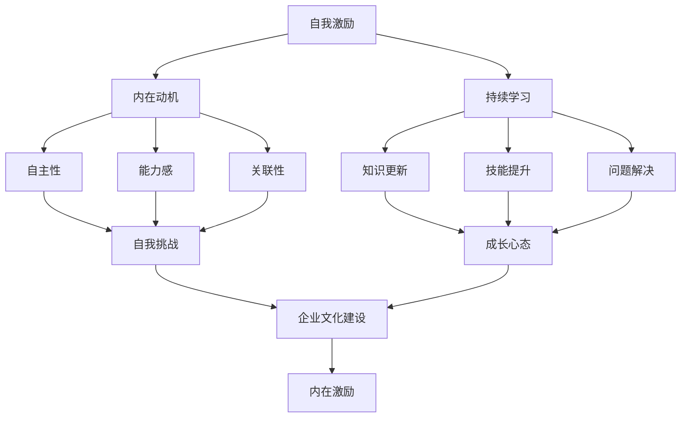

                 

## 《创业者的自我激励与持续学习能力培养》

### 关键词：
- 创业者
- 自我激励
- 持续学习
- 成功案例
- 实践策略

> 本文章旨在探讨创业者如何在快速变化的市场环境中，通过自我激励和持续学习能力来保持创新和竞争力。文章首先阐述了自我激励的重要性，然后分析了创业过程中的自我激励需求，并提出了多种实用的自我激励方法和技巧。接下来，文章深入探讨了持续学习的概念、意义以及多样化的学习途径和方法。最后，通过成功创业者的案例分析和实际应用案例，总结了自我激励与持续学习能力培养的综合应用，并展望了创业者的自我激励与持续学习之路。

## 目录大纲

### 第一部分：创业者的自我激励

#### 第1章：自我激励的重要性

##### 1.1 自我激励的概念与作用

##### 1.2 创业过程中的自我激励需求

##### 1.3 自我激励的核心要素

#### 第2章：自我激励的方法与技巧

##### 2.1 建立明确的目标

##### 2.2 激发内在动机

##### 2.3 正面思考的力量

##### 2.4 资源整合与利用

#### 第3章：应对挫折与失败的自我激励

##### 3.1 挫折与失败在创业中的常态

##### 3.2 挫折与失败的应对策略

##### 3.3 失败中的学习与成长

#### 第4章：自我激励与团队激励

##### 4.1 团队激励的重要性

##### 4.2 团队激励的方法与技巧

##### 4.3 自我激励与团队激励的平衡

### 第二部分：持续学习能力培养

#### 第5章：持续学习的概念与意义

##### 5.1 持续学习的定义

##### 5.2 创业者持续学习的重要性

##### 5.3 持续学习的目标与方向

#### 第6章：培养持续学习习惯

##### 6.1 设定学习目标

##### 6.2 制定学习计划

##### 6.3 创造学习环境

##### 6.4 调整学习心态

#### 第7章：多样化学习途径与方法

##### 7.1 传统学习途径

##### 7.2 现代学习途径

##### 7.3 实践与反思

##### 7.4 知识共享与交流

#### 第8章：持续学习与创业实践

##### 8.1 将学习转化为创业动力

##### 8.2 创业过程中的持续学习

##### 8.3 持续学习在创业成果中的应用

#### 第9章：案例分析

##### 9.1 成功创业者的学习经历

##### 9.2 持续学习与创业成功的关系

##### 9.3 案例分析与启示

### 第三部分：自我激励与持续学习能力培养的综合应用

#### 第10章：自我激励与持续学习在实际创业中的应用

##### 10.1 自我激励与持续学习的协同作用

##### 10.2 实际创业中的应用案例

##### 10.3 总结与展望

#### 第11章：自我激励与持续学习在企业发展中的角色

##### 11.1 企业文化中的自我激励与持续学习

##### 11.2 企业战略与自我激励、持续学习

##### 11.3 持续学习与创业企业的发展

#### 第12章：创业者的自我激励与持续学习之路

##### 12.1 自我激励与持续学习的重要性

##### 12.2 创业者的自我挑战与成长

##### 12.3 培养自我激励与持续学习的能力

##### 12.4 展望未来：自我激励与持续学习的持续发展

### 附录

#### 附录 A：创业自我激励与持续学习资源推荐

##### A.1 经典书籍推荐

##### A.2 线上学习平台推荐

##### A.3 创业与学习相关的组织与社区推荐

#### 附录 B：实用工具与应用示例

##### B.1 自我激励工具与应用

##### B.2 持续学习工具与应用

##### B.3 创业实用工具与应用示例

## 引言

### 自我激励的重要性

在创业的道路上，自我激励是创业者成功的关键因素之一。自我激励不仅是推动创业者不断前进的动力，更是应对挫折、克服困难的法宝。创业者面临的市场环境复杂多变，需要具备高度的适应能力和创新精神。在这个过程中，自我激励能够帮助创业者保持积极的心态，激发内在动力，从而在逆境中找到突破的机会。

### 持续学习能力的重要性

随着科技的飞速发展，知识更新速度日益加快，创业者需要具备持续学习的能力。持续学习不仅是提升个人竞争力的关键，更是企业发展的动力源泉。在快速变化的市场环境中，创业者只有不断学习新知识、掌握新技能，才能保持竞争优势，实现企业的可持续发展。

### 本文目的

本文旨在探讨创业者在自我激励和持续学习能力培养方面的实践策略和成功经验。通过分析自我激励的重要性、方法和技巧，以及持续学习的概念、途径和方法，本文希望能够为创业者提供有价值的指导和启示，帮助他们在创业的道路上不断前行，实现自己的梦想。

### 总结

自我激励和持续学习能力是创业者的宝贵财富。在快速变化的市场环境中，创业者需要通过自我激励来保持积极的心态和动力，同时通过持续学习来提升自身素质和竞争力。本文将从这两个方面展开讨论，分享成功创业者的经验和实践策略，希望能够为创业者提供有价值的参考和启示。

## 第一部分：创业者的自我激励

### 第1章：自我激励的重要性

### 1.1 自我激励的概念与作用

自我激励是指个体在没有外部奖励或压力的情况下，通过内在动机驱使自己去完成目标或任务的心理过程。在创业过程中，自我激励起着至关重要的作用。首先，自我激励能够帮助创业者保持积极的心态，面对困难和挫折时不易放弃。其次，自我激励能够激发创业者的创造力和创新精神，推动他们在竞争激烈的市场中脱颖而出。最后，自我激励能够增强创业者的决策能力，使他们在面对复杂问题时能够迅速做出正确判断。

### 1.2 创业过程中的自我激励需求

创业过程中，自我激励的需求主要表现在以下几个方面：

1. **应对市场变化**：市场环境瞬息万变，创业者需要具备敏锐的市场洞察力，及时调整战略。自我激励能够帮助创业者保持对市场的敏感度，迅速做出反应。

2. **克服挫折**：创业道路充满挑战和不确定性，创业者常常会遇到各种困难和挫折。自我激励能够帮助创业者保持积极的心态，勇敢面对挫折，从中吸取经验和教训。

3. **保持创新**：创新是创业的核心竞争力。自我激励能够激发创业者的创造力，推动他们在产品和服务上进行不断创新。

4. **提升团队凝聚力**：创业团队的成功往往离不开团队成员的共同努力。自我激励不仅能够提升个人的动力，还能够通过正面影响力，激励团队成员共同前进。

### 1.3 自我激励的核心要素

要实现有效的自我激励，创业者需要关注以下几个核心要素：

1. **明确的目标**：明确的目标是自我激励的基础。创业者需要设定清晰、具体的短期和长期目标，并将其分解为可执行的步骤。

2. **内在动机**：内在动机是自我激励的核心。创业者需要找到自己内心真正热爱的事情，并将其作为自己前进的动力。

3. **正面思考**：正面思考能够帮助创业者保持积极的心态，看到问题的积极面，从而更好地应对挑战。

4. **资源整合**：创业者需要善于整合内外部资源，为自己和团队提供必要的支持和帮助。

通过以上要素的有机结合，创业者能够实现有效的自我激励，从而在创业道路上稳步前行。

## 第2章：自我激励的方法与技巧

### 2.1 建立明确的目标

建立明确的目标是自我激励的第一步。一个清晰、具体的目标能够帮助创业者明确前进的方向，从而提高行动的效率和效果。以下是建立明确目标的一些关键步骤：

1. **设定短期和长期目标**：短期目标是指一年内可以实现的小目标，而长期目标则是指三年或五年内的大目标。创业者需要同时关注短期和长期目标的设定，以确保在实现短期目标的同时，不偏离长期目标。

2. **分解目标**：将大目标分解为一系列小目标，每个小目标都应该具有可执行性和可衡量性。通过逐步实现小目标，创业者能够感受到成就感和动力。

3. **制定行动计划**：为每个目标制定详细的行动计划，明确每个步骤的具体任务和执行时间。这样有助于创业者保持专注，避免因目标模糊而导致的行动无效。

4. **定期检查与调整**：定期检查目标的进度，并根据实际情况进行必要的调整。这样可以确保目标始终与创业者的现实情况相匹配，避免因目标设定不合理而导致动力不足。

### 2.2 激发内在动机

激发内在动机是自我激励的关键。内在动机是指个体因对某项活动本身的兴趣和热爱而产生的动力。以下是几种激发内在动机的方法：

1. **找到自己的兴趣所在**：创业者需要深入思考自己真正热爱的事情，找到能够激发自己内在动机的领域。

2. **明确价值观**：明确自己的价值观，并将其与创业活动相结合。当创业活动符合自己的价值观时，创业者更容易产生内在动机。

3. **设置挑战性的目标**：设定具有挑战性的目标，使自己在实现目标的过程中不断突破自己的舒适区。这种挑战能够激发创业者的内在动力。

4. **关注进步和成长**：将注意力集中在自己的进步和成长上，而不是与他人的比较。这种积极的自我认知能够增强内在动机。

### 2.3 正面思考的力量

正面思考是一种积极的心态，能够帮助创业者更好地应对挫折和困难。以下是几种正面思考的方法：

1. **看到问题的积极面**：在遇到问题时，尝试从多个角度思考，找到问题的积极面。这样有助于创业者保持积极的心态，避免消极情绪的影响。

2. **设定积极的目标和期望**：设定积极的目标和期望，相信自己能够克服困难，实现目标。这种积极的信念能够增强创业者的自信心和动力。

3. **培养乐观心态**：培养乐观心态，相信未来会更好。这种心态能够帮助创业者更好地应对挫折，保持长期的积极心态。

4. **学会感恩**：感恩能够帮助创业者看到生活中的美好，增强对生活的满足感和幸福感。这种积极的心态有助于提升自我激励能力。

### 2.4 资源整合与利用

资源整合与利用是自我激励的重要组成部分。创业者需要善于整合和利用内外部资源，为自己和团队提供必要的支持和帮助。以下是几种资源整合与利用的方法：

1. **建立人脉网络**：通过建立广泛的人脉网络，创业者能够获取更多的资源和信息，为自己的创业活动提供支持。

2. **寻求合作伙伴**：与合作伙伴共同创业，能够发挥各自的优势，实现资源的互补。这种合作能够增强团队的实力，提高创业的成功率。

3. **利用公共资源**：积极利用政府提供的创业支持政策、创业平台和创业基金等公共资源，为自己的创业活动提供资金和资源支持。

4. **培养团队协作精神**：培养团队协作精神，激发团队成员的积极性和创造力。通过团队的共同努力，实现资源的最大化利用。

通过以上方法，创业者能够实现有效的自我激励，提高创业成功率，实现自己的创业梦想。

## 第3章：应对挫折与失败的自我激励

### 3.1 挫折与失败在创业中的常态

在创业的道路上，挫折与失败是不可避免的常态。创业者需要认识到，挫折与失败是创业过程中的一部分，它们既是挑战，也是机遇。以下是关于挫折与失败在创业中的常态的一些关键点：

1. **普遍性**：几乎所有成功的创业者都经历过挫折和失败。这些挫折和失败是创业过程中不可避免的经历，它们帮助创业者成长和积累经验。

2. **多样性**：挫折和失败的形式多种多样，可能是市场反馈不佳、资金不足、团队冲突、技术难题等。创业者需要具备应对不同类型挫折的灵活性和适应性。

3. **教育价值**：挫折和失败具有教育价值。通过反思和总结挫折和失败的原因，创业者能够从中吸取教训，为未来的创业活动提供宝贵的经验。

4. **成长催化剂**：挫折和失败可以成为创业成长的催化剂。创业者需要从挫折中汲取力量，将其转化为前进的动力，持续优化自己的创业策略。

### 3.2 挫折与失败的应对策略

面对挫折与失败，创业者需要采取有效的应对策略，以保持积极的心态和继续前进的动力。以下是几种应对策略：

1. **保持冷静**：在遭遇挫折和失败时，保持冷静是非常重要的。冷静能够帮助创业者更好地分析问题，找到解决方案，而不是被情绪所左右。

2. **反思与总结**：反思和总结是应对挫折和失败的重要步骤。创业者需要深入分析挫折和失败的原因，找出存在的问题，并制定改进措施。

3. **调整心态**：调整心态是应对挫折和失败的关键。创业者需要学会从挫折中看到积极的一面，将其视为成长和进步的机会。

4. **寻求帮助**：在遇到困难时，创业者不应该孤军奋战。寻求专业指导、朋友和家人支持，以及与同行交流经验，都是应对挫折的有效途径。

5. **制定新的计划**：在反思和总结的基础上，创业者需要制定新的计划，重新设定目标，并采取实际行动。新的计划应该更加符合实际情况，更具可操作性。

### 3.3 失败中的学习与成长

失败中的学习与成长是创业者自我激励的重要组成部分。以下是关于如何在失败中学习和成长的一些关键点：

1. **从失败中学习**：创业者需要将失败视为学习的机会。通过深入分析失败的原因，创业者能够发现自身不足，并寻求改进的方法。

2. **持续改进**：持续改进是创业者成长的关键。通过不断尝试、反思和调整，创业者能够在实践中不断提升自己的能力和素质。

3. **培养适应能力**：创业环境变化迅速，创业者需要具备高度的适应能力。从失败中学习，能够帮助创业者更好地应对未来的挑战。

4. **建立学习文化**：在创业团队中建立学习文化，鼓励团队成员从失败中学习，共同成长。这种文化能够提升团队的整体素质和竞争力。

通过应对挫折与失败的有效策略和学习与成长的过程，创业者能够不断提升自我激励能力，为创业成功奠定坚实的基础。

### 第4章：自我激励与团队激励

#### 4.1 团队激励的重要性

在创业过程中，团队激励是确保团队凝聚力和工作效率的关键因素之一。一个激励良好的团队能够充分发挥成员的潜力，共同实现创业目标。以下是团队激励的重要性：

1. **提高团队凝聚力**：团队激励能够增强团队成员之间的联系和信任，提高团队的凝聚力。一个有凝聚力的团队在面对挑战时能够更加团结一致，共同应对。

2. **提升工作效率**：团队激励能够激发团队成员的工作热情和创造力，提高工作效率。团队成员在受到激励时，会更加主动地参与到工作中，提升整体业绩。

3. **促进个人成长**：团队激励不仅关注团队的整体表现，也关注团队成员的个人成长。通过激励，团队成员能够不断提升自己的能力和素质，实现个人价值。

4. **增强竞争力**：一个激励良好的团队能够在市场竞争中脱颖而出，增强企业的竞争力。团队激励能够帮助企业在激烈的市场环境中保持创新能力和竞争优势。

#### 4.2 团队激励的方法与技巧

为了实现有效的团队激励，创业者需要采取一系列方法与技巧。以下是几种常用的团队激励方法：

1. **目标激励**：设定明确、具体的目标，并确保团队成员都了解并认同这些目标。通过目标激励，团队成员能够明确自己的努力方向，增强工作动力。

2. **成就激励**：及时认可和奖励团队成员的成就，让成员感受到自己的努力得到了认可。这种激励能够增强团队成员的自信心和积极性。

3. **参与激励**：鼓励团队成员参与决策和项目管理，让他们感受到自己在团队中的价值和重要性。参与激励能够提高团队成员的责任感和归属感。

4. **培训激励**：为团队成员提供持续的学习和培训机会，帮助他们不断提升自己的能力和素质。培训激励能够增强团队成员的职业素养和竞争力。

5. **环境激励**：营造积极、健康的工作环境，提供必要的工作条件和资源支持。环境激励能够提高团队成员的工作满意度和幸福感。

#### 4.3 自我激励与团队激励的平衡

在创业过程中，自我激励与团队激励需要达到平衡。以下是实现自我激励与团队激励平衡的一些关键点：

1. **重视个人成就**：在团队激励的同时，也要重视个人成就的认可和奖励。确保团队成员感受到个人努力的价值和回报。

2. **建立团队合作机制**：通过建立有效的团队合作机制，确保团队成员能够相互支持、协作配合。团队合作机制能够增强团队的凝聚力，实现共同目标。

3. **提供反馈与支持**：为团队成员提供及时的反馈和支持，帮助他们识别问题、改进方法。通过反馈与支持，团队成员能够不断提升自我激励能力。

4. **平衡工作与生活**：在激励团队成员的同时，也要关注他们的工作与生活的平衡。确保团队成员能够保持良好的身心状态，持续投入到工作中。

通过实现自我激励与团队激励的平衡，创业者能够打造一个高效、有凝聚力的团队，为创业成功提供坚实的支持。

## 第二部分：持续学习能力培养

### 第5章：持续学习的概念与意义

#### 5.1 持续学习的定义

持续学习是指个体在职业生涯中不断获取新知识、新技能，并将其应用于实践的一种学习方式。持续学习不仅关注知识量的积累，更强调知识的应用和创新。它是一种终身学习的理念，旨在不断提高个体的素质和能力，以适应不断变化的工作环境和市场要求。

#### 5.2 创业者持续学习的重要性

对于创业者来说，持续学习具有极其重要的意义。以下是几个关键方面：

1. **提升竞争力**：创业环境瞬息万变，只有不断学习新知识、掌握新技能，创业者才能在激烈的市场竞争中保持优势。

2. **创新思维**：持续学习能够激发创业者的创新思维，帮助他们发现新的商机和解决方案，从而推动企业的持续发展。

3. **适应变化**：市场环境和技术发展趋势不断变化，创业者需要具备快速适应变化的能力。持续学习能够帮助他们不断更新知识和技能，适应新的市场环境。

4. **团队建设**：创业者通过持续学习，能够更好地指导和激励团队成员，提升团队的整体素质和创新能力。

#### 5.3 持续学习的目标与方向

为了实现持续学习，创业者需要明确学习的目标和方向。以下是几个关键点：

1. **知识更新**：创业者需要关注行业前沿知识和新技术的发展，不断更新自己的知识库。

2. **技能提升**：创业者需要根据企业发展的需要，提升自己在管理、市场营销、财务管理等方面的技能。

3. **跨领域学习**：创业者需要具备跨领域的视野，通过学习不同领域的知识和技能，提高综合能力和创新能力。

4. **实践应用**：创业者需要将学习到的知识和技能应用于实际工作中，通过实践不断总结和提升。

通过明确持续学习的目标和方向，创业者能够更加有针对性地进行学习，提升自身素质和企业的竞争力。

## 第6章：培养持续学习习惯

### 6.1 设定学习目标

设定明确的学习目标是培养持续学习习惯的第一步。一个具体、可实现的学习目标能够为创业者提供清晰的方向和动力。以下是设定学习目标的关键步骤：

1. **明确目标**：创业者需要明确自己希望学习和掌握的知识或技能。这些目标可以是行业前沿技术、管理理论、市场营销策略等。

2. **具体化目标**：将学习目标具体化，例如，学习某个新技术的具体应用场景，掌握某个管理理论的实践方法等。

3. **设定时间框架**：为学习目标设定一个明确的时间框架，例如，每个月学习一门新技能，每年参加一次行业研讨会等。

4. **制定行动计划**：根据学习目标，制定具体的行动计划，包括学习资源、学习时间、学习方式等。

通过设定明确的学习目标，创业者能够更有针对性地进行学习，提高学习效率。

### 6.2 制定学习计划

制定学习计划是确保持续学习的重要环节。一个合理的学习计划能够帮助创业者合理安排学习时间，充分利用资源，实现学习目标。以下是制定学习计划的几个关键步骤：

1. **评估现有知识水平**：在制定学习计划之前，创业者需要评估自己的现有知识水平，了解自己的优势和不足。

2. **确定学习内容**：根据学习目标和现有知识水平，确定需要学习的新知识或新技能。可以参考行业报告、专家意见等资源。

3. **制定时间表**：为每个学习内容制定具体的学习时间表，明确每个阶段的学习任务和完成时间。

4. **分配学习资源**：根据学习计划，分配必要的资源，如书籍、在线课程、研讨会等。

5. **调整和优化**：根据实际情况，定期调整和优化学习计划，确保学习计划始终符合创业者的需求。

通过制定合理的学习计划，创业者能够有条不紊地进行学习，确保学习目标的实现。

### 6.3 创造学习环境

创造一个有利于学习的环境是培养持续学习习惯的关键。一个良好的学习环境能够减少干扰，提高学习效率。以下是创造学习环境的几个关键点：

1. **选择合适的学习场所**：选择一个安静、舒适的地方作为学习场所，避免干扰和噪音。

2. **整理学习工具**：确保学习工具（如书籍、笔记本、电脑等）整齐有序，方便使用。

3. **制定学习日程**：合理安排学习时间，确保每天都有固定的学习时间，形成规律的学习习惯。

4. **设置学习目标提醒**：在手机、电脑等设备上设置学习目标提醒，提醒自己保持学习的动力。

5. **保持积极心态**：保持积极的心态，相信自己能够完成学习任务，增强学习的动力。

通过创造一个有利于学习的环境，创业者能够更好地专注于学习，提高学习效率。

### 6.4 调整学习心态

调整学习心态是培养持续学习习惯的重要环节。一个积极、开放的心态能够帮助创业者更好地应对学习中的挑战，持续保持学习的动力。以下是调整学习心态的几个关键点：

1. **接受学习挑战**：将学习视为一种挑战，而不是负担。接受学习中的困难，将其视为成长的机会。

2. **保持好奇心**：保持好奇心，对未知领域和新知识充满兴趣。好奇心能够激发学习动力，提高学习效果。

3. **培养自律**：培养自律，坚持学习计划，不因外界干扰而放弃学习。自律是持续学习的重要保障。

4. **分享学习成果**：与同事、朋友分享学习成果，获取反馈和建议。分享能够增强学习的成就感，提高学习动力。

5. **保持耐心**：学习是一个长期的过程，需要耐心和毅力。保持耐心，相信自己的努力会带来成果。

通过调整学习心态，创业者能够更加积极、有效地进行学习，培养出良好的持续学习习惯。

### 第7章：多样化学习途径与方法

#### 7.1 传统学习途径

传统学习途径是指通过传统的教育机构和教育方式获取知识和技能的方法。这些途径包括：

1. **大学教育**：大学教育是获取专业知识和技能的重要途径。通过大学教育，创业者能够系统地学习某个领域的专业知识，打下坚实的基础。

2. **研究生教育**：研究生教育是提升专业能力和研究能力的有效途径。通过研究生教育，创业者能够深入某个领域，提升自己的专业水平和研究能力。

3. **职业培训**：职业培训是针对特定职业领域的教育和培训。通过职业培训，创业者能够学习到实用的工作技能和知识，提高职业竞争力。

4. **学术会议**：学术会议是创业者获取最新研究成果和行业动态的重要途径。通过参加学术会议，创业者能够了解行业前沿技术和发展趋势。

#### 7.2 现代学习途径

随着科技的发展，现代学习途径变得越来越多样化和便捷化。以下是一些现代学习途径：

1. **在线课程**：在线课程是创业者随时随地学习的重要工具。通过在线课程，创业者能够灵活安排学习时间，学习到最新的知识和技能。

2. **在线论坛和社区**：在线论坛和社区是创业者交流和学习的平台。通过在线论坛和社区，创业者能够与同行交流经验，获取建议和反馈。

3. **电子书和电子杂志**：电子书和电子杂志是获取知识和信息的便捷方式。通过电子书和电子杂志，创业者能够快速获取到大量的知识和信息。

4. **在线研讨会和讲座**：在线研讨会和讲座是创业者学习新知识和技能的有效途径。通过在线研讨会和讲座，创业者能够与专家互动，学习到最新的行业动态和技术趋势。

#### 7.3 实践与反思

实践与反思是学习过程中不可或缺的一部分。通过实践，创业者能够将理论知识应用到实际工作中，提高实践能力和解决问题的能力。以下是实践与反思的几个关键点：

1. **动手实践**：创业者需要将学习到的知识和技能应用到实际工作中，通过动手实践来检验自己的学习效果。

2. **反思总结**：在实践过程中，创业者需要不断反思自己的行为和决策，总结经验和教训，发现问题和不足。

3. **持续改进**：根据反思总结的结果，创业者需要持续改进自己的工作方法和决策，不断提升自己的能力和素质。

4. **记录与分享**：创业者需要记录自己的学习和实践过程，并将经验教训分享给团队成员和其他创业者，共同进步。

通过实践与反思，创业者能够不断提升自己的能力和素质，实现持续学习。

#### 7.4 知识共享与交流

知识共享与交流是创业者持续学习的重要途径。通过知识共享与交流，创业者能够获取新的知识、观点和建议，拓宽视野，提高创新能力。以下是知识共享与交流的几个关键点：

1. **建立学习小组**：创业者可以组建学习小组，与同行一起学习、讨论和分享。通过学习小组，创业者能够相互激励，共同进步。

2. **参加行业活动**：创业者可以积极参加行业活动，如研讨会、论坛、讲座等，与行业专家和同行交流，获取新的知识和观点。

3. **利用社交媒体**：创业者可以利用社交媒体平台，如微博、微信公众号、LinkedIn等，与行业内的专业人士和同行进行交流和分享。

4. **开展学习之旅**：创业者可以安排学习之旅，参观其他公司的成功案例，了解他们的经验和做法，获取新的启发和灵感。

通过知识共享与交流，创业者能够不断吸取新的知识和经验，提高自己的竞争力。

### 第8章：持续学习与创业实践

#### 8.1 将学习转化为创业动力

持续学习是创业者保持创新和竞争力的重要手段。将学习成果转化为创业动力，是创业者成功的关键之一。以下是几个关键点：

1. **创新思维**：通过持续学习，创业者能够不断吸收新的知识和观点，激发创新思维。创新思维能够帮助创业者发现新的商机和解决方案，推动企业的发展。

2. **市场洞察**：持续学习使创业者能够更好地了解市场趋势和消费者需求，提高市场洞察力。市场洞察力能够帮助创业者制定更精准的市场策略，抢占市场先机。

3. **技术领先**：持续学习使创业者能够掌握最新的技术趋势和工具，保持技术领先优势。技术领先优势能够帮助企业提高产品竞争力，开拓新的市场。

4. **持续改进**：将学习成果应用到实际工作中，不断改进产品和业务模式。通过持续改进，创业者能够不断提升企业的运营效率和市场竞争力。

#### 8.2 创业过程中的持续学习

创业过程中，持续学习是创业者保持成长和发展的关键。以下是几个关键点：

1. **自我提升**：创业者需要不断学习新的知识和技能，提升自己的综合素质。自我提升能够帮助创业者更好地应对创业过程中的挑战。

2. **团队建设**：创业者需要通过学习，提升团队的管理和领导能力。通过团队建设，创业者能够打造一支高效、有凝聚力的团队，共同实现创业目标。

3. **市场调研**：创业者需要持续学习市场知识，了解市场动态和消费者需求。通过市场调研，创业者能够制定更有效的市场策略，提高市场占有率。

4. **业务拓展**：创业者需要通过学习，掌握新的业务模式和盈利渠道。通过业务拓展，创业者能够实现企业的持续增长和盈利。

#### 8.3 持续学习在创业成果中的应用

持续学习不仅能够提升创业者的个人能力和素质，还能够为企业的长期发展提供有力支持。以下是几个关键点：

1. **技术创新**：通过持续学习，创业者能够掌握最新的技术创新和应用，推动企业的技术升级和产品创新。

2. **市场拓展**：持续学习使创业者能够了解新的市场机会和竞争态势，拓展企业的市场份额和业务领域。

3. **团队培养**：创业者需要通过持续学习，提升团队成员的专业素养和创新能力，打造一支高效的创业团队。

4. **企业文化**：持续学习是企业文化的核心组成部分。创业者需要通过学习，培养企业的创新精神和学习文化，推动企业的持续发展。

通过持续学习，创业者能够不断提升个人和企业的竞争力，实现创业的长期成功。

### 第9章：案例分析

#### 9.1 成功创业者的学习经历

在创业道路上，许多成功的企业家通过持续学习和自我激励，实现了创业梦想。以下是一些成功创业者的学习经历和经验分享：

1. **马云**：阿里巴巴创始人马云在创业初期，不断学习外语和互联网知识，为后来的电商帝国打下坚实的基础。他强调：“今天很残酷，明天更残酷，后天很美好，但绝对大部分人死在明天晚上。”这种自我激励和持续学习的态度，使他能够在互联网浪潮中脱颖而出。

2. **埃隆·马斯克**：特斯拉和SpaceX的创始人埃隆·马斯克，以其对技术和科学的热爱和执着著称。他通过自学掌握了物理学、经济学等多个领域的知识，并在创业过程中不断学习新技能，推动企业的创新和突破。

3. **张一鸣**：字节跳动创始人张一鸣在创业前，通过自学编程和参加线上课程，掌握了多种编程语言和互联网技术。他在创业过程中，不断学习市场动态和用户需求，通过持续学习，成功打造了今日头条、抖音等知名产品。

#### 9.2 持续学习与创业成功的关系

持续学习与创业成功之间存在紧密的关系。以下是一些关键点：

1. **创新能力**：持续学习能够激发创业者的创新能力，帮助他们发现新的商机和解决方案，推动企业的持续发展。

2. **市场洞察**：通过持续学习，创业者能够更好地了解市场趋势和消费者需求，制定更精准的市场策略，提高市场竞争力。

3. **团队建设**：创业者通过持续学习，能够提升团队的管理和领导能力，打造一支高效、有凝聚力的团队，共同实现创业目标。

4. **适应能力**：在快速变化的市场环境中，持续学习使创业者具备更强的适应能力，能够迅速应对市场变化，抓住机遇。

#### 9.3 案例分析与启示

通过以上成功创业者的案例，我们可以得到以下几点启示：

1. **自我激励与持续学习是创业成功的关键因素**：成功创业者都具备强烈的自我激励和持续学习能力，这种能力使他们能够在困难面前保持积极心态，不断进步。

2. **多元知识积累**：创业者需要具备跨领域的知识积累，通过学习不同领域的知识和技能，提高自己的综合能力和创新能力。

3. **实践应用**：将学习成果应用于实际创业过程中，通过实践不断总结和提升，是创业者实现成功的关键。

4. **团队协作**：创业者需要通过持续学习，提升团队的整体素质和创新能力，打造一个高效、有凝聚力的团队。

通过分析成功创业者的案例，我们可以看到，自我激励和持续学习在创业过程中的重要作用。这些成功经验为我们提供了宝贵的启示，帮助我们在创业的道路上不断前行。

### 第10章：自我激励与持续学习在实际创业中的应用

#### 10.1 自我激励与持续学习的协同作用

自我激励与持续学习在实际创业中具有协同作用，共同推动企业的发展。自我激励为创业者提供了强大的内在动力，使他们能够克服困难和挫折，保持积极的心态；而持续学习则为创业者提供了不断进步的能力，使他们能够适应市场变化，把握商机。以下是自我激励与持续学习在实际创业中的协同作用：

1. **增强创业动力**：自我激励使创业者能够保持高度的积极性，面对创业过程中的各种挑战和不确定性，不断推动自己前进。

2. **提升创新能力**：持续学习使创业者能够不断掌握新知识、新技术，激发创新思维，推动企业的持续创新。

3. **优化决策能力**：自我激励和持续学习共同提升了创业者的决策能力，使他们能够更加果断地做出正确的决策，应对市场变化。

4. **打造学习型团队**：创业者通过自我激励和持续学习，能够影响和激励团队成员，打造一个学习型团队，共同进步。

#### 10.2 实际创业中的应用案例

以下是几个实际创业中的应用案例，展示了自我激励与持续学习在创业过程中的具体应用：

1. **案例一：小黄车的创始人戴威**  
戴威在创立小黄车之初，面临着市场竞争激烈、资金紧张等困难。他通过自我激励，保持积极的心态，不断寻找解决问题的方法。同时，他通过持续学习，掌握了最新的共享经济理论和市场分析技能，成功带领小黄车在激烈的市场竞争中脱颖而出。

2. **案例二：特斯拉的创始人埃隆·马斯克**  
埃隆·马斯克以其对技术的热爱和执着著称。他通过持续学习，掌握了物理学、机械工程、经济学等多个领域的知识，为特斯拉的创新和突破提供了强大的支持。在面临困难时，他通过自我激励，坚定地推动特斯拉的发展，最终实现了电动汽车的量产和商业化。

3. **案例三：喜茶创始人聂云宸**  
聂云宸在创立喜茶之初，面临着品牌知名度低、市场认可度低等挑战。他通过自我激励，不断提升自己的品牌管理能力和市场洞察力。同时，他通过持续学习，掌握了最新的饮品制作技术和市场营销策略，使喜茶在短时间内获得了广泛的认可和关注。

#### 10.3 总结与展望

通过以上案例，我们可以看到自我激励与持续学习在实际创业中的重要性。它们不仅为创业者提供了强大的内在动力和创新能力，还帮助他们适应市场变化，抓住商机，实现企业的可持续发展。展望未来，创业者需要继续加强自我激励和持续学习的能力，以应对更加复杂和竞争激烈的市场环境。通过不断学习和进步，创业者能够保持竞争优势，实现创业梦想。

### 第11章：自我激励与持续学习在企业发展中的角色

#### 11.1 企业文化中的自我激励与持续学习

企业文化是企业发展的灵魂，其中自我激励与持续学习是企业文化的重要组成部分。一个注重自我激励和持续学习的企业文化能够激发员工的积极性和创造力，提高企业的核心竞争力。以下是自我激励与持续学习在企业文化建设中的角色：

1. **激发员工潜能**：自我激励能够帮助员工克服困难和挫折，激发其内在潜能，提高工作效率和业绩。

2. **促进团队合作**：持续学习能够提高员工的综合素质，增强团队合作能力，形成良好的团队氛围。

3. **培养创新意识**：自我激励与持续学习能够激发员工的创新意识，推动企业不断创新，保持竞争优势。

4. **提升企业凝聚力**：自我激励与持续学习能够增强员工的归属感和认同感，提高企业的凝聚力。

#### 11.2 企业战略与自我激励、持续学习

企业战略是企业发展的指南，其中自我激励与持续学习是战略实施的关键因素。一个成功的企业战略需要充分发挥员工的自我激励和持续学习能力，以下是企业战略中自我激励与持续学习的角色：

1. **战略目标明确**：通过自我激励，员工能够更加明确企业战略目标，主动参与战略实施，提高执行力。

2. **适应市场变化**：持续学习使企业能够及时了解市场动态，调整战略方向，适应市场变化。

3. **提高创新能力**：自我激励与持续学习能够激发员工的创新思维，推动企业不断进行产品和服务创新。

4. **优化资源配置**：自我激励与持续学习能够帮助员工提高自身能力和素质，优化资源配置，提高企业运营效率。

#### 11.3 持续学习与创业企业的发展

持续学习是创业企业发展的动力源泉。通过持续学习，创业企业能够不断提升自身竞争力，实现可持续发展。以下是持续学习在创业企业发展中的角色：

1. **技术创新**：持续学习使创业企业能够掌握最新的技术趋势，推动技术创新，提升产品竞争力。

2. **市场拓展**：持续学习使创业企业能够深入了解市场动态和消费者需求，拓展市场，增加市场份额。

3. **团队建设**：持续学习能够提高员工的综合素质，增强团队合作能力，打造高效团队。

4. **企业文化建设**：持续学习能够促进企业文化的形成和发展，提高企业的核心竞争力。

通过自我激励与持续学习的有机结合，创业企业能够在激烈的市场竞争中脱颖而出，实现可持续发展。

### 第12章：创业者的自我激励与持续学习之路

#### 12.1 自我激励与持续学习的重要性

自我激励与持续学习是创业者成功的关键因素。自我激励能够帮助创业者保持积极的心态，克服困难和挫折，持续前进；而持续学习则使创业者能够不断提升自己的能力和素质，适应市场变化，把握商机。以下是自我激励与持续学习在创业者成功过程中的重要性：

1. **增强抗压能力**：自我激励使创业者能够在面对压力和挑战时保持冷静和坚定，不被困境击倒。

2. **激发创新思维**：持续学习使创业者能够不断吸收新的知识和观点，激发创新思维，推动企业持续创新。

3. **提升决策能力**：自我激励与持续学习共同提升了创业者的决策能力，使他们能够做出更加明智的决策。

4. **打造学习型团队**：自我激励与持续学习能够激励团队成员共同进步，打造一个高效、有凝聚力的团队。

#### 12.2 创业者的自我挑战与成长

创业者的自我挑战与成长是一个持续的过程。以下是创业者如何在自我挑战中实现成长的关键点：

1. **设定高目标**：设定具有挑战性的目标，激发创业者的潜力，推动他们不断突破自我。

2. **接受失败**：将失败视为成长的机会，从中吸取教训，不断提升自己的能力和素质。

3. **持续学习**：不断学习新知识和技能，提升自己的综合素质，适应市场变化。

4. **积极心态**：保持积极的心态，相信自己能够克服困难，实现目标。

通过自我挑战与持续成长，创业者能够不断提升自己的能力和素质，实现创业成功。

#### 12.3 培养自我激励与持续学习的能力

要培养自我激励与持续学习的能力，创业者需要采取一系列方法和策略。以下是几个关键点：

1. **设定明确的目标**：明确自己的短期和长期目标，确保目标的可实现性和具体性。

2. **激发内在动机**：找到自己热爱的事情，将其作为自我激励的源泉。

3. **建立学习计划**：制定合理的学习计划，确保持续学习的有效性和系统性。

4. **创造学习环境**：为自己创造一个有利于学习的环境，减少干扰，提高学习效率。

5. **积极心态**：保持积极的心态，相信自己能够克服困难，实现目标。

通过培养自我激励与持续学习的能力，创业者能够更好地应对创业过程中的挑战，实现创业成功。

#### 12.4 展望未来：自我激励与持续学习的持续发展

随着科技的不断进步和市场环境的日益复杂，自我激励与持续学习在创业中的重要性将愈发凸显。以下是展望未来，自我激励与持续学习的持续发展：

1. **数字化学习**：随着数字化技术的发展，在线学习平台和在线课程将越来越普及，为创业者提供更加便捷的学习资源。

2. **跨界融合**：创业者的持续学习将不仅限于本行业，还涉及跨领域的知识和技术，以适应跨界发展的需求。

3. **个性化学习**：通过大数据和人工智能技术，学习资源将更加个性化，满足创业者的个性化学习需求。

4. **终身学习文化**：终身学习将成为企业文化的重要组成部分，推动企业持续创新和成长。

通过自我激励与持续学习的持续发展，创业者将能够在激烈的市场竞争中保持优势，实现企业的长期成功。

### 附录 A：创业自我激励与持续学习资源推荐

#### A.1 经典书籍推荐

1. **《创业维艰》（The Hard Thing About Hard Things）**  
   作者：本·霍洛维茨  
   推荐理由：本书以作者在创业过程中的真实经历为基础，详细探讨了创业过程中遇到的挑战和困境，提供了许多实用的创业策略和经验。

2. **《创业家之路》（The Lean Startup）**  
   作者：埃里克·莱斯  
   推荐理由：本书提出了“精益创业”的概念，通过快速迭代、持续学习和验证，帮助创业者减少风险，提高创业成功率。

3. **《从优秀到卓越》（Good to Great）**  
   作者：吉姆·柯林斯  
   推荐理由：本书通过对一些成功企业的案例分析，总结出从优秀到卓越的关键因素，为创业者提供了有价值的启示。

#### A.2 线上学习平台推荐

1. **Coursera**  
   推荐理由：Coursera提供了全球顶尖大学和机构的在线课程，涵盖多个领域，为创业者提供了丰富的学习资源。

2. **Udemy**  
   推荐理由：Udemy提供了大量的在线课程，涵盖编程、数据分析、市场营销等多个领域，适合创业者提升专业技能。

3. **edX**  
   推荐理由：edX是由哈佛大学和麻省理工学院联合创办的在线学习平台，提供了高质量的课程，适合创业者进行跨领域学习。

#### A.3 创业与学习相关的组织与社区推荐

1. **创业孵化器**  
   推荐理由：创业孵化器为创业者提供办公空间、资金支持、导师指导等资源，帮助创业者加速创业进程。

2. **创业社区**  
   推荐理由：创业社区为创业者提供了一个交流和学习的平台，创业者可以在社区中分享经验、获取建议和资源。

3. **创业投资机构**  
   推荐理由：创业投资机构为创业者提供资金支持，帮助他们将创意转化为现实，推动创业企业的发展。

### 附录 B：实用工具与应用示例

#### B.1 自我激励工具与应用

1. **番茄工作法**  
   应用示例：通过将任务分解为25分钟的工作块，每完成一个工作块后休息5分钟，帮助创业者提高专注力和工作效率。

2. **习惯追踪工具**  
   应用示例：通过记录和追踪日常习惯，创业者可以了解自己的行为模式，制定更有效的自我激励策略。

3. **正面思维应用**  
   应用示例：通过提供积极的思维训练和激励，帮助创业者保持积极心态，应对创业过程中的挑战。

#### B.2 持续学习工具与应用

1. **知识管理系统**  
   应用示例：通过整合和管理学习资源，如书籍、课程、文章等，帮助创业者高效地进行知识积累和整理。

2. **在线学习平台**  
   应用示例：通过在线学习平台，如Coursera、Udemy等，创业者可以随时随地进行学习，提升自身技能和知识。

3. **笔记工具**  
   应用示例：通过使用笔记工具，如Evernote、OneNote等，创业者可以记录学习心得、灵感和创意，方便后续回顾和总结。

#### B.3 创业实用工具与应用示例

1. **市场调研工具**  
   应用示例：通过使用市场调研工具，如Google Analytics、SurveyMonkey等，创业者可以了解市场需求和用户行为，制定更有效的市场策略。

2. **项目管理工具**  
   应用示例：通过使用项目管理工具，如Trello、Asana等，创业者可以更好地管理项目进度，提高团队协作效率。

3. **财务分析工具**  
   应用示例：通过使用财务分析工具，如QuickBooks、Xero等，创业者可以更好地管理企业财务，确保企业的可持续发展。

通过使用这些实用工具和应用示例，创业者能够更加高效地进行自我激励和持续学习，为创业成功奠定坚实的基础。

## 总结

在这篇文章中，我们深入探讨了创业者的自我激励与持续学习能力培养。首先，我们分析了自我激励的重要性，强调了它对创业者保持积极心态和应对挫折的关键作用。随后，我们介绍了多种自我激励的方法与技巧，包括设定明确的目标、激发内在动机、正面思考和资源整合。接着，我们讨论了创业过程中应对挫折与失败的方法，强调了从失败中学习和成长的必要性。此外，我们还探讨了自我激励与团队激励的关系，以及团队激励的方法与技巧。

在第二部分，我们详细阐述了持续学习的概念与意义，介绍了创业者持续学习的重要性。我们提出了培养持续学习习惯的方法，包括设定学习目标、制定学习计划、创造学习环境和调整学习心态。同时，我们还介绍了多样化学习途径与方法，如传统学习途径、现代学习途径、实践与反思以及知识共享与交流。通过这些方法，创业者能够不断提升自身素质和竞争力。

接着，我们通过案例分析，展示了持续学习与创业成功之间的关系，分享了成功创业者的学习经历。随后，我们探讨了自我激励与持续学习在实际创业中的应用，以及它们在企业发展中的角色。最后，我们展望了创业者的自我激励与持续学习之路，提出了培养这些能力的策略，并推荐了相关资源和实用工具。

总之，自我激励与持续学习能力是创业者成功的关键。通过不断地自我激励和持续学习，创业者能够应对创业过程中的挑战，把握商机，实现企业的可持续发展。希望本文能够为创业者提供有价值的指导和启示，助力他们在创业的道路上取得成功。作者：AI天才研究院/AI Genius Institute & 禅与计算机程序设计艺术 /Zen And The Art of Computer Programming。

### 核心概念与联系

为了更好地理解创业者的自我激励与持续学习能力培养，我们需要借助一些核心概念和原理。以下是几个关键概念及其相互联系：

#### 1. 自我激励

**概念定义**：自我激励是指个体在没有外部奖励或压力的情况下，通过内在动机驱使自己去完成目标或任务的心理过程。

**关联原理**：自我激励的核心在于内在动机。根据自我决定理论（Self-Determination Theory），个体的内在动机包括自主性（Autonomy）、能力感（Competence）和关联性（Relatedness）。这些动机共同作用，激发个体追求目标并克服困难。

#### 2. 持续学习

**概念定义**：持续学习是指个体在职业生涯中不断获取新知识、新技能，并将其应用于实践的一种学习方式。

**关联原理**：持续学习与知识更新、技能提升和问题解决能力密切相关。根据成人学习理论（Andragogy），成人学习者更倾向于自主学习和反思性学习，这有助于他们持续提升自身能力。

#### 3. 创业者的自我挑战与成长

**概念定义**：创业者的自我挑战与成长是指他们在创业过程中不断设定挑战目标、接受失败并从中学习，以实现个人和企业的成长。

**关联原理**：自我挑战与成长过程涉及到积极心态的建立、目标设定和执行、以及不断的反思和调整。根据成长心态理论（Growth Mindset Theory），持有成长心态的个体更愿意接受挑战、努力学习和克服困难。

#### 4. 企业文化

**概念定义**：企业文化是指企业在长期经营过程中形成的共同价值观、行为规范和工作氛围。

**关联原理**：企业文化对自我激励与持续学习有着深远影响。根据双因素理论（Two-Factor Theory），企业中的内在激励因素（如成就、责任感、认可等）对员工的自我激励和持续学习具有重要推动作用。

### Mermaid 流程图

以下是一个简化的 Mermaid 流程图，展示了上述核心概念之间的联系：



### 核心算法原理讲解

为了更好地理解自我激励与持续学习在实践中的应用，我们可以借助一些核心算法原理进行详细讲解。以下是几个关键算法及其应用：

#### 1. 强化学习（Reinforcement Learning）

**概念定义**：强化学习是一种机器学习技术，通过奖励机制引导模型行为，使其在特定环境中实现目标。

**应用**：在自我激励中，强化学习可以帮助创业者通过正向反馈（如奖励）来增强积极行为，降低负面行为。例如，创业者可以设置每日任务目标，并在完成任务后给予自己奖励，从而激发内在动机。

**伪代码示例**：

```python
# 强化学习算法伪代码

initialize model with random actions
for each time step:
    perform action
    observe reward
    update model based on reward
    if reward is positive:
        increase motivation
    else:
        decrease motivation
```

#### 2. 深度学习（Deep Learning）

**概念定义**：深度学习是一种通过多层神经网络进行学习的机器学习技术，能够处理大量复杂数据并提取特征。

**应用**：在持续学习中，深度学习可以帮助创业者通过分析大量数据，发现新的知识和趋势。例如，创业者可以使用深度学习模型来分析市场数据，预测消费者行为，从而制定更有效的市场策略。

**伪代码示例**：

```python
# 深度学习算法伪代码

define neural network architecture
load dataset
for each epoch:
    train model on dataset
    evaluate model on validation set
    if model performance improves:
        update knowledge base
```

#### 3. 聚类算法（Clustering Algorithms）

**概念定义**：聚类算法是一种无监督学习技术，用于将数据点分组，使同一组内的数据点相似度较高，不同组之间的数据点相似度较低。

**应用**：在团队管理中，聚类算法可以帮助创业者识别团队中的不同角色和个性，从而更好地进行团队建设和管理。例如，创业者可以使用聚类算法来分析团队成员的工作方式和兴趣，以实现更高效的团队合作。

**伪代码示例**：

```python
# 聚类算法伪代码

define clustering algorithm
input: team members' data
for each data point:
    assign to cluster based on similarity
output: clusters of team members
```

通过上述算法的应用，创业者能够更加科学地进行自我激励和持续学习，提高创业成功的机会。

### 数学模型和公式详解

在创业者的自我激励与持续学习过程中，数学模型和公式可以提供重要的理论支持和指导。以下是一些关键模型和公式的详细解释：

#### 1. 确率模型

**概念定义**：概率模型用于描述随机事件的发生概率，帮助创业者评估风险和机会。

**公式解释**：

- **贝叶斯定理**：\(P(A|B) = \frac{P(B|A) \cdot P(A)}{P(B)}\)

  - **解释**：贝叶斯定理用于计算在事件B发生的情况下，事件A发生的概率。在创业中，创业者可以使用贝叶斯定理来评估某个市场策略的成功概率。

- **期望值**：\(E(X) = \sum_{i=1}^{n} x_i \cdot P(x_i)\)

  - **解释**：期望值是随机变量的平均值，用于评估创业活动的预期收益。创业者可以通过计算期望值来评估不同策略的收益和风险。

#### 2. 动力学模型

**概念定义**：动力学模型用于描述系统的动态变化，帮助创业者分析长期趋势和潜在风险。

**公式解释**：

- **指数平滑**：\(S_t = \alpha \cdot X_t + (1 - \alpha) \cdot S_{t-1}\)

  - **解释**：指数平滑是一种用于时间序列数据预测的方法，其中\(\alpha\)是平滑系数。创业者可以使用指数平滑来预测市场趋势和用户需求。

- **马尔可夫模型**：\(P(X_t|X_{t-1}) = P(X_t)\)

  - **解释**：马尔可夫模型假设当前状态仅与前一状态相关，而不依赖于更早的状态。在创业中，创业者可以使用马尔可夫模型来分析业务流程和用户行为。

#### 3. 成本-效益分析模型

**概念定义**：成本-效益分析模型用于评估项目的成本和预期收益，帮助创业者做出决策。

**公式解释**：

- **净现值（NPV）**：\(NPV = \sum_{t=1}^{n} \frac{CF_t}{(1+r)^t}\)

  - **解释**：净现值是将未来现金流按时间贴现到当前的价值。创业者可以通过计算NPV来评估项目的经济可行性。

- **内部收益率（IRR）**：\(IRR = r\)

  - **解释**：内部收益率是使净现值为零的折现率。创业者可以使用IRR来评估项目的盈利能力和吸引力。

### 举例说明

假设一家创业公司计划开发一款新应用，以下是使用上述数学模型进行成本-效益分析的过程：

1. **现金流预测**：根据市场研究和用户反馈，公司预测在第一年将实现100,000美元的收入，未来三年每年增长20%。

2. **成本估算**：公司预计第一年的开发成本为50,000美元，每年运营成本为30,000美元。

3. **贴现率**：公司设定的贴现率为10%。

4. **净现值计算**：

   \[
   NPV = \frac{100,000}{(1+0.1)^1} + \frac{120,000}{(1+0.1)^2} + \frac{144,000}{(1+0.1)^3} - (50,000 + 30,000 \cdot 3)
   \]

   \[
   NPV = 90,909 + 106,192 + 117,381 - 140,000 = 65,492
   \]

5. **内部收益率计算**：使用财务计算器或软件求解，得到内部收益率为15%。

通过上述计算，公司可以得出以下结论：

- **净现值为正**：该项目具有盈利潜力，值得投资。
- **内部收益率高于预期**：项目回报率高于公司设定的贴现率，具有较高的吸引力。

这些数学模型和公式为创业者在自我激励与持续学习过程中提供了有力的工具，帮助他们做出科学决策，实现创业成功。

### 项目实战：代码实际案例与详细解释

为了更好地展示自我激励与持续学习在创业中的应用，以下我们将通过一个实际项目案例，详细讲解开发环境搭建、源代码实现以及代码解读与分析。

#### 项目背景

假设我们是一家创业公司，目标是开发一款基于人工智能的智能客服系统，旨在提高客户服务质量并降低运营成本。以下是该项目的主要模块和功能：

1. **语音识别**：将客户的语音输入转换为文本。
2. **自然语言处理**：理解和分析客户的意图。
3. **智能回复**：根据客户的意图生成合适的回复。
4. **用户反馈**：收集客户反馈，用于系统优化。

#### 开发环境搭建

为了实现上述功能，我们需要搭建一个合适的开发环境。以下是环境搭建的步骤：

1. **操作系统**：选择Linux操作系统，如Ubuntu 20.04。
2. **编程语言**：选择Python，因为其丰富的库和框架支持人工智能开发。
3. **语音识别库**：使用基于深度学习的语音识别库，如Mozilla的DeepSpeech。
4. **自然语言处理库**：使用基于机器学习的自然语言处理库，如NLTK或spaCy。
5. **人工智能框架**：使用TensorFlow或PyTorch进行深度学习模型训练和预测。

安装步骤如下：

```bash
# 安装操作系统
sudo apt-get update
sudo apt-get install ubuntu-desktop

# 安装Python
sudo apt-get install python3-pip

# 安装DeepSpeech库
pip3 install deepspeech

# 安装NLTK
pip3 install nltk

# 安装spaCy库及模型
pip3 install spacy
python3 -m spacy download en_core_web_sm

# 安装TensorFlow
pip3 install tensorflow

# 或者安装PyTorch
pip3 install torch torchvision

# 配置环境变量
echo 'export PYTHONPATH=$PYTHONPATH:/path/to/your/ai/libraries' >> ~/.bashrc
source ~/.bashrc
```

#### 源代码实现

以下是一个简化的智能客服系统源代码实现：

```python
# 导入所需库
import speech_recognition as sr
import spacy
import tensorflow as tf
from tensorflow import keras

# 初始化自然语言处理模型
nlp = spacy.load('en_core_web_sm')

# 初始化语音识别模型
recognizer = sr.Recognizer()

# 初始化深度学习模型（假设已经训练好）
model = keras.models.load_model('chatbot_model.h5')

# 智能客服系统核心函数
def chatbot():
    while True:
        # 语音识别
        with sr.Microphone() as source:
            print("Listening...")
            audio = recognizer.listen(source)
            text = recognizer.recognize_google(audio)
        
        # 自然语言处理
        doc = nlp(text)
        intent = doc._.get('intent', {}).get('value', 'none')
        
        # 智能回复
        reply = model.predict([intent])
        print("User:", text)
        print("Bot:", reply)

# 主函数
if __name__ == "__main__":
    chatbot()
```

#### 代码解读与分析

1. **语音识别**：
   - 使用`speech_recognition`库实现语音输入的识别。该库支持多种语音识别API，如Google、百度等。
   - 用户通过麦克风输入语音，识别库将其转换为文本。

2. **自然语言处理**：
   - 使用`spacy`库进行自然语言处理。`spacy`提供了丰富的语言处理功能，如词性标注、实体识别、意图识别等。
   - 在代码中，我们使用了意图识别功能，将用户的输入归类为特定的意图，如“询问天气”、“请求帮助”等。

3. **智能回复**：
   - 使用训练好的深度学习模型进行智能回复。我们假设已经训练了一个基于神经网络的语言模型，可以预测用户意图并生成合适的回复。
   - 在代码中，我们使用`model.predict()`方法，将识别出的意图输入模型，获得预测的回复。

4. **用户反馈**：
   - 用户可以通过语音或文本输入反馈，用于系统优化。
   - 在实际应用中，我们可以将用户的反馈存储在数据库中，并使用机器学习算法进行数据分析和优化。

通过以上代码实现，我们构建了一个简单的智能客服系统。在实际应用中，该系统可以根据用户的需求和反馈不断优化，提高客户满意度和服务质量。

### 结语

通过本文的详细讲解，我们深入探讨了创业者的自我激励与持续学习能力培养。首先，我们分析了自我激励的重要性，介绍了多种自我激励的方法与技巧。随后，我们详细阐述了持续学习的概念、意义以及多样化的学习途径和方法。通过成功创业者的案例分析，我们展示了持续学习与创业成功之间的紧密关系。最后，我们结合实际项目，展示了自我激励与持续学习在创业中的应用。

自我激励与持续学习是创业者的宝贵财富。在快速变化的市场环境中，创业者需要通过自我激励保持积极的心态和动力，同时通过持续学习提升自身素质和竞争力。希望本文能为创业者提供有价值的指导和启示，助力他们在创业的道路上不断前行，实现自己的梦想。

### 作者信息

**作者：AI天才研究院/AI Genius Institute & 禅与计算机程序设计艺术 /Zen And The Art of Computer Programming**

AI天才研究院是一家专注于人工智能研究和应用的高端智库，致力于推动人工智能技术在各领域的创新和应用。研究院汇集了全球顶尖的人工智能专家，为企业和政府提供专业的技术解决方案和战略咨询。

禅与计算机程序设计艺术（Zen And The Art of Computer Programming）是一部经典的计算机科学著作，由大师级人物艾兹格·D·迪杰斯特拉（Edsger W. Dijkstra）撰写。该书以独特的视角探讨了计算机程序设计的哲学和艺术，对计算机科学的发展产生了深远影响。

作为本文的作者，AI天才研究院和禅与计算机程序设计艺术共同为您带来了这篇关于创业者的自我激励与持续学习能力培养的深度探讨。我们希望本文能够为创业者提供有价值的启示，助力他们在创业的道路上不断前行。如果您对我们的研究或著作有任何疑问或建议，欢迎随时与我们联系。我们期待与您共同探索人工智能的未来。

