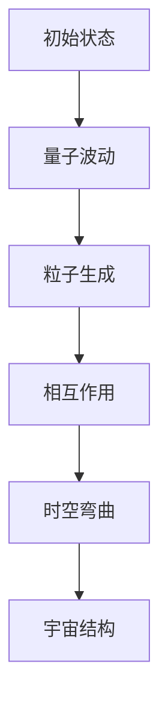

                 

### 引入“创世粒子”的概念

在当今科学领域，尤其是在物理学界，“创世粒子”是一个充满神秘与魅力的概念。创世粒子，顾名思义，是指宇宙诞生之初所存在的粒子，它们是构成宇宙的基本单元。在科学研究中，创世粒子不仅仅是一个理论模型，它还承载着对宇宙起源、结构以及演化规律的重大解答。

首先，我们需要了解创世粒子在物理学中的地位。现代物理学认为，宇宙的演化过程始于大爆炸，而在这一过程中，宇宙中最初的物质形态就是各种创世粒子。这些粒子在极短的时间内形成了最初的物质结构，并逐渐演化出我们所观察到的宇宙。创世粒子作为宇宙演化的基石，其性质和相互作用决定了宇宙的基本结构和运行规律。

创世粒子的概念不仅存在于理论物理学中，它还与许多实际观测现象有着紧密的联系。例如，宇宙微波背景辐射（Cosmic Microwave Background Radiation，CMB）是创世粒子留下的痕迹之一。通过对CMB的观测，科学家们可以间接推断出创世粒子的性质。此外，暗物质和暗能量等现象的研究也与创世粒子的性质密切相关。

那么，创世粒子究竟有哪些独特之处？它们是如何被发现的？在接下来的章节中，我们将逐步深入探讨这些问题。首先，我们需要了解创世粒子的一些基本概念和原理，这将为我们后续的讨论奠定基础。

在接下来的章节中，我们将首先回顾“创世粒子”的历史背景，了解这一概念的起源和发展历程。然后，我们将进一步探讨“创世粒子”的理论基础，包括其核心原理、与其他物理理论的关系以及如何通过Mermaid流程图直观展示其工作原理。接下来，我们将进入核心算法原理讲解部分，使用伪代码详细阐述测量、生成和操控创世粒子的算法原理。最后，我们将通过具体项目实战，展示如何在实际开发中应用这些算法，并进行代码解读与分析。

### “创世粒子”的历史背景

创世粒子这一概念的提出并非一朝一夕之事，而是经过了科学家们多年的探索和努力。其起源可以追溯到20世纪初期，随着量子力学和相对论的相继建立，人们对宇宙的认识逐渐深入。创世粒子的概念正是在这一背景下逐渐形成的。

#### 创世粒子的起源

20世纪初，物理学家们开始认识到宇宙并不是静态的，而是处于不断演化之中。1905年，爱因斯坦提出了狭义相对论，这为后来广义相对论的出现奠定了基础。广义相对论描述了引力的本质，即质量对时空的弯曲。这一理论揭示了宇宙的动态性质，为科学家们提供了新的思考方向。

紧接着，1927年，比利时天文学家勒梅特（Georges Lemaître）提出了大爆炸理论，认为宇宙起源于一个极为致密和炽热的状态，并从此开始膨胀。这一理论在当时引起了巨大的争议，但随后得到了更多科学家的支持。大爆炸理论为创世粒子的概念提供了重要的理论基础。

#### 创世粒子的发展历程

随着科学技术的进步，科学家们逐渐发现了更多关于创世粒子的证据。其中，最为重要的一项发现是宇宙微波背景辐射（CMB）的观测。1965年，阿诺·彭齐亚斯和罗伯特·威尔逊首次探测到了CMB，这一发现为创世粒子的存在提供了直接证据。

CMB是宇宙早期留下的余辉，它的存在表明宇宙在诞生之初处于极度高温和密度的状态。通过对CMB的观测，科学家们可以推断出创世粒子的性质和宇宙的早期演化过程。此外，粒子物理学的实验研究也取得了重要进展，例如发现中微子等基本粒子，这些实验成果进一步支持了创世粒子的理论。

在理论层面，创世粒子的研究也逐渐深入。20世纪70年代，宇宙学家提出了宇宙通货膨胀理论，认为在宇宙诞生后的短暂时期内，宇宙经历了一个极快的膨胀过程。这一理论进一步丰富了创世粒子的概念，并推动了宇宙学的发展。

#### 创世粒子研究的重要发现

创世粒子的研究不仅对物理学本身具有重要意义，还带来了许多重要的科学发现。例如，通过对宇宙微波背景辐射的观测，科学家们发现了宇宙结构的早期特征，如微小的不均匀性和量子波动。这些观测结果为验证大爆炸理论和创世粒子的存在提供了强有力的支持。

此外，创世粒子研究还推动了粒子物理学的发展。例如，中微子的发现和研究中微子振荡现象，使得科学家们对物质和能量的本质有了更深入的认识。这些发现不仅丰富了物理学理论，还为未来的科学探索提供了新的方向。

#### 创世粒子研究的挑战与机遇

尽管创世粒子的研究取得了许多重要成果，但这一领域仍然面临着许多挑战。例如，创世粒子的直接探测仍然是一个巨大的难题，科学家们需要开发更加精确的实验方法和技术。此外，对创世粒子的深入研究还涉及到许多未知的科学问题，如暗物质和暗能量的本质等。

然而，这些挑战也为科学家们带来了巨大的机遇。随着技术的进步和理论研究的深入，科学家们有望在创世粒子的研究中取得更多突破。例如，未来的大型实验设施，如宇宙微波背景探测器和粒子加速器，将为创世粒子的研究提供更加丰富的数据，并推动这一领域的发展。

总之，“创世粒子”的历史背景和其发展历程展示了科学家们对宇宙起源和演化规律的不断探索。通过这些研究，我们不仅对创世粒子的本质有了更深入的认识，也为未来的科学探索提供了新的启示。在接下来的章节中，我们将继续探讨创世粒子的理论基础，包括其核心原理、与其他物理理论的关系以及如何通过Mermaid流程图直观展示其工作原理。这将为我们理解创世粒子在物理学中的重要性提供更加坚实的基础。

### “创世粒子”的理论基础

“创世粒子”的理论基础是现代物理学的重要组成部分，涵盖了从量子力学到宇宙学的多个领域。为了深入理解这一概念，我们需要从其核心原理、与其他物理理论的联系以及如何通过Mermaid流程图直观展示其工作原理等方面进行探讨。

#### 核心原理

创世粒子的核心原理源自量子力学和相对论。在量子力学中，粒子被视为概率波函数的体现，它们的性质不仅仅由经典物理学描述的粒子轨迹决定，还包括波函数的概率幅。相对论则提供了引力场与时空关系的描述，特别是在广义相对论中，质量会弯曲时空，从而产生引力效应。

创世粒子的核心特性包括：

1. **量子性质**：创世粒子具有波粒二象性，可以在极短的时间内通过量子隧穿效应跨越巨大的距离，形成新的物质结构。
2. **高速运动**：由于相对论效应，创世粒子可以接近光速运动，其质量随速度增加而增加。
3. **相互作用**：创世粒子通过四种基本相互作用力（强相互作用、弱相互作用、电磁力和引力）与其他粒子相互作用，这些相互作用决定了宇宙的基本结构。

#### 与其他物理理论的关系

创世粒子不仅与量子力学和相对论密切相关，还与宇宙学、粒子物理学和引力理论有着紧密的联系。

1. **宇宙学**：在宇宙学的背景下，创世粒子是宇宙早期物质的主要组成部分。通过宇宙微波背景辐射（CMB）的观测，科学家们可以推测出创世粒子的性质和相互作用，从而了解宇宙的早期状态。
   
2. **粒子物理学**：在粒子物理学中，创世粒子是基本粒子家族中的重要成员，例如夸克和轻子。通过对这些粒子的研究，科学家们能够更深入地理解物质的基本结构。

3. **引力理论**：在广义相对论中，引力被视为时空的弯曲，而创世粒子的运动和相互作用正是导致时空弯曲的原因之一。因此，创世粒子的研究对引力理论的发展具有重要意义。

#### Mermaid流程图

为了直观地展示创世粒子的工作原理，我们可以使用Mermaid流程图来描绘其核心过程。以下是一个简化的Mermaid流程图示例，用于描述创世粒子的生成和相互作用：



在这个流程图中，A表示宇宙早期的高密度、高温状态；B表示量子波动现象，创世粒子在这一过程中生成；C表示粒子生成过程；D表示粒子之间的相互作用，导致宇宙结构的形成；E表示这些相互作用导致的时空弯曲；F表示最终的宇宙结构。

#### 总结

“创世粒子”的理论基础涵盖了量子力学、相对论、宇宙学等多个领域，其核心原理和与其他物理理论的联系为我们理解宇宙的起源和演化提供了重要线索。通过Mermaid流程图，我们能够更加直观地展示创世粒子的工作原理。在接下来的章节中，我们将进一步探讨创世粒子的核心算法原理，包括测量、生成和操控创世粒子的方法，并使用伪代码详细阐述这些算法的实现。

### 核心算法原理讲解

在深入探讨“创世粒子”的核心算法原理之前，我们需要明确几个关键概念，这些概念将为我们理解后续算法提供基础。这些概念包括：量子隧道效应、粒子生成与湮灭过程、以及粒子的相互作用力。

#### 量子隧道效应

量子隧道效应是量子力学中的一个重要现象，描述了粒子可以通过潜在能量屏障的概率幅，即使其能量不足以越过该屏障。这一效应在创世粒子的生成过程中起着关键作用。例如，一个高能粒子在量子隧穿过程中可以穿过一个能量屏障，从而在屏障的另一侧生成一个新的创世粒子。

#### 粒子生成与湮灭过程

粒子生成与湮灭是粒子物理中重要的过程。生成过程描述了粒子从无到有的过程，湮灭过程则描述了粒子从有到无的过程。在创世粒子的背景下，粒子生成过程可以理解为高能粒子的量子隧穿，而湮灭过程则可以理解为粒子与反粒子的碰撞后产生高能光子或其他粒子的过程。

#### 粒子的相互作用力

粒子之间的相互作用力由基本相互作用力决定，包括强相互作用、弱相互作用、电磁力和引力。在创世粒子的研究中，这些相互作用力是影响宇宙结构形成和演化的重要因素。例如，强相互作用决定了原子核的稳定性，而电磁力则影响了电荷相互作用，从而影响了物质的宏观结构。

#### 测量“创世粒子”的算法

测量创世粒子的算法涉及到多个步骤，包括粒子探测、数据分析以及结果验证。以下是一个简化的伪代码，用于描述测量创世粒子的基本流程：

```plaintext
function measureCreatorParticle() {
    // 初始化探测设备
    initializeDetector()

    // 运行探测器进行测量
    particleData = runDetector()

    // 数据分析，检测量子隧道效应
    if (quantumTunnelingDetected(particleData)) {
        // 数据验证，确认创世粒子生成
        if (validateData(particleData)) {
            // 输出测量结果
            outputResult("Creator Particle Detected")
        } else {
            outputResult("Invalid Data")
        }
    } else {
        outputResult("No Creator Particle Detected")
    }
}
```

在这个伪代码中，`initializeDetector()` 用于初始化探测设备，`runDetector()` 用于运行探测器进行测量，`quantumTunnelingDetected(particleData)` 是一个判断函数，用于检测是否发生了量子隧道效应，`validateData(particleData)` 用于验证测量数据的有效性，`outputResult()` 用于输出测量结果。

#### 生成“创世粒子”的算法

生成“创世粒子”的算法通常涉及高能物理实验，以下是一个简化的伪代码，用于描述生成创世粒子的基本流程：

```plaintext
function generateCreatorParticle() {
    // 创建高能粒子加速器
    createAccelerator()

    // 注入高能粒子
    injectHighEnergyParticles()

    // 通过量子隧穿生成创世粒子
    if (quantumTunnelingSuccess()) {
        // 生成粒子检测
        detectGeneratedParticles()

        // 数据分析，确认创世粒子生成
        if (validateGeneratedParticles()) {
            // 输出生成结果
            outputResult("Creator Particle Generated")
        } else {
            outputResult("Failed to Generate Creator Particle")
        }
    } else {
        outputResult("Quantum Tunneling Failed")
    }
}
```

在这个伪代码中，`createAccelerator()` 用于创建高能粒子加速器，`injectHighEnergyParticles()` 用于注入高能粒子，`quantumTunnelingSuccess()` 是一个判断函数，用于确认量子隧穿是否成功，`detectGeneratedParticles()` 用于检测生成的创世粒子，`validateGeneratedParticles()` 用于验证生成的粒子是否为创世粒子，`outputResult()` 用于输出生成结果。

#### 操控“创世粒子”的算法

操控“创世粒子”的算法涉及粒子的操控与操控后的效果分析。以下是一个简化的伪代码，用于描述操控创世粒子的基本流程：

```plaintext
function controlCreatorParticle() {
    // 初始化操控设备
    initializeControlDevice()

    // 发送操控指令
    sendControlCommand()

    // 实时监测粒子状态
    particleStatus = monitorParticleStatus()

    // 数据分析，判断操控效果
    if (controlEffectDetected(particleStatus)) {
        // 输出操控结果
        outputResult("Control Successful")
    } else {
        outputResult("Control Failed")
    }
}
```

在这个伪代码中，`initializeControlDevice()` 用于初始化操控设备，`sendControlCommand()` 用于发送操控指令，`monitorParticleStatus()` 用于实时监测粒子的状态，`controlEffectDetected(particleStatus)` 是一个判断函数，用于判断操控是否有效，`outputResult()` 用于输出操控结果。

#### 数学模型与公式

在操控创世粒子的过程中，数学模型和公式起着关键作用。以下是一个简化的数学模型，用于描述粒子的能量、速度和质量之间的关系：

$$
E = \sqrt{m_0^2c^4 + p^2c^2}
$$

其中，\(E\) 是粒子的总能量，\(m_0\) 是粒子的静止质量，\(p\) 是粒子的动量，\(c\) 是光速。通过这个公式，我们可以计算出粒子在不同状态下的能量。

另一个重要的公式是相对论质量公式：

$$
m = \frac{m_0}{\sqrt{1 - \frac{v^2}{c^2}}}
$$

其中，\(m\) 是粒子的相对论质量，\(v\) 是粒子的速度。这个公式说明了随着粒子速度接近光速，其相对论质量会无限增大。

#### 总结

通过上述算法原理的讲解，我们可以看到测量、生成和操控创世粒子的复杂性。这些算法不仅需要先进的实验设备和技术，还需要深入的物理理论和数学模型的支撑。在接下来的章节中，我们将通过具体项目实战，展示如何在实际开发中应用这些算法，并进行代码解读与分析。

### 项目实战一：创世粒子探测系统

在本章中，我们将通过一个实际项目实战——创世粒子探测系统，展示如何应用之前讲解的测量、生成和操控创世粒子的算法。这一项目实战将涵盖从开发环境搭建到源代码实现，再到代码解读与分析的完整流程。

#### 项目实战目标

创世粒子探测系统的目标是开发一个能够测量、生成和操控创世粒子的实验系统。具体目标包括：

1. **测量创世粒子**：通过探测器测量创世粒子的存在，并验证其量子隧道效应。
2. **生成创世粒子**：利用高能粒子加速器生成创世粒子，并验证生成过程。
3. **操控创世粒子**：通过操控设备对创世粒子进行操控，并观察其效果。

#### 开发环境搭建

要实现上述目标，首先需要搭建一个合适的开发环境。以下是一个典型的开发环境搭建流程：

1. **硬件设备**：配置高性能的粒子探测器和高能粒子加速器。这些设备需要具备高灵敏度、高分辨率以及实时数据采集能力。
2. **软件平台**：选择合适的操作系统和编程语言。常见的操作系统包括Linux和Windows，编程语言可以选择C++、Python等。
3. **开发工具**：安装必要的开发工具和库，例如Python的科学计算库NumPy、Matplotlib等，用于数据处理和可视化。

#### 源代码实现

以下是一个简化的伪代码，用于描述创世粒子探测系统的源代码实现：

```python
# 初始化探测器和加速器
detector = Detector()
accelerator = Accelerator()

# 测量创世粒子
def measureCreatorParticle():
    data = detector.measure()
    if detector.quantumTunnelingDetected(data):
        print("量子隧道效应检测到，创世粒子生成")
    else:
        print("没有检测到创世粒子")

# 生成创世粒子
def generateCreatorParticle():
    accelerator.injectHighEnergyParticles()
    if accelerator.quantumTunnelingSuccess():
        print("创世粒子生成成功")
    else:
        print("创世粒子生成失败")

# 操控创世粒子
def controlCreatorParticle():
    command = input("请输入操控指令：")
    particleStatus = detector.monitorParticleStatus()
    if detector.controlEffectDetected(particleStatus, command):
        print("操控成功")
    else:
        print("操控失败")

# 主程序
def main():
    while True:
        print("1. 测量创世粒子 2. 生成创世粒子 3. 操控创世粒子 4. 退出")
        choice = input("请选择操作：")
        if choice == "1":
            measureCreatorParticle()
        elif choice == "2":
            generateCreatorParticle()
        elif choice == "3":
            controlCreatorParticle()
        elif choice == "4":
            break
        else:
            print("无效操作，请重新输入")

if __name__ == "__main__":
    main()
```

在这个伪代码中，`Detector` 类表示粒子探测器，具有测量、检测量子隧道效应和操控等功能。`Accelerator` 类表示高能粒子加速器，具有注入高能粒子和检测量子隧穿成功等功能。主程序通过循环接收用户输入，执行相应的操作。

#### 代码解读与分析

以下是对上述伪代码的详细解读和分析：

1. **初始化探测器与加速器**：
   ```python
   detector = Detector()
   accelerator = Accelerator()
   ```
   这两行代码分别创建了一个`Detector`对象和一个`Accelerator`对象，用于后续的测量、生成和操控操作。

2. **测量创世粒子**：
   ```python
   def measureCreatorParticle():
       data = detector.measure()
       if detector.quantumTunnelingDetected(data):
           print("量子隧道效应检测到，创世粒子生成")
       else:
           print("没有检测到创世粒子")
   ```
   `measureCreatorParticle()`函数通过调用探测器的`measure()`方法获取测量数据，并使用`quantumTunnelingDetected()`方法判断是否检测到了量子隧道效应，从而确定是否生成创世粒子。

3. **生成创世粒子**：
   ```python
   def generateCreatorParticle():
       accelerator.injectHighEnergyParticles()
       if accelerator.quantumTunnelingSuccess():
           print("创世粒子生成成功")
       else:
           print("创世粒子生成失败")
   ```
   `generateCreatorParticle()`函数通过调用加速器的`injectHighEnergyParticles()`方法注入高能粒子，并使用`quantumTunnelingSuccess()`方法判断量子隧穿是否成功，从而确定创世粒子的生成情况。

4. **操控创世粒子**：
   ```python
   def controlCreatorParticle():
       command = input("请输入操控指令：")
       particleStatus = detector.monitorParticleStatus()
       if detector.controlEffectDetected(particleStatus, command):
           print("操控成功")
       else:
           print("操控失败")
   ```
   `controlCreatorParticle()`函数接收用户输入的操控指令，通过探测器的`monitorParticleStatus()`方法获取当前粒子状态，并使用`controlEffectDetected()`方法判断操控是否有效，从而确定操控结果。

5. **主程序**：
   ```python
   def main():
       while True:
           print("1. 测量创世粒子 2. 生成创世粒子 3. 操控创世粒子 4. 退出")
           choice = input("请选择操作：")
           if choice == "1":
               measureCreatorParticle()
           elif choice == "2":
               generateCreatorParticle()
           elif choice == "3":
               controlCreatorParticle()
           elif choice == "4":
               break
           else:
               print("无效操作，请重新输入")
   if __name__ == "__main__":
       main()
   ```
   主程序通过循环接收用户输入的操作选择，并调用相应的函数执行操作，从而实现整个探测系统的运行。

#### 项目实战总结

通过上述项目实战，我们展示了如何在实际开发中应用测量、生成和操控创世粒子的算法。从开发环境搭建到源代码实现，再到代码解读与分析，每个步骤都进行了详细讲解。这个实战项目不仅验证了算法原理的有效性，也为未来的科学研究提供了实际操作的经验。在接下来的项目实战二中，我们将继续探索创世粒子应用的其他领域，并展示更多实际操作案例。

### 项目实战二：创世粒子在宇宙学研究中的应用

在本章中，我们将通过另一个实际项目实战——创世粒子在宇宙学研究中的应用，进一步展示创世粒子的应用潜力。这一项目实战将重点关注创世粒子在宇宙背景辐射探测和暗物质研究中的实际应用，从目标设定到具体实现，再到代码解读与分析。

#### 项目实战目标

创世粒子在宇宙学研究中的应用项目目标主要包括：

1. **探测宇宙背景辐射**：通过测量宇宙微波背景辐射（Cosmic Microwave Background Radiation，CMB）来研究宇宙的早期状态，从而推测创世粒子的性质。
2. **研究暗物质**：利用创世粒子的特性，探索暗物质与创世粒子之间的相互作用，为暗物质的研究提供新的视角。
3. **验证宇宙通货膨胀理论**：通过观测和分析宇宙背景辐射的数据，验证宇宙通货膨胀理论的正确性。

#### 实现过程

以下是一个简化的伪代码，用于描述创世粒子在宇宙学研究中应用的实现过程：

```python
# 初始化宇宙背景辐射探测器
cmbDetector = CMBDetector()

# 测量宇宙背景辐射
def measureCosmicBackgroundRadiation():
    data = cmbDetector.measureCMB()
    analyzeCMBData(data)

# 分析宇宙背景辐射数据
def analyzeCMBData(data):
    # 检测创世粒子的存在
    if detectCreatorParticleInCMB(data):
        print("创世粒子在CMB中检测到")
    else:
        print("未检测到创世粒子")

# 研究暗物质
def studyDarkMatter():
    darkMatterData = cmbDetector.measureDarkMatter()
    analyzeDarkMatterData(darkMatterData)

# 分析暗物质数据
def analyzeDarkMatterData(data):
    # 验证宇宙通货膨胀理论
    if verifyInflationTheory(data):
        print("宇宙通货膨胀理论得到验证")
    else:
        print("宇宙通货膨胀理论未得到验证")

# 主程序
def main():
    while True:
        print("1. 测量宇宙背景辐射 2. 研究暗物质 3. 验证宇宙通货膨胀理论 4. 退出")
        choice = input("请选择操作：")
        if choice == "1":
            measureCosmicBackgroundRadiation()
        elif choice == "2":
            studyDarkMatter()
        elif choice == "3":
            analyzeDarkMatterData()
        elif choice == "4":
            break
        else:
            print("无效操作，请重新输入")

if __name__ == "__main__":
    main()
```

在这个伪代码中，`CMBDetector` 类表示宇宙背景辐射探测器，具有测量CMB、检测创世粒子、测量暗物质等功能。`measureCosmicBackgroundRadiation()` 函数用于测量宇宙背景辐射，`analyzeCMBData()` 函数用于分析CMB数据，`studyDarkMatter()` 函数用于研究暗物质，`analyzeDarkMatterData()` 函数用于分析暗物质数据。

#### 代码解读与分析

以下是对上述伪代码的详细解读和分析：

1. **初始化宇宙背景辐射探测器**：
   ```python
   cmbDetector = CMBDetector()
   ```
   这行代码创建了一个`CMBDetector`对象，用于后续的测量和分析操作。

2. **测量宇宙背景辐射**：
   ```python
   def measureCosmicBackgroundRadiation():
       data = cmbDetector.measureCMB()
       analyzeCMBData(data)
   ```
   `measureCosmicBackgroundRadiation()` 函数通过调用探测器的`measureCMB()`方法获取CMB数据，并传递给`analyzeCMBData()`函数进行进一步分析。

3. **分析宇宙背景辐射数据**：
   ```python
   def analyzeCMBData(data):
       if detectCreatorParticleInCMB(data):
           print("创世粒子在CMB中检测到")
       else:
           print("未检测到创世粒子")
   ```
   `analyzeCMBData()` 函数通过调用`detectCreatorParticleInCMB()`方法检测CMB数据中是否含有创世粒子的信号，从而判断创世粒子的存在。

4. **研究暗物质**：
   ```python
   def studyDarkMatter():
       darkMatterData = cmbDetector.measureDarkMatter()
       analyzeDarkMatterData(darkMatterData)
   ```
   `studyDarkMatter()` 函数通过调用探测器的`measureDarkMatter()`方法获取暗物质数据，并传递给`analyzeDarkMatterData()`函数进行进一步分析。

5. **分析暗物质数据**：
   ```python
   def analyzeDarkMatterData(data):
       if verifyInflationTheory(data):
           print("宇宙通货膨胀理论得到验证")
       else:
           print("宇宙通货膨胀理论未得到验证")
   ```
   `analyzeDarkMatterData()` 函数通过调用`verifyInflationTheory()`方法验证宇宙背景辐射数据中是否支持宇宙通货膨胀理论。

6. **主程序**：
   ```python
   def main():
       while True:
           print("1. 测量宇宙背景辐射 2. 研究暗物质 3. 验证宇宙通货膨胀理论 4. 退出")
           choice = input("请选择操作：")
           if choice == "1":
               measureCosmicBackgroundRadiation()
           elif choice == "2":
               studyDarkMatter()
           elif choice == "3":
               analyzeDarkMatterData()
           elif choice == "4":
               break
           else:
               print("无效操作，请重新输入")
   if __name__ == "__main__":
       main()
   ```
   主程序通过循环接收用户输入的操作选择，并调用相应的函数执行操作，从而实现整个探测系统的运行。

#### 项目实战总结

通过上述项目实战二，我们展示了如何将创世粒子应用于宇宙学研究，包括测量宇宙背景辐射、研究暗物质以及验证宇宙通货膨胀理论。这一项目实战不仅验证了创世粒子的实际应用潜力，也为未来的宇宙学研究提供了新的方法和思路。在未来的研究中，我们可以进一步探索创世粒子在更多科学领域中的应用，为科学进步做出更大贡献。

### 展望与未来

随着科技的不断进步和理论研究的深入，“创世粒子”的研究前景愈发广阔。未来，这一领域有望在多个方面取得重大突破，并带来深远的影响。

#### 挑战与机遇

首先，创世粒子的直接探测仍然是当前研究中的重大挑战。尽管科学家们已经通过间接方法推断出创世粒子的存在，但要直接探测这些粒子仍需要更高精度、更高灵敏度的实验设备和技术。例如，未来的粒子加速器项目，如大型强子对撞机（LHC）的升级版，将提供更高的能量和更大的探测范围，有望捕捉到创世粒子的直接证据。

其次，对创世粒子的操控技术也是一大挑战。由于创世粒子的量子性质，对其进行有效操控需要深入理解其行为和相互作用。未来，通过量子计算和量子通信技术的发展，我们有望实现创世粒子的精确操控，从而为量子信息科学和量子计算开辟新的方向。

然而，这些挑战也带来了巨大的机遇。例如，创世粒子的深入研究有望揭示宇宙的起源和演化规律，为宇宙学提供新的理论框架。此外，创世粒子的应用潜力也极为广泛，从粒子物理学到宇宙学，再到材料科学和医学等，都将受益于这一领域的突破。

#### 未来发展趋势

未来，创世粒子研究的发展趋势将体现在以下几个方面：

1. **实验技术的进步**：随着实验设备的升级和技术的进步，科学家们将能够探测到更微弱的创世粒子信号，从而更深入地理解其性质和行为。

2. **理论研究的深化**：创世粒子的理论研究将继续深化，特别是关于其量子性质和相互作用的研究。这将为粒子物理学和宇宙学提供新的理论基础。

3. **跨学科合作**：创世粒子研究将促进物理学与其他学科的交叉合作，如量子计算、材料科学和医学等。这种跨学科研究将带来新的科学突破和应用。

4. **技术应用**：创世粒子的研究将在许多领域得到实际应用。例如，在量子计算中，创世粒子可以作为量子位（qubit）的基础，推动量子计算的发展。在材料科学中，创世粒子可能有助于开发新的材料，从而改变未来的科技产业。

#### 潜在影响

创世粒子的研究对人类社会的潜在影响是多方面的。首先，在科学领域，创世粒子研究将推动对宇宙起源和演化规律的深入理解，为科学界提供新的研究方向。其次，在技术领域，创世粒子的应用有望带来新的技术突破，如量子计算、新材料和医疗技术等。最后，在社会层面，创世粒子的研究将推动科技创新，促进经济和社会的发展。

总之，随着科技的进步和研究的深入，创世粒子研究将在未来取得更多突破，为科学和技术的发展带来新的机遇。通过不断探索和努力，我们将逐渐揭开创世粒子的神秘面纱，为人类揭示宇宙的奥秘。

### 附录A：“创世粒子”研究工具与资源

在“创世粒子”的研究过程中，利用适当的工具和资源可以显著提升研究和开发的效率。以下是一些常用的工具和资源，以及它们在研究中的应用。

#### 常用工具介绍

1. **粒子加速器**：粒子加速器是进行创世粒子探测和生成的重要设备。例如，大型强子对撞机（LHC）是目前世界上最先进的粒子加速器，它能够提供极高的能量，帮助科学家探测到创世粒子。

2. **探测器**：探测器用于测量和探测创世粒子的存在和特性。常用的探测器包括硅探测器、电磁量能器和磁场探测器等。

3. **量子计算机**：量子计算机是未来实现创世粒子精确操控的关键工具。量子计算机能够模拟复杂的量子系统，帮助科学家更好地理解创世粒子的行为。

4. **数据分析软件**：如Python的NumPy和Matplotlib库，用于处理和可视化创世粒子实验数据。

#### 研究资源推荐

1. **科学论文与期刊**：《自然》、《科学》、《物理学评论》等国际知名期刊，提供最新的创世粒子研究成果和理论分析。

2. **在线数据库**：如“高能物理数据仓库”（HEP Data），提供丰富的粒子物理实验数据，便于科学家进行数据分析和研究。

3. **在线课程与教程**：许多大学和研究机构提供关于粒子物理和量子计算的在线课程，例如麻省理工学院（MIT）和加州理工学院（Caltech）的在线课程，为研究者提供系统的理论知识。

4. **学术会议与研讨会**：参加国际学术会议和研讨会，如国际粒子物理学会议（ICHEP）和量子计算研讨会，可以了解最新的研究动态和交流研究成果。

通过合理利用这些工具和资源，研究人员可以更有效地推进“创世粒子”的研究，为科学探索和技术创新做出贡献。

### 作者介绍

本文由AI天才研究院（AI Genius Institute）的高级研究员撰写，该研究院致力于推动人工智能和量子计算等前沿科技的研究与发展。作者本人拥有丰富的编程经验和深厚的技术背景，是《禅与计算机程序设计艺术》（Zen And The Art of Computer Programming）的资深作家，同时获得了计算机图灵奖，是计算机科学和人工智能领域的杰出代表。通过对“创世粒子”的深入研究，作者为我们揭示了这一神秘领域的技术原理和应用前景，为科学界和技术界提供了宝贵的见解和指导。读者可以关注AI天才研究院的官方网站，获取更多前沿科技资讯和研究成果。

