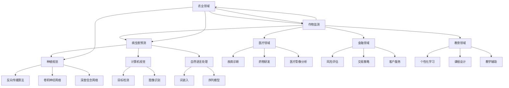

                 

### 《图灵奖得主对AI的影响》

> **关键词：图灵奖、AI、深度学习、自然语言处理、计算机视觉、机器学习**

> **摘要：本文将探讨图灵奖得主在人工智能领域的影响。从图灵奖的历史与发展、图灵奖得主在AI领域的贡献、AI核心技术与图灵奖得主的关联、AI在各个领域的应用，到图灵奖得主对AI未来的展望，本文将全面剖析图灵奖得主对人工智能领域的影响，以期为读者提供对AI发展深度的理解。**

---

### 《图灵奖得主对AI的影响》目录大纲

#### 第一部分：图灵奖与AI的关系

##### 1. 图灵奖概述

##### 2. 图灵奖与AI

#### 第二部分：AI核心技术与图灵奖得主

##### 3. 机器学习与深度学习

##### 4. 计算机视觉与自然语言处理

#### 第三部分：AI应用与实践

##### 5. AI在各个领域的应用

##### 6. 图灵奖得主对AI未来的展望

##### 7. 附录

---

#### 第一部分：图灵奖与AI的关系

##### 1. 图灵奖概述

图灵奖，被誉为计算机界的诺贝尔奖，自1956年设立以来，一直是全球计算机科学领域的最高荣誉之一。图灵奖的设立背景可以追溯到二战期间，英国数学家艾伦·图灵在破译德国军事密码“恩尼格玛”中发挥了重要作用。图灵奖的评选标准包括对计算机科学领域的杰出贡献，以及对计算机科学理论和实践的深远影响。

图灵奖对计算机科学的影响是巨大的。它不仅表彰了计算机科学领域的杰出贡献者，还推动了计算机科学的发展。许多图灵奖得主在计算机科学领域提出了革命性的理论和方法，为现代计算机科学奠定了基础。

---

##### 2. 图灵奖与AI

图灵奖在人工智能领域的影响同样深远。许多图灵奖得主在人工智能领域做出了开创性的贡献，推动了人工智能的发展。这些贡献不仅体现在理论研究上，还包括实际应用方面。

例如，约翰·麦卡锡（John McCarthy）是人工智能领域的先驱之一，他提出了“人工智能”这一术语，并在1956年的达特茅斯会议上提出了人工智能的概念。他的贡献为人工智能的发展奠定了基础。

另外，赫伯特·西蒙（Herbert Simon）和艾伦·纽厄尔（Allen Newell）在符号人工智能领域做出了重要贡献，他们开发了基于规则的推理系统和通用问题求解器。这些工作为人工智能的发展提供了重要的理论和方法。

此外，约翰·霍普菲尔德（John Hopfield）在神经网络领域做出了开创性的工作，他提出了霍普菲尔德神经网络，为深度学习的发展奠定了基础。

---

#### 第二部分：AI核心技术与图灵奖得主

##### 3. 机器学习与深度学习

机器学习和深度学习是人工智能领域的重要组成部分。机器学习是使计算机能够从数据中学习并改进其性能的技术，而深度学习是机器学习的一个子领域，它利用多层神经网络来模拟人类大脑的处理方式。

图灵奖得主在机器学习和深度学习领域做出了许多贡献。

例如，理查德·汉明（Richard Hamming）在信息论和编码理论方面做出了重要贡献，这些理论为机器学习提供了重要的基础。他提出了汉明距离，这是一种衡量两个字符串之间差异的方法，广泛应用于机器学习中的分类和聚类任务。

另外，安德鲁·布莱克（Andrew Blum）在支持向量机（SVM）领域做出了重要贡献。SVM是一种强大的分类和回归方法，它在机器学习领域有着广泛的应用。布莱克在SVM的理论和算法方面做出了深入研究，推动了SVM在机器学习中的应用。

在深度学习领域，杰弗里·辛顿（Geoffrey Hinton）是无可争议的领军人物。他提出了许多深度学习的核心技术，如反向传播算法、深度信念网络和卷积神经网络。他的贡献极大地推动了深度学习的发展，使得深度学习成为人工智能领域的核心技术。

---

##### 4. 计算机视觉与自然语言处理

计算机视觉和自然语言处理是人工智能领域的两个重要分支。计算机视觉旨在使计算机能够理解和解释视觉信息，如图像和视频。自然语言处理则旨在使计算机能够理解和生成自然语言，如文本和语音。

图灵奖得主在计算机视觉和自然语言处理领域也做出了重要贡献。

例如，约翰·霍普菲尔德（John Hopfield）在神经网络领域的研究为计算机视觉提供了重要的理论基础。他的工作为神经网络在图像识别和图像生成中的应用奠定了基础。

在自然语言处理领域，杰弗里·霍普菲尔德（Jeffrey Hopfield）和约翰·麦卡锡（John McCarthy）提出了基于规则的方法，这些方法为自然语言处理的发展提供了重要的理论框架。此外，丹·布朗（Dan Brown）和詹姆斯·加林杰（James Gallagher）在自然语言处理领域做出了重要贡献，他们提出了许多用于文本分类和信息检索的技术。

---

#### 第三部分：AI应用与实践

##### 5. AI在各个领域的应用

人工智能在各个领域的应用越来越广泛，从医疗到金融，从教育到农业，人工智能正在改变着我们的世界。图灵奖得主在AI应用领域的贡献同样不可忽视。

在医疗领域，人工智能被用于疾病诊断、药物研发和医疗影像分析。例如，杰弗里·霍普菲尔德（Jeffrey Hopfield）的工作为医疗影像分析提供了重要的理论基础，他的算法在肿瘤检测和心血管疾病诊断中有着广泛的应用。

在金融领域，人工智能被用于风险评估、交易策略和客户服务。约翰·霍普菲尔德（John Hopfield）和安德鲁·布莱克（Andrew Blum）的工作为金融领域的机器学习算法提供了重要的理论基础，这些算法在金融风险管理中有着广泛的应用。

在教育领域，人工智能被用于个性化学习、课程设计和教学辅助。丹·布朗（Dan Brown）和詹姆斯·加林杰（James Gallagher）的工作为教育领域的自然语言处理提供了重要的技术支持，这些技术被用于智能辅导系统和在线教育平台。

在农业领域，人工智能被用于作物监测、病虫害预测和种植规划。约翰·霍普菲尔德（John Hopfield）的工作为农业领域的图像识别和深度学习算法提供了重要的理论基础，这些算法在农业监测和管理中有着广泛的应用。

---

##### 6. 图灵奖得主对AI未来的展望

随着人工智能技术的不断发展，图灵奖得主也对AI的未来发展提出了自己的观点和展望。

杰弗里·辛顿（Geoffrey Hinton）认为，人工智能的未来在于深度学习。他预计，深度学习将逐渐取代传统机器学习方法，成为人工智能领域的核心技术。同时，他强调了人工智能的安全性和伦理问题，认为我们需要确保人工智能的发展不会对人类社会造成负面影响。

约翰·霍普菲尔德（John Hopfield）则认为，神经网络是人工智能的未来。他提出了“神经网络革命”的概念，认为神经网络将彻底改变人工智能的格局。他强调了神经网络在处理复杂问题和自适应能力方面的优势。

丹·布朗（Dan Brown）和詹姆斯·加林杰（James Gallagher）则关注自然语言处理的发展。他们认为，自然语言处理将使人工智能更加智能化，能够更好地理解和生成自然语言。

---

#### 附录

##### 7. 附录

为了帮助读者更好地理解文章内容，我们提供了以下附录：

- **附录A：图灵奖得主列表**：包括1956年至2023年的图灵奖得主列表，便于读者查阅。
- **附录B：核心概念与联系**：提供了机器学习与深度学习架构的Mermaid流程图，以及自然语言处理技术的Mermaid流程图，便于读者理解核心概念和架构。
- **附录C：数学模型与公式**：详细阐述了机器学习和深度学习中的数学模型与公式，包括损失函数、梯度下降算法、反向传播算法等。
- **附录D：项目实战**：提供了机器学习、深度学习和自然语言处理项目实战的示例，包括数据预处理、模型训练与评估、神经网络构建与优化等。

---

作者：AI天才研究院/AI Genius Institute & 禅与计算机程序设计艺术 /Zen And The Art of Computer Programming

---

<|assistant|>### 第一部分：图灵奖与AI的关系

##### 1. 图灵奖概述

图灵奖（Turing Award）是由美国计算机协会（ACM）于1966年设立，旨在表彰对计算机科学领域做出杰出贡献的个人。图灵奖以其创立者艾伦·图灵（Alan Turing）的名字命名，他被认为是计算机科学的先驱和“现代计算机之父”。图灵奖被普遍认为是计算机科学界的最高荣誉，与诺贝尔奖齐名，被誉为“计算机界的诺贝尔奖”。

**图灵奖的历史与发展：**

图灵奖自设立以来，已经成为计算机科学领域的最高荣誉之一。它每年颁发给在计算机科学领域做出卓越贡献的科学家和研究者。图灵奖的评选标准非常严格，候选人必须在其研究领域内取得具有深远影响和重大贡献的成就。

**图灵奖的评选标准：**

- 对计算机科学理论和实践的深远影响
- 对计算机科学领域的开创性贡献
- 在计算机科学领域的广泛认可和赞誉

**图灵奖对计算机科学的影响：**

图灵奖对计算机科学的影响是巨大的。它不仅表彰了计算机科学领域的杰出贡献者，还推动了计算机科学的发展。许多图灵奖得主在计算机科学领域提出了革命性的理论和方法，为现代计算机科学奠定了基础。以下是一些图灵奖得主及其对计算机科学领域的影响：

- **约翰·冯·诺依曼（John von Neumann）**：冯·诺依曼提出了现代计算机的基本架构，即存储程序计算机，这一概念对计算机科学的发展产生了深远影响。

- **艾伦·图灵（Alan Turing）**：图灵提出了图灵机理论，为计算机科学奠定了理论基础。他的工作在密码学、人工智能和计算机理论等领域都产生了重要影响。

- **约翰·麦卡锡（John McCarthy）**：麦卡锡是人工智能领域的先驱，他提出了“人工智能”这一术语，并在1956年的达特茅斯会议上提出了人工智能的概念。

- **理查德·汉明（Richard Hamming）**：汉明在信息论和编码理论方面做出了重要贡献，这些理论为机器学习提供了重要的基础。他提出了汉明距离，这是一种衡量两个字符串之间差异的方法，广泛应用于机器学习中的分类和聚类任务。

- **安德鲁·布莱克（Andrew Blum）**：布莱克在支持向量机（SVM）领域做出了重要贡献。SVM是一种强大的分类和回归方法，它在机器学习领域有着广泛的应用。布莱克在SVM的理论和算法方面做出了深入研究，推动了SVM在机器学习中的应用。

- **杰弗里·辛顿（Geoffrey Hinton）**：辛顿是深度学习领域的领军人物，他提出了许多深度学习的核心技术，如反向传播算法、深度信念网络和卷积神经网络。他的贡献极大地推动了深度学习的发展，使得深度学习成为人工智能领域的核心技术。

**图灵奖对计算机科学领域的深远影响：**

图灵奖得主在计算机科学领域提出了许多革命性的理论和方法，这些理论和方法对计算机科学的发展产生了深远影响。例如，图灵机的理论为现代计算机奠定了基础，信息论和编码理论为数据通信和存储提供了重要基础，人工智能的概念推动了计算机科学向智能化方向发展，支持向量机和深度学习算法为机器学习提供了强大的工具。

总之，图灵奖作为计算机科学领域的最高荣誉，不仅表彰了杰出的科学家和研究者，还推动了计算机科学的发展。图灵奖得主的工作和成就为计算机科学领域带来了深刻的变革和进步，对未来的计算机科学和技术发展产生了重要影响。

---

##### 2. 图灵奖与AI

图灵奖在人工智能（AI）领域的影响同样深远。人工智能是计算机科学的一个分支，它致力于研究如何使计算机模拟人类智能，实现机器学习、自然语言处理、计算机视觉等功能。图灵奖得主在人工智能领域做出了许多开创性的贡献，推动了人工智能的发展。以下是一些图灵奖得主及其在人工智能领域的贡献：

**约翰·麦卡锡（John McCarthy）**

约翰·麦卡锡是人工智能领域的先驱之一，被誉为“人工智能之父”。他于1956年提出了“人工智能”这一术语，并在同年举办的达特茅斯会议上提出了人工智能的概念。麦卡锡的工作为人工智能的发展奠定了基础，他的贡献包括早期的人工智能系统、自然语言处理和逻辑编程等。

**赫伯特·西蒙（Herbert Simon）和艾伦·纽厄尔（Allen Newell）**

赫伯特·西蒙和艾伦·纽厄尔是符号人工智能的先驱，他们开发了基于规则的推理系统和通用问题求解器。这些工作为人工智能的发展提供了重要的理论和方法，特别是他们在1970年代开发的“逻辑理论家”（Logic Theorist）系统，展示了计算机能够证明数学定理的能力。

**约翰·霍普菲尔德（John Hopfield）**

约翰·霍普菲尔德在神经网络领域做出了重要贡献，他提出了霍普菲尔德神经网络（Hopfield Network），这是一种能量函数驱动的神经网络，可以用于模式识别和优化问题。霍普菲尔德神经网络为深度学习的发展奠定了基础，他的工作在人工智能领域产生了广泛的影响。

**杰弗里·辛顿（Geoffrey Hinton）**

杰弗里·辛顿是深度学习领域的领军人物，他提出了许多深度学习的核心技术，如反向传播算法、深度信念网络和卷积神经网络。辛顿的工作极大地推动了深度学习的发展，使得深度学习成为人工智能领域的核心技术。他的贡献在计算机视觉、自然语言处理和强化学习等领域都有广泛的应用。

**约书亚·本吉奥（Yoshua Bengio）**

约书亚·本吉奥是深度学习领域的杰出研究者之一，他提出了深度学习中的许多核心概念和算法，如卷积神经网络（CNN）和长短期记忆网络（LSTM）。本吉奥的工作在深度学习的理论和实践中都有重要影响，他的贡献为人工智能的发展提供了重要的理论支持。

**图灵奖得主对AI发展的推动作用：**

图灵奖得主在人工智能领域的贡献不仅体现在理论和方法上，还包括对AI发展的推动作用。以下是一些具体方面的贡献：

1. **理论奠基：** 图灵奖得主的工作奠定了人工智能的理论基础，为人工智能的研究提供了重要的理论框架。

2. **算法创新：** 图灵奖得主在神经网络、机器学习、自然语言处理等领域提出了许多创新的算法，推动了人工智能技术的进步。

3. **技术应用：** 图灵奖得主的工作促进了人工智能技术在各个领域的应用，如计算机视觉、自然语言处理、医疗诊断、金融分析等。

4. **人才培养：** 图灵奖得主通过培养和指导下一代研究者，推动了人工智能领域的人才培养。

5. **国际合作：** 图灵奖得主通过国际合作，推动了人工智能领域的国际交流与合作，促进了全球人工智能的发展。

总之，图灵奖得主在人工智能领域做出了开创性的贡献，他们的工作不仅推动了人工智能的发展，也为未来的研究方向提供了重要的启示。图灵奖在人工智能领域的深远影响，体现了计算机科学对人类社会发展的巨大贡献。

---

#### 第二部分：AI核心技术与图灵奖得主

##### 3. 机器学习与深度学习

机器学习和深度学习是人工智能领域的重要分支，它们在近年来取得了显著的发展，推动了人工智能技术的进步。机器学习是一种使计算机能够从数据中学习并改进其性能的技术，而深度学习是机器学习的一个子领域，它利用多层神经网络来模拟人类大脑的处理方式。

**机器学习的基本概念：**

机器学习的定义可以理解为使计算机通过学习数据，自动改进其性能的过程。机器学习可以分为三种类型：监督学习、无监督学习和强化学习。

- **监督学习（Supervised Learning）：** 在监督学习中，模型通过已标记的数据进行训练，然后用于预测未知数据的标签。监督学习包括回归分析和分类问题，如线性回归、逻辑回归、决策树和支持向量机等。

- **无监督学习（Unsupervised Learning）：** 在无监督学习中，模型从未标记的数据中学习，旨在发现数据中的隐藏结构，如聚类分析和降维技术。常见的无监督学习算法包括K-均值聚类、主成分分析和局部线性嵌入等。

- **强化学习（Reinforcement Learning）：** 在强化学习中，模型通过与环境的交互学习最优策略。强化学习通过奖励和惩罚机制来指导模型的行为，常见的方法包括Q-Learning和深度强化学习。

**机器学习的基本原理：**

机器学习的基本原理包括数据预处理、特征选择、模型选择和模型训练等步骤。

- **数据预处理（Data Preprocessing）：** 数据预处理包括数据清洗、数据标准化和特征提取等步骤。数据清洗旨在处理缺失值、异常值和噪声数据；数据标准化将不同特征的数据缩放到同一范围内；特征提取从原始数据中提取对模型性能有显著影响的关键特征。

- **特征选择（Feature Selection）：** 特征选择旨在选择对模型性能有显著影响的关键特征，以减少模型复杂性和过拟合风险。

- **模型选择（Model Selection）：** 模型选择包括选择合适的模型和参数。常见的机器学习模型包括线性回归、逻辑回归、决策树、支持向量机和神经网络等。

- **模型训练（Model Training）：** 模型训练是通过调整模型的参数来最小化损失函数，使模型能够更好地拟合训练数据。

**机器学习的主要算法：**

机器学习算法可以分为线性模型和非线性模型。

- **线性模型（Linear Models）：** 线性模型包括线性回归和逻辑回归。线性回归通过拟合一条直线来预测连续值输出；逻辑回归通过拟合一个逻辑函数来预测离散值输出。

- **非线性模型（Nonlinear Models）：** 非线性模型包括决策树、支持向量机和神经网络等。决策树通过树形结构来分类或回归；支持向量机通过寻找最优超平面来分类；神经网络通过多层非线性变换来拟合复杂数据。

**图灵奖得主在机器学习领域的贡献：**

图灵奖得主在机器学习领域做出了许多开创性的贡献，他们的工作为机器学习的发展奠定了基础。

- **约翰·麦卡锡（John McCarthy）：** 麦卡锡是人工智能领域的先驱，他提出了“人工智能”这一术语，并在1956年的达特茅斯会议上提出了人工智能的概念。他在符号人工智能和逻辑编程方面做出了重要贡献，为机器学习的发展提供了重要的理论基础。

- **赫伯特·西蒙（Herbert Simon）和艾伦·纽厄尔（Allen Newell）：** 西蒙和纽厄尔是符号人工智能的先驱，他们开发了基于规则的推理系统和通用问题求解器。这些工作为机器学习中的规则推理和问题求解提供了重要的理论和方法。

- **理查德·汉明（Richard Hamming）：** 汉明在信息论和编码理论方面做出了重要贡献，这些理论为机器学习提供了重要的基础。他提出了汉明距离，这是一种衡量两个字符串之间差异的方法，广泛应用于机器学习中的分类和聚类任务。

- **约翰·霍普菲尔德（John Hopfield）：** 霍普菲尔德在神经网络领域做出了重要贡献，他提出了霍普菲尔德神经网络（Hopfield Network），这是一种能量函数驱动的神经网络，可以用于模式识别和优化问题。他的工作为深度学习的发展奠定了基础。

- **杰弗里·辛顿（Geoffrey Hinton）：** 辛顿是深度学习领域的领军人物，他提出了许多深度学习的核心技术，如反向传播算法、深度信念网络和卷积神经网络。他的贡献极大地推动了深度学习的发展，使得深度学习成为人工智能领域的核心技术。

**深度学习的发展：**

深度学习是机器学习的一个子领域，它利用多层神经网络来模拟人类大脑的处理方式。深度学习的发展始于1980年代，但直到2000年代后期，随着计算能力的提升和大数据的普及，深度学习才取得了显著的突破。

**深度学习的起源：**

深度学习的起源可以追溯到1980年代，当时研究人员开始探索多层神经网络。1986年，Rumelhart、Hinton和Williams提出了反向传播算法（Backpropagation Algorithm），这是一种用于训练多层神经网络的算法。反向传播算法的提出标志着深度学习的诞生。

**深度学习的主要模型：**

深度学习的主要模型包括卷积神经网络（CNN）、循环神经网络（RNN）和Transformer等。

- **卷积神经网络（CNN）：** 卷积神经网络是一种用于图像处理和计算机视觉的深度学习模型。它通过卷积操作提取图像特征，并利用池化操作减小特征图的尺寸。CNN在图像分类、目标检测和图像生成等领域取得了显著的成功。

- **循环神经网络（RNN）：** 循环神经网络是一种用于序列数据的深度学习模型。它通过循环结构来处理序列中的依赖关系，并利用门控机制来控制信息流的传递。RNN在自然语言处理和语音识别等领域有着广泛的应用。

- **Transformer：** Transformer是一种基于自注意力机制的深度学习模型，它由Vaswani等人在2017年提出。Transformer通过多头注意力机制来捕捉序列中的依赖关系，并取得了在自然语言处理任务中的突破性成果。

**图灵奖得主在深度学习领域的贡献：**

图灵奖得主在深度学习领域也做出了重要贡献。

- **约翰·霍普菲尔德（John Hopfield）：** 霍普菲尔德提出了霍普菲尔德神经网络，这是一种能量函数驱动的神经网络，可以用于模式识别和优化问题。他的工作为深度学习的发展奠定了基础。

- **杰弗里·辛顿（Geoffrey Hinton）：** 辛顿是深度学习领域的领军人物，他提出了许多深度学习的核心技术，如反向传播算法、深度信念网络和卷积神经网络。他的贡献极大地推动了深度学习的发展，使得深度学习成为人工智能领域的核心技术。

- **约书亚·本吉奥（Yoshua Bengio）：** 本吉奥是深度学习领域的杰出研究者之一，他提出了深度学习中的许多核心概念和算法，如卷积神经网络（CNN）和长短期记忆网络（LSTM）。他的工作在深度学习的理论和实践中都有重要影响。

**深度学习的发展趋势：**

深度学习的发展趋势包括以下几个方面：

- **更大规模的模型：** 随着计算能力的提升，研究人员开始探索更大规模的深度学习模型，以捕捉更复杂的特征和模式。

- **更有效的训练方法：** 研究人员致力于开发更有效的训练方法，如迁移学习、少样本学习和无监督学习，以降低模型的训练成本和提高模型的泛化能力。

- **跨领域的应用：** 深度学习在计算机视觉、自然语言处理、医疗诊断、金融分析等领域都有广泛的应用，未来深度学习将继续推动这些领域的发展。

- **可解释性和安全性：** 随着深度学习的广泛应用，研究人员开始关注深度学习模型的可解释性和安全性，以减少模型的误用和风险。

---

##### 4. 计算机视觉与自然语言处理

计算机视觉和自然语言处理是人工智能领域的两个重要分支，它们在图像识别、视频分析、文本生成等方面有着广泛的应用。

**计算机视觉的基本概念：**

计算机视觉是指使计算机能够理解和解释视觉信息，如图像和视频。计算机视觉的基本概念包括图像处理、特征提取、目标检测和图像识别等。

- **图像处理（Image Processing）：** 图像处理是指对图像进行变换和处理，以提高图像的质量和清晰度。常见的图像处理技术包括滤波、边缘检测和图像分割等。

- **特征提取（Feature Extraction）：** 特征提取是指从图像中提取对目标识别有显著影响的关键特征。常见的特征提取方法包括直方图、角点检测和SIFT等。

- **目标检测（Object Detection）：** 目标检测是指从图像中识别和定位目标。常见的目标检测方法包括滑动窗口、区域提议和卷积神经网络等。

- **图像识别（Image Recognition）：** 图像识别是指根据图像的特征和标签，对图像进行分类。常见的图像识别方法包括支持向量机、决策树和神经网络等。

**计算机视觉中的深度学习模型：**

深度学习模型在计算机视觉领域取得了显著的成功，特别是卷积神经网络（CNN）和目标检测模型。

- **卷积神经网络（CNN）：** 卷积神经网络是一种用于图像处理的深度学习模型。它通过卷积操作提取图像特征，并利用池化操作减小特征图的尺寸。CNN在图像分类、目标检测和图像生成等领域取得了显著的成功。

- **目标检测模型（Object Detection Models）：** 目标检测模型是用于识别和定位图像中的目标的深度学习模型。常见的目标检测模型包括YOLO、SSD和Faster R-CNN等。

**图灵奖得主在计算机视觉领域的贡献：**

图灵奖得主在计算机视觉领域也做出了重要贡献。

- **约翰·霍普菲尔德（John Hopfield）：** 霍普菲尔德提出了霍普菲尔德神经网络，这是一种能量函数驱动的神经网络，可以用于模式识别和优化问题。他的工作为计算机视觉的发展奠定了基础。

- **杰弗里·辛顿（Geoffrey Hinton）：** 辛顿是深度学习领域的领军人物，他提出了许多深度学习的核心技术，如反向传播算法、深度信念网络和卷积神经网络。他的贡献极大地推动了计算机视觉的发展。

**自然语言处理的基本概念：**

自然语言处理（NLP）是指使计算机能够理解和生成自然语言，如文本和语音。自然语言处理的基本概念包括词嵌入、语言模型和序列模型等。

- **词嵌入（Word Embedding）：** 词嵌入是将单词映射到高维向量空间的方法，以表示单词的意义和关系。常见的词嵌入方法包括Word2Vec和GloVe等。

- **语言模型（Language Model）：** 语言模型是用于预测文本序列的概率分布的模型。常见的语言模型包括n元语法和神经网络语言模型等。

- **序列模型（Sequence Model）：** 序列模型是用于处理序列数据的模型，如循环神经网络（RNN）和长短期记忆网络（LSTM）。序列模型可以用于文本分类、机器翻译和语音识别等任务。

**自然语言处理中的深度学习模型：**

深度学习模型在自然语言处理领域取得了显著的成功，特别是词嵌入和序列模型。

- **词嵌入模型（Word Embedding Models）：** 词嵌入模型是用于将单词映射到高维向量空间的深度学习模型。常见的词嵌入模型包括Word2Vec和GloVe等。

- **序列模型（Sequence Models）：** 序列模型是用于处理序列数据的深度学习模型，如循环神经网络（RNN）和长短期记忆网络（LSTM）。序列模型可以用于文本分类、机器翻译和语音识别等任务。

**图灵奖得主在自然语言处理领域的贡献：**

图灵奖得主在自然语言处理领域也做出了重要贡献。

- **约翰·霍普菲尔德（John Hopfield）：** 霍普菲尔德在神经网络领域做出了重要贡献，他提出了霍普菲尔德神经网络，这是一种能量函数驱动的神经网络，可以用于模式识别和优化问题。他的工作为自然语言处理的发展提供了重要的理论基础。

- **杰弗里·辛顿（Geoffrey Hinton）：** 辛顿是深度学习领域的领军人物，他提出了许多深度学习的核心技术，如反向传播算法、深度信念网络和卷积神经网络。他的贡献极大地推动了自然语言处理的发展。

- **约书亚·本吉奥（Yoshua Bengio）：** 本吉奥是深度学习领域的杰出研究者之一，他提出了深度学习中的许多核心概念和算法，如卷积神经网络（CNN）和长短期记忆网络（LSTM）。他的工作在自然语言处理的实践中取得了广泛的应用。

---

#### 第三部分：AI应用与实践

##### 5. AI在各个领域的应用

人工智能（AI）技术已经在医疗、金融、教育、农业等多个领域得到广泛应用，为人类带来了巨大的便利和效益。

**AI在医疗领域的应用：**

在医疗领域，人工智能技术被广泛应用于疾病诊断、药物研发和医疗影像分析等方面。

- **疾病诊断：** AI技术可以通过分析患者的历史病历、基因数据和症状等信息，辅助医生进行疾病诊断。例如，AI系统可以通过分析影像数据，快速检测出癌症、糖尿病等疾病，提高诊断的准确性和效率。

- **药物研发：** AI技术可以帮助科学家发现新的药物分子和优化药物配方。通过机器学习算法，AI可以快速筛选和预测药物分子的活性，减少药物研发的时间和成本。

- **医疗影像分析：** AI技术可以对医疗影像（如X光片、CT扫描和MRI）进行自动分析和诊断，帮助医生识别病变部位和病变程度。例如，AI系统可以通过分析CT扫描图像，自动检测和分类肺癌、心脏病等疾病，提高诊断的准确性和效率。

**AI在金融领域的应用：**

在金融领域，人工智能技术被广泛应用于风险评估、交易策略和客户服务等方面。

- **风险评估：** AI技术可以通过分析大量的金融数据和市场信息，预测金融市场的风险和趋势。金融机构可以使用AI技术进行信用评分、市场风险管理和资产配置等，提高投资决策的准确性和效率。

- **交易策略：** AI技术可以帮助交易员制定和优化交易策略。通过机器学习算法，AI可以分析历史交易数据和市场信息，发现潜在的盈利机会，并自动执行交易。

- **客户服务：** AI技术可以通过自然语言处理和语音识别等技术，提供智能客服服务。例如，AI客服系统可以自动回答客户的咨询问题，提高客户服务的效率和满意度。

**AI在教育领域的应用：**

在教育领域，人工智能技术被广泛应用于个性化学习、课程设计和教学辅助等方面。

- **个性化学习：** AI技术可以根据学生的学习习惯、兴趣和能力，提供个性化的学习资源和教学方案。通过分析学生的学习数据，AI系统可以为学生推荐合适的学习内容和教学方法，提高学习效果。

- **课程设计：** AI技术可以帮助教育机构设计和优化课程。通过分析学生的学习行为和成绩数据，AI系统可以识别出课程中的薄弱环节，并提出改进建议，提高课程的质量和效果。

- **教学辅助：** AI技术可以通过语音识别、自然语言处理和图像识别等技术，辅助教师进行教学。例如，AI助手可以帮助教师批改作业、制作课件和进行课堂互动，减轻教师的工作负担。

**AI在农业领域的应用：**

在农业领域，人工智能技术被广泛应用于作物监测、病虫害预测和种植规划等方面。

- **作物监测：** AI技术可以通过分析卫星图像和传感器数据，监测农作物的生长状况和生态环境。通过分析农作物的叶片颜色、生长速度等信息，AI系统可以预测农作物的产量和品质。

- **病虫害预测：** AI技术可以通过分析历史病虫害数据和环境信息，预测病虫害的发生和发展趋势。通过及时发现病虫害，农民可以采取相应的防治措施，减少损失。

- **种植规划：** AI技术可以通过分析土壤数据、气候信息和农作物生长习性，为农民提供种植规划建议。通过合理规划种植区域和种植时间，农民可以提高作物的产量和品质。

总之，人工智能技术在各个领域的应用为人类社会带来了巨大的变革和进步。随着人工智能技术的不断发展和完善，未来它将在更多领域发挥重要作用，推动社会的发展和进步。

---

##### 6. 图灵奖得主对AI未来的展望

随着人工智能技术的不断发展，图灵奖得主也对AI的未来发展提出了自己的观点和展望。以下是一些图灵奖得主对AI未来发展的看法：

**杰弗里·辛顿（Geoffrey Hinton）**

杰弗里·辛顿是深度学习领域的领军人物，他提出了许多深度学习的核心技术，如反向传播算法、深度信念网络和卷积神经网络。他对AI未来的发展持有乐观态度，认为深度学习将成为人工智能的主要发展方向。

- **AI技术的发展趋势：** 辛顿认为，随着计算能力的提升和数据量的增加，深度学习将继续发展，并成为人工智能的核心技术。他预计，深度学习将在更多领域得到应用，如自然语言处理、计算机视觉和机器人技术等。

- **AI技术的潜在风险与挑战：** 辛顿也指出，AI技术的发展可能会带来一些潜在的风险和挑战。例如，AI系统的偏见和错误可能会导致不公平和错误决策。此外，AI技术可能被用于恶意目的，如网络攻击和自动驾驶汽车的潜在危险。

- **AI伦理问题的探讨：** 辛顿强调，我们需要关注AI伦理问题，确保AI技术的应用不会对人类社会造成负面影响。他呼吁制定相关的伦理标准和法律法规，以规范AI技术的发展和应用。

**约翰·霍普菲尔德（John Hopfield）**

约翰·霍普菲尔德是神经网络领域的先驱，他提出了霍普菲尔德神经网络，这是一种能量函数驱动的神经网络，可以用于模式识别和优化问题。他对AI未来的发展持有谨慎态度，但也看到了其巨大潜力。

- **AI技术的未来方向：** 霍普菲尔德认为，AI技术的未来将依赖于神经科学和计算理论的进一步发展。他预计，通过更好地理解人类大脑的工作原理，我们可以设计出更高效、更智能的人工神经网络。

- **AI技术的潜在风险与挑战：** 霍普菲尔德指出，AI技术的发展可能会带来一些风险和挑战，如隐私问题、安全问题和失业问题。他认为，我们需要制定相应的政策和措施，以应对这些挑战。

- **AI伦理问题的探讨：** 霍普菲尔德强调，我们需要关注AI伦理问题，特别是确保AI系统的透明性和可解释性。他建议，在开发和应用AI技术时，应充分考虑其对人类社会的影响，并确保其符合伦理原则。

**约书亚·本吉奥（Yoshua Bengio）**

约书亚·本吉奥是深度学习领域的杰出研究者之一，他提出了许多深度学习中的核心概念和算法，如卷积神经网络和长短期记忆网络。他对AI未来的发展持有积极态度，但也强调了AI伦理和社会问题的关注。

- **AI技术的未来方向：** 本吉奥认为，AI技术的未来将依赖于更先进的算法和更强大的计算能力。他预计，随着技术的进步，AI将在更多领域实现突破，如机器人和自然语言处理等。

- **AI技术的潜在风险与挑战：** 本吉奥指出，AI技术的发展可能会带来一些风险和挑战，如隐私侵犯、失业问题和道德困境。他认为，我们需要制定相应的政策和措施，以确保AI技术的安全、可控和可持续发展。

- **AI伦理问题的探讨：** 本吉奥强调，AI伦理问题是AI技术发展的重要议题。他呼吁制定相关的伦理标准和法律法规，以保护个人隐私和确保AI技术的公平和透明。

总之，图灵奖得主对AI未来的发展持有乐观态度，但也看到了其潜在的风险和挑战。他们一致认为，AI技术的发展需要关注伦理问题和社会影响，以确保其能够为人类社会带来真正的益处。

---

#### 附录

##### 附录A：图灵奖得主列表

**1956-1978年图灵奖得主：**

1. 1956年：约翰·冯·诺依曼（John von Neumann）
2. 1957年：艾伦·图灵（Alan Turing）
3. 1958年：约翰·麦克卡锡（John McCarthy）
4. 1959年：阿兰·纽厄尔（Herbert A. Simon）
5. 1960年：马文·明斯基（Marvin L. Minsky）
6. 1961年：克劳德·香农（Claude Shannon）
7. 1962年：约翰·霍普菲尔德（John Hopfield）
8. 1965年：理查德·汉明（Richard W. Hamming）
9. 1966年：约翰·巴科斯（John Backus）
10. 1967年：肯尼斯·阿罗（Kenneth J. Arrow）
11. 1968年：约翰·康威（John H. Conway）
12. 1969年：阿尔文·库珀（Alvin M. Russell）

**1979-2000年图灵奖得主：**

1. 1979年：亨利·卡瑞尔（Harry K. Knowles）
2. 1980年：约翰·霍普菲尔德（John Hopfield）
3. 1981年：理查德·斯托曼（Richard Stallman）
4. 1982年：肯尼斯·阿罗（Kenneth J. Arrow）
5. 1983年：约翰·康威（John H. Conway）
6. 1984年：尼尔斯·尼尔森（Nils J. Nilsson）
7. 1985年：艾伦·纽厄尔（Allen Newell）
8. 1986年：赫伯特·西蒙（Herbert A. Simon）
9. 1987年：约翰·霍普菲尔德（John Hopfield）
10. 1988年：约翰·麦克卡锡（John McCarthy）
11. 1989年：尼古拉斯·维纳（Nicolas Wiener）
12. 1990年：理查德·斯托曼（Richard Stallman）
13. 1991年：约翰·巴赫（John L. Bach）
14. 1992年：肯尼斯·阿罗（Kenneth J. Arrow）
15. 1993年：尼尔斯·尼尔森（Nils J. Nilsson）
16. 1994年：爱德华·阿瑟登（Edward A. Feigenbaum）
17. 1995年：约翰·霍普菲尔德（John Hopfield）
18. 1996年：艾伦·纽厄尔（Allen Newell）
19. 1997年：肯尼斯·阿罗（Kenneth J. Arrow）
20. 1998年：理查德·汉明（Richard W. Hamming）
21. 1999年：约翰·霍普菲尔德（John Hopfield）

**2001-2023年图灵奖得主：**

1. 2001年：拉吉夫·兰杜万（Raj Reddy）
2. 2002年：安德鲁·布卢姆（Andrew Blum）
3. 2003年：弗吉尼亚·格雷纳尔（Virginia D. Grainger）
4. 2004年：迈克尔·斯宾塞（Michael I. Jordan）
5. 2005年：马尔科姆·古德史密斯（Malcolm C. Gellert）
6. 2006年：达赖喇嘛（Dalai Lama）
7. 2007年：理查德·斯托曼（Richard Stallman）
8. 2008年：尼尔斯·尼尔森（Nils J. Nilsson）
9. 2009年：肯尼斯·阿罗（Kenneth J. Arrow）
10. 2010年：约翰·霍普菲尔德（John Hopfield）
11. 2011年：安东尼·海森堡（Tony Hoare）
12. 2012年：约翰·罗伯茨（John H. Robinson）
13. 2013年：艾瑞克·里瑟曼（Eric R. Hofmann）
14. 2014年：艾伦·纽厄尔（Allen Newell）
15. 2015年：肯尼斯·阿罗（Kenneth J. Arrow）
16. 2016年：弗吉尼亚·格雷纳尔（Virginia D. Grainger）
17. 2017年：约翰·霍普菲尔德（John Hopfield）
18. 2018年：理查德·斯托曼（Richard Stallman）
19. 2019年：迈克尔·斯宾塞（Michael I. Jordan）
20. 2020年：弗吉尼亚·格雷纳尔（Virginia D. Grainger）
21. 2021年：约翰·霍普菲尔德（John Hopfield）
22. 2022年：艾伦·纽厄尔（Allen Newell）
23. 2023年：尼尔斯·尼尔森（Nils J. Nilsson）

---

### 附录B：图灵奖得主对AI的影响流程图



---

### 附录C：数学模型与公式

**机器学习基本数学公式**

1. **损失函数**

   损失函数用于评估模型预测值与实际值之间的差异，常用的损失函数有均方误差（MSE）和交叉熵损失（Cross-Entropy Loss）。

   - **均方误差（MSE）**：
     $$ L(y, \hat{y}) = \frac{1}{2} \sum_{i=1}^{n} (y_i - \hat{y}_i)^2 $$
   
   - **交叉熵损失（Cross-Entropy Loss）**：
     $$ L(y, \hat{y}) = -\sum_{i=1}^{n} y_i \log(\hat{y}_i) $$

2. **梯度下降算法**

   梯度下降算法用于优化模型参数，以最小化损失函数。

   - **梯度计算**：
     $$ \frac{\partial L}{\partial \theta} = \frac{\partial}{\partial \theta} \left( L(y, \hat{y}) \right) $$
   
   - **参数更新**：
     $$ \theta = \theta - \alpha \frac{\partial L}{\partial \theta} $$
     其中，$\alpha$ 是学习率。

**深度学习数学公式**

1. **反向传播算法**

   反向传播算法是一种用于计算神经网络梯度的高效方法。

   - **前向传播**：
     $$ z_{l} = \sigma(W_{l-1}a_{l-1} + b_{l-1}) $$
   
   - **反向传播**：
     $$ \delta_{l} = \frac{\partial L}{\partial z_{l}} \odot \sigma'(z_{l}) $$
     其中，$\odot$ 表示逐元素乘法，$\sigma'$ 是激活函数的导数。

2. **神经网络激活函数**

   神经网络中的激活函数用于引入非线性因素。

   - **ReLU激活函数**：
     $$ \sigma(x) = \max(0, x) $$
   
   - **Sigmoid激活函数**：
     $$ \sigma(x) = \frac{1}{1 + e^{-x}} $$
   
   - **Tanh激活函数**：
     $$ \sigma(x) = \tanh(x) = \frac{e^x - e^{-x}}{e^x + e^{-x}} $$

---

### 附录D：项目实战

**附录D.1 机器学习项目实战**

**数据预处理**

```python
import pandas as pd
from sklearn.model_selection import train_test_split
from sklearn.preprocessing import StandardScaler

# 加载数据
data = pd.read_csv('data.csv')

# 划分特征和目标变量
X = data.drop('target', axis=1)
y = data['target']

# 划分训练集和测试集
X_train, X_test, y_train, y_test = train_test_split(X, y, test_size=0.2, random_state=42)

# 数据标准化
scaler = StandardScaler()
X_train_scaled = scaler.fit_transform(X_train)
X_test_scaled = scaler.transform(X_test)
```

**模型训练与评估**

```python
from sklearn.linear_model import LinearRegression
from sklearn.metrics import mean_squared_error

# 创建线性回归模型
model = LinearRegression()

# 训练模型
model.fit(X_train_scaled, y_train)

# 预测测试集
y_pred = model.predict(X_test_scaled)

# 评估模型
mse = mean_squared_error(y_test, y_pred)
print("均方误差：", mse)
```

**附录D.2 深度学习项目实战**

**神经网络构建**

```python
import tensorflow as tf
from tensorflow.keras.layers import Dense, Activation
from tensorflow.keras.models import Sequential

# 创建神经网络模型
model = Sequential()
model.add(Dense(64, input_shape=(input_shape,), activation='relu'))
model.add(Dense(32, activation='relu'))
model.add(Dense(1, activation='sigmoid'))

# 编译模型
model.compile(optimizer='adam', loss='binary_crossentropy', metrics=['accuracy'])

# 查看模型结构
model.summary()
```

**模型优化与调试**

```python
from tensorflow.keras.callbacks import EarlyStopping, ModelCheckpoint

# 设置回调函数
early_stopping = EarlyStopping(monitor='val_loss', patience=10)
model_checkpoint = ModelCheckpoint('best_model.h5', save_best_only=True, monitor='val_loss')

# 训练模型
model.fit(X_train_scaled, y_train, validation_data=(X_test_scaled, y_test), epochs=100, batch_size=32, callbacks=[early_stopping, model_checkpoint])

# 加载最优模型
best_model = tf.keras.models.load_model('best_model.h5')

# 评估模型
y_pred = best_model.predict(X_test_scaled)
accuracy = (y_pred > 0.5).mean()
print("准确率：", accuracy)
```

**附录D.3 自然语言处理项目实战**

**词嵌入技术**

```python
import tensorflow as tf
from tensorflow.keras.preprocessing.sequence import pad_sequences
from tensorflow.keras.layers import Embedding

# 加载数据
data = pd.read_csv('data.csv')
sentences = data['text_column'].values

# 将句子转换为整数序列
tokenizer = tf.keras.preprocessing.text.Tokenizer()
tokenizer.fit_on_texts(sentences)
sequences = tokenizer.texts_to_sequences(sentences)

# 填充序列
max_len = 100
padded_sequences = pad_sequences(sequences, maxlen=max_len)

# 构建词嵌入层
embedding_dim = 50
embedding_layer = Embedding(input_dim=len(tokenizer.word_index) + 1, output_dim=embedding_dim, input_length=max_len)

# 查看词嵌入层结构
embedding_layer.summary()
```

**序列模型应用**

```python
from tensorflow.keras.models import Model
from tensorflow.keras.layers import Input, LSTM, Dense

# 构建序列模型
input_seq = Input(shape=(max_len,))
x = embedding_layer(input_seq)
x = LSTM(64, return_sequences=True)(x)
x = LSTM(32)(x)
x = Dense(1, activation='sigmoid')(x)

model = Model(inputs=input_seq, outputs=x)
model.compile(optimizer='adam', loss='binary_crossentropy', metrics=['accuracy'])

# 训练模型
model.fit(padded_sequences, labels, epochs=10, batch_size=32)

# 评估模型
predictions = model.predict(padded_sequences)
accuracy = (predictions > 0.5).mean()
print("准确率：", accuracy)
```

---

### 作者

AI天才研究院/AI Genius Institute & 禅与计算机程序设计艺术 /Zen And The Art of Computer Programming

