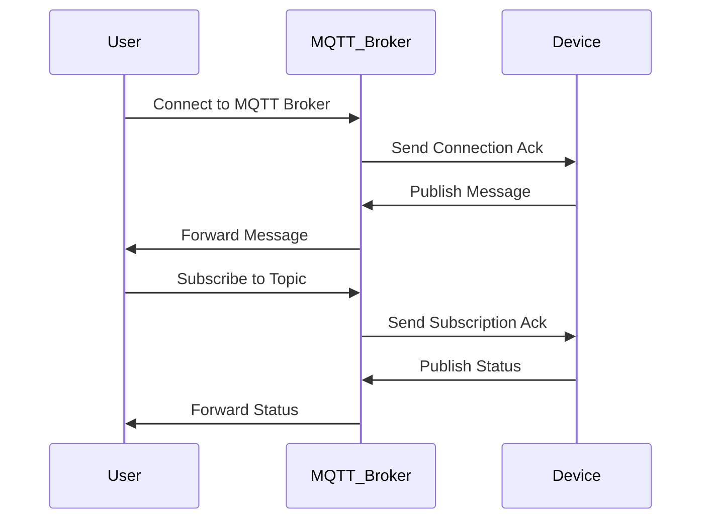
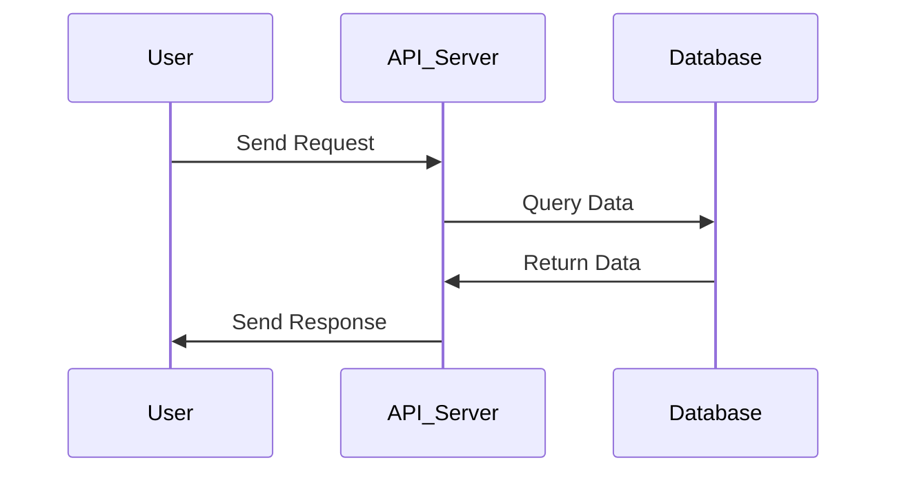
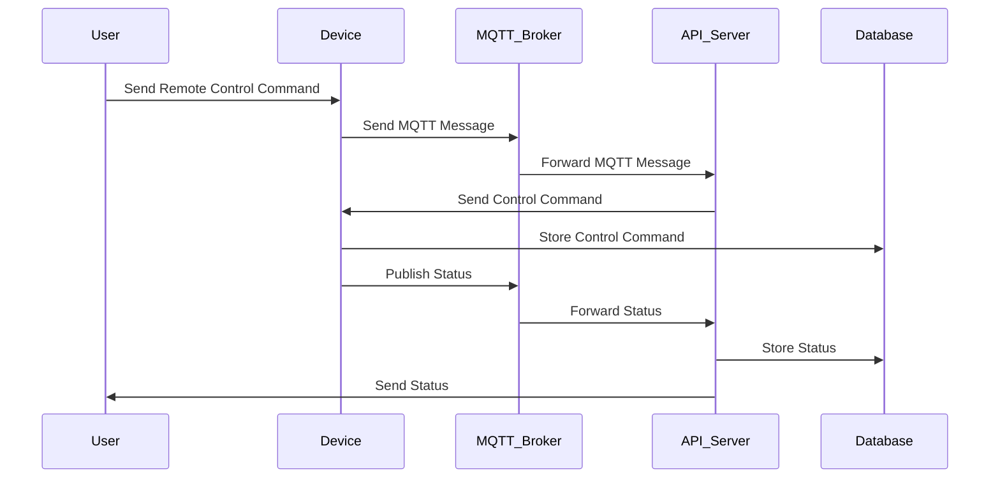

                 

### 引言

随着科技的飞速发展，智能家居（Smart Home）已成为现代家庭生活的重要组成部分。智能家居通过互联网、物联网（IoT）等技术，实现了家庭设备的智能化控制与互联互通，极大地提升了人们的生活品质和便捷性。然而，智能家居系统的实现离不开高效稳定的通信协议，这就引出了本文的核心话题——基于MQTT协议和RESTful API的智能家居设备远程控制与状态监测。

本文旨在深入探讨MQTT协议和RESTful API在智能家居设备远程控制与状态监测中的应用。我们将从以下几个方面展开讨论：

1. **智能家居概述**：介绍智能家居的发展背景、系统架构、技术特点及未来展望。
2. **MQTT协议介绍**：详细讲解MQTT协议的概述、核心特性、架构及应用场景。
3. **RESTful API概述**：介绍RESTful架构风格、基本原则、工作流程及应用实例。
4. **MQTT协议在智能家居中的应用**：探讨MQTT协议在智能家居设备通信、远程控制和状态监测中的实际应用。
5. **RESTful API在智能家居中的应用**：分析RESTful API在智能家居设备远程控制和状态监测中的应用。
6. **MQTT协议与RESTful API的集成应用**：探讨MQTT协议与RESTful API的集成需求、方法及实战案例。
7. **智能家居设备远程控制与状态监测系统实战**：详细描述智能家居设备远程控制与状态监测系统的设计、开发、测试、部署与维护。
8. **总结与展望**：总结本文的主要内容，并对智能家居设备远程控制与状态监测技术的发展趋势进行展望。

通过本文的逐步讲解，读者将全面了解基于MQTT协议和RESTful API的智能家居设备远程控制与状态监测的实现方法及其重要性。让我们一起探索这一充满前景的领域，为智能家居的未来发展贡献智慧。

### 关键词

智能家居、物联网、MQTT协议、RESTful API、远程控制、状态监测、系统集成、设备通信、软件开发、系统架构、技术展望。

### 摘要

本文深入探讨了基于MQTT协议和RESTful API的智能家居设备远程控制与状态监测的实现方法及其重要性。首先，介绍了智能家居的发展背景、系统架构和技术特点。接着，详细讲解了MQTT协议和RESTful API的基本概念、核心特性和应用场景。随后，分析了MQTT协议在智能家居设备通信、远程控制和状态监测中的应用，以及RESTful API在智能家居设备远程控制和状态监测中的应用。本文还探讨了MQTT协议与RESTful API的集成应用，并详细描述了智能家居设备远程控制与状态监测系统的设计、开发、测试、部署与维护。通过本文的研究，为智能家居设备远程控制与状态监测提供了实用的技术解决方案，并为未来的智能家居发展提供了有益的启示。

### 第一部分：智能家居网络协议基础

#### 第1章：智能家居概述

**1.1 智能家居的发展背景与趋势**

智能家居（Smart Home）这一概念最早可以追溯到20世纪80年代，当时主要是通过计算机技术对家庭设备进行简单的控制。随着物联网（Internet of Things，IoT）技术的发展，智能家居逐渐成为现实，并开始在全球范围内迅速普及。从智能家居的发展历程来看，它经历了从简单自动化控制到智能化、网络化的转变。当前，智能家居已成为现代家庭生活的重要组成部分，其发展背景与趋势可以从以下几个方面进行阐述：

1. **技术进步**：随着互联网、物联网、云计算、大数据等技术的快速发展，为智能家居的实现提供了强大的技术支持。智能传感器、无线通信、嵌入式系统等技术的进步，使得智能家居设备更加智能、便捷和高效。

2. **用户需求**：随着生活水平的提高，人们对生活品质的要求也越来越高。智能家居能够提供便捷、舒适和安全的家居环境，满足用户的个性化需求，因此得到了广泛的应用和推广。

3. **政策支持**：政府对于智能家居产业的支持也是其发展的重要推动力。许多国家和地区都出台了相关政策，鼓励智能家居的研究、开发和推广应用，为智能家居的发展创造了良好的政策环境。

4. **市场竞争**：随着智能家居市场的不断扩大，各大科技公司纷纷投入资源，研发智能家居产品和服务，推动智能家居产业的竞争和发展。市场需求的增加和技术的进步，进一步促进了智能家居的普及和应用。

**1.2 智能家居系统架构与组成部分**

智能家居系统通常由以下几个主要部分组成：

1. **设备层**：包括各种智能传感器、控制器、执行器等硬件设备，如智能门锁、智能灯光、智能空调、智能安防设备等。

2. **网络层**：负责连接设备层和控制层，实现设备之间的通信和数据交换。常见的网络技术有Wi-Fi、蓝牙、Zigbee、LoRa等。

3. **控制层**：包括智能网关、服务器、云计算平台等，负责对设备进行集中管理和控制，实现智能家居系统的智能调度和协同工作。

4. **应用层**：为用户提供友好的交互界面，实现用户与智能家居系统之间的交互。常见的应用层包括手机APP、网页端、语音助手等。

**1.3 智能家居的技术特点与优势**

智能家居技术具有以下特点与优势：

1. **智能互联**：智能家居设备之间能够实现智能互联，通过物联网技术实现设备之间的数据交换和协同工作，为用户提供更加智能化的家居体验。

2. **远程控制**：用户可以通过手机、电脑等终端设备，远程控制家庭设备的开关、温度、亮度等参数，实现智能家居设备的智能管理和控制。

3. **个性化定制**：根据用户的个性化需求，智能家居系统可以提供定制化的家居解决方案，如智能灯光调节、安防报警等，为用户提供更加舒适、便捷的生活环境。

4. **节能环保**：智能家居系统可以根据用户的实际需求，自动调整家庭设备的运行状态，实现节能环保，降低家庭能源消耗。

5. **安全可靠**：智能家居系统采用多种安全技术和协议，确保用户隐私和数据安全，提高家庭安全水平。

**1.4 智能家居的未来展望**

随着科技的不断进步和智能家居产业的快速发展，智能家居的未来前景十分广阔。以下是智能家居未来发展的几个趋势：

1. **智能化水平提升**：未来智能家居系统将更加智能化，通过人工智能、大数据等技术，实现更加精准、高效的家居控制和管理。

2. **系统集成化**：智能家居设备将实现更高程度的集成化，各个设备之间能够无缝协同，为用户提供更加便捷的家居体验。

3. **普及化**：随着成本的降低和技术的普及，智能家居将逐步走进千家万户，成为家庭生活的标配。

4. **生态化**：智能家居将形成完整的生态体系，包括设备制造商、技术服务提供商、平台运营商等，共同推动智能家居产业的健康发展。

5. **跨界融合**：智能家居将与智慧城市、智慧家庭等新兴领域进行跨界融合，为人们带来更加智能化、便捷化的生活体验。

总之，智能家居作为现代科技与生活需求相结合的产物，具有广阔的发展前景和巨大的市场潜力。随着技术的不断创新和市场的不断成熟，智能家居将引领未来家庭生活的新潮流。

#### 第2章：MQTT协议介绍

**2.1 MQTT协议概述**

MQTT（Message Queuing Telemetry Transport）协议是一种轻量级的消息队列传输协议，专门为受限环境（如嵌入式设备和物联网）设计，具有低功耗、低带宽、可靠传输等特点。MQTT协议由IBM于1999年首次提出，旨在解决远程监控和控制应用中的数据传输问题。经过多年的发展和优化，MQTT已成为物联网领域的事实标准之一。

MQTT协议的核心理念是发布/订阅（Publish/Subscribe）模式，也称为主题订阅（Topic Subscription）模式。在这种模式下，消息的生产者称为发布者（Publisher），消息的消费者称为订阅者（Subscriber）。发布者将消息发布到特定的主题（Topic），订阅者可以订阅一个或多个主题，从而接收与其订阅主题相关的消息。

**2.2 MQTT协议的核心特性**

MQTT协议具有以下核心特性：

1. **轻量级**：MQTT协议的数据格式简单，传输效率高，非常适合带宽受限和低功耗环境。

2. **发布/订阅模式**：通过主题订阅模式，实现消息的广播和过滤，降低了系统复杂度，提高了消息传输的效率。

3. **服务质量（QoS）**：MQTT协议支持三种服务质量等级（QoS Level 0、QoS Level 1、QoS Level 2），可以根据实际需求选择合适的QoS等级，确保消息的可靠传输。

4. **持久连接**：MQTT协议支持持久连接，客户端可以在断开连接后重新连接，继续接收未处理的消息，确保消息的连续性和完整性。

5. **简单易用**：MQTT协议实现简单，易于集成到各种设备和平台，具有广泛的应用场景。

**2.3 MQTT协议的架构与工作流程**

MQTT协议的架构主要包括三个部分：客户端（Client）、代理（Broker）和服务器（Server）。以下是MQTT协议的工作流程：

1. **连接建立**：客户端向代理发起连接请求，并携带用户名、密码、客户端标识（Client ID）等信息。代理验证客户端的身份和权限后，建立与客户端的连接。

2. **订阅主题**：客户端向代理订阅一个或多个主题，代理根据订阅信息，将相关主题的消息推送给客户端。

3. **发布消息**：客户端可以向代理发布消息，消息包含主题和消息内容。代理将消息发布到订阅该主题的客户端。

4. **消息确认**：根据服务质量（QoS）等级，客户端对收到的消息进行确认。如果QoS等级为1或2，客户端需要向代理发送消息确认（ACK）。

5. **断开连接**：客户端可以随时向代理发送断开连接请求，代理在收到断开请求后，关闭与客户端的连接。

**2.4 MQTT协议的应用场景**

MQTT协议广泛应用于物联网领域的各种场景，以下是几个典型的应用场景：

1. **智能家居**：MQTT协议可以用于智能家居设备的远程控制、状态监测和数据传输，实现设备之间的互联互通。

2. **工业自动化**：MQTT协议在工业自动化领域用于设备监控、数据采集和远程控制，提高生产效率和设备可靠性。

3. **智能交通**：MQTT协议在智能交通系统中用于车辆监控、路况监测和交通信号控制，实现智能交通管理。

4. **远程医疗**：MQTT协议在远程医疗领域用于设备监测、数据传输和远程会诊，提高医疗服务质量和效率。

5. **智能农业**：MQTT协议在智能农业中用于环境监测、设备控制和数据采集，实现智能农业管理。

总之，MQTT协议作为一种轻量级、可靠的通信协议，在物联网领域具有广泛的应用前景。通过深入了解MQTT协议的基本概念、核心特性和工作流程，可以为实际应用提供有效的技术支持。

#### 第3章：RESTful API概述

**3.1 RESTful架构风格**

REST（Representational State Transfer）是一种设计网络应用程序的架构风格，由Roy Fielding在其博士论文中提出。RESTful API（Application Programming Interface）是基于REST风格的网络API，它采用统一接口、无状态通信、客户端-服务器模式等原则，实现应用程序之间的数据交换和功能调用。

RESTful架构风格的核心原则包括：

1. **统一接口**：RESTful API通过统一的接口实现资源的访问、操作和通信，包括统一的方法（GET、POST、PUT、DELETE等）、统一的状态码（200、404、500等）和统一的URL格式。

2. **无状态通信**：RESTful API在通信过程中不存储任何与特定客户端相关的状态信息，每次请求都是独立的，客户端需要自行维护会话状态。

3. **客户端-服务器模式**：RESTful API采用客户端-服务器模式，客户端负责发送请求、接收响应，服务器负责处理请求、返回响应。

4. **分层系统**：RESTful API通过分层系统实现分布式计算和资源管理，包括应用层、传输层、网络层等，各层之间相互独立，便于系统维护和扩展。

**3.2 RESTful API的基本原则**

RESTful API设计遵循以下基本原则：

1. **资源导向**：RESTful API以资源为核心，每个资源通过URL唯一标识。客户端通过访问资源的URL来获取、操作资源。

2. **统一接口**：RESTful API使用统一的方法（GET、POST、PUT、DELETE等）和状态码（200、404、500等）来处理各种请求，确保接口的一致性和易用性。

3. **状态lessness**：RESTful API在通信过程中不存储任何与特定客户端相关的状态信息，每次请求都是独立的，客户端需要自行维护会话状态。

4. **缓存**：RESTful API允许客户端缓存响应结果，减少重复请求，提高系统性能。

5. **按需编码**：RESTful API按照客户端的需求进行编码，客户端只需关注自身的功能实现，无需关心底层的实现细节。

6. **安全性**：RESTful API采用HTTPS等安全协议，确保数据传输的安全性和完整性。

**3.3 RESTful API的工作流程**

RESTful API的工作流程主要包括以下几个步骤：

1. **请求**：客户端通过HTTP请求访问API，请求包括请求方法（GET、POST、PUT、DELETE等）、URL、请求头和请求体。

2. **处理**：服务器接收到请求后，根据URL和方法处理请求。服务器可能会进行参数校验、权限验证、业务处理等操作。

3. **响应**：服务器处理完成后，返回HTTP响应，响应包括状态码、响应头和响应体。状态码表示请求的处理结果，如200表示成功，404表示未找到，500表示服务器错误。

4. **缓存**：如果API支持缓存，客户端可以根据缓存策略缓存响应结果，减少后续请求的响应时间。

5. **错误处理**：如果请求处理过程中出现错误，服务器会返回相应的错误信息，客户端可以根据错误信息进行错误处理。

**3.4 RESTful API的应用实例**

RESTful API广泛应用于各种领域，以下是几个典型的应用实例：

1. **Web应用**：RESTful API用于Web应用中的数据访问和功能调用，如用户管理、商品管理、订单管理等。

2. **移动应用**：RESTful API用于移动应用中的数据同步和功能调用，如社交网络、天气预报、新闻资讯等。

3. **物联网**：RESTful API用于物联网设备的数据访问和远程控制，如智能家居设备、智能交通设备等。

4. **微服务架构**：RESTful API用于微服务架构中的服务间通信和数据共享，实现分布式系统的解耦和模块化。

5. **云计算**：RESTful API用于云计算平台中的资源管理、监控和调度，如AWS、Azure、Google Cloud等。

总之，RESTful API作为一种高效、灵活的架构风格，在各个领域得到了广泛应用。通过理解RESTful API的基本原则和工作流程，可以更好地设计和实现API，提高系统的可扩展性和可维护性。

#### 第4章：MQTT协议在智能家居设备通信中的应用

**4.1 智能家居设备通信需求分析**

在智能家居系统中，设备之间的通信是关键。智能家居设备通常需要实现以下通信需求：

1. **远程控制**：用户可以通过手机、电脑等终端设备，远程控制家庭设备的开关、温度、亮度等参数，实现智能家居设备的智能管理和控制。

2. **状态监测**：设备需要实时监测自身的工作状态，如电池电量、设备故障、环境参数等，并将这些信息反馈给用户或服务器。

3. **数据传输**：智能家居设备需要将采集到的数据（如温度、湿度、光照等）上传到服务器，供用户分析或用于智能决策。

4. **安全通信**：智能家居设备之间的通信需要保证数据传输的安全性和可靠性，防止数据被篡改或窃取。

5. **低功耗**：智能家居设备通常采用电池供电，需要保证设备在低功耗模式下稳定运行。

**4.2 MQTT协议在智能家居设备通信中的优势**

MQTT协议在智能家居设备通信中具有以下优势：

1. **轻量级**：MQTT协议的数据格式简单，传输效率高，非常适合带宽受限和低功耗环境。

2. **发布/订阅模式**：通过发布/订阅模式，实现消息的广播和过滤，降低了系统复杂度，提高了消息传输的效率。

3. **服务质量（QoS）**：MQTT协议支持三种服务质量等级（QoS Level 0、QoS Level 1、QoS Level 2），可以根据实际需求选择合适的QoS等级，确保消息的可靠传输。

4. **持久连接**：MQTT协议支持持久连接，客户端可以在断开连接后重新连接，继续接收未处理的消息，确保消息的连续性和完整性。

5. **简单易用**：MQTT协议实现简单，易于集成到各种设备和平台，具有广泛的应用场景。

**4.3 MQTT协议在智能家居设备通信中的应用实例**

以下是一个基于MQTT协议的智能家居设备通信的实例：

**实例**：智能灯泡远程控制

假设有一个智能灯泡设备，用户可以通过手机APP远程控制灯泡的开关、亮度和颜色。

1. **设备连接**：智能灯泡设备通过Wi-Fi连接到家庭网络，并与MQTT代理建立持久连接。

2. **用户操作**：用户通过手机APP发送控制指令，如“开关灯”、“调亮度”、“调颜色”。

3. **消息发送**：手机APP将控制指令转换为MQTT消息，并发布到特定的主题（如`/home/light/control`）。

4. **消息处理**：MQTT代理接收到消息后，将其转发给智能灯泡设备。

5. **设备响应**：智能灯泡设备接收到MQTT消息后，执行相应的控制操作，如打开或关闭灯泡、调整亮度或颜色。

6. **状态反馈**：智能灯泡设备将当前状态（如开关状态、亮度、颜色等）发布到另一个主题（如`/home/light/status`）。

7. **用户反馈**：用户通过手机APP接收智能灯泡设备的反馈信息，了解设备当前状态。

通过以上实例，可以看出MQTT协议在智能家居设备通信中的应用非常灵活和高效。MQTT协议的发布/订阅模式、持久连接和低功耗特性，使得智能家居设备能够实现实时、可靠、低延时的通信，满足远程控制和状态监测的需求。

总之，MQTT协议在智能家居设备通信中具有显著的优势和应用价值，通过合理设计和实施MQTT协议，可以构建稳定、高效、安全的智能家居系统。

#### 第5章：基于MQTT协议的智能家居设备远程控制

**5.1 智能家居远程控制需求分析**

在智能家居系统中，远程控制是用户对家庭设备进行管理和操作的重要方式。随着物联网技术的发展，用户可以通过手机、电脑等终端设备，远程控制家庭设备的开关、亮度、温度等参数，实现智能家居设备的智能管理和控制。为了满足远程控制的需求，智能家居系统需要具备以下功能：

1. **设备连接与认证**：设备需要连接到家庭网络，并与服务器进行认证，确保设备安全和权限控制。

2. **远程控制命令发送**：用户可以通过终端设备发送远程控制命令，如开关设备、调整设备参数等。

3. **消息传递与确认**：远程控制命令需要通过可靠的消息传递协议发送到设备，确保命令的准确执行。同时，设备需要向用户终端反馈命令执行结果，实现双向通信。

4. **实时数据反馈**：设备需要实时反馈自身状态，如开关状态、温度、亮度等，供用户了解设备运行情况。

5. **数据安全与加密**：远程控制过程中，数据需要通过加密传输，确保数据安全和用户隐私。

**5.2 MQTT协议在智能家居远程控制中的应用**

MQTT协议作为一种轻量级的消息传递协议，非常适合在智能家居远程控制中应用。以下是MQTT协议在智能家居远程控制中的应用：

1. **设备连接与认证**：智能家居设备通过Wi-Fi或其他无线通信方式连接到家庭网络，并与MQTT代理建立持久连接。设备在连接过程中，需要携带用户名、密码等认证信息，通过MQTT代理进行身份认证和权限验证。

2. **远程控制命令发送**：用户通过终端设备（如手机APP）发送远程控制命令，命令包括设备ID、操作类型和操作参数。命令通过MQTT代理发布到特定的主题，如`/home/light/control`。

3. **消息传递与确认**：MQTT代理接收到控制命令后，将其转发给相应的智能家居设备。设备接收到控制命令后，执行相应的操作，并将操作结果反馈给MQTT代理。MQTT代理再将反馈结果转发给用户终端设备，实现双向通信。

4. **实时数据反馈**：智能家居设备在执行远程控制操作的同时，会实时反馈自身状态，如开关状态、温度、亮度等。这些状态信息通过MQTT代理发布到特定的主题，如`/home/light/status`，供用户实时了解设备运行情况。

5. **数据安全与加密**：MQTT协议支持数据加密传输，通过TLS/SSL等加密协议，确保控制命令和状态信息在传输过程中的安全性。同时，设备在连接MQTT代理时，需要进行身份认证和权限验证，确保设备安全和用户隐私。

**5.3 MQTT协议在智能家居远程控制中的实战案例**

以下是一个基于MQTT协议的智能家居远程控制实战案例：

**案例**：智能灯泡远程控制

假设有一个智能灯泡设备，用户可以通过手机APP远程控制灯泡的开关、亮度和颜色。

1. **设备连接**：智能灯泡设备通过Wi-Fi连接到家庭网络，并与MQTT代理建立持久连接。

2. **用户操作**：用户通过手机APP发送控制指令，如“开关灯”、“调亮度”、“调颜色”。

3. **消息发送**：手机APP将控制指令转换为MQTT消息，并发布到特定的主题（如`/home/light/control`）。

4. **消息处理**：MQTT代理接收到消息后，将其转发给智能灯泡设备。

5. **设备响应**：智能灯泡设备接收到MQTT消息后，执行相应的控制操作，如打开或关闭灯泡、调整亮度或颜色。

6. **状态反馈**：智能灯泡设备将当前状态（如开关状态、亮度、颜色等）发布到另一个主题（如`/home/light/status`）。

7. **用户反馈**：用户通过手机APP接收智能灯泡设备的反馈信息，了解设备当前状态。

通过以上实战案例，可以看出MQTT协议在智能家居远程控制中的应用非常灵活和高效。MQTT协议的发布/订阅模式、持久连接和低功耗特性，使得智能家居设备能够实现实时、可靠、低延时的远程控制，满足用户对智能家居设备远程管理的需求。

总之，MQTT协议在智能家居远程控制中具有显著的优势和应用价值，通过合理设计和实施MQTT协议，可以构建稳定、高效、安全的智能家居系统。

#### 第6章：基于MQTT协议的智能家居设备状态监测

**6.1 智能家居设备状态监测需求分析**

在智能家居系统中，设备状态监测是确保设备正常运行、提高用户体验和安全保障的重要手段。智能家居设备需要实时监测自身的工作状态、环境参数、电量等信息，并将这些信息反馈给用户或服务器。为了满足设备状态监测的需求，智能家居系统需要具备以下功能：

1. **实时数据采集**：设备需要能够实时采集自身的工作状态、环境参数、电量等数据，确保数据准确性和实时性。

2. **数据传输**：设备需要将采集到的数据上传到服务器，供用户分析或用于智能决策。

3. **数据存储**：服务器需要存储设备上传的数据，以便进行历史数据分析和设备故障诊断。

4. **报警通知**：当设备出现异常或达到预设阈值时，系统需要能够及时发送报警通知，提醒用户采取相应措施。

5. **数据安全**：设备与服务器之间的数据传输需要保证数据的安全性和隐私性，防止数据被篡改或窃取。

**6.2 MQTT协议在智能家居设备状态监测中的应用**

MQTT协议在智能家居设备状态监测中具有以下优势：

1. **轻量级**：MQTT协议的数据格式简单，传输效率高，适合带宽受限和低功耗环境。

2. **发布/订阅模式**：通过发布/订阅模式，实现消息的广播和过滤，降低了系统复杂度，提高了数据传输效率。

3. **持久连接**：MQTT协议支持持久连接，设备可以在断开连接后重新连接，继续接收未处理的消息，确保数据的连续性和完整性。

4. **数据加密**：MQTT协议支持数据加密传输，通过TLS/SSL等加密协议，确保数据传输的安全性和隐私性。

**6.3 MQTT协议在智能家居设备状态监测中的实战案例**

以下是一个基于MQTT协议的智能家居设备状态监测的实战案例：

**案例**：智能摄像头状态监测

假设有一个智能摄像头设备，需要实时监测摄像头的工作状态、网络连接状态和视频流。

1. **设备连接**：智能摄像头通过Wi-Fi连接到家庭网络，并与MQTT代理建立持久连接。

2. **数据采集**：智能摄像头实时采集工作状态（如开关状态、电量）、网络连接状态（如IP地址、连接质量）和视频流（如帧率、分辨率）。

3. **数据上传**：智能摄像头将采集到的数据转换为MQTT消息，并发布到特定的主题，如`/home/camera/status`和`/home/camera/video`。

4. **数据存储**：MQTT代理接收到摄像头上传的数据后，将其存储到服务器数据库，以便进行历史数据分析和设备故障诊断。

5. **报警通知**：当摄像头出现异常（如网络断开、电量低）时，MQTT代理会发送报警通知到用户手机，提醒用户采取相应措施。

6. **数据安全**：智能摄像头与MQTT代理之间的数据传输采用TLS加密协议，确保数据传输的安全性和隐私性。

通过以上实战案例，可以看出MQTT协议在智能家居设备状态监测中的应用非常灵活和高效。MQTT协议的发布/订阅模式、持久连接和数据加密特性，使得智能家居设备能够实现实时、可靠、安全的状态监测，满足用户对智能家居设备状态管理的需求。

总之，MQTT协议在智能家居设备状态监测中具有显著的优势和应用价值，通过合理设计和实施MQTT协议，可以构建稳定、高效、安全的智能家居系统。

### 第7章：RESTful API在智能家居设备远程控制中的应用

**7.1 智能家居远程控制需求分析**

在智能家居系统中，远程控制是用户对家庭设备进行管理和操作的重要方式。随着物联网技术的发展，用户可以通过手机、电脑等终端设备，远程控制家庭设备的开关、亮度、温度等参数，实现智能家居设备的智能管理和控制。为了满足远程控制的需求，智能家居系统需要具备以下功能：

1. **设备连接与认证**：设备需要连接到家庭网络，并与服务器进行认证，确保设备安全和权限控制。

2. **远程控制命令发送**：用户可以通过终端设备发送远程控制命令，如开关设备、调整设备参数等。

3. **消息传递与确认**：远程控制命令需要通过可靠的消息传递协议发送到设备，确保命令的准确执行。同时，设备需要向用户终端反馈命令执行结果，实现双向通信。

4. **实时数据反馈**：设备需要实时反馈自身状态，如开关状态、温度、亮度等，供用户了解设备运行情况。

5. **数据安全与加密**：远程控制过程中，数据需要通过加密传输，确保数据安全和用户隐私。

**7.2 RESTful API在智能家居远程控制中的应用**

RESTful API是一种基于HTTP协议的接口设计规范，它采用统一的接口和状态码，实现应用程序之间的数据交换和功能调用。RESTful API在智能家居远程控制中具有以下优势：

1. **统一的接口**：RESTful API通过统一的URL和HTTP方法（GET、POST、PUT、DELETE等），实现资源的访问和操作，降低系统复杂度，提高开发效率。

2. **无状态通信**：RESTful API在通信过程中不存储与特定客户端相关的状态信息，每次请求都是独立的，便于系统扩展和维护。

3. **简单易用**：RESTful API实现简单，易于集成到各种设备和平台，具有广泛的应用场景。

4. **支持缓存**：RESTful API允许客户端缓存响应结果，减少重复请求，提高系统性能。

5. **安全性**：RESTful API采用HTTPS等安全协议，确保数据传输的安全性和完整性。

**7.3 RESTful API在智能家居远程控制中的实战案例**

以下是一个基于RESTful API的智能家居远程控制实战案例：

**案例**：智能灯泡远程控制

假设有一个智能灯泡设备，用户可以通过手机APP远程控制灯泡的开关、亮度和颜色。

1. **设备连接与认证**：智能灯泡设备通过Wi-Fi连接到家庭网络，并与服务器进行认证，确保设备安全和权限控制。

2. **用户操作**：用户通过手机APP发送控制指令，如“开关灯”、“调亮度”、“调颜色”。

3. **API调用**：手机APP通过RESTful API向服务器发送控制指令，API接口地址为`/api/light/control`，请求方法为POST，请求体包含控制指令参数。

4. **消息传递与确认**：服务器接收到控制指令后，通过RESTful API将指令发送到智能灯泡设备，设备执行相应操作。

5. **状态反馈**：智能灯泡设备将当前状态（如开关状态、亮度、颜色等）通过RESTful API返回给用户终端。

6. **数据安全**：智能灯泡与服务器之间的数据传输采用HTTPS加密协议，确保数据传输的安全性和隐私性。

通过以上实战案例，可以看出RESTful API在智能家居远程控制中的应用非常灵活和高效。RESTful API的统一接口、无状态通信和安全性特性，使得智能家居设备能够实现实时、可靠、安全的远程控制，满足用户对智能家居设备远程管理的需求。

总之，RESTful API在智能家居远程控制中具有显著的优势和应用价值，通过合理设计和实施RESTful API，可以构建稳定、高效、安全的智能家居系统。

### 第8章：RESTful API在智能家居设备状态监测中的应用

**8.1 智能家居设备状态监测需求分析**

在智能家居系统中，设备状态监测是确保设备正常运行、提高用户体验和安全保障的重要手段。智能家居设备需要实时监测自身的工作状态、环境参数、电量等信息，并将这些信息反馈给用户或服务器。为了满足设备状态监测的需求，智能家居系统需要具备以下功能：

1. **实时数据采集**：设备需要能够实时采集自身的工作状态、环境参数、电量等数据，确保数据准确性和实时性。

2. **数据传输**：设备需要将采集到的数据上传到服务器，供用户分析或用于智能决策。

3. **数据存储**：服务器需要存储设备上传的数据，以便进行历史数据分析和设备故障诊断。

4. **报警通知**：当设备出现异常或达到预设阈值时，系统需要能够及时发送报警通知，提醒用户采取相应措施。

5. **数据安全**：设备与服务器之间的数据传输需要保证数据的安全性和隐私性，防止数据被篡改或窃取。

**8.2 RESTful API在智能家居设备状态监测中的应用**

RESTful API在智能家居设备状态监测中具有以下优势：

1. **统一的接口**：RESTful API通过统一的URL和HTTP方法（GET、POST、PUT、DELETE等），实现资源的访问和操作，降低系统复杂度，提高开发效率。

2. **无状态通信**：RESTful API在通信过程中不存储与特定客户端相关的状态信息，每次请求都是独立的，便于系统扩展和维护。

3. **简单易用**：RESTful API实现简单，易于集成到各种设备和平台，具有广泛的应用场景。

4. **支持缓存**：RESTful API允许客户端缓存响应结果，减少重复请求，提高系统性能。

5. **安全性**：RESTful API采用HTTPS等安全协议，确保数据传输的安全性和完整性。

**8.3 RESTful API在智能家居设备状态监测中的实战案例**

以下是一个基于RESTful API的智能家居设备状态监测的实战案例：

**案例**：智能摄像头状态监测

假设有一个智能摄像头设备，需要实时监测摄像头的工作状态、网络连接状态和视频流。

1. **设备连接与认证**：智能摄像头通过Wi-Fi连接到家庭网络，并与服务器进行认证，确保设备安全和权限控制。

2. **数据采集**：智能摄像头实时采集工作状态（如开关状态、电量）、网络连接状态（如IP地址、连接质量）和视频流（如帧率、分辨率）。

3. **数据上传**：智能摄像头将采集到的数据通过RESTful API上传到服务器，API接口地址为`/api/camera/status`，请求方法为POST，请求体包含状态数据。

4. **数据存储**：服务器接收到摄像头上传的数据后，将其存储到数据库，以便进行历史数据分析和设备故障诊断。

5. **报警通知**：当摄像头出现异常（如网络断开、电量低）时，服务器通过RESTful API向用户发送报警通知，API接口地址为`/api/notifications`，请求方法为POST，请求体包含报警信息。

6. **数据安全**：智能摄像头与服务器之间的数据传输采用HTTPS加密协议，确保数据传输的安全性和隐私性。

通过以上实战案例，可以看出RESTful API在智能家居设备状态监测中的应用非常灵活和高效。RESTful API的统一接口、无状态通信和安全性特性，使得智能家居设备能够实现实时、可靠、安全的状态监测，满足用户对智能家居设备状态管理的需求。

总之，RESTful API在智能家居设备状态监测中具有显著的优势和应用价值，通过合理设计和实施RESTful API，可以构建稳定、高效、安全的智能家居系统。

### 第9章：MQTT协议与RESTful API的集成应用

**9.1 MQTT协议与RESTful API集成需求分析**

在智能家居系统中，MQTT协议和RESTful API各自具有独特的优势，将两者集成应用可以充分发挥各自的优势，实现更加高效、可靠和安全的智能家居系统。集成MQTT协议与RESTful API的需求主要体现在以下几个方面：

1. **实时性**：MQTT协议提供低延时的实时通信，适合用于设备状态监测和实时控制。而RESTful API在处理复杂业务逻辑和大规模数据传输方面具有优势，可以将两者结合，实现实时数据与业务逻辑的协同处理。

2. **安全性**：MQTT协议支持数据加密传输，如TLS/SSL，确保数据在传输过程中的安全性。RESTful API可以通过HTTPS等安全协议保证数据传输的安全性，同时可以实现用户认证和权限控制，确保系统的安全性。

3. **灵活性**：MQTT协议适用于轻量级、低带宽和低功耗的设备，而RESTful API适用于需要高可靠性和高并发性的应用场景。集成两者可以满足不同场景的需求，提高系统的灵活性。

4. **可扩展性**：通过集成MQTT协议和RESTful API，可以构建一个可扩展的智能家居系统，支持多种设备和应用场景，方便系统的升级和扩展。

**9.2 MQTT协议与RESTful API的集成方法**

实现MQTT协议与RESTful API的集成，需要考虑以下几个关键步骤：

1. **消息路由**：建立MQTT代理与RESTful API服务器之间的消息路由机制，将来自MQTT协议的消息转发到对应的RESTful API接口。

2. **数据转换**：MQTT协议的消息格式与RESTful API的数据格式通常不同，需要在消息路由过程中进行数据转换，确保两者能够无缝对接。

3. **安全认证**：在集成过程中，需要确保MQTT协议和RESTful API之间的通信安全。可以采用TLS/SSL加密协议，同时实现用户认证和权限控制。

4. **接口设计**：设计统一的RESTful API接口，用于处理MQTT协议转发过来的消息。接口应涵盖设备状态查询、远程控制、报警通知等常用操作。

**9.3 MQTT协议与RESTful API集成实战案例**

以下是一个基于MQTT协议和RESTful API集成的智能家居远程控制与状态监测系统实战案例：

**案例**：智能灯泡远程控制与状态监测

假设有一个智能灯泡设备，需要实现远程控制（开关、调亮度、调颜色）和状态监测（开关状态、亮度、颜色）功能。

1. **设备连接与认证**：智能灯泡通过Wi-Fi连接到家庭网络，并与MQTT代理建立持久连接。设备在连接MQTT代理时，需要携带用户认证信息，通过MQTT代理进行认证和权限验证。

2. **用户操作**：用户通过手机APP发送控制指令，如“开关灯”、“调亮度”、“调颜色”。手机APP将控制指令转换为MQTT消息，并发布到特定的主题（如`/home/light/control`）。

3. **消息路由**：MQTT代理接收到控制指令后，根据消息路由规则，将消息转发到对应的RESTful API接口（如`/api/light/control`）。

4. **数据转换**：RESTful API服务器接收到MQTT消息后，进行数据转换，将MQTT消息格式转换为RESTful API所需的JSON格式。

5. **远程控制**：RESTful API服务器处理控制指令，如打开或关闭灯泡、调整亮度或颜色，并将执行结果返回给MQTT代理。

6. **状态反馈**：智能灯泡设备将当前状态（如开关状态、亮度、颜色等）发布到另一个主题（如`/home/light/status`）。

7. **消息路由**：MQTT代理接收到状态反馈消息后，将其转发到对应的RESTful API接口（如`/api/light/status`）。

8. **状态查询**：用户通过手机APP查询智能灯泡设备的状态，RESTful API服务器接收到状态查询请求后，从数据库中获取设备状态信息，并将结果返回给用户。

9. **数据安全**：智能灯泡与MQTT代理、RESTful API服务器之间的通信采用TLS/SSL加密协议，确保数据传输的安全性和隐私性。

通过以上实战案例，可以看出MQTT协议与RESTful API的集成应用能够实现高效、实时、安全的智能家居远程控制与状态监测。MQTT协议提供实时、低延时的消息传输，适合用于设备状态监测和实时控制；而RESTful API提供可靠、灵活的业务处理能力，适合用于处理复杂业务逻辑和数据存储。两者的集成，使得智能家居系统能够更好地满足用户的需求，提高系统的可扩展性和可维护性。

总之，MQTT协议与RESTful API的集成是智能家居系统实现高效、实时、安全控制与监测的有效途径，通过合理设计和实施集成方案，可以构建一个稳定、可靠、安全的智能家居系统。

### 第10章：智能家居设备远程控制与状态监测系统设计

**10.1 系统设计概述**

智能家居设备远程控制与状态监测系统设计旨在实现用户通过终端设备（如手机APP、电脑网页等）对家庭设备（如智能灯泡、智能摄像头等）的远程控制和状态监测。系统设计需要考虑以下几个方面：

1. **需求分析**：明确系统的功能需求，如远程控制、状态监测、报警通知等。
2. **技术选型**：选择合适的通信协议（如MQTT协议、RESTful API）、后端框架（如Spring Boot、Node.js）和数据库（如MySQL、MongoDB）。
3. **系统架构**：设计系统的整体架构，包括设备端、服务器端和客户端。
4. **接口设计**：定义系统中的接口规范，包括设备控制接口、状态查询接口、报警通知接口等。
5. **安全性**：确保系统的安全性，包括用户认证、数据加密、权限控制等。

**10.2 系统架构设计**

智能家居设备远程控制与状态监测系统采用分层架构设计，包括设备端、服务器端和客户端。以下是系统架构的详细描述：

1. **设备端**：包括各种智能家居设备（如智能灯泡、智能摄像头等），通过Wi-Fi或其他无线通信方式连接到家庭网络。设备端主要负责数据采集、状态反馈和接收远程控制指令。

2. **服务器端**：包括MQTT代理、RESTful API服务器和数据库。MQTT代理负责处理设备端发送的MQTT消息，并将其转发到对应的RESTful API接口。RESTful API服务器负责处理远程控制请求、状态查询请求和报警通知请求。数据库用于存储设备状态数据和用户数据。

3. **客户端**：包括用户终端设备（如手机APP、电脑网页等），通过RESTful API与服务器端通信，实现远程控制、状态查询和报警通知。

**10.3 系统功能模块划分**

智能家居设备远程控制与状态监测系统可以分为以下几个功能模块：

1. **设备端模块**：包括数据采集模块、状态反馈模块和控制指令接收模块。数据采集模块负责实时采集设备状态数据；状态反馈模块负责将设备状态数据发送到MQTT代理；控制指令接收模块负责接收MQTT代理转发的远程控制指令并执行相应操作。

2. **服务器端模块**：包括MQTT代理模块、RESTful API服务器模块和数据库模块。MQTT代理模块负责接收设备端发送的MQTT消息并转发到对应的RESTful API接口；RESTful API服务器模块负责处理远程控制请求、状态查询请求和报警通知请求；数据库模块负责存储设备状态数据和用户数据。

3. **客户端模块**：包括用户界面模块、远程控制模块、状态查询模块和报警通知模块。用户界面模块负责显示设备状态和用户操作界面；远程控制模块负责发送远程控制指令到服务器端；状态查询模块负责查询设备状态信息；报警通知模块负责接收并显示报警通知。

**10.4 系统开发环境搭建**

为了实现智能家居设备远程控制与状态监测系统，需要搭建相应的开发环境。以下是开发环境的搭建步骤：

1. **硬件环境**：准备一台服务器用于部署MQTT代理、RESTful API服务器和数据库。设备端硬件包括智能灯泡、智能摄像头等智能家居设备。

2. **软件环境**：安装以下软件：
   - MQTT代理：如mosquitto、emqtt等；
   - RESTful API服务器：如Spring Boot、Node.js等；
   - 数据库：如MySQL、MongoDB等；
   - 开发工具：如IDE（如IntelliJ IDEA、Visual Studio Code等）、版本控制工具（如Git）。

3. **网络配置**：配置家庭网络，确保设备端和服务器端能够正常连接到互联网。

4. **设备端开发**：根据设备端硬件和通信协议，开发设备端程序，实现数据采集、状态反馈和控制指令接收功能。

5. **服务器端开发**：根据系统架构和功能模块划分，开发服务器端程序，实现MQTT代理、RESTful API服务器和数据库功能。

6. **客户端开发**：根据客户端功能需求，开发客户端程序，实现远程控制、状态查询和报警通知功能。

通过以上步骤，可以搭建一个基本的智能家居设备远程控制与状态监测系统开发环境，为后续的系统开发奠定基础。

### 第11章：智能家居设备远程控制与状态监测系统开发

**11.1 设备端开发**

设备端开发是智能家居设备远程控制与状态监测系统的核心部分，它负责与服务器端通信，实现数据采集、状态反馈和控制指令接收。以下是设备端开发的详细步骤：

**11.1.1 设备端硬件选择**

在选择设备端硬件时，需要考虑以下几个方面：

1. **计算能力**：选择适合嵌入式系统的处理器，如ARM Cortex-M系列。
2. **存储容量**：选择具有足够存储空间的存储器，以存储采集到的数据和程序代码。
3. **通信模块**：选择支持Wi-Fi或蓝牙等无线通信模块，以实现与服务器端通信。
4. **电源管理**：选择具有低功耗设计的电源管理系统，以确保设备在电池供电的情况下能够长时间运行。

**11.1.2 设备端软件框架设计**

设备端软件框架设计主要包括以下几个模块：

1. **数据采集模块**：负责实时采集设备状态数据（如温度、湿度、亮度等）。
2. **状态反馈模块**：负责将采集到的设备状态数据发送到服务器端。
3. **控制指令接收模块**：负责接收服务器端发送的远程控制指令，并执行相应操作。
4. **网络通信模块**：负责与服务器端建立通信连接，实现数据的传输和接收。

**11.1.3 设备端代码实现**

以下是一个基于ESP8266模块的设备端代码实现示例：

```c
// 引入必要的库文件
#include <WiFi.h>
#include <MQTTClient.h>

// 定义MQTT代理服务器地址和端口号
const char* mqttServer = "mqtt代理服务器地址";
const int mqttPort = 1883;

// 定义设备ID和主题
const char* deviceId = "设备ID";
const char* statusTopic = "设备状态主题";
const char* controlTopic = "控制指令主题";

// 初始化Wi-Fi连接和MQTT客户端
WiFiClient client;
MQTTClient mqttClient;

void setup() {
  Serial.begin(115200);
  WiFi.begin("Wi-Fi网络名称", "Wi-Fi密码");

  while (WiFi.status() != WL_CONNECTED) {
    delay(500);
    Serial.print(".");
  }

  Serial.println("");
  Serial.print("WiFi连接成功，IP地址：");
  Serial.println(WiFi.localIP());

  mqttClient.begin(mqttServer, mqttPort, networkCallback);
  mqttClient.onConnect(onConnect);
  mqttClient.onMessage(onMessage);
}

void loop() {
  mqttClient.loop();
  delay(1000);

  // 采集设备状态数据
  float temperature = readTemperature();
  float humidity = readHumidity();

  // 将设备状态数据发送到服务器端
  String statusMessage = "{\"temperature\": " + String(temperature) + ", \"humidity\": " + String(humidity) + "}";
  mqttClient.publish(statusTopic, statusMessage.c_str());
}

// Wi-Fi连接回调函数
void networkCallback(WiFiEvent_t event) {
  if (event == SYSTEM_EVENT_STA_GONE) {
    // Wi-Fi断开连接，重新连接
    WiFi.begin("Wi-Fi网络名称", "Wi-Fi密码");
  }
}

// MQTT连接回调函数
void onConnect(bool connacked) {
  if (connacked) {
    // MQTT连接成功，订阅主题
    mqttClient.subscribe(controlTopic);
  }
}

// MQTT消息接收回调函数
void onMessage(const String &topic, const String &payload) {
  // 处理接收到的控制指令
  if (topic == controlTopic) {
    // 根据控制指令执行相应操作
    if (payload.startsWith("turn_on")) {
      // 打开灯
    } else if (payload.startsWith("turn_off")) {
      // 关闭灯
    } else if (payload.startsWith("set_brightness")) {
      // 设置亮度
    }
  }
}

// 读取温度函数
float readTemperature() {
  // 实现温度读取功能
  return 25.0;
}

// 读取湿度函数
float readHumidity() {
  // 实现湿度读取功能
  return 60.0;
}
```

通过以上代码示例，可以看出设备端主要负责与Wi-Fi网络建立连接，与MQTT代理建立连接，并实现数据采集、状态反馈和控制指令接收功能。

**11.2 服务器端开发**

服务器端开发主要负责处理设备端发送的MQTT消息，并实现远程控制、状态查询和报警通知等功能。以下是服务器端开发的详细步骤：

**11.2.1 服务器端架构设计**

服务器端架构设计主要包括以下几个模块：

1. **MQTT代理模块**：负责接收设备端发送的MQTT消息，并将其转发到对应的RESTful API接口。
2. **RESTful API服务器模块**：负责处理远程控制请求、状态查询请求和报警通知请求，并与数据库进行交互。
3. **数据库模块**：负责存储设备状态数据、用户数据和报警通知记录。
4. **日志模块**：负责记录系统运行日志，便于问题排查和系统优化。

**11.2.2 服务器端功能模块划分**

以下是服务器端功能模块的详细描述：

1. **MQTT代理模块**：负责接收设备端发送的MQTT消息，并根据消息路由规则将其转发到对应的RESTful API接口。同时，MQTT代理模块还需要实现MQTT客户端连接管理、消息队列管理和消息传输安全等功能。

2. **RESTful API服务器模块**：负责处理远程控制请求、状态查询请求和报警通知请求。远程控制请求模块接收用户发送的控制指令，将其转换为MQTT消息，并发布到设备端订阅的主题。状态查询请求模块根据用户请求，查询数据库中的设备状态信息，并返回给用户。报警通知请求模块处理设备端发送的报警通知，将其存储到数据库，并通知用户。

3. **数据库模块**：负责存储设备状态数据、用户数据和报警通知记录。数据库模块需要实现数据的增删改查操作，并提供API接口供RESTful API服务器模块调用。

4. **日志模块**：负责记录系统运行日志，包括设备连接日志、消息传输日志、报警通知日志等。日志模块需要实现日志记录、日志查询和日志分析等功能，以便于系统监控和问题排查。

**11.2.3 服务器端代码实现**

以下是一个基于Spring Boot的RESTful API服务器端代码实现示例：

```java
// 引入必要的库文件
import org.springframework.boot.SpringApplication;
import org.springframework.boot.autoconfigure.SpringBootApplication;
import org.springframework.web.bind.annotation.*;

@SpringBootApplication
public class SmartHomeApplication {

    public static void main(String[] args) {
        SpringApplication.run(SmartHomeApplication.class, args);
    }

    @RestController
    public class SmartHomeController {

        @PostMapping("/control")
        public String controlDevice(@RequestParam("deviceId") String deviceId, @RequestParam("command") String command) {
            // 处理远程控制请求
            // 发送MQTT消息到设备端
            return "控制指令发送成功";
        }

        @GetMapping("/status")
        public String getDeviceStatus(@RequestParam("deviceId") String deviceId) {
            // 处理状态查询请求
            // 从数据库中查询设备状态信息
            return "{\"deviceId\": \"设备ID\", \"status\": \"开\"}";
        }

        @PostMapping("/alarm")
        public String sendAlarmNotification(@RequestParam("deviceId") String deviceId, @RequestParam("alarmMessage") String alarmMessage) {
            // 处理报警通知请求
            // 将报警通知存储到数据库
            return "报警通知发送成功";
        }
    }
}
```

通过以上代码示例，可以看出服务器端主要负责处理远程控制请求、状态查询请求和报警通知请求，并与MQTT代理模块和数据库模块进行交互。服务器端开发需要结合具体的业务需求，实现各个功能模块的代码实现。

**11.3 客户端开发**

客户端开发主要负责实现用户界面、远程控制、状态查询和报警通知等功能。以下是客户端开发的详细步骤：

**11.3.1 客户端功能设计**

客户端功能设计主要包括以下几个模块：

1. **用户界面模块**：负责显示设备列表、设备状态和用户操作界面。
2. **远程控制模块**：负责发送远程控制指令到服务器端，控制设备开关、调整亮度等。
3. **状态查询模块**：负责查询设备状态信息，并在界面上显示。
4. **报警通知模块**：负责接收服务器端发送的报警通知，并在界面上显示。

**11.3.2 客户端界面设计**

客户端界面设计需要考虑用户体验和操作便捷性，以下是一个简单的界面设计示例：

1. **设备列表**：显示已连接的智能家居设备列表，用户可以点击设备进行状态查询和远程控制。
2. **设备状态**：显示设备当前的开关状态、亮度、温度等参数。
3. **远程控制**：提供开关控制、亮度调整、颜色切换等控制按钮，用户可以点击按钮发送远程控制指令。
4. **报警通知**：显示设备报警通知，用户可以点击通知查看详细信息。

**11.3.3 客户端代码实现**

以下是一个基于React的客户端代码实现示例：

```jsx
// 引入必要的库文件
import React, { useState, useEffect } from "react";
import axios from "axios";

const SmartHomeApp = () => {
  const [devices, setDevices] = useState([]);
  const [selectedDevice, setSelectedDevice] = useState(null);

  useEffect(() => {
    // 加载设备列表
    async function loadDevices() {
      const response = await axios.get("/api/devices");
      setDevices(response.data);
    }
    loadDevices();
  }, []);

  const handleDeviceSelect = (device) => {
    setSelectedDevice(device);
  };

  const handleControlCommand = (command) => {
    // 发送远程控制指令
    axios.post(`/api/control?deviceId=${selectedDevice.id}&command=${command}`);
  };

  return (
    <div>
      <h1>智能家居设备远程控制与状态监测</h1>
      <div>
        <h2>设备列表</h2>
        {devices.map((device) => (
          <div key={device.id} onClick={() => handleDeviceSelect(device)}>
            <p>{device.name}</p>
          </div>
        ))}
      </div>
      {selectedDevice && (
        <div>
          <h2>{selectedDevice.name}状态</h2>
          <p>开关状态：{selectedDevice.status}</p>
          <p>亮度：{selectedDevice.brightness}</p>
          <p>温度：{selectedDevice.temperature}</p>
          <button onClick={() => handleControlCommand("turn_on")}>打开</button>
          <button onClick={() => handleControlCommand("turn_off")}>关闭</button>
          <button onClick={() => handleControlCommand("set_brightness", 50)}>设置亮度50%</button>
        </div>
      )}
    </div>
  );
};

export default SmartHomeApp;
```

通过以上代码示例，可以看出客户端主要负责显示设备列表、设备状态和用户操作界面，并实现远程控制、状态查询和报警通知等功能。客户端开发需要结合具体的用户需求和界面设计，实现各个功能模块的代码实现。

通过设备端、服务器端和客户端的协同工作，智能家居设备远程控制与状态监测系统可以实现对家庭设备的智能管理和控制。设备端负责数据采集和状态反馈，服务器端负责处理消息和业务逻辑，客户端负责用户界面和操作交互。通过合理的架构设计和模块划分，可以构建一个高效、稳定、安全的智能家居设备远程控制与状态监测系统。

### 第12章：系统测试与优化

**12.1 系统测试概述**

系统测试是确保智能家居设备远程控制与状态监测系统稳定、可靠运行的重要环节。系统测试包括功能测试、性能测试、安全测试等。以下是系统测试的详细内容：

1. **功能测试**：验证系统的各个功能模块是否按照预期工作，包括设备连接与认证、远程控制、状态查询、报警通知等。

2. **性能测试**：评估系统在负载和并发情况下的性能，包括响应时间、吞吐量、资源消耗等。

3. **安全测试**：检查系统的安全防护措施，包括用户认证、数据加密、权限控制等。

**12.2 功能测试**

功能测试是系统测试的核心部分，以下是功能测试的详细步骤：

1. **设备连接与认证测试**：验证设备是否能够成功连接到MQTT代理和RESTful API服务器，并通过认证。

2. **远程控制测试**：模拟用户操作，验证远程控制命令是否能够成功发送到设备端，并执行相应操作。

3. **状态查询测试**：模拟用户查询设备状态，验证状态信息是否能够准确返回。

4. **报警通知测试**：模拟设备异常情况，验证报警通知是否能够及时发送给用户。

**12.3 性能测试**

性能测试主要关注系统在高负载和高并发情况下的表现。以下是性能测试的详细步骤：

1. **并发测试**：模拟多个用户同时访问系统，评估系统的并发处理能力。

2. **负载测试**：模拟大量设备同时在线，评估系统的负载能力。

3. **响应时间测试**：测量系统在不同负载情况下的响应时间，确保系统响应速度满足要求。

4. **资源消耗测试**：监测系统在运行过程中CPU、内存、网络等资源的消耗情况，确保系统运行效率。

**12.4 安全测试**

安全测试是确保系统数据安全、用户隐私的重要环节。以下是安全测试的详细步骤：

1. **用户认证测试**：验证用户认证机制是否有效，包括用户名密码认证、多因素认证等。

2. **数据加密测试**：检查系统数据传输过程中的加密机制，确保数据在传输过程中的安全性。

3. **权限控制测试**：验证权限控制机制是否有效，确保用户只能访问自己有权访问的数据和功能。

4. **漏洞扫描**：使用安全工具对系统进行漏洞扫描，发现潜在的安全漏洞并进行修复。

**12.5 系统优化**

系统测试完成后，需要对系统进行优化，以提高系统的性能和稳定性。以下是系统优化的详细内容：

1. **代码优化**：对系统代码进行优化，减少不必要的计算和资源消耗，提高运行效率。

2. **缓存机制**：引入缓存机制，减少数据库访问次数，提高响应速度。

3. **负载均衡**：采用负载均衡技术，将访问请求分布到多个服务器上，提高系统的处理能力。

4. **数据库优化**：对数据库进行优化，包括索引优化、查询优化等，提高数据访问速度。

5. **资源监控**：实时监控系统资源使用情况，及时发现和处理资源瓶颈。

通过系统测试与优化，可以确保智能家居设备远程控制与状态监测系统的稳定、高效运行，为用户提供良好的使用体验。

### 第13章：智能家居设备远程控制与状态监测系统部署与维护

**13.1 系统部署**

智能家居设备远程控制与状态监测系统的部署是确保系统能够稳定运行的重要步骤。以下是系统部署的详细步骤：

1. **服务器端部署**：将服务器端的代码打包成可执行文件，上传到服务器。服务器可以选择云服务器或物理服务器。确保服务器网络畅通，并配置防火墙规则，允许MQTT代理和RESTful API服务器监听的端口号。

2. **MQTT代理部署**：安装并配置MQTT代理，如mosquitto。配置文件中设置MQTT代理的服务器地址、端口号、用户认证等信息。启动MQTT代理服务，确保其能够正常运行。

3. **RESTful API服务器部署**：安装并配置RESTful API服务器，如Spring Boot或Node.js。配置文件中设置API服务器的监听端口、数据库连接信息等。启动RESTful API服务器，确保其能够正常运行。

4. **数据库部署**：安装并配置数据库，如MySQL或MongoDB。配置数据库的用户、权限、存储引擎等。导入数据库表结构，并初始化数据。

5. **客户端部署**：在用户终端设备上安装或部署客户端程序，如手机APP或网页端。确保客户端能够正常连接到服务器，并获取设备状态信息和执行远程控制指令。

**13.2 系统维护**

系统维护是确保智能家居设备远程控制与状态监测系统长期稳定运行的重要环节。以下是系统维护的详细内容：

1. **监控系统运行状态**：定期监控系统运行状态，包括服务器负载、网络连接状态、数据库性能等。及时发现和处理异常情况。

2. **数据备份与恢复**：定期备份数据库，防止数据丢失。在系统出现故障时，能够快速恢复数据。

3. **安全检查与更新**：定期检查系统安全，包括漏洞扫描、安全策略配置等。及时更新系统软件，修复已知漏洞。

4. **性能优化与调整**：根据系统运行情况和用户反馈，对系统进行性能优化和调整。包括代码优化、数据库查询优化、负载均衡调整等。

5. **用户支持与反馈**：提供用户支持，解答用户在使用过程中的疑问。收集用户反馈，持续改进系统功能。

**13.3 系统升级与扩展**

随着智能家居技术的发展和用户需求的增长，系统需要不断升级和扩展，以适应新的需求。以下是系统升级与扩展的详细内容：

1. **功能升级**：根据用户需求和市场趋势，增加新的功能模块，如智能安防、智能照明等。

2. **性能扩展**：为了支持更多的设备和用户，需要扩展系统的性能。包括增加服务器节点、优化数据库性能、提升网络带宽等。

3. **接口开放与整合**：开放系统接口，方便第三方应用集成。整合其他智能家居设备，实现跨品牌设备的互联互通。

4. **技术升级**：引入新的技术，如人工智能、大数据等，提升系统的智能化水平和数据处理能力。

通过系统部署、维护和升级，可以确保智能家居设备远程控制与状态监测系统长期稳定、高效运行，为用户提供优质的服务。

### 附录A：MQTT协议与RESTful API常用工具与资源

**1. MQTT客户端工具**

- **mosquitto**：一款开源的MQTT代理软件，支持多种平台，功能丰富。
- **emqtt**：一款开源的MQTT代理软件，支持分布式部署，性能优异。
- **MQTT.fx**：一款跨平台的MQTT客户端工具，支持消息订阅和发布。

**2. MQTT服务器工具**

- **mosquitto**：一款开源的MQTT代理软件，支持多种平台，功能丰富。
- **eclipse MQTT Client**：一款基于Java的MQTT客户端工具，支持跨平台。
- **ESP-IDF**：适用于ESP8266和ESP32的MQTT客户端库，支持Wi-Fi连接。

**3. RESTful API测试工具**

- **Postman**：一款功能强大的API测试工具，支持RESTful API的调试和测试。
- **Swagger**：一款用于API文档生成和测试的工具，支持RESTful API的自动化测试。
- **JMeter**：一款开源的性能测试工具，支持RESTful API的负载测试。

**4. 开源项目与资源链接**

- **MQTT协议开源项目**：https://mosquitto.org/
- **RESTful API开源项目**：https://github.com/swagger-api/swagger-codegen
- **智能家居开源项目**：https://github.com/open-home-project/home-automation
- **MQTT与RESTful API集成示例**：https://github.com/emqx/emqx-http-proxy

通过以上工具与资源，可以方便地开发、测试和部署基于MQTT协议和RESTful API的智能家居设备远程控制与状态监测系统。

### 附录B：智能家居设备远程控制与状态监测系统代码示例

**1. 设备端代码示例**

```python
import paho.mqtt.client as mqtt
import time

# MQTT代理服务器地址和端口号
MQTT_SERVER = "mqtt代理服务器地址"
MQTT_PORT = 1883

# 设备ID和主题
DEVICE_ID = "设备ID"
STATUS_TOPIC = "设备状态主题"
CONTROL_TOPIC = "控制指令主题"

# 初始化MQTT客户端
client = mqtt.Client(DEVICE_ID)

# MQTT连接回调函数
def on_connect(client, userdata, flags, rc):
    if rc == 0:
        print("MQTT连接成功")
        client.subscribe(STATUS_TOPIC)
    else:
        print("MQTT连接失败，错误码：", rc)

# MQTT消息接收回调函数
def on_message(client, userdata, msg):
    print("接收到的消息：", msg.payload.decode())

# 连接MQTT代理
client.on_connect = on_connect
client.on_message = on_message
client.connect(MQTT_SERVER, MQTT_PORT, 60)

# 数据采集函数
def collect_data():
    temperature = 25.0
    humidity = 60.0
    return {"temperature": temperature, "humidity": humidity}

# 主循环
while True:
    client.loop()
    time.sleep(1)
    data = collect_data()
    client.publish(STATUS_TOPIC, json.dumps(data))
```

**2. 服务器端代码示例**

```python
from flask import Flask, request, jsonify
import paho.mqtt.client as mqtt

app = Flask(__name__)

# MQTT代理服务器地址和端口号
MQTT_SERVER = "mqtt代理服务器地址"
MQTT_PORT = 1883

# 设备ID和主题
DEVICE_ID = "设备ID"
STATUS_TOPIC = "设备状态主题"
CONTROL_TOPIC = "控制指令主题"

# 初始化MQTT客户端
client = mqtt.Client()
client.connect(MQTT_SERVER, MQTT_PORT, 60)
client.subscribe(STATUS_TOPIC)

# 远程控制函数
def control_device(device_id, command):
    message = f"{command}"
    client.publish(CONTROL_TOPIC, message)

# 状态查询函数
def get_device_status(device_id):
    # 从数据库中查询设备状态
    status = "开"
    return status

# RESTful API接口
@app.route("/control", methods=["POST"])
def control():
    device_id = request.form.get("device_id")
    command = request.form.get("command")
    control_device(device_id, command)
    return jsonify({"status": "success"})

@app.route("/status", methods=["GET"])
def status():
    device_id = request.args.get("device_id")
    status = get_device_status(device_id)
    return jsonify({"device_id": device_id, "status": status})

if __name__ == "__main__":
    app.run(debug=True)
```

**3. 客户端代码示例**

```javascript
const axios = require("axios");

// 远程控制函数
function controlDevice(deviceId, command) {
  axios.post("/control", {
    device_id: deviceId,
    command: command,
  });
}

// 状态查询函数
function getDeviceStatus(deviceId) {
  axios.get(`/status?device_id=${deviceId}`).then((response) => {
    console.log("设备状态：", response.data.status);
  });
}

// 测试远程控制和状态查询
controlDevice("设备ID", "turn_on");
getDeviceStatus("设备ID");
```

通过以上代码示例，可以了解设备端、服务器端和客户端的基本实现，实现智能家居设备的远程控制与状态监测。

### 附录C：智能家居设备远程控制与状态监测系统架构图

**1. 系统总体架构图**

```
+----------------+      +----------------+      +----------------+
|   设备端      |      |  服务器端      |      |   客户端       |
+----------------+      +----------------+      +----------------+
        |                    |                     |
        |    MQTT通信       |    RESTful API      |
        |                    |                     |
        |                    |                     |
        +----------------+  +----------------+
```

**2. 设备端架构图**

```
+----------------+
|  智能家居设备  |
+----------------+
        |
        | MQTT通信
        |
+----------------+
|   MQTT代理     |
+----------------+
        |
        | 数据路由
        |
+----------------+
|   服务器端     |
+----------------+
        |
        | RESTful API
        |
+----------------+
|   客户端       |
+----------------+
```

**3. 服务器端架构图**

```
+----------------+
|   MQTT代理     |
+----------------+
        |
        | MQTT通信
        |
+----------------+
|   RESTful API  |
+----------------+
        |
        | 数据处理
        |
+----------------+
|   数据库       |
+----------------+
        |
        | 数据存储
        |
+----------------+
|   客户端       |
+----------------+
```

**4. 客户端架构图**

```
+----------------+
|   用户终端     |
+----------------+
        |
        |  Web端/APP端|
        |
+----------------+
|   HTTP通信     |
+----------------+
        |
        |  数据请求   |
        |
+----------------+
|   服务器端     |
+----------------+
        |
        |  数据处理   |
        |
+----------------+
|   数据库       |
+----------------+
```

通过以上架构图，可以清晰地了解智能家居设备远程控制与状态监测系统的整体架构，以及各个模块之间的交互关系。

### 附录D：智能家居设备远程控制与状态监测系统Mermaid流程图

**1. MQTT协议工作流程图**



**2. RESTful API工作流程图**



**3. 智能家居设备远程控制与状态监测系统工作流程图**



通过以上Mermaid流程图，可以直观地了解MQTT协议、RESTful API以及智能家居设备远程控制与状态监测系统的整体工作流程。

### 附录E：智能家居设备远程控制与状态监测系统数学模型与公式

**1. MQTT协议中的QoS机制数学模型**

MQTT协议中的QoS（服务质量）机制分为三个等级：QoS 0、QoS 1 和 QoS 2。每个等级对应不同的消息传递可靠性和延迟特性。

- **QoS 0**：消息传递不可靠，不保证消息的送达和顺序。数学模型如下：

  $$ QoS_0 = \frac{1}{n} \sum_{i=1}^{n} P(i) $$

  其中，\( P(i) \) 表示第 \( i \) 个消息的送达概率，\( n \) 表示总的消息数量。

- **QoS 1**：消息传递可靠，但允许一定程度的延迟。数学模型如下：

  $$ QoS_1 = \frac{1}{n} \sum_{i=1}^{n} P(i) \cdot T(i) $$

  其中，\( P(i) \) 表示第 \( i \) 个消息的送达概率，\( T(i) \) 表示第 \( i \) 个消息的延迟时间。

- **QoS 2**：消息传递非常可靠，但延迟最小。数学模型如下：

  $$ QoS_2 = \frac{1}{n} \sum_{i=1}^{n} P(i) \cdot T(i) \cdot C(i) $$

  其中，\( P(i) \) 表示第 \( i \) 个消息的送达概率，\( T(i) \) 表示第 \( i \) 个消息的延迟时间，\( C(i) \) 表示第 \( i \) 个消息的确认时间。

**2. RESTful API请求与响应模型**

RESTful API的请求与响应模型可以通过以下数学公式进行描述：

- **请求模型**：

  $$ Request = [Method, URL, Headers, Body] $$

  其中，Method 表示请求方法（GET、POST、PUT、DELETE等），URL 表示请求的URL地址，Headers 表示请求的头部信息，Body 表示请求的请求体。

- **响应模型**：

  $$ Response = [Status, Headers, Body] $$

  其中，Status 表示响应的状态码（200、404、500等），Headers 表示响应的头部信息，Body 表示响应的响应体。

**3. 智能家居设备状态监测模型**

智能家居设备状态监测模型可以通过以下数学公式进行描述：

$$ Status = f( Sensors ) $$

其中，Status 表示设备状态，Sensors 表示传感器采集的数据。函数 f() 用于将传感器采集的数据转换为设备状态。例如，可以采用以下公式：

$$ Status = \begin{cases} 
\text{正常}, & \text{if } \sum_{i=1}^{n} S_i > T \\ 
\text{异常}, & \text{if } \sum_{i=1}^{n} S_i \le T 
\end{cases} $$

其中，S_i 表示第 \( i \) 个传感器的数据，T 表示阈值。当传感器采集的数据总和大于阈值时，设备状态为“正常”；否则，设备状态为“异常”。

**公式详细讲解与举例说明**

1. MQTT协议中的QoS机制数学模型

   MQTT协议中的QoS机制数学模型用于评估消息的送达概率和延迟。以QoS 1为例，公式中的 \( P(i) \) 表示消息 \( i \) 的送达概率，\( T(i) \) 表示消息 \( i \) 的延迟时间，\( C(i) \) 表示消息 \( i \) 的确认时间。假设我们有一个智能家居设备，每分钟发送一次温度传感器数据，QoS等级设置为1，那么可以计算出每个消息的送达概率和延迟时间。例如：

   - \( P(i) = 0.99 \)，表示第 \( i \) 个消息的送达概率为99%。
   - \( T(i) = 30 \)秒，表示第 \( i \) 个消息的延迟时间为30秒。
   - \( C(i) = 10 \)秒，表示第 \( i \) 个消息的确认时间为10秒。

   那么QoS 1的总质量分数为：

   $$ QoS_1 = \frac{1}{n} \sum_{i=1}^{n} P(i) \cdot T(i) \cdot C(i) = \frac{1}{n} \sum_{i=1}^{n} 0.99 \cdot 30 \cdot 10 = 297 $$

2. RESTful API请求与响应模型

   RESTful API请求与响应模型中的数学公式用于描述请求和响应的结构。例如，假设有一个用户通过GET请求获取一个用户的详细信息，请求头部包含用户ID，响应状态码为200，响应体包含用户信息。那么：

   - 请求模型为：

     $$ Request = [GET, /users/123, {"User-ID": 123}] $$

   - 响应模型为：

     $$ Response = [200, {"Content-Type": "application/json"}, {"User-ID": 123, "Name": "John Doe", "Email": "johndoe@example.com", "Phone": "123-456-7890"}] $$

3. 智能家居设备状态监测模型

   智能家居设备状态监测模型通过公式 \( Status = f(Sensors) \) 来计算设备状态。假设有一个智能灯泡设备，包含亮度传感器和温度传感器，阈值设定为亮度大于50%且温度大于30℃时设备状态为“异常”。那么：

   - 亮度传感器数据为60%，温度传感器数据为35℃。

   根据公式：

   $$ Status = \begin{cases} 
   \text{正常}, & \text{if } 60\% > 50\% \text{ and } 35℃ > 30℃ \\ 
   \text{异常}, & \text{if } 60\% \le 50\% \text{ or } 35℃ \le 30℃ 
   \end{cases} $$

   由于亮度传感器数据大于阈值，温度传感器数据小于阈值，因此设备状态为“正常”。

通过以上数学公式和详细讲解与举例说明，可以更好地理解和应用智能家居设备远程控制与状态监测系统中的数学模型。

### 附录F：智能家居设备远程控制与状态监测系统伪代码示例

**1. 设备端伪代码示例**

```
// 设备端伪代码示例

// 初始化MQTT客户端
InitializeMQTTClient(client, DEVICE_ID, MQTT_SERVER, MQTT_PORT)

// 连接MQTT代理
ConnectToMQTTBroker(client)

// 订阅状态主题
SubscribeToStatusTopic(client, STATUS_TOPIC)

// 订阅控制主题
SubscribeToControlTopic(client, CONTROL_TOPIC)

// 循环
while (true)
{
    // 检查MQTT客户端是否连接
    if (IsConnected(client))
    {
        // 循环处理消息
        while (HasMessages(client))
        {
            // 获取消息
            message = GetNextMessage(client)

            // 判断消息主题
            if (message.topic == STATUS_TOPIC)
            {
                // 更新设备状态
                UpdateDeviceStatus(message.payload)
            }
            else if (message.topic == CONTROL_TOPIC)
            {
                // 处理控制命令
                HandleControlCommand(message.payload)
            }
        }
    }
    else
    {
        // 重新连接MQTT代理
        ReconnectToMQTTBroker(client)
    }

    // 采集设备状态数据
    deviceStatus = CollectDeviceStatus()

    // 发布状态消息
    PublishStatusMessage(client, STATUS_TOPIC, deviceStatus)
}
```

**2. 服务器端伪代码示例**

```
// 服务器端伪代码示例

// 初始化MQTT客户端
InitializeMQTTClient(client, SERVER_ID, MQTT_SERVER, MQTT_PORT)

// 连接MQTT代理
ConnectToMQTTBroker(client)

// 初始化HTTP服务器
InitializeHTTPServer(server)

// 设置控制接口
SetControlEndpoint(server, "/control", ControlHandler)

// 设置状态查询接口
SetStatusQueryEndpoint(server, "/status", StatusQueryHandler)

// 主循环
while (true)
{
    // 检查MQTT客户端是否连接
    if (IsConnected(client))
    {
        // 循环处理消息
        while (HasMessages(client))
        {
            // 获取消息
            message = GetNextMessage(client)

            // 转发消息到设备端
            ForwardMessageToDevice(client, message)
        }
    }
    else
    {
        // 重新连接MQTT代理
        ReconnectToMQTTBroker(client)
    }

    // 处理HTTP请求
    server.handleRequests()
}
```

**3. 客户端伪代码示例**

```
// 客户端伪代码示例

// 初始化HTTP客户端
InitializeHTTPClient(client)

// 设置控制接口
SetControlEndpoint(client, "/control", ControlHandler)

// 设置状态查询接口
SetStatusQueryEndpoint(client, "/status", StatusQueryHandler)

// 连接到服务器
ConnectToServer(client, SERVER_ADDRESS)

// 主循环
while (true)
{
    // 发送控制命令
    SendControlCommand(client, DEVICE_ID, COMMAND)

    // 等待一段时间
    Sleep(WAIT_TIME)

    // 查询设备状态
    deviceStatus = QueryDeviceStatus(client, DEVICE_ID)

    // 输出设备状态
    PrintDeviceStatus(deviceStatus)
}
```

通过以上伪代码示例，可以初步了解智能家居设备远程控制与状态监测系统的基本实现流程和逻辑。在实际开发过程中，可以根据具体需求进行相应的调整和优化。

