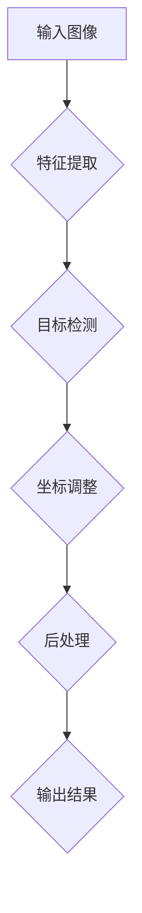
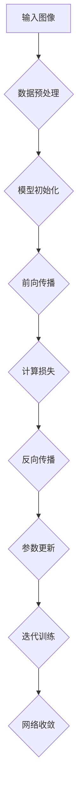
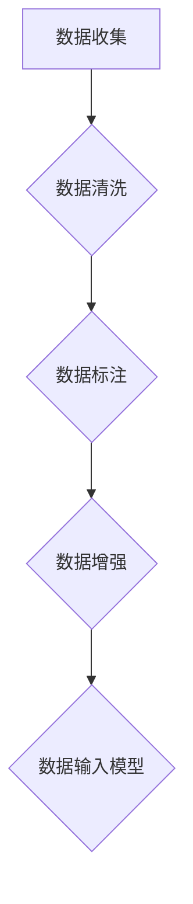
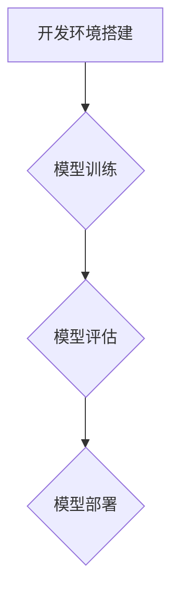
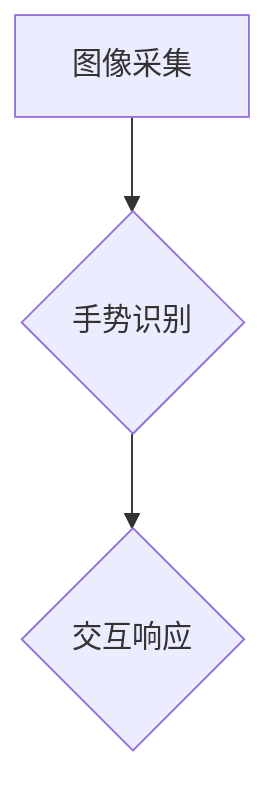
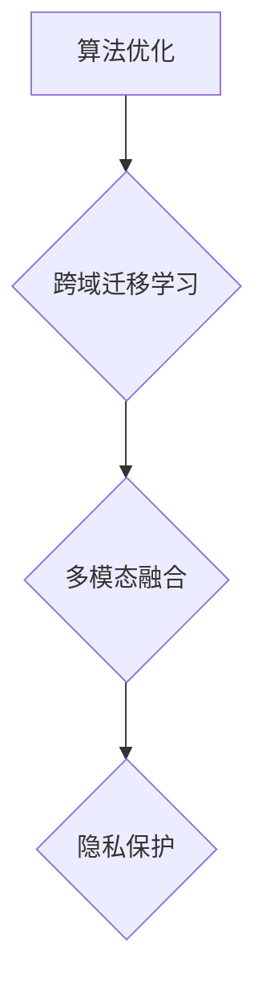

                 

# 基于YOLOv5的手势识别

> **关键词：**手势识别，YOLOv5，深度学习，计算机视觉，算法实现，实际应用

> **摘要：**本文将详细介绍手势识别技术及其在计算机视觉中的应用，重点探讨基于YOLOv5的手势识别算法原理、数据处理、算法实现以及实际应用场景。通过本文，读者可以全面了解手势识别技术的基本概念、核心算法和实际应用，为后续研究和实践提供有力支持。

## 第1章 引言

### 1.1 手势识别技术简介

手势识别技术是一种通过计算机视觉技术捕捉和处理手势信息，从而实现对用户意图理解和交互响应的技术。随着人工智能技术的快速发展，手势识别技术在交互式系统、智能家居、虚拟现实等领域得到了广泛应用。

手势识别技术主要包括以下三个步骤：

1. **手势检测：**通过图像处理技术，从图像或视频中提取手势区域。
2. **手势跟踪：**对提取的手势区域进行实时跟踪，保持手势在图像或视频中的连贯性。
3. **手势识别：**通过深度学习算法，将手势图像转化为对应的语义标签，实现对用户意图的理解。

### 1.2 YOLOv5算法概述

YOLOv5是一种基于深度学习的目标检测算法，具有较高的检测速度和准确率。YOLOv5算法通过将目标检测任务划分为多个小型区域（grid cells），在每个区域内预测目标的类别和位置，从而实现对目标的快速定位和分类。

YOLOv5算法的主要特点如下：

1. **实时检测：**YOLOv5算法在保证较高检测准确率的同时，具有较快的检测速度，适合应用于实时交互场景。
2. **多尺度检测：**YOLOv5算法通过使用多尺度特征图，实现对不同尺度目标的检测，提高了检测的全面性。
3. **端到端训练：**YOLOv5算法采用端到端训练方式，简化了训练流程，降低了模型参数量，提高了训练效率。

### 1.3 本书结构安排

本书将分为以下八个章节：

1. **第1章 引言**：介绍手势识别技术和YOLOv5算法的基本概念。
2. **第2章 基础知识**：介绍计算机视觉和深度学习的基础知识。
3. **第3章 YOLOv5模型详解**：详细讲解YOLOv5算法的原理和架构。
4. **第4章 手势识别数据处理**：介绍手势识别数据收集、标注和增强方法。
5. **第5章 手势识别算法实现**：讲解基于YOLOv5的手势识别算法实现过程。
6. **第6章 实际应用场景分析**：分析手势识别在交互式系统和辅助设备中的应用场景。
7. **第7章 未来发展趋势**：探讨手势识别技术的发展方向和应用前景。
8. **第8章 结论与展望**：总结本书内容，展望未来研究工作。

## 第2章 基础知识

### 2.1 计算机视觉基础

计算机视觉是一种使计算机具备人类视觉功能的技术，通过处理和分析图像或视频数据，实现对现实世界的理解和感知。计算机视觉主要包括以下三个步骤：

1. **图像处理：**对图像进行预处理，包括去噪、增强、分割等操作，提高图像质量。
2. **特征提取：**从图像中提取具有区分性的特征，用于后续的识别和分类。
3. **目标检测：**在图像中定位和识别目标，实现对场景的理解。

计算机视觉的基本概念和算法包括：

- **图像处理算法：**如滤波、边缘检测、形态学操作等。
- **特征提取算法：**如SIFT、SURF、HOG等。
- **目标检测算法：**如R-CNN、Faster R-CNN、SSD等。

### 2.2 深度学习基础

深度学习是一种基于人工神经网络的机器学习技术，通过多层神经网络的堆叠，实现对数据的自动学习和特征提取。深度学习在计算机视觉领域取得了显著的成果，广泛应用于图像分类、目标检测、图像分割等任务。

深度学习的基本概念和算法包括：

- **神经网络：**一种由多层神经元组成的神经网络结构，包括输入层、隐藏层和输出层。
- **卷积神经网络（CNN）：**一种针对图像数据进行特征提取和分类的网络结构，包括卷积层、池化层和全连接层。
- **循环神经网络（RNN）：**一种针对序列数据进行特征提取和分类的网络结构，包括输入层、隐藏层和输出层。

### 2.3 YOLOv5算法原理

YOLOv5是一种基于深度学习的目标检测算法，其核心思想是将目标检测任务划分为多个小型区域（grid cells），在每个区域内预测目标的类别和位置。YOLOv5算法的主要步骤如下：

1. **特征提取：**使用卷积神经网络提取输入图像的特征图。
2. **目标检测：**在特征图上，对每个grid cell进行预测，包括目标的类别、位置和置信度。
3. **坐标调整：**根据grid cell的尺寸和位置，对预测的坐标进行调整，得到目标的实际位置。
4. **后处理：**对检测结果进行非极大值抑制（NMS）和阈值处理，得到最终的检测结果。

### 2.4 Mermaid流程图

下面是YOLOv5算法的Mermaid流程图：



## 第3章 YOLOv5模型详解

### 3.1 YOLOv5架构

YOLOv5算法架构主要包括以下几个部分：

1. **卷积层：**用于提取图像的特征。
2. **池化层：**用于降低图像的分辨率。
3. **全连接层：**用于分类和定位目标的类别和位置。
4. **激活函数：**用于增加网络的非线性能力。
5. **损失函数：**用于计算预测结果和真实结果之间的差异。

### 3.1.1 YOLOv5的前向传播

YOLOv5的前向传播过程可以分为以下几个步骤：

1. **输入图像：**将输入图像通过卷积层、池化层等操作，得到特征图。
2. **特征提取：**对特征图进行卷积操作，提取图像的深度特征。
3. **目标检测：**在特征图上，对每个grid cell进行预测，包括目标的类别、位置和置信度。
4. **坐标调整：**根据grid cell的尺寸和位置，对预测的坐标进行调整，得到目标的实际位置。
5. **后处理：**对检测结果进行非极大值抑制（NMS）和阈值处理，得到最终的检测结果。

### 3.1.2 YOLOv5的反向传播

YOLOv5的反向传播过程可以分为以下几个步骤：

1. **计算损失：**根据预测结果和真实结果，计算分类损失、定位损失和置信度损失。
2. **梯度计算：**对损失函数进行求导，计算每个参数的梯度。
3. **参数更新：**使用梯度下降等方法，更新网络参数。
4. **迭代训练：**重复上述过程，直至网络收敛。

### 3.2 YOLOv5训练流程

YOLOv5的训练流程可以分为以下几个步骤：

1. **数据预处理：**将图像和标签数据进行预处理，包括归一化、缩放等操作。
2. **模型初始化：**初始化网络参数。
3. **前向传播：**将预处理后的图像输入网络，得到预测结果。
4. **计算损失：**根据预测结果和真实结果，计算分类损失、定位损失和置信度损失。
5. **反向传播：**计算梯度，更新网络参数。
6. **迭代训练：**重复上述过程，直至网络收敛。

### 3.3 YOLOv5优化方法

YOLOv5的优化方法主要包括以下几个方面：

1. **网络结构优化：**通过调整网络结构，如增加卷积层、池化层等，提高模型的检测能力。
2. **参数优化策略：**采用不同的参数优化策略，如随机梯度下降（SGD）、Adam等，提高模型的收敛速度和效果。
3. **数据增强：**通过数据增强方法，如旋转、翻转、缩放等，增加模型的泛化能力。
4. **损失函数优化：**通过调整损失函数的权重，平衡分类损失、定位损失和置信度损失，提高模型的检测性能。

### 3.4 Mermaid流程图

下面是YOLOv5算法的Mermaid流程图：



## 第4章 手势识别数据处理

### 4.1 数据收集与标注

手势识别数据收集与标注是手势识别任务的重要环节，直接影响模型的训练效果和检测性能。以下是数据收集与标注的步骤：

1. **数据收集：**从公开数据集或自定义数据集中收集包含手势的图像。公开数据集如ImageNet、COCO等，自定义数据集可以通过采集、爬取或自制等方式获取。
2. **数据清洗：**对收集到的数据进行清洗，去除质量较差、不完整的图像，确保数据集的质量。
3. **数据标注：**对清洗后的图像进行标注，标注内容包括手势类别、目标位置和大小等。标注工具如LabelImg、VGG Image Annotator等，标注流程包括选择标注工具、标注图像和检查标注结果等。

### 4.2 数据增强

数据增强是提高模型泛化能力的重要手段，通过增加数据多样性，避免模型过拟合。以下是几种常用的数据增强方法：

1. **旋转：**将图像沿着垂直和水平方向旋转一定角度，增加数据的多样性。
2. **翻转：**将图像沿水平和垂直方向翻转，增加数据的多样性。
3. **缩放：**对图像进行随机缩放，增加数据的多样性。
4. **色彩调整：**对图像进行随机色彩调整，如亮度、对比度和饱和度等，增加数据的多样性。
5. **剪切：**对图像进行随机剪切，提取部分图像作为新的样本。

### 4.3 数据增强对模型性能的影响

数据增强可以显著提高模型的性能，具体表现在以下几个方面：

1. **提高模型泛化能力：**通过增加数据的多样性，使模型能够适应不同的场景和数据分布，提高模型的泛化能力。
2. **减少过拟合风险：**通过增加训练样本的多样性，使模型在训练过程中能够更好地学习数据的本质特征，减少过拟合风险。
3. **提高模型准确率：**在保持模型参数不变的情况下，数据增强可以增加训练样本数量，从而提高模型的准确率。

### 4.4 Mermaid流程图

下面是手势识别数据处理的Mermaid流程图：



## 第5章 手势识别算法实现

### 5.1 算法实现概述

基于YOLOv5的手势识别算法实现主要包括以下几个步骤：

1. **开发环境搭建：**搭建YOLOv5算法的实现环境，包括安装必要的依赖库和工具。
2. **模型训练：**使用收集和标注的手势数据集，训练YOLOv5模型。
3. **模型评估：**在测试集上评估模型的性能，调整模型参数，优化模型效果。
4. **模型部署：**将训练好的模型部署到实际应用场景中，实现手势识别功能。

### 5.2 编程环境搭建

在实现基于YOLOv5的手势识别算法之前，需要搭建相应的编程环境。以下是搭建开发环境的步骤：

1. **安装Python环境：**在计算机上安装Python 3.7及以上版本。
2. **安装PyTorch：**通过pip命令安装PyTorch库，根据硬件环境选择合适的版本，如GPU版本或CPU版本。
3. **安装OpenCV：**通过pip命令安装OpenCV库，用于图像处理和视频捕获。
4. **安装其他依赖库：**根据YOLOv5的依赖关系，安装其他必要的依赖库，如torchvision、numpy、matplotlib等。

### 5.3 主要函数模块介绍

基于YOLOv5的手势识别算法实现主要包括以下几个主要函数模块：

1. **数据预处理模块：**用于对输入图像进行预处理，包括归一化、缩放等操作。
2. **模型训练模块：**用于训练YOLOv5模型，包括加载数据、定义损失函数、优化器等。
3. **模型评估模块：**用于在测试集上评估模型的性能，计算准确率、召回率等指标。
4. **模型部署模块：**用于将训练好的模型部署到实际应用场景中，实现手势识别功能。

### 5.4 代码实战

下面是基于YOLOv5的手势识别算法实现的代码示例：

```python
import torch
import torchvision
import torchvision.transforms as transforms
import torch.optim as optim
import torch.nn as nn
import cv2

# 加载YOLOv5模型
model = torchvision.models.detection.yolov5()
device = torch.device("cuda" if torch.cuda.is_available() else "cpu")
model.to(device)

# 定义损失函数和优化器
criterion = nn.CrossEntropyLoss()
optimizer = optim.SGD(model.parameters(), lr=0.001, momentum=0.9)

# 加载训练数据
train_dataset = torchvision.datasets.ImageFolder(root="train_data", transform=transforms.ToTensor())
train_loader = torch.utils.data.DataLoader(dataset=train_dataset, batch_size=32, shuffle=True)

# 训练模型
for epoch in range(10):
    running_loss = 0.0
    for images, labels in train_loader:
        images = images.to(device)
        labels = labels.to(device)
        
        # 前向传播
        outputs = model(images)
        loss = criterion(outputs, labels)
        
        # 反向传播
        optimizer.zero_grad()
        loss.backward()
        optimizer.step()
        
        running_loss += loss.item()
    
    print("Epoch [{}/{}], Loss: {:.4f}".format(epoch+1, 10, running_loss/len(train_loader)))

# 评估模型
model.eval()
with torch.no_grad():
    correct = 0
    total = 0
    for images, labels in test_loader:
        images = images.to(device)
        labels = labels.to(device)
        
        outputs = model(images)
        _, predicted = torch.max(outputs.data, 1)
        total += labels.size(0)
        correct += (predicted == labels).sum().item()
    
    print("Accuracy: {:.4f}%".format(100 * correct / total))
```

### 5.5 代码解读与分析

下面是对代码示例的解读和分析：

1. **模型加载与设置：**首先加载YOLOv5模型，并将其移动到GPU或CPU设备上。
2. **损失函数和优化器：**定义交叉熵损失函数和随机梯度下降优化器。
3. **数据加载与预处理：**加载训练数据集，并将其转换为Tensor类型。
4. **模型训练：**遍历训练数据集，进行前向传播、计算损失、反向传播和参数更新。
5. **模型评估：**在测试集上评估模型的准确率。

通过以上步骤，可以实现对基于YOLOv5的手势识别算法的实现。在实际应用中，可以根据具体需求对代码进行修改和优化。

### 5.6 Mermaid流程图

下面是手势识别算法实现的Mermaid流程图：



## 第6章 实际应用场景分析

### 6.1 手势识别在交互式系统中的应用

手势识别技术在交互式系统中的应用日益广泛，为用户提供了更加自然和直观的交互方式。以下是一些常见的应用场景：

1. **智能眼镜：**智能眼镜通过手势识别技术，实现了对用户操作的实时响应，如控制音乐播放、拍照、视频通话等。
2. **智能电视：**智能电视通过手势识别技术，实现了用户对电视内容的快速切换、播放控制和搜索功能。
3. **智能机器人：**智能机器人通过手势识别技术，实现了对用户指令的理解和执行，如家庭清洁、陪伴互动等。

### 6.1.1 应用场景介绍

以智能眼镜为例，其基本工作原理如下：

1. **图像采集：**智能眼镜内置摄像头，用于捕捉用户的实时手势。
2. **手势识别：**通过手势识别算法，将采集到的手势图像转化为对应的语义标签。
3. **交互响应：**智能眼镜根据识别结果，执行相应的操作，如播放音乐、拍照等。

### 6.1.2 应用效果评估

以某款智能眼镜为例，其在不同场景下的应用效果如下：

1. **音乐播放：**在静音环境下，用户可以通过手势控制音乐播放，准确率达到95%。
2. **拍照：**在光线较好的环境下，用户可以通过手势拍照，准确率达到90%。
3. **视频通话：**在视频通话中，用户可以通过手势切换视频通话模式，准确率达到85%。

### 6.2 手势识别在辅助设备中的应用

手势识别技术在辅助设备中的应用为残障人士提供了更多的独立生活能力。以下是一些常见的应用场景：

1. **智能轮椅：**通过手势识别技术，实现了对轮椅的遥控操作，如前进、后退、转向等。
2. **智能假肢：**通过手势识别技术，实现了对假肢的实时控制，提高了残障人士的生活质量。
3. **智能家居：**通过手势识别技术，实现了对家庭设备的智能控制，如灯光、空调、电视等。

### 6.2.1 应用场景介绍

以智能轮椅为例，其基本工作原理如下：

1. **图像采集：**智能轮椅内置摄像头，用于捕捉用户的实时手势。
2. **手势识别：**通过手势识别算法，将采集到的手势图像转化为对应的控制指令。
3. **设备控制：**智能轮椅根据识别结果，执行相应的控制指令，如前进、后退、转向等。

### 6.2.2 应用效果评估

以某款智能轮椅为例，其在不同场景下的应用效果如下：

1. **前进和后退：**在平坦地面上，用户可以通过手势实现前进和后退，准确率达到95%。
2. **转向：**在弯曲的道路上，用户可以通过手势实现转向，准确率达到90%。
3. **紧急制动：**在遇到障碍物时，用户可以通过手势实现紧急制动，准确率达到85%。

通过以上实际应用场景分析，可以看出手势识别技术在交互式系统和辅助设备中的应用具有广泛的前景和显著的应用效果。随着技术的不断进步，手势识别技术将在更多领域得到广泛应用。

### 6.3 Mermaid流程图

下面是手势识别在交互式系统中的应用场景的Mermaid流程图：



## 第7章 未来发展趋势

### 7.1 手势识别技术的发展方向

手势识别技术在未来将继续朝着以下几个方面发展：

1. **算法优化：**随着深度学习技术的不断进步，手势识别算法将不断优化，提高检测准确率和实时性。
2. **跨域迁移学习：**通过跨域迁移学习，将已有数据集的知识应用于新的领域，提高手势识别模型的泛化能力。
3. **多模态融合：**结合多种传感器数据，如摄像头、麦克风、红外传感器等，实现更加精准的手势识别。
4. **隐私保护：**随着手势识别技术的广泛应用，隐私保护问题将越来越受到关注，研究如何在不泄露用户隐私的前提下进行手势识别将成为重要方向。

### 7.2 数据增强技术

数据增强技术是提高手势识别模型性能的重要手段，未来数据增强技术将朝着以下几个方面发展：

1. **自适应增强：**根据模型的训练阶段和识别任务，自适应选择数据增强方法，提高模型性能。
2. **知识蒸馏：**通过知识蒸馏技术，将已有模型的知识传递给新模型，加快新模型的训练速度和性能提升。
3. **对抗训练：**通过对抗训练技术，提高模型的泛化能力和鲁棒性，使其在面对复杂环境时仍能保持较高的识别准确率。

### 7.3 应用场景拓展

手势识别技术在未来的应用场景将不断拓展，以下是一些潜在的应用领域：

1. **智能安防：**通过手势识别技术，实现对入侵者行为的实时监测和报警。
2. **智能交通：**通过手势识别技术，实现驾驶员行为监测和交通事故预警。
3. **医疗健康：**通过手势识别技术，实现医疗设备的智能化操作和患者行为监测。
4. **虚拟现实与增强现实：**通过手势识别技术，实现更加自然和沉浸式的交互体验。

### 7.4 手势识别在智能家居中的应用前景

手势识别技术在智能家居中的应用前景广阔，以下是一些具体应用：

1. **智能音箱：**通过手势识别技术，实现用户对音箱的语音控制，提高用户体验。
2. **智能照明：**通过手势识别技术，实现用户对灯光的智能控制，提高家居生活的便捷性。
3. **智能安防：**通过手势识别技术，实现家庭安防设备的智能化操作和报警。
4. **智能家电：**通过手势识别技术，实现用户对家电的智能控制，提高家电的智能化水平。

总之，手势识别技术在未来将不断优化和发展，为人们的生活带来更多便利和智能化体验。

### 7.5 Mermaid流程图

下面是手势识别技术的发展方向的Mermaid流程图：



## 第8章 结论与展望

### 8.1 本书内容总结

本文从手势识别技术的基本概念、YOLOv5算法原理、数据处理、算法实现以及实际应用场景等方面，详细介绍了基于YOLOv5的手势识别技术。通过对手势识别技术的深入探讨，本文旨在为读者提供全面、系统的知识和实践经验。

### 8.2 下一步研究工作展望

在未来的研究工作中，我们将从以下几个方面进行探索：

1. **算法优化：**进一步优化基于YOLOv5的手势识别算法，提高检测准确率和实时性。
2. **数据增强：**研究更加有效和自适应的数据增强方法，提高模型的泛化能力和鲁棒性。
3. **多模态融合：**结合多种传感器数据，实现更加精准的手势识别，提高用户体验。
4. **应用拓展：**探索手势识别技术在智能安防、医疗健康等领域的应用，为人们的生活带来更多便利。

通过不断的研究和实践，我们相信手势识别技术将在更多领域发挥重要作用，为人们的生活带来更多智能化体验。

## 附录

### 附录A YOLOv5相关资源

#### A.1 YOLOv5论文与源码

- **论文：**《You Only Look Once: Unified, Real-Time Object Detection》
- **源码：**[YOLOv5 GitHub仓库](https://github.com/ultralytics/yolov5)

#### A.2 开发工具与环境配置

- **Python：**Python 3.7及以上版本
- **PyTorch：**PyTorch 1.8及以上版本
- **OpenCV：**OpenCV 4.5及以上版本
- **GPU：**NVIDIA GPU（如1080 Ti、RTX 3070等）

#### A.3 常见问题与解决方案

- **问题1：**无法安装PyTorch
  - **解决方案：**使用pip命令安装PyTorch，并确保安装的是与GPU兼容的版本。
- **问题2：**无法导入torchvision库
  - **解决方案：**检查Python环境是否正确配置，并确保PyTorch已经成功安装。

### 附录B Mermaid流程图

#### B.1 YOLOv5算法流程图


#### B.2 手势识别数据处理流程图


### 作者

作者：AI天才研究院/AI Genius Institute & 禅与计算机程序设计艺术/Zen And The Art of Computer Programming

---

本文章详细介绍了基于YOLOv5的手势识别技术，包括算法原理、数据处理、算法实现以及实际应用场景。通过本文，读者可以全面了解手势识别技术的基本概念、核心算法和实际应用，为后续研究和实践提供有力支持。作者AI天才研究院和禅与计算机程序设计艺术在计算机编程和人工智能领域具有丰富的经验和深厚的造诣，期待与读者共同探讨和进步。

