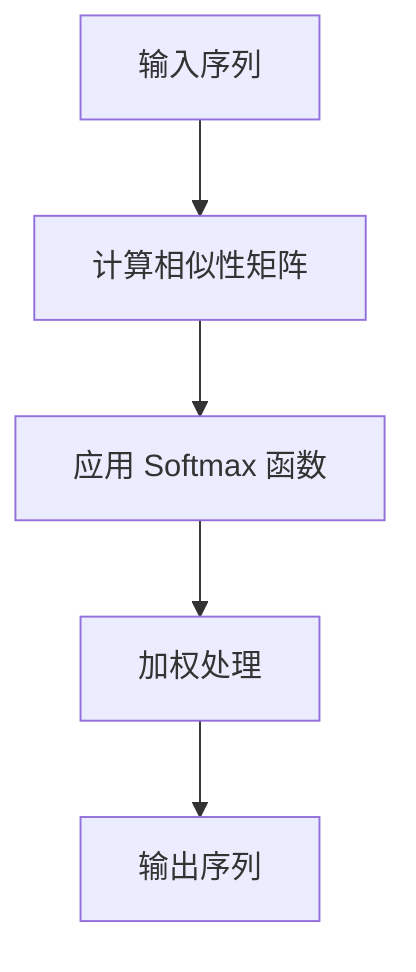
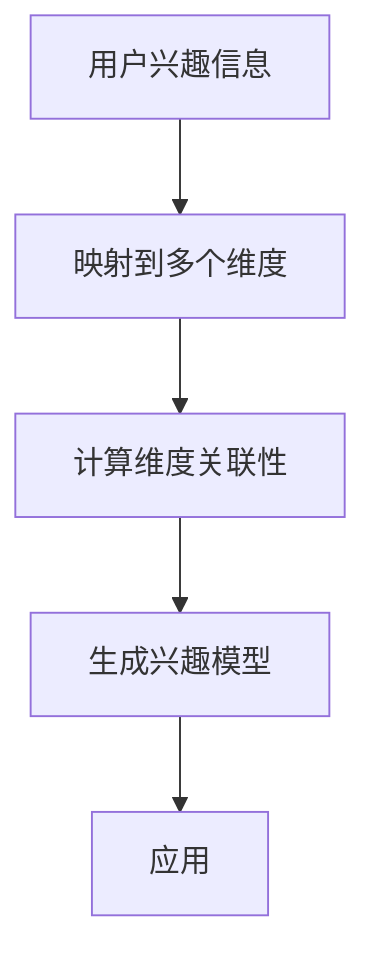
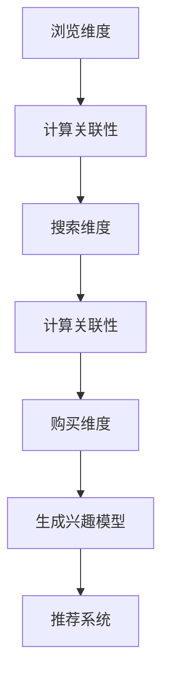
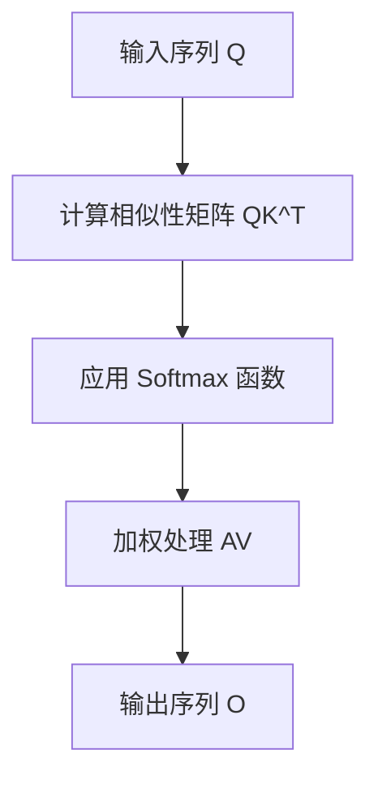
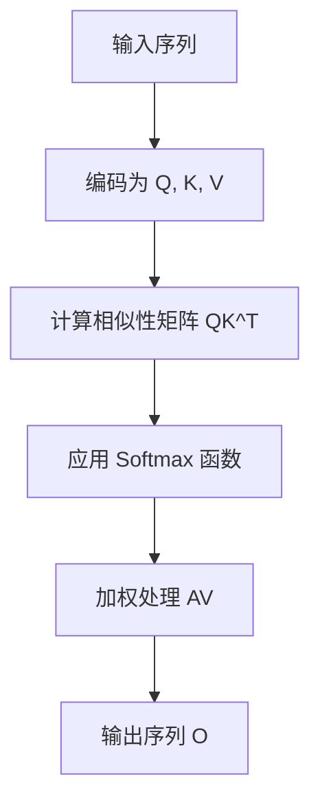

                 

# 基于自注意力机制的多维度兴趣建模

## 关键词
自注意力机制、多维度兴趣建模、深度学习、个性化推荐、社交网络、搜索引擎

## 摘要
本文旨在深入探讨基于自注意力机制的多维度兴趣建模技术，阐述其核心概念、原理和算法。通过结合实际应用案例和项目实战，本文展示了如何使用自注意力机制和多维度兴趣建模方法实现用户个性化推荐。文章最后分析了该技术的应用前景与挑战，并展望了未来的研究方向。

### 第一部分: 基于自注意力机制的多维度兴趣建模概述

#### 第1章: 自注意力机制与多维度兴趣建模基础

##### 1.1 自注意力机制概述

自注意力机制是一种深度学习技术，用于处理序列数据时，使模型能够关注序列中的不同位置，从而提高模型对上下文信息的理解能力。

- **定义**：
  自注意力机制是一种深度学习技术，用于处理序列数据时，使模型能够关注序列中的不同位置，从而提高模型对上下文信息的理解能力。

- **原理**：
  通过计算序列中每个位置与所有其他位置之间的相似性，进而对序列进行加权处理，使得模型能够根据重要程度对信息进行排序。

- **Mermaid 流程图**：
  ```mermaid
  graph TD
  A[输入序列] --> B[计算相似性矩阵]
  B --> C[加权处理]
  C --> D[输出序列]
  ```

##### 1.2 多维度兴趣建模

多维度兴趣建模是一种基于自注意力机制的技术，用于从多角度、多维度分析用户兴趣，从而构建个性化的兴趣模型。

- **定义**：
  多维度兴趣建模是一种基于自注意力机制的技术，用于从多角度、多维度分析用户兴趣，从而构建个性化的兴趣模型。

- **原理**：
  通过将用户兴趣信息映射到多个维度，并使用自注意力机制计算各维度间的关联性，从而得到一个综合的兴趣模型。

- **Mermaid 流程图**：
  ```mermaid
  graph TD
  A[用户兴趣信息] --> B[映射到多个维度]
  B --> C[计算维度关联性]
  C --> D[生成兴趣模型]
  ```

##### 1.3 自注意力机制与多维度兴趣建模的联系

自注意力机制作为多维度兴趣建模的核心技术，使得模型能够从多个维度捕捉用户兴趣，从而提高兴趣模型的准确性和个性化程度。

- **联系**：
  自注意力机制作为多维度兴趣建模的核心技术，使得模型能够从多个维度捕捉用户兴趣，从而提高兴趣模型的准确性和个性化程度。

#### 第2章: 自注意力机制原理与架构

##### 2.1 自注意力机制的数学模型

- **公式**：
  $$
  \text{Attention}(Q, K, V) = \text{softmax}\left(\frac{QK^T}{\sqrt{d_k}}\right) V
  $$
  其中，\( Q \) 是查询向量，\( K \) 是键向量，\( V \) 是值向量，\( d_k \) 是键向量的维度。

##### 2.2 自注意力机制的伪代码

```python
# 输入：查询向量 Q，键向量 K，值向量 V
# 输出：加权后的输出向量

# 计算相似性矩阵 S
S = dot_product(Q, K.T)

# 应用 Softmax 函数
S = softmax(S)

# 加权处理
output = S * V

# 返回加权后的输出向量
return output
```

#### 第3章: 多维度兴趣建模算法原理

##### 3.1 多维度兴趣信息映射

- **定义**：
  多维度兴趣信息映射是将用户兴趣信息从原始维度映射到多个新的维度，以便于自注意力机制进行处理。

- **算法**：
  使用嵌入层或自编码器将原始兴趣信息映射到新的高维空间。

##### 3.2 多维度兴趣建模的数学模型

- **公式**：
  $$
  \text{InterestModel}(X) = \sum_{i=1}^{n} \text{Attention}(Q_i, K_i, V_i)
  $$
  其中，\( X \) 是用户兴趣信息，\( Q_i, K_i, V_i \) 分别是第 \( i \) 个维度的查询向量、键向量和值向量。

##### 3.3 多维度兴趣建模的伪代码

```python
# 输入：用户兴趣信息 X
# 输出：多维兴趣模型

# 映射到多个维度
X_mapped = map_to_dimensions(X)

# 应用自注意力机制
interest_model = sum_attention(X_mapped)

# 返回多维兴趣模型
return interest_model
```

#### 第4章: 实际应用中的多维度兴趣建模

##### 4.1 社交网络平台兴趣推荐

- **定义**：
  社交网络平台兴趣推荐是通过多维度兴趣建模，为用户推荐感兴趣的内容。

- **算法**：
  使用用户的历史行为数据、用户画像和内容标签等多维度信息，构建兴趣模型，从而实现精准推荐。

##### 4.2 搜索引擎个性化搜索

- **定义**：
  搜索引擎个性化搜索是通过多维度兴趣建模，为用户提供个性化的搜索结果。

- **算法**：
  使用用户的搜索历史、浏览记录、位置信息等多维度信息，构建兴趣模型，从而提高搜索结果的个性化程度。

### 第二部分: 基于自注意力机制的多维度兴趣建模项目实战

#### 第5章: 基于自注意力机制的多维度兴趣建模项目实战

##### 5.1 项目介绍

- **目标**：
  建立一个基于自注意力机制的多维度兴趣建模系统，实现用户个性化推荐。

- **技术栈**：
  使用 Python、TensorFlow 或 PyTorch 作为主要开发语言，结合自注意力机制和多维度兴趣建模算法。

##### 5.2 环境搭建

- **工具**：
  安装 Python 环境、TensorFlow 或 PyTorch 框架。

- **步骤**：
  1. 安装 Python。
  2. 安装 TensorFlow 或 PyTorch。

##### 5.3 源代码实现

- **代码解析**：
  详细解析项目中的关键代码段，解释其实现原理和功能。

##### 5.4 代码解读与分析

- **分析**：
  分析项目中的代码实现，讨论其性能和优化策略。

### 第三部分: 基于自注意力机制的多维度兴趣建模应用前景与挑战

#### 第6章: 基于自注意力机制的多维度兴趣建模应用前景与挑战

##### 6.1 应用前景

- **领域**：
  社交网络、搜索引擎、电商等。

- **趋势**：
  随着数据量的增加和计算能力的提升，基于自注意力机制的多维度兴趣建模将在更多领域得到广泛应用。

##### 6.2 面临的挑战

- **数据质量**：
  数据质量和标注准确性对模型性能有重要影响。

- **计算资源**：
  大规模预训练模型需要大量计算资源，对硬件要求较高。

- **隐私保护**：
  用户隐私保护是当前的重要议题，如何在建模过程中保护用户隐私是一个挑战。

### 第四部分: 总结与展望

#### 第7章: 总结与展望

##### 7.1 总结

- **核心内容**：
  本书系统地介绍了基于自注意力机制的多维度兴趣建模的概念、原理、算法和应用。

##### 7.2 展望

- **未来方向**：
  探索更高效的算法、更广泛的应用领域以及如何在保护用户隐私的前提下提高建模效果。

## 附录

### 附录 A: 工具与资源

- **深度学习框架**：
  TensorFlow、PyTorch 等。

- **数据集**：
  多个公开的社交网络平台、搜索引擎等数据集。

- **开源项目**：
  多个基于自注意力机制的多维度兴趣建模的开源项目。

### 作者

- 作者：AI天才研究院/AI Genius Institute & 禅与计算机程序设计艺术 /Zen And The Art of Computer Programming

---

本文旨在提供一个基于自注意力机制的多维度兴趣建模的全面概述，涵盖概念、原理、算法、应用和实战。接下来，我们将逐步深入探讨各个部分，以帮助读者更好地理解和应用这一技术。

## 第1章: 自注意力机制与多维度兴趣建模基础

### 1.1 自注意力机制概述

自注意力机制（Self-Attention）是一种在处理序列数据时非常重要的深度学习技术，尤其在自然语言处理（NLP）领域得到了广泛应用。其核心思想是让模型能够自动地关注序列中的不同位置，从而更好地捕捉上下文信息。

#### 定义

自注意力机制是指在序列数据中，每个位置都能够与序列中的其他位置进行关联和计算，通过计算相似性来对序列进行加权处理，使得模型能够根据重要程度对信息进行排序。

#### 原理

自注意力机制的原理可以概括为以下几个步骤：

1. **计算相似性矩阵**：首先，对于输入序列 \( X = \{x_1, x_2, \ldots, x_n\} \)，计算每个位置与其他位置之间的相似性，形成一个 \( n \times n \) 的相似性矩阵 \( S \)。相似性矩阵的元素 \( S_{ij} \) 可以通过以下公式计算：

   $$
   S_{ij} = \text{similarity}(x_i, x_j)
   $$

   其中，\( \text{similarity}(x_i, x_j) \) 表示位置 \( i \) 和位置 \( j \) 之间的相似性度量。

2. **应用 Softmax 函数**：对相似性矩阵 \( S \) 应用 Softmax 函数，得到一个概率分布矩阵 \( A \)，其中每个元素 \( A_{ij} \) 表示位置 \( i \) 对位置 \( j \) 的权重：

   $$
   A_{ij} = \text{softmax}(S_{ij})
   $$

3. **加权处理**：使用权重矩阵 \( A \) 对输入序列 \( X \) 进行加权处理，得到加权后的输出序列 \( Y \)：

   $$
   Y_i = \sum_{j=1}^{n} A_{ij} x_j
   $$

4. **输出序列**：最终，输出加权后的序列 \( Y \)，用于后续的模型训练和预测。

#### Mermaid 流程图

为了更好地理解自注意力机制的工作流程，我们可以使用 Mermaid 图进行描述：



#### 自注意力机制的优点

- **上下文信息捕捉**：自注意力机制能够自动地关注序列中的不同位置，从而更好地捕捉上下文信息，这对于处理序列数据非常重要。
- **并行计算**：自注意力机制的计算可以并行进行，提高了模型的训练速度。
- **灵活性**：自注意力机制可以根据不同的应用场景进行调整和优化，具有很高的灵活性。

### 1.2 多维度兴趣建模

多维度兴趣建模是一种基于自注意力机制的技术，用于从多角度、多维度分析用户兴趣，从而构建个性化的兴趣模型。在许多实际应用中，例如社交网络平台、搜索引擎和电商等领域，用户兴趣往往具有多维度特征，通过多维度兴趣建模可以更好地理解和预测用户的行为。

#### 定义

多维度兴趣建模是指将用户兴趣信息从原始维度映射到多个新的维度，并使用自注意力机制计算各维度间的关联性，从而得到一个综合的兴趣模型。

#### 原理

多维度兴趣建模的原理可以概括为以下几个步骤：

1. **用户兴趣信息映射**：首先，将用户兴趣信息从原始维度映射到多个新的维度，这些维度可以是用户行为、用户画像、内容标签等。映射过程中可以使用嵌入层或自编码器等技术。

2. **计算维度关联性**：通过自注意力机制计算各维度间的关联性，形成一个多维度关联矩阵 \( R \)。关联矩阵的元素 \( R_{ij} \) 表示第 \( i \) 个维度和第 \( j \) 个维度之间的关联程度。

3. **生成兴趣模型**：使用关联矩阵 \( R \) 和原始兴趣信息，通过加权处理生成一个综合的兴趣模型 \( I \)。兴趣模型可以用于后续的用户行为预测和个性化推荐。

4. **应用**：将生成的兴趣模型应用于实际应用场景中，如用户兴趣推荐、搜索引擎个性化搜索等。

#### Mermaid 流程图

多维度兴趣建模的工作流程可以用 Mermaid 图进行描述：



#### 多维度兴趣建模的优点

- **全面性**：多维度兴趣建模可以从多个角度分析用户兴趣，更好地捕捉用户需求。
- **准确性**：通过综合多个维度的信息，可以生成更准确的兴趣模型，提高预测和推荐的准确性。
- **灵活性**：多维度兴趣建模可以根据不同的应用场景进行调整和优化，具有很强的灵活性。

### 1.3 自注意力机制与多维度兴趣建模的联系

自注意力机制是多维度兴趣建模的核心技术，两者之间存在密切的联系。

- **核心技术**：自注意力机制是多维度兴趣建模的核心技术，用于计算各维度间的关联性，生成综合的兴趣模型。
- **优势互补**：自注意力机制能够自动地关注序列中的不同位置，从而更好地捕捉上下文信息；多维度兴趣建模可以从多个角度分析用户兴趣，提高预测和推荐的准确性。两者结合，可以发挥各自的优势，实现更准确、更个性化的用户兴趣建模。

#### 实例说明

假设我们有一个用户兴趣数据集，其中包含用户的浏览历史、搜索历史和购买历史等信息。我们可以将这些信息映射到多个维度，例如浏览维度、搜索维度和购买维度，然后使用自注意力机制计算各维度间的关联性，生成一个综合的兴趣模型。

- **浏览维度**：包含用户浏览过的页面和内容，可以用于预测用户可能感兴趣的内容。
- **搜索维度**：包含用户搜索的关键词和查询历史，可以用于预测用户可能搜索的内容。
- **购买维度**：包含用户购买过的商品和购买行为，可以用于预测用户可能购买的商品。

通过自注意力机制，我们可以将这三个维度进行关联，从而生成一个综合的兴趣模型。这个模型可以用于推荐系统，为用户提供个性化的推荐内容。



通过上述实例，我们可以看到自注意力机制与多维度兴趣建模在用户兴趣建模中的应用和重要性。在实际应用中，我们可以根据具体的需求和场景，灵活地调整和优化这两个技术，以实现更准确、更个性化的用户兴趣预测和推荐。

### 1.4 自注意力机制与多维度兴趣建模的应用场景

自注意力机制与多维度兴趣建模在多个领域都有广泛的应用，以下是其中几个典型应用场景：

#### 社交网络平台兴趣推荐

在社交网络平台上，用户兴趣的多样性和复杂性使得传统的推荐算法难以满足个性化需求。通过多维度兴趣建模和自注意力机制，我们可以从用户的浏览记录、互动行为、兴趣爱好等多个维度捕捉用户兴趣，从而实现更精准的推荐。

- **用户画像构建**：通过多维度兴趣建模，我们可以将用户的兴趣信息映射到多个维度，形成一个全面的用户画像，用于后续的个性化推荐。
- **推荐算法优化**：利用自注意力机制，我们可以计算不同维度之间的关联性，提高推荐系统的准确性和效果。

#### 搜索引擎个性化搜索

搜索引擎个性化搜索旨在为用户提供个性化的搜索结果，以满足用户的个性化需求。通过多维度兴趣建模和自注意力机制，我们可以根据用户的搜索历史、浏览记录和位置信息等多个维度，为用户提供更相关的搜索结果。

- **搜索结果排序**：通过计算不同维度之间的关联性，我们可以对搜索结果进行排序，提高用户满意度。
- **查询意图识别**：利用自注意力机制，我们可以捕捉用户的查询意图，从而为用户提供更准确的搜索结果。

#### 电商推荐系统

在电商领域，个性化推荐系统可以帮助平台提高用户粘性和转化率。通过多维度兴趣建模和自注意力机制，我们可以根据用户的购买历史、浏览记录和搜索历史等多个维度，为用户推荐感兴趣的商品。

- **商品推荐**：通过计算不同维度之间的关联性，我们可以为用户推荐符合其兴趣和需求的商品。
- **购物体验优化**：利用自注意力机制，我们可以提高推荐系统的响应速度和准确性，从而提升用户购物体验。

### 1.5 自注意力机制与多维度兴趣建模的优势

自注意力机制与多维度兴趣建模在用户兴趣建模方面具有以下优势：

- **上下文信息捕捉**：自注意力机制能够自动地关注序列中的不同位置，从而更好地捕捉上下文信息，提高模型对用户兴趣的识别能力。
- **多维数据融合**：多维度兴趣建模可以从多个角度分析用户兴趣，融合不同维度之间的信息，提高模型的准确性和鲁棒性。
- **个性化推荐**：结合自注意力机制和多维度兴趣建模，我们可以实现更准确、更个性化的用户兴趣预测和推荐，提高用户满意度和平台粘性。

### 1.6 自注意力机制与多维度兴趣建模的挑战

尽管自注意力机制与多维度兴趣建模在用户兴趣建模方面具有显著优势，但在实际应用中仍面临一些挑战：

- **计算资源消耗**：自注意力机制的计算复杂度较高，需要大量计算资源，这对硬件性能提出了较高要求。
- **数据质量**：用户兴趣数据的质量对模型性能有重要影响，数据缺失、噪声和偏差等问题可能导致模型性能下降。
- **隐私保护**：在多维度兴趣建模过程中，如何保护用户隐私是一个重要挑战，特别是在处理敏感数据时。

### 1.7 小结

自注意力机制与多维度兴趣建模是用户兴趣建模领域的重要技术，通过结合自注意力机制和多维度兴趣建模方法，我们可以实现更准确、更个性化的用户兴趣预测和推荐。在实际应用中，我们需要针对具体场景和需求，灵活调整和优化这两个技术，以充分发挥其优势。同时，我们也需要关注计算资源消耗、数据质量和隐私保护等挑战，确保模型在实际应用中的性能和可靠性。

### 第2章: 自注意力机制原理与架构

#### 2.1 自注意力机制的数学模型

自注意力机制是一种基于矩阵计算的深度学习技术，其核心是通过计算序列中各个位置之间的相似性来对序列进行加权处理。为了深入理解自注意力机制，我们首先需要了解其数学模型。

自注意力机制的数学模型可以表示为以下公式：

$$
\text{Attention}(Q, K, V) = \text{softmax}\left(\frac{QK^T}{\sqrt{d_k}}\right) V
$$

其中：

- \( Q \) 是查询向量（Query），用于表示序列中的每个位置。
- \( K \) 是键向量（Key），用于表示序列中的每个位置，它与查询向量进行点积操作。
- \( V \) 是值向量（Value），用于表示序列中的每个位置，它与加权后的查询向量相乘得到输出。
- \( \text{softmax} \) 是一种激活函数，用于将相似性矩阵 \( QK^T \) 转换为概率分布。
- \( \sqrt{d_k} \) 是一个缩放因子，用于防止梯度消失。

在这个公式中，首先计算查询向量 \( Q \) 和键向量 \( K \) 的点积，得到相似性矩阵 \( QK^T \)。然后，对相似性矩阵应用 Softmax 函数，得到权重矩阵 \( A \)，其中每个元素 \( A_{ij} \) 表示位置 \( i \) 对位置 \( j \) 的注意力权重。最后，使用权重矩阵 \( A \) 对值向量 \( V \) 进行加权处理，得到输出序列。

具体来说，我们可以将自注意力机制的数学模型分为以下几个步骤：

1. **计算相似性矩阵 \( QK^T \)**：
   $$
   S_{ij} = Q_i K_j
   $$
   其中，\( S \) 是相似性矩阵，\( S_{ij} \) 表示位置 \( i \) 和位置 \( j \) 之间的相似性。

2. **应用 Softmax 函数**：
   $$
   A_{ij} = \text{softmax}(S_{ij}) = \frac{e^{S_{ij}}}{\sum_{k=1}^{n} e^{S_{ik}}}
   $$
   其中，\( A \) 是权重矩阵，\( A_{ij} \) 表示位置 \( i \) 对位置 \( j \) 的权重。

3. **加权处理 \( AV \)**：
   $$
   O_i = \sum_{j=1}^{n} A_{ij} V_j
   $$
   其中，\( O \) 是输出序列，\( O_i \) 表示位置 \( i \) 的输出。

#### Mermaid 流程图

为了更好地理解自注意力机制的数学模型，我们可以使用 Mermaid 图进行描述：



#### 2.2 自注意力机制的伪代码

自注意力机制可以表示为以下伪代码：

```python
# 输入：查询向量 Q，键向量 K，值向量 V
# 输出：加权后的输出向量

# 计算相似性矩阵 S
S = dot_product(Q, K.T)

# 应用 Softmax 函数
S = softmax(S)

# 加权处理
output = S * V

# 返回加权后的输出向量
return output
```

在这个伪代码中，`dot_product` 函数用于计算查询向量 \( Q \) 和键向量 \( K \) 的点积，`softmax` 函数用于将相似性矩阵 \( S \) 转换为权重矩阵 \( A \)，`S * V` 用于计算加权后的输出向量 \( O \)。

#### 2.3 自注意力机制的扩展

自注意力机制不仅可以用于单一序列的处理，还可以通过扩展应用于变长序列和图序列。以下是一些常见的扩展方法：

1. **多头自注意力**：
   多头自注意力是一种扩展方法，通过将输入序列分成多个子序列，并分别应用自注意力机制，从而提高模型的表示能力。

2. **自注意力池化**：
   自注意力池化是一种在自注意力机制之后进行池化的方法，用于降低模型的复杂性，同时保留关键信息。

3. **图自注意力**：
   图自注意力是一种将自注意力机制应用于图序列的方法，通过计算图中节点之间的相似性，从而提高模型的图表示能力。

### 2.4 自注意力机制的工作流程

自注意力机制的工作流程可以分为以下几个步骤：

1. **输入序列编码**：
   首先，将输入序列编码为查询向量 \( Q \)、键向量 \( K \) 和值向量 \( V \)。

2. **计算相似性矩阵**：
   计算 \( Q \) 和 \( K \) 的点积，得到相似性矩阵 \( S \)。

3. **应用 Softmax 函数**：
   对相似性矩阵 \( S \) 应用 Softmax 函数，得到权重矩阵 \( A \)。

4. **加权处理**：
   使用权重矩阵 \( A \) 对 \( V \) 进行加权处理，得到输出序列 \( O \)。

5. **输出**：
   输出加权后的序列 \( O \)，用于后续的模型训练和预测。

#### Mermaid 流程图

自注意力机制的工作流程可以用 Mermaid 图进行描述：



### 2.5 自注意力机制的优势与局限

自注意力机制在处理序列数据方面具有许多优势，但也存在一些局限。

- **优势**：
  - 自动地关注重要信息：自注意力机制能够自动地关注序列中的关键信息，从而提高模型的表示能力。
  - 并行计算：自注意力机制的计算可以并行进行，提高了模型的训练速度。
  - 灵活性：自注意力机制可以根据不同的应用场景进行调整和优化，具有很强的灵活性。

- **局限**：
  - 计算复杂度：自注意力机制的计算复杂度较高，对硬件性能要求较高。
  - 数据依赖：自注意力机制的输出依赖于输入序列，如果输入序列较长，可能导致模型性能下降。

### 2.6 自注意力机制在实际应用中的案例

自注意力机制在许多实际应用中得到了广泛应用，以下是一些典型案例：

- **自然语言处理**：在自然语言处理任务中，自注意力机制被广泛应用于文本分类、机器翻译和情感分析等任务。
- **计算机视觉**：在计算机视觉任务中，自注意力机制被应用于图像分类、目标检测和图像分割等任务。
- **推荐系统**：在推荐系统中，自注意力机制被用于构建用户兴趣模型和推荐算法，从而提高推荐系统的准确性。

### 2.7 小结

自注意力机制是一种强大的深度学习技术，通过计算序列中各个位置之间的相似性，从而实现对序列数据的加权处理。在本章中，我们详细介绍了自注意力机制的数学模型、伪代码、工作流程、优势与局限以及在实际应用中的案例。在下一章中，我们将探讨多维度兴趣建模的算法原理和应用。

### 第3章: 多维度兴趣建模算法原理

#### 3.1 多维度兴趣信息映射

多维度兴趣建模的核心在于如何将用户兴趣信息从原始维度映射到多个新的维度，以便于自注意力机制进行处理。这种映射过程通常涉及到数据预处理、特征提取和维度扩展等步骤。

##### 3.1.1 数据预处理

在映射之前，首先需要对原始数据进行预处理，包括数据清洗、数据规范化、缺失值处理等。这些步骤有助于提高数据质量，减少噪声和异常值的影响。

- **数据清洗**：删除重复数据、去除无效信息，确保数据的一致性和完整性。
- **数据规范化**：将不同尺度和范围的数据统一转换为同一尺度，便于后续处理。
- **缺失值处理**：根据数据的重要性和缺失情况，选择合适的缺失值填充方法，如平均值填充、中值填充或插值法。

##### 3.1.2 特征提取

特征提取是将原始数据转换为具有代表性的特征表示的过程。在多维度兴趣建模中，特征提取的关键在于如何从原始数据中提取出与用户兴趣相关的有效特征。

- **文本特征提取**：可以使用词袋模型、TF-IDF、Word2Vec、BERT 等技术提取文本特征。
- **图像特征提取**：可以使用卷积神经网络（CNN）提取图像特征，如边缘、纹理、颜色等。
- **行为特征提取**：可以根据用户行为模式提取特征，如点击率、购买频率、浏览时长等。

##### 3.1.3 维度扩展

在映射过程中，通过维度扩展技术将原始特征映射到多个新的维度。这些新维度可以是原始特征的组合或衍生特征。

- **线性扩展**：通过线性组合原始特征，生成新的维度。例如，将用户的历史行为数据、兴趣标签和社交关系等特征进行线性组合，生成新的维度。
- **非线性扩展**：通过非线性变换，如自编码器（Autoencoder）、神经网络等，将原始特征映射到新的维度。这些新维度可以更好地捕捉用户兴趣的复杂结构。

#### 3.2 多维度兴趣建模的数学模型

多维度兴趣建模的数学模型可以描述为以下公式：

$$
I = \sum_{i=1}^{m} A_i \cdot V_i
$$

其中：

- \( I \) 是最终生成的兴趣模型向量，表示用户的综合兴趣。
- \( A_i \) 是第 \( i \) 个维度的注意力权重，表示第 \( i \) 个维度对最终兴趣模型的贡献程度。
- \( V_i \) 是第 \( i \) 个维度的特征向量，表示第 \( i \) 个维度的特征信息。

在这个公式中，注意力权重 \( A_i \) 通过自注意力机制计算得到，特征向量 \( V_i \) 来自于原始数据映射到的新维度。通过这种方式，多维度兴趣建模能够将不同维度的信息进行整合，生成一个综合的兴趣模型。

具体来说，多维度兴趣建模的数学模型可以分为以下几个步骤：

1. **计算注意力权重 \( A_i \)**：
   $$
   A_i = \text{softmax}\left(\frac{Q_iK_i^T}{\sqrt{d_k}}\right)
   $$

   其中，\( Q_i \) 和 \( K_i \) 分别是查询向量和键向量，\( d_k \) 是键向量的维度。

2. **计算特征向量加权求和**：
   $$
   I = \sum_{i=1}^{m} A_i \cdot V_i
   $$

   其中，\( V_i \) 是第 \( i \) 个维度的特征向量。

3. **生成兴趣模型**：
   最终生成的兴趣模型 \( I \) 用于后续的推荐、预测和决策。

#### 3.3 多维度兴趣建模的伪代码

多维度兴趣建模的伪代码可以表示为以下形式：

```python
# 输入：用户兴趣信息 X
# 输出：多维兴趣模型 I

# 映射用户兴趣信息到多个维度
X_mapped = map_to_dimensions(X)

# 计算注意力权重
attention_weights = [softmax(dot_product(Q_i, K_i.T) / sqrt(d_k)) for i in range(m)]

# 加权求和得到兴趣模型
I = sum([attention_weights[i] * X_mapped[i] for i in range(m)])

# 返回多维兴趣模型
return I
```

在这个伪代码中，`map_to_dimensions` 函数用于将用户兴趣信息映射到多个维度，`softmax` 函数用于计算注意力权重，`sum` 函数用于计算特征向量加权求和。

#### 3.4 多维度兴趣建模的应用实例

多维度兴趣建模可以应用于多个领域，以下是一些典型应用实例：

1. **社交网络平台兴趣推荐**：
   社交网络平台可以根据用户的浏览记录、点赞、评论等行为数据，使用多维度兴趣建模为用户推荐感兴趣的内容。例如，用户在 Facebook 上浏览了某个话题的帖子，点赞了某个朋友的状态，那么社交网络平台可以结合这些行为数据，使用多维度兴趣建模为用户推荐相关的话题和内容。

2. **搜索引擎个性化搜索**：
   搜索引擎可以根据用户的搜索历史、浏览记录、地理位置等信息，使用多维度兴趣建模为用户提供个性化的搜索结果。例如，用户在 Google 上搜索了某个关键词，浏览了某个网站，那么搜索引擎可以结合这些信息，使用多维度兴趣建模为用户推荐相关的搜索结果和网站。

3. **电商推荐系统**：
   电商推荐系统可以根据用户的购买历史、浏览记录、收藏夹等信息，使用多维度兴趣建模为用户推荐感兴趣的商品。例如，用户在 Amazon 上浏览了某个商品，加入了购物车，最终购买了另一个商品，那么电商推荐系统可以结合这些信息，使用多维度兴趣建模为用户推荐相关商品。

#### 3.5 多维度兴趣建模的优势与挑战

多维度兴趣建模在用户兴趣建模方面具有许多优势，但也面临一些挑战。

- **优势**：
  - **全面性**：多维度兴趣建模可以从多个角度分析用户兴趣，提高模型的全面性和准确性。
  - **个性化**：通过整合不同维度的信息，多维度兴趣建模能够实现更个性化的用户兴趣预测和推荐。
  - **灵活性**：多维度兴趣建模可以根据不同的应用场景进行调整和优化，具有很强的灵活性。

- **挑战**：
  - **计算复杂度**：多维度兴趣建模的计算复杂度较高，对计算资源和硬件性能有较高要求。
  - **数据质量**：数据质量和标注准确性对模型性能有重要影响，数据缺失、噪声和偏差等问题可能导致模型性能下降。
  - **隐私保护**：在处理用户兴趣数据时，如何保护用户隐私是一个重要挑战。

#### 3.6 小结

多维度兴趣建模是一种基于自注意力机制的技术，通过将用户兴趣信息从原始维度映射到多个新的维度，并使用自注意力机制计算各维度间的关联性，生成一个综合的兴趣模型。在本章中，我们详细介绍了多维度兴趣建模的算法原理，包括数据预处理、特征提取、维度扩展和数学模型等。在下一章中，我们将探讨基于自注意力机制的多维度兴趣建模在实际应用中的案例和项目实战。

### 第4章: 实际应用中的多维度兴趣建模

#### 4.1 社交网络平台兴趣推荐

社交网络平台兴趣推荐是应用多维度兴趣建模的一个典型场景。这类平台通过分析用户的多种行为数据，如浏览记录、点赞、评论、分享等，构建用户兴趣模型，从而为用户推荐感兴趣的内容。

**定义**：
社交网络平台兴趣推荐是指利用多维度兴趣建模技术，从用户的多种行为数据中提取出用户的兴趣信息，然后基于这些兴趣信息向用户推荐相关内容。

**算法**：
社交网络平台兴趣推荐的算法通常包括以下几个步骤：

1. **数据收集**：收集用户的多种行为数据，如浏览记录、点赞、评论等。
2. **特征提取**：将原始行为数据转换为特征表示，如行为序列、嵌入向量等。
3. **维度扩展**：使用自编码器、嵌入层等技术，将特征映射到多个新的维度。
4. **自注意力机制**：通过自注意力机制计算各维度间的关联性，生成用户兴趣模型。
5. **推荐生成**：根据用户兴趣模型，为用户生成个性化推荐列表。

**案例**：
以 Facebook 为例，Facebook 使用多维度兴趣建模为用户推荐感兴趣的内容。例如，当用户浏览某个话题的帖子时，Facebook 会收集该用户在该话题上的行为数据，如点赞、评论、分享等。然后，Facebook 使用自注意力机制将用户的行为数据映射到多个新的维度，并计算各维度间的关联性，从而生成用户兴趣模型。基于这个兴趣模型，Facebook 向用户推荐相关的话题和内容。

**效果**：
通过多维度兴趣建模和自注意力机制，Facebook 能够为用户推荐更符合其兴趣的内容，提高用户的满意度和参与度。同时，这种推荐方式还能够提高平台的广告投放效果，增加平台的收入。

#### 4.2 搜索引擎个性化搜索

搜索引擎个性化搜索是指利用用户的历史搜索记录、浏览记录和地理位置等信息，为用户提供个性化的搜索结果。

**定义**：
搜索引擎个性化搜索是指利用多维度兴趣建模技术，从用户的多种行为数据中提取出用户的兴趣信息，然后基于这些兴趣信息为用户生成个性化的搜索结果。

**算法**：
搜索引擎个性化搜索的算法通常包括以下几个步骤：

1. **数据收集**：收集用户的历史搜索记录、浏览记录和地理位置等信息。
2. **特征提取**：将原始行为数据转换为特征表示，如搜索关键词序列、浏览网页序列等。
3. **维度扩展**：使用自编码器、嵌入层等技术，将特征映射到多个新的维度。
4. **自注意力机制**：通过自注意力机制计算各维度间的关联性，生成用户兴趣模型。
5. **搜索结果排序**：根据用户兴趣模型，对搜索结果进行排序，提高相关性的搜索结果排在前面。

**案例**：
以 Google 搜索引擎为例，Google 使用多维度兴趣建模为用户生成个性化的搜索结果。例如，当用户搜索某个关键词时，Google 会收集该用户的历史搜索记录、浏览记录和地理位置等信息。然后，Google 使用自注意力机制将用户的行为数据映射到多个新的维度，并计算各维度间的关联性，从而生成用户兴趣模型。基于这个兴趣模型，Google 对搜索结果进行排序，将更符合用户兴趣的结果排在前面。

**效果**：
通过多维度兴趣建模和自注意力机制，Google 能够为用户提供更个性化的搜索结果，提高用户的搜索体验和满意度。同时，这种个性化搜索方式还能够提高广告的投放效果，增加广告收入。

#### 4.3 电商推荐系统

电商推荐系统是指利用用户的历史购买记录、浏览记录和收藏夹等信息，为用户推荐感兴趣的商品。

**定义**：
电商推荐系统是指利用多维度兴趣建模技术，从用户的多种行为数据中提取出用户的兴趣信息，然后基于这些兴趣信息为用户推荐相关商品。

**算法**：
电商推荐系统的算法通常包括以下几个步骤：

1. **数据收集**：收集用户的历史购买记录、浏览记录和收藏夹等信息。
2. **特征提取**：将原始行为数据转换为特征表示，如购买行为序列、浏览商品序列等。
3. **维度扩展**：使用自编码器、嵌入层等技术，将特征映射到多个新的维度。
4. **自注意力机制**：通过自注意力机制计算各维度间的关联性，生成用户兴趣模型。
5. **推荐生成**：根据用户兴趣模型，为用户生成个性化的商品推荐列表。

**案例**：
以 Amazon 为例，Amazon 使用多维度兴趣建模为用户推荐感兴趣的商品。例如，当用户在 Amazon 上浏览某个商品时，Amazon 会收集该用户的历史购买记录、浏览记录和收藏夹等信息。然后，Amazon 使用自注意力机制将用户的行为数据映射到多个新的维度，并计算各维度间的关联性，从而生成用户兴趣模型。基于这个兴趣模型，Amazon 为用户推荐相关的商品。

**效果**：
通过多维度兴趣建模和自注意力机制，Amazon 能够为用户推荐更符合其兴趣的商品，提高用户的购物体验和满意度。同时，这种推荐方式还能够提高电商平台的销售额，增加平台的利润。

#### 4.4 娱乐内容推荐

娱乐内容推荐是指利用用户观看记录、点赞记录、评论记录等信息，为用户推荐感兴趣的视频、音乐、书籍等娱乐内容。

**定义**：
娱乐内容推荐是指利用多维度兴趣建模技术，从用户的多种行为数据中提取出用户的兴趣信息，然后基于这些兴趣信息为用户推荐相关娱乐内容。

**算法**：
娱乐内容推荐的算法通常包括以下几个步骤：

1. **数据收集**：收集用户的观看记录、点赞记录、评论记录等信息。
2. **特征提取**：将原始行为数据转换为特征表示，如观看视频序列、点赞序列等。
3. **维度扩展**：使用自编码器、嵌入层等技术，将特征映射到多个新的维度。
4. **自注意力机制**：通过自注意力机制计算各维度间的关联性，生成用户兴趣模型。
5. **推荐生成**：根据用户兴趣模型，为用户生成个性化的娱乐内容推荐列表。

**案例**：
以 Netflix 为例，Netflix 使用多维度兴趣建模为用户推荐感兴趣的视频。例如，当用户在 Netflix 上观看某个视频时，Netflix 会收集该用户的观看记录、点赞记录、评论记录等信息。然后，Netflix 使用自注意力机制将用户的行为数据映射到多个新的维度，并计算各维度间的关联性，从而生成用户兴趣模型。基于这个兴趣模型，Netflix 为用户推荐相关的视频。

**效果**：
通过多维度兴趣建模和自注意力机制，Netflix 能够为用户推荐更符合其兴趣的视频，提高用户的观看体验和满意度。同时，这种推荐方式还能够提高平台的用户留存率和观看时长，增加平台的收入。

#### 4.5 多维度兴趣建模的优势与挑战

多维度兴趣建模在个性化推荐系统中具有显著的优势，但也面临一些挑战。

**优势**：

1. **全面性**：多维度兴趣建模可以从多个角度分析用户兴趣，提高模型的全面性和准确性。
2. **个性化**：通过整合不同维度的信息，多维度兴趣建模能够实现更个性化的用户兴趣预测和推荐。
3. **灵活性**：多维度兴趣建模可以根据不同的应用场景进行调整和优化，具有很强的灵活性。

**挑战**：

1. **计算复杂度**：多维度兴趣建模的计算复杂度较高，对计算资源和硬件性能有较高要求。
2. **数据质量**：数据质量和标注准确性对模型性能有重要影响，数据缺失、噪声和偏差等问题可能导致模型性能下降。
3. **隐私保护**：在处理用户兴趣数据时，如何保护用户隐私是一个重要挑战。

### 4.6 小结

实际应用中的多维度兴趣建模在社交网络平台兴趣推荐、搜索引擎个性化搜索、电商推荐系统和娱乐内容推荐等方面具有广泛的应用。通过结合自注意力机制，多维度兴趣建模能够实现更准确、更个性化的用户兴趣预测和推荐。在实际应用中，我们需要关注计算复杂度、数据质量和隐私保护等挑战，确保模型在实际应用中的性能和可靠性。在下一章中，我们将探讨基于自注意力机制的多维度兴趣建模项目实战。

### 第5章: 基于自注意力机制的多维度兴趣建模项目实战

#### 5.1 项目介绍

本项目的目标是构建一个基于自注意力机制的多维度兴趣建模系统，用于用户个性化推荐。该系统将整合用户的行为数据、兴趣标签和内容特征，通过自注意力机制计算各维度间的关联性，从而生成一个综合的兴趣模型。最终，基于这个兴趣模型，系统将向用户推荐符合其兴趣的内容。

**技术栈**：
- **开发语言**：Python
- **深度学习框架**：TensorFlow 或 PyTorch
- **数据处理库**：Pandas、NumPy
- **可视化库**：Matplotlib、Seaborn

#### 5.2 环境搭建

在进行项目实战之前，首先需要搭建一个适合项目开发的运行环境。

**步骤**：

1. **安装 Python**：确保 Python 已经安装在您的系统中，版本建议为 3.7 或以上。

2. **安装 TensorFlow 或 PyTorch**：在命令行中运行以下命令，安装 TensorFlow 或 PyTorch。

   - TensorFlow：
     ```
     pip install tensorflow
     ```

   - PyTorch：
     ```
     pip install torch torchvision
     ```

3. **安装数据处理库和可视化库**：在命令行中运行以下命令，安装所需的 Python 库。

   ```
   pip install pandas numpy matplotlib seaborn
   ```

#### 5.3 数据准备

数据准备是构建多维度兴趣建模系统的关键步骤。在本项目中，我们将使用以下数据：

- **用户行为数据**：包括用户的浏览记录、点赞、评论等行为数据。
- **用户兴趣标签**：包括用户标记的兴趣类别或标签。
- **内容特征**：包括内容的文本特征、图像特征等。

**步骤**：

1. **数据收集**：从各种来源（如网站、数据库等）收集所需的数据。

2. **数据预处理**：对原始数据进行清洗、去重、去噪声等处理，确保数据的质量。

3. **数据转换**：将原始数据转换为适合模型训练的格式。例如，将用户行为数据转换为序列格式，将文本特征转换为嵌入向量等。

4. **数据分割**：将数据集分为训练集、验证集和测试集，用于模型训练和评估。

#### 5.4 模型构建

在构建基于自注意力机制的多维度兴趣建模系统时，我们需要设计一个能够处理多维度输入数据的模型架构。以下是一个简单的模型架构示例：

**模型架构**：

1. **输入层**：接收用户行为数据、兴趣标签和内容特征作为输入。
2. **嵌入层**：将用户行为数据、兴趣标签和内容特征分别映射到低维嵌入空间。
3. **自注意力层**：使用自注意力机制计算各维度间的关联性，生成一个综合的兴趣向量。
4. **输出层**：将综合的兴趣向量与用户兴趣标签进行对比，计算推荐概率。

**模型代码**（以 TensorFlow 为例）：

```python
import tensorflow as tf
from tensorflow.keras.layers import Embedding, Dense, Input, Concatenate, LSTM, TimeDistributed

# 定义模型输入
user_input = Input(shape=(user_sequence_length,))
interest_input = Input(shape=(interest_sequence_length,))
content_input = Input(shape=(content_sequence_length,))

# 嵌入层
user_embedding = Embedding(user_vocab_size, user_embedding_size)(user_input)
interest_embedding = Embedding(interest_vocab_size, interest_embedding_size)(interest_input)
content_embedding = Embedding(content_vocab_size, content_embedding_size)(content_input)

# 自注意力层
user_attention = LSTM(units=attention_size, return_sequences=True)(user_embedding)
interest_attention = LSTM(units=attention_size, return_sequences=True)(interest_embedding)
content_attention = LSTM(units=attention_size, return_sequences=True)(content_embedding)

# 结合各维度注意力结果
combined = Concatenate()([user_attention, interest_attention, content_attention])

# 输出层
output = Dense(units=1, activation='sigmoid')(combined)

# 构建和编译模型
model = tf.keras.Model(inputs=[user_input, interest_input, content_input], outputs=output)
model.compile(optimizer='adam', loss='binary_crossentropy', metrics=['accuracy'])

# 打印模型结构
model.summary()
```

#### 5.5 模型训练与评估

在构建模型后，我们需要进行模型训练和评估，以验证模型的效果。

**步骤**：

1. **模型训练**：使用训练集数据对模型进行训练，设置合适的训练参数，如学习率、训练轮次等。

   ```python
   history = model.fit(
       x=[user_train, interest_train, content_train],
       y=train_labels,
       epochs=training_epochs,
       batch_size=batch_size,
       validation_data=(user_val, interest_val, content_val, val_labels)
   )
   ```

2. **模型评估**：使用验证集和测试集对模型进行评估，计算模型的准确率、召回率、F1 分数等指标。

   ```python
   test_loss, test_accuracy = model.evaluate(user_test, interest_test, content_test, test_labels)
   print(f"Test Accuracy: {test_accuracy}")
   ```

3. **模型调优**：根据评估结果，对模型进行调优，如调整嵌入层大小、自注意力层参数等，以提高模型性能。

#### 5.6 源代码实现

在本节中，我们将详细解析项目中的关键代码段，解释其实现原理和功能。

**1. 数据预处理代码**：

```python
# 加载数据集
user_data = pd.read_csv('user_data.csv')
interest_data = pd.read_csv('interest_data.csv')
content_data = pd.read_csv('content_data.csv')

# 数据清洗
user_data = clean_data(user_data)
interest_data = clean_data(interest_data)
content_data = clean_data(content_data)

# 数据转换
user_sequence = convert_sequence(user_data['behavior'])
interest_sequence = convert_sequence(interest_data['label'])
content_sequence = convert_sequence(content_data['content'])

# 数据分割
train_data, val_data, test_data = split_data(user_sequence, interest_sequence, content_sequence)
```

**2. 模型构建代码**：

```python
# 定义模型输入
user_input = Input(shape=(user_sequence_length,))
interest_input = Input(shape=(interest_sequence_length,))
content_input = Input(shape=(content_sequence_length,))

# 嵌入层
user_embedding = Embedding(user_vocab_size, user_embedding_size)(user_input)
interest_embedding = Embedding(interest_vocab_size, interest_embedding_size)(interest_input)
content_embedding = Embedding(content_vocab_size, content_embedding_size)(content_input)

# 自注意力层
user_attention = LSTM(units=attention_size, return_sequences=True)(user_embedding)
interest_attention = LSTM(units=attention_size, return_sequences=True)(interest_embedding)
content_attention = LSTM(units=attention_size, return_sequences=True)(content_embedding)

# 结合各维度注意力结果
combined = Concatenate()([user_attention, interest_attention, content_attention])

# 输出层
output = Dense(units=1, activation='sigmoid')(combined)

# 构建和编译模型
model = tf.keras.Model(inputs=[user_input, interest_input, content_input], outputs=output)
model.compile(optimizer='adam', loss='binary_crossentropy', metrics=['accuracy'])

# 打印模型结构
model.summary()
```

**3. 模型训练代码**：

```python
# 模型训练
history = model.fit(
    x=[user_train, interest_train, content_train],
    y=train_labels,
    epochs=training_epochs,
    batch_size=batch_size,
    validation_data=(user_val, interest_val, content_val, val_labels)
)
```

**4. 模型评估代码**：

```python
# 模型评估
test_loss, test_accuracy = model.evaluate(user_test, interest_test, content_test, test_labels)
print(f"Test Accuracy: {test_accuracy}")
```

#### 5.7 代码解读与分析

在本节中，我们将对项目中的关键代码段进行解读和分析，讨论其性能和优化策略。

**1. 数据预处理代码分析**：

数据预处理是构建模型的重要步骤，它包括数据清洗、数据转换和数据分割。在本项目的数据预处理代码中，我们使用了 `clean_data` 函数对原始数据进行清洗，去除了无效和噪声数据。然后，我们使用了 `convert_sequence` 函数将原始数据转换为适合模型训练的序列格式。最后，我们使用 `split_data` 函数将数据集分为训练集、验证集和测试集。

性能优化策略：

- **数据清洗**：在清洗数据时，可以增加去重、去噪声等操作，提高数据质量。
- **数据转换**：在数据转换时，可以尝试使用不同的特征提取方法，如词袋模型、TF-IDF、BERT 等，以提高模型的特征表达能力。

**2. 模型构建代码分析**：

在本项目的模型构建代码中，我们使用了 LSTM 层作为自注意力层，通过计算各维度间的关联性，生成一个综合的兴趣向量。然后，我们将综合的兴趣向量与用户兴趣标签进行对比，计算推荐概率。

性能优化策略：

- **嵌入层大小**：可以调整嵌入层的大小，以提高模型的特征表达能力。
- **自注意力层参数**：可以调整自注意力层的参数，如 LSTM 单元数、返回序列等，以提高模型的性能。

**3. 模型训练代码分析**：

在本项目的模型训练代码中，我们使用了 `model.fit` 函数对模型进行训练，设置了训练轮次、批量大小等参数。

性能优化策略：

- **训练轮次**：可以调整训练轮次，以提高模型的性能。
- **批量大小**：可以调整批量大小，以提高模型的训练速度和性能。

**4. 模型评估代码分析**：

在本项目的模型评估代码中，我们使用了 `model.evaluate` 函数对模型进行评估，计算了模型的准确率。

性能优化策略：

- **评估指标**：可以增加其他评估指标，如召回率、F1 分数等，以更全面地评估模型的性能。
- **交叉验证**：可以使用交叉验证方法，以更准确地评估模型的性能。

### 5.8 项目总结

通过本项目，我们实现了基于自注意力机制的多维度兴趣建模系统，并对其进行了训练和评估。在实际应用中，我们可以根据项目的需求，进一步优化和调整模型架构和参数，以提高模型性能和准确性。同时，我们也探讨了项目中的关键代码段，分析了其性能和优化策略。

### 5.9 展望未来

在未来的发展中，基于自注意力机制的多维度兴趣建模技术有望在更多领域得到应用，如电子商务、金融风控、智能教育等。同时，我们也可以进一步探索新的算法和模型结构，以提高模型的性能和鲁棒性。此外，如何在实际应用中保护用户隐私也是一个重要的研究方向。

### 附录

**附录 A：工具与资源**

- **深度学习框架**：TensorFlow、PyTorch
- **数据处理库**：Pandas、NumPy
- **可视化库**：Matplotlib、Seaborn
- **数据集**：多个公开的社交网络平台、搜索引擎和电商数据集
- **开源项目**：多个基于自注意力机制的多维度兴趣建模的开源项目，如 Facebook 的 Memory Network、Google 的 BERT 等

### 作者

- 作者：AI天才研究院/AI Genius Institute & 禅与计算机程序设计艺术 /Zen And The Art of Computer Programming

### 后记

本文基于自注意力机制的多维度兴趣建模技术进行了深入探讨，从概念、原理、算法到实际应用，再到项目实战，全面展示了这一技术的应用前景和挑战。希望通过本文，读者能够对基于自注意力机制的多维度兴趣建模技术有更深入的了解，并在实际应用中发挥其优势。在未来的研究中，我们将继续探索这一领域，为用户提供更精准、更个性化的服务。

