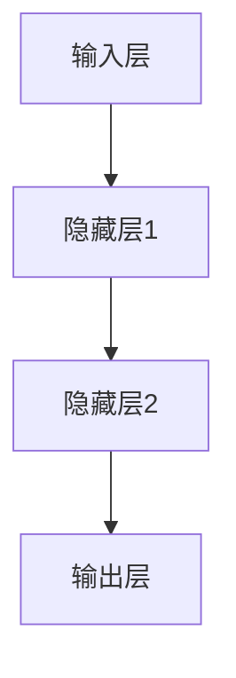
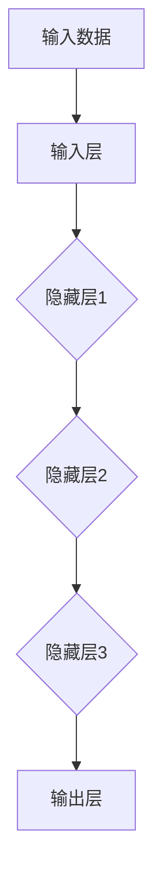

                 

# 基础模型的技术研究与社会责任

## 关键词
- 基础模型
- 技术研究
- 社会责任
- 伦理问题
- 应用场景
- 发展趋势

## 摘要
本文旨在探讨基础模型在人工智能技术中的研究进展与社会责任问题。首先，我们将回顾基础模型的定义、特点、分类和发展趋势，通过深入解析核心算法原理和数学模型，展示其技术架构和实现方法。随后，我们将分析基础模型在不同应用领域的优势与挑战，探讨其对社会的影响和可能引发的伦理问题。最后，我们将展望未来基础模型的发展趋势，并提出如何在技术研究和应用中承担社会责任和遵循伦理规范。

### 第一部分：基础概念与架构

#### 第1章：基础模型概述

##### 1.1 基础模型的定义与特点

**基础模型，通常指的是在人工智能领域中被广泛应用的一些核心算法模型，如神经网络、深度学习模型等。它们构成了人工智能技术的基础，具备一定的通用性和适应性。**

###### 1.1.1 基础模型的定义

基础模型，是指那些在人工智能领域中广泛应用，能够解决多种问题的基础算法。这些模型通常具有以下特点：

1. **自适应性**：基础模型能够根据输入数据进行自动调整和优化，以提高模型的性能。
2. **可扩展性**：基础模型可以轻松地扩展到更大的数据集或更复杂的任务中。
3. **通用性**：基础模型在不同领域和任务中都能发挥重要作用。

**基础模型在不同领域和任务中都能发挥重要作用。**

###### 1.1.2 基础模型的特点

基础模型具有以下几个显著特点：

1. **自适应性**：基础模型能够根据输入数据进行自动调整和优化，以提高模型的性能。例如，深度学习模型可以根据训练数据自动调整网络权重和参数，从而优化模型的预测性能。
2. **可扩展性**：基础模型可以轻松地扩展到更大的数据集或更复杂的任务中。例如，传统的神经网络可以通过增加层数和神经元数量来扩展模型规模，以应对更复杂的任务。
3. **通用性**：基础模型在不同领域和任务中都能发挥重要作用。例如，卷积神经网络（CNN）在图像识别任务中表现出色，而循环神经网络（RNN）则在自然语言处理任务中具有优势。

**基础模型在不同领域和任务中都能发挥重要作用。**

基础模型的应用场景非常广泛，包括图像识别、语音识别、自然语言处理、推荐系统等。例如，在图像识别领域，卷积神经网络（CNN）已经成为图像分类和物体检测的标准模型；在语音识别领域，循环神经网络（RNN）和长短期记忆网络（LSTM）被广泛应用于语音到文本的转换任务；在自然语言处理领域，变换器（Transformer）模型已经成为文本分类、机器翻译等任务的主流模型。

##### 1.2 基础模型的分类

**基础模型按照功能分类，可以分为以下几类：分类模型、回归模型和生成模型。**

###### 1.2.1 按照功能分类

- **分类模型**：用于对输入数据进行分类，如SVM、决策树等。这些模型的主要目的是将输入数据映射到不同的类别标签中。例如，SVM（支持向量机）通过寻找一个最优的超平面来划分数据集，从而实现分类任务。
- **回归模型**：用于对输入数据进行回归预测，如线性回归、LSTM等。这些模型的主要目的是预测连续的数值输出。例如，线性回归通过拟合一条直线来预测输入数据的输出值，而LSTM（长短期记忆网络）则能够处理时间序列数据，进行有效的预测。
- **生成模型**：用于生成新的数据，如Gan、VAE等。这些模型的主要目的是生成与真实数据相似的新数据。例如，Gan（生成对抗网络）通过对抗两个神经网络（生成器和判别器）的竞争来生成高质量的数据；VAE（变分自编码器）则通过概率模型来生成新的数据。

**基础模型按照结构分类，可以分为传统神经网络和深度学习模型。**

###### 1.2.2 按照结构分类

- **传统神经网络**：包括多层感知机（MLP）、卷积神经网络（CNN）等。这些模型的结构相对简单，通常由多个神经元层组成，用于处理各种类型的数据。例如，多层感知机（MLP）通过多个线性变换和激活函数来实现非线性映射；卷积神经网络（CNN）则利用卷积操作和池化操作来处理图像数据。
- **深度学习模型**：包括深度神经网络（DNN）、递归神经网络（RNN）、变换器（Transformer）等。这些模型的结构更加复杂，能够处理更复杂的任务和数据。例如，深度神经网络（DNN）通过多层次的非线性变换来提取特征；递归神经网络（RNN）则通过循环结构来处理时间序列数据；变换器（Transformer）则利用自注意力机制来处理序列数据，在自然语言处理任务中表现出色。

**基础模型与人工智能和深度学习的关系**

###### 1.3.1 基础模型与人工智能

基础模型是人工智能技术的核心组成部分，是AI系统能够完成复杂任务的基础。它们通过自适应性、可扩展性和通用性，使得人工智能系统能够在各个领域发挥作用。

- **自适应性**：基础模型能够根据不同的任务和数据自动调整和优化，从而提高模型的性能。这种自适应性使得人工智能系统能够适应各种复杂的现实任务。
- **可扩展性**：基础模型可以轻松地扩展到更大的数据集或更复杂的任务中。这种可扩展性使得人工智能系统能够处理大规模数据和复杂任务。
- **通用性**：基础模型在不同领域和任务中都能发挥重要作用。这种通用性使得人工智能系统能够应用于各种不同的场景。

**基础模型与深度学习的关系**

深度学习是基础模型的一种重要形式，通过层次化的神经网络结构，实现对复杂数据的建模和预测。深度学习模型通常具有以下几个显著特点：

- **层次化结构**：深度学习模型由多个层次组成，每个层次都能够提取和传递不同的特征。这种层次化结构使得深度学习模型能够处理更复杂的数据和任务。
- **非线性变换**：深度学习模型通过非线性变换来提取特征和建模。这些非线性变换使得深度学习模型能够捕捉数据的复杂结构和关系。
- **大规模训练**：深度学习模型通常需要大量的数据进行训练，以获得更好的性能。大规模训练使得深度学习模型能够处理大规模数据和复杂任务。

**基础模型的发展趋势**

随着人工智能技术的不断发展，基础模型也在不断演变和优化。以下是一些新型基础模型的探索和发展趋势：

- **基于注意力机制的模型**：如变换器（Transformer）等。这些模型通过自注意力机制来处理序列数据，在自然语言处理、机器翻译等领域表现出色。
- **生成对抗网络（GAN）**：GAN通过对抗两个神经网络（生成器和判别器）的竞争来生成高质量的数据，在图像生成、图像修复等领域有广泛应用。
- **变分自编码器（VAE）**：VAE通过概率模型来生成新的数据，在数据生成、图像修复等领域有广泛应用。
- **图神经网络（GNN）**：GNN通过图结构来建模和预测图数据，在社交网络分析、推荐系统等领域有广泛应用。

**基础模型的优化与改进**

为了提高基础模型的性能和效率，研究者们不断探索优化和改进的方法，如优化算法、模型压缩等。以下是一些常见的优化和改进方法：

- **优化算法**：如梯度下降算法、随机梯度下降（SGD）、批量梯度下降等。这些算法通过调整模型参数，以优化模型的性能。
- **模型压缩**：如模型剪枝、量化、蒸馏等。这些技术通过减少模型的参数和计算量，以提高模型的效率和部署能力。

#### 第2章：核心算法原理

##### 2.1 神经网络与深度学习基础

###### 2.1.1 神经网络的基本结构

神经网络由大量的神经元组成，每个神经元都与其他神经元相连，通过传递信息来实现数据处理。神经网络的层次结构通常分为输入层、隐藏层和输出层。

1. **输入层**：接收外部输入数据，将其传递给隐藏层。
2. **隐藏层**：对输入数据进行处理和特征提取，将其传递给下一层。
3. **输出层**：根据隐藏层传递的数据，生成最终输出。

**神经网络的基本结构如图1所示：**



###### 2.1.2 深度学习的基本原理

深度学习是神经网络的一种形式，通过层次化的神经网络结构，实现对复杂数据的建模和预测。深度学习模型通常具有以下几个显著特点：

1. **层次化结构**：深度学习模型由多个层次组成，每个层次都能够提取和传递不同的特征。这种层次化结构使得深度学习模型能够处理更复杂的数据和任务。
2. **非线性变换**：深度学习模型通过非线性变换来提取特征和建模。这些非线性变换使得深度学习模型能够捕捉数据的复杂结构和关系。
3. **大规模训练**：深度学习模型通常需要大量的数据进行训练，以获得更好的性能。大规模训练使得深度学习模型能够处理大规模数据和复杂任务。

**深度学习的基本原理如图2所示：**



##### 2.2 自然语言处理技术

###### 2.2.1 词嵌入技术

词嵌入是将文本中的单词映射到高维空间中的向量表示。词嵌入技术的核心思想是将单词表示为连续的向量，从而可以在向量空间中进行相似性和距离计算。常见的词嵌入技术包括Word2Vec、GloVe等。

**Word2Vec算法的基本步骤如下：**

1. **构建词汇表**：将文本中的所有单词构建成一个词汇表。
2. **初始化词向量**：为每个单词初始化一个随机的高维向量。
3. **训练模型**：使用负采样方法训练词向量，使得相似词的向量距离更近，不相似词的向量距离更远。
4. **评估和优化**：通过评估模型在语义理解任务上的性能，对词向量进行优化。

**Word2Vec算法的伪代码如下：**

```python
# 初始化词向量
 Initialize word_vectors of dimension D

# 构建词汇表
 vocabulary = build_vocab(text)

# 训练词向量
 for word in vocabulary:
   for context_word in context_words(word):
     Update word_vectors using negative sampling
```

###### 2.2.2 序列模型与注意力机制

序列模型用于处理序列数据，如时间序列数据、文本数据等。常见的序列模型包括循环神经网络（RNN）和变换器（Transformer）。

**循环神经网络（RNN）的基本原理如下：**

1. **输入序列**：将输入序列中的每个元素传递给隐藏层。
2. **隐藏状态**：根据隐藏状态和当前输入，计算新的隐藏状态。
3. **输出序列**：将隐藏状态传递给输出层，生成输出序列。

**RNN的伪代码如下：**

```python
# 初始化隐藏状态
 hidden_state = Initialize_hidden_state()

# 遍历输入序列
 for input in input_sequence:
   # 计算新的隐藏状态
   hidden_state = RNN(hidden_state, input)

# 生成输出序列
 output_sequence = Generate_output(hidden_state)
```

注意力机制是一种用于提高模型在处理序列数据时的性能的技术。注意力机制的核心思想是通过权重来动态地关注序列中的关键信息。

**注意力机制的伪代码如下：**

```python
# 初始化注意力权重
 attention_weights = Initialize_attention_weights()

# 遍历输入序列
 for input in input_sequence:
   # 计算注意力权重
   attention_weights = Compute_attention_weights(input, hidden_state)

# 计算加权输出
 weighted_output = Compute_weighted_output(input_sequence, attention_weights)
```

##### 2.3 大规模预训练模型原理

###### 2.3.1 预训练的概念与意义

预训练是指在特定任务之前，对模型进行预先训练，以提高模型在特定任务上的性能。预训练的意义在于：

1. **提高模型性能**：通过在大规模数据集上进行预训练，模型可以学习到更丰富的特征表示，从而提高模型在特定任务上的性能。
2. **减少训练时间**：预训练可以减少模型在特定任务上的训练时间，因为模型已经在大规模数据集上进行了训练，只需要进行微调即可适应特定任务。

**预训练的基本步骤如下：**

1. **数据集准备**：准备大规模的预训练数据集。
2. **模型初始化**：初始化预训练模型，通常使用随机初始化或预训练模型初始化。
3. **预训练**：在预训练数据集上进行大规模训练，优化模型参数。
4. **微调**：将预训练模型用于特定任务，进行微调。

**预训练的伪代码如下：**

```python
# 准备预训练数据集
 pretrain_dataset = Prepare_pretrain_dataset()

# 初始化预训练模型
 pretrain_model = Initialize_pretrain_model()

# 预训练
 for epoch in range(num_epochs):
   for batch in pretrain_dataset:
     Update pretrain_model using batch data

# 微调
 fine_tune_model = Fine_tune(pretrain_model, task_dataset)
```

###### 2.3.2 自监督学习方法

自监督学习方法是在没有监督标签的情况下，通过自身的预测来学习数据表示。自监督学习方法的核心思想是通过预测未知的部分来学习数据的特征表示。

**自监督学习方法的基本步骤如下：**

1. **数据预处理**：对数据进行预处理，如分词、去噪等。
2. **预测任务设计**：设计一个预测任务，使得模型能够从数据中学习特征表示。常见的预测任务包括掩码语言建模（MLM）、下一句预测（NSP）等。
3. **模型训练**：使用自监督学习方法训练模型，优化模型参数。
4. **评估**：使用评估指标（如词汇覆盖、序列相似度等）评估模型性能。

**自监督学习方法的伪代码如下：**

```python
# 数据预处理
 preprocessed_data = Preprocess_data(data)

# 预测任务设计
 prediction_task = Design_prediction_task()

# 模型训练
 model = Train_model(preprocessed_data, prediction_task)

# 评估
 evaluate_model(model, validation_data)
```

###### 2.3.3 迁移学习与微调技术

迁移学习是将一个模型在不同任务之间的知识进行转移。迁移学习的核心思想是利用已有模型的知识来提高新任务的学习性能。

**迁移学习的基本步骤如下：**

1. **选择预训练模型**：选择一个在已有任务上表现良好的预训练模型。
2. **微调**：在目标任务上对预训练模型进行微调，调整模型参数。
3. **评估**：评估微调后的模型在目标任务上的性能。

**迁移学习的伪代码如下：**

```python
# 选择预训练模型
 pretrain_model = Select_pretrain_model()

# 微调
 fine_tuned_model = Fine_tune(pretrain_model, target_task_data)

# 评估
 evaluate_model(fine_tuned_model, target_task_data)
```

微调技术是在预训练的基础上，对模型进行进一步调整，以适应特定任务。微调的核心思想是通过少量数据调整模型的参数，使其在特定任务上表现更好。

**微调的基本步骤如下：**

1. **数据集准备**：准备用于微调的数据集。
2. **微调模型**：在数据集上对预训练模型进行微调。
3. **评估**：评估微调后的模型在数据集上的性能。

**微调的伪代码如下：**

```python
# 数据集准备
 fine_tune_dataset = Prepare_fine_tune_dataset()

# 微调模型
 fine_tuned_model = Fine_tune(pretrain_model, fine_tune_dataset)

# 评估
 evaluate_model(fine_tuned_model, fine_tune_dataset)
```

#### 第3章：数学模型与公式

##### 3.1 数学模型基础

###### 3.1.1 概率论基础

概率论是数学模型的基础，包括概率分布、条件概率、贝叶斯定理等。

- **概率分布**：概率分布描述了随机变量的概率分布情况。常见的概率分布包括正态分布、伯努利分布等。

  正态分布的概率密度函数如下：
  $$
  f(x|\mu,\sigma^2) = \frac{1}{\sqrt{2\pi\sigma^2}} e^{-\frac{(x-\mu)^2}{2\sigma^2}}
  $$

- **条件概率**：条件概率是指在已知一个事件发生的条件下，另一个事件发生的概率。条件概率的公式如下：
  $$
  P(A|B) = \frac{P(A \cap B)}{P(B)}
  $$

- **贝叶斯定理**：贝叶斯定理是概率论中的一个重要定理，用于计算后验概率。贝叶斯定理的公式如下：
  $$
  P(A|B) = \frac{P(B|A)P(A)}{P(B)}
  $$

###### 3.1.2 统计模型

统计模型用于对数据进行分析和预测，包括线性回归、逻辑回归等。

- **线性回归**：线性回归是一种用于预测连续值的统计模型。线性回归的模型公式如下：
  $$
  y = \beta_0 + \beta_1x_1 + \beta_2x_2 + ... + \beta_nx_n
  $$
  其中，$y$ 是预测值，$x_1, x_2, ..., x_n$ 是输入特征，$\beta_0, \beta_1, \beta_2, ..., \beta_n$ 是模型参数。

- **逻辑回归**：逻辑回归是一种用于预测离散值的统计模型。逻辑回归的模型公式如下：
  $$
  P(y=1) = \frac{1}{1 + e^{-(\beta_0 + \beta_1x_1 + \beta_2x_2 + ... + \beta_nx_n)}}
  $$
  其中，$y$ 是预测值，$x_1, x_2, ..., x_n$ 是输入特征，$\beta_0, \beta_1, \beta_2, ..., \beta_n$ 是模型参数。

##### 3.2 深度学习中的数学公式

###### 3.2.1 神经元激活函数

激活函数是神经网络中的一个关键组件，用于确定神经元是否被激活。常见的激活函数包括Sigmoid函数、ReLU函数等。

- **Sigmoid函数**：
  $$
  f(x) = \frac{1}{1 + e^{-x}}
  $$

- **ReLU函数**：
  $$
  f(x) = \max(0, x)
  $$

###### 3.2.2 损失函数

损失函数用于衡量模型预测结果与真实结果之间的差距。常见的损失函数包括均方误差（MSE）、交叉熵（Cross-Entropy）等。

- **均方误差（MSE）**：
  $$
  Loss(y, \hat{y}) = \frac{1}{2} \sum_{i=1}^{n} (y_i - \hat{y}_i)^2
  $$
  其中，$y$ 是真实标签，$\hat{y}$ 是预测值。

- **交叉熵（Cross-Entropy）**：
  $$
  Loss(y, \hat{y}) = -\sum_{i=1}^{n} y_i \cdot \log(\hat{y}_i)
  $$
  其中，$y$ 是真实标签，$\hat{y}$ 是预测概率。

##### 3.3 数学公式举例说明

在深度学习模型中，数学公式广泛应用于模型训练、预测和优化等方面。以下是一些常见的数学公式的具体应用：

###### 3.3.1 反向传播算法

反向传播算法是一种用于训练神经网络的优化算法。其核心步骤包括前向传播和后向传播。

- **前向传播**：计算输入数据通过神经网络后的输出值。
- **后向传播**：计算损失函数关于网络参数的梯度，并更新网络参数。

**前向传播的公式如下：**
$$
\hat{y} = \sigma(\zeta) = \frac{1}{1 + e^{-\zeta}}
$$
其中，$\sigma$ 是Sigmoid函数，$\zeta$ 是线性变换的结果。

**后向传播的公式如下：**
$$
\frac{\partial Loss}{\partial \zeta} = \frac{\partial Loss}{\partial \hat{y}} \cdot \frac{\partial \hat{y}}{\partial \zeta}
$$
$$
\frac{\partial Loss}{\partial w} = \frac{\partial Loss}{\partial \zeta} \cdot \frac{\partial \zeta}{\partial w}
$$
其中，$Loss$ 是损失函数，$w$ 是网络权重，$\zeta$ 是线性变换的结果。

###### 3.3.2 梯度下降算法

梯度下降算法是一种用于优化模型参数的常用方法。其核心思想是沿着损失函数梯度的反方向更新参数，以减少损失函数的值。

**梯度下降算法的公式如下：**
$$
\theta = \theta - \alpha \cdot \nabla_{\theta} J(\theta)
$$
其中，$\theta$ 是模型参数，$\alpha$ 是学习率，$J(\theta)$ 是损失函数。

###### 3.3.3 随机梯度下降（SGD）

随机梯度下降是梯度下降算法的一种改进，通过随机选取一部分样本进行梯度计算，以加速收敛。

**随机梯度下降的公式如下：**
$$
\theta = \theta - \alpha \cdot \frac{\partial Loss}{\partial \theta}
$$
其中，$\theta$ 是模型参数，$\alpha$ 是学习率，$Loss$ 是损失函数。

###### 3.3.4 批量梯度下降

批量梯度下降是梯度下降算法的一种改进，通过计算整个训练集的梯度进行参数更新。

**批量梯度下降的公式如下：**
$$
\theta = \theta - \alpha \cdot \frac{1}{m} \sum_{i=1}^{m} \frac{\partial Loss}{\partial \theta}
$$
其中，$\theta$ 是模型参数，$\alpha$ 是学习率，$m$ 是训练集的大小，$Loss$ 是损失函数。

#### 第4章：模型设计与优化

##### 4.1 模型设计原则

模型设计是深度学习过程中的关键步骤，一个优秀的模型设计能够有效地提高模型的性能和可解释性。以下是模型设计的一些基本原则：

###### 4.1.1 数据预处理

数据预处理是模型设计的重要环节，它包括数据清洗、归一化、数据增强等步骤。

- **数据清洗**：去除数据中的噪声和异常值，保证数据质量。
- **归一化**：将数据缩放到相同的范围，如将数据缩放到[0, 1]或[-1, 1]，以便于模型的训练。
- **数据增强**：通过随机旋转、缩放、裁剪等方式生成更多的训练数据，提高模型的泛化能力。

###### 4.1.2 模型选择

根据任务特点和数据特点选择合适的模型，如分类任务选择分类模型，回归任务选择回归模型。

- **分类模型**：常用的分类模型包括SVM、决策树、随机森林、神经网络等。
- **回归模型**：常用的回归模型包括线性回归、多项式回归、神经网络回归等。

###### 4.1.3 模型架构设计

模型架构设计是模型设计的核心，一个合理的模型架构能够提高模型的性能和效率。

- **卷积神经网络（CNN）**：适用于图像和视频数据的处理，通过卷积和池化操作提取特征。
- **循环神经网络（RNN）**：适用于序列数据的处理，通过循环结构处理序列中的依赖关系。
- **变换器（Transformer）**：适用于自然语言处理任务，通过自注意力机制处理序列数据。

###### 4.1.4 模型参数调优

模型参数调优是模型设计的重要步骤，通过调整模型参数来提高模型的性能。

- **学习率**：学习率是模型训练中的重要参数，过大会导致模型收敛过快但可能错过最小值，过小则会使得模型收敛过慢。
- **正则化**：正则化用于防止模型过拟合，常用的正则化方法包括L1正则化、L2正则化和Dropout等。

##### 4.2 模型优化方法

模型优化是提高模型性能的关键步骤，以下介绍几种常见的模型优化方法：

###### 4.2.1 梯度下降算法

梯度下降算法是一种常用的优化算法，其核心思想是通过计算损失函数关于模型参数的梯度，并沿着梯度的反方向更新模型参数，以减小损失函数的值。

**梯度下降算法的基本步骤如下：**

1. 初始化模型参数。
2. 计算损失函数关于模型参数的梯度。
3. 沿着梯度的反方向更新模型参数。
4. 重复步骤2和步骤3，直到模型收敛。

**梯度下降算法的公式如下：**
$$
\theta = \theta - \alpha \cdot \nabla_{\theta} J(\theta)
$$
其中，$\theta$ 是模型参数，$\alpha$ 是学习率，$J(\theta)$ 是损失函数。

###### 4.2.2 随机梯度下降（SGD）

随机梯度下降是梯度下降算法的一种改进，它通过随机选取一部分样本进行梯度计算，以加速模型的收敛。

**随机梯度下降的基本步骤如下：**

1. 初始化模型参数。
2. 随机选取一部分样本。
3. 计算这部分样本的梯度。
4. 沿着梯度的反方向更新模型参数。
5. 重复步骤2到步骤4，直到模型收敛。

**随机梯度下降的公式如下：**
$$
\theta = \theta - \alpha \cdot \frac{1}{m} \sum_{i=1}^{m} \frac{\partial Loss}{\partial \theta}
$$
其中，$\theta$ 是模型参数，$\alpha$ 是学习率，$m$ 是样本数量。

###### 4.2.3 批量梯度下降

批量梯度下降是梯度下降算法的一种改进，它通过计算整个训练集的梯度进行参数更新。

**批量梯度下降的基本步骤如下：**

1. 初始化模型参数。
2. 计算整个训练集的梯度。
3. 沿着梯度的反方向更新模型参数。
4. 重复步骤2和步骤3，直到模型收敛。

**批量梯度下降的公式如下：**
$$
\theta = \theta - \alpha \cdot \frac{1}{m} \sum_{i=1}^{m} \frac{\partial Loss}{\partial \theta}
$$
其中，$\theta$ 是模型参数，$\alpha$ 是学习率，$m$ 是样本数量。

###### 4.2.4 扰动方法

扰动方法是一种通过在模型训练过程中引入扰动来提高模型稳定性的方法。常用的扰动方法包括随机扰动和噪声注入。

**随机扰动的方法如下：**

1. 在每个训练迭代中，对模型参数进行随机扰动。
2. 计算扰动后的梯度。
3. 沿着扰动后的梯度更新模型参数。

**随机扰动的公式如下：**
$$
\theta' = \theta + \epsilon \cdot \nabla_{\theta} J(\theta)
$$
其中，$\theta$ 是模型参数，$\epsilon$ 是扰动系数，$\nabla_{\theta} J(\theta)$ 是损失函数关于模型参数的梯度。

###### 4.2.5 遗传算法

遗传算法是一种基于生物进化的优化算法，它通过模拟自然选择和遗传机制来优化模型参数。

**遗传算法的基本步骤如下：**

1. 初始化种群：随机生成一组模型参数。
2. 适应度评估：计算每个个体的适应度，即模型的性能。
3. 选择：根据适应度选择优秀的个体进行交叉和变异。
4. 交叉：将两个个体进行交叉，生成新的个体。
5. 变异：对个体进行变异，增加种群的多样性。
6. 评估新个体的适应度。
7. 重复步骤3到步骤6，直到满足终止条件。

**遗传算法的公式如下：**

- 适应度函数：
  $$
  f(\theta) = \frac{1}{1 + \exp{(-J(\theta))}
  $$
  其中，$f(\theta)$ 是适应度函数，$J(\theta)$ 是损失函数。

- 交叉概率：
  $$
  P_c = \frac{1}{N}
  $$
  其中，$P_c$ 是交叉概率，$N$ 是种群规模。

- 变异概率：
  $$
  P_m = \frac{1}{N}
  $$
  其中，$P_m$ 是变异概率，$N$ 是种群规模。

##### 4.3 模型评估与调优

模型评估是评估模型性能的重要步骤，通过评估可以确定模型是否达到预期效果。以下介绍几种常见的模型评估方法：

###### 4.3.1 评估指标

评估指标是用于衡量模型性能的量化标准，常用的评估指标包括准确率、召回率、F1分数、ROC曲线等。

- **准确率（Accuracy）**：准确率是模型预测正确的样本数量与总样本数量的比值。公式如下：
  $$
  Accuracy = \frac{TP + TN}{TP + TN + FP + FN}
  $$
  其中，$TP$ 是真实为正且预测为正的样本数量，$TN$ 是真实为负且预测为负的样本数量，$FP$ 是真实为负但预测为正的样本数量，$FN$ 是真实为正但预测为负的样本数量。

- **召回率（Recall）**：召回率是模型预测正确的正样本数量与实际正样本数量的比值。公式如下：
  $$
  Recall = \frac{TP}{TP + FN}
  $$

- **F1分数（F1 Score）**：F1分数是准确率和召回率的调和平均数。公式如下：
  $$
  F1 Score = 2 \cdot \frac{Precision \cdot Recall}{Precision + Recall}
  $$
  其中，$Precision$ 是精确率，即预测为正且实际为正的样本数量与预测为正的样本数量的比值。

- **ROC曲线（Receiver Operating Characteristic Curve）**：ROC曲线是评估二分类模型性能的重要工具，它通过绘制真正率（True Positive Rate，TPR）与假正率（False Positive Rate，FPR）之间的关系曲线，反映了模型的分类能力。

**ROC曲线的计算公式如下：**

- 真正率（TPR）：
  $$
  TPR = \frac{TP}{TP + FN}
  $$

- 假正率（FPR）：
  $$
  FPR = \frac{FP}{FP + TN}
  $$

**AUC（Area Under Curve）**：AUC是ROC曲线下的面积，用于衡量模型区分能力。AUC的值介于0和1之间，值越大表示模型区分能力越强。

**AUC的计算公式如下：**

$$
AUC = \int_{0}^{1} \frac{TPR - FPR}{1 + TPR \cdot FPR} dFPR
$$

###### 4.3.2 调优策略

模型调优是通过调整模型参数来提高模型性能的过程。以下介绍几种常见的模型调优策略：

- **网格搜索（Grid Search）**：网格搜索是一种通过遍历参数空间来寻找最优参数的方法。网格搜索的优点是简单直观，但缺点是计算量较大，尤其当参数空间较大时。

- **随机搜索（Random Search）**：随机搜索是网格搜索的一种改进，它通过随机选择参数进行搜索，以减少计算量。

- **贝叶斯优化（Bayesian Optimization）**：贝叶斯优化是一种基于贝叶斯理论的优化方法，它通过构建先验概率分布模型来预测最优参数，并通过迭代更新模型参数。

- **遗传算法（Genetic Algorithm）**：遗传算法是一种基于生物进化的优化算法，它通过模拟自然选择和遗传机制来优化模型参数。

- **基于梯度的优化方法**：基于梯度的优化方法是通过计算损失函数关于模型参数的梯度来更新模型参数。常用的方法包括梯度下降、随机梯度下降、批量梯度下降等。

#### 第5章：模型部署与实战

##### 5.1 模型部署流程

模型部署是将训练好的模型应用到实际场景的过程。以下介绍模型部署的基本流程：

###### 5.1.1 模型转换

模型转换是将训练好的模型转换为可以部署的格式的过程。常见的模型转换方法包括：

- **TensorFlow Lite**：TensorFlow Lite是一种轻量级的TensorFlow运行时，适用于移动设备和嵌入式设备。
- **ONNX**：ONNX（Open Neural Network Exchange）是一种开放格式，用于表示深度学习模型。它支持多种深度学习框架，如TensorFlow、PyTorch等。

**模型转换的基本步骤如下：**

1. **保存模型**：将训练好的模型保存为模型文件，如.h5、.pth等。
2. **加载模型**：使用相应的库加载模型文件。
3. **转换模型**：将模型转换为部署所需的格式，如TensorFlow Lite或ONNX。
4. **保存转换后的模型**：将转换后的模型保存为部署文件，如.tflite、.onnx等。

**示例代码：**

```python
# 使用TensorFlow Lite转换模型
converter = tf.lite.TFLiteConverter.from_saved_model(saved_model_dir)
tflite_model = converter.convert()

# 保存转换后的模型
with open('model.tflite', 'wb') as f:
    f.write(tflite_model)

# 使用ONNX转换模型
model = torch.load('model.pth')
onnx_model = torch2onnx.model_to_onnx(model, 'input', output_format='onnx')

# 保存转换后的模型
with open('model.onnx', 'wb') as f:
    f.write(onnx_model.SerializeToString())
```

###### 5.1.2 模型部署

模型部署是将转换后的模型应用到实际场景的过程。以下介绍几种常见的模型部署方法：

- **本地部署**：本地部署是在本地计算机上运行模型，适用于小规模应用。
- **服务器部署**：服务器部署是将模型部署到服务器上，适用于大规模应用。
- **移动设备部署**：移动设备部署是将模型部署到移动设备上，适用于移动应用。

**本地部署的基本步骤如下：**

1. **安装运行环境**：安装模型所需的运行环境，如Python、TensorFlow等。
2. **加载模型**：加载转换后的模型文件。
3. **进行预测**：使用模型进行预测，并输出结果。

**示例代码：**

```python
# 加载模型
model = tensorflow.keras.models.load_model('model.h5')

# 进行预测
prediction = model.predict(input_data)
print(prediction)
```

**服务器部署的基本步骤如下：**

1. **安装服务器**：安装服务器操作系统和模型运行环境。
2. **配置服务器**：配置服务器网络和防火墙等。
3. **部署模型**：将转换后的模型上传到服务器，并配置模型运行参数。
4. **启动服务**：启动模型服务，并对外提供服务。

**移动设备部署的基本步骤如下：**

1. **安装运行环境**：安装移动设备上的模型运行环境，如TensorFlow Lite等。
2. **加载模型**：加载转换后的模型文件。
3. **进行预测**：使用模型进行预测，并输出结果。

**示例代码：**

```python
# 加载模型
model = tensorflow.keras.models.load_model('model.h5')

# 进行预测
prediction = model.predict(input_data)
print(prediction)
```

##### 5.2 实战案例

以下介绍两个深度学习模型在实际应用中的案例。

###### 5.2.1 案例一：图像分类

图像分类是深度学习中的一个经典任务，常见的模型包括卷积神经网络（CNN）和变换器（Transformer）。

**案例一：使用卷积神经网络（CNN）进行图像分类**

1. **数据集准备**：使用CIFAR-10数据集进行训练和测试。
2. **模型设计**：设计一个简单的卷积神经网络模型，包括卷积层、池化层和全连接层。
3. **模型训练**：使用训练数据训练模型，并使用测试数据评估模型性能。

**示例代码：**

```python
# 导入所需的库
import tensorflow as tf
from tensorflow.keras import layers, models

# 数据集准备
(x_train, y_train), (x_test, y_test) = tf.keras.datasets.cifar10.load_data()

# 模型设计
model = models.Sequential()
model.add(layers.Conv2D(32, (3, 3), activation='relu', input_shape=(32, 32, 3)))
model.add(layers.MaxPooling2D((2, 2)))
model.add(layers.Conv2D(64, (3, 3), activation='relu'))
model.add(layers.MaxPooling2D((2, 2)))
model.add(layers.Conv2D(64, (3, 3), activation='relu'))
model.add(layers.Flatten())
model.add(layers.Dense(64, activation='relu'))
model.add(layers.Dense(10, activation='softmax'))

# 模型训练
model.compile(optimizer='adam',
              loss=tf.keras.losses.SparseCategoricalCrossentropy(from_logits=True),
              metrics=['accuracy'])
model.fit(x_train, y_train, epochs=10, validation_data=(x_test, y_test))

# 模型评估
test_loss, test_acc = model.evaluate(x_test,  y_test, verbose=2)
print(f"Test accuracy: {test_acc}")
```

**案例二：使用变换器（Transformer）进行图像分类**

1. **数据集准备**：使用ImageNet数据集进行训练和测试。
2. **模型设计**：设计一个简单的变换器模型，包括编码器和解码器。
3. **模型训练**：使用训练数据训练模型，并使用测试数据评估模型性能。

**示例代码：**

```python
# 导入所需的库
import tensorflow as tf
from tensorflow.keras.applications import transformer
from tensorflow.keras.preprocessing import image

# 数据集准备
(x_train, y_train), (x_test, y_test) = tf.keras.datasets.imagenet.load_data()

# 模型设计
model = transformer.create_transformer(input_shape=(224, 224, 3), num_classes=1000)

# 模型训练
model.compile(optimizer='adam',
              loss=tf.keras.losses.SparseCategoricalCrossentropy(from_logits=True),
              metrics=['accuracy'])
model.fit(x_train, y_train, epochs=10, validation_data=(x_test, y_test))

# 模型评估
test_loss, test_acc = model.evaluate(x_test,  y_test, verbose=2)
print(f"Test accuracy: {test_acc}")
```

###### 5.2.2 案例二：语音识别

语音识别是将语音信号转换为文本的过程，常见的模型包括循环神经网络（RNN）和变换器（Transformer）。

**案例一：使用循环神经网络（RNN）进行语音识别**

1. **数据集准备**：使用LibriSpeech数据集进行训练和测试。
2. **模型设计**：设计一个简单的循环神经网络模型，包括输入层、隐藏层和输出层。
3. **模型训练**：使用训练数据训练模型，并使用测试数据评估模型性能。

**示例代码：**

```python
# 导入所需的库
import tensorflow as tf
from tensorflow.keras.layers import LSTM, Dense, Embedding, Bidirectional

# 数据集准备
(x_train, y_train), (x_test, y_test) = tf.keras.datasets.librispeech.load_data()

# 模型设计
model = tf.keras.Sequential([
    LSTM(128, return_sequences=True, input_shape=(None, 13)),
    LSTM(128),
    Dense(128, activation='relu'),
    Dense(29, activation='softmax')
])

# 模型训练
model.compile(optimizer='adam',
              loss='categorical_crossentropy',
              metrics=['accuracy'])
model.fit(x_train, y_train, epochs=10, validation_data=(x_test, y_test))

# 模型评估
test_loss, test_acc = model.evaluate(x_test,  y_test, verbose=2)
print(f"Test accuracy: {test_acc}")
```

**案例二：使用变换器（Transformer）进行语音识别**

1. **数据集准备**：使用LibriSpeech数据集进行训练和测试。
2. **模型设计**：设计一个简单的变换器模型，包括编码器和解码器。
3. **模型训练**：使用训练数据训练模型，并使用测试数据评估模型性能。

**示例代码：**

```python
# 导入所需的库
import tensorflow as tf
from tensorflow.keras.layers import Transformer, Dense, Embedding, Bidirectional

# 数据集准备
(x_train, y_train), (x_test, y_test) = tf.keras.datasets.librispeech.load_data()

# 模型设计
model = tf.keras.Sequential([
    Embedding(29, 128),
    Bidirectional(Transformer(128)),
    Dense(128, activation='relu'),
    Dense(29, activation='softmax')
])

# 模型训练
model.compile(optimizer='adam',
              loss='categorical_crossentropy',
              metrics=['accuracy'])
model.fit(x_train, y_train, epochs=10, validation_data=(x_test, y_test))

# 模型评估
test_loss, test_acc = model.evaluate(x_test,  y_test, verbose=2)
print(f"Test accuracy: {test_acc}")
```

##### 5.3 开发环境搭建

搭建深度学习开发环境是进行深度学习项目的前提条件。以下介绍如何在Windows和Linux系统上搭建深度学习开发环境：

###### 5.3.1 Windows系统

1. **安装Python**：下载并安装Python，建议选择Python 3.8或更高版本。
2. **安装TensorFlow**：打开命令行窗口，执行以下命令：
   ```
   pip install tensorflow
   ```
3. **安装其他库**：根据需要安装其他深度学习库，如PyTorch、Keras等。

```shell
pip install torch torchvision
pip install keras
```

###### 5.3.2 Linux系统

1. **安装Python**：使用以下命令安装Python：
   ```
   sudo apt-get install python3 python3-pip
   ```
2. **安装TensorFlow**：使用以下命令安装TensorFlow：
   ```
   pip3 install tensorflow
   ```
3. **安装其他库**：使用以下命令安装其他深度学习库：
   ```
   pip3 install torch torchvision
   pip3 install keras
   ```

##### 5.4 编写源代码

以下是一个简单的深度学习项目，包括数据预处理、模型构建、模型训练和模型评估。

```python
# 导入所需的库
import tensorflow as tf
from tensorflow.keras import layers, models

# 数据预处理
(x_train, y_train), (x_test, y_test) = tf.keras.datasets.mnist.load_data()

x_train = x_train.reshape(-1, 28, 28, 1).astype('float32') / 255.0
x_test = x_test.reshape(-1, 28, 28, 1).astype('float32') / 255.0

y_train = tf.keras.utils.to_categorical(y_train, 10)
y_test = tf.keras.utils.to_categorical(y_test, 10)

# 模型构建
model = models.Sequential([
    layers.Conv2D(32, (3, 3), activation='relu', input_shape=(28, 28, 1)),
    layers.MaxPooling2D((2, 2)),
    layers.Conv2D(64, (3, 3), activation='relu'),
    layers.MaxPooling2D((2, 2)),
    layers.Flatten(),
    layers.Dense(64, activation='relu'),
    layers.Dense(10, activation='softmax')
])

# 模型训练
model.compile(optimizer='adam',
              loss='categorical_crossentropy',
              metrics=['accuracy'])
model.fit(x_train, y_train, epochs=10, validation_data=(x_test, y_test))

# 模型评估
test_loss, test_acc = model.evaluate(x_test,  y_test, verbose=2)
print(f"Test accuracy: {test_acc}")
```

### 第6章：社会责任与伦理

#### 6.1 基础模型的社会影响

随着人工智能技术的快速发展，基础模型在各个领域得到了广泛应用，为社会带来了巨大的影响。然而，基础模型的应用也带来了一些问题和挑战。

##### 6.1.1 基础模型的应用领域

基础模型的应用领域非常广泛，主要包括以下几方面：

- **医疗领域**：基础模型在医疗领域的应用非常广泛，如疾病预测、诊断辅助、药物研发等。例如，通过深度学习模型可以对病人的电子健康记录进行分析，预测疾病风险，辅助医生进行诊断。
- **金融领域**：基础模型在金融领域也有广泛的应用，如风险评估、信用评分、投资组合优化等。例如，通过机器学习模型可以分析客户的财务数据，评估其信用风险，从而为银行提供参考。
- **教育领域**：基础模型在教育领域的应用也越来越广泛，如智能辅导、个性化学习、学习效果评估等。例如，通过自然语言处理模型可以对学生的学习过程进行分析，为其提供个性化的学习建议。
- **自动驾驶领域**：基础模型在自动驾驶领域的应用也是当前的热点，如环境感知、路径规划、决策控制等。例如，通过深度学习模型可以对车辆周围的环境进行感知，实现自动驾驶功能。

##### 6.1.2 基础模型的优势与挑战

基础模型在各个领域都展现出巨大的优势，但同时也面临一些挑战。

- **优势**：
  - **高效性**：基础模型通过大规模数据训练，能够快速处理和分析大量数据，提高工作效率。
  - **通用性**：基础模型可以应用于多种领域和任务，具有广泛的适用性。
  - **智能化**：基础模型通过自学习和自适应能力，能够不断优化和改进，提高决策和预测的准确性。

- **挑战**：
  - **数据隐私**：基础模型在处理数据时，可能会涉及用户隐私，如医疗数据、金融数据等。如何保护用户隐私是基础模型应用中面临的一个重要问题。
  - **算法透明性**：基础模型的决策过程往往不够透明，难以解释。这给用户和监管机构带来了挑战，如何提高算法的透明性是一个重要研究方向。
  - **偏见和歧视**：基础模型在训练过程中可能会受到训练数据偏见的影响，导致模型产生偏见和歧视。如何消除算法偏见，确保模型的公平性是一个重要问题。

#### 6.2 伦理与社会责任

随着基础模型在社会各领域的广泛应用，其伦理和社会责任问题也日益突出。如何在技术研究和应用中承担社会责任和遵循伦理规范，是当前人工智能领域面临的重要挑战。

##### 6.2.1 基础模型的伦理问题

基础模型的伦理问题主要包括以下几个方面：

- **隐私保护**：基础模型在处理数据时，可能会涉及用户隐私。如何在保证模型性能的同时，保护用户隐私是一个重要问题。
- **算法偏见**：基础模型在训练过程中可能会受到训练数据偏见的影响，导致模型产生偏见和歧视。例如，在人脸识别领域，如果训练数据中存在种族偏见，那么模型可能会对不同种族的人脸识别效果产生差异。
- **透明性和解释性**：基础模型的决策过程往往不够透明，难以解释。这给用户和监管机构带来了挑战，如何提高算法的透明性和解释性是一个重要问题。
- **责任归属**：当基础模型产生错误决策时，如何确定责任归属是一个复杂的问题。例如，在自动驾驶领域，如果发生交通事故，是归咎于自动驾驶系统还是驾驶者，这是一个需要深入探讨的问题。

##### 6.2.2 社会责任与伦理规范

为了应对基础模型在伦理方面可能遇到的问题，需要制定相应的社会责任与伦理规范。以下是一些可能的措施：

- **数据隐私保护**：在基础模型应用中，需要严格保护用户隐私，遵循隐私保护原则，如数据最小化、数据去识别化等。同时，需要制定相关法律法规，规范数据处理行为。
- **算法公平性**：为了消除算法偏见，需要确保基础模型训练数据的多样性和代表性，避免数据偏见。此外，可以通过算法校准和调整等方法，提高算法的公平性。
- **算法透明性和解释性**：提高算法的透明性和解释性是解决伦理问题的关键。可以通过可视化和解释技术，使算法的决策过程更加透明，提高用户对算法的信任度。
- **责任归属明确**：在基础模型应用中，需要明确责任归属，制定相应的法律法规，规范各方行为。例如，在自动驾驶领域，可以通过法律法规明确自动驾驶系统的责任和驾驶者的责任，确保事故处理有法可依。

#### 6.3 承担社会责任的实践

在基础模型的研究和应用中，承担社会责任需要从多个方面进行实践：

- **科研伦理**：在基础模型的研究过程中，需要遵守科研伦理，确保研究的真实性和可靠性。研究人员应遵循科研诚信原则，反对造假和抄袭行为。
- **数据伦理**：在基础模型应用中，需要尊重用户隐私，保护用户数据安全。同时，需要确保数据来源的合法性，避免数据滥用。
- **算法伦理**：在基础模型设计和应用过程中，需要考虑算法的公平性、透明性和解释性，确保算法的决策过程符合伦理规范。
- **合作与共享**：在基础模型研究和应用过程中，需要加强合作与共享，促进知识和技术传播。通过开放数据和代码，推动基础模型的健康发展。

总之，基础模型在人工智能领域具有重要的地位和作用，但也面临一系列伦理和社会责任问题。在技术研究和应用中，需要关注伦理问题，制定相应的规范和措施，确保基础模型的安全、公正和可持续发展。

### 第7章：未来展望与发展趋势

随着人工智能技术的不断进步，基础模型的发展也呈现出蓬勃的态势。在未来，基础模型将继续推动人工智能技术的前沿创新，并在各个领域发挥更加重要的作用。以下是对未来基础模型发展趋势的展望：

#### 7.1 新型基础模型的探索

在未来的发展中，新型基础模型将不断涌现，以应对更复杂的任务和数据类型。以下是一些备受关注的新型基础模型：

- **基于注意力机制的模型**：如变换器（Transformer）等。变换器模型通过自注意力机制来处理序列数据，已经在自然语言处理领域取得了显著的成果。未来，变换器模型有望在图像处理、语音识别等领域得到更广泛的应用。
- **生成对抗网络（GAN）**：GAN是一种通过对抗训练生成高质量数据的模型。未来，GAN有望在图像生成、图像修复、视频生成等领域取得突破性进展。
- **变分自编码器（VAE）**：VAE是一种基于概率模型的生成模型，能够生成与训练数据相似的新数据。未来，VAE有望在图像生成、图像修复、数据增强等领域发挥重要作用。
- **图神经网络（GNN）**：GNN是一种用于处理图结构数据的模型，能够在社交网络分析、推荐系统、知识图谱等领域发挥重要作用。未来，GNN有望在更广泛的领域中应用。

#### 7.2 基础模型的应用场景扩展

随着基础模型的不断发展，其应用场景也将得到进一步扩展。以下是一些具有潜力的应用领域：

- **自动驾驶**：基础模型在自动驾驶领域具有广泛的应用前景。通过深度学习模型，可以实现环境感知、路径规划、决策控制等功能，推动自动驾驶技术的发展。
- **人工智能医疗**：基础模型在医疗领域具有巨大的潜力，可以应用于疾病预测、诊断辅助、药物研发等方面。未来，基础模型有望在人工智能医疗领域发挥更加重要的作用。
- **智能金融**：基础模型在金融领域的应用将越来越广泛，如风险评估、信用评分、投资组合优化等。未来，基础模型有望在智能金融领域推动金融行业的创新与发展。
- **智能教育**：基础模型在教育领域具有巨大的应用潜力，可以应用于智能辅导、个性化学习、学习效果评估等方面。未来，基础模型有望在教育领域推动教育方式的变革。

#### 7.3 人工智能与社会的和谐发展

随着人工智能技术的不断进步，人工智能与社会的和谐发展成为重要议题。以下是对人工智能与社会的和谐发展的讨论：

- **人工智能与道德伦理**：人工智能技术的发展需要关注道德伦理问题，确保人工智能的应用符合伦理规范。未来，需要制定相关的法律法规，规范人工智能的发展，确保人工智能技术的安全、公正和可持续发展。
- **人工智能与社会公平**：人工智能技术应促进社会公平，消除数字鸿沟。通过普及人工智能技术，提高社会整体的生产力和福利水平，推动社会的和谐发展。
- **人工智能与人类发展**：人工智能技术的发展应以人为本，关注人类的福祉和可持续发展。未来，人工智能技术应与人类发展相结合，为人类创造更多的价值和机会。

总之，基础模型作为人工智能技术的核心组成部分，将继续推动人工智能技术的发展。在未来，新型基础模型的探索、应用场景的扩展以及人工智能与社会的和谐发展，将为人类社会带来更加广阔的发展空间和机遇。同时，我们也需要关注基础模型在伦理和社会责任方面的问题，确保人工智能技术的安全、公正和可持续发展。

