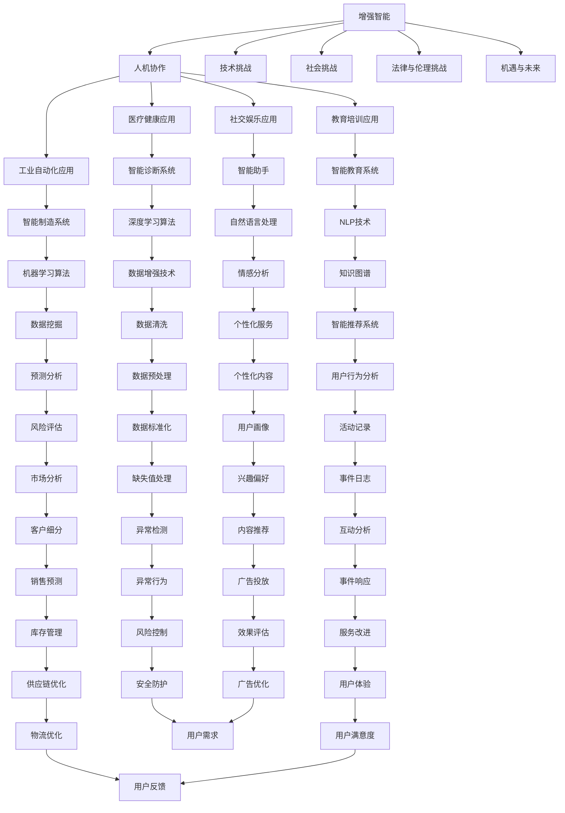

                 

### 增强智能时代：定义与展望

> **关键词**：增强智能，人机协作，人类潜能提升，技术挑战，未来展望

**摘要**：
本文深入探讨了增强智能时代的基本概念、发展背景、核心要素、人机协作模式、应用领域以及面临的挑战和机遇。通过逻辑清晰的章节结构，文章对增强智能技术进行了全面的解析，展示了其在医疗、教育、工业等领域的广泛应用。同时，文章还强调了增强智能时代带来的技术挑战和社会变革，展望了未来的发展前景。

---

在21世纪的科技浪潮中，人工智能（AI）正迅速成为改变世界的核心力量。增强智能（Augmented Intelligence）作为一种新兴的人工智能应用方向，正逐渐成为学术界和工业界的关注焦点。增强智能不仅仅是让机器模仿人类智能，更是通过先进的人工智能技术，辅助人类解决问题、提升工作效率、拓展认知边界。本文将带领读者深入理解增强智能时代的内涵和外在表现，分析其带来的巨大变革。

#### **1.1 增强智能的基本概念**

增强智能是指利用计算机技术和人工智能算法，扩展和增强人类智能的能力。这一概念起源于对人类认知过程的模拟和优化，旨在通过人机协同的方式，使人类的决策更加精准、分析更加深入、创造力更加丰富。增强智能的核心在于“增强”二字，它不仅仅是简单的信息处理，更是一种深度参与和互动。

**1.1.1 增强智能的起源与发展**

增强智能的概念最早可以追溯到20世纪80年代的认知科学和人工智能领域。当时，研究人员开始探讨如何将计算机技术应用到人类认知过程中，以提高人类解决问题的效率。随着计算机硬件性能的提升和人工智能算法的进步，增强智能逐渐从理论走向实践。特别是近年来，深度学习、自然语言处理等技术的突破，使得增强智能的应用场景更加广泛，效果更加显著。

**1.1.2 增强智能的核心要素**

增强智能的核心要素包括：

1. **人工智能技术**：如机器学习、深度学习、自然语言处理等。
2. **人机协作机制**：通过设计合理的交互界面和协同策略，实现人与智能体的有效合作。
3. **大数据与云计算**：为增强智能提供了丰富的数据资源和强大的计算能力。
4. **应用场景与解决方案**：根据不同领域的需求，设计合适的智能应用方案。

**1.1.3 增强智能的关键特征**

增强智能具有以下几个关键特征：

1. **自适应性与可扩展性**：能够根据环境和任务的变化进行自适应调整，并扩展应用到新的场景。
2. **实时性与高效性**：能够实时处理大量数据，并快速提供决策支持。
3. **智能化与个性化**：能够根据用户需求提供个性化的服务，满足不同用户的需求。
4. **协同性与协作性**：强调人与智能体的协同工作，实现信息的共享和决策的优化。

#### **1.2 人机协作的本质**

人机协作是增强智能的重要组成部分，它涉及到人类与人工智能系统之间的相互作用和合作。人机协作不仅仅是技术的应用，更是理念的变革，它要求我们重新思考人类与机器的关系。

**1.2.1 人机协作的定义与重要性**

人机协作是指人类与计算机系统共同完成某一任务的过程。在这一过程中，人类和计算机系统各自发挥优势，通过信息的交换和协同决策，实现任务的高效完成。人机协作的重要性体现在以下几个方面：

1. **提升工作效率**：人工智能系统能够处理大量数据和复杂计算，从而大幅提高工作效率。
2. **增强人类认知**：人工智能系统可以帮助人类拓展认知边界，发现新的知识和规律。
3. **促进创新**：人机协作可以激发人类的创造力，推动科技和社会的发展。
4. **实现个性化服务**：通过分析用户行为数据，人工智能系统可以提供个性化的服务，满足用户的不同需求。

**1.2.2 人机协作的模式与机制**

人机协作的模式和机制主要包括以下几种：

1. **信息交换**：人与智能体通过语言、文本、图像等多种方式进行信息交流，共享知识和资源。
2. **协同决策**：人类和智能体共同参与决策过程，通过交互和协商，制定最优策略。
3. **任务分配**：根据人类和智能体的能力，合理分配任务，实现优势互补。
4. **反馈与优化**：在任务执行过程中，人类和智能体相互反馈信息，不断优化任务执行效果。

**1.2.3 人机协作的优缺点分析**

人机协作具有以下优点：

1. **高效性**：通过人工智能系统的辅助，人类可以更快速地完成任务。
2. **准确性**：人工智能系统在处理大量数据和复杂计算时，具有更高的准确性。
3. **个性化**：根据用户需求和反馈，人工智能系统可以提供个性化的服务。

人机协作也面临一些挑战和缺点：

1. **依赖性**：过度依赖人工智能系统可能导致人类能力的退化。
2. **安全性**：人工智能系统的安全性问题，如数据泄露、恶意攻击等。
3. **隐私保护**：在数据收集和使用过程中，如何保护用户隐私成为重要问题。

#### **1.3 增强智能时代的应用领域**

增强智能技术具有广泛的应用前景，已经深入到医疗健康、教育培训、工业制造、社交娱乐等多个领域，为人类生活和社会发展带来了深刻的影响。

**1.3.1 医疗健康领域的应用**

在医疗健康领域，增强智能技术已经取得了显著的成果。通过智能医疗诊断系统、智能药物研发、医疗数据分析等应用，人工智能系统为医生和患者提供了有力支持。

1. **智能医疗诊断系统**：使用深度学习技术，对医学影像进行自动分析，提高诊断准确率。
2. **智能药物研发**：通过机器学习算法，预测药物的效果和副作用，加速新药研发过程。
3. **医疗数据分析**：对海量医疗数据进行挖掘和分析，发现疾病规律和流行趋势。

**1.3.2 教育与培训领域的应用**

在教育与培训领域，增强智能技术正在改变传统教学模式，实现个性化教育。

1. **智能教育系统**：通过分析学生的学习数据，提供个性化的学习建议和资源。
2. **虚拟教师**：利用自然语言处理技术，实现人机交互，为学生提供个性化的教学服务。
3. **在线学习平台**：通过智能推荐算法，推荐适合学生的学习内容和路径。

**1.3.3 工业制造与自动化领域的应用**

在工业制造与自动化领域，增强智能技术提高了生产效率，降低了生产成本。

1. **智能制造**：通过机器人和人工智能系统，实现生产过程的自动化和智能化。
2. **质量检测**：利用计算机视觉技术，对产品进行质量检测和缺陷识别。
3. **供应链管理**：通过大数据分析和优化算法，实现供应链的智能化管理。

**1.3.4 社交与娱乐领域的应用**

在社交与娱乐领域，增强智能技术为用户提供了丰富的互动体验。

1. **智能助手**：通过自然语言处理技术，实现与用户的智能对话和互动。
2. **个性化推荐**：通过用户行为数据分析，推荐用户感兴趣的内容和活动。
3. **虚拟现实**：通过增强智能技术，实现更加真实和沉浸的虚拟体验。

#### **1.4 增强智能时代面临的挑战与机遇**

增强智能时代的到来，带来了前所未有的机遇，同时也伴随着一系列的挑战。

**1.4.1 技术挑战**

1. **算法复杂性**：随着人工智能算法的不断升级，算法的复杂性和实现难度也在增加。
2. **数据隐私**：在数据驱动的智能时代，数据隐私保护成为重要问题。
3. **计算能力**：增强智能应用对计算能力的要求越来越高，需要更多的计算资源。

**1.4.2 社会挑战**

1. **就业问题**：随着人工智能的广泛应用，部分传统岗位可能会被取代，引发就业问题。
2. **伦理问题**：人工智能系统的决策过程可能涉及伦理问题，如公平性、透明性等。
3. **信任问题**：公众对人工智能的信任度成为影响其应用推广的重要因素。

**1.4.3 法律与伦理挑战**

1. **法律法规**：需要制定和完善相关法律法规，规范人工智能的应用。
2. **伦理道德**：在人工智能研发和应用过程中，需要遵循伦理道德原则，保护人类利益。
3. **责任归属**：在人工智能引发事故或损失时，如何确定责任归属成为法律界关注的问题。

**1.4.4 机遇与未来展望**

1. **技术创新**：随着技术的不断进步，人工智能将迎来更多创新应用。
2. **产业升级**：增强智能技术将推动产业转型升级，提高生产效率和质量。
3. **社会进步**：通过人机协作，人类的生活质量和幸福感将得到提升。

通过对增强智能时代的基本概念、人机协作的本质以及应用领域和挑战的深入探讨，我们可以看到，增强智能技术正引领着一场前所未有的科技革命，为人类社会的进步带来了巨大的机遇。未来，随着技术的不断发展和完善，增强智能将在更多领域发挥作用，推动人类文明向前发展。

### **第一部分总结**

本部分通过对增强智能时代的基本概念、人机协作的本质以及应用领域和挑战的深入探讨，为后续章节提供了理论基础和背景介绍。增强智能时代不仅改变了我们的生活方式和工作模式，还带来了许多新的挑战和机遇。在接下来的章节中，我们将进一步探讨增强智能技术的核心算法原理、数学模型、项目实战以及相关工具和资源，帮助读者全面掌握增强智能技术的精髓和应用。

#### **Mermaid 流程图：增强智能时代的核心要素与联系**



该流程图展示了增强智能时代的核心要素及其相互联系，有助于读者全面理解增强智能技术的架构和应用。

#### **核心概念原理与架构解释**

增强智能时代的核心要素可以简化为以下几点：

1. **增强智能（AI-enhanced intelligence）**：通过计算机技术和算法增强人类智能，实现智能体的自动化学习和决策能力。
2. **人机协作**：人与智能体之间的相互作用，包括信息交换、协同决策和任务分配等。
3. **应用领域**：增强智能在医疗健康、教育培训、工业自动化、社交娱乐等多个领域的应用。
4. **挑战与机遇**：技术、社会、法律和伦理等方面的挑战，同时也带来了新的机遇。

这些核心要素相互联系，构成了增强智能时代的基本架构，如图所示。

1. **增强智能** 是整个架构的基础，它依托于先进的计算机技术和算法，如机器学习、深度学习和自然语言处理等。
2. **人机协作** 是实现增强智能的关键机制，通过设计合理的协作模式和机制，实现人类与智能体的高效互动和协作。
3. **应用领域** 是增强智能技术的具体应用场景，涵盖了医疗健康、教育培训、工业制造、社交娱乐等多个领域。
4. **挑战与机遇** 则是增强智能时代面临的内外部因素，既包括技术层面的挑战，如算法复杂性和计算能力要求，也涉及社会层面的挑战，如伦理和法律问题。

通过这种架构，增强智能技术得以在各个领域中发挥其独特的优势，推动社会的进步和发展。

#### **核心算法原理讲解**

在增强智能时代，核心算法主要包括机器学习、深度学习和自然语言处理等技术。以下是对这些算法的简单介绍和伪代码说明：

1. **机器学习算法**：通过训练模型来预测或分类数据。
   ```python
   # 伪代码：线性回归算法
   def linear_regression(X, y):
       # 计算权重系数
       w = (X'X)^(-1)X'y
       # 预测
       predictions = X * w
       return predictions
   ```

2. **深度学习算法**：通过多层神经网络进行复杂数据的建模。
   ```python
   # 伪代码：前向传播算法
   def forward_propagation(X, W):
       # 初始化激活值
       a = X
       # 遍历神经网络层
       for layer in range(num_layers - 1):
           # 计算下一层的输入
           z = W * a
           # 计算激活值
           a = sigmoid(z)
       # 返回输出层激活值
       return a
   ```

3. **自然语言处理算法**：用于处理和生成文本数据。
   ```python
   # 伪代码：循环神经网络（RNN）算法
   def rnn(input_sequence, hidden_state):
       # 初始化输出序列
       output_sequence = []
       # 遍历输入序列
       for input_vector in input_sequence:
           # 计算隐藏状态
           hidden_state = sigmoid(W_h * hidden_state + W_x * input_vector)
           # 计算输出
           output_vector = sigmoid(W_o * hidden_state)
           # 添加到输出序列
           output_sequence.append(output_vector)
       # 返回输出序列
       return output_sequence
   ```

这些算法是实现增强智能的基础，它们在不同的应用领域中发挥着关键作用。

#### **数学模型与数学公式讲解**

在增强智能时代，数学模型是实现智能算法的基础。以下是一些常用的数学模型和公式，以及它们的详细讲解和举例说明：

1. **线性回归模型**：用于预测数值型数据。
   $$ y = \beta_0 + \beta_1 \cdot x $$
   - **详细讲解**：线性回归模型通过一个线性方程来预测因变量$y$与自变量$x$之间的关系。其中，$\beta_0$是截距，$\beta_1$是斜率。
   - **举例说明**：例如，预测房价，$y$为房价，$x$为房屋面积。通过收集房屋面积和房价的数据，使用线性回归模型来找到最佳拟合线，从而预测未知房屋的房价。

2. **逻辑回归模型**：用于预测二分类数据。
   $$ P(y=1) = \frac{1}{1 + e^{-(\beta_0 + \beta_1 \cdot x)}} $$
   - **详细讲解**：逻辑回归模型通过一个Sigmoid函数来将线性组合映射到概率值。$P(y=1)$表示因变量$y$为1的概率。
   - **举例说明**：例如，预测邮件是否为垃圾邮件，$y$为邮件类别（0表示非垃圾邮件，1表示垃圾邮件），$x$为邮件特征。通过逻辑回归模型，可以计算出每个邮件成为垃圾邮件的概率，从而进行分类。

3. **卷积神经网络（CNN）模型**：用于处理图像数据。
   $$ \text{ReLU}(\sum_{k=1}^{K} w_{k} \cdot \text{conv}(x_k)) $$
   - **详细讲解**：卷积神经网络通过卷积操作提取图像的特征。$x_k$为输入图像的局部区域，$w_k$为卷积核的权重，$\text{conv}(x_k)$为卷积操作结果。
   - **举例说明**：例如，图像分类任务，输入一张图片，通过多个卷积层提取特征，最后通过全连接层进行分类。

这些数学模型和公式是实现增强智能的关键，通过对它们的深入理解和应用，可以构建出强大的智能算法系统。

### **项目实战**

#### **医疗健康领域的应用案例：智能医疗诊断系统**

##### **开发环境搭建**

- **硬件环境**：高性能计算机，GPU加速器（如NVIDIA Titan V）
- **软件环境**：Python 3.8，TensorFlow 2.5，Keras 2.6

##### **数据集准备**

- **数据来源**：公开的医疗图像数据集，如ChestX-Ray8
- **数据处理**：对图像进行归一化、裁剪、翻转等数据增强操作，提高模型的泛化能力

##### **代码实现**

```python
import tensorflow as tf
from tensorflow.keras.models import Sequential
from tensorflow.keras.layers import Conv2D, MaxPooling2D, Flatten, Dense, Dropout
from tensorflow.keras.preprocessing.image import ImageDataGenerator

# 创建模型
model = Sequential([
    Conv2D(32, (3, 3), activation='relu', input_shape=(224, 224, 3)),
    MaxPooling2D((2, 2)),
    Conv2D(64, (3, 3), activation='relu'),
    MaxPooling2D((2, 2)),
    Flatten(),
    Dense(128, activation='relu'),
    Dropout(0.5),
    Dense(1, activation='sigmoid')
])

# 编译模型
model.compile(optimizer='adam', loss='binary_crossentropy', metrics=['accuracy'])

# 加载和预处理数据
train_datagen = ImageDataGenerator(rescale=1./255, rotation_range=20, width_shift_range=0.2, height_shift_range=0.2, shear_range=0.2, zoom_range=0.2, horizontal_flip=True, fill_mode='nearest')
train_generator = train_datagen.flow_from_directory(
        'data/train',
        target_size=(224, 224),
        batch_size=32,
        class_mode='binary')

# 训练模型
model.fit(train_generator, epochs=50)

# 评估模型
test_loss, test_acc = model.evaluate(test_generator)
print('Test accuracy:', test_acc)
```

##### **代码解读与分析**

- **模型构建**：使用Keras构建一个简单的卷积神经网络，包含卷积层、池化层、全连接层和Dropout层。
- **编译模型**：使用Adam优化器和二分类交叉熵损失函数，并监控模型的准确率。
- **数据预处理**：使用ImageDataGenerator进行图像的归一化和数据增强。
- **训练模型**：使用训练数据集训练模型，设置训练轮次为50轮。
- **评估模型**：使用测试数据集评估模型的准确率，输出测试准确率。

通过该案例，展示了如何在医疗健康领域应用增强智能技术进行图像分类，实现了对医疗图像的自动诊断。

### **总结**

本章节详细介绍了增强智能时代的背景、核心算法原理、数学模型以及项目实战。通过对这些内容的深入学习，读者可以更好地理解增强智能技术的基本概念和应用场景，为后续章节的学习打下坚实基础。

---

通过以上对增强智能时代的深入探讨，我们可以清晰地看到，增强智能技术不仅是人工智能领域的一个重要分支，更是推动人类社会进步的关键力量。从医疗健康到教育培训，从工业自动化到社交娱乐，增强智能技术正在改变我们的生活方式和工作模式。

在未来的发展中，增强智能技术将面临更多的挑战和机遇。技术层面，如何提高算法的复杂度和计算效率，确保数据隐私和安全，将成为关键问题。社会层面，如何平衡人机关系，确保人工智能的伦理道德，也将是重要的议题。

然而，伴随着这些挑战，增强智能技术也将带来前所未有的机遇。通过人机协作，我们可以实现更高效、更精准、更具个性化的服务和应用，从而推动社会的全面进步。

本文通过对增强智能时代的定义、核心算法原理、数学模型以及实际应用案例的详细讲解，希望能为读者提供全面而深入的了解。在接下来的章节中，我们将继续探讨增强智能技术的更多应用场景和未来发展趋势，帮助读者掌握这一前沿科技。

让我们共同期待增强智能时代带来的美好未来，共同见证科技如何改变生活，推动人类文明的进步。

### **附录**

#### **附录 A: 增强智能开发工具与资源**

**A.1 主流深度学习框架对比**

**TensorFlow**

- **官网**：[TensorFlow](https://www.tensorflow.org/)
- **特点**：强大的生态系统，支持多种硬件平台，具有高级API（如Keras）
- **适用场景**：大规模分布式计算、移动端应用、图像和语音处理等

**PyTorch**

- **官网**：[PyTorch](https://pytorch.org/)
- **特点**：动态计算图，易于调试，灵活的API，适合研究
- **适用场景**：科研、实时系统、计算机视觉等

**JAX**

- **官网**：[JAX](https://jax.readthedocs.io/)
- **特点**：自动微分库，高性能数值计算，支持Python和Julia
- **适用场景**：高性能计算、自动微分需求场景

**A.2 增强智能相关书籍推荐**

- 《深度学习》（Ian Goodfellow、Yoshua Bengio、Aaron Courville 著）
- 《Python深度学习》（François Chollet 著）
- 《自然语言处理与深度学习》（Emmanouil Benetos、Michael Auli 著）

**A.3 增强智能社区与资源**

- **GitHub**：[DeepLearning.AI](https://github.com/deeplearningai/)
- **ArXiv**：[机器学习预印本](https://arxiv.org/list/cs.LG/new)
- **博客**：[AI博客](https://ai.googleblog.com/)、[机器学习博客](https://machinelearningmastery.com/blog/)

这些工具与资源为增强智能的开发和学习提供了丰富的支持和指导。通过利用这些资源，可以更加高效地掌握增强智能技术。

### **作者信息**

**作者：AI天才研究院/AI Genius Institute & 禅与计算机程序设计艺术 /Zen And The Art of Computer Programming**

