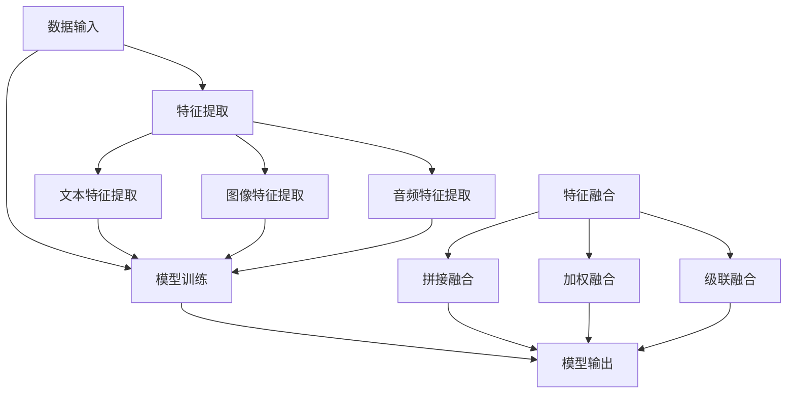

                 

# 《多模态大模型：技术原理与实战 智能试穿》

> **关键词：多模态大模型、智能试穿、技术原理、实战应用、发展趋势**

> **摘要：本文将深入探讨多模态大模型的技术原理及其在智能试穿领域的应用，通过详细的架构解析、算法讲解和实战案例，展示多模态大模型如何改变传统试穿模式，推动个性化购物体验的革命。同时，文章还将展望多模态大模型未来的发展趋势与面临的挑战。**

### 《多模态大模型：技术原理与实战 智能试穿》目录大纲

#### 第一部分：多模态大模型基础

- **第1章：多模态大模型概述**
  - 1.1 多模态数据的定义与重要性
  - 1.2 多模态大模型的定义与架构
  - 1.3 主流多模态大模型介绍
  - 1.4 多模态大模型的研究进展与趋势

- **第2章：多模态大模型技术原理**
  - 2.1 多模态数据处理技术
  - 2.2 多模态数据的特征提取与融合
  - 2.3 多模态大模型的训练策略
  - 2.4 多模态大模型的核心算法原理

- **第3章：多模态大模型在智能试穿中的应用**
  - 3.1 智能试穿概述
  - 3.2 智能试穿系统的构建
  - 3.3 智能试穿系统的实现与部署
  - 3.4 智能试穿系统的优化与拓展

- **第4章：多模态大模型发展趋势与挑战**
  - 4.1 多模态大模型的发展趋势
  - 4.2 多模态大模型面临的挑战与对策

- **附录**
  - 附录A：多模态大模型开发工具与资源

---

#### 第一部分：多模态大模型基础

## 第1章：多模态大模型概述

### 1.1 多模态数据的定义与重要性

#### 1.1.1 多模态数据的概念

多模态数据指的是由两种或两种以上不同类型的数据源组成的集合。常见的多模态数据包括文本（text）、图像（image）、音频（audio）、视频（video）等。例如，一个视频包含了画面（图像）和声音（音频），这就是一个典型的多模态数据。

#### 1.1.2 多模态数据的重要性

多模态数据的重要性在于它能够提供更丰富的信息，使得机器学习模型能够从不同角度理解世界。例如，在智能试穿系统中，仅使用图像可能无法准确判断衣服的尺码和款式是否适合用户，而结合用户的文本描述和身体尺寸数据，则可以显著提高试穿结果的准确性。

#### 1.1.3 多模态数据的应用领域

多模态数据在许多领域都有广泛的应用。以下是几个典型的应用领域：

- **医疗诊断**：结合患者的病历记录（文本）和影像数据（图像），可以更准确地诊断疾病。
- **视频监控**：结合视频图像和音频数据，可以更有效地进行监控和事件分析。
- **人机交互**：通过语音（音频）和面部表情（图像）等多模态数据，可以更自然地实现人机交互。
- **智能家居**：通过监测用户的日常行为（文本、图像、音频等），可以提供个性化的服务。

### 1.2 多模态大模型的定义与架构

#### 1.2.1 多模态大模型的定义

多模态大模型是指能够同时处理多种模态数据的大型神经网络模型。这些模型通过融合不同模态的数据，提供更强大的信息处理能力。

#### 1.2.2 多模态大模型的架构

多模态大模型的架构通常包括以下几个部分：

1. **数据采集与预处理模块**：负责收集和预处理不同模态的数据，例如文本、图像、音频等。
2. **特征提取与融合模块**：从每个模态的数据中提取特征，然后进行特征融合，以生成一个统一的多模态特征向量。
3. **神经网络模型**：用于处理和融合多模态特征向量，实现具体的任务，如分类、回归等。
4. **优化与训练模块**：通过优化算法和训练策略，提高模型的性能。

#### 1.2.3 多模态大模型的交互机制

多模态大模型通过以下机制实现不同模态数据之间的交互：

- **特征交互**：通过特征融合策略，将不同模态的特征向量进行融合，形成更丰富的特征信息。
- **信息传递**：模型中存在信息传递路径，使得不同模态的特征能够在神经网络中传递和交互。
- **协同学习**：不同模态的数据在训练过程中共同学习，使得模型能够更好地理解多种模态之间的关系。

### 1.3 主流多模态大模型介绍

#### 1.3.1 GPT系列模型

GPT（Generative Pre-trained Transformer）系列模型是由OpenAI开发的一系列基于Transformer架构的语言模型。GPT模型通过预训练和微调，可以处理多种模态的数据，如文本、图像和音频。GPT系列模型包括GPT、GPT-2、GPT-3等，其中GPT-3具有超过1750亿参数，是当前最强大的语言模型之一。

#### 1.3.2 Vision Transformer（ViT）

Vision Transformer（ViT）是由Google Research开发的一种基于Transformer架构的图像处理模型。ViT将图像划分为多个Patch（局部区域），然后将这些Patch视为序列数据，通过Transformer模型进行编码和融合，从而实现图像分类、分割等任务。

#### 1.3.3 其他知名多模态大模型介绍

除了GPT和ViT，还有许多其他知名的多模态大模型，如：

- **BLIP（Bridge Language and Vision Transformer）**：由Google Research开发，将语言模型和视觉模型进行融合，实现图像-文本对应任务。
- **MMOCR（Multi-modal OCR）**：由京东AI开发，支持多种模态的数据，如文本、图像和音频，进行光学字符识别（OCR）任务。
- **M4（Multimodal Machine Learning）**：由Facebook AI开发，支持多种模态的数据融合和任务学习，如分类、回归等。

### 1.4 多模态大模型的研究进展与趋势

#### 1.4.1 研究进展

近年来，多模态大模型在多个领域取得了显著的进展。以下是一些重要成果：

- **图像-文本对应**：通过融合图像和文本数据，实现图像内容理解和文本描述的对应。
- **多模态推理**：结合多种模态的数据，实现复杂推理任务，如问答系统、推理验证等。
- **交互式任务**：通过多模态交互，实现更自然的用户交互，如语音助手、智能监控等。

#### 1.4.2 研究趋势

随着计算能力和数据资源的提升，多模态大模型的研究将继续发展，以下是一些趋势：

- **更复杂的模型架构**：开发更复杂、更强大的多模态模型，以应对更复杂的任务。
- **跨模态迁移学习**：利用迁移学习技术，提高模型在多模态数据上的泛化能力。
- **数据集建设**：构建更多、更丰富的多模态数据集，以支持模型的训练和评估。
- **伦理与隐私**：研究如何在多模态数据处理过程中保护用户隐私，并确保模型的公平性和透明度。

#### 1.4.3 未来发展前景

多模态大模型在未来的发展中将具有广泛的应用前景。以下是一些可能的领域：

- **医疗**：通过多模态数据，实现更准确的疾病诊断和个性化治疗方案。
- **教育**：利用多模态交互，提供更个性化的教育体验。
- **智能城市**：通过多模态监控和数据融合，实现更高效的城市管理。
- **虚拟现实**：结合多模态数据，提供更真实的虚拟现实体验。

## 第2章：多模态大模型技术原理

### 2.1 多模态数据处理技术

#### 2.1.1 数据采集与预处理

多模态数据处理的第一个关键步骤是数据采集与预处理。这一步的目的是获取高质量的数据，并对其进行必要的预处理，以便后续的特征提取和模型训练。

**数据采集方法**：

- **文本数据**：可以从公开的文本资源（如新闻、社交媒体等）或特定领域的数据库中获取。
- **图像数据**：可以通过开源图像库（如ImageNet、COCO等）或使用网络爬虫自定义采集。
- **音频数据**：可以使用录音设备录制，或从公开的音频库（如LJSpeech、Common Voice等）获取。

**数据预处理流程**：

1. **清洗**：去除数据中的噪声和错误。
2. **标准化**：对数据进行归一化或标准化，以消除数据规模差异。
3. **分割**：对于视频和音频数据，需要进行时间或空间上的分割，以提取出有意义的数据片段。

**数据增强技术**：

数据增强是在原始数据的基础上生成新的数据样本，以增加模型的训练数据量，提高模型的泛化能力。常见的数据增强技术包括：

- **数据复制**：通过复制数据样本，增加训练数据量。
- **数据扰动**：对图像进行旋转、缩放、裁剪、颜色调整等操作。
- **生成对抗网络（GAN）**：使用生成对抗网络生成新的数据样本。

#### 2.1.2 多模态数据的特征提取与融合

**特征提取方法**：

- **文本特征提取**：可以使用词袋模型（Bag of Words, BoW）、词嵌入（Word Embedding）等方法。
- **图像特征提取**：可以使用卷积神经网络（CNN）、预训练模型（如ResNet、VGG等）提取图像特征。
- **音频特征提取**：可以使用梅尔频率倒谱系数（Mel-Frequency Cepstral Coefficients, MFCC）等方法。

**特征融合策略**：

- **拼接融合**：将不同模态的特征向量拼接在一起，形成一个多维特征向量。
- **加权融合**：根据不同模态的特征重要性，对特征向量进行加权融合。
- **级联融合**：先对每个模态的特征进行单独处理，然后将处理后的特征进行级联。

**特征选择技术**：

特征选择是选择出对任务最相关的特征，以减少数据维度和计算复杂度。常见的方法包括：

- **过滤式特征选择**：基于统计方法，筛选出对任务有显著贡献的特征。
- **包裹式特征选择**：通过机器学习算法，选择出对任务有最佳表现的特性组合。
- **嵌入式特征选择**：在特征提取和模型训练过程中，自动筛选出重要的特征。

#### 2.1.3 多模态大模型的训练策略

**训练策略概述**：

多模态大模型的训练通常涉及以下策略：

- **数据预处理**：确保数据质量，减少噪声和异常值。
- **模型初始化**：选择合适的模型初始化方法，如随机初始化、预训练模型等。
- **损失函数设计**：设计能够反映任务目标的多模态损失函数。
- **优化算法选择**：选择适合多模态数据的优化算法，如Adam、SGD等。

**大规模数据处理**：

对于大规模多模态数据，以下策略可以提升训练效率：

- **批量处理**：将数据分成小批量，减少内存占用和计算时间。
- **并行计算**：利用GPU、TPU等硬件加速计算。
- **分布式训练**：将模型和数据分布到多个节点上进行训练，提高计算能力。

**模型优化技巧**：

- **超参数调优**：通过调整学习率、批量大小、正则化参数等超参数，优化模型性能。
- **早期停止**：在模型性能出现过拟合时，提前停止训练，避免过拟合。
- **正则化技术**：如L1、L2正则化，减少模型过拟合。

#### 2.1.4 多模态大模型的核心算法原理

**伪代码与算法描述**：

多模态大模型的核心算法通常涉及以下几个步骤：

```
1. 数据采集与预处理
2. 特征提取
   - 文本特征提取
   - 图像特征提取
   - 音频特征提取
3. 特征融合
   - 拼接融合
   - 加权融合
   - 级联融合
4. 模型训练
   - 初始化模型参数
   - 前向传播
   - 计算损失函数
   - 反向传播
   - 更新模型参数
5. 模型评估与优化
   - 评估模型性能
   - 调整超参数
   - 重新训练模型
```

**算法流程图**：


**算法实现细节**：

在具体实现中，需要考虑以下几个方面：

- **特征提取细节**：如卷积神经网络（CNN）的具体架构、卷积核大小等。
- **特征融合方法**：如拼接融合的具体实现方式、权重计算等。
- **模型训练细节**：如优化器的选择、学习率调整策略等。
- **模型评估与优化**：如评估指标的选择、性能改进方法等。

### 2.2 多模态数据的特征提取与融合

多模态数据的特征提取与融合是多模态大模型构建中的关键步骤。在这一节中，我们将详细探讨多模态数据的特征提取与融合技术，包括常用的方法、策略和实现细节。

#### 2.2.1 特征提取方法

**文本特征提取**：

文本特征提取是处理自然语言数据的重要步骤。常用的文本特征提取方法包括：

- **词袋模型（Bag of Words, BoW）**：将文本转化为词频矩阵，每个词的出现次数作为特征。
- **词嵌入（Word Embedding）**：将文本中的词映射到高维向量空间，如Word2Vec、GloVe等。
- **序列特征提取**：将文本序列转化为序列特征，如使用循环神经网络（RNN）或长短时记忆网络（LSTM）。

**图像特征提取**：

图像特征提取是计算机视觉中的基础。常用的图像特征提取方法包括：

- **卷积神经网络（Convolutional Neural Network, CNN）**：通过卷积层、池化层等操作提取图像特征。
- **预训练模型**：使用在大型图像数据集上预训练的模型（如ResNet、VGG等）提取图像特征。
- **特征工程**：手动设计特征，如HOG、SIFT等。

**音频特征提取**：

音频特征提取是处理音频信号的关键步骤。常用的音频特征提取方法包括：

- **梅尔频率倒谱系数（Mel-Frequency Cepstral Coefficients, MFCC）**：将音频信号转换为梅尔频率倒谱系数，用于描述音频信号的频谱特征。
- **谱图特征**：将音频信号转换为谱图，通过分析谱图中的纹理和结构特征。
- **长时和短时特征**：结合长时和短时特征，如能量、熵等，以捕捉音频的动态和静态特性。

#### 2.2.2 特征融合策略

**拼接融合**：

拼接融合是最简单直接的一种特征融合方法。将不同模态的特征向量按顺序拼接在一起，形成一个多维特征向量。这种方法的优势在于实现简单，但在某些情况下可能会损失某些模态的信息。

```
多维特征向量 = [文本特征向量；图像特征向量；音频特征向量]
```

**加权融合**：

加权融合是一种根据不同模态特征的重要性进行融合的方法。通过设计权重系数，将不同模态的特征向量加权后融合。这种方法能够更好地利用各模态特征的优势，但需要确定合适的权重系数。

```
融合特征向量 = w1 * 文本特征向量 + w2 * 图像特征向量 + w3 * 音频特征向量
```

**级联融合**：

级联融合是将不同模态的特征分别进行独立处理，然后将处理后的特征进行级联。这种方法能够更好地保留各模态的特征信息，但实现较为复杂。

```
级联特征向量 = [文本特征；图像特征；音频特征]
```

#### 2.2.3 特征选择技术

特征选择是在特征提取与融合过程中，选择出对任务最相关的特征，以减少数据维度和计算复杂度。常用的特征选择技术包括：

**过滤式特征选择**：

过滤式特征选择是基于统计方法筛选出对任务有显著贡献的特征。常见的过滤方法包括卡方检验、互信息等。

**包裹式特征选择**：

包裹式特征选择是基于机器学习算法，通过迭代选择最佳特征组合。常见的方法包括递归特征消除（RFE）、遗传算法等。

**嵌入式特征选择**：

嵌入式特征选择是在特征提取和模型训练过程中，自动筛选出重要的特征。常见的方法包括L1正则化、L2正则化等。

#### 2.2.4 多模态特征融合的挑战与对策

多模态特征融合面临以下挑战：

- **模态差异**：不同模态的数据在特征表示上存在较大差异，如文本是序列数据，图像是空间数据，音频是时序数据。
- **特征冗余**：多模态数据可能包含冗余信息，导致模型过拟合。
- **计算复杂度**：多模态特征融合通常涉及大规模计算，对计算资源要求较高。

为了应对这些挑战，可以采取以下对策：

- **模态对齐**：通过模态对齐技术，将不同模态的数据对齐到同一时间或空间尺度。
- **特征降维**：通过降维技术，如主成分分析（PCA）、线性判别分析（LDA）等，减少特征维度。
- **稀疏特征选择**：通过稀疏特征选择技术，如L1正则化，减少特征冗余。

### 2.3 多模态大模型的训练策略

多模态大模型的训练是一个复杂且计算密集的过程。为了实现高效的训练并达到良好的模型性能，我们需要仔细设计训练策略，包括数据预处理、模型初始化、损失函数设计、优化算法选择和训练过程中的性能监控与调整。以下是多模态大模型训练策略的详细探讨。

#### 2.3.1 训练策略概述

多模态大模型的训练策略可以分为以下几个主要步骤：

1. **数据预处理**：确保数据质量，包括数据清洗、归一化和分割。这一步对于后续的特征提取和模型训练至关重要。
2. **模型初始化**：选择合适的初始化方法，如随机初始化、预训练模型初始化等。合理的初始化有助于模型快速收敛。
3. **损失函数设计**：设计能够反映任务目标的损失函数。对于多模态大模型，通常需要结合不同模态的数据特点设计损失函数。
4. **优化算法选择**：选择适合多模态数据的优化算法，如Adam、SGD等。优化算法的效率和稳定性对训练过程有重要影响。
5. **训练过程**：包括前向传播、计算损失函数、反向传播和更新模型参数。在这一过程中，需要监控模型性能，调整超参数，防止过拟合。
6. **性能监控与调整**：在整个训练过程中，持续监控模型性能，根据需要进行调整，如修改学习率、增加正则化等。

#### 2.3.2 大规模数据处理

对于大规模多模态数据，我们需要优化数据处理流程，以提高训练效率。以下是几个关键策略：

1. **批量处理**：将数据分成小批量进行训练，以减少内存占用和计算时间。批量大小需要根据硬件资源进行调整。
2. **并行计算**：利用多GPU、TPU等硬件资源进行并行计算，以加速训练过程。可以采用数据并行和模型并行两种方式。
3. **数据流水线**：构建高效的数据流水线，实现数据的快速加载、预处理和传输。使用数据加载器（DataLoader）可以提高数据处理效率。
4. **分布式训练**：将模型和数据分布在多个节点上进行训练，利用集群计算资源。分布式训练可以显著提高训练速度和模型性能。

#### 2.3.3 模型优化技巧

在多模态大模型的训练过程中，以下技巧可以帮助提高模型性能和泛化能力：

1. **超参数调优**：通过实验和搜索算法（如随机搜索、贝叶斯优化等）找到最优的超参数组合。常用的超参数包括学习率、批量大小、正则化参数等。
2. **正则化技术**：应用正则化技术，如L1、L2正则化，减少模型过拟合。正则化可以限制模型参数的规模，提高模型的泛化能力。
3. **数据增强**：通过数据增强技术，生成新的训练样本，增加模型的鲁棒性。常见的数据增强方法包括图像旋转、裁剪、颜色调整等。
4. **提前停止**：在模型性能出现过拟合迹象时，提前停止训练，以防止过拟合。提前停止可以根据验证集的性能进行判断。
5. **动态学习率调整**：根据训练过程动态调整学习率，以加快模型收敛。常用的学习率调整策略包括指数衰减、余弦退火等。

#### 2.3.4 模型评估与优化

在模型训练完成后，我们需要对模型进行评估，以确保其性能符合预期。以下是一些常见的模型评估方法：

1. **准确率（Accuracy）**：模型预测正确的样本数占总样本数的比例。准确率是最直观的评估指标，但可能在类别不平衡时失效。
2. **精确率与召回率（Precision and Recall）**：精确率是预测为正样本且实际为正样本的样本数与预测为正样本的样本数之比；召回率是预测为正样本且实际为正样本的样本数与实际为正样本的样本数之比。精确率和召回率可以更全面地评估模型性能。
3. **F1分数（F1 Score）**：F1分数是精确率和召回率的调和平均，综合考虑了二者的性能。
4. **混淆矩阵（Confusion Matrix）**：混淆矩阵展示了模型在各个类别上的预测结果，可以提供详细的性能分析。

在评估模型性能后，我们可以根据评估结果对模型进行调整和优化。以下是一些常见的优化方法：

1. **调整超参数**：根据评估结果，调整学习率、批量大小、正则化参数等超参数，以提高模型性能。
2. **增加训练数据**：收集更多的训练数据，以增加模型的鲁棒性。
3. **增加模型容量**：增加模型的层数或参数数量，以提高模型的复杂度和性能。
4. **调整损失函数**：根据任务特点，调整损失函数的设计，以更好地反映任务目标。

通过以上训练策略和优化方法，我们可以构建出高效、准确的多模态大模型，为实际应用提供强有力的支持。

### 2.4 多模态大模型的核心算法原理

多模态大模型的核心算法是基于深度学习和人工智能技术的，通过融合多种模态的数据来提高模型对复杂任务的理解和处理能力。以下将详细讲解多模态大模型的核心算法原理，包括算法框架、具体实现和关键步骤。

#### 2.4.1 算法框架

多模态大模型的算法框架通常包括以下几个主要部分：

1. **数据输入层**：负责接收不同模态的数据，如文本、图像、音频等。
2. **特征提取层**：从每个模态的数据中提取特征，如使用卷积神经网络（CNN）提取图像特征，使用循环神经网络（RNN）提取文本特征，使用梅尔频率倒谱系数（MFCC）提取音频特征。
3. **特征融合层**：将不同模态的特征进行融合，形成统一的多模态特征向量。常见的融合方法包括拼接融合、加权融合和级联融合。
4. **模型输出层**：根据任务目标进行输出，如分类、回归等。

#### 2.4.2 具体实现

以下是多模态大模型的核心算法的具体实现步骤：

1. **数据输入**：从不同数据源中获取文本、图像、音频等数据。例如，可以使用开源数据集（如COCO、MNIST、LJSpeech等）作为训练数据。
2. **特征提取**：
   - **文本特征提取**：使用预训练的词嵌入模型（如Word2Vec、GloVe等）将文本转换为向量表示。然后，可以使用循环神经网络（RNN）或 Transformer 架构对文本序列进行编码，提取文本特征。
   - **图像特征提取**：使用卷积神经网络（CNN）提取图像特征。常用的 CNN 架构包括 LeNet、AlexNet、VGG、ResNet 等。通过池化层和卷积层，将图像分解为不同尺度和层次的局部特征。
   - **音频特征提取**：使用梅尔频率倒谱系数（MFCC）提取音频特征。MFCC 可以将音频信号转换为频谱特征，从而捕捉音频的时频信息。
3. **特征融合**：
   - **拼接融合**：将不同模态的特征向量按顺序拼接，形成统一的多模态特征向量。例如，假设文本特征向量维度为100，图像特征维度为256，音频特征维度为128，则拼接后的特征维度为100 + 256 + 128。
   - **加权融合**：根据不同模态特征的重要性，对特征向量进行加权融合。可以使用注意力机制（Attention Mechanism）来动态调整各模态特征的权重。
   - **级联融合**：先对每个模态的特征进行独立处理，然后级联这些处理后的特征。这种方法可以更好地保留各模态的信息。
4. **模型训练**：使用融合后的特征进行模型训练。常见的训练方法包括监督学习和无监督学习。监督学习需要标注数据，而无监督学习可以从未标注的数据中学习特征。
5. **模型输出**：根据任务目标进行输出，如分类、回归等。可以使用全连接层（Fully Connected Layer）或卷积层（Convolutional Layer）实现具体的输出层。

#### 2.4.3 算法实现细节

以下是多模态大模型的核心算法的实现细节，包括伪代码和关键参数设置：

**伪代码**：

```
# 多模态大模型核心算法实现

# 数据输入
文本数据，图像数据，音频数据

# 特征提取
文本特征 = 嵌入层(文本数据)
图像特征 = 卷积神经网络(图像数据)
音频特征 = MFCC(音频数据)

# 特征融合
融合特征 = 拼接融合(文本特征，图像特征，音频特征)

# 模型训练
模型 = 定义模型架构(融合特征)
模型训练(模型，训练数据，标签)

# 模型输出
预测结果 = 模型(融合特征)
```

**关键参数设置**：

- **嵌入层维度**：文本特征向量的维度，通常为 100 或 300。
- **卷积神经网络架构**：选择合适的卷积核大小、层数和池化方式，如卷积层（32, 64）、卷积核大小（3x3）、步长（2）等。
- **MFCC参数**：包括滤波器带宽、滤波器数量、FFT长度等。
- **注意力机制参数**：如注意力权重计算方式、激活函数等。
- **优化器**：选择适合的优化器，如 Adam、SGD 等。
- **学习率**：设置合适的初始学习率和衰减策略。

通过上述算法实现细节，我们可以构建出高效的多模态大模型，为各种复杂任务提供强大的支持。

### 2.4.4 算法流程图

为了更直观地理解多模态大模型的核心算法原理，以下是算法的流程图：



### 2.4.5 算法实现示例

以下是一个简单的多模态大模型实现示例，包括文本、图像和音频的特征提取与融合：

**代码示例**：

```python
# 导入必要的库
import tensorflow as tf
from tensorflow.keras.layers import Embedding, LSTM, Conv2D, MaxPooling2D, Flatten, Dense, Concatenate, LSTM, Conv1D, MaxPooling1D, concatenate
from tensorflow.keras.models import Model

# 文本特征提取
text_embedding = Embedding(input_dim=vocab_size, output_dim=embedding_dim)
lstm_output = LSTM(units=128, activation='tanh')(text_embedding(text_input))

# 图像特征提取
image_conv = Conv2D(filters=32, kernel_size=(3, 3), activation='relu')(image_input)
pooling1 = MaxPooling2D(pool_size=(2, 2))(image_conv)
pooling2 = MaxPooling2D(pool_size=(2, 2))(pooling1)
flattened_image = Flatten()(pooling2)

# 音频特征提取
audio_conv = Conv1D(filters=32, kernel_size=(3), activation='relu')(audio_input)
pooling3 = MaxPooling1D(pool_size=2)(audio_conv)
pooling4 = MaxPooling1D(pool_size=2)(pooling3)
flattened_audio = Flatten()(pooling4)

# 特征融合
combined_features = concatenate([lstm_output, flattened_image, flattened_audio])

# 模型输出
output = Dense(units=1, activation='sigmoid')(combined_features)

# 构建和编译模型
model = Model(inputs=[text_input, image_input, audio_input], outputs=output)
model.compile(optimizer='adam', loss='binary_crossentropy', metrics=['accuracy'])

# 模型训练
model.fit([text_data, image_data, audio_data], labels, epochs=10, batch_size=32)
```

**代码解读与分析**：

- **文本特征提取**：使用嵌入层将文本输入转换为向量表示，然后通过 LSTM 层提取文本序列的特征。
- **图像特征提取**：使用卷积神经网络提取图像特征，包括卷积层、池化层和扁平化层。
- **音频特征提取**：使用卷积神经网络提取音频特征，包括卷积层、池化层和扁平化层。
- **特征融合**：将文本、图像和音频的特征进行拼接，形成一个多维特征向量。
- **模型输出**：使用全连接层输出预测结果，这里是一个二分类问题，使用 sigmoid 激活函数。

通过以上代码示例，我们可以实现一个简单的多模态大模型，用于处理文本、图像和音频数据。在实际应用中，可以根据具体任务进行调整和优化。

### 第3章：多模态大模型在智能试穿中的应用

#### 3.1 智能试穿概述

智能试穿是一种通过计算机视觉、深度学习和其他人工智能技术，模拟用户试穿衣物过程的系统。它不仅能够提供准确的试穿效果，还能根据用户的身体尺寸、喜好和时尚趋势，推荐适合的衣物。智能试穿系统在电商、零售和时尚行业中具有广泛的应用前景。

**智能试穿的定义**：

智能试穿是指通过数字化技术，模拟用户在现实环境中试穿衣服的过程。它利用多模态数据（如文本、图像、音频等）进行综合分析，从而提供个性化的试穿体验。

**智能试穿的优势**：

1. **提高用户体验**：用户无需亲自试穿，即可看到不同衣物的效果，节省时间和精力。
2. **减少退货率**：通过准确的试穿效果，减少由于尺码不合或其他原因导致的退货情况。
3. **个性化推荐**：智能试穿系统能够根据用户的历史数据和偏好，推荐合适的衣物。
4. **增加销售量**：智能试穿系统可以吸引用户购买更多衣物，从而提高销售额。

**智能试穿的应用场景**：

1. **在线购物平台**：用户可以在网上浏览和试穿衣物，提高购物体验。
2. **实体店铺**：通过试衣镜等智能设备，为实体店铺的顾客提供试穿服务。
3. **时尚设计**：设计师可以使用智能试穿系统，评估衣物设计的实际效果。

#### 3.2 智能试穿系统的构建

智能试穿系统的构建需要综合考虑硬件设备、软件算法和用户体验等多个方面。以下是智能试穿系统的基本架构和构建步骤：

**系统架构设计**：

1. **用户界面**：用户通过网站或移动应用与系统进行交互，输入个人信息和试穿需求。
2. **数据采集与预处理**：系统从不同的数据源（如用户设备、数据库等）采集多模态数据，并进行预处理，如图像增强、文本清洗等。
3. **特征提取与融合**：对文本、图像和音频等多模态数据进行特征提取和融合，形成统一的多模态特征向量。
4. **模型训练与优化**：使用多模态特征向量训练深度学习模型，通过调整超参数和优化算法，提高模型性能。
5. **试穿效果生成**：模型根据用户数据和衣物信息，生成逼真的试穿效果，并展示给用户。
6. **用户反馈与优化**：收集用户反馈，对系统进行优化和改进。

**数据采集与预处理**：

1. **文本数据**：用户可以通过输入文本描述自己的身体尺寸、喜好和需求，系统需要对这些文本进行清洗和预处理，如去除停用词、词干提取等。
2. **图像数据**：系统需要采集用户的全身照或半身照，以获取准确的身体尺寸信息。图像数据需要进行增强处理，如去噪、亮度和对比度调整等。
3. **音频数据**：用户可以在试穿过程中录制音频，提供语音反馈。音频数据需要进行降噪和特征提取，如 MFCC 等。

**模型训练与优化**：

1. **模型选择**：选择适合的多模态深度学习模型，如融合了文本、图像和音频的 Transformer 模型。
2. **数据集准备**：准备充足的多模态数据集，包括不同用户的身体尺寸、衣物款式和试穿效果等。
3. **训练过程**：使用数据集训练模型，通过迭代优化模型参数，提高模型的准确性和鲁棒性。
4. **模型评估**：在验证集上评估模型性能，包括准确率、召回率和 F1 分数等。
5. **模型部署**：将训练好的模型部署到生产环境中，提供实时试穿服务。

**试穿效果生成**：

1. **人脸识别与跟踪**：系统需要识别用户的面部特征，并进行实时跟踪，以准确显示试穿效果。
2. **服装匹配**：根据用户的身体尺寸和衣物款式，生成逼真的试穿效果，包括衣物的形状、颜色和材质等。
3. **用户交互**：提供用户反馈机制，允许用户调整试穿效果，如更换衣物、调整尺寸等。

#### 3.3 智能试穿系统的实现与部署

**实现步骤**：

1. **需求分析**：明确系统需求，包括用户交互、数据采集、模型训练和试穿效果生成等。
2. **技术选型**：选择合适的技术栈，如深度学习框架（如TensorFlow、PyTorch）、前端框架（如React、Vue）等。
3. **系统设计**：设计系统的架构和模块，包括数据采集与预处理模块、模型训练与优化模块、试穿效果生成模块等。
4. **编码实现**：根据系统设计，进行编码实现，包括前端、后端和数据库等。
5. **测试与优化**：对系统进行功能测试和性能优化，确保系统稳定、高效。
6. **部署上线**：将系统部署到生产环境，提供实时试穿服务。

**部署方案**：

1. **服务器配置**：根据系统需求，选择合适的云服务器或物理服务器，确保计算能力和存储能力满足要求。
2. **数据存储**：使用分布式数据库存储用户数据和衣物数据，确保数据安全和可靠性。
3. **网络架构**：设计合理的网络架构，确保系统的高可用性和可扩展性。
4. **负载均衡**：使用负载均衡技术，将用户请求均匀分配到多个服务器，提高系统性能和稳定性。

**性能评估**：

1. **准确率**：评估系统在试穿效果生成方面的准确率，包括图像匹配准确率、身体尺寸匹配准确率等。
2. **响应时间**：评估系统在处理用户请求时的响应时间，确保系统快速响应用户操作。
3. **用户体验**：通过用户反馈和问卷调查，评估系统的用户体验，包括操作便捷性、试穿效果满意度等。
4. **系统稳定性**：评估系统在长时间运行下的稳定性，包括服务器负载、内存使用等。

**优化与拓展**：

1. **算法优化**：通过调整模型参数和优化算法，提高系统性能和准确性。
2. **数据增强**：增加多模态数据集的多样性，提高模型的泛化能力。
3. **用户个性化**：根据用户历史数据和偏好，提供更个性化的试穿推荐。
4. **多语言支持**：支持多种语言，满足不同地区用户的需求。

### 3.4 智能试穿系统的优化与拓展

智能试穿系统的优化与拓展是其长期发展的重要方向。通过不断改进技术、优化用户体验和拓展应用场景，智能试穿系统可以在更多领域发挥其价值。

**优化方向**：

1. **算法优化**：改进多模态数据处理和特征提取算法，提高试穿效果的准确性和鲁棒性。
2. **模型压缩**：通过模型压缩技术，如剪枝、量化等，减少模型参数和计算量，提高系统性能和可部署性。
3. **实时性提升**：优化系统架构和算法，提高系统的实时响应能力，减少用户等待时间。
4. **多模态融合**：探索新的多模态融合策略，充分利用文本、图像、音频等多种数据，提供更丰富的信息。

**拓展应用**：

1. **个性化推荐**：结合用户的历史数据和偏好，提供更个性化的衣物推荐，提高用户满意度。
2. **虚拟试衣间**：通过虚拟现实技术，提供沉浸式的试衣体验，满足用户在虚拟环境中试穿的愿望。
3. **远程诊断**：结合医疗数据，实现远程诊断和健康建议，帮助用户了解身体状况和适合的衣物选择。
4. **教育训练**：利用智能试穿系统，为学生提供虚拟试穿服务，帮助他们更好地学习服装设计和搭配技巧。

通过不断的优化与拓展，智能试穿系统将不断满足用户需求，提升购物体验，推动零售行业的数字化转型。

### 第4章：多模态大模型发展趋势与挑战

#### 4.1 多模态大模型的发展趋势

多模态大模型在近年来取得了显著的进展，其发展趋势主要体现在以下几个方面：

1. **技术创新方向**：

   - **深度学习算法**：随着深度学习算法的不断发展，如Transformer架构的引入，多模态大模型的表现不断提升。
   - **生成对抗网络（GAN）**：GAN技术在多模态大模型中的应用，使得数据增强和模型训练变得更加高效。
   - **注意力机制**：注意力机制在多模态大模型中得到了广泛应用，有助于模型更好地聚焦于重要信息。

2. **应用拓展领域**：

   - **医疗健康**：多模态大模型在医疗健康领域的应用日益广泛，如疾病诊断、个性化治疗等。
   - **智能交互**：在智能语音助手、智能客服等领域，多模态大模型能够更好地理解和响应用户需求。
   - **智能制造**：多模态大模型在智能制造中的应用，如故障检测、质量控制等，提高了生产效率和产品质量。

3. **发展趋势**：

   - **模型规模增加**：随着计算能力和数据资源的提升，多模态大模型的规模将不断增加，模型参数量达到数十亿甚至百亿级别。
   - **跨模态迁移学习**：通过跨模态迁移学习，多模态大模型将在不同任务和应用场景中实现更好的性能。
   - **实时处理**：随着硬件技术的发展，多模态大模型将实现实时处理，满足实时应用的需求。

4. **发展前景**：

   - **智能决策**：多模态大模型将在智能决策领域发挥重要作用，如智能金融、智能物流等。
   - **人机协作**：多模态大模型与人机协作的结合，将推动智能制造、智能教育等领域的变革。
   - **个性化服务**：多模态大模型将帮助企业更好地理解用户需求，提供个性化的服务和产品推荐。

#### 4.2 多模态大模型面临的挑战与对策

尽管多模态大模型在许多领域展现了巨大的潜力，但在其发展过程中仍面临着一系列挑战：

1. **挑战分析**：

   - **计算资源消耗**：多模态大模型的训练和推理过程需要大量的计算资源，这对硬件设施提出了高要求。
   - **数据隐私与安全**：多模态大模型需要处理大量的个人数据，如何保障数据隐私和安全成为重要问题。
   - **模型解释性**：多模态大模型通常具有很高的复杂度，其决策过程缺乏透明性和解释性。
   - **跨模态数据不一致性**：不同模态的数据在特征表示和语义理解上存在差异，如何有效融合多模态数据仍是一个挑战。

2. **技术对策**：

   - **计算优化**：通过分布式训练、模型压缩、硬件加速等技术，降低多模态大模型的计算资源消耗。
   - **隐私保护**：采用差分隐私、同态加密等技术，保障数据隐私和安全。
   - **模型解释性**：通过可视化技术、决策树、可解释性模型等手段，提高多模态大模型的解释性。
   - **数据一致性**：通过数据清洗、数据增强、跨模态对齐等技术，提高多模态数据的融合效果。

3. **社会责任与伦理**：

   - **数据公平性**：确保多模态大模型在数据处理和应用过程中不歧视特定群体，促进公平性。
   - **透明度与责任**：建立透明、可追溯的多模态大模型应用机制，明确各方责任。
   - **伦理审查**：对多模态大模型的应用进行伦理审查，确保其符合社会伦理和道德标准。

通过技术创新和社会责任相结合，多模态大模型有望在未来的发展中克服挑战，发挥其应有的价值。

### 附录A：多模态大模型开发工具与资源

在开发多模态大模型时，选择合适的工具和资源对于提高开发效率、优化模型性能至关重要。以下是一些主流的多模态大模型开发工具和资源介绍：

#### A.1 主流深度学习框架对比

1. **TensorFlow**：

   - **优点**：由Google开发，拥有强大的生态系统和丰富的API，支持多种深度学习模型和算法。
   - **缺点**：相对较重，对硬件资源要求较高。

2. **PyTorch**：

   - **优点**：易于使用，动态计算图使模型调试更加便捷。
   - **缺点**：相对于TensorFlow，生态系统和资源相对较少。

3. **Keras**：

   - **优点**：基于TensorFlow和Theano，提供简单、高效的深度学习模型开发接口。
   - **缺点**：缺少自定义模型的能力。

4. **MXNet**：

   - **优点**：支持多种编程语言，具有良好的性能和灵活性。
   - **缺点**：社区相对较小，资源相对有限。

5. **Caffe**：

   - **优点**：专门为图像识别任务设计，具有高效的前向传播和反向传播机制。
   - **缺点**：不支持动态计算图，模型调试较为复杂。

#### A.2 多模态数据处理工具

1. **OpenCV**：

   - **优点**：开源计算机视觉库，支持多种图像处理算法和API。
   - **缺点**：仅限于图像处理，不支持其他模态数据。

2. **PIL（Python Imaging Library）**：

   - **优点**：用于图像处理和图像生成，支持多种图像格式。
   - **缺点**：功能相对单一，不适用于复杂的图像处理任务。

3. **OpenMMLab**：

   - **优点**：提供多模态数据处理和模型训练的工具包，支持多种模态数据。
   - **缺点**：学习曲线较陡，需要一定的编程基础。

#### A.3 多模态大模型开源项目

1. **OpenMMLab**：

   - **项目简介**：是一个开源的多模态机器学习工具包，支持多种模态数据的处理和模型训练。
   - **使用方法**：通过pip安装，导入相应的模块进行使用。

2. **DeiT（Data-efficient Image Transformers）**：

   - **项目简介**：是一种基于Transformer的图像处理模型，特别适用于数据稀缺的场景。
   - **使用方法**：通过GitHub仓库下载代码，按照README进行安装和配置。

3. **BLIP（Bridge Language and Vision Transformer）**：

   - **项目简介**：结合语言模型和视觉模型，实现图像-文本的对应任务。
   - **使用方法**：通过GitHub仓库下载代码，按照README进行安装和配置。

#### A.4 其他开源项目介绍

1. **M4（Multimodal Machine Learning）**：

   - **项目简介**：提供多模态机器学习的基础模块和工具，支持多种模态数据。
   - **使用方法**：通过pip安装，导入相应的模块进行使用。

2. **MMOCR（Multi-modal OCR）**：

   - **项目简介**：支持多种模态数据的文字识别，如图像、视频等。
   - **使用方法**：通过GitHub仓库下载代码，按照README进行安装和配置。

3. **BLINK（Bi-Modal Language Vision Transformer）**：

   - **项目简介**：结合语言和视觉模型，实现图像-文本的双向交互。
   - **使用方法**：通过GitHub仓库下载代码，按照README进行安装和配置。

通过以上工具和资源的支持，开发者可以更高效地构建和优化多模态大模型，为各种复杂任务提供强大的解决方案。

