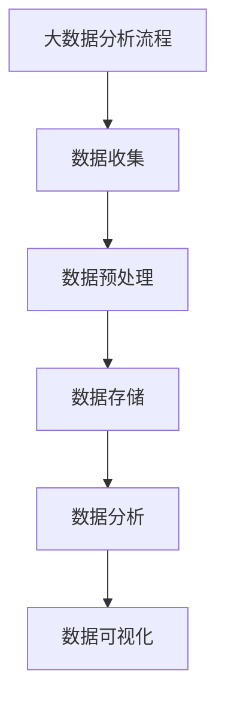
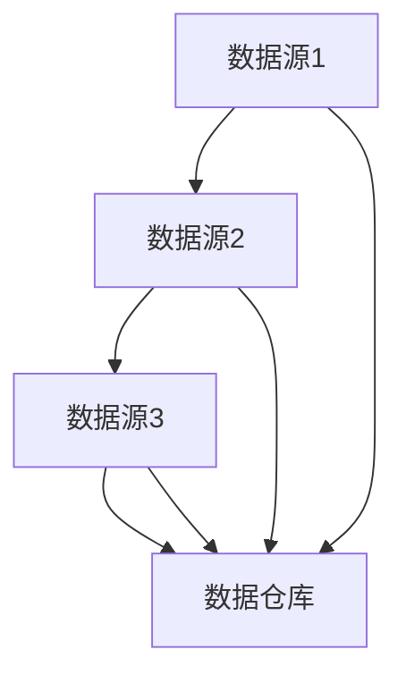
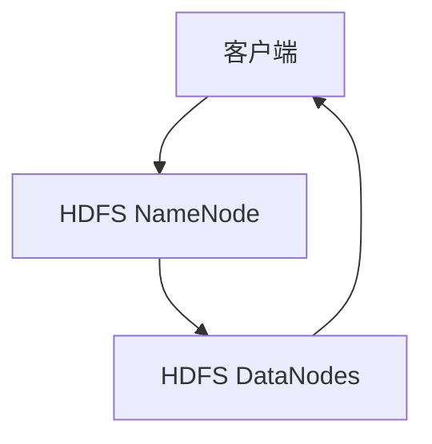
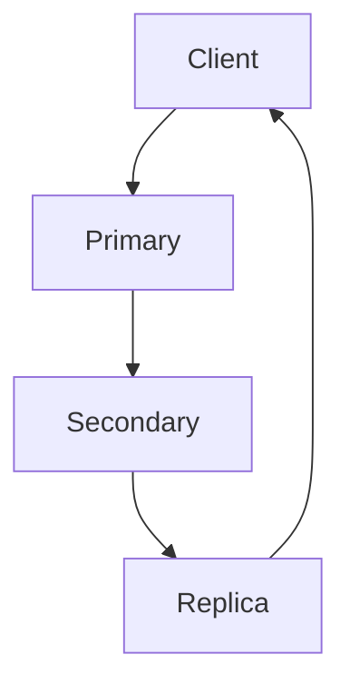

                 

# 大数据分析：原理与代码实例讲解

> **关键词：**大数据分析，数据预处理，统计分析，机器学习，数据可视化，实战案例

> **摘要：**本文将深入探讨大数据分析的基本概念、流程和方法，包括数据预处理、统计分析、机器学习和数据可视化等。通过详细的代码实例讲解，读者可以掌握大数据分析的核心技术和实战技巧。

## 目录大纲

### 《大数据分析 原理与代码实例讲解》目录大纲

#### 第一部分：大数据分析基础

##### 第1章：大数据概述

- 1.1 大数据的基本概念
- 1.2 大数据的来源与类型
- 1.3 大数据的价值与应用领域
- 1.4 大数据分析的基本流程

##### 第2章：数据预处理

- 2.1 数据清洗
  - 2.1.1 数据缺失值的处理
  - 2.1.2 数据异常值的处理
  - 2.1.3 数据格式转换
- 2.2 数据集成
  - 2.2.1 数据合并与连接
  - 2.2.2 数据仓库的构建
- 2.3 数据变换
  - 2.3.1 数据归一化与标准化
  - 2.3.2 特征工程

##### 第3章：数据存储与管理

- 3.1 数据库技术
  - 3.1.1 关系型数据库
  - 3.1.2 非关系型数据库
- 3.2 分布式存储系统
  - 3.2.1 Hadoop HDFS
  - 3.2.2 Apache Cassandra
- 3.3 数据库性能优化
  - 3.3.1 查询优化
  - 3.3.2 索引优化

#### 第二部分：大数据分析方法

##### 第4章：统计分析方法

- 4.1 描述性统计分析
  - 4.1.1 均值、中位数、众数
  - 4.1.2 方差、标准差
  - 4.1.3 假设检验
- 4.2 聚类分析方法
  - 4.2.1 K-means算法
  - 4.2.2 DBSCAN算法
  - 4.2.3 层次聚类
- 4.3 回归分析方法
  - 4.3.1 线性回归
  - 4.3.2 逻辑回归

##### 第5章：机器学习方法

- 5.1 监督学习算法
  - 5.1.1 决策树
  - 5.1.2 随机森林
  - 5.1.3 支持向量机
- 5.2 无监督学习算法
  - 5.2.1 K-means聚类
  - 5.2.2 主成分分析
  - 5.2.3 自编码器
- 5.3 强化学习
  - 5.3.1 Q-Learning算法
  - 5.3.2 SARSA算法

##### 第6章：数据挖掘与可视化

- 6.1 数据挖掘流程
  - 6.1.1 问题定义
  - 6.1.2 数据准备
  - 6.1.3 模型建立
  - 6.1.4 模型评估
- 6.2 可视化方法
  - 6.2.1 数据可视化基础
  - 6.2.2 常见可视化工具

#### 第三部分：大数据分析实战

##### 第7章：大数据分析项目实战

- 7.1 社交网络分析
  - 7.1.1 用户关系图构建
  - 7.1.2 社团发现与影响力分析
- 7.2 电商数据分析
  - 7.2.1 用户行为分析
  - 7.2.2 商品推荐系统
- 7.3 金融风控
  - 7.3.1 信用评分模型
  - 7.3.2 风险预警系统
- 7.4 医疗健康数据分析
  - 7.4.1 疾病预测
  - 7.4.2 病人分类与分析

##### 第8章：大数据分析工具与应用

- 8.1 Hadoop生态系统
  - 8.1.1 HDFS
  - 8.1.2 MapReduce
  - 8.1.3 YARN
- 8.2 Spark生态系统
  - 8.2.1 Spark Core
  - 8.2.2 Spark SQL
  - 8.2.3 Spark MLlib
- 8.3 大数据分析平台与工具
  - 8.3.1 Hadoop与Spark对比
  - 8.3.2 Apache Flink
  - 8.3.3 Apache Hive

##### 第9章：大数据分析与未来

- 9.1 大数据技术的发展趋势
- 9.2 大数据伦理与隐私保护
- 9.3 大数据在新兴领域的应用前景

### 附录

- 附录A：大数据分析常用工具与资源
- 附录B：大数据分析项目实战代码示例

#### Mermaid 流程图



---

## 第一部分：大数据分析基础

### 第1章：大数据概述

##### 1.1 大数据的基本概念

大数据（Big Data）是指无法使用常规软件工具在合理时间内捕捉、管理和处理的大量数据。这包括数据的存储、搜索、共享、分析和可视化。大数据通常具有四个V特点，即Volume（数据量）、Velocity（数据速度）、Variety（数据多样性）和Veracity（数据真实性）。

- **Volume**：大数据的规模庞大，远远超出了传统数据库的处理能力。例如，每天全球产生超过2.5亿GB的数据。
- **Velocity**：数据生成的速度非常快，需要实时处理和分析。
- **Variety**：大数据来源广泛，包括结构化、半结构化和非结构化数据，如文本、图像、音频、视频等。
- **Veracity**：数据的真实性是一个挑战，由于数据来源多样，有时数据可能不准确或不完整。

##### 1.2 大数据的来源与类型

大数据的来源广泛，可以分为以下几类：

- **社交媒体**：如Twitter、Facebook等社交媒体平台产生的用户行为数据。
- **传感器**：智能设备和传感器收集的环境数据，如气象数据、交通流量数据等。
- **电子商务**：电商网站的用户购买行为、商品评价等数据。
- **金融交易**：银行、证券交易所等金融机构的交易数据。
- **科学研究**：基因组学研究、天文学观测等科学领域产生的海量数据。

根据数据的形式，大数据可以分为以下几类：

- **结构化数据**：如数据库中的数据，具有固定的格式和结构。
- **半结构化数据**：如XML、JSON等格式化数据，部分结构化但有一定的灵活性。
- **非结构化数据**：如文本、图像、音频、视频等，没有固定的结构。

##### 1.3 大数据的价值与应用领域

大数据在各个领域都有广泛的应用，其价值体现在以下几个方面：

- **商业智能**：通过分析大量数据，帮助企业发现市场趋势、优化业务流程和提升客户体验。
- **医疗健康**：利用大数据进行疾病预测、个性化治疗和公共卫生管理。
- **金融风控**：通过大数据分析，识别欺诈行为、评估信用风险和进行投资决策。
- **城市智慧化**：利用大数据优化交通管理、环境监测和公共安全。
- **科学研究**：通过大数据分析，加速科学研究，如基因组学、气候变化研究等。

##### 1.4 大数据分析的基本流程

大数据分析的基本流程通常包括以下步骤：

1. **数据收集**：从各种数据源收集数据，包括内部数据和外部数据。
2. **数据预处理**：清洗、整合和转换原始数据，使其适合分析。
3. **数据存储**：将预处理后的数据存储到数据库或分布式存储系统中。
4. **数据分析**：使用统计方法和机器学习算法对数据进行分析，提取有价值的信息。
5. **数据可视化**：将分析结果以图形化的方式展示，帮助用户理解数据。

在下一章中，我们将深入探讨数据预处理的过程和技术。

## 第一部分：大数据分析基础

### 第2章：数据预处理

数据预处理是大数据分析中至关重要的一步，它直接影响后续分析的质量和效率。数据预处理主要包括数据清洗、数据集成、数据变换等步骤。

##### 2.1 数据清洗

数据清洗是指从原始数据中识别和修正错误、异常或不一致的数据。数据清洗的目的是提高数据质量，确保数据在后续分析中的准确性和一致性。数据清洗的主要任务包括以下几个方面：

- **数据缺失值的处理**：缺失值可能是由于数据采集过程中的错误或数据传输过程中的丢失造成的。处理缺失值的方法包括删除缺失数据、填充缺失数据等。
- **数据异常值的处理**：异常值是指与正常数据相比偏离较大的数据。异常值可能是由于数据采集过程中的错误、实验误差或数据录入错误造成的。处理异常值的方法包括删除异常值、校正异常值等。
- **数据格式转换**：不同数据源的数据格式可能不同，需要将数据格式转换为统一的标准格式。数据格式转换包括数据类型的转换、数据格式的标准化等。

**伪代码示例：数据清洗流程**

```python
def data_cleaning(data):
    # 删除缺失值
    cleaned_data = remove_missing_values(data)
    # 处理异常值
    cleaned_data = handle_outliers(cleaned_data)
    # 转换数据格式
    cleaned_data = convert_data_format(cleaned_data)
    return cleaned_data
```

##### 2.2 数据集成

数据集成是指将来自多个数据源的数据合并为一个统一的数据视图。数据集成的主要任务包括以下几个方面：

- **数据合并与连接**：将结构化数据、半结构化数据和非结构化数据进行合并，形成统一的数据集。数据合并的方法包括SQL连接、数据表合并等。
- **数据仓库的构建**：将来自不同数据源的数据集成到数据仓库中，形成统一的数据存储和管理系统。数据仓库的构建方法包括ETL（提取、转换、加载）过程等。

**Mermaid流程图示例：数据集成流程**



##### 2.3 数据变换

数据变换是指对数据进行转换、归一化、标准化等操作，使其满足分析的需求。数据变换的主要任务包括以下几个方面：

- **数据归一化与标准化**：将不同数据尺度的数据转换为同一尺度，便于分析。数据归一化和标准化的方法包括最小-最大归一化、Z-Score标准化等。
- **特征工程**：从原始数据中提取出对分析有价值的特征，如降维、特征选择、特征构造等。

**伪代码示例：数据变换流程**

```python
def data_transformation(data):
    # 数据归一化
    normalized_data = normalize_data(data)
    # 数据标准化
    standardized_data = standardize_data(normalized_data)
    # 特征工程
    feature_engineered_data = feature_engineering(standardized_data)
    return feature_engineered_data
```

通过数据预处理，我们可以提高数据的质量，为后续的分析提供可靠的基础。在下一章中，我们将深入探讨大数据分析中的数据存储与管理技术。

### 第3章：数据存储与管理

数据存储与管理是大数据分析中的重要环节，关系到数据的可扩展性、可靠性和高效性。在大数据环境中，传统的集中式数据库已经无法满足海量数据存储和处理的需求，分布式存储系统和数据库技术成为主流。

#### 3.1 数据库技术

数据库技术包括关系型数据库和非关系型数据库。

**3.1.1 关系型数据库**

关系型数据库（RDBMS）使用表和关系模型来存储数据。常见的RDBMS包括MySQL、PostgreSQL、Oracle等。

- **数据表**：关系型数据库中的数据存储在表中，每个表由若干行和列组成。
- **关系**：关系型数据库中的表之间存在关系，如一对一、一对多、多对多关系。
- **SQL查询**：使用结构化查询语言（SQL）来查询和操作数据。

**3.1.2 非关系型数据库**

非关系型数据库（NoSQL）不使用表和关系模型，而是采用键值对、文档、列族、图等模型存储数据。常见的NoSQL数据库包括MongoDB、Cassandra、Redis等。

- **键值对数据库**：如Redis，适用于存储少量但快速读取的数据。
- **文档数据库**：如MongoDB，适用于存储结构化文档，如JSON格式。
- **列族数据库**：如Cassandra，适用于存储大量结构化数据，具有良好的可扩展性。
- **图数据库**：如Neo4j，适用于存储和查询复杂的图结构数据。

#### 3.2 分布式存储系统

分布式存储系统是大数据环境下数据存储的关键技术，能够水平扩展以存储海量数据，并提供高可用性和高性能。

**3.2.1 Hadoop HDFS**

Hadoop HDFS（Hadoop Distributed File System）是一个分布式文件系统，用于存储大量数据。HDFS具有以下特点：

- **分块存储**：数据被分为固定大小的块（默认为128MB或256MB），并分布存储在多个节点上。
- **高可用性**：通过数据复制和容错机制，确保数据在节点故障时能够恢复。
- **高吞吐量**：通过并行处理和分布式计算，提高数据处理效率。

**Mermaid流程图示例：Hadoop HDFS工作流程**



**3.2.2 Apache Cassandra**

Apache Cassandra是一个分布式键值对数据库，适用于存储和查询大量数据。Cassandra具有以下特点：

- **去中心化**：Cassandra没有单点故障，数据自动复制并分布在多个节点上。
- **高可用性**：Cassandra通过数据的自动复制和故障转移，确保系统的高可用性。
- **弹性扩展**：Cassandra能够轻松地扩展到数千个节点，支持海量数据的存储。

**Mermaid流程图示例：Cassandra分布式存储**



#### 3.3 数据库性能优化

数据库性能优化是提高数据处理效率的关键。以下是一些常见的优化技术：

**3.3.1 查询优化**

查询优化包括索引优化、查询重写、查询缓存等技术。

- **索引优化**：通过创建索引，加快数据查询速度。
- **查询重写**：通过重写查询语句，提高查询效率。
- **查询缓存**：缓存常用的查询结果，减少数据库查询的负载。

**3.3.2 索引优化**

索引优化是数据库性能优化的重要环节，包括以下方面：

- **选择合适的索引**：根据查询需求选择合适的索引类型，如B树索引、哈希索引等。
- **索引维护**：定期维护索引，如重建索引、更新索引统计信息等。

通过数据存储与管理技术的优化，我们可以提高大数据处理的效率，为后续的数据分析打下坚实的基础。在下一章中，我们将探讨大数据分析中的统计分析方法。

### 第二部分：大数据分析方法

#### 第4章：统计分析方法

统计分析是大数据分析的基础，通过描述性统计和推理性统计，我们可以从数据中提取有价值的信息。本章将介绍描述性统计方法、聚类分析方法以及回归分析方法。

##### 4.1 描述性统计分析

描述性统计分析用于总结和描述数据的特征，包括以下几种常用的统计量：

**4.1.1 均值、中位数、众数**

- **均值**：均值是数据集中所有数值的平均值，用于衡量数据的中心趋势。
  $$ \bar{x} = \frac{\sum_{i=1}^{n} x_i}{n} $$
- **中位数**：中位数是将数据按大小顺序排列后，位于中间位置的数值，用于衡量数据的中间值。
  如果数据个数为奇数，中位数即为中间的数值；如果数据个数为偶数，中位数则为中间两个数值的平均值。
- **众数**：众数是数据集中出现次数最多的数值，用于衡量数据的多数值。

**4.1.2 方差、标准差**

方差和标准差是衡量数据离散程度的统计量。

- **方差**：方差是各数值与均值差的平方的平均值，用于衡量数据的波动程度。
  $$ \sigma^2 = \frac{\sum_{i=1}^{n} (x_i - \bar{x})^2}{n} $$
- **标准差**：标准差是方差的平方根，用于衡量数据的波动程度。
  $$ \sigma = \sqrt{\frac{\sum_{i=1}^{n} (x_i - \bar{x})^2}{n}} $$

**4.1.3 假设检验**

假设检验是用于检验数据是否符合某种分布或两个样本之间是否存在显著差异的统计方法。

- **t检验**：用于比较两个独立样本的均值是否存在显著差异。
- **卡方检验**：用于检验两个分类变量之间是否独立。
- **F检验**：用于比较两个样本的方差是否存在显著差异。

##### 4.2 聚类分析方法

聚类分析是将数据分组为多个类别的技术，用于发现数据中的模式和结构。常用的聚类算法包括K-means、DBSCAN和层次聚类。

**4.2.1 K-means算法**

K-means算法是一种基于距离的聚类方法，通过迭代计算逐步优化聚类结果。

- **初始化**：随机选择K个数据点作为初始聚类中心。
- **分配**：将每个数据点分配到距离其最近的聚类中心所属的类别。
- **更新**：重新计算每个类别的聚类中心。
- **迭代**：重复分配和更新步骤，直到聚类中心不再发生变化或达到最大迭代次数。

**伪代码示例：K-means算法**

```python
def k_means(data, k, max_iterations):
    # 初始化聚类中心
    centroids = initialize_centroids(data, k)
    for _ in range(max_iterations):
        # 数据点分配到聚类中心
        clusters = assign_data_to_clusters(data, centroids)
        # 更新聚类中心
        centroids = update_centroids(clusters, k)
    return centroids, clusters
```

**4.2.2 DBSCAN算法**

DBSCAN（Density-Based Spatial Clustering of Applications with Noise）是一种基于密度的聚类方法，能够自动确定聚类数量。

- **邻域**：计算每个数据点的邻域，邻域内的数据点被认为是密度相连的。
- **核心点**：如果一个点的邻域内包含足够多的其他点，则认为该点是核心点。
- **边界点**：如果一个点的邻域内包含较少的其他点，但本身是一个核心点的一部分，则认为该点是边界点。
- **噪声点**：如果一个点的邻域内没有其他点，则认为该点是噪声点。

**伪代码示例：DBSCAN算法**

```python
def dbscan(data, eps, min_points):
    clusters = []
    visited = set()
    for point in data:
        if point not in visited:
            visited.add(point)
            neighbors = find_neighbors(point, data, eps)
            if len(neighbors) >= min_points:
                cluster = expand_cluster(point, neighbors, visited, data, clusters, eps, min_points)
                clusters.append(cluster)
    return clusters
```

**4.2.3 层次聚类

层次聚类是一种基于层次结构的聚类方法，通过逐步合并或分裂数据点，形成一棵聚类树。

- **距离计算**：计算每对数据点之间的距离，用于评估聚类质量。
- **合并或分裂**：根据聚类准则，合并或分裂最近的两个聚类。
- **迭代**：重复合并或分裂步骤，直到达到指定的聚类数量或合并/分裂距离小于阈值。

**伪代码示例：层次聚类**

```python
def hierarchical_clustering(data, method, linkage):
    distances = compute_distances(data, method)
    clusters = []
    for point in data:
        clusters.append([point])
    while len(clusters) > 1:
        closest = find_closest_clusters(clusters, distances, linkage)
        merged = merge_clusters(closest)
        clusters = update_clusters(clusters, merged)
    return clusters
```

##### 4.3 回归分析方法

回归分析是一种用于预测和解释变量之间关系的统计方法，常用的回归分析方法包括线性回归和逻辑回归。

**4.3.1 线性回归**

线性回归是一种用于预测一个连续变量与其他变量之间线性关系的回归方法。

- **模型**：$y = \beta_0 + \beta_1x + \epsilon$
  其中，$y$ 是因变量，$x$ 是自变量，$\beta_0$ 是截距，$\beta_1$ 是斜率，$\epsilon$ 是误差项。
- **假设**：自变量和因变量之间满足线性关系，误差项服从正态分布。
- **计算**：使用最小二乘法计算回归系数。

**伪代码示例：线性回归**

```python
def linear_regression(x, y):
    n = len(x)
    x_mean = np.mean(x)
    y_mean = np.mean(y)
    x_diff = x - x_mean
    y_diff = y - y_mean
    beta_1 = np.sum(x_diff * y_diff) / np.sum(x_diff ** 2)
    beta_0 = y_mean - beta_1 * x_mean
    return beta_0, beta_1
```

**4.3.2 逻辑回归**

逻辑回归是一种用于预测一个二元变量与其他变量之间关系的回归方法。

- **模型**：$P(y=1) = \frac{1}{1 + e^{-(\beta_0 + \beta_1x)}}$
  其中，$y$ 是因变量（0或1），$x$ 是自变量，$\beta_0$ 是截距，$\beta_1$ 是斜率。
- **假设**：自变量和因变量之间满足逻辑关系，概率分布为伯努利分布。
- **计算**：使用最大似然估计法计算回归系数。

**伪代码示例：逻辑回归**

```python
def logistic_regression(x, y):
    n = len(x)
    z = np.dot(x, w) + b
    prob = 1 / (1 + np.exp(-z))
    log_likelihood = np.sum(y * np.log(prob) + (1 - y) * np.log(1 - prob))
    grad_w = np.dot(x.T, prob - y) / n
    grad_b = np.sum(prob - y) / n
    return -grad_w, -grad_b
```

通过描述性统计分析、聚类分析和回归分析，我们可以从大数据中提取有价值的信息，为业务决策提供支持。在下一章中，我们将探讨大数据分析中的机器学习方法。

### 第二部分：大数据分析方法

#### 第5章：机器学习方法

机器学习是大数据分析中的重要工具，通过训练模型，可以自动发现数据中的模式和规律。本章将介绍机器学习中的监督学习、无监督学习和强化学习算法。

##### 5.1 监督学习算法

监督学习是一种从标注数据中学习映射关系的机器学习方法。监督学习算法通常分为分类和回归两大类。

**5.1.1 决策树**

决策树是一种树形结构，每个节点表示一个特征，每个分支表示特征的不同取值，叶子节点表示预测结果。

- **构建过程**：通过递归划分数据集，选择具有最大信息增益的特征作为节点。
- **分类过程**：根据输入特征值，从根节点开始，依次向下遍历分支，直到到达叶子节点得到预测结果。

**伪代码示例：决策树构建**

```python
def build_tree(data, features):
    if is_leaf(data):
        return predict_majority_class(data)
    best_feature = find_best_feature(data, features)
    tree = {}
    for value in unique_values(best_feature, data):
        subtree = build_tree(filter_data(data, best_feature, value), features_without(best_feature, features)):
        tree[value] = subtree
    return tree
```

**5.1.2 随机森林**

随机森林是一种基于决策树的集成学习方法，通过构建多棵决策树，并取多数投票作为最终预测结果。

- **构建过程**：随机选择特征子集，构建决策树，重复此过程生成多棵决策树。
- **预测过程**：对每个样本，将多棵决策树的结果取多数投票。

**伪代码示例：随机森林构建**

```python
def random_forest(data, n_trees, max_features):
    forests = []
    for _ in range(n_trees):
        tree = build_tree(data, random_subset_of_features(data, max_features))
        forests.append(tree)
    return forests
```

**5.1.3 支持向量机**

支持向量机（SVM）是一种用于分类和回归的线性模型，通过最大化分类边界上的间隔来提高模型的泛化能力。

- **模型**：$f(x) = \omega^T x + b$
  其中，$x$ 是特征向量，$\omega$ 是权向量，$b$ 是偏置。
- **优化目标**：最大化分类边界上的间隔。
- **求解**：使用拉格朗日乘子法求解最优权向量。

**伪代码示例：SVM求解**

```python
def svm(data, labels):
    n = len(data)
    P = np.eye(n)
    q = -2 * np.dot(data, data.T)
    a = np.full(n, -C)
    constraints = [a * labels, P * a]
    solution = solve_qp(q, a, constraints=constraints)
    return solution.x
```

##### 5.2 无监督学习算法

无监督学习是一种在没有标注数据的情况下，自动发现数据中结构和规律的方法。无监督学习算法通常分为聚类和降维两大类。

**5.2.1 K-means聚类**

K-means聚类是一种基于距离的聚类方法，通过迭代优化聚类中心，将数据分为K个类别。

- **初始化**：随机选择K个数据点作为初始聚类中心。
- **分配**：将每个数据点分配到距离其最近的聚类中心所属的类别。
- **更新**：重新计算每个类别的聚类中心。
- **迭代**：重复分配和更新步骤，直到聚类中心不再发生变化或达到最大迭代次数。

**伪代码示例：K-means聚类**

```python
def k_means(data, k, max_iterations):
    centroids = initialize_centroids(data, k)
    for _ in range(max_iterations):
        clusters = assign_data_to_clusters(data, centroids)
        centroids = update_centroids(clusters, k)
    return centroids, clusters
```

**5.2.2 主成分分析**

主成分分析（PCA）是一种用于降维的线性变换方法，通过最大化特征值，将数据映射到新的低维空间。

- **协方差矩阵**：计算数据集的协方差矩阵。
- **特征值和特征向量**：计算协方差矩阵的特征值和特征向量。
- **投影矩阵**：选择前k个特征向量作为投影矩阵。
- **数据变换**：将数据投影到新的低维空间。

**伪代码示例：PCA降维**

```python
def pca(data, k):
    cov_matrix = compute_covariance_matrix(data)
    eigenvalues, eigenvectors = eig(cov_matrix)
    sorted_indices = sort_by_eigenvalues(eigenvalues)
    projection_matrix = eigenvectors[:, sorted_indices[:k]]
    transformed_data = project_data(data, projection_matrix)
    return transformed_data
```

**5.2.3 自编码器**

自编码器是一种无监督学习算法，通过学习数据的编码和解码，自动提取数据的特征。

- **编码器**：将输入数据映射到低维编码空间。
- **解码器**：将编码数据映射回原始数据空间。
- **损失函数**：使用均方误差或交叉熵等损失函数优化模型。

**伪代码示例：自编码器**

```python
def autoencoder(input_data, hidden_size):
    encoding_layer = Dense(hidden_size, activation='relu', input_shape=input_data.shape[1:])
    decoding_layer = Dense(input_data.shape[1], activation='sigmoid')
    model = Model(inputs=input_data, outputs=decoding_layer(encoding_layer(input_data)))
    model.compile(optimizer='adam', loss='mse')
    model.fit(input_data, input_data, epochs=10, batch_size=32)
    return model
```

##### 5.3 强化学习

强化学习是一种通过与环境互动，学习最优策略的机器学习方法。

**5.3.1 Q-Learning算法**

Q-Learning算法是一种基于值迭代的强化学习算法，通过更新状态-动作值函数，学习最优策略。

- **状态-动作值函数**：$Q(s, a)$ 表示在状态s下执行动作a的期望回报。
- **更新规则**：$Q(s, a) = Q(s, a) + \alpha [r + \gamma \max_{a'} Q(s', a') - Q(s, a)]$
  其中，$\alpha$ 是学习率，$\gamma$ 是折扣因子。

**伪代码示例：Q-Learning算法**

```python
def q_learning(env, n_episodes, alpha, gamma):
    Q = initialize_Q_matrix()
    for episode in range(n_episodes):
        state = env.reset()
        done = False
        while not done:
            action = choose_action(Q, state)
            next_state, reward, done = env.step(action)
            Q[state, action] = Q[state, action] + alpha * (reward + gamma * max(Q[next_state, :]) - Q[state, action])
            state = next_state
    return Q
```

**5.3.2 SARSA算法**

SARSA算法是一种基于策略迭代的强化学习算法，通过更新当前状态和动作的值函数，学习最优策略。

- **状态-动作值函数**：$Q(s, a)$ 表示在状态s下执行动作a的期望回报。
- **更新规则**：$Q(s, a) = Q(s, a) + \alpha [r + \gamma Q(s', a')] - Q(s, a)]$
  其中，$\alpha$ 是学习率，$\gamma$ 是折扣因子。

**伪代码示例：SARSA算法**

```python
def sarsa(env, n_episodes, alpha, gamma):
    Q = initialize_Q_matrix()
    for episode in range(n_episodes):
        state = env.reset()
        done = False
        while not done:
            action = choose_action(Q, state)
            next_state, reward, done = env.step(action)
            next_action = choose_action(Q, next_state)
            Q[state, action] = Q[state, action] + alpha * (reward + gamma * Q[next_state, next_action] - Q[state, action])
            state = next_state
            action = next_action
    return Q
```

通过监督学习、无监督学习和强化学习算法，我们可以从大数据中提取出有价值的信息和模式，为各种应用场景提供强大的技术支持。在下一章中，我们将探讨大数据分析中的数据挖掘与可视化技术。

### 第二部分：大数据分析方法

#### 第6章：数据挖掘与可视化

数据挖掘与可视化是大数据分析中的重要环节，数据挖掘旨在从大量数据中提取有价值的信息和模式，而可视化则通过图形化的方式展示分析结果，使决策者能够直观地理解和利用这些信息。本章将介绍数据挖掘的基本流程和常见可视化方法。

##### 6.1 数据挖掘流程

数据挖掘是一个复杂的过程，通常包括以下步骤：

**6.1.1 问题定义**

问题定义是数据挖掘的第一步，明确分析的目标和需求。问题定义的准确性直接影响后续分析的质量。通常需要与业务专家和决策者进行充分沟通，确保分析目标符合实际需求。

**6.1.2 数据准备**

数据准备包括数据收集、数据清洗、数据集成和数据变换等步骤。数据准备的质量直接影响数据挖掘的结果。需要确保数据的质量、完整性和一致性，去除噪声和异常值，为后续分析提供可靠的数据基础。

**6.1.3 模型建立**

模型建立是数据挖掘的核心步骤，通过选择合适的算法和模型，对数据进行挖掘和分析。常用的模型包括分类模型、聚类模型、回归模型等。模型建立的过程需要不断尝试和优化，以找到最佳的模型参数。

**6.1.4 模型评估**

模型评估是对模型性能的评估，通过评估指标（如准确率、召回率、F1值等）来衡量模型的性能。模型评估的目的是确定模型是否满足分析目标，以及是否需要进一步优化。

**6.1.5 模型部署**

模型部署是将模型应用到实际业务场景中，生成预测结果或决策建议。模型部署需要确保模型的稳定性和可扩展性，能够适应实际业务需求的变化。

##### 6.2 可视化方法

可视化是将数据分析结果以图形化的方式展示，使决策者能够直观地理解和利用这些信息。以下是一些常见的可视化方法：

**6.2.1 数据可视化基础**

数据可视化基础包括图表、图像和交互式界面等元素。图表是数据可视化的主要形式，包括柱状图、折线图、饼图、散点图等。图像和交互式界面可以提供更丰富的可视化效果，帮助用户探索和分析数据。

**6.2.2 常见可视化工具**

常见可视化工具包括Tableau、Power BI、D3.js、ECharts等。这些工具提供了丰富的可视化功能，支持多种数据格式和图表类型，可以满足不同场景的需求。

**Tableau**：Tableau是一款流行的数据可视化工具，支持多种数据连接和丰富的图表类型。用户可以通过拖拽操作创建可视化图表，并实现实时数据更新和交互。

**Power BI**：Power BI是微软推出的数据可视化工具，提供了丰富的数据分析功能，支持数据导入、数据清洗、数据建模和可视化报表的创建。

**D3.js**：D3.js是一款基于JavaScript的可视化库，可以创建动态和交互式的数据可视化。D3.js具有高度的灵活性和可定制性，适用于各种数据可视化场景。

**ECharts**：ECharts是一款开源的JavaScript图表库，支持多种图表类型和丰富的交互功能。ECharts具有高性能、易用性和跨平台兼容性，适用于Web应用程序中的数据可视化。

通过数据挖掘与可视化技术的应用，我们可以从大数据中提取有价值的信息，为业务决策提供有力支持。在下一部分中，我们将探讨大数据分析在实战项目中的应用。

### 第三部分：大数据分析实战

#### 第7章：大数据分析项目实战

大数据分析在各个领域都有广泛的应用，通过实际项目案例，我们可以更好地理解大数据分析的方法和技术。本章将介绍大数据分析在社交网络分析、电商数据分析、金融风控和医疗健康数据分析等领域的实战项目。

##### 7.1 社交网络分析

社交网络分析是一种用于研究社交网络结构和用户行为的方法。通过分析社交网络数据，我们可以了解用户之间的关系、社交影响力和社会传播机制。

**7.1.1 用户关系图构建**

用户关系图构建是社交网络分析的基础步骤，通过分析用户之间的关系，构建出用户关系的图结构。以下是一个简单的用户关系图构建案例：

**数据集**：假设我们有以下社交网络数据集，包含用户ID和好友关系。

| 用户ID | 好友ID |
|--------|--------|
| 1      | 2      |
| 1      | 3      |
| 2      | 3      |
| 2      | 4      |
| 3      | 4      |

**实现步骤**：

1. **数据清洗**：删除重复关系和无效数据。
2. **构建用户关系图**：使用邻接矩阵或图数据库（如Neo4j）构建用户关系图。
3. **可视化**：使用可视化工具（如ECharts）展示用户关系图。

```mermaid
graph TB
    A[1] -- B[2]
    A[1] -- C[3]
    B[2] -- C[3]
    B[2] -- D[4]
    C[3] -- D[4]
```

**7.1.2 社团发现与影响力分析**

社团发现是社交网络分析的重要任务，通过识别用户之间的关系，发现社交网络中的社团结构。影响力分析则用于评估用户在社交网络中的影响力，了解关键用户和意见领袖。

**实现步骤**：

1. **社团发现**：使用聚类算法（如K-means、DBSCAN）发现用户社团。
2. **影响力分析**：计算用户的中心性指标（如度中心性、介数中心性），评估用户影响力。

```python
import networkx as nx

G = nx.Graph()
G.add_edges_from([(1, 2), (1, 3), (2, 3), (2, 4), (3, 4)])

# 社团发现
clusters = nx Communities().find_communities(G)

# 影响力分析
degree_centrality = nx.degree_centrality(G)
betweenness_centrality = nx.betweenness_centrality(G)

print("社团：", clusters)
print("度中心性：", degree_centrality)
print("介数中心性：", betweenness_centrality)
```

##### 7.2 电商数据分析

电商数据分析是一种用于优化电商业务、提升用户体验和增加销售收益的方法。通过分析用户行为数据和商品数据，我们可以了解用户购买行为、推荐商品和优化营销策略。

**7.2.1 用户行为分析**

用户行为分析是一种用于研究用户购买行为和偏好特征的方法。通过分析用户在电商平台的访问记录、搜索记录和购买记录，我们可以了解用户的行为模式。

**数据集**：假设我们有以下用户行为数据集，包含用户ID、访问页面、搜索关键词和购买商品。

| 用户ID | 访问页面 | 搜索关键词 | 购买商品 |
|--------|----------|------------|----------|
| 1      | 首页     | 运动鞋     | 运动鞋   |
| 2      | 商品详情 | 运动鞋     | 运动鞋   |
| 3      | 搜索结果 | 洗发水     | 洗发水   |
| 4      | 购物车   | 运动鞋     | 运动鞋   |
| 5      | 订单确认 | 运动鞋     | 运动鞋   |

**实现步骤**：

1. **数据预处理**：清洗和整合用户行为数据。
2. **行为分析**：使用统计方法和机器学习算法分析用户行为，如行为序列分析、用户聚类分析等。
3. **可视化**：使用可视化工具展示用户行为分析结果。

```python
import pandas as pd
import matplotlib.pyplot as plt

data = pd.DataFrame({
    '用户ID': [1, 2, 3, 4, 5],
    '访问页面': ['首页', '商品详情', '搜索结果', '购物车', '订单确认'],
    '搜索关键词': ['运动鞋', '运动鞋', '洗发水', '运动鞋', '运动鞋'],
    '购买商品': ['运动鞋', '运动鞋', '洗发水', '运动鞋', '运动鞋']
})

# 行为序列分析
data['行为序列'] = data['访问页面'] + ' ' + data['搜索关键词'] + ' ' + data['购买商品']
sequences = data['行为序列'].value_counts()

# 可视化
sequences.plot(kind='bar')
plt.xlabel('行为序列')
plt.ylabel('次数')
plt.title('用户行为序列分析')
plt.show()
```

**7.2.2 商品推荐系统**

商品推荐系统是一种用于预测用户可能感兴趣的商品的方法，通过推荐相关商品，提升用户体验和销售转化率。

**实现步骤**：

1. **用户-商品矩阵构建**：根据用户行为数据构建用户-商品矩阵。
2. **推荐算法**：使用协同过滤、基于内容的推荐等算法生成推荐结果。
3. **推荐结果评估**：使用准确率、召回率等指标评估推荐效果。

```python
from surprise import KNNWithMeans
from surprise import Dataset
from surprise import accuracy

# 构建用户-商品矩阵
user_item_matrix = pd.pivot_table(data, index='用户ID', columns='购买商品', values=1, fill_value=0)

# 加载数据集
data selten = Dataset.load_from_df(user_item_matrix)

# 训练推荐模型
model = KNNWithMeans()
model.fit(data selten)

# 预测用户感兴趣的商品
predictions = model.test(data selten)

# 评估推荐效果
accuracy.rmse(predictions)
```

##### 7.3 金融风控

金融风控是一种用于识别和防范金融风险的方法，通过分析用户行为、交易数据和信用记录，预测潜在风险并采取相应措施。

**7.3.1 信用评分模型**

信用评分模型是一种用于评估用户信用风险的模型，通过分析用户的信用记录和行为特征，预测用户违约的可能性。

**数据集**：假设我们有以下信用评分数据集，包含用户ID、信用评分和违约标志。

| 用户ID | 信用评分 | 违约标志 |
|--------|----------|----------|
| 1      | 700      | 0        |
| 2      | 650      | 0        |
| 3      | 600      | 1        |
| 4      | 750      | 0        |
| 5      | 620      | 1        |

**实现步骤**：

1. **数据预处理**：清洗和整合信用评分数据。
2. **特征工程**：提取对信用评分有价值的特征，如年龄、收入、负债等。
3. **模型训练**：使用监督学习算法（如逻辑回归、随机森林）训练信用评分模型。
4. **模型评估**：使用准确率、召回率等指标评估模型性能。

```python
from sklearn.model_selection import train_test_split
from sklearn.ensemble import RandomForestClassifier
from sklearn.metrics import accuracy_score, recall_score

# 数据预处理
X = data[['年龄', '收入', '负债']]
y = data['违约标志']

# 特征工程
X_train, X_test, y_train, y_test = train_test_split(X, y, test_size=0.3, random_state=42)

# 模型训练
model = RandomForestClassifier(n_estimators=100)
model.fit(X_train, y_train)

# 模型评估
y_pred = model.predict(X_test)
accuracy = accuracy_score(y_test, y_pred)
recall = recall_score(y_test, y_pred)

print("准确率：", accuracy)
print("召回率：", recall)
```

**7.3.2 风险预警系统**

风险预警系统是一种用于实时监控和预警潜在风险的方法，通过分析实时数据，及时发现风险并采取相应措施。

**实现步骤**：

1. **数据采集**：采集实时交易数据、用户行为数据等。
2. **实时分析**：使用流处理技术（如Apache Kafka、Apache Flink）对实时数据进行分析。
3. **风险预警**：根据分析结果，生成风险预警报告并通知相关人员。

```python
import json
from kafka import KafkaConsumer

# Kafka消费者
consumer = KafkaConsumer('realtime_data_topic', bootstrap_servers=['localhost:9092'])

# 实时分析
for message in consumer:
    data = json.loads(message.value)
    # 风险分析
    if is_risk(data):
        # 风险预警
        send_alert(data)
```

##### 7.4 医疗健康数据分析

医疗健康数据分析是一种用于优化医疗服务、提高疾病预测和诊断准确性的方法。通过分析医疗数据、患者行为和生物特征，我们可以了解疾病的发展趋势、患者健康状况和医疗资源分配。

**7.4.1 疾病预测**

疾病预测是一种用于预测患者未来健康状况的方法，通过分析患者的健康数据、病史和基因信息，预测患者患病的可能性。

**数据集**：假设我们有以下疾病预测数据集，包含患者ID、年龄、性别、病史和基因特征。

| 患者ID | 年龄 | 性别 | 病史   | 基因特征 |
|--------|------|------|--------|----------|
| 1      | 45   | 男   | 无     | AAGGTT   |
| 2      | 50   | 女   | 高血压 | AACGTC   |
| 3      | 40   | 男   | 无     | AGGTTT   |
| 4      | 55   | 女   | 高血压 | AACGTT   |
| 5      | 45   | 男   | 糖尿病 | AGGTTA   |

**实现步骤**：

1. **数据预处理**：清洗和整合疾病预测数据。
2. **特征工程**：提取对疾病预测有价值的特征，如年龄、性别、病史和基因特征。
3. **模型训练**：使用监督学习算法（如逻辑回归、决策树）训练疾病预测模型。
4. **模型评估**：使用准确率、召回率等指标评估模型性能。

```python
from sklearn.model_selection import train_test_split
from sklearn.ensemble import RandomForestClassifier
from sklearn.metrics import accuracy_score, recall_score

# 数据预处理
X = data[['年龄', '性别', '病史', '基因特征']]
y = data['患病标志']

# 特征工程
X_train, X_test, y_train, y_test = train_test_split(X, y, test_size=0.3, random_state=42)

# 模型训练
model = RandomForestClassifier(n_estimators=100)
model.fit(X_train, y_train)

# 模型评估
y_pred = model.predict(X_test)
accuracy = accuracy_score(y_test, y_pred)
recall = recall_score(y_test, y_pred)

print("准确率：", accuracy)
print("召回率：", recall)
```

**7.4.2 病人分类与分析**

病人分类与分析是一种用于分类和分析病人病情的方法，通过分析病人的医疗数据、生物特征和病史，对病人进行分类和分析。

**实现步骤**：

1. **数据预处理**：清洗和整合病人数据。
2. **特征工程**：提取对病人分类和分析有价值的特征，如年龄、性别、病史和生物特征。
3. **模型训练**：使用监督学习算法（如K-means、SVM）训练病人分类模型。
4. **模型评估**：使用准确率、召回率等指标评估模型性能。

```python
from sklearn.cluster import KMeans
from sklearn.metrics import accuracy_score

# 数据预处理
X = data[['年龄', '性别', '病史', '生物特征']]

# 特征工程
k = 3  # 病人分类数量
kmeans = KMeans(n_clusters=k, random_state=42)
labels = kmeans.fit_predict(X)

# 模型评估
accuracy = accuracy_score(y_true, labels)
print("准确率：", accuracy)
```

通过以上实战项目案例，我们可以看到大数据分析在各个领域的重要性和应用价值。在实际应用中，大数据分析需要结合具体业务场景和需求，灵活运用各种技术和方法，为业务决策提供有力支持。在下一章中，我们将探讨大数据分析工具与应用。

### 第三部分：大数据分析工具与应用

#### 第8章：大数据分析工具与应用

大数据分析工具是进行大数据处理和分析的关键组件，它们能够帮助我们高效地管理海量数据，并提供强大的数据处理和分析能力。本章将介绍Hadoop生态系统、Spark生态系统以及大数据分析平台与工具。

##### 8.1 Hadoop生态系统

Hadoop是一个开源的大数据平台，由Apache Software Foundation维护。它包括多个组件，用于处理、存储和分析大规模数据。

**8.1.1 HDFS**

Hadoop Distributed File System（HDFS）是一个分布式文件系统，用于存储海量数据。HDFS的主要特点包括：

- **分块存储**：HDFS将数据分为固定大小的块（默认为128MB或256MB），并分布存储在多个节点上。
- **高可用性**：通过数据复制和容错机制，确保数据在节点故障时能够恢复。
- **高吞吐量**：通过并行处理和分布式计算，提高数据处理效率。

**8.1.2 MapReduce**

MapReduce是一种用于处理大规模数据的编程模型，它将数据处理任务分为两个阶段：Map阶段和Reduce阶段。

- **Map阶段**：将输入数据分解为键值对，并对其执行映射操作，生成中间键值对。
- **Reduce阶段**：将中间键值对合并，并对其执行归约操作，生成最终结果。

**8.1.3 YARN**

YARN（Yet Another Resource Negotiator）是Hadoop的资源管理框架，用于管理Hadoop集群中的资源。YARN的主要特点包括：

- **资源隔离**：YARN将集群资源分配给不同的应用程序，确保应用程序之间资源独立。
- **弹性调度**：YARN可以根据应用程序的需求动态调整资源分配。
- **扩展性**：YARN支持多种应用程序，如MapReduce、Spark等。

##### 8.2 Spark生态系统

Apache Spark是一个开源的大数据处理引擎，它提供了快速、通用和可扩展的数据处理能力。Spark生态系统包括多个组件，用于数据处理、存储和分析。

**8.2.1 Spark Core**

Spark Core是Spark的核心组件，提供分布式数据存储和处理功能。

- **弹性分布式数据集**（RDD）: RDD是Spark的核心抽象，用于表示不可变、分布式数据集。RDD支持丰富的操作，如映射、过滤、聚合等。
- **Spark SQL**：Spark SQL是Spark的分布式查询引擎，用于处理结构化和半结构化数据。Spark SQL支持SQL查询、DataFrame和Dataset等抽象。

**8.2.2 Spark SQL**

Spark SQL是一种用于处理结构化数据的查询引擎，它支持SQL查询、DataFrame和Dataset。

- **DataFrame**：DataFrame是具有结构化的数据抽象，包含列和行。DataFrame支持丰富的操作，如过滤、聚合、连接等。
- **Dataset**：Dataset是强类型的数据抽象，提供了类型安全和编译时检查。Dataset支持SQL查询和DataFrame操作。

**8.2.3 Spark MLlib**

Spark MLlib是Spark的机器学习库，提供了一系列机器学习算法和工具。

- **监督学习算法**：包括线性回归、逻辑回归、决策树、随机森林等。
- **无监督学习算法**：包括K-means聚类、主成分分析、降维等。
- **评估工具**：包括准确率、召回率、F1值等评估指标。

##### 8.3 大数据分析平台与工具

除了Hadoop和Spark，还有其他大数据分析平台和工具，用于满足不同的业务需求。

**8.3.1 Hadoop与Spark对比**

Hadoop和Spark都是大数据处理引擎，但它们有各自的特点：

- **性能**：Spark具有更高的处理速度，特别是对于迭代和交互式查询。
- **编程模型**：Spark支持更加简洁和易用的编程模型，如RDD和DataFrame。
- **生态系统**：Hadoop生态系统更加成熟，包括更多的组件和工具。

**8.3.2 Apache Flink**

Apache Flink是一个分布式数据处理引擎，提供流处理和批处理功能。Flink的特点包括：

- **实时处理**：Flink支持实时数据处理，能够及时处理和分析数据流。
- **流处理与批处理的统一**：Flink提供统一的编程模型，同时支持流处理和批处理。
- **生态系统**：Flink与Hadoop生态系统兼容，支持与HDFS、HBase等组件集成。

**8.3.3 Apache Hive**

Apache Hive是一个基于Hadoop的数据仓库工具，用于处理和分析大规模数据。Hive的特点包括：

- **SQL查询**：Hive支持SQL查询，可以使用熟悉的SQL语法进行数据分析和处理。
- **存储和管理**：Hive支持多种数据存储格式，如HDFS、HBase等。
- **扩展性**：Hive支持自定义函数（UDFs）和自定义表（UDTs），方便扩展和定制。

通过使用Hadoop、Spark和其他大数据分析工具，我们可以高效地处理和分析大规模数据，为各种业务场景提供强大的技术支持。在下一章中，我们将探讨大数据分析的未来发展趋势。

### 第三部分：大数据分析与未来

#### 第9章：大数据分析与未来

随着技术的不断进步和大数据时代的到来，大数据分析在未来的发展中将面临新的机遇和挑战。本章将探讨大数据技术的发展趋势、大数据伦理与隐私保护以及大数据在新兴领域的应用前景。

##### 9.1 大数据技术的发展趋势

大数据技术的发展趋势主要体现在以下几个方面：

**1. 实时数据处理**：随着物联网（IoT）和5G技术的普及，数据生成速度越来越快，实时数据处理需求日益增长。未来的大数据技术将更加注重实时数据分析和处理，以满足快速变化的市场需求。

**2. 人工智能与大数据融合**：人工智能（AI）和大数据的结合将推动大数据技术的发展。通过利用AI技术，大数据分析将变得更加智能和自动化，提高分析效率和准确性。

**3. 大数据平台整合**：随着大数据技术的多样化，各种大数据平台和工具将逐渐整合，形成统一的数据处理和分析框架。这将降低大数据分析的复杂性，提高系统性能和可扩展性。

**4. 大数据安全与隐私保护**：随着大数据技术的广泛应用，数据安全和隐私保护问题日益突出。未来的大数据技术将更加注重数据安全和隐私保护，采用加密、访问控制、匿名化等技术手段，确保数据的安全性和隐私。

##### 9.2 大数据伦理与隐私保护

大数据伦理与隐私保护是大数据分析中不可忽视的重要问题。以下是一些关键点和解决方案：

**1. 数据匿名化**：通过数据匿名化技术，如K-匿名、l-diversity等，将个人身份信息从数据中去除，降低隐私泄露风险。

**2. 加密技术**：采用数据加密技术，如对称加密和非对称加密，保护数据在传输和存储过程中的安全性。

**3. 访问控制**：通过访问控制机制，限制对敏感数据的访问权限，确保只有授权用户才能访问和处理数据。

**4. 数据最小化**：在数据处理和分析过程中，只保留必要的数据，避免过度收集和存储数据，降低隐私泄露风险。

**5. 隐私保护法规**：制定和遵守相关的隐私保护法规，如《通用数据保护条例》（GDPR）等，确保数据处理符合法律法规要求。

##### 9.3 大数据在新兴领域的应用前景

大数据技术在新兴领域具有广阔的应用前景，以下是一些关键领域：

**1. 智能制造**：大数据分析可以优化生产流程、提高生产效率和产品质量，推动制造业向智能化转型。

**2. 新型医疗**：大数据分析在医疗健康领域具有广泛应用，如疾病预测、个性化治疗、公共卫生管理等。

**3. 智慧城市**：大数据分析可以优化城市管理和服务，如交通管理、环境监测、公共安全等，提升城市智能化水平。

**4. 金融科技**：大数据分析在金融领域具有广泛应用，如信用评分、风险控制、智能投顾等，推动金融业创新。

**5. 智慧农业**：大数据分析可以优化农业生产和资源管理，提高农业产量和效益，推动农业现代化。

总之，大数据分析在未来的发展中将不断推动科技创新和产业升级，为人类社会带来更多价值。通过关注大数据技术的最新趋势和挑战，我们能够更好地把握大数据时代的机遇，发挥大数据的潜力。

### 附录

#### 附录A：大数据分析常用工具与资源

**1. 大数据分析工具**

- **Hadoop**：[https://hadoop.apache.org/](https://hadoop.apache.org/)
- **Spark**：[https://spark.apache.org/](https://spark.apache.org/)
- **Flink**：[https://flink.apache.org/](https://flink.apache.org/)
- **Hive**：[https://hive.apache.org/](https://hive.apache.org/)
- **Presto**：[https://prestodb.io/](https://prestodb.io/)
- **Airflow**：[https://airflow.apache.org/](https://airflow.apache.org/)

**2. 数据库与存储**

- **MySQL**：[https://www.mysql.com/](https://www.mysql.com/)
- **PostgreSQL**：[https://www.postgresql.org/](https://www.postgresql.org/)
- **MongoDB**：[https://www.mongodb.com/](https://www.mongodb.com/)
- **Cassandra**：[https://cassandra.apache.org/](https://cassandra.apache.org/)
- **HDFS**：[https://hadoop.apache.org/hadoop-hdfs/](https://hadoop.apache.org/hadoop-hdfs/)

**3. 数据可视化工具**

- **Tableau**：[https://www.tableau.com/](https://www.tableau.com/)
- **Power BI**：[https://powerbi.microsoft.com/](https://powerbi.microsoft.com/)
- **D3.js**：[https://d3js.org/](https://d3js.org/)
- **ECharts**：[https://echarts.apache.org/](https://echarts.apache.org/)
- **Plotly**：[https://plotly.com/](https://plotly.com/)

**4. 开源社区与资源**

- **GitHub**：[https://github.com/](https://github.com/)
- **Stack Overflow**：[https://stackoverflow.com/](https://stackoverflow.com/)
- **Kaggle**：[https://www.kaggle.com/](https://www.kaggle.com/)
- **ArXiv**：[https://arxiv.org/](https://arxiv.org/)
- **DataCamp**：[https://www.datacamp.com/](https://www.datacamp.com/)

#### 附录B：大数据分析项目实战代码示例

**1. 社交网络分析**

```python
import networkx as nx
import matplotlib.pyplot as plt

G = nx.Graph()
G.add_edges_from([(1, 2), (1, 3), (2, 3), (2, 4), (3, 4)])

nx.draw(G, with_labels=True)
plt.show()
```

**2. 电商数据分析**

```python
import pandas as pd
import matplotlib.pyplot as plt

data = pd.DataFrame({
    '用户ID': [1, 2, 3, 4, 5],
    '访问页面': ['首页', '商品详情', '搜索结果', '购物车', '订单确认'],
    '搜索关键词': ['运动鞋', '运动鞋', '洗发水', '运动鞋', '运动鞋'],
    '购买商品': ['运动鞋', '运动鞋', '洗发水', '运动鞋', '运动鞋']
})

data['行为序列'] = data['访问页面'] + ' ' + data['搜索关键词'] + ' ' + data['购买商品']
sequences = data['行为序列'].value_counts()

sequences.plot(kind='bar')
plt.xlabel('行为序列')
plt.ylabel('次数')
plt.title('用户行为序列分析')
plt.show()
```

**3. 金融风控**

```python
from sklearn.model_selection import train_test_split
from sklearn.ensemble import RandomForestClassifier
from sklearn.metrics import accuracy_score, recall_score

X = data[['年龄', '收入', '负债']]
y = data['违约标志']

X_train, X_test, y_train, y_test = train_test_split(X, y, test_size=0.3, random_state=42)

model = RandomForestClassifier(n_estimators=100)
model.fit(X_train, y_train)

y_pred = model.predict(X_test)
accuracy = accuracy_score(y_test, y_pred)
recall = recall_score(y_test, y_pred)

print("准确率：", accuracy)
print("召回率：", recall)
```

**4. 医疗健康数据分析**

```python
from sklearn.model_selection import train_test_split
from sklearn.ensemble import RandomForestClassifier
from sklearn.metrics import accuracy_score, recall_score

X = data[['年龄', '性别', '病史', '基因特征']]
y = data['患病标志']

X_train, X_test, y_train, y_test = train_test_split(X, y, test_size=0.3, random_state=42)

model = RandomForestClassifier(n_estimators=100)
model.fit(X_train, y_train)

y_pred = model.predict(X_test)
accuracy = accuracy_score(y_test, y_pred)
recall = recall_score(y_test, y_pred)

print("准确率：", accuracy)
print("召回率：", recall)
```

以上代码示例展示了大数据分析项目中的常见实现方法和技术。通过实际案例，读者可以更好地理解和应用大数据分析的技术和方法。希望这些示例能够为读者在数据分析实践中提供有益的参考和指导。

