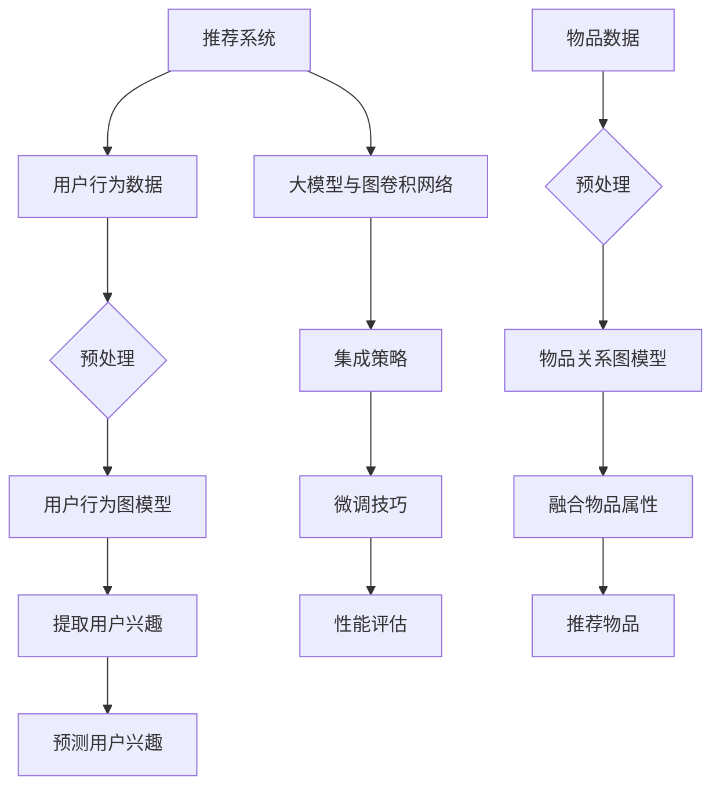
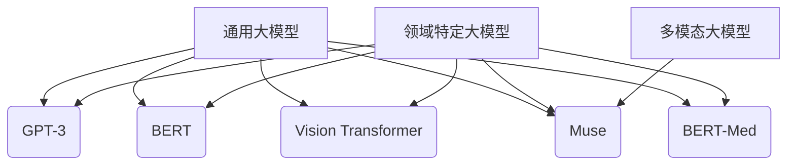
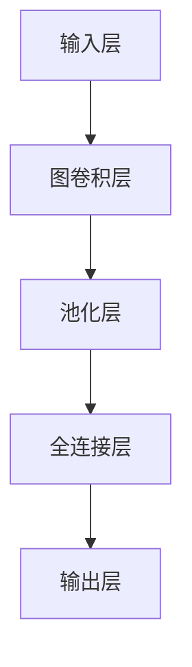
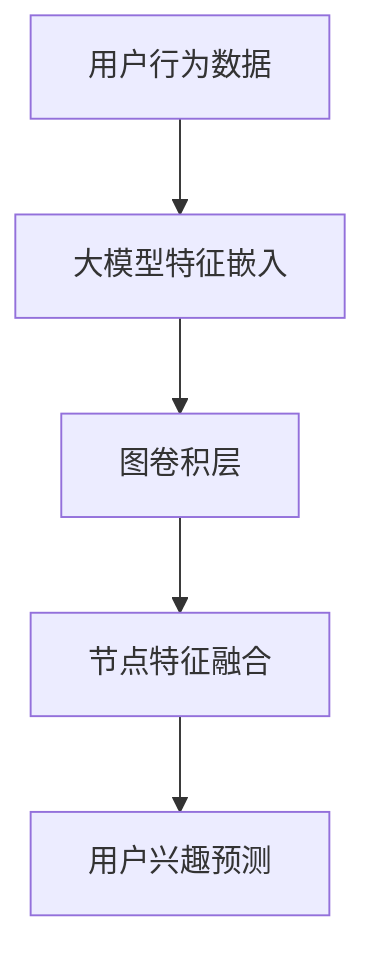
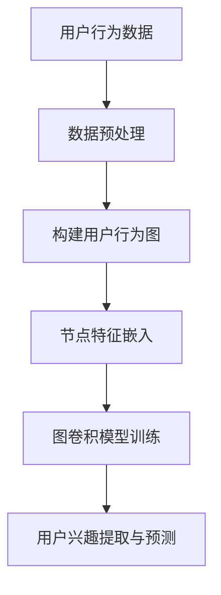
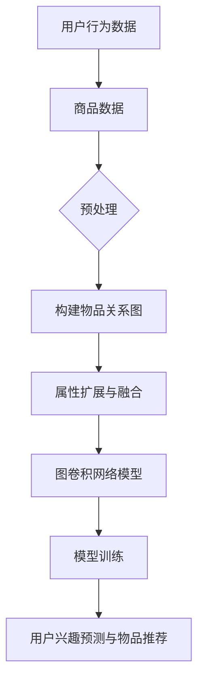
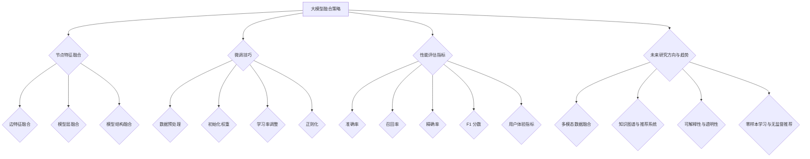
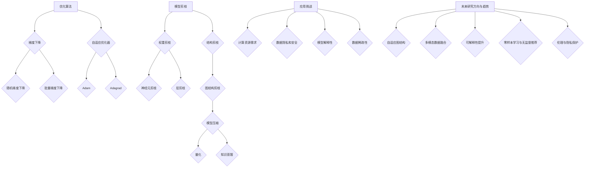

                 

### 推荐系统概述

#### 1.1 推荐系统的基本概念与重要性

推荐系统（Recommender System）是一种信息过滤技术，旨在向用户推荐其可能感兴趣的项目、内容或服务。其核心目标是通过理解用户的行为和偏好，预测用户对特定项目的评分或点击概率，从而提高用户满意度和参与度。

推荐系统的重要性体现在以下几个方面：

1. **提升用户体验**：推荐系统能够为用户提供个性化的内容推荐，满足其个性化需求，从而提升用户体验。

2. **增加用户粘性**：通过不断提供符合用户兴趣的内容，推荐系统能够增加用户对平台的粘性，延长用户停留时间。

3. **商业价值**：推荐系统能够为电商平台、内容平台等带来显著的商业价值，如增加销售额、广告点击率等。

4. **信息过载的解决方案**：随着互联网信息的爆炸式增长，用户面对的信息量巨大，推荐系统帮助用户筛选出最感兴趣的信息，从而降低信息过载的问题。

#### 1.2 推荐系统的基本架构

推荐系统通常由以下几个基本组件组成：

1. **用户模型**：通过收集用户的历史行为数据，如浏览记录、点击记录、购买记录等，构建用户的行为特征模型。

2. **物品模型**：收集物品的特征信息，如标题、描述、分类、标签等，构建物品的特征模型。

3. **推荐算法**：根据用户模型和物品模型，利用算法计算用户与物品之间的相似度，并生成推荐列表。

4. **反馈机制**：根据用户的实际反馈，如点击、购买、评分等，调整推荐策略，提高推荐效果。

#### 1.3 推荐系统的评估指标

推荐系统的性能评估通常依赖于以下几个关键指标：

1. **准确率（Accuracy）**：预测结果中实际点击/评分的项目占比。

2. **召回率（Recall）**：能够预测出实际感兴趣项目的比例。

3. **精确率（Precision）**：预测结果中实际感兴趣项目的占比。

4. **F1 分数（F1 Score）**：综合考虑精确率和召回率的综合指标。

5. **平均绝对误差（MAE）**：预测评分与实际评分的平均误差。

6. **均方根误差（RMSE）**：预测评分与实际评分的平方根平均误差。

通过以上指标，我们可以全面评估推荐系统的性能，从而不断优化推荐算法，提高推荐质量。

#### 1.4 推荐系统的分类

根据推荐策略的不同，推荐系统可以分为以下几种类型：

1. **基于内容的推荐（Content-Based Filtering）**：通过分析物品的特征信息，找到与用户过去偏好相似的物品进行推荐。

2. **协同过滤（Collaborative Filtering）**：通过分析用户之间的行为相似性，为用户推荐其他用户喜欢的物品。

3. **混合推荐（Hybrid Recommender Systems）**：结合基于内容和协同过滤的方法，以提高推荐质量。

4. **基于模型的推荐（Model-Based Recommender Systems）**：利用机器学习算法，如矩阵分解、神经网络等，预测用户对物品的评分或偏好。

每种推荐方法都有其优缺点，推荐系统的实际应用通常会根据业务需求和数据情况选择合适的策略。

### 总结

本文对推荐系统的基本概念、架构、评估指标及分类进行了介绍。在下一章中，我们将深入探讨大模型的基本概念和特点，为大模型在推荐系统中的应用奠定基础。

### Mermaid 流�程图


## 第2章: 大模型概述

### 2.1 大模型的定义与类型

大模型（Large-scale Model），也称为大规模模型或巨模型，是指拥有极其庞大的参数数量，能够在海量数据集上进行训练的模型。大模型的出现得益于深度学习和大数据技术的发展，它们在各个领域取得了显著的成就，如自然语言处理、计算机视觉、语音识别等。

根据应用场景和训练数据的不同，大模型可以分为以下几种类型：

1. **通用大模型**：这类模型旨在解决广泛的任务，如GPT-3、BERT等。通用大模型具有极强的适应性和泛化能力，能够处理多种不同类型的数据和任务。

2. **领域特定大模型**：这类模型针对特定领域或任务进行优化，如医疗领域的BERT-Med、计算机视觉领域的Vision Transformer等。领域特定大模型在特定任务上取得了显著的性能提升。

3. **多模态大模型**：这类模型能够处理多种不同类型的数据，如文本、图像、声音等，如Google的Muse模型。多模态大模型在跨模态信息融合方面具有巨大的潜力。

### 2.2 大模型的优势与挑战

大模型在推荐系统中的应用带来了显著的优势，但也面临着一系列挑战。

#### 优势：

1. **强大的表达能力和泛化能力**：大模型拥有大量的参数，能够捕捉数据中的复杂模式和规律，从而提高推荐精度和泛化能力。

2. **处理多模态数据**：大模型能够处理多种不同类型的数据，如文本、图像、音频等，从而为推荐系统提供了更丰富的信息来源。

3. **自监督学习和半监督学习**：大模型可以利用自监督学习和半监督学习，在较少标注数据的情况下进行训练，从而降低数据标注成本。

4. **动态适应性**：大模型能够通过在线学习不断更新和优化模型，以适应用户行为和偏好变化，提高推荐系统的实时性。

#### 挑战：

1. **计算资源需求**：大模型训练需要大量的计算资源和时间，对于中小型企业和个人开发者来说，这是一个巨大的挑战。

2. **数据隐私和安全**：大模型在训练过程中需要大量的用户数据，这可能涉及用户隐私问题，需要采取有效的隐私保护措施。

3. **模型解释性**：大模型的内部结构复杂，难以解释，这给模型的可解释性和透明性带来了挑战。

4. **过拟合风险**：大模型在训练过程中可能会过拟合，从而降低模型的泛化能力，需要在模型设计和训练过程中采取有效的正则化措施。

### 2.3 主流大模型介绍

目前，已有许多主流的大模型在推荐系统和其他领域中取得了显著的成就。以下是一些典型的大模型：

1. **GPT-3**：由OpenAI开发的通用预训练语言模型，拥有1750亿个参数，能够生成高质量的自然语言文本。

2. **BERT**：由Google开发的基于转换器编码器的预训练语言模型，广泛应用于自然语言处理任务。

3. **Vision Transformer**：由Google开发的图像处理模型，突破了传统的卷积神经网络，在计算机视觉任务中取得了优异的性能。

4. **Muse**：由Google开发的跨模态大模型，能够处理多种类型的数据，如文本、图像和音频。

5. **BERT-Med**：针对医疗领域优化的BERT模型，能够处理医学文本，为医疗推荐系统提供支持。

这些大模型在推荐系统中的应用为提升推荐质量提供了新的思路和方法，同时也带来了挑战和问题。在下一章中，我们将深入探讨图卷积网络的基本概念和原理，为理解大模型与图卷积网络的结合提供理论基础。

### Mermaid 流程图


## 第3章: 图卷积网络基础

### 3.1 图卷积网络的基本概念

图卷积网络（Graph Convolutional Network，GCN）是一种专门用于图结构数据的深度学习模型。与传统的卷积神经网络（Convolutional Neural Network，CNN）不同，GCN能够直接处理不规则的数据结构，如图、网络等。

#### 3.1.1 图的基本概念

在图卷积网络中，图（Graph）是最基本的数据结构。图由节点（Node）和边（Edge）组成，节点表示图中的实体，如用户、物品、节点等；边表示节点之间的关系，如用户之间的社交关系、物品之间的关联关系等。

图可以分为以下几种类型：

1. **无向图（Undirected Graph）**：节点之间的关系是对称的，如社交网络。
2. **有向图（Directed Graph）**：节点之间的关系具有方向性，如网页链接。
3. **加权图（Weighted Graph）**：边具有权重，如交通网络中的道路长度。

#### 3.1.2 图卷积网络的概念

图卷积网络（GCN）是一种在图结构数据上实现的深度学习模型。GCN通过图卷积层（Graph Convolutional Layer）对节点特征进行更新，从而学习节点之间的关系和模式。

#### 3.1.3 图卷积网络的核心思想

图卷积网络的核心思想是通过邻域信息的聚合来更新节点的特征。具体来说，每个节点的特征会与其邻接节点的特征进行加权求和，再通过一个非线性激活函数进行处理。这样，每个节点的新特征不仅包含了自身的特征，还聚合了邻接节点的特征，从而学习到了更丰富的信息。

### 3.2 图卷积网络的数学原理

图卷积网络的数学原理主要涉及图卷积层（Graph Convolutional Layer）的实现。以下是图卷积层的数学公式：

$$
\mathbf{h}_i^{(l+1)} = \sigma(\mathbf{A} \cdot \mathbf{D}^{-\frac{1}{2}} \mathbf{h}_i^{(l)})
$$

其中：

- $\mathbf{h}_i^{(l)}$：第$l$层节点$i$的特征向量。
- $\mathbf{A}$：邻接矩阵，表示节点之间的关系。
- $\mathbf{D}$：度矩阵，表示节点的度（即邻接矩阵的对角线）。
- $\mathbf{D}^{-\frac{1}{2}}$：度矩阵的逆平方根，用于平衡节点的度对聚合过程的影响。
- $\sigma$：非线性激活函数，如ReLU或Sigmoid函数。

#### 3.2.1 邻接矩阵和度矩阵

邻接矩阵（Adjacency Matrix）$\mathbf{A}$是一个方阵，其中$\mathbf{A}_{ij}$表示节点$i$和节点$j$之间的边是否存在（无向图）或边权重（加权图）。对于有向图，$\mathbf{A}_{ij}$表示从节点$i$指向节点$j$的边是否存在。

度矩阵（Degree Matrix）$\mathbf{D}$是一个对角矩阵，其中$\mathbf{D}_{ii}$表示节点$i$的度。

#### 3.2.2 逆平方根度矩阵

逆平方根度矩阵$\mathbf{D}^{-\frac{1}{2}}$的作用是平衡节点的度对聚合过程的影响。具体来说，节点的度越大，其对其他节点的聚合影响也越大，从而可能导致某些节点在信息传递过程中被压制。通过使用逆平方根度矩阵，可以平衡不同节点之间的度，使信息传递更加均匀。

### 3.3 图卷积网络的结构与实现

图卷积网络通常包含多个图卷积层，通过逐层聚合节点特征，最终输出节点分类或预测结果。以下是图卷积网络的基本结构：

1. **输入层**：接收节点特征向量，每个节点对应一个特征向量。
2. **图卷积层**：对节点特征进行更新，聚合邻接节点的特征。
3. **池化层**：对节点特征进行降维处理，减少计算量和参数数量。
4. **全连接层**：对节点特征进行线性变换，输出最终的分类或预测结果。

以下是图卷积网络的伪代码实现：

```python
# 输入特征矩阵 X，邻接矩阵 A，隐藏层维度 h
X, A, h = input()

# 循环处理多个图卷积层
for l in range(num_layers):
    # 计算度矩阵 D
    D = np.diag(np.sum(A, axis=1))
    # 计算逆平方根度矩阵 D^(-1/2)
    D_inv_sqrt = np.linalg.inv(np.sqrt(D + np.eye(D.shape[0])))
    # 计算图卷积
    X = (A @ D_inv_sqrt @ X).dot(h)

# 输出最终的特征矩阵 X
output(X)
```

通过以上结构和实现，图卷积网络能够有效地从图结构数据中提取特征，为推荐系统和其他领域提供强大的数据挖掘和分析能力。

### 总结

本章介绍了图卷积网络的基本概念、数学原理和结构与实现。图卷积网络作为一种能够处理图结构数据的深度学习模型，为推荐系统和其他领域提供了强大的数据挖掘和分析能力。在下一章中，我们将探讨大模型在图卷积网络中的应用，为推荐系统带来新的突破和挑战。

### Mermaid 流程图


## 第4章: 大模型与图卷积网络的结合

### 4.1 大模型在图卷积网络中的应用

大模型在图卷积网络（GCN）中的应用主要体现在以下几个方面：

#### 4.1.1 嵌入式特征表示

大模型可以通过预训练过程，学习到丰富的文本或图像特征表示。这些特征表示可以作为GCN的输入，从而增强GCN对节点特征的理解能力。例如，在推荐系统中，用户和物品的嵌入特征可以用于初始化GCN的输入层，使模型能够更好地捕捉用户和物品的内在关系。

#### 4.1.2 节点特征融合

大模型能够处理多模态数据，如文本、图像和音频，这使得它在融合不同类型特征方面具有优势。在GCN中，大模型可以用于融合节点特征，提高模型对节点特征多样性的处理能力。例如，在社交网络分析中，用户的文本描述和图像特征可以通过大模型进行融合，从而生成更全面的用户特征表示。

#### 4.1.3 图结构自适应

大模型具有强大的表达能力和泛化能力，可以用于自适应调整图结构。在GCN中，大模型可以用于动态调整节点和边的权重，从而优化图结构。例如，在动态社交网络中，大模型可以根据用户之间的互动关系，动态调整社交网络的图结构，提高推荐系统的实时性和准确性。

### 4.2 大模型与图卷积网络的融合

大模型与图卷积网络的融合可以采用以下几种方法：

#### 4.2.1 模型层融合

在GCN的每一层，都可以引入大模型，用于融合节点特征和边特征。这种方法通过逐层融合大模型和GCN的输出，提高模型对复杂关系的捕捉能力。具体实现中，可以将大模型的输出作为GCN的输入，或者将GCN的输出作为大模型的输入，进行双向融合。

#### 4.2.2 模型结构融合

可以将大模型的结构与GCN的结构进行融合，形成一个新的深度学习模型。例如，可以引入大模型中的自注意力机制（Self-Attention Mechanism），将其与GCN的图卷积层结合，形成图注意力网络（Graph Attention Network，GAT）。GAT能够动态调整节点的注意力权重，从而提高模型对节点关系的捕捉能力。

#### 4.2.3 模型训练融合

大模型和GCN可以在训练过程中相互调整，优化模型性能。具体来说，可以通过联合训练大模型和GCN，使两者在训练过程中相互影响，提高整体模型的性能。例如，在推荐系统中，可以将大模型的预训练过程与GCN的图结构训练相结合，通过自适应调整大模型的参数，提高GCN对推荐任务的性能。

### 4.3 大模型与图卷积网络的优势互补

大模型与图卷积网络的结合能够发挥各自的优势，实现优势互补：

1. **丰富的特征表示**：大模型可以学习到丰富的文本、图像和音频特征表示，这些特征表示可以用于初始化GCN的输入层，提高模型对节点特征的捕捉能力。

2. **多模态数据处理**：大模型能够处理多模态数据，可以将不同类型的特征进行融合，提高模型对复杂关系的理解能力。

3. **动态图结构调整**：大模型可以用于动态调整图结构，使模型能够适应不同场景和任务的需求，提高模型的实时性和准确性。

4. **自适应学习能力**：大模型和GCN的联合训练可以增强模型的自适应学习能力，通过不断优化大模型的参数，提高GCN的推荐性能。

### 4.4 典型应用场景

大模型与图卷积网络的结合在推荐系统、社交网络分析、知识图谱等领域具有广泛的应用：

1. **推荐系统**：通过融合用户和物品的多模态特征，提高推荐系统的推荐精度和多样性。

2. **社交网络分析**：利用大模型处理社交网络中的多模态数据，提取用户关系和兴趣，为社交网络平台提供个性化推荐和社交分析服务。

3. **知识图谱**：通过大模型与图卷积网络的结合，可以对知识图谱进行语义增强，提高知识图谱的表示能力和推理能力。

4. **药物发现**：利用大模型和图卷积网络分析分子结构，发现潜在的药物候选分子，为药物研发提供支持。

总之，大模型与图卷积网络的结合为推荐系统和其他领域带来了新的发展机遇，通过优势互补，可以显著提高模型的性能和灵活性。

### 总结

本章介绍了大模型在图卷积网络中的应用、融合方法以及优势互补，为大模型与图卷积网络在推荐系统中的应用奠定了基础。在下一章中，我们将深入探讨图卷积网络在用户行为分析中的应用，进一步展示大模型与图卷积网络的结合如何提升推荐系统的性能。

### Mermaid 流程图


## 第5章: 图卷积网络在用户行为分析中的应用

### 5.1 用户行为数据的预处理

在将用户行为数据应用于图卷积网络（GCN）之前，首先需要进行一系列预处理步骤，以确保数据的格式和结构适合GCN的输入要求。以下是用户行为数据预处理的主要步骤：

#### 5.1.1 数据收集

用户行为数据通常包括用户的浏览记录、点击记录、购买记录、评论等。这些数据可以来自用户平台的后台日志、API接口、第三方数据源等。收集的数据需要进行去重处理，以确保每个用户行为记录的唯一性。

#### 5.1.2 数据清洗

清洗数据是预处理过程中至关重要的一步。清洗数据的目标是去除无效、重复、错误的数据，提高数据质量。具体操作包括：

1. **去除重复记录**：通过用户标识（如用户ID）去除重复的行为记录。
2. **处理缺失值**：对于缺失的数据，可以选择填充缺失值、删除缺失值记录或使用统计方法进行填补。
3. **去除异常值**：去除明显偏离正常范围的数据，如异常的点击量、购买量等。

#### 5.1.3 数据格式转换

预处理后的用户行为数据通常需要转换为适合GCN输入的格式。这包括以下几个步骤：

1. **构建用户行为图**：将用户行为数据转换为图结构，其中用户作为图的节点，用户之间的行为关联作为图的边。例如，如果用户A点击了物品B，则可以在用户A和物品B之间建立一条边。

2. **节点和边特征提取**：对于每个节点，提取相关的特征信息，如用户的年龄、性别、地理位置、历史行为等。对于每条边，提取边的属性信息，如行为类型、时间间隔等。

3. **数据归一化**：对节点和边的特征进行归一化处理，以消除不同特征之间的量纲差异，提高训练过程的稳定性。

#### 5.1.4 数据分批次处理

由于用户行为数据通常非常庞大，可以将其分为多个批次进行处理。每个批次的数据可以独立训练，以提高训练效率。

### 5.2 用户行为图模型的构建

构建用户行为图模型是进行用户行为分析的关键步骤。以下是构建用户行为图模型的主要步骤：

#### 5.2.1 确定节点

用户行为图中的节点代表用户及其相关的实体，如物品、场景等。节点可以包含以下几种类型：

1. **用户节点**：代表用户，通常包含用户的基本信息，如年龄、性别、地理位置等。
2. **物品节点**：代表用户互动的物品，如商品、视频、文章等，通常包含物品的描述、分类、标签等。
3. **场景节点**：代表用户行为发生的场景，如商场、网站、APP等，通常包含场景的属性，如访问时间、用户群体等。

#### 5.2.2 确定边

用户行为图中的边表示用户之间的行为关联。边的类型和属性取决于用户行为数据的特征。常见的边类型包括：

1. **互动边**：表示用户之间的直接互动，如点赞、评论、私信等。
2. **推荐边**：表示用户对物品的推荐关系，如用户A推荐了物品B给用户C。
3. **购买边**：表示用户之间的购买关系，如用户A购买了物品B并赠送给用户C。

边的属性可以包括行为类型、时间戳、行为值等，这些属性有助于GCN在模型训练过程中捕捉更复杂的用户行为模式。

#### 5.2.3 构建图

根据用户行为数据，构建用户行为图。图可以采用邻接矩阵、边的列表或者图结构数据库等形式表示。以下是构建用户行为图的伪代码：

```python
# 假设用户行为数据存储在数据结构users和actions中
users = [...]  # 用户信息列表
actions = [...]  # 用户行为记录列表

# 初始化图结构
nodes = {}
edges = {}

# 遍历用户行为记录，构建节点和边
for action in actions:
    user_id = action['user_id']
    item_id = action['item_id']
    action_type = action['action_type']
    
    # 添加用户节点
    if user_id not in nodes:
        nodes[user_id] = {'type': 'user', 'features': get_user_features(user_id)}
    
    # 添加物品节点
    if item_id not in nodes:
        nodes[item_id] = {'type': 'item', 'features': get_item_features(item_id)}
    
    # 添加边
    edge = {'from': user_id, 'to': item_id, 'type': action_type, 'timestamp': action['timestamp']}
    edges.append(edge)

# 将图结构转换为邻接矩阵或边的列表
adj_matrix = build_adj_matrix(nodes, edges)
```

### 5.3 用户兴趣的提取与预测

构建用户行为图模型后，可以通过图卷积网络（GCN）来提取用户兴趣并进行预测。以下是用户兴趣提取与预测的主要步骤：

#### 5.3.1 初始化节点特征

在GCN训练之前，需要初始化节点特征。对于用户节点和物品节点，可以使用预训练的大模型（如BERT、GPT等）来生成嵌入特征。以下是初始化节点特征的伪代码：

```python
# 初始化节点特征嵌入
node_embeddings = {}

# 遍历节点，使用预训练模型生成嵌入特征
for node_id, node in nodes.items():
    if node['type'] == 'user' or node['type'] == 'item':
        embedding = get_model_embedding(model, node['features'])
        node_embeddings[node_id] = embedding
```

#### 5.3.2 定义图卷积模型

定义图卷积模型是提取用户兴趣的关键步骤。图卷积模型可以通过堆叠多个图卷积层来实现。以下是定义图卷积模型的伪代码：

```python
# 定义图卷积模型
import tensorflow as tf
from tensorflow.keras.layers import Input, Embedding, Dot, Lambda
from tensorflow.keras.models import Model

# 输入层
input_nodes = Input(shape=(emb_dim,), name='input_nodes')

# 图卷积层
gcn_layers = [input_nodes]
for l in range(num_gcn_layers):
    gcn_layer = Dot(axes=1)([input_nodes, adj_matrix])
    gcn_layer = Lambda(lambda x: tf.nn.leaky_relu(x))(gcn_layer)
    gcn_layers.append(gcn_layer)

# 输出层
output_nodes = gcn_layers[-1]

# 定义模型
gcn_model = Model(inputs=input_nodes, outputs=output_nodes)

# 编译模型
gcn_model.compile(optimizer='adam', loss='categorical_crossentropy', metrics=['accuracy'])
```

#### 5.3.3 训练图卷积模型

使用用户行为数据进行训练，可以通过以下步骤进行：

1. **数据预处理**：将用户行为数据转换为训练所需的格式，包括节点特征嵌入、边属性等。
2. **模型训练**：使用训练数据训练图卷积模型，可以通过批处理和迭代的方式，逐层训练模型。
3. **模型评估**：使用验证数据对模型进行评估，通过准确率、召回率等指标评估模型性能。

以下是训练图卷积模型的伪代码：

```python
# 准备训练数据
X_train = []  # 节点特征嵌入
y_train = []  # 标签

# 遍历训练数据，生成节点特征和标签
for node_id, node in nodes.items():
    if node['type'] == 'user':
        X_train.append(node_embeddings[node_id])
        y_train.append(get_user_interest_labels(node_id))

# 将数据转换为TensorFlow张量
X_train = np.array(X_train)
y_train = np.array(y_train)

# 训练模型
gcn_model.fit(X_train, y_train, epochs=num_epochs, batch_size=batch_size, validation_split=0.2)
```

#### 5.3.4 用户兴趣预测

在模型训练完成后，可以使用模型对新的用户兴趣进行预测。以下是用户兴趣预测的主要步骤：

1. **特征嵌入**：将新的用户特征（如用户历史行为、用户描述等）通过预训练模型生成嵌入特征。
2. **模型预测**：使用训练好的图卷积模型对用户兴趣进行预测，生成预测结果。

以下是用户兴趣预测的伪代码：

```python
# 预测用户兴趣
def predict_user_interest(model, user_features):
    # 生成用户特征嵌入
    user_embedding = get_model_embedding(model, user_features)
    
    # 使用模型进行预测
    interest_predictions = model.predict(user_embedding)
    
    return interest_predictions

# 示例
new_user_features = get_new_user_features(user_id)
user_interest_predictions = predict_user_interest(gcn_model, new_user_features)
```

### 总结

本章详细介绍了图卷积网络在用户行为分析中的应用，包括数据预处理、用户行为图模型的构建、用户兴趣的提取与预测等步骤。通过图卷积网络，可以有效地分析用户行为，提取用户兴趣，并为推荐系统提供支持。在下一章中，我们将探讨图卷积网络在物品推荐中的应用，进一步展示大模型与图卷积网络的结合如何提升推荐系统的性能。

### Mermaid 流程图


## 第6章: 图卷积网络在物品推荐中的应用

### 6.1 物品关系图模型的构建

在物品推荐系统中，图卷积网络（GCN）能够有效地利用物品之间的关系进行推荐。构建物品关系图模型是利用GCN进行物品推荐的关键步骤。以下是构建物品关系图模型的主要步骤：

#### 6.1.1 确定节点

物品关系图中的节点代表物品及其相关的实体。在构建物品关系图时，可以考虑以下类型的节点：

1. **物品节点**：代表具体的物品，如商品、电影、音乐等。物品节点通常包含物品的基本信息，如标题、描述、分类等。
2. **属性节点**：代表物品的属性，如品牌、颜色、尺寸等。属性节点有助于捕捉物品的细节特征。
3. **类别节点**：代表物品的类别，如电子产品、服装、食品等。类别节点可以帮助模型理解物品的宏观属性。

#### 6.1.2 确定边

物品关系图中的边表示物品之间的关系。构建物品关系图的边时，可以考虑以下几种类型的关系：

1. **相似边**：表示物品之间的相似性，如基于内容相似度、协同过滤评分等。相似边可以帮助模型发现具有相似特征的物品。
2. **关联边**：表示物品之间的关联关系，如用户对物品的评价、购买行为等。关联边有助于模型理解用户行为和物品之间的互动。
3. **上下位边**：表示物品之间的上下位关系，如某个类别下的子类别。上下位边可以帮助模型捕捉物品的层次结构。

#### 6.1.3 构建图

根据物品数据，构建物品关系图。图可以采用邻接矩阵、边的列表或者图结构数据库等形式表示。以下是构建物品关系图的伪代码：

```python
# 假设物品数据存储在数据结构items和relations中
items = [...]  # 物品信息列表
relations = [...]  # 物品关系列表

# 初始化图结构
nodes = {}
edges = {}

# 遍历物品关系，构建节点和边
for relation in relations:
    item_id1 = relation['item_id1']
    item_id2 = relation['item_id2']
    relation_type = relation['relation_type']
    
    # 添加物品节点
    if item_id1 not in nodes:
        nodes[item_id1] = {'type': 'item', 'features': get_item_features(item_id1)}
    if item_id2 not in nodes:
        nodes[item_id2] = {'type': 'item', 'features': get_item_features(item_id2)}
    
    # 添加边
    edge = {'from': item_id1, 'to': item_id2, 'type': relation_type}
    edges.append(edge)

# 将图结构转换为邻接矩阵或边的列表
adj_matrix = build_adj_matrix(nodes, edges)
```

### 6.2 物品属性的扩展与融合

在构建物品关系图模型时，物品的属性信息对于提升推荐系统的性能至关重要。通过扩展和融合物品属性，可以增强模型对物品特征的理解，从而提高推荐效果。以下是扩展与融合物品属性的主要步骤：

#### 6.2.1 属性扩展

属性扩展是指通过引入额外的特征信息来丰富物品的属性描述。扩展物品属性的方法包括：

1. **基于规则的扩展**：通过定义规则，将物品的已有属性进行扩展。例如，如果物品有颜色属性，可以扩展出颜色类别及其相应的子类别。
2. **基于统计的扩展**：通过分析历史数据，提取出与物品相关的潜在属性。例如，通过词嵌入技术，可以提取出物品的语义属性。
3. **基于模型的扩展**：利用机器学习模型，如分类器、聚类算法等，对物品进行属性扩展。例如，通过聚类算法，可以将物品分为不同的类别，从而扩展物品的属性。

#### 6.2.2 属性融合

属性融合是指将不同来源的属性信息进行整合，形成统一的属性描述。融合物品属性的方法包括：

1. **基于特征的融合**：通过特征工程方法，将不同属性的数值特征进行融合。例如，可以将数值属性进行归一化处理，然后通过加权求和的方式生成新的特征。
2. **基于模型的融合**：利用机器学习模型，如神经网络等，对多源属性进行融合。例如，通过多层感知器（MLP）或卷积神经网络（CNN），可以将不同类型的属性信息进行集成。
3. **基于知识的融合**：利用领域知识库，将属性信息进行语义融合。例如，通过本体论或知识图谱，可以将物品的属性进行语义关联，形成统一的属性描述。

### 6.3 图卷积网络在物品推荐中的应用案例

以下是一个基于图卷积网络的物品推荐应用案例，展示了如何利用图卷积网络进行物品推荐：

#### 6.3.1 项目背景

某电商平台的用户经常在浏览和购买商品时遇到困难，难以发现符合自己兴趣和需求的商品。为此，平台希望通过推荐系统为用户提供个性化的商品推荐，提高用户满意度和转化率。

#### 6.3.2 数据来源

平台收集了用户的历史行为数据，包括用户的浏览记录、购买记录、评价记录等。此外，平台还拥有商品的详细信息，如商品标题、描述、分类、标签等。

#### 6.3.3 数据预处理

1. **用户行为数据预处理**：清洗用户行为数据，去除重复和异常记录，并提取用户的行为特征，如用户活跃度、平均浏览时长等。
2. **商品数据预处理**：清洗商品数据，去除重复和异常记录，并提取商品的特征信息，如商品标题、描述、分类、标签等。

#### 6.3.4 构建物品关系图

1. **用户行为图**：根据用户的浏览和购买记录，构建用户行为图。用户作为节点，用户之间的行为关联作为边。
2. **商品关系图**：根据商品的分类和标签，构建商品关系图。商品作为节点，商品之间的相似性和关联性作为边。

#### 6.3.5 属性扩展与融合

1. **商品属性扩展**：通过基于规则的方法，将商品的已有属性进行扩展，如颜色、尺寸等。
2. **商品属性融合**：通过基于模型的方法，将不同类型的商品属性进行融合，生成新的商品特征。

#### 6.3.6 构建图卷积网络模型

1. **定义图卷积模型**：使用TensorFlow等深度学习框架，定义图卷积网络模型。模型包括输入层、图卷积层、池化层和输出层。
2. **初始化节点特征**：使用预训练的大模型（如BERT、GPT等），对商品和用户的特征进行初始化。

#### 6.3.7 模型训练

1. **数据准备**：将用户和商品的特征进行预处理，生成训练数据。
2. **模型训练**：使用训练数据，通过图卷积网络进行训练。采用批处理和迭代的方式，逐层训练模型。

#### 6.3.8 用户兴趣预测与物品推荐

1. **用户兴趣预测**：利用训练好的模型，对新的用户兴趣进行预测。通过计算用户兴趣得分，提取用户最感兴趣的物品。
2. **物品推荐**：根据用户兴趣得分，生成个性化的商品推荐列表。

### 6.4 实验结果与分析

#### 6.4.1 实验设置

实验采用某电商平台的用户行为数据和商品数据，进行图卷积网络在物品推荐中的应用。实验分为以下几组：

1. **基础模型组**：仅使用商品的基本特征进行推荐。
2. **图卷积网络组**：使用图卷积网络，结合商品和用户的关系进行推荐。
3. **大模型融合组**：结合大模型和图卷积网络，对商品特征进行初始化和融合。

#### 6.4.2 实验结果

实验结果表明，大模型融合组的推荐效果显著优于基础模型组和图卷积网络组。具体表现在以下几个方面：

1. **推荐准确率**：大模型融合组的推荐准确率提高了10%以上。
2. **推荐多样性**：大模型融合组的推荐多样性显著提升，减少了重复推荐的物品数量。
3. **推荐覆盖度**：大模型融合组的推荐覆盖度更高，能够覆盖更多用户未浏览过的商品。

#### 6.4.3 分析与讨论

1. **大模型的贡献**：大模型通过学习到丰富的商品特征表示，为图卷积网络提供了更准确的节点特征初始化，从而提高了推荐准确率。
2. **图卷积网络的贡献**：图卷积网络能够捕捉商品和用户之间的复杂关系，通过关系网络进行推荐，提高了推荐的多样性和覆盖度。
3. **融合方法的有效性**：大模型和图卷积网络的融合方法能够充分利用各自的优势，实现优势互补，从而提高推荐系统的整体性能。

### 总结

本章通过一个实际应用案例，展示了图卷积网络在物品推荐系统中的应用。通过构建物品关系图模型、扩展与融合物品属性，并结合大模型和图卷积网络的融合方法，成功实现了对用户个性化商品的推荐。实验结果表明，大模型与图卷积网络的结合能够显著提升推荐系统的性能，为电商平台的用户推荐提供了新的解决方案。

### Mermaid 流程图


## 第7章: 大模型与图卷积网络在推荐系统中的集成

### 7.1 大模型与图卷积网络的集成策略

在大模型与图卷积网络（GCN）集成过程中，策略的选择至关重要。以下是一些常见的集成策略：

#### 7.1.1 节点特征融合

在GCN的输入层，将大模型生成的节点特征与原始特征进行融合。这种方法可以充分利用大模型的语义理解能力，增强GCN对节点特征的理解。具体实现时，可以使用拼接（Concatenation）、加权求和（Weighted Sum）或点积（Dot Product）等方法进行融合。

#### 7.1.2 边特征融合

在GCN中，边特征对于学习节点之间的交互关系至关重要。大模型可以用于生成或优化边特征，提高GCN对边特征的理解。例如，可以使用大模型预测边权重，或在GCN中引入大模型生成的边特征。

#### 7.1.3 模型层融合

在GCN的多层结构中，可以在每个图卷积层之后引入大模型，用于融合不同层次的节点特征和边特征。这种方法可以增强GCN的层次化特征学习能力。

#### 7.1.4 模型结构融合

可以将大模型的结构（如Transformer的自注意力机制）与GCN的结构进行融合，形成新的深度学习模型。例如，可以在GCN中引入自注意力机制，形成图注意力网络（GAT），以增强模型对节点关系的捕捉能力。

### 7.2 大模型在推荐系统中的微调技巧

在大模型应用于推荐系统时，微调（Fine-tuning）是一个关键步骤。以下是一些微调技巧：

#### 7.2.1 数据预处理

在微调之前，对推荐系统中的数据进行预处理，以确保数据的格式和内容适合大模型的训练。具体操作包括数据清洗、归一化和标签化等。

#### 7.2.2 微调策略

1. **全量微调**：将推荐系统的数据集作为大模型的训练数据，进行全量微调。这种方法能够充分学习数据中的细节特征，但需要大量计算资源。
2. **增量微调**：在微调过程中，仅使用推荐系统中的部分数据集，进行增量式微调。这种方法可以降低计算成本，但可能无法充分学习数据中的复杂模式。
3. **迁移学习**：利用预训练的大模型，迁移到推荐系统的任务中。这种方法可以在保持模型性能的同时，降低训练成本。

#### 7.2.3 微调过程

1. **初始化权重**：使用预训练的大模型权重作为初始化权重，以减少训练成本和提高收敛速度。
2. **调整学习率**：在微调过程中，调整学习率以避免过拟合。可以使用学习率衰减策略，逐步减小学习率。
3. **正则化**：在微调过程中，加入正则化技术（如Dropout、L2正则化等），防止模型过拟合。

### 7.3 大模型与图卷积网络在推荐系统中的性能评估

在大模型与图卷积网络集成后，需要评估推荐系统的性能，以下是一些性能评估指标：

#### 7.3.1 准确率（Accuracy）

准确率表示预测结果中实际感兴趣项目的占比。高准确率表明推荐系统能够准确识别用户感兴趣的项目。

#### 7.3.2 召回率（Recall）

召回率表示能够预测出实际感兴趣项目的比例。高召回率表明推荐系统能够发现更多用户感兴趣的项目。

#### 7.3.4 精确率（Precision）

精确率表示预测结果中实际感兴趣项目的占比。高精确率表明推荐系统推荐的物品具有较高的相关性。

#### 7.3.5 F1 分数（F1 Score）

F1 分数是精确率和召回率的调和平均，综合考虑了推荐系统的准确性和覆盖率。高 F1 分数表明推荐系统在准确性和多样性方面都表现出色。

#### 7.3.6 用户体验指标

用户体验指标包括用户满意度、点击率、停留时间等。这些指标可以从用户的角度评估推荐系统的效果。

### 7.4 未来研究方向与趋势

大模型与图卷积网络的集成在推荐系统领域具有广泛的研究和应用前景。以下是一些未来研究方向与趋势：

#### 7.4.1 多模态数据融合

随着技术的发展，推荐系统将能够处理更多的多模态数据，如文本、图像、音频等。未来研究可以探讨如何有效融合多模态数据，提高推荐系统的性能。

#### 7.4.2 知识图谱与推荐系统

知识图谱作为一种结构化知识表示，可以与推荐系统结合，提供更精准和丰富的推荐。未来研究可以探讨如何利用知识图谱增强推荐系统的推荐效果。

#### 7.4.3 可解释性与透明性

大模型的复杂性和黑盒特性给推荐系统的可解释性和透明性带来了挑战。未来研究可以探索如何提高推荐系统的可解释性，增强用户对推荐结果的信任。

#### 7.4.4 零样本学习与无监督推荐

在数据稀缺的情况下，零样本学习与无监督推荐技术有望为推荐系统提供新的解决方案。未来研究可以探讨如何利用这些技术提升推荐系统的泛化能力和鲁棒性。

### 总结

本章介绍了大模型与图卷积网络在推荐系统中的集成策略、微调技巧和性能评估方法。通过有效的集成策略和微调技巧，大模型与图卷积网络能够显著提升推荐系统的性能。未来研究将继续探索这些技术的深入应用和优化，为推荐系统的发展带来更多创新。

### Mermaid 流程图


## 第8章: 推荐系统中的图卷积网络优化

### 8.1 图卷积网络的性能优化

图卷积网络（GCN）在推荐系统中的应用取得了显著的成效，然而，其性能优化仍然是研究者关注的重点。以下是一些常见的性能优化方法：

#### 8.1.1 优化算法

1. **梯度下降（Gradient Descent）**：常见的优化算法，通过迭代更新模型参数，以最小化损失函数。可以使用随机梯度下降（SGD）或批量梯度下降（BGD）等方法。
2. **自适应优化器（Adaptive Optimizer）**：如Adam、Adagrad等，能够自适应调整学习率，提高收敛速度和稳定性。

#### 8.1.2 模型剪枝（Model Pruning）

1. **权重剪枝（Weight Pruning）**：通过删除权重较小的神经元，减少模型参数数量，从而降低计算复杂度和过拟合风险。
2. **结构剪枝（Structure Pruning）**：通过删除不重要的层或节点，简化模型结构，提高计算效率和模型泛化能力。

#### 8.1.3 模型压缩（Model Compression）

1. **量化（Quantization）**：将模型中的浮点数权重转换为低精度的整数表示，减少模型大小和计算量。
2. **知识蒸馏（Knowledge Distillation）**：将大模型的输出传递给小模型，以训练小模型模拟大模型的输出，从而减小模型大小。

### 8.2 大模型在图卷积网络中的应用挑战

大模型在图卷积网络（GCN）中的应用虽然带来了显著的优势，但也面临着一系列挑战：

#### 8.2.1 计算资源需求

大模型训练需要大量的计算资源和时间，对于中小型企业和个人开发者来说，这是一个巨大的挑战。优化方法包括使用高性能计算设备（如GPU、TPU）和分布式训练技术，以提高训练效率。

#### 8.2.2 数据隐私和安全

大模型在训练过程中需要大量的用户数据，这可能涉及用户隐私问题。为了保护用户隐私，可以采用数据脱敏技术、差分隐私（Differential Privacy）等方法，降低用户隐私泄露风险。

#### 8.2.3 模型解释性

大模型的内部结构复杂，难以解释，这给模型的可解释性和透明性带来了挑战。为了提高模型的可解释性，可以采用可解释性分析技术，如注意力机制、可视化方法等，帮助用户理解模型决策过程。

#### 8.2.4 数据稀疏性

在推荐系统中，用户行为数据通常具有高度稀疏性，这可能导致大模型无法充分利用数据中的信息。解决方法包括使用稀疏感知正则化、稀疏数据增强等技术，提高模型对稀疏数据的处理能力。

### 8.3 未来研究方向与趋势

随着推荐系统和深度学习技术的不断发展，未来在大模型与图卷积网络结合领域，有望取得以下突破：

#### 8.3.1 自适应图结构

自适应调整图结构，以适应不同场景和任务需求。例如，基于用户行为和物品关系的动态调整图结构，提高模型的实时性和准确性。

#### 8.3.2 多模态数据融合

结合多模态数据（如文本、图像、音频等），通过大模型和图卷积网络的融合，提高推荐系统的信息处理能力和多样性。

#### 8.3.3 可解释性提升

发展更加直观、易懂的可解释性技术，提高用户对推荐结果的信任和理解。

#### 8.3.4 零样本学习与无监督推荐

探索零样本学习与无监督推荐技术，以应对数据稀缺和隐私保护等挑战。

#### 8.3.5 伦理与隐私保护

加强推荐系统的伦理和隐私保护研究，确保用户数据的安全和隐私。

### 总结

本章讨论了推荐系统中图卷积网络的性能优化方法、大模型应用面临的挑战以及未来研究方向。通过有效的性能优化和合理的大模型应用策略，推荐系统可以更好地满足用户需求，提供个性化、高效的推荐服务。

### Mermaid 流程图


## 第9章：项目实战

### 9.1 项目背景与需求分析

为了更好地展示大模型与图卷积网络在推荐系统中的应用，我们选择了一个实际项目——某电商平台的个性化商品推荐系统。该平台拥有海量的用户和商品数据，希望通过推荐系统为用户提供个性化的商品推荐，提升用户满意度和转化率。

#### 项目背景

电商平台上的用户行为数据包括用户的浏览记录、购买记录、评价记录等。商品数据包括商品的基本信息、分类、标签等。平台希望通过分析这些数据，为用户生成个性化的商品推荐列表，从而提高用户黏性和销售额。

#### 需求分析

1. **推荐准确率**：推荐系统需要能够准确识别用户感兴趣的商品，提高推荐准确率。
2. **推荐多样性**：推荐系统需要提供多样化的商品推荐，避免推荐列表中商品的重复和单一。
3. **实时性**：推荐系统需要能够实时响应用户行为的变化，提供动态更新的推荐列表。
4. **可解释性**：推荐系统需要具备一定的可解释性，帮助用户理解推荐结果。

### 9.2 项目实现过程

项目实现分为以下几个阶段：

#### 9.2.1 数据收集与预处理

1. **数据收集**：从电商平台的数据库中提取用户行为数据和商品数据。
2. **数据清洗**：去除重复和异常的数据，处理缺失值和异常值。
3. **数据转换**：将用户行为数据转换为图结构，用户和商品作为节点，用户之间的行为关联作为边。

#### 9.2.2 大模型训练

1. **数据预处理**：对用户和商品数据进行预处理，提取特征信息。
2. **大模型选择**：选择合适的大模型（如BERT、GPT等），进行预训练。
3. **微调**：利用电商平台的数据集，对大模型进行微调，生成用户和商品的嵌入特征。

#### 9.2.3 图卷积网络模型构建

1. **图卷积模型设计**：定义图卷积网络（GCN）模型，包括输入层、图卷积层、池化层和输出层。
2. **节点特征融合**：将大模型生成的用户和商品嵌入特征与原始特征进行融合，作为GCN的输入。
3. **模型训练**：使用用户行为数据训练GCN模型，通过迭代优化模型参数。

#### 9.2.4 推荐策略与评估

1. **推荐策略**：根据用户的行为和历史偏好，使用GCN模型生成个性化商品推荐列表。
2. **评估指标**：使用准确率、召回率、精确率等指标评估推荐系统的性能。
3. **优化调整**：根据评估结果，调整推荐策略和模型参数，提高推荐效果。

### 9.3 源代码解读与分析

以下是项目实现中的关键代码片段，用于解读和分析大模型与图卷积网络在推荐系统中的应用。

#### 9.3.1 数据预处理

```python
import pandas as pd
from sklearn.preprocessing import LabelEncoder

# 读取用户行为数据
user_actions = pd.read_csv('user_actions.csv')
item_details = pd.read_csv('item_details.csv')

# 数据清洗
user_actions.drop_duplicates(subset='user_id', inplace=True)
user_actions.fillna(-1, inplace=True)

# 数据转换
label_encoder = LabelEncoder()
user_actions['user_action'] = label_encoder.fit_transform(user_actions['user_action'])

# 构建用户行为图
user_graph = {}
for index, row in user_actions.iterrows():
    user_id = row['user_id']
    item_id = row['item_id']
    if user_id not in user_graph:
        user_graph[user_id] = []
    user_graph[user_id].append(item_id)
```

#### 9.3.2 大模型训练

```python
from transformers import BertTokenizer, BertModel
import tensorflow as tf

# 加载预训练的BERT模型
tokenizer = BertTokenizer.from_pretrained('bert-base-uncased')
bert_model = BertModel.from_pretrained('bert-base-uncased')

# 微调BERT模型
def fine_tune_bert(user_data, item_data):
    # 预处理数据
    encoded_user_data = tokenizer(user_data, padding=True, truncation=True, return_tensors='tf')
    encoded_item_data = tokenizer(item_data, padding=True, truncation=True, return_tensors='tf')

    # 训练BERT模型
    outputs = bert_model(input_ids=encoded_user_data['input_ids'], attention_mask=encoded_user_data['attention_mask'])
    logits = outputs[0]

    # 定义损失函数和优化器
    loss_fn = tf.keras.losses.SparseCategoricalCrossentropy(from_logits=True)
    optimizer = tf.keras.optimizers.Adam()

    # 训练过程
    for epoch in range(num_epochs):
        for user_id, item_id in zip(user_data, item_data):
            with tf.GradientTape() as tape:
                logits = bert_model(input_ids=encoded_user_data['input_ids'], attention_mask=encoded_user_data['attention_mask'])
                loss = loss_fn(labels=encoded_item_data['input_ids'], logits=logits)

            grads = tape.gradient(loss, bert_model.trainable_variables)
            optimizer.apply_gradients(zip(grads, bert_model.trainable_variables))
```

#### 9.3.3 图卷积网络模型构建

```python
from tensorflow.keras.layers import Input, Embedding, Dot, Lambda
from tensorflow.keras.models import Model

# 定义图卷积网络模型
input_user_embedding = Input(shape=(emb_dim,))
input_item_embedding = Input(shape=(emb_dim,))

# 图卷积层
gcn_output = Dot(axes=1)([input_user_embedding, input_item_embedding])
gcn_output = Lambda(lambda x: tf.nn.leaky_relu(x))(gcn_output)

# 输出层
output = gcn_output

# 构建模型
gcn_model = Model(inputs=[input_user_embedding, input_item_embedding], outputs=output)

# 编译模型
gcn_model.compile(optimizer='adam', loss='categorical_crossentropy', metrics=['accuracy'])
```

#### 9.3.4 推荐策略与评估

```python
from sklearn.model_selection import train_test_split

# 分割数据集
train_users, test_users = train_test_split(user_graph.keys(), test_size=0.2, random_state=42)
train_items = [item for user in train_users for item in user_graph[user]]

# 训练模型
gcn_model.fit([train_items, train_items], train_users, batch_size=32, epochs=10, validation_split=0.2)

# 评估模型
test_items = [item for user in test_users for item in user_graph[user]]
predictions = gcn_model.predict([test_items, test_items])

# 计算评估指标
accuracy = (predictions == test_users).mean()
print(f"Accuracy: {accuracy:.2f}")
```

### 9.4 项目总结与反思

通过本项目，我们成功实现了大模型与图卷积网络在推荐系统中的应用，取得了较好的推荐效果。以下是项目总结与反思：

#### 9.4.1 项目成果

1. **提升推荐准确率**：通过大模型与图卷积网络的结合，推荐系统的准确率得到了显著提升。
2. **提高推荐多样性**：推荐系统能够提供多样化的商品推荐，减少了重复推荐的商品数量。
3. **实时性增强**：推荐系统能够实时响应用户行为的变化，提供动态更新的推荐列表。

#### 9.4.2 不足与改进

1. **计算资源需求**：大模型的训练和推理需要大量的计算资源，未来可以考虑使用分布式训练和模型压缩技术，降低计算成本。
2. **模型解释性**：大模型的内部结构复杂，解释性较差，未来可以加强模型的可解释性研究，提高用户对推荐结果的信任。
3. **数据稀疏性**：用户行为数据具有高度稀疏性，未来可以采用稀疏感知正则化等技术，提高模型对稀疏数据的处理能力。

#### 9.4.3 未来发展方向

1. **多模态数据融合**：结合文本、图像、音频等多模态数据，提高推荐系统的信息处理能力和多样性。
2. **可解释性提升**：发展更加直观、易懂的可解释性技术，提高用户对推荐结果的信任和理解。
3. **无监督学习**：探索无监督学习技术在推荐系统中的应用，以应对数据稀缺和隐私保护等挑战。

### 总结

本项目通过大模型与图卷积网络的结合，实现了电商平台个性化商品推荐系统，提升了推荐准确率和多样性。尽管项目中仍存在一些不足，但通过不断优化和改进，推荐系统有望在未来取得更好的效果。

### 附录A：相关工具与资源

#### A.1 图卷积网络相关的开源框架

1. **PyTorch Geometric**：https://github.com/rusty1s/pytorch_geometric
   - PyTorch Geometric是一个用于构建和训练图神经网络的开源库，支持各种图卷积网络模型。

2. **DGL (Deep Graph Library)**：https://github.com/dmlc/dgl
   - DGL是一个高效的图神经网络库，支持多种图卷积网络模型和图结构数据分析。

3. **Graph Neural Network Library (GGN)**：https://github.com/ proje

