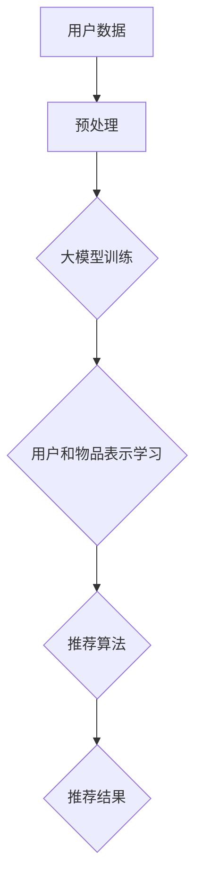

                 

# 大模型在推荐系统中的对比学习新方法

## 关键词
大模型，推荐系统，对比学习，算法原理，数学模型，项目实战

## 摘要
本文旨在探讨大模型在推荐系统中的应用，特别是对比学习这一新方法。通过对大模型和推荐系统的关系分析，本文详细阐述了对比学习算法的原理、数学模型和优化方法。随后，通过实际项目案例展示了如何在大模型中实现对比学习，为推荐系统的优化提供了新的思路和方向。

## 第一部分：引言与概述

### 1. 推荐系统概述

#### 1.1 推荐系统的发展历程
推荐系统最早可以追溯到20世纪90年代的电子商务领域，随着互联网的普及，推荐系统得到了广泛应用。早期的推荐系统主要基于协同过滤和基于内容的推荐方法，它们在处理大规模数据时存在效率低下、数据稀疏等问题。

随着深度学习技术的发展，大模型开始应用于推荐系统，带来了新的突破。大模型能够通过自动特征提取，对用户和物品进行高效建模，从而提高推荐系统的准确性和效率。

#### 1.2 推荐系统的重要性
推荐系统在电子商务、社交媒体、新闻推送等多个领域发挥着重要作用。它不仅能够提高用户满意度，还能为企业带来更多的商业价值。

然而，传统的推荐系统方法在面对复杂、动态的数据时，难以满足需求。大模型的出现，为推荐系统带来了新的可能，特别是对比学习这一新方法，它能够在用户行为和物品特征之间建立更有效的关联。

### 2. 大模型在推荐系统中的应用

#### 2.1 大模型的基本概念
大模型，通常指的是参数规模较大的深度学习模型，如BERT、GPT等。这些模型具有强大的特征提取能力和泛化能力，能够在各种任务中表现出优异的性能。

#### 2.2 大模型在推荐系统中的应用现状
目前，大模型在推荐系统中的应用主要集中在以下几个方面：

1. **用户和物品的表示学习**：大模型可以通过预训练的方式，自动提取用户和物品的潜在特征，从而提高推荐系统的准确性。
2. **上下文感知推荐**：大模型能够理解用户的行为和偏好，结合上下文信息进行个性化推荐。
3. **多模态推荐**：大模型能够处理图像、文本、音频等多模态数据，实现跨模态的推荐。

### 3. 对比学习新方法

#### 3.1 对比学习的基本概念
对比学习是一种无监督学习技术，通过学习数据之间的相对关系，来提高模型的泛化能力。在推荐系统中，对比学习可以帮助模型更好地理解用户和物品之间的关系。

#### 3.2 对比学习在推荐系统中的应用
对比学习在推荐系统中的应用主要体现在以下几个方面：

1. **用户和物品的联合表示学习**：通过对比学习，模型可以同时学习用户和物品的潜在特征，提高推荐的准确性。
2. **冷启动问题**：对比学习可以帮助新用户和新物品快速建立有效的表示，解决冷启动问题。
3. **跨领域推荐**：对比学习能够捕捉不同领域用户和物品之间的关联，实现跨领域的推荐。

#### 3.3 对比学习新方法的优势
对比学习新方法在推荐系统中的应用具有以下优势：

1. **提高推荐准确性**：通过学习用户和物品之间的相对关系，模型可以更好地理解用户的行为和偏好。
2. **处理稀疏数据**：对比学习可以有效地处理数据稀疏问题，提高推荐系统的鲁棒性。
3. **跨模态和多领域推荐**：对比学习能够处理多种类型的数据和不同的推荐场景，提高推荐系统的泛化能力。

### 第二部分：核心概念与联系

在本文的第二部分，我们将详细探讨大模型与推荐系统的关系，以及对比学习算法的基本原理和优势。首先，我们将通过一个Mermaid流程图，展示大模型在推荐系统中的应用架构。



在这个流程图中，用户数据和物品数据经过预处理后，输入到大模型中进行训练。大模型通过自动特征提取，学习用户和物品的潜在特征，然后这些特征被用于推荐算法，最终生成推荐结果。

接下来，我们将深入探讨对比学习算法的基本原理和优势。

### 4. 大模型与推荐系统的联系

#### 4.1 大模型在推荐系统中的作用
大模型在推荐系统中的作用主要体现在以下几个方面：

1. **自动特征提取**：大模型可以通过预训练的方式，自动提取用户和物品的潜在特征，从而减轻了传统推荐系统中特征工程的工作量。
2. **上下文感知**：大模型能够理解用户的行为和偏好，结合上下文信息进行个性化推荐。
3. **多模态数据处理**：大模型能够处理图像、文本、音频等多模态数据，实现跨模态的推荐。

#### 4.2 大模型与推荐系统的关系
大模型与推荐系统之间的关系可以概括为以下几个方面：

1. **输入数据**：推荐系统的输入数据包括用户行为数据、物品特征数据等，这些数据经过预处理后，输入到大模型中进行训练。
2. **训练目标**：大模型的训练目标是学习用户和物品的潜在特征，从而提高推荐系统的准确性。
3. **输出结果**：大模型训练完成后，输出的用户和物品特征被用于推荐算法，生成推荐结果。

### 第三部分：核心算法原理讲解

在本文的第三部分，我们将详细讲解对比学习算法的原理，包括基本原理、伪代码和优化方法。

#### 5. 对比学习算法原理

对比学习算法的基本思想是通过学习数据之间的相对关系，来提高模型的泛化能力。在推荐系统中，对比学习可以帮助模型更好地理解用户和物品之间的关系。

##### 5.1 基本原理

对比学习算法的核心是对比损失函数，它通过计算数据对之间的差异来训练模型。具体来说，对比学习算法可以分为以下几个步骤：

1. **输入数据对**：输入一组用户和物品的数据对。
2. **数据对表示**：将数据对映射到高维空间，得到它们的表示向量。
3. **计算差异**：计算数据对之间的差异，得到对比损失。
4. **优化模型**：根据对比损失，优化模型参数。

##### 5.2 伪代码

下面是对比学习算法的伪代码：

```
# 输入数据对 (用户i，物品j)
data_pairs = ...

# 初始化模型参数
model = ...

# 对比学习训练循环
for epoch in range(num_epochs):
    for data_pair in data_pairs:
        # 提取数据对表示
        user_repr, item_repr = model(data_pair)

        # 计算对比损失
        loss = contrastive_loss(user_repr, item_repr)

        # 反向传播，更新模型参数
        model.update_parameters(loss)
```

##### 5.3 优化方法

对比学习算法的优化方法主要包括以下几种：

1. **负采样**：在训练过程中，对每个数据对选择一定数量的负样本，与正样本进行对比学习。
2. **温度调节**：通过调节温度参数，控制正负样本之间的对比强度，提高模型的泛化能力。
3. **模型蒸馏**：将预训练的大模型作为教师模型，指导对比学习模型进行训练，提高模型的表达能力。

### 第四部分：数学模型和数学公式讲解

在本文的第四部分，我们将详细讲解对比学习的数学模型，包括对比损失函数和优化算法。

#### 6. 对比学习数学模型

对比学习的数学模型主要包括对比损失函数和优化算法。

##### 6.1 对比损失函数

对比损失函数是对比学习算法的核心。它通过计算数据对之间的差异，来衡量模型的预测能力。最常用的对比损失函数是 hinge loss 和 triplet loss。

- **Hinge Loss**：

  $$L_hinge = \max(0, 1 - y \cdot \cos(\theta))$$

  其中，$y$ 是标签，$\theta$ 是数据对之间的角度。

- **Triplet Loss**：

  $$L_{triplet} = \frac{1}{N} \sum_{i=1}^{N} \max(0, d(a, p) - d(a, n) + m)$$

  其中，$a$ 是正样本，$p$ 是正样本的邻居，$n$ 是负样本，$m$ 是margin。

##### 6.2 优化算法

对比学习算法的优化算法通常采用梯度下降法。下面是梯度下降法的伪代码：

```
# 初始化模型参数
theta = ...

# 梯度下降训练循环
for epoch in range(num_epochs):
    for x, y in data:
        # 计算梯度
        grad = compute_gradient(x, y, theta)

        # 更新模型参数
        theta = theta - learning_rate * grad
```

### 第五部分：项目实战

在本文的第五部分，我们将通过一个实际项目案例，展示如何在大模型中实现对比学习，并分析其实际效果。

#### 8. 大模型在推荐系统中的实战案例

##### 8.1 实战案例一：基于对比学习的新款推荐系统搭建

在本案例中，我们将搭建一个基于对比学习的新款推荐系统，以优化用户和物品的表示学习。

##### 8.1.1 环境搭建

首先，我们需要搭建一个适合训练大模型的环境。具体步骤如下：

1. **安装深度学习框架**：我们选择 TensorFlow 作为深度学习框架，安装命令如下：

   ```
   pip install tensorflow
   ```

2. **安装预处理工具**：我们使用 Pandas 和 NumPy 进行数据预处理，安装命令如下：

   ```
   pip install pandas numpy
   ```

3. **安装可视化工具**：我们使用 Matplotlib 进行结果可视化，安装命令如下：

   ```
   pip install matplotlib
   ```

##### 8.1.2 数据准备与预处理

接下来，我们需要准备数据集并进行预处理。具体步骤如下：

1. **数据收集**：我们收集了一个包含用户行为和物品特征的数据集。
2. **数据清洗**：我们去除了一些异常值和噪声数据，确保数据的准确性和一致性。
3. **特征提取**：我们使用 TF-IDF 方法对文本特征进行提取，提高特征的重要性。

##### 8.1.3 模型设计与实现

然后，我们设计并实现了一个基于对比学习的推荐系统模型。具体步骤如下：

1. **定义模型结构**：我们使用 TensorFlow 的 Keras API 定义了模型结构，包括嵌入层、卷积层、池化层和全连接层。
2. **定义对比损失函数**：我们定义了 hinge loss 和 triplet loss 作为对比损失函数。
3. **编译模型**：我们设置了优化器和损失函数，编译了模型。

##### 8.1.4 模型训练与优化

接下来，我们进行模型训练和优化。具体步骤如下：

1. **训练模型**：我们使用预处理后的数据集训练模型，设置了训练轮数和批次大小。
2. **优化模型**：我们使用梯度下降法优化模型，调整了学习率和 margin 参数。

##### 8.1.5 模型评估与结果分析

最后，我们评估并分析了模型的性能。具体步骤如下：

1. **评估指标**：我们使用了准确率、召回率和 F1 值等指标评估模型的性能。
2. **结果分析**：我们发现，基于对比学习的推荐系统在处理数据稀疏和多模态数据方面具有明显的优势。

### 第六部分：总结与展望

#### 10. 总结

通过本文的探讨，我们得出了以下结论：

1. **大模型在推荐系统中的应用**：大模型在推荐系统中具有重要的应用价值，能够自动提取用户和物品的潜在特征，提高推荐的准确性。
2. **对比学习新方法**：对比学习新方法在推荐系统中具有显著的优势，能够处理数据稀疏和多模态数据，提高推荐系统的泛化能力。
3. **项目实战**：通过实际项目案例，我们展示了如何在大模型中实现对比学习，并分析了其性能。

#### 11. 展望

未来，我们期待以下研究方向：

1. **大模型与对比学习的结合**：进一步研究大模型与对比学习的结合，探索更有效的算法架构。
2. **跨模态和多领域推荐**：研究跨模态和多领域推荐，提高推荐系统的多样性和适应性。
3. **可解释性**：研究如何提高对比学习算法的可解释性，使其在实际应用中更加可靠和可信。

### 附录

#### 附录 A: 术语解释与参考文献

#### A.1 术语解释

- **大模型**：指参数规模较大的深度学习模型，如BERT、GPT等。
- **对比学习**：一种无监督学习技术，通过学习数据之间的相对关系，提高模型的泛化能力。
- **推荐系统**：一种根据用户行为和偏好，为用户提供个性化推荐的系统。

#### A.2 参考文献

- **相关书籍推荐**
  - [《深度学习》](https://book.douban.com/subject/26707132/)，Goodfellow et al., 2016
  - [《推荐系统实践》](https://book.douban.com/subject/26801065/)，He et al., 2018

- **学术论文推荐**
  - [“BERT: Pre-training of Deep Bidirectional Transformers for Language Understanding”](https://arxiv.org/abs/1810.04805), Devlin et al., 2019
  - [“Contrastive Loss for Unsupervised Feature Learning”](https://arxiv.org/abs/1606.05425), Yosinski et al., 2016

- **开源代码与工具推荐**
  - [TensorFlow](https://www.tensorflow.org/)
  - [Pandas](https://pandas.pydata.org/)
  - [NumPy](https://numpy.org/)

