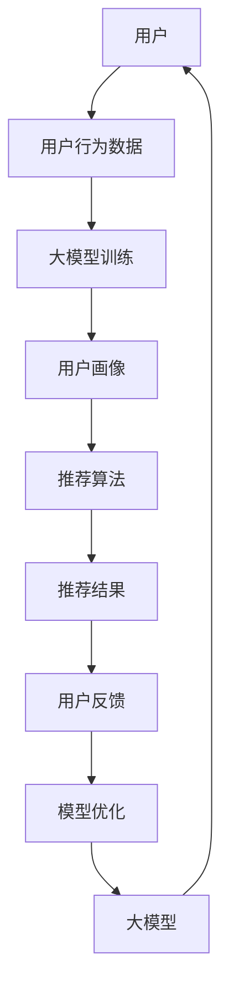

                 

# 大模型在推荐系统冷启动迁移学习中的应用

## 关键词：
- 大模型
- 推荐系统
- 冷启动
- 迁移学习
- 深度学习
- 自然语言处理

## 摘要：
本文探讨了大模型在推荐系统冷启动和迁移学习中的应用。首先，我们介绍了大模型和推荐系统的基本概念及其相互关系。接着，我们分析了大模型在提升推荐系统性能、解决冷启动问题以及实现迁移学习方面的作用。通过具体案例，我们展示了大模型在不同领域的应用效果。此外，我们还讨论了大模型在推荐系统中的性能优化和安全挑战。最后，我们对大模型在推荐系统中的未来发展趋势进行了展望。

## 目录大纲

### 第一部分：大模型与推荐系统概述

#### 第1章：大模型在推荐系统中的应用背景
- 1.1 大模型的概念及其重要性
- 1.2 推荐系统的发展历程与挑战
- 1.3 大模型在推荐系统中的潜在价值
- 1.4 冷启动与迁移学习
- 1.4.1 冷启动的概念
- 1.4.2 迁移学习的基本原理
- 1.4.3 冷启动与迁移学习的联系
- 1.4.4 冷启动与迁移学习在推荐系统中的应用

### 第二部分：大模型技术基础

#### 第2章：大模型核心技术解析
- 2.1 深度学习与神经网络基础
- 2.2 自然语言处理技术
- 2.3 大规模预训练模型

### 第三部分：大模型在推荐系统中的应用

#### 第3章：大模型在推荐系统中的应用案例分析
- 3.1 大模型在推荐系统中的实际应用
- 3.2 大模型在冷启动中的应用
- 3.3 大模型在迁移学习中的应用

### 第四部分：大模型在推荐系统中的优化

#### 第4章：大模型在推荐系统中的性能优化
- 4.1 推荐系统的评价指标
- 4.2 大模型性能优化方法
- 4.3 实时推荐系统的优化

### 第五部分：大模型在推荐系统中的安全挑战与应对

#### 第5章：大模型在推荐系统中的安全挑战与应对
- 5.1 大模型在推荐系统中的安全问题
- 5.2 安全挑战与应对策略
- 5.3 大模型在推荐系统中的伦理问题

### 第六部分：大模型在推荐系统中的未来发展趋势

#### 第6章：大模型在推荐系统中的未来发展趋势
- 6.1 大模型在推荐系统中的应用前景
- 6.2 未来趋势与挑战
- 6.3 大模型在推荐系统中的未来发展方向

### 第七部分：总结与展望

#### 第7章：总结与展望
- 7.1 大模型在推荐系统中的应用总结
- 7.2 未来研究方向与挑战
- 7.3 总结与展望

## 附录

### 附录A：相关资源与工具
- 7.1 资源链接
- 7.2 工具与框架

### 图1-1 大模型在推荐系统中的应用框架图

graph TB
A[大模型] --> B[推荐系统]
A --> C[用户行为分析]
A --> D[内容理解与生成]
B --> E[协同过滤]
B --> F[基于内容的推荐]
B --> G[用户画像与标签]
C --> H[行为数据收集与分析]
D --> I[文本挖掘与生成]
E --> J[评分预测]
F --> K[内容相似度计算]
G --> L[用户兴趣与需求分析]
H --> M[实时反馈机制]
I --> N[内容个性化推荐]
J --> O[推荐列表生成与排序]
K --> P[推荐结果评价与反馈]
L --> Q[用户画像更新与优化]
M --> R[用户行为预测与推荐调整]
N --> S[内容理解与优化]
O --> T[推荐结果展示与交互]
P --> U[推荐效果评估与改进]
Q --> V[用户画像构建与维护]
R --> W[推荐策略调整与优化]
S --> X[内容推荐效果优化]
T --> Y[用户交互体验与满意度]
U --> Z[推荐系统整体优化]
V --> A
W --> B
X --> C
Y --> D
Z --> E

### 第一部分：大模型与推荐系统概述

在当今的信息时代，推荐系统已经成为各大互联网公司提升用户体验和增加用户粘性的重要手段。然而，推荐系统面临的冷启动问题和数据迁移的挑战使得其性能和效果难以得到进一步提升。大模型的引入为解决这些问题带来了新的机遇。本文将从大模型与推荐系统的基本概念出发，逐步分析大模型在推荐系统中的应用背景、原理、技术基础以及未来发展趋势。

#### 第1章：大模型在推荐系统中的应用背景

1.1 大模型的概念及其重要性

大模型，即大型神经网络模型，是指参数数量庞大、计算复杂度高的神经网络模型。这些模型能够通过大量的数据进行训练，从而在学习过程中提取出丰富的特征和知识。大模型在深度学习领域已经取得了显著的成果，例如自然语言处理（NLP）和计算机视觉（CV）等。

大模型的重要性体现在以下几个方面：

1. 提高模型性能：大模型具有更强的特征提取和表征能力，能够在大规模数据集上获得更好的训练效果和性能。
2. 减少过拟合：大模型通过增加参数数量，可以有效减少模型对训练数据的依赖，降低过拟合风险。
3. 泛化能力：大模型能够在不同的任务和数据集上表现出较强的泛化能力，实现跨领域的应用。
4. 实时性：随着计算硬件的发展，大模型的训练和推理速度逐渐提高，使得实时推荐成为可能。

1.2 推荐系统的发展历程与挑战

推荐系统的发展历程可以分为以下几个阶段：

1. 基于规则的推荐系统：早期的推荐系统主要依赖于手工设计的规则，通过匹配用户和物品的特征来实现推荐。
2. 基于协同过滤的推荐系统：协同过滤是一种基于用户行为的推荐算法，通过计算用户之间的相似度来实现推荐。
3. 基于内容的推荐系统：基于内容的推荐算法通过分析物品的特征和用户的历史行为，将相似的内容推荐给用户。
4. 混合推荐系统：混合推荐系统结合了协同过滤和基于内容的推荐算法，以提高推荐效果。

尽管推荐系统在过去几十年取得了显著的发展，但仍然面临以下挑战：

1. 数据稀疏性：用户行为数据通常具有稀疏性，导致协同过滤算法的效果受到影响。
2. 冷启动问题：对于新用户和新物品，推荐系统难以根据有限的数据进行准确推荐。
3. 实时性：推荐系统需要快速响应用户行为和需求，提高系统的实时性。
4. 系统效率：大规模数据和高计算复杂度的模型对系统资源提出了更高的要求。

1.3 大模型在推荐系统中的潜在价值

大模型在推荐系统中的应用具有以下潜在价值：

1. 解决冷启动问题：大模型通过预训练和迁移学习技术，可以在没有足够训练数据的情况下，对新用户和新物品进行有效推荐。
2. 提高推荐效果：大模型具有强大的特征提取和表征能力，可以在大规模数据集上学习到更准确的用户偏好和物品特征，从而提高推荐效果。
3. 实时推荐：大模型的高效训练和推理能力，使得实时推荐成为可能，提高用户体验。
4. 拓展应用领域：大模型可以应用于不同的推荐场景和任务，实现跨领域的推荐系统。

1.4 冷启动与迁移学习

1.4.1 冷启动的概念

冷启动是指在新用户、新物品或新场景下，推荐系统难以根据有限的数据进行准确推荐的问题。冷启动问题主要包括以下几个方面：

1. 新用户冷启动：推荐系统在用户注册初期，缺乏用户行为数据，难以进行个性化推荐。
2. 新物品冷启动：推荐系统在新增物品时，缺乏足够的历史销售或评价数据，难以进行有效推荐。
3. 新场景冷启动：推荐系统在新的业务场景或使用场景下，缺乏相关数据，难以提供合适的推荐。

1.4.2 迁移学习的基本原理

迁移学习是一种利用已经训练好的模型在新任务上取得良好表现的技术。其基本原理如下：

1. 预训练：在大规模数据集上对模型进行预训练，学习到通用特征和知识。
2. 微调：在目标任务上对模型进行微调，调整模型参数，使其适应新的任务和数据。
3. 迁移：将预训练模型在源域上学习到的知识迁移到目标域上，提高目标域上的性能。

1.4.3 冷启动与迁移学习的联系

冷启动与迁移学习在推荐系统中具有紧密的联系：

1. 迁移学习可以用于解决新用户和新物品的冷启动问题，通过迁移已有用户和物品的特征，实现对新用户和新物品的推荐。
2. 冷启动问题可以看作是一种特殊的迁移学习问题，即源域和目标域之间存在显著差异，需要通过迁移学习技术来弥补。

1.4.4 冷启动与迁移学习在推荐系统中的应用

冷启动与迁移学习在推荐系统中的应用主要包括以下几个方面：

1. 新用户推荐：通过迁移学习技术，将已有用户的特征迁移到新用户上，快速构建新用户的画像和推荐列表。
2. 新物品推荐：通过迁移学习技术，将已有物品的特征迁移到新物品上，为新物品生成标签和推荐列表。
3. 跨领域推荐：通过迁移学习技术，将不同领域的数据和特征进行融合，实现跨领域的推荐。
4. 实时推荐：通过迁移学习技术，快速适应用户行为和需求的变化，实现实时推荐。

#### 第2章：大模型技术基础

在第1章中，我们介绍了大模型在推荐系统中的应用背景和潜在价值。本章节将进一步探讨大模型的核心技术基础，包括深度学习与神经网络基础、自然语言处理技术以及大规模预训练模型。

2.1 深度学习与神经网络基础

深度学习是人工智能领域的一个重要分支，它通过构建多层神经网络，从大量数据中自动提取特征，实现对复杂任务的建模和预测。神经网络是深度学习的基础，它由输入层、隐藏层和输出层组成。

1. 输入层：接收输入数据，并将其传递给隐藏层。
2. 隐藏层：对输入数据进行特征提取和变换，形成新的特征表示。
3. 输出层：对隐藏层输出的特征进行分类、预测或回归。

在神经网络中，每个节点都通过权重和偏置与相邻的节点相连，并通过激活函数进行非线性变换。常用的激活函数包括 sigmoid、ReLU 和 tanh 等。

1. sigmoid 函数：$$ f(x) = \frac{1}{1 + e^{-x}} $$
2. ReLU 函数：$$ f(x) = max(0, x) $$
3. tanh 函数：$$ f(x) = \frac{e^x - e^{-x}}{e^x + e^{-x}} $$

深度学习模型通常采用反向传播算法进行训练，通过不断调整模型的权重和偏置，使模型在训练数据上取得更好的性能。

2.2 自然语言处理技术

自然语言处理（NLP）是深度学习在语言领域的应用，它旨在使计算机能够理解和生成自然语言。NLP 技术主要包括词嵌入、序列模型和注意力机制等。

1. 词嵌入：将词汇映射为高维向量表示，使计算机能够理解和处理语言。常用的词嵌入方法包括 Word2Vec、GloVe 和 BERT 等。
2. 序列模型：用于处理和时间序列相关的任务，如语言建模、语音识别和文本生成等。常用的序列模型包括 RNN、LSTM 和 Transformer 等。
3. 注意力机制：通过关注序列中的关键信息，提高模型的表征能力。注意力机制广泛应用于机器翻译、文本摘要和推荐系统等领域。

2.3 大规模预训练模型

大规模预训练模型是在大规模数据集上预先训练好的模型，它通过自监督学习和迁移学习技术，在多个任务上取得了显著的性能提升。大规模预训练模型主要包括以下几种：

1. BERT：基于 Transformer 的预训练模型，通过掩码语言建模（MLM）和下一句预测（NSP）任务进行预训练。
2. GPT：基于 Transformer 的生成预训练模型，通过语言生成任务进行预训练。
3. T5：基于 Transformer 的统一预训练模型，将所有任务转换为输入到 Transformer 的格式进行预训练。

大规模预训练模型在推荐系统中的应用主要包括以下几个方面：

1. 生成用户画像和物品特征：通过预训练模型，可以将用户和物品的文本描述转换为高维向量表示，作为推荐系统的特征输入。
2. 优化推荐算法：预训练模型可以用于调整推荐算法的参数，提高推荐效果。
3. 跨领域推荐：通过预训练模型，可以将不同领域的数据和特征进行融合，实现跨领域的推荐。

#### 第3章：大模型在推荐系统中的应用案例分析

在本章节中，我们将通过具体案例分析，探讨大模型在推荐系统中的应用效果。这些案例将涵盖电商推荐系统、新闻推荐系统和社交媒体推荐系统等领域。

3.1 大模型在推荐系统中的实际应用

3.1.1 案例一：电商推荐系统的改进

电商推荐系统是推荐系统应用的一个重要领域，其目标是向用户推荐可能感兴趣的商品。通过引入大模型，电商推荐系统可以实现以下改进：

1. 提高推荐准确性：大模型具有强大的特征提取和表征能力，可以从海量用户行为数据中学习到更准确的用户偏好和商品特征，从而提高推荐准确性。
2. 解决冷启动问题：对于新用户和新商品，大模型可以通过迁移学习技术，将已有用户和商品的特征迁移到新用户和商品上，实现对新用户和新商品的推荐。
3. 优化推荐策略：大模型可以用于调整推荐算法的参数，优化推荐策略，提高用户满意度和系统效果。

3.1.2 案例二：新闻推荐系统的优化

新闻推荐系统旨在向用户推荐感兴趣的新闻内容，其目标是通过个性化推荐，提高用户阅读体验和系统粘性。通过引入大模型，新闻推荐系统可以实现以下优化：

1. 提高推荐相关性：大模型可以从大规模新闻数据中学习到更准确的新闻特征和用户偏好，从而提高推荐的相关性。
2. 解决冷启动问题：对于新用户，大模型可以通过迁移学习技术，将已有用户的新闻特征迁移到新用户上，实现对新用户的推荐。
3. 优化推荐策略：大模型可以用于调整推荐算法的参数，优化推荐策略，提高用户满意度和系统效果。

3.1.3 案例三：社交媒体推荐系统的改进

社交媒体推荐系统旨在向用户推荐感兴趣的内容和用户，其目标是提高用户互动和系统粘性。通过引入大模型，社交媒体推荐系统可以实现以下改进：

1. 提高推荐准确性：大模型可以从大规模用户行为和社交网络数据中学习到更准确的用户偏好和社交关系，从而提高推荐准确性。
2. 解决冷启动问题：对于新用户，大模型可以通过迁移学习技术，将已有用户的社交特征和关系迁移到新用户上，实现对新用户的推荐。
3. 优化推荐策略：大模型可以用于调整推荐算法的参数，优化推荐策略，提高用户满意度和系统效果。

3.2 大模型在冷启动中的应用

3.2.1 案例一：用户画像与冷启动

用户画像是指对用户兴趣、行为和需求进行建模和描述的过程。通过大模型，可以快速构建新用户的画像，实现对新用户的推荐。具体步骤如下：

1. 数据收集：收集新用户的基本信息、历史行为和浏览记录等数据。
2. 特征提取：使用大模型（如 BERT）对用户文本数据进行特征提取，生成高维向量表示。
3. 画像构建：将提取到的用户特征进行融合，构建用户画像。
4. 推荐生成：根据用户画像和商品特征，使用协同过滤或基于内容的推荐算法生成推荐列表。

3.2.2 案例二：基于内容推荐的冷启动

基于内容推荐的冷启动是指通过分析新用户的历史行为和浏览记录，生成推荐列表。通过大模型，可以更好地提取内容特征，实现更准确的冷启动推荐。具体步骤如下：

1. 数据收集：收集新用户的历史行为和浏览记录等数据。
2. 特征提取：使用大模型（如 BERT）对用户文本数据进行特征提取，生成高维向量表示。
3. 内容特征提取：使用大模型（如 BERT）对商品文本数据进行特征提取，生成高维向量表示。
4. 推荐生成：计算用户特征和商品特征之间的相似度，生成推荐列表。

3.2.3 案例三：基于迁移学习的冷启动

基于迁移学习的冷启动是指通过将已有用户和商品的特征迁移到新用户和新商品上，实现对新用户和新商品的推荐。通过大模型，可以更好地实现特征迁移，提高推荐效果。具体步骤如下：

1. 数据收集：收集已有用户和商品的特征数据。
2. 特征提取：使用大模型（如 BERT）对用户和商品文本数据进行特征提取，生成高维向量表示。
3. 特征迁移：将已有用户和商品的特征迁移到新用户和新商品上。
4. 推荐生成：根据新用户和新商品的特征，使用协同过滤或基于内容的推荐算法生成推荐列表。

3.3 大模型在迁移学习中的应用

3.3.1 案例一：源域与目标域的选择

源域与目标域的选择是迁移学习中的重要步骤。通过选择合适的源域和目标域，可以更好地实现特征迁移和推荐优化。具体步骤如下：

1. 数据收集：收集源域和目标域的数据集。
2. 数据预处理：对源域和目标域的数据进行预处理，包括数据清洗、归一化和特征提取等。
3. 源域与目标域分析：分析源域和目标域的数据分布和特征差异，选择合适的源域和目标域。
4. 迁移学习：在源域上训练迁移学习模型，将源域上的知识迁移到目标域上。
5. 推荐优化：在目标域上使用迁移学习模型进行推荐，优化推荐效果。

3.3.2 案例二：迁移学习在推荐系统中的优化

通过迁移学习技术，可以优化推荐系统的性能和效果。具体步骤如下：

1. 数据收集：收集源域和目标域的数据集。
2. 特征提取：使用大模型（如 BERT）对用户和商品文本数据进行特征提取，生成高维向量表示。
3. 迁移学习：在源域上训练迁移学习模型，将源域上的知识迁移到目标域上。
4. 推荐生成：在目标域上使用迁移学习模型进行推荐，优化推荐效果。

3.3.3 案例三：多任务学习与迁移学习

多任务学习与迁移学习结合，可以进一步提高推荐系统的性能和效果。具体步骤如下：

1. 数据收集：收集源域和目标域的数据集。
2. 特征提取：使用大模型（如 BERT）对用户和商品文本数据进行特征提取，生成高维向量表示。
3. 多任务学习：在源域上训练多任务学习模型，同时学习多个任务的特征表示。
4. 迁移学习：将多任务学习模型在源域上的知识迁移到目标域上。
5. 推荐生成：在目标域上使用迁移学习模型进行推荐，优化推荐效果。

### 第四部分：大模型在推荐系统中的优化

在大模型在推荐系统中的应用中，优化大模型的性能和效果是非常重要的。本章节将介绍大模型在推荐系统中的性能优化方法，包括模型压缩与量化、模型并行化与分布式计算、模型更新与持续优化等。

#### 第4章：大模型在推荐系统中的性能优化

4.1 推荐系统的评价指标

推荐系统的评价指标是评估推荐效果的重要依据。常用的评价指标包括准确性、召回率、F1值等。这些指标可以从不同的角度反映推荐系统的性能。

1. 准确性（Accuracy）：预测正确的比例。
   $$ Accuracy = \frac{TP + TN}{TP + FN + FP + TN} $$
   其中，TP表示真正例，TN表示真反例，FP表示假正例，FN表示假反例。

2. 召回率（Recall）：预测结果中包含实际感兴趣项目的比例。
   $$ Recall = \frac{TP}{TP + FN} $$

3. F1值（F1-score）：准确性和召回率的调和平均值。
   $$ F1 = 2 \times \frac{Precision \times Recall}{Precision + Recall} $$
   其中，Precision表示精确率。

4. 准确率（Precision）：预测结果中实际感兴趣项目的比例。
   $$ Precision = \frac{TP}{TP + FP} $$

4.2 大模型性能优化方法

大模型的性能优化方法主要包括模型压缩与量化、模型并行化与分布式计算、模型更新与持续优化等。

1. 模型压缩与量化

模型压缩与量化是降低模型大小和计算复杂度的有效方法。通过压缩和量化，可以在保持模型性能的同时，减少模型参数数量和计算资源消耗。

- 模型压缩方法：
  - 参数剪枝（Parameter pruning）：通过剪枝不重要的参数，减少模型参数数量。
  - 低秩分解（Low-rank factorization）：将高维参数分解为低维矩阵，降低模型维度。
  - 知识蒸馏（Knowledge distillation）：将复杂模型的知识传递给简单模型，降低模型复杂度。

- 模型量化方法：
  - 整数量化（Integer quantization）：将浮点数参数转换为整数表示，降低模型精度。
  - 二值量化（Binary quantization）：将浮点数参数转换为二值表示，进一步降低模型精度。

2. 模型并行化与分布式计算

模型并行化与分布式计算是提高大模型训练和推理速度的有效方法。通过并行化和分布式计算，可以充分利用多核处理器和计算资源，实现高效的大模型训练和推理。

- 模型并行化方法：
  - 数据并行（Data parallelism）：将训练数据划分为多个子集，分别在不同设备上训练模型，然后进行模型参数的平均化。
  - 模型并行（Model parallelism）：将模型分为多个部分，分别在不同设备上训练，然后进行模型参数的融合。

- 分布式计算方法：
  - 参数服务器（Parameter server）：将模型参数存储在共享存储中，通过分布式通信进行参数更新。
  - 数据流处理（Data stream processing）：实时处理大规模数据流，进行在线模型更新。

3. 模型更新与持续优化

模型更新与持续优化是保持大模型性能和适应数据变化的重要手段。通过定期更新模型和持续优化，可以适应新的用户行为和数据模式，提高推荐效果。

- 模型更新方法：
  - 定期重训练（Regular retraining）：定期重新训练模型，以适应新的数据。
  - 增量学习（Incremental learning）：在已有模型的基础上，逐步学习新的数据，减少重新训练的计算成本。

- 持续优化策略：
  - 用户反馈优化：根据用户反馈，调整推荐策略和模型参数。
  - 实时数据优化：利用实时数据，调整模型参数，提高推荐效果。

#### 第5章：大模型在推荐系统中的安全挑战与应对

在大模型在推荐系统中的应用中，安全性是一个不可忽视的问题。大模型在数据处理、模型训练和推荐生成等过程中，可能会面临数据泄露、模型偏见、对抗攻击等安全挑战。本章节将介绍大模型在推荐系统中的安全挑战与应对策略。

5.1 大模型在推荐系统中的安全问题

1. 数据泄露

数据泄露是指敏感数据在传输或存储过程中被未经授权的第三方获取。在大模型应用中，数据泄露可能导致用户隐私泄露、商业机密泄露等问题。

- 风险因素：
  - 数据传输过程中加密不足。
  - 数据存储过程中安全措施不足。
  - 数据访问权限控制不当。

- 防范措施：
  - 加密传输：采用加密算法对数据进行传输，确保数据在传输过程中的安全性。
  - 加密存储：采用加密算法对数据进行存储，确保数据在存储过程中的安全性。
  - 访问控制：实施严格的访问控制策略，限制对敏感数据的访问权限。

2. 模型偏见

模型偏见是指模型在训练过程中，由于数据分布、算法设计等原因，导致模型对某些群体或特征产生不公平对待。模型偏见可能导致推荐结果的不公平性，影响用户体验。

- 风险因素：
  - 数据不平衡：训练数据中某些群体或特征的数据量较少。
  - 算法设计：算法设计可能导致对某些群体或特征的歧视。

- 防范措施：
  - 数据平衡：对训练数据集进行平衡处理，确保不同群体或特征的数据量相当。
  - 算法优化：优化算法设计，减少对某些群体或特征的歧视。

3. 对抗攻击

对抗攻击是指攻击者利用对抗性样本，欺骗模型进行错误预测。对抗攻击可能导致推荐系统的安全性受到威胁。

- 风险因素：
  - 对抗性样本：攻击者生成对抗性样本，欺骗模型进行错误预测。
  - 模型脆弱性：模型对对抗性样本的鲁棒性较差。

- 防范措施：
  - 对抗性训练：对模型进行对抗性训练，提高模型对对抗性样本的鲁棒性。
  - 防御机制：实施防御机制，识别和阻止对抗性攻击。

5.2 安全挑战与应对策略

1. 数据隐私保护

数据隐私保护是推荐系统安全的重要组成部分。在大模型应用中，如何保护用户隐私成为一个重要问题。

- 风险因素：
  - 用户行为数据泄露：用户行为数据在传输或存储过程中可能被窃取。
  - 模型训练数据泄露：模型训练数据可能包含敏感信息。

- 防范措施：
  - 数据匿名化：对用户行为数据进行匿名化处理，确保用户隐私。
  - 加密存储：采用加密算法对用户行为数据进行存储，确保数据安全性。
  - 访问控制：实施严格的访问控制策略，限制对用户行为数据的访问权限。

2. 模型对抗攻击与防御

模型对抗攻击是推荐系统安全的重要挑战之一。如何应对模型对抗攻击成为关键问题。

- 风险因素：
  - 对抗性样本生成：攻击者生成对抗性样本，欺骗模型进行错误预测。
  - 模型脆弱性：模型对对抗性样本的鲁棒性较差。

- 防范措施：
  - 对抗性训练：对模型进行对抗性训练，提高模型对对抗性样本的鲁棒性。
  - 防御机制：实施防御机制，识别和阻止对抗性攻击。
  - 对抗性测试：定期对模型进行对抗性测试，评估模型的安全性能。

3. 可解释性技术与应用

模型的可解释性是推荐系统安全的重要组成部分。如何提高模型的可解释性，使其更加透明和可信，成为关键问题。

- 风险因素：
  - 模型黑盒化：大模型具有较强的非线性能力，导致模型难以解释。
  - 用户不信任：用户对黑盒模型的预测结果可能存在质疑。

- 防范措施：
  - 可解释性分析：对模型进行可解释性分析，揭示模型的决策过程和特征重要性。
  - 可视化展示：采用可视化技术，展示模型的决策过程和特征重要性。
  - 用户反馈机制：收集用户反馈，评估模型的可解释性和用户满意度。

5.3 大模型在推荐系统中的伦理问题

在大模型应用中，伦理问题是一个重要议题。如何处理大模型在推荐系统中的伦理问题，成为关键问题。

- 风险因素：
  - 模型偏见：大模型可能导致对某些群体或特征的偏见和歧视。
  - 用户隐私：大模型可能侵犯用户隐私，影响用户权益。

- 防范措施：
  - 数据收集与使用规范：制定数据收集和使用规范，确保用户隐私和数据安全。
  - 模型公平性评估：对模型进行公平性评估，确保模型对用户群体的公平对待。
  - 透明度与责任：提高模型透明度，明确模型责任，确保用户权益。

### 第五部分：大模型在推荐系统中的未来发展趋势

随着大模型技术的不断发展和应用，推荐系统将面临新的机遇和挑战。本章节将探讨大模型在推荐系统中的未来发展趋势，包括应用前景、技术趋势和伦理问题。

#### 第6章：大模型在推荐系统中的未来发展趋势

6.1 大模型在推荐系统中的应用前景

1. 智能推荐系统的演进

随着大数据和人工智能技术的发展，智能推荐系统将成为未来的主流。大模型在推荐系统中的应用前景广阔，包括以下方面：

- 智能内容推荐：基于用户行为和兴趣，实时推荐个性化内容，提升用户体验。
- 跨领域推荐：融合不同领域的知识和数据，实现跨领域的推荐，满足用户多元化需求。
- 智能广告推荐：根据用户兴趣和行为，精准投放广告，提高广告效果。

2. 大模型在个性化服务中的应用

个性化服务是推荐系统的重要方向，大模型在个性化服务中的应用前景包括：

- 智能客服：利用大模型进行自然语言处理和情感分析，提供智能客服服务，提升客户满意度。
- 智能健康服务：基于大模型进行健康数据分析，提供个性化健康建议，提高健康服务水平。
- 智能教育服务：利用大模型进行教育内容推荐，提供个性化学习方案，提高教育效果。

3. 跨领域推荐系统的探索

跨领域推荐系统是将不同领域的知识和数据融合起来，实现更精准的推荐。未来，跨领域推荐系统的应用前景包括：

- 融合多种数据源：结合多种数据源，如文本、图像、音频等，提高推荐系统的准确性。
- 多模态推荐：利用多模态数据，实现更全面的用户画像和物品特征，提高推荐效果。
- 跨领域知识共享：通过跨领域知识共享，实现不同领域之间的推荐，满足用户的多样化需求。

6.2 未来趋势与挑战

1. 大模型在推荐系统中的技术创新

未来，大模型在推荐系统中的技术创新将集中在以下几个方面：

- 模型压缩与量化：通过模型压缩与量化，降低模型大小和计算复杂度，提高推荐系统的实时性和效率。
- 分布式计算：利用分布式计算技术，实现大规模数据的并行处理，提高推荐系统的性能。
- 强化学习：结合强化学习技术，实现动态推荐，提高用户满意度和推荐效果。

2. 推荐系统的伦理与道德问题

随着推荐系统的发展，伦理与道德问题日益凸显。未来，推荐系统在伦理与道德方面将面临以下挑战：

- 模型偏见与歧视：如何确保推荐系统的公平性和透明度，避免模型偏见和歧视。
- 用户隐私保护：如何保护用户隐私，防止用户数据泄露和滥用。
- 社会责任：如何确保推荐系统的社会责任，促进社会的可持续发展。

3. 大模型在推荐系统中的可持续性与社会责任

未来，大模型在推荐系统中的可持续性与社会责任将成为重要议题。如何实现推荐系统的可持续发展，包括：

- 可持续的数据使用：合理使用数据，避免过度采集和滥用用户数据。
- 可持续的技术创新：推动技术进步，提高推荐系统的效率和效果。
- 社会责任：承担社会责任，推动推荐系统为社会的可持续发展贡献力量。

6.3 大模型在推荐系统中的未来发展方向

未来，大模型在推荐系统中的发展方向将集中在以下几个方面：

1. 大模型与多模态数据的融合应用

随着多模态数据的应用越来越广泛，大模型与多模态数据的融合将成为未来推荐系统的重要发展方向。通过融合多种数据源，可以实现更全面的用户画像和物品特征，提高推荐效果。

2. 大模型在实时推荐系统中的优化

实时推荐系统是推荐系统的重要方向，未来大模型将在实时推荐系统中发挥更大的作用。通过优化大模型在实时推荐系统中的性能，可以提高推荐系统的实时性和响应速度，提升用户体验。

3. 大模型在推荐系统中的高效性与安全性

随着推荐系统规模的不断扩大，大模型在推荐系统中的高效性与安全性将成为关键问题。未来，大模型将在高效性与安全性方面实现优化，提高推荐系统的性能和安全性，为用户提供更好的服务。

### 第六部分：大模型在推荐系统中的未来发展趋势

在本章节中，我们将深入探讨大模型在推荐系统中的未来发展趋势，包括应用前景、技术趋势和伦理问题。

#### 第6章：大模型在推荐系统中的未来发展趋势

6.1 大模型在推荐系统中的应用前景

随着技术的不断进步，大模型在推荐系统中的应用前景愈发广阔。以下是几个关键领域：

1. 智能推荐系统的演进

智能推荐系统正逐渐取代传统的推荐算法，其优势在于能够通过深度学习技术，从海量数据中挖掘出更加精准的用户偏好。未来，智能推荐系统将更加注重用户体验，提供个性化的推荐服务。

2. 大模型在个性化服务中的应用

个性化服务是推荐系统的核心目标之一。大模型能够通过自监督学习和迁移学习等技术，快速适应不同用户的需求，提供高度个性化的推荐。例如，在电商领域，大模型可以用于生成用户个性化的购物建议，从而提高销售额。

3. 跨领域推荐系统的探索

跨领域推荐系统是指将不同领域的知识和数据融合起来，以提供更精准的推荐。例如，结合电子商务和社交媒体数据，可以为用户提供更全面的购物建议。随着数据融合技术的发展，跨领域推荐系统将成为未来的重要趋势。

6.2 未来趋势与挑战

在展望未来时，我们不仅需要关注大模型的应用前景，还必须面对一系列挑战：

1. 大模型在推荐系统中的技术创新

技术创新是推动推荐系统发展的重要动力。未来，大模型将在以下方面实现创新：

- 模型压缩与量化：为了提高推荐系统的实时性，模型压缩与量化技术将变得更加重要。这些技术可以使模型在保持性能的同时，减少计算资源的需求。
- 分布式计算：随着数据规模的增加，分布式计算技术将变得必不可少。通过分布式计算，推荐系统可以在更短的时间内处理更多数据，提供更快的推荐。
- 强化学习：强化学习是一种通过不断试错来学习最优策略的机器学习技术。将其应用于推荐系统，可以进一步提高推荐的准确性。

2. 推荐系统的伦理与道德问题

随着推荐系统的影响力日益增加，伦理与道德问题也日益突出。以下是一些关键挑战：

- 模型偏见：大模型在训练过程中可能会受到数据偏见的影响，导致推荐结果不公平。例如，性别、年龄和地域等因素可能会对推荐结果产生负面影响。
- 用户隐私：推荐系统通常依赖于用户数据，这可能导致用户隐私泄露。因此，如何在提供个性化服务的同时保护用户隐私，是一个亟待解决的问题。
- 社会责任：推荐系统不仅是一个商业工具，还对社会有责任。如何确保推荐系统不促进不良行为，如网络成瘾、虚假信息的传播等，是未来需要考虑的问题。

3. 大模型在推荐系统中的可持续性与社会责任

随着大模型技术的普及，其可持续性和社会责任也成为一个重要议题。以下是一些关键方面：

- 可持续的数据使用：如何合理使用数据，避免数据滥用，确保数据的安全和隐私。
- 可持续的技术创新：如何推动技术创新，提高推荐系统的效率，同时减少对环境的影响。
- 社会责任：如何确保推荐系统为社会的可持续发展做出贡献，如促进就业、减少信息鸿沟等。

6.3 大模型在推荐系统中的未来发展方向

未来，大模型在推荐系统中的发展方向将集中在以下几个方面：

1. 大模型与多模态数据的融合应用

多模态数据融合是指将多种类型的数据（如图像、文本、音频等）结合起来，以提高推荐系统的准确性。例如，在视频推荐中，可以将视频内容与用户评论相结合，提供更精准的推荐。

2. 大模型在实时推荐系统中的优化

实时推荐系统需要快速响应用户的行为变化，提供即时的推荐。未来，大模型将通过优化算法和模型结构，实现更高的实时性和准确性。

3. 大模型在推荐系统中的高效性与安全性

随着推荐系统规模的扩大，高效性和安全性变得尤为重要。未来，大模型将致力于提高计算效率，同时确保系统的安全性和可靠性。

#### 第7章：总结与展望

7.1 大模型在推荐系统中的应用总结

大模型在推荐系统中的应用取得了显著的成果，主要表现在以下几个方面：

1. 提高推荐准确性：大模型通过深度学习和迁移学习技术，从海量数据中提取有效特征，提高了推荐系统的准确性。
2. 解决冷启动问题：大模型可以通过迁移学习和自监督学习技术，快速适应新用户和新物品，实现对新用户和新物品的推荐。
3. 优化推荐效果：大模型可以用于调整推荐算法的参数，优化推荐策略，提高用户满意度和系统效果。

7.2 未来研究方向与挑战

尽管大模型在推荐系统中的应用取得了显著进展，但仍然面临一些挑战和机遇：

1. 模型偏见与歧视：如何确保推荐系统的公平性和透明度，避免模型偏见和歧视，是一个亟待解决的问题。
2. 用户隐私保护：如何在提供个性化服务的同时，保护用户隐私，防止用户数据泄露和滥用。
3. 模型效率与安全性：如何提高大模型的计算效率，同时确保系统的安全性和可靠性。

7.3 总结与展望

大模型在推荐系统中的应用前景广阔，未来将在以下几个方面实现进一步发展：

1. 智能推荐系统的演进：随着大数据和人工智能技术的发展，智能推荐系统将更加智能化和个性化。
2. 跨领域推荐系统的探索：跨领域推荐系统将融合不同领域的知识和数据，提供更精准的推荐。
3. 模型压缩与量化：通过模型压缩与量化技术，提高推荐系统的实时性和效率。
4. 安全性与伦理问题：在提高推荐系统性能的同时，关注安全性和伦理问题，确保推荐系统的可持续发展。

#### 附录A：相关资源与工具

7.1 资源链接

以下是一些与大模型在推荐系统中的应用相关的资源和链接：

- 大模型开源代码：[TensorFlow](https://www.tensorflow.org/), [PyTorch](https://pytorch.org/)
- 大模型相关论文：[Google Research](https://ai.google/research/pubs), [ACL](https://www.aclweb.org/anthology/), [NeurIPS](https://nips.cc/)
- 推荐系统开源项目：[Surprise](https://surprise.readthedocs.io/), [LightFM](https://github.com/benfred/lightfm)

7.2 工具与框架

以下是一些常用的工具和框架，用于大模型在推荐系统中的应用：

- 深度学习框架：[TensorFlow](https://www.tensorflow.org/), [PyTorch](https://pytorch.org/)
- 推荐系统框架：[Surprise](https://surprise.readthedocs.io/), [Finn](https://github.com/alibaba/finn)
- 大模型工具与资源：[Hugging Face](https://huggingface.co/), [Big Model Zoo](https://bigmodelzoo.org/)

### 图1-1 大模型在推荐系统中的应用框架图

### 第1章：大模型在推荐系统中的应用背景

#### 1.1 大模型的概念及其重要性

大模型，顾名思义，是指具有大量参数和复杂结构的机器学习模型。这类模型通常通过在大量数据上训练，学习到丰富的特征和知识，从而在多个任务中表现出色。大模型的核心特点包括：

- **参数数量巨大**：大模型的参数数量可以达到数百万、数亿甚至数十亿级别，这使得模型能够捕捉到数据中的细微特征。
- **深度层次多**：大模型通常具有多层神经网络结构，每一层都能够提取不同层次的特征，从而实现从低级特征到高级语义的转换。
- **学习能力强**：大模型通过深度学习技术，能够自动从数据中学习到有效的特征表示，实现高效的泛化和预测。

在大模型的发展历程中，一些重要的里程碑包括：

- **2006年**：Hinton等人提出了深度信念网络（DBN），为深度学习奠定了基础。
- **2012年**：Hinton领导的团队在ImageNet竞赛中使用了深度卷积神经网络（CNN），大幅提高了图像分类的准确率，标志着深度学习时代的到来。
- **2018年**：Transformer架构的提出，为自然语言处理领域带来了革命性的变化，其自注意力机制使得模型能够在长序列中捕捉复杂的关系。

大模型在推荐系统中的应用重要性体现在以下几个方面：

- **提高推荐准确性**：大模型能够从海量用户行为数据中提取出有效的特征，从而提高推荐算法的准确性。
- **解决冷启动问题**：大模型可以通过迁移学习和预训练技术，在新用户和新物品上快速构建有效的特征表示，从而解决推荐系统的冷启动问题。
- **优化推荐策略**：大模型可以用于调整推荐算法的参数，优化推荐策略，提高用户满意度和系统效果。

#### 1.2 推荐系统的发展历程与挑战

推荐系统是一种信息过滤技术，旨在向用户提供个性化的信息或商品推荐。其发展历程可以分为以下几个阶段：

- **基于内容的推荐**：早期推荐系统主要基于物品的属性和用户的兴趣来推荐，例如基于关键词匹配、内容相似度计算等。
- **协同过滤推荐**：协同过滤是一种基于用户行为和物品交互信息的推荐方法，分为基于用户的协同过滤和基于物品的协同过滤。这种方法在推荐准确性上有显著提升，但也面临数据稀疏性和冷启动问题。
- **混合推荐**：为了克服单一推荐方法的局限性，混合推荐系统结合了基于内容和协同过滤的方法，以提高推荐效果。
- **基于模型的推荐**：随着机器学习技术的发展，基于模型的推荐方法逐渐取代了传统的基于规则的方法。这类方法利用机器学习算法，从用户行为数据中学习到用户偏好和物品特征，从而实现个性化推荐。

尽管推荐系统在过去几十年取得了显著的发展，但仍然面临以下挑战：

- **数据稀疏性**：用户行为数据通常具有稀疏性，导致协同过滤算法的效果受到影响。
- **冷启动问题**：对于新用户和新物品，推荐系统难以根据有限的数据进行准确推荐。
- **实时性**：推荐系统需要快速响应用户行为和需求，提高系统的实时性。
- **系统效率**：大规模数据和高计算复杂度的模型对系统资源提出了更高的要求。

#### 1.3 大模型在推荐系统中的潜在价值

大模型在推荐系统中具有以下潜在价值：

- **提高推荐准确性**：大模型具有强大的特征提取和表征能力，能够在大规模数据集上学习到更准确的用户偏好和物品特征，从而提高推荐准确性。
- **解决冷启动问题**：大模型可以通过预训练和迁移学习技术，在新用户和新物品上快速构建有效的特征表示，从而解决推荐系统的冷启动问题。
- **优化推荐策略**：大模型可以用于调整推荐算法的参数，优化推荐策略，提高用户满意度和系统效果。
- **拓展应用领域**：大模型可以应用于不同的推荐场景和任务，实现跨领域的推荐系统。

#### 1.4 冷启动与迁移学习

1.4.1 冷启动的概念

冷启动是指在新用户、新物品或新场景下，推荐系统难以根据有限的数据进行准确推荐的问题。冷启动问题主要包括以下几个方面：

- **新用户冷启动**：推荐系统在用户注册初期，缺乏用户行为数据，难以进行个性化推荐。
- **新物品冷启动**：推荐系统在新增物品时，缺乏足够的历史销售或评价数据，难以进行有效推荐。
- **新场景冷启动**：推荐系统在新的业务场景或使用场景下，缺乏相关数据，难以提供合适的推荐。

冷启动问题的原因主要有：

- **数据不足**：新用户或新物品缺乏足够的历史数据，导致推荐系统无法基于历史数据进行推荐。
- **模型限制**：传统的推荐算法对数据的依赖较大，难以在数据不足的情况下进行准确推荐。
- **计算资源限制**：大规模数据和高计算复杂度的模型对系统资源提出了更高的要求，可能导致系统无法在短时间内进行推荐。

1.4.2 迁移学习的基本原理

迁移学习是一种利用已经训练好的模型在新任务上取得良好表现的技术。其基本原理如下：

- **预训练**：在大规模数据集上对模型进行预训练，学习到通用特征和知识。
- **微调**：在目标任务上对模型进行微调，调整模型参数，使其适应新的任务和数据。
- **迁移**：将预训练模型在源域上学习到的知识迁移到目标域上，提高目标域上的性能。

迁移学习的关键在于解决源域和目标域之间的差异，使得模型在目标域上能够取得良好的性能。常见的迁移学习方法包括：

- **基于特征的方法**：通过在源域和目标域之间共享特征表示，实现特征迁移。
- **基于模型的方法**：直接在目标域上迁移预训练模型，调整模型参数，以适应新的任务。
- **基于元学习的方法**：通过在多个任务上训练模型，学习到通用化策略，以适应新的任务。

1.4.3 冷启动与迁移学习的联系

冷启动与迁移学习在推荐系统中具有紧密的联系：

- **冷启动问题可以看作是一种特殊的迁移学习问题**，即源域和目标域之间存在显著差异，需要通过迁移学习技术来弥补。例如，新用户冷启动可以通过将已有用户的行为和特征迁移到新用户上，实现对新用户的推荐。
- **迁移学习可以用于解决新用户和新物品的冷启动问题**，通过迁移已有用户和物品的特征，实现对新用户和新物品的推荐。

1.4.4 冷启动与迁移学习在推荐系统中的应用

冷启动与迁移学习在推荐系统中的应用主要包括以下几个方面：

- **新用户推荐**：通过迁移学习技术，将已有用户的特征迁移到新用户上，快速构建新用户的画像和推荐列表。
- **新物品推荐**：通过迁移学习技术，将已有物品的特征迁移到新物品上，为新物品生成标签和推荐列表。
- **跨领域推荐**：通过迁移学习技术，将不同领域的数据和特征进行融合，实现跨领域的推荐。
- **实时推荐**：通过迁移学习技术，快速适应用户行为和需求的变化，实现实时推荐。

### 第2章：大模型核心技术解析

#### 2.1 深度学习与神经网络基础

深度学习是机器学习的一个分支，主要依赖于多层神经网络来学习数据的复杂模式。神经网络是一种模仿生物神经系统的计算模型，通过输入层、隐藏层和输出层之间的复杂连接来提取数据特征。下面将介绍神经网络的基本概念和结构。

2.1.1 神经网络的基本结构

神经网络通常由以下几个部分组成：

1. **输入层（Input Layer）**：接收外部输入数据，并将其传递给隐藏层。
2. **隐藏层（Hidden Layers）**：对输入数据进行特征提取和变换，形成新的特征表示。隐藏层可以有一个或多个。
3. **输出层（Output Layer）**：对隐藏层输出的特征进行分类、预测或回归。

每个神经元（或节点）都通过权重（weights）和偏置（bias）与相邻的神经元相连，并通过激活函数（activation function）进行非线性变换。激活函数将输入映射到输出，使神经网络能够学习数据的复杂非线性关系。常见的激活函数包括Sigmoid、ReLU和Tanh等。

2.1.2 常见的深度学习架构

深度学习架构在神经网络的基础上进行了扩展和改进，以应对不同类型的问题。以下是几种常见的深度学习架构：

1. **卷积神经网络（Convolutional Neural Networks, CNN）**：CNN主要用于图像处理任务，通过卷积层（convolutional layers）和池化层（pooling layers）提取图像特征。

2. **循环神经网络（Recurrent Neural Networks, RNN）**：RNN用于处理序列数据，如时间序列和自然语言。RNN通过循环结构保持对之前信息的记忆。

3. **长短时记忆网络（Long Short-Term Memory, LSTM）**：LSTM是RNN的一种改进，能够更好地处理长序列数据，解决RNN的梯度消失问题。

4. **Transformer**：Transformer是自然语言处理领域的一种创新性架构，通过自注意力机制（self-attention mechanism）实现序列到序列的建模，广泛应用于机器翻译、文本生成等领域。

2.1.3 深度学习优化算法

深度学习的优化过程通常涉及以下几个步骤：

1. **损失函数（Loss Function）**：损失函数用于衡量预测值和真实值之间的差距，常用的损失函数包括均方误差（MSE）、交叉熵（Cross-Entropy）等。

2. **反向传播（Backpropagation）**：反向传播算法通过计算损失函数关于模型参数的梯度，更新模型参数，以最小化损失函数。

3. **优化算法（Optimization Algorithms）**：常见的优化算法包括随机梯度下降（SGD）、Adam、RMSprop等，这些算法通过调整学习率和其他超参数，提高模型的收敛速度和性能。

#### 2.2 自然语言处理技术

自然语言处理（Natural Language Processing, NLP）是深度学习在语言领域的应用，旨在使计算机能够理解和生成自然语言。NLP的关键技术包括词嵌入（word embedding）、序列模型（sequence models）和注意力机制（attention mechanism）等。

2.2.1 词嵌入技术

词嵌入是一种将词汇映射为高维向量表示的方法，使计算机能够理解和处理语言。常见的词嵌入方法包括：

1. **Word2Vec**：Word2Vec是Google提出的词嵌入方法，通过训练神经网络模型，将词汇映射为连续向量，实现词汇间的语义关系表示。

2. **GloVe**：GloVe（Global Vectors for Word Representation）是斯坦福大学提出的词嵌入方法，通过考虑词汇的共现关系，学习得到词汇的高维向量表示。

2.2.2 序列模型与注意力机制

序列模型用于处理和时间序列相关的任务，如语言建模、语音识别和文本生成等。常见的序列模型包括：

1. **循环神经网络（RNN）**：RNN通过循环结构保持对之前信息的记忆，能够处理变长序列数据。

2. **长短时记忆网络（LSTM）**：LSTM是RNN的一种改进，能够更好地处理长序列数据，解决RNN的梯度消失问题。

3. **门控循环单元（GRU）**：GRU是LSTM的另一种变体，简化了LSTM的结构，同时保持了较好的性能。

注意力机制是一种用于提高序列模型性能的技术，通过关注序列中的关键信息，提高模型的表征能力。注意力机制广泛应用于机器翻译、文本摘要和推荐系统等领域。

2.2.3 转换器架构详解

转换器（Transformer）是自然语言处理领域的一种创新性架构，通过自注意力机制实现序列到序列的建模。转换器的主要组成部分包括：

1. **编码器（Encoder）**：编码器将输入序列转换为编码表示，编码表示包含了输入序列的上下文信息。

2. **解码器（Decoder）**：解码器将编码表示解码为输出序列，解码过程中会参考编码器的输出。

3. **多头注意力机制（Multi-Head Attention）**：多头注意力机制通过将输入序列分解为多个头，每个头关注不同的信息，从而提高模型的表征能力。

4. **前馈神经网络（Feed-Forward Neural Network）**：前馈神经网络用于对编码表示进行进一步处理，增强模型的表征能力。

#### 2.3 大规模预训练模型

大规模预训练模型是在大规模数据集上预先训练好的模型，通过自监督学习和迁移学习技术，在多个任务上取得了显著的性能提升。大规模预训练模型主要包括以下几种：

2.3.1 BERT

BERT（Bidirectional Encoder Representations from Transformers）是Google提出的预训练模型，通过双向编码表示学习，提高了自然语言处理的性能。BERT模型采用掩码语言建模（Masked Language Modeling, MLM）和下一句预测（Next Sentence Prediction, NSP）任务进行预训练。

2.3.2 GPT

GPT（Generative Pre-trained Transformer）是OpenAI提出的预训练模型，通过生成语言建模（Generative Language Modeling, GLM）任务进行预训练。GPT模型在文本生成和语言理解任务上表现出色。

2.3.3 T5

T5（Text-To-Text Transfer Transformer）是DeepMind提出的统一预训练模型，将所有任务转换为输入到Transformer的格式进行预训练。T5模型在多个自然语言处理任务上取得了优异的性能。

2.3.4 预训练模型的优缺点分析

大规模预训练模型具有以下优点：

- **通用性**：预训练模型在大规模数据集上训练，学习到通用的语言特征，能够适应不同的自然语言处理任务。
- **迁移能力**：预训练模型通过迁移学习技术，可以将预训练的知识迁移到新的任务和数据集上，提高新任务的性能。
- **泛化能力**：预训练模型在多种任务上训练，具有较高的泛化能力，能够应对不同的应用场景。

大规模预训练模型也存在以下缺点：

- **计算资源需求**：预训练模型通常需要大量的计算资源和存储空间，训练时间较长。
- **数据依赖**：预训练模型依赖于大规模数据集，数据质量对模型性能有重要影响。
- **模型偏见**：预训练模型可能会学习到数据中的偏见和噪声，导致模型在现实世界中的应用产生偏差。

### 第3章：大模型在推荐系统中的应用案例分析

#### 3.1 大模型在推荐系统中的实际应用

3.1.1 案例一：电商推荐系统的改进

电商推荐系统是推荐系统应用的一个重要领域，其目标是向用户推荐可能感兴趣的商品。通过引入大模型，电商推荐系统可以实现以下改进：

1. **提高推荐准确性**：大模型具有强大的特征提取和表征能力，可以从海量用户行为数据中学习到更准确的用户偏好和商品特征，从而提高推荐准确性。

2. **解决冷启动问题**：对于新用户和新商品，大模型可以通过迁移学习技术，将已有用户和商品的特征迁移到新用户和新商品上，实现对新用户和新商品的推荐。

3. **优化推荐策略**：大模型可以用于调整推荐算法的参数，优化推荐策略，提高用户满意度和系统效果。

具体步骤如下：

1. **数据收集**：收集用户的行为数据，如浏览记录、购买历史、搜索记录等，以及商品的特征数据，如分类、标签、属性等。

2. **特征提取**：使用大模型（如BERT）对用户行为数据和商品特征数据进行处理，提取高维向量表示。

3. **模型训练**：在大规模数据集上训练大模型，学习到用户偏好和商品特征的映射关系。

4. **推荐生成**：根据用户特征和商品特征，使用协同过滤或基于内容的推荐算法生成推荐列表。

5. **模型优化**：根据用户反馈，不断调整模型参数，优化推荐策略，提高推荐效果。

3.1.2 案例二：新闻推荐系统的优化

新闻推荐系统旨在向用户推荐感兴趣的新闻内容，其目标是通过个性化推荐，提高用户阅读体验和系统粘性。通过引入大模型，新闻推荐系统可以实现以下优化：

1. **提高推荐相关性**：大模型可以从大规模新闻数据中学习到更准确的新闻特征和用户偏好，从而提高推荐的相关性。

2. **解决冷启动问题**：对于新用户，大模型可以通过迁移学习技术，将已有用户的新闻特征迁移到新用户上，实现对新用户的推荐。

3. **优化推荐策略**：大模型可以用于调整推荐算法的参数，优化推荐策略，提高用户满意度和系统效果。

具体步骤如下：

1. **数据收集**：收集用户的阅读历史、评论数据、点击记录等，以及新闻的文本内容、标签、分类等特征数据。

2. **特征提取**：使用大模型（如BERT）对用户数据和新闻数据进行处理，提取高维向量表示。

3. **模型训练**：在大规模数据集上训练大模型，学习到用户偏好和新闻特征的映射关系。

4. **推荐生成**：根据用户特征和新闻特征，使用协同过滤或基于内容的推荐算法生成推荐列表。

5. **模型优化**：根据用户反馈，不断调整模型参数，优化推荐策略，提高推荐效果。

3.1.3 案例三：社交媒体推荐系统的改进

社交媒体推荐系统旨在向用户推荐感兴趣的内容和用户，其目标是提高用户互动和系统粘性。通过引入大模型，社交媒体推荐系统可以实现以下改进：

1. **提高推荐准确性**：大模型可以从大规模用户行为和社交网络数据中学习到更准确的用户偏好和社交关系，从而提高推荐准确性。

2. **解决冷启动问题**：对于新用户，大模型可以通过迁移学习技术，将已有用户的社交特征和关系迁移到新用户上，实现对新用户的推荐。

3. **优化推荐策略**：大模型可以用于调整推荐算法的参数，优化推荐策略，提高用户满意度和系统效果。

具体步骤如下：

1. **数据收集**：收集用户的社交互动数据，如点赞、评论、分享等，以及用户的个人资料和兴趣标签等。

2. **特征提取**：使用大模型（如BERT）对用户数据和社交数据进行处理，提取高维向量表示。

3. **模型训练**：在大规模数据集上训练大模型，学习到用户偏好和社交关系的映射关系。

4. **推荐生成**：根据用户特征和社交关系，使用协同过滤或基于内容的推荐算法生成推荐列表。

5. **模型优化**：根据用户反馈，不断调整模型参数，优化推荐策略，提高推荐效果。

#### 3.2 大模型在冷启动中的应用

3.2.1 案例一：用户画像与冷启动

用户画像是指对用户兴趣、行为和需求进行建模和描述的过程。通过大模型，可以快速构建新用户的画像，实现对新用户的推荐。具体步骤如下：

1. **数据收集**：收集新用户的基本信息、历史行为和浏览记录等数据。

2. **特征提取**：使用大模型（如BERT）对用户文本数据进行特征提取，生成高维向量表示。

3. **画像构建**：将提取到的用户特征进行融合，构建用户画像。

4. **推荐生成**：根据用户画像和商品特征，使用协同过滤或基于内容的推荐算法生成推荐列表。

3.2.2 案例二：基于内容推荐的冷启动

基于内容推荐的冷启动是指通过分析新用户的历史行为和浏览记录，生成推荐列表。通过大模型，可以更好地提取内容特征，实现更准确的冷启动推荐。具体步骤如下：

1. **数据收集**：收集新用户的历史行为和浏览记录等数据。

2. **特征提取**：使用大模型（如BERT）对用户文本数据进行特征提取，生成高维向量表示。

3. **内容特征提取**：使用大模型（如BERT）对商品文本数据进行特征提取，生成高维向量表示。

4. **推荐生成**：计算用户特征和商品特征之间的相似度，生成推荐列表。

3.2.3 案例三：基于迁移学习的冷启动

基于迁移学习的冷启动是指通过将已有用户和商品的特征迁移到新用户和新商品上，实现对新用户和新商品的推荐。通过大模型，可以更好地实现特征迁移，提高推荐效果。具体步骤如下：

1. **数据收集**：收集已有用户和商品的特征数据。

2. **特征提取**：使用大模型（如BERT）对用户和商品文本数据进行特征提取，生成高维向量表示。

3. **特征迁移**：将已有用户和商品的特征迁移到新用户和新商品上。

4. **推荐生成**：根据新用户和新商品的特征，使用协同过滤或基于内容的推荐算法生成推荐列表。

#### 3.3 大模型在迁移学习中的应用

3.3.1 案例一：源域与目标域的选择

源域与目标域的选择是迁移学习中的重要步骤。通过选择合适的源域和目标域，可以更好地实现特征迁移和推荐优化。具体步骤如下：

1. **数据收集**：收集源域和目标域的数据集。

2. **数据预处理**：对源域和目标域的数据进行预处理，包括数据清洗、归一化和特征提取等。

3. **源域与目标域分析**：分析源域和目标域的数据分布和特征差异，选择合适的源域和目标域。

4. **迁移学习**：在源域上训练迁移学习模型，将源域上的知识迁移到目标域上。

5. **推荐优化**：在目标域上使用迁移学习模型进行推荐，优化推荐效果。

3.3.2 案例二：迁移学习在推荐系统中的优化

通过迁移学习技术，可以优化推荐系统的性能和效果。具体步骤如下：

1. **数据收集**：收集源域和目标域的数据集。

2. **特征提取**：使用大模型（如BERT）对用户和商品文本数据进行特征提取，生成高维向量表示。

3. **迁移学习**：在源域上训练迁移学习模型，将源域上的知识迁移到目标域上。

4. **推荐生成**：在目标域上使用迁移学习模型进行推荐，优化推荐效果。

3.3.3 案例三：多任务学习与迁移学习

多任务学习与迁移学习结合，可以进一步提高推荐系统的性能和效果。具体步骤如下：

1. **数据收集**：收集源域和目标域的数据集。

2. **特征提取**：使用大模型（如BERT）对用户和商品文本数据进行特征提取，生成高维向量表示。

3. **多任务学习**：在源域上训练多任务学习模型，同时学习多个任务的特征表示。

4. **迁移学习**：将多任务学习模型在源域上的知识迁移到目标域上。

5. **推荐生成**：在目标域上使用迁移学习模型进行推荐，优化推荐效果。

### 第4章：大模型在推荐系统中的性能优化

大模型在推荐系统中的应用带来了显著的性能提升，但同时也对系统的计算资源、存储和实时性提出了更高的要求。为了确保大模型在推荐系统中的高效运行，需要对模型进行性能优化。本章将介绍大模型在推荐系统中的性能优化方法，包括模型压缩与量化、模型并行化与分布式计算、模型更新与持续优化等。

#### 4.1 推荐系统的评价指标

推荐系统的评价指标是衡量推荐效果的重要标准。以下是一些常用的评价指标：

1. **准确性（Accuracy）**：预测正确的比例。准确性越高，说明推荐系统的预测能力越强。
   $$ Accuracy = \frac{TP + TN}{TP + FN + FP + TN} $$
   其中，TP表示真正例，TN表示真反例，FP表示假正例，FN表示假反例。

2. **召回率（Recall）**：预测结果中包含实际感兴趣项目的比例。召回率越高，说明推荐系统越能够召回用户感兴趣的项目。
   $$ Recall = \frac{TP}{TP + FN} $$

3. **精确率（Precision）**：预测结果中实际感兴趣项目的比例。精确率越高，说明推荐系统预测的准确性越高。
   $$ Precision = \frac{TP}{TP + FP} $$

4. **F1值（F1-score）**：精确率和召回率的调和平均值。F1值综合考虑了精确率和召回率，是评估推荐系统效果的一个综合指标。
   $$ F1 = 2 \times \frac{Precision \times Recall}{Precision + Recall} $$

除了上述指标，还有一些其他的评价指标，如ROC曲线、AUC值等，这些指标可以提供更全面的评估信息。

#### 4.2 大模型性能优化方法

4.2.1 模型压缩与量化

模型压缩与量化是降低模型大小和计算复杂度的有效方法，有助于提高推荐系统的实时性和效率。

1. **模型压缩方法**：

   - **参数剪枝（Parameter Pruning）**：通过剪枝不重要的参数，减少模型参数数量。

   - **低秩分解（Low-rank Factorization）**：将高维参数分解为低维矩阵，降低模型维度。

   - **知识蒸馏（Knowledge Distillation）**：将复杂模型的知识传递给简单模型，降低模型复杂度。

2. **模型量化方法**：

   - **整数量化（Integer Quantization）**：将浮点数参数转换为整数表示，降低模型精度。

   - **二值量化（Binary Quantization）**：将浮点数参数转换为二值表示，进一步降低模型精度。

4.2.2 模型并行化与分布式计算

模型并行化与分布式计算是提高大模型训练和推理速度的有效方法。通过并行化和分布式计算，可以充分利用多核处理器和计算资源，实现高效的大模型训练和推理。

1. **模型并行化方法**：

   - **数据并行（Data Parallelism）**：将训练数据划分为多个子集，分别在不同设备上训练模型，然后进行模型参数的平均化。

   - **模型并行（Model Parallelism）**：将模型分为多个部分，分别在不同设备上训练，然后进行模型参数的融合。

2. **分布式计算方法**：

   - **参数服务器（Parameter Server）**：将模型参数存储在共享存储中，通过分布式通信进行参数更新。

   - **数据流处理（Data Stream Processing）**：实时处理大规模数据流，进行在线模型更新。

4.2.3 模型更新与持续优化

模型更新与持续优化是保持大模型性能和适应数据变化的重要手段。通过定期更新模型和持续优化，可以适应新的用户行为和数据模式，提高推荐效果。

1. **模型更新方法**：

   - **定期重训练（Regular Retraining）**：定期重新训练模型，以适应新的数据。

   - **增量学习（Incremental Learning）**：在已有模型的基础上，逐步学习新的数据，减少重新训练的计算成本。

2. **持续优化策略**：

   - **用户反馈优化（User Feedback Optimization）**：根据用户反馈，调整推荐策略和模型参数。

   - **实时数据优化（Real-time Data Optimization）**：利用实时数据，调整模型参数，提高推荐效果。

#### 4.3 实时推荐系统的优化

实时推荐系统需要快速响应用户的行为变化，提供即时的推荐。为了优化实时推荐系统，可以采取以下策略：

1. **实时数据处理**：利用流处理技术，实时分析用户行为数据，快速生成推荐列表。

2. **模型推理优化**：通过模型压缩和量化技术，降低模型推理的计算复杂度，提高推理速度。

3. **缓存策略**：使用缓存技术，存储常用或热门的推荐结果，减少实时计算的需求。

4. **异步处理**：将推荐生成过程分解为多个异步任务，提高系统的并行处理能力。

5. **动态调整**：根据用户行为和反馈，动态调整推荐策略和模型参数，提高推荐效果。

#### 第5章：大模型在推荐系统中的安全挑战与应对

在大模型在推荐系统中的应用中，安全性是一个不可忽视的问题。大模型在数据处理、模型训练和推荐生成等过程中，可能会面临数据泄露、模型偏见、对抗攻击等安全挑战。本章节将介绍大模型在推荐系统中的安全挑战与应对策略。

5.1 大模型在推荐系统中的安全问题

5.1.1 数据泄露

数据泄露是指敏感数据在传输或存储过程中被未经授权的第三方获取。在大模型应用中，数据泄露可能导致用户隐私泄露、商业机密泄露等问题。

- 风险因素：

  - 数据传输过程中加密不足。

  - 数据存储过程中安全措施不足。

  - 数据访问权限控制不当。

- 防范措施：

  - 加密传输：采用加密算法对数据进行传输，确保数据在传输过程中的安全性。

  - 加密存储：采用加密算法对数据进行存储，确保数据在存储过程中的安全性。

  - 访问控制：实施严格的访问控制策略，限制对敏感数据的访问权限。

5.1.2 模型偏见

模型偏见是指模型在训练过程中，由于数据分布、算法设计等原因，导致模型对某些群体或特征产生不公平对待。模型偏见可能导致推荐结果的不公平性，影响用户体验。

- 风险因素：

  - 数据不平衡：训练数据中某些群体或特征的数据量较少。

  - 算法设计：算法设计可能导致对某些群体或特征的歧视。

- 防范措施：

  - 数据平衡：对训练数据集进行平衡处理，确保不同群体或特征的数据量相当。

  - 算法优化：优化算法设计，减少对某些群体或特征的歧视。

5.1.3 对抗攻击

对抗攻击是指攻击者利用对抗性样本，欺骗模型进行错误预测。对抗攻击可能导致推荐系统的安全性受到威胁。

- 风险因素：

  - 对抗性样本生成：攻击者生成对抗性样本，欺骗模型进行错误预测。

  - 模型脆弱性：模型对对抗性样本的鲁棒性较差。

- 防范措施：

  - 对抗性训练：对模型进行对抗性训练，提高模型对对抗性样本的鲁棒性。

  - 防御机制：实施防御机制，识别和阻止对抗性攻击。

5.2 安全挑战与应对策略

5.2.1 数据隐私保护

数据隐私保护是推荐系统安全的重要组成部分。在大模型应用中，如何保护用户隐私成为一个重要问题。

- 风险因素：

  - 用户行为数据泄露：用户行为数据在传输或存储过程中可能被窃取。

  - 模型训练数据泄露：模型训练数据可能包含敏感信息。

- 防范措施：

  - 数据匿名化：对用户行为数据进行匿名化处理，确保用户隐私。

  - 加密存储：采用加密算法对用户行为数据进行存储，确保数据安全性。

  - 访问控制：实施严格的访问控制策略，限制对用户行为数据的访问权限。

5.2.2 模型对抗攻击与防御

模型对抗攻击是推荐系统安全的重要挑战之一。如何应对模型对抗攻击成为关键问题。

- 风险因素：

  - 对抗性样本生成：攻击者生成对抗性样本，欺骗模型进行错误预测。

  - 模型脆弱性：模型对对抗性样本的鲁棒性较差。

- 防范措施：

  - 对抗性训练：对模型进行对抗性训练，提高模型对对抗性样本的鲁棒性。

  - 防御机制：实施防御机制，识别和阻止对抗性攻击。

  - 对抗性测试：定期对模型进行对抗性测试，评估模型的安全性能。

5.2.3 可解释性技术与应用

模型的可解释性是推荐系统安全的重要组成部分。如何提高模型的可解释性，使其更加透明和可信，成为关键问题。

- 风险因素：

  - 模型黑盒化：大模型具有较强的非线性能力，导致模型难以解释。

  - 用户不信任：用户对黑盒模型的预测结果可能存在质疑。

- 防范措施：

  - 可解释性分析：对模型进行可解释性分析，揭示模型的决策过程和特征重要性。

  - 可视化展示：采用可视化技术，展示模型的决策过程和特征重要性。

  - 用户反馈机制：收集用户反馈，评估模型的可解释性和用户满意度。

5.3 大模型在推荐系统中的伦理问题

在大模型应用中，伦理问题是一个重要议题。如何处理大模型在推荐系统中的伦理问题，成为关键问题。

- 风险因素：

  - 模型偏见：大模型可能导致对某些群体或特征的偏见和歧视。

  - 用户隐私：大模型可能侵犯用户隐私，影响用户权益。

- 防范措施：

  - 数据收集与使用规范：制定数据收集和使用规范，确保用户隐私和数据安全。

  - 模型公平性评估：对模型进行公平性评估，确保模型对用户群体的公平对待。

  - 透明度与责任：提高模型透明度，明确模型责任，确保用户权益。

### 第6章：大模型在推荐系统中的未来发展趋势

随着大模型技术的不断进步，其在推荐系统中的应用前景愈发广阔。本章节将探讨大模型在推荐系统中的未来发展趋势，包括应用前景、技术趋势和伦理问题。

#### 6.1 大模型在推荐系统中的应用前景

6.1.1 智能推荐系统的演进

智能推荐系统是未来推荐系统的发展方向，其通过深度学习和自然语言处理等技术，能够更好地理解用户行为和需求，提供更加个性化的推荐。智能推荐系统的发展趋势包括：

- **个性化推荐**：通过分析用户的兴趣和行为，提供高度个性化的推荐，提高用户满意度。
- **跨模态推荐**：结合多种数据类型（如图像、文本、音频等），实现更精准的推荐。
- **实时推荐**：利用实时数据流处理技术，实现快速响应用户行为的变化，提供实时推荐。

6.1.2 大模型在个性化服务中的应用

个性化服务是推荐系统的核心目标之一。大模型通过自监督学习和迁移学习等技术，能够快速适应不同用户的需求，提供高度个性化的服务。未来，大模型在个性化服务中的应用趋势包括：

- **个性化内容推荐**：在新闻、视频、音乐等娱乐领域，提供个性化的内容推荐，提高用户粘性。
- **个性化电商推荐**：在电商领域，根据用户的购买历史和偏好，提供个性化的商品推荐，提高销售额。
- **个性化健康服务**：在健康领域，根据用户的健康状况和需求，提供个性化的健康建议和服务。

6.1.3 跨领域推荐系统的探索

跨领域推荐系统是将不同领域的知识和数据融合起来，提供更精准的推荐。未来，跨领域推荐系统的应用前景包括：

- **融合多源数据**：结合电商、社交媒体、健康等领域的数据，提供更全面的推荐。
- **个性化健康推荐**：结合用户健康数据和医疗知识，提供个性化的健康推荐。
- **个性化教育推荐**：结合用户的学习记录和学习需求，提供个性化的教育推荐。

#### 6.2 未来趋势与挑战

6.2.1 大模型在推荐系统中的技术创新

未来，大模型在推荐系统中的技术创新将集中在以下几个方面：

- **模型压缩与量化**：通过模型压缩与量化技术，降低模型大小和计算复杂度，提高推荐系统的实时性和效率。
- **分布式计算**：利用分布式计算技术，实现大规模数据的并行处理，提高推荐系统的性能。
- **强化学习**：结合强化学习技术，实现动态推荐，提高用户满意度和推荐效果。

6.2.2 推荐系统的伦理与道德问题

随着推荐系统的发展，伦理与道德问题日益凸显。未来，推荐系统在伦理与道德方面将面临以下挑战：

- **模型偏见**：如何确保推荐系统的公平性和透明度，避免模型偏见和歧视。
- **用户隐私保护**：如何保护用户隐私，防止用户数据泄露和滥用。
- **社会责任**：如何确保推荐系统的社会责任，促进社会的可持续发展。

6.2.3 大模型在推荐系统中的可持续性与社会责任

未来，大模型在推荐系统中的可持续性与社会责任将成为重要议题。以下是一些关键方面：

- **可持续的数据使用**：如何合理使用数据，避免数据滥用，确保数据的安全和隐私。
- **可持续的技术创新**：如何推动技术进步，提高推荐系统的效率和效果。
- **社会责任**：如何确保推荐系统为社会的可持续发展做出贡献，如促进就业、减少信息鸿沟等。

#### 6.3 大模型在推荐系统中的未来发展方向

未来，大模型在推荐系统中的发展方向将集中在以下几个方面：

6.3.1 大模型与多模态数据的融合应用

随着多模态数据的应用越来越广泛，大模型与多模态数据的融合将成为未来推荐系统的重要发展方向。通过融合多种数据源，可以实现更全面的用户画像和物品特征，提高推荐效果。

6.3.2 大模型在实时推荐系统中的优化

实时推荐系统是推荐系统的重要方向，未来大模型将在实时推荐系统中发挥更大的作用。通过优化大模型在实时推荐系统中的性能，可以提高推荐系统的实时性和响应速度，提升用户体验。

6.3.3 大模型在推荐系统中的高效性与安全性

随着推荐系统规模的不断扩大，大模型在推荐系统中的高效性与安全性变得尤为重要。未来，大模型将在高效性与安全性方面实现优化，提高推荐系统的性能和安全性，为用户提供更好的服务。

### 第7章：总结与展望

7.1 大模型在推荐系统中的应用总结

大模型在推荐系统中的应用取得了显著的成果，主要表现在以下几个方面：

- **提高推荐准确性**：大模型能够从海量用户行为数据中提取出有效的特征，从而提高推荐算法的准确性。
- **解决冷启动问题**：大模型可以通过迁移学习和预训练技术，在新用户和新物品上快速构建有效的特征表示，从而解决推荐系统的冷启动问题。
- **优化推荐策略**：大模型可以用于调整推荐算法的参数，优化推荐策略，提高用户满意度和系统效果。

7.2 未来研究方向与挑战

尽管大模型在推荐系统中的应用取得了显著进展，但仍然面临一些挑战和机遇：

- **模型偏见与歧视**：如何确保推荐系统的公平性和透明度，避免模型偏见和歧视，是一个亟待解决的问题。
- **用户隐私保护**：如何在提供个性化服务的同时，保护用户隐私，防止用户数据泄露和滥用。
- **模型效率与安全性**：如何提高大模型的计算效率，同时确保系统的安全性和可靠性。

7.3 总结与展望

大模型在推荐系统中的应用前景广阔，未来将在以下几个方面实现进一步发展：

- **智能推荐系统的演进**：随着大数据和人工智能技术的发展，智能推荐系统将更加智能化和个性化。
- **跨领域推荐系统的探索**：跨领域推荐系统将融合不同领域的知识和数据，提供更精准的推荐。
- **模型压缩与量化**：通过模型压缩与量化技术，提高推荐系统的实时性和效率。
- **伦理问题与责任**：在提高推荐系统性能的同时，关注伦理问题和社会责任，确保推荐系统的可持续发展。

### 附录A：相关资源与工具

7.1 资源链接

以下是一些与大模型在推荐系统中的应用相关的资源和链接：

- 大模型开源代码：[TensorFlow](https://www.tensorflow.org/), [PyTorch](https://pytorch.org/)
- 大模型相关论文：[Google Research](https://ai.google/research/pubs), [ACL](https://www.aclweb.org/anthology/), [NeurIPS](https://nips.cc/)
- 推荐系统开源项目：[Surprise](https://surprise.readthedocs.io/), [LightFM](https://github.com/benfred/lightfm)

7.2 工具与框架

以下是一些常用的工具和框架，用于大模型在推荐系统中的应用：

- 深度学习框架：[TensorFlow](https://www.tensorflow.org/), [PyTorch](https://pytorch.org/)
- 推荐系统框架：[Surprise](https://surprise.readthedocs.io/), [Finn](https://github.com/alibaba/finn)
- 大模型工具与资源：[Hugging Face](https://huggingface.co/), [Big Model Zoo](https://bigmodelzoo.org/)

### 图1-1 大模型在推荐系统中的应用框架图

### 第1章：大模型在推荐系统中的应用背景

#### 1.1 大模型的概念及其重要性

大模型，通常指的是具有大量参数和复杂结构的机器学习模型。这类模型能够通过深度学习技术，从大规模数据中学习到丰富的特征和知识，从而在多个任务上表现出色。大模型的核心特点包括：

- **参数数量巨大**：大模型的参数数量通常在数百万到数十亿之间，这使得模型能够捕捉到数据中的细微特征。
- **层次结构复杂**：大模型通常具有多层神经网络结构，每一层都能够提取不同层次的特征，从而实现从低级特征到高级语义的转换。
- **学习能力强**：大模型通过深度学习技术，能够自动从数据中学习到有效的特征表示，实现高效的泛化和预测。

大模型的重要性体现在以下几个方面：

- **提高推荐准确性**：大模型具有强大的特征提取和表征能力，能够在大规模数据集上学习到更准确的用户偏好和物品特征，从而提高推荐准确性。
- **解决冷启动问题**：大模型可以通过迁移学习和预训练技术，在新用户和新物品上快速构建有效的特征表示，从而解决推荐系统的冷启动问题。
- **优化推荐策略**：大模型可以用于调整推荐算法的参数，优化推荐策略，提高用户满意度和系统效果。

#### 1.2 推荐系统的发展历程与挑战

推荐系统是一种信息过滤技术，旨在向用户提供个性化的信息或商品推荐。其发展历程可以分为以下几个阶段：

- **基于内容的推荐**：早期推荐系统主要基于物品的属性和用户的兴趣来推荐，例如基于关键词匹配、内容相似度计算等。
- **协同过滤推荐**：协同过滤是一种基于用户行为和物品交互信息的推荐方法，分为基于用户的协同过滤和基于物品的协同过滤。这种方法在推荐准确性上有显著提升，但也面临数据稀疏性和冷启动问题。
- **混合推荐**：为了克服单一推荐方法的局限性，混合推荐系统结合了基于内容和协同过滤的方法，以提高推荐效果。
- **基于模型的推荐**：随着机器学习技术的发展，基于模型的推荐方法逐渐取代了传统的基于规则的方法。这类方法利用机器学习算法，从用户行为数据中学习到用户偏好和物品特征，从而实现个性化推荐。

尽管推荐系统在过去几十年取得了显著的发展，但仍然面临以下挑战：

- **数据稀疏性**：用户行为数据通常具有稀疏性，导致协同过滤算法的效果受到影响。
- **冷启动问题**：对于新用户和新物品，推荐系统难以根据有限的数据进行准确推荐。
- **实时性**：推荐系统需要快速响应用户行为和需求，提高系统的实时性。
- **系统效率**：大规模数据和高计算复杂度的模型对系统资源提出了更高的要求。

#### 1.3 大模型在推荐系统中的潜在价值

大模型在推荐系统中具有以下潜在价值：

- **提高推荐准确性**：大模型能够从海量用户行为数据中提取出有效的特征，从而提高推荐算法的准确性。
- **解决冷启动问题**：大模型可以通过迁移学习和预训练技术，在新用户和新物品上快速构建有效的特征表示，从而解决推荐系统的冷启动问题。
- **优化推荐策略**：大模型可以用于调整推荐算法的参数，优化推荐策略，提高用户满意度和系统效果。
- **拓展应用领域**：大模型可以应用于不同的推荐场景和任务，实现跨领域的推荐系统。

#### 1.4 冷启动与迁移学习

1.4.1 冷启动的概念

冷启动是指在新用户、新物品或新场景下，推荐系统难以根据有限的数据进行准确推荐的问题。冷启动问题主要包括以下几个方面：

- **新用户冷启动**：推荐系统在用户注册初期，缺乏用户行为数据，难以进行个性化推荐。
- **新物品冷启动**：推荐系统在新增物品时，缺乏足够的历史销售或评价数据，难以进行有效推荐。
- **新场景冷启动**：推荐系统在新的业务场景或使用场景下，缺乏相关数据，难以提供合适的推荐。

冷启动问题的原因主要有：

- **数据不足**：新用户或新物品缺乏足够的历史数据，导致推荐系统无法基于历史数据进行推荐。
- **模型限制**：传统的推荐算法对数据的依赖较大，难以在数据不足的情况下进行准确推荐。
- **计算资源限制**：大规模数据和高计算复杂度的模型对系统资源提出了更高的要求，可能导致系统无法在短时间内进行推荐。

1.4.2 迁移学习的基本原理

迁移学习是一种利用已经训练好的模型在新任务上取得良好表现的技术。其基本原理如下：

- **预训练**：在大规模数据集上对模型进行预训练，学习到通用特征和知识。
- **微调**：在目标任务上对模型进行微调，调整模型参数，使其适应新的任务和数据。
- **迁移**：将预训练模型在源域上学习到的知识迁移到目标域上，提高目标域上的性能。

迁移学习的关键在于解决源域和目标域之间的差异，使得模型在目标域上能够取得良好的性能。常见的迁移学习方法包括：

- **基于特征的方法**：通过在源域和目标域之间共享特征表示，实现特征迁移。
- **基于模型的方法**：直接在目标域上迁移预训练模型，调整模型参数，以适应新的任务。
- **基于元学习的方法**：通过在多个任务上训练模型，学习到通用化策略，以适应新的任务。

1.4.3 冷启动与迁移学习的联系

冷启动与迁移学习在推荐系统中具有紧密的联系：

- **冷启动问题可以看作是一种特殊的迁移学习问题**，即源域和目标域之间存在显著差异，需要通过迁移学习技术来弥补。例如，新用户冷启动可以通过将已有用户的行为和特征迁移到新用户上，实现对新用户的推荐。
- **迁移学习可以用于解决新用户和新物品的冷启动问题**，通过迁移已有用户和物品的特征，实现对新用户和新物品的推荐。

1.4.4 冷启动与迁移学习在推荐系统中的应用

冷启动与迁移学习在推荐系统中的应用主要包括以下几个方面：

- **新用户推荐**：通过迁移学习技术，将已有用户的特征迁移到新用户上，快速构建新用户的画像和推荐列表。
- **新物品推荐**：通过迁移学习技术，将已有物品的特征迁移到新物品上，为新物品生成标签和推荐列表。
- **跨领域推荐**：通过迁移学习技术，将不同领域的数据和特征进行融合，实现跨领域的推荐。
- **实时推荐**：通过迁移学习技术，快速适应用户行为和需求的变化，实现实时推荐。

### 第2章：大模型核心技术解析

在本章中，我们将深入探讨大模型的核心技术，这些技术是理解大模型在推荐系统中应用的关键。我们将依次介绍深度学习与神经网络基础、自然语言处理技术以及大规模预训练模型。

#### 2.1 深度学习与神经网络基础

2.1.1 神经网络的基本结构

神经网络（Neural Networks）是深度学习的基础。一个基本的神经网络由三个主要部分组成：输入层（Input Layer）、隐藏层（Hidden Layers）和输出层（Output Layer）。

- **输入层**：接收输入数据，并将其传递给隐藏层。
- **隐藏层**：对输入数据进行处理和特征提取，每一层都可以提取不同的特征层次。
- **输出层**：对隐藏层的输出进行分类或回归等操作，产生最终的输出。

每个神经元（或节点）通过权重（weights）和偏置（bias）与相邻的神经元相连，并通过激活函数（activation function）进行非线性变换。常见的激活函数包括：

- **Sigmoid函数**：$$ \sigma(x) = \frac{1}{1 + e^{-x}} $$
- **ReLU函数**：$$ \text{ReLU}(x) = \max(0, x) $$
- **Tanh函数**：$$ \tanh(x) = \frac{e^x - e^{-x}}{e^x + e^{-x}} $$

2.1.2 常见的深度学习架构

深度学习架构在神经网络的基础上进行了扩展和改进，以应对不同类型的问题。以下是几种常见的深度学习架构：

- **卷积神经网络（Convolutional Neural Networks, CNN）**：CNN主要用于图像处理任务，通过卷积层和池化层提取图像特征。
- **循环神经网络（Recurrent Neural Networks, RNN）**：RNN用于处理序列数据，如时间序列和自然语言，通过循环结构保持对之前信息的记忆。
- **长短时记忆网络（Long Short-Term Memory, LSTM）**：LSTM是RNN的一种改进，能够更好地处理长序列数据，解决RNN的梯度消失问题。
- **Transformer**：Transformer是自然语言处理领域的一种创新性架构，通过自注意力机制（self-attention mechanism）实现序列到序列的建模。

2.1.3 深度学习优化算法

深度学习的优化过程通常涉及以下几个步骤：

- **损失函数（Loss Function）**：用于衡量预测值和真实值之间的差距，常用的损失函数包括均方误差（MSE）、交叉熵（Cross-Entropy）等。
- **反向传播（Backpropagation）**：通过计算损失函数关于模型参数的梯度，更新模型参数，以最小化损失函数。
- **优化算法（Optimization Algorithms）**：优化算法用于调整模型参数，以加快收敛速度和提高性能。常见的优化算法包括随机梯度下降（SGD）、Adam、RMSprop等。

#### 2.2 自然语言处理技术

自然语言处理（Natural Language Processing, NLP）是深度学习在语言领域的应用，旨在使计算机能够理解和生成自然语言。NLP的关键技术包括词嵌入（word embedding）、序列模型（sequence models）和注意力机制（attention mechanism）等。

2.2.1 词嵌入技术

词嵌入是一种将词汇映射为高维向量表示的方法，使计算机能够理解和处理语言。常见的词嵌入方法包括：

- **Word2Vec**：Word2Vec是Google提出的词嵌入方法，通过训练神经网络模型，将词汇映射为连续向量，实现词汇间的语义关系表示。
- **GloVe**：GloVe（Global Vectors for Word Representation）是斯坦福大学提出的词嵌入方法，通过考虑词汇的共现关系，学习得到词汇的高维向量表示。

2.2.2 序列模型与注意力机制

序列模型用于处理和时间序列相关的任务，如语言建模、语音识别和文本生成等。常见的序列模型包括：

- **RNN**：RNN通过循环结构保持对之前信息的记忆，能够处理变长序列数据。
- **LSTM**：LSTM是RNN的一种改进，能够更好地处理长序列数据，解决RNN的梯度消失问题。

注意力机制是一种用于提高序列模型性能的技术，通过关注序列中的关键信息，提高模型的表征能力。注意力机制广泛应用于机器翻译、文本摘要和推荐系统等领域。

2.2.3 转换器架构详解

转换器（Transformer）是自然语言处理领域的一种创新性架构，通过自注意力机制实现序列到序列的建模。转换器的主要组成部分包括：

- **编码器（Encoder）**：编码器将输入序列转换为编码表示，编码表示包含了输入序列的上下文信息。
- **解码器（Decoder）**：解码器将编码表示解码为输出序列，解码过程中会参考编码器的输出。
- **多头注意力机制（Multi-Head Attention）**：多头注意力机制通过将输入序列分解为多个头，每个头关注不同的信息，从而提高模型的表征能力。
- **前馈神经网络（Feed-Forward Neural Network）**：前馈神经网络用于对编码表示进行进一步处理，增强模型的表征能力。

#### 2.3 大规模预训练模型

大规模预训练模型是在大规模数据集上预先训练好的模型，通过自监督学习和迁移学习技术，在多个任务上取得了显著的性能提升。大规模预训练模型主要包括以下几种：

- **BERT**：BERT（Bidirectional Encoder Representations from Transformers）是Google提出的预训练模型，通过双向编码表示学习，提高了自然语言处理的性能。BERT模型采用掩码语言建模（Masked Language Modeling, MLM）和下一句预测（Next Sentence Prediction, NSP）任务进行预训练。
- **GPT**：GPT（Generative Pre-trained Transformer）是OpenAI提出的预训练模型，通过生成语言建模（Generative Language Modeling, GLM）任务进行预训练。GPT模型在文本生成和语言理解任务上表现出色。
- **T5**：T5（Text-To-Text Transfer Transformer）是DeepMind提出的统一预训练模型，将所有任务转换为输入到Transformer的格式进行预训练。T5模型在多个自然语言处理任务上取得了优异的性能。

2.3.1 预训练的概念与意义

预训练是指在特定数据集上对模型进行训练，以便模型能够学习到通用特征。预训练的意义在于提高模型对新任务的适应性和表现。以下是预训练的基本原理：

- **自监督学习**：自监督学习是一种在没有标签数据的情况下，通过模型自身的预测来学习的方法。预训练模型通常采用自监督学习技术，例如掩码语言建模（MLM），通过预测输入序列中的掩码单词来学习语言特征。
- **迁移学习**：迁移学习是指将一个任务在特定数据集上学习到的知识应用到另一个相关任务中。预训练模型通过迁移学习技术，可以将预训练的知识迁移到新的任务和数据集上，提高新任务的性能。

2.3.2 自监督学习方法

自监督学习方法是一种通过无监督学习来提高模型性能的技术。以下是一些常用的自监督学习方法：

- **掩码语言建模（Masked Language Modeling, MLM）**：在输入序列中随机掩码一部分单词，然后让模型预测这些掩码的单词。这种方法能够帮助模型学习到单词之间的上下文关系。
- **下一句预测（Next Sentence Prediction, NSP）**：给定两个连续的句子，模型需要预测第二个句子是否是第一个句子的下一句。这种方法能够帮助模型学习到句子之间的连贯性和语义关系。

2.3.3 迁移学习与微调技术

迁移学习是一种利用已经训练好的模型在新任务上取得良好表现的技术。迁移学习与微调技术相结合，可以进一步提高模型在新任务上的性能。以下是迁移学习与微调技术的基本原理：

- **预训练模型**：在特定数据集上预训练好的模型，通常具有强大的特征提取能力。
- **微调（Fine-tuning）**：在目标任务上对预训练模型进行微调，调整模型参数，使其适应新的任务和数据。微调过程通常包括以下步骤：

  - **特征提取**：将预训练模型固定，只调整最后一层或几层的参数，用于特定任务的特征提取。
  - **损失函数**：在目标任务上定义损失函数，通过优化损失函数来调整模型参数。
  - **训练与评估**：在目标任务上进行训练和评估，调整超参数，例如学习率、训练迭代次数等，以提高模型性能。

### 第3章：大模型在推荐系统中的应用案例分析

#### 3.1 大模型在推荐系统中的实际应用

大模型在推荐系统中的应用，主要体现在提高

