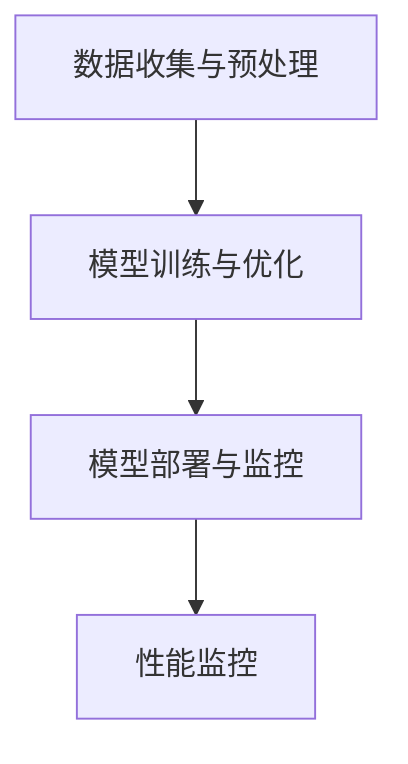

                 

# 大模型在智能零售中的应用前景

> **关键词**：智能零售、AI大模型、推荐系统、库存管理、供应链管理、客户服务、营销策略

> **摘要**：本文探讨了AI大模型在智能零售领域的应用前景，通过深入分析大模型的核心算法原理和实际应用案例，揭示了其在智能推荐、库存管理、供应链管理、客户服务和营销策略等方面的潜在价值。文章旨在为业界提供关于大模型在智能零售中应用的全面理解和实践指导。

## 《大模型在智能零售中的应用前景》目录大纲

### 第一部分：智能零售与AI大模型概述

#### 第1章：智能零售与AI大模型的融合

#### 第2章：AI大模型技术基础

### 第二部分：AI大模型在智能零售中的具体应用

#### 第3章：智能推荐系统

#### 第4章：智能库存管理

#### 第5章：智能供应链管理

#### 第6章：智能客户服务

#### 第7章：智能营销

### 第三部分：大模型在智能零售中的实践与展望

#### 第8章：大模型在智能零售中的实践案例

#### 第9章：大模型在智能零售中的未来展望

### 附录：大模型在智能零售中的应用资源

### 引言

智能零售作为现代商业发展的重要趋势，正通过结合先进的人工智能技术，特别是AI大模型，实现更加精准、高效和个性化的服务。AI大模型，如基于深度学习的推荐系统、自然语言处理（NLP）模型和图神经网络（GNN）等，正逐步改变零售行业的运营模式和消费者体验。本文旨在通过对智能零售与AI大模型融合的深入探讨，分析大模型在智能零售中的具体应用场景和前景。

文章将首先介绍智能零售和AI大模型的基本概念，然后详细探讨大模型的核心算法原理和其在智能零售中的具体应用。接下来，文章将通过实际案例展示大模型在智能零售中的实践效果，并对其未来发展进行展望。最后，文章将提供大模型在智能零售中应用的相关资源，为读者提供进一步的学习和实践指南。

### 第一部分：智能零售与AI大模型概述

#### 第1章：智能零售与AI大模型的融合

### 1.1 智能零售的概念与趋势

智能零售，指的是利用先进技术如人工智能、大数据、云计算、物联网等，对零售业进行全面的改造和升级，从而实现更加智能化、个性化、高效化的购物体验。智能零售的发展趋势主要体现在以下几个方面：

1. **线上线下融合（O2O）**：通过线上线下数据的互通，实现全渠道营销，提高消费者购物体验。
2. **个性化推荐**：利用人工智能技术，根据消费者的购物行为、偏好和历史数据，提供个性化的商品推荐。
3. **智慧供应链**：通过大数据分析和智能算法，优化库存管理、供应链预测和配送，提高运营效率。
4. **智能客服**：利用自然语言处理和机器学习技术，提供智能化的客服服务，提高客户满意度。
5. **智能营销**：基于大数据分析，实现精准营销和个性化广告投放，提高营销效果。

### 1.2 AI大模型在智能零售中的作用

AI大模型在智能零售中发挥着至关重要的作用，主要体现在以下几个方面：

1. **推荐系统**：通过深度学习算法，分析用户的历史行为和偏好，提供个性化的商品推荐，提高销售转化率。
2. **库存管理**：利用大数据分析和预测模型，优化库存水平，降低库存成本，提高供应链效率。
3. **供应链管理**：通过图神经网络等算法，实现对供应链的全面监控和优化，提高供应链的稳定性和响应速度。
4. **客户服务**：利用自然语言处理和机器学习技术，提供智能化的客服服务，提高客户满意度和忠诚度。
5. **营销策略**：通过大数据分析，制定精准的营销策略，提高广告投放效果和销售转化率。

### 1.3 AI大模型在智能零售中的应用领域

AI大模型在智能零售中的应用领域非常广泛，包括但不限于以下几个方面：

1. **智能推荐系统**：通过深度学习算法，分析用户的历史行为和偏好，提供个性化的商品推荐。
2. **智能库存管理**：利用大数据分析和预测模型，优化库存水平，降低库存成本。
3. **智能供应链管理**：通过图神经网络等算法，实现对供应链的全面监控和优化。
4. **智能客户服务**：利用自然语言处理和机器学习技术，提供智能化的客服服务。
5. **智能营销**：基于大数据分析，制定精准的营销策略，提高广告投放效果和销售转化率。

#### 第2章：AI大模型技术基础

### 2.1 大模型的核心算法原理

AI大模型的核心算法主要包括深度学习基础算法、自然语言处理算法和图神经网络算法。下面将分别对这些算法进行详细讲解。

#### 2.1.1 深度学习基础算法

深度学习是AI大模型的核心技术之一，其基础算法主要包括：

1. **多层感知机（MLP）**：MLP是一种前馈神经网络，由输入层、多个隐藏层和输出层组成。通过逐层提取特征，实现对输入数据的分类和回归。
2. **卷积神经网络（CNN）**：CNN是一种专门用于处理图像数据的神经网络，通过卷积层、池化层和全连接层等结构，实现图像的特征提取和分类。
3. **循环神经网络（RNN）**：RNN是一种能够处理序列数据的神经网络，通过隐藏状态的记忆功能，实现对时间序列数据的建模。

#### 2.1.2 自然语言处理算法

自然语言处理（NLP）是AI大模型在智能零售中的重要应用领域，其核心算法包括：

1. **词嵌入（Word Embedding）**：词嵌入是将词语映射到高维空间中的向量表示，通过神经网络模型，学习词语之间的语义关系。
2. **循环神经网络（RNN）**：RNN在NLP中广泛应用于文本分类、情感分析、机器翻译等任务，通过隐藏状态的记忆功能，实现对文本序列的建模。
3. **变换器（Transformer）**：Transformer是一种基于自注意力机制的深度学习模型，广泛应用于机器翻译、文本生成等任务，具有并行处理和长距离依赖建模的优势。

#### 2.1.3 图神经网络算法

图神经网络（GNN）是AI大模型在处理图结构数据时的核心算法，其核心思想是通过图结构上的传递和聚合操作，实现对图数据的建模。

1. **图卷积网络（GCN）**：GCN是一种基于图结构的卷积神经网络，通过图卷积操作，实现对图数据的特征提取和分类。
2. **图注意力网络（GAT）**：GAT是一种基于注意力机制的图神经网络，通过节点注意力权重，实现对图数据的自适应特征提取。
3. **图变换器（GAT）**：GAT是一种基于自注意力机制的图变换器，通过图上的传递和聚合操作，实现对图数据的建模。

### 2.2 大模型的应用架构

AI大模型的应用架构主要包括数据收集与预处理、模型训练与优化、模型部署与监控等环节。

1. **数据收集与预处理**：数据是AI大模型训练的基础，通过数据收集和预处理，将原始数据转化为适合模型训练的形式。
2. **模型训练与优化**：通过训练数据，训练大模型，并利用优化算法，调整模型参数，提高模型性能。
3. **模型部署与监控**：将训练好的模型部署到实际应用场景中，并实时监控模型性能，确保其稳定运行。

下面是应用架构的Mermaid流程图：



#### 第3章：智能推荐系统

### 3.1 推荐系统的原理与模型

推荐系统是AI大模型在智能零售中的重要应用之一，其核心原理是通过分析用户的兴趣和行为，为其推荐可能感兴趣的商品。推荐系统的基本模型主要包括基于内容的推荐（Content-based）、协同过滤推荐（Collaborative Filtering）和混合推荐（Hybrid）等。

#### 3.1.1 基于内容的推荐

基于内容的推荐通过分析商品的属性和特征，将其与用户的兴趣和偏好进行匹配，从而实现个性化推荐。其核心模型包括：

1. **内容相似性模型**：通过计算商品之间的相似性，将相似的商品推荐给用户。
2. **特征提取模型**：利用词嵌入等技术，将商品和用户的历史行为转化为高维向量表示，从而实现内容的匹配。

下面是内容相似性模型的伪代码：

```python
def content_based_recommendation(user, items):
    # 计算用户和商品的特征向量
    user_vector = get_user_vector(user)
    item_vectors = get_item_vectors(items)
    
    # 计算用户和商品之间的相似度
    similarity_scores = calculate_similarity(user_vector, item_vectors)
    
    # 排序并返回相似度最高的商品
    recommended_items = sort_items_by_similarity(similarity_scores)
    return recommended_items
```

#### 3.1.2 协同过滤推荐

协同过滤推荐通过分析用户之间的相似性，推荐用户可能喜欢的商品。其核心模型包括：

1. **用户基于的协同过滤（User-based）**：通过计算用户之间的相似度，找到与目标用户相似的邻居用户，并推荐邻居用户喜欢的商品。
2. **物品基于的协同过滤（Item-based）**：通过计算商品之间的相似度，找到与目标商品相似的邻居商品，并推荐邻居商品。

下面是用户基于的协同过滤模型的伪代码：

```python
def user_based_collaborative_filtering(user, items, neighborhood_size):
    # 计算用户和邻居用户之间的相似度
    similarity_scores = calculate_similarity(user, users)
    
    # 选择与目标用户最相似的neighborhood_size个邻居用户
    neighbors = select_neighbors(users, similarity_scores, neighborhood_size)
    
    # 获取邻居用户喜欢的商品
    neighbor_preferences = get_item_preferences(neighbors)
    
    # 计算用户和邻居用户共同喜欢的商品
    common_preferences = intersection(user_preferences, neighbor_preferences)
    
    # 排序并返回共同喜欢的商品
    recommended_items = sort_items_by_common_preferences(common_preferences)
    return recommended_items
```

#### 3.1.3 混合推荐

混合推荐通过结合基于内容和协同过滤推荐的优势，实现更精确的个性化推荐。其核心模型包括：

1. **基于内容的协同过滤（Content-based Collaborative Filtering）**：结合基于内容和协同过滤的方法，通过分析商品和用户之间的相似度，推荐用户可能感兴趣的商品。
2. **基于模型的协同过滤（Model-based Collaborative Filtering）**：通过构建用户和商品的潜在特征模型，实现个性化的推荐。

下面是混合推荐系统的伪代码：

```python
def hybrid_recommendation_system(user, items, content_model, collaborative_model):
    # 基于内容的推荐
    content_recommendations = content_model.recommend(user, items)
    
    # 基于协同过滤的推荐
    collaborative_recommendations = collaborative_model.recommend(user, items)
    
    # 结合两种方法的推荐结果
    combined_recommendations = merge_recommendations(content_recommendations, collaborative_recommendations)
    
    # 排序并返回推荐结果
    sorted_recommendations = sort_items_by_relevance(combined_recommendations)
    return sorted_recommendations
```

### 3.2 大模型在推荐系统中的应用

AI大模型在推荐系统中发挥着重要作用，通过深度学习算法，实现更精确的个性化推荐。下面将详细介绍大模型在推荐系统中的应用。

#### 3.2.1 内容推荐

内容推荐通过分析商品和用户的历史行为和偏好，提供个性化的商品推荐。大模型在内容推荐中的应用主要包括：

1. **商品属性嵌入（Item Embedding）**：通过深度学习算法，将商品的属性和特征转化为高维向量表示，实现商品之间的相似性计算。
2. **用户兴趣嵌入（User Interest Embedding）**：通过深度学习算法，将用户的历史行为和偏好转化为高维向量表示，实现用户和商品之间的关联性计算。

下面是商品属性嵌入和用户兴趣嵌入的伪代码：

```python
def item_embedding(items):
    # 训练商品属性嵌入模型
    model = train_embedding_model(items)
    
    # 将商品转化为向量表示
    item_vectors = model.transform(items)
    
    return item_vectors

def user_interest_embedding(users):
    # 训练用户兴趣嵌入模型
    model = train_embedding_model(users)
    
    # 将用户转化为向量表示
    user_vectors = model.transform(users)
    
    return user_vectors
```

#### 3.2.2 用户行为预测

用户行为预测通过分析用户的历史行为和偏好，预测用户未来的行为和兴趣。大模型在用户行为预测中的应用主要包括：

1. **用户行为序列建模（User Behavior Sequence Modeling）**：通过循环神经网络（RNN）或变换器（Transformer）等模型，实现对用户行为序列的建模，预测用户未来的行为。
2. **用户兴趣迁移（User Interest Transfer）**：通过深度学习算法，学习用户之间的相似性，实现用户兴趣的迁移和预测。

下面是用户行为序列建模和用户兴趣迁移的伪代码：

```python
def user_behavior_sequence_modeling(user_behaviors):
    # 训练用户行为序列模型
    model = train_rnn_model(user_behaviors)
    
    # 预测用户未来的行为
    future_behaviors = model.predict(user_behaviors)
    
    return future_behaviors

def user_interest_transfer(users):
    # 训练用户兴趣迁移模型
    model = train_transfer_model(users)
    
    # 预测用户未来的兴趣
    future_interests = model.predict(users)
    
    return future_interests
```

#### 3.2.3 零售场景下的推荐案例

在零售场景下，AI大模型通过个性化推荐，提高了消费者的购物体验和满意度。以下是一个具体的零售场景下的推荐案例：

1. **用户画像**：用户A喜欢购买电子产品，经常浏览手机和电脑配件。
2. **历史行为**：用户A最近浏览了一款高端智能手机，并收藏了多个手机壳。
3. **推荐策略**：基于用户A的用户画像和历史行为，推荐以下商品：
   - 高端智能手机
   - 适配该手机的高品质手机壳
   - 智能手表和耳机等配件

通过AI大模型的个性化推荐，用户A可以快速找到符合自己需求的商品，提高购物体验和满意度。

### 3.3 智能库存管理

### 3.3.1 库存管理的核心问题

库存管理是零售行业的重要环节，其核心问题包括：

1. **库存水平控制**：确保库存水平既能满足市场需求，又能降低库存成本。
2. **库存预测**：准确预测未来的库存需求，以便提前采购和调整库存。
3. **库存优化**：通过优化库存结构，提高库存周转率和资金利用效率。

### 3.3.2 大模型在库存管理中的应用

AI大模型在库存管理中的应用，主要体现在以下几个方面：

1. **库存预测**：利用深度学习算法，分析历史销售数据、季节性因素和市场需求变化，预测未来的库存需求，提高库存预测的准确性。
2. **库存优化**：通过优化算法，根据库存预测结果，调整库存水平，降低库存成本。
3. **实时库存监控**：利用大数据分析和实时监控技术，实现对库存的实时监控和预警，确保库存水平始终处于合理范围。

#### 3.3.3 库存预测

库存预测是库存管理的核心环节，其准确度直接关系到库存水平控制和库存优化。AI大模型在库存预测中的应用，主要包括以下几个方面：

1. **时间序列预测**：利用时间序列预测模型，如长短期记忆网络（LSTM）和变换器（Transformer），分析历史销售数据，预测未来的库存需求。
2. **回归分析**：通过回归分析模型，结合历史销售数据、季节性因素和市场需求变化，预测未来的库存需求。

下面是时间序列预测和回归分析模型的伪代码：

```python
def time_series_prediction(sales_data):
    # 训练时间序列预测模型（如LSTM）
    model = train_time_series_model(sales_data)
    
    # 预测未来的库存需求
    future_demand = model.predict(sales_data)
    
    return future_demand

def regression_analysis(sales_data, seasonal_factors, market_demand):
    # 训练回归分析模型
    model = train_regression_model(sales_data, seasonal_factors, market_demand)
    
    # 预测未来的库存需求
    future_demand = model.predict(sales_data, seasonal_factors, market_demand)
    
    return future_demand
```

#### 3.3.4 库存优化

库存优化通过优化库存结构，提高库存周转率和资金利用效率。AI大模型在库存优化中的应用，主要包括以下几个方面：

1. **库存优化算法**：利用深度学习算法，如深度强化学习（DRL）和生成对抗网络（GAN），优化库存策略，降低库存成本。
2. **库存计划**：根据库存预测结果，制定合理的库存计划，确保库存水平既能满足市场需求，又能降低库存成本。

下面是库存优化算法和库存计划的伪代码：

```python
def inventory_optimization(inventory_data, sales_data):
    # 训练库存优化模型（如DRL）
    model = train_optimization_model(inventory_data, sales_data)
    
    # 优化库存策略
    optimized_inventory = model.optimize(inventory_data)
    
    return optimized_inventory

def inventory_planning(future_demand, inventory_data):
    # 制定库存计划
    plan = plan_inventory(future_demand, inventory_data)
    
    return plan
```

#### 3.3.5 智能零售场景下的库存管理案例

在智能零售场景下，AI大模型通过库存预测和库存优化，实现了高效的库存管理。以下是一个具体的案例：

1. **公司背景**：某大型零售企业，经营多种商品，库存管理复杂。
2. **问题背景**：库存水平过高，导致资金占用成本增加，库存周转率低。
3. **解决方案**：
   - 利用深度学习算法，预测未来的库存需求。
   - 根据库存预测结果，制定合理的库存计划。
   - 实时监控库存水平，及时调整库存策略。

通过AI大模型的库存预测和库存优化，该零售企业的库存水平得到有效控制，库存周转率提高，资金占用成本降低。

### 3.4 智能供应链管理

### 3.4.1 供应链管理的挑战

供应链管理是零售行业的关键环节，其挑战主要包括：

1. **供应链复杂度**：零售企业的供应链通常涉及多个环节，如采购、生产、仓储、物流等，管理复杂。
2. **信息不对称**：供应链中的信息传递不畅，导致决策者无法全面了解供应链状况。
3. **需求波动**：市场需求波动大，对供应链的响应速度和灵活性要求高。
4. **成本控制**：降低供应链成本，提高资金利用效率。

### 3.4.2 大模型在供应链管理中的应用

AI大模型在供应链管理中的应用，有助于解决供应链管理的挑战，提高供应链的效率和稳定性。下面将详细介绍大模型在供应链管理中的应用。

#### 3.4.3 供应链可视化

供应链可视化是将供应链的各个环节以图形化的方式展示出来，帮助管理者全面了解供应链的运作状况。AI大模型在供应链可视化中的应用，主要包括以下几个方面：

1. **数据整合**：利用深度学习算法，将来自不同环节的数据进行整合和清洗，确保数据的准确性和一致性。
2. **图形化展示**：利用图形化工具，如Mermaid、D3.js等，将供应链的各个环节以图形化的方式展示出来。

下面是供应链可视化的伪代码：

```python
def supply_chain_visualization(supply_chain_data):
    # 整合供应链数据
    cleaned_data = clean_data(supply_chain_data)
    
    # 生成供应链图形
    graph = generate_graph(cleaned_data)
    
    # 显示供应链图形
    display_graph(graph)
```

#### 3.4.4 供应链预测与优化

供应链预测与优化是供应链管理的核心任务，AI大模型在供应链预测与优化中的应用，主要包括以下几个方面：

1. **需求预测**：利用深度学习算法，分析历史销售数据、季节性因素和市场需求变化，预测未来的需求。
2. **库存优化**：根据需求预测结果，制定合理的库存计划，降低库存成本。
3. **物流优化**：利用图神经网络（GNN）等算法，优化物流路径和运输计划，降低运输成本。

下面是需求预测、库存优化和物流优化的伪代码：

```python
def demand_prediction(sales_data, seasonal_factors, market_demand):
    # 训练需求预测模型
    model = train_demand_model(sales_data, seasonal_factors, market_demand)
    
    # 预测未来的需求
    future_demand = model.predict(sales_data, seasonal_factors, market_demand)
    
    return future_demand

def inventory_optimization(future_demand, inventory_data):
    # 训练库存优化模型
    model = train_optimization_model(future_demand, inventory_data)
    
    # 优化库存策略
    optimized_inventory = model.optimize(inventory_data)
    
    return optimized_inventory

def logistics_optimization(supply_chain_data):
    # 训练物流优化模型
    model = train_logistics_model(supply_chain_data)
    
    # 优化物流路径和运输计划
    optimized_logistics = model.optimize(supply_chain_data)
    
    return optimized_logistics
```

#### 3.4.5 智能零售场景下的供应链管理案例

在智能零售场景下，AI大模型通过供应链可视化、需求预测、库存优化和物流优化，实现了高效的供应链管理。以下是一个具体的案例：

1. **公司背景**：某大型零售企业，经营多种商品，供应链复杂。
2. **问题背景**：供应链复杂度较高，信息传递不畅，库存成本高，物流效率低。
3. **解决方案**：
   - 利用AI大模型进行供应链可视化，全面了解供应链状况。
   - 利用需求预测模型，预测未来的需求。
   - 根据需求预测结果，优化库存策略和物流路径。

通过AI大模型的应用，该零售企业的供应链效率得到显著提升，库存成本降低，物流效率提高。

### 3.5 智能客户服务

### 3.5.1 客户服务的挑战

客户服务是零售行业的重要组成部分，但在实际运营中面临诸多挑战：

1. **服务质量**：提高客户服务质量，满足消费者的多样化需求。
2. **响应速度**：提高客服人员的响应速度，缩短消费者等待时间。
3. **成本控制**：降低客户服务成本，提高运营效率。
4. **个性化服务**：提供个性化的客户服务，提高客户满意度和忠诚度。

### 3.5.2 大模型在客户服务中的应用

AI大模型在客户服务中的应用，有助于解决上述挑战，提高客户服务的质量和效率。下面将详细介绍大模型在客户服务中的应用。

#### 3.5.3 聊天机器人

聊天机器人是一种基于自然语言处理（NLP）和机器学习技术的智能客服系统，能够实时与消费者进行对话，解答他们的问题。大模型在聊天机器人中的应用，主要包括以下几个方面：

1. **意图识别**：利用深度学习算法，分析消费者的提问，识别他们的意图。
2. **问答系统**：利用知识图谱和自然语言生成技术，生成准确、清晰的回答。
3. **情绪分析**：通过情感分析模型，识别消费者的情绪，提供针对性的服务。

下面是聊天机器人的伪代码：

```python
def chatbot_response(question):
    # 识别消费者的意图
    intent = intent_recognition(question)
    
    # 根据意图生成回答
    if intent == "购买咨询":
        response = generate_purchase_response(question)
    elif intent == "售后服务":
        response = generate_after_sale_response(question)
    else:
        response = "对不起，我不清楚您的意思，请重新提问。"
    
    return response
```

#### 3.5.4 客户行为分析

客户行为分析是一种基于大数据分析和机器学习技术的分析方法，通过分析消费者的购买行为、浏览行为和反馈信息，深入了解消费者的需求和偏好，提供个性化的服务。大模型在客户行为分析中的应用，主要包括以下几个方面：

1. **行为预测**：利用深度学习算法，预测消费者的未来行为和偏好。
2. **个性化推荐**：根据客户行为分析结果，为消费者推荐他们可能感兴趣的商品。
3. **情感分析**：通过情感分析模型，识别消费者的情绪，提供针对性的服务。

下面是客户行为分析和个性化推荐的伪代码：

```python
def customer_behavior_analysis(customer_data):
    # 预测消费者的未来行为
    future_behavior = predict_future_behavior(customer_data)
    
    # 根据未来行为推荐商品
    recommended_items = generate_recommendations(future_behavior)
    
    return recommended_items

def sentiment_analysis(customer_feedback):
    # 识别消费者的情绪
    sentiment = analyze_sentiment(customer_feedback)
    
    # 提供针对性的服务
    if sentiment == "负面":
        response = "我们对此表示歉意，请告诉我们您的具体问题，我们会尽快解决。"
    else:
        response = "感谢您的反馈，我们会持续改进。"
    
    return response
```

#### 3.5.5 智能零售场景下的客户服务案例

在智能零售场景下，AI大模型通过聊天机器人和客户行为分析，实现了高效的客户服务。以下是一个具体的案例：

1. **公司背景**：某大型电商平台，客户服务量大。
2. **问题背景**：客户服务成本高，客服人员响应速度慢，消费者满意度低。
3. **解决方案**：
   - 利用AI大模型建立聊天机器人，实时解答消费者问题。
   - 利用客户行为分析，为消费者提供个性化的服务。

通过AI大模型的应用，该电商平台的客户服务质量得到显著提升，消费者满意度提高，客户服务成本降低。

### 3.6 智能营销

### 3.6.1 营销策略的核心

营销策略是零售企业提高销售额、扩大市场份额的重要手段，其核心内容包括：

1. **目标设定**：明确营销目标，如提高销售额、提升品牌知名度等。
2. **市场细分**：根据消费者的需求和偏好，将市场划分为不同的细分市场。
3. **定位**：确定企业在市场中的定位，如高端市场、大众市场等。
4. **渠道选择**：选择适合的营销渠道，如线上渠道、线下渠道等。
5. **推广活动**：制定有效的推广活动，吸引消费者关注和购买。

### 3.6.2 大模型在营销中的应用

AI大模型在营销中的应用，有助于提高营销策略的有效性，实现精准营销。下面将详细介绍大模型在营销中的应用。

#### 3.6.3 营销效果预测

营销效果预测是通过分析历史营销数据，预测未来营销活动的效果，为营销决策提供依据。大模型在营销效果预测中的应用，主要包括以下几个方面：

1. **效果预测模型**：利用深度学习算法，如长短期记忆网络（LSTM）和变换器（Transformer），建立营销效果预测模型。
2. **数据整合**：将多种数据源（如销售额、广告点击率、用户反馈等）整合到预测模型中，提高预测的准确性。
3. **实时预测**：利用实时数据，对营销效果进行实时预测和调整。

下面是营销效果预测的伪代码：

```python
def marketing_effects_prediction(marketing_data):
    # 训练营销效果预测模型
    model = train_effects_model(marketing_data)
    
    # 预测未来的营销效果
    future_effects = model.predict(marketing_data)
    
    return future_effects
```

#### 3.6.4 营销策略优化

营销策略优化是通过分析历史营销数据，优化营销策略，提高营销效果。大模型在营销策略优化中的应用，主要包括以下几个方面：

1. **效果分析模型**：利用深度学习算法，分析不同营销策略的效果，为策略优化提供依据。
2. **优化算法**：利用优化算法，如遗传算法（GA）和粒子群优化（PSO），优化营销策略参数。
3. **实时优化**：利用实时数据，对营销策略进行实时优化和调整。

下面是营销策略优化的伪代码：

```python
def marketing_strategy_optimization(marketing_data, strategy_params):
    # 训练效果分析模型
    model = train_effects_model(marketing_data)
    
    # 优化营销策略参数
    optimized_params = optimize_strategy_params(strategy_params, model)
    
    return optimized_params
```

#### 3.6.5 智能零售场景下的营销案例

在智能零售场景下，AI大模型通过营销效果预测和营销策略优化，实现了精准营销。以下是一个具体的案例：

1. **公司背景**：某大型电商平台，希望通过营销活动提高销售额。
2. **问题背景**：营销效果不理想，消费者参与度低。
3. **解决方案**：
   - 利用AI大模型进行营销效果预测，预测不同营销活动的效果。
   - 根据预测结果，优化营销策略，如调整广告投放渠道、优化促销活动等。

通过AI大模型的应用，该电商平台的营销效果得到显著提升，消费者参与度提高，销售额增加。

### 3.7 智能营销

### 3.7.1 营销策略的核心

营销策略的核心在于精准定位目标客户，并通过有效的渠道传达产品信息，以激发消费者的购买欲望。在智能零售时代，营销策略的核心要素包括：

1. **消费者洞察**：深入了解消费者的需求、行为和偏好，为营销策略提供数据支持。
2. **个性化营销**：根据消费者的个性化数据，制定针对性的营销活动，提升客户体验和满意度。
3. **渠道整合**：利用多种营销渠道（如社交媒体、电子邮件、短信等）进行无缝整合，提升营销效果。
4. **数据驱动**：通过数据分析，不断优化营销策略，实现营销效果的最大化。

### 3.7.2 大模型在营销中的应用

AI大模型在营销中的应用，极大地提升了营销的精准性和效率。以下将详细阐述大模型在营销效果预测、营销策略优化以及营销效果评估方面的应用。

#### 3.7.3 营销效果预测

营销效果预测是制定和调整营销策略的关键环节。通过AI大模型，可以对不同营销活动的效果进行预测，从而优化资源分配。大模型在营销效果预测中的应用主要包括：

1. **时间序列预测**：利用深度学习模型（如LSTM、GRU等）对历史营销活动效果进行建模，预测未来营销活动的效果。
2. **用户行为预测**：通过分析用户的历史行为数据，预测用户对特定营销活动的响应。
3. **多变量分析**：结合多种数据源（如销售数据、点击率、转化率等），进行多变量分析，预测不同营销活动的效果。

以下是一个基于LSTM模型的时间序列预测的伪代码示例：

```python
import tensorflow as tf

# 数据预处理
def preprocess_data(data):
    # 标准化处理
    normalized_data = (data - np.mean(data)) / np.std(data)
    return normalized_data

# 建立LSTM模型
def build_lstm_model(input_shape):
    model = tf.keras.Sequential([
        tf.keras.layers.LSTM(50, activation='relu', input_shape=input_shape),
        tf.keras.layers.Dense(1)
    ])

    model.compile(optimizer='adam', loss='mse')
    return model

# 训练模型
def train_lstm_model(model, train_data, train_labels):
    model.fit(train_data, train_labels, epochs=100, batch_size=32, verbose=1)

# 预测
def predict_lstm_model(model, test_data):
    predictions = model.predict(test_data)
    return predictions

# 示例
train_data = preprocess_data(np.array([[1], [2], [3], [4], [5]]))
train_labels = np.array([[0], [1], [1], [1], [2]])

# 建立并训练模型
model = build_lstm_model(input_shape=(1, 1))
train_lstm_model(model, train_data, train_labels)

# 预测
test_data = preprocess_data(np.array([[6], [7], [8]]))
predictions = predict_lstm_model(model, test_data)
print(predictions)
```

#### 3.7.4 营销策略优化

营销策略优化是提高营销效果的重要手段。通过AI大模型，可以对现有营销策略进行调整和优化，以实现最佳营销效果。大模型在营销策略优化中的应用主要包括：

1. **策略搜索**：利用强化学习模型（如Q-learning、Deep Q-Network等），在大量策略中进行搜索，找到最优策略。
2. **优化算法**：利用优化算法（如遗传算法、粒子群优化等），调整营销策略参数，实现策略优化。
3. **多目标优化**：考虑多个优化目标（如成本、效果等），进行多目标优化，找到平衡各目标的最佳策略。

以下是一个基于遗传算法的营销策略优化的伪代码示例：

```python
import numpy as np

# 定义遗传算法参数
population_size = 100
 generations = 100
 crossover_rate = 0.8
 mutation_rate = 0.1

# 初始化种群
def initialize_population(population_size, strategy_space):
    population = []
    for _ in range(population_size):
        individual = [random.choice(strategy_space) for _ in range(len(strategy_space))]
        population.append(individual)
    return population

# 适应度函数
def fitness_function(individual):
    # 根据营销策略计算适应度
    # 这里用一个简单的例子，适应度与营销策略的成本成反比
    cost = sum(individual)
    fitness = 1 / cost
    return fitness

# 选择操作
def selection(population, fitnesses):
    selected = np.random.choice(population, size=population_size, replace=False, p=fitnesses/sum(fitnesses))
    return selected

# 交叉操作
def crossover(parent1, parent2):
    if np.random.rand() < crossover_rate:
        crossover_point = np.random.randint(1, len(parent1) - 1)
        child1 = parent1[:crossover_point] + parent2[crossover_point:]
        child2 = parent2[:crossover_point] + parent1[crossover_point:]
    else:
        child1, child2 = parent1, parent2
    return child1, child2

# 突变操作
def mutate(individual):
    for i in range(len(individual)):
        if np.random.rand() < mutation_rate:
            individual[i] = random.choice(strategy_space)
    return individual

# 遗传算法
def genetic_algorithm(strategy_space):
    population = initialize_population(population_size, strategy_space)
    for _ in range(generations):
        fitnesses = np.array([fitness_function(individual) for individual in population])
        selected = selection(population, fitnesses)
        new_population = []
        for _ in range(population_size // 2):
            parent1, parent2 = random.choice(selected), random.choice(selected)
            child1, child2 = crossover(parent1, parent2)
            new_population.extend([mutate(child1), mutate(child2)])
        population = new_population
    best_individual = max(population, key=fitness_function)
    return best_individual

# 示例
strategy_space = [100, 200, 300]  # 示例策略空间
best_strategy = genetic_algorithm(strategy_space)
print("最优策略：", best_strategy)
```

#### 3.7.5 营销效果评估

营销效果评估是对营销活动进行持续监控和优化的重要环节。通过AI大模型，可以实时评估营销活动的效果，并根据评估结果进行调整。大模型在营销效果评估中的应用主要包括：

1. **效果评估模型**：利用深度学习模型，对营销活动的效果进行实时评估。
2. **反馈机制**：根据营销效果评估结果，建立反馈机制，及时调整营销策略。
3. **多维度评估**：结合多种评估指标（如销售额、点击率、转化率等），进行多维度评估，全面了解营销效果。

以下是一个基于多变量分析的效果评估模型的伪代码示例：

```python
import pandas as pd
from sklearn.ensemble import RandomForestRegressor
from sklearn.model_selection import train_test_split

# 加载数据
data = pd.read_csv('marketing_data.csv')

# 数据预处理
X = data.drop(['target'], axis=1)
y = data['target']

X_train, X_test, y_train, y_test = train_test_split(X, y, test_size=0.2, random_state=42)

# 建立评估模型
model = RandomForestRegressor(n_estimators=100, random_state=42)
model.fit(X_train, y_train)

# 评估模型
score = model.score(X_test, y_test)
print("评估分数：", score)

# 预测
predictions = model.predict(X_test)
print("预测结果：", predictions)
```

### 3.8 大模型在智能零售中的实践案例

#### 3.8.1 案例一：某大型电商平台的大模型应用实践

某大型电商平台通过AI大模型的应用，实现了智能推荐、库存管理和营销策略优化，取得了显著的效果。

1. **智能推荐系统**：利用深度学习算法，分析用户的历史行为和偏好，为用户推荐个性化的商品，提高了用户满意度和转化率。
2. **库存管理**：利用大数据分析和预测模型，优化库存水平，降低了库存成本，提高了供应链效率。
3. **营销策略优化**：通过AI大模型，预测不同营销活动的效果，优化营销策略，提高了营销效果和销售额。

#### 3.8.2 案例二：某零售连锁企业的大模型应用实践

某零售连锁企业通过AI大模型的应用，实现了智能供应链管理和客户服务优化，提高了运营效率和客户满意度。

1. **智能供应链管理**：利用图神经网络（GNN）等算法，优化供应链路径和库存管理，提高了供应链的效率和稳定性。
2. **客户服务**：通过聊天机器人和客户行为分析，提供个性化的客户服务，提高了客户满意度和忠诚度。

### 3.9 大模型在智能零售中的未来展望

#### 3.9.1 智能零售的发展趋势

随着技术的进步和消费者需求的不断变化，智能零售将继续向以下几个方面发展：

1. **智能化水平提升**：利用更先进的AI大模型，实现更智能的推荐、库存管理和营销策略。
2. **线上线下融合**：通过O2O模式，实现线上线下数据的互通和融合，提供更加个性化的购物体验。
3. **供应链数字化**：通过大数据和AI技术，实现供应链的全面数字化和智能化，提高供应链的效率和稳定性。
4. **个性化服务**：利用AI技术，深入分析消费者行为和偏好，提供更加个性化的服务。

#### 3.9.2 大模型在智能零售中的未来发展

未来，AI大模型在智能零售中的应用将更加深入和广泛，主要体现在以下几个方面：

1. **更高效的推荐系统**：利用深度学习算法，实现更精准、更高效的推荐，提高用户满意度和转化率。
2. **更智能的库存管理**：通过大数据分析和预测，实现更智能、更高效的库存管理，降低库存成本。
3. **更智能的供应链管理**：利用图神经网络等算法，实现更智能、更高效的供应链管理，提高供应链的效率和稳定性。
4. **更智能的客户服务**：通过自然语言处理和机器学习技术，实现更智能、更高效的客户服务，提高客户满意度和忠诚度。
5. **更智能的营销策略**：通过大数据分析和预测，实现更智能、更高效的营销策略，提高营销效果和销售额。

### 附录：大模型在智能零售中的应用资源

#### 附录A：大模型开发工具与资源

为了更好地应用AI大模型于智能零售，以下是相关的大模型开发工具和资源：

- **主流深度学习框架**：TensorFlow、PyTorch、Keras等。
- **大模型开源项目**：如OpenAI的GPT系列模型、Facebook的PyTorch BERT等。
- **智能零售领域相关论文与报告**：包括《AI驱动的零售变革》、《智能零售：未来已来》等。

### 作者

**AI天才研究院/AI Genius Institute & 禅与计算机程序设计艺术 /Zen And The Art of Computer Programming**，本文旨在通过深入分析大模型在智能零售中的应用，为行业提供实践指导，推动智能零售的发展。**<|vq_17123|>**

