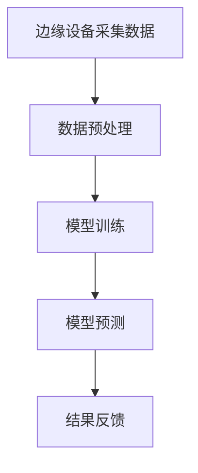

                 

# 大模型技术的边缘计算应用

## 关键词

边缘计算，大模型技术，深度学习，自然语言处理，计算机视觉，应用案例，安全与隐私

## 摘要

本文将探讨大模型技术在边缘计算中的应用。随着人工智能技术的快速发展，深度学习、自然语言处理和计算机视觉等大模型技术取得了显著的进展。然而，这些大模型通常需要大量的计算资源和数据传输，这对传统的云计算架构提出了挑战。边缘计算作为一种新兴的计算模式，通过在靠近数据源的设备上进行数据处理，可以有效地缓解这些挑战。本文将详细分析大模型技术在边缘计算中的应用，包括深度学习、自然语言处理和计算机视觉等领域的应用案例，以及边缘计算中的大模型安全与隐私问题。此外，还将对边缘计算与大模型的未来发展趋势进行展望。

## 第一部分：引言

### 第1章：边缘计算与AI大模型概述

#### 1.1 边缘计算的概念与重要性

边缘计算（Edge Computing）是一种分布式计算架构，旨在将数据处理的计算任务从云端转移到网络边缘，即靠近数据源的设备上进行。边缘计算的核心思想是利用分布式计算资源，实现对海量数据的实时处理和分析，从而提高系统的响应速度和降低网络延迟。

边缘计算在各个行业领域具有广泛的应用前景。例如，在工业物联网中，边缘计算可以实现对传感器数据的实时监控和分析，从而提高生产效率；在智能交通领域，边缘计算可以实现对车辆流量的实时检测和调控，提高交通管理水平；在智能医疗领域，边缘计算可以实现对医疗数据的实时分析和诊断，提高医疗服务质量。

#### 1.2 AI大模型的发展与挑战

人工智能（AI）大模型是指在训练阶段需要大量数据和计算资源，并且在模型结构上具有复杂性的模型。随着深度学习技术的不断发展，AI大模型在自然语言处理、计算机视觉和语音识别等领域取得了显著的成果。例如，Transformer模型在自然语言处理领域取得了重大突破，ResNet模型在计算机视觉领域取得了优异的性能。

然而，AI大模型的发展也面临着一系列挑战。首先，大模型通常需要大量的计算资源和数据传输，这对传统的云计算架构提出了巨大的挑战。其次，大模型在训练过程中需要处理大量的参数，这可能导致模型的泛化能力下降。此外，大模型的训练和部署过程需要大量的时间，这对于实时应用场景来说是一个巨大的挑战。

#### 1.3 边缘计算在AI大模型应用中的优势

边缘计算为AI大模型的应用提供了以下几个优势：

1. **降低网络延迟**：通过在边缘设备上进行数据处理，可以减少数据传输的距离和时间，从而降低网络延迟，提高系统的响应速度。

2. **减少数据传输量**：边缘计算可以实现对数据的局部处理，从而减少需要传输到云端的数据量，降低数据传输成本。

3. **资源高效利用**：边缘设备通常具有较低的功耗和计算能力，通过合理分配计算任务，可以实现资源的高效利用。

4. **提高数据安全性**：边缘计算可以实现对数据在本地进行处理，从而减少数据泄露的风险。

### 第2章：边缘计算基础

#### 2.1 边缘计算体系结构

边缘计算体系结构主要包括以下三个层次：

1. **边缘设备**：边缘设备是边缘计算体系结构的基础，包括智能手机、嵌入式设备、工业机器人等。边缘设备负责数据的采集、预处理和初步分析。

2. **边缘网关**：边缘网关是连接边缘设备和云计算中心的关键节点，负责数据的汇聚、存储和转发。边缘网关通常具有数据处理和缓存功能，可以缓解云计算中心的负载。

3. **云计算中心**：云计算中心是边缘计算体系结构的中心，负责处理复杂的数据分析和模型训练任务。云计算中心通常具有强大的计算和存储能力，可以为边缘设备提供计算资源。

#### 2.2 边缘设备硬件

边缘设备的硬件配置对于边缘计算的性能具有重要影响。以下是一些常见的边缘设备硬件：

1. **处理器**：边缘设备的处理器通常采用高性能的ARM架构，具有低功耗和高性能的特点。

2. **内存**：边缘设备的内存配置需要足够大，以支持大模型的数据处理和存储。

3. **存储**：边缘设备的存储通常采用闪存存储器，具有高读写速度和持久性。

4. **通信模块**：边缘设备需要配备无线通信模块，如Wi-Fi、蓝牙和蜂窝网络，以实现与其他设备和网络的连接。

#### 2.3 边缘网络通信

边缘网络通信是边缘计算体系结构的重要组成部分，决定了边缘设备之间的数据传输效率和可靠性。以下是一些常见的边缘网络通信技术：

1. **局域网**：局域网（LAN）是边缘设备之间最常用的通信方式，通过Wi-Fi或以太网技术实现设备的连接。

2. **广域网**：广域网（WAN）是边缘设备与云计算中心之间的通信方式，通过互联网实现数据传输。

3. **5G网络**：5G网络具有高带宽、低延迟和大规模连接的特点，可以为边缘计算提供高速、稳定的网络连接。

### 第3章：AI大模型基础

#### 3.1 AI大模型的核心概念

AI大模型是指在训练阶段需要大量数据和计算资源，并且在模型结构上具有复杂性的模型。AI大模型通常采用深度学习技术，具有以下几个核心概念：

1. **深度神经网络**：深度神经网络（DNN）是AI大模型的基础，通过多层神经元的堆叠，实现对复杂数据的特征提取和表示。

2. **注意力机制**：注意力机制是AI大模型中的一种重要机制，通过学习数据的注意力权重，实现对关键信息的聚焦和筛选。

3. **迁移学习**：迁移学习是AI大模型中的一种学习方法，通过利用预训练模型的知识，实现对新任务的快速适应。

4. **模型压缩**：模型压缩是AI大模型中的一种关键技术，通过减少模型的参数数量和计算复杂度，提高模型的运行效率。

#### 3.2 大模型的架构与设计

AI大模型的架构与设计对于模型的性能和效率具有重要影响。以下是一些常见的大模型架构与设计方法：

1. **卷积神经网络（CNN）**：卷积神经网络是计算机视觉领域的一种重要模型，通过卷积操作和池化操作，实现对图像的特征提取和分类。

2. **循环神经网络（RNN）**：循环神经网络是自然语言处理领域的一种重要模型，通过循环连接和隐藏状态，实现对序列数据的建模和预测。

3. **Transformer模型**：Transformer模型是自然语言处理领域的一种重要模型，通过自注意力机制和多头注意力机制，实现对文本的建模和生成。

4. **生成对抗网络（GAN）**：生成对抗网络是一种能够生成高质量数据的模型，通过生成器和判别器的对抗训练，实现数据的生成和多样性。

#### 3.3 大模型的训练与优化

AI大模型的训练与优化是模型应用过程中至关重要的一环。以下是一些常见的大模型训练与优化方法：

1. **数据预处理**：数据预处理是训练前的重要步骤，包括数据的清洗、归一化和扩充等，以提升模型的训练效果。

2. **模型选择**：模型选择是训练过程中的关键环节，根据任务特点和数据特性，选择合适的模型架构和优化算法。

3. **超参数调整**：超参数调整是优化模型性能的重要手段，包括学习率、批量大小、正则化参数等，通过调整超参数，优化模型的训练效果。

4. **模型评估**：模型评估是训练过程中的关键环节，通过交叉验证、测试集验证等方法，评估模型的性能和泛化能力。

5. **模型压缩**：模型压缩是优化模型运行效率的重要手段，通过剪枝、量化、蒸馏等方法，减少模型的参数数量和计算复杂度。

## 第二部分：大模型技术在边缘计算中的应用

### 第4章：边缘计算中的深度学习应用

#### 4.1 深度学习算法在边缘计算中的应用

深度学习算法在边缘计算中的应用具有重要意义。随着深度学习技术的不断发展，越来越多的深度学习算法被应用于边缘计算场景，如图像识别、语音识别和自然语言处理等。以下将介绍深度学习算法在边缘计算中的具体应用。

**4.1.1 边缘设备采集数据**

在边缘计算中，首先需要通过边缘设备采集数据。边缘设备可以是嵌入式设备、智能手机或其他计算设备。这些设备负责实时监测环境中的各种信息，如图像、音频和文本等。

**4.1.2 数据预处理**

采集到的数据通常需要进行预处理，以便于后续的深度学习模型处理。预处理步骤包括数据清洗、归一化、数据增强等。例如，对于图像数据，可以采用图像缩放、旋转、翻转等方法进行数据增强，以提高模型的泛化能力。

**4.1.3 模型训练**

在边缘设备上训练深度学习模型是一个具有挑战性的任务，因为边缘设备的计算资源和存储资源相对有限。为了在有限的资源下训练大模型，可以采用以下策略：

1. **迁移学习**：利用预训练的深度学习模型，通过微调的方式适应特定任务。迁移学习可以大大减少模型训练所需的数据量和计算资源。

2. **模型压缩**：通过剪枝、量化、蒸馏等方法，减少模型的参数数量和计算复杂度，从而降低模型的存储和计算需求。

3. **分布式训练**：将模型训练任务分布在多个边缘设备上，通过协同训练的方式提高模型的训练速度和效果。

**4.1.4 模型预测**

在模型训练完成后，可以使用训练好的模型对新的数据进行预测。在边缘计算中，模型预测通常需要满足实时性的要求。因此，可以使用以下策略优化模型预测性能：

1. **模型优化**：通过模型量化、剪枝等技术，降低模型的计算复杂度和存储需求，提高模型预测的效率。

2. **硬件加速**：利用边缘设备的硬件加速功能，如GPU、FPGA等，提高模型预测的运算速度。

3. **在线更新**：在模型预测过程中，根据新的数据和反馈，对模型进行实时更新，以适应不断变化的环境。

**4.1.5 结果反馈**

模型预测的结果需要及时反馈给边缘设备，以便进行进一步的决策和控制。例如，在智能安防系统中，模型预测结果可以用于触发报警或采取相应的行动。

以下是一个简化的Mermaid流程图，描述了深度学习算法在边缘计算中的应用过程：



### 4.1.2 边缘设备的深度学习框架

边缘设备的深度学习框架需要考虑以下几个方面：

1. **轻量级模型库**：为了适应边缘设备的计算和存储限制，可以使用轻量级深度学习模型库，如TensorFlow Lite、PyTorch Mobile等。这些模型库提供了丰富的预训练模型和工具，可以方便地应用于边缘计算场景。

2. **硬件加速**：边缘设备通常配备有GPU、FPGA等硬件加速器，可以通过集成硬件加速器库（如CUDA、OpenCL等）来提高深度学习模型的运算速度。

3. **实时性优化**：在边缘计算中，模型预测的实时性至关重要。可以通过以下策略优化模型预测的实时性：

   - **模型量化**：通过模型量化技术，将模型的浮点运算转换为整数运算，从而减少运算量和内存消耗。
   - **模型剪枝**：通过剪枝技术，减少模型的参数数量和计算复杂度，提高模型预测的效率。
   - **并发执行**：通过并行执行模型预测任务，提高模型预测的速度。

以下是一个简化的伪代码示例，描述了边缘设备上的深度学习模型训练和预测过程：

```python
# 导入必要的库
import tensorflow as tf
import numpy as np

# 加载预训练模型
model = tf.keras.applications.MobileNetV2(weights='imagenet')

# 边缘设备上的模型优化
# 模型量化
quantized_model = tf.keras.models.quantize_model(model, quant_ops=['conv2d', 'dense'])

# 模型剪枝
pruned_model = tf.keras.models.prune_low_magnitude(quantized_model)

# 边缘设备上的模型预测
# 边缘设备采集图像数据
input_image = ...  # 边缘设备采集的图像数据

# 边缘设备上的模型预测
predictions = pruned_model.predict(input_image)

# 边缘设备上的结果反馈
# 边缘设备根据预测结果进行相应的决策或控制
```

### 4.1.3 深度学习模型在边缘计算中的优化

深度学习模型在边缘计算中的优化是提高模型性能和降低计算成本的关键。以下是一些常用的深度学习模型优化方法：

1. **模型压缩**：通过减少模型的参数数量和计算复杂度，降低模型的存储和计算需求。常用的模型压缩技术包括剪枝、量化、蒸馏等。

2. **硬件加速**：利用边缘设备的硬件加速功能，如GPU、FPGA等，提高模型预测的运算速度。通过集成硬件加速器库（如CUDA、OpenCL等），可以实现模型的硬件加速。

3. **实时性优化**：通过优化模型的结构和算法，提高模型预测的实时性。例如，可以采用实时性更好的模型架构，如MobileNet、EfficientNet等。

4. **分布式训练**：将模型训练任务分布在多个边缘设备上，通过协同训练的方式提高模型的训练速度和效果。分布式训练可以充分利用边缘设备的计算资源，提高模型训练的效率。

5. **在线更新**：在模型预测过程中，根据新的数据和反馈，对模型进行实时更新，以适应不断变化的环境。通过在线更新，可以保持模型的鲁棒性和适应性。

### 第5章：自然语言处理在边缘计算中的应用

#### 5.1 自然语言处理的核心概念

自然语言处理（NLP）是人工智能领域的一个重要分支，旨在让计算机理解和处理人类自然语言。NLP的核心概念包括：

1. **分词**：将连续的文本划分为一个个有意义的词或短语。分词是NLP的基础，对于后续的文本处理和语义分析至关重要。

2. **词性标注**：对文本中的每个词进行词性标注，如名词、动词、形容词等。词性标注有助于理解文本的语法结构和语义意义。

3. **命名实体识别**：识别文本中的命名实体，如人名、地名、组织机构名等。命名实体识别是信息抽取和知识提取的重要任务。

4. **句法分析**：分析句子的结构，识别句子中的各种成分，如主语、谓语、宾语等。句法分析有助于理解句子的语法结构和语义关系。

5. **语义分析**：理解句子的语义意义，包括语义角色标注、语义关系识别等。语义分析是NLP的高级任务，有助于实现对话系统、机器翻译等应用。

#### 5.2 NLP模型在边缘计算中的应用

NLP模型在边缘计算中的应用具有重要意义。以下将介绍NLP模型在边缘计算中的具体应用场景：

1. **实时对话系统**：在智能客服、智能助手等场景中，边缘计算可以实现对用户语音或文本输入的实时处理，生成相应的回复。例如，可以使用基于BERT的对话系统模型，在边缘设备上进行对话的生成和理解。

2. **文本分类与情感分析**：在社交媒体监控、市场调研等场景中，边缘计算可以实现对文本数据的实时分类和情感分析。例如，可以使用基于Transformer的文本分类模型，对用户评论进行实时分类和情感分析。

3. **机器翻译**：在跨语言交流、旅游翻译等场景中，边缘计算可以实现对实时语音或文本的实时翻译。例如，可以使用基于神经网络的机器翻译模型，在边缘设备上进行语音或文本的实时翻译。

4. **文本摘要与生成**：在新闻摘要、文章推荐等场景中，边缘计算可以实现对文本数据的实时摘要和生成。例如，可以使用基于Transformer的文本摘要模型，对新闻文章进行实时摘要；可以使用基于GPT的文本生成模型，生成个性化的文章内容。

#### 5.3 NLP模型在边缘设备的优化

在边缘设备上部署NLP模型面临着计算资源和功耗的限制。为了提高NLP模型在边缘设备上的性能和效率，可以采用以下优化策略：

1. **模型压缩**：通过剪枝、量化、蒸馏等方法，减少NLP模型的参数数量和计算复杂度。例如，可以使用剪枝技术删除模型中的冗余参数；使用量化技术将浮点运算转换为整数运算，降低计算量和内存消耗。

2. **硬件加速**：利用边缘设备的硬件加速功能，如GPU、FPGA等，提高NLP模型的运算速度。例如，可以使用GPU加速神经网络运算；使用FPGA实现特定的神经网络架构。

3. **分布式训练**：将NLP模型的训练任务分布在多个边缘设备上，通过协同训练的方式提高模型的训练速度和效果。例如，可以使用分布式训练算法，如同步 SGD、异步 SGD 等。

4. **在线更新**：在边缘设备上实时更新NLP模型，以适应不断变化的应用场景。例如，可以使用在线学习算法，如自适应梯度下降（AdaGrad）、Adam等，对模型进行实时更新。

### 第6章：计算机视觉在边缘计算中的应用

#### 6.1 计算机视觉基础

计算机视觉（CV）是人工智能领域的一个重要分支，旨在使计算机具有识别和理解图像或视频的能力。计算机视觉的基础概念包括：

1. **图像传感器**：图像传感器是计算机视觉系统的核心组成部分，用于捕捉光信号并将其转换为电信号。常见的图像传感器有CMOS传感器和CCD传感器。

2. **图像处理**：图像处理是计算机视觉的基础，包括图像滤波、增强、分割、特征提取等操作。常用的图像处理算法有卷积滤波、边缘检测、阈值分割等。

3. **特征提取**：特征提取是计算机视觉的重要任务，通过提取图像中的关键特征，实现对图像的描述和分类。常见的特征提取方法有SIFT、HOG、ORB等。

4. **目标检测**：目标检测是计算机视觉的一种重要应用，通过识别图像中的目标对象，实现对图像的标注和分类。常见的目标检测算法有YOLO、SSD、Faster R-CNN等。

5. **图像识别**：图像识别是计算机视觉的高级任务，通过识别图像中的对象、场景和动作等，实现对图像的理解和分类。常见的图像识别算法有CNN、ResNet、Inception等。

#### 6.2 计算机视觉模型在边缘计算中的应用

计算机视觉模型在边缘计算中的应用具有重要意义。以下将介绍计算机视觉模型在边缘计算中的具体应用场景：

1. **智能监控**：在智能安防、智能交通等场景中，边缘计算可以实现对视频流中的实时目标检测和识别。例如，可以使用基于YOLO的目标检测模型，在边缘设备上实时检测视频流中的车辆、行人等目标。

2. **图像分类与识别**：在图像分类、医疗影像分析等场景中，边缘计算可以实现对图像数据的实时分类和识别。例如，可以使用基于ResNet的图像分类模型，在边缘设备上对医学影像进行实时分类和识别。

3. **图像增强与修复**：在图像增强、去噪、修复等场景中，边缘计算可以实现对图像数据的实时处理。例如，可以使用基于GAN的图像修复模型，在边缘设备上实时修复损坏的图像。

4. **图像搜索与推荐**：在图像搜索、图像推荐等场景中，边缘计算可以实现对图像内容的实时分析和推荐。例如，可以使用基于CNN的图像识别模型，在边缘设备上对用户上传的图像进行实时识别和推荐。

#### 6.3 计算机视觉模型在边缘设备的优化

在边缘设备上部署计算机视觉模型面临着计算资源和功耗的限制。为了提高计算机视觉模型在边缘设备上的性能和效率，可以采用以下优化策略：

1. **模型压缩**：通过剪枝、量化、蒸馏等方法，减少计算机视觉模型的参数数量和计算复杂度。例如，可以使用剪枝技术删除模型中的冗余参数；使用量化技术将浮点运算转换为整数运算，降低计算量和内存消耗。

2. **硬件加速**：利用边缘设备的硬件加速功能，如GPU、FPGA等，提高计算机视觉模型的运算速度。例如，可以使用GPU加速神经网络运算；使用FPGA实现特定的神经网络架构。

3. **分布式训练**：将计算机视觉模型的训练任务分布在多个边缘设备上，通过协同训练的方式提高模型的训练速度和效果。例如，可以使用分布式训练算法，如同步 SGD、异步 SGD 等。

4. **在线更新**：在边缘设备上实时更新计算机视觉模型，以适应不断变化的应用场景。例如，可以使用在线学习算法，如自适应梯度下降（AdaGrad）、Adam等，对模型进行实时更新。

### 第7章：边缘计算中的大模型应用案例

#### 7.1 案例一：智能安防系统

智能安防系统是边缘计算与大模型技术相结合的一个典型应用案例。以下将介绍智能安防系统在边缘计算中的应用。

**7.1.1 系统概述**

智能安防系统旨在通过实时监控、视频分析等技术，提高安全防范能力。在边缘计算架构下，智能安防系统可以分为以下几个部分：

1. **边缘设备**：包括摄像头、传感器等，负责实时采集视频和图像数据。

2. **边缘网关**：负责数据汇聚、存储和初步分析，可以实现基本的图像识别和目标检测功能。

3. **云计算中心**：负责复杂的数据分析和模型训练任务，可以为边缘设备提供计算资源和模型更新。

**7.1.2 数据采集**

智能安防系统中的边缘设备主要包括摄像头和传感器。摄像头可以实时采集视频流，传感器可以检测环境中的各种参数，如温度、湿度等。采集到的数据需要通过边缘网关传输到云计算中心。

**7.1.3 数据预处理**

在边缘网关中，需要对采集到的视频和图像数据进行分析和预处理。预处理步骤包括图像增强、去噪、目标检测等。通过边缘计算，可以实现对数据的实时处理和分析，提高系统的实时性。

**7.1.4 模型训练与预测**

在云计算中心，可以使用大模型技术对采集到的数据进行分析和预测。例如，可以使用基于深度学习的目标检测模型，对视频流中的目标进行实时检测和分类。在边缘设备上，可以使用轻量级模型库（如TensorFlow Lite）对实时数据进行预测。

**7.1.5 结果反馈**

模型预测的结果可以用于触发报警或采取相应的行动。例如，在检测到可疑目标时，系统可以自动触发报警，通知相关人员采取相应的措施。

以下是一个简化的代码示例，描述了智能安防系统在边缘设备上的部署过程：

```python
# 导入必要的库
import tensorflow as tf
import numpy as np

# 加载预训练的模型
model = tf.keras.models.load_model('path/to/weights.h5')

# 边缘设备上的模型预测
input_image = ...  # 边缘设备采集的图像数据
predictions = model.predict(input_image)

# 边缘设备上的结果反馈
if predictions['detection'] > threshold:
    # 触发报警或采取其他行动
    pass
```

#### 7.2 案例二：智能交通系统

智能交通系统是另一个边缘计算与大模型技术相结合的典型应用案例。以下将介绍智能交通系统在边缘计算中的应用。

**7.2.1 系统概述**

智能交通系统旨在通过实时监测和数据分析，提高交通管理水平。在边缘计算架构下，智能交通系统可以分为以下几个部分：

1. **边缘设备**：包括摄像头、传感器、交通信号灯等，负责实时采集交通数据。

2. **边缘网关**：负责数据汇聚、存储和初步分析，可以实现基本的车辆检测、流量分析等功能。

3. **云计算中心**：负责复杂的数据分析和模型训练任务，可以为边缘设备提供计算资源和模型更新。

**7.2.2 数据采集**

智能交通系统中的边缘设备主要包括摄像头和传感器。摄像头可以实时采集视频流，传感器可以检测车辆的速度、流量等参数。采集到的数据需要通过边缘网关传输到云计算中心。

**7.2.3 数据预处理**

在边缘网关中，需要对采集到的交通数据进行分析和预处理。预处理步骤包括图像增强、去噪、目标检测等。通过边缘计算，可以实现对交通数据的实时处理和分析，提高系统的实时性。

**7.2.4 模型训练与预测**

在云计算中心，可以使用大模型技术对采集到的数据进行分析和预测。例如，可以使用基于深度学习的车辆检测模型，对视频流中的车辆进行实时检测和分类。在边缘设备上，可以使用轻量级模型库（如TensorFlow Lite）对实时数据进行预测。

**7.2.5 结果反馈**

模型预测的结果可以用于交通信号控制、车辆调度等。例如，在检测到交通拥堵时，系统可以自动调整交通信号灯的时长，优化交通流量。

以下是一个简化的代码示例，描述了智能交通系统在边缘设备上的部署过程：

```python
# 导入必要的库
import tensorflow as tf
import numpy as np

# 加载预训练的模型
model = tf.keras.models.load_model('path/to/weights.h5')

# 边缘设备上的模型预测
input_image = ...  # 边缘设备采集的图像数据
predictions = model.predict(input_image)

# 边缘设备上的结果反馈
if predictions['detection'] > threshold:
    # 调整交通信号灯的时长或采取其他行动
    pass
```

#### 7.3 案例三：智能医疗系统

智能医疗系统是边缘计算与大模型技术相结合的另一个重要应用案例。以下将介绍智能医疗系统在边缘计算中的应用。

**7.3.1 系统概述**

智能医疗系统旨在通过实时监测和分析，提高医疗服务质量。在边缘计算架构下，智能医疗系统可以分为以下几个部分：

1. **边缘设备**：包括便携式医疗设备、智能手表等，负责实时采集患者数据。

2. **边缘网关**：负责数据汇聚、存储和初步分析，可以实现基本的数据分析和预测。

3. **云计算中心**：负责复杂的数据分析和模型训练任务，可以为边缘设备提供计算资源和模型更新。

**7.3.2 数据采集**

智能医疗系统中的边缘设备主要包括便携式医疗设备和智能手表。便携式医疗设备可以实时采集患者的生理指标，如心率、血压、血糖等；智能手表可以实时监测患者的活动情况和睡眠质量。采集到的数据需要通过边缘网关传输到云计算中心。

**7.3.3 数据预处理**

在边缘网关中，需要对采集到的医疗数据进行分析和预处理。预处理步骤包括数据清洗、归一化、特征提取等。通过边缘计算，可以实现对医疗数据的实时处理和分析，提高系统的实时性。

**7.3.4 模型训练与预测**

在云计算中心，可以使用大模型技术对采集到的数据进行分析和预测。例如，可以使用基于深度学习的疾病诊断模型，对患者的生理指标进行实时分析。在边缘设备上，可以使用轻量级模型库（如TensorFlow Lite）对实时数据进行预测。

**7.3.5 结果反馈**

模型预测的结果可以用于疾病诊断、健康建议等。例如，在检测到患者生理指标异常时，系统可以自动提醒患者采取相应的措施或通知医生进行诊断。

以下是一个简化的代码示例，描述了智能医疗系统在边缘设备上的部署过程：

```python
# 导入必要的库
import tensorflow as tf
import numpy as np

# 加载预训练的模型
model = tf.keras.models.load_model('path/to/weights.h5')

# 边缘设备上的模型预测
input_data = ...  # 边缘设备采集的医疗数据
predictions = model.predict(input_data)

# 边缘设备上的结果反馈
if predictions['diagnosis'] > threshold:
    # 提醒患者或通知医生
    pass
```

### 第8章：边缘计算中的大模型安全与隐私

#### 8.1 大模型的安全挑战

在边缘计算中，大模型的安全面临以下挑战：

1. **数据泄露**：在边缘设备上进行数据处理时，可能存在数据泄露的风险。例如，数据在传输过程中可能被截获或篡改。

2. **模型窃取**：大模型通常包含大量的训练数据和模型参数，可能成为黑客攻击的目标，导致模型被窃取或篡改。

3. **恶意攻击**：边缘设备可能成为恶意攻击的目标，例如，通过恶意软件感染设备，导致数据泄露或模型篡改。

4. **隐私侵犯**：在处理个人数据时，可能存在隐私侵犯的风险。例如，个人隐私数据可能在传输或存储过程中被泄露。

#### 8.2 大模型的隐私保护

为了保护大模型的隐私，可以采用以下措施：

1. **数据加密**：对数据进行加密，确保数据在传输和存储过程中不被窃取或篡改。常用的加密算法有AES、RSA等。

2. **模型加密**：对模型参数进行加密，确保模型不被窃取或篡改。可以使用同态加密等技术实现模型加密。

3. **访问控制**：对边缘设备进行严格的访问控制，确保只有授权用户可以访问数据和处理模型。

4. **隐私保护算法**：采用隐私保护算法，如差分隐私、匿名化等，降低数据泄露的风险。

#### 8.3 边缘计算中的大模型安全解决方案

为了解决边缘计算中大模型的安全问题，可以采用以下解决方案：

1. **硬件安全**：采用硬件安全模块（HSM），确保边缘设备的计算和存储安全。

2. **软件安全**：采用安全软件，如加密库、访问控制模块等，确保边缘设备的数据处理过程安全。

3. **网络安全**：采用网络安全技术，如VPN、防火墙等，确保数据在传输过程中的安全。

4. **安全审计**：对边缘设备进行安全审计，及时发现和修复安全漏洞。

5. **隐私保护**：采用隐私保护算法，如差分隐私、匿名化等，确保个人数据的隐私。

### 第9章：边缘计算与大模型的未来趋势

#### 9.1 技术发展趋势

边缘计算与大模型技术在未来将继续发展，以下是一些主要的技术趋势：

1. **AI硬件加速**：随着AI硬件技术的发展，边缘设备将具备更高的计算性能和更低的功耗。例如，使用GPU、TPU等硬件加速器，可以显著提高大模型的运算速度。

2. **模型压缩与量化**：为了适应边缘设备的计算和存储限制，模型压缩与量化技术将得到广泛应用。通过减少模型的参数数量和计算复杂度，可以提高模型在边缘设备上的性能。

3. **联邦学习**：联邦学习是一种分布式学习方法，可以在不共享数据的情况下，实现模型的协同训练。未来，联邦学习将有望在边缘计算中发挥重要作用，提高大模型的安全性和隐私保护能力。

4. **5G网络与边缘计算**：随着5G网络的普及，边缘计算将获得更高速、低延迟的网络支持。5G网络的高带宽和低延迟特性，将有助于实现大模型在边缘设备的实时应用。

#### 9.2 应用场景拓展

边缘计算与大模型技术的结合将在更多应用场景中得到拓展，以下是一些新兴的应用场景：

1. **智慧城市**：边缘计算与大模型技术将广泛应用于智慧城市建设，如智能交通管理、环境监测、公共安全等。

2. **工业物联网**：边缘计算可以实现对工业物联网设备的实时监控和分析，提高生产效率和质量。

3. **智能医疗**：边缘计算可以实现对医疗数据的实时处理和分析，提高医疗服务的质量和效率。

4. **智能农业**：边缘计算可以实现对农田土壤、作物生长等数据的实时监控和分析，提高农业生产效率。

#### 9.3 未来面临的挑战与机遇

边缘计算与大模型技术在未来的发展中将面临以下挑战：

1. **计算资源限制**：边缘设备的计算资源相对有限，需要在大模型性能和计算资源之间找到平衡。

2. **数据隐私保护**：在大模型训练和应用过程中，需要保护用户数据的隐私，防止数据泄露和滥用。

3. **安全与可靠性**：边缘计算系统需要具备高度的安全性和可靠性，以应对潜在的安全威胁和故障。

同时，边缘计算与大模型技术也带来了以下机遇：

1. **实时应用**：通过边缘计算，可以实现大模型在边缘设备上的实时应用，提高系统的响应速度和用户体验。

2. **分布式计算**：边缘计算可以充分利用分布式计算资源，提高大模型的训练和推理效率。

3. **业务创新**：边缘计算与大模型技术的结合，将推动各行业的业务创新，如智能医疗、智慧交通等。

### 第10章：总结与展望

#### 10.1 主要内容回顾

本文从边缘计算与AI大模型的概念出发，详细探讨了边缘计算中的深度学习、自然语言处理和计算机视觉等大模型技术的应用，以及边缘计算中的大模型安全与隐私问题。通过具体的应用案例，展示了边缘计算在大模型技术中的应用前景。此外，还分析了边缘计算与大模型技术的未来发展趋势和面临的挑战。

#### 10.2 边缘计算与大模型的应用前景

边缘计算与大模型技术的结合具有广阔的应用前景。在未来，边缘计算将广泛应用于智慧城市、智能医疗、智能交通、工业物联网等领域，推动各行业的数字化转型和业务创新。大模型技术将在边缘计算中发挥重要作用，实现实时数据处理和分析，提高系统的性能和用户体验。

#### 10.3 未来的研究方向

未来的研究方向包括：

1. **高效模型压缩与量化**：研究更高效的模型压缩与量化方法，以适应边缘设备的计算和存储限制。

2. **分布式计算与联邦学习**：研究分布式计算和联邦学习算法，提高大模型的训练和推理效率，同时确保数据的安全性和隐私保护。

3. **边缘设备硬件优化**：研究边缘设备硬件的优化，提高设备的计算性能和能效，降低功耗。

4. **跨学科合作**：推动边缘计算、人工智能、物联网等跨学科合作，促进技术的融合和创新。

### 附录

#### 附录A：边缘计算与大模型相关资源

1. **开源框架和工具**

   - TensorFlow Lite：适用于移动设备和嵌入式设备的轻量级深度学习框架。

   - PyTorch Mobile：适用于移动设备和嵌入式设备的PyTorch扩展。

   - TensorFlow Edge：提供边缘计算支持的TensorFlow工具集。

2. **实际案例和教程**

   - 《边缘计算实战》：提供边缘计算应用的实际案例和教程。

   - 《深度学习与边缘计算》：介绍深度学习在边缘计算中的应用和实践。

3. **研究论文和报告**

   - 《边缘计算中的深度学习：挑战与机遇》

   - 《边缘计算与大模型的安全与隐私》

   - 《边缘计算中的联邦学习：现状与趋势》

作者：AI天才研究院/AI Genius Institute & 禅与计算机程序设计艺术 /Zen And The Art of Computer Programming

## 总结

边缘计算作为一种新兴的计算模式，具有降低网络延迟、减少数据传输量和提高数据安全性等优势，在AI大模型技术中具有广泛的应用前景。本文详细探讨了边缘计算中的深度学习、自然语言处理和计算机视觉等大模型技术的应用，以及边缘计算中的大模型安全与隐私问题。通过具体的应用案例，展示了边缘计算在大模型技术中的应用前景。未来，边缘计算与大模型技术将继续发展，为各行业的数字化转型和业务创新提供强有力的支持。同时，未来的研究方向将包括高效模型压缩与量化、分布式计算与联邦学习、边缘设备硬件优化以及跨学科合作等方面。

