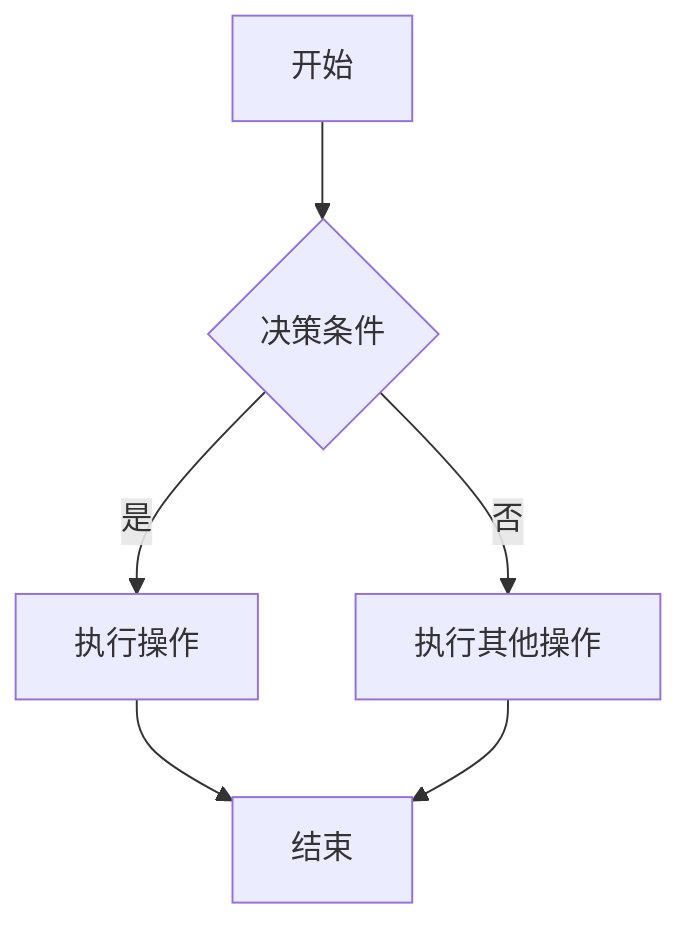

                 

# 大模型时代的软件架构设计

## 关键词
- 大模型
- 软件架构
- 深度学习
- 微服务
- 分布式计算
- 优化算法
- 安全性设计
- 可扩展性设计
- 行业应用

## 摘要
本文将探讨大模型时代的软件架构设计，首先概述大模型的定义与演变、关键技术及其对软件架构变革的影响。接着，深入分析大模型架构设计的基础原则、关键因素、层次结构以及与微服务架构的关系。随后，我们将介绍深度学习的基础知识，包括前馈神经网络、卷积神经网络、循环神经网络和生成对抗网络。接着，讨论大模型训练与优化的流程、挑战与解决方案、分布式训练。然后，重点介绍大模型架构设计实践，包括设计流程、性能优化、可靠性设计、可扩展性设计和安全性设计。接下来，通过行业应用案例展示大模型在各领域的应用，最后讨论大模型时代的企业战略和人才培养。附录部分将提供大模型工具与资源推荐。

# 《大模型时代的软件架构设计》目录大纲

## 第一部分：大模型时代概述

### 第1章：大模型时代来临
#### 1.1 大模型的定义与演变
#### 1.2 大模型的关键技术
#### 1.3 大模型时代的软件架构变革
#### 1.4 大模型时代的企业机遇与挑战

### 第2章：大模型架构设计基础
#### 2.1 软件架构设计原则
#### 2.2 大模型架构设计的关键因素
#### 2.3 大模型架构的层次结构
#### 2.4 大模型与微服务架构

## 第二部分：核心算法与架构设计

### 第3章：深度学习基础
#### 3.1 深度学习的基本原理
#### 3.2 前馈神经网络
#### 3.3 卷积神经网络（CNN）
#### 3.4 循环神经网络（RNN）
#### 3.5 生成对抗网络（GAN）

### 第4章：大模型训练与优化
#### 4.1 大模型训练流程
#### 4.2 大模型优化算法
#### 4.3 大模型训练的挑战与解决方案
#### 4.4 大模型分布式训练

### 第5章：大模型架构设计实践
#### 5.1 大模型架构设计流程
#### 5.2 大模型系统性能优化
#### 5.3 大模型系统的可靠性设计
#### 5.4 大模型系统的可扩展性设计
#### 5.5 大模型系统的安全性设计

## 第三部分：大模型应用案例分析
### 第6章：行业大模型应用案例
#### 6.1 金融行业大模型应用
#### 6.2 医疗行业大模型应用
#### 6.3 零售行业大模型应用
#### 6.4 制造业大模型应用
#### 6.5 其他行业大模型应用案例

### 第7章：大模型时代的企业战略
#### 7.1 大模型时代的企业战略调整
#### 7.2 大模型时代的企业能力建设
#### 7.3 大模型时代的创新与创业
#### 7.4 大模型时代的人才培养

## 附录
### 附录A：大模型工具与资源
#### A.1 主流深度学习框架对比
#### A.2 大模型训练环境搭建
#### A.3 大模型开发工具介绍
#### A.4 大模型学习资源推荐

## Mermaid 流程图与伪代码示例
### Mermaid 流程图示例


### 伪代码示例
```python
# 伪代码：训练深度学习模型
initialize_model()
for epoch in 1 to MAX_EPOCHS do
    for each batch in dataset do
        compute_loss(batch)
        update_model_parameters()
    end for
end for
evaluate_model_on_test_set()
```

### 数学公式与示例
$$
f(x) = \frac{1}{1 + e^{-x}}
$$
假设我们有一个输入 $x = 3$，根据上面的公式计算输出：
$$
f(3) = \frac{1}{1 + e^{-3}} \approx 0.94
$$
这意味着当输入为 3 时，函数的输出接近于 0.94。这可以用于分类任务中的概率计算。

---

现在，我们将按照这个大纲逐步深入分析每个章节的内容。

---

## 第一部分：大模型时代概述

### 第1章：大模型时代来临

#### 1.1 大模型的定义与演变

大模型是指具有数十亿甚至千亿参数规模的人工神经网络模型。这些模型通过深度学习技术训练，可以自动地从海量数据中学习复杂的模式和规律，实现图像识别、自然语言处理、语音识别等人工智能任务。

大模型的演变可以追溯到20世纪90年代的神经网络研究。当时，研究者们提出了深度神经网络（DNN）的概念，并开始尝试在图像识别任务中应用。然而，由于计算资源和数据限制，DNN模型在当时并没有得到广泛的应用。

随着计算机性能的提升和大数据技术的发展，深度学习迎来了新的机遇。2012年，AlexNet模型在ImageNet比赛中取得了突破性的成绩，引起了广泛关注。此后，深度学习技术得到了快速发展，各种大模型如BERT、GPT、ViT等相继被提出，并在自然语言处理、计算机视觉等任务中取得了显著成果。

#### 1.2 大模型的关键技术

大模型的关键技术包括以下几个方面：

1. **大规模数据集**：大模型需要大量的数据来进行训练，这要求数据集的规模和多样性。近年来，互联网的发展使得我们可以获取到海量的数据，这些数据为大模型的发展提供了基础。

2. **高性能计算**：大模型训练需要大量的计算资源，包括CPU、GPU和TPU等。高性能计算技术的发展使得我们可以更快速地训练大模型，提高了研究效率。

3. **优化算法**：大模型训练涉及到大量的参数优化，优化算法的研究成为深度学习领域的重要研究方向。常用的优化算法包括SGD、Adam、AdamW等。

4. **分布式计算**：为了加速大模型的训练，分布式计算技术被广泛应用。分布式计算可以将模型和数据分布到多个计算节点上，利用并行计算来加速训练过程。

5. **模型压缩与推理**：大模型在训练完成后，需要进行推理应用。然而，大模型推理通常需要较高的计算资源，为了降低推理成本，模型压缩与推理技术被广泛应用，包括量化、剪枝、蒸馏等方法。

#### 1.3 大模型时代的软件架构变革

大模型时代的到来对软件架构设计带来了深远的影响。传统的软件架构设计主要关注性能、稳定性和可维护性等方面，而大模型时代的软件架构设计则需要考虑以下因素：

1. **计算资源管理**：大模型训练和推理需要大量的计算资源，软件架构设计需要考虑如何高效地管理和调度这些资源。

2. **分布式计算**：分布式计算技术在大模型训练和推理中发挥着关键作用。软件架构设计需要支持分布式计算，以提高训练和推理效率。

3. **数据管理**：大模型训练需要大量的数据，软件架构设计需要考虑如何高效地管理和处理这些数据，包括数据存储、数据传输和数据清洗等方面。

4. **模型管理**：大模型训练完成后，需要对其进行管理和部署。软件架构设计需要支持模型的版本管理、模型监控和模型部署等功能。

5. **安全与隐私**：大模型涉及大量的敏感数据，软件架构设计需要考虑数据安全和隐私保护，包括数据加密、访问控制和安全审计等方面。

#### 1.4 大模型时代的企业机遇与挑战

大模型时代的到来为企业带来了前所未有的机遇和挑战：

1. **机遇**：
   - **业务创新**：大模型可以为企业提供强大的数据处理和分析能力，帮助企业实现业务创新，提升竞争力。
   - **成本降低**：大模型可以提高生产效率，降低运营成本。
   - **用户体验**：大模型可以提升产品的智能化水平，提高用户体验。

2. **挑战**：
   - **技术挑战**：大模型训练和推理需要高性能计算资源，如何高效利用这些资源是一个挑战。
   - **数据挑战**：大模型需要大量的数据来训练，如何获取、管理和利用这些数据是一个挑战。
   - **人才挑战**：大模型开发需要专业技能和人才，企业需要培养和引进相关人才。

### 第2章：大模型架构设计基础

#### 2.1 软件架构设计原则

软件架构设计是一个复杂的过程，需要遵循一些基本原则，以确保系统的性能、稳定性和可维护性。大模型架构设计也不例外，以下是一些关键原则：

1. **模块化**：将系统划分为多个模块，每个模块实现特定的功能，模块之间通过接口进行通信。模块化可以提高系统的可维护性和可扩展性。

2. **层次化**：将系统分为不同的层次，每个层次负责特定的功能。层次化可以提高系统的可理解性和可扩展性。

3. **可重用性**：设计可重用的组件和模块，减少重复开发的工作量，提高开发效率。

4. **可扩展性**：系统应具有良好的可扩展性，以适应业务规模的变化。

5. **可靠性**：系统应具有高可靠性，确保数据的准确性和一致性。

6. **安全性**：系统应具备完善的安全机制，保护数据和系统的安全。

7. **性能**：系统应具有良好的性能，确保快速响应和高效处理。

#### 2.2 大模型架构设计的关键因素

大模型架构设计需要考虑多个关键因素，以下是一些主要因素：

1. **计算资源**：大模型训练和推理需要大量的计算资源，包括CPU、GPU、TPU等。架构设计需要考虑如何高效利用这些资源。

2. **数据管理**：大模型需要大量的数据来训练，架构设计需要考虑如何高效地管理和处理这些数据。

3. **分布式计算**：分布式计算技术可以提高大模型训练和推理的效率，架构设计需要考虑如何实现分布式计算。

4. **模型管理**：大模型训练完成后，需要进行模型管理，包括模型版本管理、模型监控和模型部署等。

5. **安全性**：大模型涉及大量的敏感数据，架构设计需要考虑数据安全和隐私保护。

6. **可扩展性**：大模型架构应具有良好的可扩展性，以适应业务规模的变化。

7. **可靠性**：大模型架构应具有较高的可靠性，确保系统的稳定运行。

#### 2.3 大模型架构的层次结构

大模型架构可以分为多个层次，每个层次负责特定的功能。以下是一个典型的大模型架构层次结构：

1. **数据层**：负责数据的存储、管理和处理。包括数据仓库、数据湖、数据库等。

2. **计算层**：负责大模型的训练和推理。包括训练服务器、推理服务器、GPU集群等。

3. **模型层**：负责大模型的管理和部署。包括模型存储、模型监控、模型部署等。

4. **应用层**：负责大模型的应用，包括图像识别、自然语言处理、语音识别等。

5. **用户层**：负责用户与系统的交互，包括Web界面、移动应用等。

#### 2.4 大模型与微服务架构

微服务架构是一种新兴的软件架构风格，它将系统划分为多个独立的微服务，每个微服务负责特定的功能。大模型与微服务架构相结合，可以实现更好的灵活性和可扩展性。

大模型与微服务架构的结合点如下：

1. **模块化**：微服务架构可以将大模型拆分为多个微服务，每个微服务实现特定的功能，模块化提高系统的可维护性和可扩展性。

2. **分布式计算**：微服务架构支持分布式计算，可以充分利用分布式计算资源，提高大模型训练和推理的效率。

3. **可扩展性**：微服务架构可以水平扩展，以适应业务规模的变化。

4. **高可用性**：微服务架构可以提供高可用性，通过负载均衡和故障转移等技术，确保系统的稳定运行。

5. **安全性**：微服务架构可以提供安全性保障，通过身份认证、权限控制等技术，保护数据和系统的安全。

## 第二部分：核心算法与架构设计

### 第3章：深度学习基础

深度学习是人工智能领域的一个重要分支，通过模拟人脑的神经网络结构，实现从数据中自动提取特征和模式。深度学习的基础包括神经网络、前馈神经网络、卷积神经网络、循环神经网络和生成对抗网络。

#### 3.1 深度学习的基本原理

深度学习的基本原理基于多层神经网络，通过逐层学习数据的高级特征表示，最终实现复杂函数的映射。深度学习的核心思想是神经网络中的参数（权重和偏置）通过梯度下降等优化算法不断调整，使得网络输出与实际标签之间误差最小。

#### 3.2 前馈神经网络

前馈神经网络（Feedforward Neural Network，FNN）是最简单和最常见的一种神经网络结构。它的特点是输入数据经过输入层、多个隐藏层，最后输出层得到输出。在每层中，输入数据通过权重矩阵与激活函数计算得到输出，然后传递到下一层。

前馈神经网络的伪代码如下：
```python
initialize_weights()
for epoch in 1 to MAX_EPOCHS do
    for each sample in dataset do
        compute_forward_pass(sample)
        compute_loss()
        compute_backward_pass()
        update_weights()
    end for
end for
evaluate_model_on_test_set()
```

#### 3.3 卷积神经网络（CNN）

卷积神经网络（Convolutional Neural Network，CNN）是专门用于处理图像数据的神经网络结构。CNN通过卷积层、池化层和全连接层等结构，可以自动地从图像数据中提取特征。

CNN的伪代码如下：
```python
initialize_weights()
for epoch in 1 to MAX_EPOCHS do
    for each image in dataset do
        compute_forward_pass(image)
        compute_loss()
        compute_backward_pass()
        update_weights()
    end for
end for
evaluate_model_on_test_set()
```

#### 3.4 循环神经网络（RNN）

循环神经网络（Recurrent Neural Network，RNN）是一种用于处理序列数据的神经网络结构。RNN通过引入循环结构，使得网络能够利用历史信息，实现长期依赖建模。

RNN的伪代码如下：
```python
initialize_weights()
for epoch in 1 to MAX_EPOCHS do
    for each sequence in dataset do
        compute_forward_pass(sequence)
        compute_loss()
        compute_backward_pass()
        update_weights()
    end for
end for
evaluate_model_on_test_set()
```

#### 3.5 生成对抗网络（GAN）

生成对抗网络（Generative Adversarial Network，GAN）是一种由生成器和判别器组成的神经网络结构。生成器尝试生成数据，判别器判断生成数据是否真实。通过不断迭代优化，生成器可以生成越来越真实的数据。

GAN的伪代码如下：
```python
initialize_weights()
for epoch in 1 to MAX_EPOCHS do
    for each batch in dataset do
        compute_forward_pass(batch)
        compute_generator_loss()
        compute_discriminator_loss()
        update_generator_weights()
        update_discriminator_weights()
    end for
end for
evaluate_generator_performance()
```

### 第4章：大模型训练与优化

#### 4.1 大模型训练流程

大模型训练流程包括数据预处理、模型初始化、前向传播、损失计算、反向传播和参数更新等步骤。以下是一个典型的大模型训练流程：

```python
initialize_dataset()
initialize_model()
for epoch in 1 to MAX_EPOCHS do
    for each batch in dataset do
        compute_forward_pass(batch)
        compute_loss(batch)
        compute_backward_pass()
        update_model_parameters()
    end for
    evaluate_model_on_validation_set()
end for
evaluate_model_on_test_set()
```

#### 4.2 大模型优化算法

大模型优化算法是训练过程中调整模型参数的重要手段。以下是一些常用的大模型优化算法：

1. **随机梯度下降（SGD）**：SGD是梯度下降算法的一种，通过随机选择样本更新模型参数。SGD的优点是计算简单，但可能需要较长的训练时间。

2. **Adam优化器**：Adam是一种基于SGD的优化器，通过自适应调整学习率，提高了收敛速度和稳定性。Adam的优点是适用于各种规模的数据集和模型。

3. **AdamW优化器**：AdamW是Adam优化器的变体，通过正则化权重矩阵，提高了模型的泛化能力。

4. **Adadelta优化器**：Adadelta是一种自适应学习率优化器，通过经验一阶矩估计和经验二阶矩估计来更新模型参数。

#### 4.3 大模型训练的挑战与解决方案

大模型训练过程中面临一些挑战，以下是一些常见挑战和解决方案：

1. **过拟合**：过拟合是指模型在训练数据上表现良好，但在测试数据上表现较差。解决方案包括正则化、交叉验证和数据增强。

2. **收敛速度慢**：大模型训练过程中，由于模型参数数量巨大，收敛速度可能较慢。解决方案包括使用更高效的优化算法、增加训练数据量和使用预训练模型。

3. **计算资源限制**：大模型训练需要大量的计算资源，解决方案包括使用分布式计算、GPU加速和TPU加速。

4. **数据不均衡**：数据不均衡可能导致模型训练时偏向于某些类别，解决方案包括数据增强、类别权重调整和生成对抗网络。

#### 4.4 大模型分布式训练

分布式训练是将大模型训练任务分布在多个计算节点上，以提高训练效率和计算性能。分布式训练的关键技术包括数据并行、模型并行和流水线并行。

1. **数据并行**：数据并行是将数据集划分为多个子集，每个子集在一个计算节点上训练模型，最后将多个模型的输出结果进行平均。

2. **模型并行**：模型并行是将大模型拆分为多个部分，每个部分在一个计算节点上训练，然后进行组合。

3. **流水线并行**：流水线并行是将训练过程分为多个阶段，每个阶段在不同计算节点上执行，以实现任务并行化。

### 第5章：大模型架构设计实践

#### 5.1 大模型架构设计流程

大模型架构设计是一个复杂的过程，通常包括需求分析、架构设计、系统实现和系统测试等阶段。以下是一个典型的大模型架构设计流程：

1. **需求分析**：明确大模型的应用场景、性能要求、可扩展性要求等。

2. **架构设计**：根据需求分析结果，设计大模型架构，包括数据层、计算层、模型层、应用层等。

3. **系统实现**：根据架构设计，实现大模型系统的各个模块，并进行集成和测试。

4. **系统测试**：对大模型系统进行功能测试、性能测试和安全性测试，确保系统满足需求。

#### 5.2 大模型系统性能优化

大模型系统性能优化是提高系统效率和响应速度的关键。以下是一些常见的性能优化方法：

1. **模型压缩**：通过剪枝、量化、蒸馏等方法减少模型参数数量，提高推理速度。

2. **数据预处理**：对输入数据进行预处理，如数据增强、归一化等，提高模型训练效果和推理速度。

3. **并行计算**：利用分布式计算和GPU加速等技术，提高模型训练和推理速度。

4. **缓存技术**：利用缓存技术减少数据读取和计算时间，提高系统性能。

5. **内存管理**：优化内存管理，减少内存占用，提高系统稳定性。

#### 5.3 大模型系统的可靠性设计

大模型系统的可靠性设计是确保系统稳定运行、数据安全和业务连续性的关键。以下是一些常见的可靠性设计方法：

1. **数据备份**：对数据进行备份，确保数据不会因故障而丢失。

2. **容错机制**：设计容错机制，如故障转移、故障恢复等，确保系统在故障情况下能够继续运行。

3. **负载均衡**：设计负载均衡机制，合理分配计算任务，确保系统性能。

4. **安全性设计**：设计安全防护机制，如身份认证、访问控制等，确保系统和数据的安全。

5. **监控与告警**：对系统进行实时监控和告警，及时发现和处理故障。

#### 5.4 大模型系统的可扩展性设计

大模型系统的可扩展性设计是确保系统能够适应业务规模的变化。以下是一些常见的可扩展性设计方法：

1. **水平扩展**：通过增加计算节点，实现系统规模的线性扩展。

2. **弹性伸缩**：根据业务需求，动态调整计算资源，实现系统资源的合理利用。

3. **分布式存储**：利用分布式存储技术，提高数据存储和读取速度，确保系统性能。

4. **微服务架构**：采用微服务架构，将系统划分为多个独立的微服务，实现灵活的扩展和部署。

5. **自动化部署**：采用自动化部署工具，实现快速部署和回滚，提高系统可扩展性。

#### 5.5 大模型系统的安全性设计

大模型系统的安全性设计是保护系统和数据免受攻击的关键。以下是一些常见的安全性设计方法：

1. **数据加密**：对数据进行加密，确保数据在传输和存储过程中不被窃取。

2. **身份认证**：设计身份认证机制，确保只有授权用户可以访问系统和数据。

3. **访问控制**：设计访问控制机制，限制用户对系统和数据的访问权限。

4. **安全审计**：对系统进行安全审计，及时发现和处理安全漏洞。

5. **安全培训**：对员工进行安全培训，提高员工的安全意识和防范能力。

## 第三部分：大模型应用案例分析

### 第6章：行业大模型应用案例

大模型技术已在金融、医疗、零售、制造业等多个行业得到广泛应用，下面将介绍一些典型的应用案例。

#### 6.1 金融行业大模型应用

金融行业对数据分析和预测有着极高的要求，大模型技术在金融风险管理、欺诈检测、信用评估等方面发挥了重要作用。

1. **风险管理**：大模型可以分析历史数据，预测金融市场波动，帮助企业制定有效的风险控制策略。

2. **欺诈检测**：通过训练大量数据，大模型可以识别出潜在的欺诈行为，提高欺诈检测的准确率和效率。

3. **信用评估**：大模型可以对客户信用等级进行预测，帮助金融机构降低信用风险。

案例：某大型银行采用大模型技术对客户信用进行评估，通过分析客户的历史交易数据、行为数据等，对客户进行精准的信用评级，降低了坏账率。

#### 6.2 医疗行业大模型应用

医疗行业的数据复杂度高，大模型技术在疾病诊断、药物研发、医疗资源分配等方面具有巨大潜力。

1. **疾病诊断**：通过分析医学图像和病例数据，大模型可以辅助医生进行疾病诊断，提高诊断的准确性和效率。

2. **药物研发**：大模型可以帮助研究人员从海量数据中筛选潜在的药物分子，加速药物研发过程。

3. **医疗资源分配**：大模型可以根据患者的需求和医院资源情况，优化医疗资源的分配，提高医疗服务的效率。

案例：某国际知名医疗中心利用大模型技术分析患者病历数据，实现了精准的疾病诊断，提高了诊断准确率。

#### 6.3 零售行业大模型应用

零售行业的数据量庞大，大模型技术可以帮助企业实现个性化推荐、库存管理、营销策略优化等。

1. **个性化推荐**：大模型可以分析用户的历史行为和兴趣偏好，为用户提供个性化的商品推荐，提高用户满意度和转化率。

2. **库存管理**：大模型可以根据销售数据、季节变化等预测商品需求，帮助企业优化库存管理，降低库存成本。

3. **营销策略优化**：大模型可以分析用户数据，为零售商提供针对性的营销策略，提高营销效果。

案例：某国际知名零售商利用大模型技术进行个性化推荐，显著提高了用户的购买转化率和满意度。

#### 6.4 制造业大模型应用

制造业对生产过程的优化有着重要需求，大模型技术在生产规划、设备维护、质量控制等方面具有广泛的应用。

1. **生产规划**：大模型可以分析生产数据，预测生产需求和资源需求，优化生产计划，提高生产效率。

2. **设备维护**：大模型可以监控设备运行状态，预测设备故障，提前进行维护，降低设备停机时间。

3. **质量控制**：大模型可以分析产品质量数据，发现潜在的质量问题，提高产品质量。

案例：某大型制造企业利用大模型技术进行生产规划，显著提高了生产效率和产品质量。

#### 6.5 其他行业大模型应用案例

除了上述行业，大模型技术在教育、交通、能源等领域也取得了显著成果。

1. **教育**：大模型可以帮助教育机构实现个性化教学，提高学生的学习效果。

2. **交通**：大模型可以分析交通数据，优化交通流量，提高交通效率。

3. **能源**：大模型可以帮助能源企业实现智能调度，提高能源利用效率。

案例：某国际知名教育机构利用大模型技术进行个性化教学，显著提高了学生的学习成绩。

## 第四部分：大模型时代的企业战略

### 第7章：大模型时代的企业战略

大模型技术的发展为企业带来了巨大的机遇和挑战。为了在竞争中保持优势，企业需要制定相应的发展战略，以下是一些关键策略：

#### 7.1 大模型时代的企业战略调整

1. **业务模式创新**：企业可以利用大模型技术实现业务模式创新，如通过个性化推荐、智能客服等提升用户体验。

2. **数据驱动决策**：企业应将数据作为关键资产，利用大模型技术进行数据分析和决策支持，提高决策的准确性和效率。

3. **跨界融合**：企业可以与其他行业进行跨界合作，共同探索大模型技术的应用，实现资源共享和优势互补。

#### 7.2 大模型时代的企业能力建设

1. **技术研发**：企业应加强大模型技术研发，培养和引进相关人才，保持技术领先优势。

2. **数据管理**：企业应建立完善的数据管理体系，确保数据质量、安全和合规性。

3. **人才培养**：企业应重视人才培养，建立持续的学习和培训机制，提升员工的技能和素质。

#### 7.3 大模型时代的创新与创业

1. **内部创新**：企业可以通过内部创新项目，探索大模型技术的应用场景，推动业务发展。

2. **外部创业**：企业可以通过设立创新实验室或创投基金，支持外部创业项目，共同推动产业发展。

#### 7.4 大模型时代的人才培养

1. **学术合作**：企业可以与高校和科研机构合作，共同培养大模型技术人才。

2. **内部培训**：企业应建立内部培训体系，定期组织技术培训和交流活动，提升员工的技能水平。

3. **实习项目**：企业可以设立实习项目，吸引优秀的大学生和研究生，为他们提供实践机会。

### 附录

#### 附录A：大模型工具与资源

1. **主流深度学习框架对比**
   - TensorFlow
   - PyTorch
   - Keras
   - MXNet

2. **大模型训练环境搭建**
   - GPU环境搭建
   - TPU环境搭建
   - 分布式训练环境搭建

3. **大模型开发工具介绍**
   - Jupyter Notebook
   - PyCharm
   - VSCode

4. **大模型学习资源推荐**
   - Coursera《深度学习》
   - 网易云课堂《大模型技术与应用》
   - 《深度学习：卷积神经网络与可视化》

### Mermaid 流程图与伪代码示例

#### Mermaid 流程图示例


#### 伪代码示例

```python
# 伪代码：训练深度学习模型
initialize_model()
for epoch in 1 to MAX_EPOCHS do
    for each batch in dataset do
        compute_forward_pass(batch)
        compute_loss(batch)
        compute_backward_pass()
        update_model_parameters()
    end for
    evaluate_model_on_validation_set()
end for
evaluate_model_on_test_set()
```

#### 数学公式与示例

$$
f(x) = \frac{1}{1 + e^{-x}}
$$

假设我们有一个输入 $x = 3$，根据上面的公式计算输出：
$$
f(3) = \frac{1}{1 + e^{-3}} \approx 0.94
$$
这意味着当输入为 3 时，函数的输出接近于 0.94。这可以用于分类任务中的概率计算。

---

至此，本文对大模型时代的软件架构设计进行了全面而深入的探讨。通过分析大模型时代的定义与演变、核心技术、架构设计原则与实践，以及行业应用案例分析，我们展示了大模型在各个行业中的巨大潜力。同时，本文还提出了企业在大模型时代应采取的战略和策略。希望本文能为读者提供有益的参考和启示。在未来的发展中，随着大模型技术的不断进步，软件架构设计将迎来更多创新和挑战，我们期待能够共同见证这一激动人心的时代。

