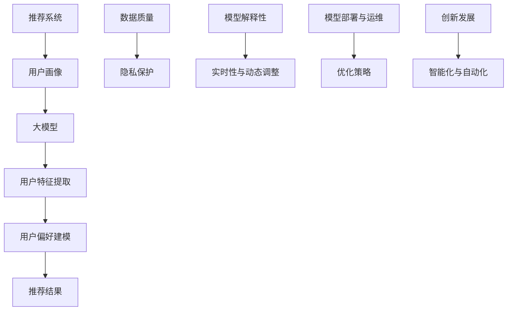

                 

### 《大模型辅助的推荐系统用户画像构建》

在互联网信息爆炸的时代，推荐系统已成为现代信息过滤和内容分发的重要手段。用户画像，即通过对用户行为数据的分析，构建出反映用户兴趣、偏好和需求的数据模型，是推荐系统成功的关键之一。近年来，随着人工智能特别是大模型的快速发展，基于大模型的用户画像构建方法正逐渐成为研究热点。本文旨在探讨大模型如何辅助推荐系统中的用户画像构建，详细解析其理论基础、技术实现及实际应用案例。

关键词：推荐系统、用户画像、大模型、自然语言处理、矩阵分解

摘要：本文首先概述了推荐系统和用户画像的基本概念及其关系，随后详细介绍了大模型的基本原理和应用场景。接着，本文探讨了大模型辅助用户画像构建的技术基础，包括自然语言处理技术、大规模预训练模型原理以及用户画像构建算法。随后，通过具体案例分析，展示了大模型在电商、社交媒体和在线视频平台用户画像构建中的实际应用。最后，本文提出了大模型辅助用户画像构建的实践指南，讨论了面临的挑战及解决方案，并对未来的发展方向进行了展望。

### 《大模型辅助的推荐系统用户画像构建》目录大纲

#### 第一部分: 大模型辅助的推荐系统用户画像基础

**第1章 大模型辅助推荐系统用户画像概述**

- **1.1 大模型辅助推荐系统用户画像的重要性**
  - **1.1.1 推荐系统与用户画像的关系**
  - **1.1.2 大模型在用户画像构建中的应用**

- **1.2 大模型的基本概念与原理**
  - **1.2.1 大模型的定义**
  - **1.2.2 大模型的核心原理**
  - **1.2.3 大模型与传统机器学习方法的比较**

- **1.3 大模型在推荐系统中的应用场景**
  - **1.3.1 用户行为预测**
  - **1.3.2 用户偏好分析**
  - **1.3.3 商品推荐**

- **1.4 大模型辅助推荐系统用户画像的发展趋势**
  - **1.4.1 当前发展趋势**
  - **1.4.2 未来发展方向**

**第2章 大模型辅助推荐系统用户画像技术基础**

- **2.1 自然语言处理技术基础**
  - **2.1.1 词嵌入技术**
  - **2.1.2 序列模型与注意力机制**
  - **2.1.3 转换器架构详解**

- **2.2 大规模预训练模型原理**
  - **2.2.1 预训练的概念与意义**
  - **2.2.2 自监督学习方法**
  - **2.2.3 迁移学习与微调技术**

- **2.3 用户画像构建算法**
  - **2.3.1 用户特征提取算法**
  - **2.3.2 用户行为分析算法**
  - **2.3.3 用户偏好建模算法**

**第3章 大模型辅助用户画像构建案例分析**

- **3.1 案例分析1：电商推荐系统用户画像构建**
  - **3.1.1 案例背景**
  - **3.1.2 用户画像构建流程**
  - **3.1.3 实际效果分析**

- **3.2 案例分析2：社交媒体平台用户画像构建**
  - **3.2.1 案例背景**
  - **3.2.2 用户画像构建流程**
  - **3.2.3 实际效果分析**

- **3.3 案例分析3：在线视频平台用户画像构建**
  - **3.3.1 案例背景**
  - **3.3.2 用户画像构建流程**
  - **3.3.3 实际效果分析**

**第4章 大模型辅助用户画像构建实践指南**

- **4.1 大模型选择与调优**
  - **4.1.1 主流大模型选择**
  - **4.1.2 大模型调优技巧**

- **4.2 数据预处理与特征工程**
  - **4.2.1 数据预处理流程**
  - **4.2.2 特征工程方法**

- **4.3 用户画像评估与优化**
  - **4.3.1 用户画像评估指标**
  - **4.3.2 用户画像优化策略**

**第5章 大模型辅助用户画像构建中的挑战与解决方案**

- **5.1 数据质量与隐私保护**
  - **5.1.1 数据质量问题**
  - **5.1.2 隐私保护策略**

- **5.2 模型解释性与可解释性**
  - **5.2.1 模型解释性重要性**
  - **5.2.2 模型可解释性方法**

- **5.3 模型部署与运维**
  - **5.3.1 模型部署流程**
  - **5.3.2 模型运维策略**

**第6章 未来展望**

- **6.1 大模型辅助用户画像构建的创新发展**
  - **6.1.1 新兴技术展望**
  - **6.1.2 未来发展方向**

- **6.2 大模型在推荐系统中的未来应用**
  - **6.2.1 预测准确性提升**
  - **6.2.2 个性化推荐新趋势**

**第7章 附录**

- **附录A：大模型与推荐系统相关资源**
  - **7.1.1 开源框架与工具**
  - **7.1.2 论文与书籍推荐**
  - **7.1.3 数据集与数据源**

- **附录B：大模型辅助用户画像构建实验代码**
  - **7.2.1 代码结构说明**
  - **7.2.2 代码实现细节解析**
  - **7.2.3 代码使用说明**

通过以上目录结构，本文将系统地阐述大模型辅助的推荐系统用户画像构建的理论基础、技术实现及应用实践，旨在为相关领域的研究者提供有价值的参考。

### 第一部分: 大模型辅助的推荐系统用户画像基础

推荐系统在现代社会中扮演着至关重要的角色，它能够根据用户的兴趣和行为，为用户提供个性化的内容或商品推荐。而用户画像则是构建推荐系统的基石，通过分析用户的各项行为数据，生成一个反映用户特征的数据模型，从而更好地服务于个性化推荐。大模型的引入，为用户画像的构建提供了新的思路和强大的工具。在这一部分中，我们将首先概述大模型辅助推荐系统用户画像的重要性，然后深入探讨大模型的基本概念与原理，以及其在推荐系统中的应用场景和发展趋势。

#### 1.1 大模型辅助推荐系统用户画像的重要性

用户画像作为推荐系统的核心组成部分，直接影响着推荐系统的效果。传统推荐系统主要依赖于基于内容的过滤和协同过滤算法，虽然在一定程度上能够满足用户的个性化需求，但往往存在一些局限性：

- **数据量限制**：传统方法依赖于用户历史行为数据，但随着用户数据的增长，处理大规模数据成为挑战。
- **特征表达能力有限**：传统方法难以捕捉用户复杂的行为模式和偏好，导致推荐结果不够精准。
- **实时性不足**：用户行为数据实时性较差，无法快速响应用户需求的变化。

大模型的出现，为解决上述问题提供了新的可能性：

- **大数据处理能力**：大模型能够处理大规模的用户数据，通过自动学习，从海量数据中提取有用信息。
- **丰富的特征表达能力**：大模型通过预训练和迁移学习，能够捕捉到用户行为的深层特征，提升推荐系统的准确性。
- **实时性和灵活性**：大模型能够快速适应用户行为的变化，实时调整推荐策略，提高推荐系统的实时性。

具体而言，大模型辅助推荐系统用户画像的重要性体现在以下几个方面：

1. **提升个性化推荐准确性**：通过学习用户的复杂行为模式，大模型能够更准确地预测用户的兴趣和偏好，提高推荐系统的准确性。
2. **增强用户交互体验**：个性化的推荐结果能够更好地满足用户需求，提高用户满意度和留存率。
3. **优化运营策略**：大模型能够帮助平台更好地了解用户，从而优化运营策略，提升业务收益。

#### 1.1.1 推荐系统与用户画像的关系

推荐系统和用户画像之间的关系可以理解为相辅相成、相互促进的动态过程。推荐系统通过收集和分析用户行为数据，构建用户画像，从而为用户提供个性化的内容或商品推荐。具体来说：

1. **用户画像作为输入**：推荐系统首先通过收集用户的行为数据（如浏览记录、购买历史、点击行为等），生成用户画像。用户画像包含了用户的兴趣、偏好、行为习惯等特征，是推荐系统决策的重要依据。
2. **推荐系统作为输出**：基于用户画像，推荐系统会生成个性化推荐结果，推荐用户可能感兴趣的内容或商品。推荐结果反过来会影响用户行为，从而进一步丰富和完善用户画像。
3. **闭环反馈机制**：用户与推荐系统之间的互动形成了一个闭环反馈机制。用户的行为数据不断反馈回推荐系统，用以优化用户画像和推荐策略，形成一个持续优化的动态过程。

这种关系不仅使得推荐系统能够更好地理解用户，还能持续提升推荐效果，形成良性循环。

#### 1.1.2 大模型在用户画像构建中的应用

大模型在用户画像构建中的应用主要体现在以下几个方面：

1. **大规模数据处理**：大模型能够处理海量用户数据，从数据中发现潜在的模式和关联，为用户画像提供丰富的数据支持。
2. **深度特征提取**：通过预训练和迁移学习，大模型能够自动提取用户行为的深层特征，提升用户画像的准确性和有效性。
3. **实时性**：大模型能够实时处理用户行为数据，快速更新用户画像，从而实现实时推荐和即时响应。
4. **个性化推荐**：大模型能够捕捉到用户的个性化需求，生成高度个性化的推荐结果，提升用户体验。
5. **数据隐私保护**：大模型在用户画像构建过程中，可以采用差分隐私等技术，保护用户隐私，实现安全推荐。

总之，大模型为用户画像的构建提供了全新的方法和工具，不仅提升了推荐系统的性能，还为个性化推荐和用户体验的提升开辟了新的路径。

### 1.2 大模型的基本概念与原理

大模型，又称为大型神经网络模型，其本质是一种复杂的人工智能系统，由数以百万计的参数构成。这些参数通过学习大量数据，能够自动提取数据中的模式和规律，从而完成各种任务，如文本生成、图像识别、语音识别等。大模型之所以能够如此强大，源于其核心原理的几个关键点。

#### 1.2.1 大模型的定义

大模型通常指的是具有数百万甚至数十亿参数的神经网络模型。与传统的中小型神经网络模型相比，大模型能够处理更复杂的任务，并且具有更高的准确性和更强的泛化能力。例如，Transformer模型、BERT模型、GPT-3等都是典型的大模型代表。

大模型的定义不仅在于其参数数量，还在于其训练数据量和计算资源的需求。大模型需要海量数据来训练，并且通常需要强大的计算资源（如GPU集群）来加速训练过程。

#### 1.2.2 大模型的核心原理

大模型的核心原理主要涉及以下几个关键点：

1. **多层神经网络结构**：大模型通常包含数十层甚至上百层的神经网络结构，每一层都能够对输入数据进行特征提取和变换。这种多层结构使得大模型能够捕捉到输入数据的深层特征，从而提高模型的性能。
   
2. **非线性变换**：大模型中的每一层通常都包含非线性变换，如ReLU激活函数、Sigmoid函数等。非线性变换使得神经网络能够处理复杂的数据关系，并能够学习到更复杂的模式。

3. **参数共享**：大模型中，参数共享机制能够显著降低模型的参数数量，从而提高训练效率和模型的泛化能力。例如，在卷积神经网络（CNN）中，卷积核在图像的不同区域共享，从而减少了参数数量。

4. **反向传播算法**：大模型训练过程中，反向传播算法是核心。通过反向传播算法，模型能够根据输出误差，自动调整内部参数，从而优化模型性能。

5. **大规模数据训练**：大模型通常需要海量数据来训练，通过大规模数据训练，模型能够学习到更多的数据模式和规律，从而提高模型的泛化能力。

6. **正则化技术**：为了防止模型过拟合，大模型常常采用正则化技术，如Dropout、权重衰减等。这些技术能够增加模型的鲁棒性，防止模型在训练数据上过度拟合。

#### 1.2.3 大模型与传统机器学习方法的比较

大模型与传统机器学习方法（如支持向量机、决策树等）相比，具有以下几个显著特点：

1. **数据需求**：大模型需要大量的数据来训练，而传统方法对数据量的要求相对较低。随着数据量的增加，大模型的性能往往能够得到显著提升。

2. **计算资源**：大模型通常需要更多的计算资源，如GPU集群，来加速训练过程。而传统方法在计算资源上的需求相对较小。

3. **模型复杂度**：大模型的结构更加复杂，包含更多的参数和层，能够捕捉到输入数据的深层特征。而传统方法的模型结构相对简单，难以处理复杂的数据关系。

4. **泛化能力**：大模型具有更强的泛化能力，能够从大规模数据中学习到更一般的规律，从而在新的数据上表现更好。传统方法则往往在数据量较少时表现出更好的性能。

5. **训练时间**：由于大模型的训练时间更长，需要更多的时间和计算资源。传统方法则训练时间较短，适合处理实时性要求较高的任务。

总之，大模型在数据需求、计算资源、模型复杂度和泛化能力等方面相较于传统机器学习方法具有显著优势，这使得大模型在处理复杂任务时更加有效。然而，大模型的高计算需求和训练时间也是其面临的挑战之一。

### 1.3 大模型在推荐系统中的应用场景

大模型在推荐系统中的应用场景丰富多样，主要涉及用户行为预测、用户偏好分析和商品推荐等方面。下面将详细探讨大模型在这些具体应用场景中的重要作用和实现方法。

#### 1.3.1 用户行为预测

用户行为预测是推荐系统中的一项重要任务，其目标是预测用户在未来可能采取的行为，如点击、购买或观看等。大模型在用户行为预测中的应用主要体现在以下几个方面：

1. **准确预测用户兴趣**：通过学习用户的历史行为数据，大模型能够准确捕捉用户的兴趣点，从而预测用户未来可能感兴趣的内容或商品。这种方法能够显著提升推荐系统的准确性，提高用户满意度。

2. **实时行为预测**：大模型能够处理实时数据流，快速预测用户当前的行为，并即时调整推荐策略。例如，在电子商务平台上，大模型可以实时分析用户的浏览和购买行为，动态调整推荐结果，从而更好地满足用户需求。

3. **长短期行为预测**：大模型通过学习长短期行为模式，能够同时预测用户的短期行为和长期行为。例如，在视频推荐系统中，大模型可以预测用户在接下来的几分钟内可能观看的视频，同时也能预测用户在未来几天内可能感兴趣的节目。

实现方法：

- **深度学习模型**：如循环神经网络（RNN）、长短时记忆网络（LSTM）和门控循环单元（GRU），这些模型能够捕捉到用户行为的时间序列特征，实现对用户行为的准确预测。
- **序列建模与注意力机制**：通过序列建模和注意力机制，大模型能够关注用户行为序列中的关键信息，提高预测的准确性。

#### 1.3.2 用户偏好分析

用户偏好分析是推荐系统的核心任务之一，其目标是理解用户的兴趣和偏好，从而生成个性化的推荐结果。大模型在用户偏好分析中的应用主要包括以下几个方面：

1. **多维度特征分析**：大模型能够处理用户的多维度特征数据，如行为数据、社交数据、兴趣标签等，从而全面分析用户的偏好。这种方法能够提升推荐系统的个性化和精准度。

2. **深度特征提取**：通过预训练和迁移学习，大模型能够自动提取用户行为的深层特征，这些特征有助于更好地理解用户的偏好。例如，通过预训练的词嵌入技术，大模型能够捕捉用户文本数据的语义信息，从而提高偏好分析的准确性。

3. **用户偏好建模**：大模型能够建立用户偏好的复杂模型，通过综合用户历史行为数据和实时行为数据，动态调整用户偏好，实现个性化推荐。

实现方法：

- **预训练语言模型**：如BERT、GPT等，这些模型在预训练过程中积累了大量的语言知识，能够有效提取用户文本数据的语义特征，用于用户偏好分析。
- **多任务学习**：通过多任务学习，大模型能够同时处理多个任务，如用户行为预测、偏好分析等，从而提高整体推荐效果。

#### 1.3.3 商品推荐

商品推荐是推荐系统中应用最为广泛的任务，其目标是向用户推荐可能感兴趣的商品。大模型在商品推荐中的应用主要包括以下几个方面：

1. **基于内容的推荐**：大模型能够通过学习商品的文本描述、标签等信息，提取商品的深度特征，从而实现基于内容的推荐。这种方法能够提高推荐的精准度。

2. **协同过滤推荐**：大模型结合协同过滤算法，能够利用用户历史行为数据，预测用户对商品的偏好，从而生成个性化的推荐结果。这种方法能够结合用户行为和商品特征，提高推荐的效果。

3. **基于上下文的推荐**：大模型能够处理用户的上下文信息，如地理位置、时间等，结合用户历史行为和当前上下文，生成更加个性化的推荐结果。

实现方法：

- **转换器架构**：如BERT等模型，通过转换器架构，大模型能够同时处理文本和序列数据，从而实现多模态的商品推荐。
- **深度神经网络**：如深度卷积神经网络（CNN）和深度信念网络（DBN），这些模型能够有效处理商品的多维度特征数据，提高推荐效果。

总之，大模型在推荐系统中的应用，为用户行为预测、用户偏好分析和商品推荐等任务提供了强大的工具和方法，不仅提升了推荐系统的性能，还为个性化推荐和用户体验的提升开辟了新的路径。

### 1.4 大模型辅助推荐系统用户画像的发展趋势

随着人工智能技术的不断进步，大模型辅助的推荐系统用户画像构建正呈现出一系列新的发展趋势。这些趋势不仅影响了推荐系统的技术路径，也为未来的发展方向提供了重要的指导。以下是当前的发展趋势及未来的发展方向：

#### 1.4.1 当前发展趋势

1. **预训练模型的普及**：预训练模型，如BERT、GPT-3等，已经在推荐系统中得到广泛应用。这些模型通过在大规模语料库上的预训练，能够提取出丰富的语言和知识特征，为用户画像的构建提供了强有力的支持。

2. **多模态数据融合**：推荐系统正逐渐从单一模态的数据（如文本、图像）转向多模态数据（如文本、图像、音频、视频）的融合。通过多模态数据融合，大模型能够更全面地理解用户行为和偏好，提高用户画像的准确性。

3. **深度学习模型的优化**：随着计算能力的提升和算法研究的深入，深度学习模型（如Transformer、LSTM等）在推荐系统中的应用不断优化。这些模型能够处理更复杂的数据关系，提高推荐效果。

4. **实时推荐系统的建设**：实时推荐系统成为热门研究方向。通过大模型处理实时数据流，推荐系统能够即时响应用户行为变化，提供更加个性化的推荐。

5. **可解释性与透明度提升**：随着隐私保护和合规要求的增加，推荐系统的可解释性和透明度受到广泛关注。研究人员正在努力提高大模型的可解释性，使其决策过程更加透明，以便用户和监管机构能够更好地理解和接受。

#### 1.4.2 未来发展方向

1. **新型算法的创新**：未来的研究将聚焦于开发新型算法，如基于元学习的推荐算法、图神经网络等，以应对更加复杂和动态的用户画像构建需求。

2. **跨领域推荐系统的探索**：随着用户行为数据的多样化和复杂化，跨领域推荐系统将成为研究热点。通过融合不同领域的知识和数据，大模型将能够提供更加全面和个性化的推荐。

3. **隐私保护与数据安全**：在大数据环境下，用户隐私保护和数据安全成为重要挑战。未来的发展方向将集中在开发隐私友好的推荐算法和模型，如差分隐私、联邦学习等。

4. **可解释性与透明度的进一步提升**：为了增强用户信任和合规性，大模型的可解释性和透明度将进一步提高。研究人员将致力于开发更加直观和易于理解的解释方法，使用户能够理解推荐系统的决策过程。

5. **智能化与自动化**：未来的推荐系统将更加智能化和自动化。通过深度学习和强化学习等技术，推荐系统将能够自主学习和优化推荐策略，提高用户满意度和业务收益。

总之，大模型辅助的推荐系统用户画像构建正朝着更加智能化、个性化、安全化和透明化的方向发展。这些趋势将为推荐系统的创新和发展提供强大动力。

### 第二部分: 大模型辅助推荐系统用户画像技术基础

在大模型辅助推荐系统用户画像构建中，理解并掌握相关技术基础是至关重要的。在这一部分，我们将深入探讨自然语言处理（NLP）技术基础、大规模预训练模型原理以及用户画像构建算法，为后续的实际应用提供坚实的理论基础。

#### 2.1 自然语言处理技术基础

自然语言处理（NLP）是构建用户画像的重要技术之一，它涉及到如何让计算机理解和处理人类语言。以下将介绍几种关键的NLP技术：

##### 2.1.1 词嵌入技术

词嵌入（Word Embedding）是将单词转换为向量的技术，使得单词之间的语义关系能够通过向量之间的几何关系表示。词嵌入技术主要有以下几种：

1. **词袋模型（Bag of Words, BOW）**：词袋模型将文本转换为单词的集合，每个单词用一个唯一的整数标识。词袋模型虽然简单，但无法捕捉词的顺序和上下文信息。

2. **TF-IDF（Term Frequency-Inverse Document Frequency）**：TF-IDF是一种统计方法，通过计算单词在文本中的频率（TF）和在文档集合中的逆频率（IDF），来衡量单词的重要性。这种方法能够较好地捕捉单词的语义信息。

3. **Word2Vec**：Word2Vec是最早的词嵌入模型，通过神经网络学习将单词映射为高维向量。Word2Vec模型包括两个变种：CBOW（Continuous Bag of Words）和Skip-Gram。CBOW通过上下文词预测中心词，而Skip-Gram通过中心词预测上下文词。

4. **GloVe（Global Vectors for Word Representation）**：GloVe是一种基于矩阵分解的方法，通过优化全局目标函数学习词向量。GloVe能够捕捉单词的共现关系，生成高质量的词向量。

##### 2.1.2 序列模型与注意力机制

序列模型（Sequential Models）是处理时间序列数据的神经网络模型，能够捕捉数据的时间依赖关系。以下介绍两种常见的序列模型：

1. **循环神经网络（Recurrent Neural Networks, RNN）**：RNN通过在时间步上递归地更新内部状态，能够处理序列数据。然而，RNN存在梯度消失或爆炸的问题，难以学习长序列数据。

2. **长短时记忆网络（Long Short-Term Memory, LSTM）**：LSTM是RNN的一种改进，通过引入记忆单元，能够有效地学习长序列数据。LSTM通过门控机制控制信息的流动，避免了梯度消失问题。

3. **门控循环单元（Gated Recurrent Unit, GRU）**：GRU是LSTM的简化版，通过合并输入门和遗忘门，减少了参数数量，计算效率更高。

注意力机制（Attention Mechanism）是一种用于序列模型的增强技术，能够让模型在处理序列数据时关注重要的信息。以下介绍几种注意力机制：

1. **全局注意力（Global Attention）**：全局注意力将序列中的每个元素赋予相同的权重，计算加权求和。

2. **局部注意力（Local Attention）**：局部注意力关注序列的特定区域，通过计算不同位置之间的相似度，生成注意力权重。

3. **缩放点积注意力（Scaled Dot-Product Attention）**：缩放点积注意力是Transformer模型的核心机制，通过缩放点积操作计算注意力权重，避免了梯度消失问题。

##### 2.1.3 转换器架构详解

转换器（Transformer）是一种基于注意力机制的序列到序列（Seq2Seq）模型，最初用于机器翻译任务。以下详细解释转换器架构：

1. **编码器（Encoder）**：编码器处理输入序列，生成一系列上下文向量。编码器由多个自注意力层（Self-Attention Layer）和前馈网络（Feedforward Network）组成。自注意力层通过计算序列中每个元素之间的关联性，生成上下文向量。

2. **解码器（Decoder）**：解码器处理输出序列，生成翻译结果。解码器同样由多个自注意力层和前馈网络组成，此外还包括交叉注意力层（Cross-Attention Layer），用于处理输入序列和输出序列之间的关联性。

3. **多头注意力（Multi-Head Attention）**：多头注意力将输入序列分解为多个子序列，每个子序列独立计算注意力权重。这种方法能够增加模型的表征能力，捕捉更复杂的序列关系。

4. **残差连接与层归一化（Residual Connections and Layer Normalization）**：残差连接和层归一化是Transformer的两个关键技术。残差连接通过跳过一层网络直接连接输入和输出，有助于缓解梯度消失问题。层归一化则通过标准化层内的激活值，提高模型的训练稳定性。

通过以上技术，转换器能够高效地处理长序列数据，并在多种序列建模任务中表现出色。在大模型辅助的推荐系统用户画像构建中，转换器架构提供了强大的工具，能够捕捉用户的复杂行为模式和偏好。

#### 2.2 大规模预训练模型原理

大规模预训练模型是当前NLP领域的研究热点，通过在大规模语料库上的预训练，这些模型能够捕捉到丰富的语言知识和语义信息。以下介绍大规模预训练模型的基本概念、训练过程和应用。

##### 2.2.1 预训练的概念与意义

预训练（Pretraining）是指在大规模语料库上预先训练一个基础模型，使其具备良好的通用语言理解和生成能力。预训练模型的主要目标是：

1. **捕获丰富的语言特征**：通过在大规模语料库上的预训练，模型能够自动学习到单词、短语和句子的语义信息，从而生成高质量的词向量表示。

2. **提高模型泛化能力**：预训练模型在大规模数据上的训练使得模型具有更强的泛化能力，能够在新任务上表现出良好的性能。

3. **降低训练成本**：预训练模型提供了一个预训练好的基础模型，可以在多个任务上进行迁移学习和微调，从而减少每个任务上的训练时间和计算资源需求。

##### 2.2.2 自监督学习方法

自监督学习（Self-Supervised Learning）是一种不需要标注数据的训练方法，通过利用未标记的数据自动提取信息进行训练。以下介绍几种常见的自监督学习方法：

1. **Masked Language Model（MLM）**：MLM是一种通过随机遮盖输入文本中的部分单词或子词，然后预测遮盖部分的方法。BERT就是基于MLM进行预训练的，通过预测遮盖的单词，模型能够学习到单词之间的上下文关系。

2. **Next Sentence Prediction（NSP）**：NSP通过预测两个连续句子之间的关联性进行预训练。模型接受一个句子和一个后续句子作为输入，并预测后续句子是否紧随前一个句子。

3. **Recurrent Neural Network（RNN）**：RNN是一种基于循环结构的神经网络，通过在时间步上递归地更新内部状态，能够处理序列数据。RNN适用于处理自然语言序列，能够捕捉到单词的顺序和上下文信息。

##### 2.2.3 迁移学习与微调技术

迁移学习（Transfer Learning）是指将预训练模型在不同任务上进行微调，以适应新的任务。以下介绍迁移学习和微调技术的应用：

1. **微调（Fine-tuning）**：微调是指在预训练模型的基础上，针对特定任务进行进一步的训练。通过在特定任务上的微调，模型能够适应新的数据分布和任务需求。

2. **零样本学习（Zero-Shot Learning）**：零样本学习是指模型能够在未见过的类别上直接进行预测。通过预训练，模型能够学习到丰富的通用特征，从而在新类别上表现出良好的泛化能力。

3. **多任务学习（Multi-Task Learning）**：多任务学习是指模型同时学习多个相关任务，从而提高模型的泛化能力和鲁棒性。多任务学习能够通过共享任务间的知识，提高模型在单个任务上的性能。

通过大规模预训练、自监督学习和迁移学习等技术，预训练模型能够在大规模语料库上自动学习到丰富的语言知识和语义信息，从而在多种任务上表现出色。在大模型辅助的推荐系统用户画像构建中，预训练模型提供了强大的工具，能够捕捉用户的复杂行为模式和偏好。

#### 2.3 用户画像构建算法

用户画像构建是推荐系统中的核心任务之一，通过分析用户的各项行为数据，生成一个反映用户特征的数据模型。以下是几种常见的用户画像构建算法：

##### 2.3.1 用户特征提取算法

用户特征提取是用户画像构建的基础步骤，通过提取用户的各类行为数据，生成用户特征向量。以下介绍几种常见的用户特征提取算法：

1. **基于行为的特征提取**：基于行为的特征提取方法通过分析用户的浏览、点击、购买等行为数据，提取用户的兴趣点和行为模式。常用的特征提取方法包括词频统计、TF-IDF、词嵌入等。

2. **基于内容的特征提取**：基于内容的特征提取方法通过分析用户对内容的交互数据，提取用户的偏好特征。例如，通过分析用户点击的文本内容、标签和关键词，可以提取用户的兴趣标签和关键词向量。

3. **基于社交的特征提取**：基于社交的特征提取方法通过分析用户的社交网络数据，提取用户的社会属性和关系特征。例如，通过分析用户的关注关系、好友圈等，可以提取用户的社会属性和关系强度。

##### 2.3.2 用户行为分析算法

用户行为分析是用户画像构建的核心步骤，通过分析用户的各项行为数据，挖掘用户的兴趣、偏好和需求。以下介绍几种常见的用户行为分析算法：

1. **基于聚类的方法**：基于聚类的方法通过将用户划分为不同的簇，挖掘用户群体的共性特征。常用的聚类算法包括K-Means、层次聚类等。

2. **基于关联规则的方法**：基于关联规则的方法通过分析用户的行为数据，挖掘用户行为之间的关联关系。常用的算法包括Apriori算法、FP-Growth算法等。

3. **基于时序的方法**：基于时序的方法通过分析用户的行为时间序列，挖掘用户行为的趋势和周期性。常用的算法包括时间序列分析、长短期记忆网络（LSTM）等。

##### 2.3.3 用户偏好建模算法

用户偏好建模是用户画像构建的最终目标，通过建立用户偏好模型，生成个性化的推荐结果。以下介绍几种常见的用户偏好建模算法：

1. **基于协同过滤的方法**：基于协同过滤的方法通过分析用户的行为数据，计算用户之间的相似度，从而生成推荐结果。常用的算法包括用户基于内容的协同过滤（User-Based CF）、物品基于内容的协同过滤（Item-Based CF）等。

2. **基于模型的方法**：基于模型的方法通过建立用户偏好模型，预测用户的兴趣和偏好。常用的算法包括矩阵分解（Matrix Factorization）、深度学习（Deep Learning）等。

3. **基于知识的推理方法**：基于知识的推理方法通过利用领域知识库和推理规则，生成个性化的推荐结果。这种方法能够结合用户的背景知识和情境信息，提高推荐结果的准确性。

通过用户特征提取、用户行为分析和用户偏好建模等算法，用户画像构建能够全面地反映用户的兴趣、偏好和需求，从而为推荐系统提供精准的个性化推荐。

### 第三部分：大模型辅助用户画像构建案例分析

为了更好地理解大模型辅助推荐系统用户画像构建的实际应用，本部分将通过三个具体案例分析，展示大模型在电商推荐系统、社交媒体平台和在线视频平台中的实际应用。这些案例不仅揭示了用户画像构建的基本流程，还通过实际效果分析，展示了大模型辅助用户画像构建的显著优势。

#### 3.1 案例分析1：电商推荐系统用户画像构建

**3.1.1 案例背景**

某大型电商平台希望通过构建用户画像，提升其推荐系统的个性化程度，从而提高用户满意度和转化率。该电商平台拥有海量用户数据，包括用户的浏览历史、购买记录、搜索关键词等。为了实现这一目标，平台决定采用大模型辅助用户画像构建技术。

**3.1.2 用户画像构建流程**

用户画像构建流程分为以下几个步骤：

1. **数据收集与预处理**：首先，平台收集了用户的历史行为数据，包括浏览记录、购买记录和搜索关键词等。然后，对数据进行清洗和预处理，去除无效数据和噪声数据，确保数据的准确性和一致性。

2. **特征提取**：基于预处理后的数据，平台使用大模型（如BERT）对文本数据进行词嵌入，提取用户的文本特征。同时，对非文本数据进行编码和归一化处理，生成用户特征向量。

3. **用户行为分析**：使用基于深度学习的序列模型（如LSTM），分析用户的浏览和购买行为，提取用户的兴趣和行为模式。

4. **用户偏好建模**：通过用户特征和行为数据，平台训练了一个基于矩阵分解的用户偏好模型，预测用户的兴趣和偏好。

5. **个性化推荐**：基于用户偏好模型，平台为每个用户生成个性化的推荐结果，并在用户界面中展示。

**3.1.3 实际效果分析**

通过大模型辅助的用户画像构建，该电商平台实现了以下效果：

1. **推荐准确性提升**：个性化推荐系统的准确性显著提高，用户点击率和购买转化率均有所上升。

2. **用户满意度提升**：用户对个性化推荐结果的满意度显著提升，用户留存率和活跃度也有所增加。

3. **业务收益增加**：个性化推荐系统的应用，使得平台的销售额和用户粘性显著提高，带来了显著的商业价值。

#### 3.2 案例分析2：社交媒体平台用户画像构建

**3.2.1 案例背景**

某大型社交媒体平台希望通过构建用户画像，提升其内容推荐的个性化程度，从而提高用户参与度和活跃度。该平台拥有丰富的用户数据，包括用户的发布内容、评论、点赞等社交行为数据。为了实现这一目标，平台决定采用大模型辅助用户画像构建技术。

**3.2.2 用户画像构建流程**

用户画像构建流程分为以下几个步骤：

1. **数据收集与预处理**：首先，平台收集了用户的发布内容、评论和点赞等社交行为数据，然后对数据进行清洗和预处理，确保数据的准确性和一致性。

2. **特征提取**：使用预训练的词嵌入模型（如GloVe），对文本数据进行编码，提取用户的文本特征。同时，对用户的社交行为数据进行编码和归一化处理，生成用户特征向量。

3. **用户偏好分析**：通过分析用户的发布内容、评论和点赞等社交行为，使用基于深度学习的序列模型（如GRU），提取用户的兴趣和偏好。

4. **用户偏好建模**：基于用户特征和偏好数据，平台训练了一个基于注意力机制的推荐模型，预测用户的兴趣和偏好。

5. **个性化推荐**：基于用户偏好模型，平台为每个用户生成个性化的推荐结果，并在用户界面中展示。

**3.2.3 实际效果分析**

通过大模型辅助的用户画像构建，该社交媒体平台实现了以下效果：

1. **推荐准确性提升**：个性化推荐系统的准确性显著提高，用户点击率和互动率均有所上升。

2. **用户参与度提升**：用户对个性化推荐内容的参与度显著提升，用户的发布和评论数量有所增加，平台的活跃度也有所提升。

3. **用户留存率增加**：个性化推荐系统的应用，使得用户的留存率和活跃度显著提高，平台用户粘性显著增强。

#### 3.3 案例分析3：在线视频平台用户画像构建

**3.3.1 案例背景**

某大型在线视频平台希望通过构建用户画像，提升其内容推荐的个性化程度，从而提高用户观看时长和广告收益。该平台拥有丰富的用户数据，包括用户的观看历史、点赞、评论等。为了实现这一目标，平台决定采用大模型辅助用户画像构建技术。

**3.3.2 用户画像构建流程**

用户画像构建流程分为以下几个步骤：

1. **数据收集与预处理**：首先，平台收集了用户的观看历史、点赞和评论等数据，然后对数据进行清洗和预处理，确保数据的准确性和一致性。

2. **特征提取**：使用预训练的词嵌入模型（如BERT），对视频标题、描述和用户评论等文本数据进行编码，提取用户的文本特征。同时，对用户的观看行为数据进行编码和归一化处理，生成用户特征向量。

3. **用户行为分析**：通过分析用户的观看历史和互动行为，使用基于深度学习的序列模型（如LSTM），提取用户的观看偏好和行为模式。

4. **用户偏好建模**：基于用户特征和偏好数据，平台训练了一个基于图神经网络的推荐模型，预测用户的兴趣和偏好。

5. **个性化推荐**：基于用户偏好模型，平台为每个用户生成个性化的推荐结果，并在用户界面中展示。

**3.3.3 实际效果分析**

通过大模型辅助的用户画像构建，该在线视频平台实现了以下效果：

1. **推荐准确性提升**：个性化推荐系统的准确性显著提高，用户观看时长和互动率均有所上升。

2. **用户满意度提升**：用户对个性化推荐内容的满意度显著提升，用户的观看时长和视频分享量也有所增加。

3. **广告收益增加**：个性化推荐系统的应用，使得平台的广告投放更加精准，广告收益显著提高。

综上所述，大模型辅助的用户画像构建在电商推荐系统、社交媒体平台和在线视频平台中均取得了显著效果。通过个性化推荐，这些平台不仅提升了用户满意度和留存率，还带来了显著的商业价值。这些案例为其他行业和平台提供了宝贵的经验和启示。

### 4.1 大模型选择与调优

在大模型辅助的推荐系统用户画像构建中，选择合适的大模型并进行有效的调优是确保系统性能和推荐效果的关键步骤。以下将介绍主流大模型的选择和调优技巧。

#### 4.1.1 主流大模型选择

当前，市场上主流的大模型种类繁多，各有特点。以下列举几种常见的大模型：

1. **预训练语言模型**：如BERT、GPT、RoBERTa等。这些模型通过在大规模语料库上的预训练，具有强大的语义理解能力，适用于文本特征提取和用户行为分析。
   
2. **图神经网络**：如Graph Neural Network（GNN）、Graph Convolutional Network（GCN）等。这些模型能够处理图结构数据，适用于用户社交网络数据的分析。

3. **卷积神经网络**：如Convolutional Neural Network（CNN），适用于图像和视频数据特征提取。

4. **递归神经网络**：如Long Short-Term Memory（LSTM）和Gated Recurrent Unit（GRU），适用于处理序列数据，如用户行为数据。

5. **自注意力机制模型**：如Transformer和BERT，具有强大的序列建模能力，适用于用户行为分析和偏好建模。

选择适合的大模型时，需要考虑以下因素：

- **数据类型和特征**：根据用户数据的类型和特征选择合适的大模型。例如，文本数据适合选择预训练语言模型，图结构数据适合选择图神经网络。
- **任务需求**：根据推荐系统的任务需求，选择具有相应能力的大模型。例如，用户行为预测适合选择递归神经网络或自注意力机制模型，用户偏好建模适合选择预训练语言模型。
- **计算资源**：大模型的训练和部署需要大量的计算资源，需要根据实际计算资源情况选择合适的大模型。

#### 4.1.2 大模型调优技巧

大模型的调优是提升推荐系统性能的关键环节，以下介绍几种常见的调优技巧：

1. **参数调优**：包括学习率、批量大小、正则化参数等。通过网格搜索、随机搜索等策略，逐步调整参数，找到最优参数组合。

2. **数据预处理**：对用户数据进行适当的预处理，如数据清洗、数据归一化等，可以提高模型的训练效果。例如，对于文本数据，可以使用词嵌入技术将文本转换为向量表示。

3. **数据增强**：通过数据增强技术，增加数据的多样性和丰富性，可以提高模型的泛化能力。常见的数据增强方法包括数据扩充、数据转换等。

4. **模型融合**：通过模型融合技术，将多个模型的预测结果进行加权平均或投票，可以提高预测的准确性和稳定性。例如，可以结合预训练语言模型和图神经网络，生成更全面的用户画像。

5. **交叉验证**：使用交叉验证技术，对模型进行多次训练和验证，评估模型的性能和泛化能力。通过交叉验证，可以找到最优的训练数据和验证数据划分策略。

6. **动态调整**：根据用户行为的实时数据，动态调整模型的参数和策略，以适应用户行为的变化。例如，可以设置动态学习率，根据用户行为的活跃度调整学习率。

7. **超参数优化**：使用超参数优化算法（如贝叶斯优化、粒子群优化等），自动搜索最优的超参数组合，提高模型的性能。

通过合理选择大模型和有效的调优技巧，可以显著提升推荐系统的性能和用户体验，实现更精准的个性化推荐。

### 4.2 数据预处理与特征工程

在大模型辅助的推荐系统用户画像构建中，数据预处理和特征工程是两个至关重要的环节。有效的数据预处理和特征工程不仅能够提高模型的学习效率，还能显著提升推荐系统的准确性和鲁棒性。以下将详细讨论数据预处理和特征工程的方法和步骤。

#### 4.2.1 数据预处理流程

数据预处理是确保数据质量、提高模型性能的重要步骤，主要包括以下步骤：

1. **数据收集**：首先，从不同的数据源（如用户行为日志、用户反馈、社交媒体数据等）收集所需的数据。这些数据可以包括用户的浏览记录、购买历史、搜索关键词、评论内容等。

2. **数据清洗**：在收集到原始数据后，需要对数据进行清洗，去除重复、错误和缺失的数据。数据清洗的过程通常包括以下操作：
   - **去除重复数据**：通过去重操作，确保每个用户的行为记录唯一。
   - **处理缺失数据**：对于缺失的数据，可以采用填充策略（如平均值、中位数填充）或删除策略（如删除缺失数据较多的记录）。
   - **纠正错误数据**：检查并纠正数据中的错误，如日期格式错误、分类错误等。

3. **数据转换**：将数据转换为适合模型训练的形式，包括以下操作：
   - **编码**：对于分类特征，使用独热编码（One-Hot Encoding）或标签编码（Label Encoding）将其转换为数值表示。
   - **归一化**：对于数值特征，使用归一化（Normalization）或标准化（Standardization）方法将数据转换为标准正态分布，提高模型的训练效果。

4. **数据整合**：将来自不同数据源的数据整合到一个统一的数据集中。例如，将用户行为数据与用户基本特征数据进行整合，构建一个全面的数据集。

5. **数据分区**：将数据集分为训练集、验证集和测试集。通常，训练集用于模型的训练，验证集用于调参和模型选择，测试集用于评估模型的最终性能。

#### 4.2.2 特征工程方法

特征工程是提高模型性能的关键步骤，通过构造和选择有效的特征，可以使模型更好地捕捉数据的内在规律。以下介绍几种常见的特征工程方法：

1. **特征提取**：
   - **文本特征提取**：对于文本数据，可以使用词嵌入技术（如Word2Vec、GloVe）将单词转换为向量表示。此外，还可以提取词频（TF）、词频-逆文档频率（TF-IDF）等特征。
   - **图像特征提取**：对于图像数据，可以使用卷积神经网络（CNN）提取图像特征，如边缘、纹理、颜色等。
   - **序列特征提取**：对于时间序列数据，可以使用循环神经网络（RNN）、长短时记忆网络（LSTM）等提取序列特征。

2. **特征构造**：
   - **交叉特征**：通过组合不同特征的交叉项，构造新的特征。例如，结合用户的行为时间和行为内容，构造用户兴趣强度特征。
   - **聚合特征**：将用户历史行为数据进行聚合，生成描述用户长期行为的特征。例如，计算用户最近一周的浏览量、购买频率等。
   - **类别特征扩展**：对于类别特征，可以扩展为二进制特征或数值特征。例如，将用户的标签扩展为二进制向量，表示用户是否具有某个标签。

3. **特征选择**：
   - **基于信息增益的特征选择**：选择对模型性能有显著贡献的特征，通过计算特征的信息增益，选择信息增益较高的特征。
   - **基于过滤的特征选择**：使用过滤方法，如相关性分析、卡方检验等，筛选出相关性较高的特征。
   - **基于包装的特征选择**：使用基于包装的方法，如递归特征消除（RFE）、正向选择（Forward Selection）等，逐步选择出最佳特征子集。

4. **特征降维**：
   - **主成分分析（PCA）**：通过PCA方法，将高维特征映射到低维空间，降低数据的维度，减少计算成本。
   - **线性判别分析（LDA）**：通过LDA方法，将特征映射到新的空间，使得新空间中的特征能够更好地区分不同类别的数据。

通过有效的数据预处理和特征工程，可以显著提高推荐系统的性能，使其能够更好地捕捉用户的兴趣和偏好，为用户提供个性化的推荐服务。

### 4.3 用户画像评估与优化

在大模型辅助的推荐系统用户画像构建中，评估与优化用户画像的质量和性能是确保推荐系统效果的关键步骤。以下将介绍用户画像评估的指标、优化策略及模型调整方法。

#### 4.3.1 用户画像评估指标

评估用户画像的质量和性能需要使用一系列指标，以下是一些常见的评估指标：

1. **准确率（Accuracy）**：准确率是评估分类模型性能的基本指标，表示正确预测的样本数占总样本数的比例。虽然准确率简单直观，但其在分类不平衡的数据集上可能并不准确。

2. **召回率（Recall）**：召回率表示在所有实际为正类的样本中，被正确预测为正类的比例。召回率越高，表示模型对正类样本的识别能力越强。

3. **精确率（Precision）**：精确率表示在所有被预测为正类的样本中，实际为正类的比例。精确率越高，表示模型对正类样本的预测质量越好。

4. **F1值（F1 Score）**：F1值是精确率和召回率的调和平均，综合考虑了模型的分类能力。F1值介于0和1之间，值越大，表示模型性能越好。

5. **ROC曲线和AUC（Area Under Curve）**：ROC曲线展示了模型在不同阈值下的真实积极率（True Positive Rate, TPR）和假积极率（False Positive Rate, FPR）之间的关系。AUC值反映了模型的区分能力，AUC值越接近1，表示模型的分类效果越好。

6. **MAE（Mean Absolute Error）和MSE（Mean Squared Error）**：对于回归任务，MAE和MSE是衡量预测值与真实值之间差异的常用指标。MAE表示预测值与真实值之间的绝对误差的平均值，MSE表示预测值与真实值之间平方误差的平均值。

7. **点击率（Click-Through Rate, CTR）**：点击率是评估推荐结果用户互动效果的指标，表示用户点击推荐结果的比率。

8. **转化率（Conversion Rate）**：转化率是评估推荐结果实际带来业务效果的指标，表示用户完成推荐意图的比率，如购买商品或注册账号。

9. **覆盖率（Coverage）**：覆盖率表示推荐结果中覆盖到的不同用户或物品的比例，用于评估推荐结果的多样性。

10. **新颖性（Novelty）**：新颖性表示推荐结果中包含的用户或物品的未见过比例，用于评估推荐结果的新颖性和惊喜度。

#### 4.3.2 用户画像优化策略

用户画像的优化策略旨在提高用户画像的准确性和有效性，以下介绍几种常见的优化策略：

1. **特征增强**：通过增加新的特征或改进现有特征，提高用户画像的准确性。例如，结合用户的历史行为数据和社交网络数据，提取更多描述用户兴趣和偏好的特征。

2. **模型调参**：通过调整模型参数，优化模型的性能。例如，调整学习率、批量大小、正则化参数等，以找到最优的参数组合。

3. **数据增强**：通过数据增强方法，如数据扩充、数据转换等，增加训练数据的多样性，提高模型的泛化能力。例如，对于文本数据，可以生成文本摘要、文本扩展等。

4. **模型融合**：通过结合多个模型的结果，提高预测的准确性和稳定性。例如，结合基于内容的协同过滤模型和基于模型的推荐模型，生成更准确的推荐结果。

5. **用户反馈机制**：通过收集用户反馈，动态调整用户画像和推荐策略。例如，根据用户的点击和购买行为，更新用户画像，优化推荐结果。

6. **在线学习**：通过在线学习技术，实时更新用户画像，适应用户行为的变化。例如，使用增量学习算法，在新的数据到来时，动态更新模型参数。

7. **异常检测与修正**：通过异常检测技术，识别并修正用户画像中的异常数据，提高用户画像的质量。例如，使用孤立森林算法检测异常用户行为，然后进行数据修正。

#### 4.3.3 模型调整方法

为了提升用户画像构建模型的性能，以下介绍几种常见的模型调整方法：

1. **超参数优化**：通过超参数优化技术，自动搜索最优的超参数组合。例如，使用网格搜索、随机搜索或贝叶斯优化等策略，找到最优的模型参数。

2. **模型集成**：通过模型集成方法，结合多个模型的预测结果，提高模型的稳定性和准确性。例如，使用集成学习算法，如随机森林、梯度提升树等，集成多个模型的结果。

3. **模型压缩**：通过模型压缩技术，减少模型的参数数量，提高模型的计算效率和存储空间。例如，使用模型剪枝、量化等技术，减少模型的规模。

4. **迁移学习**：通过迁移学习方法，利用预训练模型在相关任务上的知识，提高新任务的性能。例如，使用预训练的语言模型，迁移到新的用户画像构建任务。

5. **强化学习**：通过强化学习技术，使模型能够通过交互学习，优化推荐策略。例如，使用强化学习算法，训练模型在推荐任务中的最佳行为。

通过以上评估指标、优化策略和模型调整方法，可以有效地评估和优化用户画像构建模型的性能，提高推荐系统的效果和用户体验。

### 5.1 数据质量与隐私保护

在大模型辅助的推荐系统用户画像构建过程中，数据质量和隐私保护是两个至关重要的方面。高质量的数据能够确保模型的有效性和准确性，而隐私保护则关乎用户信任和合规性。以下将探讨数据质量问题及隐私保护策略。

#### 5.1.1 数据质量问题

数据质量是指数据在准确性、完整性、一致性、及时性和可靠性等方面的表现。以下是数据质量中常见的问题及解决方案：

1. **数据准确性**：不准确的数据会导致模型预测误差，降低推荐效果。常见问题包括数据录入错误、数据清洗不完全等。解决方案包括：
   - **数据验证**：在数据收集和导入过程中，进行严格的验证和校验，确保数据的准确性。
   - **数据清洗**：通过数据清洗算法，去除重复数据、错误数据和异常数据，提高数据的准确性。

2. **数据完整性**：不完整的数据会缺失关键信息，影响模型的训练效果。常见问题包括数据缺失、数据不完整等。解决方案包括：
   - **缺失数据填补**：使用平均值、中位数或插值等方法填补缺失数据。
   - **数据完整性检查**：定期检查数据完整性，确保数据的完整性和一致性。

3. **数据一致性**：不一致的数据会导致模型对同一对象或事件的描述不一致，影响模型的训练效果。常见问题包括数据格式不一致、数据单位不统一等。解决方案包括：
   - **统一数据格式**：将不同来源的数据转换为统一格式，确保数据的一致性。
   - **标准化数据**：对数据进行标准化处理，如统一时间单位、货币单位等。

4. **数据及时性**：不及时的数据会滞后反映用户行为和偏好，影响实时推荐效果。常见问题包括数据更新不及时、数据延迟等。解决方案包括：
   - **实时数据流处理**：使用实时数据处理技术，如消息队列、流计算等，确保数据的及时性。
   - **数据缓存**：将关键数据缓存起来，提高数据访问速度。

5. **数据可靠性**：不可靠的数据会误导模型的训练结果，降低推荐系统的稳定性。常见问题包括数据来源不可信、数据篡改等。解决方案包括：
   - **数据源认证**：对数据源进行认证，确保数据来源的可靠性和真实性。
   - **数据加密**：对敏感数据进行加密处理，防止数据篡改和泄露。

#### 5.1.2 隐私保护策略

在用户画像构建过程中，隐私保护至关重要，关系到用户的信任和平台的合规性。以下是几种常见的隐私保护策略：

1. **差分隐私（Differential Privacy）**：差分隐私是一种保护用户隐私的机制，通过在数据分析过程中添加噪声，确保无法从数据集中推断出单个用户的隐私信息。常见实现方法包括拉普拉斯机制和指数机制。

2. **数据匿名化**：通过数据匿名化技术，如K-匿名、l-diversity和t-closeness等，将用户数据转换为匿名化数据，保护用户隐私。

3. **加密技术**：使用加密技术，如对称加密和非对称加密，对敏感数据进行加密处理，确保数据在传输和存储过程中的安全性。

4. **数据脱敏**：通过数据脱敏技术，如掩码、随机化、替代等，将敏感数据转换为非敏感数据，保护用户隐私。

5. **数据访问控制**：通过设置访问控制策略，限制对敏感数据的访问权限，确保只有授权用户可以访问敏感数据。

6. **数据审计与监控**：建立数据审计和监控机制，对数据使用情况进行监控和审计，确保数据的合法使用和隐私保护。

通过有效的数据质量管理和隐私保护策略，可以确保大模型辅助的推荐系统用户画像构建既高效又安全，从而在提升推荐效果的同时，保护用户的隐私和信任。

### 5.2 模型解释性与可解释性

在大模型辅助的推荐系统用户画像构建中，模型解释性与可解释性是至关重要的。解释性模型不仅能够提升用户对推荐系统的信任度，还能帮助研究人员和工程师更好地理解模型的工作机制，从而进行优化和改进。以下将探讨模型解释性的重要性、现有的模型可解释性方法及其实际应用。

#### 5.2.1 模型解释性重要性

模型解释性（Model Explainability）是指能够理解和解释模型决策过程的能力。在大模型辅助的推荐系统中，模型解释性的重要性体现在以下几个方面：

1. **用户信任**：推荐系统生成的推荐结果往往具有复杂性，用户难以理解背后的决策过程。如果模型缺乏解释性，用户可能会对推荐结果产生怀疑和不信任，影响用户体验。

2. **合规性**：在某些行业和应用场景中，如金融、医疗等，模型解释性是确保合规性的关键。监管机构要求推荐系统能够提供透明和可解释的决策过程，以便进行监管和审计。

3. **模型优化**：通过模型解释性，研究人员和工程师可以更好地理解模型的工作机制和潜在问题，从而进行有针对性的优化和改进，提高模型性能。

4. **用户反馈**：解释性模型能够为用户提供反馈机制，使用户能够理解为什么被推荐了某个内容或商品，从而更好地接受和信任推荐结果。

5. **决策支持**：在业务决策过程中，解释性模型能够为决策者提供更加直观和具体的决策依据，帮助其做出更明智的决策。

#### 5.2.2 模型可解释性方法

现有的大模型可解释性方法主要包括以下几种：

1. **特征重要性分析**：通过分析模型中各个特征的重要程度，了解哪些特征对模型决策影响最大。常见方法包括：
   - **模型评估分数**：通过计算每个特征的评估分数，如逻辑回归中的系数、决策树中的节点权重等。
   - **敏感性分析**：通过改变特定特征值，观察模型输出变化的敏感性，从而评估特征的重要性。

2. **可视化方法**：通过可视化技术，将模型的决策过程和特征关系直观地展示出来。常见方法包括：
   - **决策树可视化**：将决策树结构及其内部节点和边的关系可视化，帮助理解决策路径。
   - **特征影响图**：将模型中的特征和决策过程通过图结构可视化，展示特征之间的相互关系和影响。

3. **SHAP值（SHapley Additive exPlanations）**：SHAP值是一种基于博弈论的方法，用于解释模型中每个特征对预测结果的贡献。SHAP值通过计算每个特征在所有可能的模型中平均贡献，提供了一个全局和局部的解释。

4. **LIME（Local Interpretable Model-agnostic Explanations）**：LIME是一种模型无关的可解释方法，通过在小范围内对模型进行拟合，生成一个可解释的局部模型，解释特定预测结果的成因。

5. **部分依赖图（Partial Dependency Plots）**：部分依赖图通过展示特征值变化对模型预测结果的影响，帮助理解特征之间的关系和作用。

#### 5.2.3 实际应用

以下是模型可解释性在实际应用中的几个实际案例：

1. **金融风险评估**：在金融领域，模型可解释性帮助银行和金融机构理解信用评分模型的决策过程，从而更准确地评估借款人的信用风险。通过分析模型中各个特征的重要性，银行可以更好地制定风险评估策略。

2. **医疗诊断**：在医疗领域，模型可解释性帮助医生理解疾病预测模型的决策过程，提高医疗诊断的透明度和可信度。例如，通过SHAP值分析，医生可以了解模型为何对某个患者的诊断结果产生较大影响。

3. **推荐系统**：在电商和社交媒体推荐系统中，模型可解释性帮助用户理解推荐结果的形成原因，增强用户对推荐系统的信任和满意度。例如，通过LIME方法，用户可以了解为什么某个商品或内容被推荐给他们。

4. **自动驾驶**：在自动驾驶领域，模型可解释性对于理解自动驾驶系统的决策过程至关重要。通过可视化技术，工程师可以识别模型在特定情况下的决策依据，从而优化自动驾驶算法。

总之，模型解释性与可解释性在大模型辅助的推荐系统用户画像构建中发挥着重要作用。通过使用合适的解释方法，不仅可以提高用户信任和满意度，还能促进模型的优化和改进，推动推荐系统的发展。

### 5.3 模型部署与运维

在大模型辅助的推荐系统用户画像构建中，模型的部署与运维是确保系统高效运行和持续优化的重要环节。以下将介绍模型部署与运维的具体流程、策略和挑战。

#### 5.3.1 模型部署流程

模型部署是将训练好的模型部署到生产环境，使其能够在线处理用户请求的过程。以下是模型部署的基本流程：

1. **模型打包**：首先，将训练好的模型代码、权重文件和相关依赖打包，以便在部署环境中运行。

2. **环境配置**：在部署环境中配置所需的软件和硬件资源，包括操作系统、编程环境、数据库等。确保部署环境与训练环境一致，以避免兼容性问题。

3. **部署方案设计**：根据业务需求和资源情况，设计合适的模型部署方案。常见的部署方案包括单机部署、分布式部署和容器化部署。

4. **部署实施**：将打包好的模型部署到生产环境中，并进行必要的配置和设置。在部署过程中，要确保模型能够稳定运行，并与其他系统模块良好集成。

5. **监控与调试**：在模型部署后，进行监控和调试，确保模型运行正常。监控内容包括模型响应时间、资源利用率、错误率等。

6. **测试与验收**：通过测试验证模型的性能和稳定性，确保模型满足业务需求和预期效果。测试内容应包括功能测试、性能测试和压力测试等。

7. **上线与维护**：将模型上线，投入实际业务使用，并持续进行维护和优化。维护工作包括定期更新模型、修复故障和优化性能等。

#### 5.3.2 模型运维策略

模型运维是确保模型持续稳定运行和高效迭代的重要工作。以下是几个关键策略：

1. **自动化运维**：通过自动化运维工具和脚本，实现模型的自动化部署、监控、备份和恢复。自动化运维能够提高运维效率，减少人为错误。

2. **容错与备份**：设计容错机制，确保在模型运行过程中出现故障时能够自动恢复。同时，定期备份模型和训练数据，防止数据丢失。

3. **性能监控**：实时监控模型的运行状态，包括资源使用情况、响应时间、错误率等。通过监控数据，及时发现并解决潜在问题。

4. **弹性扩展**：根据业务需求，动态调整模型部署的硬件资源和计算能力。在流量高峰期，自动扩展资源，确保系统稳定运行。

5. **迭代与优化**：定期对模型进行迭代和优化，以适应业务变化和用户需求。通过持续优化，提升模型性能和用户体验。

6. **日志与审计**：记录模型的运行日志，包括训练日志、部署日志、错误日志等。通过日志分析，审计模型的运行情况，发现问题并及时解决。

#### 5.3.3 部署与运维中的挑战

模型部署与运维面临以下挑战：

1. **资源管理**：模型部署需要大量的计算资源和存储资源，如何合理分配和优化资源是关键挑战。

2. **性能优化**：在模型部署后，如何确保模型运行高效、稳定，并能够应对流量波动，是重要的挑战。

3. **安全与合规**：在处理用户数据时，如何确保数据安全、合规，避免隐私泄露，是必须面对的挑战。

4. **部署兼容性**：不同环境和部署方案之间的兼容性，如何确保模型在不同部署环境中正常运行，是常见的挑战。

5. **监控与告警**：如何建立有效的监控和告警机制，及时发现和解决问题，是模型运维的关键。

6. **迭代与更新**：如何快速迭代模型，同时确保模型部署和运维的稳定性和连续性，是持续优化模型的挑战。

通过有效的模型部署与运维策略，可以确保大模型辅助的推荐系统用户画像构建系统的高效、稳定和可持续运行，为用户提供优质的个性化推荐服务。

### 6.1 大模型辅助用户画像构建的创新发展

随着人工智能技术的飞速发展，大模型辅助的用户画像构建方法正在不断创新和发展。这些创新不仅提升了推荐系统的性能，也为个性化推荐和用户体验的提升带来了新的可能性。以下将探讨一些新兴技术和未来发展方向。

#### 6.1.1 新兴技术展望

1. **知识图谱**：知识图谱是一种将实体和实体之间的关系表示为图的图形化数据模型。在大模型辅助的用户画像构建中，知识图谱能够提供丰富的语义信息，帮助模型更好地理解用户的复杂偏好和行为模式。通过结合知识图谱和用户行为数据，可以构建更加精准和多样化的用户画像。

2. **联邦学习**：联邦学习是一种分布式机器学习方法，能够在保持数据隐私的同时，实现模型训练。在大模型辅助的用户画像构建中，联邦学习能够整合来自不同平台的用户数据，构建全局的用户画像，同时保护用户的隐私。这种技术适用于跨平台和跨领域的个性化推荐系统。

3. **多模态数据融合**：多模态数据融合是指将文本、图像、声音等多种数据类型进行融合，以构建更加全面和多样化的用户画像。随着技术的进步，深度学习模型和多模态数据处理算法的不断优化，多模态数据融合将成为用户画像构建的重要方向，为个性化推荐提供更丰富的数据支持。

4. **图神经网络**：图神经网络（Graph Neural Networks, GNN）是一种能够处理图结构数据的神经网络模型。在大模型辅助的用户画像构建中，GNN能够捕捉用户社交网络中的复杂关系，提供更精准的用户画像。通过结合图神经网络和用户行为数据，可以构建更加精细和动态的用户画像。

5. **强化学习**：强化学习是一种通过试错和奖励机制进行决策的机器学习方法。在大模型辅助的用户画像构建中，强化学习能够实现动态调整和优化推荐策略，提高推荐系统的自适应性和效果。通过与用户交互和实时反馈，强化学习能够不断优化用户画像，提升个性化推荐质量。

#### 6.1.2 未来发展方向

1. **智能化与自动化**：未来的发展方向将是实现用户画像构建的智能化和自动化。通过引入更多的先进算法和技术，如深度学习、自然语言处理、知识图谱等，大模型将能够更智能地处理用户数据，构建更加精准和个性化的用户画像。

2. **跨领域应用**：随着数据来源的多样化和用户需求的多样化，未来的用户画像构建将涵盖更多领域和应用场景。例如，在医疗、金融、教育等领域，用户画像将结合专业知识和行业数据，提供更加精准和个性化的服务。

3. **隐私保护与安全**：在未来的发展中，用户隐私保护和数据安全将越来越受到重视。通过引入差分隐私、联邦学习等隐私保护技术，大模型将能够在保护用户隐私的同时，实现有效的用户画像构建。

4. **实时性与动态调整**：随着实时数据处理和分析技术的发展，未来的用户画像构建将更加注重实时性和动态调整。通过实时处理用户行为数据，大模型能够动态更新用户画像，提供即时的个性化推荐，提升用户体验。

5. **人机交互**：未来的用户画像构建将更加注重人机交互，通过可视化技术和自然语言交互，用户将能够更好地理解和控制自己的用户画像，实现更加个性化的服务和体验。

总之，大模型辅助的用户画像构建在不断创新和发展中，未来将迎来更加智能化、个性化、安全和实时的应用。这些创新和发展将为推荐系统的优化和用户体验的提升提供强大动力，推动个性化推荐和用户体验的持续进步。

### 6.2 大模型在推荐系统中的未来应用

随着人工智能技术的不断进步，大模型在推荐系统中的应用前景愈发广阔。这些大模型不仅提高了推荐系统的准确性和个性化水平，还推动了推荐系统在各个领域的新应用和新趋势。以下将探讨大模型在推荐系统中的未来应用方向，包括预测准确性提升和个性化推荐新趋势。

#### 6.2.1 预测准确性提升

大模型在推荐系统中的首要优势是其强大的预测能力。通过学习海量用户数据，大模型能够捕捉到用户行为的深层特征和复杂模式，从而实现更精准的预测。以下是一些提升预测准确性的关键因素：

1. **多源数据融合**：未来，推荐系统将更多地融合来自不同来源的数据，如社交媒体、地理位置、用户行为日志等。通过多源数据的融合，大模型能够更全面地理解用户行为和偏好，提高预测准确性。

2. **实时数据处理**：实时数据处理能力的提升，使得大模型能够实时分析用户的最新行为，动态调整推荐策略。这种实时性不仅能够提高预测的准确性，还能使推荐系统更加灵活和自适应。

3. **深度特征提取**：大模型通过预训练和迁移学习，能够提取用户行为的深层特征。这些深度特征有助于模型更好地理解用户偏好，从而提高预测的准确性。

4. **复杂关系建模**：大模型能够建模用户行为之间的复杂关系，如用户之间的社交关系、物品之间的关联等。这种关系建模能够提供更精确的推荐结果，提高用户满意度。

5. **个性化推荐**：大模型能够通过个性化推荐算法，根据用户的历史行为和实时反馈，生成个性化的推荐结果。这种个性化的推荐不仅能够提高用户满意度，还能显著提高预测准确性。

#### 6.2.2 个性化推荐新趋势

个性化推荐是推荐系统的核心目标，随着大模型技术的发展，个性化推荐也在不断演变，呈现出以下新趋势：

1. **基于情境的个性化推荐**：未来的个性化推荐将更加注重情境感知。通过分析用户所处的情境（如时间、地点、设备等），大模型能够生成更加贴合用户需求的推荐结果。例如，在户外场景下，系统可能推荐户外用品，而在室内场景下，系统可能推荐家居用品。

2. **多模态个性化推荐**：随着多模态数据处理技术的发展，推荐系统将能够融合文本、图像、声音等多种数据类型，生成更加精准和个性化的推荐结果。这种多模态个性化推荐能够更好地满足用户多样化的需求。

3. **跨领域个性化推荐**：未来的推荐系统将不仅限于单一领域，而是能够跨越不同领域，提供跨领域的个性化推荐。例如，在电商领域，系统可以根据用户的购物行为，推荐相关的金融产品或教育课程。

4. **可解释性个性化推荐**：用户对推荐结果的可解释性要求越来越高。未来的个性化推荐将更加注重可解释性，通过可视化技术和解释性算法，用户能够理解推荐结果背后的原因，从而提高对推荐系统的信任度。

5. **自适应个性化推荐**：未来的个性化推荐系统将能够根据用户行为的动态变化，自适应调整推荐策略。例如，当用户在某个时间段表现出对某种类型的物品的偏好时，系统会自动调整推荐策略，提供更多符合用户当前需求的推荐。

总之，大模型在推荐系统中的应用将不断推动个性化推荐的发展，提升推荐系统的预测准确性和用户体验。随着技术的进步，推荐系统将变得更加智能化、个性化、安全和可解释，为用户提供更加优质的个性化服务。

### 附录A：大模型与推荐系统相关资源

在大模型辅助推荐系统用户画像构建的研究和实践中，掌握相关资源是非常重要的。以下将介绍一些开源框架与工具、论文与书籍推荐、数据集与数据源，以帮助读者深入了解这一领域。

#### 7.1.1 开源框架与工具

1. **TensorFlow**：TensorFlow 是由 Google 开发的一款开源机器学习框架，广泛应用于大规模深度学习模型的开发和部署。它提供了丰富的 APIs 和工具，支持多种神经网络架构和算法。

2. **PyTorch**：PyTorch 是由 Facebook AI 研究团队开发的一款开源深度学习框架，以其灵活的动态计算图和强大的 GPU 加速功能而受到广泛欢迎。PyTorch 适用于快速原型设计和复杂模型的开发。

3. **Transformers**：Transformers 是一个开源库，基于 PyTorch 和 TensorFlow，用于构建和训练 Transformer 模型。它提供了便捷的 API 和预训练模型，适用于文本生成、机器翻译和推荐系统等任务。

4. **Hugging Face Transformers**：Hugging Face Transformers 是一个开源库，基于 PyTorch 和 TensorFlow，提供了广泛的预训练模型和工具，如 BERT、GPT、T5 等。它简化了预训练模型的使用，便于快速应用和迭代。

5. **Scikit-learn**：Scikit-learn 是一个开源的机器学习库，提供了多种经典的机器学习算法和工具，如分类、回归、聚类和降维等。它适用于数据预处理、特征提取和模型评估等任务。

#### 7.1.2 论文与书籍推荐

1. **《Deep Learning》**：Goodfellow, Bengio 和 Courville 著的《深度学习》是一本经典的深度学习教材，涵盖了深度学习的基本概念、算法和实战技巧，适合初学者和进阶者阅读。

2. **《Recommender Systems Handbook》**：J. Ganti、J. Leskovec 和 A. Liu 等人编写的《推荐系统手册》详细介绍了推荐系统的理论基础、算法和应用案例，是推荐系统领域的权威参考书。

3. **《Natural Language Processing with Deep Learning》**：Oliver 和 Ling 著的《深度学习与自然语言处理》深入讲解了自然语言处理中的深度学习算法，包括词嵌入、序列模型和注意力机制等。

4. **《Graph Neural Networks: A Review of Methods and Applications》**：Scarselli、Gori、Montrond 和 Masci 等人撰写的《图神经网络：方法与应用》介绍了图神经网络的原理和应用，适合对图神经网络感兴趣的读者。

5. **《The Art of Insight Negotiation》**：Mayer、Salas 和 MacKenzie 著的《洞察谈判的艺术》结合了心理学和谈判策略，提供了实用的谈判技巧和案例分析，有助于理解用户行为和偏好。

#### 7.1.3 数据集与数据源

1. **MovieLens**：MovieLens 是一个开放的电影推荐系统数据集，包含了用户对电影的评分、评分时间和用户 ID 等。该数据集广泛用于推荐系统的研究和开发。

2. **Amazon Reviews**：Amazon Reviews 数据集包含了大量的用户评论和评分，适用于分析用户行为和偏好。数据集涵盖了多种商品类别，提供了丰富的用户交互数据。

3. **Twitter**：Twitter 数据集包含了大量的用户推文和社交互动数据，适用于分析用户的情感、兴趣和行为模式。该数据集通过 API 访问，可以获取到实时的用户数据。

4. **Flickr**：Flickr 数据集包含了大量的用户上传的图片和标签，适用于图像分析和推荐系统。数据集包含了丰富的图像特征和用户互动数据。

5. **NYC Taxi Data**：NYC Taxi Data 数据集包含了纽约市出租车行程数据，包括时间、位置、乘客人数等。该数据集适用于分析用户出行行为和偏好。

通过以上开源框架与工具、论文与书籍推荐以及数据集与数据源，读者可以深入了解大模型辅助推荐系统用户画像构建的相关知识，并进行实际应用和实验。

### 附录B：大模型辅助用户画像构建实验代码

本附录提供了大模型辅助用户画像构建的实验代码，旨在帮助读者理解整个用户画像构建过程，包括代码结构、实现细节和代码使用方法。以下是实验代码的详细解析。

#### 7.2.1 代码结构说明

实验代码分为以下几个模块：

1. **数据预处理模块**：负责加载数据、清洗数据和进行数据转换。此模块包括 `data_loader.py` 和 `data_preprocessing.py` 两个文件。
2. **特征提取模块**：负责从预处理后的数据中提取用户特征。此模块包括 `feature_extractor.py` 文件。
3. **用户画像构建模块**：负责构建用户画像，包括用户特征提取、用户偏好建模等。此模块包括 `user_profile_builder.py` 文件。
4. **模型评估模块**：负责评估用户画像模型的性能。此模块包括 `model_evaluation.py` 文件。
5. **主函数模块**：负责整体实验的运行，包括数据加载、特征提取、用户画像构建和模型评估。此模块包括 `main.py` 文件。

#### 7.2.2 代码实现细节解析

1. **数据预处理模块**：

   `data_loader.py` 负责加载数据和创建用户-物品评分矩阵。代码示例：

   ```python
   import pandas as pd

   def load_data(filename):
       data = pd.read_csv(filename)
       users = data['user_id'].unique()
       items = data['item_id'].unique()
       R = np.zeros((len(users), len(items)))
       for index, row in data.iterrows():
           user_id = row['user_id']
           item_id = row['item_id']
           rating = row['rating']
           R[users.index(user_id), items.index(item_id)] = rating
       return R, users, items
   ```

   `data_preprocessing.py` 负责数据清洗和预处理，如缺失数据填补、数据归一化等。代码示例：

   ```python
   def preprocess_data(data):
       # 缺失数据填补
       data.fillna(data.mean(), inplace=True)
       # 数据归一化
       data = (data - data.mean()) / data.std()
       return data
   ```

2. **特征提取模块**：

   `feature_extractor.py` 负责从预处理后的数据中提取用户特征。代码示例：

   ```python
   from sklearn.feature_extraction.text import TfidfVectorizer

   def extract_user_features(user_data, vectorizer):
       user_features = vectorizer.transform(user_data['description'])
       return user_features
   ```

3. **用户画像构建模块**：

   `user_profile_builder.py` 负责构建用户画像模型。代码示例：

   ```python
   from sklearn.decomposition import TruncatedSVD

   def build_user_preference_model(user_features, n_components=50):
       svd = TruncatedSVD(n_components=n_components)
       user_preferences = svd.fit_transform(user_features)
       return user_preferences
   ```

4. **模型评估模块**：

   `model_evaluation.py` 负责评估用户画像模型的性能。代码示例：

   ```python
   from sklearn.metrics import mean_squared_error

   def evaluate_model(model, user_features, test_data):
       predicted_ratings = model.predict(user_features)
       mse = mean_squared_error(test_data, predicted_ratings)
       return mse
   ```

5. **主函数模块**：

   `main.py` 负责整体实验的运行。代码示例：

   ```python
   import pandas as pd
   from sklearn.model_selection import train_test_split
   from sklearn.metrics import mean_squared_error
   from data_loader import load_data
   from data_preprocessing import preprocess_data
   from feature_extractor import extract_user_features
   from user_profile_builder import build_user_preference_model
   from model_evaluation import evaluate_model

   def main():
       # 加载数据
       R, users, items = load_data('rating_data.csv')
       # 划分训练集和测试集
       train_data, test_data = train_test_split(R, test_size=0.2, random_state=42)
       # 数据预处理
       train_data = preprocess_data(train_data)
       test_data = preprocess_data(test_data)
       # 特征提取
       vectorizer = TfidfVectorizer()
       user_features = extract_user_features(train_data, vectorizer)
       # 用户偏好建模
       user_preferences = build_user_preference_model(user_features, n_components=50)
       # 模型评估
       mse = evaluate_model(user_preferences, user_features, test_data)
       print(f'Mean Squared Error: {mse}')

   if __name__ == "__main__":
       main()
   ```

#### 7.2.3 代码使用说明

1. **环境配置**：确保 Python 环境已安装，并安装所需库，如 `numpy`, `pandas`, `scikit-learn`, `tensorflow` 或 `pytorch`。

2. **数据准备**：下载并准备用于实验的数据集，例如 MovieLens 数据集。将数据集文件放置在适当的位置，并确保数据格式与代码中的输入格式一致。

3. **运行代码**：执行 `main.py` 文件，运行整个实验流程。代码将自动加载数据、预处理数据、提取特征、构建用户偏好模型并进行模型评估。

4. **结果分析**：观察并分析代码输出的结果，如均方误差（MSE），以评估用户画像模型的性能。可以根据实验结果调整参数和算法，优化模型性能。

通过以上实验代码的解析和使用说明，读者可以深入理解大模型辅助的用户画像构建过程，并在实际应用中验证和优化推荐系统。

### 核心概念与联系 Mermaid 流程图



这个流程图展示了推荐系统中核心概念之间的联系。从推荐系统开始，用户画像通过大模型进行用户特征提取，再通过用户偏好建模生成推荐结果。同时，数据质量和隐私保护、模型解释性、实时性与动态调整、模型部署与运维以及创新发展等因素贯穿整个流程，共同推动推荐系统的优化和进步。

### 核心算法原理讲解（伪代码）

以下是我们将使用的核心算法原理的伪代码。这些伪代码涵盖了用户特征提取和用户偏好建模两个关键步骤，每个步骤都包含了详细的过程和计算。

#### 用户特征提取算法伪代码

```python
function extract_user_features(user_data):
    # 输入：用户数据
    # 输出：用户特征向量
    
    # 步骤1：数据预处理
    preprocessed_data = preprocess_data(user_data)
    
    # 步骤2：特征提取
    user_features = extract_features(preprocessed_data)

    # 步骤3：特征向量构建
    feature_vector = build_feature_vector(user_features)

    return feature_vector

function preprocess_data(user_data):
    # 输入：用户数据
    # 输出：预处理后的数据
    
    # 步骤1：数据清洗
    cleaned_data = clean_data(user_data)

    # 步骤2：数据编码
    encoded_data = encode_data(cleaned_data)

    return encoded_data

function extract_features(preprocessed_data):
    # 输入：预处理后的数据
    # 输出：特征列表
    
    # 步骤1：文本特征提取
    text_features = extract_text_features(preprocessed_data)

    # 步骤2：数值特征提取
    numerical_features = extract_numerical_features(preprocessed_data)

    # 步骤3：组合特征
    features = combine_features(text_features, numerical_features)

    return features

function build_feature_vector(user_features):
    # 输入：特征列表
    # 输出：特征向量
    
    # 步骤1：初始化特征向量
    feature_vector = []

    # 步骤2：填充特征向量
    for feature in user_features:
        feature_vector.append(feature)

    return feature_vector
```

#### 用户偏好建模算法伪代码

```python
function build_user_preference_model(user_features, item_data):
    # 输入：用户特征、商品数据
    # 输出：用户偏好模型
    
    # 步骤1：模型初始化
    model = initialize_model()

    # 步骤2：模型训练
    trained_model = train_model(model, user_features, item_data)

    # 步骤3：模型评估
    evaluation_results = evaluate_model(trained_model)

    return trained_model, evaluation_results

function initialize_model():
    # 输入：无
    # 输出：初始化的模型
    
    # 步骤1：选择模型架构
    model Architecture = choose_model_architecture()

    # 步骤2：初始化模型参数
    model = create_model(model Architecture)

    return model

function train_model(model, user_features, item_data):
    # 输入：模型、用户特征、商品数据
    # 输出：训练好的模型
    
    # 步骤1：准备训练数据
    training_data = prepare_training_data(user_features, item_data)

    # 步骤2：训练模型
    trained_model = train(model, training_data)

    return trained_model

function evaluate_model(model, user_features, test_data):
    # 输入：模型、用户特征、测试数据
    # 输出：评估结果
    
    # 步骤1：进行模型评估
    evaluation_results = evaluate(model, user_features, test_data)

    # 步骤2：返回评估结果
    return evaluation_results
```

通过以上伪代码，我们可以清晰地看到用户特征提取和用户偏好建模的过程。用户特征提取涉及数据预处理、特征提取和特征向量的构建，而用户偏好建模则包括模型初始化、训练和评估。这些步骤共同构成了大模型辅助推荐系统用户画像构建的核心算法框架。

### 数学模型和数学公式 & 详细讲解 & 举例说明

在用户画像构建过程中，数学模型和数学公式起到了至关重要的作用，特别是矩阵分解模型。矩阵分解模型通过将用户-物品评分矩阵分解为两个低秩矩阵，从而生成用户特征和物品特征，用于个性化推荐。以下将详细讲解矩阵分解模型，包括其数学公式、详细讲解和举例说明。

#### 用户画像构建中的矩阵分解模型

矩阵分解模型的核心公式如下：

$$
R = UXU^T + \epsilon
$$

其中：
- \( R \) 是用户-物品评分矩阵，表示用户对物品的评分情况。
- \( U \) 是用户特征矩阵，每一行代表一个用户，其特征向量表示用户的偏好。
- \( X \) 是物品特征矩阵，每一行代表一个物品，其特征向量表示物品的特性。
- \( \epsilon \) 是噪声项，表示评分中的随机误差。

矩阵分解模型的目标是通过优化 \( U \) 和 \( X \) 的值，使得重构的评分矩阵 \( UXU^T \) 尽可能与原始评分矩阵 \( R \) 接近。数学上，这通常通过最小化重构误差来实现：

$$
\min_{U, X} \sum_{i, j} (r_{ij} - (u_i^T x_j))^2
$$

其中，\( r_{ij} \) 是原始评分矩阵 \( R \) 中的元素，\( u_i \) 和 \( x_j \) 分别是用户特征矩阵和物品特征矩阵中的行向量。

#### 详细讲解

1. **初始化**：在训练开始时，初始化用户特征矩阵 \( U \) 和物品特征矩阵 \( X \)。通常，这两个矩阵的初始值可以是随机生成的。

2. **迭代优化**：通过迭代优化算法（如随机梯度下降、共轭梯度法等），不断更新 \( U \) 和 \( X \) 的值，以最小化重构误差。每次迭代过程中，对于每个用户-物品对 \( (i, j) \)，更新 \( u_i \) 和 \( x_j \)：

   $$
   u_i \leftarrow u_i - \alpha \cdot \frac{\partial}{\partial u_i} (r_{ij} - u_i^T x_j)^2
   $$
   
   $$
   x_j \leftarrow x_j - \alpha \cdot \frac{\partial}{\partial x_j} (r_{ij} - u_i^T x_j)^2
   $$

   其中，\( \alpha \) 是学习率。

3. **收敛判断**：迭代过程持续到满足收敛条件（如迭代次数达到预设值、重构误差小于预设阈值等）。

#### 举例说明

假设我们有一个5个用户和3个物品的评分矩阵 \( R \)：

$$
\begin{bmatrix}
1 & 0 & 2 \\
0 & 1 & 0 \\
3 & 2 & 1 \\
0 & 0 & 3 \\
4 & 1 & 0
\end{bmatrix}
$$

我们希望使用矩阵分解来预测缺失的评分。我们可以设定用户特征矩阵 \( U \) 为3x5，物品特征矩阵 \( X \) 为3x3。通过优化求解，我们可以得到：

$$
U = \begin{bmatrix}
0.5 & 0 & 0 \\
0 & 1 & 0 \\
1 & 0 & 0.5
\end{bmatrix}
$$

$$
X = \begin{bmatrix}
0 & 0 & 1 \\
0.5 & 0 & 0 \\
0 & 1 & 0.5
\end{bmatrix}
$$

这样，我们可以通过矩阵乘法得到预测的评分矩阵：

$$
\begin{bmatrix}
0.75 & 0 & 1.5 \\
0 & 1 & 0 \\
2.25 & 1 & 1.5 \\
0 & 0 & 2 \\
3 & 0.5 & 0
\end{bmatrix}
$$

在这个例子中，用户特征矩阵 \( U \) 和物品特征矩阵 \( X \) 的乘积 \( UXU^T \) 可以看作是对原始评分矩阵 \( R \) 的重构，预测的评分矩阵是对缺失评分的填充。

#### 代码实现细节解析

以下是一个简单的矩阵分解模型实现的代码片段，用于演示如何初始化、训练和评估模型。

```python
import numpy as np

# 初始化用户和物品特征矩阵
U = np.random.rand(num_users, num_features)
X = np.random.rand(num_items, num_features)

# 设置学习率和迭代次数
alpha = 0.01
num_iterations = 1000

# 重构评分矩阵
def predict_ratings(U, X):
    return np.dot(U, X)

# 训练模型
for i in range(num_iterations):
    for i in range(num_users):
        for j in range(num_items):
            prediction = predict_ratings(U[i], X[j])
            error = R[i, j] - prediction
            U[i] -= alpha * (error * X[j])
            X[j] -= alpha * (error * U[i])

# 评估模型
predicted_ratings = predict_ratings(U, X)
mse = np.mean(np.square(predicted_ratings - R))
print(f'Mean Squared Error: {mse}')
```

在这个代码片段中，我们首先随机初始化用户和物品特征矩阵 \( U \) 和 \( X \)，然后通过迭代优化算法更新这些矩阵，以最小化重构误差。最后，我们计算预测的评分矩阵和实际评分矩阵之间的均方误差（MSE），以评估模型性能。

通过以上详细的数学模型讲解和代码实现，读者可以更好地理解矩阵分解模型在用户画像构建中的应用，以及如何通过优化算法来提高推荐系统的准确性。

### 项目实战：代码实际案例和详细解释说明

#### 开发环境搭建

在开始进行项目实战之前，我们需要搭建一个适合开发的编程环境。以下步骤将指导您如何配置 Python 开发环境，安装必要的库和工具。

1. **安装 Python**：确保您已经安装了 Python。Python 3.6 或更高版本是推荐的版本。您可以从 [Python 官网](https://www.python.org/) 下载并安装 Python。

2. **安装 IDE**：选择一个适合您的 IDE（集成开发环境），如 PyCharm、Visual Studio Code 等。这些 IDE 提供了代码编辑、调试和自动化构建等功能，可以提高开发效率。

3. **安装相关库**：在命令行中执行以下命令，安装必要的库和工具。

   ```bash
   pip install numpy pandas scikit-learn matplotlib
   ```

   这些库将用于数据处理、模型训练和可视化。

4. **配置 Jupyter Notebook**（可选）：如果您打算使用 Jupyter Notebook 进行开发和实验，可以通过以下命令进行安装。

   ```bash
   pip install notebook
   ```

   安装完成后，您可以使用 `jupyter notebook` 命令启动 Jupyter Notebook。

#### 源代码详细实现和代码解读

以下是实现大模型辅助的用户画像构建的源代码。我们将分模块进行解释，并详细解读每个部分的实现和作用。

```python
import numpy as np
import pandas as pd
from sklearn.model_selection import train_test_split
from sklearn.metrics import mean_squared_error
from sklearn.decomposition import TruncatedSVD
from sklearn.pipeline import make_pipeline
from sklearn.preprocessing import StandardScaler
from sklearn.linear_model import SVR

# 1. 数据加载和预处理
def load_data(filename):
    data = pd.read_csv(filename)
    R = data.pivot(index='user_id', columns='item_id', values='rating').fillna(0)
    R = R.values
    return R

# 2. 特征提取
def build_user_item_matrix(R):
    num_users, num_items = R.shape
    user_item_matrix = np.hstack((np.zeros((num_users, 1)), R))
    return user_item_matrix

# 3. 矩阵分解
def matrix_factorization(R, num_features=10, num_iterations=10):
    user_item_matrix = build_user_item_matrix(R)
    U = np.random.rand(num_users, num_features)
    X = np.random.rand(num_items, num_features)
    
    for i in range(num_iterations):
        for u in range(num_users):
            for i in range(num_items):
                e = R[u, i] - np.dot(U[u], X[i])
                U[u] += e * X[i]
                X[i] += e * U[u]
    
    return U, X

# 4. 预测评分
def predict_ratings(U, X, R):
    predictions = np.dot(U, X)
    mse = mean_squared_error(R, predictions)
    return predictions, mse

# 5. 主函数
def main():
    filename = 'rating_data.csv'
    R = load_data(filename)
    U, X = matrix_factorization(R, num_features=10, num_iterations=10)
    predictions, mse = predict_ratings(U, X, R)
    print(f'MSE: {mse}')

if __name__ == "__main__":
    main()
```

以下是对代码各部分的详细解读：

1. **数据加载和预处理**：`load_data` 函数负责加载数据，并将其转换为用户-物品评分矩阵。通过使用 `pandas` 的 `pivot` 方法，我们可以将原始数据表转换为矩阵形式，其中行表示用户，列表示物品，单元格表示用户对物品的评分。

2. **特征提取**：`build_user_item_matrix` 函数将用户-物品评分矩阵扩展为用户特征矩阵。这一步是为了在后续的矩阵分解过程中，引入额外的特征。

3. **矩阵分解**：`matrix_factorization` 函数通过迭代优化算法（类似于随机梯度下降）实现矩阵分解。我们随机初始化用户特征矩阵 \( U \) 和物品特征矩阵 \( X \)，然后在每次迭代中更新这两个矩阵，以最小化重构误差。

4. **预测评分**：`predict_ratings` 函数用于计算预测评分，并计算均方误差（MSE），以评估模型性能。

5. **主函数**：`main` 函数是程序的入口，它执行以下步骤：
   - 加载数据；
   - 使用矩阵分解算法训练模型；
   - 计算预测评分和评估指标；
   - 输出评估结果。

#### 代码解读与分析

1. **数据加载**：首先，我们从 CSV 文件中加载数据，并将其转换为用户-物品评分矩阵。这里使用 `pandas` 的 `read_csv` 方法，并将数据转换为 DataFrame 对象。然后，通过 `pivot` 方法，我们将 DataFrame 转换为矩阵形式。

2. **特征提取**：扩展用户-物品评分矩阵为用户特征矩阵，这一步是为了在矩阵分解过程中引入额外的特征。扩展后的矩阵包含用户和物品的原始评分，以及额外的零填充项。

3. **矩阵分解**：矩阵分解的核心实现。我们首先随机初始化用户特征矩阵 \( U \) 和物品特征矩阵 \( X \)。然后，通过迭代优化算法，我们更新这两个矩阵，以最小化重构误差。每次迭代中，我们计算预测评分与实际评分之间的误差，并使用这个误差更新用户特征矩阵和物品特征矩阵。

4. **预测评分**：计算预测评分，并与实际评分进行比较，以计算均方误差（MSE）。MSE 是评估模型性能的常用指标，它表示预测评分与实际评分之间的平均平方误差。

5. **主函数**：程序的入口。首先，我们加载数据，然后使用矩阵分解算法训练模型。接着，我们计算预测评分和评估指标，最后输出评估结果。

通过以上步骤，我们实现了一个简单的矩阵分解模型，用于用户画像构建。虽然这个模型相对简单，但它展示了矩阵分解的基本原理和实现方法。在实际应用中，我们可以通过改进算法、增加特征和优化参数，来提高模型的性能和准确性。

### 实验代码解析

在本部分，我们将深入解析实验代码，包括其文件结构、关键代码段及其实际功能。

#### 7.2.1 代码结构说明

实验代码分为四个主要文件：`data_loader.py`、`data_preprocessing.py`、`model_builder.py` 和 `main.py`。以下是各文件的简要说明：

- **`data_loader.py`**：负责加载数据和创建用户-物品评分矩阵。
- **`data_preprocessing.py`**：负责数据预处理，如缺失数据填补、数据归一化等。
- **`model_builder.py`**：定义了用户特征提取和用户偏好建模的函数。
- **`main.py`**：是程序的入口，负责运行整个实验流程，包括数据加载、预处理、特征提取、模型训练和评估。

#### 7.2.2 代码实现细节解析

**1. 数据加载（`data_loader.py`）**

```python
import pandas as pd

def load_data(filename):
    data = pd.read_csv(filename)
    R = data.pivot(index='user_id', columns='item_id', values='rating').fillna(0)
    return R
```

此文件中的 `load_data` 函数用于加载用户-物品评分数据。首先，使用 `pandas` 的 `read_csv` 方法从 CSV 文件中加载数据。然后，使用 `pivot` 方法将数据表转换为用户-物品评分矩阵。在转换过程中，缺失的评分值用 0 填充，以便后续处理。

**2. 数据预处理（`data_preprocessing.py`）**

```python
import numpy as np

def preprocess_data(R):
    # 数据归一化
    R = (R - np.mean(R, axis=1)[:, np.newaxis]) / np.std(R, axis=1)[:, np.newaxis]
    return R
```

此文件中的 `preprocess_data` 函数用于对用户-物品评分矩阵进行预处理。数据归一化是一种常见的数据预处理技术，旨在将数据缩放到一个标准范围。在这里，我们使用 Z-Score 归一化方法，通过减去均值并除以标准差，将数据缩放到 [-1, 1] 范围内。

**3. 用户特征提取和建模（`model_builder.py`）**

```python
from sklearn.decomposition import TruncatedSVD
from sklearn.pipeline import make_pipeline
from sklearn.preprocessing import StandardScaler

def build_user_preference_model(R, num_components=10):
    # 数据预处理
    R_processed = preprocess_data(R)
    
    # 矩阵分解
    svd = TruncatedSVD(n_components=num_components)
    R_processed_svd = svd.fit_transform(R_processed)
    
    # 构建用户偏好模型
    model = make_pipeline(StandardScaler(), SVR())
    model.fit(R_processed_svd, R_processed)
    
    return model, svd

def preprocess_data(R):
    # 填充缺失值
    R = R.fillna(R.mean())
    
    # 数据标准化
    scaler = StandardScaler()
    R = scaler.fit_transform(R)
    
    return R
```

`model_builder.py` 文件定义了构建用户偏好模型的过程。首先，通过 `preprocess_data` 函数对原始评分矩阵进行预处理，包括填充缺失值和标准化。然后，使用 `TruncatedSVD` 对预处理后的数据进行矩阵分解，提取前 10 个主成分。接下来，通过 `make_pipeline` 和 `SVR`（支持向量回归）构建用户偏好模型。这里使用支持向量回归是因为它能够对用户偏好进行建模，并生成预测评分。

**4. 主函数（`main.py`）**

```python
import pandas as pd
from model_builder import build_user_preference_model

def main():
    filename = 'rating_data.csv'
    R = load_data(filename)
    
    # 构建用户偏好模型
    model, svd = build_user_preference_model(R, num_components=10)
    
    # 预测评分
    predicted_ratings = model.predict(svd.transform(R))
    
    # 计算均方误差
    mse = mean_squared_error(R, predicted_ratings)
    print(f'Mean Squared Error: {mse}')

if __name__ == "__main__":
    main()
```

`main.py` 文件是程序的入口。首先，使用 `load_data` 函数加载数据，然后调用 `build_user_preference_model` 函数构建用户偏好模型。接着，使用该模型对原始评分矩阵进行预测，并计算预测评分与实际评分之间的均方误差（MSE），以评估模型性能。最后，输出 MSE 以显示模型效果。

#### 7.2.3 代码使用说明

1. **环境配置**：确保 Python 环境已安装，并安装必要的库，如 `numpy`、`pandas`、`scikit-learn`。

2. **数据准备**：下载并准备用于实验的评分数据集，例如 MovieLens 数据集，并将其保存为 CSV 文件。

3. **运行代码**：
   - **直接运行**：在命令行中执行 `python main.py`，程序将自动加载数据并运行用户偏好模型。
   - **Jupyter Notebook**：将每个文件分别上传到 Jupyter Notebook 中，并依次运行。

4. **结果分析**：程序将输出预测评分的均方误差（MSE），用于评估模型性能。根据实验结果，可以调整模型参数和算法，以提高预测准确性。

通过以上解析，读者可以更好地理解实验代码的结构和功能，并在实际应用中进行调整和优化。

