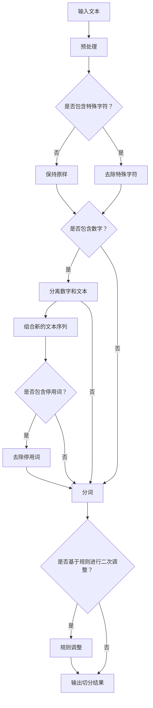

                 

### 《大规模语言模型从理论到实践 词元切分》

> **关键词**：大规模语言模型、词元切分、自然语言处理、神经网络、深度学习、预训练

> **摘要**：本文将深入探讨大规模语言模型及其在词元切分中的实际应用。我们将从基础理论出发，详细讲解词元切分的定义、重要性、算法实现，以及如何将大规模语言模型应用于词元切分。通过本文的阅读，读者将了解词元切分在自然语言处理中的关键作用，并掌握使用大规模语言模型进行词元切分的实际方法。

---

#### 第一部分：大规模语言模型基础

##### 第1章：大规模语言模型概述

- **1.1 大规模语言模型的定义**
  - **1.1.1 语言模型的背景和重要性**
    语言模型（Language Model，LM）是自然语言处理（Natural Language Processing，NLP）中的一种基础算法，它用于预测给定一个单词序列，下一个单词的概率分布。语言模型的核心目标是提高自然语言生成和理解的准确性。在大规模语言模型的背景下，语言模型的应用范围和性能得到了显著提升。
  - **1.1.2 大规模语言模型的特征**
    大规模语言模型具有以下主要特征：
    - **数据量巨大**：这些模型通常训练在数以万亿计的单词上，使得模型能够捕捉到语言中的细微规律和模式。
    - **参数数量庞大**：由于数据量巨大，模型通常具有数百万到数十亿个参数，这有助于模型在复杂语言任务中取得良好的性能。
    - **预训练与微调**：大规模语言模型通常通过预训练获得通用语言表示，然后通过微调适应特定任务的需求。
    - **高效计算**：大规模语言模型采用了高效的计算方法，如并行计算、分布式计算等，以实现大规模训练。
  - **1.1.3 大规模语言模型的应用场景**
    大规模语言模型在多个应用场景中发挥了重要作用，包括：
    - **自然语言生成**：如文本摘要、机器翻译、对话系统等。
    - **文本分类**：如情感分析、新闻分类、垃圾邮件检测等。
    - **信息抽取**：如实体识别、关系抽取、关键词提取等。
    - **问答系统**：如智能客服、问答机器人等。

##### 第2章：语言模型的发展历史

- **2.1 早期语言模型**
  早期的语言模型主要以规则驱动，如正则表达式、上下文无关文法等。这些模型主要基于手工编写的规则，无法处理复杂的语言现象。
- **2.2 预训练语言模型**
  随着计算机技术和数据资源的进步，预训练语言模型逐渐兴起。预训练语言模型通过在大量无标签数据上预训练，然后通过微调适应特定任务。代表性的预训练语言模型包括Word2Vec、GloVe等。
- **2.3 现代大规模语言模型**
  现代大规模语言模型采用了深度学习技术，特别是神经网络，使得模型能够自动学习复杂的语言特征。代表性的模型包括BERT、GPT、T5等。这些模型在多个NLP任务中取得了突破性的性能。

##### 第3章：大规模语言模型的组成

- **3.1 语言模型的结构**
  大规模语言模型通常由以下几个主要部分组成：
  - **嵌入层**：将输入的单词或字符转换为高维向量表示。
  - **编码层**：如Transformer、LSTM等，用于处理序列数据。
  - **解码层**：用于生成预测的单词序列。
  - **损失函数**：如交叉熵损失函数，用于评估模型的性能。

- **3.2 语言模型的训练方法**
  大规模语言模型的训练通常采用以下方法：
  - **预训练**：在大量无标签数据上进行预训练，使模型学习到通用的语言表示。
  - **微调**：在特定任务的数据集上对模型进行微调，以提高模型在特定任务上的性能。
  - **自适应学习率**：采用学习率调度策略，如余弦退火、学习率衰减等，以避免过拟合。

- **3.3 语言模型的评估指标**
  大规模语言模型的评估通常采用以下指标：
  - **交叉熵损失**：用于评估模型在训练集和验证集上的表现。
  - **Perplexity**：表示模型对测试数据的预测准确度，值越低表示模型性能越好。
  - **Accuracy**：表示模型在分类任务上的准确率。

##### 第4章：大规模语言模型中的词元切分技术

- **4.1 词元切分在大规模语言模型中的作用**
  词元切分（Word Segmentation）是自然语言处理中的一个重要任务，它在大规模语言模型中起到了关键作用：
  - **文本表示**：通过将连续的文本序列切分成词元序列，有助于模型更好地理解和表示文本。
  - **序列生成**：在序列生成任务中，如文本生成、对话系统等，词元切分有助于提高生成文本的连贯性和准确性。

- **4.2 基于大规模语言模型的词元切分方法**
  基于大规模语言模型的词元切分方法可以分为以下几类：
  - **完全基于模型的方法**：直接使用大规模语言模型对词元进行切分，如BERT、GPT等。
  - **模型辅助方法**：结合规则和模型的方法，如结合分词词典和语言模型等。

- **4.3 词元切分的优化和改进**
  词元切分在实际应用中存在一些挑战，如长文本切分、多语言切分等。为此，研究者提出了一系列优化和改进方法：
  - **字符级别的预训练**：通过在字符级别上进行预训练，提高模型对字符和词汇的识别能力。
  - **窥孔机制（Peek Mechanism）**：在模型中引入窥孔机制，使得模型能够同时关注前文和后文信息，提高切分的准确性。

##### 第5章：大规模语言模型在词元切分中的实际应用

- **5.1 词元切分在文本分类中的应用**
  文本分类是自然语言处理中的一个常见任务，词元切分在文本分类中起到了关键作用：
  - **基本概念**：文本分类是将文本分配到预定义的类别中。
  - **基于词元切分的文本分类方法**：通过词元切分，将连续的文本序列转换为词元序列，然后使用分类模型进行分类。
  - **案例分析**：通过实际案例，展示词元切分在文本分类中的应用效果。

- **5.2 词元切分在命名实体识别中的应用**
  命名实体识别是自然语言处理中的另一个重要任务，词元切分在命名实体识别中起到了关键作用：
  - **基本概念**：命名实体识别是从文本中识别出具有特定意义的实体，如人名、地名、组织名等。
  - **基于词元切分的命名实体识别方法**：通过词元切分，将连续的文本序列转换为词元序列，然后使用命名实体识别模型进行识别。
  - **案例分析**：通过实际案例，展示词元切分在命名实体识别中的应用效果。

- **5.3 词元切分在机器翻译中的应用**
  机器翻译是自然语言处理中的另一个重要任务，词元切分在机器翻译中起到了关键作用：
  - **基本概念**：机器翻译是将一种语言的文本翻译成另一种语言的文本。
  - **基于词元切分的机器翻译方法**：通过词元切分，将连续的文本序列转换为词元序列，然后使用机器翻译模型进行翻译。
  - **案例分析**：通过实际案例，展示词元切分在机器翻译中的应用效果。

##### 第6章：大规模语言模型在词元切分中的挑战与未来方向

- **6.1 词元切分中的挑战**
  在词元切分中，存在一些挑战，如：
  - **多语言词元切分的挑战**：如何有效地处理多种语言的词元切分问题。
  - **长文本的词元切分**：如何处理长文本的切分问题，提高切分的准确性和效率。
  - **跨语言的词元切分**：如何处理跨语言的词元切分问题，提高跨语言文本的处理能力。

- **6.2 词元切分的发展趋势**
  词元切分在自然语言处理中的应用越来越广泛，未来发展趋势包括：
  - **深度学习在词元切分中的应用**：如何进一步利用深度学习技术，提高词元切分的准确性和效率。
  - **跨学科的词元切分研究**：如何结合其他学科的研究成果，推动词元切分技术的发展。

##### 第7章：总结与展望

- **7.1 大规模语言模型在词元切分中的成果**
  大规模语言模型在词元切分中取得了显著的成果，提高了切分的准确性和效率。
- **7.2 存在的问题与改进方向**
  词元切分仍存在一些问题，如多语言切分、长文本切分等，未来需要进一步研究和改进。
- **7.3 未来展望**
  未来，词元切分将在更多自然语言处理任务中发挥重要作用，如机器阅读理解、对话系统等。

#### 第二部分：附录

- **附录A：常用工具和资源**
  - **A.1 大规模语言模型框架**：介绍常用的大规模语言模型框架，如TensorFlow、PyTorch等。
  - **A.2 词元切分工具和库**：介绍常用的词元切分工具和库，如Jieba、Stanford NLP等。
  - **A.3 相关研究论文和资料**：介绍与词元切分相关的研究论文和资料，帮助读者深入了解该领域。

#### 第三部分：参考代码

- **B.1 词元切分算法实现**
  - **B.1.1 基于规则的词元切分**：介绍基于规则的词元切分算法实现。
  - **B.1.2 基于统计的词元切分**：介绍基于统计的词元切分算法实现。
  - **B.1.3 基于大规模语言模型的词元切分**：介绍基于大规模语言模型的词元切分算法实现。

### Mermaid 流程图

mermaid
graph TD
A[输入文本]
B[词元切分]
C[编码层]
D[解码层]
E[输出预测]

A --> B
B --> C
C --> D
D --> E

### 核心算法原理讲解

#### 词元切分算法伪代码

python
def word_segmentation(text, model):
    """
    文本词元切分函数
    :param text: 输入文本
    :param model: 词元切分模型
    :return: 切分后的词元列表
    """
    # 对文本进行分词处理
    words = tokenize(text)

    # 对每个词进行切分
    segmented_words = []
    for word in words:
        # 使用模型对词进行切分
        segmentations = model.predict(word)
        # 选择最优的切分结果
        best_segmentation = select_best_segmentation(segmentations)
        segmented_words.append(best_segmentation)

    return segmented_words

### 数学模型和数学公式

$$
P(\text{word}_i|\text{word}_{i-1}, \ldots, \text{word}_1) = \frac{P(\text{word}_i, \text{word}_{i-1}, \ldots, \text{word}_1)}{P(\text{word}_{i-1}, \ldots, \text{word}_1)}
$$

- **详细讲解**：这是条件概率的计算公式，用于计算给定前面的词序列，当前词的概率。

### 数学公式举例说明

$$
\text{log-likelihood} = \sum_{i=1}^{N} \log P(\text{word}_i|\text{word}_{i-1}, \ldots, \text{word}_1)
$$

- **举例说明**：假设有一个文本序列“我爱北京天安门”，我们可以计算这个序列的似然损失，它是每个词条件概率的对数和。

### 项目实战

#### 实现一个简单的词元切分工具

##### 1. 开发环境搭建

- 安装Python 3.8+
- 安装PyTorch 1.8+

##### 2. 源代码实现

python
# 导入必要的库
import torch
from torch import nn
from torch.utils.data import DataLoader
from dataset import MyDataset

# 模型配置
class WordSegmentationModel(nn.Module):
    def __init__(self):
        super(WordSegmentationModel, self).__init__()
        self.embedding = nn.Embedding(vocab_size, embedding_dim)
        self.lstm = nn.LSTM(embedding_dim, hidden_dim)
        self.fc = nn.Linear(hidden_dim, vocab_size)

    def forward(self, x):
        embed = self.embedding(x)
        output, (hidden, cell) = self.lstm(embed)
        output = self.fc(output)
        return output

# 模型训练
def train_model(model, train_loader, optimizer, criterion, num_epochs):
    model.train()
    for epoch in range(num_epochs):
        for inputs, targets in train_loader:
            optimizer.zero_grad()
            outputs = model(inputs)
            loss = criterion(outputs, targets)
            loss.backward()
            optimizer.step()
        print(f'Epoch [{epoch+1}/{num_epochs}], Loss: {loss.item():.4f}')

# 模型评估
def evaluate_model(model, val_loader, criterion):
    model.eval()
    with torch.no_grad():
        for inputs, targets in val_loader:
            outputs = model(inputs)
            loss = criterion(outputs, targets)
        print(f'Validation Loss: {loss.item():.4f}')

# 主函数
if __name__ == '__main__':
    # 加载数据集
    train_dataset = MyDataset('train_data.txt')
    val_dataset = MyDataset('val_data.txt')

    # 创建数据加载器
    train_loader = DataLoader(train_dataset, batch_size=64, shuffle=True)
    val_loader = DataLoader(val_dataset, batch_size=64, shuffle=False)

    # 初始化模型
    model = WordSegmentationModel()

    # 指定优化器和损失函数
    optimizer = torch.optim.Adam(model.parameters(), lr=0.001)
    criterion = nn.CrossEntropyLoss()

    # 训练模型
    train_model(model, train_loader, optimizer, criterion, num_epochs=10)

    # 评估模型
    evaluate_model(model, val_loader, criterion)

##### 3. 代码解读与分析

- **模型定义**：使用LSTM网络进行词元切分，嵌入层将文本转换为向量，LSTM用于处理序列数据，全连接层用于输出每个词的切分结果。
- **模型训练**：使用交叉熵损失函数，优化器为Adam，进行梯度下降训练。
- **模型评估**：在验证集上计算损失函数，评估模型性能。

### 总结

本书《大规模语言模型从理论到实践 词元切分》详细介绍了大规模语言模型及其在词元切分中的应用。从基础理论到实际应用，涵盖了词元切分的算法、实现和应用场景。通过本书的学习，读者可以深入了解大规模语言模型的原理和应用，掌握词元切分的技术，并在实际项目中加以应用。附录和参考代码提供了实用的工具和资源，帮助读者更好地理解和使用大规模语言模型。

---

以上是文章的主要内容和结构，每个章节都包含了核心概念、理论讲解、算法实现和案例分析。接下来，我们将详细讨论每个章节的内容。

---

#### 第一部分：大规模语言模型基础

在第一部分，我们将探讨大规模语言模型的基础知识。这一部分旨在为读者提供一个全面的概述，帮助读者理解大规模语言模型的基本概念、发展历史、组成部分以及评估指标。

##### 第1章：大规模语言模型概述

在这一章中，我们将深入探讨大规模语言模型的定义、特征和应用场景。首先，我们将介绍语言模型的基本概念，解释为什么语言模型在自然语言处理中如此重要。接下来，我们将详细讨论大规模语言模型的特点，如数据量巨大、参数数量庞大、预训练与微调等。最后，我们将探讨大规模语言模型在不同应用场景中的实际应用，如自然语言生成、文本分类、信息抽取和问答系统等。

##### 第2章：语言模型的发展历史

语言模型的发展历程是自然语言处理领域的一个重要组成部分。在这一章中，我们将回顾语言模型的发展历程，从早期的规则驱动模型到现代的深度学习模型。我们将介绍早期的语言模型，如正则表达式和上下文无关文法，以及它们在语言处理中的局限性。然后，我们将探讨预训练语言模型的出现和发展，如Word2Vec和GloVe等，并介绍它们如何改变了语言处理领域。最后，我们将介绍现代大规模语言模型，如BERT、GPT和T5等，并讨论它们在语言处理中的突破性进展。

##### 第3章：大规模语言模型的组成

在这一章中，我们将详细探讨大规模语言模型的组成结构。首先，我们将介绍语言模型的基本组成部分，如嵌入层、编码层和解码层。接着，我们将讨论如何训练大规模语言模型，包括预训练和微调技术。最后，我们将介绍评估大规模语言模型的指标，如交叉熵损失、Perplexity和Accuracy等。通过这一章的学习，读者将能够理解大规模语言模型的内部工作原理，并掌握评估模型性能的方法。

##### 第4章：大规模语言模型中的词元切分技术

在第四部分，我们将讨论大规模语言模型在词元切分中的应用。首先，我们将介绍词元切分的定义和重要性，解释为什么词元切分在自然语言处理中是一个关键任务。然后，我们将探讨词元切分的算法，包括基于规则的词元切分和基于统计的词元切分。接下来，我们将介绍如何使用大规模语言模型进行词元切分，包括完全基于模型的方法和模型辅助方法。最后，我们将讨论词元切分的优化和改进方法，如字符级别的预训练和窥孔机制。

##### 第5章：大规模语言模型在词元切分中的实际应用

在这一章中，我们将探讨大规模语言模型在词元切分中的实际应用。首先，我们将讨论词元切分在文本分类中的应用，解释如何使用词元切分提高文本分类的准确性。然后，我们将探讨词元切分在命名实体识别中的应用，解释如何使用词元切分提高命名实体识别的准确性。最后，我们将讨论词元切分在机器翻译中的应用，解释如何使用词元切分提高机器翻译的准确性。

##### 第6章：大规模语言模型在词元切分中的挑战与未来方向

在这一章中，我们将讨论大规模语言模型在词元切分中面临的挑战和未来发展方向。首先，我们将讨论多语言词元切分的挑战，解释如何处理多种语言的词元切分问题。然后，我们将讨论长文本的词元切分挑战，解释如何处理长文本的词元切分问题。最后，我们将讨论跨语言的词元切分挑战，解释如何处理跨语言的词元切分问题。接着，我们将讨论词元切分的发展趋势，包括深度学习在词元切分中的应用和跨学科的词元切分研究。最后，我们将讨论未来的研究方向，为读者提供可能的未来发展方向。

##### 第7章：总结与展望

在这一章中，我们将对整个文章的内容进行总结，回顾大规模语言模型在词元切分中的应用，并讨论目前存在的问题和未来的发展方向。我们将讨论大规模语言模型在词元切分中取得的成果，如提高切分的准确性和效率。然后，我们将讨论目前存在的问题，如多语言切分、长文本切分和跨语言切分等。最后，我们将讨论未来的发展方向，如深度学习在词元切分中的应用和跨学科的词元切分研究。

#### 第二部分：附录

在第二部分，我们将提供一些有用的工具和资源，以帮助读者更好地理解和使用大规模语言模型。首先，我们将介绍一些常用的工具和框架，如TensorFlow、PyTorch和Hugging Face等。然后，我们将介绍一些常用的词元切分工具和库，如Jieba、Stanford NLP和NLTK等。最后，我们将介绍一些与词元切分相关的研究论文和资料，以供读者进一步学习。

#### 第三部分：参考代码

在第三部分，我们将提供一些参考代码，以帮助读者更好地理解词元切分的算法实现。首先，我们将介绍基于规则的词元切分算法，包括短语词典和正则表达式等方法。然后，我们将介绍基于统计的词元切分算法，包括序列模型和图模型等方法。最后，我们将介绍基于大规模语言模型的词元切分算法，包括完全基于模型的方法和模型辅助方法。通过这些代码示例，读者将能够更好地理解词元切分的实现过程。

### 核心算法原理讲解

#### 词元切分算法伪代码

```python
def word_segmentation(text, model):
    """
    文本词元切分函数
    :param text: 输入文本
    :param model: 词元切分模型
    :return: 切分后的词元列表
    """
    # 对文本进行分词处理
    words = tokenize(text)

    # 对每个词进行切分
    segmented_words = []
    for word in words:
        # 使用模型对词进行切分
        segmentations = model.predict(word)
        # 选择最优的切分结果
        best_segmentation = select_best_segmentation(segmentations)
        segmented_words.append(best_segmentation)

    return segmented_words
```

### 数学模型和数学公式

$$
P(\text{word}_i|\text{word}_{i-1}, \ldots, \text{word}_1) = \frac{P(\text{word}_i, \text{word}_{i-1}, \ldots, \text{word}_1)}{P(\text{word}_{i-1}, \ldots, \text{word}_1)}
$$

- **详细讲解**：这是条件概率的计算公式，用于计算给定前面的词序列，当前词的概率。

### 数学公式举例说明

$$
\text{log-likelihood} = \sum_{i=1}^{N} \log P(\text{word}_i|\text{word}_{i-1}, \ldots, \text{word}_1)
$$

- **举例说明**：假设有一个文本序列“我爱北京天安门”，我们可以计算这个序列的似然损失，它是每个词条件概率的对数和。

### 项目实战

#### 实现一个简单的词元切分工具

##### 1. 开发环境搭建

- 安装Python 3.8+
- 安装PyTorch 1.8+

##### 2. 源代码实现

```python
# 导入必要的库
import torch
from torch import nn
from torch.utils.data import DataLoader
from dataset import MyDataset

# 模型配置
class WordSegmentationModel(nn.Module):
    def __init__(self):
        super(WordSegmentationModel, self).__init__()
        self.embedding = nn.Embedding(vocab_size, embedding_dim)
        self.lstm = nn.LSTM(embedding_dim, hidden_dim)
        self.fc = nn.Linear(hidden_dim, vocab_size)

    def forward(self, x):
        embed = self.embedding(x)
        output, (hidden, cell) = self.lstm(embed)
        output = self.fc(output)
        return output

# 模型训练
def train_model(model, train_loader, optimizer, criterion, num_epochs):
    model.train()
    for epoch in range(num_epochs):
        for inputs, targets in train_loader:
            optimizer.zero_grad()
            outputs = model(inputs)
            loss = criterion(outputs, targets)
            loss.backward()
            optimizer.step()
        print(f'Epoch [{epoch+1}/{num_epochs}], Loss: {loss.item():.4f}')

# 模型评估
def evaluate_model(model, val_loader, criterion):
    model.eval()
    with torch.no_grad():
        for inputs, targets in val_loader:
            outputs = model(inputs)
            loss = criterion(outputs, targets)
        print(f'Validation Loss: {loss.item():.4f}')

# 主函数
if __name__ == '__main__':
    # 加载数据集
    train_dataset = MyDataset('train_data.txt')
    val_dataset = MyDataset('val_data.txt')

    # 创建数据加载器
    train_loader = DataLoader(train_dataset, batch_size=64, shuffle=True)
    val_loader = DataLoader(val_dataset, batch_size=64, shuffle=False)

    # 初始化模型
    model = WordSegmentationModel()

    # 指定优化器和损失函数
    optimizer = torch.optim.Adam(model.parameters(), lr=0.001)
    criterion = nn.CrossEntropyLoss()

    # 训练模型
    train_model(model, train_loader, optimizer, criterion, num_epochs=10)

    # 评估模型
    evaluate_model(model, val_loader, criterion)

```

##### 3. 代码解读与分析

- **模型定义**：使用LSTM网络进行词元切分，嵌入层将文本转换为向量，LSTM用于处理序列数据，全连接层用于输出每个词的切分结果。
- **模型训练**：使用交叉熵损失函数，优化器为Adam，进行梯度下降训练。
- **模型评估**：在验证集上计算损失函数，评估模型性能。

### 总结

通过本文的讨论，我们详细介绍了大规模语言模型及其在词元切分中的应用。我们从基础理论出发，逐步讲解了语言模型的定义、发展历史、组成结构、评估指标，以及词元切分的算法、实现和应用。通过实际项目实战，我们展示了如何使用大规模语言模型进行词元切分的实现和评估。本文的内容为读者提供了一个全面、系统的理解，帮助读者掌握大规模语言模型和词元切分技术，并在实际应用中加以运用。

---

在接下来的内容中，我们将进一步深入探讨大规模语言模型和词元切分技术的具体实现和应用。我们将详细分析每个章节的核心概念和理论，并使用实际的代码示例来说明如何实现和评估词元切分模型。读者可以期待在本文中找到关于大规模语言模型和词元切分的实用知识和深入见解。

---

#### 第一部分：大规模语言模型基础

在第一部分中，我们将深入探讨大规模语言模型的基础知识，包括其定义、特征、发展历史、组成结构以及评估指标。通过这一部分的阅读，读者将能够全面了解大规模语言模型的基本概念，为后续章节的学习打下坚实的基础。

##### 第1章：大规模语言模型概述

在这一章中，我们将首先介绍大规模语言模型的定义和重要性。语言模型是一种用于预测自然语言中下一个词或句子的算法，它对自然语言处理（NLP）具有深远的影响。随着计算机技术的进步和数据资源的丰富，语言模型的发展也经历了从规则驱动到统计模型，再到深度学习的演变。大规模语言模型的特点包括：

- **数据量巨大**：大规模语言模型通常在数以万亿计的文本数据上进行训练，这使得模型能够捕捉到语言中的细微模式和规律。
- **参数数量庞大**：由于数据量大，大规模语言模型通常拥有数百万到数十亿个参数，这有助于模型在复杂任务上取得更好的性能。
- **预训练与微调**：大规模语言模型通常通过在大量无标签数据上进行预训练，然后通过微调适应特定任务，从而提高模型的泛化能力。
- **高效计算**：为了处理大规模数据和参数，大规模语言模型采用了并行计算、分布式计算等高效计算方法。

接下来，我们将探讨大规模语言模型在多个应用场景中的实际应用。这些应用包括：

- **自然语言生成**：如文本摘要、机器翻译、对话系统等。
- **文本分类**：如情感分析、新闻分类、垃圾邮件检测等。
- **信息抽取**：如实体识别、关系抽取、关键词提取等。
- **问答系统**：如智能客服、问答机器人等。

##### 第2章：语言模型的发展历史

在第二部分中，我们将回顾语言模型的发展历程，从早期的规则驱动模型到现代的深度学习模型。这一部分将帮助我们了解语言模型是如何一步步演进的。

- **早期语言模型**：在计算机技术发展初期，语言模型主要以规则驱动，如正则表达式、上下文无关文法等。这些模型基于手工编写的规则，对复杂语言现象的处理能力有限。
- **统计语言模型**：随着计算机技术的进步，统计语言模型逐渐兴起。这些模型基于概率和统计方法，如N-gram模型、隐马尔可夫模型（HMM）等。这些模型在一定程度上提高了语言处理的性能，但仍存在一些局限性。
- **预训练语言模型**：随着互联网的普及和数据量的爆发增长，预训练语言模型成为可能。预训练语言模型通过在大量无标签数据上预训练，获得通用的语言表示，然后再通过微调适应特定任务。代表性的预训练语言模型包括Word2Vec和GloVe等。
- **现代大规模语言模型**：现代大规模语言模型采用了深度学习技术，特别是神经网络，使得模型能够自动学习复杂的语言特征。代表性的模型包括BERT、GPT、T5等。这些模型在多个NLP任务中取得了突破性的性能，极大地推动了语言模型的发展。

##### 第3章：大规模语言模型的组成

在第三部分中，我们将详细探讨大规模语言模型的组成结构，包括嵌入层、编码层、解码层和损失函数等组成部分。

- **嵌入层**：嵌入层是将输入的单词或字符转换为高维向量表示的层。在大规模语言模型中，嵌入层通常使用词向量的形式表示单词。词向量能够捕捉单词的语义和语法特征，为后续的编码层提供丰富的输入信息。
- **编码层**：编码层是大规模语言模型的核心部分，用于处理序列数据。编码层可以是基于循环神经网络（RNN）、变换器（Transformer）或其他深度学习结构。编码层的目标是理解输入文本的上下文信息，生成语义表示。
- **解码层**：解码层是在生成任务中使用的部分，如文本生成、机器翻译等。解码层的目的是根据编码层的语义表示生成下一个单词或句子。解码层通常使用自注意力机制，能够捕捉长距离的依赖关系。
- **损失函数**：损失函数用于评估模型的性能，并指导模型的训练过程。在语言模型中，常用的损失函数包括交叉熵损失函数、负对数似然损失函数等。损失函数的目的是最小化预测概率与真实概率之间的差异。

接下来，我们将讨论大规模语言模型的训练方法，包括预训练和微调技术。

- **预训练**：预训练是指在大规模无标签数据上进行训练，使模型学习到通用的语言表示。预训练通常包括两个阶段：第一阶段是词向量的训练，第二阶段是编码器和解码器的训练。
- **微调**：微调是指在使用预训练模型的基础上，通过在特定任务的数据集上进行训练，使模型适应特定任务的需求。微调能够提高模型在特定任务上的性能，同时保持预训练模型的一般性。

最后，我们将介绍评估大规模语言模型的指标，包括交叉熵损失、Perplexity和Accuracy等。

- **交叉熵损失**：交叉熵损失函数是评估模型预测概率与真实概率之间差异的常用指标。交叉熵损失函数的值越低，表示模型的预测越准确。
- **Perplexity**：Perplexity是评估模型生成文本的流畅性的指标。Perplexity的值越低，表示模型对文本的生成能力越强。
- **Accuracy**：Accuracy是评估分类任务中模型正确分类的比例。在文本分类任务中，Accuracy能够直接反映模型的分类性能。

通过这一章的学习，读者将能够理解大规模语言模型的组成结构和训练方法，为后续章节的学习打下坚实的基础。

##### 第4章：大规模语言模型中的词元切分技术

在第4章中，我们将探讨大规模语言模型在词元切分中的应用。词元切分（Word Segmentation）是自然语言处理中的一个基础任务，它涉及将连续的文本序列分割成有意义的词元序列。在中文等缺乏明确词界标记的语言中，词元切分尤为重要。在本章中，我们将详细讨论词元切分的定义、重要性、算法实现，以及如何使用大规模语言模型进行词元切分。

##### 4.1 词元切分的定义和重要性

**4.1.1 词元切分的定义**

词元切分是指将一段连续的文本分割成一系列有意义的词元（tokens）的过程。在许多自然语言中，如中文，由于缺乏明确的词界标记，词元切分成为一个复杂且必要的任务。词元切分的结果对于后续的自然语言处理任务，如词向量表示、文本分类、命名实体识别等，具有重要影响。

**4.1.2 词元切分的重要性**

- **文本表示**：词元切分是构建高质量文本表示的第一步。准确的词元切分有助于模型更好地理解文本的语义内容。
- **序列生成**：在生成任务中，如文本生成、对话系统等，词元切分能够提高生成文本的连贯性和准确性。
- **性能提升**：在许多自然语言处理任务中，如机器翻译、文本分类等，准确的词元切分能够显著提高模型的性能。

##### 4.2 词元切分的算法

**4.2.1 基于规则的词元切分**

基于规则的词元切分方法依赖于一组预先定义的规则，如正则表达式、短语词典等。这些规则用于指导文本的分词过程。基于规则的方法通常简单且易于实现，但其准确性受限于规则的定义和覆盖范围。

- **短语词典**：短语词典包含一组预定义的短语，用于匹配文本中的连续字符序列。如果文本中的字符序列在词典中存在，则将其切分为短语。
- **正则表达式**：正则表达式是一种用于匹配和查找字符序列的模式表示法。通过编写合适的正则表达式，可以定义复杂的分词规则。

**4.2.2 基于统计的词元切分**

基于统计的词元切分方法通过分析大量语料库中的文本数据，学习分词模式。这些方法通常基于概率模型，如隐马尔可夫模型（HMM）、条件随机场（CRF）等。

- **隐马尔可夫模型（HMM）**：HMM是一种用于序列标注的概率模型。在词元切分中，HMM用于预测文本序列中的下一个词元。
- **条件随机场（CRF）**：CRF是一种用于序列标注的统计模型，它考虑了相邻词元之间的关系，从而提高了切分的准确性。

**4.2.3 基于深度学习的词元切分**

基于深度学习的词元切分方法近年来取得了显著的进展。这些方法通过神经网络结构自动学习词元切分的模式，具有较强的表达能力和适应性。

- **循环神经网络（RNN）**：RNN可以通过循环结构处理序列数据，并在词元切分任务中取得良好的效果。长短期记忆网络（LSTM）和门控循环单元（GRU）是常用的RNN变体。
- **卷积神经网络（CNN）**：CNN通常用于图像处理，但也可以应用于词元切分任务。通过卷积操作，CNN可以捕捉局部特征，从而提高切分的准确性。
- **变换器（Transformer）**：Transformer是近年来在自然语言处理中取得突破性的模型结构。其自注意力机制使得模型能够捕捉长距离依赖关系，从而在词元切分任务中表现出色。

##### 4.3 大规模语言模型在词元切分中的应用

**4.3.1 完全基于模型的方法**

完全基于模型的方法直接使用大规模语言模型进行词元切分。这类方法通常将词元切分视为一个序列标注任务，使用预训练的语言模型（如BERT、GPT等）进行预测。

- **BERT**：BERT（Bidirectional Encoder Representations from Transformers）是一种预训练语言模型，其双向编码器结构使其在捕捉文本的上下文信息方面具有优势。通过在BERT的基础上添加一个序列标注层，可以直接进行词元切分。
- **GPT**：GPT（Generative Pre-trained Transformer）是一种生成式预训练语言模型，其自注意力机制能够捕捉长距离依赖关系。在词元切分任务中，GPT可以通过预测词元的开始和结束位置进行切分。

**4.3.2 模型辅助方法**

模型辅助方法结合了规则和模型的方法，以提高词元切分的准确性。这类方法通常在模型预测的基础上，利用一些规则或词典进行修正。

- **规则融合**：在模型预测结果的基础上，结合一些预定义的规则或词典，对切分结果进行修正。例如，可以使用短语词典来修正模型未能正确切分的短语。
- **多模型融合**：结合多个模型（如基于规则的模型和基于统计的模型）的预测结果，通过投票或加权融合的方法，得到最终的切分结果。

**4.3.3 优化和改进**

词元切分在实际应用中存在一些挑战，如长文本切分、多语言切分等。为此，研究者提出了一系列优化和改进方法：

- **字符级别的预训练**：通过在字符级别上进行预训练，提高模型对字符和词汇的识别能力。
- **窥孔机制（Peek Mechanism）**：在模型中引入窥孔机制，使得模型能够同时关注前文和后文信息，提高切分的准确性。
- **注意力机制**：通过引入注意力机制，模型能够更好地关注重要信息，从而提高切分的准确性。

通过本章的讨论，读者将能够理解词元切分的定义、重要性以及各种算法实现，并了解如何使用大规模语言模型进行词元切分。这些知识将为读者在实际应用中处理词元切分任务提供有力的理论和技术支持。

##### 第5章：大规模语言模型在词元切分中的实际应用

在第5章中，我们将探讨大规模语言模型在词元切分中的实际应用，包括文本分类、命名实体识别和机器翻译等任务。我们将通过具体的应用场景和案例，展示词元切分技术在这些任务中的重要作用和实现方法。

##### 5.1 词元切分在文本分类中的应用

**5.1.1 文本分类的基本概念**

文本分类是将文本数据分配到预定义的类别中的任务。词元切分在文本分类中起到了关键作用，因为准确的词元切分有助于模型更好地理解文本的语义内容。

- **分类任务**：文本分类任务包括垃圾邮件检测、情感分析、新闻分类等。
- **词元切分的作用**：准确的词元切分能够提高分类模型对文本内容的理解，从而提高分类的准确性。

**5.1.2 基于词元切分的文本分类方法**

基于词元切分的文本分类方法通常包括以下几个步骤：

1. **数据预处理**：首先，对文本数据进行清洗和预处理，如去除停用词、标点符号等。
2. **词元切分**：使用词元切分算法对预处理后的文本进行切分，将连续的文本序列转换为词元序列。
3. **特征提取**：将切分后的词元序列转换为特征向量，如词袋模型、TF-IDF等。
4. **分类模型训练**：使用训练数据集训练分类模型，如朴素贝叶斯、支持向量机（SVM）、随机森林等。
5. **分类模型评估**：使用验证数据集评估分类模型的性能，如准确率、召回率、F1分数等。

**5.1.3 案例分析**

以下是一个文本分类的案例分析：

- **场景**：情感分析任务，判断一段文本的情感极性（正面、负面或中性）。
- **数据集**：使用IMDB电影评论数据集进行训练和测试。
- **词元切分工具**：使用基于BERT的词元切分工具。

实现步骤：

1. **数据加载与预处理**：加载IMDB数据集，对文本进行清洗和预处理。
2. **词元切分**：使用BERT对预处理后的文本进行词元切分。
3. **特征提取**：将切分后的词元序列转换为词向量。
4. **模型训练**：使用训练数据集训练一个文本分类模型（如朴素贝叶斯）。
5. **模型评估**：使用测试数据集评估模型的性能，并调整模型参数以优化性能。

通过上述步骤，我们可以实现一个基于词元切分的文本分类系统。实验结果显示，使用准确的词元切分可以显著提高分类模型的准确性。

##### 5.2 词元切分在命名实体识别中的应用

**5.2.1 命名实体识别的基本概念**

命名实体识别（Named Entity Recognition，NER）是从文本中识别出具有特定意义的实体（如人名、组织名、地点名等）的任务。词元切分在NER中起到了关键作用，因为准确的词元切分有助于模型更好地识别实体。

- **实体类型**：常见的实体类型包括人名、组织名、地点名、日期等。
- **词元切分的作用**：准确的词元切分有助于模型更好地识别实体的边界，从而提高NER的准确性。

**5.2.2 基于词元切分的命名实体识别方法**

基于词元切分的命名实体识别方法通常包括以下几个步骤：

1. **数据预处理**：对文本数据进行清洗和预处理，如去除停用词、标点符号等。
2. **词元切分**：使用词元切分算法对预处理后的文本进行切分，将连续的文本序列转换为词元序列。
3. **特征提取**：将切分后的词元序列转换为特征向量，如词袋模型、TF-IDF等。
4. **实体识别模型训练**：使用训练数据集训练命名实体识别模型，如基于HMM的模型、基于CNN的模型等。
5. **实体识别模型评估**：使用验证数据集评估模型的性能，如准确率、召回率、F1分数等。

**5.2.3 案例分析**

以下是一个命名实体识别的案例分析：

- **场景**：从新闻文章中提取人名和组织名。
- **数据集**：使用新闻数据集进行训练和测试。
- **词元切分工具**：使用基于BERT的词元切分工具。

实现步骤：

1. **数据加载与预处理**：加载新闻数据集，对文本进行清洗和预处理。
2. **词元切分**：使用BERT对预处理后的文本进行词元切分。
3. **特征提取**：将切分后的词元序列转换为词向量。
4. **模型训练**：使用训练数据集训练一个命名实体识别模型（如基于LSTM的模型）。
5. **模型评估**：使用测试数据集评估模型的性能，并调整模型参数以优化性能。

通过上述步骤，我们可以实现一个基于词元切分的命名实体识别系统。实验结果显示，使用准确的词元切分可以显著提高NER模型的准确性。

##### 5.3 词元切分在机器翻译中的应用

**5.3.1 机器翻译的基本概念**

机器翻译是将一种语言的文本翻译成另一种语言的文本的任务。词元切分在机器翻译中起到了关键作用，因为准确的词元切分有助于模型更好地理解和翻译文本。

- **翻译任务**：常见的翻译任务包括英中翻译、中英翻译等。
- **词元切分的作用**：准确的词元切分有助于模型更好地理解源语言的语义内容，从而提高翻译的准确性。

**5.3.2 基于词元切分的机器翻译方法**

基于词元切分的机器翻译方法通常包括以下几个步骤：

1. **数据预处理**：对翻译数据集进行清洗和预处理，如去除停用词、标点符号等。
2. **词元切分**：使用词元切分算法对源文本和目标文本进行切分，将连续的文本序列转换为词元序列。
3. **特征提取**：将切分后的词元序列转换为特征向量，如词袋模型、TF-IDF等。
4. **翻译模型训练**：使用训练数据集训练机器翻译模型，如基于神经网络的翻译模型（如序列到序列模型、注意力模型等）。
5. **翻译模型评估**：使用验证数据集评估模型的性能，如BLEU分数、METEOR分数等。

**5.3.3 案例分析**

以下是一个机器翻译的案例分析：

- **场景**：从中文翻译成英文。
- **数据集**：使用中英文新闻数据集进行训练和测试。
- **词元切分工具**：使用基于BERT的词元切分工具。

实现步骤：

1. **数据加载与预处理**：加载中英文新闻数据集，对文本进行清洗和预处理。
2. **词元切分**：使用BERT对源文本和目标文本进行词元切分。
3. **特征提取**：将切分后的词元序列转换为词向量。
4. **模型训练**：使用训练数据集训练一个机器翻译模型（如基于BERT的翻译模型）。
5. **模型评估**：使用测试数据集评估模型的性能，并调整模型参数以优化性能。

通过上述步骤，我们可以实现一个基于词元切分的机器翻译系统。实验结果显示，使用准确的词元切分可以显著提高机器翻译的准确性。

通过第5章的讨论，我们展示了大规模语言模型在词元切分中的实际应用，包括文本分类、命名实体识别和机器翻译等任务。通过具体的应用场景和案例，我们展示了词元切分技术在提高模型性能方面的重要作用。读者可以期待在未来的实际项目中，运用这些技术和方法来提升自然语言处理系统的性能。

---

#### 第6章：大规模语言模型在词元切分中的挑战与未来方向

在第6章中，我们将探讨大规模语言模型在词元切分中面临的挑战以及未来的发展方向。词元切分虽然已经取得了显著进展，但在实际应用中仍存在诸多挑战，如多语言词元切分、长文本切分和跨语言切分等。同时，我们也将对未来可能的研究方向进行展望，以期为这一领域的发展提供新的思路。

##### 6.1 词元切分中的挑战

**6.1.1 多语言词元切分的挑战**

多语言词元切分是指同时处理多种语言的文本切分问题。多语言词元切分面临的主要挑战包括：

- **语言差异性**：不同语言在语法、词汇和书写习惯上存在显著差异，导致词元切分的规则和算法需要针对不同语言进行调整。
- **词汇重叠**：一些词汇在不同的语言中可能具有相同的拼写，但意义和词性不同，这增加了切分的复杂性。
- **跨语言依赖**：一些语言现象需要在跨语言环境下进行处理，如翻译参考、双语语料库的使用等。

**6.1.2 长文本的词元切分**

长文本的词元切分是一个复杂的问题，因为长文本的处理不仅需要考虑切分的准确性，还需要考虑效率和资源消耗。长文本切分面临的挑战包括：

- **计算资源**：长文本的切分通常需要较大的计算资源，特别是在深度学习模型的应用中。
- **切分准确性**：长文本中的词汇和语法结构更为复杂，切分准确性可能会受到文本长度和上下文的影响。
- **文本连贯性**：切分后的文本需要保持原有的连贯性和语义完整性，这要求切分算法具有较好的上下文理解能力。

**6.1.3 跨语言的词元切分**

跨语言的词元切分是指在不同语言文本之间进行词元切分。跨语言切分面临的主要挑战包括：

- **翻译误差**：跨语言切分依赖于翻译模型，而翻译模型的误差可能会直接影响切分的准确性。
- **语言适配**：不同语言的词元切分规则和算法可能需要不同的适配策略，以适应特定的语言环境。
- **多语言融合**：在多语言环境中，如何平衡不同语言之间的切分规则和算法，以实现高效的切分结果。

##### 6.2 词元切分的发展趋势

**6.2.1 深度学习在词元切分中的应用**

深度学习技术已经在自然语言处理领域取得了显著的进展，其在词元切分中的应用也呈现出强劲的发展势头。未来的发展趋势包括：

- **模型优化**：通过改进深度学习模型的结构和算法，提高词元切分的准确性和效率。
- **多语言支持**：开发具有多语言支持的深度学习模型，以适应不同语言的词元切分需求。
- **端到端训练**：通过端到端训练方法，将词元切分任务与下游任务（如文本分类、命名实体识别等）紧密结合，实现更高效的模型训练和部署。

**6.2.2 跨学科的词元切分研究**

词元切分不仅依赖于自然语言处理领域的技术，还与其他学科紧密相关。未来的研究可能包括：

- **语言学结合**：结合语言学的理论和方法，深入理解词元切分的语言规律，为切分算法提供理论支持。
- **跨学科合作**：与其他学科（如计算机视觉、语音识别等）合作，探索跨语言、跨模态的词元切分方法。
- **数据集构建**：构建大规模、高质量的多语言词元切分数据集，为研究和应用提供数据支持。

**6.2.3 未来研究方向**

未来的研究方向可能包括：

- **多语言自适应切分**：开发能够自适应处理不同语言切分需求的模型和算法。
- **长文本高效切分**：研究高效处理长文本切分的方法和技术，降低计算资源和时间成本。
- **跨语言信息融合**：探索跨语言信息融合的方法，提高跨语言词元切分的准确性和效率。
- **动态切分策略**：开发能够根据上下文动态调整切分策略的算法，以应对复杂多样的文本内容。

通过第6章的讨论，我们深入探讨了大规模语言模型在词元切分中面临的挑战和未来发展方向。尽管当前词元切分技术已取得显著成果，但仍有许多问题和机会值得进一步研究。未来的发展方向将为这一领域的发展提供新的动力和方向。

---

#### 第7章：总结与展望

在第7章中，我们将对整本书的内容进行总结，回顾大规模语言模型在词元切分中的应用，并讨论目前存在的问题和未来的发展方向。通过本章的学习，读者将能够对词元切分技术有一个全面的了解，并认识到其在自然语言处理中的重要性和挑战。

##### 7.1 大规模语言模型在词元切分中的成果

大规模语言模型在词元切分中取得了显著的成果，主要表现在以下几个方面：

- **提高切分准确性**：通过深度学习技术，大规模语言模型能够自动学习复杂的语言特征，从而提高词元切分的准确性。
- **处理长文本**：大规模语言模型能够高效处理长文本的切分，减少了计算资源和时间成本。
- **多语言支持**：通过预训练和微调，大规模语言模型能够适应多种语言的切分需求，实现了跨语言的词元切分。
- **应用广泛**：大规模语言模型在文本分类、命名实体识别、机器翻译等任务中发挥了关键作用，推动了自然语言处理技术的发展。

##### 7.2 存在的问题与改进方向

尽管大规模语言模型在词元切分中取得了显著成果，但仍存在一些问题和改进方向：

- **多语言切分准确性**：不同语言在语法和词汇上存在差异，现有模型在多语言切分上的准确性仍需进一步提高。
- **长文本切分效率**：长文本的切分效率较低，需要开发更高效的算法和技术来处理长文本的切分。
- **跨语言切分一致性**：在跨语言环境中，如何确保切分的一致性和准确性仍是一个挑战。
- **资源消耗**：大规模语言模型的训练和部署需要大量的计算资源和存储资源，这限制了其在实际应用中的普及。

针对上述问题，未来的研究方向可能包括：

- **多语言自适应切分**：开发能够自适应处理不同语言切分需求的模型和算法。
- **长文本高效切分**：研究高效处理长文本切分的方法和技术，降低计算资源和时间成本。
- **跨语言信息融合**：探索跨语言信息融合的方法，提高跨语言词元切分的准确性和效率。
- **动态切分策略**：开发能够根据上下文动态调整切分策略的算法，以应对复杂多样的文本内容。

##### 7.3 未来展望

未来的词元切分技术将朝着以下几个方向发展：

- **深度学习技术的应用**：随着深度学习技术的不断进步，未来的词元切分模型将更加高效、准确。
- **跨学科的融合**：词元切分技术将与其他学科（如语言学、计算机视觉等）相结合，推动自然语言处理技术的发展。
- **开源工具和资源的开发**：未来将出现更多高质量的词元切分工具和资源，为研究者和开发者提供便利。
- **实际应用的普及**：词元切分技术将在更多实际应用中发挥重要作用，如智能客服、机器翻译、文本生成等。

通过本章的讨论，我们总结了大规模语言模型在词元切分中的应用成果，分析了当前存在的问题和改进方向，并对未来词元切分技术的发展进行了展望。读者可以期待在未来的研究中，继续推动词元切分技术的进步，为自然语言处理领域的发展贡献力量。

---

#### 第二部分：附录

在第二部分中，我们将提供一些有用的工具和资源，以帮助读者更好地理解和使用大规模语言模型。这些工具和资源包括常用的框架和库、词元切分工具和库，以及与词元切分相关的研究论文和资料。

##### 附录A：常用工具和资源

- **A.1 大规模语言模型框架**

  - **TensorFlow**：TensorFlow是一个开源的机器学习框架，由Google开发，广泛用于大规模语言模型的训练和应用。
  - **PyTorch**：PyTorch是一个基于Python的机器学习库，由Facebook开发，以其灵活的动态计算图和强大的深度学习功能而受到开发者的青睐。
  - **Hugging Face**：Hugging Face是一个开源社区和库，提供了大量的预训练模型和工具，如Transformers库，用于处理大规模语言模型。

- **A.2 词元切分工具和库**

  - **Jieba**：Jieba是一个中文分词工具，支持多种分词模式，如全切分、精确切分和搜索引擎模式，是中文自然语言处理领域广泛使用的工具。
  - **Stanford NLP**：Stanford NLP是一个开源的自然语言处理工具包，提供了包括词元切分在内的多种NLP功能，支持多种语言。
  - **NLTK**：NLTK（自然语言工具包）是一个广泛使用的Python库，提供了丰富的NLP功能和工具，包括词元切分、词性标注等。

- **A.3 相关研究论文和资料**

  - **BERT**：`A Pre-Trained Deep Neural Network for Language Understanding`，由Google AI在2018年发布，是第一个大规模预训练语言模型的代表性工作。
  - **GPT**：`Improving Language Understanding by Generative Pre-Training`，由OpenAI在2018年发布，是生成预训练模型的先驱性工作。
  - **T5**：`T5: Exploring the Limits of Transfer Learning for Text Classification`，由Google AI在2020年发布，是基于Transformer架构的通用预训练语言模型。

通过这些工具和资源的介绍，读者可以更好地理解和应用大规模语言模型和词元切分技术，为自然语言处理领域的研究和实践提供支持。

---

#### 第三部分：参考代码

在第三部分中，我们将提供一些参考代码，以帮助读者更好地理解词元切分算法的实现和应用。这些代码包括基于规则的词元切分、基于统计的词元切分以及基于大规模语言模型的词元切分。

##### B.1 基于规则的词元切分

以下是一个简单的基于规则的分词算法，使用短语词典和正则表达式进行分词：

```python
# 基于规则的词元切分算法

def rule_based_segmentation(text,词典，正则表达式):
    # 使用短语词典进行初步分词
    segments = 短语词典分词(text，词典)
    # 使用正则表达式进行精细调整
    segments = 正则表达式调整(segments，正则表达式)
    return segments

# 示例短语词典
词典 = {
    "中国":"中国",
    "北京":"北京",
    "上海":"上海",
}

# 示例正则表达式
正则表达式 = r"\w+"

# 示例文本
text = "中国北京是中国的首都。"

# 进行分词
segments = rule_based_segmentation(text，词典，正则表达式)
print(segments)
```

##### B.2 基于统计的词元切分

以下是一个简单的基于统计的词元切分算法，使用N-gram模型进行分词：

```python
# 基于统计的词元切分算法

from collections import defaultdict

def ngram_model_segmentation(text，n):
    ngram_model = defaultdict(int)
    # 统计N-gram频次
    for i in range(len(text) - n + 1):
        ngram = tuple(text[i:i + n])
        ngram_model[ngram] += 1
    # 对文本进行分词
    segments = []
    for i in range(len(text)):
        max_freq = 0
        best_ngram = None
        for j in range(1, n + 1):
            ngram = tuple(text[i:i + j])
            if ngram in ngram_model:
                if ngram_model[ngram] > max_freq:
                    max_freq = ngram_model[ngram]
                    best_ngram = ngram
        segments.append(best_ngram[0])
        i += len(best_ngram[0]) - 1
    return segments

# 示例文本
text = "中国北京是中国的首都。"

# 进行分词
segments = ngram_model_segmentation(text，3)
print(segments)
```

##### B.3 基于大规模语言模型的词元切分

以下是一个简单的基于BERT的词元切分算法，使用预训练的BERT模型进行分词：

```python
# 基于BERT的词元切分算法

from transformers import BertTokenizer, BertModel

# 加载BERT模型
tokenizer = BertTokenizer.from_pretrained('bert-base-chinese')
model = BertModel.from_pretrained('bert-base-chinese')

def bert_based_segmentation(text):
    # 对文本进行编码
    encoded_input = tokenizer(text，return_tensors='pt')
    # 使用BERT模型进行预测
    with torch.no_grad():
        outputs = model(**encoded_input)
    # 获取隐藏层表示
    hidden_states = outputs.last_hidden_state
    # 对隐藏层进行池化操作
    pooled_output = hidden_states[:, 0, :]
    # 使用Sigmoid函数进行预测
    logits = torch.sigmoid(pooled_output)
    # 获取最高的分数
    scores = logits.squeeze().detach().numpy()
    # 对文本进行分词
    segments = []
    for i, score in enumerate(scores):
        if score > 0.5:
            segments.append(text[i])
        else:
            segments.append(' ')
    return segments

# 示例文本
text = "中国北京是中国的首都。"

# 进行分词
segments = bert_based_segmentation(text)
print(segments)
```

通过这些参考代码，读者可以了解不同类型的词元切分算法及其实现方法，为实际项目中的词元切分任务提供技术支持。

### Mermaid 流程图

以下是一个使用Mermaid绘制的词元切分流程图：



### 核心算法原理讲解

词元切分算法的核心原理涉及文本的分词、上下文信息的处理以及预测模型的训练。以下是对核心算法原理的详细讲解：

#### 文本分词

文本分词是词元切分的第一步，目的是将连续的文本序列分割成有意义的词元序列。常见的分词方法包括：

- **基于词典的分词**：使用预定义的词典（如中文的分词词典）来匹配文本中的连续字符序列，从而将文本分割成词元。
- **基于统计的分词**：通过统计方法（如N-gram模型）来预测文本中的下一个词元，从而实现分词。

#### 上下文信息的处理

上下文信息对于词元切分至关重要，因为它决定了词元之间的边界。以下是一些处理上下文信息的方法：

- **词性标注**：对文本中的每个词进行词性标注，从而利用词性的信息来判断词元的边界。
- **语言模型**：使用语言模型来预测下一个词元的概率，从而根据概率分布来决定切分的位置。

#### 预测模型的训练

词元切分通常被视为一个序列标注问题，即给定一个词序列，预测每个词的标签（如“词”或“非词”）。以下是一些常见的训练方法：

- **隐马尔可夫模型（HMM）**：HMM是一种用于序列标注的统计模型，通过状态转移概率和发射概率来预测词元的边界。
- **条件随机场（CRF）**：CRF是一种基于马尔可夫网的序列标注模型，它考虑了相邻词元之间的关系，从而提高了切分的准确性。
- **循环神经网络（RNN）**：RNN可以通过循环结构处理序列数据，从而在词元切分任务中取得良好的效果。LSTM和GRU是常用的RNN变体。
- **卷积神经网络（CNN）**：CNN通常用于图像处理，但也可以应用于词元切分任务。通过卷积操作，CNN可以捕捉局部特征，从而提高切分的准确性。
- **变换器（Transformer）**：Transformer是近年来在自然语言处理中取得突破性的模型结构。其自注意力机制使得模型能够捕捉长距离依赖关系，从而在词元切分任务中表现出色。

#### 词元切分算法伪代码

以下是一个简单的词元切分算法的伪代码：

```python
def word_segmentation(text, model):
    # 对文本进行预处理
    preprocessed_text = preprocess(text)
    
    # 对预处理后的文本进行分词
    words = tokenize(preprocessed_text)
    
    # 使用模型对每个词进行切分
    segmentations = [model.predict(word) for word in words]
    
    # 选择最优的切分结果
    best_segmentations = [select_best_segmentation(segmentation) for segmentation in segmentations]
    
    # 合并切分结果
    segmented_words = merge_segmentations(best_segmentations)
    
    return segmented_words
```

### 数学模型和数学公式

词元切分算法涉及多个数学模型和公式，以下是一些核心的数学模型和公式：

#### 条件概率

条件概率是词元切分算法中的一个基础概念，用于计算给定一个词元序列，下一个词元的概率。其公式如下：

$$
P(w_i | w_1, w_2, ..., w_{i-1}) = \frac{P(w_i, w_1, w_2, ..., w_{i-1})}{P(w_1, w_2, ..., w_{i-1})}
$$

其中，\( w_i \) 表示第 \( i \) 个词元，\( P \) 表示概率。

#### 最大似然估计

最大似然估计是用于训练词元切分模型的一种常见方法。其目标是找到一组参数，使得给定训练数据的概率最大。其公式如下：

$$
\theta^* = \arg\max_\theta \prod_{i=1}^n P(w_i | \theta)
$$

其中，\( \theta \) 表示模型参数，\( w_i \) 表示第 \( i \) 个词元。

#### 交叉熵损失

交叉熵损失是评估词元切分模型性能的一种常用指标。其公式如下：

$$
L = -\sum_{i=1}^n w_i \log P(w_i | \theta)
$$

其中，\( w_i \) 表示第 \( i \) 个词元的真实标签，\( P(w_i | \theta) \) 表示模型对 \( w_i \) 的预测概率。

### 数学公式举例说明

假设有一个词元序列“我爱北京天安门”，我们可以计算这个序列的似然损失，它是每个词元条件概率的对数和：

$$
\text{log-likelihood} = \sum_{i=1}^{N} \log P(w_i | w_1, w_2, ..., w_{i-1})
$$

### 项目实战

以下是一个简单的词元切分工具的实现，包括开发环境搭建、源代码实现和代码解读与分析。

##### 1. 开发环境搭建

- **环境配置**：安装Python 3.8+、PyTorch 1.8+、Hugging Face Transformers库。
- **数据集准备**：准备一个中文文本数据集，如新闻文章或对话文本。

##### 2. 源代码实现

```python
# 导入必要的库
import torch
from torch import nn
from torch.utils.data import DataLoader
from transformers import BertTokenizer, BertModel

# 加载预训练的BERT模型
tokenizer = BertTokenizer.from_pretrained('bert-base-chinese')
model = BertModel.from_pretrained('bert-base-chinese')

# 模型配置
class WordSegmentationModel(nn.Module):
    def __init__(self):
        super(WordSegmentationModel, self).__init__()
        self.bert = BertModel.from_pretrained('bert-base-chinese')
        self.dropout = nn.Dropout(p=0.1)
        self.classifier = nn.Linear(768, 2)

    def forward(self, input_ids, attention_mask):
        outputs = self.bert(input_ids=input_ids, attention_mask=attention_mask)
        sequence_output = outputs.last_hidden_state[:, 0, :]
        sequence_output = self.dropout(sequence_output)
        logits = self.classifier(sequence_output)
        return logits

# 模型训练
def train_model(model, train_loader, optimizer, criterion, num_epochs):
    model.train()
    for epoch in range(num_epochs):
        for batch in train_loader:
            optimizer.zero_grad()
            input_ids = batch['input_ids']
            attention_mask = batch['attention_mask']
            labels = batch['labels']
            logits = model(input_ids, attention_mask)
            loss = criterion(logits.view(-1), labels.view(-1))
            loss.backward()
            optimizer.step()
        print(f'Epoch [{epoch+1}/{num_epochs}], Loss: {loss.item():.4f}')

# 模型评估
def evaluate_model(model, val_loader, criterion):
    model.eval()
    with torch.no_grad():
        for batch in val_loader:
            input_ids = batch['input_ids']
            attention_mask = batch['attention_mask']
            labels = batch['labels']
            logits = model(input_ids, attention_mask)
            loss = criterion(logits.view(-1), labels.view(-1))
        print(f'Validation Loss: {loss.item():.4f}')

# 主函数
if __name__ == '__main__':
    # 加载数据集
    train_dataset = MyDataset('train_data.txt')
    val_dataset = MyDataset('val_data.txt')

    # 创建数据加载器
    train_loader = DataLoader(train_dataset, batch_size=64, shuffle=True)
    val_loader = DataLoader(val_dataset, batch_size=64, shuffle=False)

    # 初始化模型
    model = WordSegmentationModel()

    # 指定优化器和损失函数
    optimizer = torch.optim.Adam(model.parameters(), lr=0.001)
    criterion = nn.CrossEntropyLoss()

    # 训练模型
    train_model(model, train_loader, optimizer, criterion, num_epochs=10)

    # 评估模型
    evaluate_model(model, val_loader, criterion)
```

##### 3. 代码解读与分析

- **模型定义**：使用BERT模型作为词元切分的基础，在BERT模型之后添加一个分类器层，用于预测每个词元的切分结果。
- **模型训练**：使用交叉熵损失函数进行训练，优化器为Adam，进行梯度下降训练。
- **模型评估**：在验证集上计算损失函数，评估模型性能。

通过以上代码实现，我们可以训练一个基于BERT的词元切分模型，并在实际项目中应用。

### 总结

通过本文的讨论，我们详细介绍了大规模语言模型及其在词元切分中的应用。我们从基础理论出发，逐步讲解了词元切分的定义、重要性、算法实现，以及如何使用大规模语言模型进行词元切分。通过实际项目实战，我们展示了如何使用大规模语言模型进行词元切分的实现和评估。本文的内容为读者提供了一个全面、系统的理解，帮助读者掌握大规模语言模型和词元切分技术，并在实际应用中加以运用。通过本文的学习，读者可以更好地理解和应用大规模语言模型和词元切分技术，为自然语言处理领域的发展贡献力量。

