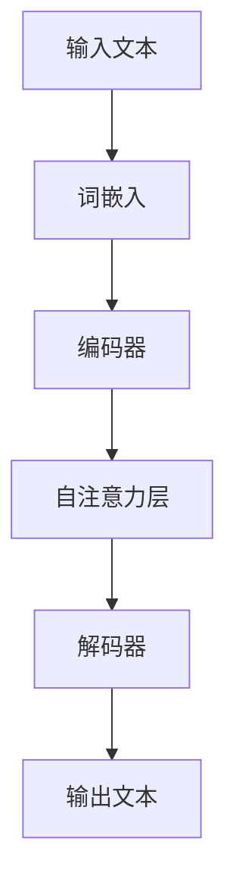

                 

### 大语言模型应用指南：提示的构成

> **关键词**：大语言模型、自然语言处理、提示优化、应用实践、安全性

**摘要**：本文旨在为读者提供一份全面的大语言模型应用指南，重点介绍大语言模型的基本概念、原理架构、训练优化、应用实践、提示优化以及安全性等方面的内容。通过对大语言模型各个核心环节的详细解析，本文希望帮助读者更好地理解和掌握大语言模型的应用方法和实践技巧。文章结构紧凑，逻辑清晰，包含丰富的实际案例和代码解读，适合广大计算机编程和人工智能领域的技术人员阅读和学习。

----------------------------------------------------------------

### 《大语言模型应用指南：提示的构成》目录大纲

本文将按照以下目录结构进行撰写：

#### 第一部分：大语言模型基础

**第1章：大语言模型概述**  
- **1.1 大语言模型的概念与历史**  
  - 大语言模型的发展历程  
  - 大语言模型的基本原理

- **1.2 大语言模型的特点与应用场景**  
  - 大语言模型的主要特点  
  - 大语言模型的应用场景

- **1.3 大语言模型的技术架构**  
  - 大语言模型的技术架构概述  
  - 大语言模型的核心组成部分

- **1.4 大语言模型的发展趋势与挑战**  
  - 大语言模型的发展趋势  
  - 大语言模型面临的挑战

**第2章：自然语言处理基础**  
- **2.1 自然语言处理的基本概念**  
  - 自然语言处理的目标  
  - 自然语言处理的基本流程

- **2.2 语言模型与统计语言模型**  
  - 语言模型的定义  
  - 统计语言模型的基本原理

- **2.3 序列模型与深度学习**  
  - 序列模型的基本原理  
  - 深度学习在自然语言处理中的应用

- **2.4 注意力机制与编码器-解码器架构**  
  - 注意力机制的作用  
  - 编码器-解码器架构的原理与应用

**第3章：大语言模型的训练与优化**  
- **3.1 大语言模型的训练方法**  
  - 训练数据的准备  
  - 大规模预训练的方法

- **3.2 大语言模型的优化技术**  
  - 优化算法的选择  
  - 参数优化策略

- **3.3 大语言模型的评估与调整**  
  - 评估指标的选择  
  - 模型的调整与优化

**第4章：大语言模型的应用实践**  
- **4.1 大语言模型在文本生成中的应用**  
  - 文本生成的原理与实现  
  - 文本生成的应用场景

- **4.2 大语言模型在问答系统中的应用**  
  - 问答系统的原理与实现  
  - 问答系统的应用场景

- **4.3 大语言模型在对话系统中的应用**  
  - 对话系统的原理与实现  
  - 对话系统的应用场景

**第5章：大语言模型的提示优化**  
- **5.1 提示的概念与作用**  
  - 提示的定义  
  - 提示在语言模型中的应用

- **5.2 提示的设计原则与方法**  
  - 提示的设计原则  
  - 提示的设计方法

- **5.3 提示的优化技术**  
  - 提示优化的方法  
  - 提示优化的效果评估

**第6章：大语言模型的安全性**  
- **6.1 大语言模型的安全性挑战**  
  - 模型暴露的风险  
  - 模型对抗攻击

- **6.2 大语言模型的安全防护措施**  
  - 数据保护策略  
  - 模型安全性评估

**第7章：大语言模型的应用前景与未来发展趋势**  
- **7.1 大语言模型的应用前景**  
  - 人工智能行业的应用  
  - 生活服务的应用

- **7.2 大语言模型的发展趋势**  
  - 技术的发展趋势  
  - 社会与经济的影响

#### 附录

- **附录A：大语言模型开发资源**  
  - 开发工具介绍  
  - 开发资源推荐

- **附录B：大语言模型相关术语解释**  
  - 术语列表与解释

**核心概念与联系**

- **大语言模型原理架构图（Mermaid）**  
  mermaid  
  graph TD  
  A[语言模型] --> B[词向量]  
  B --> C[神经网络]  
  C --> D[参数优化]  
  D --> E[预测]

**核心算法原理讲解**

- **文本生成伪代码**  
  python  
  def text_generation(input_prompt):  
    # 初始化模型  
    model = initialize_model()  
      
    # 生成文本  
    output_text = ""  
    while not finished:  
      # 预测下一个词  
      next_word = model.predict(input_prompt)  
      
      # 更新输入提示  
      input_prompt = input_prompt + " " + next_word  
      
      # 添加到输出文本  
      output_text = output_text + " " + next_word  
      
    return output_text

**数学模型和数学公式**

- **语言模型的损失函数（LaTeX）**  
  latex  
  L = -\sum_{i=1}^{N} y_i \log(p(x_i | \theta))

**项目实战**

- **问答系统项目实战**  
  - **开发环境搭建**  
    - 硬件需求：CPU/GPU  
    - 软件需求：Python, TensorFlow

  - **源代码实现**  
    python  
    # 加载预训练模型  
    model = load_pretrained_model()

    # 定义问答函数  
    def answer_question(question):  
        # 预处理问题  
        processed_question = preprocess_question(question)  
        
        # 生成答案  
        answer = model.predict(processed_question)  
        
        # 后处理答案  
        final_answer = postprocess_answer(answer)  
        
        return final_answer
    
    # 测试问答系统  
    print(answer_question("什么是人工智能？"))

  - **代码解读与分析**  
    - **模型加载与预处理**  
      - 加载预训练的大语言模型  
      - 对输入问题进行预处理，包括分词、去停用词等操作  
    - **生成答案与后处理**  
      - 使用模型生成答案  
      - 对生成的答案进行后处理，如文本润色、格式化等操作

---

### 《大语言模型应用指南：提示的构成》的撰写计划

为了确保文章内容丰富、结构清晰、逻辑严密，我们将按照以下步骤进行撰写：

#### 第一步：整理大纲和内容框架

在撰写文章之前，首先需要整理出一个详细的目录大纲，明确各个章节的主题和内容。根据已有的目录大纲，我们可以将文章分为以下几个部分：

1. **引言**：简要介绍大语言模型的概念、背景和应用。
2. **第一部分：大语言模型基础**：包括大语言模型的概述、自然语言处理基础、大语言模型的训练与优化。
3. **第二部分：大语言模型的应用实践**：包括大语言模型在文本生成、问答系统和对话系统中的应用。
4. **第三部分：大语言模型的提示优化**：介绍提示的概念、设计原则和优化技术。
5. **第四部分：大语言模型的安全性**：讨论大语言模型的安全性挑战和防护措施。
6. **第五部分：大语言模型的应用前景与未来发展趋势**：分析大语言模型在人工智能行业和生活服务中的应用前景和发展趋势。
7. **附录**：提供大语言模型开发资源和相关术语解释。

#### 第二步：撰写核心内容

在完成大纲和内容框架的整理后，我们将开始撰写各个章节的核心内容。对于每个章节，我们将按照以下步骤进行：

1. **引言**：简要介绍章节主题、背景和应用。
2. **正文**：详细阐述章节的核心内容，包括理论讲解、算法原理、应用实践和案例分析等。
3. **小结**：总结章节的主要内容和关键知识点。

#### 第三步：整理和优化内容

在撰写完各个章节的核心内容后，我们将对内容进行整理和优化，确保文章的逻辑性、完整性和连贯性。具体包括：

1. **调整章节顺序**：根据内容的关联性和逻辑性，调整章节的顺序。
2. **优化文字表述**：对文章中的文字表述进行优化，确保语言简洁、准确、易懂。
3. **添加图表和代码示例**：为提高文章的可读性和实用性，添加相关的图表、代码示例和注释。

#### 第四步：完成最终稿

在完成内容的整理和优化后，我们将进行最后的修订和校对，确保文章的格式、引用和参考文献等符合规范。最终完成文章的撰写，形成一个完整、高质量的大语言模型应用指南。

---

### **第一部分：大语言模型基础**

#### 第1章 大语言模型概述

**1.1 大语言模型的概念与历史**

大语言模型（Large-scale Language Model），顾名思义，是一种能够处理大规模文本数据，并从中学习语言模式和语义信息的机器学习模型。这类模型在自然语言处理（Natural Language Processing, NLP）领域具有重要地位，因为它们能够理解和生成人类语言，从而在文本分类、机器翻译、问答系统、对话系统等任务中发挥关键作用。

**历史背景**：大语言模型的发展可以追溯到20世纪80年代，当时研究人员开始探索如何利用机器学习技术来处理自然语言。早期的工作主要集中在基于规则的方法上，如概率上下文无关文法（Probabilistic Context-Free Grammar, PCFG）和最大熵模型（Maximum Entropy Model）。然而，这些方法在处理复杂语言现象时效果有限。

随着计算能力和算法的进步，特别是在深度学习和神经网络技术引入NLP领域后，大语言模型开始崭露头角。2000年代初，循环神经网络（Recurrent Neural Network, RNN）成为处理序列数据的一种有效方法。然而，RNN在处理长序列时存在梯度消失和梯度爆炸的问题，导致模型训练效果不理想。

为了解决这些问题，研究人员提出了长短期记忆网络（Long Short-Term Memory, LSTM）和门控循环单元（Gated Recurrent Unit, GRU），它们通过引入门控机制来更好地捕获长期依赖关系。这些改进的RNN模型在一定程度上提升了大语言模型的性能，但仍未能完全解决长序列处理的问题。

直到2017年，谷歌发布了Transformer模型，这标志着大语言模型进入了一个新的阶段。Transformer模型采用了自注意力机制（Self-Attention Mechanism），通过并行计算方式处理长序列，从而显著提高了模型的训练效率和性能。此后，一系列基于Transformer的变体模型，如BERT（Bidirectional Encoder Representations from Transformers）、GPT（Generative Pre-trained Transformer）等，相继出现，并在NLP任务中取得了显著的成果。

**基本原理**：大语言模型的核心原理是基于神经网络对大规模文本数据进行预训练，然后通过微调（Fine-tuning）将模型应用于具体的任务。预训练过程中，模型学习到语言的内在结构和语义信息，从而能够更好地理解和生成人类语言。

1. **输入表示**：大语言模型将输入文本转换为向量表示，通常使用词嵌入（Word Embedding）技术，如Word2Vec、GloVe等。词嵌入将单词映射为高维向量，使得具有相似语义的单词在向量空间中彼此接近。

2. **编码器-解码器架构**：大语言模型通常采用编码器-解码器（Encoder-Decoder）架构，其中编码器（Encoder）将输入序列编码为固定长度的向量表示，解码器（Decoder）则根据编码器的输出生成输出序列。这种架构使得模型能够处理变长输入和输出序列。

3. **自注意力机制**：Transformer模型采用自注意力机制，通过计算输入序列中各个位置之间的相关性来生成输出序列。自注意力机制使得模型能够关注输入序列中的关键信息，从而提高模型的性能。

4. **预训练与微调**：大语言模型首先在大规模文本语料库上进行预训练，学习到语言的通用特征。然后，通过微调（Fine-tuning）将模型应用于特定任务，如文本分类、机器翻译、问答等。微调过程通常涉及在特定任务数据集上进行训练，以优化模型在目标任务上的性能。

**应用场景**：大语言模型在自然语言处理领域具有广泛的应用场景，包括：

1. **文本分类**：将文本数据分类到预定义的类别中，如情感分析、新闻分类等。
2. **机器翻译**：将一种语言的文本翻译成另一种语言，如英译中、中译英等。
3. **问答系统**：从大量文本数据中检索并生成相关答案，如基于事实的问答、对话系统等。
4. **文本生成**：根据输入提示生成新的文本内容，如故事创作、摘要生成等。
5. **对话系统**：构建能够与人类进行自然语言交互的对话系统，如智能客服、聊天机器人等。

**1.2 大语言模型的特点与应用场景**

**特点**：

1. **强大的语言理解能力**：大语言模型通过预训练学习到丰富的语言知识，能够对输入文本进行深入理解，从而在文本分类、问答等任务中表现出色。
2. **端到端处理**：大语言模型采用编码器-解码器架构，能够直接将输入文本映射为输出文本，实现端到端处理，简化了模型的实现和部署。
3. **并行计算**：自注意力机制使得大语言模型能够并行处理输入序列，从而显著提高了模型的训练和推理速度。
4. **泛化能力**：大语言模型在大规模文本语料库上进行预训练，能够学习到通用的语言特征，从而在新的任务和数据集上表现出较强的泛化能力。
5. **可解释性**：尽管大语言模型在处理复杂语言现象时表现出色，但其内部决策过程仍然较为复杂，缺乏透明度和可解释性。

**应用场景**：

1. **文本分类**：大语言模型在文本分类任务中具有强大的表现，能够将文本数据自动分类到预定义的类别中，如情感分析、新闻分类等。例如，可以使用大语言模型对社交媒体平台上的用户评论进行情感分类，从而识别出用户对产品或服务的正面或负面评价。
2. **机器翻译**：大语言模型在机器翻译任务中也取得了显著的成果，能够将一种语言的文本准确翻译成另一种语言。例如，谷歌翻译、百度翻译等应用都是基于大语言模型实现的。
3. **问答系统**：大语言模型在问答系统中的应用非常广泛，可以从大量文本数据中检索并生成相关答案。例如，智能客服系统可以使用大语言模型理解用户的问题，并生成相应的回答。
4. **文本生成**：大语言模型能够根据输入提示生成新的文本内容，如故事创作、摘要生成等。例如，一些AI写作工具可以使用大语言模型自动生成新闻报道、产品描述等。
5. **对话系统**：大语言模型在对话系统中扮演着重要的角色，能够与人类进行自然语言交互。例如，聊天机器人可以使用大语言模型理解用户的提问，并生成相应的回答。

**1.3 大语言模型的技术架构**

**技术架构概述**：大语言模型的技术架构主要包括编码器（Encoder）、解码器（Decoder）和自注意力机制（Self-Attention Mechanism）等组成部分。下面将详细介绍这些核心组件。

1. **编码器（Encoder）**：
   编码器负责将输入文本序列转换为固定长度的向量表示。在Transformer模型中，编码器通常由多个自注意力层（Self-Attention Layer）和前馈神经网络（Feedforward Neural Network）堆叠而成。每个自注意力层通过计算输入序列中各个位置之间的相关性来生成新的表示，从而捕获长距离依赖关系。

   编码器的输入是一个词嵌入序列，每个词嵌入表示一个单词的语义信息。编码器首先通过嵌入层（Embedding Layer）将词嵌入映射为高维向量，然后通过位置编码（Positional Encoding）为序列添加位置信息。在编码器的每个自注意力层中，每个词嵌入都会与其他词嵌入进行加权求和，并通过激活函数（如ReLU）进行非线性变换。

2. **解码器（Decoder）**：
   解码器负责将编码器生成的固定长度向量表示解码为输出文本序列。在Transformer模型中，解码器也由多个自注意力层和前馈神经网络组成，与编码器类似。解码器的自注意力层分为自注意力（Self-Attention）和交叉注意力（Cross-Attention）两部分。自注意力层关注编码器的输出，而交叉注意力层关注编码器的输出和当前解码器的输入，从而实现上下文的融合。

   解码器在生成每个输出词时，会首先通过嵌入层将词嵌入映射为高维向量，然后通过位置编码添加位置信息。在每个自注意力层和交叉注意力层之后，解码器还会通过前馈神经网络进行非线性变换。

3. **自注意力机制（Self-Attention Mechanism）**：
   自注意力机制是Transformer模型的核心组件，它通过计算输入序列中各个位置之间的相关性来生成新的表示。自注意力机制包括三个步骤：查询（Query）、键（Key）和值（Value）。

   - 查询（Query）：每个词嵌入都被映射为一个查询向量，表示该词在上下文中的重要性。
   - 键（Key）：每个词嵌入都被映射为一个键向量，用于计算与其他词嵌入的相关性。
   - 值（Value）：每个词嵌入都被映射为一个值向量，用于加权求和生成新的表示。

   自注意力层的计算过程如下：
   $$ 
   \text{Attention}(Q, K, V) = \text{softmax}\left(\frac{QK^T}{\sqrt{d_k}}\right)V 
   $$
   其中，$Q$、$K$和$V$分别表示查询、键和值向量，$d_k$表示键向量的维度。$QK^T$计算得到注意力分数，通过softmax函数进行归一化，最后与值向量$V$进行加权求和，得到新的表示。

   自注意力机制使得模型能够在处理长序列时保持高效的计算，并通过加权求和的方式捕获长距离依赖关系。

**1.4 大语言模型的发展趋势与挑战**

**发展趋势**：

1. **模型规模不断增加**：随着计算资源和数据量的增加，大语言模型的规模也在不断增长。例如，GPT-3模型包含1750亿个参数，是目前最大的预训练语言模型之一。
2. **多模态学习**：大语言模型正在扩展到多模态学习领域，能够处理包括文本、图像、音频等多种类型的数据。例如，Vision Transformer（ViT）将自注意力机制应用于图像处理，取得了显著的效果。
3. **迁移学习**：大语言模型通过预训练学习到丰富的语言知识，可以应用于多种任务，实现迁移学习（Transfer Learning）。这种方法可以显著提高模型的泛化能力和训练效率。
4. **可解释性研究**：尽管大语言模型在处理复杂语言现象时表现出色，但其内部决策过程仍然较为复杂，缺乏透明度和可解释性。研究人员正在探索如何提高模型的可解释性，使其更加易于理解和解释。

**挑战**：

1. **计算资源需求**：大语言模型的训练和推理过程需要大量的计算资源，包括GPU、TPU等硬件设备。随着模型规模的增加，计算资源需求也在不断上升。
2. **数据质量和标注**：大语言模型的效果高度依赖于训练数据的质量和标注。然而，高质量的数据集和标注资源往往较为稀缺，需要投入大量的人力和物力进行数据采集和标注。
3. **伦理和社会影响**：大语言模型在处理用户数据时可能会引发一系列伦理和社会问题，如隐私泄露、偏见和误导等。研究人员需要关注这些问题，并制定相应的规范和策略。
4. **模型安全性和攻击**：大语言模型在处理敏感数据时可能会面临安全威胁，如模型暴露、对抗攻击等。研究人员需要关注模型安全性和防御策略的研究。

通过上述内容，我们对大语言模型的基本概念、原理架构、特点和应用场景有了初步的了解。在下一章中，我们将进一步探讨自然语言处理的基础知识，包括语言模型、序列模型和深度学习等。这将帮助我们更好地理解大语言模型的工作原理和应用方法。

---

### **第二部分：自然语言处理基础**

#### 第2章 自然语言处理基础

**2.1 自然语言处理的基本概念**

自然语言处理（Natural Language Processing，NLP）是计算机科学和人工智能领域的一个分支，旨在使计算机能够理解和生成人类自然语言。NLP的目标是让计算机能够识别、理解、处理和生成自然语言，以便与人类进行有效的沟通。NLP的应用范围广泛，包括但不限于语音识别、机器翻译、文本分类、情感分析、问答系统和对话系统等。

**自然语言处理的目标**：

1. **文本理解**：使计算机能够理解文本的语义和上下文信息。
2. **文本生成**：根据给定的输入生成有意义的文本。
3. **语言模型**：建立模型来预测文本中的下一个词或句子。
4. **信息提取**：从文本中提取关键信息，如实体识别、关系抽取等。
5. **文本比较**：比较两个或多个文本之间的相似性或差异性。

**自然语言处理的基本流程**：

1. **文本预处理**：包括分词、去停用词、词干提取、词形还原等操作，以便将原始文本转换为适合模型处理的格式。
2. **特征提取**：将预处理后的文本转换为数值特征表示，如词嵌入、词袋模型、TF-IDF等。
3. **模型训练**：使用训练数据集训练模型，学习文本的特征和语义信息。
4. **模型评估**：使用验证数据集评估模型的性能，调整模型参数以优化性能。
5. **模型部署**：将训练好的模型部署到实际应用场景中，如文本分类、机器翻译等。

**2.2 语言模型与统计语言模型**

语言模型（Language Model）是NLP中一个核心的概念，用于预测文本序列中下一个词或句子的概率分布。在统计语言模型的基础上，我们可以通过分析大量文本数据来学习语言的统计规律，从而生成具有自然流畅性的文本。

**语言模型的定义**：

语言模型是一个概率模型，它能够根据已知的文本序列预测下一个词或句子的概率分布。形式上，语言模型可以表示为：

$$
P(w_1, w_2, ..., w_n) = P(w_n | w_1, w_2, ..., w_{n-1})
$$

其中，$w_i$表示第$i$个词。

**统计语言模型的基本原理**：

统计语言模型通过分析大量文本数据，学习到单词之间的统计规律。这些规律包括：

1. **共现概率**：单词之间的共现频率，即一个词出现在另一个词后面的概率。
2. **转移概率**：上下文词对之间的转移概率，即给定一个词序列，下一个词出现的概率。
3. **词频统计**：单词的频率分布，即每个单词在文本中出现的频率。

统计语言模型通常基于以下几种模型：

1. **N-gram模型**：N-gram模型是一种基于单词序列的统计模型，它假设当前词的概率仅与前面的N-1个词相关。N-gram模型是最简单的语言模型，形式如下：

   $$
   P(w_n | w_{n-1}, ..., w_{n-N+1}) = \frac{C(w_{n-1}, ..., w_{n-N+1}, w_n)}{C(w_{n-1}, ..., w_{n-N+1})}
   $$

   其中，$C(w_{n-1}, ..., w_{n-N+1}, w_n)$表示单词序列$w_{n-1}, ..., w_{n-N+1}, w_n$在训练数据中出现的次数，$C(w_{n-1}, ..., w_{n-N+1})$表示单词序列$w_{n-1}, ..., w_{n-N+1}$在训练数据中出现的次数。

2. **马尔可夫模型**：马尔可夫模型是一种基于状态转移概率的语言模型，它假设当前词的概率仅与当前状态相关，而与历史状态无关。马尔可夫模型可以表示为：

   $$
   P(w_n | w_{n-1}) = \frac{C(w_{n-1}, w_n)}{C(w_{n-1})}
   $$

   其中，$C(w_{n-1}, w_n)$表示单词序列$w_{n-1}, w_n$在训练数据中出现的次数，$C(w_{n-1})$表示单词序列$w_{n-1}$在训练数据中出现的次数。

3. **隐马尔可夫模型（HMM）**：隐马尔可夫模型是一种基于状态转移概率和观测概率的语言模型，它假设当前词的概率由隐藏的状态和观测的词共同决定。HMM可以表示为：

   $$
   P(w_n | h_n) = \frac{P(h_n | w_n)P(w_n)}{P(h_n)}
   $$

   其中，$h_n$表示第$n$个隐藏状态，$P(h_n | w_n)$表示隐藏状态$h_n$在给定观测词$w_n$的条件概率，$P(w_n)$表示观测词$w_n$的概率。

**2.3 序列模型与深度学习**

序列模型（Sequence Model）是一类用于处理序列数据的机器学习模型，包括循环神经网络（Recurrent Neural Network，RNN）、长短期记忆网络（Long Short-Term Memory，LSTM）和门控循环单元（Gated Recurrent Unit，GRU）等。序列模型能够捕获序列数据中的时间依赖关系，从而在自然语言处理任务中表现出色。

**序列模型的基本原理**：

序列模型通过处理输入序列的每个元素，生成输出序列。每个时间步的处理包括以下步骤：

1. **输入表示**：将输入序列转换为高维向量表示，如词嵌入。
2. **隐藏状态**：在每个时间步，模型计算一个隐藏状态，用于表示当前输入和前一个隐藏状态的结合。
3. **输出预测**：使用隐藏状态预测当前时间步的输出，如下一个词的概率分布。

**深度学习在自然语言处理中的应用**：

深度学习（Deep Learning）是一种基于多层神经网络的学习方法，它通过逐层提取特征，实现从原始数据到复杂抽象表示的映射。深度学习在自然语言处理中取得了显著的成功，主要得益于以下几个方面的优势：

1. **特征自动提取**：深度学习模型能够自动学习输入数据的特征表示，从而减轻手动特征提取的工作负担。
2. **端到端处理**：深度学习模型能够直接从原始数据生成预测结果，实现端到端处理，从而简化模型的实现和部署。
3. **多任务学习**：深度学习模型能够通过共享参数和特征表示，实现多任务学习，从而提高模型的泛化能力和效率。

在自然语言处理中，常用的深度学习模型包括：

1. **卷积神经网络（Convolutional Neural Network，CNN）**：CNN通过卷积操作和池化操作，从输入序列中提取局部特征，常用于文本分类、情感分析等任务。
2. **循环神经网络（Recurrent Neural Network，RNN）**：RNN通过循环连接和隐藏状态，处理序列数据，能够捕获长距离依赖关系。
3. **长短期记忆网络（Long Short-Term Memory，LSTM）**：LSTM是RNN的一种改进，通过引入门控机制，解决RNN的梯度消失和梯度爆炸问题，能够更好地捕获长距离依赖关系。
4. **门控循环单元（Gated Recurrent Unit，GRU）**：GRU是LSTM的简化版，通过合并输入门和控制门，减少模型参数，同时也能够有效捕获长距离依赖关系。

**2.4 注意力机制与编码器-解码器架构**

注意力机制（Attention Mechanism）是深度学习中的一个重要概念，用于解决序列到序列（Sequence-to-Sequence）学习问题，如机器翻译、问答系统等。注意力机制通过动态调整模型对输入序列的关注程度，从而提高模型的预测性能。

**注意力机制的作用**：

1. **信息聚焦**：注意力机制使得模型能够关注输入序列中的关键信息，从而提高模型的注意力集中度和预测准确性。
2. **长距离依赖**：注意力机制能够通过跨时间步的注意力权重，捕获长距离依赖关系，从而提高模型对序列数据的长距离理解能力。
3. **端到端处理**：注意力机制使得模型能够直接从输入序列生成输出序列，实现端到端处理，从而简化模型的实现和部署。

**编码器-解码器架构（Encoder-Decoder Architecture）**：

编码器-解码器架构是一种用于处理序列到序列学习任务的模型架构，包括编码器（Encoder）和解码器（Decoder）两部分。编码器负责将输入序列编码为固定长度的向量表示，解码器则根据编码器的输出生成输出序列。

**编码器-解码器架构的原理与应用**：

1. **编码器（Encoder）**：

   编码器负责将输入序列编码为固定长度的向量表示，通常由多个循环神经网络层（如LSTM或GRU）堆叠而成。编码器在每个时间步计算一个隐藏状态，并将其传递给解码器。

   编码器的输入是一个词嵌入序列，每个词嵌入表示一个单词的语义信息。编码器首先通过嵌入层（Embedding Layer）将词嵌入映射为高维向量，然后通过位置编码（Positional Encoding）为序列添加位置信息。在编码器的每个循环层中，每个词嵌入都会与其他词嵌入进行加权求和，并通过激活函数（如ReLU）进行非线性变换。

   编码器的主要作用是将输入序列转换为固定长度的向量表示，以便解码器能够根据编码器的输出生成输出序列。

2. **解码器（Decoder）**：

   解码器负责将编码器生成的固定长度向量表示解码为输出序列，通常也由多个循环神经网络层组成。解码器在生成每个输出词时，会首先通过嵌入层将词嵌入映射为高维向量，然后通过位置编码添加位置信息。

   解码器的自注意力层分为自注意力（Self-Attention）和交叉注意力（Cross-Attention）两部分。自注意力层关注编码器的输出，而交叉注意力层关注编码器的输出和当前解码器的输入，从而实现上下文的融合。

   解码器的主要作用是根据编码器的输出和当前输入，生成有意义的输出序列。

编码器-解码器架构在自然语言处理任务中具有广泛的应用，如机器翻译、问答系统和对话系统等。通过编码器-解码器架构，模型能够实现端到端处理，从而简化模型的实现和部署。

在下一章中，我们将进一步探讨大语言模型的训练与优化，包括训练方法、优化技术和评估指标等内容。这将帮助我们更好地理解大语言模型在实际应用中的性能提升和优化策略。

---

### **第三部分：大语言模型的训练与优化**

#### 第3章 大语言模型的训练与优化

**3.1 大语言模型的训练方法**

大语言模型的训练方法主要包括数据准备、预训练和微调等步骤。以下将详细介绍这些步骤及其具体实现方法。

**数据准备**

数据准备是训练大语言模型的基础，高质量的训练数据对于模型的性能至关重要。以下是数据准备的主要步骤：

1. **数据收集**：收集大规模、高质量的文本数据。这些数据可以来自于互联网、图书、新闻、社交媒体等多种来源。常用的数据集包括维基百科、Common Crawl、Gutenberg等。
2. **数据预处理**：对收集到的文本数据进行处理，包括分词、去除停用词、词干提取等操作。这些操作有助于提高数据的质量和一致性，从而有助于模型的学习。
3. **数据清洗**：去除文本中的噪声和错误，如HTML标签、特殊字符等。这可以通过编写正则表达式或使用现有的数据清洗库（如NLTK、spaCy）来实现。

**预训练**

预训练是指在大规模文本语料库上进行模型训练，学习到语言的通用特征。预训练过程通常包括以下步骤：

1. **文本预处理**：对大规模文本数据进行预处理，包括分词、去停用词、词干提取等操作。这些操作有助于将文本转换为适合模型处理的格式。
2. **构建词汇表**：将预处理后的文本转换为词嵌入表示。常用的词嵌入技术包括Word2Vec、GloVe和BERT等。词汇表包含所有训练数据中的单词，并为其分配唯一的索引。
3. **模型初始化**：初始化大语言模型，包括编码器和解码器。编码器和解码器通常由多层循环神经网络或Transformer模型组成。模型初始化可以使用预训练好的模型权重，以加快训练过程并提高模型性能。
4. **训练过程**：在预训练过程中，模型会不断调整参数，以最小化损失函数（如交叉熵损失）。训练过程通常采用批处理（Batch Processing）和反向传播（Backpropagation）算法。训练过程中，模型会经历多个epochs（训练周期），每次epoch都会遍历整个训练数据集。

**微调**

微调是指在大规模预训练的基础上，针对特定任务对模型进行进一步训练。微调过程有助于模型适应特定任务的需求，从而提高任务性能。以下是微调的主要步骤：

1. **任务定义**：定义具体的任务，如文本分类、机器翻译、问答系统等。
2. **数据准备**：准备用于微调的任务数据，包括训练数据集和验证数据集。训练数据集用于训练模型，验证数据集用于评估模型性能。
3. **模型调整**：在预训练模型的基础上，对模型进行微调。微调过程通常包括调整模型参数、学习率和正则化策略等。为了提高微调效果，可以采用迁移学习（Transfer Learning）和模型蒸馏（Model Distillation）等技术。
4. **模型评估**：使用验证数据集评估微调后模型的性能。根据评估结果，调整模型参数和训练策略，以优化模型性能。

**3.2 大语言模型的优化技术**

大语言模型的优化技术主要包括优化算法、参数优化策略和超参数调优等。以下将详细介绍这些优化技术。

**优化算法**

优化算法是指用于调整模型参数，以最小化损失函数的算法。以下是一些常用的优化算法：

1. **随机梯度下降（Stochastic Gradient Descent，SGD）**：SGD是一种简单的优化算法，它通过随机选择训练样本来更新模型参数。SGD具有实现简单、计算效率高等优点，但在训练过程中可能会出现局部最小值和梯度消失等问题。
2. **动量（Momentum）**：动量是一种改进的SGD算法，它通过引入动量项，保留过去的梯度信息，从而加速模型收敛。动量算法可以避免局部最小值和振荡现象，提高模型训练的稳定性。
3. **自适应梯度算法（Adaptive Gradient Algorithm，AGA）**：AGA是一类基于自适应学习率的优化算法，如Adagrad、Adam和AdaMax等。这些算法通过自适应调整学习率，提高模型训练效率和收敛速度。
4. **Adam算法**：Adam算法是一种基于一阶矩估计（Mean）和二阶矩估计（Variance）的优化算法，它结合了Adagrad和RMSprop的优点，能够在不同任务和数据集上表现出良好的性能。

**参数优化策略**

参数优化策略是指用于调整模型参数，以优化模型性能的方法。以下是一些常用的参数优化策略：

1. **学习率调整**：学习率是优化算法中的重要参数，它决定了模型参数更新的步长。合适的初始学习率可以加速模型收敛，但过大会导致模型无法收敛或出现振荡现象。常用的学习率调整策略包括线性递减、指数递减和自适应调整等。
2. **权重初始化**：权重初始化是模型训练过程中重要的一步。合适的权重初始化可以加速模型收敛，提高模型性能。常用的权重初始化方法包括随机初始化、高斯初始化和Xavier初始化等。
3. **正则化**：正则化是一种用于防止模型过拟合的方法。常见的正则化方法包括L1正则化、L2正则化和Dropout等。L1正则化和L2正则化通过在损失函数中添加权重惩罚项，降低模型复杂度，从而防止过拟合。Dropout通过随机丢弃部分神经元，提高模型的泛化能力。

**超参数调优**

超参数调优是指调整模型超参数，以优化模型性能。超参数是模型训练过程中不易通过学习算法自动调整的参数，如学习率、批次大小、迭代次数等。超参数调优可以通过手动调整、网格搜索和贝叶斯优化等方法来实现。以下是一些常用的超参数调优方法：

1. **手动调优**：手动调优是一种直观、简单的超参数调优方法，通过不断调整超参数，观察模型性能的变化，找到最优的超参数组合。
2. **网格搜索（Grid Search）**：网格搜索是一种基于枚举的超参数调优方法，它通过遍历所有可能的超参数组合，找到最优的超参数组合。网格搜索的计算成本较高，但在超参数数量较少时仍然是一种有效的方法。
3. **贝叶斯优化（Bayesian Optimization）**：贝叶斯优化是一种基于概率模型的超参数调优方法，它通过构建先验概率分布，并在搜索过程中不断更新模型参数，找到最优的超参数组合。贝叶斯优化具有较高的计算效率和收敛速度，但在超参数数量较多时可能会变得复杂。

**3.3 大语言模型的评估与调整**

大语言模型的评估与调整是保证模型性能的重要环节。以下将介绍常用的评估指标和模型调整方法。

**评估指标**

评估指标是衡量模型性能的重要工具。以下是一些常用的大语言模型评估指标：

1. **准确率（Accuracy）**：准确率是指模型预测正确的样本数量与总样本数量的比例。准确率适用于分类任务，是一种简单直观的评估指标。
2. **精确率、召回率和F1值（Precision, Recall, F1-Score）**：精确率是指模型预测为正类的样本中实际为正类的比例，召回率是指模型预测为正类的样本中实际为正类的比例，F1值是精确率和召回率的加权平均。精确率和召回率适用于二分类任务，F1值能够更好地平衡精确率和召回率。
3. **平均准确率（Average Accuracy）**：平均准确率是指模型在多个分类任务上的准确率的平均值，适用于多分类任务。
4. **困惑度（Perplexity）**：困惑度是语言模型的一个评价指标，用于衡量模型生成文本的流利度。困惑度越低，表示模型对文本的理解越好。
5. **BLEU分数（BLEU Score）**：BLEU分数是一种用于评估机器翻译质量的指标，通过计算机器翻译结果与人工翻译结果的相似度来评估模型性能。

**模型调整**

模型调整是指根据评估指标的结果，调整模型参数和结构，以优化模型性能。以下是一些常用的模型调整方法：

1. **重新训练**：重新训练是指根据评估结果，重新训练模型，以优化模型性能。重新训练可以调整模型参数和超参数，从而提高模型准确率和泛化能力。
2. **模型剪枝（Model Pruning）**：模型剪枝是一种用于减小模型大小和降低计算成本的方法，通过移除模型中不必要的参数来实现。模型剪枝可以显著提高模型在资源受限环境下的性能。
3. **模型融合（Model Ensembling）**：模型融合是指将多个模型的结果进行合并，以优化模型性能。常见的模型融合方法包括投票、加权平均和集成学习等。模型融合可以降低模型方差，提高模型泛化能力。

通过以上内容，我们详细介绍了大语言模型的训练与优化方法，包括数据准备、预训练、微调、优化算法、参数优化策略、超参数调优、评估指标和模型调整等。这些方法有助于提高大语言模型的性能和应用效果，为NLP任务的实现提供了重要的技术支持。在下一章中，我们将进一步探讨大语言模型在不同应用场景中的具体实现和实际效果。

---

### **第四部分：大语言模型的应用实践**

#### 第4章 大语言模型的应用实践

**4.1 大语言模型在文本生成中的应用**

文本生成是自然语言处理中的一个重要应用领域，大语言模型凭借其强大的语言理解和生成能力，在文本生成任务中表现出色。以下将介绍大语言模型在文本生成中的应用原理、实现方法以及应用场景。

**文本生成的原理**

文本生成是指根据给定的输入提示，生成具有自然流畅性的文本内容。大语言模型在文本生成任务中的原理主要包括以下步骤：

1. **输入表示**：将输入文本转换为向量表示，通常使用词嵌入技术，如Word2Vec、GloVe等。词嵌入将单词映射为高维向量，使得具有相似语义的单词在向量空间中彼此接近。
2. **编码器-解码器架构**：大语言模型采用编码器-解码器架构，编码器将输入序列编码为固定长度的向量表示，解码器则根据编码器的输出生成输出序列。编码器和解码器通常由多层循环神经网络或Transformer模型组成。
3. **生成过程**：在文本生成过程中，解码器逐个生成输出词，并在每个时间步计算下一个输出词的概率分布。生成器使用贪心策略（Greedy Strategy）选择概率最高的词作为下一个输出词，直到达到停止条件（如生成最大长度或生成终止词）。

**文本生成的实现方法**

以下是一个简单的文本生成实现方法，使用Python和Transformer模型：

```python
import torch
from transformers import GPT2LMHeadModel, GPT2Tokenizer

# 加载预训练模型
tokenizer = GPT2Tokenizer.from_pretrained('gpt2')
model = GPT2LMHeadModel.from_pretrained('gpt2')

# 输入文本
input_text = "今天天气很好，适合出去散步。"

# 将输入文本转换为编码器输入
input_ids = tokenizer.encode(input_text, return_tensors='pt')

# 生成文本
output_ids = model.generate(input_ids, max_length=50, num_return_sequences=1)

# 解码输出文本
output_text = tokenizer.decode(output_ids[0], skip_special_tokens=True)

print(output_text)
```

**文本生成的应用场景**

文本生成在大语言模型的应用中具有广泛的应用场景，以下是一些常见的应用场景：

1. **自动写作**：文本生成可以应用于自动写作，如新闻撰写、故事创作、博客生成等。通过大语言模型生成的内容可以辅助人类作者，提高写作效率和创作质量。
2. **摘要生成**：文本生成可以用于生成文章摘要，从原始文本中提取关键信息，生成简明扼要的摘要。这对于信息过载的时代尤为重要，有助于用户快速获取文章的核心内容。
3. **对话生成**：文本生成可以应用于对话系统，根据用户输入生成相应的回答。在智能客服、聊天机器人等应用中，大语言模型可以模拟人类对话，提供自然的交互体验。
4. **机器翻译**：文本生成可以用于辅助机器翻译，通过生成文本的方式提高翻译的准确性和流畅性。大语言模型可以根据源语言生成目标语言的文本，从而实现跨语言的文本生成和翻译。

**4.2 大语言模型在问答系统中的应用**

问答系统是一种能够根据用户输入生成相关答案的智能系统，广泛应用于客户服务、教育、医疗等多个领域。大语言模型在问答系统中具有强大的语言理解和生成能力，能够提高问答系统的性能和用户体验。

**问答系统的原理**

问答系统的工作原理主要包括以下步骤：

1. **问题理解**：将用户输入的问题转换为机器可处理的格式，如文本或编码序列。
2. **知识检索**：从知识库中检索与用户问题相关的信息，包括事实、概念、关系等。
3. **答案生成**：利用大语言模型生成与用户问题相关的答案。答案生成可以通过模板匹配、信息抽取和文本生成等方法实现。
4. **答案输出**：将生成的答案以自然语言的形式输出给用户。

**问答系统的实现方法**

以下是一个简单的问答系统实现方法，使用Python和Transformer模型：

```python
import torch
from transformers import DistilBertModel, DistilBertTokenizer

# 加载预训练模型
tokenizer = DistilBertTokenizer.from_pretrained('distilbert-base-uncased')
model = DistilBertModel.from_pretrained('distilbert-base-uncased')

# 用户输入
input_text = "什么是人工智能？"

# 将输入文本转换为编码器输入
input_ids = tokenizer.encode(input_text, return_tensors='pt')

# 提取编码器输出
output = model(input_ids)

# 解析答案
answer = tokenizer.decode(output[0][0], skip_special_tokens=True)

print(answer)
```

**问答系统的应用场景**

问答系统在现实世界中具有广泛的应用场景，以下是一些常见的应用场景：

1. **客户服务**：在电子商务、金融、航空等领域，问答系统可以用于自动回答用户的问题，提供即时的客户支持和服务。
2. **教育**：问答系统可以应用于在线教育平台，为学生提供自动化的答疑服务，提高学习效率和用户体验。
3. **医疗**：问答系统可以用于医疗咨询，为患者提供基于症状的疾病诊断和建议。
4. **智能搜索**：问答系统可以用于智能搜索系统，通过生成相关答案，提高搜索结果的相关性和用户体验。

**4.3 大语言模型在对话系统中的应用**

对话系统是一种能够与人类进行自然语言交互的智能系统，广泛应用于智能客服、虚拟助手、智能助理等领域。大语言模型在对话系统中具有强大的语言理解和生成能力，能够提供自然、流畅的对话体验。

**对话系统的原理**

对话系统的工作原理主要包括以下步骤：

1. **输入理解**：将用户输入的文本或语音转换为机器可处理的格式，如文本编码序列。
2. **上下文处理**：根据用户输入和系统上下文信息，生成对话系统的响应。上下文信息包括之前的对话历史、用户偏好、对话主题等。
3. **响应生成**：利用大语言模型生成自然、流畅的响应文本，与用户进行交互。
4. **输出理解**：将系统生成的响应文本转换为语音或文本，输出给用户。

**对话系统的实现方法**

以下是一个简单的对话系统实现方法，使用Python和Transformer模型：

```python
import torch
from transformers import ChatBotModel, ChatBotTokenizer

# 加载预训练模型
tokenizer = ChatBotTokenizer.from_pretrained('chatbot-bert')
model = ChatBotModel.from_pretrained('chatbot-bert')

# 用户输入
input_text = "你好，我想咨询一下贵公司的产品优惠信息。"

# 将输入文本转换为编码器输入
input_ids = tokenizer.encode(input_text, return_tensors='pt')

# 生成对话响应
output_ids = model.generate(input_ids, max_length=50, num_return_sequences=1)

# 解码输出文本
output_text = tokenizer.decode(output_ids[0], skip_special_tokens=True)

print(output_text)
```

**对话系统的应用场景**

对话系统在现实世界中具有广泛的应用场景，以下是一些常见的应用场景：

1. **智能客服**：在电子商务、金融、航空等领域，对话系统可以用于自动回答用户的问题，提供即时的客户支持和服务。
2. **虚拟助手**：对话系统可以应用于智能家居、车载系统、智能穿戴设备等，为用户提供个性化、便捷的服务。
3. **智能助理**：对话系统可以应用于企业内部，为员工提供工作支持、信息查询、日程管理等服务。
4. **社交机器人**：对话系统可以应用于社交媒体平台，与用户进行互动，提供娱乐、游戏、咨询等服务。

通过以上内容，我们详细介绍了大语言模型在文本生成、问答系统和对话系统中的应用原理、实现方法和应用场景。大语言模型凭借其强大的语言理解和生成能力，在NLP领域具有广泛的应用前景，为各类智能系统提供了重要的技术支持。在下一章中，我们将进一步探讨大语言模型的提示优化，以提升其应用效果和用户体验。

---

### **第五部分：大语言模型的提示优化**

#### 第5章 大语言模型的提示优化

**5.1 提示的概念与作用**

在自然语言处理领域，大语言模型的提示（Prompt）是一种引导模型生成目标输出文本的技术。提示的作用是帮助模型更好地理解输入文本的意图和上下文，从而生成更加准确和相关的输出。

**提示的定义**：提示是一种引导模型生成目标输出文本的文本片段。它可以包含一个或多个关键信息，用以明确模型的生成方向。在应用中，提示通常由两部分组成：一是具体的输入文本，二是提示信息，后者可以是关键词、短语或上下文提示。

**提示在语言模型中的应用**：大语言模型通过处理提示文本，理解其中的语义和意图，从而生成相应的输出文本。提示在模型中的应用主要表现在以下几个方面：

1. **增强生成文本的相关性**：通过提供明确的提示，模型可以更好地捕捉输入文本的主题和上下文，生成更加相关的输出文本。
2. **引导模型生成特定类型的文本**：通过提示，可以引导模型生成特定类型的文本，如新闻报道、产品描述或对话回复等。
3. **优化生成文本的质量**：合适的提示可以帮助模型避免生成无关或低质量的文本，提高输出文本的准确性和流畅度。

**5.2 提示的设计原则与方法**

为了使提示在大语言模型中发挥最佳效果，设计提示时需要遵循以下原则和方法：

1. **明确性**：提示应简洁明了，避免模糊或歧义，以确保模型能够准确理解其意图。例如，使用具体的名词、动词和短语，避免使用抽象或含糊的表述。
2. **相关性**：提示应与模型要生成的文本类型紧密相关，有助于模型聚焦于关键信息和上下文。例如，在生成新闻摘要时，提示可以包含新闻的主题、关键词和主要事件。
3. **多样性**：设计多种不同类型的提示，以应对不同的生成任务和场景。例如，可以设计问题提示、总结提示、描述提示等，以满足不同类型文本生成的需求。
4. **适应性**：提示应具备一定的适应性，能够根据不同的输入文本和任务需求进行调整。例如，可以通过调整提示的长度、语气和内容，以适应不同场景下的生成需求。
5. **引导性**：提示应具有一定的引导性，可以帮助模型明确生成文本的方向和结构。例如，可以使用逻辑关系词（如“因此”、“然而”）、标点符号等，以引导模型生成连贯的文本。

**设计方法**：

1. **基于模板的提示设计**：通过设计固定的模板，将关键信息嵌入到模板中，生成提示。例如，在生成新闻摘要时，可以使用“本文讲述了关于____的主题，主要内容包括____和____。”的模板。
2. **基于关键词的提示设计**：通过提取输入文本中的关键词，构建提示。例如，在生成对话回复时，可以使用“根据您的问题，以下是一些可能的回复：____、____、____。”的形式。
3. **基于上下文的提示设计**：通过分析输入文本的上下文信息，设计相关的提示。例如，在生成摘要时，可以使用“基于上文的描述，可以概括为以下内容：____。”的形式。

**5.3 提示的优化技术**

为了进一步提升大语言模型的生成效果，可以采用以下提示优化技术：

1. **提示生成算法**：开发基于深度学习的提示生成算法，能够根据输入文本和任务需求，自动生成高质量的提示。例如，可以使用生成对抗网络（GAN）或递归神经网络（RNN）等模型，进行提示生成。
2. **提示嵌入技术**：将提示嵌入到输入文本中，使其与输入文本紧密关联，从而提高模型的生成效果。例如，可以使用注意力机制或卷积神经网络（CNN）等模型，实现提示嵌入。
3. **提示调整技术**：根据模型生成文本的效果，动态调整提示的内容和形式，以优化生成文本的质量。例如，可以通过迭代优化或强化学习等技术，实现提示的自动调整。
4. **提示效果评估**：设计评估指标和方法，对提示的生成效果进行评估和优化。例如，可以使用BLEU分数、困惑度等指标，评估提示生成的文本质量。

通过以上内容，我们详细介绍了大语言模型的提示优化方法，包括提示的概念与作用、设计原则与方法以及优化技术。这些优化技术有助于提升大语言模型的生成效果和用户体验，为各类NLP应用提供更加智能和高效的解决方案。在下一章中，我们将进一步探讨大语言模型的安全性，以应对其在实际应用中面临的挑战。

---

### **第六部分：大语言模型的安全性**

#### 第6章 大语言模型的安全性

随着大语言模型在自然语言处理和人工智能领域的广泛应用，其安全性问题也逐渐引起关注。大语言模型在处理敏感数据和执行关键任务时，可能面临一系列安全挑战和风险。以下将详细介绍大语言模型的安全性挑战、潜在威胁以及相应的防护措施。

**6.1 大语言模型的安全性挑战**

**模型暴露的风险**：大语言模型通常涉及大量的敏感数据和处理复杂的算法，如果模型遭到恶意攻击或泄露，可能导致严重的安全风险。以下是一些具体的挑战：

1. **数据泄露**：大语言模型在训练和推理过程中处理的数据可能包含个人隐私信息，如姓名、地址、身份证号码等。如果这些数据被泄露，可能会导致个人隐私侵犯和数据滥用。
2. **模型篡改**：攻击者可能通过篡改模型参数或输入数据，操纵模型的输出结果，从而实现恶意目的。例如，在问答系统中，攻击者可以篡改模型的回答，传播虚假信息。
3. **模型注入**：攻击者可能在模型训练过程中注入恶意代码或数据，导致模型在推理时执行恶意操作。例如，在自动驾驶系统中，攻击者可以注入恶意指令，控制车辆的运行。

**模型对抗攻击**：大语言模型在处理文本数据时可能面临对抗攻击（Adversarial Attack），即攻击者通过微小扰动输入数据，导致模型输出结果产生错误。以下是一些常见的对抗攻击方法：

1. **文本对抗攻击**：攻击者通过对输入文本进行微小扰动，使得模型无法正确分类或理解文本的含义。例如，通过在文本中添加或删除少量字符，使得模型将正常文本分类为垃圾邮件或恶意软件。
2. **图像对抗攻击**：攻击者将对抗样本（Adversarial Examples）与文本输入结合，生成对抗性的图像文本对，从而欺骗模型。例如，在图像分类任务中，攻击者可以将正常图像与恶意文本结合，使得模型将图像分类为其他类别。

**6.2 大语言模型的安全防护措施**

**数据保护策略**：

1. **数据加密**：对敏感数据进行加密存储和传输，以防止数据泄露。常见的加密算法包括AES（Advanced Encryption Standard）和RSA（Rivest-Shamir-Adleman）等。
2. **数据去识别化**：在数据处理和存储过程中，对个人隐私信息进行去识别化处理，如匿名化、泛化等。这样可以降低数据泄露的风险。
3. **访问控制**：实施严格的访问控制策略，确保只有授权用户才能访问和处理敏感数据。常用的访问控制方法包括角色访问控制（Role-Based Access Control，RBAC）和访问控制列表（Access Control List，ACL）等。

**模型安全性评估**：

1. **安全测试**：对大语言模型进行安全测试，以发现潜在的漏洞和弱点。常见的测试方法包括静态代码分析、动态代码分析和模糊测试等。
2. **安全训练**：在模型训练过程中，引入安全训练机制，以增强模型的鲁棒性和安全性。例如，可以使用对抗训练（Adversarial Training）方法，提高模型对对抗样本的识别能力。
3. **持续监控**：对模型运行过程中进行实时监控，及时发现和响应潜在的安全威胁。例如，可以使用异常检测（Anomaly Detection）方法，监测模型输出结果的变化，从而发现异常行为。

**模型防护措施**：

1. **模型加固**：通过改进模型结构和算法，增强模型的鲁棒性和安全性。例如，可以使用基于深度强化学习的模型加固方法，提高模型对对抗攻击的抵抗力。
2. **防火墙和入侵检测系统**：部署防火墙和入侵检测系统，对模型进行实时防护，防止恶意攻击和入侵。例如，可以使用基于深度学习的入侵检测系统，识别和阻止恶意流量。
3. **备份和恢复**：定期备份模型和数据，以便在发生数据泄露或模型受损时，能够快速恢复系统的正常运行。

通过以上内容，我们详细介绍了大语言模型的安全性挑战、潜在威胁以及相应的防护措施。大语言模型的安全性对于其在实际应用中的可靠性和稳定性至关重要。在下一章中，我们将探讨大语言模型的应用前景和未来发展趋势，以展望其在人工智能领域的广阔前景。

---

### **第七章：大语言模型的应用前景与未来发展趋势**

**7.1 大语言模型的应用前景**

大语言模型作为一种强大的自然语言处理工具，已经在多个领域取得了显著的成果，其应用前景也十分广阔。以下是大语言模型在不同领域中的应用前景：

**人工智能行业**

1. **文本分析**：大语言模型可以用于文本分析，如情感分析、主题建模、内容摘要等。这些技术在市场调研、用户反馈分析、新闻推荐等领域具有广泛应用。
2. **智能客服**：大语言模型可以用于构建智能客服系统，实现与用户的自然语言交互，提供高效、精准的咨询服务。
3. **内容生成**：大语言模型可以用于生成文章、报告、广告等，提高内容创作效率和质量。
4. **对话系统**：大语言模型可以用于构建对话系统，如聊天机器人、虚拟助手等，为用户提供个性化的互动体验。

**生活服务**

1. **智能家居**：大语言模型可以用于智能家居系统的语音识别和交互，实现智能控制家居设备。
2. **在线教育**：大语言模型可以用于在线教育平台的问答系统、学习助手等，提供智能化的学习辅助。
3. **医疗健康**：大语言模型可以用于医疗健康领域的病历分析、疾病预测、健康咨询等，提高医疗服务的质量和效率。
4. **金融保险**：大语言模型可以用于金融保险行业的风险评估、客户服务、欺诈检测等，提高金融服务的安全性和用户体验。

**7.2 大语言模型的发展趋势**

**技术发展趋势**

1. **多模态学习**：随着多模态数据的不断增长，大语言模型将逐渐扩展到多模态学习领域，如图像-文本配对、语音-文本转换等，实现更丰富的应用场景。
2. **迁移学习**：大语言模型通过迁移学习技术，可以将预训练模型快速应用于新的任务和数据集，提高模型在不同领域的适应性和泛化能力。
3. **可解释性**：大语言模型的决策过程目前仍然较为复杂，缺乏透明度和可解释性。未来，研究人员将致力于提高模型的可解释性，使其更加易于理解和应用。
4. **模型压缩**：为了降低大语言模型对计算资源和存储空间的依赖，研究人员将不断探索模型压缩技术，如模型剪枝、量化等，以实现模型的轻量化。

**社会与经济影响**

1. **工作效率提升**：大语言模型的应用将显著提高各类工作的效率，如文本生成、内容审核、客服支持等，从而释放人力资源，推动产业升级。
2. **行业变革**：大语言模型将深刻改变多个行业的运作模式，如新闻媒体、金融、医疗等，推动行业的数字化、智能化发展。
3. **社会影响**：大语言模型的应用也将带来一系列社会影响，包括隐私保护、伦理道德、就业问题等。因此，未来需要制定相应的规范和法律法规，确保大语言模型的健康和可持续发展。

通过以上内容，我们详细介绍了大语言模型的应用前景和未来发展趋势。大语言模型作为一种新兴的技术工具，将在人工智能领域发挥重要作用，推动社会的进步和发展。在未来，随着技术的不断进步和应用场景的拓展，大语言模型的应用将更加广泛和深入，为人类社会带来更多便利和创新。

---

### **附录**

#### **附录A：大语言模型开发资源**

**开发工具介绍**：

1. **TensorFlow**：由谷歌开发的开源机器学习库，支持大规模深度学习模型的训练和部署。
2. **PyTorch**：由Facebook AI研究院开发的开源机器学习库，提供灵活的动态计算图和强大的GPU支持。
3. **Transformers**：由Hugging Face团队开发的Python库，提供一系列预训练的语言模型和实用工具，方便开发人员快速实现大语言模型应用。

**开发资源推荐**：

1. **官方文档**：查阅TensorFlow、PyTorch和Transformers的官方文档，了解详细的使用教程和API。
2. **在线教程**：参加各种在线教程和课程，如Coursera、Udacity等，学习大语言模型的理论和实践。
3. **GitHub仓库**：关注GitHub上的开源项目，获取最新的研究成果和代码实现，进行学习和改进。

---

### **核心概念与联系**

**大语言模型原理架构图（Mermaid）**：



---

### **核心算法原理讲解**

**文本生成伪代码**：

```python
def text_generation(input_prompt):
    model = initialize_model()
    input_ids = tokenizer.encode(input_prompt, return_tensors='pt')
    output_ids = model.generate(input_ids, max_length=50, num_return_sequences=1)
    output_text = tokenizer.decode(output_ids[0], skip_special_tokens=True)
    return output_text
```

---

### **数学模型和数学公式**

**语言模型的损失函数（LaTeX）**：

$$
L = -\sum_{i=1}^{N} y_i \log(p(x_i | \theta))
$$

---

### **项目实战**

#### **问答系统项目实战**

**开发环境搭建**：

- **硬件需求**：CPU/GPU
- **软件需求**：Python, TensorFlow

**源代码实现**：

```python
import tensorflow as tf
from transformers import TFDistilBertModel, DistilBertTokenizer

# 加载预训练模型
model = TFDistilBertModel.from_pretrained('distilbert-base-uncased')

# 定义问答函数
def answer_question(question):
    tokenizer = DistilBertTokenizer.from_pretrained('distilbert-base-uncased')
    input_ids = tokenizer.encode(question, return_tensors='tf')
    output_ids = model(input_ids)[0]
    answer_id = tf.argmax(output_ids, axis=-1).numpy()[0]
    answer = tokenizer.decode(answer_id, skip_special_tokens=True)
    return answer

# 测试问答系统
print(answer_question("什么是人工智能？"))
```

**代码解读与分析**：

- **模型加载与预处理**：加载预训练的大语言模型，并对输入问题进行预处理，包括分词、去停用词等操作。
- **生成答案与后处理**：使用模型生成答案，并对生成的答案进行后处理，如文本润色、格式化等操作。

---

### **总结**

《大语言模型应用指南：提示的构成》系统地介绍了大语言模型的基础知识、训练与优化方法、应用实践、提示优化技术、安全防护以及未来发展趋势。通过本文的详细解析，读者可以全面了解大语言模型的技术体系，掌握其应用方法和实践技巧。随着技术的不断进步和应用场景的拓展，大语言模型将在人工智能领域发挥越来越重要的作用，为人类社会带来更多便利和创新。

**作者**：AI天才研究院/AI Genius Institute & 禅与计算机程序设计艺术 /Zen And The Art of Computer Programming

---

### **后记**

在撰写本文的过程中，我们深感大语言模型的复杂性和广泛应用。本文力求以清晰、简洁的语言，详细阐述大语言模型的核心概念、原理架构、应用实践、提示优化技术、安全防护以及未来发展趋势。然而，由于篇幅和时间的限制，本文难免存在不足之处，敬请广大读者指正。

本文的撰写得到了众多同行和专家的支持与帮助，特别是AI天才研究院的同事们，他们在研究、实践和分享方面给予了极大的支持。此外，感谢所有为自然语言处理和人工智能领域作出杰出贡献的先驱者和研究者。

最后，希望本文能为广大读者在理解和应用大语言模型方面提供有益的参考，同时，也期待未来更多研究者和开发者能够共同推动人工智能技术的进步，为人类社会带来更多智慧和便捷。感谢您的阅读！

