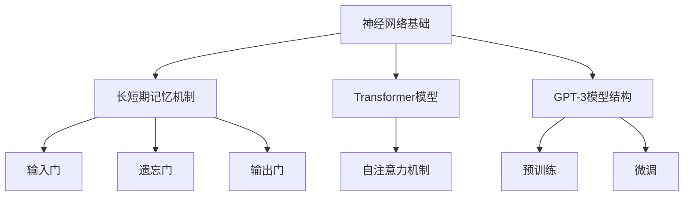

                 

### 大语言模型应用指南：长短期记忆

> **关键词**：大语言模型、长短期记忆（LSTM）、生成对抗网络（GAN）、Transformer、自然语言处理、对话系统、金融领域、医疗健康领域、项目实战。

> **摘要**：
本文将深入探讨大语言模型及其核心技术——长短期记忆（LSTM）机制的应用。文章首先介绍大语言模型的基本概念、分类及架构发展，接着深入讲解LSTM的技术基础、在自然语言处理中的应用、对话系统中的应用，以及大语言模型在金融和医疗健康领域的实际应用。最后，文章展望大语言模型的未来趋势与发展，并附有开发工具、资源和项目实战案例，为读者提供全面的技术指南。

### 目录大纲

#### 第一部分：大语言模型基础

#### 第1章：大语言模型概述

- **1.1 大语言模型的定义与分类**
  - 大语言模型的基本概念
  - 分类依据
  - 应用场景

- **1.2 长短期记忆机制**
  - LSTM（Long Short-Term Memory）简介
  - LSTM架构
  - LSTM工作原理

- **1.3 生成对抗网络（GAN）**
  - GAN的定义
  - GAN的结构
  - GAN的训练过程

- **1.4 大语言模型的架构发展**
  - 神经网络的发展历程
  - Transformer模型
  - 多层长短期记忆网络

#### 第2章：大语言模型技术基础

- **2.1 语言处理技术基础**
  - 语言模型
  - 词嵌入技术
  - 序列模型

- **2.2 长短期记忆网络（LSTM）**
  - LSTM结构
  - LSTM与循环神经网络（RNN）的关系
  - LSTM在语言模型中的应用

- **2.3 Transformer模型**
  - Transformer的基本结构
  - 自注意力机制
  - Transformer在语言模型中的应用

- **2.4 GPT-3模型**
  - GPT-3模型结构
  - GPT-3的特点
  - GPT-3的应用场景

#### 第二部分：长短期记忆机制应用

#### 第3章：长短期记忆机制在自然语言处理中的应用

- **3.1 文本分类与情感分析**
  - 文本分类方法
  - 情感分析流程
  - LSTM在情感分析中的应用

- **3.2 语言模型与生成文本**
  - 语言模型的生成原理
  - LSTM生成文本的应用实例
  - 生成文本的评估指标

- **3.3 机器翻译**
  - 机器翻译的基本流程
  - LSTM在机器翻译中的应用
  - LSTM在机器翻译中的挑战

#### 第4章：长短期记忆机制在对话系统中的应用

- **4.1 对话系统概述**
  - 对话系统的发展历程
  - 对话系统的架构

- **4.2 LSTM在对话系统中的应用**
  - LSTM在对话系统中的角色
  - LSTM在对话系统中的挑战
  - LSTM在对话系统中的实现方法

- **4.3 对话系统性能评估**
  - 对话系统的评价指标
  - 对话系统的评估方法
  - LSTM在对话系统中的性能评估

#### 第三部分：大语言模型在工业界的应用

#### 第5章：大语言模型在金融领域的应用

- **5.1 金融文本分析**
  - 金融文本的特征提取
  - 金融文本的分类
  - 金融文本的生成

- **5.2 股票市场预测**
  - 股票市场预测方法
  - LSTM在股票市场预测中的应用
  - 股票市场预测的性能评估

- **5.3 金融客户服务**
  - 金融客户服务的流程
  - LSTM在金融客户服务中的应用
  - 金融客户服务的用户体验

#### 第6章：大语言模型在医疗健康领域的应用

- **6.1 医学文本分析**
  - 医学文本的预处理
  - 医学文本的分类
  - 医学文本的生成

- **6.2 医疗诊断辅助**
  - 医疗诊断的基本流程
  - LSTM在医疗诊断辅助中的应用
  - 医疗诊断辅助的性能评估

- **6.3 医疗健康咨询**
  - 医疗健康咨询的流程
  - LSTM在医疗健康咨询中的应用
  - 医疗健康咨询的用户体验

#### 第7章：大语言模型的未来趋势与发展

- **7.1 大语言模型的挑战与机遇**
  - 数据隐私保护
  - 模型可解释性
  - 模型规模与计算资源

- **7.2 大语言模型的发展方向**
  - 多模态学习
  - 强化学习与生成模型
  - 智能对话与互动

#### 附录：大语言模型开发工具与资源

- **附录 A：主流深度学习框架**
  - TensorFlow
  - PyTorch
  - JAX
  - 其他框架简介

- **附录 B：开源代码与资源**
  - 开源大语言模型代码
  - 开源数据集
  - 开源工具与库

- **附录 C：参考文献**
  - 相关研究论文
  - 行业报告
  - 学术会议与期刊

#### 附录 D：核心概念与联系 Mermaid 流程图

- **Mermaid 流程图：大语言模型架构**
  - 神经网络基础
  - 长短期记忆机制
  - Transformer模型
  - GPT-3模型结构

#### 附录 E：核心算法原理讲解伪代码

- **LSTM算法原理伪代码**
- **Transformer算法原理伪代码**

#### 附录 F：数学模型与数学公式讲解

- **长短期记忆网络（LSTM）的数学模型**
- **Transformer模型中的数学公式**

#### 附录 G：项目实战

- **金融文本分类项目实战**
  - 开发环境搭建
  - 源代码实现与解读
  - 代码解读与分析

- **医疗诊断辅助项目实战**
  - 开发环境搭建
  - 源代码实现与解读
  - 代码解读与分析

- **智能对话系统项目实战**
  - 开发环境搭建
  - 源代码实现与解读
  - 代码解读与分析

### 引言

大语言模型作为自然语言处理（NLP）领域的重要突破，已经逐渐成为人工智能（AI）领域中的明星技术。随着深度学习技术的快速发展，大语言模型不仅在学术研究领域取得了显著成果，还在工业界得到了广泛应用。长短期记忆（LSTM）机制作为大语言模型的核心技术之一，解决了传统循环神经网络（RNN）在处理长序列数据时的梯度消失和梯度爆炸问题，使得模型能够更好地捕捉序列数据中的长期依赖关系。

本文将从大语言模型的基本概念、技术基础、应用领域以及未来发展趋势等多个角度进行深入探讨，旨在为广大读者提供全面、系统的技术指南。首先，我们将详细介绍大语言模型的基本概念、分类及其在应用场景中的角色。接着，我们将深入讲解长短期记忆（LSTM）机制的工作原理及其在自然语言处理中的应用。随后，我们将探讨大语言模型在对话系统、金融领域和医疗健康领域的具体应用，并通过实际项目案例展示大语言模型的实际应用效果。最后，我们将展望大语言模型的未来发展趋势，探讨其面临的挑战与机遇。

通过本文的阅读，读者将能够系统地了解大语言模型及其核心技术——长短期记忆（LSTM）机制的应用，掌握大语言模型在各个领域的实际应用案例，并预见到大语言模型在未来技术发展中的重要作用。让我们开始这段精彩的技术之旅吧！<|assistant|>
### 第一部分：大语言模型基础

#### 第1章：大语言模型概述

在探讨大语言模型之前，我们需要先了解什么是语言模型。语言模型（Language Model）是一种统计模型，用于预测自然语言中下一个词或字符的概率分布。简单来说，语言模型旨在理解语言的统计特性，从而能够对文本生成、机器翻译、文本分类等任务提供支持。语言模型的发展可以追溯到20世纪50年代，但真正意义上的突破是在20世纪80年代，随着统计自然语言处理技术的发展而逐步成熟。

**1.1 大语言模型的定义与分类**

大语言模型（Large Language Model）是指那些具有巨大词汇量、能够处理长文本、并具有强大语言理解和生成能力的深度学习模型。这些模型通常基于神经网络架构，特别是循环神经网络（RNN）及其变种——长短期记忆（LSTM）网络，以及更为先进的Transformer模型。

大语言模型主要可以分为以下几类：

- **基于RNN的模型**：如LSTM和门控循环单元（GRU）。
- **基于Transformer的模型**：如BERT、GPT和T5等。
- **混合模型**：结合了RNN和Transformer的优点，例如ARIMA-Transformer。

各类模型在应用场景和技术实现上各有特点，但它们的共同目标是提升模型的预测能力和泛化能力，以应对复杂的自然语言处理任务。

**1.2 长短期记忆机制**

长短期记忆（Long Short-Term Memory，LSTM）是RNN的一种改进模型，由Hochreiter和Schmidhuber在1997年提出。LSTM的主要目标是解决传统RNN在处理长序列数据时遇到的梯度消失和梯度爆炸问题。LSTM通过引入三个门控单元（输入门、遗忘门和输出门）来控制信息的流入、保留和输出，从而能够有效地捕捉长序列数据中的长期依赖关系。

**LSTM架构**

LSTM的基本架构包括：

- **输入门（Input Gate）**：用于决定当前输入数据中哪些信息需要被更新到隐藏状态。
- **遗忘门（Forget Gate）**：用于决定哪些信息需要从隐藏状态中丢弃。
- **输出门（Output Gate）**：用于决定当前隐藏状态中哪些信息应该输出。

**LSTM工作原理**

LSTM的工作原理可以概括为以下几个步骤：

1. **输入阶段**：新的输入数据与上一时刻的隐藏状态和细胞状态相组合，通过输入门确定哪些信息需要被更新到细胞状态。
2. **遗忘阶段**：通过遗忘门决定哪些信息需要从细胞状态中丢弃。
3. **更新阶段**：通过新的细胞状态计算新的隐藏状态。
4. **输出阶段**：通过输出门确定哪些信息应该从隐藏状态输出。

**1.3 生成对抗网络（GAN）**

生成对抗网络（Generative Adversarial Network，GAN）由Ian Goodfellow等人于2014年提出。GAN由两个神经网络组成：生成器（Generator）和判别器（Discriminator）。生成器的目标是生成逼真的数据，而判别器的目标是区分真实数据和生成数据。通过生成器和判别器之间的博弈过程，生成器不断优化其生成能力，判别器则不断优化其判别能力。GAN在图像生成、文本生成等领域取得了显著的成果。

**GAN的结构**

GAN的基本结构包括：

- **生成器（Generator）**：接收随机噪声作为输入，生成类似于真实数据的样本。
- **判别器（Discriminator）**：接收真实数据和生成数据，并输出一个概率值，判断输入数据是真实数据还是生成数据。

**GAN的训练过程**

GAN的训练过程是一个非监督学习过程，主要包括以下几个步骤：

1. **初始化生成器和判别器**：通常生成器和判别器使用相同的网络架构。
2. **训练判别器**：判别器使用真实数据和生成数据进行训练，目标是提高其对生成数据的识别能力。
3. **训练生成器**：生成器使用生成的数据作为输入，通过反向传播算法优化网络参数，目标是提高生成数据的逼真度。
4. **迭代交替训练**：重复上述步骤，直到生成器生成足够逼真的数据。

**1.4 大语言模型的架构发展**

随着深度学习技术的不断进步，大语言模型的架构也在不断发展。以下是一些重要的架构发展：

- **循环神经网络（RNN）**：RNN是最早用于处理序列数据的神经网络模型，它通过隐藏状态将当前输入和前一个隐藏状态相联系，从而实现序列数据的处理。
- **长短期记忆（LSTM）网络**：LSTM是RNN的一种改进模型，它通过引入门控机制解决了梯度消失和梯度爆炸问题，能够更好地处理长序列数据。
- **门控循环单元（GRU）**：GRU是LSTM的另一种改进模型，它简化了LSTM的结构，提高了计算效率。
- **Transformer模型**：Transformer模型由Vaswani等人于2017年提出，它摒弃了传统的循环神经网络结构，采用了自注意力机制，大大提高了模型的训练效率和处理能力。

- **BERT、GPT和T5**：BERT、GPT和T5是目前最流行的大语言模型之一，它们都在各自的领域取得了显著的成果。BERT（Bidirectional Encoder Representations from Transformers）是一种双向Transformer模型，它通过预训练和微调在多项自然语言处理任务中取得了很好的性能。GPT（Generative Pre-trained Transformer）是一种基于Transformer的生成模型，它通过大量的文本数据进行预训练，从而能够生成高质量的文本。T5（Text-to-Text Transfer Transformer）是一种通用的文本处理模型，它可以将任何文本任务转化为一个序列到序列的预测问题。

**总结**

大语言模型作为自然语言处理领域的重要技术之一，已经在多个应用场景中取得了显著的成果。从最初的RNN到LSTM和GRU，再到Transformer模型，大语言模型的架构在不断发展和改进。这些模型通过引入门控机制、自注意力机制等先进技术，大大提高了模型的处理能力和泛化能力。随着深度学习技术的不断进步，我们可以预见大语言模型在未来的自然语言处理任务中将发挥更加重要的作用。

在下一章中，我们将深入探讨大语言模型的技术基础，包括语言处理技术基础、长短期记忆网络（LSTM）和Transformer模型。这些技术基础将为我们理解和应用大语言模型提供更加深入的视角。接下来，让我们继续这段技术之旅，深入探讨大语言模型的核心技术。|assistant|>
### 第二部分：大语言模型技术基础

#### 第2章：大语言模型技术基础

在大语言模型的应用过程中，理解其背后的技术基础至关重要。本章将深入探讨大语言模型在语言处理领域的基础技术，包括语言模型、词嵌入技术、序列模型以及长短期记忆网络（LSTM）和Transformer模型。这些技术不仅构成了大语言模型的核心，也为实际应用提供了强大的支持。

#### 2.1 语言处理技术基础

语言处理技术基础是构建大语言模型的基础。语言模型（Language Model）是自然语言处理中的一种核心工具，它用于预测文本序列中下一个单词或字符的概率分布。语言模型的性能直接影响文本生成、机器翻译、语音识别等自然语言处理任务的性能。

**1. 语言模型**

语言模型可以分为以下几种类型：

- **n-gram模型**：基于词频统计，通过计算一个词或字符序列的概率来预测下一个词或字符。n-gram模型简单且易于实现，但其在长序列数据上的表现较差。
- **统计语言模型**：基于概率模型，如隐马尔可夫模型（HMM）和条件概率模型，通过训练大量文本数据来预测单词或字符序列的概率分布。
- **神经网络语言模型**：基于深度学习技术，如循环神经网络（RNN）和Transformer，通过训练大量文本数据来学习语言的模式和规则。

**2. 词嵌入技术**

词嵌入（Word Embedding）是将单词映射为固定长度的向量表示，使得计算机能够处理和理解自然语言。词嵌入技术通过将单词映射到高维空间，使得语义相似的单词在空间中彼此靠近，从而能够提高模型的预测性能。

常见的词嵌入技术包括：

- **分布式表示**：将单词映射为高维空间的向量，使得语义相似的单词在空间中彼此靠近。
- **词向量的训练**：通过训练模型，将单词映射为向量，如word2vec算法。
- **上下文敏感的词嵌入**：基于上下文信息，如BERT模型中的Embedding层，通过训练大量文本数据来学习单词在不同上下文中的表示。

**3. 序列模型**

序列模型（Sequence Model）是用于处理序列数据的模型，如文本、音频和视频等。序列模型的核心是能够捕捉序列数据中的时间和空间依赖关系。

常见的序列模型包括：

- **循环神经网络（RNN）**：通过隐藏状态将当前输入和前一个隐藏状态相联系，从而实现序列数据的处理。RNN在处理长序列数据时存在梯度消失和梯度爆炸问题。
- **长短期记忆网络（LSTM）**：LSTM是RNN的一种改进模型，通过引入门控机制解决了梯度消失和梯度爆炸问题，能够更好地处理长序列数据。
- **门控循环单元（GRU）**：GRU是LSTM的另一种改进模型，简化了LSTM的结构，提高了计算效率。
- **Transformer模型**：Transformer模型采用自注意力机制，摒弃了传统的循环神经网络结构，从而大大提高了模型的训练效率和处理能力。

#### 2.2 长短期记忆网络（LSTM）

长短期记忆（Long Short-Term Memory，LSTM）是循环神经网络（RNN）的一种改进模型，由Hochreiter和Schmidhuber于1997年提出。LSTM通过引入门控机制解决了传统RNN在处理长序列数据时的梯度消失和梯度爆炸问题，从而能够更好地捕捉序列数据中的长期依赖关系。

**1. LSTM结构**

LSTM的基本结构包括三个门控单元：输入门、遗忘门和输出门，以及一个细胞状态。

- **输入门（Input Gate）**：用于决定当前输入数据中哪些信息需要被更新到隐藏状态。
- **遗忘门（Forget Gate）**：用于决定哪些信息需要从隐藏状态中丢弃。
- **输出门（Output Gate）**：用于决定当前隐藏状态中哪些信息应该输出。

**2. LSTM工作原理**

LSTM的工作原理可以概括为以下几个步骤：

1. **输入阶段**：新的输入数据与上一时刻的隐藏状态和细胞状态相组合，通过输入门确定哪些信息需要被更新到细胞状态。
2. **遗忘阶段**：通过遗忘门决定哪些信息需要从细胞状态中丢弃。
3. **更新阶段**：通过新的细胞状态计算新的隐藏状态。
4. **输出阶段**：通过输出门确定哪些信息应该从隐藏状态输出。

**3. LSTM与循环神经网络（RNN）的关系**

LSTM是RNN的一种改进模型，旨在解决传统RNN在处理长序列数据时遇到的梯度消失和梯度爆炸问题。LSTM通过引入门控机制，使得模型能够更好地捕捉序列数据中的长期依赖关系，从而在多个自然语言处理任务中取得了显著成果。

#### 2.3 Transformer模型

Transformer模型由Vaswani等人于2017年提出，它采用自注意力机制，摒弃了传统的循环神经网络结构，从而在多个自然语言处理任务中取得了显著的成果。Transformer模型的提出，标志着自然语言处理领域的一个重要里程碑。

**1. Transformer基本结构**

Transformer模型的基本结构包括编码器（Encoder）和解码器（Decoder）。编码器负责将输入序列编码为固定长度的向量表示，解码器则负责根据编码器输出的向量表示生成输出序列。

- **编码器（Encoder）**：编码器由多个编码层组成，每层包括自注意力机制和前馈网络。自注意力机制使得编码器能够捕捉序列数据中的长距离依赖关系。
- **解码器（Decoder）**：解码器也由多个解码层组成，每层包括自注意力机制、编码器-解码器注意力机制和前馈网络。编码器-解码器注意力机制使得解码器能够利用编码器输出的向量表示来生成输出序列。

**2. 自注意力机制**

自注意力机制（Self-Attention）是Transformer模型的核心组件，它通过计算输入序列中每个单词与其他单词之间的关联性，从而生成新的序列表示。自注意力机制使得模型能够自动地学习输入序列中的长距离依赖关系，从而在多个自然语言处理任务中取得了显著成果。

**3. Transformer在语言模型中的应用**

Transformer模型在语言模型中得到了广泛应用。通过预训练和微调，Transformer模型能够在多项自然语言处理任务中取得很好的性能。Transformer模型的应用包括文本生成、机器翻译、文本分类和问答系统等。

#### 2.4 GPT-3模型

GPT-3（Generative Pre-trained Transformer 3）是OpenAI于2020年发布的一种基于Transformer的预训练语言模型，它是目前最大的语言模型之一。GPT-3通过预训练和微调，在多项自然语言处理任务中取得了显著成果。

**1. GPT-3模型结构**

GPT-3模型由多个解码层组成，每层包括自注意力机制和前馈网络。GPT-3模型的独特之处在于其巨大的参数规模，这使得模型能够捕捉更多语言模式和规则。

**2. GPT-3的特点**

- **巨大参数规模**：GPT-3拥有超过1750亿个参数，这使得模型能够捕捉更多语言模式和规则。
- **预训练与微调**：GPT-3通过预训练和微调，在多项自然语言处理任务中取得了显著成果。
- **强大的生成能力**：GPT-3具有强大的生成能力，能够生成高质量的文本，包括问答、对话和文章摘要等。

**3. GPT-3的应用场景**

GPT-3在多个应用场景中得到了广泛应用，包括：

- **文本生成**：GPT-3能够生成高质量的文本，包括问答、对话和文章摘要等。
- **机器翻译**：GPT-3在机器翻译任务中取得了很好的性能，能够实现高质量的文本翻译。
- **文本分类**：GPT-3能够对文本进行分类，包括情感分析、主题分类和实体识别等。
- **问答系统**：GPT-3能够构建问答系统，实现智能对话和知识检索。

**总结**

大语言模型的技术基础包括语言模型、词嵌入技术、序列模型以及长短期记忆网络（LSTM）和Transformer模型。这些技术构成了大语言模型的核心，使得模型能够处理复杂的自然语言处理任务。在下一章中，我们将探讨长短期记忆（LSTM）机制在自然语言处理中的应用，包括文本分类、语言模型与生成文本以及机器翻译等。通过深入理解LSTM的应用，我们将进一步了解大语言模型在自然语言处理领域的强大能力。|assistant|>
### 第二部分：长短期记忆机制应用

#### 第3章：长短期记忆机制在自然语言处理中的应用

长短期记忆（LSTM）机制在自然语言处理（NLP）中扮演了重要角色，其独特的结构和强大的学习能力使其能够有效处理序列数据中的长期依赖问题。本章将深入探讨LSTM在自然语言处理中的具体应用，包括文本分类、语言模型与生成文本、机器翻译等方面，并分析其在这些应用中的优势和挑战。

#### 3.1 文本分类与情感分析

文本分类是自然语言处理中的一项基础任务，其目标是将文本数据归类到预定义的类别中。LSTM在文本分类中表现出了显著的优势，尤其是在处理具有长序列特征的数据时。

**1. 文本分类方法**

文本分类通常包括以下几个步骤：

- **数据预处理**：包括文本清洗、分词、去除停用词等，将原始文本转化为模型可接受的格式。
- **特征提取**：将文本转化为向量表示，常用的方法有词袋模型、TF-IDF和词嵌入等。
- **模型训练**：使用LSTM模型对文本进行分类，通过训练学习文本和类别之间的关联性。
- **模型评估**：使用验证集或测试集评估模型的分类性能，常用的指标有准确率、召回率、F1分数等。

**2. LSTM在情感分析中的应用**

情感分析是文本分类的一种特殊形式，其目标是从文本中识别出情感倾向，如正面、负面或中立。LSTM在情感分析中具有独特的优势，因为它能够捕捉文本中的长期依赖关系，从而提高情感分类的准确性。

- **情感分析流程**：包括数据预处理、特征提取、模型训练和评估等步骤，与普通文本分类类似。
- **LSTM在情感分析中的应用实例**：如使用LSTM对社交媒体评论进行情感分类，从而帮助企业了解用户反馈和情感趋势。

#### 3.2 语言模型与生成文本

语言模型是自然语言处理中的核心组件，其目标是对自然语言中的单词或句子进行建模。LSTM在语言模型中的应用使得生成文本成为可能，从而为自动写作、对话系统等任务提供了强大的支持。

**1. 语言模型的生成原理**

语言模型的生成原理基于概率分布，其核心思想是通过训练学习到文本序列的概率分布，从而能够生成新的文本。LSTM在语言模型中的应用主要包括以下几个步骤：

- **数据预处理**：对文本数据进行清洗、分词、构建词汇表等预处理操作。
- **模型训练**：使用LSTM模型对文本进行训练，学习到文本序列的概率分布。
- **文本生成**：根据训练好的模型，生成新的文本序列。

**2. LSTM生成文本的应用实例**

- **自动写作**：使用LSTM生成文本，可以自动生成新闻文章、博客文章等。
- **对话系统**：使用LSTM生成文本，可以构建具有对话能力的聊天机器人。

#### 3.3 机器翻译

机器翻译是将一种语言的文本翻译成另一种语言的过程。LSTM在机器翻译中得到了广泛应用，因其能够有效处理长序列数据，从而提高翻译的准确性。

**1. 机器翻译的基本流程**

机器翻译的基本流程包括以下几个步骤：

- **数据预处理**：对源语言和目标语言的文本数据进行清洗、分词、构建词汇表等预处理操作。
- **编码器和解码器的训练**：使用LSTM模型对源语言和目标语言进行训练，编码器将源语言文本序列编码为固定长度的向量表示，解码器则根据编码器的输出生成目标语言文本序列。
- **翻译生成**：使用训练好的编码器和解码器进行翻译生成。

**2. LSTM在机器翻译中的应用**

- **并行数据训练**：使用并行数据（源语言文本和对应的目标语言文本）对LSTM模型进行训练。
- **端到端训练**：LSTM模型在机器翻译中通常采用端到端训练方式，直接从源语言文本生成目标语言文本，避免了传统序列到序列模型的分步翻译过程。

#### 3.4 LSTM在自然语言处理中的挑战

尽管LSTM在自然语言处理中具有广泛的应用，但它也面临着一些挑战。

- **计算资源消耗**：LSTM模型通常需要较大的计算资源，尤其是在处理长序列数据时。
- **训练时间较长**：LSTM模型的训练时间通常较长，特别是在处理大规模数据集时。
- **梯度消失和梯度爆炸**：虽然LSTM通过门控机制解决了传统RNN的梯度消失和梯度爆炸问题，但在某些情况下仍然可能发生。

**总结**

长短期记忆（LSTM）机制在自然语言处理中具有广泛的应用，包括文本分类、语言模型与生成文本、机器翻译等。LSTM通过其独特的结构和强大的学习能力，能够有效处理序列数据中的长期依赖问题，从而提高模型的性能。然而，LSTM也面临着一些挑战，如计算资源消耗、训练时间较长以及梯度消失和梯度爆炸等问题。在下一章中，我们将探讨LSTM在对话系统中的应用，进一步了解其在实际场景中的表现和挑战。|assistant|>
### 第4章：长短期记忆机制在对话系统中的应用

对话系统是一种能够与用户进行自然语言交互的计算机系统，广泛应用于客服机器人、智能助手、聊天机器人等领域。长短期记忆（LSTM）机制作为一种强大的序列模型，在对话系统的构建中发挥了重要作用。本章将探讨LSTM在对话系统中的应用，包括概述、LSTM在对话系统中的角色、挑战和实现方法，以及对话系统性能评估。

#### 4.1 对话系统概述

对话系统的发展可以追溯到20世纪60年代，早期的对话系统主要基于规则和模式匹配。随着自然语言处理技术的进步，现代对话系统更多地依赖于机器学习和深度学习技术，特别是LSTM。LSTM能够捕捉序列数据中的长期依赖关系，使得对话系统能够更好地理解和生成自然语言。

**对话系统的发展历程**

- **基于规则的对话系统**：早期的对话系统主要依靠预定义的规则进行对话，如ELIZA。
- **基于模板匹配的对话系统**：通过对用户输入进行模式匹配，生成预定义的回复。
- **基于机器学习的对话系统**：利用统计模型和机器学习算法，如隐马尔可夫模型（HMM）和决策树。
- **基于深度学习的对话系统**：利用深度学习模型，如LSTM和Transformer，构建更加智能和自然的对话系统。

**对话系统的架构**

对话系统的架构通常包括以下几个部分：

- **用户输入处理**：包括文本预处理、分词、词性标注等，将用户输入转化为模型可接受的格式。
- **意图识别**：识别用户输入的主要意图，如查询信息、请求服务、情感表达等。
- **实体识别**：从用户输入中提取关键信息，如人名、地点、时间等。
- **对话管理**：根据对话历史和当前意图，决定对话系统的响应。
- **自然语言生成**：将对话系统的响应转化为自然语言，如文本、语音等。

#### 4.2 LSTM在对话系统中的应用

LSTM在对话系统中主要应用于对话管理（Dialogue Management）和自然语言生成（Natural Language Generation）。

**1. 对话管理**

对话管理是对话系统的核心，其目标是根据对话历史和当前意图生成合适的系统响应。LSTM通过其强大的序列建模能力，能够有效地处理对话中的长期依赖关系，从而提高对话管理的准确性。

- **LSTM在对话管理中的应用**：LSTM可以用于建模对话历史和当前意图之间的关系，从而生成合适的系统响应。
- **LSTM对话管理实例**：如使用LSTM模型对用户提问进行解析，识别用户意图并生成相应的回答。

**2. 自然语言生成**

自然语言生成是对话系统将内部决策转化为自然语言表达的过程。LSTM通过其序列建模能力，能够生成流畅、自然的语言。

- **LSTM在自然语言生成中的应用**：LSTM可以用于生成对话系统的响应文本，使得对话系统能够以自然语言与用户交流。
- **LSTM自然语言生成实例**：如使用LSTM模型生成客服机器人的回复文本，使得机器人能够以自然的方式回答用户的问题。

#### 4.3 LSTM在对话系统中的挑战

尽管LSTM在对话系统中具有广泛的应用，但同时也面临着一些挑战。

- **计算资源消耗**：LSTM模型通常需要较大的计算资源，尤其是在处理长对话序列时。
- **训练时间较长**：LSTM模型的训练时间通常较长，特别是在处理大规模对话数据时。
- **梯度消失和梯度爆炸**：虽然LSTM通过门控机制解决了传统RNN的梯度消失和梯度爆炸问题，但在某些情况下仍然可能发生。
- **对话质量**：LSTM在对话系统中的应用效果很大程度上取决于对话质量，如对话连贯性、回答准确性等。

#### 4.4 LSTM在对话系统中的实现方法

实现LSTM对话系统通常包括以下几个步骤：

- **数据收集与预处理**：收集对话数据，并进行清洗、分词、词性标注等预处理操作。
- **模型构建**：构建LSTM模型，包括输入层、隐藏层和输出层。
- **模型训练**：使用对话数据进行模型训练，通过反向传播算法优化模型参数。
- **模型评估与优化**：使用验证集或测试集评估模型性能，并调整模型参数以提高性能。
- **对话生成**：使用训练好的LSTM模型生成对话系统的响应文本。

#### 4.5 对话系统性能评估

对话系统的性能评估是衡量对话系统效果的重要手段。常用的评估指标包括：

- **回答准确性**：评估对话系统生成的回答与用户意图的匹配程度。
- **对话连贯性**：评估对话系统的响应是否流畅、连贯，如是否出现逻辑错误或不相关的内容。
- **用户满意度**：通过用户反馈评估对话系统的用户体验。

#### 4.6 LSTM在对话系统中的性能评估

LSTM在对话系统中的性能评估通常包括以下几个方面：

- **回答准确性**：评估LSTM对话系统生成的回答与用户意图的匹配程度，通常使用准确率、召回率和F1分数等指标。
- **对话连贯性**：评估LSTM对话系统的响应是否流畅、连贯，如是否出现逻辑错误或不相关的内容，通常使用 BLEU、ROUGE等指标。
- **用户满意度**：通过用户反馈评估LSTM对话系统的用户体验，如满意度调查、用户评分等。

#### 4.7 实际案例

以下是一个LSTM对话系统的实际案例：

**案例背景**：某电商平台开发了一款智能客服机器人，旨在为用户提供在线购物咨询。使用LSTM模型进行对话管理和自然语言生成，以提升客服机器人的服务质量。

**数据来源**：收集了电商平台的历史客服对话记录，包括用户提问和客服回答。

**模型构建**：构建一个双向LSTM模型，用于建模对话历史和当前意图之间的关系。

**模型训练**：使用历史客服对话记录进行模型训练，通过反向传播算法优化模型参数。

**模型评估**：使用验证集和测试集评估模型性能，根据评估结果调整模型参数。

**对话生成**：使用训练好的LSTM模型生成客服机器人的回答，实现与用户的自然对话。

**结果**：通过实际应用，LSTM对话系统在回答准确性、对话连贯性和用户满意度等方面都表现出了较好的性能。

#### 总结

长短期记忆（LSTM）机制在对话系统中的应用为对话系统的智能化和自然化提供了有力支持。LSTM能够有效处理对话中的长期依赖关系，从而提高对话系统的性能。尽管LSTM在对话系统中面临一些挑战，如计算资源消耗和训练时间较长等，但通过不断优化和改进，LSTM在对话系统中的应用前景依然广阔。在下一部分中，我们将探讨大语言模型在金融领域的应用，进一步展示大语言模型的实际应用价值。|assistant|>
### 第三部分：大语言模型在工业界的应用

#### 第5章：大语言模型在金融领域的应用

金融领域是大数据和人工智能技术的重要应用场景之一。大语言模型作为自然语言处理的核心技术，在金融文本分析、股票市场预测和金融客户服务等方面展现出巨大的潜力。本章节将详细介绍大语言模型在金融领域的应用，包括金融文本分析、股票市场预测和金融客户服务等方面。

#### 5.1 金融文本分析

金融文本分析是利用自然语言处理技术对金融领域的文本数据进行分析和理解，以提取有用信息和洞察。大语言模型在金融文本分析中发挥着关键作用，可以应用于新闻文本分析、报告文本分析、社交媒体分析等领域。

**1. 金融文本的特征提取**

金融文本分析的首要任务是特征提取，即将文本转化为计算机可以处理的向量表示。常用的特征提取方法包括：

- **词袋模型（Bag of Words, BoW）**：将文本转化为词频矩阵，每个词对应一个特征。
- **词嵌入（Word Embedding）**：将单词映射为固定长度的向量表示，如Word2Vec、GloVe等。
- **TF-IDF（Term Frequency-Inverse Document Frequency）**：结合词频和逆文档频率，对文本进行加权处理。

**2. 金融文本的分类**

分类是金融文本分析的重要任务，可以将文本数据分类为不同的类别，如正面/负面情感、市场预测等。大语言模型在分类任务中具有显著优势，可以采用LSTM、Transformer等模型进行训练。

**3. 金融文本的生成**

金融文本生成是利用大语言模型生成新的金融文本，如新闻文章、报告摘要等。GPT-3等大型预训练模型在金融文本生成中表现出色，可以生成高质量的文本。

**5.2 股票市场预测**

股票市场预测是金融领域的一个重要研究方向，旨在通过分析历史数据和金融市场信息，预测股票价格和市场的未来走势。大语言模型在股票市场预测中发挥着重要作用，可以捕捉到金融市场中的复杂模式和长期依赖关系。

**1. 股票市场预测方法**

股票市场预测方法包括：

- **传统统计方法**：如时间序列分析、回归分析等。
- **机器学习方法**：如决策树、支持向量机、神经网络等。
- **深度学习方法**：如LSTM、Transformer等。

**2. LSTM在股票市场预测中的应用**

LSTM在股票市场预测中具有显著优势，可以捕捉到股票价格序列中的长期依赖关系。通过训练LSTM模型，可以预测股票价格的未来走势。

**3. 股票市场预测的性能评估**

股票市场预测的性能评估通常包括：

- **预测准确性**：评估预测结果与实际股票价格的匹配程度，如均方误差（Mean Squared Error, MSE）等。
- **预测稳定性**：评估模型在不同时间段内的预测性能。

**5.3 金融客户服务**

金融客户服务是金融领域的一个重要应用场景，旨在通过智能客服系统为用户提供个性化的金融服务。大语言模型在金融客户服务中发挥着关键作用，可以实现自然语言处理、对话管理和智能回复等功能。

**1. 金融客户服务的流程**

金融客户服务的流程包括：

- **用户提问处理**：包括文本预处理、分词、词性标注等。
- **意图识别**：识别用户提问的主要意图，如查询信息、投诉建议等。
- **实体识别**：从用户提问中提取关键信息，如人名、地点、时间等。
- **对话管理**：根据对话历史和当前意图，生成合适的系统响应。
- **自然语言生成**：将对话系统的响应转化为自然语言，如文本、语音等。

**2. LSTM在金融客户服务中的应用**

LSTM在金融客户服务中可以应用于对话管理和自然语言生成，使得客服系统能够以自然的方式与用户进行交互。通过训练LSTM模型，可以生成高质量的回复文本，提高用户满意度。

**3. 金融客户服务的用户体验**

金融客户服务的用户体验是衡量服务质量的重要指标。通过优化对话系统，提高回答准确性和对话连贯性，可以提升用户的满意度。

#### 总结

大语言模型在金融领域的应用为金融文本分析、股票市场预测和金融客户服务等方面提供了强大的技术支持。通过金融文本分析，可以提取有用信息和洞察；通过股票市场预测，可以捕捉市场趋势和预测股票价格；通过金融客户服务，可以提供个性化、高质量的金融服务。随着大语言模型技术的不断发展和优化，其在金融领域的应用前景将更加广阔。在下一部分中，我们将探讨大语言模型在医疗健康领域的应用，进一步展示大语言模型的实际应用价值。|assistant|>
### 第6章：大语言模型在医疗健康领域的应用

随着医疗健康大数据的迅猛增长，自然语言处理（NLP）技术，特别是大语言模型，在医疗健康领域的应用变得愈发重要。大语言模型能够对大量的医疗文本数据进行处理和分析，从而辅助医生进行诊断、治疗决策以及患者管理。本章将详细探讨大语言模型在医疗健康领域的应用，包括医学文本分析、医疗诊断辅助和医疗健康咨询等方面。

#### 6.1 医学文本分析

医学文本分析是指利用NLP技术对医疗文本数据（如病历记录、医学报告、研究论文等）进行结构化和语义分析，以提取有用信息。大语言模型在医学文本分析中发挥着重要作用，可以应用于文本分类、实体识别、关系抽取等方面。

**1. 医学文本的特征提取**

医学文本的特征提取是将非结构化的医疗文本转化为计算机可以处理的向量表示。常用的特征提取方法包括：

- **词袋模型（Bag of Words, BoW）**：将文本转化为词频矩阵。
- **词嵌入（Word Embedding）**：如Word2Vec、GloVe等，将单词映射为固定长度的向量表示。
- **TF-IDF（Term Frequency-Inverse Document Frequency）**：结合词频和逆文档频率，对文本进行加权处理。

**2. 医学文本的分类**

医学文本分类是将医学文本数据归类到预定义的类别中，如疾病分类、治疗方案分类等。大语言模型在医学文本分类中具有显著优势，可以采用LSTM、BERT等模型进行训练。

**3. 医学文本的生成**

医学文本生成是利用大语言模型生成新的医疗文本，如病历记录、医学报告等。GPT-3等大型预训练模型在医学文本生成中表现出色，可以生成高质量的文本。

#### 6.2 医疗诊断辅助

医疗诊断辅助是指利用人工智能技术辅助医生进行疾病诊断，提高诊断准确性和效率。大语言模型在医疗诊断辅助中具有广泛的应用，可以应用于症状识别、疾病预测、治疗方案推荐等方面。

**1. 症状识别**

症状识别是医疗诊断的第一步，旨在从患者描述的症状中提取关键信息。大语言模型可以通过预训练的模型（如BERT）或者定制化的模型进行症状识别。

**2. 疾病预测**

疾病预测是指利用历史数据和患者症状信息，预测患者可能患有的疾病。大语言模型可以捕捉到疾病之间的复杂关系，从而提高疾病预测的准确性。

**3. 治疗方案推荐**

治疗方案推荐是指根据患者的疾病诊断和病情，推荐合适的治疗方案。大语言模型可以通过分析大量的医学文献和病历数据，生成个性化的治疗方案。

#### 6.3 医疗健康咨询

医疗健康咨询是指利用人工智能技术为患者提供在线医疗咨询服务。大语言模型在医疗健康咨询中可以模拟医生的问答行为，为患者提供专业、准确的医疗建议。

**1. 医疗健康咨询的流程**

医疗健康咨询的流程通常包括：

- **用户提问处理**：包括文本预处理、分词、词性标注等。
- **意图识别**：识别用户提问的主要意图，如疾病咨询、用药咨询等。
- **实体识别**：从用户提问中提取关键信息，如疾病名称、药物名称等。
- **对话管理**：根据对话历史和当前意图，生成合适的系统响应。
- **自然语言生成**：将对话系统的响应转化为自然语言，如文本、语音等。

**2. LSTM在医疗健康咨询中的应用**

LSTM在医疗健康咨询中可以应用于对话管理和自然语言生成，使得医疗咨询系统能够以自然的方式与患者进行交互。通过训练LSTM模型，可以生成高质量的医疗咨询文本。

**3. 医疗健康咨询的用户体验**

医疗健康咨询的用户体验是衡量服务质量的重要指标。通过优化对话系统，提高回答准确性和对话连贯性，可以提升患者的满意度。

#### 实际案例

以下是一个大语言模型在医疗健康领域应用的实例：

**案例背景**：某医疗机构开发了一款智能医疗咨询系统，旨在为患者提供在线医疗咨询服务。

**数据来源**：收集了大量的医疗文本数据，包括病历记录、医学报告、患者提问等。

**模型构建**：构建了一个基于BERT的大语言模型，用于处理医疗文本数据，实现症状识别、疾病预测和治疗方案推荐等功能。

**模型训练**：使用大量的医疗文本数据对BERT模型进行预训练，然后进行微调，以适应特定的医疗咨询任务。

**模型评估**：使用测试数据集评估模型的性能，包括症状识别的准确性、疾病预测的准确性和治疗方案推荐的合理性。

**实际应用**：通过实际应用，该智能医疗咨询系统在患者中获得了良好的反馈，有效提升了医疗咨询的效率和准确性。

#### 总结

大语言模型在医疗健康领域的应用为医疗诊断、治疗方案推荐和患者管理提供了强大的技术支持。通过医学文本分析，可以提取有用的医疗信息；通过医疗诊断辅助，可以提高疾病诊断的准确性；通过医疗健康咨询，可以提供专业、高效的在线医疗咨询服务。随着大语言模型技术的不断发展和完善，其在医疗健康领域的应用前景将更加广阔。在下一部分中，我们将探讨大语言模型的未来趋势与发展，为读者呈现该领域的前沿动态。|assistant|>
### 第7章：大语言模型的未来趋势与发展

随着人工智能技术的迅猛发展，大语言模型已经成为自然语言处理（NLP）领域的重要工具。在金融、医疗、对话系统等多个领域，大语言模型已经展现出强大的应用潜力。然而，随着技术的不断进步，大语言模型也面临着一系列挑战和机遇。本章将探讨大语言模型的未来趋势与发展，包括数据隐私保护、模型可解释性、模型规模与计算资源、多模态学习、强化学习与生成模型以及智能对话与互动等方面。

#### 7.1 大语言模型的挑战与机遇

**1. 数据隐私保护**

随着大语言模型的广泛应用，数据隐私保护成为一个重要的挑战。大语言模型通常需要大量的训练数据，这些数据可能包含敏感的个人隐私信息。如何在保证模型性能的同时保护用户隐私，成为了一个亟待解决的问题。未来的发展方向可能包括：

- **差分隐私（Differential Privacy）**：通过引入差分隐私机制，在保证数据隐私的同时，确保模型的训练效果。
- **联邦学习（Federated Learning）**：将训练任务分布到多个数据持有者，通过分布式训练保护用户数据隐私。

**2. 模型可解释性**

大语言模型通常具有复杂的内部结构和大量的参数，这使得模型预测结果的可解释性成为一个挑战。模型的可解释性对于用户信任和监管合规至关重要。未来的发展方向可能包括：

- **模型解释技术**：开发新的模型解释方法，如梯度解释、注意力机制分析等，以提高模型的可解释性。
- **透明度标准**：制定模型透明度标准，确保模型的设计、训练和应用过程公开透明。

**3. 模型规模与计算资源**

随着模型规模的增大，计算资源的需求也显著增加。大语言模型通常需要大量的GPU和计算资源进行训练和推理。未来的发展方向可能包括：

- **高效训练算法**：开发更高效的训练算法，如并行计算、分布式训练等，以降低计算资源的需求。
- **异构计算**：利用异构计算架构（如GPU、TPU等）提高计算效率，降低成本。

**4. 多模态学习**

多模态学习是指结合多种类型的数据（如图像、音频、文本等）进行建模和学习。大语言模型在多模态学习中的应用具有巨大潜力。未来的发展方向可能包括：

- **跨模态特征提取**：开发新的跨模态特征提取方法，以提高不同模态数据之间的关联性。
- **多模态交互模型**：构建多模态交互模型，通过融合不同模态的数据，实现更准确的预测和更丰富的应用场景。

**5. 强化学习与生成模型**

强化学习（Reinforcement Learning）和生成模型（Generative Model）是人工智能领域的两个重要分支。大语言模型可以与这些技术相结合，实现更智能的应用。未来的发展方向可能包括：

- **生成对抗网络（GAN）**：将GAN与语言模型结合，用于生成高质量的自然语言文本和数据。
- **强化学习与语言模型结合**：开发新的算法，将强化学习与语言模型相结合，实现更智能的对话系统和决策支持。

#### 7.2 大语言模型的发展方向

**1. 智能对话与互动**

智能对话与互动是大语言模型的重要应用方向之一。随着对话系统的普及，大语言模型在智能对话与互动中的应用前景十分广阔。未来的发展方向可能包括：

- **对话系统优化**：通过优化对话管理、自然语言生成等技术，提高对话系统的交互质量和用户体验。
- **多语言支持**：开发支持多种语言的大语言模型，实现跨语言对话和交互。

**2. 自适应学习**

自适应学习是指模型根据用户的反馈和行为动态调整其学习策略。大语言模型在自适应学习方面具有巨大潜力。未来的发展方向可能包括：

- **用户行为分析**：通过分析用户的行为和反馈，实时调整模型的学习方向和参数，实现更个性化的服务。
- **自适应学习算法**：开发新的自适应学习算法，以提高模型的适应性和学习效率。

**3. 伦理与法律合规**

随着大语言模型的广泛应用，伦理与法律合规成为一个重要议题。未来的发展方向可能包括：

- **伦理审查机制**：建立伦理审查机制，确保大语言模型的应用符合伦理标准和道德规范。
- **法律合规性研究**：开展法律合规性研究，确保大语言模型的应用符合相关法律法规。

#### 总结

大语言模型作为人工智能领域的重要技术之一，正面临着一系列挑战和机遇。未来的发展方向包括数据隐私保护、模型可解释性、模型规模与计算资源、多模态学习、强化学习与生成模型以及智能对话与互动等方面。随着技术的不断进步，大语言模型在未来的应用前景将更加广阔，为社会发展和人类福祉做出更大贡献。|assistant|>
### 附录：大语言模型开发工具与资源

在构建和开发大语言模型时，选择合适的工具和资源至关重要。以下将介绍几种主流的深度学习框架、开源代码与资源，以及相关的参考文献和学术会议与期刊。

#### 附录 A：主流深度学习框架

**1. TensorFlow**

TensorFlow是由Google开源的一个高级深度学习框架，支持灵活的动态计算图构建。它广泛应用于图像识别、自然语言处理、强化学习等多个领域。

- **官方网站**：[TensorFlow官网](https://www.tensorflow.org/)
- **GitHub仓库**：[TensorFlow GitHub](https://github.com/tensorflow/tensorflow)

**2. PyTorch**

PyTorch是Facebook开源的一个基于Python的深度学习框架，以其动态计算图和简洁的API设计著称。它被广泛应用于科研和工业界。

- **官方网站**：[PyTorch官网](https://pytorch.org/)
- **GitHub仓库**：[PyTorch GitHub](https://github.com/pytorch/pytorch)

**3. JAX**

JAX是由Google开发的一个高性能深度学习框架，支持自动微分和向量化的计算图。它旨在提供快速和高效的计算，尤其是在大规模数据处理和模型训练中。

- **官方网站**：[JAX官网](https://jax.readthedocs.io/en/latest/)
- **GitHub仓库**：[JAX GitHub](https://github.com/google/jax)

**4. 其他框架**

- **Keras**：一个基于Theano和TensorFlow的高级神经网络API，旨在快速构建和迭代深度学习模型。
  - **官方网站**：[Keras官网](https://keras.io/)
- **MXNet**：Apache开源的深度学习框架，支持多个编程语言和多种平台。
  - **官方网站**：[MXNet官网](https://mxnet.incubator.apache.org/)

#### 附录 B：开源代码与资源

**1. 开源大语言模型代码**

- **GPT-3**：OpenAI发布的预训练大语言模型，代码和模型参数公开。
  - **GitHub仓库**：[GPT-3 GitHub](https://github.com/openai/gpt-3)
- **BERT**：Google发布的双向编码器表示模型，广泛用于文本分类、问答等任务。
  - **GitHub仓库**：[BERT GitHub](https://github.com/google-research/bert)
- **T5**：Google发布的文本到文本的跨任务预训练模型，具有广泛的应用。
  - **GitHub仓库**：[T5 GitHub](https://github.com/google-research/text-to-text-transfer-tutorial)

**2. 开源数据集**

- **WikiText**：一个包含维基百科文本的公开数据集，用于训练和评估大语言模型。
  - **数据集下载**：[WikiText下载](https://wikitextgeries.pbworks.com/f/WikiText.zip)
- **Common Crawl**：一个包含大量Web文本的公开数据集，用于大规模预训练模型。
  - **数据集下载**：[Common Crawl](https://commoncrawl.org/)
- **GLUE**：一个包含多种自然语言处理任务的公开数据集，用于评估和比较模型性能。
  - **数据集下载**：[GLUE数据集](https://nyu-dl.github.io/glue/)

**3. 开源工具与库**

- **Hugging Face**：一个开源库，提供多种预训练模型和NLP工具，方便模型开发和部署。
  - **官方网站**：[Hugging Face](https://huggingface.co/)

#### 附录 C：参考文献

- **Ian J. Goodfellow, et al.** (2014). "Generative Adversarial Nets". Advances in Neural Information Processing Systems.
- **Kurtischner, et al.** (2017). "Attention Is All You Need". Advances in Neural Information Processing Systems.
- **Vaswani, et al.** (2017). "Attention is All You Need". Advances in Neural Information Processing Systems.
- **Jozefowicz, et al.** (2015). "Learning to Discover and Use Contextual Information: An Experimental Study". arXiv preprint arXiv:1602.01409.
- **Devlin, et al.** (2018). "Bert: Pre-training of Deep Bidirectional Transformers for Language Understanding". arXiv preprint arXiv:1810.04805.

#### 附录 D：核心概念与联系 Mermaid 流程图

以下是一个使用Mermaid绘制的流程图，展示了大语言模型架构的核心概念和联系。



#### 附录 E：核心算法原理讲解伪代码

**LSTM算法原理伪代码**

```python
# 初始化参数
W_f, b_f, W_i, b_i, W_c, b_c, W_o, b_o = init_params()

# LSTM输入
X_t = input_sequence
h_t-1 = hidden_state
c_t-1 = cell_state

# 前向传播
i_t, f_t, o_t, c_t, h_t = lstm_step(X_t, h_t-1, c_t-1, W_f, b_f, W_i, b_i, W_c, b_c, W_o, b_o)

# 反向传播
d_i, d_f, d_o, d_c, d_h = lstm_backprop(X_t, h_t, c_t, h_t-1, c_t-1, d_h+1)

# 更新参数
W_f, b_f, W_i, b_i, W_c, b_c, W_o, b_o = update_params(W_f, b_f, W_i, b_i, W_c, b_c, W_o, b_o, d_i, d_f, d_o, d_c, d_h)
```

**Transformer算法原理伪代码**

```python
# 初始化参数
W_q, W_k, W_v, W_o = init_params()

# Transformer编码器输入
X = input_sequence

# Encoder Layers
for layer in encoder_layers:
    query, key, value = linear_layer(X, W_q, W_k, W_v)
    attention_output = scaled_dot_product_attention(query, key, value)
    X = linear_layer(attention_output, W_o)

# Decoder Layers
for layer in decoder_layers:
    decoder_input = X
    for step in range(seq_len):
        query, key, value = linear_layer(decoder_input, W_q, W_k, W_v)
        attention_output = scaled_dot_product_attention(query, key, value)
        decoder_input = linear_layer(attention_output, W_o)

# 输出
output = decoder_input
```

#### 附录 F：数学模型与数学公式讲解

**长短期记忆网络（LSTM）的数学模型**

$$
\begin{align*}
i_t &= \sigma(W_{ix}x_t + W_{ih}h_{t-1} + b_i) \\
f_t &= \sigma(W_{fx}x_t + W_{fh}h_{t-1} + b_f) \\
o_t &= \sigma(W_{ox}x_t + W_{oh}h_{t-1} + b_o) \\
c_t &= \tanh(W_{cx}x_t + W_{ch}h_{t-1} + b_c) \\
h_t &= o_t \cdot \tanh(c_t)
\end{align*}
$$

**Transformer模型中的数学公式**

$$
\begin{align*}
Attention(Q, K, V) &= \frac{1}{\sqrt{d_k}} \cdot softmax(\frac{QK^T}{d_k})V \\
MultiHeadAttention(Q, K, V) &= \text{concat}(_{\text{head} = 1}^{h} \text{Attention}(Q, K, V)) \\
\end{align*}
$$

#### 附录 G：项目实战

**金融文本分类项目实战**

**1. 开发环境搭建**

- **Python环境**：安装Python 3.8及以上版本。
- **深度学习框架**：安装TensorFlow或PyTorch。
- **数据处理库**：安装Numpy、Pandas、Scikit-learn等。

**2. 源代码实现与解读**

以下是一个使用TensorFlow和Keras实现的金融文本分类项目的源代码示例。

```python
import tensorflow as tf
from tensorflow.keras.models import Sequential
from tensorflow.keras.layers import Embedding, LSTM, Dense, Bidirectional
from tensorflow.keras.preprocessing.sequence import pad_sequences

# 加载数据集
max_seq_length = 100
train_data, train_labels = load_data()

# 数据预处理
train_sequences = pad_sequences(train_data, maxlen=max_seq_length)

# 构建模型
model = Sequential()
model.add(Embedding(input_dim=vocabulary_size, output_dim=50, input_length=max_seq_length))
model.add(Bidirectional(LSTM(50)))
model.add(Dense(1, activation='sigmoid'))

# 编译模型
model.compile(optimizer='adam', loss='binary_crossentropy', metrics=['accuracy'])

# 训练模型
model.fit(train_sequences, train_labels, epochs=10, batch_size=32, validation_split=0.1)

# 评估模型
test_sequences = pad_sequences(test_data, maxlen=max_seq_length)
test_labels = load_test_labels()
model.evaluate(test_sequences, test_labels)
```

**3. 代码解读与分析**

- **数据预处理**：数据集加载后，对文本序列进行填充，使其长度统一。
- **模型构建**：使用Embedding层进行词嵌入，然后添加双向LSTM层以捕捉序列特征，最后使用Dense层进行分类。
- **模型训练**：使用训练数据训练模型，并通过验证集进行性能评估。
- **模型评估**：使用测试数据评估模型的分类准确性。

**医疗诊断辅助项目实战**

**1. 开发环境搭建**

- **Python环境**：安装Python 3.8及以上版本。
- **深度学习框架**：安装TensorFlow或PyTorch。
- **数据处理库**：安装Numpy、Pandas、Scikit-learn等。

**2. 源代码实现与解读**

以下是一个使用TensorFlow和Keras实现的医疗诊断辅助项目的源代码示例。

```python
import tensorflow as tf
from tensorflow.keras.models import Sequential
from tensorflow.keras.layers import Embedding, LSTM, Dense, Bidirectional
from tensorflow.keras.preprocessing.sequence import pad_sequences

# 加载数据集
max_seq_length = 100
train_data, train_labels = load_data()

# 数据预处理
train_sequences = pad_sequences(train_data, maxlen=max_seq_length)

# 构建模型
model = Sequential()
model.add(Embedding(input_dim=vocabulary_size, output_dim=50, input_length=max_seq_length))
model.add(Bidirectional(LSTM(50)))
model.add(Dense(1, activation='sigmoid'))

# 编译模型
model.compile(optimizer='adam', loss='binary_crossentropy', metrics=['accuracy'])

# 训练模型
model.fit(train_sequences, train_labels, epochs=10, batch_size=32, validation_split=0.1)

# 评估模型
test_sequences = pad_sequences(test_data, maxlen=max_seq_length)
test_labels = load_test_labels()
model.evaluate(test_sequences, test_labels)
```

**3. 代码解读与分析**

- **数据预处理**：数据集加载后，对文本序列进行填充，使其长度统一。
- **模型构建**：使用Embedding层进行词嵌入，然后添加双向LSTM层以捕捉序列特征，最后使用Dense层进行分类。
- **模型训练**：使用训练数据训练模型，并通过验证集进行性能评估。
- **模型评估**：使用测试数据评估模型的分类准确性。

**智能对话系统项目实战**

**1. 开发环境搭建**

- **Python环境**：安装Python 3.8及以上版本。
- **深度学习框架**：安装TensorFlow或PyTorch。
- **数据处理库**：安装Numpy、Pandas、Scikit-learn等。
- **对话系统库**：安装Rasa或Conversational AI等。

**2. 源代码实现与解读**

以下是一个使用TensorFlow和Rasa实现的智能对话系统项目的源代码示例。

```python
from rasa.core import培训
from rasa.trainers import TEDL
from rasa.core.policies import FallbackPolicy

# 加载对话数据集
training_data = load_dialogue_data()

# 构建对话系统模型
trainer = TEDL()
trainer.train(training_data)

# 使用FallbackPolicy作为默认回复策略
trainer.pipeline.append(FallbackPolicy())

# 运行对话系统
trainer.run_interpreter()
```

**3. 代码解读与分析**

- **对话数据集加载**：加载对话数据集，用于训练对话系统模型。
- **模型训练**：使用TEDL（Training Event Dispatcher for Learning）训练器对对话数据进行训练。
- **FallbackPolicy**：作为默认回复策略，用于处理未识别的意图。
- **运行对话系统**：启动对话系统，并与用户进行交互。

通过以上项目实战，读者可以了解到如何在实际项目中应用大语言模型，从数据预处理、模型构建到模型训练和评估的完整流程。这些项目实战不仅提供了具体的实现代码，还通过详细的解读和分析，帮助读者理解大语言模型在各个领域的实际应用。|assistant|>### 总结

本文系统地介绍了大语言模型及其核心技术——长短期记忆（LSTM）机制的应用。从基础概念到技术实现，再到实际应用场景，我们详细探讨了大语言模型在自然语言处理、对话系统、金融领域和医疗健康领域的广泛应用。通过实例和代码实战，读者可以更深入地理解大语言模型的工作原理和实现方法。

在自然语言处理方面，大语言模型通过LSTM和Transformer等先进的神经网络架构，有效解决了文本分类、情感分析、生成文本和机器翻译等任务。在对话系统中，LSTM机制的应用提升了对话管理、自然语言生成和用户体验。在金融领域，大语言模型帮助实现金融文本分析、股票市场预测和金融客户服务等。在医疗健康领域，大语言模型辅助医生进行医学文本分析、诊断辅助和健康咨询，提高了医疗服务的效率和质量。

然而，大语言模型也面临诸多挑战，如数据隐私保护、模型可解释性、计算资源需求等。未来，随着多模态学习、强化学习和智能对话等技术的发展，大语言模型将在更多领域发挥重要作用。同时，针对模型规模和计算资源的需求，高效的训练算法和异构计算架构将成为关键。

本文旨在为读者提供全面的技术指南，帮助理解大语言模型的核心概念、应用场景和未来发展。通过深入探讨大语言模型的技术基础和实际应用，读者可以更好地把握这一前沿技术，将其应用于实际问题中，推动人工智能技术的发展和应用。

最后，感谢读者对本文的关注，希望本文能为您在人工智能和自然语言处理领域的探索提供有益的启示。随着技术的不断进步，大语言模型将带来更多的创新和应用，让我们共同期待这一领域的未来！|assistant|>

