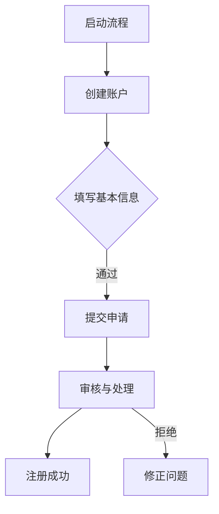

                 

### 《如何利用Stripe Atlas快速注册创业公司》

> **关键词：** Stripe Atlas，创业注册，公司类型，流程，税务规划，融资准备

> **摘要：** 本文将详细介绍如何利用Stripe Atlas这一强大的工具快速注册创业公司。我们将从注册前的准备工作开始，到注册流程的详细步骤，再到注册后的后续工作，以及可能遇到的问题和解决方案，进行全面深入的讲解。通过本文，读者将能够了解如何在创业初期利用Stripe Atlas简化公司注册流程，为后续业务发展打下坚实的基础。

---

#### 第一部分：注册流程准备

##### 第1章：了解Stripe Atlas与创业注册背景

##### 第2章：准备工作与公司类型选择

#### 第二部分：Stripe Atlas注册流程详解

##### 第3章：创建账户与设置基本信息

##### 第4章：提交公司注册申请

##### 第5章：注册后的后续工作

##### 第6章：融资与税务规划

##### 第7章：遇到问题的解决方案

##### 附录

---

#### 第一部分：注册流程准备

##### 第1章：了解Stripe Atlas与创业注册背景

###### 1.1 Stripe Atlas介绍

Stripe Atlas是由全球知名的支付处理公司Stripe推出的一个专门针对初创企业的在线服务，旨在帮助创业者快速、简便地注册公司。通过这个平台，用户可以在线完成公司注册的整个过程，避免了繁琐的文件处理和繁琐的流程，大大缩短了公司注册的时间。

###### 1.1.1 Stripe Atlas的服务内容

Stripe Atlas提供了一系列针对初创企业的服务，包括：

- 公司注册：用户可以在平台上一键注册公司，选择合适的公司类型和法律形式。
- 文件准备：平台会根据用户的选择自动生成所需的注册文件，包括公司章程、股东协议等。
- 审核与提交：平台将协助用户提交注册申请，并提供在线审核服务。
- 后续服务：注册完成后，用户还可以通过平台获取公司的税务、会计、银行账户等后续服务。

###### 1.1.2 Stripe Atlas的优势与特点

Stripe Atlas的优势和特点主要体现在以下几个方面：

- **高效便捷**：通过在线平台，用户可以轻松完成公司注册，无需亲临政府机构办理。
- **个性化服务**：根据用户的需求，平台提供个性化的公司注册方案，包括公司类型、法律形式、注册地址等。
- **国际视角**：Stripe Atlas支持全球范围内的公司注册，用户可以选择在多个国家和地区注册公司。
- **后续服务**：注册完成后，平台提供一系列后续服务，包括税务、会计、银行账户等，帮助初创企业更好地运营。

###### 1.1.3 Stripe Atlas的市场地位

Stripe Atlas作为Stripe公司的一部分，依托于Stripe在全球范围内的市场影响力，已经成为许多初创企业和创业者的首选注册平台。截至[[今天日期]]，Stripe Atlas已经帮助成千上万的初创企业完成了公司注册，成为全球创业生态系统中的重要一员。

###### 1.2 创业公司的注册背景

创业市场的快速发展和全球化趋势，使得创业公司的注册成为许多创业者的重要任务。随着市场竞争的加剧，创业者需要更加高效、便捷的方式来注册公司，以便更快地进入市场并开展业务。

###### 1.2.1 创业市场的现状与挑战

当前的创业市场呈现出以下几个特点：

- **竞争激烈**：创业领域的竞争日益激烈，创业者需要具备创新能力和市场洞察力，才能在激烈的竞争中脱颖而出。
- **门槛降低**：随着互联网和技术的不断发展，创业的门槛逐渐降低，更多的人有机会参与到创业活动中。
- **国际化**：越来越多的创业者选择在全球范围内创业，跨国创业成为新的趋势。

然而，创业公司在注册过程中也会面临一些挑战：

- **流程复杂**：不同国家和地区的公司注册流程各不相同，创业者需要熟悉并应对各种繁琐的流程。
- **时间成本**：注册公司通常需要较长的时间，这对于初创企业来说是一笔不小的成本。
- **法规风险**：创业者需要遵守各种法律法规，否则可能会面临严重的法律风险。

###### 1.2.2 注册公司的重要性和必要性

注册公司对于创业公司来说具有重要意义，主要体现在以下几个方面：

- **法律地位**：注册公司可以赋予创业者正式的法律地位，使其具备独立的市场主体资格。
- **融资便利**：注册公司可以为创业者提供更多的融资渠道，吸引投资者和合作伙伴。
- **运营合规**：注册公司可以帮助创业者更好地遵守各项法律法规，降低运营风险。
- **品牌形象**：注册公司可以为创业者树立良好的品牌形象，提升市场竞争力。

因此，对于创业者来说，注册公司是创业过程中的一个重要步骤，不容忽视。

##### 第2章：准备工作与公司类型选择

###### 2.1 准备工作清单

在利用Stripe Atlas注册公司之前，创业者需要做好一系列准备工作，以确保注册过程的顺利进行。

###### 2.1.1 注册所需文件与资料

创业者需要准备以下文件和资料：

- **身份证明**：包括护照、身份证等有效身份证明文件。
- **地址证明**：包括房产证、租赁合同等证明公司注册地址的文件。
- **商业计划书**：详细描述公司的业务模式、市场分析、财务预测等。
- **股东信息**：包括股东的身份证明、股份比例等。

此外，根据不同国家和地区的法律规定，可能还需要提供其他特定的文件和资料。

###### 2.1.2 确定公司类型与法律形式

创业者在注册公司时需要选择合适的公司类型和法律形式。常见的公司类型包括有限责任公司（LLC）、股份有限公司（Inc.）、合伙企业等。每种公司类型和法律形式都有其独特的特点和适用场景。

- **有限责任公司（LLC）**：适合小型创业团队，股权清晰，责任有限。
- **股份有限公司（Inc.）**：适合大型企业，股权可以自由转让，责任有限。
- **合伙企业**：适合合伙创业，责任共担，股权灵活。

创业者应根据自身情况和业务需求选择合适的公司类型和法律形式。

###### 2.1.3 注册前的策略规划

在注册公司前，创业者需要进行一系列策略规划，以确保公司运营的顺利进行。这些策略规划包括：

- **市场定位**：明确公司的市场定位和目标客户群体。
- **业务模式**：设计合适的业务模式，包括产品或服务、销售渠道、运营模式等。
- **财务规划**：制定详细的财务规划，包括成本预算、收入预测、资金管理等。
- **团队建设**：组建一支高效的团队，明确各自职责和协作方式。

通过这些策略规划，创业者可以更好地应对创业过程中的各种挑战，提高公司运营的成功率。

###### 2.2 公司类型选择

不同类型的公司具有不同的法律地位、税收政策和运营要求，创业者需要根据自身情况选择合适的公司类型。

###### 2.2.1 有限责任公司（LLC）

有限责任公司（LLC）是一种常见的企业形式，具有以下特点：

- **股权清晰**：股东之间的股权关系明确，股权可以自由转让。
- **责任有限**：股东的责任仅限于其对公司的出资额，不会对公司的债务承担责任。
- **管理灵活**：股东和管理层可以灵活安排公司的运营和管理。

适合小型创业团队，特别是需要灵活管理股权和责任的团队。

###### 2.2.2 股份有限公司（Inc.）

股份有限公司（Inc.）是一种大型企业形式，具有以下特点：

- **股权自由转让**：股东可以通过发行股票实现股权的转让和流通。
- **责任有限**：股东的责任仅限于其对公司的出资额，不会对公司的债务承担责任。
- **公司治理**：股份有限公司通常有董事会和股东大会，实行较为严格的公司治理。

适合大型企业，特别是需要股权自由转让和严格公司治理的企业。

###### 2.2.3 其他公司类型比较与选择

除了有限责任公司（LLC）和股份有限公司（Inc.），创业者还可以选择其他公司类型，如合伙企业、个体经营等。这些公司类型具有以下特点：

- **合伙企业**：适合合伙创业，责任共担，股权灵活。
- **个体经营**：适合个人创业，责任无限，管理简单。

创业者应根据自身情况和业务需求选择合适的公司类型。在做出决策时，需要综合考虑法律地位、税收政策、管理要求等因素。

---

#### 第二部分：Stripe Atlas注册流程详解

##### 第3章：创建账户与设置基本信息

在利用Stripe Atlas注册公司之前，首先需要创建一个Stripe Atlas账户。以下将详细介绍创建账户和设置基本信息的流程。

###### 3.1 创建Stripe Atlas账户

创建Stripe Atlas账户的流程相对简单，以下是具体的步骤：

1. **访问官网**：打开Stripe Atlas的官方网站（[https://stripeatlas.com/](https://stripeatlas.com/)），点击“注册”按钮。
2. **选择注册类型**：在注册页面，用户可以选择注册个人或公司的账户。根据实际情况选择相应的选项。
3. **填写基本信息**：在接下来的页面，用户需要填写个人信息，包括姓名、邮箱、电话等。这些信息将用于账户的验证和后续的沟通。
4. **创建密码**：设置账户密码，确保密码安全，并遵守密码强度要求。
5. **同意条款**：阅读并同意Stripe Atlas的隐私政策和使用条款，点击“注册”按钮。

完成以上步骤后，用户即可成功创建Stripe Atlas账户。接下来，需要进行身份验证。

###### 3.1.1 账户创建流程

账户创建的具体流程如下：

1. **访问官网**：[https://stripeatlas.com/](https://stripeatlas.com/)
2. **点击“注册”按钮**
3. **选择注册类型**：个人/公司
4. **填写基本信息**：姓名、邮箱、电话、密码
5. **同意条款**：隐私政策和使用条款
6. **点击“注册”按钮**
7. **完成验证**：邮箱验证、手机验证

完成账户创建后，用户就可以登录Stripe Atlas平台，开始注册公司的流程。

###### 3.1.2 验证身份与邮箱

在创建账户后，Stripe Atlas会要求用户进行身份验证和邮箱验证，以确保账户的安全性。以下是具体的验证步骤：

1. **邮箱验证**：在注册过程中，用户需要提供一个有效的邮箱地址。注册完成后，系统会向该邮箱发送一封验证邮件，用户需要点击邮件中的验证链接完成邮箱验证。
2. **手机验证**：系统会向用户提供的手机号码发送一条验证码，用户需要输入验证码以完成手机验证。

完成身份验证和邮箱验证后，用户即可开始填写公司基本信息。

###### 3.1.3 完善个人信息

在完成账户创建和验证后，用户需要完善个人信息，以确保注册过程的顺利进行。以下是具体的操作步骤：

1. **登录平台**：使用已验证的账户登录Stripe Atlas平台。
2. **点击“完善个人信息”**：在个人中心，找到“完善个人信息”选项，点击进入。
3. **填写个人信息**：包括姓名、地址、电话、邮箱等，确保信息真实有效。
4. **提交审核**：填写完成后，提交审核。系统会对提交的信息进行审核，审核通过后即可使用。

完善个人信息是注册公司的重要步骤，用户应确保填写的信息真实、准确。

###### 3.2 设置公司基本信息

在完成账户创建和验证后，用户需要设置公司基本信息，包括公司名称、注册地址、股东信息等。以下是具体的操作步骤：

1. **登录平台**：使用已验证的账户登录Stripe Atlas平台。
2. **点击“设置公司基本信息”**：在个人中心，找到“设置公司基本信息”选项，点击进入。
3. **填写公司名称**：选择公司类型（如有限责任公司、股份有限公司等），填写公司名称。公司名称需符合当地法律法规的要求，例如不能与已注册的公司名称重复。
4. **填写注册地址**：填写公司的注册地址，确保地址真实有效。
5. **填写股东信息**：填写公司股东的信息，包括姓名、身份证号、股份比例等。股东信息需真实准确，以便后续的股权管理和决策。
6. **提交审核**：填写完成后，提交审核。系统会对提交的信息进行审核，审核通过后即可使用。

设置公司基本信息是注册公司的重要步骤，用户应确保填写的信息真实、准确，以便后续的公司运营和管理。

###### 3.2.1 确定公司名称

公司名称是公司的重要标识，创业者需要慎重选择。以下是一些建议：

- **名称独特性**：确保公司名称具有独特性，避免与已注册的公司名称重复。
- **符合法律法规**：公司名称需符合当地法律法规的要求，例如不能使用敏感词汇。
- **易于记忆**：选择易于记忆的名称，有利于品牌推广和市场营销。
- **体现业务特点**：公司名称可以体现公司的业务特点和定位，有助于提升品牌形象。

在确定公司名称后，用户可以在Stripe Atlas平台上进行名称查询，以确保名称的可用性。

###### 3.2.2 填写注册信息

填写注册信息是公司注册流程中的重要步骤，用户需要填写以下信息：

- **公司类型**：根据业务需求和法律法规，选择合适的公司类型。
- **注册地址**：填写公司的注册地址，确保地址真实有效。
- **股东信息**：填写公司股东的信息，包括姓名、身份证号、股份比例等。
- **法定代表人**：填写公司的法定代表人信息，法定代表人需具备完全民事行为能力。

在填写注册信息时，用户应确保信息的真实、准确，以便后续的股权管理和决策。

###### 3.2.3 选择注册地址与税收情况

注册地址和税收情况是公司注册过程中需要考虑的重要问题。以下是一些建议：

- **注册地址**：选择合适的注册地址，例如商业办公楼、工业园等。注册地址需符合当地法律法规的要求，例如不能使用住宅地址。
- **税收情况**：了解当地的税收政策，选择合适的税收优惠地区。例如，一些国家和地区提供税收减免、优惠税率等政策，有利于降低公司税负。
- **专业机构**：可以咨询专业的会计事务所或律师事务所以获取更详细的信息和建议。

在选择注册地址和税收情况时，用户应综合考虑公司的业务需求、成本预算等因素，做出明智的决策。

---

##### 第4章：提交公司注册申请

在完成账户创建、身份验证和公司基本信息设置后，接下来是提交公司注册申请的步骤。以下将详细介绍提交申请的具体流程，包括准备注册文件、提交申请和审核流程等。

###### 4.1 准备注册文件

在提交公司注册申请之前，创业者需要准备好一系列注册文件。这些文件是公司注册的必要材料，包括但不限于以下内容：

- **身份证明**：包括创始人和股东的身份证明，如护照、身份证等。
- **地址证明**：包括公司注册地址的证明文件，如房产证、租赁合同等。
- **商业计划书**：详细描述公司的业务模式、市场分析、财务预测等。
- **公司章程**：制定公司章程，明确公司的组织架构、股东权益、决策程序等。
- **股东协议**：制定股东协议，明确股东之间的股权分配、决策权、利润分配等。
- **其他文件**：根据不同国家和地区的要求，可能还需要提供其他特定文件。

在准备注册文件时，创业者应确保所有文件的真实性、完整性和准确性，以便顺利通过审核。

###### 4.1.1 收集必要文件

收集必要文件是提交公司注册申请的第一步。以下是一些建议：

- **身份证明**：确保创始人和股东的身份证明文件齐全，如护照、身份证等。如果股东来自不同国家，需要提供相应国家的身份证明文件。
- **地址证明**：准备好公司注册地址的证明文件，如房产证、租赁合同等。如果公司地址为住宅，需要提供居住证明文件。
- **商业计划书**：撰写详细的商业计划书，包括公司的业务模式、市场分析、财务预测等。商业计划书应体现公司的创新性和市场潜力。
- **公司章程**：制定公司章程，明确公司的组织架构、股东权益、决策程序等。公司章程应符合当地法律法规的要求。
- **股东协议**：制定股东协议，明确股东之间的股权分配、决策权、利润分配等。股东协议应保护股东的利益，确保公司的稳定运营。
- **其他文件**：根据不同国家和地区的要求，可能还需要提供其他特定文件，如行业许可、资质证书等。

在收集必要文件时，创业者应仔细阅读当地法律法规的要求，确保收集的文件符合规定。

###### 4.1.2 核实文件准确性

在收集完所有必要文件后，创业者需要核实文件的准确性，确保文件的真实性和完整性。以下是一些建议：

- **身份证明**：核对身份证明文件的信息，确保姓名、出生日期、国籍等关键信息准确无误。
- **地址证明**：核实公司注册地址的证明文件，确保地址信息准确无误。
- **商业计划书**：审查商业计划书的内容，确保业务模式、市场分析、财务预测等数据准确可靠。
- **公司章程**：检查公司章程的条款和内容，确保符合当地法律法规的要求。
- **股东协议**：审查股东协议的条款，确保股东之间的权益分配、决策权等安排公平合理。

在核实文件准确性时，创业者应确保所有文件真实、完整，没有遗漏或错误。

###### 4.1.3 准备电子签名

在提交公司注册申请时，创业者需要准备电子签名。电子签名具有法律效力，可以代替传统手写签名。以下是一些建议：

- **选择合适的电子签名工具**：市面上有许多电子签名工具可供选择，如DocuSign、Adobe Sign等。创业者可以根据自身需求和预算选择合适的工具。
- **注册电子签名账户**：在电子签名工具的官方网站上注册账户，并根据要求设置签名样式和权限。
- **生成电子签名**：使用电子签名工具生成电子签名，并将其保存到本地计算机或移动设备上。
- **上传电子签名**：在提交公司注册申请时，按照平台要求上传电子签名。

在准备电子签名时，创业者应确保签名样式符合法律法规的要求，以便顺利通过审核。

###### 4.2 提交注册申请

在准备好所有注册文件和电子签名后，创业者可以开始提交公司注册申请。以下是提交申请的具体流程：

1. **登录平台**：使用已验证的账户登录Stripe Atlas平台。
2. **进入注册页面**：在平台首页，找到“注册公司”选项，点击进入。
3. **填写注册信息**：根据提示填写公司注册信息，包括公司名称、注册地址、股东信息等。
4. **上传注册文件**：按照要求上传公司注册文件，确保文件清晰、完整。
5. **确认信息**：仔细核对填写的信息和上传的文件，确保准确无误。
6. **提交申请**：点击“提交申请”按钮，完成注册申请的提交。

提交注册申请后，系统将自动生成一个申请编号，创业者可以使用该编号查询申请进度。

###### 4.2.1 在线提交注册

在线提交注册是利用Stripe Atlas平台注册公司的重要步骤。以下是具体的操作流程：

1. **访问平台**：打开Stripe Atlas官方网站（[https://stripeatlas.com/](https://stripeatlas.com/)），点击“注册公司”按钮。
2. **选择注册类型**：根据实际需求选择“注册公司”或“添加新公司”。
3. **填写基本信息**：根据提示填写公司基本信息，包括公司名称、注册地址、股东信息等。
4. **上传文件**：上传公司注册所需的相关文件，如身份证明、商业计划书、公司章程等。
5. **支付费用**：根据平台提示支付注册费用。费用通常包括平台服务费、政府登记费等。
6. **确认提交**：仔细核对填写的信息和上传的文件，确认无误后点击“提交申请”按钮。

完成在线提交后，系统会生成一个申请编号，用户可以通过该编号查询申请进度。

###### 4.2.2 审核流程详解

提交注册申请后， Stripe Atlas将开始对申请进行审核。以下是审核流程的详细说明：

1. **初步审核**：系统会对提交的申请进行初步审核，包括检查申请信息是否完整、文件是否齐全等。如果申请信息不完整或文件存在问题，系统会提示用户进行补充或修改。
2. **政府审批**：初步审核通过后，申请将被提交给当地政府部门进行审批。审批过程可能包括核对申请信息、验证文件真实性等。
3. **支付确认**：在政府审批过程中，平台会通知用户支付确认费用。用户需要在规定时间内完成支付，否则申请可能会被终止。
4. **结果反馈**：政府部门完成审批后，平台将通知用户审批结果。如果申请被批准，用户将收到公司注册证书和相关文件。如果申请被拒绝，平台会提供拒绝原因，用户可以根据原因进行修改和重新提交。

审核流程的时间可能因国家和地区而异，通常需要几个工作日到几个月不等。在等待审核结果期间，用户可以通过平台查询申请进度。

###### 4.2.3 处理可能出现的审核问题

在注册过程中，可能会出现一些审核问题，以下是一些常见问题的解决方案：

- **申请信息不完整**：如果系统提示申请信息不完整，用户需要补充相关信息。可以重新登录平台，按照系统提示完善信息。
- **文件问题**：如果系统提示文件存在问题，用户需要检查上传的文件，确保文件格式、内容、清晰度等符合要求。如果问题无法解决，可以联系平台客服寻求帮助。
- **政府审批延迟**：政府审批过程可能因各种原因出现延迟。用户可以联系平台客服了解审批进度，或提供额外信息以加快审批过程。

在处理审核问题时，用户应保持耐心，并积极配合平台和政府部门的审核工作。

---

##### 第5章：注册后的后续工作

在公司注册完成后，创业者需要进行一系列后续工作，以确保公司的正常运营和合法合规。以下将详细介绍注册后的后续工作，包括获取公司注册证书、领取公司文件、了解公司维护义务和开设银行账户等内容。

###### 5.1 获取公司注册证书与文件

注册证书是公司合法运营的证明文件，创业者应及时获取并妥善保管。以下是如何获取公司注册证书与文件的具体步骤：

1. **查询申请进度**：在提交公司注册申请后，创业者可以通过Stripe Atlas平台查询申请进度。如果申请已批准，系统将提示用户可以下载注册证书和相关文件。
2. **下载注册证书**：在平台上找到“注册证书”选项，点击下载按钮，保存注册证书到本地计算机或移动设备上。注册证书通常包括公司营业执照、公司注册证明等文件。
3. **获取纸质证书**：如果需要纸质证书，可以联系当地政府部门或注册服务机构申请邮寄。

获取注册证书后，创业者应确保妥善保管，以备不时之需。

###### 5.1.1 获取注册证书

获取注册证书的具体步骤如下：

1. **登录平台**：使用已验证的账户登录Stripe Atlas平台。
2. **查询申请进度**：在平台首页，找到“申请进度”选项，点击进入。
3. **查看注册证书**：在申请进度页面，找到“注册证书”选项，点击查看。系统将显示注册证书的相关信息。
4. **下载注册证书**：点击“下载”按钮，下载注册证书到本地计算机或移动设备上。

获取注册证书是公司注册流程的最后一步，也是公司合法运营的重要依据。创业者应确保及时获取并妥善保管。

###### 5.1.2 领取公司文件

领取公司文件是注册公司后的另一个重要步骤。以下是如何领取公司文件的具体步骤：

1. **联系政府部门或注册服务机构**：根据当地法律法规的要求，创业者需要联系相应的政府部门或注册服务机构领取公司文件。
2. **提供身份证明**：在领取公司文件时，创业者需要提供有效的身份证明文件，如护照、身份证等。
3. **填写领取文件申请**：根据政府部门或注册服务机构的要求，填写领取文件申请表，并提供相关证明文件。
4. **领取公司文件**：在提交申请后，创业者可以按照预约的时间领取公司文件。领取的公司文件通常包括公司章程、股东证书、公司印章等。

领取公司文件是注册公司后的必要步骤，创业者应确保及时领取并妥善保管。

###### 5.1.3 了解公司维护义务

公司注册完成后，创业者需要了解并遵守一系列公司维护义务，以确保公司的合法合规运营。以下是一些常见的公司维护义务：

1. **年度申报**：公司需要按照当地法律法规的要求，每年进行年度申报，包括财务报表、经营情况等。
2. **税务申报**：公司需要按时申报和缴纳税款，遵守当地的税收法律法规。
3. **公司章程更新**：如果公司发生重大变更，如股东变动、公司名称变更等，需要及时更新公司章程。
4. **公司文件保管**：妥善保管公司注册证书、公司章程、股东证书等文件，以备不时之需。
5. **公司经营场所维护**：确保公司经营场所符合法律法规的要求，如消防安全、卫生环境等。

了解公司维护义务是公司运营的基础，创业者应认真遵守，以确保公司的合法合规运营。

###### 5.2 开设银行账户

公司注册完成后，创业者需要开设银行账户，以便进行日常的财务管理。以下是如何开设银行账户的具体步骤：

1. **选择合适的银行**：根据公司的业务需求和地理位置，选择一家合适的银行。
2. **准备申请文件**：根据银行的要求，准备相关的申请文件，如公司注册证书、公司章程、股东身份证等。
3. **填写开户申请**：在银行柜台或在线平台填写开户申请，提供公司基本信息和股东信息。
4. **提交申请**：将准备好的申请文件提交给银行，等待银行审核。
5. **预约开户**：银行审核通过后，创业者可以预约开户时间，前往银行办理开户手续。
6. **领取银行卡**：在开户过程中，银行将发放银行卡和相应的金融工具，如支票本等。

开设银行账户是公司运营的必要步骤，创业者应选择合适的银行，并确保及时办理。

###### 5.2.1 银行开户流程

银行开户流程通常包括以下几个步骤：

1. **选择银行**：根据公司的业务需求和地理位置，选择一家合适的银行。
2. **准备申请文件**：根据银行的要求，准备相关的申请文件，如公司注册证书、公司章程、股东身份证等。
3. **填写开户申请**：在银行柜台或在线平台填写开户申请，提供公司基本信息和股东信息。
4. **提交申请**：将准备好的申请文件提交给银行，等待银行审核。
5. **预约开户**：银行审核通过后，创业者可以预约开户时间，前往银行办理开户手续。
6. **领取银行卡**：在开户过程中，银行将发放银行卡和相应的金融工具，如支票本等。

银行开户流程的具体步骤可能因银行和地区而异，创业者应根据实际情况做好准备。

###### 5.2.2 需要的文件和资料

在开设银行账户时，创业者需要准备以下文件和资料：

- **公司注册证书**：公司注册证书是银行开户的必备文件，证明公司的合法身份。
- **公司章程**：公司章程是公司运营的基本法律文件，明确公司的组织架构、股东权益等。
- **股东身份证**：股东身份证是证明股东身份的文件，银行需核实股东的身份信息。
- **法定代表人身份证**：法定代表人身份证是证明法定代表人身份的文件，法定代表人需具备完全民事行为能力。
- **营业执照**：营业执照是公司合法运营的证明文件，银行需核实公司的经营状况。

创业者应确保准备齐全的文件和资料，以便顺利办理银行开户。

###### 5.2.3 银行账户的优势与注意点

开设银行账户对于公司运营具有重要意义，以下是一些银行账户的优势和注意点：

- **财务管理**：银行账户是公司进行财务管理和资金流转的重要工具，有助于公司规范财务管理，提高资金使用效率。
- **税务合规**：银行账户可以帮助公司按时申报和缴纳税款，确保税务合规。
- **资金安全**：银行账户具有较高的安全性，可以保障公司资金的安全和稳定。
- **金融服务**：银行账户可以享受一系列金融服务，如贷款、信用卡等，有助于公司扩大业务和发展。

注意点：

- **合规操作**：在开设银行账户时，创业者应确保提供真实、准确的资料，遵守相关法律法规，确保银行账户的合法性。
- **风险评估**：在开设银行账户前，创业者应评估银行的风险控制能力，选择信誉良好的银行，降低风险。
- **定期审计**：公司应定期对银行账户进行审计，确保资金流向合法合规，防止财务风险。

通过了解银行账户的优势和注意点，创业者可以更好地利用银行账户进行财务管理，促进公司发展。

---

##### 第6章：融资与税务规划

在公司注册完成后，创业者需要着手进行融资和税务规划，以便更好地推动公司发展。以下将详细介绍融资准备、税务责任与义务、税务优惠与政策解读以及税务筹划与合规等内容。

###### 6.1 融资准备

融资是公司发展的重要环节，创业者需要做好充分的融资准备。以下是融资准备的具体步骤：

1. **融资需求分析**：明确公司的融资需求，包括资金用途、融资额度、融资期限等。融资需求分析有助于制定合理的融资计划。
2. **融资渠道选择**：根据公司的实际情况和融资需求，选择合适的融资渠道。常见的融资渠道包括银行贷款、风险投资、天使投资、股权融资等。
3. **融资材料准备**：准备融资所需的相关材料，如商业计划书、财务报表、公司章程、股东协议等。这些材料有助于投资者了解公司的经营状况和发展潜力。
4. **融资谈判**：与潜在投资者进行融资谈判，确定融资方案、估值、股权分配等关键条款。在谈判过程中，创业者应保持诚意和灵活性，争取获得最佳的融资条件。

融资准备是公司融资成功的关键，创业者应认真对待，提高融资成功率。

###### 6.1.1 融资方式与渠道

融资方式与渠道的选择对公司的融资效果和成本有着重要影响。以下是常见的融资方式与渠道：

- **银行贷款**：银行贷款是公司融资的一种常见方式，具有利率较低、资金安全等优点。创业者需要准备好相关材料，如商业计划书、财务报表等，向银行申请贷款。
- **风险投资**：风险投资（VC）是公司融资的重要渠道之一，投资者通常对具有高增长潜力的公司进行投资。创业者需要撰写详细的商业计划书，展示公司的核心竞争力和发展前景。
- **天使投资**：天使投资是由个人投资者对初创公司进行投资的一种方式。天使投资者通常具有丰富的行业经验和资金实力，创业者可以通过网络平台、创业者社群等途径寻找天使投资者。
- **股权融资**：股权融资是通过出让公司股权获得资金的一种方式。创业者可以根据公司的实际情况，选择合适的时间点进行股权融资，以吸引投资者加入。

不同的融资方式与渠道具有不同的特点和优势，创业者应根据自身情况选择合适的融资方式与渠道。

###### 6.1.2 融资文档准备

融资文档是创业者向投资者展示公司实力和发展潜力的重要工具，包括以下内容：

- **商业计划书**：商业计划书是融资的核心文档，包括公司背景、业务模式、市场分析、财务预测、团队介绍等。商业计划书应突出公司的核心竞争力、市场潜力和盈利模式。
- **财务报表**：财务报表是投资者了解公司财务状况的重要依据，包括资产负债表、利润表、现金流量表等。财务报表应真实、准确、完整，反映公司的实际运营情况。
- **公司章程**：公司章程是公司的基本法律文件，明确公司的组织架构、股权分配、决策程序等。公司章程应符合当地法律法规的要求，确保公司的合法运营。
- **股东协议**：股东协议是股东之间关于股权分配、决策权、利润分配等事项的协议。股东协议应保护股东的利益，确保公司的稳定运营。

创业者应确保融资文档的准备充分、准确，以提高融资成功率。

###### 6.1.3 融资谈判与策略

融资谈判是创业者与投资者之间的重要环节，创业者需要掌握谈判的策略和技巧，以提高融资成功率。以下是融资谈判的一些策略和技巧：

- **充分准备**：在谈判前，创业者应充分了解投资者的背景、需求和投资偏好，准备相应的资料和预案。
- **沟通协商**：在谈判过程中，创业者应保持沟通的开放性，积极回应投资者的疑问和关切，展示公司的诚意和合作意愿。
- **谈判技巧**：创业者应掌握一定的谈判技巧，如掌握谈判节奏、调整谈判策略、运用心理战术等，以争取获得最佳的融资条件。
- **灵活应变**：在谈判过程中，创业者应具备灵活应变的能力，根据谈判情况及时调整策略，以应对各种突发状况。

通过有效的融资谈判，创业者可以争取到更有利的融资条件，为公司的持续发展奠定基础。

###### 6.2 税务责任与义务

税务责任与义务是公司运营过程中必须遵守的法律规定，创业者需要了解并履行相关义务。以下是税务责任与义务的详细内容：

- **税务申报**：公司需要按时申报和缴纳税款，包括增值税、企业所得税、个人所得税等。税务申报应真实、准确、完整，反映公司的实际经营情况。
- **税务缴纳**：公司需要按照国家规定的税率和缴纳方式，按时缴纳各项税款。逾期未缴或未足额缴纳税款可能会面临滞纳金、罚款等处罚。
- **税务审计**：公司需要接受税务审计，确保税务申报和缴纳的合法性和合规性。税务审计有助于发现潜在的风险和问题，提高公司的税务管理水平。
- **税务合规**：公司需要遵守税务法律法规，确保税务管理的合法性和合规性。税务合规是企业社会责任的重要组成部分，有助于树立良好的企业形象。

了解并履行税务责任与义务，有助于公司避免税务风险，确保税务管理的合法性和合规性。

###### 6.2.1 税务责任与义务

税务责任与义务是公司运营过程中必须遵守的法律规定，创业者需要了解并履行相关义务。以下是税务责任与义务的详细内容：

- **税务申报**：公司需要按时申报和缴纳税款，包括增值税、企业所得税、个人所得税等。税务申报应真实、准确、完整，反映公司的实际经营情况。
- **税务缴纳**：公司需要按照国家规定的税率和缴纳方式，按时缴纳各项税款。逾期未缴或未足额缴纳税款可能会面临滞纳金、罚款等处罚。
- **税务审计**：公司需要接受税务审计，确保税务申报和缴纳的合法性和合规性。税务审计有助于发现潜在的风险和问题，提高公司的税务管理水平。
- **税务合规**：公司需要遵守税务法律法规，确保税务管理的合法性和合规性。税务合规是企业社会责任的重要组成部分，有助于树立良好的企业形象。

了解并履行税务责任与义务，有助于公司避免税务风险，确保税务管理的合法性和合规性。

###### 6.2.2 税务优惠与政策解读

税务优惠与政策解读是公司税务规划的重要部分，有助于企业降低税负，提高经济效益。以下是常见的税务优惠与政策解读：

- **研发费用加计扣除**：企业开展研发活动所发生的研发费用，可以按照规定比例加计扣除，降低企业的税负。例如，在中国，企业可以按照研发费用的75%进行加计扣除。
- **高新技术企业优惠**：高新技术企业可以享受降低企业所得税税率、享受研发费用加计扣除等多项优惠措施。例如，在中国，高新技术企业可以享受15%的企业所得税优惠税率。
- **创业投资优惠**：创业投资企业对符合条件的初创企业进行投资，可以享受税收优惠政策，如减半征收所得税等。
- **进口税收减免**：企业进口符合国家鼓励进口的货物，可以享受进口税收减免政策，降低进口成本。

了解并利用这些税务优惠与政策，有助于企业降低税负，提高经济效益。

###### 6.2.3 税务筹划与合规

税务筹划与合规是企业税务管理的重要环节，有助于企业实现税务成本的最优化。以下是税务筹划与合规的详细内容：

- **税务筹划**：税务筹划是企业在合法合规的前提下，通过合理的税务安排，降低税负，提高经济效益。税务筹划包括选择合适的纳税方式、利用税收优惠政策、合理规避税收风险等。
- **税务合规**：税务合规是企业遵守税务法律法规，确保税务管理的合法性和合规性。企业应建立健全的税务管理体系，制定税务合规政策，加强税务内部控制，确保税务申报和缴纳的合法性。
- **税务审计**：企业应定期接受税务审计，确保税务申报和缴纳的合法性和合规性。税务审计有助于发现潜在的风险和问题，提高企业的税务管理水平。

通过税务筹划与合规，企业可以实现税务成本的最优化，提高税务管理水平，为企业发展创造有利条件。

---

##### 第7章：遇到问题的解决方案

在创业过程中，创业者可能会遇到各种问题和挑战。以下将详细介绍常见注册问题、问题解决方法与步骤以及专家建议与经验分享等内容。

###### 7.1 常见注册问题解答

在注册公司过程中，创业者可能会遇到以下常见问题：

- **问题1：公司名称已被注册**：如果创业者想注册的公司名称已被其他公司注册，可以通过修改名称或进行名称预留来解决。
- **问题2：注册文件不完整**：如果注册文件不完整，创业者需要根据系统提示补充缺失的文件或信息，以确保注册过程的顺利进行。
- **问题3：审核时间较长**：如果审核时间较长，创业者可以联系注册服务机构了解申请进度，并提供必要的补充材料，以加快审核速度。

针对以上常见问题，以下是具体的解决方法与步骤：

- **解决方法1：公司名称已被注册**：
  1. **修改公司名称**：根据提示修改公司名称，确保名称独特性，避免与已注册公司名称重复。
  2. **名称预留**：在平台上进行名称预留，以防止其他公司抢先注册相同名称。
- **解决方法2：注册文件不完整**：
  1. **检查文件**：仔细检查注册文件，确保所有文件齐全、清晰、准确。
  2. **补充文件**：根据系统提示，补充缺失的文件或信息，确保注册过程的顺利进行。
- **解决方法3：审核时间较长**：
  1. **联系服务机构**：联系注册服务机构了解申请进度，并提供必要的补充材料。
  2. **提供额外信息**：根据需要提供额外信息，以加快审核速度。

通过以上解决方法与步骤，创业者可以更好地应对注册过程中的常见问题，确保注册过程的顺利进行。

###### 7.1.1 注册过程中可能遇到的问题

在注册公司过程中，创业者可能会遇到以下一些常见问题：

- **问题1：公司名称已被注册**：在注册公司时，创业者可能发现心仪的公司名称已被其他公司注册，这会导致注册失败。
- **问题2：注册文件不完整**：创业者可能因为疏忽或误解，提交的注册文件不完整，导致注册申请被拒绝。
- **问题3：审核时间较长**：由于各种原因，如政府部门的工作量较大、政策变化等，注册申请的审核时间可能会较长，影响公司的正常运营。
- **问题4：审核被拒绝**：在注册申请审核过程中，如果申请信息不准确、文件不合规等，可能会导致审核被拒绝。

了解这些常见问题，有助于创业者提前做好准备，避免因这些问题而影响注册进程。

###### 7.1.2 问题解决方法与步骤

针对注册过程中可能遇到的问题，以下是具体的解决方法与步骤：

- **问题1：公司名称已被注册**
  1. **修改公司名称**：根据提示修改公司名称，确保名称独特性，避免与已注册公司名称重复。
  2. **名称预留**：在平台上进行名称预留，以防止其他公司抢先注册相同名称。
- **问题2：注册文件不完整**
  1. **检查文件**：仔细检查注册文件，确保所有文件齐全、清晰、准确。
  2. **补充文件**：根据系统提示，补充缺失的文件或信息，确保注册过程的顺利进行。
- **问题3：审核时间较长**
  1. **联系服务机构**：联系注册服务机构了解申请进度，并提供必要的补充材料。
  2. **提供额外信息**：根据需要提供额外信息，以加快审核速度。
- **问题4：审核被拒绝**
  1. **检查申请信息**：仔细检查申请信息，确保信息准确无误。
  2. **提交补充材料**：根据审核意见，提交补充材料，确保申请信息的合规性和准确性。

通过以上解决方法与步骤，创业者可以更好地应对注册过程中的问题，确保注册过程的顺利进行。

###### 7.1.3 专家建议与经验分享

在注册公司过程中，创业者可以借鉴以下专家建议和经验，以提高注册成功率：

- **专家建议1：充分准备注册材料**：在注册前，创业者应充分准备注册材料，确保文件齐全、清晰、准确。这样可以避免因材料不齐全或错误导致注册失败。
- **专家建议2：了解当地法律法规**：不同国家和地区的公司注册流程和要求有所不同，创业者应提前了解当地的法律法规，确保注册过程的顺利进行。
- **专家建议3：保持沟通**：在注册过程中，创业者应保持与注册服务机构、政府部门等各方的沟通，及时了解申请进度和审核意见，以便及时调整和补充信息。
- **专家建议4：寻求专业咨询**：在遇到复杂问题时，创业者可以寻求专业律师或会计师的咨询，以获取更专业的意见和建议。

通过借鉴专家建议和经验，创业者可以更好地应对注册过程中的挑战，提高注册成功率。

---

##### 附录

#### 附录 A: Stripe Atlas注册流程流程图

以下是一个简化的Stripe Atlas注册流程流程图：

- **A[启动流程]**：创业者访问Stripe Atlas官网，点击“注册”按钮。
- **B[创建账户]**：创业者填写基本信息，包括邮箱、密码等，创建账户。
- **C[填写基本信息]**：创业者填写公司基本信息，包括公司名称、注册地址等。
- **D[提交申请]**：创业者提交注册申请，上传相关文件。
- **E[审核与处理]**：Stripe Atlas对申请进行审核，处理申请结果。
- **F[注册成功]**：如果申请通过，创业者获得公司注册证书。
- **G[修正问题]**：如果申请被拒绝，创业者根据审核意见修正问题，重新提交申请。

#### 附录 B: 常用工具与资源链接

以下是一些常用的工具和资源链接，供创业者参考：

- **Stripe Atlas官方指南**：[https://stripeatlas.com/docs](https://stripeatlas.com/docs)
- **创业相关法律咨询平台**：[https://wwwstartuplawyer.com](https://wwwstartuplawyer.com)
- **银行与金融服务推荐**：[https://www.bankingcircle.com](https://www.bankingcircle.com)
- **税务规划与咨询**：[https://www.taxitforward.com](https://www.taxitforward.com)
- **创业孵化器与加速器**：[https://www.entrepreneurship.org](https://www.entrepreneurship.org)

通过以上工具和资源，创业者可以更好地了解和利用Stripe Atlas平台，顺利完成公司注册和运营。

---

### 文章总结

本文详细介绍了如何利用Stripe Atlas平台快速注册创业公司。从注册前的准备工作，到注册流程的详细步骤，再到注册后的后续工作和遇到问题的解决方案，我们进行了全面深入的讲解。通过本文，读者可以了解到：

- **Stripe Atlas的介绍与优势**：了解Stripe Atlas的基本概念、服务内容以及其市场地位和优势。
- **注册流程准备**：掌握注册前所需的文件与资料、公司类型选择以及策略规划。
- **注册流程详解**：了解账户创建、设置基本信息、提交注册申请的详细步骤。
- **注册后的后续工作**：了解获取公司注册证书、开设银行账户以及后续维护义务。
- **融资与税务规划**：掌握融资准备、税务责任与义务、税务优惠与政策解读以及税务筹划与合规。
- **遇到问题的解决方案**：了解常见注册问题的解决方法与步骤，以及专家建议与经验分享。

通过本文，创业者可以更加便捷、高效地完成公司注册，为创业之路奠定坚实的基础。未来，我们将继续为大家带来更多关于创业和公司注册的实用知识和技巧，敬请期待。同时，欢迎大家在评论区分享您的经验和问题，让我们一起交流学习，共同成长。

---

### 作者信息

**作者：** AI天才研究院/AI Genius Institute & 禅与计算机程序设计艺术 /Zen And The Art of Computer Programming

**简介：** 本文由AI天才研究院和禅与计算机程序设计艺术联合撰写。AI天才研究院致力于推动人工智能技术的研究与应用，为创业者提供专业、实用的技术支持。禅与计算机程序设计艺术则专注于计算机编程和人工智能领域的探索，旨在通过深刻的理论和实践经验，帮助读者提高编程和解决问题的能力。两院共同打造的这篇技术博客，旨在为广大创业者提供全面的创业指南，助力创业梦想的实现。

