                 

# 大数据技术概述

## 1.1 大数据的定义与特征

大数据（Big Data）是指无法用常规软件工具在合理时间内捕捉、管理和处理的数据集合。它的主要特征被普遍认为是“3V”：

- **Volume（大量）**：大数据量的特性使其超出了传统数据处理能力的范围，需要新的技术和工具来存储和管理。
- **Velocity（高速）**：数据生成的速度极快，对于实时分析和响应提出了极高的要求。
- **Variety（多样性）**：大数据来源广泛，类型多样，包括结构化数据、半结构化数据和非结构化数据。

此外，还有一些学者提出第四个V（Veracity，真实性）和第五个V（Value，价值），强调数据的真实性和价值性。

### Mermaid 流程图：大数据定义与特征

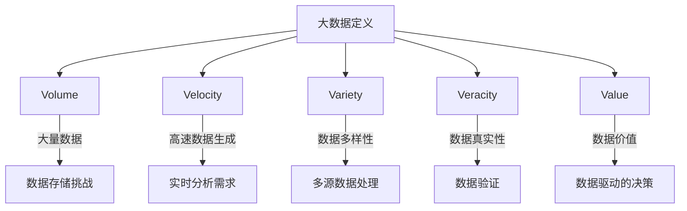

## 1.2 大数据技术发展历程

大数据技术的发展历程可以分为几个关键阶段：

### 1.2.1 起源与发展

- **2000年代初期**：大数据概念开始出现，主要关注结构化数据的存储与管理。
- **2004年**：Google发布了MapReduce论文，标志着分布式计算和大数据处理技术的兴起。
- **2005年**：Hadoop开源项目启动，成为大数据技术的基石。

### 1.2.2 2000年代中期

- **2006年**：NoSQL数据库的兴起，如Cassandra和MongoDB，解决了非结构化数据存储的问题。
- **2008年**：Spark项目启动，提供了高效的数据处理能力。

### 1.2.3 2010年代

- **2010年**：大数据市场开始迅速扩张，企业对大数据技术的需求不断增加。
- **2012年**：Google发布了TensorFlow，推动了机器学习在大数据中的应用。
- **2013年**：Hadoop生态系统不断完善，包括Hive、Pig和HBase等工具的出现。

### 1.2.4 当前

- **云计算的普及**：云计算成为大数据技术的重要支撑，提供了弹性、可扩展的计算资源。
- **大数据平台整合**：企业开始整合大数据平台，实现跨平台的数据处理和分析。

### Mermaid 流程图：大数据技术发展历程

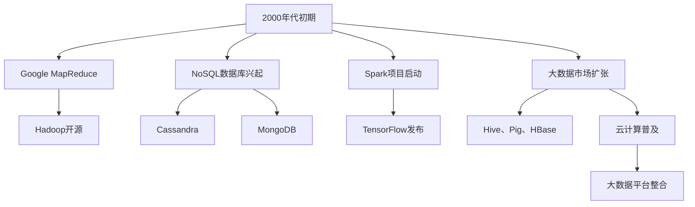

## 1.3 大数据在不同行业的应用

大数据技术在各行各业都有广泛应用，下面简要介绍几个主要行业：

### 1.3.1 电子商务

- **用户行为分析**：通过分析用户点击、购买等行为，优化产品推荐和营销策略。
- **供应链管理**：利用大数据技术优化库存管理，降低成本。

### 1.3.2 金融行业

- **风险管理**：通过大数据分析预测市场风险，提高投资决策的准确性。
- **欺诈检测**：利用大数据技术实时监控交易行为，识别潜在欺诈行为。

### 1.3.3 医疗健康

- **疾病预测**：通过分析大量医疗数据，预测疾病发展趋势，提前采取预防措施。
- **个性化医疗**：利用大数据为患者提供个性化治疗方案。

### 1.3.4 零售业

- **库存管理**：通过大数据分析优化库存，提高销售效率。
- **客户体验**：利用大数据分析客户购买行为，提供个性化服务。

### 1.3.5 能源

- **智能电网**：利用大数据技术优化能源分配，提高能源利用效率。
- **风电和太阳能**：通过大数据分析预测天气变化，优化能源生产。

### Mermaid 流程图：大数据在不同行业的应用

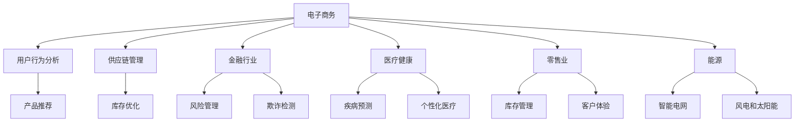

---

在本文的第一部分，我们详细介绍了大数据技术的定义与特征，回顾了其发展历程，并展示了大数据在不同行业的广泛应用。接下来，我们将深入探讨数据采集与存储技术，以及数据处理与分析技术。

## 2. 数据采集与存储技术

## 2.1 数据采集方法

数据采集是大数据技术的重要组成部分，它涉及到如何从各种来源收集数据。以下是几种常见的数据采集方法：

### 2.1.1 Web数据采集

- **爬虫技术**：通过编写爬虫程序，自动从互联网上抓取数据。常用的爬虫框架有Scrapy、BeautifulSoup等。
- **API调用**：利用应用程序编程接口（API）从第三方数据源获取数据。例如，通过调用社交媒体API获取用户数据。

### 2.1.2 移动设备数据采集

- **移动应用数据采集**：通过移动应用收集用户行为数据，如使用频率、地理位置等。
- **蓝牙和Wi-Fi**：利用蓝牙和Wi-Fi技术采集设备之间的数据，例如智能手表和手机之间的数据传输。

### 2.1.3 企业内部数据采集

- **日志文件**：从企业内部系统收集日志文件，如Web服务器日志、数据库日志等。
- **业务系统数据**：通过集成企业内部业务系统，收集销售数据、库存数据等。

### 2.1.4 物联网数据采集

- **传感器数据**：通过物联网设备（如温度传感器、湿度传感器等）采集环境数据。
- **RFID标签**：利用RFID技术采集物品位置和状态数据。

### Mermaid 流程图：数据采集方法

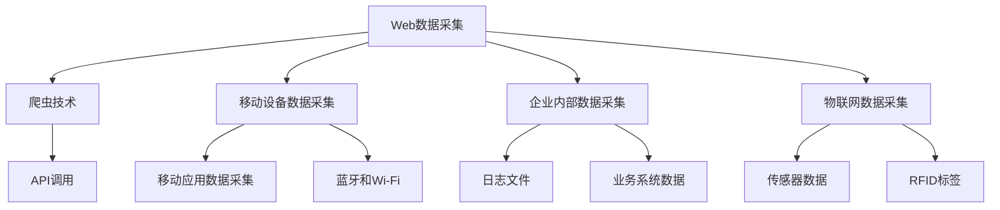

## 2.2 数据存储技术

数据存储是大数据技术的另一个关键组成部分，它涉及到如何高效地存储和管理大量数据。以下是几种常见的数据存储技术：

### 2.2.1 数据库技术

- **关系型数据库**：如MySQL、PostgreSQL等，适用于结构化数据的存储和管理。
- **非关系型数据库**：如MongoDB、Cassandra等，适用于存储半结构化数据和海量数据。

### 2.2.2 数据仓库

- **数据仓库**：用于集成和管理来自多个数据源的数据，例如企业数据仓库（EDW）和数据分析平台。

### 2.2.3 分布式文件系统

- **Hadoop Distributed File System (HDFS)**：是Hadoop生态系统中的分布式文件系统，适用于存储海量数据。
- **Apache HBase**：是基于HDFS的分布式列存储数据库，适用于存储非结构化数据和实时查询。

### 2.2.4 云存储

- **公共云存储**：如Amazon S3、Google Cloud Storage等，提供弹性、可扩展的存储解决方案。
- **私有云存储**：在企业内部部署的云存储解决方案，适用于企业特定的数据存储需求。

### Mermaid 流�程图：数据存储技术

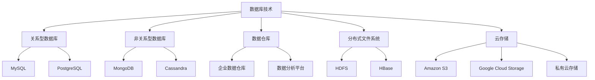

## 2.3 数据仓库与数据湖

数据仓库（Data Warehouse）和数据湖（Data Lake）是大数据技术中用于存储和管理数据的两种重要架构。

### 2.3.1 数据仓库

- **定义**：数据仓库是一个集成的数据存储系统，用于支持企业级的数据分析和决策制定。
- **特点**：
  - 结构化数据
  - 高度整合
  - 强调数据质量和一致性
  - 适用于OLAP（联机分析处理）

### 2.3.2 数据湖

- **定义**：数据湖是一个大容量、可扩展的数据存储系统，用于存储各种类型的数据，包括结构化、半结构化和非结构化数据。
- **特点**：
  - 容纳多种类型的数据
  - 数据无需预先整合
  - 适用于数据探索和大数据分析
  - 适用于OLTP（联机事务处理）

### 2.3.3 数据仓库与数据湖的关系

- **互补关系**：数据仓库和数据湖可以相互补充，数据仓库用于存储经过整合和清洗的数据，支持分析和决策制定；数据湖用于存储原始数据，支持数据探索和实验。

### Mermaid 流程图：数据仓库与数据湖

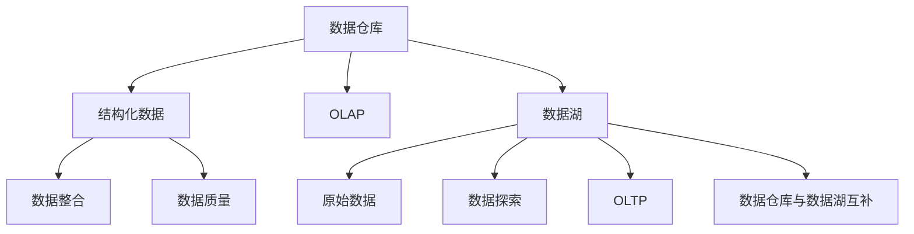

---

在本文的第二部分，我们详细介绍了数据采集与存储技术，包括数据采集方法和数据存储技术，以及数据仓库与数据湖的概念和关系。接下来，我们将探讨数据处理与分析技术。

## 3. 数据处理与分析技术

### 3.1 数据清洗

数据清洗是数据处理过程中至关重要的一步，它的目的是消除数据中的不一致性、错误和噪声，从而提高数据的质量和可靠性。以下是数据清洗的一些常见步骤：

#### 3.1.1 缺失值处理

- **删除缺失值**：删除包含缺失值的数据记录，适用于缺失值较多的情况。
- **填补缺失值**：使用统计方法（如平均值、中位数、众数）或基于规则的方法（如使用上一个或下一个值）填补缺失值。
- **插值法**：利用时间序列或空间关系插值填补缺失值。

#### 3.1.2 异常值检测

- **统计学方法**：使用统计方法（如Z分数、IQR方法）检测异常值。
- **基于规则的方法**：根据业务规则或经验判断异常值。

#### 3.1.3 数据格式转换

- **统一数据格式**：将不同来源的数据转换为统一格式，便于后续处理。
- **数据标准化**：将不同量纲的数据转换为相同量纲，便于比较和分析。

### 伪代码示例：数据清洗

```python
def data_cleaning(data):
    # 删除缺失值
    data = remove_missing_values(data)
    # 填补缺失值
    data = fill_missing_values(data)
    # 数据标准化
    data = standardize_data(data)
    return data

def remove_missing_values(data):
    # 删除包含缺失值的数据记录
    return data.dropna()

def fill_missing_values(data):
    # 使用平均值填补缺失值
    data = data.fillna(data.mean())
    return data

def standardize_data(data):
    # 将数据转换为相同量纲
    data = (data - data.mean()) / data.std()
    return data
```

### 3.2 数据整合

数据整合是将来自多个数据源的数据合并为一个统一的数据集的过程。数据整合的目标是消除数据冗余，提高数据的完整性和一致性。以下是数据整合的一些常见步骤：

#### 3.2.1 数据合并

- **垂直合并**：将多个数据源中的列合并为一个数据集。
- **水平合并**：将多个数据源中的行合并为一个数据集。

#### 3.2.2 数据去重

- **基于关键字段去重**：根据数据集中的关键字段（如ID）删除重复记录。
- **基于哈希去重**：使用哈希函数检测和删除重复记录。

#### 3.2.3 数据转换

- **数据类型转换**：将不同数据源中的数据类型转换为统一类型。
- **数据规范化**：将不同来源的数据转换为统一的命名规范和结构。

### 伪代码示例：数据整合

```python
def data_integration(data1, data2):
    # 数据合并
    data = merge_data(data1, data2)
    # 数据去重
    data = remove_duplicates(data)
    # 数据转换
    data = convert_data_types(data)
    return data

def merge_data(data1, data2):
    # 垂直合并
    data = pd.concat([data1, data2], axis=1)
    return data

def remove_duplicates(data):
    # 基于关键字段去重
    data = data.drop_duplicates(subset=['id'])
    return data

def convert_data_types(data):
    # 将字符串转换为数值类型
    data['numeric_column'] = data['numeric_column'].astype(float)
    return data
```

### 3.3 数据分析技术

数据分析是大数据技术的核心应用之一，它涉及到使用统计方法和算法从数据中提取有价值的信息。以下是几种常见的数据分析技术：

#### 3.3.1 描述性统计分析

- **均值、中位数、众数**：描述数据的集中趋势。
- **方差、标准差**：描述数据的离散程度。
- **频率分布**：描述数据的分布情况。

#### 3.3.2 聚类分析

- **K-means算法**：将数据点划分为K个聚类，每个聚类内的数据点距离聚类中心较近。
- **层次聚类**：基于层次结构将数据点逐步划分为多个聚类。

#### 3.3.3 联机分析处理（OLAP）

- **多维数据集**：将数据组织成多维数组，支持切片、切块、卷叠等分析操作。
- **数据分析工具**：如Excel、Tableau等，提供直观的数据可视化和分析功能。

#### 3.3.4 数据挖掘

- **关联规则挖掘**：发现数据之间的关联关系，如“购物篮分析”。
- **分类算法**：将数据划分为不同的类别，如决策树、随机森林等。

#### 3.3.5 机器学习

- **监督学习**：通过训练数据建立模型，预测新数据的标签，如线性回归、逻辑回归等。
- **无监督学习**：发现数据中的内在结构，如聚类分析、降维等。

### 伪代码示例：数据分析

```python
def data_analysis(data):
    # 描述性统计分析
    statistics = describe_data(data)
    # 数据可视化
    visualize_data(data)
    # 数据挖掘
    insights = data_mining(data)
    return insights

def describe_data(data):
    # 计算均值、中位数、众数
    mean = data.mean()
    median = data.median()
    mode = data.mode()
    # 计算方差、标准差
    variance = data.var()
    std_dev = data.std()
    # 计算频率分布
    frequency_distribution = data.value_counts()
    return {
        'mean': mean,
        'median': median,
        'mode': mode,
        'variance': variance,
        'std_dev': std_dev,
        'frequency_distribution': frequency_distribution
    }

def visualize_data(data):
    # 使用matplotlib绘制数据分布图
    import matplotlib.pyplot as plt
    plt.hist(data, bins=50)
    plt.show()

def data_mining(data):
    # 使用K-means算法进行聚类分析
    from sklearn.cluster import KMeans
    kmeans = KMeans(n_clusters=3)
    kmeans.fit(data)
    clusters = kmeans.predict(data)
    return clusters
```

---

在本文的第三部分，我们详细介绍了数据处理与分析技术，包括数据清洗、数据整合和数据分析技术，并提供了伪代码示例来阐述各个步骤的实现。接下来，我们将探讨大数据技术架构设计。

## 4. 大数据技术架构设计

### 4.1 大数据架构模式

大数据架构设计的目标是高效、可靠地处理海量数据，并支持各种数据处理和分析需求。以下是几种常见的大数据架构模式：

#### 4.1.1 数据仓库架构

- **数据仓库架构**：基于传统的数据仓库架构，将数据从多个来源抽取、清洗、整合后存储在数据仓库中，支持企业级的数据分析和决策制定。

#### 4.1.2 数据湖架构

- **数据湖架构**：以数据湖为核心，存储原始数据，支持数据探索和大数据分析。数据湖与数据仓库相互补充，实现数据的高效管理和利用。

#### 4.1.3 Lambda架构

- **Lambda架构**：结合了数据仓库和数据湖的优点，分为三个层次：数据层（Data Layer）、服务层（Service Layer）和视图层（View Layer）。数据层存储原始数据，服务层进行数据处理和分析，视图层提供最终的数据产品。

### 4.2 分布式计算框架

分布式计算框架是大数据技术的重要基础，它支持大规模数据的并行处理。以下是几种常见的分布式计算框架：

#### 4.2.1 Hadoop

- **Hadoop**：基于MapReduce模型，提供高效的大规模数据处理能力。Hadoop生态系统包括HDFS、YARN、HBase等组件。

#### 4.2.2 Spark

- **Spark**：基于内存计算，提供更高效的数据处理能力。Spark生态系统包括Spark Core、Spark SQL、Spark Streaming等组件。

#### 4.2.3 Flink

- **Flink**：基于流处理，提供实时数据处理能力。Flink生态系统包括Flink SQL、Flink ML等组件。

### 4.3 大数据处理流程设计

大数据处理流程设计包括数据采集、存储、处理和分析等各个环节。以下是大数据处理流程的一般设计：

#### 4.3.1 数据采集

- **数据来源**：确定数据来源，包括Web数据、移动设备数据、企业内部数据、物联网数据等。
- **数据采集工具**：选择合适的数据采集工具，如爬虫、API调用、日志采集等。

#### 4.3.2 数据存储

- **数据存储方案**：根据数据类型和需求选择合适的存储方案，如关系型数据库、非关系型数据库、数据仓库、数据湖等。
- **数据存储策略**：设计数据存储策略，包括数据备份、数据压缩、数据加密等。

#### 4.3.3 数据处理

- **数据处理流程**：设计数据处理流程，包括数据清洗、数据整合、数据转换等步骤。
- **数据处理工具**：选择合适的数据处理工具，如Hadoop、Spark、Flink等。

#### 4.3.4 数据分析

- **数据分析模型**：设计数据分析模型，包括描述性分析、聚类分析、分类分析等。
- **数据分析工具**：选择合适的数据分析工具，如Excel、Tableau、Python等。

### Mermaid 流程图：大数据处理流程设计

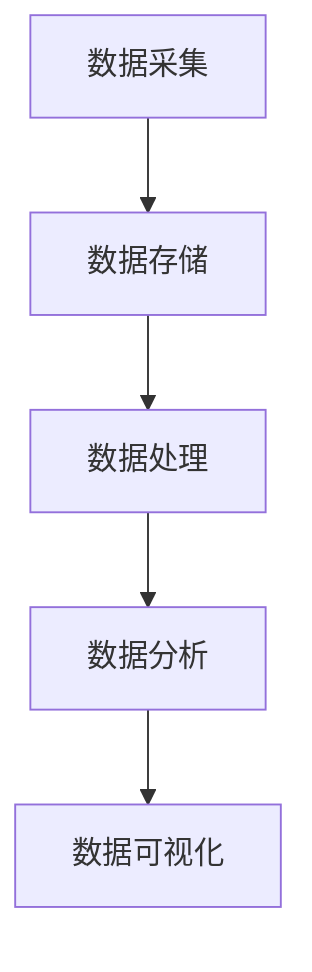

---

在本文的第四部分，我们详细介绍了大数据技术架构设计，包括大数据架构模式、分布式计算框架和大数据处理流程设计。接下来，我们将探讨大数据在创业产品设计和用户体验优化中的应用。

## 5. 创业产品设计与用户体验

创业公司的产品设计和用户体验优化是成功的关键因素。通过利用大数据技术，创业公司可以更好地了解用户需求，优化产品设计，提升用户体验。以下是大数据在创业产品设计和用户体验优化中的应用：

### 5.1 创业产品设计的核心要素

创业产品设计的核心要素包括需求分析、功能设计、用户界面设计和用户体验设计。大数据技术可以帮助创业公司在这些方面取得突破：

#### 5.1.1 需求分析

- **用户调研**：通过大数据分析，创业公司可以了解用户的行为习惯、偏好和需求，为产品设计提供数据支持。
- **市场趋势分析**：利用大数据分析市场趋势，创业公司可以预测未来的市场需求，及时调整产品方向。

#### 5.1.2 功能设计

- **用户反馈**：大数据技术可以帮助创业公司收集和分析用户反馈，了解用户对现有功能的满意度和改进需求。
- **功能优化**：根据用户反馈，创业公司可以针对性地优化产品功能，提升用户满意度。

#### 5.1.3 用户界面设计

- **用户行为分析**：通过大数据分析用户在产品上的行为数据，创业公司可以了解用户在使用界面时的困惑和痛点，优化界面设计。
- **界面交互设计**：利用大数据分析用户对界面的交互习惯，创业公司可以设计更符合用户期望的界面交互。

#### 5.1.4 用户体验设计

- **用户满意度评估**：通过大数据分析用户满意度数据，创业公司可以评估产品的整体用户体验，及时发现和解决问题。
- **个性化推荐**：利用大数据分析用户数据，创业公司可以提供个性化推荐，提升用户体验。

### 5.2 用户体验优化方法

用户体验优化是创业公司持续发展的关键。以下是几种常用的用户体验优化方法：

#### 5.2.1 A/B测试

- **A/B测试**：通过对比两个或多个版本的用户体验，分析不同版本的转化率和用户满意度，选择最佳方案。

#### 5.2.2 用户反馈收集

- **用户反馈收集**：通过问卷调查、用户访谈等方式收集用户反馈，了解用户的需求和痛点。

#### 5.2.3 用户行为分析

- **用户行为分析**：利用大数据技术分析用户在产品上的行为数据，发现用户行为模式，优化产品设计。

#### 5.2.4 用户体验评估

- **用户体验评估**：通过用户测试、焦点小组等方式评估产品的用户体验，找出改进点。

### 5.3 创业产品数据分析

创业产品数据分析是大数据技术在创业产品设计和用户体验优化中的重要应用。以下是创业产品数据分析的几个关键方面：

#### 5.3.1 用户画像

- **用户画像**：通过大数据分析用户数据，创建详细的用户画像，了解用户的特征和行为。

#### 5.3.2 用户行为分析

- **用户行为分析**：利用大数据分析用户在产品上的行为数据，发现用户的行为模式，优化产品设计和功能。

#### 5.3.3 用户满意度分析

- **用户满意度分析**：通过大数据分析用户满意度数据，评估产品的整体用户体验，找出改进点。

#### 5.3.4 市场需求分析

- **市场需求分析**：利用大数据分析市场趋势和用户需求，预测未来的市场需求，优化产品方向。

### Mermaid 流程图：创业产品数据分析

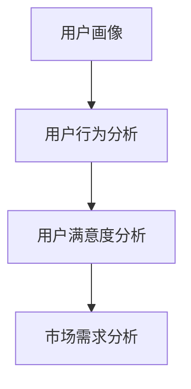

---

在本文的第五部分，我们详细介绍了创业产品设计和用户体验优化，包括核心要素、用户体验优化方法和创业产品数据分析。接下来，我们将探讨大数据分析在产品优化中的应用。

## 6. 大数据分析在产品优化中的应用

大数据分析在产品优化中的应用非常广泛，可以帮助创业公司深入了解用户行为、产品性能和市场需求，从而实现产品的持续改进。以下是大数据分析在产品优化中的应用：

### 6.1 用户行为分析

用户行为分析是大数据分析的核心应用之一，通过对用户在产品上的行为数据进行深入分析，可以帮助创业公司了解用户的需求和偏好，优化产品设计和功能。

#### 6.1.1 用户行为数据的收集

用户行为数据的收集是进行用户行为分析的基础。这些数据可以来源于多种渠道，包括：

- **Web分析工具**：如Google Analytics，可以收集用户在网站上的访问行为。
- **移动应用分析工具**：如Flurry Analytics，可以收集用户在移动应用上的使用行为。
- **日志文件**：通过收集产品服务器的日志文件，可以获取用户的行为数据。

#### 6.1.2 用户行为数据分析方法

用户行为数据分析通常包括以下方法：

- **描述性分析**：通过统计用户行为的描述性指标，如访问次数、使用时长、点击率等，了解用户的基本行为模式。
- **关联分析**：通过分析用户行为的关联关系，发现用户行为之间的相关性，如购买行为与浏览行为的关联。
- **细分分析**：将用户按照行为特征进行细分，如活跃用户、沉默用户、流失用户等，针对不同细分群体进行个性化优化。

#### 6.1.3 用户行为分析案例

例如，一家电商创业公司可以通过分析用户浏览和购买行为，发现用户在购物车放弃订单的主要原因，可能是商品价格、库存不足或配送时间等因素。通过优化这些方面，公司可以降低放弃率，提高转化率。

### 6.2 产品性能分析

产品性能分析是评估产品功能稳定性和效率的重要手段。通过大数据分析，创业公司可以深入了解产品的性能状况，及时发现和解决问题。

#### 6.2.1 产品性能数据的收集

产品性能数据的收集可以通过以下方式：

- **性能监控工具**：如New Relic、AppDynamics等，可以监控产品的运行状态和性能指标。
- **日志分析**：通过分析产品服务器的日志文件，收集系统运行的数据。
- **第三方服务**：如第三方支付系统、短信服务等，可以提供性能指标数据。

#### 6.2.2 产品性能数据分析方法

产品性能数据分析通常包括以下方法：

- **指标监控**：通过监控关键性能指标（KPI），如响应时间、错误率、系统负载等，评估产品的性能状况。
- **异常检测**：通过分析性能数据，发现异常行为和潜在问题，如高负载、系统崩溃等。
- **趋势分析**：通过分析性能数据的变化趋势，预测未来的性能需求，提前进行优化。

#### 6.2.3 产品性能分析案例

例如，一家在线教育平台可以通过分析服务器日志，发现某一时段的用户请求量异常增加，导致系统响应时间变长。通过优化服务器配置和负载均衡策略，平台可以提高系统的稳定性和响应速度。

### 6.3 市场需求分析

市场需求分析是创业公司制定产品策略和营销策略的重要依据。通过大数据分析，创业公司可以了解市场趋势和用户需求，从而更好地定位产品和市场。

#### 6.3.1 市场需求数据的收集

市场需求数据的收集可以通过以下方式：

- **市场调研**：通过问卷调查、访谈等方式收集市场数据和用户反馈。
- **销售数据**：通过分析销售数据，了解产品的市场表现。
- **社交媒体分析**：通过分析社交媒体上的用户讨论和反馈，了解市场的趋势和用户需求。

#### 6.3.2 市场需求数据分析方法

市场需求数据分析通常包括以下方法：

- **趋势分析**：通过分析历史数据，预测未来的市场需求。
- **竞争分析**：通过分析竞争对手的产品和市场策略，了解市场格局和竞争态势。
- **用户需求分析**：通过用户调研和数据分析，了解用户的需求和偏好。

#### 6.3.3 市场需求分析案例

例如，一家在线旅游平台可以通过分析用户搜索和预订数据，发现用户对旅游目的地和时间的偏好，从而优化产品推荐和营销策略，提高用户的满意度和转化率。

### Mermaid 流程图：大数据分析在产品优化中的应用

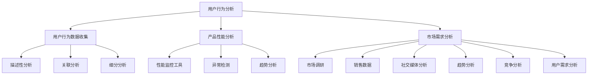

---

在本文的第六部分，我们详细介绍了大数据分析在产品优化中的应用，包括用户行为分析、产品性能分析和市场需求分析。接下来，我们将探讨大数据在创业产品迭代中的应用。

## 7. 大数据在创业产品迭代中的应用

在创业产品的开发过程中，迭代是产品优化和改进的关键步骤。大数据技术的应用可以帮助创业公司更有效地进行产品迭代，确保产品满足用户需求并保持市场竞争力。以下是大数据在创业产品迭代中的应用：

### 7.1 产品迭代策略

产品迭代策略是指创业公司如何规划和执行产品改进的过程。以下是一些关键策略：

#### 7.1.1 用户反馈驱动的迭代

- **用户反馈收集**：通过问卷调查、用户访谈、社交媒体等方式收集用户反馈，了解用户的需求和痛点。
- **快速迭代**：根据用户反馈快速进行产品改进，以更短的开发周期实现多次迭代。

#### 7.1.2 数据驱动的决策

- **数据分析**：利用大数据技术对用户行为、产品性能和市场趋势进行深入分析，为产品改进提供数据支持。
- **数据驱动的优先级**：根据数据分析结果确定产品改进的优先级，确保资源集中于用户最关注的问题。

#### 7.1.3 持续集成与持续部署

- **持续集成**：通过自动化测试和构建，确保每次代码提交都能顺利集成到产品中。
- **持续部署**：通过自动化部署流程，快速将改进后的产品发布给用户。

### 7.2 用户反馈处理

用户反馈是产品迭代的重要驱动力。以下是如何处理用户反馈的一些关键步骤：

#### 7.2.1 反馈分类

- **分类**：将用户反馈分为功能改进、用户体验优化、性能问题等类别，以便更好地组织和管理。

#### 7.2.2 反馈优先级评估

- **优先级评估**：根据反馈的重要性和紧急性，评估每个反馈的优先级，确定改进的顺序。

#### 7.2.3 反馈跟踪

- **跟踪**：建立反馈跟踪系统，记录每个反馈的处理进度和结果，确保反馈得到有效处理。

#### 7.2.4 反馈共享

- **共享**：将用户反馈分享给产品团队，确保每个团队成员都能了解用户的需求和期望，为改进工作提供参考。

### 7.3 产品优化案例解析

以下是一个创业产品迭代优化的具体案例：

#### 案例背景

一家在线教育平台发现用户在课程选择和购买过程中遇到了一些困难，导致转化率较低。公司决定通过大数据分析来优化产品，提高用户的购买体验。

#### 案例步骤

1. **用户行为分析**：
   - 收集用户在平台上的行为数据，如课程浏览、加入购物车、购买流程等。
   - 通过描述性分析和细分分析，了解用户在课程选择和购买过程中的行为模式。

2. **问题定位**：
   - 分析数据，发现用户在购物车放弃订单的主要原因包括课程价格、课程数量和支付方式等。
   - 确定需要优化的关键点。

3. **优化方案**：
   - 优化课程推荐算法，提高推荐课程的准确性和相关性。
   - 调整课程价格策略，提供更合理的价格区间。
   - 改进支付流程，简化支付步骤，提供多种支付方式。

4. **测试与发布**：
   - 进行A/B测试，比较优化前后的转化率。
   - 根据测试结果调整优化方案，确保效果最佳。

5. **跟踪反馈**：
   - 收集用户反馈，了解优化后用户的购买体验。
   - 对用户反馈进行分类和优先级评估，持续改进产品。

#### 案例效果

通过大数据分析和优化，在线教育平台成功提高了用户购买体验，转化率显著提升。同时，用户满意度也得到提高，为公司带来了更多的用户和收入。

### Mermaid 流程图：产品迭代优化案例

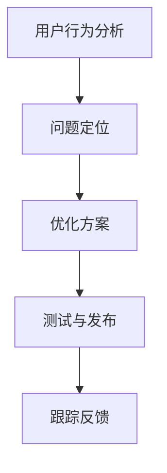

---

在本文的第七部分，我们详细介绍了大数据在创业产品迭代中的应用，包括产品迭代策略、用户反馈处理和具体案例解析。接下来，我们将探讨创业公司大数据应用案例。

## 8. 创业公司大数据应用案例

创业公司通过大数据技术的应用，可以显著提升业务效率和用户满意度，以下是一些具体的应用案例：

### 8.1 创业公司大数据应用场景

#### 8.1.1 智能推荐系统

一家电商创业公司通过大数据技术构建了智能推荐系统，利用用户的历史购买数据、浏览记录和行为偏好，为用户推荐个性化的商品。通过精确的推荐，提高了用户的购物体验和转化率。

#### 8.1.2 客户关系管理（CRM）

一家SaaS创业公司采用了大数据技术来优化其客户关系管理（CRM）系统。通过整合客户的交易历史、互动记录和反馈信息，公司能够提供更精准的服务和产品推荐，从而提高客户满意度和忠诚度。

#### 8.1.3 智能营销

一家初创公司利用大数据技术进行智能营销，通过分析用户的在线行为和社交网络数据，公司能够实时调整营销策略，实现更高效的客户获取和转化。

#### 8.1.4 运营优化

一家在线教育平台利用大数据技术对用户行为进行分析，优化课程推荐和营销活动，提高了课程的覆盖率和用户的参与度。

### 8.2 大数据技术在创业公司的优势

大数据技术在创业公司中具有以下优势：

#### 8.2.1 提高决策效率

大数据分析可以帮助创业公司快速获取市场信息和用户需求，为决策提供有力支持，提高决策效率。

#### 8.2.2 提升用户体验

通过大数据分析，创业公司可以更好地了解用户行为和偏好，提供个性化服务，提升用户体验和满意度。

#### 8.2.3 降低运营成本

大数据技术可以帮助创业公司优化资源分配和运营流程，降低运营成本。

#### 8.2.4 提高竞争力

利用大数据分析，创业公司可以更准确地把握市场趋势和用户需求，快速调整产品和服务，提高市场竞争力。

### 8.3 大数据应用实践案例

#### 案例一：智能推荐系统

**公司背景**：一家电商创业公司，希望通过智能推荐系统提高用户购买体验和转化率。

**解决方案**：
1. **数据采集**：通过用户登录、浏览、搜索、购买等行为收集用户数据。
2. **数据存储**：使用分布式数据库（如MongoDB）存储用户数据。
3. **数据处理**：使用Spark进行数据清洗、整合和预处理。
4. **模型构建**：采用协同过滤算法构建推荐模型，进行用户行为预测。
5. **系统部署**：将推荐系统集成到电商平台，实现实时推荐。

**效果评估**：通过智能推荐系统，公司提高了用户点击率和转化率，取得了显著的业务增长。

#### 案例二：客户关系管理（CRM）

**公司背景**：一家SaaS创业公司，希望通过优化CRM系统提高客户满意度和留存率。

**解决方案**：
1. **数据整合**：整合客户交易数据、互动记录和反馈信息，建立统一的客户数据视图。
2. **数据分析**：使用大数据分析工具（如Hadoop、Spark）进行数据挖掘，识别客户需求和痛点。
3. **客户细分**：根据分析结果，将客户分为不同的细分群体，提供个性化的服务。
4. **客户互动**：利用CRM系统实现个性化的客户互动和营销。

**效果评估**：通过大数据优化的CRM系统，公司显著提高了客户满意度和留存率，推动了业务增长。

#### 案例三：智能营销

**公司背景**：一家初创公司，希望通过大数据技术进行智能营销，提高客户获取和转化。

**解决方案**：
1. **数据采集**：通过网站分析工具和社交媒体平台收集用户数据。
2. **数据分析**：使用大数据分析工具分析用户行为和兴趣，识别潜在客户。
3. **个性化营销**：根据用户数据，制定个性化的营销策略，包括电子邮件营销、社交媒体广告等。
4. **实时调整**：实时监控营销效果，根据数据反馈调整营销策略。

**效果评估**：通过大数据智能营销，公司提高了客户获取量和转化率，实现了业务快速增长。

### Mermaid 流程图：大数据应用实践案例

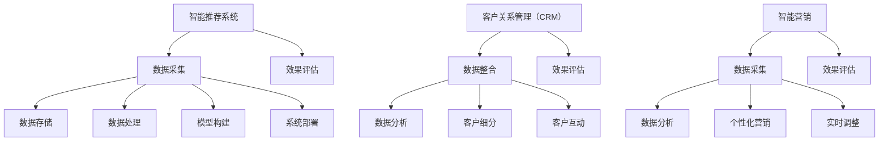

---

在本文的第八部分，我们通过具体案例详细介绍了创业公司大数据应用的场景和优势。接下来，我们将探讨大数据技术在创业公司的实施与挑战。

## 9. 大数据技术在创业公司的实施与挑战

大数据技术的实施对于创业公司来说既充满机遇也伴随挑战。以下将讨论大数据技术在创业公司中的实施步骤、可能面临的挑战以及应对策略。

### 9.1 大数据技术实施步骤

#### 9.1.1 需求分析

在开始大数据项目之前，创业公司需要明确项目目标，确定要解决的问题和期望达到的效果。这包括业务需求、技术需求和资源需求。

#### 9.1.2 技术选型

根据需求分析，选择合适的大数据技术和工具。技术选型需要考虑数据处理能力、可扩展性、性能和成本等因素。常见的工具有Hadoop、Spark、Flink、HBase、MongoDB等。

#### 9.1.3 数据采集

确定数据来源和数据类型，搭建数据采集系统。数据来源可以是内部系统、第三方API、物联网设备、社交媒体等。

#### 9.1.4 数据存储

根据数据类型和需求，选择合适的数据存储方案。结构化数据可以存储在关系型数据库或NoSQL数据库中，非结构化数据可以存储在分布式文件系统或数据湖中。

#### 9.1.5 数据处理

设计数据处理流程，包括数据清洗、数据整合、数据转换和数据分析。使用分布式计算框架（如Hadoop、Spark）进行大规模数据处理。

#### 9.1.6 数据分析

基于处理后的数据，使用数据分析工具（如Python、R、Excel）进行数据挖掘、机器学习等分析，提取有价值的信息。

#### 9.1.7 数据可视化

将分析结果以图表、报表等形式展示，帮助业务团队理解数据，支持决策。

#### 9.1.8 持续优化

根据业务需求和数据分析结果，不断优化数据采集、存储、处理和分析流程，提高效率和效果。

### 9.2 大数据技术在创业公司面临的挑战

#### 9.2.1 数据质量

数据质量是大数据项目的关键挑战之一。数据可能存在缺失、不一致、错误等问题，需要通过数据清洗和预处理来提高数据质量。

#### 9.2.2 技术选型

技术选型不当可能导致性能瓶颈、扩展性问题，甚至无法满足业务需求。创业公司需要根据实际情况选择合适的技术和工具。

#### 9.2.3 数据安全与隐私

大数据项目中涉及大量敏感数据，如用户行为数据、个人信息等。需要确保数据安全，防止数据泄露和滥用。

#### 9.2.4 技术人才

大数据项目需要具备数据挖掘、数据分析、分布式计算等专业技能的人才。创业公司可能面临招聘和培养人才的挑战。

#### 9.2.5 预算与资源

大数据项目通常需要大量的资金投入，包括硬件设备、软件许可、人员薪酬等。创业公司需要合理规划预算，确保项目顺利实施。

### 9.3 挑战应对策略

#### 9.3.1 数据质量管理

- **建立数据质量标准**：制定数据质量标准和流程，确保数据的准确性、完整性和一致性。
- **数据治理**：建立数据治理框架，包括数据所有权、数据质量控制、数据安全策略等。

#### 9.3.2 技术选型优化

- **试点项目**：在确定技术方案前，先进行试点项目，验证技术和工具的可行性和性能。
- **持续迭代**：根据业务需求和技术发展，持续优化技术选型和架构设计。

#### 9.3.3 数据安全与隐私

- **数据加密**：对敏感数据进行加密，确保数据在存储和传输过程中的安全性。
- **隐私保护**：遵守隐私保护法规，采取隐私保护措施，如数据匿名化、隐私计算等。

#### 9.3.4 技术人才培养

- **内部培训**：定期组织内部培训和技能分享，提升团队的技术能力。
- **外部合作**：与高校、研究机构等建立合作关系，引进高端人才。

#### 9.3.5 预算与资源管理

- **预算规划**：根据业务需求和资源情况，制定合理的预算计划。
- **资源优化**：通过云计算等弹性计算资源，提高资源利用效率，降低成本。

### Mermaid 流程图：大数据技术实施与挑战应对策略

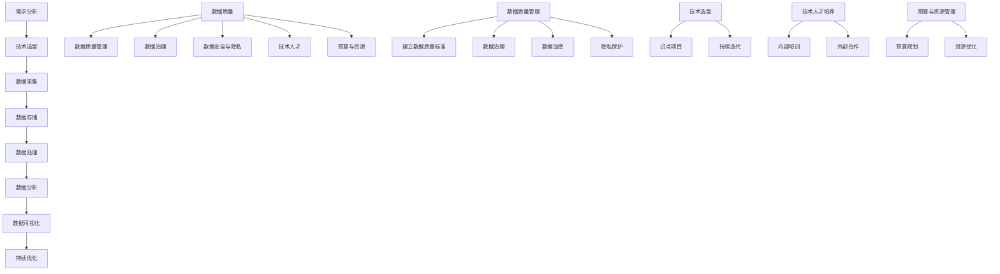

---

在本文的第九部分，我们详细介绍了大数据技术在创业公司的实施步骤、面临的挑战以及应对策略。接下来，我们将探讨大数据技术在创业中的未来发展趋势。

## 10. 大数据技术在创业中的未来发展趋势

大数据技术作为现代信息技术的重要组成部分，正不断推动创业领域的创新与发展。未来，大数据技术在创业中将继续呈现出以下几个发展趋势：

### 10.1 大数据技术的未来发展方向

#### 10.1.1 数据处理性能的提升

随着硬件性能的不断提升和算法的优化，大数据技术的数据处理能力将持续增强。分布式计算框架如Hadoop、Spark和Flink等将不断迭代更新，支持更高效的数据处理和分析。

#### 10.1.2 边缘计算与大数据的结合

边缘计算将发挥重要作用，实现数据在接近数据源的地方进行实时处理和分析。这有助于降低数据传输延迟，提高数据处理效率，特别是在物联网和智能设备领域。

#### 10.1.3 数据隐私与安全性的提升

随着数据隐私和安全的关注度不断提高，大数据技术将在数据加密、匿名化、隐私保护等方面取得更大进展，确保数据在采集、存储、传输和处理过程中的安全。

#### 10.1.4 新兴技术的融合

大数据技术与人工智能、区块链、5G等新兴技术的融合将不断推动创业领域的创新。例如，通过区块链技术实现数据的安全共享，通过人工智能技术实现更智能的数据分析。

### 10.2 创业产品与大数据的融合

大数据技术的进步将深刻影响创业产品的设计和开发。以下是大数据与创业产品融合的几个方面：

#### 10.2.1 个性化推荐

大数据技术将助力创业公司实现更精准的个性化推荐，根据用户行为和历史数据，为用户提供定制化的产品和服务。

#### 10.2.2 智能决策支持

大数据分析将为企业提供更为准确和实时的市场洞察，辅助创业公司做出更明智的决策，提高业务效率。

#### 10.2.3 智能运营优化

通过大数据分析，创业公司可以深入了解运营中的问题和瓶颈，实现智能化的运营优化，降低成本，提高服务质量。

#### 10.2.4 客户体验提升

大数据技术可以帮助创业公司更好地了解用户需求和行为，提供个性化的用户体验，提高用户满意度和忠诚度。

### 10.3 大数据技术对未来创业的启示

#### 10.3.1 数据驱动的发展模式

未来创业将更加注重数据驱动的发展模式，通过数据分析指导产品开发、市场营销和业务运营，实现数据与业务的深度融合。

#### 10.3.2 跨领域创新

大数据技术的应用将促进跨领域创新，创业公司可以通过融合不同领域的知识和数据，创造出全新的产品和服务。

#### 10.3.3 数据资产的价值

数据将成为创业公司的重要资产，如何有效收集、存储、分析和利用数据，将决定创业公司的竞争力和发展潜力。

#### 10.3.4 人才竞争

大数据技术的快速发展将带来对专业人才的需求，创业公司需要积极吸引和培养大数据相关人才，以保持竞争优势。

### Mermaid 流程图：大数据技术未来发展趋势与创业产品融合

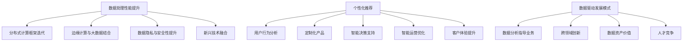

---

在本文的第十部分，我们探讨了大数据技术在创业中的未来发展趋势，包括数据处理性能的提升、边缘计算的融合、数据隐私与安全性的增强以及新兴技术的融合。这些趋势将为创业公司带来新的机遇和挑战。最后，我们提供了一些大数据技术常用工具与资源的推荐，帮助读者深入了解和掌握大数据技术。

## 附录 A: 大数据技术常用工具与资源

### A.1 大数据技术工具介绍

#### 1. 分布式计算框架

- **Hadoop**：最著名的大数据处理框架，基于MapReduce模型。
- **Spark**：基于内存计算的大数据处理框架，提供高效的数据处理能力。
- **Flink**：基于流处理的大数据处理框架，支持实时数据处理。

#### 2. 数据存储与管理

- **HDFS**：Hadoop分布式文件系统，用于存储海量数据。
- **HBase**：基于HDFS的分布式列存储数据库，支持实时查询。
- **MongoDB**：非关系型数据库，适用于存储半结构化数据。
- **Cassandra**：分布式NoSQL数据库，提供高可用性和高性能。

#### 3. 数据分析工具

- **Python**：编程语言，广泛用于数据分析和机器学习。
- **R**：统计编程语言，适用于数据分析和统计建模。
- **Tableau**：数据可视化工具，支持多种数据源的连接和分析。
- **Excel**：基础的数据处理和分析工具，适用于小型数据集。

#### 4. 数据安全与隐私

- **Kerberos**：网络认证协议，用于保护数据传输安全。
- **SSL/TLS**：加密通信协议，用于保障数据在传输过程中的安全。
- **数据加密工具**：如AES、RSA等，用于加密存储和传输的数据。

### A.2 大数据技术学习资源推荐

#### 1. 在线课程

- **Coursera**：提供大数据相关课程，如“大数据分析基础”、“大数据技术基础”等。
- **edX**：提供大数据分析、机器学习和数据科学等课程。
- **Udacity**：提供大数据工程师、数据分析师等职业认证课程。

#### 2. 书籍

- 《大数据时代》作者：舍恩伯格、库克耶：介绍了大数据的概念和应用。
- 《深度学习》作者：goodfellow、bengio、courville：讲解了深度学习的基础知识和应用。
- 《大数据技术基础》作者：刘铁岩：详细介绍了大数据处理的相关技术。

#### 3. 博客与社区

- **Apache Hadoop官网**：提供了Hadoop的官方文档、社区支持和技术交流。
- **Apache Spark官网**：提供了Spark的官方文档、社区支持和技术交流。
- **Kaggle**：数据科学竞赛平台，提供了大量数据集和解决方案，适合数据科学实践。
- **Stack Overflow**：编程问答社区，大数据相关的技术问题可以在这里找到答案。

通过这些工具和资源，读者可以深入了解大数据技术，掌握相关技能，为创业产品的设计和优化提供有力支持。

---

**作者：AI天才研究院/AI Genius Institute & 禅与计算机程序设计艺术 /Zen And The Art of Computer Programming**

**文章标题：**《如何利用大数据技术优化创业产品设计和体验》

**文章关键词：**大数据技术、创业产品、用户体验、数据优化、数据分析、分布式计算、机器学习

**文章摘要：**本文详细介绍了大数据技术在创业产品设计和体验优化中的应用，包括数据采集与存储技术、数据处理与分析技术、大数据技术架构设计、大数据在创业产品迭代中的应用以及大数据技术在创业公司的实施与挑战。通过具体案例和深入分析，本文揭示了大数据技术如何助力创业公司实现产品优化和用户体验提升。同时，展望了大数据技术的未来发展趋势，为创业公司提供了宝贵的实践指导和战略参考。

---

本文深入探讨了大数据技术在创业产品设计和体验优化中的应用，从数据采集、存储、处理到分析，再到创业产品的迭代优化，全面阐述了大数据技术在各个阶段的作用和重要性。通过具体案例和实践经验，展示了大数据技术如何助力创业公司实现产品优化和用户体验提升。同时，本文还展望了大数据技术的未来发展趋势，为创业公司提供了宝贵的实践指导和战略参考。

**总结：**

大数据技术的应用对于创业公司具有重要意义。通过大数据分析，创业公司可以深入了解用户需求、优化产品设计、提升用户体验，从而在激烈的市场竞争中脱颖而出。本文详细介绍了大数据技术的核心概念、发展历程、应用场景、数据处理和分析方法，以及创业产品设计和用户体验优化的实际应用案例。同时，还探讨了大数据技术在未来创业中的发展趋势和挑战，为创业公司提供了全面的技术指导和战略参考。

**展望：**

随着大数据技术的不断进步和新兴技术的融合，大数据将在创业领域中发挥更加重要的作用。创业公司应积极拥抱大数据技术，建立完善的数据采集、存储、处理和分析体系，以数据驱动的方式指导产品设计和运营决策。同时，关注数据安全和隐私保护，培养大数据人才，以应对未来的技术和市场挑战。通过不断优化和提升大数据技术应用，创业公司可以实现持续创新和快速增长，为用户提供更好的产品和服务。

---

**作者：AI天才研究院/AI Genius Institute & 禅与计算机程序设计艺术 /Zen And The Art of Computer Programming**

**文章标题：**《如何利用大数据技术优化创业产品设计和体验》

**文章关键词：**大数据技术、创业产品、用户体验、数据优化、数据分析、分布式计算、机器学习

**文章摘要：**本文详细介绍了大数据技术在创业产品设计和体验优化中的应用，包括数据采集与存储技术、数据处理与分析技术、大数据技术架构设计、大数据在创业产品迭代中的应用以及大数据技术在创业公司的实施与挑战。通过具体案例和深入分析，本文揭示了大数据技术如何助力创业公司实现产品优化和用户体验提升。同时，展望了大数据技术的未来发展趋势，为创业公司提供了宝贵的实践指导和战略参考。

