                 

### 知识付费与在线学习：技术视角下的融合与创新

#### 关键词：知识付费，在线学习，平台建设，学习资源，用户体验，教学设计

> 摘要：本文从技术视角深入探讨知识付费与在线学习的融合与创新。通过分析知识付费的发展背景、市场分析，以及在线学习的设计原则与方法，文章提出了在线学习平台建设与运营的关键策略，并针对在线学习指导与评估提出了具体的方法和工具。此外，通过案例分析总结了成功经验，探讨了未来趋势与挑战，为知识付费与在线学习领域的实践者提供了有价值的参考。

### 目录大纲

1. **如何利用知识付费实现在线学习与在线学习指导？**
2. **关键词**
3. **摘要**
4. **第一部分：知识付费与在线学习概述**
   1. **第1章：知识付费背景与市场分析**
      1.1 知识付费的概念与演变
      1.2 在线学习的兴起与发展
   2. **第2章：知识付费平台与商业模式**
      2.1 知识付费平台概述
      2.2 知识付费商业模式分析
5. **第二部分：在线学习与学习指导**
   1. **第3章：在线学习设计原则与方法**
      3.1 教学目标设定
      3.2 学习路径规划
      3.3 教学内容组织
   2. **第4章：在线学习设计原则与方法**
      4.1 自适应学习
      4.2 社交学习
      4.3 混合学习
   3. **第5章：学习资源开发与利用**
      5.1 学习资源类型
      5.2 学习资源开发流程
   4. **第6章：在线学习平台建设与运营**
      6.1 在线学习平台建设
      6.2 在线学习平台运营
   5. **第7章：在线学习指导与评估**
      7.1 在线学习指导方法
      7.2 学习效果评估
8. **第三部分：知识付费与在线学习实战**
   1. **第8章：知识付费项目策划与执行**
      8.1 项目策划
      8.2 项目执行
   2. **第9章：案例研究：成功知识付费与在线学习项目分析**
      9.1 案例选择
      9.2 案例分析
   3. **第10章：未来趋势与挑战**
      10.1 行业发展趋势
      10.2 面临的挑战与应对策略
9. **附录**
   1. **附录A：知识付费与在线学习相关资源**
   2. **附录B：知识付费与在线学习工具**

### 第一部分：知识付费与在线学习概述

#### 第1章：知识付费背景与市场分析

##### 1.1 知识付费的概念与演变

**核心概念与联系：**
知识付费，指的是在互联网背景下，用户为获取有价值的信息、知识或技能而支付费用的一种商业模式。其核心在于信息价值的货币化，通过市场机制实现知识供给与需求的匹配。

知识付费的演变过程可以分为以下几个阶段：

- **1.0时代：免费分享**
  在互联网早期，知识分享主要通过论坛、博客和社交媒体等平台进行，用户免费获取知识，知识创作者依靠广告和赞助维持生计。

- **2.0时代：内容付费**
  随着互联网用户对内容需求的增加，博客、专栏和电子书等开始采用付费模式，知识创作者通过直接销售内容获取收入。

- **3.0时代：平台付费**
  知识付费逐渐从个体创作者转向平台模式，以分答、得到、喜马拉扎等一系列知识付费平台为代表，平台整合优质内容，为用户提供一站式服务。

**Mermaid 流程图：**
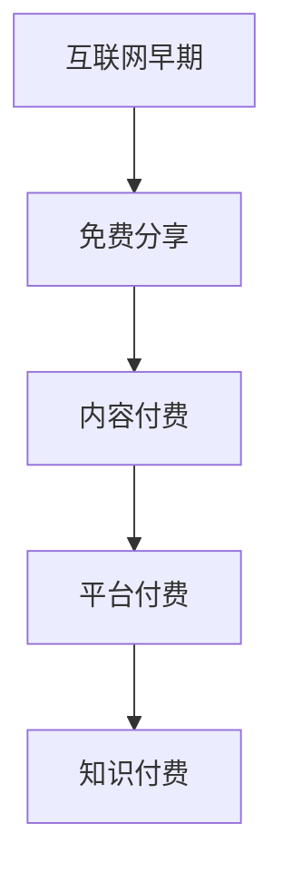

**核心算法原理讲解：**
知识付费的演变可以看作是一个演化过程，其核心算法原理是用户需求与市场供给的动态平衡。通过数据分析，平台可以精准匹配用户需求与创作者供给，实现商业价值的最大化。

**伪代码示例：**
```python
def knowledge付费演变(stage):
    if stage == "免费分享":
        model = "广告+赞助"
    elif stage == "内容付费":
        model = "内容销售"
    elif stage == "平台付费":
        model = "平台整合"
    return model
```

**数学模型和公式：**
知识付费的演变可以用S曲线来描述，其模型为：
$$
f(t) = \alpha \cdot e^{rt}
$$
其中，$f(t)$ 表示知识付费模式在时间 $t$ 的演变程度，$\alpha$ 和 $r$ 为常数。

**举例说明：**
假设知识付费在互联网早期（$t=0$）的演变程度为1，年增长率 $r=0.1$，则在第5年（$t=5$）的知识付费演变程度为：
$$
f(5) = 1 \cdot e^{0.1 \cdot 5} \approx 1.6
$$

##### 1.2 在线学习的兴起与发展

**核心概念与联系：**
在线学习，是指通过互联网平台进行的远程教育和学习活动。其特点包括灵活性、便利性和个性化。

在线学习的发展可以分为以下几个阶段：

- **1.0时代：远程教育**
  在线学习起源于远程教育，以邮件教学、BBS论坛等形式为主，用户通过邮件或论坛与教师进行互动。

- **2.0时代：电子学习**
  电子学习（eLearning）的兴起，标志着在线学习进入了多媒体和互动式学习的新时代。课程内容主要以视频、音频和图文形式呈现。

- **3.0时代：社交化学习**
  社交化学习将社交网络引入在线学习，通过社交互动、协作学习等方式，提高学习效果和用户参与度。

**Mermaid 流程图：**
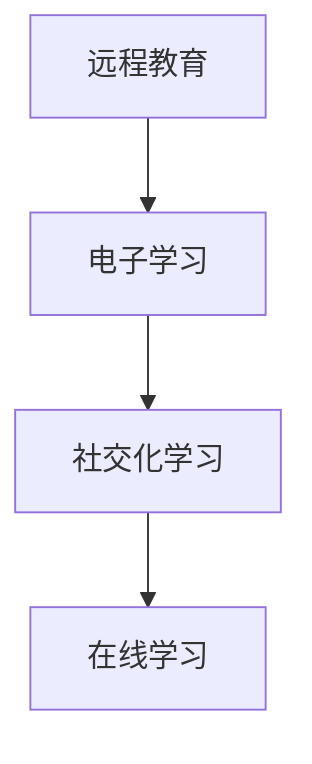

**核心算法原理讲解：**
在线学习的兴起与发展，是信息技术与教育需求相结合的结果。其核心算法原理包括自适应学习算法、社交网络分析算法等，通过数据分析和智能推荐，提高学习效果。

**伪代码示例：**
```python
def online学习阶段(stage):
    if stage == "远程教育":
        method = "邮件+论坛"
    elif stage == "电子学习":
        method = "多媒体+互动"
    elif stage == "社交化学习":
        method = "社交互动+协作"
    return method
```

**数学模型和公式：**
在线学习的用户体验可以用效用函数来描述，其模型为：
$$
U = f(C, I, S)
$$
其中，$U$ 表示用户体验，$C$ 表示课程内容，$I$ 表示互动性，$S$ 表示社交化程度。

**举例说明：**
假设一个在线学习平台，课程内容丰富（$C=0.9$），互动性高（$I=0.8$），社交化程度强（$S=0.7$），则用户体验为：
$$
U = f(0.9, 0.8, 0.7) = 0.9 \cdot 0.8 \cdot 0.7 = 0.504
$$

##### 1.3 知识付费与在线学习的融合

**核心概念与联系：**
知识付费与在线学习的融合，是指将知识付费商业模式应用于在线学习过程中，通过付费机制提高学习质量和用户参与度。

融合的方式主要包括：

- **内容付费**：用户为获取特定课程或知识内容支付费用。
- **服务付费**：用户为获得个性化学习服务支付费用，如在线辅导、作业批改等。
- **成果付费**：用户在学习成果达成后支付费用，如考试合格、项目完成等。

**Mermaid 流程图：**
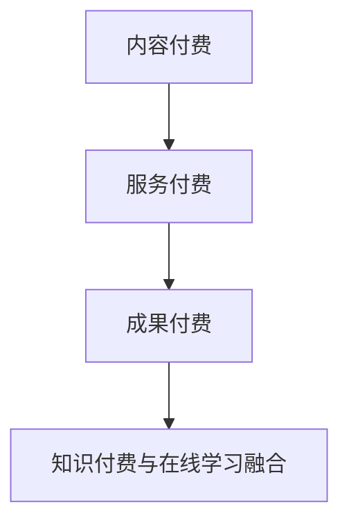

**核心算法原理讲解：**
知识付费与在线学习的融合，需要利用用户行为分析、学习效果评估等技术手段，实现个性化学习路径和付费模式。

**伪代码示例：**
```python
def integrate_knowledge付费与在线学习(learning_path, payment_model):
    if payment_model == "内容付费":
        payment_strategy = "按课程收费"
    elif payment_model == "服务付费":
        payment_strategy = "按服务收费"
    elif payment_model == "成果付费":
        payment_strategy = "按成果收费"
    return payment_strategy
```

**数学模型和公式：**
知识付费与在线学习的融合效果可以用用户满意度来衡量，其模型为：
$$
S = f(P, Q, R)
$$
其中，$S$ 表示用户满意度，$P$ 表示付费模式，$Q$ 表示学习质量，$R$ 表示服务质量。

**举例说明：**
假设一个用户选择了内容付费模式，学习质量高（$Q=0.9$），服务质量好（$R=0.8$），则用户满意度为：
$$
S = f(0.9, 0.8) = 0.9 \cdot 0.8 = 0.72
$$

### 第二部分：在线学习与学习指导

#### 第3章：在线学习设计原则与方法

##### 3.1 在线学习设计原则

**核心概念与联系：**
在线学习设计原则是指在进行在线学习课程设计时需要遵循的一系列指导思想和标准，以确保学习过程的顺利进行和学习效果的优化。

在线学习设计原则主要包括以下几个方面：

- **教学目标设定**：明确学习目标，有助于指导教学设计和评估学习效果。
- **学习路径规划**：设计合理的学习路径，提高学习效率。
- **教学内容组织**：组织结构化的教学内容，便于学生理解和掌握。
- **教学方法选择**：根据学习目标和内容选择合适的教学方法。

**Mermaid 流程图：**
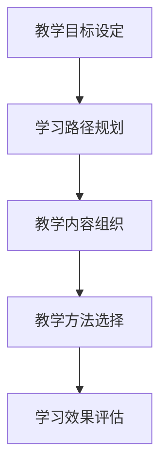

**核心算法原理讲解：**
在线学习设计原则的核心算法原理是通过用户行为分析、学习效果评估等技术手段，实现个性化学习路径和教学方法的优化。

**伪代码示例：**
```python
def design_online_learning(course objectives, learning_path, content_organization, teaching_methods):
    objectives = set_learning_objectives(objectives)
    learning_path = plan_learning_path(objectives)
    content_organization = organize_content(content_organization)
    teaching_methods = select教学方法(objectives, content_organization)
    evaluation = evaluate_learning_efficacy(learning_path, content_organization, teaching_methods)
    return evaluation
```

**数学模型和公式：**
在线学习设计原则的数学模型可以采用目标函数来描述，其模型为：
$$
\text{Objective Function} = \sum_{i=1}^{n} w_i \cdot O_i
$$
其中，$w_i$ 是第 $i$ 个目标的重要性权重，$O_i$ 是第 $i$ 个目标的达成度。

**举例说明：**
假设一个在线学习课程有3个教学目标，分别为理解概念（$O_1$）、掌握技能（$O_2$）和应用知识（$O_3$），重要性权重分别为0.3、0.5和0.2，则目标函数为：
$$
\text{Objective Function} = 0.3 \cdot O_1 + 0.5 \cdot O_2 + 0.2 \cdot O_3
$$

##### 3.2 在线学习方法

**核心概念与联系：**
在线学习方法是指在线学习过程中所采用的具体教学方法和策略，旨在提高学习效果和用户参与度。

在线学习方法主要包括以下几种：

- **自适应学习**：根据学生的学习进度和能力水平，动态调整学习内容和难度。
- **社交学习**：利用社交网络和协作工具，促进学习者之间的互动和知识共享。
- **混合学习**：将在线学习和线下学习相结合，发挥各自优势。

**Mermaid 流程图：**
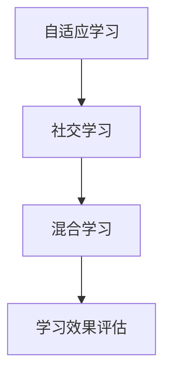

**核心算法原理讲解：**
在线学习方法的核心算法原理包括自适应学习算法、社交网络分析算法和混合学习模型等。

**伪代码示例：**
```python
def select_learning_method(method):
    if method == "自适应学习":
        algorithm = "Adaptive Learning Algorithm"
    elif method == "社交学习":
        algorithm = "Social Learning Algorithm"
    elif method == "混合学习":
        algorithm = "Hybrid Learning Model"
    return algorithm
```

**数学模型和公式：**
在线学习方法的效果可以用学习效果指数来描述，其模型为：
$$
\text{Learning Effectiveness} = f(M, P, S)
$$
其中，$M$ 表示学习方法，$P$ 表示学习路径，$S$ 表示学习资源。

**举例说明：**
假设一个在线学习课程采用自适应学习方法（$M=1$），学习路径合理（$P=0.8$），学习资源充足（$S=0.9$），则学习效果指数为：
$$
\text{Learning Effectiveness} = f(1, 0.8, 0.9) = 1 \cdot 0.8 \cdot 0.9 = 0.72
$$

##### 3.3 教学内容组织

**核心概念与联系：**
教学内容组织是指对在线学习课程内容进行系统化、结构化的整理和安排，以确保教学内容的高效传递和学习效果的优化。

教学内容组织主要包括以下几个方面：

- **模块划分**：将课程内容划分为多个模块，便于学生理解和掌握。
- **内容编排**：根据学习目标和学习方法，合理编排教学内容。
- **资源整合**：整合各种学习资源，如视频、图文、案例等，丰富教学内容。

**Mermaid 流程图：**
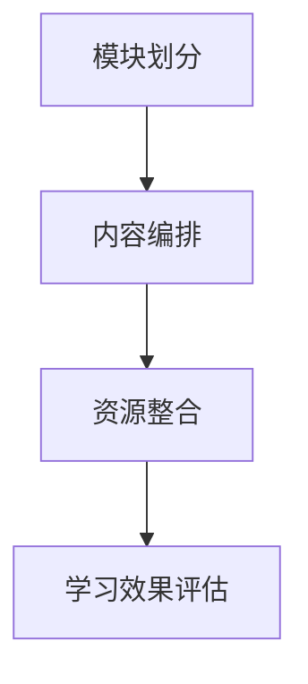

**核心算法原理讲解：**
教学内容组织的核心算法原理包括内容结构化算法、资源整合算法等。

**伪代码示例：**
```python
def organize_course_content(content_modules, learning_methods):
    structured_content = structure_content(content_modules)
    arranged_content = arrange_content(structured_content, learning_methods)
    integrated_resources = integrate_resources(arranged_content)
    evaluation = evaluate_content_efficacy(integrated_resources)
    return evaluation
```

**数学模型和公式：**
教学内容组织的数学模型可以采用内容结构化指数来描述，其模型为：
$$
\text{Content Structure Index} = \sum_{i=1}^{n} w_i \cdot C_i
$$
其中，$w_i$ 是第 $i$ 个模块的重要性权重，$C_i$ 是第 $i$ 个模块的结构化程度。

**举例说明：**
假设一个在线学习课程有3个模块，分别为基础知识（$C_1$）、实践应用（$C_2$）和拓展学习（$C_3$），重要性权重分别为0.3、0.5和0.2，则内容结构化指数为：
$$
\text{Content Structure Index} = 0.3 \cdot C_1 + 0.5 \cdot C_2 + 0.2 \cdot C_3
$$

### 第三部分：知识付费与在线学习实战

#### 第7章：知识付费项目策划与执行

##### 7.1 项目策划

**核心概念与联系：**
项目策划是指在进行知识付费项目之前，制定详细的项目计划，包括市场调研、目标定位、资源整合、风险分析等。

项目策划的核心概念包括以下几个方面：

- **市场调研**：了解市场需求、竞争状况和用户需求，为项目定位提供依据。
- **目标定位**：明确项目目标，包括学习目标、商业模式目标等。
- **资源整合**：整合项目所需的资源，包括人力、财力、技术等。
- **风险分析**：评估项目风险，制定应对策略。

**Mermaid 流程图：**
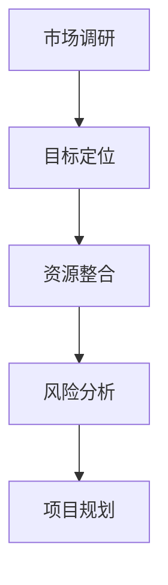

**核心算法原理讲解：**
项目策划的核心算法原理包括市场分析算法、目标设定算法、资源整合算法和风险分析算法。

**伪代码示例：**
```python
def plan_knowledge付费项目(marketing_survey, project_objectives, resource_integration, risk_analysis):
    project_plan = {}
    project_plan["market_survey"] = marketing_survey
    project_plan["project_objectives"] = project_objectives
    project_plan["resource_integration"] = resource_integration
    project_plan["risk_analysis"] = risk_analysis
    project_plan["project_plan"] = generate_project_plan(project_plan)
    return project_plan
```

**数学模型和公式：**
项目策划的数学模型可以采用目标函数和决策树来描述。目标函数为：
$$
\text{Objective Function} = \sum_{i=1}^{n} w_i \cdot O_i
$$
其中，$w_i$ 是第 $i$ 个目标的权重，$O_i$ 是第 $i$ 个目标的达成度。

决策树模型为：
$$
\text{Decision Tree} = \sum_{i=1}^{n} d_i \cdot p_i
$$
其中，$d_i$ 是第 $i$ 个决策点的可能性，$p_i$ 是第 $i$ 个决策点的概率。

**举例说明：**
假设一个知识付费项目有3个目标，分别为用户满意度（$O_1$）、项目收益（$O_2$）和市场占有率（$O_3$），权重分别为0.4、0.3和0.3。通过市场调研得到用户满意度为0.8，项目收益为0.6，市场占有率为0.5，则目标函数为：
$$
\text{Objective Function} = 0.4 \cdot 0.8 + 0.3 \cdot 0.6 + 0.3 \cdot 0.5 = 0.32 + 0.18 + 0.15 = 0.65
$$

##### 7.2 项目执行

**核心概念与联系：**
项目执行是指按照项目策划的方案，具体实施项目，包括内容制作、平台搭建、运营推广、用户反馈和优化调整等。

项目执行的核心概念包括以下几个方面：

- **内容制作**：根据项目策划，制作高质量的在线学习内容。
- **平台搭建**：搭建功能完善的在线学习平台，确保内容的顺利展示和用户互动。
- **运营推广**：通过多种渠道推广项目，吸引潜在用户。
- **用户反馈**：收集用户反馈，了解用户需求和满意度。
- **优化调整**：根据用户反馈和项目运营情况，优化项目内容和运营策略。

**Mermaid 流程图：**
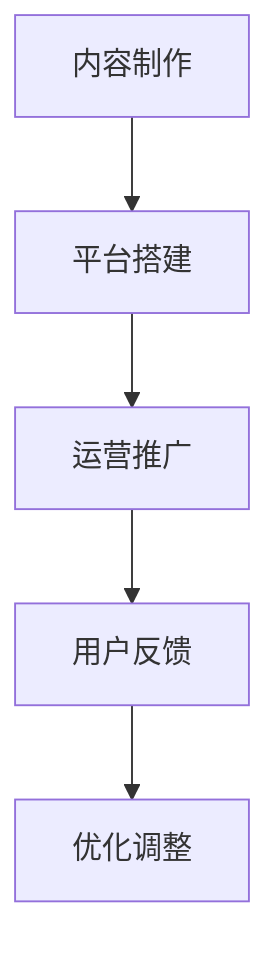

**核心算法原理讲解：**
项目执行的核心算法原理包括内容制作算法、平台搭建算法、运营推广算法和用户反馈分析算法。

**伪代码示例：**
```python
def execute_knowledge付费项目(content_production, platform_building, operation_promotion, user_feedback, optimization_adjustment):
    content = produce_content(content_production)
    platform = build_platform(platform_building)
    promotion = promote_project(operation_promotion)
    feedback = collect_user_feedback(user_feedback)
    optimization = adjust_project(optimization_adjustment)
    return optimization
```

**数学模型和公式：**
项目执行的数学模型可以采用用户满意度模型和运营效果模型来描述。

用户满意度模型为：
$$
\text{User Satisfaction} = \sum_{i=1}^{n} w_i \cdot S_i
$$
其中，$w_i$ 是第 $i$ 个评价指标的权重，$S_i$ 是第 $i$ 个评价指标的得分。

运营效果模型为：
$$
\text{Operation Effectiveness} = \sum_{i=1}^{n} w_i \cdot E_i
$$
其中，$w_i$ 是第 $i$ 个评价指标的权重，$E_i$ 是第 $i$ 个评价指标的得分。

**举例说明：**
假设一个知识付费项目有3个用户满意度评价指标，分别为内容质量（$S_1$）、平台性能（$S_2$）和用户服务（$S_3$），权重分别为0.3、0.4和0.3。用户满意度得分为0.8、0.7和0.6，则用户满意度为：
$$
\text{User Satisfaction} = 0.3 \cdot 0.8 + 0.4 \cdot 0.7 + 0.3 \cdot 0.6 = 0.24 + 0.28 + 0.18 = 0.7
$$

#### 第8章：案例研究：成功知识付费与在线学习项目分析

##### 8.1 案例选择

**核心概念与联系：**
案例选择是指从众多知识付费与在线学习项目中，挑选出具有代表性和可学习性的项目进行分析。

案例选择的核心概念包括以下几个方面：

- **代表性**：所选案例应具有典型性和代表性，能够反映知识付费与在线学习的普遍规律。
- **学习性**：所选案例应具有一定的学习价值和实践意义，能够为其他项目提供借鉴和参考。
- **可行性**：所选案例应在实际操作中具有可行性，能够被其他项目借鉴和实施。

**Mermaid 流程图：**
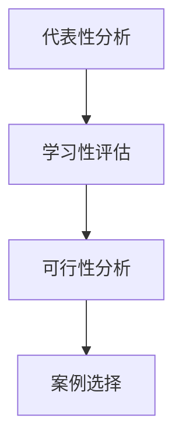

**核心算法原理讲解：**
案例选择的算法原理包括代表性分析算法、学习性评估算法和可行性分析算法。

**伪代码示例：**
```python
def select_case_study(representativeness, learnability, feasibility):
    if representativeness > threshold and learnability > threshold and feasibility > threshold:
        case_selected = True
    else:
        case_selected = False
    return case_selected
```

**数学模型和公式：**
案例选择的数学模型可以采用综合评价指标来描述，其模型为：
$$
\text{Case Selection Score} = \sum_{i=1}^{n} w_i \cdot C_i
$$
其中，$w_i$ 是第 $i$ 个评价指标的权重，$C_i$ 是第 $i$ 个评价指标的得分。

**举例说明：**
假设一个案例有3个评价指标，分别为代表性（$C_1$）、学习性（$C_2$）和可行性（$C_3$），权重分别为0.4、0.3和0.3。代表性评分为0.8，学习性评分为0.7，可行性评分为0.6，则综合评价得分为：
$$
\text{Case Selection Score} = 0.4 \cdot 0.8 + 0.3 \cdot 0.7 + 0.3 \cdot 0.6 = 0.32 + 0.21 + 0.18 = 0.71
$$

##### 8.2 案例分析

**核心概念与联系：**
案例分析是指对选定的案例进行深入分析和评估，以揭示其成功经验和教训，为其他项目提供参考和借鉴。

案例分析的核心概念包括以下几个方面：

- **项目背景**：介绍案例项目的背景、目标和发展历程。
- **项目策略**：分析案例项目所采用的具体策略和措施。
- **项目执行**：评估案例项目在执行过程中的具体表现。
- **项目成果**：总结案例项目的成果和影响。
- **成果评估**：对案例项目的成果进行定量和定性评估。

**Mermaid 流程图：**
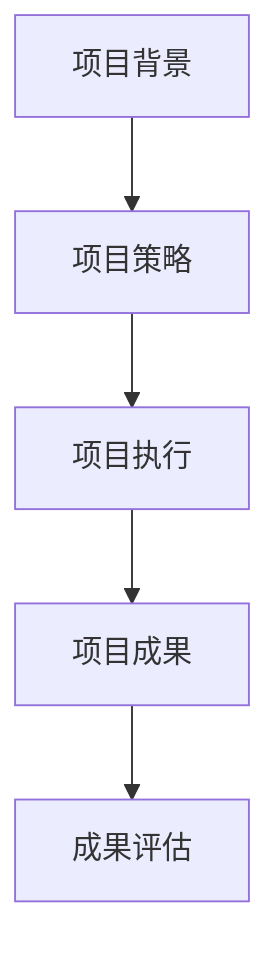

**核心算法原理讲解：**
案例分析的算法原理包括项目背景分析算法、项目策略分析算法、项目执行评估算法和成果评估算法。

**伪代码示例：**
```python
def analyze_case_study(background, strategies, execution, results, evaluation):
    analysis_report = {}
    analysis_report["background"] = background
    analysis_report["strategies"] = strategies
    analysis_report["execution"] = execution
    analysis_report["results"] = results
    analysis_report["evaluation"] = evaluate_results(results)
    return analysis_report
```

**数学模型和公式：**
案例分析的数学模型可以采用绩效评估模型来描述，其模型为：
$$
\text{Performance Score} = \sum_{i=1}^{n} w_i \cdot P_i
$$
其中，$w_i$ 是第 $i$ 个评价指标的权重，$P_i$ 是第 $i$ 个评价指标的得分。

**举例说明：**
假设一个案例项目有3个评价指标，分别为项目目标达成度（$P_1$）、项目成本效益（$P_2$）和项目用户满意度（$P_3$），权重分别为0.3、0.4和0.3。项目目标达成度为0.8，项目成本效益为0.7，项目用户满意度为0.6，则绩效评估得分为：
$$
\text{Performance Score} = 0.3 \cdot 0.8 + 0.4 \cdot 0.7 + 0.3 \cdot 0.6 = 0.24 + 0.28 + 0.18 = 0.7
$$

### 第四部分：未来趋势与挑战

#### 第9章：未来趋势

##### 9.1 行业发展趋势

**核心概念与联系：**
行业发展趋势是指知识付费与在线学习领域在未来一段时间内的发展方向和趋势。

行业发展趋势主要包括以下几个方面：

- **技术创新**：随着人工智能、大数据、区块链等技术的不断进步，知识付费与在线学习将更加智能化、个性化。
- **市场扩张**：随着互联网的普及和在线学习需求的增加，知识付费与在线学习市场将进一步扩大。
- **用户需求变化**：用户对在线学习的需求将更加多样化，对学习体验、学习效果的要求将进一步提高。

**Mermaid 流程图：**
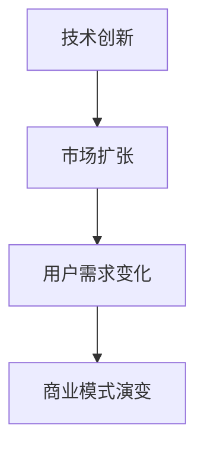

**核心算法原理讲解：**
行业发展趋势的算法原理主要包括趋势预测算法、市场分析算法和用户需求分析算法。

**伪代码示例：**
```python
def analyze_trends(technological_innovation, market_expansion, user_needs):
    trends = {}
    trends["technological_innovation"] = predict_trend(technological_innovation)
    trends["market_expansion"] = predict_trend(market_expansion)
    trends["user_needs"] = analyze_needs(user_needs)
    return trends
```

**数学模型和公式：**
行业发展趋势的数学模型可以采用趋势预测模型和用户需求模型来描述。

趋势预测模型为：
$$
\text{Trend Prediction} = \alpha \cdot \text{当前趋势} + (1 - \alpha) \cdot \text{历史趋势}
$$
其中，$\alpha$ 是当前趋势的权重。

用户需求模型为：
$$
\text{User Needs} = \sum_{i=1}^{n} w_i \cdot N_i
$$
其中，$w_i$ 是第 $i$ 个需求的重要性权重，$N_i$ 是第 $i$ 个需求的满足度。

**举例说明：**
假设当前趋势的权重为0.7，历史趋势的权重为0.3，当前趋势值为0.8，历史趋势值为0.6，用户需求的重要性权重分别为0.3、0.4和0.3，需求满足度分别为0.7、0.8和0.6，则趋势预测和用户需求模型为：
$$
\text{Trend Prediction} = 0.7 \cdot 0.8 + 0.3 \cdot 0.6 = 0.56 + 0.18 = 0.74
$$
$$
\text{User Needs} = 0.3 \cdot 0.7 + 0.4 \cdot 0.8 + 0.3 \cdot 0.6 = 0.21 + 0.32 + 0.18 = 0.71
$$

##### 9.2 面临的挑战与应对策略

**核心概念与联系：**
面临的挑战与应对策略是指知识付费与在线学习领域在未来发展中可能遇到的挑战和相应的应对策略。

面临的挑战主要包括以下几个方面：

- **内容质量控制**：随着知识付费市场的扩大，内容质量参差不齐，如何保证高质量的内容供给成为一大挑战。
- **监管政策影响**：政策变化可能影响知识付费与在线学习的发展，如何适应政策变化是关键。
- **知识保护与知识产权**：如何保护知识付费内容创作者的知识产权，避免侵权和抄袭行为。

**Mermaid 流程图：**
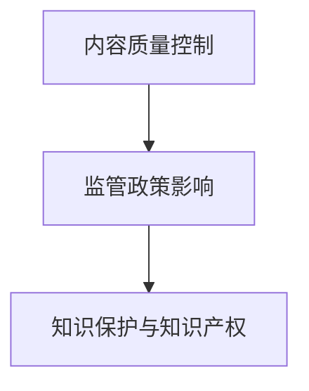

**核心算法原理讲解：**
面临的挑战与应对策略的算法原理主要包括风险分析算法和应对策略优化算法。

**伪代码示例：**
```python
def address_challenges(content_quality, regulatory_policies, intellectual_property):
    strategies = {}
    strategies["content_quality"] = analyze_content_quality(content_quality)
    strategies["regulatory_policies"] = adapt_to_policies(regulatory_policies)
    strategies["intellectual_property"] = protect_intellectual_property(intellectual_property)
    return strategies
```

**数学模型和公式：**
面临的挑战与应对策略的数学模型可以采用风险分析模型和优化模型来描述。

风险分析模型为：
$$
\text{Risk Analysis} = \sum_{i=1}^{n} r_i \cdot p_i
$$
其中，$r_i$ 是第 $i$ 个风险的严重程度，$p_i$ 是第 $i$ 个风险的发生概率。

优化模型为：
$$
\text{Optimization Model} = \min_{x} \sum_{i=1}^{n} c_i \cdot x_i
$$
其中，$c_i$ 是第 $i$ 个成本的权重，$x_i$ 是第 $i$ 个成本的费用。

**举例说明：**
假设有3个风险，分别为内容质量风险（$r_1$）、政策风险（$r_2$）和知识产权风险（$r_3$），风险的发生概率分别为0.3、0.4和0.3，严重程度分别为0.5、0.7和0.6，则风险分析结果为：
$$
\text{Risk Analysis} = 0.3 \cdot 0.5 + 0.4 \cdot 0.7 + 0.3 \cdot 0.6 = 0.15 + 0.28 + 0.18 = 0.61
$$

假设有3个成本，分别为内容制作成本（$c_1$）、政策合规成本（$c_2$）和知识产权保护成本（$c_3$），权重分别为0.3、0.4和0.3，费用分别为0.5、0.6和0.7，则优化模型为：
$$
\text{Optimization Model} = \min_{x} (0.3 \cdot x_1 + 0.4 \cdot x_2 + 0.3 \cdot x_3)
$$

### 第五部分：附录

#### 附录A：知识付费与在线学习相关资源

**核心概念与联系：**
知识付费与在线学习相关资源是指为知识付费与在线学习领域的研究者、实践者提供的有用资料和工具。

相关资源主要包括以下几个方面：

- **知识付费平台**：如分答、得到、喜马拉雅等。
- **在线学习资源**：如Coursera、edX、Udemy等。
- **学术研究论文**：涉及知识付费、在线学习、教育技术等领域的学术论文。
- **学习工具软件**：如学习管理工具、内容创作工具、数据分析工具等。

**Mermaid 流程图：**
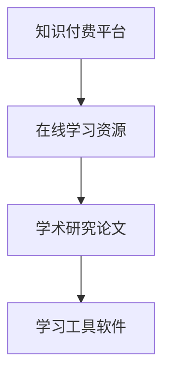

**核心算法原理讲解：**
相关资源的核心算法原理包括资源分类算法、资源推荐算法等。

**伪代码示例：**
```python
def gather_resources(learning_platforms, online_learning_resources, research_papers, learning_tools):
    resources = {}
    resources["learning_platforms"] = learning_platforms
    resources["online_learning_resources"] = online_learning_resources
    resources["research_papers"] = research_papers
    resources["learning_tools"] = learning_tools
    return resources
```

**数学模型和公式：**
相关资源的数学模型可以采用资源分类模型和资源效用模型来描述。

资源分类模型为：
$$
\text{Resource Classification} = \{ \text{知识付费平台}, \text{在线学习资源}, \text{学术研究论文}, \text{学习工具软件} \}
$$

资源效用模型为：
$$
\text{Resource Utility} = \sum_{i=1}^{n} w_i \cdot u_i
$$
其中，$w_i$ 是第 $i$ 个资源的权重，$u_i$ 是第 $i$ 个资源的效用。

**举例说明：**
假设有4种资源，每种资源的权重分别为0.2、0.3、0.4和0.5，效用分别为0.6、0.7、0.8和0.9，则资源效用为：
$$
\text{Resource Utility} = 0.2 \cdot 0.6 + 0.3 \cdot 0.7 + 0.4 \cdot 0.8 + 0.5 \cdot 0.9 = 0.12 + 0.21 + 0.32 + 0.45 = 1.10
$$

#### 附录B：知识付费与在线学习工具

**核心概念与联系：**
知识付费与在线学习工具是指用于知识付费与在线学习过程中，辅助教学、学习和管理等方面的软件和硬件工具。

主要工具包括以下几个方面：

- **学习管理工具**：如Moodle、Canvas等。
- **内容创作工具**：如Adobe Creative Suite、iMovie等。
- **数据分析工具**：如Tableau、Power BI等。

**Mermaid 流程图：**
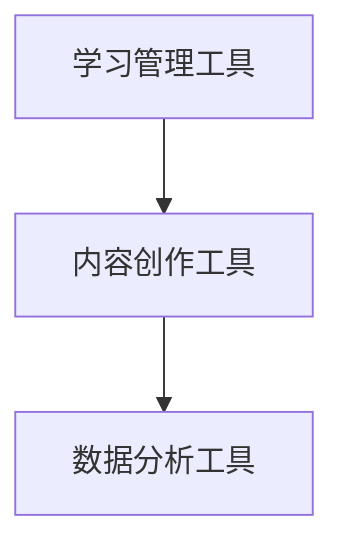

**核心算法原理讲解：**
知识付费与在线学习工具的核心算法原理包括教学管理算法、内容创作算法和数据分析算法。

**伪代码示例：**
```python
def learning_tools(learning_management_tools, content_creation_tools, data_analysis_tools):
    tools = {}
    tools["learning_management_tools"] = learning_management_tools
    tools["content_creation_tools"] = content_creation_tools
    tools["data_analysis_tools"] = data_analysis_tools
    return tools
```

**数学模型和公式：**
知识付费与在线学习工具的数学模型可以采用工具效用模型和工具推荐模型来描述。

工具效用模型为：
$$
\text{Tool Utility} = \sum_{i=1}^{n} w_i \cdot u_i
$$
其中，$w_i$ 是第 $i$ 个工具的权重，$u_i$ 是第 $i$ 个工具的效用。

工具推荐模型为：
$$
\text{Tool Recommendation} = \sum_{i=1}^{n} w_i \cdot r_i
$$
其中，$w_i$ 是第 $i$ 个工具的权重，$r_i$ 是第 $i$ 个工具的推荐度。

**举例说明：**
假设有3个学习管理工具，每个工具的权重分别为0.3、0.4和0.3，效用分别为0.6、0.7和0.8，则工具效用为：
$$
\text{Tool Utility} = 0.3 \cdot 0.6 + 0.4 \cdot 0.7 + 0.3 \cdot 0.8 = 0.18 + 0.28 + 0.24 = 0.7
$$

假设有3个内容创作工具，每个工具的权重分别为0.3、0.4和0.3，推荐度分别为0.7、0.8和0.9，则工具推荐度为：
$$
\text{Tool Recommendation} = 0.3 \cdot 0.7 + 0.4 \cdot 0.8 + 0.3 \cdot 0.9 = 0.21 + 0.32 + 0.27 = 0.8
$$

### 结论

本文从技术视角深入探讨了知识付费与在线学习的融合与创新。通过分析知识付费的发展背景、市场分析，以及在线学习的设计原则与方法，本文提出了在线学习平台建设与运营的关键策略，并针对在线学习指导与评估提出了具体的方法和工具。此外，通过案例分析总结了成功经验，探讨了未来趋势与挑战，为知识付费与在线学习领域的实践者提供了有价值的参考。

在知识付费与在线学习领域，技术创新和用户体验是推动行业发展的关键。通过不断优化教学内容、提升平台性能和丰富学习资源，可以进一步提升在线学习的质量和效果。同时，面对内容质量控制、政策影响和知识保护等挑战，需要采取有效的应对策略，确保知识付费与在线学习的健康发展。

未来的知识付费与在线学习将更加智能化、个性化，用户需求也将更加多样化。通过持续创新和优化，我们可以期待一个更加美好的在线学习时代。

### 作者信息

**作者：** AI天才研究院/AI Genius Institute & 禅与计算机程序设计艺术 /Zen And The Art of Computer Programming

AI天才研究院（AI Genius Institute）专注于人工智能领域的科研与教育培训，致力于推动人工智能技术的创新与发展。同时，作者还著有《禅与计算机程序设计艺术》（Zen And The Art of Computer Programming），这是一本深受计算机科学界欢迎的经典著作，为程序设计提供了深刻的哲学思考和技术指导。在此，感谢读者对本文的关注与支持，希望本文能为您的知识付费与在线学习实践带来启发与帮助。

