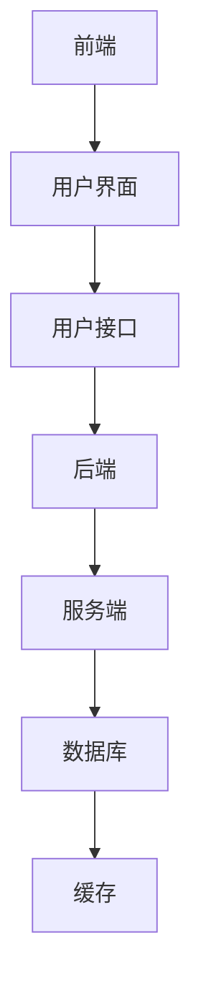

                 

# 《如何利用知识付费实现在线学习与在线考试指导？》

> **关键词：** 知识付费、在线学习、在线考试、教育技术、用户体验

> **摘要：** 本篇文章将探讨知识付费模式在在线教育和考试中的应用，分析其商业模式、技术实现、用户体验以及未来发展趋势。通过深入探讨知识付费的核心概念、在线学习平台的构建、在线考试系统的设计等方面，为教育工作者和技术开发者提供实用的指导和参考。

### 《如何利用知识付费实现在线学习与在线考试指导？》目录大纲

#### 第一部分：知识付费与在线教育概述

##### 第1章：知识付费与在线教育的背景与发展
1.1 知识付费的起源与发展
1.2 在线教育的崛起与变革

##### 第2章：在线学习平台的架构与设计
2.1 在线学习平台的总体架构
2.2 内容管理与课程设计
2.3 学习路径设计与推荐系统

##### 第3章：用户管理与学习行为分析
3.1 用户管理系统
3.2 学习行为分析

##### 第4章：在线考试系统的设计与实现
4.1 考试系统架构设计
4.2 考试题库设计与维护
4.3 考试过程管理与监控

#### 第二部分：在线学习平台的搭建与运营

##### 第5章：知识付费商业模式与盈利模式
5.1 知识付费商业模式分析
5.2 盈利模式设计

##### 第6章：用户参与与互动机制
6.1 用户参与度提升策略
6.2 互动机制设计与实现

##### 第7章：案例分析与实战指导
7.1 国内外知识付费与在线学习案例
7.2 实战指导与优化策略

#### 第三部分：知识付费与在线学习结合策略

##### 第8章：知识付费与在线学习的发展趋势
8.1 新技术对知识付费与在线学习的影响
8.2 未来发展方向与挑战

#### 附录
A.1 行业报告与研究报告
A.2 在线学习平台与工具
A.3 知识付费课程与学习资源
A.4 学术论文与专业书籍

---

现在，让我们详细展开每一个章节的内容。

---

#### 第一部分：知识付费与在线教育概述

##### 第1章：知识付费与在线教育的背景与发展

**1.1 知识付费的起源与发展**

知识付费，是指用户为获取特定知识或技能而支付费用的一种商业模式。随着互联网技术的发展，知识付费逐渐成为一种重要的知识传播和获取方式。

**知识付费的定义：**
知识付费是指通过互联网平台，用户为获取特定知识或技能而支付费用的一种服务。这种服务通常包括在线课程、电子书籍、专业咨询、技能培训等多种形式。

**知识付费的市场规模与趋势：**
近年来，知识付费市场呈现出快速增长的趋势。根据相关数据显示，我国知识付费市场已从2016年的100亿元增长到2020年的2000亿元，预计未来仍将保持高速增长。

**知识付费的驱动因素：**
1. 用户需求：随着社会发展和个人职业规划的日益重视，用户对知识付费的需求逐渐增加。
2. 内容丰富：互联网平台上的知识内容日益丰富，为用户提供了多样化的选择。
3. 付费习惯：随着移动支付的普及，用户逐渐养成了付费获取知识的习惯。

**知识付费的主要模式：**
1. 课程付费：用户通过购买课程来获取知识。
2. 订阅模式：用户通过订阅服务来获取持续的知识更新。
3. 付费问答：用户通过付费提问来获取专业解答。
4. 专业咨询：用户通过付费咨询来获取专业建议。

**1.2 在线教育的崛起与变革**

**在线教育的定义与特点：**
在线教育是指通过互联网技术，实现教学和学习的一种教育形式。其特点包括：
1. 灵活性：用户可以根据自己的时间安排进行学习。
2. 跨界性：用户可以接触到来自全球的优秀教育资源。
3. 个性化：在线教育平台可以根据用户的学习情况，提供个性化的学习建议。

**在线教育的发展历程与现状：**
在线教育起源于20世纪90年代，随着互联网技术的发展，在线教育逐渐成为一种重要的教育形式。目前，在线教育已经成为全球教育领域的重要组成部分。

**在线教育的核心需求：**
1. 优质内容：用户需要获取高质量的知识内容。
2. 互动体验：用户需要与教师和其他学生进行互动，以提升学习效果。
3. 便捷性：用户需要方便快捷地进行学习。

**在线教育的主要挑战：**
1. 教育资源的不均衡：在线教育难以解决教育资源分布不均的问题。
2. 用户信任问题：在线教育平台需要提高用户信任度。
3. 教育质量的保障：在线教育平台需要确保教育质量。

---

接下来，我们将深入探讨在线学习平台的架构与设计，以及用户管理与学习行为分析。

---

#### 第二部分：在线学习平台的搭建与运营

##### 第2章：在线学习平台的架构与设计

**2.1 在线学习平台的总体架构**

在线学习平台的总体架构可以分为前端架构、后端架构和数据库架构三个部分。

**2.1.1 系统架构图**

**2.1.2 前端架构设计**

前端架构主要涉及用户界面的设计、用户接口的开发以及静态资源的加载。

**前端架构设计原则：**
1. 用户友好：界面设计简洁、易于操作。
2. 响应式设计：适应不同设备和屏幕尺寸。
3. 交互性：提供丰富的交互体验，提升用户参与度。

**2.1.3 后端架构设计**

后端架构主要涉及服务端、数据库和缓存的设计与实现。

**后端架构设计原则：**
1. 扩展性：系统应能够支持用户量的增加和业务量的增长。
2. 安全性：确保用户数据的安全和隐私。
3. 高性能：系统应能够快速响应用户请求。

**2.2 内容管理与课程设计**

内容管理是在线学习平台的核心功能之一，主要涉及课程内容的管理、发布和更新。

**2.2.1 内容管理体系**

内容管理体系包括课程内容、课程资料、学习笔记等，可以通过以下步骤进行管理：

1. 课程分类与标签管理：将课程分为不同的类别和标签，方便用户查找和筛选。
2. 课程内容发布：将课程内容发布到平台上，供用户学习。
3. 课程内容更新：定期更新课程内容，保持课程的新鲜度和实用性。

**2.2.2 课程设计与规划**

课程设计是确保课程质量的关键环节，主要包括以下步骤：

1. 需求分析：分析用户需求，确定课程目标和学习内容。
2. 课程大纲制定：制定课程大纲，明确课程的学习目标和内容结构。
3. 教学方法选择：根据课程内容和学习目标，选择合适的教学方法。

**2.2.3 学习路径设计与推荐系统**

学习路径设计是根据用户的学习需求和课程内容，为用户设计一条合理的、系统的学习路径。

**学习路径设计原则：**
1. 适应性：根据用户的学习进度和需求，动态调整学习路径。
2. 科学性：确保学习路径的科学性，避免盲目学习。
3. 实用性：学习路径应贴近用户实际需求，提高学习效果。

推荐系统是基于用户行为数据，为用户推荐合适的课程和内容。

**推荐系统设计原则：**
1. 实时性：及时响应用户行为，提供实时推荐。
2. 精准性：根据用户特征和兴趣，提供精准推荐。
3. 可扩展性：系统应具备良好的扩展性，支持不同类型的推荐算法。

---

接下来，我们将探讨用户管理与学习行为分析。

---

#### 第二部分：在线学习平台的搭建与运营

##### 第3章：用户管理与学习行为分析

**3.1 用户管理系统**

用户管理系统是在线学习平台的重要组成部分，主要负责用户的注册、登录、资料管理、权限设置等功能。

**3.1.1 用户注册与认证**

用户注册是用户使用在线学习平台的第一步，主要包括以下步骤：

1. 用户填写注册信息：用户填写注册信息，包括用户名、密码、邮箱等。
2. 信息验证：平台对用户信息进行验证，确保信息的真实性和有效性。
3. 注册成功：验证通过后，用户完成注册，并可以登录系统。

用户认证是确保用户身份的唯一性和安全性，主要包括以下方式：

1. 用户名密码认证：用户通过用户名和密码进行登录。
2. 第三方账号认证：用户可以通过第三方账号（如微信、QQ、微博等）进行登录。
3. 手机号码认证：用户通过手机号码进行登录，提高账号安全性。

**3.1.2 用户资料管理与权限设置**

用户资料管理是用户在平台上进行学习和管理的重要依据，主要包括以下内容：

1. 用户资料录入：用户可以上传个人资料，包括头像、个人简介、联系方式等。
2. 用户资料更新：用户可以随时更新个人资料，确保信息的准确性。
3. 用户资料查询：平台管理员可以查询用户资料，以便进行管理和分析。

权限设置是确保用户在使用平台过程中，拥有合适的使用权限，主要包括以下内容：

1. 用户角色划分：根据用户身份和职责，划分不同的角色，如学生、教师、管理员等。
2. 用户权限设置：为不同角色设置相应的权限，如查看课程、发布课程、管理用户等。
3. 权限管理：平台管理员可以根据需要，调整用户的权限。

**3.1.3 用户行为追踪与分析**

用户行为追踪是了解用户在平台上的行为，以便进行个性化推荐和改进服务的重要手段。主要包括以下内容：

1. 用户登录行为：记录用户登录时间、登录IP地址等，用于分析用户活跃度和地域分布。
2. 用户学习行为：记录用户的学习进度、学习时长、学习频率等，用于分析用户的学习习惯和兴趣。
3. 用户互动行为：记录用户的评论、点赞、分享等行为，用于分析用户的互动倾向和社区活跃度。

用户行为分析是基于用户行为数据，进行数据挖掘和分析，为用户提供个性化服务和建议。主要包括以下内容：

1. 用户画像：通过对用户行为的分析，构建用户画像，用于精准推荐和个性化服务。
2. 学习路径优化：根据用户的学习行为，优化学习路径，提高学习效果。
3. 用户体验改进：根据用户反馈和行为分析结果，改进平台功能和服务，提升用户体验。

---

接下来，我们将探讨在线考试系统的设计与实现。

---

#### 第二部分：在线学习平台的搭建与运营

##### 第4章：在线考试系统的设计与实现

**4.1 考试系统架构设计**

在线考试系统是确保在线学习平台教学质量的重要环节，其架构设计主要包括前端、后端、数据库和缓存四个部分。

**4.1.1 考试系统功能模块**

考试系统的主要功能模块包括：

1. 考试报名：用户可以选择考试科目和考试时间，完成报名。
2. 考试安排：管理员可以设置考试科目、考试时间和考试地点。
3. 考试过程监控：系统可以实时监控考试过程，确保考试公平、公正。
4. 考试成绩管理：系统可以记录考试成绩，提供成绩查询和统计功能。

**4.1.2 考试系统技术选型**

考试系统的技术选型主要包括：

1. 前端技术：采用HTML5、CSS3和JavaScript，实现用户界面和交互功能。
2. 后端技术：采用Spring Boot框架，实现考试系统的业务逻辑和数据处理。
3. 数据库技术：采用MySQL数据库，存储考试相关的数据信息。
4. 缓存技术：采用Redis缓存，提高系统性能和响应速度。

**4.1.3 考试系统安全性设计**

考试系统的安全性设计主要包括：

1. 用户认证：采用单点登录（SSO）技术，确保用户身份的安全。
2. 数据加密：对用户数据和考试数据采用加密技术，保护用户隐私。
3. 权限控制：对系统功能进行权限控制，确保用户只能访问自己权限内的功能。
4. 异常监控：对系统运行过程中出现的异常情况进行监控，确保系统稳定运行。

**4.2 考试题库设计与维护**

考试题库是考试系统的核心部分，主要涉及题库的分类与标签管理、题库内容审核与更新、题库内容管理与题库内容维护。

**4.2.1 题库分类与标签管理**

题库分类与标签管理主要包括以下内容：

1. 题库分类：将题目分为不同的类别，如单选题、多选题、判断题等。
2. 题库标签：为题目添加标签，便于分类和搜索。
3. 标签管理：管理员可以添加、删除和编辑标签，确保标签的准确性和一致性。

**4.2.2 题库内容审核与更新**

题库内容审核与更新主要包括以下内容：

1. 题目审核：管理员对新增的题目进行审核，确保题目的质量和正确性。
2. 题库更新：管理员定期更新题库内容，保持题库的新鲜度和实用性。
3. 用户反馈：用户可以对题目提出反馈，管理员根据用户反馈进行题目修改和更新。

**4.2.3 题库内容管理与题库内容维护**

题库内容管理与题库内容维护主要包括以下内容：

1. 题目管理：管理员可以查看、编辑和删除题目，确保题库的完整性。
2. 题库备份与恢复：管理员定期备份题库，确保题库的安全和可恢复性。
3. 题库优化：根据用户反馈和考试数据，对题库进行优化和调整，提高考试效果。

**4.3 考试过程管理与监控**

考试过程管理与监控主要包括以下内容：

1. 考试流程设计：管理员可以根据考试需求，设计考试流程，包括考试开始、考试结束、成绩发布等。
2. 考试过程监控：系统可以实时监控考试过程，包括考试时间、考试进度、考试状态等。
3. 考试异常处理：系统可以自动检测考试过程中的异常情况，并给出相应的处理建议。
4. 考试数据统计：系统可以记录考试数据，包括考试成绩、考试时长、考试频率等，为后续分析和改进提供依据。

---

接下来，我们将探讨知识付费商业模式与盈利模式。

---

#### 第二部分：在线学习平台的搭建与运营

##### 第5章：知识付费商业模式与盈利模式

**5.1 知识付费商业模式分析**

知识付费商业模式是指通过互联网平台，为用户提供付费知识服务的一种商业运营模式。其主要模式包括以下几种：

**5.1.1 付费内容制作与分发**

付费内容制作与分发是指通过专业团队或个人制作优质的内容，并将其分发到互联网平台上，供用户付费购买。

**主要步骤：**

1. 内容制作：根据用户需求，制作有价值、有吸引力的内容。
2. 内容审核：对内容进行审核，确保内容的质量和正确性。
3. 内容发布：将内容发布到互联网平台上，供用户购买。
4. 内容更新：定期更新内容，保持内容的时效性和实用性。

**5.1.2 付费会员与订阅模式**

付费会员与订阅模式是指用户通过付费成为会员，享受平台提供的专属服务和特权。

**主要特点：**

1. 会员制度：平台设立会员等级，提供不同等级的会员服务。
2. 定期订阅：用户可以定期订阅内容，享受持续的更新和福利。

**5.1.3 广告与电商合作模式**

广告与电商合作模式是指平台通过与广告主和电商平台合作，实现收入来源的多样化。

**主要形式：**

1. 广告收入：平台为广告主提供广告位，通过展示广告获取收入。
2. 电商收入：平台与电商平台合作，为用户提供商品购买链接，通过商品销售获取收入。

**5.2 盈利模式设计**

知识付费平台的盈利模式设计旨在为平台带来持续的收入，同时为用户提供优质的服务。以下几种盈利模式可供选择：

**5.2.1 单一课程收费模式**

单一课程收费模式是指用户为单门课程支付费用，以获取学习机会。

**主要优势：**

1. 收入稳定：每门课程都有固定的收入。
2. 用户参与度高：用户为特定课程付费，学习积极性高。

**5.2.2 学期制课程收费模式**

学期制课程收费模式是指用户为一定学期的课程支付费用，以获得连续的学习体验。

**主要优势：**

1. 拉长时间效应：用户在较长时间内持续学习，平台收益增加。
2. 形成学习习惯：用户在学期内形成良好的学习习惯，有助于后续课程的推广。

**5.2.3 线下活动收费模式**

线下活动收费模式是指平台举办线下活动，如讲座、沙龙、培训等，用户通过付费参与。

**主要优势：**

1. 用户体验强：线下活动能够为用户带来更直观、深入的学习体验。
2. 拓展收入来源：线下活动为平台带来了新的收入来源，有助于平台盈利。

---

接下来，我们将探讨用户参与与互动机制。

---

#### 第二部分：在线学习平台的搭建与运营

##### 第6章：用户参与与互动机制

**6.1 用户参与度提升策略**

用户参与度是衡量在线学习平台成功与否的重要指标。以下策略有助于提升用户参与度：

**6.1.1 学习社区建设**

学习社区是用户交流和互动的重要平台。以下措施有助于建设学习社区：

1. 社区规则制定：制定明确的社区规则，规范用户行为。
2. 激励机制设计：为积极参与社区的用户提供奖励，如积分、优惠券等。
3. 社区活动组织：定期举办线上或线下活动，促进用户互动。

**6.1.2 用户激励与奖励机制**

用户激励与奖励机制是提高用户参与度的重要手段。以下措施可供选择：

1. 积分奖励：为用户提供积分奖励，积分可以兑换课程、优惠券等。
2. 成就系统：为用户设置成就系统，鼓励用户完成学习任务和挑战。
3. 优秀用户表彰：对在学习中表现优秀的用户进行表彰，提升其积极性。

**6.1.3 用户反馈与改进机制**

用户反馈是平台改进服务的重要依据。以下措施有助于建立用户反馈与改进机制：

1. 反馈渠道设置：为用户提供多种反馈渠道，如在线客服、问卷调查、意见箱等。
2. 反馈数据分析：对用户反馈进行分类、分析，找出问题所在，制定改进措施。
3. 改进措施公示：将改进措施公示于平台，增强用户对平台的信任感。

**6.2 互动机制设计与实现**

互动机制是促进用户参与和交流的关键。以下互动机制可供选择：

**6.2.1 直播互动与在线问答**

直播互动与在线问答是一种实时互动的形式，有助于提升用户的参与感和满意度。以下措施可供选择：

1. 直播课程：邀请专家进行直播课程，用户可以在直播过程中提问和互动。
2. 在线问答：设置在线问答环节，用户可以在课程结束后提问，专家进行解答。

**6.2.2 讨论区与论坛管理**

讨论区与论坛是用户交流的重要场所。以下措施有助于管理和维护讨论区与论坛：

1. 管理员监管：设立管理员，负责监督讨论区与论坛的秩序，处理违规行为。
2. 标签分类：为帖子添加标签，便于用户查找和浏览。
3. 好帖推荐：根据用户兴趣和热度，推荐优质帖子和话题。

**6.2.3 社交分享与推荐机制**

社交分享与推荐机制有助于扩大平台影响力，提高用户参与度。以下措施可供选择：

1. 社交分享：鼓励用户将学习心得、课程评价等分享到社交平台，增加曝光度。
2. 内容推荐：根据用户行为和兴趣，为用户推荐合适的课程和内容。
3. 排行榜：设立学习排行榜，激励用户积极参与学习，提高学习动力。

---

接下来，我们将探讨国内外知识付费与在线学习案例，并给出实战指导与优化策略。

---

#### 第二部分：在线学习平台的搭建与运营

##### 第7章：案例分析与实战指导

**7.1 国内外知识付费与在线学习案例**

**国内案例：**

1. 知乎Live：知乎Live是知乎推出的知识付费产品，用户可以付费听专家讲解，参与讨论。
2. 好未来：好未来是一家K12教育培训机构，通过线上平台提供各类课程和辅导服务。

**国外案例：**

1. Coursera：Coursera是全球领先的在线学习平台，提供来自世界顶级大学的在线课程。
2. Udemy：Udemy是一个庞大的在线学习社区，用户可以免费或付费学习各类课程。

**7.2 实战指导与优化策略**

**平台搭建与运营实战：**

1. 确定目标用户：分析用户需求，明确平台定位，制定合适的发展战略。
2. 内容策划与制作：制作高质量的内容，确保内容的专业性和实用性。
3. 营销推广：通过线上线下渠道，提高平台知名度和用户粘性。

**考试系统开发与测试：**

1. 系统需求分析：明确考试系统的功能需求和性能需求，制定系统设计方案。
2. 系统开发与测试：采用敏捷开发模式，快速迭代和优化系统。
3. 系统部署与运维：确保考试系统的稳定运行，提供良好的用户体验。

**用户参与与互动实战：**

1. 学习社区建设：建立学习社区，鼓励用户参与讨论和分享。
2. 活动策划与执行：定期举办线上或线下活动，提高用户参与度。
3. 用户激励与奖励：设置用户激励与奖励机制，激励用户积极参与学习。

---

#### 第三部分：知识付费与在线学习结合策略

##### 第8章：知识付费与在线学习的发展趋势

**8.1 新技术对知识付费与在线学习的影响**

随着新技术的不断发展和普及，知识付费与在线学习领域也受到了深刻的影响。以下新技术对知识付费与在线学习的影响：

**8.1.1 人工智能与大数据分析**

人工智能与大数据分析技术的应用，使得在线学习平台能够更好地了解用户需求，提供个性化推荐和服务。以下应用场景：

1. 个性化推荐：基于用户行为数据和兴趣偏好，为用户推荐合适的课程和内容。
2. 智能问答：利用自然语言处理技术，实现智能问答，提高用户满意度。
3. 学习行为分析：通过对用户学习行为的数据分析，优化学习路径和教学方法。

**8.1.2 区块链与加密货币**

区块链与加密货币技术的应用，为知识付费与在线学习领域带来了新的商业模式和支付方式。以下应用场景：

1. 交易安全：利用区块链技术，确保交易数据的安全和不可篡改。
2. 点对点支付：通过加密货币实现点对点支付，降低交易成本。
3. 数字版权保护：利用区块链技术，实现数字版权的保护和追踪。

**8.1.3 虚拟现实与增强现实**

虚拟现实与增强现实技术的应用，为在线学习提供了更生动、直观的学习体验。以下应用场景：

1. 实景教学：通过虚拟现实技术，实现实景教学，提高学习效果。
2. 模拟实验：通过增强现实技术，进行模拟实验，增强学习体验。
3. 远程互动：通过虚拟现实技术，实现远程互动，提高用户参与度。

**8.2 未来发展方向与挑战**

**8.2.1 个性化学习与智能推荐**

个性化学习与智能推荐是未来知识付费与在线学习的重要发展方向。以下挑战：

1. 数据隐私保护：如何确保用户数据的安全和隐私，是未来发展的重要挑战。
2. 内容质量保障：如何确保内容的质量和准确性，是未来发展的重要挑战。
3. 技术创新：如何持续创新技术，提高在线学习平台的竞争力，是未来发展的重要挑战。

**8.2.2 跨界合作与生态构建**

跨界合作与生态构建是未来知识付费与在线学习的重要发展趋势。以下挑战：

1. 合作模式创新：如何创新合作模式，实现多方共赢，是未来发展的重要挑战。
2. 资源整合：如何整合各方资源，构建良好的生态体系，是未来发展的重要挑战。
3. 法规政策：如何应对法规政策的调整和变化，是未来发展的重要挑战。

---

#### 附录

**附录A：知识付费与在线学习相关资源**

**A.1 行业报告与研究报告**

1. 中国互联网信息中心（CNNIC）：《中国互联网发展状况统计报告》
2. 艾瑞咨询（iResearch）：《中国在线教育行业年度报告》
3. 市场研究公司（Market Research Reports）：全球知识付费市场研究报告

**A.2 在线学习平台与工具**

1. Coursera
2. Udemy
3. EdX
4. Khan Academy
5. Quizlet

**A.3 知识付费课程与学习资源**

1. 腾讯课堂
2. 阿里云大学
3. 网易云课堂
4. 脑洞课堂
5. 慕课网

**A.4 学术论文与专业书籍**

1. 《在线教育理论与实践》
2. 《知识付费：商业模式与盈利模式》
3. 《教育技术：理论与实践》
4. 《人工智能与教育》
5. 《大数据分析与应用》

---

以上，我们详细探讨了如何利用知识付费实现在线学习与在线考试指导。通过本文的讨论，我们可以得出以下结论：

1. **知识付费与在线教育的结合，为用户提供了一种高效、便捷的学习方式，有助于提升学习效果。**
2. **在线学习平台需要关注用户需求，提供高质量的内容和服务，以提升用户满意度和粘性。**
3. **在线考试系统是确保学习质量的重要手段，需要注重安全性、可靠性和用户体验。**
4. **知识付费与在线学习的发展，离不开新技术的支持，如人工智能、区块链、虚拟现实等。**

未来，知识付费与在线学习将继续发展，不断创新，为用户提供更加丰富、多样、个性化的学习体验。让我们共同期待这一美好前景的到来。

---

**作者：AI天才研究院/AI Genius Institute & 禅与计算机程序设计艺术 /Zen And The Art of Computer Programming**

