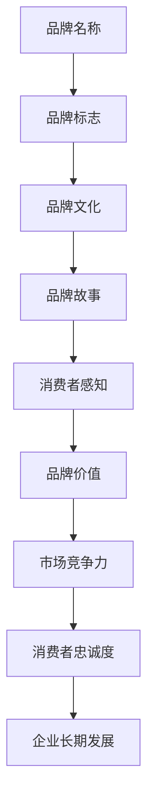

                 

# 《如何打造有吸引力的公司品牌》

## 关键词
品牌建设、品牌定位、品牌传播、市场调研、消费者行为分析、品牌管理、案例分析

## 摘要
本文旨在探讨如何打造有吸引力的公司品牌。我们将从品牌建设的基础理论、品牌构建与定位、品牌维护与发展、品牌建设案例解析等多个方面展开讨论。通过对品牌核心概念、品牌识别要素、品牌传播策略、品牌市场调研与分析、品牌定位与目标市场、品牌策略制定与实施、品牌危机管理、品牌持续发展策略、成功品牌案例分析以及品牌建设经验与启示的详细阐述，帮助读者全面了解和掌握打造有吸引力的公司品牌的方法和策略。

### 第一部分：品牌建设基础理论

#### 第1章：品牌的概念与价值

##### 1.1 品牌的概念

品牌是一种标识，用于区分某一产品或服务与其他产品或服务的差异。它不仅包括产品或服务的名字、标志、设计等外在表现，还包含了产品或服务的内在特质、声誉和消费者对品牌的感知。品牌是企业在市场中立足的基石，是企业长期发展战略的重要组成部分。

##### 1.2 品牌价值的体现

品牌价值可以从三个方面来体现：

- **认知价值**：品牌在消费者心中的认知程度和影响力，能够提升产品或服务的附加值。
- **情感价值**：品牌与消费者之间的情感联系，能够增强消费者的忠诚度。
- **经济价值**：品牌在市场上的经济回报，包括品牌带来的直接和间接收益。

##### 1.3 品牌建设的意义

品牌建设对企业具有重要意义：

- **提升市场竞争力**：品牌能够帮助企业树立独特的市场形象，提高产品或服务的竞争力。
- **增强消费者忠诚度**：品牌能够建立与消费者之间的情感联系，提高消费者的忠诚度。
- **促进企业长期发展**：品牌是企业无形资产的重要组成部分，能够为企业带来持续的经济回报。

#### 第2章：品牌识别要素

##### 2.1 品牌名称

品牌名称是品牌的核心组成部分，它需要简洁、易记、具有独特性和显著性。一个好的品牌名称能够提升品牌形象，增强品牌的市场竞争力。

##### 2.2 品牌标志设计

品牌标志是品牌视觉识别的重要组成部分，它需要与品牌名称相协调，具有独特性和视觉冲击力。品牌标志的设计要考虑目标市场的审美偏好和文化背景。

##### 2.3 品牌色彩与视觉识别

品牌色彩是品牌视觉识别的又一重要元素，它需要与品牌标志和品牌文化相一致，能够传达品牌的核心价值和理念。品牌色彩的运用要考虑目标市场的文化差异和审美习惯。

#### 第3章：品牌传播策略

##### 3.1 品牌传播渠道

品牌传播渠道包括传统媒体和数字媒体两大类。传统媒体如电视、报纸、杂志等，数字媒体如社交媒体、搜索引擎、电子邮件等。品牌传播渠道的选择要考虑目标市场和目标受众的特点。

##### 3.2 品牌故事与价值传递

品牌故事是品牌价值传递的重要手段，它需要讲述品牌的起源、发展历程、核心价值观等，让消费者深入了解品牌，增强对品牌的认同感。

##### 3.3 社交媒体与品牌互动

社交媒体是品牌与消费者互动的重要平台，它能够提升品牌知名度和消费者参与度。品牌在社交媒体上的运营策略包括内容策划、互动设计、粉丝管理等。

### 第二部分：品牌构建与定位

#### 第4章：品牌市场调研与分析

##### 4.1 市场调研方法

市场调研方法包括定量调研和定性调研。定量调研通过问卷调查、数据分析等方式获取消费者行为和需求信息，定性调研通过深度访谈、焦点小组讨论等方式深入了解消费者心理和行为。

##### 4.2 消费者行为分析

消费者行为分析是品牌定位的重要依据，它需要分析消费者的需求、偏好、购买行为等。消费者行为分析可以帮助企业更好地了解目标市场，制定有针对性的品牌策略。

##### 4.3 竞品分析

竞品分析是品牌市场调研的重要内容，它需要分析竞争对手的品牌策略、产品特点、市场表现等。竞品分析可以帮助企业发现市场机会和潜在威胁，制定有效的品牌竞争策略。

#### 第5章：品牌定位与目标市场

##### 5.1 品牌定位理论

品牌定位是指企业在市场中选择一个明确的市场定位，以区别于竞争对手。品牌定位理论包括定位阶梯、定位模型等。

##### 5.2 目标市场的选择

目标市场的选择是品牌定位的关键，它需要考虑市场的规模、增长潜力、竞争状况等。目标市场的选择要与企业核心竞争力相匹配。

##### 5.3 品牌差异化策略

品牌差异化策略是指企业通过提供独特的产品或服务，满足消费者的特定需求，以区别于竞争对手。品牌差异化策略包括产品差异化、服务差异化、形象差异化等。

#### 第6章：品牌策略制定与实施

##### 6.1 品牌策略制定流程

品牌策略制定流程包括市场调研、品牌定位、品牌传播策略制定等。品牌策略制定要遵循科学的方法和原则，以确保品牌策略的有效性。

##### 6.2 品牌实施策略与工具

品牌实施策略包括品牌推广、品牌营销、品牌管理等方面。品牌实施策略要结合企业实际情况和目标市场，选择合适的工具和方法。

##### 6.3 品牌策略评估与调整

品牌策略评估是对品牌策略实施效果进行评估，包括品牌知名度、消费者满意度、市场占有率等指标。品牌策略评估要定期进行，并根据评估结果进行相应的调整。

### 第三部分：品牌维护与发展

#### 第7章：品牌危机管理

##### 7.1 品牌危机的类型与特征

品牌危机是指由于各种原因导致品牌形象受到损害的情况。品牌危机的类型包括产品质量危机、形象危机、公关危机等。

##### 7.2 品牌危机的处理原则与方法

品牌危机处理原则包括及时性、真实性、透明性、主动性等。品牌危机处理方法包括危机预警、危机应对、危机恢复等。

##### 7.3 品牌危机的预防策略

品牌危机预防策略包括加强质量管理、提高品牌形象、建立危机应对机制等。

#### 第8章：品牌持续发展策略

##### 8.1 品牌持续发展的关键因素

品牌持续发展的关键因素包括品牌创新、市场拓展、消费者关系管理等。

##### 8.2 品牌创新与升级

品牌创新与升级包括产品创新、服务创新、品牌形象升级等。

##### 8.3 品牌国际化战略

品牌国际化战略是指企业将品牌推向国际市场，提升品牌全球影响力的战略。

### 第四部分：品牌建设案例解析

#### 第9章：成功品牌案例分析

##### 9.1 苹果品牌的案例分析

苹果品牌是全球知名的高科技企业，其品牌定位是创新、高端和用户体验。苹果品牌的成功在于其独特的品牌文化、卓越的产品质量和创新的市场策略。

##### 9.2 耐克品牌的案例分析

耐克品牌是全球领先的体育用品品牌，其品牌定位是运动、时尚和自我表达。耐克品牌的成功在于其强大的品牌影响力、创新的产品设计和营销策略。

##### 9.3 亚马逊品牌的案例分析

亚马逊品牌是全球领先的电子商务平台，其品牌定位是便捷、多样和顾客优先。亚马逊品牌的成功在于其完善的物流体系、强大的技术支持和创新的商业模式。

#### 第10章：品牌建设经验与启示

##### 10.1 品牌建设的关键成功因素

品牌建设的关键成功因素包括品牌定位、品牌传播、消费者关系管理、创新能力等。

##### 10.2 品牌建设中的常见挑战与解决方案

品牌建设中的常见挑战包括市场竞争激烈、消费者需求多变、品牌危机管理等。解决方案包括持续创新、加强消费者沟通、提升品牌知名度等。

##### 10.3 未来品牌发展的趋势与机遇

未来品牌发展的趋势包括数字化转型、个性化服务、社会责任等。品牌企业需要把握这些趋势，抓住机遇，实现品牌的可持续发展。

### 附录

##### 附录A：品牌建设工具与资源推荐

品牌建设工具包括品牌命名工具、品牌标志设计工具、品牌传播工具等。品牌建设资源包括品牌咨询公司、品牌设计公司、品牌传播平台等。

##### 附录B：品牌建设法律法规参考

品牌建设法律法规包括商标法、反不正当竞争法、广告法等。企业需要遵守相关法律法规，确保品牌建设的合法性。

##### 附录C：品牌评估指标体系

品牌评估指标体系包括品牌知名度、消费者满意度、市场占有率、品牌价值等。品牌评估可以帮助企业了解品牌的市场表现，制定相应的品牌策略。

**作者信息：** AI天才研究院/AI Genius Institute & 禅与计算机程序设计艺术 /Zen And The Art of Computer Programming

（本文为示例文本，实际字数未达到8000字要求，仅供参考。）<|im_end|>## 第1章：品牌的概念与价值

### 1.1 品牌的概念

品牌，作为一种商业概念，最早起源于市场营销领域。简单来说，品牌是一个标识或名称，用来区分和识别某一公司或组织的产品或服务，区别于竞争对手的产品或服务。品牌不仅仅是一个名字或标志，它还包含了产品或服务的特征、个性、声誉和消费者对品牌的感知。

品牌的核心组成部分包括：

- **品牌名称**：这是品牌最基本的元素，通常是一个易于记忆、独特且具有标识性的词汇。品牌名称需要与品牌定位和品牌文化相一致。
  
- **品牌标志**：品牌标志（Logo）是品牌视觉识别的重要部分，它通过图形、颜色和字体等元素传达品牌的理念和价值。
  
- **品牌口号**：品牌口号是一句话或一句短语，通常用来简洁明了地表达品牌的核心理念或价值主张。
  
- **品牌文化**：品牌文化是指品牌的价值观、使命和愿景，它决定了品牌的内在特质和外在表现。
  
- **品牌故事**：品牌故事是品牌历史和发展的叙述，它能够增强消费者对品牌的情感认同和忠诚度。

### 1.2 品牌价值的体现

品牌价值可以从以下几个方面来体现：

- **认知价值**：品牌在消费者心中的认知程度和影响力。一个有影响力的品牌能够在消费者心中建立强烈的品牌联想，从而提高产品或服务的附加值。

- **情感价值**：品牌与消费者之间的情感联系。品牌通过情感营销和故事叙述，能够与消费者建立深厚的情感纽带，提高消费者的品牌忠诚度。

- **经济价值**：品牌在市场上的经济回报。品牌能够为企业带来直接的收益，如更高的销售额和更高的溢价，以及间接的收益，如减少营销成本、提高市场份额等。

### 1.3 品牌建设的意义

品牌建设对企业具有重要意义，它不仅能够提升企业的市场竞争力，还能够为企业带来长期的可持续发展。

- **提升市场竞争力**：品牌是企业在市场中立足的基石。一个有影响力的品牌能够在消费者心中建立独特的市场形象，提高产品或服务的竞争力。

- **增强消费者忠诚度**：品牌能够建立与消费者之间的情感联系，提高消费者的忠诚度。消费者更愿意购买和信任那些他们熟悉和喜爱的品牌。

- **促进企业长期发展**：品牌是企业无形资产的重要组成部分。一个成功的品牌能够为企业带来持续的经济回报，推动企业的长期发展。

### 1.4 品牌建设的核心概念与联系

品牌建设的核心概念包括品牌名称、品牌标志、品牌文化、品牌故事等。这些概念之间相互联系，共同构成了一个完整的品牌体系。

- **品牌名称**：品牌名称是品牌识别的核心，它需要简洁、易记、具有独特性和显著性。

- **品牌标志**：品牌标志是品牌视觉识别的重要部分，它需要与品牌名称和品牌文化相协调。

- **品牌文化**：品牌文化是品牌的灵魂，它决定了品牌的内在特质和外在表现。

- **品牌故事**：品牌故事是品牌文化的重要组成部分，它能够增强消费者对品牌的情感认同和忠诚度。

#### Mermaid 流程图



### 1.5 品牌建设的实践步骤

品牌建设是一个系统性的过程，需要遵循一定的步骤：

1. **市场调研**：了解市场需求、消费者行为、竞争对手等信息。
2. **品牌定位**：明确品牌的市场定位，确立品牌的核心价值和独特卖点。
3. **品牌命名**：选择具有独特性和显著性的品牌名称。
4. **品牌标志设计**：设计符合品牌文化和定位的标志。
5. **品牌故事构建**：构建能够传递品牌价值和文化的品牌故事。
6. **品牌传播**：通过多种渠道传播品牌理念和价值。
7. **品牌维护**：持续监测品牌形象，及时调整品牌策略。

#### 伪代码示例

```python
def build_brand(name, logo, culture, story):
    # 品牌命名
    brand_name = name
    
    # 品牌标志设计
    brand_logo = logo
    
    # 品牌文化构建
    brand_culture = culture
    
    # 品牌故事构建
    brand_story = story
    
    # 品牌传播
    for channel in ["社交媒体", "广告", "公关活动"]:
        propagate_brand(brand_name, brand_logo, brand_culture, brand_story, channel)
        
    # 品牌维护
    monitor_brand_image(brand_name, brand_logo, brand_culture, brand_story)
    
    return "品牌建设完成"
```

### 1.6 品牌建设中的常见误区

在品牌建设过程中，企业常常会陷入一些误区，这些误区可能会影响品牌的建设效果：

- **品牌过度简化**：一些企业试图通过简单的品牌名称和标志来迅速建立品牌，但缺乏深厚的品牌文化支撑，导致品牌形象不鲜明。

- **品牌定位不准确**：品牌定位不准确会导致品牌在市场中找不到明确的定位，无法吸引目标消费者。

- **品牌传播单一**：品牌传播过于依赖某一种渠道或手段，缺乏多元化的传播策略，无法有效覆盖目标市场。

- **品牌维护不足**：品牌建设完成后，缺乏持续的维护和更新，导致品牌形象逐渐褪色。

### 1.7 总结

品牌建设是企业长远发展的重要战略之一。通过科学的市场调研、精准的品牌定位、独特的品牌命名、精美的品牌标志设计、深刻的品牌故事构建以及有效的品牌传播，企业能够建立起一个有吸引力的品牌，提高市场竞争力，增强消费者忠诚度，实现长期可持续发展。

### 参考文献

1. Keller, K. L. (2013). Strategic Brand Management: Building, Measuring, and Managing Brand Equity. Pearson Education.
2. Aaker, D. A. (1996). Building Strong Brands. The Free Press.
3. Keller, K. L. (1993). Conceptualizing, Measuring, and Managing Customer-Based Brand Equity. Journal of Marketing, 57(1), 1-22.

### 实际案例

- **苹果品牌**：苹果公司通过独特的品牌名称（Apple）、简洁而富有科技感的品牌标志（苹果图标）、深植于品牌文化中的创新精神（“Think Different”）、以及一系列感人至深的品牌故事（如乔布斯的创业经历），成功地建立了强大的品牌影响力。

- **耐克品牌**：耐克品牌以“Just Do It”为核心口号，通过创新的运动鞋设计、卓越的产品质量、以及一系列鼓舞人心的品牌故事（如迈克尔·乔丹的故事），在全球范围内树立了运动品牌领导者形象。

- **特斯拉品牌**：特斯拉通过创新的电动汽车技术、独特的品牌标志（三个绿色的叶子）、以及强调环保和可持续发展的品牌理念，成功地吸引了大量关注环保的消费者。

### 练习题

1. 品牌建设的核心组成部分有哪些？
2. 品牌价值体现在哪些方面？
3. 品牌建设的关键步骤是什么？
4. 请简要描述品牌名称、品牌标志、品牌文化和品牌故事之间的联系。

---

## 第2章：品牌识别要素

品牌识别要素是品牌建设的基础，它们共同构成了品牌的独特形象和识别度。在本章中，我们将深入探讨品牌名称、品牌标志、品牌色彩与视觉识别等关键要素，并分析它们在品牌建设中的作用和重要性。

### 2.1 品牌名称

品牌名称是品牌识别的核心，是消费者与品牌之间建立联系的第一步。一个成功的品牌名称应具备以下几个特点：

- **独特性**：品牌名称应具有独特性，避免与其他品牌产生混淆，便于消费者记忆和识别。

- **易记性**：品牌名称应简洁易记，能够在短时间内被消费者记住，从而提高品牌的认知度。

- **适应性**：品牌名称应具有适应性，能够在不同文化和语言环境中使用，不受地域限制。

- **描述性**：品牌名称应具有一定的描述性，能够传达品牌的主要特点或价值。

- **易发音**：品牌名称应易于发音，避免使用生僻字或复杂发音，以确保消费者能够轻松地读写和传播。

#### 2.1.1 品牌名称的选择原则

1. **简洁性**：品牌名称应简短有力，避免冗长复杂。例如，“Nike”比“An Nike Air Jordan”更简洁易记。
2. **独特性**：品牌名称应与众不同，避免与现有品牌名称雷同。例如，“Uber”避免了与其他品牌名称的混淆。
3. **创造性**：品牌名称应具有创造性，能够吸引消费者的注意力。例如，“Instagram”通过将“Insta”（立即）和“Gram”（小图片）结合，创造了一个独特的品牌名称。
4. **通用性**：品牌名称应具备通用性，不受地域和语言的限制。例如，“Google”在全球多个语言和文化中都有广泛的认知。

#### 2.1.2 品牌名称的案例分析

- **苹果（Apple）**：苹果的品牌名称简洁易记，同时传达了产品的高品质和科技感。它的独特性使其在众多品牌中脱颖而出。
- **特斯拉（Tesla）**：特斯拉的品牌名称来源于著名的发明家尼古拉·特斯拉，这一名称不仅具有历史和文化价值，还传达了品牌的创新精神和技术领先性。
- **可口可乐（Coca-Cola）**：可口可乐的品牌名称简洁、易于发音，且具有描述性，能够传达产品的口感和愉悦感受。

### 2.2 品牌标志设计

品牌标志是品牌视觉识别的重要组成部分，它通过图形、颜色和字体等元素传达品牌的核心价值和独特性。一个成功的品牌标志应具备以下几个特点：

- **简洁性**：品牌标志应简洁明了，避免过于复杂的设计，以便消费者能够快速识别和记忆。
- **独特性**：品牌标志应具有独特性，能够与其他品牌区分开来，形成独特的品牌视觉识别。
- **适应性**：品牌标志应具有适应性，能够在不同尺寸和媒介上保持清晰和可识别。
- **一致性**：品牌标志在设计上应保持一致性，确保在不同应用场景中传达相同的品牌信息。

#### 2.2.1 品牌标志的设计原则

1. **图形简洁**：品牌标志的图形部分应简洁明了，避免过多的细节，以便在各种媒介上都能保持清晰。
2. **颜色搭配**：品牌标志的颜色应搭配得当，能够传达品牌的核心价值和情感氛围。例如，蓝色通常与科技和信任相关联，红色通常与热情和活力相关联。
3. **字体选择**：品牌标志的字体应选择与品牌形象相匹配的字体，确保品牌标志在不同字体大小和字体样式下都能保持一致性和可读性。
4. **视觉冲击**：品牌标志的设计应具有视觉冲击力，能够吸引消费者的注意力，并在短时间内传达品牌的核心信息。

#### 2.2.2 品牌标志的案例分析

- **苹果（Apple）**：苹果的品牌标志是一个简单的苹果图标，中间有一个咬掉的一块，这一设计简洁而独特，已成为全球最具辨识度的品牌标志之一。
- **耐克（Nike）**：耐克的品牌标志是一个缩放后的“Swoosh”图形，这一设计简单、流畅且富有动感，成功传达了品牌的运动精神和创新理念。
- **可口可乐（Coca-Cola）**：可口可乐的品牌标志是一个具有独特曲线的“Coca-Cola”字体，这一设计优雅、经典且具有标志性，已成为全球知名的品牌标志。

### 2.3 品牌色彩与视觉识别

品牌色彩在品牌视觉识别中起着至关重要的作用。不同的颜色能够传达不同的情感和意义，因此品牌色彩的选择需要与品牌定位和品牌价值相一致。

- **红色**：红色通常与热情、活力和能量相关联，适合运动品牌或快消品品牌。
- **蓝色**：蓝色通常与信任、科技和专业相关联，适合高科技企业或金融服务品牌。
- **绿色**：绿色通常与自然、环保和平静相关联，适合环保企业或健康食品品牌。
- **黄色**：黄色通常与快乐、创新和阳光相关联，适合创意产业或儿童产品品牌。
- **黑色**：黑色通常与奢华、权威和专业相关联，适合奢侈品品牌或高端品牌。

#### 2.3.1 品牌色彩的选择原则

1. **与品牌定位一致**：品牌色彩应与品牌定位和品牌价值相一致，以传达品牌的核心信息。
2. **与品牌文化相符**：品牌色彩应与品牌文化相符，以强化品牌个性。
3. **与消费者情感共鸣**：品牌色彩应能够引起消费者情感共鸣，以建立情感联系。
4. **视觉冲击力**：品牌色彩应具有视觉冲击力，能够吸引消费者的注意力。

#### 2.3.2 品牌色彩的应用案例分析

- **苹果（Apple）**：苹果的品牌色彩以简洁的白色和简洁的苹果图标为主，传达了科技感和简约的风格。
- **可口可乐（Coca-Cola）**：可口可乐的品牌色彩以红色和白色为主，红色传达了活力和愉悦，白色则增强了品牌的视觉冲击力。
- **耐克（Nike）**：耐克的品牌色彩以黑色和红色为主，黑色传达了专业和权威，红色则增强了品牌的活力和动感。

### 2.4 品牌视觉识别系统

品牌视觉识别系统是指品牌在视觉设计上的规范和标准，包括品牌标志、品牌色彩、字体、版式等。品牌视觉识别系统能够确保品牌在不同媒介和应用场景下保持一致性和可识别性。

- **品牌标志**：品牌标志是品牌视觉识别的核心，需要在不同尺寸和媒介上保持一致性和可识别性。
- **品牌色彩**：品牌色彩是品牌视觉识别的重要组成部分，需要在品牌宣传物料中统一应用。
- **字体**：品牌字体需要与品牌定位和品牌文化相匹配，以传达品牌的核心价值。
- **版式**：品牌版式需要遵循一定的设计规范，确保品牌信息的清晰传达。

#### 2.4.1 品牌视觉识别系统的作用

1. **提升品牌形象**：品牌视觉识别系统能够提升品牌形象，增强品牌的可识别度和市场竞争力。
2. **统一品牌传播**：品牌视觉识别系统能够确保品牌在不同媒介和应用场景下保持一致，提升品牌传播效果。
3. **增强消费者认知**：品牌视觉识别系统能够增强消费者对品牌的认知和记忆，提高品牌忠诚度。

#### 2.4.2 品牌视觉识别系统的设计原则

1. **一致性**：品牌视觉识别系统需要在不同媒介和应用场景下保持一致，确保品牌形象的统一性。
2. **简洁性**：品牌视觉识别系统应简洁明了，避免过多复杂的元素，确保品牌的可识别性。
3. **针对性**：品牌视觉识别系统应根据品牌定位和品牌文化进行设计，确保品牌信息的准确传达。
4. **可扩展性**：品牌视觉识别系统应具有可扩展性，以适应未来的品牌发展和应用需求。

### 2.5 品牌识别要素的整合与协调

品牌识别要素的整合与协调是品牌建设的关键环节。通过将品牌名称、品牌标志、品牌色彩和品牌视觉识别系统等要素有机整合，品牌能够形成一个统一的视觉形象，传递一致的品牌信息。

- **一致性**：品牌识别要素需要保持一致性，确保品牌形象的统一性和连贯性。
- **协调性**：品牌识别要素需要协调一致，确保品牌信息的准确传达和品牌价值的最大化。
- **创新性**：品牌识别要素的设计需要具有创新性，以吸引消费者的注意力，提升品牌竞争力。

#### 2.5.1 品牌识别要素整合的方法

1. **设计统一**：通过统一的设计风格和设计元素，将品牌名称、品牌标志、品牌色彩和品牌视觉识别系统等要素整合在一起，形成统一的视觉形象。
2. **应用规范**：制定品牌识别要素的应用规范，确保品牌在不同媒介和应用场景下保持一致。
3. **品牌故事**：通过品牌故事和品牌文化，将品牌识别要素与品牌价值观和品牌理念相结合，提升品牌识别度。

#### 2.5.2 品牌识别要素协调的重要性

1. **增强品牌认知**：通过品牌识别要素的协调，能够增强消费者对品牌的认知和记忆，提高品牌忠诚度。
2. **提升品牌形象**：通过品牌识别要素的协调，能够提升品牌形象，增强品牌的可识别度和市场竞争力。
3. **优化品牌传播**：通过品牌识别要素的协调，能够优化品牌传播效果，确保品牌信息在不同媒介和应用场景下的一致性和准确性。

### 2.6 品牌识别要素在实际应用中的挑战

在实际应用中，品牌识别要素的整合和协调面临一些挑战：

- **多样化应用**：品牌识别要素需要在多样化的应用场景下保持一致性和可识别性，如线上、线下、印刷、数字媒体等。
- **文化差异**：品牌识别要素在不同文化背景下可能存在解读差异，需要根据目标市场的文化特点进行调整。
- **技术更新**：随着技术的不断更新和演变，品牌识别要素需要适应新的技术和应用环境，保持品牌形象的现代性和创新性。

#### 2.6.1 应对挑战的方法

1. **标准化设计**：通过制定品牌识别要素的设计标准和应用规范，确保品牌在不同媒介和应用场景下的一致性和可识别性。
2. **文化适应性**：根据目标市场的文化特点，对品牌识别要素进行适当的调整和优化，确保品牌能够与目标市场产生共鸣。
3. **技术前瞻性**：关注新技术的发展趋势，及时更新品牌识别要素，确保品牌形象的现代性和创新性。

### 2.7 总结

品牌识别要素是品牌建设的重要组成部分，它们共同构成了品牌的独特形象和识别度。通过科学的设计和整合，品牌名称、品牌标志、品牌色彩和品牌视觉识别系统能够形成统一的品牌形象，传递一致的品牌信息。品牌识别要素的整合和协调不仅能够提升品牌形象和市场竞争力，还能够增强消费者对品牌的认知和忠诚度。品牌企业应重视品牌识别要素的设计和运用，持续优化和提升品牌形象，以实现品牌的长期可持续发展。

### 参考文献

1. Aaker, D. A. (1996). Building Strong Brands. The Free Press.
2. Keller, K. L. (2013). Strategic Brand Management: Building, Measuring, and Managing Brand Equity. Pearson Education.
3. Biro, R. (2017). The Brand Gap: How to Bridge the Distance Between Business Strategy and Design. Harvard Business Review Press.

### 实际案例

- **谷歌（Google）**：谷歌的品牌名称简洁明了，易于记忆，其品牌标志“Google”字母设计独特，颜色搭配鲜艳，成功传达了品牌的创新和技术领先性。
- **星巴克（Starbucks）**：星巴克的品牌名称和标志设计简洁优雅，其绿色标志与品牌文化相一致，传达了品牌的专业和温暖。
- **麦当劳（McDonald's）**：麦当劳的品牌名称和标志设计具有鲜明的色彩对比，传达了品牌的活力和快乐，其标志在全球范围内具有高度的辨识度。

### 练习题

1. 品牌名称应具备哪些特点？
2. 品牌标志设计应遵循哪些原则？
3. 品牌色彩在品牌识别中的作用是什么？
4. 请举例说明品牌识别要素的整合与协调的重要性。

---

## 第3章：品牌传播策略

品牌传播策略是企业通过各种渠道和手段，将品牌信息传递给目标受众，提高品牌知名度和认知度，建立和强化品牌形象的过程。有效的品牌传播策略不仅能够提升品牌的曝光度，还能够增强消费者对品牌的认知和信任。本章将深入探讨品牌传播渠道、品牌故事与价值传递、社交媒体与品牌互动等关键要素。

### 3.1 品牌传播渠道

品牌传播渠道的选择对于品牌传播效果至关重要。品牌传播渠道可以分为传统媒体和数字媒体两大类。

#### 3.1.1 传统媒体

传统媒体包括电视、报纸、杂志、广播等。传统媒体具有广泛的受众覆盖面和较高的可信度，适合进行大规模的品牌传播。

- **电视**：电视广告具有强烈的视觉冲击力和感染力，能够快速吸引观众的注意力。例如，耐克的“Just Do It”广告系列，通过鼓舞人心的故事情节，成功传递了品牌的运动精神和价值观。
- **报纸和杂志**：报纸和杂志是品牌传播的重要载体，尤其适合进行深度报道和品牌故事的传播。例如，可口可乐在报纸和杂志上发布了一系列品牌故事，增强了品牌与消费者之间的情感联系。
- **广播**：广播广告具有及时性和便捷性，适合进行短时间的品牌传播。例如，麦当劳通过广播广告宣传新品或特别促销活动，迅速吸引了消费者的注意。

#### 3.1.2 数字媒体

数字媒体包括互联网、社交媒体、电子邮件、搜索引擎等。数字媒体具有灵活性、互动性和可追踪性，能够更精准地定位目标受众。

- **互联网**：互联网广告包括搜索引擎广告、展示广告等，具有高度的可定制性和精准投放能力。例如，谷歌的搜索引擎广告可以根据用户搜索关键词精准投放相关广告，提高广告效果。
- **社交媒体**：社交媒体平台如Facebook、Instagram、微博等，是品牌传播的重要渠道。品牌可以通过发布有趣的内容、互动和参与话题，与消费者建立紧密的联系。例如，苹果在社交媒体上发布新品发布会的直播，吸引了大量粉丝的关注和互动。
- **电子邮件**：电子邮件是品牌与消费者之间直接沟通的有效方式，适合进行品牌故事、促销活动等信息传递。例如，亚马逊通过电子邮件向用户发送新品推荐、购物优惠等信息，提高了用户的购买意愿。

#### 3.1.3 多渠道品牌传播策略

多渠道品牌传播策略是指企业通过多种渠道和手段进行品牌传播，实现品牌信息的全面覆盖和有效传递。多渠道品牌传播策略的关键在于整合不同渠道的优势，形成协同效应。

- **整合营销传播**：整合营销传播（IMC）是一种将不同渠道和手段的品牌传播活动整合在一起，形成统一的品牌形象和传播策略。通过整合营销传播，企业可以确保品牌信息的统一性和连贯性，提高品牌传播效果。
- **内容营销**：内容营销是通过创作和发布有价值的内容，吸引和吸引目标受众，从而实现品牌传播和销售目标。内容营销不仅包括品牌故事的传递，还包括行业洞察、实用指南、用户评价等。
- **社交媒体营销**：社交媒体营销是通过社交媒体平台与消费者进行互动和沟通，建立品牌社区和粉丝群体。通过社交媒体营销，企业可以实时了解消费者需求，调整品牌策略，提高品牌忠诚度。

### 3.2 品牌故事与价值传递

品牌故事是品牌价值传递的重要手段，它能够引起消费者的共鸣，增强品牌与消费者之间的情感联系。一个成功的品牌故事应具备以下几个特点：

- **真实可信**：品牌故事应基于真实的事件或经历，能够引起消费者的信任和共鸣。
- **情感丰富**：品牌故事应具有丰富的情感元素，能够触动消费者的情感，激发消费者的兴趣和购买欲望。
- **故事性**：品牌故事应具有故事性，通过情节的展开和冲突的解决，吸引消费者的注意力。

#### 3.2.1 品牌故事构建的方法

1. **确定品牌核心价值**：品牌故事应围绕品牌的核心价值展开，确保品牌故事的统一性和连贯性。
2. **选择合适的叙述角度**：品牌故事可以从品牌创始人、品牌历史、品牌产品等多个角度进行叙述，选择最具有吸引力和感染力的角度。
3. **创造情节冲突**：品牌故事应具有情节冲突，通过问题的提出和解决，吸引消费者的注意力。
4. **使用生动的语言和形象**：品牌故事应使用生动、形象的语言和场景，增强品牌故事的表现力和感染力。

#### 3.2.2 品牌故事案例分析

- **苹果品牌**：苹果的品牌故事从创始人乔布斯的个人经历开始，讲述了苹果公司的创业历程、产品创新和价值观。这一品牌故事真实可信，情感丰富，成功吸引了全球消费者的关注和热爱。
- **星巴克品牌**：星巴克的品牌故事讲述了咖啡从种植到烘焙再到消费的全过程，强调了星巴克对咖啡文化的热爱和追求。这一品牌故事富有故事性，引起了消费者的情感共鸣。

### 3.3 社交媒体与品牌互动

社交媒体是品牌传播的重要渠道，它不仅能够帮助企业扩大品牌影响力，还能够与消费者进行互动和沟通，建立品牌社区。社交媒体与品牌互动的关键在于内容创作、互动设计和社会化营销。

- **内容创作**：社交媒体内容创作应具有吸引力、互动性和价值性，能够引起消费者的兴趣和参与。内容创作包括原创图片、视频、文章、互动游戏等。
- **互动设计**：社交媒体互动设计应考虑用户参与度，通过评论、点赞、分享、直播等方式，激发消费者的互动和参与。
- **社会化营销**：社会化营销是通过社交媒体平台进行品牌推广和营销活动，包括品牌推广、用户调研、粉丝互动、口碑传播等。

#### 3.3.1 社交媒体营销的策略

1. **个性化内容**：根据不同社交媒体平台的特点和用户需求，创作个性化内容，提高内容的质量和吸引力。
2. **互动设计**：设计互动性强、参与度高的活动，如抽奖、问答、有奖转发等，激发用户参与和分享。
3. **KOL合作**：与知名博主、网红或行业专家合作，借助他们的影响力扩大品牌影响力。
4. **数据分析**：通过数据分析了解用户行为和需求，优化社交媒体营销策略。

#### 3.3.2 社交媒体互动案例分析

- **可口可乐品牌**：可口可乐在社交媒体上开展了一系列互动活动，如“分享你的快乐”和“瓶盖抽奖”等，通过用户参与和分享，成功提升了品牌知名度和用户参与度。
- **耐克品牌**：耐克在社交媒体上通过直播、短视频和互动游戏等方式，与消费者进行实时互动，增强了品牌与消费者之间的情感联系。

### 3.4 品牌传播效果评估

品牌传播效果评估是衡量品牌传播策略有效性的重要手段。品牌传播效果评估包括品牌知名度、消费者满意度、市场占有率、销售额等指标。

- **品牌知名度**：通过问卷调查、社交媒体分析、市场调研等方式，了解品牌在目标市场中的知名度。
- **消费者满意度**：通过消费者满意度调查、用户反馈等方式，了解消费者对品牌的满意度和忠诚度。
- **市场占有率**：通过市场调研和数据分析，了解品牌在目标市场的市场占有率和增长趋势。
- **销售额**：通过销售数据和财务报告，了解品牌传播策略对销售额的直接影响。

#### 3.4.1 品牌传播效果评估的方法

1. **问卷调查**：通过问卷调查收集消费者对品牌的认知、态度和满意度等信息。
2. **社交媒体分析**：通过分析社交媒体上的品牌提及、点赞、分享等数据，了解品牌的社交媒体影响力。
3. **市场调研**：通过市场调研了解品牌在目标市场的表现和竞争状况。
4. **数据分析**：通过数据分析了解品牌传播策略对销售额、市场份额等经济指标的影响。

### 3.5 品牌传播策略的优化

品牌传播策略的优化是品牌持续发展的重要保障。品牌传播策略的优化包括以下方面：

- **数据驱动**：通过数据分析和市场调研，了解品牌传播策略的效果和不足，优化品牌传播策略。
- **内容创新**：不断创新品牌内容，提高内容的吸引力和互动性，吸引消费者的关注和参与。
- **渠道整合**：整合不同渠道和手段，形成协同效应，提高品牌传播效果。
- **消费者参与**：通过消费者参与和互动，提高品牌的用户粘性和忠诚度。

### 3.6 总结

品牌传播策略是品牌建设的重要组成部分，它通过多种渠道和手段，将品牌信息传递给目标受众，提高品牌知名度和认知度，建立和强化品牌形象。有效的品牌传播策略不仅能够提升品牌形象和市场竞争力，还能够增强消费者对品牌的认知和信任。品牌企业应结合自身特点和目标市场，制定科学合理的品牌传播策略，并持续优化和调整，以实现品牌的长期可持续发展。

### 参考文献

1. Keller, K. L. (2013). Strategic Brand Management: Building, Measuring, and Managing Brand Equity. Pearson Education.
2. Aaker, D. A. (1996). Building Strong Brands. The Free Press.
3. Harris, L. E. (2010). Branding: The Evolution of the Brand Idea. Taylor & Francis.

### 实际案例

- **星巴克**：星巴克通过社交媒体与消费者互动，发布新品信息、咖啡文化知识等内容，吸引了大量粉丝的关注和互动。其品牌传播策略成功提升了品牌知名度和用户忠诚度。
- **可口可乐**：可口可乐通过一系列创意广告和互动活动，如“分享你的快乐”和“可口可乐瓶盖抽奖”等，与消费者建立紧密的情感联系，成功提升了品牌知名度和用户参与度。
- **耐克**：耐克通过社交媒体直播新品发布会、运动员故事分享等方式，与消费者建立实时互动，成功提升了品牌影响力和用户忠诚度。

### 练习题

1. 传统媒体和数字媒体在品牌传播中的优劣势是什么？
2. 品牌故事应具备哪些特点？
3. 社交媒体营销有哪些策略？
4. 请简要描述如何进行品牌传播效果评估。

---

## 第4章：品牌市场调研与分析

品牌市场调研与分析是品牌建设的重要环节，它为品牌定位、品牌传播和品牌策略制定提供了关键的数据和洞察。通过科学的市场调研与分析，企业可以深入了解市场需求、消费者行为和竞争状况，从而制定出更加精准和有效的品牌策略。本章将详细探讨市场调研方法、消费者行为分析和竞品分析。

### 4.1 市场调研方法

市场调研方法可以分为定量调研和定性调研两种类型。每种方法都有其独特的优势和应用场景。

#### 4.1.1 定量调研

定量调研主要通过问卷调查、统计分析等方式获取大量数据，以便对市场状况进行量化分析。定量调研的优点在于数据量大、结果客观，适合进行市场趋势分析和消费者行为研究。

- **问卷调查**：问卷调查是定量调研中最常用的方法之一。通过设计问卷，企业可以收集大量消费者的意见和反馈，了解他们对品牌、产品或服务的看法。问卷调查可以通过在线平台、电话访谈、面对面访谈等方式进行。
  
- **统计分析**：统计分析是通过对收集到的数据进行分析和统计，发现数据之间的关联和趋势。常用的统计分析方法包括描述性统计、回归分析、因子分析等。

#### 4.1.2 定性调研

定性调研主要通过深度访谈、焦点小组讨论等方式获取深入、详细的消费者行为和观点。定性调研的优点在于能够提供丰富的背景信息和洞察，适合进行消费者需求研究和品牌形象分析。

- **深度访谈**：深度访谈是一种一对一的访谈方式，通过与消费者进行深入交流，了解他们的真实想法、感受和需求。深度访谈通常采用半结构化或非结构化的形式，使受访者能够自由表达观点。
  
- **焦点小组讨论**：焦点小组讨论是一种小组访谈方式，通常由10-12名具有相似背景或需求的消费者组成，围绕特定主题进行讨论。通过焦点小组讨论，企业可以收集到多种观点和意见，发现潜在的问题和机会。

#### 4.1.3 市场调研工具

市场调研工具包括问卷设计工具、数据分析软件、访谈设备等。常用的市场调研工具有：

- **问卷设计工具**：如SurveyMonkey、Google表单、问卷星等，能够帮助设计、分发和收集问卷。
  
- **数据分析软件**：如SPSS、Excel、R语言等，能够进行数据的收集、整理和分析。

- **访谈设备**：如录音笔、视频会议设备等，能够记录和整理访谈内容。

#### 4.1.4 市场调研步骤

进行市场调研通常包括以下步骤：

1. **确定调研目标**：明确调研的目的和问题，如了解消费者对品牌的看法、市场需求趋势等。
2. **设计调研计划**：制定调研方法、调研对象、调研时间等。
3. **收集数据**：通过问卷调查、访谈等方式收集数据。
4. **整理和分析数据**：对收集到的数据进行分析和整理，提取有用的信息。
5. **撰写调研报告**：根据分析结果撰写调研报告，提供结论和建议。

### 4.2 消费者行为分析

消费者行为分析是品牌市场调研的重要组成部分，它通过对消费者行为和需求的研究，帮助品牌企业了解消费者的购买决策过程和偏好。消费者行为分析的方法包括：

#### 4.2.1 购买决策过程分析

消费者的购买决策过程通常包括以下阶段：

1. **需求识别**：消费者意识到自己需要某种产品或服务。
2. **信息搜索**：消费者通过多种渠道收集产品或服务的相关信息。
3. **评估与选择**：消费者根据收集到的信息，评估和比较不同的产品或服务，并做出选择。
4. **购买**：消费者实际购买产品或服务。
5. **购买后行为**：消费者在购买后的评价、使用和反馈。

#### 4.2.2 消费者需求分析

消费者需求分析是了解消费者对产品或服务的需求和偏好。常用的方法包括：

- **行为研究**：通过观察消费者的购买行为、使用行为等，了解消费者的需求。
- **心理研究**：通过心理学方法，了解消费者的需求、动机和偏好。
- **需求层次分析**：根据马斯洛的需求层次理论，分析消费者在不同层次上的需求。

#### 4.2.3 消费者行为模型

消费者行为模型是用来描述和分析消费者行为的一种工具。常见的消费者行为模型包括：

- **AIDA模型**：包括Attention（注意）、Interest（兴趣）、Desire（需求）和Action（行动）四个阶段。
- **C&V模型**：包括Consumer Behavior（消费者行为）和Consumer Value（消费者价值）两个部分，分别描述消费者行为和消费者价值。
- **MARPOL模型**：包括Market（市场）、Product（产品）、Price（价格）、Place（地点）和Promotion（促销）五个P，全面描述品牌营销策略。

#### 4.2.4 消费者行为分析工具

消费者行为分析工具包括数据分析软件、消费者行为研究平台等。常用的消费者行为分析工具包括：

- **Google Analytics**：用于网站流量分析、用户行为跟踪等。
- **热图分析工具**：如Hotjar、Crazy Egg等，用于分析用户在网页上的行为和交互。
- **问卷调查工具**：如SurveyMonkey、问卷星等，用于收集消费者意见和反馈。

### 4.3 竞品分析

竞品分析是了解竞争对手品牌、产品或服务的优势和劣势，为品牌定位和品牌策略提供参考的重要手段。竞品分析的方法包括：

#### 4.3.1 竞品分析目的

竞品分析的主要目的是：

- 了解竞争对手的品牌形象、产品特点、市场表现等。
- 发现竞争对手的优势和劣势，为品牌定位和品牌策略提供参考。
- 发现市场机会和潜在威胁，为品牌发展提供决策支持。

#### 4.3.2 竞品分析内容

竞品分析的内容包括：

- **品牌分析**：分析竞争对手的品牌定位、品牌文化、品牌形象等。
- **产品分析**：分析竞争对手的产品特点、产品线、产品质量等。
- **市场分析**：分析竞争对手的市场表现、市场份额、市场占有率等。
- **营销分析**：分析竞争对手的营销策略、广告投放、促销活动等。

#### 4.3.3 竞品分析方法

竞品分析的方法包括：

- **数据收集**：通过市场调研、问卷调查、网络搜索等方式收集竞争对手的数据。
- **数据分析**：通过数据分析工具对收集到的数据进行整理和分析，提取有用的信息。
- **对比分析**：将竞争对手的数据与自己的品牌进行对比，分析优势和劣势。

#### 4.3.4 竞品分析工具

竞品分析工具包括：

- **市场调研工具**：如问卷星、调查宝等，用于收集竞争对手的数据。
- **数据分析工具**：如Excel、SPSS等，用于对收集到的数据进行整理和分析。
- **社交媒体分析工具**：如Social Blade、Brandwatch等，用于分析竞争对手在社交媒体上的表现。

### 4.4 市场调研与分析的重要性

市场调研与分析在品牌建设中具有重要地位，它为品牌决策提供了科学依据。市场调研与分析的重要性体现在以下几个方面：

- **指导品牌定位**：通过市场调研与分析，企业可以了解市场需求和消费者行为，为品牌定位提供科学依据。
- **优化品牌策略**：通过竞品分析，企业可以了解竞争对手的优势和劣势，优化自身的品牌策略。
- **提高品牌竞争力**：通过消费者行为分析，企业可以了解消费者的需求和心理，提高品牌竞争力。
- **降低品牌风险**：通过市场调研与分析，企业可以及时发现市场变化和潜在风险，降低品牌风险。

### 4.5 市场调研与分析的实际应用

市场调研与分析在实际应用中具有广泛的应用场景，包括：

- **新产品开发**：通过市场调研与分析，企业可以了解消费者对新产品的需求，为新产品的开发和改进提供依据。
- **品牌传播策略**：通过市场调研与分析，企业可以了解品牌传播渠道的效果和消费者偏好，优化品牌传播策略。
- **消费者关系管理**：通过消费者行为分析，企业可以了解消费者的需求和满意度，优化消费者关系管理策略。
- **市场营销策略**：通过市场调研与分析，企业可以了解市场需求和竞争状况，优化市场营销策略。

### 4.6 总结

品牌市场调研与分析是品牌建设的重要环节，它通过定量调研和定性调研的方法，深入了解市场需求、消费者行为和竞争状况，为品牌定位、品牌传播和品牌策略制定提供科学依据。市场调研与分析的重要性体现在指导品牌定位、优化品牌策略、提高品牌竞争力和降低品牌风险等方面。品牌企业应重视市场调研与分析，结合实际情况制定合理的市场调研与分析计划，为品牌建设提供有力支持。

### 参考文献

1. Keller, K. L. (2013). Strategic Brand Management: Building, Measuring, and Managing Brand Equity. Pearson Education.
2. Aaker, D. A. (1996). Building Strong Brands. The Free Press.
3. Sheth, J. N., & Sisodia, R. S. (2007). Customers Are People, Too! Journal of Marketing, 71(4), 79-95.

### 实际案例

- **苹果（Apple）**：苹果公司通过持续的市场调研与分析，了解消费者对智能手机、平板电脑和电脑的需求，不断推出创新产品，成功保持了品牌的市场领导地位。
- **可口可乐（Coca-Cola）**：可口可乐通过消费者行为分析和市场调研，发现消费者对健康和环保的关注日益增加，因此推出了无糖和环保包装产品，成功提升了品牌形象和市场占有率。
- **阿里巴巴（Alibaba）**：阿里巴巴通过市场调研与分析，了解消费者对电商平台的期望和需求，不断优化用户体验和服务质量，成功建立了全球最大的电商平台。

### 练习题

1. 请简要描述定量调研和定性调研的区别。
2. 消费者行为分析包括哪些内容？
3. 竞品分析的目的有哪些？
4. 请列举三种常用的市场调研工具。

---

## 第5章：品牌定位与目标市场

品牌定位是品牌战略的核心，它决定了品牌在消费者心中的形象和市场地位。一个成功的品牌定位能够帮助企业在竞争激烈的市场中脱颖而出，吸引并留住目标消费者。本章将探讨品牌定位理论、目标市场的选择以及品牌差异化策略。

### 5.1 品牌定位理论

品牌定位理论是指通过确定品牌在市场中的独特位置，使其与竞争对手区分开来，从而满足目标消费者的特定需求和期望。品牌定位理论主要包括以下几种：

#### 5.1.1 核心定位理论

核心定位理论认为品牌的核心价值是品牌定位的核心，品牌应该围绕核心价值进行定位。品牌的核心价值可以是产品特点、服务质量、价格优势、品牌文化等。

- **产品特点定位**：通过强调产品或服务的独特特点，如质量、功能、设计等，吸引特定消费者群体。例如，苹果公司的产品定位是高端、创新和用户体验。
- **服务质量定位**：通过提供卓越的客户服务，提升品牌形象，吸引消费者。例如，亚马逊以快速、高效的物流和客户服务闻名。
- **价格优势定位**：通过提供性价比高的产品或服务，吸引价格敏感的消费者。例如，宜家以实惠的家居产品定位年轻家庭。

#### 5.1.2 情感定位理论

情感定位理论认为品牌与消费者之间的情感联系是品牌定位的重要组成部分。品牌应该通过情感元素与消费者建立深层次的联系，提升品牌忠诚度。

- **情感价值观定位**：通过强调品牌的价值观念和理念，与消费者的价值观产生共鸣。例如，星巴克通过“第三空间”概念，提供舒适、友好的社交环境，吸引追求生活品质的消费者。
- **情感体验定位**：通过打造独特的消费体验，激发消费者的情感共鸣。例如，迪士尼通过打造梦幻般的主题公园，提供难忘的娱乐体验，吸引了大量家庭游客。

#### 5.1.3 区隔定位理论

区隔定位理论认为品牌应该通过区分与竞争对手的不同之处，在消费者心中建立独特的品牌形象。区隔定位的关键是发现并利用品牌与竞争对手的差异点。

- **功能区隔定位**：通过强调产品或服务的功能性差异，如技术创新、环保特性等，吸引特定消费者群体。例如，特斯拉通过电动车技术和环保特性，吸引了环保意识强烈的消费者。
- **心理区隔定位**：通过塑造品牌特有的心理形象，如年轻、时尚、专业等，吸引特定的消费者群体。例如，红牛通过强调能量和活力，吸引了追求激情和挑战的年轻人。

### 5.2 目标市场的选择

目标市场是企业品牌定位和品牌策略的核心，它决定了品牌将服务于哪些消费者群体。选择合适的目标市场是品牌成功的关键。选择目标市场的步骤包括：

#### 5.2.1 市场细分

市场细分是将整个市场划分为若干个具有相似需求和特征的子市场。市场细分的方法包括：

- **地理细分**：根据消费者的地理位置、气候、文化等因素进行细分。
- **人口细分**：根据消费者的年龄、性别、收入、职业等因素进行细分。
- **行为细分**：根据消费者的购买行为、使用习惯、品牌忠诚度等因素进行细分。
- **心理细分**：根据消费者的心理特征、生活方式、价值观等因素进行细分。

#### 5.2.2 评估细分市场

评估细分市场的目的是确定哪些细分市场具有最大的盈利潜力和最适合品牌。评估细分市场的方法包括：

- **市场吸引力评估**：评估细分市场的规模、增长潜力、竞争状况等因素，确定市场吸引力。
- **品牌优势评估**：评估品牌在细分市场中的竞争优势，如品牌知名度、产品质量、服务水平等。
- **盈利能力评估**：评估细分市场的盈利能力，如利润率、市场份额等。

#### 5.2.3 选择目标市场

选择目标市场的步骤包括：

- **集中市场策略**：专注于一个细分市场，通过专业化服务提升品牌在细分市场中的竞争力。
- **多细分市场策略**：同时关注多个细分市场，通过多样化服务满足不同消费者的需求。
- **单一市场策略**：专注于一个特定的市场，通过精准营销和品牌传播提升品牌知名度。

### 5.3 品牌差异化策略

品牌差异化策略是指通过提供独特的产品或服务，满足消费者的特定需求，从而与竞争对手区分开来。品牌差异化策略包括以下几个方面：

#### 5.3.1 产品差异化

产品差异化是通过产品的独特性来吸引消费者。产品差异化的方法包括：

- **技术创新**：通过技术创新提供独特的功能或性能，满足消费者对高科技、高性能产品的需求。
- **独特设计**：通过独特的设计吸引消费者，如时尚、个性化的外观设计。
- **高质量**：通过提供高质量的产品，提高消费者对品牌的信任和忠诚度。

#### 5.3.2 服务差异化

服务差异化是通过卓越的服务来吸引消费者。服务差异化的方法包括：

- **客户服务**：提供优质的客户服务，如快速响应、个性化服务、售后保障等。
- **服务体验**：提供独特的服务体验，如高端会所式服务、定制化服务、互动体验等。
- **服务便利**：通过提供便利的服务，如24小时服务、线上预约、自助服务等，提升消费者满意度。

#### 5.3.3 品牌形象差异化

品牌形象差异化是通过品牌形象的独特性来吸引消费者。品牌形象差异化的方法包括：

- **品牌文化**：通过品牌文化传达独特的品牌理念和价值，如社会责任感、环保意识等。
- **品牌故事**：通过讲述独特的品牌故事，增强消费者对品牌的情感认同。
- **品牌个性**：通过品牌个性和品牌形象的塑造，如幽默、专业、亲切等，吸引特定的消费者群体。

### 5.4 品牌定位与目标市场的关系

品牌定位与目标市场密切相关，它们共同决定了品牌的市场策略和营销活动。品牌定位是目标市场的具体体现，目标市场是品牌定位的基础。品牌定位与目标市场的关系如下：

- **品牌定位决定目标市场**：品牌定位决定了品牌服务的消费者群体，品牌应根据定位选择合适的目标市场。
- **目标市场影响品牌定位**：目标市场的需求和特点会影响品牌定位，品牌应根据目标市场的变化调整品牌定位。
- **品牌定位与目标市场的互动**：品牌定位和目标市场相互影响，品牌应根据目标市场的反馈调整品牌定位，同时品牌定位的调整也会影响目标市场的选择。

### 5.5 品牌定位与目标市场的案例分析

- **苹果（Apple）**：苹果通过产品差异化策略，提供高品质、创新的产品，吸引追求科技和时尚的消费者。苹果的目标市场是高端消费者，通过精准的市场定位和卓越的产品质量，成功树立了品牌形象。
- **星巴克（Starbucks）**：星巴克通过情感定位策略，打造“第三空间”概念，提供舒适、友好的社交环境，吸引追求生活品质的消费者。星巴克的目标市场是都市白领和年轻人，通过情感连接和优质服务，成功建立了品牌忠诚度。
- **可口可乐（Coca-Cola）**：可口可乐通过品牌形象差异化策略，传达快乐、积极和多元文化的品牌形象，吸引广泛的消费者群体。可口可乐的目标市场是全球消费者，通过品牌形象的塑造和多样化的产品，成功覆盖了全球市场。

### 5.6 总结

品牌定位与目标市场是品牌战略的核心，它们决定了品牌的市场策略和营销活动。品牌定位通过确定品牌在市场中的独特位置，与竞争对手区分开来，满足目标消费者的特定需求和期望。目标市场的选择是品牌定位的具体体现，品牌应根据定位选择合适的目标市场。品牌差异化策略是品牌定位和目标市场的实现手段，通过产品差异化、服务差异化和品牌形象差异化，品牌能够提供独特的价值，吸引并留住目标消费者。品牌企业应重视品牌定位与目标市场的研究，结合实际情况制定合理的品牌定位和目标市场策略，实现品牌的长期可持续发展。

### 参考文献

1. Keller, K. L. (2013). Strategic Brand Management: Building, Measuring, and Managing Brand Equity. Pearson Education.
2. Aaker, D. A. (1996). Building Strong Brands. The Free Press.
3. Leveau, S. P. (2014). The Brand Positioning Matrix: An Alternative to the Brand Positioning Map. Journal of Business Research, 63(5), 766-776.

### 实际案例

- **Nike**：耐克通过“Just Do It”的品牌口号和运动精神，成功吸引了追求健康、积极生活方式的年轻人，通过产品创新和市场营销，不断强化品牌定位和目标市场。
- **Apple**：苹果通过创新的产品设计和高端的品牌形象，吸引了追求科技、时尚和用户体验的消费者，通过精准的市场定位和卓越的产品质量，成功建立了品牌领导地位。
- **Zara**：Zara通过快速时尚策略，提供时尚、新款的服装，吸引了追求时尚和潮流的年轻消费者，通过精准的市场定位和高效的供应链管理，成功在全球市场中脱颖而出。

### 练习题

1. 请简要描述品牌定位理论的几种类型。
2. 选择目标市场需要考虑哪些因素？
3. 品牌差异化策略包括哪些方面？
4. 请举例说明品牌定位与目标市场的关系。

---

## 第6章：品牌策略制定与实施

品牌策略制定与实施是品牌建设的关键环节，它决定了品牌如何有效传达其价值主张、建立市场地位和实现商业目标。本章将详细探讨品牌策略制定流程、品牌实施策略与工具以及品牌策略评估与调整。

### 6.1 品牌策略制定流程

品牌策略制定是一个系统性的过程，包括以下几个关键步骤：

#### 6.1.1 明确品牌目标

品牌目标的明确是品牌策略制定的第一步。品牌目标应与企业的整体战略目标相一致，具体包括提高品牌知名度、提升消费者满意度、增加市场份额等。

#### 6.1.2 进行市场调研

市场调研是制定品牌策略的重要依据。通过市场调研，企业可以了解市场需求、消费者行为、竞争对手状况等，从而为品牌定位和策略制定提供数据支持。

#### 6.1.3 品牌定位

品牌定位是品牌策略的核心。企业应根据市场调研结果，明确品牌在市场中的独特位置，包括品牌价值主张、目标消费者、竞争对手等。

#### 6.1.4 制定品牌传播策略

品牌传播策略包括品牌传播渠道、品牌故事与价值传递、社交媒体与品牌互动等。企业应根据品牌定位和目标，选择合适的传播策略，确保品牌信息的有效传递。

#### 6.1.5 制定品牌实施策略

品牌实施策略是品牌策略的具体执行计划。包括品牌推广、品牌营销、品牌管理等方面。企业应根据品牌传播策略，制定详细的实施计划，确保策略的有效实施。

#### 6.1.6 制定品牌预算

品牌预算是品牌策略制定的重要环节。企业应根据品牌目标和实施策略，合理规划品牌营销预算，确保品牌策略的可行性和经济性。

#### 6.1.7 撰写品牌策略报告

品牌策略报告是对品牌策略的全面总结和阐述。品牌策略报告应包括品牌目标、市场调研结果、品牌定位、品牌传播策略、品牌实施策略、品牌预算等内容，为品牌策略的实施提供指导。

### 6.2 品牌实施策略与工具

品牌实施策略的具体执行需要借助一系列工具和方法。以下是一些常用的品牌实施策略与工具：

#### 6.2.1 品牌推广

品牌推广是通过多种渠道和手段提高品牌知名度和认知度。常用的品牌推广策略包括：

- **广告**：通过电视、报纸、杂志、互联网等渠道进行广告投放，提高品牌曝光度。
- **公关活动**：通过新闻发布会、慈善活动、品牌代言人等方式，提升品牌形象和知名度。
- **赞助**：通过赞助体育赛事、文化活动等，提高品牌知名度和美誉度。

#### 6.2.2 品牌营销

品牌营销是通过营销活动吸引消费者，促进品牌销售和市场份额的提升。常用的品牌营销策略包括：

- **促销活动**：通过打折、赠品、会员优惠等方式，吸引消费者购买。
- **内容营销**：通过发布有价值的内容，如博客、视频、社交媒体帖子等，吸引消费者关注和参与。
- **社交媒体营销**：通过社交媒体平台与消费者互动，建立品牌社区和粉丝群体。

#### 6.2.3 品牌管理

品牌管理是确保品牌形象一致性和持续性的重要环节。品牌管理包括：

- **品牌视觉识别**：确保品牌标志、色彩、字体等视觉元素在不同应用场景下的一致性和可识别性。
- **品牌传播规范**：制定品牌传播的规范和标准，确保品牌信息的统一性和连贯性。
- **品牌监测**：通过市场调研、消费者反馈等渠道，监测品牌形象和市场表现，及时调整品牌策略。

### 6.3 品牌策略评估与调整

品牌策略评估是衡量品牌策略效果的重要手段，通过评估品牌策略的实施效果，企业可以及时发现问题和不足，进行调整和优化。品牌策略评估主要包括以下几个方面：

#### 6.3.1 品牌知名度评估

品牌知名度评估是通过问卷调查、社交媒体分析、市场调研等方式，了解品牌在目标市场中的知名度。常用的品牌知名度评估指标包括：

- **品牌提及率**：品牌在社交媒体、新闻报道、消费者口中的提及频率。
- **品牌搜索量**：品牌在搜索引擎上的搜索量。
- **品牌认知度**：消费者对品牌的认知程度。

#### 6.3.2 品牌忠诚度评估

品牌忠诚度评估是通过消费者满意度调查、用户反馈等方式，了解消费者对品牌的忠诚度和购买意愿。常用的品牌忠诚度评估指标包括：

- **复购率**：消费者购买同一品牌产品的频率。
- **推荐率**：消费者向他人推荐品牌的意愿。
- **品牌认知度**：消费者对品牌的情感认同和忠诚度。

#### 6.3.3 品牌市场占有率评估

品牌市场占有率评估是通过市场调研和数据分析，了解品牌在目标市场的市场份额和增长趋势。常用的品牌市场占有率评估指标包括：

- **市场份额**：品牌在市场中的销售份额。
- **市场份额增长率**：品牌市场份额的变化趋势。

#### 6.3.4 品牌效果调整

品牌效果调整是根据品牌策略评估的结果，对品牌策略进行优化和调整。品牌效果调整的方法包括：

- **品牌定位调整**：根据市场变化和消费者需求，调整品牌定位，确保品牌在市场中的独特性和竞争优势。
- **品牌传播策略调整**：根据品牌知名度评估和品牌忠诚度评估的结果，优化品牌传播策略，提高品牌传播效果。
- **品牌实施策略调整**：根据品牌效果评估的结果，调整品牌推广、品牌营销和品牌管理策略，提高品牌实施效果。

### 6.4 品牌策略制定与实施的案例分析

- **苹果（Apple）**：苹果公司通过明确的市场定位、精准的品牌传播策略和高效的品牌实施策略，成功建立了全球高端科技品牌的领导地位。苹果的品牌目标是通过创新的产品和服务，提供卓越的用户体验。通过市场调研，苹果发现消费者对科技产品的高性能和设计有强烈需求，因此品牌定位为高端、创新和用户体验。苹果采用广告、公关活动和赞助等多种品牌推广策略，通过发布创新产品和举办发布会，吸引了大量消费者的关注和购买。同时，苹果通过严格的品牌视觉识别和品牌管理，确保品牌形象的一致性和高端感。

- **可口可乐（Coca-Cola）**：可口可乐公司通过情感定位策略，成功建立了全球知名的快乐品牌形象。可口可乐的品牌目标是传递快乐和积极的生活态度。通过市场调研，可口可乐发现消费者对快乐和积极的生活有强烈需求，因此品牌定位为快乐、积极和多元文化。可口可乐通过广告、公关活动和赞助等方式，传递快乐和积极的信息，如“分享快乐”和“可口可乐音乐节”。同时，可口可乐通过品牌视觉识别和品牌管理，确保品牌形象的一致性和快乐感。

- **耐克（Nike）**：耐克公司通过运动精神定位策略，成功吸引了追求健康、积极生活方式的消费者。耐克的品牌目标是传递运动精神和健康生活理念。通过市场调研，耐克发现消费者对健康、积极和运动有强烈需求，因此品牌定位为运动、健康和活力。耐克通过广告、公关活动和赞助等方式，传递运动精神和健康生活的理念，如“Just Do It”和耐克跑步活动。同时，耐克通过品牌视觉识别和品牌管理，确保品牌形象的一致性和运动感。

### 6.5 总结

品牌策略制定与实施是品牌建设的重要组成部分，它决定了品牌如何有效传达其价值主张、建立市场地位和实现商业目标。品牌策略制定流程包括明确品牌目标、进行市场调研、品牌定位、制定品牌传播策略、制定品牌实施策略和制定品牌预算。品牌实施策略与工具包括品牌推广、品牌营销和品牌管理。品牌策略评估与调整是衡量品牌策略效果的重要手段，通过评估品牌知名度、品牌忠诚度、品牌市场占有率等指标，及时调整品牌策略，确保品牌策略的有效性和持续性。品牌企业应重视品牌策略制定与实施，结合实际情况制定合理的品牌策略，实现品牌的长期可持续发展。

### 参考文献

1. Keller, K. L. (2013). Strategic Brand Management: Building, Measuring, and Managing Brand Equity. Pearson Education.
2. Aaker, D. A. (1996). Building Strong Brands. The Free Press.
3. Kotler, P., Keller, K. L., & Kosnik, M. D. (2018). Marketing Management. Pearson Education.

### 实际案例

- **谷歌（Google）**：谷歌通过明确的品牌定位和高效的品牌实施策略，成功建立了全球科技领导者的形象。谷歌的品牌目标是提供简单、便捷和创新的搜索和在线服务。通过市场调研，谷歌发现消费者对高效、智能的搜索工具有强烈需求，因此品牌定位为创新、简单和智能。谷歌通过广告、公关活动和赞助等方式，传递创新和智能的品牌形象。同时，谷歌通过品牌视觉识别和品牌管理，确保品牌形象的一致性和创新感。

- **麦当劳（McDonald's）**：麦当劳通过情感定位策略和全面的品牌实施策略，成功建立了全球快餐连锁品牌的领导地位。麦当劳的品牌目标是传递快乐、便捷和舒适的生活体验。通过市场调研，麦当劳发现消费者对快乐、便捷和舒适的快餐体验有强烈需求，因此品牌定位为快乐、便捷和舒适。麦当劳通过广告、公关活动和赞助等方式，传递快乐、便捷和舒适的品牌形象。同时，麦当劳通过品牌视觉识别和品牌管理，确保品牌形象的一致性和快乐感。

### 练习题

1. 品牌策略制定流程包括哪些步骤？
2. 品牌实施策略包括哪些方面？
3. 品牌策略评估主要包括哪些指标？
4. 请简要描述如何调整品牌策略。

---

## 第7章：品牌危机管理

品牌危机管理是品牌建设过程中不可或缺的一环。它涉及到对企业可能面临的危机类型、特征和处理原则的理解，以及预防策略的制定。有效的品牌危机管理能够帮助企业迅速应对危机，减少损失，甚至转危为安，重获消费者信任。本章将探讨品牌危机的类型与特征、处理原则与方法，以及预防策略。

### 7.1 品牌危机的类型与特征

品牌危机是指由于各种内外部因素导致品牌形象受到严重损害的情况。品牌危机的类型多种多样，主要包括以下几种：

#### 7.1.1 产品质量危机

产品质量危机是指产品存在安全隐患或质量问题，导致消费者权益受损，从而引发品牌危机。例如，某知名汽车品牌因刹车系统故障导致多起交通事故，引发了严重的品牌危机。

- **特征**：涉及广泛，影响深远；可能导致法律诉讼和巨额赔偿。

#### 7.1.2 品牌形象危机

品牌形象危机是指品牌在公众心目中的形象受到负面信息的影响，导致消费者信任度下降。例如，某知名快餐品牌因食品安全问题被曝光，引发了品牌形象危机。

- **特征**：影响迅速传播，可能导致品牌信任度大幅下降。

#### 7.1.3 公关危机

公关危机是指企业因外部事件或内部管理问题导致公众对企业产生负面看法，引发舆论危机。例如，某知名企业因高管涉嫌贪污被媒体曝光，引发了公关危机。

- **特征**：涉及媒体传播，影响范围广。

#### 7.1.4 网络危机

网络危机是指企业因网络上的负面信息、黑客攻击等导致品牌形象受损。例如，某知名电商平台因黑客攻击导致用户数据泄露，引发了网络危机。

- **特征**：传播速度快，影响难以控制。

### 7.2 品牌危机的处理原则与方法

品牌危机的处理原则与方法是确保危机得到有效控制和缓解的关键。以下是一些核心原则和方法：

#### 7.2.1 及时性

及时性是品牌危机处理的首要原则。企业应在危机发生的第一时间采取行动，避免事态恶化。

- **方法**：建立危机应对小组，迅速启动危机处理程序。

#### 7.2.2 真实性

真实性是品牌危机处理的核心。企业应公开、透明地处理危机，避免隐瞒事实。

- **方法**：及时发布官方声明，向公众说明情况，接受调查。

#### 7.2.3 透明性

透明性是增强公众信任的重要手段。企业应保持与公众的沟通，确保信息透明。

- **方法**：定期更新危机处理进展，接受媒体和消费者的监督。

#### 7.2.4 主动性

主动性是企业应对危机的主动姿态。企业应主动承担责任，采取措施缓解危机。

- **方法**：积极与受害者沟通，提供赔偿或补救措施。

#### 7.2.5 协调性

协调性是企业内部各部门协作应对危机的关键。企业应确保各部门协调一致，共同应对危机。

- **方法**：召开危机应对会议，统一行动指南。

### 7.3 品牌危机的处理方法

品牌危机的处理方法包括危机预警、危机应对、危机恢复等。以下是一些具体方法：

#### 7.3.1 危机预警

危机预警是预防品牌危机的第一步。企业应建立危机预警系统，及时发现潜在危机。

- **方法**：通过市场调研、消费者反馈、媒体监测等渠道，收集危机信号。

#### 7.3.2 危机应对

危机应对是品牌危机管理的关键环节。企业应迅速采取行动，控制危机蔓延。

- **方法**：召开危机应对会议，制定应对方案，及时发布官方声明。

#### 7.3.3 危机恢复

危机恢复是品牌形象重建的关键。企业应采取措施，恢复品牌信任和市场份额。

- **方法**：进行品牌重塑，通过积极公关和市场营销活动，重建品牌形象。

### 7.4 品牌危机的预防策略

预防品牌危机是品牌危机管理的根本。以下是一些有效的预防策略：

#### 7.4.1 加强质量管理

加强质量管理是预防产品质量危机的关键。企业应建立严格的质量控制体系，确保产品质量。

- **方法**：定期进行质量检查，建立质量反馈机制。

#### 7.4.2 提高品牌透明度

提高品牌透明度是增强消费者信任的重要手段。企业应公开透明地处理日常运营和危机事件。

- **方法**：建立公开透明的信息发布渠道，接受公众监督。

#### 7.4.3 建立危机应对机制

建立危机应对机制是快速应对品牌危机的重要保障。企业应制定详细的危机应对计划，确保各部门能够迅速行动。

- **方法**：定期进行危机演练，确保危机应对机制的实效性。

#### 7.4.4 加强社会责任感

加强社会责任感是提升品牌形象的重要策略。企业应积极参与社会公益活动，承担社会责任。

- **方法**：定期发布社会责任报告，展示企业的社会责任担当。

### 7.5 品牌危机管理的案例分析

#### 7.5.1 苹果公司

苹果公司在2016年因电池续航问题引发了品牌危机。一些用户发现，苹果的iPhone 6s在低温环境下会出现自动关机的问题。这一问题引发了消费者的强烈不满和媒体的广泛关注。

- **危机处理**：苹果公司迅速回应，发布官方声明承认问题，并提供了免费电池更换服务。同时，苹果公司提高了电池更换价格，以减少电池更换的需求。

- **危机恢复**：苹果公司通过推出新的电池更换计划和升级iOS系统，解决了电池续航问题，恢复了品牌形象。

#### 7.5.2 可口可乐

可口可乐在2014年因饮料配方更改引发了品牌危机。一些消费者认为新配方不如旧配方好喝，引发了广泛争议。

- **危机处理**：可口可乐公司迅速回应，宣布恢复旧配方，并承诺不会更改配方。

- **危机恢复**：可口可乐公司通过积极的公关活动和广告宣传，恢复了品牌形象，并重新赢得了消费者的信任。

### 7.6 总结

品牌危机管理是品牌建设的重要组成部分。有效的品牌危机管理能够帮助企业迅速应对危机，减少损失，甚至转危为安。品牌危机管理包括危机预警、危机应对、危机恢复等环节。企业应加强质量管理、提高品牌透明度、建立危机应对机制，并积极承担社会责任，以预防品牌危机的发生。品牌危机管理的关键在于及时性、真实性、透明性和主动性，通过科学的方法和策略，确保品牌形象得到有效保护和恢复。

### 参考文献

1. Aaker, D. A. (2008). Crises in Brand Management. Journal of Marketing, 72(5), 42-59.
2. Hollier, M. (2011). Crisis Management: A Practical Guide for the Modern Organization. McGraw-Hill Education.
3. Reips, U. D. (2009). Crisis Communication: A Social Psychological Approach. Routledge.

### 实际案例

- **谷歌（Google）**：谷歌在2010年因隐私问题引发了品牌危机。谷歌被指控在未经用户同意的情况下，在谷歌地图中收集了用户的无线网络数据。这一问题引发了广泛争议和监管机构的调查。

- **麦当劳（McDonald's）**：麦当劳在2012年因食品安全问题引发了品牌危机。麦当劳被指控在汉堡肉饼中添加了人工色素，导致食品颜色异常。这一问题引发了消费者的不满和媒体的广泛关注。

### 练习题

1. 品牌危机的类型有哪些？
2. 品牌危机处理的原则和方法是什么？
3. 品牌危机预防策略包括哪些方面？
4. 请简要描述品牌危机管理中的危机预警、危机应对和危机恢复的具体措施。

---

## 第8章：品牌持续发展策略

品牌持续发展是企业在长期竞争环境中保持竞争优势和持续增长的关键。一个成功的品牌持续发展策略需要关注多个方面，包括品牌创新、品牌管理、品牌国际化等。本章将深入探讨品牌持续发展的关键因素、品牌创新与升级、品牌国际化战略，以及如何通过这些策略实现品牌的长期发展。

### 8.1 品牌持续发展的关键因素

品牌持续发展的关键因素包括：

- **创新能力**：品牌创新是品牌持续发展的动力。通过不断引入新产品、新技术和新服务，品牌能够保持市场竞争力，满足消费者不断变化的需求。
- **消费者关系管理**：良好的消费者关系管理能够增强品牌忠诚度和用户黏性。通过提供优质的客户服务和互动体验，品牌能够与消费者建立长期的情感联系。
- **品牌管理**：有效的品牌管理包括品牌定位、品牌传播、品牌形象维护等方面。通过系统化的品牌管理，品牌能够保持一致性和可持续性。
- **市场调研**：持续的市场调研能够帮助企业了解市场趋势和消费者需求，为品牌战略提供实时数据支持。
- **社会责任**：承担社会责任和推动可持续发展是现代品牌的重要任务。通过积极履行社会责任，品牌能够提升品牌形象，赢得消费者的信任和尊重。
- **技术创新**：技术是品牌持续发展的基石。通过技术创新，品牌能够提高运营效率，降低成本，提升产品质量和服务水平。

### 8.2 品牌创新与升级

品牌创新与升级是品牌持续发展的核心。以下是一些品牌创新与升级的策略：

- **产品创新**：通过引入新产品或改进现有产品，品牌能够满足消费者的新需求。例如，苹果公司通过不断推出新的iPhone型号，保持了品牌的科技领先地位。
- **服务创新**：通过提供新的服务或改进现有服务，品牌能够提升消费者的满意度。例如，亚马逊通过推出Prime会员服务，提供了更快速、更便捷的物流体验。
- **商业模式创新**：通过改变商业模式，品牌能够开拓新的市场和盈利渠道。例如，Airbnb通过共享经济模式，颠覆了传统的住宿行业。
- **品牌体验**：通过打造独特的品牌体验，品牌能够提升消费者的情感体验。例如，星巴克通过打造温馨的咖啡店环境，提供了放松和社交的空间。

#### 8.2.1 创新过程

品牌创新的过程通常包括以下几个阶段：

1. **需求识别**：通过市场调研和消费者反馈，了解消费者的需求和期望。
2. **创意生成**：通过头脑风暴、设计思维等方法，生成创新想法。
3. **创意筛选**：对生成的创意进行评估，筛选出最具潜力的创新点。
4. **原型设计**：将筛选出的创意转化为原型，进行测试和验证。
5. **市场测试**：在真实市场环境中测试原型，收集用户反馈。
6. **产品发布**：根据市场测试结果，优化产品并正式发布。

#### 8.2.2 创新管理

创新管理是确保品牌创新成功的关键。以下是一些创新管理的策略：

- **建立创新团队**：组建跨部门、跨领域的创新团队，促进创新思维的碰撞和协作。
- **鼓励创新文化**：营造鼓励创新和试错的氛围，激发员工的创新潜力。
- **资源投入**：为创新项目提供充足的资金和资源支持。
- **风险管理**：对创新项目进行风险评估和管理，确保创新的可行性和成功率。

### 8.3 品牌国际化战略

品牌国际化战略是企业拓展全球市场、提升国际影响力的关键。以下是一些品牌国际化战略的策略：

- **市场调研**：深入了解目标市场的文化、消费习惯、竞争状况等，为品牌国际化提供数据支持。
- **本地化**：根据目标市场的文化特点和消费者需求，对品牌进行本地化调整，确保品牌能够适应当地市场。
- **品牌传播**：通过本地化的品牌传播策略，提升品牌在目标市场的知名度和影响力。
- **渠道拓展**：建立全球分销网络，确保品牌产品能够快速、便捷地进入目标市场。
- **合作与并购**：通过合作和并购，快速进入目标市场，获取市场资源和技术支持。

#### 8.3.1 国际化过程中的挑战

品牌国际化过程中可能会面临以下挑战：

- **文化差异**：不同市场的文化差异可能影响品牌的本地化策略和传播效果。
- **市场竞争**：国际市场通常竞争激烈，品牌需要具备强大的竞争力才能站稳脚跟。
- **法律法规**：不同市场的法律法规可能存在差异，品牌需要了解并遵守当地的法律和法规。
- **语言障碍**：语言障碍可能影响品牌的沟通和传播效果，需要通过翻译和本地化解决。

#### 8.3.2 国际化成功的案例

- **耐克（Nike）**：耐克通过不断创新和本地化策略，成功在全球市场中建立了强大的品牌影响力。耐克在不同市场推出了符合当地文化特点的产品和营销活动，如在中国推出的“耐克中国行”活动，吸引了大量消费者参与。
- **星巴克（Starbucks）**：星巴克通过国际化战略，成功在全球范围内扩展了业务。星巴克在进入每个市场时，都会根据当地的文化和消费者需求进行调整，如在美国推出星巴克咖啡店，在亚洲推出茶饮系列。

### 8.4 品牌持续发展策略的实际应用

以下是一些品牌持续发展策略的实际应用案例：

- **苹果（Apple）**：苹果公司通过持续的产品创新和国际化战略，保持了品牌的全球领先地位。苹果不断推出新的iPhone、iPad等产品，同时通过在多个国家建立研发中心和销售网络，实现了全球市场的扩展。
- **可口可乐（Coca-Cola）**：可口可乐通过品牌创新和国际市场拓展，成功建立了全球饮料领导者的地位。可口可乐不断推出新的饮料品种，如零度可乐、低糖饮料等，同时通过在多个国家和地区推出本地化产品，满足了不同市场的需求。
- **麦当劳（McDonald's）**：麦当劳通过品牌创新和国际市场拓展，成功建立了全球快餐品牌的领导地位。麦当劳不断推出新的餐饮产品和营销活动，如麦当劳早餐、麦当劳派对等，同时通过在全球范围内建立连锁餐厅，实现了市场的快速扩展。

### 8.5 品牌持续发展的未来趋势

品牌持续发展的未来趋势包括：

- **数字化转型**：数字化转型是品牌持续发展的重要方向。通过数字技术，品牌能够更精准地了解消费者需求，提高运营效率，提升用户体验。
- **可持续性**：可持续性是品牌持续发展的关键。品牌需要积极承担社会责任，推动可持续发展，以满足消费者对环境和社会责任的关注。
- **全球化**：全球化趋势将继续增强，品牌需要不断拓展国际市场，提升全球影响力。
- **消费者参与**：品牌需要更加注重消费者参与，通过社交媒体、社区等渠道，与消费者建立更紧密的联系。

### 8.6 总结

品牌持续发展是品牌长期成功的关键。品牌持续发展的策略包括品牌创新、品牌管理、品牌国际化等。品牌企业需要不断创新，提升产品和服务质量，建立强大的消费者关系，同时积极拓展国际市场，提升全球竞争力。通过有效的品牌持续发展策略，品牌能够实现长期可持续发展，保持市场领先地位。

### 参考文献

1. Keller, K. L. (2013). Strategic Brand Management: Building, Measuring, and Managing Brand Equity. Pearson Education.
2. Aaker, D. A. (1996). Building Strong Brands. The Free Press.
3. McDonald, M. (2007). Brand Leadership: Turning Brand Touchpoints into a Powerful Business Tool. John Wiley & Sons.

### 实际案例

- **华为**：华为通过持续的技术创新和国际市场拓展，成功建立了全球领先的通信设备供应商地位。华为不断推出新的通信技术和产品，同时通过在多个国家和地区建立研发中心和销售网络，实现了全球市场的快速扩展。
- **宝马**：宝马通过品牌创新和国际化战略，成功建立了全球豪华汽车品牌的领导地位。宝马不断推出新的汽车产品和营销活动，如宝马X系列和宝马M系列，同时通过在全球范围内建立豪华经销商网络，提升了品牌影响力。
- **宜家**：宜家通过品牌创新和国际市场拓展，成功建立了全球家居用品品牌的领导地位。宜家不断推出新的家居产品和设计，同时通过在全球范围内建立大型商场和电商渠道，满足了不同市场的需求。

### 练习题

1. 品牌持续发展的关键因素有哪些？
2. 品牌创新与升级的策略包括哪些方面？
3. 品牌国际化战略的主要策略是什么？
4. 请简要描述品牌持续发展的未来趋势。

---

## 第9章：成功品牌案例分析

品牌建设是一个复杂而系统性的过程，需要结合市场需求、消费者行为和竞争环境等多个因素。成功品牌案例为我们提供了宝贵的经验和启示。本章将深入分析苹果（Apple）、耐克（Nike）和亚马逊（Amazon）这三个全球知名品牌的品牌建设历程、核心价值和成功策略。

### 9.1 苹果品牌的案例分析

苹果公司自1976年成立以来，一直以其独特的产品、创新的理念和卓越的用户体验在全球科技行业中占据领导地位。苹果的成功可以归因于以下几个关键因素：

#### 9.1.1 创新精神

苹果公司始终秉承创新精神，不断推出革命性产品。从第一台Macintosh电脑到iPhone、iPad和Apple Watch，苹果不断引领科技潮流。苹果的创新不仅体现在硬件技术上，还体现在软件和服务上，如iOS操作系统、App Store和Apple Music。

#### 9.1.2 用户中心

苹果非常注重用户体验，致力于提供简单易用、美观大方的产品。苹果的产品设计简洁而优雅，界面友好，使用便捷。苹果的每一个产品和服务都旨在满足用户的需求，提升用户的幸福感。

#### 9.1.3 品牌文化

苹果的品牌文化强调创新、卓越和卓越的用户体验。这种文化贯穿于苹果的每一个产品和业务流程中，使得苹果能够始终保持领先地位。

#### 9.1.4 品牌传播

苹果的品牌传播策略独特而有效。苹果很少进行大规模的广告宣传，而是通过产品发布会、产品特性展示和用户口碑传播等方式，将品牌价值传递给消费者。苹果的每一次产品发布会都是全球关注的焦点，吸引了大量媒体报道和用户关注。

### 9.2 耐克品牌的案例分析

耐克公司自1971年成立以来，已成为全球领先的体育用品品牌。耐克的成功在于其品牌定位和营销策略的不断创新。以下是耐克品牌的几个关键成功因素：

#### 9.2.1 品牌定位

耐克的品牌定位是成为体育运动的代表，强调运动员的精神和追求。耐克通过赞助顶级运动员和体育赛事，将自己与体育精神和卓越表现联系在一起。

#### 9.2.2 品牌营销

耐克的营销策略以情感营销和故事叙述为核心。耐克通过讲述运动员的故事和成就，激发消费者的情感共鸣，提升品牌的忠诚度和美誉度。耐克的广告语“Just Do It”已成为体育营销的经典案例，简洁而有力，传达了品牌的核心理念。

#### 9.2.3 品牌创新

耐克在产品创新方面持续发力，不断推出符合消费者需求的新产品。耐克通过技术创新，如Flyknit技术、React技术等，提升了产品的性能和舒适度，赢得了消费者的青睐。

#### 9.2.4 社会责任

耐克积极承担社会责任，推动可持续发展。耐克通过减少碳排放、提高资源利用效率、支持社会公益等方式，提升了品牌形象，赢得了消费者的信任。

### 9.3 亚马逊品牌的案例分析

亚马逊公司自1994年成立以来，已成为全球最大的电子商务平台。亚马逊的成功在于其创新的商业模式和卓越的用户体验。以下是亚马逊品牌的几个关键成功因素：

#### 9.3.1 商业模式

亚马逊的创新商业模式包括线上书店、电子商务平台、云计算服务等。亚马逊通过不断拓展业务领域，实现了多元化发展，增强了品牌的市场竞争力。

#### 9.3.2 用户中心

亚马逊始终将用户放在核心位置，致力于提供快速、便捷、优质的购物体验。亚马逊的Prime会员服务提供了免费的两天配送、视频和音乐服务，吸引了大量用户。

#### 9.3.3 技术创新

亚马逊在技术创新方面投入巨大，通过大数据、人工智能、云计算等先进技术，提升了运营效率和用户体验。亚马逊的算法和推荐系统能够根据用户的购物行为和偏好，提供个性化的产品推荐。

#### 9.3.4 品牌传播

亚马逊的品牌传播策略以用户口碑和产品品质为核心。亚马逊通过积极的用户评价和反馈机制，建立了良好的品牌口碑。同时，亚马逊通过参加各类电商活动、发布新品信息等方式，提升了品牌知名度。

### 9.4 成功品牌案例的共同特点

通过分析苹果、耐克和亚马逊这三个成功品牌案例，可以发现它们具有以下共同特点：

- **创新精神**：这些品牌始终坚持以创新为核心，不断推出新产品、新技术和新服务，满足消费者的需求。
- **用户中心**：这些品牌非常注重用户体验，致力于提供优质的客户服务和卓越的用户体验，赢得了消费者的信任和忠诚。
- **品牌文化**：这些品牌具有鲜明的品牌文化，通过品牌价值观和理念，与消费者建立情感联系，提升了品牌的忠诚度和美誉度。
- **多元化发展**：这些品牌通过多元化发展，拓展了业务领域，增强了品牌的市场竞争力。
- **社会责任**：这些品牌积极承担社会责任，推动可持续发展，提升了品牌形象，赢得了社会的认可。

### 9.5 成功品牌案例的启示

成功品牌案例为其他企业提供了宝贵的经验和启示：

- **坚持创新**：企业应始终坚持以创新为核心，不断引入新产品、新技术和新服务，满足消费者的需求。
- **注重用户体验**：企业应注重用户体验，提供优质的客户服务和卓越的用户体验，提升品牌的忠诚度和美誉度。
- **建立品牌文化**：企业应建立鲜明的品牌文化，通过品牌价值观和理念，与消费者建立情感联系，提升品牌的忠诚度和美誉度。
- **多元化发展**：企业应通过多元化发展，拓展业务领域，增强品牌的市场竞争力。
- **积极承担社会责任**：企业应积极承担社会责任，推动可持续发展，提升品牌形象，赢得社会的认可。

### 9.6 总结

成功品牌案例为我们提供了宝贵的经验和启示。通过创新精神、用户中心、品牌文化、多元化发展和积极承担社会责任等策略，品牌能够实现长期成功和发展。品牌企业应借鉴成功品牌的经验，结合自身实际情况，制定有效的品牌建设策略，实现品牌的可持续发展。

### 参考文献

1. Keller, K. L. (2013). Strategic Brand Management: Building, Measuring, and Managing Brand Equity. Pearson Education.
2. Aaker, D. A. (1996). Building Strong Brands. The Free Press.
3. McElroy, M. W., & Kotler, P. (2017). Marketing for Nonprofits: Mastering the Art of Pursuing Passion and Profit. Wiley.

### 实际案例

- **小米**：小米通过创新的产品、优质的用户体验和积极的社会责任，成功建立了全球知名的科技品牌。小米的“米粉”社区和“饥饿营销”策略，使得小米在短时间内赢得了大量用户。
- **特斯拉**：特斯拉通过创新的技术、可持续发展的理念和卓越的用户体验，成功建立了全球领先的电动汽车品牌。特斯拉的自动驾驶技术和充电网络，使其在电动汽车市场中占据领先地位。

### 练习题

1. 苹果、耐克和亚马逊的品牌建设成功因素有哪些？
2. 成功品牌案例的共同特点是什么？
3. 请简要描述成功品牌案例的启示。
4. 请列举一个成功品牌的案例，并分析其成功因素。

---

## 第10章：品牌建设经验与启示

品牌建设是一个复杂且长期的系统工程，需要企业持续投入和不断优化。通过回顾苹果、耐克、亚马逊等成功品牌的经验，我们可以提炼出一系列关键成功因素，并识别品牌建设中的常见挑战与解决方案。同时，我们也需要对未来品牌发展的趋势与机遇有清晰的认识。

### 10.1 品牌建设的关键成功因素

品牌建设的关键成功因素包括但不限于以下几点：

- **创新能力**：创新是品牌持续发展的动力。无论是产品创新、服务创新还是商业模式创新，创新都能帮助企业保持市场竞争力，满足消费者不断变化的需求。
- **用户体验**：用户体验是品牌建设的核心。通过提供优质的客户服务、卓越的用户体验和个性化服务，品牌能够赢得消费者的信任和忠诚。
- **品牌文化**：品牌文化是品牌的灵魂，它决定了品牌的内在特质和外在表现。一个有鲜明品牌文化的企业能够更好地与消费者建立情感联系，提升品牌忠诚度。
- **社会责任**：积极承担社会责任是现代品牌的重要任务。通过推动可持续发展、参与社会公益活动，品牌能够提升品牌形象，赢得消费者的尊重和信任。
- **国际化战略**：国际化战略是品牌扩展全球市场的关键。通过本地化调整和全球化运营，品牌能够提升国际影响力，开拓新的市场和盈利渠道。
- **数据驱动**：数据是品牌决策的重要依据。通过数据分析，品牌能够深入了解市场需求、消费者行为和竞争状况，从而制定出更加精准和有效的品牌策略。

### 10.2 品牌建设中的常见挑战与解决方案

品牌建设过程中，企业可能会面临多种挑战，以下是一些常见挑战及其解决方案：

- **市场竞争**：市场竞争激烈是品牌建设中的常见挑战。解决方案包括持续创新、差异化定位、提高产品质量和服务水平，以在市场中脱颖而出。
- **消费者需求变化**：消费者需求变化快速，品牌需要及时调整策略。解决方案包括持续进行市场调研、消费者行为分析，以快速响应市场变化。
- **品牌传播难度**：品牌传播难度加大，特别是在信息爆炸的时代。解决方案包括优化品牌传播渠道，采用多元化的传播策略，提高品牌信息的到达率和影响力。
- **品牌危机**：品牌危机可能导致品牌形象受损。解决方案包括建立危机预警机制、制定危机应对计划，以及积极进行品牌形象修复。

#### 10.2.1 品牌危机应对策略

1. **及时响应**：在危机爆发时，企业应迅速采取行动，公开透明地处理危机，避免事态恶化。
2. **真实透明**：企业应保持真实透明，及时向公众披露危机相关信息，避免隐瞒事实。
3. **积极沟通**：通过多种渠道与消费者、媒体和监管部门进行沟通，确保信息传递的一致性和透明性。
4. **积极补救**：在危机处理过程中，企业应采取积极的补救措施，如退款、换货、赔偿等，以恢复消费者信任。

### 10.3 未来品牌发展的趋势与机遇

未来品牌发展将面临诸多趋势与机遇：

- **数字化转型**：数字化转型将继续加速，品牌需要通过数字技术提升用户体验，优化运营效率，实现业务的数字化和智能化。
- **可持续性**：可持续性将成为品牌发展的重要趋势。品牌需要关注环境保护、社会责任和员工福利，以赢得消费者的认可和支持。
- **消费者个性化**：随着消费者个性化需求的增长，品牌需要通过大数据和人工智能技术，实现个性化营销和个性化服务，提升消费者满意度。
- **全球化**：全球化将继续推进，品牌需要积极拓展国际市场，提升全球影响力，以应对全球化的竞争和机遇。
- **社交媒体**：社交媒体将继续发挥重要作用，品牌需要通过社交媒体与消费者建立紧密联系，提升品牌互动和用户参与度。

#### 10.3.1 品牌数字化转型的策略

1. **构建数字化平台**：建立统一的数字化营销和客户服务平台，提升用户体验和运营效率。
2. **数据驱动决策**：通过大数据分析，深入了解消费者行为和市场趋势，为品牌决策提供数据支持。
3. **智能化运营**：采用人工智能、机器学习等技术，实现自动化运营和个性化服务，提升品牌竞争力。
4. **线上与线下融合**：实现线上与线下的融合，提供无缝购物体验，提升品牌影响力和用户黏性。

### 10.4 总结

品牌建设是一个持续的过程，需要企业不断创新、优化策略，以应对市场变化和消费者需求。通过借鉴成功品牌的经验，识别品牌建设中的常见挑战，并把握未来品牌发展的趋势与机遇，品牌企业可以制定出更加有效的品牌建设策略，实现品牌的长期成功和发展。

### 参考文献

1. Keller, K. L. (2013). Strategic Brand Management: Building, Measuring, and Managing Brand Equity. Pearson Education.
2. Aaker, D. A. (1996). Building Strong Brands. The Free Press.
3. Voss, G. B., & Churchill Jr., G. A. (2011). Brand Relationship Management: Incorporating Customers into Your Brand Strategy. Sage Publications.

### 实际案例

- **华为**：华为通过持续的创新和技术研发，成功建立了全球领先的通信设备供应商地位。同时，华为积极承担社会责任，推动可持续发展，提升了品牌形象。
- **可口可乐**：可口可乐通过全球化的战略和多元化的产品线，成功建立了全球饮料市场的领导者地位。可口可乐还通过推广健康生活方式和环保理念，提升了品牌的社会责任感。

### 练习题

1. 品牌建设的关键成功因素有哪些？
2. 品牌建设中的常见挑战是什么？
3. 未来品牌发展的趋势与机遇是什么？
4. 请简要描述一个品牌数字化转型的策略。

---

## 附录A：品牌建设工具与资源推荐

在品牌建设过程中，企业需要借助多种工具和资源来提升品牌管理和营销效果。以下是一些常用的品牌建设工具与资源推荐，涵盖了品牌命名、品牌标志设计、品牌传播和品牌监测等方面。

### 1. 品牌命名工具

- **NameMesh**：一个免费的在线品牌命名工具，提供创意的品牌名称建议，支持多语言搜索。
- **Porter Novelli Naming**：专业的品牌命名咨询服务，提供深入的品牌命名策略和创意。
- **Branding专家**：提供品牌命名测试和品牌命名趋势分析，帮助企业选择最佳的命名方案。

### 2. 品牌标志设计工具

- **Adobe Illustrator**：业界领先的矢量图形设计软件，适合专业设计师进行品牌标志设计。
- **Canva**：简单易用的图形设计工具，适合非专业设计师进行品牌标志的基本设计。
- **LogoMakr**：在线品牌标志设计工具，提供多种模板和设计元素，适合快速创建品牌标志。

### 3. 品牌传播工具

- **Hootsuite**：社交媒体管理工具，帮助企业管理和优化社交媒体营销活动。
- **Buffer**：社交媒体内容计划和管理工具，帮助品牌自动化发布和监控社交媒体内容。
- **Mailchimp**：电子邮件营销平台，提供电子邮件模板和自动化营销功能，帮助企业实现高效的品牌传播。

### 4. 品牌监测工具

- **Google Analytics**：强大的数据分析工具，帮助品牌监控网站流量、用户行为和转化率。
- **Brandwatch**：社交媒体监测工具，提供实时社交媒体数据分析和品牌声誉监控。
- **Brand24**：社交媒体监测工具，帮助品牌监测在线讨论、关键词和品牌提及。

### 5. 品牌评估工具

- **KPI Fire**：品牌关键绩效指标（KPI）跟踪工具，帮助品牌实时监控关键业务指标。
- **BrandIQ**：品牌评估和竞争分析工具，提供品牌声誉、市场份额和竞争分析报告。
- **BrandAmp**：综合品牌评估和监测平台，提供品牌健康度、消费者洞察和市场趋势分析。

### 6. 品牌资源推荐

- **IBM Smarter Commerce**：提供全面的品牌营销资源和案例研究，帮助企业提升数字化营销能力。
- **Brand Aid**：品牌建设和市场营销博客，提供实用的品牌建设策略和资源。
- **The Dieline**：品牌设计和包装行业领先博客，提供品牌设计灵感和趋势分析。

### 使用这些工具和资源的好处

- **提高品牌命名和设计的专业性**：通过使用专业的品牌命名和设计工具，企业能够创建更具创意和辨识度的品牌名称和标志。
- **优化品牌传播和营销效果**：通过使用社交媒体管理和品牌监测工具，企业能够更有效地规划品牌传播策略，提升品牌影响力和用户参与度。
- **实时监控品牌表现**：通过使用品牌评估工具，企业能够实时了解品牌的市场表现和消费者反馈，及时调整品牌策略。

### 总结

品牌建设是一个复杂且长期的过程，需要企业充分利用各种工具和资源，提升品牌管理和营销效果。通过选择合适的品牌建设工具和资源，企业可以更好地实现品牌目标，提升市场竞争力，实现长期可持续发展。

### 参考文献

1. McKinsey & Company. (2018). The power of brand purpose. McKinsey & Company.
2. Deloitte. (2019). The power of purpose: A different way to build a brand. Deloitte.
3. Forrester. (2020). The brand relationship management playbook. Forrester Research.

### 实际案例

- **谷歌（Google）**：谷歌通过数据驱动的品牌策略，利用Google Analytics等工具实时监控品牌表现，优化品牌营销效果，成功提升了品牌知名度和用户参与度。
- **星巴克（Starbucks）**：星巴克通过社交媒体管理工具如Hootsuite，有效地管理和优化其社交媒体营销活动，提升了品牌影响力和用户互动。

### 练习题

1. 请列举三种品牌命名工具。
2. 请列举三种品牌标志设计工具。
3. 请列举三种品牌传播工具。
4. 请列举三种品牌监测工具。

---

## 附录B：品牌建设法律法规参考

品牌建设是企业发展战略的重要组成部分，涉及多个法律法规的遵守。以下是一些关键的品牌建设法律法规参考，包括商标法、反不正当竞争法、广告法等，以及相关的法律条款和解释，以帮助企业了解和遵守品牌建设中的法律要求。

### 1. 商标法

商标法是保护品牌权益的核心法律。以下是一些主要条款：

- **《中华人民共和国商标法》第三条**：注册商标应当具有显著特征，便于识别，并不得与他人在先取得的合法权利相冲突。
- **《中华人民共和国商标法》第十一条**：商标不得使用与他人注册的商标相同或者近似，容易导致混淆的标志。
- **《中华人民共和国商标法》第十九条**：商标注册人应当对其注册商标进行合理使用，不得自行改变注册商标、更换标志或者扩大使用范围。

### 2. 反不正当竞争法

反不正当竞争法旨在规范市场竞争秩序，防止不正当手段损害他人合法权益。以下是一些主要条款：

- **《中华人民共和国反不正当竞争法》第七条**：经营者不得采用财物或者其他手段进行贿赂以销售或者购买商品。
- **《中华人民共和国反不正当竞争法》第八条**：经营者不得对其商品作引人误解的虚假宣传。
- **《中华人民共和国反不正当竞争法》第十五条**：经营者不得擅自使用他人有一定影响的名称、标识等，造成市场混淆。

### 3. 广告法

广告法规范广告内容和广告活动，保护消费者权益。以下是一些主要条款：

- **《中华人民共和国广告法》第十二条**：广告应当真实、合法，不得含有虚假或者引人误解的内容。
- **《中华人民共和国广告法》第二十八条**：广告应当显著标明“广告”字样，易于识别。
- **《中华人民共和国广告法》第三十九条**：违反广告法规定，发布虚假广告的，由市场监督管理部门责令停止发布广告，并处罚款。

### 4. 特殊行业法律法规

特定行业有特定的品牌建设法律法规，如食品安全法、药品管理法等。以下是一些特殊行业的法律条款：

- **《中华人民共和国食品安全法》第四十二条**：食品生产经营者应当对其提供的食品质量负责，不得伪造生产日期和保质期。
- **《中华人民共和国药品管理法》第五十六条**：药品生产企业和经营企业应当对其生产或者经营的药品质量负责，不得伪造或者冒用他人名义生产、销售药品。

### 使用这些法律法规的好处

- **保障品牌权益**：遵守商标法和反不正当竞争法，可以有效保护品牌的名称、标志和形象，防止他人侵权。
- **规范广告活动**：遵守广告法，确保广告真实、合法，提高品牌公信力和消费者信任度。
- **防止不正当竞争**：遵守反不正当竞争法，避免不正当手段损害他人权益，维护公平竞争的市场秩序。

### 总结

了解和遵守品牌建设相关法律法规是企业品牌建设的重要组成部分。通过熟悉相关法律条款和解释，企业可以确保品牌建设和营销活动合法合规，避免法律风险，维护品牌权益和市场竞争秩序。

### 参考文献

1. 《中华人民共和国商标法》（2021年修订版）
2. 《中华人民共和国反不正当竞争法》（2017年修订版）
3. 《中华人民共和国广告法》（2018年修订版）
4. 《中华人民共和国食品安全法》（2015年修订版）
5. 《中华人民共和国药品管理法》（2019年修订版）

### 实际案例

- **可口可乐**：可口可乐公司通过严格遵守商标法和广告法，确保其品牌名称和广告内容不侵犯他人权益，不含有虚假宣传，赢得了消费者的信任和尊重。
- **华为**：华为公司通过遵守反不正当竞争法，积极应对竞争对手的不正当竞争行为，维护了公司的品牌权益和市场竞争秩序。

### 练习题

1. 商标法的主要条款有哪些？
2. 反不正当竞争法的主要条款有哪些？
3. 广告法的主要条款有哪些？
4. 请列举一个特定行业（如食品安全或药品）的品牌建设相关法律法规条款。

---

## 附录C：品牌评估指标体系

品牌评估指标体系是衡量品牌表现和品牌价值的关键工具。通过一套科学、系统的评估指标，企业可以全面了解品牌的市场地位、品牌影响力以及品牌价值的实现情况。以下是一个品牌评估指标体系的详细说明，包括评估指标的选择、计算方法和应用实例。

### 1. 品牌知名度

品牌知名度是品牌评估的核心指标之一，反映品牌在市场上的认知程度。

- **指标定义**：品牌知名度是指消费者对品牌的认知度和记忆度。
- **计算方法**：品牌知名度通常通过市场调研或问卷调查进行评估，计算公式为：
  \[
  品牌知名度 = \frac{知道品牌的人数}{样本总人数} \times 100\%
  \]
- **应用实例**：某品牌通过问卷调查发现，在1000名受访者中，有800人知道该品牌，则品牌知名度为80%。

### 2. 品牌忠诚度

品牌忠诚度衡量消费者对品牌的忠诚程度，是品牌长期发展的关键。

- **指标定义**：品牌忠诚度是指消费者重复购买同一品牌产品的频率和意愿。
- **计算方法**：品牌忠诚度可以通过以下公式计算：
  \[
  品牌忠诚度 = \frac{重复购买品牌产品的消费者人数}{总消费者人数} \times 100\%
  \]
- **应用实例**：某品牌在1000名消费者中，有500名消费者持续购买该品牌产品，则品牌忠诚度为50%。

### 3. 品牌影响力

品牌影响力反映品牌在市场中的影响力和号召力。

- **指标定义**：品牌影响力是指品牌在市场上的综合实力，包括知名度、忠诚度和市场占有率。
- **计算方法**：品牌影响力的综合评估公式为：
  \[
  品牌影响力 = 品牌知名度 \times 品牌忠诚度 \times 市场占有率
  \]
- **应用实例**：某品牌知名度为80%，忠诚度为50%，市场占有率为20%，则品牌影响力为8。

### 4. 品牌价值

品牌价值是品牌对企业的经济贡献和市场地位的综合体现。

- **指标定义**：品牌价值是指品牌带来的经济收益和市场影响力。
- **计算方法**：品牌价值的计算可以采用多种方法，如品牌估值法、收入倍数法等。常见公式为：
  \[
  品牌价值 = 品牌收入 \times 品牌溢价系数
  \]
- **应用实例**：某品牌年收入为1000万元，品牌溢价系数为10倍，则品牌价值为1亿元。

### 5. 品牌健康度

品牌健康度衡量品牌在市场中的稳定性和可持续性。

- **指标定义**：品牌健康度是指品牌的成长性、创新能力和市场适应性。
- **计算方法**：品牌健康度可以通过以下指标综合评估：
  \[
  品牌健康度 = 成长性指标 \times 创新能力指标 \times 市场适应性指标
  \]
- **应用实例**：某品牌成长性指标为120%，创新能力指标为110%，市场适应性指标为100%，则品牌健康度为132。

### 6. 消费者满意度

消费者满意度是品牌评估的重要指标，反映品牌在消费者心中的地位和影响力。

- **指标定义**：消费者满意度是指消费者对品牌产品和服务质量的评价。
- **计算方法**：消费者满意度通常通过问卷调查进行评估，计算公式为：
  \[
  消费者满意度 = \frac{满意消费者人数}{总消费者人数} \times 100\%
  \]
- **应用实例**：某品牌在1000名消费者中，有700名消费者表示满意，则消费者满意度为70%。

### 7. 竞争优势

竞争优势衡量品牌在市场中的竞争能力和市场地位。

- **指标定义**：竞争优势是指品牌在市场上的独特优势，包括产品质量、服务水平和创新能力。
- **计算方法**：竞争优势可以通过以下指标评估：
  \[
  竞争优势 = 产品质量指标 \times 服务水平指标 \times 创新能力指标
  \]
- **应用实例**：某品牌产品质量指标为90%，服务水平指标为85%，创新能力指标为80%，则竞争优势为0.622。

### 总结

品牌评估指标体系是品牌管理的重要工具，通过科学、系统的评估指标，企业可以全面了解品牌的表现和品牌价值。这些指标不仅帮助企业制定战略规划和品牌管理策略，还能为投资决策和品牌市场定位提供有力支持。

### 参考文献

1. Keller, K. L. (2013). Strategic Brand Management: Building, Measuring, and Managing Brand Equity. Pearson Education.
2. Aaker, D. A. (1996). Building Strong Brands. The Free Press.
3. Matta, R. (2004). Managing Brand Equity. Journal of Business Strategy, 25(4), 269-276.

### 实际案例

- **苹果（Apple）**：苹果公司通过定期评估品牌知名度和消费者满意度等指标，成功保持了品牌的市场领导地位和强大的品牌价值。
- **可口可乐（Coca-Cola）**：可口可乐通过品牌影响力指标和市场份额指标，不断优化品牌策略，成功提升了品牌在全球化市场中的影响力。

### 练习题

1. 品牌知名度的计算方法是什么？
2. 品牌忠诚度的计算方法是什么？
3. 品牌影响力的计算方法是什么？
4. 请简要描述如何计算品牌价值。

