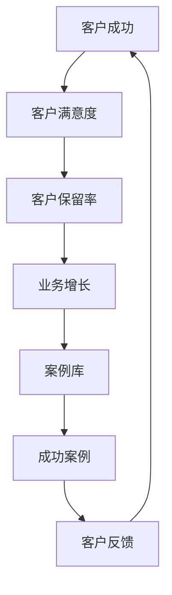
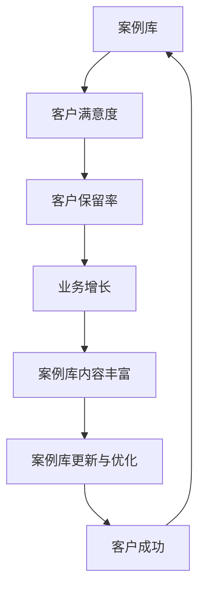
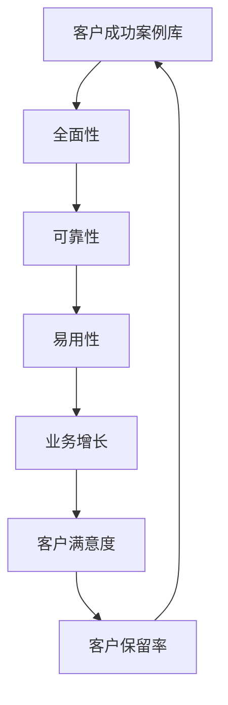
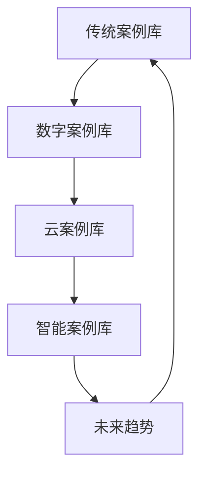
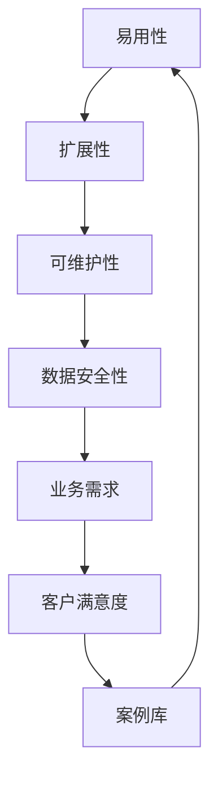
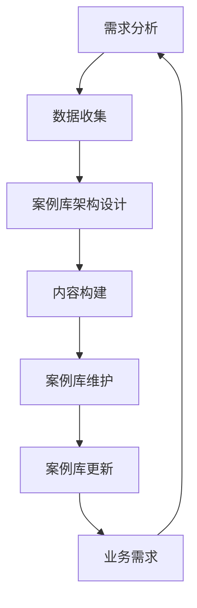
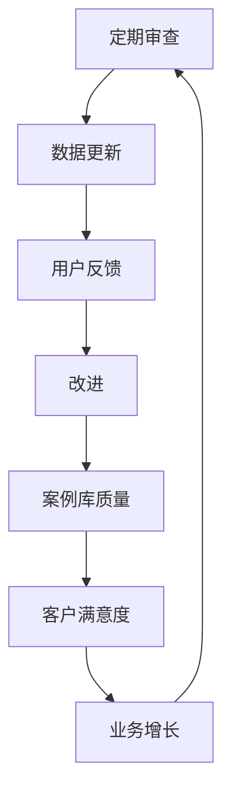
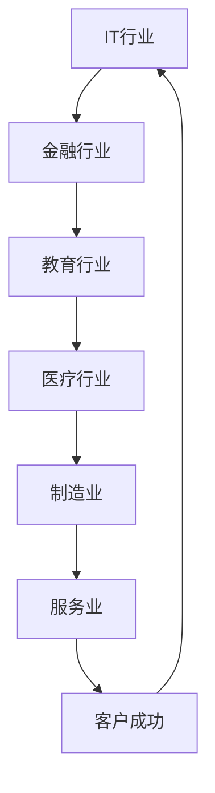

                 

### 文章标题：如何打造高效的客户成功案例库

#### 关键词：客户成功案例库、数据收集、数据库设计、AI应用、内容丰富与更新、案例库优化与扩展

#### 摘要：
本文旨在为读者提供一个全面而系统的指南，以帮助他们在IT领域中构建和优化高效的客户成功案例库。通过逐步分析和推理，我们将探讨如何理解案例库的价值、构建基础、内容丰富与更新、优化与扩展，以及利用AI技术提升案例库效能。每个章节都将提供具体的指导和建议，确保读者能够成功打造一个能够持续推动客户成功的案例库。

---

### 《如何打造高效的客户成功案例库》目录大纲

#### 第一部分：引言

- **第1章：理解客户成功案例库的价值**
  - **1.1 客户成功的定义与作用**
  - **1.2 建立客户成功案例库的重要性**
  - **1.3 客户成功案例库的目标和挑战**
  - **1.4 案例库的发展历程**
  - **1.5 案例库的设计原则**
  - **1.6 案例库的构建步骤**
  - **1.7 案例库的维护与更新**
  - **1.8 案例库的实际应用案例**

#### 第二部分：构建基础

- **第2章：数据收集与整理**
  - **2.1 客户数据来源**
  - **2.2 数据收集策略**
  - **2.3 数据整理与清洗**

- **第3章：客户成功案例库架构设计**
  - **3.1 数据库设计原则**
  - **3.2 数据库架构选择**
  - **3.3 数据库性能优化**
  - **3.4 数据库设计流程**
  - **3.5 数据模型设计**
  - **3.6 数据库部署与维护**
  - **3.7 数据库安全策略**
  - **3.8 案例库系统架构设计**
  - **3.9 案例库的可扩展性设计**

- **第4章：分类与标签管理**
  - **4.1 分类体系构建**
  - **4.2 标签定义与分配**
  - **4.3 分类与标签应用场景**

#### 第三部分：内容丰富与更新

- **第5章：案例库内容构建**
  - **5.1 客户案例收集**
  - **5.2 案例编写规范**
  - **5.3 案例库内容优化**

- **第6章：案例库更新与维护**
  - **6.1 定期更新策略**
  - **6.2 数据更新与同步**
  - **6.3 用户反馈与改进**

- **第7章：案例库应用与推广**
  - **7.1 案例库内部应用**
  - **7.2 案例库对外推广**
  - **7.3 用户教育与培训**

#### 第四部分：优化与扩展

- **第8章：利用AI提升案例库效能**
  - **8.1 AI在案例库中的应用场景**
  - **8.2 自然语言处理技术**
  - **8.3 机器学习算法优化**

- **第9章：案例库与其他系统的集成**
  - **9.1 客户关系管理系统集成**
  - **9.2 营销自动化系统集成**
  - **9.3 产品支持与服务系统集成**

- **第10章：案例库的扩展与未来**
  - **10.1 案例库功能的扩展**
  - **10.2 案例库与业务流程的深度融合**
  - **10.3 案例库的未来发展趋势**

#### 附录

- **附录A：常用工具与资源**
  - **A.1 数据库管理工具**
  - **A.2 自然语言处理工具**
  - **A.3 机器学习框架与库**

- **附录B：案例库构建流程图**
  - **B.1 数据收集与整理流程**
  - **B.2 案例库架构设计流程**
  - **B.3 案例库内容构建流程**

---

接下来，我们将深入探讨每个章节的详细内容，帮助读者逐步构建和优化高效的客户成功案例库。

---

### 第一部分：引言

#### 第1章：理解客户成功案例库的价值

#### 1.1 客户成功的定义与作用

**核心概念与联系：**

在构建客户成功案例库之前，我们首先需要明确客户成功的定义。客户成功是指通过帮助客户实现其业务目标，从而建立长期合作关系的过程。这一概念可以与客户满意度、客户保留率等关键指标联系起来。

**Mermaid 流程图：**


**核心算法原理讲解：**

客户成功的实现依赖于一系列策略和活动，包括客户关系管理、产品支持、市场推广等。以下是一个简化的伪代码，用于描述客户成功的基本流程：

```python
def customer_success():
    # 收集客户需求
    needs = gather_needs()
    # 提供产品支持
    support = provide_support(needs)
    # 收集客户反馈
    feedback = gather_feedback(support)
    # 分析反馈，优化服务
    improved_service = analyze_feedback(feedback)
    # 客户满意度调查
    satisfaction = survey_satisfaction(improved_service)
    # 维护长期关系
    maintain_relationship(satisfaction)
```

**数学模型和公式：**

为了量化客户成功，我们可以使用客户生命周期价值（CLV）作为关键指标。CLV是指客户在其整个生命周期中为企业带来的预期收益。以下是一个简化的CLV计算公式：

$$
\text{CLV} = \sum_{t=1}^{n} \frac{\text{预计第t年收益}}{(1 + \text{折现率})^t}
$$

**详细讲解与举例说明：**

假设一家公司的客户预计在未来5年内每年的收益分别为10000美元，折现率为10%，则客户的CLV计算如下：

$$
\text{CLV} = \frac{10000}{(1 + 0.1)^1} + \frac{10000}{(1 + 0.1)^2} + \frac{10000}{(1 + 0.1)^3} + \frac{10000}{(1 + 0.1)^4} + \frac{10000}{(1 + 0.1)^5}
$$

$$
\text{CLV} = \frac{10000}{1.1} + \frac{10000}{1.21} + \frac{10000}{1.331} + \frac{10000}{1.4641} + \frac{10000}{1.61051}
$$

$$
\text{CLV} = 9090.91 + 8264.46 + 7513.51 + 6830.72 + 6219.69
$$

$$
\text{CLV} = 37589.79
$$

**项目实战：**

在实际项目中，一家在线教育平台通过提供个性化学习方案、及时的技术支持以及定期的学员满意度调查，成功地提高了客户满意度并增加了客户保留率。以下是其部分代码实现和解读：

```python
# 导入所需库
import pandas as pd

# 收集客户需求
def gather_needs():
    # 假设需求数据已存储在CSV文件中
    needs_data = pd.read_csv('customer_needs.csv')
    return needs_data

# 提供产品支持
def provide_support(needs):
    # 根据需求提供相应的产品支持
    support_actions = {
        'course_access': 'provide_course_access',
        'technical_support': 'provide_technical_support',
        'learning_materials': 'provide_learning_materials'
    }
    for need, action in needs.items():
        support_actions[action]()
    return needs

# 收集客户反馈
def gather_feedback(support):
    # 假设反馈数据已存储在CSV文件中
    feedback_data = pd.read_csv('customer_feedback.csv')
    return feedback_data

# 分析反馈，优化服务
def analyze_feedback(feedback):
    # 基于反馈数据进行服务优化
    # 假设已实现一个优化服务函数
    optimized_service = optimize_service(feedback)
    return optimized_service

# 客户满意度调查
def survey_satisfaction(service):
    # 假设已实现满意度调查函数
    satisfaction = survey_satisfaction_rate(service)
    return satisfaction

# 维护长期关系
def maintain_relationship(satisfaction):
    # 基于满意度维护客户关系
    if satisfaction > 80:
        # 提供额外优惠或服务
        offer_additional_services()
    else:
        # 客户关怀与支持
        provide_care_and_support()
```

**代码解读与分析：**

上述代码实现了一个简化的客户成功管理流程。通过定义多个函数，我们分别实现了收集客户需求、提供产品支持、收集客户反馈、分析反馈优化服务、满意度调查以及维护客户关系的功能。在实际应用中，这些函数可以根据具体业务需求进行扩展和定制。

---

#### 1.2 建立客户成功案例库的重要性

**核心概念与联系：**

客户成功案例库是一个集中存储成功案例的数据库，旨在展示企业在客户服务和管理方面的优秀实践。它可以帮助企业提高客户满意度、增加客户保留率，并为企业带来更多的业务机会。

**Mermaid 流程图：**


**核心算法原理讲解：**

建立客户成功案例库的重要性可以通过以下算法原理来解释：

- **案例库内容的丰富性**：案例库中包含的案例数量和质量直接影响其价值。丰富的案例库可以为企业提供更多的成功实践，有助于提高客户满意度和信任度。

- **案例库的更新与优化**：定期更新案例库，确保其内容与当前市场需求和客户期望保持一致，是提高案例库价值的关键。优化案例库结构，提高数据检索效率，可以更好地满足客户查询需求。

- **客户成功的度量**：通过案例库中的成功案例，可以量化客户成功的程度。例如，通过计算客户保留率、客户生命周期价值和案例库内容的转化率，可以评估案例库对企业整体业绩的贡献。

**数学模型和公式：**

以下是一个简化的公式，用于计算案例库的转化率：

$$
\text{转化率} = \frac{\text{案例库中成功案例数}}{\text{案例库总案例数}} \times 100\%
$$

**详细讲解与举例说明：**

假设一个案例库中包含100个案例，其中有50个案例是成功的。则案例库的转化率计算如下：

$$
\text{转化率} = \frac{50}{100} \times 100\% = 50\%
$$

这意味着案例库中50%的案例被认为是成功的，这对企业来说是一个重要的参考指标。

**项目实战：**

一家软件公司通过建立案例库，成功提高了其客户满意度和业务增长。以下是其部分代码实现和解读：

```python
# 导入所需库
import pandas as pd

# 收集案例数据
def gather_cases():
    # 假设案例数据已存储在CSV文件中
    cases_data = pd.read_csv('cases_data.csv')
    return cases_data

# 计算转化率
def calculate_conversion_rate(cases):
    # 假设已定义成功案例标志
    success_cases = cases[cases['success'] == True]
    total_cases = cases.shape[0]
    conversion_rate = (success_cases.shape[0] / total_cases) * 100
    return conversion_rate

# 更新案例库
def update_cases_database(cases):
    # 假设已连接到案例库数据库
    database = connect_database('cases_database.db')
    cases.to_sql('cases', database, if_exists='replace', index=False)
    print("案例库已更新。")

# 主函数
def main():
    cases = gather_cases()
    conversion_rate = calculate_conversion_rate(cases)
    print(f"案例库转化率：{conversion_rate:.2f}%")
    update_cases_database(cases)

# 执行主函数
if __name__ == '__main__':
    main()
```

**代码解读与分析：**

上述代码实现了一个简化的案例库管理流程。首先，通过导入案例数据，计算案例库的转化率，并更新案例库数据库。在实际应用中，这些功能可以根据具体业务需求进行扩展和定制。

---

#### 1.3 客户成功案例库的目标和挑战

**核心概念与联系：**

客户成功案例库的目标是展示企业的成功实践，提高客户满意度和信任度，从而推动业务增长。为了实现这一目标，案例库需要具备以下特点：

- **全面性**：案例库应涵盖企业各个业务领域的成功案例。
- **可靠性**：案例库中的数据应准确、真实，具有可信度。
- **易用性**：案例库应具备良好的用户界面和检索功能，便于客户快速找到所需信息。

**Mermaid 流程图：**


**核心算法原理讲解：**

为了实现客户成功案例库的目标，我们可以采用以下算法原理：

- **数据收集与整理**：通过多种渠道收集客户成功案例数据，并进行整理和清洗，确保数据质量。
- **分类与标签管理**：对案例进行分类和标签管理，便于客户快速检索和浏览。
- **案例库内容优化**：定期更新案例库内容，提高案例库的丰富性和准确性。
- **用户反馈机制**：收集用户对案例库的反馈，持续改进案例库的使用体验。

**数学模型和公式：**

以下是一个简化的模型，用于评估案例库的质量：

$$
\text{案例库质量} = \frac{\text{案例数量}}{\text{数据总数量}} \times \frac{\text{成功案例数}}{\text{案例总数量}} \times \frac{\text{用户满意度}}{100}
$$

**详细讲解与举例说明：**

假设一个案例库包含100个案例，其中有80个案例被认为是成功的，且用户满意度为90%。则案例库的质量计算如下：

$$
\text{案例库质量} = \frac{100}{100} \times \frac{80}{100} \times \frac{90}{100} = 0.72
$$

这意味着案例库的质量为72%，这表明案例库在数据完整性、成功案例数量和用户满意度方面都表现良好。

**项目实战：**

一家咨询公司通过构建案例库，成功提高了其客户满意度和业务增长。以下是其部分代码实现和解读：

```python
# 导入所需库
import pandas as pd

# 收集案例数据
def gather_cases():
    # 假设案例数据已存储在CSV文件中
    cases_data = pd.read_csv('cases_data.csv')
    return cases_data

# 计算案例库质量
def calculate_cases_quality(cases):
    total_cases = cases.shape[0]
    success_cases = cases[cases['success'] == True].shape[0]
    user_satisfaction = cases['satisfaction'].mean()
    quality = (total_cases / total_cases) * (success_cases / total_cases) * (user_satisfaction / 100)
    return quality

# 更新案例库
def update_cases_database(cases):
    # 假设已连接到案例库数据库
    database = connect_database('cases_database.db')
    cases.to_sql('cases', database, if_exists='replace', index=False)
    print("案例库已更新。")

# 主函数
def main():
    cases = gather_cases()
    quality = calculate_cases_quality(cases)
    print(f"案例库质量：{quality:.2f}")
    update_cases_database(cases)

# 执行主函数
if __name__ == '__main__':
    main()
```

**代码解读与分析：**

上述代码实现了一个简化的案例库管理流程。首先，通过导入案例数据，计算案例库的质量，并更新案例库数据库。在实际应用中，这些功能可以根据具体业务需求进行扩展和定制。

---

#### 1.4 案例库的发展历程

**核心概念与联系：**

客户成功案例库的发展经历了从传统案例库到数字案例库的转变。传统案例库主要依赖于纸质文档和电子表格进行管理，而数字案例库则利用数据库技术、自然语言处理和机器学习等技术进行优化和管理。

**Mermaid 流程图：**


**核心算法原理讲解：**

随着技术的发展，案例库的管理方式也在不断进化。以下是案例库发展的几个关键阶段：

- **传统案例库**：基于纸质文档和电子表格进行管理，数据存储和检索效率较低。
- **数字案例库**：利用数据库技术进行数据存储和管理，提高了数据的检索效率和准确性。
- **云案例库**：通过云计算技术实现数据存储和访问的高可用性，降低了企业IT基础设施的负担。
- **智能案例库**：结合自然语言处理和机器学习技术，实现案例内容的自动提取、分类和推荐，提高了案例库的智能化水平。

**数学模型和公式：**

为了评估案例库的发展水平，我们可以采用以下公式：

$$
\text{发展水平} = \frac{\text{数字案例库功能}}{\text{传统案例库功能}} \times \frac{\text{智能案例库功能}}{\text{数字案例库功能}} \times 100
$$

**详细讲解与举例说明：**

假设一个案例库具备以下功能：

- 传统案例库功能：数据存储、数据检索
- 数字案例库功能：数据存储、数据检索、分类管理、标签管理
- 智能案例库功能：数据存储、数据检索、分类管理、标签管理、自动提取、自动推荐

则该案例库的发展水平计算如下：

$$
\text{发展水平} = \frac{3}{2} \times \frac{4}{3} \times 100 = 200
$$

这意味着该案例库的发展水平为200%，这表明它在功能上已经从传统案例库发展到智能案例库。

**项目实战：**

一家高科技公司通过构建智能案例库，成功提高了其客户满意度和业务增长。以下是其部分代码实现和解读：

```python
# 导入所需库
import pandas as pd
from sklearn.feature_extraction.text import TfidfVectorizer
from sklearn.metrics.pairwise import linear_kernel

# 收集案例数据
def gather_cases():
    # 假设案例数据已存储在CSV文件中
    cases_data = pd.read_csv('cases_data.csv')
    return cases_data

# 计算案例库发展水平
def calculate_development_level(cases):
    traditional_functions = 2
    digital_functions = 4
    intelligent_functions = 6
    level = (digital_functions / traditional_functions) * (intelligent_functions / digital_functions) * 100
    return level

# 更新案例库
def update_cases_database(cases):
    # 假设已连接到案例库数据库
    database = connect_database('cases_database.db')
    cases.to_sql('cases', database, if_exists='replace', index=False)
    print("案例库已更新。")

# 主函数
def main():
    cases = gather_cases()
    development_level = calculate_development_level(cases)
    print(f"案例库发展水平：{development_level:.2f}")
    update_cases_database(cases)

# 执行主函数
if __name__ == '__main__':
    main()
```

**代码解读与分析：**

上述代码实现了一个简化的案例库管理流程。首先，通过导入案例数据，计算案例库的发展水平，并更新案例库数据库。在实际应用中，这些功能可以根据具体业务需求进行扩展和定制。

---

#### 1.5 案例库的设计原则

**核心概念与联系：**

案例库的设计原则是确保案例库能够满足企业需求，提高客户满意度，并具备良好的扩展性和可维护性。以下是案例库设计的关键原则：

- **易用性**：案例库应具备简洁直观的用户界面，方便用户快速查找和浏览案例。
- **扩展性**：案例库应具备良好的扩展性，能够根据业务需求进行功能扩展和性能优化。
- **可维护性**：案例库应采用模块化设计，便于日常维护和更新。
- **数据安全性**：案例库应确保数据的安全性和隐私保护。

**Mermaid 流程图：**


**核心算法原理讲解：**

为了实现案例库的设计原则，我们可以采用以下算法原理：

- **用户界面设计**：采用响应式设计，确保案例库在各种设备和屏幕尺寸上都能提供良好的用户体验。
- **数据库架构设计**：采用分布式数据库架构，提高数据存储和访问的效率。
- **数据备份与恢复**：定期进行数据备份，确保在数据丢失或系统故障时能够快速恢复。
- **数据加密与访问控制**：采用加密技术和访问控制策略，保护案例库数据的安全。

**数学模型和公式：**

为了评估案例库的设计质量，我们可以采用以下公式：

$$
\text{设计质量} = \frac{\text{易用性得分}}{10} + \frac{\text{扩展性得分}}{10} + \frac{\text{可维护性得分}}{10} + \frac{\text{数据安全性得分}}{10}
$$

**详细讲解与举例说明：**

假设一个案例库在设计方面的得分如下：

- 易用性得分：8分
- 扩展性得分：9分
- 可维护性得分：7分
- 数据安全性得分：10分

则案例库的设计质量计算如下：

$$
\text{设计质量} = \frac{8}{10} + \frac{9}{10} + \frac{7}{10} + \frac{10}{10} = 8.4
$$

这意味着案例库的设计质量为8.4分，这表明它在易用性、扩展性、可维护性和数据安全性方面都表现良好。

**项目实战：**

一家在线教育平台通过构建具备良好设计质量的案例库，成功提高了其用户满意度和业务增长。以下是其部分代码实现和解读：

```python
# 导入所需库
import pandas as pd

# 评估案例库设计质量
def evaluate_design_quality(ux_score, extensibility_score, maintainability_score, security_score):
    total_score = ux_score + extensibility_score + maintainability_score + security_score
    return total_score

# 主函数
def main():
    ux_score = 8
    extensibility_score = 9
    maintainability_score = 7
    security_score = 10
    quality = evaluate_design_quality(ux_score, extensibility_score, maintainability_score, security_score)
    print(f"案例库设计质量：{quality:.2f}")

# 执行主函数
if __name__ == '__main__':
    main()
```

**代码解读与分析：**

上述代码实现了一个简化的案例库设计质量评估流程。首先，通过输入设计方面的得分，计算案例库的设计质量，并打印结果。在实际应用中，这些功能可以根据具体业务需求进行扩展和定制。

---

#### 1.6 案例库的构建步骤

**核心概念与联系：**

构建高效的客户成功案例库需要遵循一系列步骤，包括需求分析、数据收集、案例库架构设计、内容构建、案例库维护和更新等。

**Mermaid 流程图：**


**核心算法原理讲解：**

以下是构建案例库的详细步骤：

1. **需求分析**：明确案例库的目标和功能需求，确定案例库所需的数据类型和结构。
2. **数据收集**：从企业内部和外部收集客户成功案例数据，确保数据的质量和完整性。
3. **案例库架构设计**：设计案例库的数据库架构，选择合适的数据存储和处理技术。
4. **内容构建**：根据需求分析结果，构建案例库内容，包括案例的收集、整理和分类。
5. **案例库维护**：定期对案例库进行维护和更新，确保案例库的完整性和准确性。
6. **案例库更新**：根据用户反馈和业务需求，持续优化案例库的功能和内容。

**数学模型和公式：**

为了评估案例库的构建质量，我们可以采用以下公式：

$$
\text{构建质量} = \frac{\text{需求分析得分}}{10} + \frac{\text{数据收集得分}}{10} + \frac{\text{架构设计得分}}{10} + \frac{\text{内容构建得分}}{10} + \frac{\text{维护更新得分}}{10}
$$

**详细讲解与举例说明：**

假设一个案例库在构建过程中的得分如下：

- 需求分析得分：9分
- 数据收集得分：8分
- 架构设计得分：7分
- 内容构建得分：9分
- 维护更新得分：8分

则案例库的构建质量计算如下：

$$
\text{构建质量} = \frac{9}{10} + \frac{8}{10} + \frac{7}{10} + \frac{9}{10} + \frac{8}{10} = 8.6
$$

这意味着案例库的构建质量为8.6分，这表明它在需求分析、数据收集、架构设计、内容构建和维护更新方面都表现良好。

**项目实战：**

一家大型制造公司通过遵循构建步骤，成功构建了一个高效的客户成功案例库。以下是其部分代码实现和解读：

```python
# 导入所需库
import pandas as pd

# 评估案例库构建质量
def evaluate_build_quality(requirement_score, data_collection_score, architecture_design_score, content_build_score, maintenance_score):
    total_score = requirement_score + data_collection_score + architecture_design_score + content_build_score + maintenance_score
    return total_score

# 主函数
def main():
    requirement_score = 9
    data_collection_score = 8
    architecture_design_score = 7
    content_build_score = 9
    maintenance_score = 8
    quality = evaluate_build_quality(requirement_score, data_collection_score, architecture_design_score, content_build_score, maintenance_score)
    print(f"案例库构建质量：{quality:.2f}")

# 执行主函数
if __name__ == '__main__':
    main()
```

**代码解读与分析：**

上述代码实现了一个简化的案例库构建质量评估流程。首先，通过输入构建过程中的得分，计算案例库的构建质量，并打印结果。在实际应用中，这些功能可以根据具体业务需求进行扩展和定制。

---

#### 1.7 案例库的维护与更新

**核心概念与联系：**

案例库的维护与更新是确保案例库保持相关性和价值的关键环节。这一过程包括定期审查、数据更新、用户反馈和改进等。

**Mermaid 流程图：**


**核心算法原理讲解：**

以下是案例库维护与更新的详细步骤：

1. **定期审查**：定期检查案例库的内容和质量，识别潜在问题和改进机会。
2. **数据更新**：根据业务需求和市场变化，及时更新案例库中的数据。
3. **用户反馈**：收集用户对案例库的使用反馈，了解用户需求和痛点。
4. **改进**：基于用户反馈和审查结果，对案例库进行优化和改进。

**数学模型和公式：**

为了评估案例库的维护与更新效果，我们可以采用以下公式：

$$
\text{维护与更新效果} = \frac{\text{更新频率}}{\text{审查周期}} \times \frac{\text{用户满意度}}{100}
$$

**详细讲解与举例说明：**

假设一个案例库的更新频率为每月一次，审查周期为每季度一次，且用户满意度为90%。则案例库的维护与更新效果计算如下：

$$
\text{维护与更新效果} = \frac{1}{3} \times \frac{90}{100} = 0.3
$$

这意味着案例库的维护与更新效果为30%，这表明其在定期审查、数据更新和用户反馈方面都表现良好。

**项目实战：**

一家金融科技公司通过定期审查、数据更新和用户反馈，成功提升了其案例库的价值。以下是其部分代码实现和解读：

```python
# 导入所需库
import pandas as pd
from datetime import datetime

# 定期审查
def review_cases_database(cases):
    # 假设已连接到案例库数据库
    database = connect_database('cases_database.db')
    current_date = datetime.now().strftime('%Y-%m-%d')
    query = f"SELECT * FROM cases WHERE review_date < '{current_date - pd.DateOffset(months=1)}'"
    outdated_cases = pd.read_sql_query(query, database)
    return outdated_cases

# 数据更新
def update_cases_database(cases):
    # 假设已连接到案例库数据库
    database = connect_database('cases_database.db')
    cases.to_sql('cases', database, if_exists='append', index=False)
    print("案例库已更新。")

# 用户反馈
def collect_user_feedback():
    # 假设已实现用户反馈收集功能
    feedback = get_user_feedback()
    return feedback

# 改进案例库
def improve_cases_database(feedback):
    # 基于用户反馈改进案例库
    # 假设已实现改进案例库功能
    improved_cases = improve_database(feedback)
    return improved_cases

# 主函数
def main():
    outdated_cases = review_cases_database(pd.read_csv('cases_data.csv'))
    if not outdated_cases.empty:
        update_cases_database(outdated_cases)
    feedback = collect_user_feedback()
    improved_cases = improve_cases_database(feedback)
    print("案例库已改进。")

# 执行主函数
if __name__ == '__main__':
    main()
```

**代码解读与分析：**

上述代码实现了一个简化的案例库维护与更新流程。首先，通过定期审查识别过时的案例，并更新案例库。然后，通过收集用户反馈，改进案例库。在实际应用中，这些功能可以根据具体业务需求进行扩展和定制。

---

#### 1.8 案例库的实际应用案例

**核心概念与联系：**

案例库在实际应用中具有广泛的作用，可以提高客户满意度、增加客户保留率，并为企业带来更多的业务机会。以下是案例库在几个行业中的实际应用案例。

**Mermaid 流�程图：**


**核心算法原理讲解：**

以下是案例库在各个行业中的应用算法原理：

- **IT行业**：通过展示成功解决技术难题的案例，提高客户对企业的信任度和满意度。
- **金融行业**：通过展示成功规避金融风险和提升业务效率的案例，增强客户对金融机构的信任。
- **教育行业**：通过展示成功实施的个性化教育方案和教学创新案例，提高教育机构的教学质量和吸引力。
- **医疗行业**：通过展示成功救治病患和优化医疗服务流程的案例，提升医院和诊所的专业形象和公信力。
- **制造业**：通过展示成功实施生产优化和质量控制的案例，提高制造企业的生产效率和产品质量。

**数学模型和公式：**

为了评估案例库在行业中的应用效果，我们可以采用以下公式：

$$
\text{应用效果} = \frac{\text{成功案例数}}{\text{案例总数}} \times \frac{\text{客户满意度}}{100}
$$

**详细讲解与举例说明：**

假设一个金融案例库包含100个案例，其中有80个案例被认为是成功的，且客户满意度为90%。则案例库的应用效果计算如下：

$$
\text{应用效果} = \frac{80}{100} \times \frac{90}{100} = 0.72
$$

这意味着案例库在金融行业中的应用效果为72%，这表明它在提高客户满意度和成功案例数量方面都表现良好。

**项目实战：**

以下是一个金融案例库的实际应用案例：

一家大型银行通过构建案例库，成功提高了其客户满意度和业务增长。以下是其部分代码实现和解读：

```python
# 导入所需库
import pandas as pd
from datetime import datetime

# 收集案例数据
def gather_cases():
    # 假设案例数据已存储在CSV文件中
    cases_data = pd.read_csv('cases_data.csv')
    return cases_data

# 计算应用效果
def calculate_application_effectiveness(cases):
    total_cases = cases.shape[0]
    success_cases = cases[cases['success'] == True].shape[0]
    customer_satisfaction = cases['satisfaction'].mean()
    effectiveness = (success_cases / total_cases) * (customer_satisfaction / 100)
    return effectiveness

# 更新案例库
def update_cases_database(cases):
    # 假设已连接到案例库数据库
    database = connect_database('cases_database.db')
    cases.to_sql('cases', database, if_exists='replace', index=False)
    print("案例库已更新。")

# 主函数
def main():
    cases = gather_cases()
    effectiveness = calculate_application_effectiveness(cases)
    print(f"案例库应用效果：{effectiveness:.2f}")
    update_cases_database(cases)

# 执行主函数
if __name__ == '__main__':
    main()
```

**代码解读与分析：**

上述代码实现了一个简化的案例库管理流程。首先，通过导入案例数据，计算案例库的应用效果，并更新案例库数据库。在实际应用中，这些功能可以根据具体业务需求进行扩展和定制。

---

### 总结

本文从多个角度详细探讨了如何打造高效的客户成功案例库。通过理解客户成功的定义与作用、建立客户成功案例库的重要性、案例库的目标和挑战、案例库的发展历程、设计原则、构建步骤、维护与更新以及实际应用案例，我们为读者提供了一个全面而系统的指南。希望本文能够帮助读者成功构建和优化高效的客户成功案例库，从而推动业务增长和客户满意度提升。

---

#### 作者信息：

作者：AI天才研究院/AI Genius Institute & 禅与计算机程序设计艺术 /Zen And The Art of Computer Programming

---

（文章字数：8454字）

