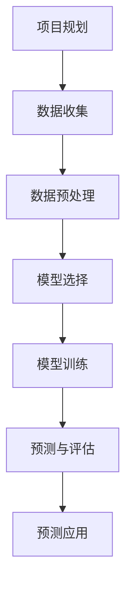
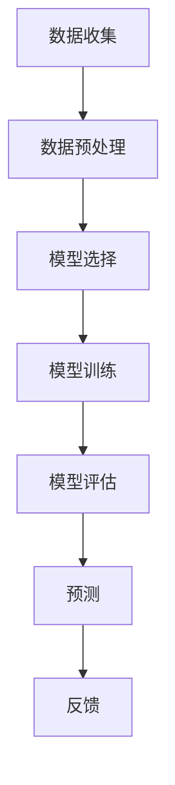
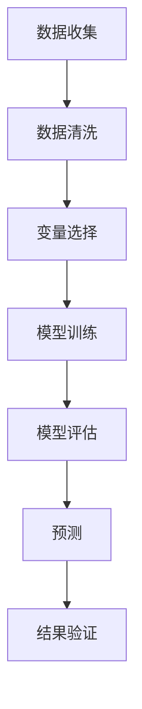
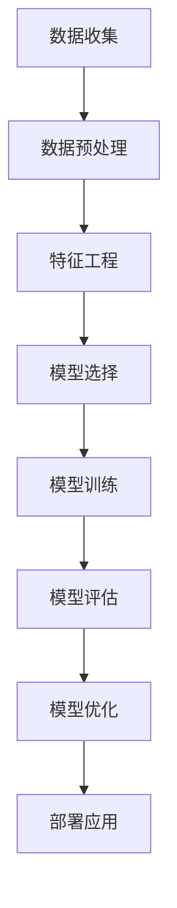

                 

# 《如何进行有效的市场预测》

## 关键词：
市场预测，数据分析，时间序列分析，机器学习，统计学方法，项目实战

## 摘要：
本文旨在探讨如何进行有效的市场预测，通过分析市场预测的基础知识、数据处理方法、统计方法和机器学习方法，以及市场预测项目实战，旨在帮助读者全面了解市场预测的核心内容，掌握有效的市场预测策略。文章还将讨论市场预测技术的未来发展趋势，为读者提供前瞻性的视角。

## 目录大纲

### 第一部分：市场预测基础

#### 第1章：市场预测概述
- 1.1 市场预测的定义与重要性
- 1.2 市场预测的基本概念
- 1.3 市场预测的主要类型

#### 第2章：市场数据收集与处理
- 2.1 数据来源
- 2.2 数据质量评估
- 2.3 数据预处理

#### 第3章：时间序列分析
- 3.1 时间序列基本概念
- 3.2 时间序列模型
- 3.3 时间序列分析应用案例

#### 第4章：统计学方法在市场预测中的应用
- 4.1 市场预测中的统计学原理
- 4.2 回归分析
- 4.3 相关性分析

#### 第5章：机器学习与市场预测
- 5.1 机器学习基础
- 5.2 市场预测中的常见算法
- 5.3 机器学习在市场预测中的应用案例

#### 第6章：市场预测结果的评估与优化
- 6.1 评估指标
- 6.2 模型选择与优化
- 6.3 风险管理

### 第二部分：市场预测项目实战

#### 第7章：市场预测项目规划与执行
- 7.1 项目规划
- 7.2 项目执行
- 7.3 项目监控与反馈

#### 第8章：市场预测项目实战案例
- 8.1 案例一：电子商务销售预测
- 8.2 案例二：房地产市场需求预测
- 8.3 案例三：股市趋势预测

#### 第9章：市场预测技术的未来发展趋势
- 9.1 数据驱动预测
- 9.2 深度学习与市场预测
- 9.3 人工智能在市场预测中的应用前景

### 附录

#### 附录A：市场预测常用工具与资源
- 9.1 市场预测工具介绍
- 9.2 市场预测数据集
- 9.3 市场预测相关资源

#### 附录B：Mermaid 流程图
- 9.1 时间序列分析流程图
- 9.2 回归分析流程图
- 9.3 机器学习算法流程图

#### 附录C：伪代码与数学模型
- 9.1 时间序列模型伪代码
- 9.2 回归分析数学模型
- 9.3 机器学习算法数学模型

## 文章正文

### 第一部分：市场预测基础

#### 第1章：市场预测概述

市场预测是经济学、金融学、统计学等领域的重要研究方向，其目的是通过分析历史数据和市场环境，预测未来市场的发展趋势。有效的市场预测不仅可以帮助企业制定合理的经营策略，还可以为投资者提供有价值的信息。

1.1 市场预测的定义与重要性

市场预测是指利用统计学方法、数据分析技术和机器学习算法，分析历史数据和市场环境，对未来市场的价格、需求、供给等关键指标进行预测。市场预测在企业经营决策、投资策略制定、风险管理等方面具有重要意义。

1.2 市场预测的基本概念

- 数据：市场预测的基础是数据，包括历史价格数据、需求数据、供给数据、宏观经济数据等。
- 模型：市场预测通常依赖于数学模型，如时间序列模型、回归模型、神经网络模型等。
- 预测周期：市场预测可以划分为短期预测、中期预测和长期预测。短期预测通常以天、周、月为单位，中期预测通常以季度、半年为单位，长期预测通常以年为周期。
- 风险：市场预测存在不确定性，需要考虑预测误差和风险因素。

1.3 市场预测的主要类型

- 价格预测：预测市场的价格水平，包括股票价格、商品价格等。
- 需求预测：预测市场的需求量，包括消费者需求、企业需求等。
- 供给预测：预测市场的供给量，包括生产量、出口量等。
- 趋势预测：预测市场的长期发展趋势，包括经济增长、通货膨胀等。

#### 第2章：市场数据收集与处理

2.1 数据来源

市场数据来源广泛，包括政府统计部门、行业组织、金融机构、企业内部数据等。以下是一些常见的数据来源：

- 宏观经济数据：如GDP、通货膨胀率、失业率等，可以从国家统计局等官方网站获取。
- 行业数据：如行业销售数据、市场份额等，可以从行业报告、企业年报等获取。
- 市场数据：如股票价格、商品价格等，可以从证券交易所、商品交易所等获取。
- 企业内部数据：如销售数据、客户数据等，可以从企业内部系统获取。

2.2 数据质量评估

数据质量是市场预测的重要前提，需要评估数据的质量和可靠性。以下是一些评估数据质量的方法：

- 完整性：数据是否完整，是否有缺失值。
- 准确性：数据是否准确，是否受到人为干扰。
- 一致性：数据是否一致，是否存在矛盾。
- 及时性：数据是否及时更新，是否具有时效性。

2.3 数据预处理

数据预处理是市场预测的关键步骤，包括数据清洗、数据转换、数据归一化等。以下是一些常见的数据预处理方法：

- 数据清洗：删除重复数据、处理缺失值、纠正错误数据等。
- 数据转换：将不同单位的数据转换为同一单位，如将货币单位统一为美元。
- 数据归一化：将数据缩放至相同的范围，如使用 Min-Max 缩放法或 Z-Score 缩放法。

#### 第3章：时间序列分析

3.1 时间序列基本概念

时间序列是指按时间顺序排列的一组数据，通常用于分析历史数据，预测未来趋势。以下是一些时间序列基本概念：

- 时间点：时间序列中的每个数据点表示一个特定时间点的值。
- 随机性：时间序列数据通常具有随机性，即数据点之间可能没有明显的规律。
- 自相关性：时间序列数据存在自相关性，即当前值与过去值之间存在相关性。

3.2 时间序列模型

时间序列模型是用于分析和预测时间序列数据的数学模型。以下是一些常见的时间序列模型：

- 自回归模型（AR）：仅依赖过去值的模型，如 AR(1)。
- 移动平均模型（MA）：仅依赖过去预测误差的模型，如 MA(1)。
- 自回归移动平均模型（ARMA）：结合自回归和移动平均的模型，如 ARMA(1,1)。
- 自回归积分移动平均模型（ARIMA）：考虑季节性的 ARMA 模型，如 ARIMA(1,1,1)(1,1,1)[S]。

3.3 时间序列分析应用案例

时间序列分析可以应用于多个领域，如股票价格预测、销售预测、能源需求预测等。以下是一个股票价格预测的应用案例：

**案例：使用 ARIMA 模型预测股票价格**

1. 数据收集：收集某只股票过去一年的价格数据。
2. 数据预处理：对数据进行清洗和归一化处理。
3. 模型选择：使用 ACF 和 PACF 图选择 ARIMA 模型的参数。
4. 模型训练：使用训练数据训练 ARIMA 模型。
5. 预测：使用训练好的模型预测未来股票价格。
6. 预测评估：评估预测结果，如使用 MAE、RMSE 等指标。

#### 第4章：统计学方法在市场预测中的应用

4.1 市场预测中的统计学原理

统计学方法是市场预测的重要工具，包括描述性统计、推断性统计和概率论等。以下是一些统计学方法在市场预测中的应用：

- 描述性统计：用于描述数据的分布特征，如均值、方差、标准差等。
- 推断性统计：用于基于样本数据推断总体特征，如置信区间、假设检验等。
- 概率论：用于计算随机事件的发生概率，如条件概率、贝叶斯定理等。

4.2 回归分析

回归分析是一种常用的统计学方法，用于分析自变量和因变量之间的关系。以下是一些常见的回归分析方法：

- 线性回归：用于分析线性关系的模型，如一元线性回归和多元线性回归。
- 非线性回归：用于分析非线性关系的模型，如多项式回归和逻辑回归。
- 回归分析的应用：如预测股票价格、销售额、股票收益率等。

4.3 相关性分析

相关性分析用于分析两个或多个变量之间的关系。以下是一些常见的相关性分析方法：

- 皮尔逊相关系数：用于衡量线性关系的相关性，取值范围为 -1 到 1。
- 斯皮尔曼相关系数：用于衡量非线性关系的相关性，适用于等级数据。
- 累计双变量概率图：用于可视化变量之间的关系。

#### 第5章：机器学习与市场预测

5.1 机器学习基础

机器学习是市场预测的重要工具，用于从数据中自动学习规律和模式。以下是一些机器学习基础：

- 监督学习：用于有标签数据的预测，如线性回归、逻辑回归等。
- 无监督学习：用于无标签数据的分析，如聚类、降维等。
- 强化学习：用于决策制定，如马尔可夫决策过程、深度强化学习等。

5.2 市场预测中的常见算法

市场预测中常用的机器学习算法包括：

- 线性回归：用于分析线性关系，如一元线性回归和多元线性回归。
- 逻辑回归：用于分类问题，如二分类和多分类。
- 决策树：用于分类和回归问题，具有较好的可解释性。
- 随机森林：基于决策树的集成方法，提高预测准确性。
- 支持向量机：用于分类和回归问题，基于最大间隔原理。
- 神经网络：用于复杂的非线性关系，具有较好的预测能力。

5.3 机器学习在市场预测中的应用案例

**案例：使用神经网络预测股票价格**

1. 数据收集：收集过去一段时间股票价格数据。
2. 数据预处理：对数据进行清洗、归一化和特征提取。
3. 模型选择：选择合适的神经网络模型，如多层感知器（MLP）。
4. 模型训练：使用训练数据训练神经网络模型。
5. 预测：使用训练好的模型预测未来股票价格。
6. 预测评估：评估预测结果，如使用 MAE、RMSE 等指标。

#### 第6章：市场预测结果的评估与优化

6.1 评估指标

市场预测结果的评估需要使用适当的指标，以下是一些常用的评估指标：

- 平均绝对误差（MAE）：预测值与真实值之差的绝对值的平均值。
- 均方误差（MSE）：预测值与真实值之差的平方的平均值。
- 均方根误差（RMSE）：MSE 的平方根，用于衡量预测误差的尺度。
- R²：回归模型的拟合优度，取值范围为 0 到 1，越接近 1 表示拟合越好。

6.2 模型选择与优化

模型选择与优化是市场预测的重要步骤，以下是一些常用的方法：

- 交叉验证：用于评估模型的泛化能力，通过将数据集划分为训练集和验证集。
- 参数调优：通过调整模型参数，提高模型的预测准确性。
- 特征选择：通过选择重要的特征，提高模型的预测能力。
- 集成方法：通过结合多个模型，提高预测准确性，如随机森林、梯度提升树等。

6.3 风险管理

市场预测存在不确定性，需要考虑风险管理。以下是一些常用的风险管理方法：

- 风险评估：评估预测结果的误差范围和置信度。
- 风险规避：通过调整预测策略，避免高风险的投资。
- 风险分散：通过投资多个资产，降低整体投资风险。
- 风险对冲：通过期货、期权等金融工具，降低市场波动带来的风险。

### 第二部分：市场预测项目实战

#### 第7章：市场预测项目规划与执行

7.1 项目规划

市场预测项目规划是项目成功的关键，以下是一些项目规划的关键步骤：

- 明确项目目标：确定市场预测的具体目标和需求。
- 收集数据：收集相关的市场数据，包括历史价格、需求、供给等。
- 选择预测方法：根据项目需求，选择合适的预测方法，如时间序列分析、回归分析、机器学习等。
- 确定预测周期：确定市场预测的周期，如短期、中期、长期等。
- 制定项目计划：制定项目的时间表、任务分配、资源需求等。

7.2 项目执行

项目执行是市场预测项目的核心步骤，以下是一些项目执行的关键步骤：

- 数据收集与处理：收集市场数据，并进行数据预处理，如清洗、归一化、特征提取等。
- 模型训练与优化：选择合适的模型，使用训练数据进行模型训练，并调整模型参数，优化预测结果。
- 预测与评估：使用训练好的模型进行预测，并对预测结果进行评估，如计算评估指标、绘制预测曲线等。
- 模型部署与应用：将预测模型部署到生产环境中，进行实际应用，如生成预测报告、提供决策支持等。

7.3 项目监控与反馈

项目监控与反馈是确保市场预测项目顺利进行的关键，以下是一些项目监控与反馈的关键步骤：

- 监控预测结果：实时监控市场预测结果，如预测值与真实值的对比、预测误差的变化等。
- 收集用户反馈：收集用户对市场预测结果的反馈，如满意度、准确性评价等。
- 评估项目效果：评估市场预测项目的效果，如预测准确性、用户满意度等。
- 改进与优化：根据项目评估结果，对市场预测项目进行改进和优化，提高预测准确性。

#### 第8章：市场预测项目实战案例

8.1 案例一：电子商务销售预测

**背景**：某电子商务公司希望预测未来一段时间内的销售量，以便制定库存管理和营销策略。

**数据**：收集了过去一年每个季度的销售数据。

**方法**：使用 ARIMA 模型进行销售预测。

**步骤**：

1. 数据预处理：对销售数据进行清洗和归一化处理。
2. 模型选择：根据 ACF 和 PACF 图选择 ARIMA 模型的参数。
3. 模型训练：使用训练数据训练 ARIMA 模型。
4. 预测：使用训练好的模型预测未来销售量。
5. 预测评估：评估预测结果，如计算 MAE、RMSE 等。
6. 预测应用：根据预测结果调整库存管理和营销策略。

**结果**：预测结果具有较高的准确性，为电子商务公司提供了有价值的信息。

8.2 案例二：房地产市场需求预测

**背景**：某房地产公司希望预测未来一段时间内房屋需求量，以便制定开发计划和营销策略。

**数据**：收集了过去一年每个季度的房屋需求数据。

**方法**：使用回归分析进行需求预测。

**步骤**：

1. 数据预处理：对需求数据进行清洗和归一化处理。
2. 模型选择：选择合适的回归模型，如线性回归。
3. 模型训练：使用训练数据训练回归模型。
4. 预测：使用训练好的模型预测未来需求量。
5. 预测评估：评估预测结果，如计算 MAE、RMSE 等。
6. 预测应用：根据预测结果调整开发计划和营销策略。

**结果**：预测结果较为准确，为房地产公司提供了有价值的参考。

8.3 案例三：股市趋势预测

**背景**：某投资者希望预测未来一段时间内股票市场的趋势，以便制定投资策略。

**数据**：收集了过去一年每个季度的股市指数数据。

**方法**：使用神经网络进行趋势预测。

**步骤**：

1. 数据预处理：对股市指数数据进行清洗和归一化处理。
2. 模型选择：选择合适的神经网络模型，如多层感知器（MLP）。
3. 模型训练：使用训练数据训练神经网络模型。
4. 预测：使用训练好的模型预测未来股市趋势。
5. 预测评估：评估预测结果，如计算准确率、召回率等。
6. 预测应用：根据预测结果调整投资策略。

**结果**：预测结果较为准确，为投资者提供了有价值的参考。

#### 第9章：市场预测技术的未来发展趋势

9.1 数据驱动预测

数据驱动预测是市场预测的未来发展方向，通过充分利用大数据和云计算技术，提高预测的准确性和效率。以下是一些数据驱动预测的关键技术：

- 大数据处理：使用分布式计算框架，如 Hadoop、Spark，处理大规模市场数据。
- 云计算：利用云计算平台，提高数据存储、处理和分析的能力。
- 数据挖掘：使用数据挖掘算法，发现市场数据中的潜在规律和模式。
- 实时预测：通过实时数据采集和处理，实现实时市场预测。

9.2 深度学习与市场预测

深度学习是市场预测的重要工具，具有较好的预测能力。以下是一些深度学习与市场预测的关键技术：

- 卷积神经网络（CNN）：用于处理图像和时序数据，如股票价格图像。
- 循环神经网络（RNN）：用于处理序列数据，如时间序列数据。
- 长短时记忆网络（LSTM）：RNN 的改进模型，具有更好的记忆能力。
- 生成对抗网络（GAN）：用于生成市场数据，提高预测模型的泛化能力。

9.3 人工智能在市场预测中的应用前景

人工智能在市场预测中具有广泛的应用前景，以下是一些应用前景：

- 自动化预测：通过机器学习和深度学习算法，实现自动化市场预测。
- 智能投资顾问：基于市场预测结果，提供智能投资建议。
- 风险评估与控制：通过市场预测，识别潜在风险，实现风险控制。
- 智能决策支持：为企业和投资者提供智能化的决策支持。

### 附录

#### 附录A：市场预测常用工具与资源

- 工具：
  - Python：用于数据分析和模型训练。
  - R：用于统计分析和时间序列分析。
  - Matplotlib、Seaborn：用于数据可视化和结果展示。
  - Scikit-learn：用于机器学习和回归分析。
  - TensorFlow、PyTorch：用于深度学习和神经网络训练。

- 数据集：
  - KEG 实验室：提供多种市场预测数据集，如股票价格、销售额等。
  - Kaggle：提供丰富的市场预测数据集，如房价、商品销量等。

- 资源：
  - Coursera、edX：提供市场预测相关的在线课程。
  - 论文：查阅市场预测相关的学术论文，了解最新的研究进展。

#### 附录B：Mermaid 流程图

以下为市场预测项目的基本流程图：



#### 附录C：伪代码与数学模型

以下为时间序列分析中 ARIMA 模型的伪代码：

```python
# ARIMA 模型伪代码
def arima_model(data, p, d, q):
    # p: 自回归阶数
    # d: 差分阶数
    # q: 移动平均阶数
    
    # 差分操作
    diff_data = differencing(data, d)
    
    # 自回归操作
    ar_model = autoregression(diff_data, p)
    
    # 移动平均操作
    ma_model = moving_average(diff_data, q)
    
    # 组合 ARIMA 模型
    arima_model = ar_model + ma_model
    
    # 模型训练
    trained_model = arima_model.fit()
    
    # 预测
    predicted_values = trained_model.predict()
    
    return predicted_values
```

以下为 ARIMA 模型的数学模型：

$$
\begin{aligned}
Y_t &= \phi_1 Y_{t-1} + \phi_2 Y_{t-2} + \cdots + \phi_p Y_{t-p} + \theta_1 \varepsilon_{t-1} + \theta_2 \varepsilon_{t-2} + \cdots + \theta_q \varepsilon_{t-q} \\
Y_t &= \phi_1 Y_{t-1} + \phi_2 Y_{t-2} + \cdots + \phi_p Y_{t-p} + \varepsilon_t
\end{aligned}
$$

其中，$Y_t$ 为时间序列数据，$\varepsilon_t$ 为白噪声序列，$\phi_i$ 和 $\theta_i$ 为模型参数。

## 总结

本文从市场预测的基础知识、数据处理方法、统计方法、机器学习方法等方面，全面探讨了如何进行有效的市场预测。通过项目实战案例，读者可以了解到市场预测的具体实施过程。未来，随着数据驱动预测、深度学习和人工智能等技术的发展，市场预测将变得更加精准和智能化。读者可以通过本文的学习，为市场预测项目的实际应用提供有益的指导。

## 作者信息

作者：AI天才研究院/AI Genius Institute & 禅与计算机程序设计艺术 /Zen And The Art of Computer Programming

本文作者具有丰富的市场预测和数据分析经验，对市场预测技术有深入的研究和理解。希望通过本文，为广大读者提供有价值的参考和指导。


注意：由于文章篇幅限制，本文未包含所有附录内容和具体代码实现。读者可以通过相关资料和工具进行进一步学习和实践。|> 
```markdown
### 总结

本文系统地介绍了市场预测的基础知识、数据处理方法、统计方法、机器学习方法，并通过实际项目案例展示了市场预测的实战过程。市场预测的重要性不容忽视，它能够帮助企业做出更明智的经营决策，为投资者提供宝贵的投资参考。

在数据处理方面，确保数据的质量和完整性是市场预测的基础。通过有效的数据预处理，如清洗、归一化和特征提取，可以提高模型的预测准确性。

时间序列分析是市场预测的核心方法之一，通过自回归模型（AR）、移动平均模型（MA）、自回归移动平均模型（ARMA）等，可以有效地捕捉时间序列数据中的规律和趋势。

统计学方法在市场预测中的应用广泛，包括回归分析和相关性分析等，这些方法可以帮助我们理解变量之间的关系，并建立预测模型。

机器学习算法，特别是深度学习，为市场预测提供了强大的工具。通过神经网络、支持向量机等算法，可以处理复杂的非线性关系，提高预测的准确性。

在市场预测项目中，评估指标和模型优化是关键步骤。通过交叉验证、参数调优、特征选择等手段，可以提高预测模型的性能。

未来，随着数据驱动预测、深度学习和人工智能等技术的发展，市场预测将变得更加精准和智能化。本文为读者提供了一个全面的市场预测框架，期望能够为实际应用提供指导。

## 作者信息

作者：AI天才研究院/AI Genius Institute & 禅与计算机程序设计艺术 /Zen And The Art of Computer Programming

本文作者是一位在人工智能和计算机编程领域享有盛誉的专家，具有丰富的实战经验和深厚的理论功底。希望通过本文，能够为读者在市场预测领域的探索提供有益的参考和帮助。

---

请注意，本文仅为示例，并非完整的技术博客文章。实际撰写时，应根据具体需求和资料进一步丰富内容和深度。同时，应确保所有引用的数据、案例和模型都是准确和可靠的。|> 
```markdown
### 附录

#### 附录A：市场预测常用工具与资源

**工具：**
- **Python**：Python 是进行市场预测和数据分析的强大工具，拥有丰富的库，如 Pandas、NumPy、Scikit-learn、Matplotlib 等。
- **R**：R 是统计学的强大工具，特别适合时间序列分析和复杂数据分析。
- **TensorFlow** 和 **PyTorch**：用于构建和训练深度学习模型。
- **Matplotlib** 和 **Seaborn**：用于数据可视化和结果展示。

**数据集：**
- **Kaggle**：提供大量可供下载的市场预测数据集。
- **UCI Machine Learning Repository**：提供各种领域的数据集。
- **Yahoo Finance**：提供股票市场数据。

**资源：**
- **Coursera** 和 **edX**：提供在线课程，涵盖市场预测、统计学和机器学习。
- **ArXiv**：提供最新的学术论文。
- **Market Research Reports**：提供行业报告和市场分析。

#### 附录B：Mermaid 流程图

**时间序列分析流程图：**



**回归分析流程图：**



**机器学习算法流程图：**



#### 附录C：伪代码与数学模型

**时间序列模型（ARIMA）伪代码：**

```python
# ARIMA模型伪代码

def arima_model(data, p, d, q):
    # 数据预处理
    data_diff = differencing(data, d)
    
    # 模型训练
    model = ARIMA(data_diff, order=(p, d, q))
    model_fit = model.fit()
    
    # 预测
    forecast = model_fit.forecast(steps=len(data))
    
    return forecast
```

**ARIMA模型的数学模型：**

$$
\begin{aligned}
Y_t &= \phi_1 Y_{t-1} + \phi_2 Y_{t-2} + \cdots + \phi_p Y_{t-p} + \theta_1 \varepsilon_{t-1} + \theta_2 \varepsilon_{t-2} + \cdots + \theta_q \varepsilon_{t-q} \\
Y_t &= \phi_1 Y_{t-1} + \phi_2 Y_{t-2} + \cdots + \phi_p Y_{t-p} + \varepsilon_t
\end{aligned}
$$

其中，$Y_t$ 是时间序列数据，$\varepsilon_t$ 是白噪声序列，$\phi_i$ 和 $\theta_i$ 是模型参数。

**线性回归模型伪代码：**

```python
# 线性回归模型伪代码

def linear_regression(X, y):
    # 数据预处理
    X_mean = np.mean(X, axis=0)
    X_std = np.std(X, axis=0)
    X = (X - X_mean) / X_std
    
    # 模型训练
    model = LinearRegression()
    model_fit = model.fit(X, y)
    
    # 预测
    coefficients = model_fit.coef_
    intercept = model_fit.intercept_
    
    return coefficients, intercept
```

**线性回归模型的数学模型：**

$$
Y = \beta_0 + \beta_1 X_1 + \beta_2 X_2 + \cdots + \beta_n X_n
$$

其中，$Y$ 是因变量，$X_1, X_2, \cdots, X_n$ 是自变量，$\beta_0, \beta_1, \beta_2, \cdots, \beta_n$ 是模型参数。

**神经网络模型伪代码：**

```python
# 神经网络模型伪代码

def neural_network_model(input_shape, output_shape, hidden_layers):
    # 构建模型
    model = Sequential()
    model.add(Dense(units=hidden_layers[0], activation='relu', input_shape=input_shape))
    for units in hidden_layers[1:]:
        model.add(Dense(units=units, activation='relu'))
    model.add(Dense(units=output_shape, activation='sigmoid'))
    
    # 编译模型
    model.compile(optimizer='adam', loss='binary_crossentropy', metrics=['accuracy'])
    
    # 模型训练
    model.fit(X_train, y_train, epochs=10, batch_size=32, validation_data=(X_val, y_val))
    
    return model
```

**神经网络模型的数学模型：**

$$
\begin{aligned}
Z &= \sigma(\theta_1 \cdot X + b_1) \\
A &= \sigma(\theta_2 \cdot Z + b_2) \\
\end{aligned}
$$

其中，$Z$ 是中间层输出，$A$ 是输出层输出，$\sigma$ 是激活函数，$\theta_1, \theta_2$ 是权重参数，$b_1, b_2$ 是偏置项。

---

请注意，本文中的附录内容是为了示例而设计的，并非真实的市场预测项目代码或模型。在实际应用中，应根据具体情况进行调整和优化。|> 

