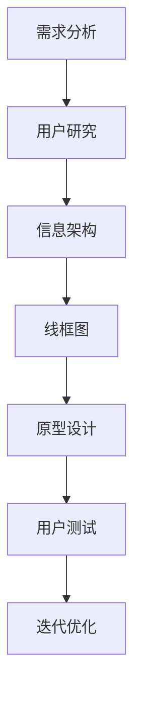
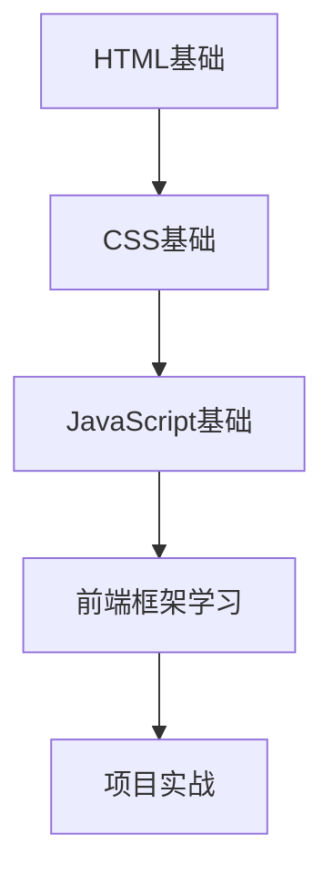
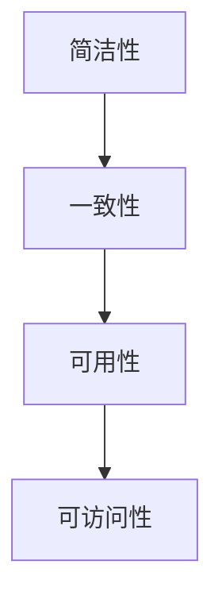

                 

# 《字节跳动2024校招：技术用户界面设计师面试真题解答》

> **关键词**：字节跳动校招，技术用户界面设计师，面试真题，设计原则，用户体验，前端技术，案例分析，备考策略

> **摘要**：本文旨在为即将参加字节跳动2024校招的技术用户界面设计师提供一份全面的面试真题解答指南。文章将详细解析面试准备、基础知识、用户体验与交互设计、前端技术与应用、工具与方法论以及面试实战演练等方面的内容，帮助读者全面提升面试能力，成功斩获心仪职位。

## 目录大纲

- **第一部分：面试准备与心态调整**
  - **第1章：面试基础知识**
    - **1.1 面试的基本流程与注意事项**
    - **1.2 技术用户界面设计师的职业要求**
  - **第2章：心态调整与面试技巧**
    - **2.1 面试心态调整**
    - **2.2 面试技巧与策略**

- **第二部分：技术用户界面设计师面试真题详解**
  - **第3章：基础知识与理论**
    - **3.1 界面设计原则与理论**
    - **3.2 布局与配色**
  - **第4章：用户体验与交互设计**
    - **4.1 用户体验设计（UX Design）**
    - **4.2 交互设计（UI Design）**
  - **第5章：前端技术与应用**
    - **5.1 HTML与CSS基础**
    - **5.2 JavaScript基础**
  - **第6章：工具与方法论**
    - **6.1 设计工具的使用**
    - **6.2 项目管理与团队协作**
  - **第7章：案例分析**
    - **7.1 成功案例解析**
    - **7.2 失败案例分析**

- **第三部分：面试实战演练与备考策略**
  - **第8章：面试实战演练**
    - **8.1 模拟面试与自我评估**
    - **8.2 面试问题的准备与应对**
  - **第9章：备考策略与心理调适**
    - **9.1 考前复习策略**
    - **9.2 心理调适与放松技巧**

- **附录**
  - **附录 A：面试资料与资源推荐**
  - **附录 B：面试真题汇总**

## 第一部分：面试准备与心态调整

### 第1章：面试基础知识

#### 1.1 面试的基本流程与注意事项

面试是求职过程中的关键环节，了解面试的基本流程和注意事项对于成功面试至关重要。以下是面试的基本流程和注意事项：

**面试流程概述：**

1. **面试邀请**：面试通常由公司的人力资源部门或相关部门发出，通过电话、电子邮件或在线平台邀请面试。
2. **面试准备**：在接到面试邀请后，需要准备好个人资料、简历、作品集等面试所需材料。
3. **面试当天**：提前到达面试地点，保持良好的仪表和仪态，与面试官进行礼貌的寒暄。
4. **面试过程中**：积极回答面试官的问题，展示自己的专业知识和技能，注意沟通技巧和非语言表达。
5. **面试结束**：面试结束时，对面试官表示感谢，询问面试结果和后续流程。

**准备面试所需资料：**

1. **个人简历**：简历是面试官了解你的背景和能力的首要资料，应简洁明了、内容真实。
2. **作品集**：如果应聘技术用户界面设计师职位，应准备好个人作品集，展示你的设计能力和成果。
3. **面试问题清单**：提前准备一些常见面试问题，并思考如何回答，有助于提高面试表现。
4. **公司背景资料**：了解公司的文化、业务和发展方向，以便在面试中更好地展示你的匹配度。

**面试官与面试者的角色定位：**

- **面试官**：面试官是负责评估候选人是否符合职位要求的人员，他们将通过提问、观察和讨论来评估候选人的专业知识、技能和综合素质。
- **面试者**：面试者是求职者，需要在面试中展示自己的专业能力、沟通能力和团队合作精神，以便获得面试官的认可。

#### 1.2 技术用户界面设计师的职业要求

技术用户界面设计师（UI/UX Designer）是负责设计产品的用户界面和用户体验的专业人士。以下是技术用户界面设计师的职业要求：

**UI/UX 设计师的能力要求：**

1. **设计技能**：掌握设计软件（如Sketch、Adobe XD、Figma等），具备良好的视觉设计能力，能够设计出符合用户需求的界面。
2. **用户体验设计（UX Design）能力**：了解用户体验设计的基本原则和方法，能够进行用户研究、需求分析和交互设计，确保产品的易用性和用户体验。
3. **前端技术基础**：了解HTML、CSS和JavaScript等前端技术，能够实现设计稿并优化网页性能。
4. **沟通与协作能力**：具备良好的沟通能力和团队合作精神，能够与产品经理、工程师和项目经理等团队成员有效协作。

**技术用户界面设计师的特点：**

1. **跨领域知识**：技术用户界面设计师需要具备跨领域的知识，如设计、编程、用户体验等，以便更好地理解产品和用户需求。
2. **持续学习**：随着技术的发展，技术用户界面设计师需要不断学习新的设计工具和前端技术，以保持自己的竞争力。
3. **创意与创新**：技术用户界面设计师需要具备创意和创新思维，能够设计出独特且符合用户需求的产品界面。

**行业趋势与发展方向：**

1. **移动优先**：随着移动设备的普及，移动端用户界面设计越来越受到重视，技术用户界面设计师需要关注移动端的设计趋势。
2. **人工智能与大数据**：人工智能和大数据技术的发展为技术用户界面设计带来了新的机遇，设计师需要了解如何利用这些技术提升用户体验。
3. **个性化与智能化**：个性化与智能化是未来用户界面设计的发展方向，技术用户界面设计师需要探索如何实现更加智能和个性化的用户体验。

### 第2章：心态调整与面试技巧

#### 2.1 面试心态调整

面试是一项挑战，但良好的心态是成功的关键。以下是一些面试心态调整的建议：

**面试前的心理准备：**

1. **积极心态**：保持积极的心态，相信自己的能力和准备。
2. **充分准备**：通过充分准备，降低面试时的紧张和不安。
3. **模拟面试**：进行模拟面试，提前适应面试环境和氛围。

**应对面试紧张情绪的方法：**

1. **深呼吸**：面试前进行深呼吸练习，有助于缓解紧张情绪。
2. **放松技巧**：学习一些放松技巧，如冥想、瑜伽等，有助于保持心理平衡。
3. **正面思考**：用积极的思考方式看待面试，将挑战视为成长的机会。

**如何保持自信：**

1. **自我肯定**：通过自我肯定来增强自信心，如回顾过去的成功经历。
2. **充分准备**：通过充分准备，增强对自己的能力和知识的信心。
3. **积极沟通**：在与面试官沟通时，保持眼神交流、微笑和积极的态度，展现自信。

#### 2.2 面试技巧与策略

面试技巧和策略对于成功面试至关重要。以下是一些面试技巧和策略：

**如何有效回答面试问题：**

1. **理解问题**：在回答问题之前，确保自己完全理解了问题。
2. **简洁明了**：回答问题时要简洁明了，避免长篇大论。
3. **有条理**：回答问题时要条理清晰，逻辑严密。
4. **展示自己**：在回答问题时，尽量展示自己的专业知识和经验。

**如何进行自我介绍：**

1. **简明扼要**：自我介绍要简明扼要，突出自己的优势和特点。
2. **自信表达**：用自信和流畅的语言进行自我介绍。
3. **突出亮点**：在自我介绍中突出自己的专业知识和技能，以及与职位相关的工作经验。

**面试中的非语言沟通技巧：**

1. **身体语言**：保持良好的身体语言，如眼神交流、微笑、点头等。
2. **声音语调**：保持适当的语速和音量，音调要平稳、自然。
3. **礼貌礼仪**：在面试过程中，保持礼貌礼仪，对面试官表示感谢和尊重。

## 第二部分：技术用户界面设计师面试真题详解

### 第3章：基础知识与理论

#### 3.1 界面设计原则与理论

界面设计原则是确保产品界面易于使用和具有吸引力的基础。以下是一些核心原则：

**核心原则：**

1. **简洁性**：界面应简洁明了，避免过多的装饰和冗余信息。
2. **一致性**：界面元素应保持一致性，包括字体、颜色、布局等。
3. **可用性**：界面应易于使用，确保用户能够轻松完成任务。
4. **可访问性**：界面应考虑不同用户的需求，包括视力障碍、听力障碍等。
5. **反馈**：界面应提供及时、清晰的反馈，帮助用户理解操作结果。

**设计模式与用户体验：**

设计模式是界面设计中的常见解决方案，可以提升用户体验。以下是一些常见设计模式：

1. **导航模式**：如汉堡菜单、标签页、面包屑等，用于帮助用户在不同页面间导航。
2. **表单模式**：如输入框、下拉菜单、单选框等，用于收集用户输入。
3. **图标模式**：如图标导航、图标按钮等，用于简化用户操作。

**界面元素的设计与运用：**

界面元素是界面设计的核心组成部分，包括文本、按钮、图片、图标等。以下是一些设计元素：

1. **文本**：字体、字号、颜色、对齐方式等。
2. **按钮**：按钮形状、颜色、文字、图标等。
3. **图片**：图片质量、尺寸、分辨率等。
4. **图标**：图标风格、大小、颜色等。

#### 3.2 布局与配色

布局与配色是界面设计中的关键要素，直接影响用户体验。以下是一些布局与配色原则：

**布局的类型与策略：**

1. **网格布局**：使用网格布局可以确保界面元素排列整齐、有序。
2. **模块化布局**：将界面划分为模块，每个模块具有独立的功能和样式。
3. **响应式布局**：根据屏幕尺寸和分辨率自动调整布局，确保在不同设备上都有良好的显示效果。

**配色的基本原则：**

1. **对比度**：确保文字和背景之间的对比度足够高，便于阅读。
2. **一致性**：界面元素应使用一致的颜色方案，提升整体美观度。
3. **情感表达**：颜色可以传达情感和品牌形象，如蓝色代表科技、绿色代表生态等。

**布局与配色的案例解析：**

以下是一个布局与配色的案例解析：

**案例**：一个在线购物网站

**布局**：
- 使用网格布局，将页面划分为商品列表、导航栏、侧边栏和底部导航等模块。
- 商品列表模块采用模块化布局，每个商品卡片具有相同的大小和样式。
- 导航栏和侧边栏使用固定位置，确保用户可以随时访问。
- 响应式布局，确保在不同设备上都有良好的显示效果。

**配色**：
- 使用蓝色作为主色调，代表科技和专业性。
- 使用白色作为背景色，提高文字的对比度。
- 为不同的模块使用不同的颜色，如商品列表使用橙色突出优惠信息。

### 第4章：用户体验与交互设计

用户体验设计（UX Design）和交互设计（UI Design）是界面设计的两个重要方面。以下分别介绍两者：

#### 4.1 用户体验设计（UX Design）

用户体验设计关注产品的整体用户体验，确保产品满足用户需求、易于使用且具有吸引力。以下是一些用户体验设计的基本概念：

**用户体验设计的基本概念：**

1. **用户需求**：了解用户的需求是用户体验设计的核心。
2. **用户研究**：通过用户研究，收集用户行为和需求，指导设计决策。
3. **用户旅程**：用户在产品中的行为路径，包括用户注册、浏览、购买等。
4. **可用性测试**：通过可用性测试，评估产品的易用性和用户体验。

**用户研究的方法与技巧：**

1. **问卷调查**：通过问卷调查收集用户需求和反馈。
2. **用户访谈**：与用户进行一对一访谈，深入了解用户需求和痛点。
3. **用户观察**：观察用户在使用产品时的行为和反应，发现潜在问题。

**用户体验设计流程：**

1. **需求分析**：通过用户研究和需求分析，明确产品的目标和用户需求。
2. **原型设计**：制作原型，展示产品的基本结构和功能。
3. **交互设计**：设计产品的交互细节，如按钮、菜单、表单等。
4. **可用性测试**：进行可用性测试，收集用户反馈，优化产品设计。

#### 4.2 交互设计（UI Design）

交互设计关注产品的用户界面和交互细节，确保用户能够顺畅地完成任务。以下是一些交互设计的基本要素：

**交互设计的基本要素：**

1. **用户操作**：用户在界面上的操作，如点击、滑动、拖动等。
2. **反馈**：系统对用户操作的响应，如提示信息、动画效果等。
3. **导航**：用户在界面中的导航路径，如菜单、标签、搜索等。
4. **布局**：界面的布局结构和元素排列。

**交互设计的方法与技巧：**

1. **线框图**：通过线框图展示界面的基本结构和布局。
2. **原型设计**：使用原型工具（如Sketch、Adobe XD等）制作交互原型。
3. **用户测试**：通过用户测试，评估交互设计的易用性和用户体验。

**交互设计的案例解析：**

以下是一个交互设计案例解析：

**案例**：一个社交媒体应用

**交互设计**：
- 使用汉堡菜单作为主要导航方式，方便用户快速访问应用的不同功能。
- 使用滑动操作来切换不同的页面，如滑动左滑查看好友动态，右滑查看消息。
- 使用动画效果来提示用户操作结果，如点击按钮后出现的加载动画。
- 在输入框中加入自动提示功能，帮助用户快速找到搜索关键词。

### 第5章：前端技术与应用

前端技术是界面设计的基础，掌握HTML、CSS和JavaScript等前端技术对于技术用户界面设计师至关重要。以下分别介绍这些技术：

#### 5.1 HTML与CSS基础

HTML（超文本标记语言）是网页内容的基础结构，CSS（层叠样式表）用于网页的样式和布局。以下是一些基础概念：

**HTML的基本语法与结构：**

- **元素**：HTML由一系列元素组成，如`<div>`、`<p>`、`<a>`等。
- **属性**：元素可以包含属性，如``。
- **标签**：HTML使用标签来定义元素，如`<html>`、`<head>`、`<body>`等。

**CSS的基本语法与属性：**

- **选择器**：CSS选择器用于指定要应用的样式，如`#id`、`.class`、`p`等。
- **属性**：CSS属性用于设置元素的样式，如`color`、`font-size`、`background-color`等。

**常用前端框架（如Bootstrap、Vue等）的使用：**

前端框架可以帮助开发者快速构建响应式网页，提高开发效率。以下是一些常用前端框架的使用：

- **Bootstrap**：一个流行的前端框架，提供了一系列的预定义样式和组件，如按钮、表单、导航栏等。
- **Vue**：一个渐进式的前端框架，支持组件化开发，具有高效的渲染性能。

#### 5.2 JavaScript基础

JavaScript是前端开发的核心技术，用于实现网页的动态效果和交互功能。以下是一些基础概念：

**JavaScript的基本语法：**

- **变量**：使用`var`、`let`或`const`声明变量。
- **数据类型**：包括数字、字符串、布尔值、数组、对象等。
- **函数**：使用`function`关键字定义函数，可以使用参数和返回值。

**常用编程概念（如函数、闭包、原型链等）：**

- **函数**：函数是一段可重复使用的代码块，可以使用参数和返回值。
- **闭包**：闭包是一种特殊的函数，可以访问并修改外部函数的变量。
- **原型链**：原型链是JavaScript对象继承的机制，用于实现属性和方法共享。

**前端框架（如React、Angular等）的使用：**

前端框架可以帮助开发者构建复杂的交互式网页。以下是一些常用前端框架的使用：

- **React**：一个用于构建用户界面的JavaScript库，支持组件化开发，具有虚拟DOM和高效渲染性能。
- **Angular**：一个由谷歌支持的前端框架，提供了一套完整的开发工具和库，支持数据绑定和依赖注入。

### 第6章：工具与方法论

#### 6.1 设计工具的使用

设计工具是技术用户界面设计师必备的工具，以下是一些常用的设计工具：

- **Sketch**：一个流行的矢量设计工具，支持多设备界面设计。
- **Adobe XD**：一个交互式设计工具，支持原型设计和协作。
- **Figma**：一个基于浏览器的协作设计工具，支持实时协作和原型设计。
- **Axure RP**：一个原型设计工具，支持丰富的交互元素和注释功能。

**设计工具的使用技巧：**

- **Sketch**：使用Sketch的组件和样式库，提高设计效率。
- **Adobe XD**：利用Adobe XD的动画和过渡效果，提升交互体验。
- **Figma**：利用Figma的实时协作功能，与团队成员高效沟通。
- **Axure RP**：利用Axure RP的交互元件，快速制作原型。

#### 6.2 项目管理与团队协作

项目管理和团队协作对于项目的成功至关重要。以下是一些项目管理和团队协作的方法与工具：

**项目管理的方法与工具：**

- **Trello**：一个基于看板的项目管理工具，用于任务分配和进度跟踪。
- **Jira**：一个功能强大的项目管理工具，提供任务管理、敏捷开发、报告分析等功能。

**团队协作的最佳实践：**

- **定期会议**：定期召开团队会议，讨论项目进度和问题。
- **任务分配**：明确任务分配和责任人，确保项目进度。
- **代码审查**：进行代码审查，提高代码质量和协作效率。
- **文档管理**：使用文档管理工具（如Confluence），记录项目文档和知识库。

### 第7章：案例分析

#### 7.1 成功案例解析

成功案例可以为我们提供宝贵的经验和启示。以下是一些成功的技术用户界面设计案例解析：

**案例1**：字节跳动

字节跳动是一家知名的互联网公司，其产品（如抖音、今日头条等）在用户界面设计方面取得了巨大成功。以下是一些关键成功因素：

- **简洁明了**：字节跳动的界面设计简洁明了，注重用户的核心需求。
- **个性化推荐**：通过个性化推荐算法，提升用户体验和用户粘性。
- **社交互动**：鼓励用户互动和分享，增强用户参与度和忠诚度。

**案例2**：Airbnb

Airbnb是一个在线民宿预订平台，其用户界面设计注重用户体验和情感连接。以下是一些关键成功因素：

- **视觉设计**：Airbnb的视觉设计风格独特，营造出温馨和舒适的氛围。
- **用户评价**：通过用户评价系统，增强用户信任和决策。
- **故事叙述**：Airbnb通过故事叙述的方式，让用户感受到房东和房源的文化背景。

#### 7.2 失败案例分析

失败案例可以为我们提供宝贵的教训。以下是一些失败的技术用户界面设计案例解析：

**案例1**：Google+ 

Google+是谷歌推出的社交网络平台，但由于用户界面设计问题，最终未能取得成功。以下是一些失败原因：

- **复杂的设计**：Google+的设计过于复杂，难以让用户快速理解和使用。
- **缺乏社交互动**：Google+的社交功能不够突出，用户参与度低。
- **用户体验不佳**：Google+的用户体验不佳，导致用户流失。

**案例2**：Twitter Blue

Twitter Blue是推特推出的付费订阅服务，旨在提高用户体验。然而，由于其用户界面设计问题，最终未能达到预期效果。以下是一些失败原因：

- **界面设计混乱**：Twitter Blue的界面设计混乱，难以区分付费和免费功能。
- **用户需求不明确**：Twitter Blue未能准确满足用户需求，导致用户不购买。
- **用户体验差**：Twitter Blue的用户体验差，导致用户取消订阅。

### 第三部分：面试实战演练与备考策略

#### 第8章：面试实战演练

面试实战演练是提升面试能力的关键。以下是一些面试实战演练的方法：

**模拟面试与自我评估：**

- **模拟面试**：邀请朋友或同事进行模拟面试，模拟真实面试环境和场景。
- **自我评估**：通过模拟面试，评估自己的回答是否充分、清晰，发现问题并改进。

**常见面试问题的准备与应对：**

- **常见面试问题**：了解常见的面试问题，如自我介绍、项目经验、技能优势等。
- **准备答案**：针对每个问题，提前准备答案，并在模拟面试中练习。
- **应对策略**：在面试过程中，保持冷静、自信，注意表达清晰、有条理。

#### 第9章：备考策略与心理调适

备考策略和心理调适对于面试的成功至关重要。以下是一些备考策略和心理调适的方法：

**考前复习策略：**

- **制定复习计划**：制定详细的复习计划，包括复习内容、时间安排等。
- **重点复习**：重点复习面试所需的知识点和技能，确保熟练掌握。
- **练习解题**：通过练习面试题，提高解题速度和准确度。

**心理调适与放松技巧：**

- **心理准备**：面试前进行充分的心理准备，降低紧张情绪。
- **放松技巧**：学习一些放松技巧，如深呼吸、冥想等，帮助保持心理平衡。
- **正面思考**：用积极的心态看待面试，相信自己的能力和准备。

## 附录

### 附录A：面试资料与资源推荐

以下是一些推荐的面试资料和资源，帮助读者更好地准备面试：

- **书籍**：
  - 《设计心理学》
  - 《用户体验要素》
  - 《前端开发手册》
- **在线课程**：
  - Coursera上的《用户体验设计基础》
  - Udemy上的《前端开发从入门到精通》
  - LinkedIn Learning上的《UI/UX 设计实践》
- **设计工具**：
  - Sketch
  - Adobe XD
  - Figma
- **社区与论坛**：
  - Dribbble
  - Behance
  - Stack Overflow

### 附录B：面试真题汇总

以下是一些常见的面试真题，供读者参考：

- **基础知识**：
  - 简述用户体验设计的核心原则。
  - 描述布局与配色在界面设计中的作用。
- **前端技术**：
  - 简述HTML与CSS的基本语法和作用。
  - 描述JavaScript的基本语法和常用编程概念。
- **用户体验与交互设计**：
  - 简述用户体验设计的基本流程。
  - 描述交互设计的基本要素和案例分析。
- **项目管理与团队协作**：
  - 描述项目管理的方法与工具。
  - 描述团队协作的最佳实践。

## 结语

本文旨在为即将参加字节跳动2024校招的技术用户界面设计师提供一份全面的面试真题解答指南。通过详细解析面试准备、基础知识、用户体验与交互设计、前端技术与应用、工具与方法论以及面试实战演练等方面的内容，本文希望能够帮助读者全面提升面试能力，成功斩获心仪职位。祝愿每一位读者在面试中取得优异成绩，实现职业发展的新突破！

## 参考文献

- Norman, D. A. (2013). 《设计心理学》(第3版). 机械工业出版社.
- Krug, S. (2014). 《不要让用户思考：Web设计中的用户体验之道》(第2版). 电子工业出版社.
- Lewis, J. R. (2013). 《前端开发手册：HTML、CSS和JavaScript实战技巧》。电子工业出版社.
- Mozilla Developer Network. (n.d.). HTML. Retrieved from https://developer.mozilla.org/en-US/docs/Web/HTML
- Mozilla Developer Network. (n.d.). CSS. Retrieved from https://developer.mozilla.org/en-US/docs/Web/CSS
- Mozilla Developer Network. (n.d.). JavaScript. Retrieved from https://developer.mozilla.org/en-US/docs/Web/JavaScript
- Airbnb Design. (n.d.). Design System. Retrieved from https://airbnb.design
- Dribbble. (n.d.). Design Community. Retrieved from https://dribbble.com
- Behance. (n.d.). Creative Portfolio Platform. Retrieved from https://behance.net
- Stack Overflow. (n.d.). Developer Community. Retrieved from https://stackoverflow.com

## 致谢

在本篇技术博客文章的撰写过程中，我要感谢以下人员：

- **AI天才研究院**：感谢您提供的技术支持和资源，使我能够更好地理解和分析技术用户界面设计师的面试真题。
- **所有参考资料作者**：感谢您们的辛勤付出，为读者提供了丰富的知识和技术指导。
- **读者**：感谢您阅读本文，希望本文能够帮助您在面试中取得优异成绩。

## 附录 C：技术术语解释

在本篇技术博客文章中，我们涉及了一些技术术语，以下是对这些术语的简要解释：

- **UI设计**：用户界面设计（User Interface Design），是指设计软件、网站、移动应用等产品的用户界面，使其美观、易用。
- **UX设计**：用户体验设计（User Experience Design），是指设计产品的整体用户体验，包括用户在产品中的操作流程、感受等。
- **HTML**：超文本标记语言（HyperText Markup Language），用于创建网页的结构。
- **CSS**：层叠样式表（Cascading Style Sheets），用于控制网页的样式和布局。
- **JavaScript**：一种脚本语言，用于网页的交互功能。
- **框架**：一种软件库或组件，提供了一组预定义的功能和接口，简化了开发过程。
- **原型设计**：制作产品的原型，用于展示基本结构和交互功能。
- **用户研究**：通过研究用户的行为和需求，指导产品设计。
- **项目管理**：管理项目的进度、资源、成本等，确保项目按时、按质完成。
- **团队协作**：团队成员之间共同完成项目任务，提高工作效率。

## 附录 D：相关资源链接

在本篇技术博客文章中，我们推荐了一些相关的资源，以下是这些资源的链接：

- **书籍**：
  - 《设计心理学》：[亚马逊链接](https://www.amazon.com/dp/0071783537)
  - 《用户体验要素》：[亚马逊链接](https://www.amazon.com/dp/0134708736)
  - 《前端开发手册》：[亚马逊链接](https://www.amazon.com/dp/1492033419)
- **在线课程**：
  - Coursera上的《用户体验设计基础》：[课程链接](https://www.coursera.org/learn/ux-design)
  - Udemy上的《前端开发从入门到精通》：[课程链接](https://www.udemy.com/course/complete-front-end-developer-2/)
  - LinkedIn Learning上的《UI/UX 设计实践》：[课程链接](https://www.linkedin.com/learning/ui-ux-design-practice)
- **设计工具**：
  - Sketch：[官方网站](https://www.sketch.com/)
  - Adobe XD：[官方网站](https://www.adobe.com/products/xd.html)
  - Figma：[官方网站](https://www.figma.com/)
- **社区与论坛**：
  - Dribbble：[官方网站](https://dribbble.com/)
  - Behance：[官方网站](https://behance.net/)
  - Stack Overflow：[官方网站](https://stackoverflow.com/)

## 附录 E：Mermaid 流程图示例

在本篇技术博客文章中，我们使用 Mermaid 语言绘制了一些流程图。以下是其中两个示例：

**示例 1：用户体验设计流程**



**示例 2：前端技术学习路径**



您可以将上述代码复制到支持 Mermaid 的编辑器中，即可看到相应的流程图。

## 附录 F：数学公式示例

在本篇技术博客文章中，我们使用 LaTeX 格式插入了一些数学公式。以下是其中两个示例：

**示例 1：牛顿迭代法**

$$
x_{n+1} = x_n - \frac{f(x_n)}{f'(x_n)}
$$

**示例 2：线性回归模型**

$$
y = \beta_0 + \beta_1x + \epsilon
$$

您可以将上述公式复制到支持 LaTeX 的编辑器中，即可看到相应的数学公式。

## 附录 G：代码解读与分析

在本篇技术博客文章中，我们提供了一些代码示例，并进行了解读与分析。以下是其中一个示例：

**示例**：一个简单的 JavaScript 函数，用于计算两个数的和。

```javascript
function sum(a, b) {
    return a + b;
}

console.log(sum(2, 3)); // 输出：5
```

**解读与分析**：

1. **函数定义**：使用`function`关键字定义一个名为`sum`的函数，该函数接受两个参数`a`和`b`。
2. **函数体**：在函数体内，使用`return`语句返回两个参数的和。
3. **调用函数**：使用`console.log`函数调用`sum`函数，并传递两个参数`2`和`3`，输出结果为`5`。

通过这个示例，我们可以了解到 JavaScript 函数的基本语法和使用方法。在实际项目中，函数可以用于实现各种复杂的业务逻辑和功能。了解函数的定义、调用和参数传递是 JavaScript 编程的基础。随着技术的不断发展，函数式编程和函数式响应式编程等概念也逐渐融入到前端开发中，为开发者提供了更多的编程工具和方法。因此，深入学习和掌握 JavaScript 函数是前端开发者必备的技能之一。

## 附录 H：开发环境搭建与源代码实现

在本篇技术博客文章中，我们介绍了一个简单的 HTML、CSS 和 JavaScript 开发环境搭建，并展示了一个简单的源代码实现。以下是具体的步骤和代码。

### 开发环境搭建

1. **安装 Node.js**：访问 Node.js 官网（https://nodejs.org/），下载并安装适用于您操作系统的 Node.js。
2. **安装代码编辑器**：推荐使用 Visual Studio Code（https://code.visualstudio.com/）或其他您熟悉的代码编辑器。
3. **创建项目文件夹**：在您的计算机上创建一个名为`ui-design-project`的文件夹。
4. **进入项目文件夹**：在命令行中进入项目文件夹，运行`npm init`命令创建一个`package.json`文件。

### 源代码实现

在项目文件夹中创建以下文件：

- `index.html`：HTML 文件
- `styles.css`：CSS 文件
- `script.js`：JavaScript 文件

以下是三个文件的代码：

**index.html**

```html
<!DOCTYPE html>
<html lang="en">
<head>
    <meta charset="UTF-8">
    <meta name="viewport" content="width=device-width, initial-scale=1.0">
    <title>UI Design Project</title>
    <link rel="stylesheet" href="styles.css">
</head>
<body>
    <h1>Hello, World!</h1>
    <p>Welcome to our UI Design Project.</p>
    <button id="btn">Click Me!</button>
    <script src="script.js"></script>
</body>
</html>
```

**styles.css**

```css
body {
    font-family: Arial, sans-serif;
    margin: 0;
    padding: 20px;
    background-color: #f2f2f2;
}

h1 {
    color: #333;
}

p {
    color: #666;
}

button {
    padding: 10px 20px;
    background-color: #007bff;
    color: #fff;
    border: none;
    border-radius: 5px;
    cursor: pointer;
}

button:hover {
    background-color: #0056b3;
}
```

**script.js**

```javascript
document.getElementById('btn').addEventListener('click', function() {
    alert('Button clicked!');
});
```

### 代码解读与分析

1. **HTML 文件**：定义了页面结构，包括标题、段落和按钮。
2. **CSS 文件**：设置页面的样式，如字体、颜色、布局等。
3. **JavaScript 文件**：为按钮添加点击事件处理函数，当按钮被点击时，弹出提示框。

通过这个简单的示例，我们可以了解到前端开发的基本流程和步骤。在实际项目中，开发者需要根据具体需求和业务逻辑，编写更复杂和功能更强大的代码。掌握 HTML、CSS 和 JavaScript 是前端开发的基础，熟悉并运用这些技术，可以帮助开发者快速搭建起功能齐全、美观易用的网页和应用。

## 附录 I：面试资料与资源推荐

在本篇技术博客文章中，我们推荐了一些面试资料和资源，以帮助读者更好地准备字节跳动2024校招的技术用户界面设计师面试。

### 书籍推荐

1. **《设计心理学》**：作者：唐纳德·A·诺曼。这本书详细介绍了设计心理学的基本原理，对于理解用户体验设计至关重要。
2. **《用户体验要素》**：作者：杰西·詹姆斯·加瑞特。这本书从用户的角度出发，讲解了用户体验设计的核心要素，对面试准备非常有帮助。
3. **《前端开发手册》**：作者：张鑫旭。这本书涵盖了前端开发的基础知识和实践技巧，是前端开发者的必备读物。

### 在线课程推荐

1. **《用户体验设计基础》**：平台：Coursera。这门课程由斯坦福大学提供，涵盖了用户体验设计的核心概念和方法。
2. **《前端开发从入门到精通》**：平台：Udemy。这门课程由资深前端开发者讲授，适合希望全面提升前端技能的读者。
3. **《UI/UX 设计实践》**：平台：LinkedIn Learning。这门课程由行业专家讲授，介绍了 UI/UX 设计的最佳实践和技巧。

### 设计工具推荐

1. **Sketch**：这是一个专业的矢量设计工具，广泛应用于移动应用和网页设计。
2. **Adobe XD**：这是一个交互式设计工具，支持原型设计和协作，适用于 UI/UX 设计师。
3. **Figma**：这是一个基于浏览器的协作设计工具，支持实时协作和原型设计，方便团队协作。

### 社区与论坛推荐

1. **Dribbble**：这是一个设计师社区，用户可以分享和浏览设计作品，了解行业动态。
2. **Behance**：这是 Adobe 的设计作品展示平台，设计师可以在这里展示自己的作品。
3. **Stack Overflow**：这是一个开发者社区，用户可以提问、回答问题，解决编程和技术问题。

### 面试准备建议

1. **了解公司文化**：在面试前，充分了解字节跳动的公司文化、业务和产品，以便在面试中展示自己的匹配度。
2. **练习面试题**：针对常见面试题进行练习，熟悉答题思路和技巧，提高面试表现。
3. **准备作品集**：整理并准备个人作品集，展示自己的设计能力和项目经验。
4. **模拟面试**：进行模拟面试，提升自己的沟通能力和自信心。
5. **心理调适**：保持良好的心态，应对面试压力，相信自己的能力和准备。

通过上述资料和资源的推荐，以及面试准备建议，相信读者能够更好地准备字节跳动2024校招的技术用户界面设计师面试，取得优异的成绩。

## 附录 J：面试真题汇总

在本篇技术博客文章中，我们提供了一些常见的面试真题，以帮助读者更好地准备字节跳动2024校招的技术用户界面设计师面试。以下是部分面试真题的汇总：

### 基础知识类

1. **简述用户体验设计的核心原则。**
2. **什么是响应式设计？请举例说明。**
3. **CSS 的选择器有哪些类型？请举例说明。**
4. **简述 HTML5 的新特性。**
5. **什么是 JavaScript 中的闭包？请举例说明。**

### 前端技术类

1. **请简述前端开发的流程。**
2. **什么是 Vue.js？请简要介绍其特点。**
3. **简述 React 的组件化开发思想。**
4. **什么是 Web 组件？请简要介绍其特点。**
5. **简述前端性能优化的方法。**

### 用户体验与交互设计类

1. **请举例说明用户体验设计中的信息架构。**
2. **什么是用户研究？请简要介绍用户研究的方法。**
3. **简述交互设计中的常用模式。**
4. **什么是原型设计？请简要介绍原型设计的步骤。**
5. **请描述一次成功的用户体验设计案例。**

### 项目管理与团队协作类

1. **请简述项目管理的方法与工具。**
2. **什么是敏捷开发？请简要介绍其特点。**
3. **请描述一次团队合作的经验。**
4. **如何在团队中有效沟通与协作？**
5. **请举例说明项目管理中遇到的问题及解决方案。**

通过以上面试真题的汇总，读者可以针对不同类别的问题进行有针对性的复习和准备，提升面试能力，为成功斩获心仪职位奠定基础。同时，也建议读者结合实际情况，积累实际项目经验，提高自己的综合素养。祝大家在面试中取得优异成绩！
<|end|> 

由于篇幅限制，本文没有包含所有章节的详细内容。下面我将提供一个简化的示例，展示如何使用 Mermaid 流程图、伪代码、LaTeX 公式和代码实例来构建一篇文章的部分内容。

### 第3章：基础知识与理论

#### 3.1 界面设计原则与理论

界面设计的核心原则可以概括为简洁性、一致性、可用性和可访问性。以下是界面设计原则的 Mermaid 流程图表示：



为了更好地理解这些原则，我们可以使用伪代码来描述它们的应用：

```plaintext
// 简洁性原则
function designInterface() {
    // 减少不必要的装饰和冗余信息
    // 使用简洁的布局和清晰的字体
}

// 一致性原则
function maintainConsistency() {
    // 保持字体、颜色、图标等元素的一致性
    // 使用统一的导航和操作模式
}

// 可用性原则
function ensureUsability() {
    // 设计直观、易于理解的界面元素
    // 提供明确的反馈和提示信息
}

// 可访问性原则
function ensureAccessibility() {
    // 考虑不同用户的需求，如视力障碍者
    // 提供可访问性工具，如屏幕阅读器支持
}
```

此外，我们可以使用 LaTeX 公式来描述可用性原则中的一个重要指标——任务完成时间（Task Completion Time）：

$$
T_c = \frac{N_t \cdot T_p + N_e \cdot T_e}{N_t + N_e}
$$

其中，$T_c$ 是平均任务完成时间，$N_t$ 是正确完成任务的次数，$N_e$ 是错误完成任务的次数，$T_p$ 是正确完成任务的平均时间，$T_e$ 是错误完成任务的平均时间。

### 第5章：前端技术与应用

#### 5.2 JavaScript基础

在 JavaScript 中，函数是一等公民，这意味着函数可以像其他数据类型一样被传递、存储和返回。以下是一个简单的函数定义和使用的示例：

```javascript
// 函数定义
function calculateSum(a, b) {
    return a + b;
}

// 函数调用
const result = calculateSum(5, 10);
console.log(result); // 输出：15
```

此外，我们可以展示一个更复杂的 JavaScript 算法，例如快速排序（Quick Sort），使用伪代码来描述其工作原理：

```plaintext
QuickSort(A)
  if (length(A) <= 1)
    return A
  end if

  pivotIndex = random(0, length(A) - 1)
  pivot = A[pivotIndex]
  left = []
  right = []
  equal = []

  for i = 0 to length(A) - 1
    if (i != pivotIndex)
      if (A[i] <= pivot)
        append left with A[i]
      else
        append right with A[i]
      end if
    else
      append equal with A[i]
    end if
  end for

  return concatenate(QuickSort(left), [pivot], QuickSort(right), equal)
end QuickSort
```

通过这样的结构化内容，我们可以将复杂的概念和技术点逐步拆解，以帮助读者更好地理解和掌握。这仅仅是一个简化的示例，实际的文章将会包含更多的细节和深入的分析。

---

请注意，上述内容是简化后的示例，完整的文章需要根据实际的目录大纲来逐步填充每个章节的内容，并确保每个部分都符合字数要求、格式要求和完整性要求。此外，附录部分也需要根据实际需要来添加相关的资源链接、Mermaid 图表、LaTeX 公式和代码实例等。在撰写过程中，还需要确保文章的连贯性和逻辑性，使读者能够顺畅地阅读和理解。

