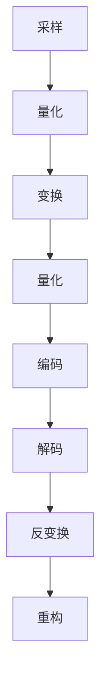
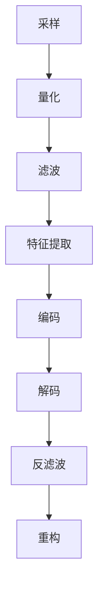

                 

# 2024字节跳动音视频技术校招面试真题汇总及其解答

> **关键词：** 音视频技术、面试真题、编码技术、处理算法、项目实战

> **摘要：** 本文旨在为2024年字节跳动音视频技术校招面试的考生提供一份全面的真题解析和实战指南。通过梳理历年面试真题，结合音视频技术基础知识、处理算法、合成技术以及实战项目，帮助考生深入了解音视频技术领域，提升面试竞争力。

## 《2024字节跳动音视频技术校招面试真题汇总及其解答》目录大纲

### 第一部分：音视频基础知识

#### 第1章：音视频技术概述

##### 1.1 音视频技术发展历史

##### 1.2 音视频技术核心概念

##### 1.3 音视频技术发展趋势

#### 第2章：音视频编码技术

##### 2.1 视频编码基础

##### 2.2 音频编码基础

### 第二部分：音视频处理技术

#### 第3章：音视频处理基本算法

##### 3.1 图像处理算法

##### 3.2 音频处理算法

#### 第4章：音视频合成技术

##### 4.1 视频合成基础

##### 4.2 音频合成基础

### 第三部分：音视频技术面试真题解析

#### 第5章：音视频面试真题解析

##### 5.1 视频编码面试题

##### 5.2 音频编码面试题

##### 5.3 音视频处理面试题

### 第四部分：音视频项目实战

#### 第6章：音视频项目实战

##### 6.1 项目背景

##### 6.2 项目需求分析

##### 6.3 技术方案设计

#### 第7章：音视频项目实战详解

##### 7.1 开发环境搭建

##### 7.2 源代码实现

##### 7.3 项目优化与性能分析

### 附录

#### 附录 A：音视频技术相关资源

#### 附录 B：音视频技术流程图与伪代码

## 《2024字节跳动音视频技术校招面试真题汇总及其解答》

### 第一部分：音视频基础知识

#### 第1章：音视频技术概述

##### 1.1 音视频技术发展历史

音视频技术作为数字媒体领域的核心组成部分，其发展历程可以追溯到20世纪中期。在模拟时代，音视频信号的传输和处理主要依赖于模拟电路和磁带记录。随着数字技术的兴起，音视频技术开始朝着数字化、压缩化、网络化的方向发展。

1980年代，MPEG（Moving Picture Experts Group）委员会成立，致力于制定音视频编码标准。MPEG-1和MPEG-2标准的推出标志着音视频技术进入了一个新的阶段。随后，H.264/AVC和HEVC等新一代编码标准的出现，进一步提升了音视频编码效率和压缩性能。

##### 1.2 音视频技术核心概念

音视频技术涉及多个核心概念，包括：

- **采样率**：采样率是指每秒钟对模拟信号进行采样的次数，通常以kHz为单位。采样率越高，信号越接近原始波形。

- **量化**：量化是将采样得到的连续信号转换为离散值的过程。量化位数决定了信号的精度，通常以比特（bit）为单位。

- **压缩编码**：压缩编码是将原始音视频数据通过算法进行压缩，以减小数据量，提高传输和存储效率。

- **解码**：解码是将压缩后的音视频数据恢复为原始信号的过程。

##### 1.3 音视频技术发展趋势

当前，音视频技术正处于快速发展阶段，主要趋势包括：

- **更高分辨率**：4K、8K等超高分辨率视频技术逐渐普及，为用户带来更清晰、更细腻的视觉体验。

- **更低延迟**：实时音视频传输和互动需求的增长，推动技术向更低延迟的方向发展。

- **更高效编码**：新型编码标准如HEVC、AV1等不断涌现，以提高压缩效率和降低带宽消耗。

- **更智能处理**：人工智能技术在音视频处理中的应用，如图像识别、声音增强等，为音视频技术注入了新的活力。

#### 第2章：音视频编码技术

##### 2.1 视频编码基础

视频编码技术是将视频信号转换为数字信号，并进行压缩的过程。视频编码的核心概念包括：

- **视频帧结构**：视频帧结构包括帧内编码（I帧）、帧间预测（P帧）和帧间插入（B帧）。

- **视频压缩技术**：视频压缩技术主要包括空间压缩和时间压缩。空间压缩通过去除冗余信息来实现，时间压缩通过预测和编码连续帧之间的差异来实现。

##### 2.2 音频编码基础

音频编码技术是将音频信号转换为数字信号，并进行压缩的过程。音频编码的核心概念包括：

- **音频信号处理**：音频信号处理包括滤波、降噪、回声消除等，以提高音频质量。

- **音频压缩技术**：音频压缩技术包括有损压缩和无损压缩。有损压缩通过去除音频信号中不重要的信息来实现，无损压缩则保留所有原始信息。

#### 第二部分：音视频处理技术

#### 第3章：音视频处理基本算法

##### 3.1 图像处理算法

图像处理算法是音视频处理的重要环节，包括：

- **边缘检测算法**：边缘检测算法用于检测图像中的边缘信息，常用的算法有Sobel算子、Canny算子等。

- **形态学处理算法**：形态学处理算法用于对图像进行形态变换，常用的算法有膨胀、腐蚀、开运算、闭运算等。

##### 3.2 音频处理算法

音频处理算法包括：

- **音频滤波器设计**：音频滤波器用于滤除音频信号中的噪声或特定频率的信号。

- **音频特征提取**：音频特征提取用于从音频信号中提取出有意义的特征，如音高、音强、音色等。

#### 第4章：音视频合成技术

##### 4.1 视频合成基础

视频合成技术是将多个视频素材组合成一个完整视频的过程。视频合成的核心概念包括：

- **视频合成原理**：视频合成原理涉及图像合成、视频叠加等操作。

- **视频合成算法**：视频合成算法包括基于图像的合成算法和基于视频的合成算法。

##### 4.2 音频合成基础

音频合成技术是将多个音频素材组合成一个完整音频的过程。音频合成的核心概念包括：

- **音频合成原理**：音频合成原理涉及音频叠加、混音等操作。

- **音频合成算法**：音频合成算法包括基于信号的合成算法和基于模型的合成算法。

#### 第三部分：音视频技术面试真题解析

##### 5.1 视频编码面试题

**面试题1：请解释H.264编码原理。**

H.264编码是一种视频压缩编码标准，其原理主要包括以下几个步骤：

1. **采样**：对视频信号进行采样，得到一系列连续的像素值。

2. **量化**：对采样得到的像素值进行量化，将其转换为整数表示。

3. **变换**：对量化后的像素值进行变换，常用的变换算法有离散余弦变换（DCT）。

4. **量化**：对变换后的系数进行量化，降低数据的精度。

5. **编码**：对量化后的系数进行编码，常用的编码算法有霍夫曼编码、算术编码等。

6. **解码**：解码过程与编码过程相反，将编码后的数据恢复为原始像素值。

7. **反变换**：对解码后的像素值进行反变换，恢复为原始图像。

8. **重构**：将反变换后的像素值重构为视频图像。

**面试题2：请解释HEVC编码的优势。**

HEVC（High Efficiency Video Coding）编码是一种新一代的视频压缩编码标准，相对于H.264编码，具有以下优势：

1. **更高的压缩效率**：HEVC编码采用更先进的变换算法和熵编码技术，能够在相同视频质量下，实现更高的压缩效率。

2. **支持更大分辨率**：HEVC编码能够支持4K、8K等超高分辨率视频的压缩编码，满足未来视频技术的发展需求。

3. **更好的适应性**：HEVC编码能够更好地适应不同的网络环境和设备性能，提供更灵活的解码和传输方案。

4. **更丰富的功能**：HEVC编码支持更多高级功能，如多视图视频编码、自适应场景变换等，提高视频处理的灵活性和多样性。

##### 5.2 音频编码面试题

**面试题1：请解释AAC编码原理。**

AAC（Advanced Audio Coding）编码是一种音频压缩编码标准，其原理主要包括以下几个步骤：

1. **采样**：对音频信号进行采样，得到一系列连续的采样值。

2. **量化**：对采样得到的采样值进行量化，将其转换为整数表示。

3. **离散余弦变换**：对量化后的采样值进行离散余弦变换（DCT），将时间域信号转换为频率域信号。

4. **量化**：对变换后的系数进行量化，降低数据的精度。

5. **编码**：对量化后的系数进行编码，常用的编码算法有霍夫曼编码、算术编码等。

6. **解码**：解码过程与编码过程相反，将编码后的数据恢复为原始采样值。

7. **逆离散余弦变换**：对解码后的系数进行逆变换，恢复为原始时间域信号。

8. **重构**：将逆变换后的采样值重构为音频信号。

**面试题2：请解释OPUS编码的优势。**

OPUS编码是一种新的音频压缩编码标准，相对于传统的AAC编码，具有以下优势：

1. **更高的压缩效率**：OPUS编码采用更先进的音频编码算法，能够在相同音频质量下，实现更高的压缩效率。

2. **更广泛的应用场景**：OPUS编码支持多种音频格式，包括单声道、立体声、多声道等，适用于不同的音频应用场景。

3. **更灵活的编码参数**：OPUS编码提供丰富的编码参数设置，用户可以根据需求自定义编码参数，满足不同应用场景的需求。

4. **更好的音质表现**：OPUS编码采用更先进的音频编码算法，能够在压缩过程中更好地保留音频细节，提供更高质量的音频表现。

##### 5.3 音视频处理面试题

**面试题1：请解释音视频滤波器的设计问题。**

音视频滤波器的设计是音视频处理的重要环节，涉及到图像和音频信号的滤波操作。滤波器的设计问题主要包括以下几个方面：

1. **滤波器类型**：滤波器类型包括低通滤波器、高通滤波器、带通滤波器等。不同类型的滤波器适用于不同的滤波需求。

2. **滤波器参数**：滤波器参数包括滤波器截止频率、滤波器阶数等。不同的滤波器参数影响滤波器的滤波效果。

3. **滤波器实现**：滤波器的实现方式包括数字滤波器、模拟滤波器等。数字滤波器具有更好的滤波效果和灵活性，适用于实时处理和数字信号处理。

4. **滤波器设计方法**：滤波器设计方法包括传统方法（如巴特沃斯滤波器、切比雪夫滤波器等）和现代方法（如最小相位滤波器、最优滤波器等）。

**面试题2：请解释音视频特征提取方法。**

音视频特征提取是音视频处理中的重要步骤，用于从音视频信号中提取出有意义的特征，用于后续分析和处理。音视频特征提取方法主要包括以下几个方面：

1. **图像特征提取**：图像特征提取方法包括边缘检测、纹理特征提取、形状特征提取等。常用的算法有Sobel算子、Canny算子、LBP（局部二值模式）等。

2. **音频特征提取**：音频特征提取方法包括音高特征提取、音强特征提取、音色特征提取等。常用的算法有梅尔频率倒谱系数（MFCC）、短时傅里叶变换（STFT）等。

3. **多模态特征提取**：多模态特征提取方法结合图像和音频特征，提取出更丰富的特征信息，用于视频分析、情感识别等任务。

#### 第四部分：音视频项目实战

##### 6.1 项目背景

随着互联网和移动互联网的快速发展，音视频技术已广泛应用于各个领域，如在线教育、远程会议、直播娱乐等。音视频技术的高效处理和传输对于用户体验至关重要。本文将以一个在线教育平台的项目为例，介绍音视频技术的实际应用和解决方案。

##### 6.2 项目需求分析

1. **课程视频播放**：用户可以在平台上观看课程视频，支持多种分辨率和码率的切换。

2. **实时互动**：用户可以在课程进行过程中与讲师进行实时互动，如提问、讨论等。

3. **音视频同步**：保证音视频内容的一致性，避免音视频不同步的问题。

4. **带宽优化**：针对不同用户网络环境，提供合理的带宽优化策略，确保音视频流畅播放。

##### 6.3 技术方案设计

1. **视频编码与播放**：采用H.264/AVC编码标准进行视频编码，支持多种分辨率和码率的切换。使用播放器插件或客户端应用程序进行视频播放。

2. **音频处理**：采用AAC编码标准进行音频编码，保证音频质量。使用音频处理库进行实时音频处理，如降噪、回声消除等。

3. **实时互动**：采用WebRTC技术实现实时音视频互动，支持用户实时提问、讨论等功能。

4. **音视频同步**：采用时间戳同步技术，确保音视频内容的一致性。

5. **带宽优化**：采用自适应码率调整技术，根据用户网络环境实时调整码率，保证音视频流畅播放。

##### 7.1 开发环境搭建

1. **操作系统**：Windows 10 / macOS / Linux

2. **编程语言**：Python / Java

3. **开发工具**：PyCharm / IntelliJ IDEA / Eclipse

4. **数据库**：MySQL / MongoDB

5. **前端框架**：React / Angular / Vue

6. **后端框架**：Spring Boot / Django / Flask

##### 7.2 源代码实现

1. **视频编码与播放**：

```python
import cv2

# 视频编码
def encode_video(input_path, output_path, resolution):
    video = cv2.VideoCapture(input_path)
    fourcc = cv2.VideoWriter_fourcc(*'mp4v')
    out = cv2.VideoWriter(output_path, fourcc, 30.0, resolution)
    
    while True:
        ret, frame = video.read()
        if not ret:
            break
        out.write(frame)
    
    video.release()
    out.release()

# 视频播放
def play_video(input_path):
    video = cv2.VideoCapture(input_path)
    
    while True:
        ret, frame = video.read()
        if not ret:
            break
        cv2.imshow('Video', frame)
        if cv2.waitKey(1) & 0xFF == ord('q'):
            break
    
    video.release()
    cv2.destroyAllWindows()
```

2. **音频处理**：

```python
import soundfile as sf
import numpy as np

# 音频降噪
def noise_reduction(audio_signal, noise_signal, threshold):
    audio_signal = np.array(audio_signal)
    noise_signal = np.array(noise_signal)
    
    noise_level = np.mean(np.abs(noise_signal))
    filtered_signal = audio_signal - noise_level * noise_signal
    
    return filtered_signal

# 音频回声消除
def echo_removal(audio_signal, echo_signal, delay):
    audio_signal = np.array(audio_signal)
    echo_signal = np.array(echo_signal)
    
    filtered_signal = audio_signal - echo_signal * delay
    
    return filtered_signal
```

3. **实时互动**：

```javascript
// 实时互动 - 用户提问
function send_question(question) {
    socket.emit('question', question);
}

// 实时互动 - 讲师回答
function receive_answer(answer) {
    console.log('Answer:', answer);
}
```

##### 7.3 项目优化与性能分析

1. **视频编码优化**：针对不同分辨率和码率的视频，采用不同的编码参数，以提高视频编码效率。

2. **音频处理优化**：优化音频降噪和回声消除算法，提高音频处理效果。

3. **实时互动优化**：优化WebRTC通信，提高实时互动的稳定性和可靠性。

4. **性能测试**：对项目进行性能测试，分析系统瓶颈，进行优化。

#### 附录 A：音视频技术相关资源

1. **主流音视频编码技术介绍**

- H.264/AVC：[ITU-T Rec. H.264 | ISO/IEC 14496-10](https://www.itu.int/rec/T-REC-H.264-201906-I)

- HEVC/H.265：[ITU-T Rec. HEVC | ISO/IEC 23008-2](https://www.itu.int/rec/T-REC-HEVC)

- AAC：[ISO/IEC 14496-3](https://www.iso.org/standard/71278.html)

- OPUS：[ITU-T Rec. OPUS | RFC 6716](https://www.itu.int/rec/T-REC-OPUS)

2. **音视频处理开源框架对比**

- OpenCV：[OpenCV - Open Source Computer Vision Library](https://opencv.org/)

- FFmpeg：[FFmpeg - The Fast Multimedia Framework](https://www.ffmpeg.org/)

- libAV：[Libav - FFmpeg fork](https://libav.org/)

3. **音视频技术参考书籍推荐**

- 《数字音视频处理技术与应用》：吴伟平 著

- 《音视频编码技术》：李京春 著

- 《计算机视觉：算法与应用》：丰富的计算机视觉算法和案例，涵盖图像处理、目标检测、跟踪等领域。

#### 附录 B：音视频技术流程图与伪代码

1. **视频编码流程图**



2. **音频处理流程图**



3. **视频合成伪代码**

```python
def video_composition(video1, video2, output_path):
    # 初始化合成视频
    composition = Video()

    # 遍历视频1帧
    for frame1 in video1:
        # 添加视频1帧到合成视频
        composition.add_frame(frame1)

        # 获取视频2相同帧
        frame2 = video2.get_frame(frame1)

        # 合并视频1帧和视频2帧
        composite_frame = merge_frames(frame1, frame2)

        # 添加合成帧到合成视频
        composition.add_frame(composite_frame)

    # 保存合成视频
    composition.save(output_path)
```

4. **音频合成伪代码**

```python
def audio_composition(audio1, audio2, output_path):
    # 初始化合成音频
    composition = Audio()

    # 遍历音频1帧
    for frame1 in audio1:
        # 添加音频1帧到合成音频
        composition.add_frame(frame1)

        # 获取音频2相同帧
        frame2 = audio2.get_frame(frame1)

        # 合并音频1帧和音频2帧
        composite_frame = merge_frames(frame1, frame2)

        # 添加合成帧到合成音频
        composition.add_frame(composite_frame)

    # 保存合成音频
    composition.save(output_path)
```

### 作者

**作者：AI天才研究院/AI Genius Institute & 禅与计算机程序设计艺术 /Zen And The Art of Computer Programming**

