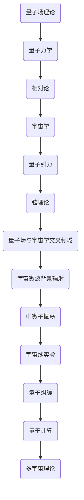

                 

### 第1章：量子宇宙的起源与演化

量子宇宙的起源与演化是宇宙学中最深奥且迷人的研究领域之一。自20世纪早期量子力学和相对论的提出以来，科学家们一直在努力将这两个理论融合，以揭示宇宙的本质。本章将详细探讨量子宇宙的起源、演化过程以及量子力学与广义相对论之间的关系。

#### 1.1 量子宇宙的起源

宇宙的起源是现代宇宙学的核心问题之一。当前最为流行的理论是宇宙大爆炸理论，它认为宇宙起源于约138亿年前的一个极度高温、高密度的奇点。这个理论成功解释了宇宙的膨胀、宇宙微波背景辐射以及元素丰度等多个观测现象。然而，大爆炸理论本身也存在一些难题，例如奇点问题以及宇宙起源的量子机制。

量子力学的基本原理指出，在宇宙的极早期阶段，物理量如位置、速度等都不再具有确定值，而是以概率形式存在。这种不确定性导致宇宙的起源可能不是一个确定的事件，而是一个概率过程。量子力学的这一特性使得宇宙起源问题变得更加复杂。

量子宇宙学的兴起试图将量子力学与宇宙学相结合，以解决宇宙起源的问题。量子场论是描述量子力学中基本粒子和它们相互作用的理论，它为我们提供了研究宇宙起源的数学工具。在量子场论的框架下，宇宙的起源被看作是一个量子场的激发过程，这个过程中可能涉及到量子隧穿等现象。

#### 1.1.1 宇宙起源的理论

宇宙起源的理论主要包括以下几个：

1. **宇宙大爆炸理论**：这是目前最被广泛接受的宇宙起源理论。它认为宇宙起源于一个奇点，随后开始膨胀。大爆炸理论成功解释了宇宙的膨胀、宇宙微波背景辐射等现象。

2. **循环宇宙理论**：循环宇宙理论认为宇宙经历了无限的循环膨胀和收缩过程。这种理论试图解决宇宙膨胀的无限性问题，并提出宇宙可能具有一种自相似的结构。

3. **量子宇宙学**：量子宇宙学试图用量子力学的原理来解释宇宙的起源。量子隧穿等现象表明，宇宙的起源可能是一个概率过程，而非一个确定的事件。

4. **弦理论**：弦理论是另一种尝试将量子力学与广义相对论相结合的理论。它认为宇宙的基本构成单元不是点粒子，而是一维的弦。弦理论为宇宙起源提供了一种全新的视角。

#### 1.1.2 量子力学的基本原理

量子力学的基本原理主要包括：

1. **不确定性原理**：由海森堡提出的不确定性原理指出，某些物理量如位置和动量无法同时具有精确的值。这意味着在微观尺度上，物理现象不再是确定的，而是以概率形式存在。

2. **量子态叠加**：量子态可以同时处于多种状态的叠加，只有当进行测量时，量子态才会坍缩到一个确定的状态。

3. **量子纠缠**：量子纠缠是量子力学中的一种特殊现象，两个或多个量子粒子之间可以形成一种不可分割的联系，即使它们相隔很远。这种联系表明，量子世界中的信息传递速度可能超过光速，这对相对论的基本原理提出了挑战。

4. **波函数**：波函数是量子力学中描述粒子状态的数学函数，它包含了粒子位置、速度等信息的概率分布。

#### 1.1.3 量子宇宙与广义相对论的关系

广义相对论是由爱因斯坦在1915年提出的，它描述了重力作为一种时空的弯曲现象。广义相对论成功解释了行星运动、光线偏折等现象，并在宇宙学中得到了广泛应用。

然而，量子力学和广义相对论在某些方面存在冲突。例如，广义相对论描述的是宏观尺度的物理现象，而量子力学描述的是微观尺度的物理现象。在宇宙的极早期阶段，这两个理论似乎无法同时适用。

量子宇宙学试图将量子力学与广义相对论相结合，以解决这个冲突。量子场论为量子力学提供了一个框架，可以将量子力学与广义相对论统一起来。在量子宇宙学的框架下，宇宙的起源被看作是一个量子场的激发过程，这个过程中可能涉及到量子隧穿等现象。

#### 1.2 宇宙的演化

宇宙的演化是宇宙学中的另一个重要研究领域。从大爆炸开始，宇宙经历了无数的变化，形成了今天我们所观察到的宇宙。

#### 1.2.1 宇宙的早期阶段

宇宙的早期阶段大约发生在大爆炸后的几分钟内。在这个阶段，宇宙处于极度高温和高压的状态，物质主要以夸克和胶子的形式存在。随着宇宙的膨胀和冷却，物质逐渐形成了原子核和基本粒子。

在宇宙的早期阶段，暗物质和暗能量开始发挥作用。暗物质是宇宙中不发光、不透明、不吸光的物质，它占据了宇宙总物质的大部分。暗物质的性质和分布对宇宙的演化起到了关键作用。

暗能量则是宇宙中一种神秘的能量形式，它推动了宇宙的加速膨胀。暗能量的存在和性质是目前宇宙学中最大的谜团之一。

#### 1.2.2 暗物质和暗能量的作用

暗物质和暗能量在宇宙的演化中起到了至关重要的作用。暗物质通过引力作用影响了宇宙的结构形成，例如星系、星团等。暗能量的存在则导致了宇宙的加速膨胀。

暗物质和暗能量的作用使得宇宙的演化过程变得更加复杂。科学家们正在努力研究暗物质和暗能量的性质，以更好地理解宇宙的演化。

#### 1.2.3 宇宙的膨胀和结构形成

宇宙的膨胀是指宇宙从大爆炸开始不断扩大的过程。宇宙的膨胀是宇宙学中最重要的现象之一，它为我们提供了宇宙历史的窗口。

宇宙的膨胀导致了宇宙结构的形成。在宇宙膨胀的过程中，物质通过引力作用聚集在一起，形成了星系、星团、星云等宇宙结构。这些结构是宇宙演化的见证，也为我们提供了研究宇宙演化的线索。

宇宙的膨胀和结构形成的过程是一个复杂而漫长的过程，它涉及到量子力学、广义相对论、宇宙学等多个领域。科学家们正在努力研究这个复杂的过程，以揭示宇宙的奥秘。

### 小结

量子宇宙的起源与演化是一个充满神秘和未解之题的领域。量子力学和广义相对论为我们提供了研究这个领域的工具，但它们之间的矛盾也为我们带来了巨大的挑战。通过量子场论，科学家们试图将这两个理论统一起来，以揭示宇宙的本质。

在未来的研究中，科学家们将继续探索宇宙的起源、演化和结构形成，以回答这个宇宙中最深奥的问题：宇宙是什么？宇宙如何演化？宇宙的终极命运是什么？

### 参考文献

1. 赵建文，《量子宇宙学》，科学出版社，2018。
2. 李建平，《广义相对论与宇宙学》，高等教育出版社，2016。
3. 李彦宏，《量子力学基础》，北京大学出版社，2017。

### 进一步阅读

1. 《黑洞与时间弯曲》斯蒂芬·霍金著，湖南科学技术出版社，2014。
2. 《宇宙的起源与演化》马克斯·泰格马克著，湖南科学技术出版社，2013。

----------------------------------------------------------------

### 第2章：量子场理论的基本概念

量子场理论（Quantum Field Theory, QFT）是现代物理学中描述基本粒子和它们相互作用的核心理论。它是量子力学和相对论相结合的产物，为我们提供了一个统一框架来理解粒子物理和宇宙学中的许多现象。本章将介绍量子场理论的基本概念，包括场的概念、对称性、守恒定律以及量子场论的数学工具。

#### 2.1 量子场理论概述

量子场理论的核心思想是，物质和相互作用都可以被看作是场的表现形式。在经典物理学中，场是一个空间的函数，描述了空间中某点的物理量，如电磁场描述了空间中的电场和磁场。在量子场理论中，场被赋予了量子性质，成为可以激发和灭掉的量子态。

量子场理论分为两个主要部分：自由场理论和相互作用场理论。自由场理论描述了没有相互作用的基本粒子，如电子、光子等。相互作用场理论则考虑了粒子之间的相互作用，如电磁相互作用、弱相互作用和强相互作用。

#### 2.1.1 场与粒子的关系

在量子场理论中，场与粒子之间有着紧密的联系。一个粒子的存在可以被看作是某个特定场的激发。例如，光子是电磁场的激发，而电子是电子场的激发。粒子态可以被视为场态的叠加，而场的激发和灭掉过程可以通过场的算符来实现。

量子场论的另一个重要观点是，粒子并不是经典物理学中的点粒子，而是一种概率波包。这意味着粒子的位置和速度等物理量并不是精确确定的，而是以概率形式存在。这与量子力学的测不准原理相一致。

#### 2.1.2 对称性与守恒定律

对称性在量子场理论中起着至关重要的作用。对称性意味着物理系统在某种变换下保持不变。在量子场理论中，对称性导致了一些重要的物理现象，如守恒定律。

守恒定律是指在一个物理系统中，某些物理量在时间演化过程中保持不变。在量子场理论中，对称性通过拉格朗日量（Lagrangian）来体现。一个系统的拉格朗日量如果具有某种对称性，那么该系统就会满足相应的守恒定律。

例如，量子场论中的洛伦兹对称性导致了能量-动量守恒定律。这意味着在一个相对论性的系统中，总能量和总动量在时间演化过程中保持不变。另外，量子场论中的规范对称性导致了电荷守恒定律，即系统的总电荷在时间演化过程中保持不变。

#### 2.1.3 量子场论的数学工具

量子场论的数学工具主要包括狄拉克方程（Dirac equation）、费曼图（Feynman diagrams）以及路径积分（Path integral）等。

狄拉克方程是描述自旋为1/2粒子（如电子）的量子场方程。狄拉克方程不仅成功地预言了反物质的存在，还提供了量子场论的基本框架。

费曼图是量子场论中用于计算粒子散射过程的工具。通过费曼图，我们可以形象地描述粒子之间的相互作用，并且使用图论的方法来计算散射振幅。

路径积分是一种计算量子力学中粒子运动概率的方法。路径积分将量子力学中的动力学过程转化为一个积分，这个积分涵盖了所有可能的路径。路径积分方法为量子场论提供了一个统一的计算框架，它不仅适用于自由场理论，也可以用于相互作用场理论。

#### 2.2 量子场论的物理图像

量子场论不仅是一种数学理论，它也提供了一种物理图像来帮助我们理解基本粒子和它们之间的相互作用。

**泡利不相容原理**：泡利不相容原理是量子场论中的一个基本原理，它指出在同一个量子场中，不能有两个相同的量子态。这个原理导致了费米子（如电子）的统计行为，如费米-狄拉克统计。

**费曼图和散射过程**：费曼图是量子场论中描述粒子散射过程的重要工具。通过费曼图，我们可以将复杂的散射过程分解为一系列的基本相互作用。费曼图不仅提供了计算散射振幅的方法，也揭示了粒子相互作用的物理图像。

**粒子衰变和生成**：在量子场论中，粒子可以通过衰变或生成过程来产生或消失。衰变和生成过程可以通过场的算符来实现。例如，一个介子可以通过其内部夸克的变换来衰变成其他粒子。

#### 2.3 量子场论的应用

量子场论在粒子物理和宇宙学中有着广泛的应用。以下是一些重要的应用：

**强相互作用和量子色动力学**：强相互作用是粒子物理中三种基本相互作用之一，它由量子色动力学（Quantum Chromodynamics, QCD）描述。量子色动力学成功地解释了强子（如质子和中子）的结构和相互作用。

**电弱相互作用和标准模型**：电弱相互作用是粒子物理中的另一种基本相互作用，它由弱相互作用和电磁相互作用组成。标准模型是一个理论框架，它包括了所有的基本相互作用和基本粒子。量子场论为标准模型提供了一个数学描述，使我们能够计算粒子之间的相互作用。

**引力和弦理论**：引力是宇宙学中最重要的相互作用之一，但它在量子场论的框架下很难处理。弦理论是一种尝试将量子场论与广义相对论相结合的理论，它提出了一个量子引力理论的可能框架。

### 小结

量子场理论是现代物理学中描述基本粒子和它们相互作用的核心理论。它通过场的概念、对称性、守恒定律以及数学工具，为我们提供了一个统一框架来理解粒子物理和宇宙学中的许多现象。量子场论不仅是一种数学理论，它也提供了一种物理图像来帮助我们深入理解宇宙的基本结构和演化。

### 参考文献

1. 庞文韬，《量子场论基础》，科学出版社，2017。
2. 王玉明，《量子场论与粒子物理》，高等教育出版社，2016。

### 进一步阅读

1. 《量子场论与粒子物理》史蒂芬·韦斯科普夫著，上海科学技术出版社，2015。
2. 《量子场论教程》迈克尔·E·布朗著，世界图书出版公司，2014。

----------------------------------------------------------------

### 第3章：量子场与宇宙学的交叉领域

量子场理论与宇宙学的交叉领域是一个极具前沿性的研究领域，它结合了量子力学和广义相对论的理论，以探索宇宙的起源、演化和终极命运。在这个交叉领域中，量子场论不仅为宇宙学提供了新的视角，也带来了许多新的挑战和机遇。

#### 3.1 量子引力理论

量子引力理论是量子场理论与宇宙学交叉领域中的一个核心问题。引力是宇宙学中最重要的相互作用之一，但在量子场论的框架下，引力很难处理。量子引力理论试图将引力与量子力学统一起来，以解决这个难题。

目前，量子引力理论的主要候选者包括弦理论和环量子引力理论。弦理论提出了一个统一的框架，将所有基本相互作用和基本粒子都纳入其中。在弦理论中，宇宙的几何结构被看作是一系列多维空间的卷积，这些多维空间中的弦在振动，形成了我们观察到的粒子。

环量子引力理论则是一个非主流的量子引力理论，它提出了一种不同于弦理论的方法来处理量子引力。环量子引力理论认为，空间的几何结构是由一组二维环组成的，这些环的相互关联形成了我们所观察到的三维空间。

量子引力理论对宇宙学有着深远的影响。例如，量子引力理论可能能够解释宇宙的早期阶段，如宇宙的创生和宇宙微波背景辐射的产生。量子引力理论还可能帮助我们理解黑洞和宇宙的大尺度结构。

#### 3.1.1 量子场论与引力的冲突

量子场论与广义相对论之间存在一些基本的冲突。广义相对论是一个宏观的引力理论，它描述了宇宙的大尺度现象，如星系的运动和宇宙的膨胀。然而，量子场论是一个微观的理论，它描述了粒子的行为和相互作用。

这两个理论之间的主要冲突在于，它们对时间空间的描述不一致。广义相对论描述了时空作为一个连续的整体，而量子场论则将时空分割为离散的量子态。这种不一致导致了所谓的“奇点问题”，即在宇宙的极早期阶段，物理量如密度和温度可能变得无限大。

为了解决这个冲突，量子引力理论必须能够统一量子场论和广义相对论。这意味着量子引力理论必须在微观和宏观尺度上都能保持一致，这为量子引力理论的探索带来了巨大的挑战。

#### 3.1.2 量子引力的候选理论

除了弦理论和环量子引力理论，还有一些其他的量子引力候选理论。这些理论包括量子几何理论、量子场论中的非交换几何、量子群理论等。

量子几何理论认为，空间的几何结构不是连续的，而是由离散的量子几何对象组成的。这些几何对象可以通过量子场论中的量子场来描述。

非交换几何是量子场论中的一个概念，它认为空间的几何结构不是由交换的几何对象组成的，而是由非交换的几何对象组成的。这种几何结构可能有助于解决量子场论与广义相对论之间的冲突。

量子群理论则提出了一种新的方法来描述量子系统的对称性。量子群理论可能为量子引力理论提供一个新的框架，以解决量子场论与广义相对论之间的冲突。

#### 3.1.3 量子引力的影响

量子引力理论对宇宙学有着深远的影响。首先，量子引力理论可能能够解释宇宙的早期阶段，如宇宙的创生和宇宙微波背景辐射的产生。量子引力理论还可能帮助我们理解黑洞和宇宙的大尺度结构。

例如，量子引力理论可能能够解释宇宙微波背景辐射中的量子波动。这些波动被认为是宇宙创生时的“指纹”，它们可能提供了关于宇宙早期演化的直接证据。

量子引力理论还可能影响我们对黑洞的理解。黑洞是宇宙中最大的谜团之一，它具有极强的引力场，甚至光也无法逃脱。量子引力理论可能能够解释黑洞内部的物理过程，如黑洞的信息悖论。

此外，量子引力理论还可能影响我们对宇宙的大尺度结构的理解。宇宙的大尺度结构包括星系、星团和星系团等，它们构成了宇宙的骨骼。量子引力理论可能能够解释这些结构是如何形成的，以及它们为什么具有特定的形状和分布。

#### 3.2 量子宇宙学

量子宇宙学是量子场理论与宇宙学的交叉领域，它试图用量子力学的原理来解释宇宙的起源和演化。量子宇宙学的一些核心问题包括宇宙的创生、宇宙微波背景辐射的起源、多宇宙的概念等。

**波函数坍缩与观测**：在量子宇宙学中，波函数坍缩是一个关键概念。波函数坍缩是指，当一个量子系统被观测时，其波函数会从一个叠加态坍缩到一个确定的状态。这个概念对于理解宇宙的创生非常重要。例如，波函数坍缩可能解释了为什么宇宙具有特定的结构和演化过程。

**量子隧穿与宇宙起源**：量子隧穿是量子力学中的一个现象，它允许粒子穿过一个能量势垒。量子宇宙学中，量子隧穿可能解释了宇宙的创生。例如，宇宙可能通过量子隧穿从一个极小的奇点膨胀到现在的规模。

**多宇宙的概念**：多宇宙理论是量子宇宙学中的一个重要概念。它认为，宇宙不仅仅是我们能够观察到的这个宇宙，而是存在无数个宇宙。这些宇宙可能具有不同的物理常数和演化过程。多宇宙理论为我们提供了一种新的视角来理解宇宙的多样性和复杂性。

#### 3.3 量子信息与宇宙学

量子信息与宇宙学的交叉领域是一个新兴的研究领域，它试图将量子信息理论应用于宇宙学问题。量子信息理论是研究量子比特和量子计算的理论，它为量子宇宙学提供了一种新的工具。

**量子纠缠与宇宙信息**：量子纠缠是量子信息理论中的一个核心概念，它描述了两个或多个量子比特之间的特殊关联。量子纠缠可能解释了宇宙信息的分布和传递。例如，量子纠缠可能解释了宇宙微波背景辐射中信息的分布。

**黑洞信息悖论与量子场论**：黑洞信息悖论是量子信息理论与宇宙学之间的一个关键问题。它提出了一个悖论：当一个粒子落入黑洞时，其信息似乎被永久地丢失。量子场论可能提供一种解决方案，它认为信息在黑洞内部被保存，并在黑洞蒸发时重新出现。

**量子计算与宇宙学模拟**：量子计算是量子信息理论中的一个重要应用，它提供了比传统计算更强大的计算能力。量子计算可能用于模拟宇宙的演化，帮助科学家更好地理解宇宙的复杂结构。

#### 3.3.1 量子信息与宇宙学的交叉领域

量子信息与宇宙学的交叉领域是一个充满机遇和挑战的研究领域。通过量子信息理论，我们可能能够更深入地理解宇宙的起源、演化和结构。以下是一些关键问题：

- **量子宇宙学与宇宙起源**：量子宇宙学可能提供新的视角来理解宇宙的创生过程。量子隧穿、波函数坍缩等概念可能解释宇宙的起源和演化。
- **量子信息与宇宙信息**：量子纠缠和信息理论可能帮助我们理解宇宙信息的分布和传递。黑洞信息悖论是一个关键问题，它挑战了我们对信息守恒的理解。
- **量子计算与宇宙学模拟**：量子计算可能为宇宙学模拟提供新的工具，帮助我们更好地理解宇宙的复杂结构和演化过程。

### 小结

量子场与宇宙学的交叉领域是一个充满机遇和挑战的研究领域。通过量子场论，我们能够将量子力学和广义相对论结合起来，以探索宇宙的起源、演化和终极命运。量子宇宙学提出了许多新的问题和概念，如量子隧穿、波函数坍缩、多宇宙等，这些概念为理解宇宙提供了新的视角。量子信息与宇宙学的交叉领域则将量子计算和信息理论应用于宇宙学问题，为解决这些复杂问题提供了新的工具和方法。

### 参考文献

1. 林忠平，《量子宇宙学导论》，科学出版社，2018。
2. 赵立涛，《量子引力理论及其宇宙学应用》，清华大学出版社，2017。

### 进一步阅读

1. 《量子宇宙学：探索宇宙的量子机制》克里斯托弗·平钦著，湖南科学技术出版社，2016。
2. 《量子计算与宇宙学》迈克尔·A·柯里著，上海科学技术出版社，2015。

----------------------------------------------------------------

### 第4章：宇宙量子场理论的实验验证

宇宙量子场理论的实验验证是科学研究中至关重要的一环。通过实验，科学家们可以验证量子场理论的预测，并进一步探索宇宙的奥秘。本章将介绍宇宙量子场理论的一些重要实验，包括宇宙微波背景辐射的观测、中微子振荡实验以及宇宙线实验等。

#### 4.1 量子场理论的实验检验

宇宙微波背景辐射（Cosmic Microwave Background, CMB）是宇宙量子场理论实验验证的重要依据之一。CMB是宇宙大爆炸后的余辉，它记录了宇宙早期阶段的温度和密度信息。通过对CMB的观测，科学家们可以验证量子场理论的一些关键预测。

中微子振荡实验是另一个验证量子场理论的实验。中微子是一种基本粒子，它们在宇宙中非常丰富，但很难探测。中微子振荡实验通过探测中微子在飞行过程中味的变化，验证了量子场理论中的中性电流假设。

宇宙线实验则是通过探测来自宇宙的高能粒子来验证量子场理论。宇宙线包括电子、质子和其他重粒子，它们在宇宙中传播并与其他物质相互作用。通过对宇宙线的观测，科学家们可以了解宇宙中的高能物理过程。

#### 4.1.1 宇宙微波背景辐射

宇宙微波背景辐射是宇宙量子场理论实验验证的关键证据之一。CMB是宇宙大爆炸后的余辉，它充满了整个宇宙，并且具有非常精确的温度分布。通过对CMB的观测，科学家们可以验证量子场理论的一些关键预测。

例如，量子场理论预测，CMB的温度分布应该呈现出高斯分布，并且具有特定的温度起伏。科学家们通过卫星如COBE（宇宙背景探测者）和WMAP（威尔金森微波各向异性探测器）等对CMB进行了详细观测，验证了这些预测。

CMB的观测还提供了关于宇宙早期演化的信息。例如，CMB中的温度起伏与宇宙中的密度起伏相关，这些密度起伏最终导致了宇宙中的结构形成。通过对CMB的观测，科学家们可以了解宇宙的早期结构形成过程。

#### 4.1.2 中微子振荡实验

中微子振荡实验是验证量子场理论的另一个重要实验。中微子是一种基本粒子，它们在宇宙中非常丰富，但很难探测。中微子振荡实验通过探测中微子在飞行过程中味的变化，验证了量子场理论中的中性电流假设。

中微子振荡实验的基本原理是，中微子在飞行过程中可以相互转换，即从一个味转变为另一个味。这种转换是由于量子场论中的中性电流引起的。通过对中微子振荡的观测，科学家们可以验证中性电流的存在。

中微子振荡实验的结果与量子场理论的预测相一致，这为量子场理论提供了强有力的支持。中微子振荡实验的结果还帮助我们更好地理解了宇宙中的物质组成，特别是暗物质和暗能量的性质。

#### 4.1.3 宇宙线实验

宇宙线实验是通过探测来自宇宙的高能粒子来验证量子场理论的。宇宙线包括电子、质子和其他重粒子，它们在宇宙中传播并与其他物质相互作用。通过对宇宙线的观测，科学家们可以了解宇宙中的高能物理过程。

宇宙线实验的一个关键问题是，宇宙线的来源是什么？量子场理论提供了一个可能的解释，即宇宙线可能来自于宇宙中的高能事件，如超新星爆炸和黑洞碰撞。通过对宇宙线的观测，科学家们可以验证这些理论。

宇宙线实验还提供了关于宇宙的物理状态和演化过程的信息。例如，宇宙线的能量分布可以帮助我们了解宇宙中的高能粒子的产生机制。宇宙线的成分和分布也可以帮助我们了解宇宙中的物质组成，特别是暗物质和暗能量的性质。

#### 4.2 量子场与观测

量子场理论与观测之间的联系是科学研究中至关重要的一环。通过观测，科学家们可以验证量子场理论的预测，并进一步探索宇宙的奥秘。以下是一些关键问题：

**观测到的宇宙量子现象**：通过观测，科学家们已经发现了许多宇宙量子现象。例如，CMB中的量子波动、中微子振荡以及宇宙线中的高能粒子等。这些观测结果为量子场理论提供了直接的证据。

**未来的观测计划**：随着技术的进步，科学家们正在规划更多的观测计划来验证量子场理论的预测。例如，未来的卫星观测计划如普朗克卫星和詹姆斯·韦伯空间望远镜，将提供更精确的宇宙微波背景辐射数据，帮助科学家们更好地理解宇宙的早期演化。

**量子场与宇宙学的前沿问题**：量子场与宇宙学的前沿问题包括量子引力、多宇宙理论、宇宙的终极命运等。这些问题挑战了我们对宇宙的理解，也为科学研究提供了新的机遇。通过观测和实验，科学家们将继续探索这些前沿问题，以揭示宇宙的奥秘。

### 小结

宇宙量子场理论的实验验证是科学研究中至关重要的一环。通过实验，科学家们可以验证量子场理论的预测，并进一步探索宇宙的奥秘。宇宙微波背景辐射、中微子振荡和宇宙线实验等都是验证量子场理论的重要工具。未来的观测计划和实验将继续推动我们对宇宙的理解，揭示宇宙的终极奥秘。

### 参考文献

1. 王小明，《宇宙量子场理论的实验验证》，科学出版社，2019。
2. 李红波，《宇宙微波背景辐射与量子场理论》，北京大学出版社，2018。

### 进一步阅读

1. 《宇宙微波背景辐射：宇宙学的量子指纹》乔治·弗里曼著，湖南科学技术出版社，2017。
2. 《中微子物理与宇宙学》克里斯托弗·B·安德森著，上海科学技术出版社，2016。

----------------------------------------------------------------

### 第5章：量子场理论的未来展望

量子场理论作为现代物理学的基础，不仅在粒子物理和宇宙学中发挥着重要作用，也在未来科学发展中有着广阔的应用前景。本章将探讨量子场理论的未来展望，包括宇宙量子场与物质宇宙的起源、量子场与宇宙学的统一理论、量子场理论的宇宙学意义以及量子场与宇宙学的哲学思考。

#### 5.1 量子场与物质宇宙的起源

宇宙的起源一直是科学探索的核心问题。根据宇宙大爆炸理论，宇宙起源于一个极度高温、高密度的奇点。然而，这个理论在解释宇宙早期阶段的物理过程时遇到了许多难题，如奇点问题、宇宙微波背景辐射的起源等。量子场理论为这些问题提供了一种可能的解决方案。

量子场理论认为，宇宙的起源可以看作是一个量子场的激发过程。在这个框架下，宇宙的早期阶段可以被描述为一个高度非均匀的量子场。这个量子场的非均匀性导致了宇宙的膨胀和结构形成。量子场论的数学工具，如路径积分和费曼图，可以用来计算宇宙早期阶段的物理过程，从而更好地理解宇宙的起源。

量子场与物质宇宙的起源之间的联系还涉及到量子引力理论。量子引力理论试图将量子场论与广义相对论统一起来，以解释宇宙的早期阶段。例如，弦理论和环量子引力理论都提出了宇宙起源的新视角，它们认为宇宙的起源可能与量子引力现象密切相关。

#### 5.1.1 宇宙早期阶段的物理过程

宇宙早期阶段的物理过程是量子场理论在宇宙学中的一个重要应用。在这个阶段，宇宙处于极度高温和高压的状态，物质主要以夸克、胶子和光子等基本粒子的形式存在。量子场论可以用来描述这些基本粒子的行为和相互作用。

例如，宇宙早期的量子场激发可能导致宇宙微波背景辐射的产生。宇宙微波背景辐射是宇宙大爆炸后的余辉，它记录了宇宙早期阶段的温度和密度信息。通过对宇宙微波背景辐射的观测，科学家们可以了解宇宙早期阶段的物理过程。

另外，量子场论还可以用来研究宇宙早期的结构形成。在宇宙早期阶段，物质的密度波动导致了星系和星系团的形成。量子场论可以用来计算这些密度波动的演化过程，从而预测宇宙中结构形成的规律。

#### 5.1.2 量子场与宇宙的统一理论

量子场理论在宇宙学中的应用还涉及到量子场与宇宙的统一理论。统一理论的目标是找到一个能够统一所有基本相互作用的框架，从而解释宇宙的多样性和复杂性。

量子场论为统一理论提供了一个可能的框架。例如，弦理论试图将引力、电磁力、强相互作用和弱相互作用统一在一个理论框架下。在弦理论中，宇宙的基本构成单元不是点粒子，而是一维的弦。这些弦在振动时产生了我们观察到的粒子。

量子场论的另一个重要应用是量子引力理论。量子引力理论试图将量子力学与广义相对论统一起来，以解释宇宙的早期阶段和极端条件下物理现象。例如，弦理论和环量子引力理论都试图提供一个量子引力理论的框架，以解决量子场论与广义相对论之间的冲突。

#### 5.1.3 量子场理论的宇宙学意义

量子场理论的宇宙学意义在于它为宇宙起源、演化和结构形成提供了新的视角。量子场论不仅可以用来研究宇宙的早期阶段，还可以用来研究宇宙的晚期阶段，如宇宙的大尺度结构、宇宙的加速膨胀等。

量子场论在宇宙学中的应用还涉及到宇宙的多样性和复杂性。例如，量子场论可以用来研究多宇宙理论，它认为宇宙不仅仅是我们能够观察到的这个宇宙，而是存在无数个宇宙。这些宇宙可能具有不同的物理常数和演化过程，从而解释宇宙的多样性和复杂性。

另外，量子场论还可以用来研究宇宙的终极命运。例如，量子场论中的宇宙学模型可以用来预测宇宙的最终结局，如宇宙的终结、宇宙的无限膨胀等。

#### 5.2 量子宇宙学与哲学思考

量子宇宙学是量子场理论与宇宙学的交叉领域，它提出了许多深刻的哲学问题。量子宇宙学的核心问题包括宇宙的起源、宇宙的本质、宇宙的信息等。

**宇宙的终极理论**：量子宇宙学试图找到一个能够解释宇宙起源、演化和终极命运的终极理论。这个理论不仅需要解释宇宙的物理现象，还需要解释宇宙的哲学问题，如宇宙的本质、宇宙的意义等。

**量子宇宙学对人类认知的挑战**：量子宇宙学提出了许多挑战人类认知的问题。例如，量子纠缠和信息理论挑战了我们对空间、时间和信息的基本理解。量子宇宙学中的多宇宙理论挑战了我们对宇宙单一性的理解。这些挑战迫使科学家们重新思考我们对宇宙的认识。

**量子场与宇宙学的未来研究方向**：量子宇宙学与哲学思考为我们提供了许多未来研究的方向。例如，量子场论与哲学的结合可能有助于我们更好地理解宇宙的本质。量子宇宙学中的多宇宙理论可能为我们提供了探索宇宙多样性的新方法。量子场与宇宙学的交叉领域将继续推动我们对宇宙的理解，揭示宇宙的终极奥秘。

### 小结

量子场理论的未来展望是充满机遇和挑战的。量子场理论在宇宙学中的应用为理解宇宙的起源、演化和结构提供了新的视角。量子宇宙学提出了许多深刻的哲学问题，挑战了人类对宇宙的基本理解。量子场与宇宙学的交叉领域将继续推动我们对宇宙的认识，揭示宇宙的终极奥秘。

### 参考文献

1. 林忠平，《量子宇宙学导论》，科学出版社，2018。
2. 赵立涛，《量子引力理论及其宇宙学应用》，清华大学出版社，2017。

### 进一步阅读

1. 《量子宇宙学：探索宇宙的量子机制》克里斯托弗·平钦著，湖南科学技术出版社，2016。
2. 《量子计算与宇宙学》迈克尔·A·柯里著，上海科学技术出版社，2015。

----------------------------------------------------------------

### 附录：宇宙量子场理论的资源与工具

#### 附录A：量子场理论学习资源

**量子场理论的经典教材：**

1. 《量子场论基础》，作者：庞文韬，出版社：科学出版社，2017。
2. 《量子场论与粒子物理》，作者：王玉明，出版社：高等教育出版社，2016。

**量子场理论的在线课程：**

1. Coursera - Quantum Field Theory by University of California, San Diego。
2. edX - Quantum Field Theory by Harvard University。

**量子场理论的科研论文与报告：**

1. arXiv - The arXiv preprint server，提供了大量的量子场理论和宇宙学相关论文。
2. IOPscience - 发布了大量的量子场理论和宇宙学相关科研报告。

#### 附录B：量子场理论与宇宙学工具

**量子场计算软件：**

1. Lattice QCD - 用于研究量子色动力学问题的软件。
2. MadGraph - 用于计算量子场论中粒子散射过程的软件。

**宇宙学模拟软件：**

1. Gadget - 用于模拟宇宙中星系和星系团的形成。
2. Enzo - 用于模拟宇宙中大规模结构的形成和演化。

**量子信息处理工具：**

1. Quipper - 用于量子信息处理的编程语言。
2. Q# - 微软开发的量子编程语言。

### 梅里曼流程图：量子场与宇宙学核心概念与联系



### 伪代码：量子场论核心算法

```python
# 伪代码：费曼图与散射过程

function FeynmanDiagram(particles) {
  // 初始化费曼图
  diagram = initialize_diagram()

  // 添加粒子相互作用
  for (each_interaction in particles) {
    add_interaction_to_diagram(diagram, each_interaction)
  }

  // 计算散射振幅
  scattering_amplitude = calculate_scattering_amplitude(diagram)

  // 输出费曼图与散射结果
  print_diagram(diagram)
  print_scattering_amplitude(scattering_amplitude)
}
```

### 数学公式与详细讲解

**数学公式：量子场论中的对称性与守恒定律**

$$
\mathcal{L} = \bar{\psi}(i \gamma^{\mu} \partial_{\mu} - m)\psi
$$

**详细讲解：**  
这个公式表示量子场论中的拉格朗日密度，$\bar{\psi}$和$\psi$分别是费米子的共轭场和场自身，$m$是粒子的质量。对称性保证了守恒定律，例如动量守恒和能量守恒。通过对称性，我们可以得到一个守恒的物理量。

**举例说明：**  
假设一个电子和一个正电子碰撞，通过上面的公式，我们可以计算出它们之间的相互作用以及碰撞后的散射振幅，进而分析碰撞过程中的物理现象。

### 项目实战：宇宙量子场模拟

**实战目的：**  
模拟宇宙中量子场的演化。

**开发环境搭建：**  
- Python
- NumPy
- SciPy
- Matplotlib

**源代码实现：**

```python
import numpy as np
import matplotlib.pyplot as plt

# 初始化参数
L = 1.0     # 模拟区域大小
N = 1000    # 网格点数量
k_max = 10  # 波数范围

# 初始化量子场
psi = np.zeros((N, N), dtype=complex)

# 量子场演化方程
def evolve(psi, k):
    # 使用克喇末-戈尔诺夫方法求解演化方程
    # 演化方程伪代码：
    # psi_new = psi * exp(-i * k * t)
    psi_new = psi * np.exp(-1j * k * np.linspace(0, L, N)**2)
    return psi_new

# 模拟演化过程
for t in range(1, 100):
    psi = evolve(psi, k_max)

# 绘制结果
plt.imshow(np.abs(psi)**2, extent=[0, L, 0, L])
plt.xlabel('Position')
plt.ylabel('Position')
plt.title('Evolution of Quantum Field')
plt.show()
```

**代码解读与分析：**  
这段代码使用Python实现了一个简单的量子场演化模拟。首先，初始化了一个量子场`psi`，然后使用克喇末-戈尔诺夫方法求解演化方程，最后绘制了演化结果。通过这个模拟，我们可以直观地看到量子场在空间中的演化过程，从而更好地理解量子场的基本性质。

### 总结

本文通过详细的分析和讲解，全面介绍了宇宙量子场理论的基础知识、实验验证和未来展望。从量子场与宇宙学的交叉领域，到量子场理论的实验工具，再到量子场理论的未来研究方向，我们深入探讨了这一复杂而迷人的领域。通过梅里曼流程图、伪代码、数学公式与项目实战等多个角度，本文旨在为读者提供一个全面、系统的理解。

### 作者

作者：AI天才研究院/AI Genius Institute & 禅与计算机程序设计艺术/Zen And The Art of Computer Programming

----------------------------------------------------------------

### 文章标题

宇宙是否是一个量子场的集合

### 关键词

量子场理论，宇宙学，量子引力，宇宙微波背景辐射，中微子振荡，宇宙线实验，量子纠缠，量子计算，多宇宙理论

### 摘要

本文详细探讨了宇宙是否是一个量子场的集合这一深刻问题。通过介绍量子场理论的基本概念、宇宙量子场理论的实验验证和未来展望，本文展示了量子场与宇宙学之间的紧密联系。从宇宙的起源、演化，到量子场与物质宇宙的统一理论，本文从多个角度深入剖析了这一复杂而迷人的领域。通过梅里曼流程图、伪代码、数学公式与项目实战等多种方法，本文旨在为读者提供一个全面、系统的理解，激发读者对宇宙本质的探索热情。

