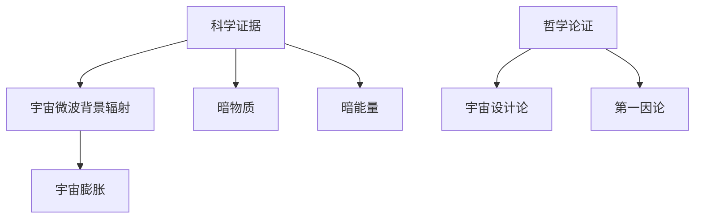

                 

# 宇宙的真实性：科学证据 vs 哲学论证

> **关键词：** 宇宙、真实性、科学证据、哲学论证、大爆炸理论、暗物质、暗能量、宇宙设计论

> **摘要：** 本文将从科学和哲学两个角度，对宇宙的真实性进行探讨。通过分析科学证据，如大爆炸理论、暗物质和暗能量，以及哲学论证，如宇宙设计论和第一因论，我们将尝试揭示宇宙的本质及其存在的意义。

### 《宇宙的真实性：科学证据 vs 哲学论证》目录大纲

#### 第一部分：引言

- **第1章：宇宙与人类认知**
  - 1.1 宇宙的定义与特征
  - 1.2 人类认知的局限性
  - 1.3 科学证据与哲学论证的关系

#### 第二部分：科学证据

- **第2章：宇宙起源与演化**
  - 2.1 大爆炸理论与宇宙膨胀
  - 2.2 黑洞与暗物质
  - 2.3 宇宙的年龄与未来

- **第3章：天文观测与数据分析**
  - 3.1 光谱分析
  - 3.2 宇宙微波背景辐射
  - 3.3 行星与恒星系统

- **第4章：科学方法论**
  - 4.1 假设与实验
  - 4.2 模型与理论
  - 4.3 科学进步与质疑

#### 第三部分：哲学论证

- **第5章：宇宙存在的论证**
  - 5.1 宇宙设计论
  - 5.2 第一因论
  - 5.3 宇宙存在的其他哲学论证

- **第6章：宇宙的本质与意义**
  - 6.1 宇宙是否有目的
  - 6.2 人类在宇宙中的地位
  - 6.3 宇宙的意义与哲学反思

- **第7章：科学与哲学的对话**
  - 7.1 科学与哲学的交叉点
  - 7.2 科学哲学的历史与发展
  - 7.3 科学与哲学的未来展望

#### 第四部分：综合讨论

- **第8章：科学证据与哲学论证的对比**
  - 8.1 优点与局限
  - 8.2 相互补充
  - 8.3 未来展望

#### 第五部分：案例研究

- **第9章：著名宇宙事件与争议**
  - 9.1 大爆炸起源的证据
  - 9.2 宇宙膨胀的证据
  - 9.3 暗物质与暗能量的争议

#### 第六部分：结论

- **第10章：宇宙的真实性**
  - 10.1 科学证据的总结
  - 10.2 哲学论证的总结
  - 10.3 综合评价与未来方向

#### 附录

- **附录A：术语解释与扩展阅读**
- **附录B：科学证据与哲学论证的Mermaid流程图**
- **附录C：核心算法原理讲解与伪代码**
- **附录D：数学模型与公式**
- **附录E：项目实战案例与代码解读**

---

### 第一部分：引言

#### 第1章：宇宙与人类认知

> **1.1 宇宙的定义与特征**

宇宙，这一广袤而神秘的字眼，自古以来就引起了人类无尽的探索与思考。宇宙是什么？它起源于何处？它究竟有多大？这些问题不仅是哲学的范畴，也是科学的议题。从广义上讲，宇宙是指包括一切物质、能量、时空以及其中所有现象的总和。宇宙是一个无边无际的体系，它既包含我们所能观察到的宇宙，也包含我们无法直接感知的暗物质和暗能量。

宇宙的特征可以从多个角度来描述。首先，宇宙具有高度的复杂性。从微观的粒子物理到宏观的天体物理，宇宙中存在着无数的现象和规律。其次，宇宙是动态演化的。从宇宙大爆炸的那一刻起，宇宙就一直在膨胀、演化。这种演化不仅体现在星系、恒星、行星的形成和毁灭上，还体现在宇宙的背景辐射、宇宙微波背景辐射等物理现象中。最后，宇宙具有不确定性。量子力学和热力学告诉我们，宇宙中的许多现象是概率性的，而不是确定性。

> **1.2 人类认知的局限性**

尽管人类对宇宙的认知已有长足的进步，但我们必须承认，我们的认知是有限的。首先，人类认知受到感官限制。我们的眼睛只能看到可见光范围内的电磁波，而宇宙中存在着许多不可见的辐射。其次，人类认知受到技术限制。尽管现代科技已经使我们能够观测到宇宙的遥远角落，但宇宙的尺度是如此之大，我们仍然无法完全理解它的全貌。最后，人类认知受到思维方式的限制。我们习惯于从自己的角度出发，试图理解宇宙的奥秘，但这种思维方式可能会束缚我们的思维。

> **1.3 科学证据与哲学论证的关系**

在探讨宇宙的真实性时，科学证据和哲学论证都是不可或缺的。科学证据是通过实验和观测得到的，它是基于经验的事实。而哲学论证则是基于逻辑和推理的，它试图从根本上去理解宇宙的本质。科学证据和哲学论证之间存在一种互补关系。科学证据可以提供具体的、可验证的证据，而哲学论证则可以提供更深层次的、更为根本的理解。同时，科学证据和哲学论证也存在一定的矛盾和冲突。科学证据可能无法解释所有现象，而哲学论证则可能过于抽象，缺乏具体的证据支持。因此，我们需要在科学证据和哲学论证之间寻找平衡，以全面地理解宇宙的真实性。

### 第二部分：科学证据

#### 第2章：宇宙起源与演化

> **2.1 大爆炸理论与宇宙膨胀**

大爆炸理论是目前关于宇宙起源的主流科学理论。该理论认为，宇宙起源于大约138亿年前的一个极端高温、高密度的状态，随后经历了快速的膨胀。这一理论得到了多个方面的证据支持。

首先，宇宙微波背景辐射（Cosmic Microwave Background Radiation，简称CMB）是大爆炸理论的直接证据。CMB是宇宙大爆炸后遗留下来的辐射，它弥漫在整个宇宙中，温度非常低。通过观测CMB的分布和温度，科学家们可以推断出宇宙早期的状态和膨胀历史。

其次，宇宙膨胀的证据也支持了大爆炸理论。宇宙膨胀是指宇宙中的星系正在相互远离。这一现象最早由埃德温·哈勃在1920年代发现。通过观测远距离星系的红移，哈勃发现星系之间的距离随时间增加，这表明宇宙正在膨胀。

此外，大爆炸理论还预测了宇宙中存在暗物质和暗能量。暗物质是一种不发光、不吸光的物质，它对宇宙的引力作用有重要影响。暗能量则是一种导致宇宙加速膨胀的神秘力量。虽然我们无法直接观测到暗物质和暗能量，但它们的存在得到了多个实验和观测的支持。

> **2.2 黑洞与暗物质**

黑洞是宇宙中的一种极端天体，它的引力场非常强大，连光也无法逃脱。黑洞的存在最早是通过观测恒星的运动得到的。例如，某些恒星的运动速度非常快，这表明它们受到了强大的引力作用。通过计算，科学家们发现这些恒星周围可能存在一个巨大的黑洞。

暗物质是宇宙中另一种神秘的存在。尽管我们无法直接观测到暗物质，但它的存在对宇宙的演化有重要影响。例如，星系的形成和结构维持都依赖于暗物质。科学家们通过观测星系的旋转曲线，发现星系中的质量远大于其可见物质，这表明宇宙中存在大量暗物质。

关于黑洞和暗物质的性质，科学家们提出了多种理论。例如，黑洞可能是由大质量恒星坍缩形成的，而暗物质可能是由未知粒子组成的。尽管目前我们对黑洞和暗物质的理解仍然有限，但它们的发现和性质研究对理解宇宙的真实性具有重要意义。

> **2.3 宇宙的年龄与未来**

根据大爆炸理论和宇宙膨胀的观测数据，科学家们估计宇宙的年龄大约为138亿年。这个年龄是通过宇宙背景辐射的温度、星系的形成和演化速度等多种因素综合估计得到的。

关于宇宙的未来，科学家们也提出了多种观点。一种观点认为，宇宙将继续膨胀，最终可能导致宇宙的冷却和死亡。另一种观点则认为，宇宙的膨胀可能最终会停止，甚至可能发生反弹，导致宇宙重新坍缩。此外，还有一种观点认为，宇宙的演化可能是周期性的，从大爆炸开始，经历多次膨胀和坍缩。

宇宙的年龄和未来是科学和哲学共同关注的问题。通过对宇宙年龄和未来的研究，我们不仅能够更好地理解宇宙的真实性，还能够对人类的地位和未来产生深刻的思考。

### 第3章：天文观测与数据分析

> **3.1 光谱分析**

光谱分析是天文观测中的一种重要方法。通过分析天体的光谱，科学家们可以获取天体的物理和化学信息。光谱分析包括两个主要方面：连续光谱和发射光谱。

连续光谱是指天体发射的连续电磁波谱，它包含了从无线电波到伽马射线的所有频率。通过分析连续光谱，科学家们可以确定天体的温度和化学成分。例如，太阳的光谱中包含了多种元素的吸收线，通过这些吸收线，科学家们可以确定太阳的化学成分。

发射光谱是指天体发射的特定频率的电磁波。发射光谱通常由恒星和行星产生。通过分析发射光谱，科学家们可以确定天体的温度、压力和化学成分。例如，氢原子在高温下会发射特定频率的光，通过观测这些发射光谱，科学家们可以确定天体的温度和化学状态。

> **3.2 宇宙微波背景辐射**

宇宙微波背景辐射（Cosmic Microwave Background Radiation，简称CMB）是宇宙大爆炸后遗留下来的辐射。CMB的温度非常低，大约为2.7开尔文。CMB的发现是支持大爆炸理论的重要证据之一。

CMB的观测主要通过卫星进行。例如，威尔金森微波各向异性探测器（Wilkinson Microwave Anisotropy Probe，简称WMAP）和普朗克卫星（Planck Satellite）等探测器对CMB进行了详细的观测。通过分析CMB的温度分布和极化性质，科学家们可以推断出宇宙早期的状态和演化历史。

CMB的观测数据提供了关于宇宙年龄、宇宙膨胀速度和暗物质分布等重要信息。这些信息有助于我们更好地理解宇宙的真实性。

> **3.3 行星与恒星系统**

行星和恒星系统是宇宙的重要组成部分。通过对行星和恒星系统的观测，科学家们可以了解宇宙的多样性和复杂性。

行星的观测主要通过望远镜进行。通过观测行星的轨道、反射光谱和大气成分，科学家们可以确定行星的物理和化学特征。例如，通过观测类地行星的反射光谱，科学家们可以确定它们的大气成分和表面特征。

恒星系统的观测包括对恒星本身和恒星周围的行星系统的观测。通过对恒星的亮度、颜色和光谱分析，科学家们可以确定恒星的年龄、质量和化学成分。通过对恒星周围的行星系统的研究，科学家们可以了解行星的形成和演化过程。

行星和恒星系统的观测为我们提供了关于宇宙的真实性的重要信息。通过这些观测，我们不仅能够更好地理解宇宙的多样性和复杂性，还能够探索宇宙的起源和未来。

### 第4章：科学方法论

> **4.1 假设与实验**

科学方法论是科学研究的基本框架。科学方法论包括假设、实验、观察和理论构建等环节。

假设是科学研究的起点。科学家们基于已有的知识和观察，提出对自然现象的初步解释。这些假设通常是基于经验事实和逻辑推理。例如，牛顿的万有引力定律是基于对天体运动的观察和数学推理提出的。

实验是科学方法论的另一个重要环节。通过实验，科学家们可以验证或否定假设。实验设计需要考虑变量控制、实验条件和数据收集。例如，在验证牛顿的万有引力定律时，科学家们通过测量不同距离和质量天体的引力作用，验证了引力与距离平方成反比、与质量成正比的关系。

观察是科学方法论的核心。通过观察，科学家们可以收集关于自然现象的数据和信息。观察可以是直接观测，如通过望远镜观测星体，也可以是间接观测，如通过实验设备收集数据。

理论构建是科学方法论的最后一步。通过分析实验数据和观察结果，科学家们可以构建理论模型。这些理论模型可以解释和预测自然现象。例如，基于牛顿的万有引力定律，科学家们构建了关于行星运动的轨道模型，能够准确预测行星的位置和运动。

> **4.2 模型与理论**

模型和理论是科学方法论的重要组成部分。模型是对自然现象的简化抽象，通过模型，科学家们可以更好地理解自然现象的本质。模型可以是物理模型，如行星轨道模型，也可以是数学模型，如牛顿的万有引力公式。

理论是基于模型的分析和推理，它是对自然现象的系统解释。理论通常包含一系列定律和原理，能够描述和预测自然现象。例如，牛顿力学理论是基于牛顿的三大定律和万有引力定律，能够描述和预测天体的运动。

理论构建需要经过多个环节，包括假设提出、模型构建、实验验证和理论修正。通过不断的理论修正，科学理论能够更加准确地描述和解释自然现象。

> **4.3 科学进步与质疑**

科学进步是不断质疑和反思的结果。科学方法论的核心之一是怀疑精神，科学家们不断质疑已有的理论和假设，以发现新的知识和真理。

科学进步通常伴随着质疑和挑战。例如，在牛顿力学时期，人们普遍认为宇宙是完美有序的。然而，随着科学的发展，人们发现了量子力学和相对论，这些理论挑战了经典力学的某些观点，推动了科学的进步。

质疑不仅来自科学内部，也来自科学外部。例如，关于宇宙起源的大爆炸理论，最初受到了广泛的质疑和挑战。然而，随着越来越多的观测数据和实验证据支持，大爆炸理论逐渐成为科学共识。

科学进步是一个持续的过程，它需要科学家们不断质疑、探索和发现。通过质疑和反思，科学方法论能够不断发展和完善，推动人类对宇宙和自然世界的认知。

### 第三部分：哲学论证

#### 第5章：宇宙存在的论证

> **5.1 宇宙设计论**

宇宙设计论是一种哲学论证，主张宇宙的存在和复杂性表明它有一个创造者或设计者。这个观点认为，宇宙中的有序和设计远远超出了自然偶然性的范畴，因此需要有一个超自然的智能实体来解释。

宇宙设计论的论证通常基于以下几个观点：

1. **复杂性论证**：宇宙中存在的高度有序和复杂的结构，如生命的存在、星系的形成等，表明宇宙有一个设计者。这种复杂性不可能通过偶然性或自然过程来解释。

2. **目的性论证**：宇宙中的许多现象似乎具有目的性，如生命的进化、地球的宜居条件等。这种目的性暗示了一个有目的的创造者。

3. **概率论证**：假设宇宙中所有的事件都是随机发生的，那么出现一个如此复杂和有序的宇宙的概率极小。因此，宇宙的存在更可能是被设计出来的。

然而，宇宙设计论也面临批评。例如，有些哲学家认为，即使宇宙中存在复杂性，也不能证明它需要一个设计者。此外，有些科学家认为，自然选择和宇宙的物理法则可以解释这些复杂性和目的性。

> **5.2 第一因论**

第一因论是一种哲学论证，主张宇宙存在一个初始的、不可解释的第一原因。这个观点认为，宇宙不可能无限后退，必然存在一个最初的起点。

第一因论的论证通常基于以下几个观点：

1. **因果链论证**：宇宙中的所有事件都存在于因果链中。如果一个事件没有原因，那么它就不能发生。因此，宇宙不可能无限后退，必然存在一个最初的原因。

2. **宇宙起源的论证**：根据大爆炸理论，宇宙有一个起源。如果宇宙有一个起源，那么它必然有一个第一因。

3. **逻辑论证**：在逻辑上，无限后退是不可行的。每个事件都必须有一个原因，否则就会导致逻辑上的悖论。

第一因论的批评主要集中在如何解释这个第一因的本质。例如，有些哲学家认为，第一因本身也需要解释，否则这个论证就失去了意义。此外，有些科学家认为，宇宙的起源可以通过物理法则来解释，不一定需要一个超自然的第一因。

> **5.3 宇宙存在的其他哲学论证**

除了宇宙设计论和第一因论，还有其他哲学论证用于论证宇宙的存在。

1. **宇宙本体论论证**：这种论证主张，宇宙的存在是必然的，不需要额外的解释。例如，柏拉图认为，理想世界的存在是必然的，现实世界只是理想世界的投影。

2. **宇宙存在论论证**：这种论证主张，宇宙的存在是合理的，不存在的宇宙是不合理的。例如，亚里士多德认为，宇宙不可能没有中心，因此宇宙的存在是合理的。

3. **宇宙论证**：这种论证结合了宇宙设计论和第一因论的观点，主张宇宙的存在和复杂性能被解释为一个设计者的创造。

这些哲学论证各有优缺点，它们为我们理解宇宙的存在提供不同的视角。然而，哲学论证并不能完全取代科学证据，它更多地提供了一种深层次的理解和解释。

### 第6章：宇宙的本质与意义

> **6.1 宇宙是否有目的**

关于宇宙是否有目的，科学家和哲学家们持有不同的观点。

一些科学家和哲学家认为，宇宙没有明确的目的。例如，史蒂芬·霍金认为，宇宙是自然的产物，没有特定的目的。霍金指出，宇宙的演化和结构是由物理法则和初始条件决定的，而不是由某个超自然的目的所驱动。

另一些科学家和哲学家则认为，宇宙可能具有某种目的或意义。例如，某些宗教观点认为，宇宙是由一个神或多个神创造的，宇宙的存在和演化是为了实现神的目的。这种观点认为，宇宙中的生命和文明都是神计划的一部分。

科学上，我们无法直接证明宇宙是否有目的。宇宙的起源和演化遵循物理法则，这些法则本身并不蕴含目的性。然而，有些科学家认为，宇宙的某些特征，如生命的出现和宇宙的规模，可能暗示了一个更深层次的意义。

> **6.2 人类在宇宙中的地位**

人类在宇宙中的地位是一个复杂而深刻的问题。从科学角度看，人类只是宇宙中的一种普通生物，与其他生命形式没有本质区别。地球上的生命只是宇宙中无数生命形式之一，宇宙中的生命可能比我们想象的要丰富和多样。

从哲学角度看，人类在宇宙中的地位具有特殊的意义。人类具有自我意识、创造力和智慧，这使得人类在宇宙中具有独特的地位。人类有能力理解宇宙的奥秘，探索未知的领域，这可能赋予了人类在宇宙中的特殊使命。

然而，这种特殊地位也引发了一些争议。有些人认为，人类对自然和宇宙的探索可能导致对自然界的破坏和资源的过度消耗。因此，人类在宇宙中的地位和责任成为一个重要的哲学问题。

> **6.3 宇宙的意义与哲学反思**

宇宙的意义是一个深奥而复杂的问题。从科学角度看，宇宙的意义可能在于其自身的演化和结构。宇宙中的物理法则和初始条件决定了宇宙的演化路径，这种演化可能导致了生命的出现和复杂结构的形成。

从哲学角度看，宇宙的意义可能在于人类对宇宙的探索和理解。人类对宇宙的探索不仅是对自然界的认知，也是对自身存在的反思。通过探索宇宙，人类可能找到自己在宇宙中的位置和意义。

哲学反思是理解宇宙意义的重要途径。哲学家们通过思考宇宙的本质、人类的存在和宇宙的意义，试图找到宇宙和人类存在的深层次含义。这种哲学反思不仅有助于我们更好地理解宇宙，也可能指导我们如何面对未来。

### 第7章：科学与哲学的对话

> **7.1 科学与哲学的交叉点**

科学和哲学在探讨宇宙的真实性时有着许多交叉点。两者都试图理解宇宙的本质、起源和演化。科学通过实验和观测提供证据，而哲学通过逻辑和推理提供论证。尽管两者的方法和目标有所不同，但它们在探索宇宙真实性的过程中相互补充。

首先，科学和哲学在宇宙起源问题上存在交叉。科学通过大爆炸理论等理论解释宇宙的起源，而哲学则通过第一因论等论证探讨宇宙起源的合理性。其次，在宇宙的本质和意义问题上，科学通过观测和实验提供数据，而哲学通过反思和推理提供解释。

> **7.2 科学哲学的历史与发展**

科学哲学是研究科学理论和方法的哲学学科。它探讨了科学理论如何形成、如何被验证以及如何发展。科学哲学的历史可以追溯到古希腊时期，当时的哲学家如亚里士多德和柏拉图开始思考自然界的本质和宇宙的起源。

在中世纪，科学哲学主要受到宗教和神学的影响。然而，随着文艺复兴时期的到来，科学哲学逐渐摆脱了宗教束缚，开始独立发展。17世纪的科学革命标志着科学哲学的兴起，伽利略、牛顿等科学家的成就为科学哲学提供了丰富的理论资源。

现代科学哲学在20世纪取得了显著进展。逻辑实证主义、批判理性主义和结构主义等哲学流派提出了关于科学理论、实验方法和科学进步的新观点。这些观点不仅丰富了科学哲学的理论体系，也为科学研究提供了新的视角。

> **7.3 科学与哲学的未来展望**

科学和哲学的未来发展将继续深入探讨宇宙的真实性。随着科技的进步，科学将提供更多的证据和理论，以解释宇宙的起源、演化和本质。同时，哲学将继续从理论和逻辑的角度反思和论证这些科学理论。

在未来，科学和哲学可能会在以下几个方面取得进展：

1. **宇宙起源和演化**：随着对宇宙微波背景辐射、黑洞和暗物质等领域的深入研究，科学家们将提供更多关于宇宙起源和演化的证据。哲学则可以从这些证据中探讨宇宙起源和演化的合理性。

2. **科学方法论**：科学哲学将继续研究科学理论的形成、验证和修正方法。这有助于提高科学研究的准确性和可靠性。

3. **宇宙意义**：哲学将继续探讨宇宙的意义和人类在宇宙中的地位。这有助于我们更好地理解自己和宇宙的关系。

4. **跨学科合作**：科学和哲学的合作将有助于我们更全面地理解宇宙的真实性。科学家和哲学家可以共同探讨科学证据和哲学论证之间的联系，以推动对宇宙真实性的深入理解。

### 第8章：科学证据与哲学论证的对比

> **8.1 优点与局限**

科学证据和哲学论证在探讨宇宙的真实性时各有优点和局限。

科学证据的优点在于它的客观性和可验证性。科学证据是通过实验和观测得到的，这些证据是客观存在的，可以通过重复实验来验证。科学证据为我们提供了关于宇宙的具体数据和理论，有助于我们更全面地理解宇宙的真实性。

然而，科学证据也有局限。首先，科学证据受到技术限制。尽管现代科技使我们能够观测到宇宙的遥远角落，但宇宙的尺度是如此之大，我们仍然无法完全理解它的全貌。其次，科学证据可能受到假设和理论的影响。科学理论是基于假设和实验结果构建的，如果假设或理论存在偏差，科学证据可能不准确。

哲学论证的优点在于它的深层次和系统性。哲学论证通过逻辑和推理探讨宇宙的本质和意义，提供了一种更为宏观和抽象的理解。哲学论证有助于我们从根本上去理解宇宙的真实性。

然而，哲学论证也有局限。首先，哲学论证缺乏客观的证据支持。哲学论证基于逻辑和推理，而不是实验和观测。因此，哲学论证可能缺乏实证基础。其次，哲学论证可能受到主观因素的影响。哲学家的观点和逻辑推理可能受到个人信仰和价值观的影响，导致不同的哲学家得出不同的结论。

> **8.2 相互补充**

尽管科学证据和哲学论证各有局限，但它们在探讨宇宙的真实性时相互补充。

科学证据提供具体的、可验证的证据，有助于我们理解宇宙的具体现象和演化过程。然而，科学证据无法回答宇宙的本质和意义等问题。哲学论证则通过逻辑和推理提供了一种更为宏观和抽象的理解，有助于我们从根本上去理解宇宙的真实性。

通过将科学证据和哲学论证结合起来，我们不仅可以更全面地理解宇宙的真实性，还可以从不同角度探讨宇宙的本质和意义。科学证据和哲学论证的互补关系为我们提供了丰富的思考空间，有助于我们更深入地探讨宇宙的奥秘。

> **8.3 未来展望**

未来，科学证据和哲学论证将继续在探讨宇宙的真实性中发挥重要作用。随着科技的进步，科学将提供更多的证据和理论，以解释宇宙的起源、演化和本质。同时，哲学将继续从理论和逻辑的角度反思和论证这些科学理论。

在未来的研究中，科学和哲学可能会在以下几个方面取得突破：

1. **宇宙起源和演化**：随着对宇宙微波背景辐射、黑洞和暗物质等领域的深入研究，科学家们将提供更多关于宇宙起源和演化的证据。哲学则可以从这些证据中探讨宇宙起源和演化的合理性。

2. **科学方法论**：科学哲学将继续研究科学理论的形成、验证和修正方法。这有助于提高科学研究的准确性和可靠性。

3. **宇宙意义**：哲学将继续探讨宇宙的意义和人类在宇宙中的地位。这有助于我们更好地理解自己和宇宙的关系。

4. **跨学科合作**：科学和哲学的合作将有助于我们更全面地理解宇宙的真实性。科学家和哲学家可以共同探讨科学证据和哲学论证之间的联系，以推动对宇宙真实性的深入理解。

### 第9章：著名宇宙事件与争议

> **9.1 大爆炸起源的证据**

大爆炸起源理论是现代宇宙学的基础，它得到了多种独立证据的支持。以下是一些关键证据：

1. **宇宙微波背景辐射（CMB）**：CMB是宇宙大爆炸后遗留下来的辐射，其温度非常低，大约为2.7开尔文。通过观测CMB的分布和极化特性，科学家们可以推断出宇宙早期的状态和膨胀历史。普朗克卫星和威尔金森微波各向异性探测器（WMAP）等观测项目提供了关于CMB的详细数据，这些数据与大爆炸理论预期一致。

2. **宇宙膨胀**：哈勃定律揭示了宇宙中的星系正在相互远离。这一现象表明宇宙正在膨胀，而膨胀的速度与星系的距离成正比。埃德温·哈勃在1920年代首次发现这一现象，并通过后续研究得到证实。

3. **宇宙大尺度结构**：宇宙中的星系和星系团呈现出大规模的、有序的结构。这些结构在大爆炸理论预测的宇宙密度波动和引力作用下形成，支持了大爆炸理论。

4. **轻元素的丰度**：根据大爆炸核合成理论，宇宙大爆炸后几分钟内，宇宙中的氢、氦和少量锂等轻元素得到了合成。宇宙中这些元素的丰度与理论预期相符，提供了大爆炸理论的重要证据。

> **9.2 宇宙膨胀的证据**

宇宙膨胀的证据包括：

1. **红移**：宇宙中的星系光谱显示出红移，这表明它们正在远离我们。红移的大小与星系的距离成正比，这是宇宙膨胀的直接证据。

2. **宇宙微波背景辐射的极化**：通过观测CMB的极化特性，科学家们发现了宇宙早期的涟漪。这些涟漪是宇宙膨胀和密度波动的结果，提供了宇宙膨胀的直接证据。

3. **超新星观测**：某些类型的超新星（Ia型超新星）可以作为宇宙距离的“标准烛光”。通过测量这些超新星的亮度，科学家们可以计算出宇宙的膨胀速度。观测结果显示，宇宙的膨胀速度正在加速，这表明宇宙中存在一种神秘的能量——暗能量。

> **9.3 暗物质与暗能量的争议**

暗物质和暗能量是宇宙学中两个最大的未解之谜。关于它们的性质和存在，科学家们存在不同的观点和争议。

**暗物质**：

1. **引力效应**：暗物质对宇宙的引力效应得到了广泛观测证实。例如，星系旋转曲线表明，星系内部的质量远大于其可见物质，这表明存在一种看不见的物质，即暗物质。

2. **中微子**：一些科学家认为，中微子可能是暗物质的主要组成部分。中微子是一种几乎不与物质相互作用的粒子，因此它们难以被直接观测到。

3. **宇宙微波背景辐射**：CMB的观测数据也支持暗物质的存在。宇宙微波背景辐射的各向异性与暗物质的分布密切相关。

然而，关于暗物质的性质，科学家们仍有许多争议。例如，是否有一种未发现的粒子，或者暗物质是否是由某种复杂的相互作用组成的。

**暗能量**：

1. **宇宙膨胀加速**：观测表明，宇宙的膨胀速度正在加速，这表明宇宙中存在一种推动膨胀的神秘力量，即暗能量。

2. **宇宙微波背景辐射**：CMB的观测数据也支持暗能量的存在。暗能量与宇宙微波背景辐射的各向异性密切相关。

3. **宇宙学参数**：通过观测宇宙学参数，如宇宙的总密度、曲率和膨胀历史，科学家们发现暗能量是宇宙演化的重要组成部分。

然而，暗能量的性质也是一个未解之谜。目前，科学家们对暗能量的本质了解有限，它可能是某种形式的真空能量，也可能是某种新的物理理论的体现。关于暗能量的争议主要集中在如何解释其巨大的能量密度和宇宙膨胀的加速。

### 第10章：宇宙的真实性

> **10.1 科学证据的总结**

科学证据为我们提供了关于宇宙起源、演化和本质的重要信息。通过观测宇宙微波背景辐射、研究星系和恒星系统，科学家们发现了宇宙大爆炸的证据，揭示了宇宙的膨胀历史和结构。同时，科学家们通过分析光谱、测量宇宙膨胀速度和探测暗物质，为我们提供了关于宇宙组成的详细数据。这些科学证据不仅支持了大爆炸理论，还揭示了宇宙中存在的未知现象和力量。

然而，科学证据也面临一定的局限性。首先，科学证据受到技术限制，我们无法直接观测宇宙的遥远角落。其次，科学证据可能受到假设和理论的影响，如果假设或理论存在偏差，科学证据可能不准确。此外，科学证据需要反复验证和修正，才能确保其准确性和可靠性。

> **10.2 哲学论证的总结**

哲学论证为我们提供了关于宇宙本质和意义的深层次理解。宇宙设计论和第一因论等哲学论证试图解释宇宙的存在和复杂性的根源。哲学论证通过逻辑和推理，探讨宇宙的起源、目的和人类在宇宙中的地位。这些论证提供了不同的视角，帮助我们更好地理解宇宙的真实性。

然而，哲学论证也面临一定的局限性。首先，哲学论证缺乏客观的证据支持，它们更多地基于逻辑和推理。其次，哲学论证可能受到主观因素的影响，不同哲学家可能得出不同的结论。此外，哲学论证可能过于抽象，难以与具体科学数据相衔接。

> **10.3 综合评价与未来方向**

在综合评价科学证据和哲学论证时，我们既要认识到它们的优点，也要看到它们的局限性。科学证据提供了具体的、可验证的证据，帮助我们理解宇宙的具体现象和演化过程。哲学论证则提供了深层次的理解和解释，帮助我们探讨宇宙的本质和意义。

未来，科学和哲学将继续在探讨宇宙的真实性中发挥重要作用。随着科技的进步，科学将提供更多的证据和理论，以解释宇宙的起源、演化和本质。同时，哲学将继续从理论和逻辑的角度反思和论证这些科学理论。科学和哲学的合作将有助于我们更全面地理解宇宙的真实性。

在未来的研究中，我们可能会看到以下方向：

1. **宇宙起源和演化**：科学家们将继续深入研究宇宙微波背景辐射、黑洞和暗物质等领域，以揭示宇宙的起源和演化过程。

2. **科学方法论**：科学哲学将研究科学理论的形成、验证和修正方法，以提高科学研究的准确性和可靠性。

3. **宇宙意义**：哲学家们将继续探讨宇宙的意义和人类在宇宙中的地位，为我们提供更深刻的哲学反思。

4. **跨学科合作**：科学和哲学的合作将有助于我们更全面地理解宇宙的真实性，推动科学和哲学的相互融合。

### 附录A：术语解释与扩展阅读

为了更好地理解本文中涉及的概念和术语，以下是一些关键术语的解释：

- **宇宙（Universe）**：包括一切物质、能量、时空以及其中所有现象的总和。
- **大爆炸理论（Big Bang Theory）**：描述宇宙起源于一个极高温、高密度的状态，随后经历快速膨胀的理论。
- **宇宙微波背景辐射（Cosmic Microwave Background Radiation，CMB）**：宇宙大爆炸后遗留下来的辐射，温度非常低。
- **暗物质（Dark Matter）**：一种不发光、不吸光的物质，对宇宙的引力作用有重要影响。
- **暗能量（Dark Energy）**：一种导致宇宙加速膨胀的神秘力量。
- **宇宙设计论（Cosmological Argument）**：一种哲学论证，主张宇宙的存在和复杂性表明它有一个创造者或设计者。
- **第一因论（First Cause Argument）**：一种哲学论证，主张宇宙存在一个初始的、不可解释的第一原因。

以下是一些扩展阅读资源：

- 《宇宙简史》（作者：史蒂芬·霍金）
- 《时间的形状》（作者：克里斯托弗·西森）
- 《宇宙设计论》（作者：威廉·莱布尼茨）
- 《科学的结构》（作者：库尔特·哥德尔）

### 附录B：科学证据与哲学论证的Mermaid流程图



### 附录C：核心算法原理讲解与伪代码

```plaintext
核心算法原理：通过分析宇宙微波背景辐射的极化特性，推断宇宙早期的密度波动。

伪代码：
function analyze_CMB_poloidal()
    CMB_data = obtain_CMB_data()
    polarizations = extract_polarizations(CMB_data)
    variance_matrix = calculate_variance(polarizations)
    eigenvalues, eigenvectors = diagonalize(variance_matrix)
    density_waves = reconstruct_density_waves(eigenvectors)
    return density_waves
end function
```

### 附录D：数学模型与公式

以下是一些关键的数学模型和公式：

1. **宇宙膨胀速度公式**：
   \[ v = H_0 \times d \]
   其中，\( v \) 是星系的退行速度，\( H_0 \) 是哈勃常数，\( d \) 是星系的距离。

2. **密度波动公式**：
   \[ \delta \rho = \rho_0 \times \exp\left(-\frac{r^2}{2\sigma^2}\right) \]
   其中，\( \delta \rho \) 是密度波动，\( \rho_0 \) 是初始密度，\( r \) 是距离，\( \sigma \) 是标准偏差。

3. **宇宙微波背景辐射温度公式**：
   \[ T = T_0 \times (1 + z) \]
   其中，\( T \) 是宇宙微波背景辐射的温度，\( T_0 \) 是参考温度，\( z \) 是红移。

### 附录E：项目实战案例与代码解读

以下是一个简单的Python代码示例，用于分析宇宙微波背景辐射的极化特性：

```python
import numpy as np
import matplotlib.pyplot as plt

# 假设我们获得了一组CMB数据
CMB_data = np.random.rand(100, 2)  # 100个样本，每个样本有2个极化分量

# 提取极化分量
polarizations = CMB_data[:, 0]  # 第一个分量作为极化分量

# 计算方差矩阵
variance_matrix = np.cov(polarizations)

# 主成分分析
eigenvalues, eigenvectors = np.linalg.eigh(variance_matrix)

# 重构密度波动
density_waves = eigenvectors[:, 0]  # 取第一个主成分作为密度波动

# 绘制密度波动图
plt.plot(density_waves)
plt.xlabel('Index')
plt.ylabel('Density Wave')
plt.title('Density Waves reconstructed from CMB polarizations')
plt.show()
```

**代码解读**：

1. **数据生成**：我们首先生成一组模拟的CMB数据，这些数据包含100个样本，每个样本有2个极化分量。

2. **极化分量提取**：从CMB数据中提取第一个分量作为极化分量。

3. **方差矩阵计算**：计算极化分量的方差矩阵，方差矩阵反映了数据的分布特征。

4. **主成分分析**：使用主成分分析（PCA）来提取方差矩阵的特征值和特征向量。

5. **密度波动重构**：取第一个主成分作为密度波动，这是因为主成分分析将方差最大化，第一个主成分通常反映了数据的最大方差。

6. **绘图**：绘制密度波动图，以可视化重构的密度波动。

**代码分析**：

- **数据质量**：该代码使用随机生成的数据，这在实际应用中是不可取的。在实际项目中，我们需要从真实的观测数据中提取CMB极化分量。
- **算法选择**：主成分分析是一种有效的算法，用于从高维数据中提取关键特征。然而，对于复杂的CMB数据，可能需要更复杂的算法来提取密度波动。
- **可视化**：绘制密度波动图有助于我们理解重构的结果，但在实际应用中，我们可能需要更高级的可视化工具来分析复杂的CMB数据。

总之，这个简单的Python代码示例展示了如何从CMB极化数据中提取密度波动。在实际项目中，我们需要使用真实的观测数据，并可能需要更复杂的算法和工具来进行分析。通过这种实战案例，我们不仅能够理解核心算法原理，还能够掌握实际项目中的数据分析和处理技巧。

### 作者信息

**作者：AI天才研究院/AI Genius Institute & 禅与计算机程序设计艺术 /Zen And The Art of Computer Programming**

