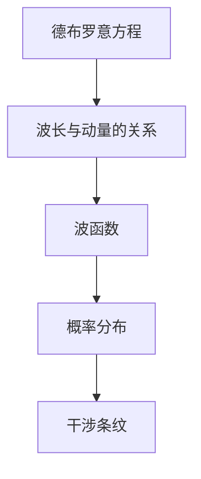
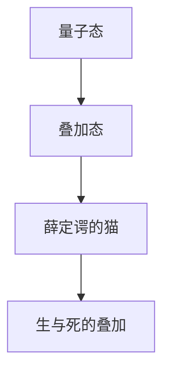
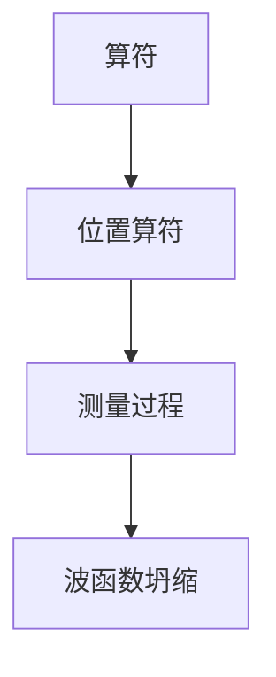

                 

### 引言

宇宙中，有一种神秘而强大而又未被完全揭示的联系，它超越了传统的时空观念，揭示了物质和能量之间深层次的互动。这种联系便是量子纠缠网络。量子纠缠是一种非局域性现象，它使得两个或多个粒子之间即便相隔遥远，也能瞬时地相互影响。这种现象不仅颠覆了经典物理学的观念，也为现代科学技术的发展带来了前所未有的机遇和挑战。

本文旨在深入探讨量子纠缠网络的基础理论、实现与应用，以及未来的发展趋势。我们将通过以下几个部分来逐步展开：

1. **量子纠缠网络基础理论**：首先，我们将介绍量子力学的基本概念，包括波粒二象性、量子态以及算符与测量。接着，我们将详细讨论量子纠缠现象，包括纠缠态的生成、纠缠度的量化以及纠缠的传递与破坏。

2. **量子计算与量子纠缠**：在这一部分，我们将深入探讨量子计算的基本原理，包括量子比特、量子逻辑门以及量子算法。随后，我们将介绍量子纠缠在网络中的应用，如量子隐形传态、量子密钥分发和量子纠错。

3. **量子纠缠网络实现与应用**：我们将详细讨论量子纠缠网络的搭建，包括基本结构、搭建步骤以及应用实例。这里将涵盖量子加密通信、量子计算应用等具体实例。

4. **量子纠缠网络未来发展趋势**：我们将分析量子纠缠网络技术面临的挑战，如量子纠缠生成与传输、量子计算错误率以及量子网络可扩展性。同时，我们将展望量子纠缠网络在量子互联网、量子物联网以及量子计算商业应用中的前景。

5. **综合案例与实战**：我们将通过具体的案例分析和实战开发，展示量子纠缠网络在实际应用中的实现过程和技术难点。

最后，本文将附上相关资源和参考文献，以供读者进一步学习和研究。

通过本文的阅读，您将不仅对量子纠缠网络有一个全面而深入的理解，还将了解这一领域的最新研究进展和未来发展方向。让我们开始这段探索之旅，一同揭开量子纠缠网络的神秘面纱。

### 目录大纲

在本章中，我们将为您详细列出本文的目录大纲，帮助您更好地了解文章的结构和内容安排。

#### 第一部分：量子纠缠网络基础理论

**第1章：量子力学基础**

- **1.1 量子力学基本概念**
  - **1.1.1 波粒二象性**
  - **1.1.2 量子态**
  - **1.1.3 算符与测量**

- **1.2 量子纠缠现象**
  - **1.2.1 纠缠态的生成**
  - **1.2.2 纠缠度的量化**
  - **1.2.3 纠缠的传递与破坏**

**第2章：量子计算与量子纠缠**

- **2.1 量子计算原理**
  - **2.1.1 量子比特**
  - **2.1.2 量子逻辑门**
  - **2.1.3 量子算法**

- **2.2 量子纠缠在网络中的应用**
  - **2.2.1 量子隐形传态**
  - **2.2.2 量子密钥分发**
  - **2.2.3 量子纠错**

#### 第二部分：量子纠缠网络实现与应用

**第3章：量子纠缠网络搭建**

- **3.1 量子纠缠网络基本结构**
  - **3.1.1 量子通信网络**
  - **3.1.2 量子计算网络**
  - **3.1.3 量子传感网络**

- **3.2 量子纠缠网络搭建步骤**
  - **3.2.1 设备选择与集成**
  - **3.2.2 量子态生成与控制**
  - **3.2.3 量子纠缠的传递与维护**

**第4章：量子纠缠网络应用实例**

- **4.1 量子加密通信**
  - **4.1.1 量子加密原理**
  - **4.1.2 量子密钥分发实例**
  - **4.1.3 量子加密通信案例分析**

- **4.2 量子计算应用**
  - **4.2.1 量子算法实例**
  - **4.2.2 量子优化应用**
  - **4.2.3 量子模拟应用**

**第5章：量子纠缠网络未来发展趋势**

- **5.1 量子纠缠网络技术挑战**
  - **5.1.1 量子纠缠生成与传输**
  - **5.1.2 量子计算错误率**
  - **5.1.3 量子网络可扩展性**

- **5.2 量子纠缠网络应用前景**
  - **5.2.1 量子互联网**
  - **5.2.2 量子物联网**
  - **5.2.3 量子计算商业应用**

#### 第三部分：综合案例与实战

**第6章：量子纠缠网络综合案例分析**

- **6.1 案例介绍**
  - **6.1.1 案例背景**
  - **6.1.2 案例目标**
  - **6.1.3 案例实现过程**

- **6.2 案例分析与总结**
  - **6.2.1 案例中应用的量子纠缠技术**
  - **6.2.2 案例中的技术难点与解决方案**
  - **6.2.3 案例的实际应用效果**

**第7章：量子纠缠网络开发实战**

- **7.1 实战环境搭建**
  - **7.1.1 硬件设备选择**
  - **7.1.2 软件工具配置**

- **7.2 实战项目开发**
  - **7.2.1 项目需求分析**
  - **7.2.2 项目实施与调试**
  - **7.2.3 项目效果评估**

#### 附录

- **附录A：量子纠缠网络相关资源**

  - **A.1 量子纠缠网络研究机构**
  - **A.2 量子纠缠网络开源工具**
  - **A.3 量子纠缠网络相关论文**

通过这个详细的目录大纲，您可以对文章的内容有一个清晰的认识，从而更好地把握文章的主旨和逻辑结构。接下来，我们将逐一深入探讨每一个章节，让您对量子纠缠网络有一个全面而深入的了解。

### 第一部分：量子纠缠网络基础理论

量子纠缠网络作为现代物理学和信息技术的前沿领域，其基础理论至关重要。这一部分将分为两章，首先介绍量子力学的基本概念，然后详细探讨量子纠缠现象，包括纠缠态的生成、纠缠度的量化以及纠缠的传递与破坏。通过这两章的讨论，我们将为您奠定理解量子纠缠网络的理论基础。

#### 第1章：量子力学基础

量子力学是研究微观世界的物理学分支，它揭示了物质和能量在微观尺度上的行为规律。量子力学的基本概念包括波粒二象性、量子态以及算符与测量。这些概念构成了量子纠缠网络的基础，因此，我们首先来深入探讨这些基本概念。

##### 1.1 量子力学基本概念

###### 1.1.1 波粒二象性

波粒二象性是量子力学最核心的概念之一。根据这一概念，微观粒子如电子、光子等既具有波动性质，又具有粒子性质。这一观点最早由法国物理学家路易·德布罗意提出。德布罗意认为，每个粒子都可以对应一个波函数，波函数的平方代表了粒子在空间中出现的概率。

为了更直观地理解波粒二象性，我们可以通过一个经典的实验——双缝实验来说明。在双缝实验中，一束光或电子通过两个并排的狭缝后，会在屏幕上形成干涉条纹。这个实验表明，光或电子在通过狭缝时，不仅以粒子的形式通过，而且还以波的形式相互干涉。

波粒二象性的数学描述可以通过德布罗意方程和波函数来给出。德布罗意方程是：

\[ \lambda = \frac{h}{p} \]

其中，\( \lambda \) 是波长，\( h \) 是普朗克常数，\( p \) 是粒子的动量。波函数 \( \psi \) 描述了粒子在空间中的概率分布，其模平方 \( |\psi|^2 \) 表示粒子在某一位置出现的概率。

###### 1.1.2 量子态

量子态是量子力学中描述粒子状态的数学函数。一个量子态可以用波函数 \( \psi \) 来表示。波函数包含了所有可能的信息，如粒子的位置、动量、自旋等。量子态可以处于叠加态，这意味着它同时存在于多个状态之中，直到被测量时才会坍缩为某个特定的状态。

量子态的叠加可以表示为：

\[ \psi = \sum_{i} c_i \psi_i \]

其中，\( c_i \) 是复数系数，\( \psi_i \) 是各个可能状态的波函数。一个简单的例子是薛定谔的猫，它同时处于生和死的叠加态，直到被观测时才会决定其状态。

###### 1.1.3 算符与测量

在量子力学中，算符用于描述对量子态的变换。例如，位置算符 \( \hat{x} \) 用于测量粒子的位置，动量算符 \( \hat{p} \) 用于测量粒子的动量。一个量子态在测量前处于某种叠加态，测量时会发生波函数的坍缩，粒子会以某个特定的概率出现在某个位置或具有某个动量。

测量过程的数学描述可以通过算符的共轭转置来给出。例如，位置测量可以通过以下算符来表示：

\[ \langle x | \hat{x} | \psi \rangle \]

其中，\( | x \rangle \) 是位置基矢量，\( \hat{x} \) 是位置算符，\( | \psi \rangle \) 是量子态。

##### 1.2 量子纠缠现象

量子纠缠是量子力学中一种特殊的量子关联现象，它描述了两个或多个粒子之间即

