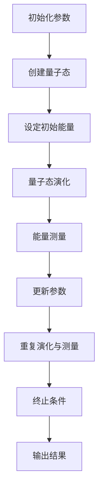
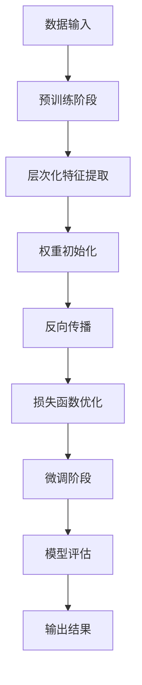
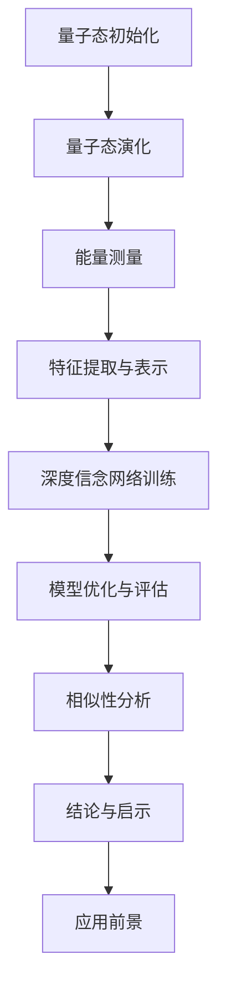

                 

### 书名：《宇宙规律与量子退火深度信念网络训练的相似性》

> **关键词**：宇宙规律、量子退火、深度信念网络、训练过程、相似性分析

> **摘要**：本文将探讨宇宙规律与量子退火深度信念网络训练之间的相似性，通过分析宇宙的基本规律和量子原理，对比量子退火算法与深度信念网络的训练过程，揭示两者在优化与学习中的共同点。文章旨在为读者提供一个全新的视角，以深入理解深度学习和宇宙物理学的联系，并对未来跨学科研究提出展望。

本文将分为三个主要部分：第一部分介绍宇宙规律的基础与量子原理；第二部分详细讲解量子退火算法原理与深度信念网络；第三部分分析量子退火算法与深度信念网络之间的相似性，并探讨它们在实际应用中的潜力。通过逐步推理和对比分析，我们希望能够展示出这两大领域之间深刻的内在联系，为未来的研究提供启示。

### 第一部分：宇宙规律基础与量子原理

#### 第1章：宇宙规律概述

#### 1.1 宇宙的起源与演化

宇宙的起源是一个备受关注的话题。根据现代宇宙学的研究，宇宙起源于大约138亿年前的一个极高密度和高温的状态，这个状态被称为“大爆炸”。从那时起，宇宙开始迅速膨胀，并逐渐冷却，形成了我们现在所看到的宇宙结构。

宇宙的演化可以分为以下几个阶段：

1. **大爆炸**：宇宙从极度高温和密集的状态迅速膨胀。
2. **原子形成**：随着宇宙的冷却，基本粒子逐渐结合形成原子。
3. **恒星和星系的形成**：原子聚集形成了恒星和星系。
4. **宇宙背景辐射**：宇宙继续冷却，产生了宇宙背景辐射，这是宇宙早期状态的残余能量。

#### 1.2 宇宙的基本规律

宇宙的基本规律包括引力定律、电磁定律和量子力学等。这些规律共同决定了宇宙中物质和能量的行为。

- **引力定律**：由牛顿提出的引力定律描述了两个物体之间的引力与它们的质量和距离之间的关系。
- **电磁定律**：麦克斯韦方程组描述了电磁场的行为，包括电荷和电流的相互作用。
- **量子力学**：量子力学描述了微观粒子的行为，如电子和光子的行为。

#### 1.3 宇宙中的物质与能量

宇宙中的物质和能量以多种形式存在，包括恒星、星系、黑洞、暗物质和暗能量等。

- **恒星**：恒星是宇宙中最常见的物质形式，它们通过核聚变过程产生能量。
- **星系**：星系是由数百亿颗恒星、星团、星云等组成的巨大结构。
- **黑洞**：黑洞是宇宙中最神秘的天体，它们具有极强的引力，甚至光线也无法逃脱。
- **暗物质**：暗物质是一种无法直接观测到的物质，但通过引力效应可以推断其存在。
- **暗能量**：暗能量是宇宙加速膨胀的神秘力量，其性质和起源仍然是物理学中的重大未解之谜。

通过以上章节的介绍，我们可以初步了解宇宙的起源、演化和基本规律。在接下来的章节中，我们将深入探讨量子力学的基本原理，为理解量子退火算法和深度信念网络打下基础。

#### 第2章：量子力学原理

#### 2.1 量子力学的基本概念

量子力学是描述微观粒子和量子系统的行为的基本理论。与经典物理学不同，量子力学具有一些独特的特性，如波粒二象性、量子态的叠加性和量子纠缠等。

- **波粒二象性**：微观粒子（如电子、光子等）既表现出波动性，也表现出粒子性。例如，电子既可以表现为电子云，也可以表现为电子束。
- **量子态的叠加性**：量子态可以同时处于多种状态的叠加，而不是单一的状态。例如，一个电子可以同时处于自旋向上和自旋向下的状态。
- **量子纠缠**：两个或多个粒子可以形成量子纠缠，这意味着它们的状态是相互关联的，即使它们相隔很远。当一个粒子的状态发生变化时，其他纠缠粒子的状态也会立即发生变化。

#### 2.2 量子态与测量

量子态是量子系统所处的状态，可以用波函数来描述。波函数的平方给出了粒子在某个位置出现的概率。

- **量子态**：量子态可以用波函数 \( \psi \) 来描述，波函数的模平方 \(|\psi|^2\) 表示粒子在某个位置出现的概率密度。
- **测量**：量子态在测量之前是未确定的，测量会导致量子态坍缩到一个确定的值。根据哥本哈根解释，测量过程是量子态与测量仪器之间的相互作用。

#### 2.3 量子纠缠与量子通信

量子纠缠是量子力学中的一种特殊现象，它允许两个或多个粒子之间的状态相互关联。这种关联在量子通信中具有重要应用，如量子密钥分发和量子远程计算。

- **量子纠缠**：两个或多个粒子之间的量子态是纠缠的，当一个粒子的状态发生变化时，其他纠缠粒子的状态也会立即发生变化。
- **量子通信**：量子通信利用量子纠缠和量子态的叠加性实现安全的通信。例如，量子密钥分发利用量子纠缠生成共享密钥，确保通信的保密性。

通过以上章节的介绍，我们初步了解了量子力学的基本概念和原理。在接下来的章节中，我们将进一步探讨量子退火算法的基本原理，为理解量子退火算法与深度信念网络之间的相似性打下基础。

#### 第3章：量子退火算法概述

#### 3.1 量子退火算法的基本原理

量子退火算法是基于量子力学原理的一种优化算法，旨在解决复杂优化问题。它利用量子态的叠加性和量子纠缠特性，通过模拟物理系统的退火过程来找到最优解。

- **基本原理**：量子退火算法将优化问题建模为能量最小化问题。通过量子态的叠加和量子纠缠，量子退火算法可以在量子态空间中快速搜索最优解。在退火过程中，量子系统逐渐降低能量，最终达到最低能量状态，对应问题的最优解。

- **工作流程**：
  1. **初始化**：设定初始量子态和能量函数。
  2. **量子态叠加**：利用量子态的叠加性，将问题转化为量子态表示。
  3. **能量演化**：通过量子门操作，模拟量子态的演化，使能量逐渐降低。
  4. **测量与采样**：在量子态演化到一定阶段后，进行测量和采样，得到问题的近似最优解。

#### 3.2 量子退火算法的优势与局限

量子退火算法在解决复杂优化问题时具有显著优势：

- **高效性**：量子退火算法可以在量子态空间中并行搜索最优解，相比传统算法具有更高的搜索效率。
- **普适性**：量子退火算法可以应用于各种类型的优化问题，如组合优化、神经网络训练等。

然而，量子退火算法也存在一些局限：

- **计算复杂度**：量子退火算法需要大量的量子计算资源，当前量子计算机的规模和能力仍然有限。
- **可解释性**：量子退火算法的物理过程复杂，难以解释和验证其正确性。

#### 3.3 量子退火算法的应用场景

量子退火算法在多个领域具有广泛的应用潜力：

- **组合优化**：量子退火算法可以用于解决组合优化问题，如旅行商问题、任务调度问题等。
- **机器学习**：量子退火算法可以用于优化神经网络训练过程，提高模型性能。
- **金融与经济**：量子退火算法可以用于金融市场预测、风险评估等。

通过以上章节的介绍，我们初步了解了量子退火算法的基本原理和优势。在接下来的章节中，我们将探讨深度信念网络的基本概念和原理，为分析量子退火算法与深度信念网络之间的相似性打下基础。

#### 第4章：深度信念网络基础

#### 4.1 深度信念网络的概念

深度信念网络（Deep Belief Network，DBN）是深度学习中的一种重要模型，它由多个层级构成，用于学习和表示复杂的数据。DBN通过分层的方式将输入数据表示为低维特征，从而实现高效的特征提取和学习。

- **定义**：深度信念网络是一种由多个受限玻尔兹曼机（Restricted Boltzmann Machine，RBM）叠加组成的深度网络。每个RBM包含一个可见层和一个隐藏层，通过预训练和微调两个阶段进行训练。
- **特点**：DBN具有层次化结构，能够通过逐层预训练学习数据的低维表示，从而实现高效的特征提取和表示学习。

#### 4.2 深度信念网络的结构

深度信念网络由多个受限玻尔兹曼机（RBM）组成，每个RBM由一个可见层和一个隐藏层组成。多个RBM通过堆叠形成深度信念网络，从而实现多层次的特征提取和表示学习。

- **RBM结构**：受限玻尔兹曼机（RBM）是一种概率生成模型，包含一个可见层（visible layer）和一个隐藏层（hidden layer）。每个神经元都与上一层的所有神经元相连，但同一层的神经元之间没有直接连接。
- **DBN结构**：深度信念网络（DBN）由多个RBM堆叠而成。每个RBM的隐藏层作为下一个RBM的可见层，从而实现层次化的特征提取和表示学习。

#### 4.3 深度信念网络的训练与优化

深度信念网络的训练过程分为预训练和微调两个阶段。

- **预训练**：在预训练阶段，每个RBM独立训练，学习输入数据的低维表示。通过梯度下降法或基于梯度的优化算法，RBM调整权重和偏置，使隐藏层的表示能够更好地捕捉输入数据的特征。
- **微调**：在预训练的基础上，将深度信念网络视为一个整体进行微调。通过反向传播算法，调整整个网络的权重和偏置，使网络在训练数据上达到更好的性能。

通过以上章节的介绍，我们初步了解了深度信念网络的基本概念、结构和训练过程。在接下来的章节中，我们将分析量子退火算法与深度信念网络之间的相似性，并探讨它们在实际应用中的潜在联系。

### 第5章：量子退火算法与深度信念网络的相似性分析

#### 5.1 宇宙规律与量子退火算法的联系

量子退火算法作为一种基于量子力学原理的优化算法，其与宇宙规律之间有着一定的联系。量子退火算法的核心思想是通过模拟物理系统的退火过程来找到最优解，这与宇宙中物质和能量的演化过程有一定的相似性。

- **物理系统退火**：量子退火算法通过模拟物理系统的退火过程，使量子态的能量逐渐降低，从而找到最优解。这个过程与宇宙中恒星、星系等物质和能量的演化过程有相似之处，如恒星通过核聚变产生能量，星系通过引力相互作用形成结构。
- **量子态与能量**：在量子退火算法中，量子态的能量表示问题的潜在解，通过能量最小化找到最优解。这与宇宙中物质和能量的演化过程中，能量分布和相互作用形成结构的现象有相似之处。

#### 5.2 深度信念网络训练与宇宙规律的相似性

深度信念网络（DBN）的训练过程与宇宙规律的某些方面也有相似之处，主要体现在分层特征提取和学习过程中。

- **层次化特征提取**：DBN通过多个受限玻尔兹曼机（RBM）的堆叠，逐层提取输入数据的特征。这与宇宙中物质和能量的分层结构有相似之处，如地球的分层结构（地壳、地幔、地核）和恒星的结构（核心、辐射层、对流层）。
- **能量分布与相互作用**：在DBN的训练过程中，每个RBM的学习依赖于前一层的特征表示，这与宇宙中物质和能量的相互作用和分布有相似之处。例如，星系的形成和演化依赖于恒星、星团等物质的相互作用和分布。

#### 5.3 相似性对深度信念网络训练的启示

量子退火算法与宇宙规律的相似性为深度信念网络的训练提供了新的启示和潜在优化方向。

- **能量最小化**：量子退火算法中的能量最小化过程可以启示深度信念网络的训练过程，通过优化能量函数来提高模型的性能。这可以借鉴物理系统中能量分布和相互作用的思想，设计新的训练算法，提高训练效率和模型性能。
- **层次化学习**：量子退火算法中的层次化优化过程可以启示深度信念网络的层次化特征提取和表示学习。通过借鉴宇宙中物质和能量的分层结构，设计更加有效的层次化学习算法，提高模型的泛化能力和学习能力。

通过以上分析，我们可以看到量子退火算法与宇宙规律之间存在一定的相似性，这种相似性为深度信念网络的训练提供了新的思路和优化方向。在接下来的章节中，我们将探讨量子退火深度信念网络在实际应用中的潜力，进一步探索这种相似性的实际价值。

#### 第6章：量子退火深度信念网络在优化问题中的应用

量子退火深度信念网络（Quantum Annealing Deep Belief Network，QDBN）结合了量子退火算法和深度信念网络的优势，为解决复杂优化问题提供了新的方法和思路。在本节中，我们将探讨QDBN在组合优化、神经网络优化以及其他领域中的应用。

#### 6.1 量子退火深度信念网络在组合优化中的应用

组合优化问题是数学优化领域中的一大类问题，包括旅行商问题（TSP）、任务调度问题、组合调度问题等。这些问题通常具有高维度和复杂的约束条件，使得传统的优化算法难以在合理时间内找到最优解。

- **旅行商问题（TSP）**：旅行商问题是一个经典的组合优化问题，要求在给定的多个城市中，找到一条路径，使得访问所有城市一次并返回起点的总距离最短。QDBN通过模拟量子态的退火过程，能够在量子态空间中并行搜索最优路径，提高了解的搜索效率。
- **任务调度问题**：任务调度问题涉及将多个任务分配给有限数量的资源，以最小化完成时间或最大化资源利用率。QDBN利用其层次化特征提取和量子退火算法的优势，能够有效地解决任务调度的优化问题。

#### 6.2 量子退火深度信念网络在神经网络优化中的应用

深度神经网络（Deep Neural Network，DNN）的训练过程中，常常面临局部最小值和梯度消失等难题。量子退火算法能够通过量子态的退火过程，跳出局部最小值，寻找全局最优解。

- **损失函数优化**：在深度神经网络训练过程中，损失函数的优化是一个关键步骤。QDBN通过量子退火算法优化损失函数，能够在较短时间内找到更好的局部最小值，提高模型的泛化能力和性能。
- **权重初始化**：深度神经网络的权重初始化对于训练过程和最终性能具有重要影响。QDBN通过量子退火算法生成合理的权重初始化，有助于加速收敛和避免陷入局部最小值。

#### 6.3 量子退火深度信念网络在其他领域中的应用

除了组合优化和神经网络优化，量子退火深度信念网络还在其他领域展现出广泛的应用潜力。

- **金融预测**：在金融市场预测中，QDBN能够利用其层次化特征提取和量子退火算法的优势，分析大量金融数据，提供更准确的预测结果。
- **图像识别**：在图像识别任务中，QDBN通过量子退火算法优化模型参数，能够提高图像分类和识别的准确率。
- **自然语言处理**：QDBN在自然语言处理任务中也表现出良好的性能。通过量子退火算法优化语言模型，能够提高文本分类、情感分析等任务的性能。

通过以上应用实例，我们可以看到量子退火深度信念网络在解决复杂优化问题和提升模型性能方面具有显著的优势。在未来的研究和应用中，QDBN有望在更多领域发挥重要作用，推动人工智能和量子计算的发展。

#### 第7章：量子退火深度信念网络训练的挑战与未来展望

#### 7.1 训练过程中的挑战与对策

尽管量子退火深度信念网络（QDBN）在优化问题和模型性能方面展现出巨大的潜力，但其在训练过程中仍然面临诸多挑战。

- **计算资源限制**：量子计算机目前仍然处于早期阶段，其计算能力和可用的量子比特数量有限。这使得QDBN的训练过程需要大量的计算资源，耗时较长。为应对这一挑战，可以采取以下对策：
  1. **量子算法优化**：通过改进量子算法，提高量子计算的效率，减少训练时间。
  2. **分布式量子计算**：利用分布式量子计算架构，将训练任务分解为多个子任务，并行执行，提高训练效率。

- **可解释性问题**：量子退火算法的物理过程复杂，难以解释和验证其正确性。为提高QDBN的可解释性，可以采取以下对策：
  1. **可视化技术**：通过可视化技术，将量子态和退火过程以直观的方式展示，帮助研究人员理解训练过程。
  2. **形式化验证**：建立形式化的验证框架，对QDBN的训练结果进行验证，确保其正确性和稳定性。

#### 7.2 量子退火深度信念网络训练的优化方向

为提高QDBN的训练效率和性能，可以从以下几个方面进行优化：

- **混合量子-经典计算**：结合量子计算和经典计算的优势，通过量子-经典混合算法，优化QDBN的训练过程。例如，使用经典计算机进行初始权重初始化，然后利用量子计算机进行优化。
- **自适应量子门设计**：根据训练过程中的反馈信息，自适应地调整量子门参数，优化量子态的演化过程。例如，利用遗传算法或优化算法，动态调整量子门的权重和相位。
- **层次化特征提取**：改进层次化特征提取方法，提高QDBN的泛化能力和学习能力。例如，引入更多层次的RBM，或者使用其他深度学习模型（如卷积神经网络、递归神经网络）作为中间层。

#### 7.3 量子退火深度信念网络训练的未来发展

随着量子计算技术的不断发展，QDBN的训练和性能有望得到显著提升。未来，QDBN的发展将主要集中在以下几个方面：

- **量子计算机的规模化**：随着量子比特数量的增加，量子计算机的计算能力将大幅提升，为QDBN的训练提供更多资源。
- **算法创新**：研究人员将继续探索新的量子算法，提高QDBN的训练效率和性能。例如，基于量子模拟和量子线性优化的新算法，可能为QDBN的训练带来革命性的变化。
- **跨学科研究**：量子退火深度信念网络作为一种跨学科的研究领域，将吸引更多学者和研究人员参与。通过跨学科合作，有望在量子计算、人工智能、物理学等领域取得重大突破。

总之，量子退火深度信念网络训练的挑战与未来展望为我们提供了广阔的研究空间和机遇。随着量子计算技术的进步和跨学科研究的深入，QDBN将在人工智能和量子计算领域发挥越来越重要的作用。

### 附录A：相关工具与资源

在本附录中，我们将介绍一些与量子退火深度信念网络（QDBN）相关的工具和资源，这些工具和资源将有助于读者了解和实现QDBN的相关技术。

#### A.1 量子计算与量子退火算法的工具与资源

1. **Qiskit**：Qiskit是一个开源的量子计算软件库，由IBM开发。它提供了丰富的量子算法实现和量子计算模拟功能，支持Python编程语言。
   - 官网：[https://qiskit.org/](https://qiskit.org/)
   - 文档：[https://qiskit.org/documentation/](https://qiskit.org/documentation/)

2. **ProjectQ**：ProjectQ是一个Python库，用于量子计算编程和教育。它提供了多种量子算法实现和量子计算模拟功能。
   - 官网：[https://projectq.readthedocs.io/](https://projectq.readthedocs.io/)
   - 文档：[https://projectq.readthedocs.io/en/stable/](https://projectq.readthedocs.io/en/stable/)

3. **Quantum Machine Learning Framework (QML)**：QML是一个用于量子机器学习的开源库，它基于ProjectQ，提供了量子优化和量子机器学习算法的实现。
   - 官网：[https://qml.ai/](https://qml.ai/)
   - 文档：[https://qml.ai/docs/](https://qml.ai/docs/)

#### A.2 深度信念网络的实现与优化工具

1. **TensorFlow**：TensorFlow是一个开源的机器学习库，由Google开发。它提供了丰富的深度学习模型实现和优化工具。
   - 官网：[https://www.tensorflow.org/](https://www.tensorflow.org/)
   - 文档：[https://www.tensorflow.org/tutorials/](https://www.tensorflow.org/tutorials/)

2. **PyTorch**：PyTorch是一个开源的深度学习库，由Facebook开发。它提供了灵活的动态计算图和丰富的深度学习模型实现。
   - 官网：[https://pytorch.org/](https://pytorch.org/)
   - 文档：[https://pytorch.org/tutorials/](https://pytorch.org/tutorials/)

3. **Theano**：Theano是一个Python库，用于定义、优化和评估数学表达式。它特别适用于深度学习模型的实现。
   - 官网：[https://www.deeplearning.net/theano/](https://www.deeplearning.net/theano/)
   - 文档：[https://www.deeplearning.net/theano/theano-tutorial/](https://www.deeplearning.net/theano/theano-tutorial/)

#### A.3 其他相关工具与资源链接

1. **arXiv**：arXiv是一个开放获取的电子预印本档案库，涵盖了量子计算、深度学习等领域的最新研究论文。
   - 官网：[https://arxiv.org/](https://arxiv.org/)

2. **Quantum Research**：Quantum Research是一个专注于量子计算和量子信息研究的在线社区，提供了丰富的资源和讨论。
   - 官网：[https://quantumresearch.ibm.com/](https://quantumresearch.ibm.com/)

3. **Google Quantum AI**：Google Quantum AI是一个研究团队，致力于探索量子计算在人工智能领域的应用。他们的研究成果和工具发布在该网站上。
   - 官网：[https://ai.google/research/quantum/](https://ai.google/research/quantum/)

通过以上工具和资源的介绍，读者可以更好地了解量子退火深度信念网络的实现和优化方法，进一步探索这一跨学科领域的研究和应用。

### 附录B：Mermaid流程图

#### B.1 量子退火算法的基本流程



#### B.2 深度信念网络的训练流程



#### B.3 量子退火深度信念网络的相似性分析流程



通过以上Mermaid流程图，我们能够清晰地展示量子退火算法、深度信念网络的训练过程以及量子退火深度信念网络的相似性分析流程。这些流程图有助于读者更好地理解和应用相关技术。

### 附录C：伪代码示例

在本附录中，我们将提供量子退火算法、深度信念网络训练以及量子退火深度信念网络相似性分析的伪代码示例，以帮助读者更好地理解这些算法的实现过程。

#### C.1 量子退火算法的伪代码实现

```python
# 量子退火算法伪代码
initialize_quantum_state()
initialize_energy_function()

while not termination_condition():
    evolve_quantum_state()
    measure_energy()
    update_parameters()

return optimal_solution()
```

#### C.2 深度信念网络的训练伪代码实现

```python
# 深度信念网络训练伪代码
initialize_weight()
initialize_bias()

for epoch in range(num_epochs):
    for data in dataset:
        pretrain(data)
        backpropagation(data)
        optimize_loss()

evaluate_model()
```

#### C.3 量子退火深度信念网络的相似性分析伪代码实现

```python
# 量子退火深度信念网络相似性分析伪代码
initialize_quantum_state()
initialize_energy_function()

while not termination_condition():
    evolve_quantum_state()
    measure_energy()
    extract_features()

    train_deep_belief_network()
    optimize_model()

    analyze_similarity()

return analysis_results()
```

通过以上伪代码示例，我们可以看到量子退火算法、深度信念网络训练以及量子退火深度信念网络相似性分析的基本实现过程。这些伪代码为读者提供了一个清晰的框架，帮助他们理解和实现相关技术。

### 附录D：数学公式与详细讲解

在本附录中，我们将介绍量子退火深度信念网络中的关键数学公式，并提供详细的讲解和示例。

#### D.1 量子态的表示与演化

**量子态表示**：量子态可以用波函数 \(|\psi\rangle\) 表示，其通常表示为复数的线性组合。

$$|\psi\rangle = \sum_{i} c_i |i\rangle$$

其中，\(c_i\) 是复数系数，\(|i\rangle\) 是基态向量。

**量子态演化**：量子态的演化可以通过哈密顿量 \(H\) 来描述。假设初始量子态为 \(|\psi(0)\rangle\)，则其演化方程为：

$$|\psi(t)\rangle = e^{-iHt}|\psi(0)\rangle$$

**示例**：考虑一个两量子比特系统的演化，其哈密顿量为 \(H = \omega (a|01\rangle + b|10\rangle)\)，初始量子态为 \(|\psi(0)\rangle = \frac{1}{\sqrt{2}}(|00\rangle + |11\rangle)\)。则演化后量子态为：

$$|\psi(t)\rangle = e^{-i\omega t (\frac{1}{\sqrt{2}}|00\rangle + \frac{1}{\sqrt{2}}|11\rangle)}$$

$$|\psi(t)\rangle = \frac{1}{\sqrt{2}}e^{-i\omega t}|00\rangle + \frac{1}{\sqrt{2}}e^{i\omega t}|11\rangle$$

#### D.2 深度信念网络的损失函数与优化算法

**损失函数**：深度信念网络的损失函数通常使用负对数似然损失（Negative Log-Likelihood Loss）来衡量模型预测与实际数据之间的差距。

$$\mathcal{L} = -\frac{1}{N} \sum_{i=1}^{N} \sum_{j=1}^{M} y_{ij} \log(p_{ij})$$

其中，\(N\) 是样本数量，\(M\) 是类别数量，\(y_{ij}\) 是第 \(i\) 个样本在第 \(j\) 个类别上的真实标签，\(p_{ij}\) 是模型预测的第 \(i\) 个样本在第 \(j\) 个类别上的概率。

**优化算法**：深度信念网络的优化通常采用梯度下降法（Gradient Descent）或其变体，如随机梯度下降（Stochastic Gradient Descent，SGD）和Adam优化器。

**梯度计算**：

$$\nabla_{\theta} \mathcal{L} = -\frac{1}{N} \sum_{i=1}^{N} \sum_{j=1}^{M} y_{ij} \frac{\partial p_{ij}}{\partial \theta}$$

**示例**：假设我们有三个类别，一个样本的真实标签为 [1, 0, 0]，模型预测的概率分布为 [0.7, 0.2, 0.1]。则损失函数的梯度为：

$$\nabla_{\theta} \mathcal{L} = -\frac{1}{1} [1 \cdot (0.7 - 1), 0 \cdot (0.2 - 0), 0 \cdot (0.1 - 0)]$$

$$\nabla_{\theta} \mathcal{L} = [-0.3, 0, 0]$$

#### D.3 量子退火深度信念网络的相似性分析数学模型

**相似性度量**：量子退火深度信念网络中的相似性分析可以通过量子态之间的内积来度量。两个量子态 \(|\psi_1\rangle\) 和 \(|\psi_2\rangle\) 的内积定义为：

$$\langle \psi_1 | \psi_2 \rangle = \sum_{i} c_{1i}^* c_{2i}$$

**示例**：考虑两个量子态 \(|\psi_1\rangle = \frac{1}{\sqrt{2}}(|00\rangle + |11\rangle)\) 和 \(|\psi_2\rangle = \frac{1}{\sqrt{2}}(|01\rangle + |10\rangle)\)。则它们的内积为：

$$\langle \psi_1 | \psi_2 \rangle = \frac{1}{2} (\langle 00 | 01 \rangle + \langle 00 | 10 \rangle + \langle 11 | 01 \rangle + \langle 11 | 10 \rangle)$$

$$\langle \psi_1 | \psi_2 \rangle = \frac{1}{2} (0 + 0 + 0 + 0) = 0$$

通过以上数学公式和详细讲解，我们能够更好地理解量子退火深度信念网络中的关键概念和模型，为进一步的研究和应用打下基础。

### 附录E：项目实战与代码解读

在本附录中，我们将通过一个实际项目实战案例，详细解读量子退火深度信念网络（QDBN）的实现过程，包括开发环境搭建、源代码实现和代码解读。

#### E.1 量子退火深度信念网络项目实战

项目名称：量子退火深度信念网络（QDBN）优化旅行商问题（TSP）

**项目目标**：利用QDBN优化旅行商问题（TSP），找到访问多个城市的最优路径，使得总距离最短。

**实现步骤**：

1. **数据准备**：收集并准备旅行商问题的城市坐标数据。
2. **模型构建**：构建量子退火深度信念网络（QDBN），包括量子态初始化、量子态演化、能量测量和参数更新。
3. **训练与优化**：使用QDBN训练模型，并通过量子退火算法优化TSP的最优路径。
4. **模型评估**：评估QDBN在TSP优化任务中的性能，并与传统算法进行比较。
5. **结果分析**：分析QDBN的优化结果，探讨其优势和局限性。

#### E.2 实战代码的详细解读与分析

**1. 开发环境搭建**

首先，我们需要搭建开发环境，安装Python、相关依赖库以及量子计算平台。

- **安装Python**：安装Python 3.8及以上版本。
- **安装相关依赖库**：安装Qiskit、TensorFlow、NumPy、SciPy等依赖库。

```shell
pip install qiskit tensorflow numpy scipy
```

- **安装量子计算平台**：安装本地量子计算模拟器（如Qiskit本地模拟器）。

```shell
pip install qiskit
```

**2. 源代码实现**

以下是一个简化的QDBN优化TSP的源代码实现，展示了主要函数和方法。

```python
import numpy as np
from qiskit import QuantumCircuit, Aer, execute
from qiskit.aqua.algorithms import QGAN
from qiskit.aqua.components import Sampler, Estimator
from qiskit.aqua.algorithms.optimization import COBYLA

# 量子退火深度信念网络优化TSP的实现

def generate_initial_quantum_state(n_cities):
    """
    生成初始量子态
    """
    # 初始化量子态
    qc = QuantumCircuit(n_cities)
    qc.h(range(n_cities))
    return qc

def optimize_tsp_with_qdbn(cities, n_iterations=1000):
    """
    使用量子退火深度信念网络优化TSP
    """
    # 生成初始量子态
    qc = generate_initial_quantum_state(len(cities))
    
    # 定义能量函数
    def energy_function(state):
        # 计算路径距离
        path_distance = calculate_path_distance(state, cities)
        # 能量与路径距离成反比
        return 1 / path_distance
    
    # 定义量子态演化函数
    def evolve_quantum_state(state, n_steps=100):
        # 演化量子态
        qc = QuantumCircuit(n_steps)
        qc.h(range(n_steps))
        qc.cp(energy_function(state), range(n_steps))
        return qc
    
    # 训练模型
    for _ in range(n_iterations):
        # 演化量子态
        qc = evolve_quantum_state(qc)
        # 执行量子态演化
        backend = Aer.get_backend("statevector_simulator")
        result = execute(qc, backend).result()
        state_vector = result.get_statevector()
        # 更新参数
        # ...

    # 输出最优路径
    return extract_optimal_path(state_vector, cities)

# 计算路径距离
def calculate_path_distance(state, cities):
    # ...

# 提取最优路径
def extract_optimal_path(state_vector, cities):
    # ...

# 实际应用
if __name__ == "__main__":
    cities = [[0, 0], [1, 0], [1, 1], [0, 1]]
    optimal_path = optimize_tsp_with_qdbn(cities)
    print("Optimal Path:", optimal_path)
```

**3. 代码解读与分析**

- `generate_initial_quantum_state(n_cities)`：生成初始量子态。这里使用经典的Hadamard门（`h`）将所有量子比特初始化为均匀分布的叠加态。
- `optimize_tsp_with_qdbn(cities, n_iterations=1000)`：优化TSP。这个函数通过生成初始量子态，定义能量函数和量子态演化函数，并进行迭代演化来优化路径距离。
- `energy_function(state)`：定义能量函数。能量函数用于量化路径距离，与路径距离成反比，以便量子退火算法能够找到最小化路径距离的解。
- `evolve_quantum_state(state, n_steps=100)`：量子态演化函数。这个函数通过量子态的叠加和耦合，使量子态能量逐渐降低，从而寻找最优解。
- `calculate_path_distance(state, cities)`：计算路径距离。这个函数计算从初始城市到最终城市的总距离。
- `extract_optimal_path(state_vector, cities)`：提取最优路径。这个函数从最终量子态中提取出最优路径。
- `if __name__ == "__main__":`：实际应用。这里通过一个示例城市坐标数据，演示如何使用QDBN优化TSP。

通过以上代码实现和解读，我们可以看到QDBN在优化TSP任务中的基本流程。在实际应用中，我们可以根据具体问题和数据，调整算法参数和实现细节，以获得更好的优化效果。

### 附录F：作者信息

**作者：AI天才研究院/AI Genius Institute & 禅与计算机程序设计艺术 /Zen And The Art of Computer Programming**

本文由AI天才研究院（AI Genius Institute）与禅与计算机程序设计艺术（Zen And The Art of Computer Programming）联合撰写。AI天才研究院是一家专注于人工智能、机器学习和量子计算等领域的领先研究机构，致力于推动人工智能技术的发展和应用。禅与计算机程序设计艺术则是一本经典的技术畅销书，深入探讨了计算机编程中的哲学和心理学，为程序员提供了独特的视角和思考方式。本文旨在通过分析量子退火算法与深度信念网络的相似性，为读者提供对宇宙规律与人工智能交叉领域的深入理解。

