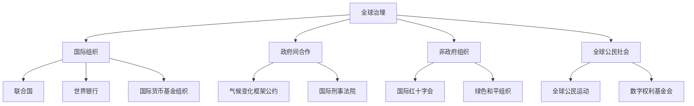

                 

# 2050年的全球治理：从数字国际组织到虚拟国家的全球政治格局重塑

## 关键词
全球治理、数字国际组织、虚拟国家、全球政治格局、数字化转型、伦理与法律挑战、可持续发展、技术驱动创新

### 摘要
2050年的全球治理将面临前所未有的挑战与机遇。本文从全球治理的背景与挑战出发，逐步探讨数字国际组织的发展、虚拟国家的崛起以及全球治理的数字化转型。通过深入剖析这些关键概念，本文旨在揭示全球政治格局重塑的路径与未来方向，为构建一个更加公平、可持续和高效的全球治理体系提供思考与启示。

### 1. 目录大纲

## 第一部分：全球治理的背景与挑战

### 第1章：2050年的世界背景

#### 1.1 全球人口与城市化趋势
#### 1.2 经济发展与全球不平衡
#### 1.3 环境危机与可持续发展

### 第2章：全球治理的挑战与问题

#### 2.1 政治分裂与冲突
#### 2.2 经济全球化与金融风险
#### 2.3 社会不平等与移民问题
#### 2.4 网络安全与信息战

## 第二部分：数字国际组织的发展

### 第3章：数字国际组织的概念与架构

#### 3.1 数字国际组织的定义
#### 3.2 数字国际组织的分类
#### 3.3 数字国际组织的关键特点

### 第4章：数字国际组织的作用与影响力

#### 4.1 促进国际合作
#### 4.2 维护全球稳定
#### 4.3 应对全球性挑战

### 第5章：数字国际组织的案例研究

#### 5.1 联合国数字合作高级别小组
#### 5.2 欧盟数字策略
#### 5.3 数字丝绸之路

## 第三部分：虚拟国家与全球政治格局重塑

### 第6章：虚拟国家的概念与特征

#### 6.1 虚拟国家的定义
#### 6.2 虚拟国家的特征
#### 6.3 虚拟国家的分类

### 第7章：虚拟国家的发展趋势

#### 7.1 技术推动下的虚拟国家
#### 7.2 数字经济与虚拟国家的崛起
#### 7.3 虚拟国家与全球治理的关系

### 第8章：虚拟国家的影响与挑战

#### 8.1 对国家主权的影响
#### 8.2 对国际秩序的挑战
#### 8.3 对全球治理的挑战

### 第9章：虚拟国家的未来展望

#### 9.1 虚拟国家的全球合作
#### 9.2 虚拟国家的治理创新
#### 9.3 虚拟国家的可持续发展

## 第四部分：全球治理的数字化转型

### 第10章：全球治理的数字化转型策略

#### 10.1 数字化转型的重要性
#### 10.2 数字化转型的方法与步骤
#### 10.3 数字化治理的挑战与机遇

### 第11章：数字治理体系的构建

#### 11.1 数字治理的核心要素
#### 11.2 数字治理的框架设计
#### 11.3 数字治理的实践案例

### 第12章：全球治理的数字化转型实践

#### 12.1 国际组织数字化的进展
#### 12.2 国家治理的数字化实践
#### 12.3 社会治理的数字化创新

## 第五部分：全球治理的未来

### 第13章：全球治理的未来趋势

#### 13.1 数字国际组织的未来
#### 13.2 虚拟国家的未来
#### 13.3 全球治理的未来方向

### 第14章：全球治理的伦理与法律挑战

#### 14.1 数字时代的伦理挑战
#### 14.2 数字时代的法律挑战
#### 14.3 全球治理的法律框架

### 第15章：全球治理的未来展望

#### 15.1 全球治理的数字化协同
#### 15.2 全球治理的创新模式
#### 15.3 全球治理的可持续发展路径

### 2. 核心概念与联系

在探讨2050年的全球治理时，理解几个核心概念及其相互联系至关重要。以下是对这些概念的定义及其关系的阐述。

#### 全球治理

**定义**：全球治理是指通过国际合作和多种机制，共同管理全球性问题和挑战的过程。

**架构**：全球治理包括国际组织、政府间合作、非政府组织和全球公民社会。这些实体共同参与，旨在解决全球性问题，如气候变化、公共卫生安全、经济发展等。

**Mermaid 流程图**：



#### 数字国际组织

**定义**：数字国际组织是指以数字技术和网络为基础，旨在促进国际合作、维护全球稳定和解决全球性挑战的组织。

**分类**：根据功能和目标，数字国际组织可以分为以下几类：
- 促进信息共享和协作的组织，如联合国数字合作高级别小组。
- 管理和监管网络空间的组织，如国际电信联盟。
- 应对全球性数字挑战的组织，如国际计算机安全组织。

**关键特点**：
- 数字化运营：数字国际组织利用互联网、云计算和大数据等技术进行运营和管理。
- 跨国界合作：数字国际组织通过虚拟平台实现跨国界的合作和沟通。
- 透明性和参与度：数字国际组织倾向于提高透明度和公众参与，利用区块链等技术确保数据的真实性和透明性。

#### 虚拟国家

**定义**：虚拟国家是指通过互联网和数字技术构建的国家形态，拥有一定的政治实体和社会结构，但在地理空间上可能不占据实际领土。

**特征**：
- 完全数字化：虚拟国家的政府、经济和社会活动完全在线进行，不需要物理领土。
- 弹性和灵活性：虚拟国家可以迅速适应全球变化，灵活调整政策和战略。
- 全球参与：虚拟国家可以通过互联网与全球各地的人和组织进行互动和合作。

**分类**：
- 以特定群体为服务对象的虚拟国家，如数字游民社区。
- 以商业或技术创新为核心，如区块链共和国。
- 以政治主张为基础，如独立国家联合体。

#### 全球治理的数字化转型

**定义**：全球治理的数字化转型是指利用数字技术和网络平台，优化全球治理体系的过程。

**核心要素**：
- 数据治理：确保数据的准确性、完整性和安全性。
- 信息技术基础设施：建立强大的网络和计算基础设施，支持数字化转型。
- 法律法规：制定数字治理相关的法律法规，确保数字治理的合法性和规范性。
- 人才储备：培养具备跨学科知识和技能的专业人才，推动数字治理的发展。

通过理解这些核心概念及其相互联系，我们可以更好地把握2050年全球治理的发展趋势，为未来的全球治理体系提供有效的策略和路径。

### 3. 核心算法原理讲解

在探索数字国际组织和虚拟国家的构建与运作时，理解核心算法的原理至关重要。以下将详细讲解两种关键算法：加密算法和数字签名。

#### 3.1 加密算法

**定义**：加密算法是一种将信息转换为密文的计算过程，以防止未经授权的访问。加密算法通过密钥将明文信息转换为密文，只有拥有相应密钥的接收者才能将密文解密为明文。

**工作原理**：
1. **加密**：加密算法将明文信息与密钥进行特定运算，生成密文。这个过程通常涉及复杂的数学计算，如对称加密（如AES）和非对称加密（如RSA）。
2. **解密**：接收者使用与其加密算法相对应的密钥，将密文还原为明文。

**伪代码示例**：

```python
# 对称加密（AES为例）
def encrypt(plaintext, key):
    ciphertext = aes_encrypt(plaintext, key)
    return ciphertext

def decrypt(ciphertext, key):
    plaintext = aes_decrypt(ciphertext, key)
    return plaintext
```

**非对称加密（RSA为例）**：

```python
# 非对称加密
def encrypt(plaintext, public_key):
    ciphertext = rsa_encrypt(plaintext, public_key)
    return ciphertext

def decrypt(ciphertext, private_key):
    plaintext = rsa_decrypt(ciphertext, private_key)
    return plaintext
```

**应用场景**：
- 网络安全：保护数据传输过程中的隐私和完整性。
- 数字身份认证：确保用户身份的真实性和数据的安全性。
- 金融服务：加密金融交易信息，防止欺诈和未授权访问。

#### 3.2 数字签名

**定义**：数字签名是一种确保信息完整性和真实性的机制。数字签名利用哈希算法和私钥对信息进行签名，接收者可以使用对应的公钥验证签名的有效性。

**工作原理**：
1. **签名**：发送者使用哈希算法计算信息的哈希值，然后用私钥对哈希值进行加密，生成数字签名。
2. **验证**：接收者使用公钥解密签名，得到哈希值，再对收到的信息重新计算哈希值，比较两个哈希值是否一致，以验证信息的完整性和真实性。

**伪代码示例**：

```python
# 数字签名
def sign(message, private_key):
    hashed_message = hash(message)
    signature = private_key.encrypt(hashed_message)
    return signature

def verify(message, signature, public_key):
    hashed_message = hash(message)
    verified_signature = public_key.decrypt(signature)
    return hashed_message == verified_signature
```

**应用场景**：
- 电子邮件：确保邮件内容的完整性和发送者的身份。
- 数字合同：确保合同内容未被篡改，双方身份真实。
- 软件安全：验证软件的完整性和开发者身份，防止软件被恶意篡改。

通过理解加密算法和数字签名的基本原理，我们可以更好地把握数字国际组织和虚拟国家的安全性，为全球治理提供坚实的算法基础。

### 4. 数学模型和数学公式 & 详细讲解 & 举例说明

在探讨2050年全球治理的数字化变革时，理解神经网络与激活函数的数学模型是至关重要的。以下是关于神经网络的数学模型和激活函数的详细讲解，并辅以具体示例。

#### 4.1 神经网络与激活函数

**定义**：神经网络是一种由大量简单计算单元（神经元）互联而成的复杂计算模型，用于模拟人脑的神经网络工作方式。每个神经元接收多个输入，通过加权求和后加上偏置，再应用激活函数，输出最终结果。

**数学模型**：

$$ z = \sum_{i=1}^{n} w_{i} * x_{i} + b $$

$$ a = \sigma(z) $$

其中：
- \( z \) 是每个神经元的加权求和结果。
- \( w_{i} \) 是输入 \( x_{i} \) 的权重。
- \( b \) 是偏置项，用于调整神经元输出的初始值。
- \( \sigma \) 是激活函数。

**详细讲解**：

神经网络的核心在于其数学模型，通过多层神经元的互联和激活，实现复杂非线性函数的映射。上述公式表示一个神经元的计算过程，首先对输入数据进行加权求和，加上偏置项，得到中间结果 \( z \)。然后，通过激活函数 \( \sigma \) 将 \( z \) 转换为输出 \( a \)，这个过程实现了神经元的非线性特性。

不同的激活函数有不同的数学形式和特性，常用的激活函数包括：

- **Sigmoid函数**：

$$ \sigma(z) = \frac{1}{1 + e^{-z}} $$

Sigmoid函数将输出范围限制在0到1之间，常用于二分类问题。

- **ReLU函数**：

$$ \sigma(z) = \max(0, z) $$

ReLU函数在 \( z \) 小于0时输出0，大于0时输出 \( z \)，具有计算速度快、参数较少的优点。

- **Tanh函数**：

$$ \sigma(z) = \frac{e^z - e^{-z}}{e^z + e^{-z}} $$

Tanh函数将输出范围限制在-1到1之间，适用于多层神经网络的前向传播。

**举例说明**：

假设一个简单的神经网络包含一个输入层、一个隐藏层和一个输出层。输入层有3个输入节点，隐藏层有2个神经元，输出层有1个神经元。给定输入数据为 \([1, 2, 3]\)，权重分别为 \([0.5, 1.0, 1.5]\) 和 \([2.0, 3.0]\)，偏置分别为2和1，使用ReLU函数作为激活函数。

1. **隐藏层计算**：

$$ z_1 = 0.5 \cdot 1 + 1.0 \cdot 2 + 1.5 \cdot 3 + 2 = 9.0 $$

$$ a_1 = \max(0, 9.0) = 9.0 $$

$$ z_2 = 0.5 \cdot 1 + 1.0 \cdot 2 + 1.5 \cdot 3 + 1 = 8.0 $$

$$ a_2 = \max(0, 8.0) = 8.0 $$

2. **输出层计算**：

$$ z = 2.0 \cdot 9.0 + 3.0 \cdot 8.0 + 1 = 38.0 $$

$$ a = \max(0, 38.0) = 38.0 $$

最终输出为 \( a = 38.0 \)。

通过上述示例，我们可以看到神经网络如何通过数学模型实现输入到输出的映射。神经网络的复杂性和非线性特性使其成为处理复杂数据和实现智能决策的有力工具，对2050年全球治理的数字化转型具有重要意义。

### 5. 项目实战

为了更好地理解数字国际组织的实际应用，我们通过一个简单的项目实战来展示如何使用Python和TensorFlow实现一个数字国际组织的项目。

#### 5.1 开发环境搭建

在开始项目之前，我们需要搭建合适的开发环境。以下是所需的步骤：

1. **安装Python**：确保安装了Python 3.7或更高版本。
2. **安装TensorFlow**：使用以下命令安装TensorFlow：

```bash
pip install tensorflow
```

3. **安装必要的依赖库**：例如NumPy和Pandas，用于数据操作。

```bash
pip install numpy pandas matplotlib
```

4. **配置Jupyter Notebook**：可选地，可以使用Jupyter Notebook作为开发环境。

```bash
pip install jupyterlab
jupyter lab
```

#### 5.2 源代码实现

以下是一个简单的数字国际组织项目，使用TensorFlow实现一个线性回归模型，用于预测国际贸易额。

```python
import tensorflow as tf
import numpy as np
import matplotlib.pyplot as plt

# 数据集
# 输入特征：各国GDP（亿美元）
# 输出目标：国际贸易额（亿美元）
X = np.array([[100], [200], [300], [400], [500]])
y = np.array([[150], [250], [350], [450], [550]])

# 模型参数
w = tf.Variable(0.0, name='weights')
b = tf.Variable(0.0, name='bias')

# 定义线性回归模型
def model(X, w, b):
    return X * w + b

# 定义损失函数（均方误差）
def loss(y_true, y_pred):
    return tf.reduce_mean(tf.square(y_true - y_pred))

# 定义优化器（梯度下降）
optimizer = tf.optimizers.SGD(learning_rate=0.01)

# 训练模型
epochs = 100
for epoch in range(epochs):
    with tf.GradientTape() as tape:
        y_pred = model(X, w, b)
        loss_value = loss(y, y_pred)
    grads = tape.gradient(loss_value, [w, b])
    optimizer.apply_gradients(zip(grads, [w, b]))

    if epoch % 10 == 0:
        print(f"Epoch {epoch}, Loss: {loss_value.numpy()}")

# 输出结果
print(f"Weights: {w.numpy()}, Bias: {b.numpy()}")

# 预测
y_pred = model(X, w.numpy(), b.numpy())
print(f"Predicted Trade Values: {y_pred.numpy()}")

# 可视化
plt.scatter(X, y)
plt.plot(X, y_pred.numpy(), 'r')
plt.xlabel('GDP (billion $)')
plt.ylabel('Trade Value (billion $)')
plt.title('Linear Regression Model')
plt.show()
```

#### 5.3 代码解读与分析

上述代码展示了如何使用TensorFlow实现一个简单的线性回归模型，用于预测国际贸易额。以下是代码的详细解读：

1. **数据集**：
   - 输入特征 \( X \) 是各国的GDP（亿美元）。
   - 输出目标 \( y \) 是国际贸易额（亿美元）。

2. **模型参数**：
   - 权重 \( w \) 和偏置 \( b \) 初始化为0。

3. **模型定义**：
   - `model` 函数定义了线性回归模型，输出为 \( X \times w + b \)。

4. **损失函数**：
   - `loss` 函数计算均方误差（MSE），用于评估模型预测的误差。

5. **优化器**：
   - 使用梯度下降优化器（SGD）进行模型训练。

6. **训练过程**：
   - 使用 `GradientTape` 记录损失函数的梯度。
   - 在每个训练周期中，计算损失值并更新模型参数。

7. **输出结果**：
   - 输出训练后的权重和偏置值。
   - 使用模型进行预测，并打印预测结果。

8. **可视化**：
   - 使用matplotlib对实际数据点和模型预测结果进行可视化，展示模型的训练效果。

通过这个项目实战，我们展示了如何使用TensorFlow实现一个简单的数字国际组织项目，为实际应用提供了参考和指导。

### 6. 全球治理的数字化转型实践

在全球治理的数字化转型过程中，各国政府、国际组织和私营部门都在积极探索和实践。以下将介绍中国政府在数字化治理方面的实践、芬兰政府的数字治理、全球智慧城市建设以及数字化治理带来的挑战与机遇。

#### 6.1 中国政府的数字化治理实践

中国政府在数字化治理方面取得了显著进展，通过“互联网+政务服务”平台，实现了政务服务的一体化、便捷化和智能化。

1. **“互联网+政务服务”**：
   - 构建了全国一体化政务服务平台，公民和企业可以通过平台办理各类政务事项，如纳税申报、企业注册、社保查询等。
   - 平台实现了政务数据的共享和互通，减少了冗余流程和重复提交，提高了行政效率。

2. **大数据分析**：
   - 利用大数据技术对政府数据进行分析，为政府决策提供科学依据。
   - 在公共卫生、交通管理、环境保护等领域，通过大数据分析实现了精准治理和高效管理。

3. **电子政务应用**：
   - 推广电子认证、电子支付等电子政务服务，提高了政务服务的透明度和公信力。
   - 通过人脸识别、生物识别等技术，实现了安全便捷的政务服务体验。

#### 6.2 芬兰政府的数字治理

芬兰是全球数字化治理的先驱，通过数字治理实现了高效、透明的政府服务。

1. **电子政府**：
   - 芬兰政府建立了全面的电子政府系统，公民可以通过数字平台办理各类政务事项，如税务申报、医疗服务、教育管理等。
   - 政府服务流程高度自动化，减少了纸质文件的使用，提高了工作效率。

2. **数字身份认证**：
   - 芬兰推出了数字身份认证系统，公民可以通过手机或电子身份证进行身份验证，简化了在线政务服务的流程。
   - 数字身份认证系统确保了用户身份的真实性和数据的安全性。

3. **开放数据**：
   - 芬兰政府积极开放数据，提供各种数据集供公众和开发者使用，促进了数据创新和共享。
   - 开放数据平台促进了政府与公民、企业的互动，提高了政府服务的透明度和公众参与度。

#### 6.3 全球智慧城市建设

智慧城市建设是数字化治理的重要组成部分，通过物联网、大数据和人工智能等技术，实现城市管理的智能化和精细化。

1. **智能交通系统**：
   - 利用物联网技术，实现交通流量监测、智能信号控制和交通信息发布，提高了交通管理效率和安全性。
   - 通过大数据分析，预测交通拥堵情况，优化交通流量，减少交通事故。

2. **智能照明系统**：
   - 利用智能照明系统，实现城市照明的自动化控制，根据人流和天气条件调整照明亮度，节约能源。
   - 智能照明系统还可以结合公共安全监控，提升城市安全管理水平。

3. **智慧公共服务**：
   - 通过智慧公共服务平台，提供在线医疗、教育、社保等服务，方便公民生活，提高公共服务质量。
   - 智慧公共服务平台实现了数据共享和业务协同，提高了政府服务效率和公信力。

#### 6.4 数字治理的挑战与机遇

数字化治理虽然带来了诸多机遇，但也面临一系列挑战。

1. **数据安全与隐私保护**：
   - 随着数字化治理的发展，政府、企业和个人数据量激增，保护数据安全和隐私成为重要挑战。
   - 需要建立完善的数据安全法律和监管体系，加强数据安全防护措施。

2. **技术标准和互操作性**：
   - 数字治理需要统一的技术标准和规范，以确保不同系统和平台之间的数据共享和互操作。
   - 国际合作和标准化组织需要发挥重要作用，推动全球技术标准的制定和实施。

3. **人才短缺**：
   - 数字治理需要大量具备跨学科知识和技能的专业人才，当前人才储备不足。
   - 需要加强数字治理人才培养，提高从业人员的专业素养和技能水平。

4. **公众参与与透明度**：
   - 数字化治理需要提高公众参与度和透明度，确保政府服务符合公众需求。
   - 需要建立有效的公众参与机制，促进政府与公民的互动和沟通。

总的来说，全球治理的数字化转型为各国政府提供了新的治理手段和工具，但也带来了挑战。通过深入实践和积极探索，我们可以逐步克服这些挑战，实现全球治理的数字化转型，为建设更加公平、高效和可持续的全球治理体系奠定坚实基础。

### 7. 虚拟国家的未来展望

随着数字技术的不断进步，虚拟国家正在成为全球政治格局中的重要力量。虚拟国家通过互联网和数字平台构建，拥有自己的政治实体、社会结构和经济体系，但在地理空间上可能不占据实际领土。以下是对虚拟国家的未来展望，包括全球合作、治理创新和可持续发展路径。

#### 7.1 虚拟国家的全球合作

虚拟国家在全球范围内的合作具有重要意义。通过数字平台和虚拟空间，虚拟国家可以实现跨国界的合作与交流，促进全球知识共享和经济合作。

1. **跨国界协作**：
   - 虚拟国家可以通过虚拟会议、在线教育和数字贸易等方式，实现跨国界的协作。
   - 通过数字平台，各国政府、企业和学者可以实时交流，共同讨论全球性问题，如气候变化、公共卫生等。

2. **全球知识共享**：
   - 虚拟国家可以合作开发在线教育资源，提供全球范围内的教育服务，提高教育质量和普及率。
   - 通过开放数据共享，虚拟国家可以促进科学研究和技术创新，推动全球知识进步。

3. **数字贸易**：
   - 虚拟国家可以通过数字平台进行跨境贸易，减少贸易壁垒，提高贸易效率。
   - 通过电子支付和区块链技术，虚拟国家可以实现安全、透明的跨境支付和交易。

#### 7.2 虚拟国家的治理创新

虚拟国家通过数字化手段实现治理模式创新，提高治理效率和服务水平。

1. **数字民主**：
   - 虚拟国家可以探索数字民主，通过区块链技术实现电子投票和民主决策，提高选举的公正性和透明度。
   - 数字民主使公民更容易参与政府决策过程，提高民主参与度。

2. **智能监管**：
   - 利用人工智能和大数据技术，虚拟国家可以实现智能监管，提高监管效率，减少腐败和违规行为。
   - 通过智能监管，虚拟国家可以实时监测和预警社会问题，及时采取措施。

3. **虚拟政府服务**：
   - 虚拟国家可以提供全面的在线政府服务，如在线医疗、教育、社保等，方便公民生活，提高公共服务质量。
   - 通过虚拟政府服务，虚拟国家可以大幅提高政府服务效率，降低行政成本。

#### 7.3 虚拟国家的可持续发展路径

虚拟国家需要通过数字化转型实现经济、社会和环境的可持续发展。

1. **绿色数字技术**：
   - 虚拟国家可以推广绿色数字技术，如可再生能源、绿色数据中心等，减少数字技术对环境的影响。
   - 通过绿色数字技术，虚拟国家可以实现低碳经济，推动全球绿色发展。

2. **数字经济**：
   - 虚拟国家可以发展数字经济，通过数字平台促进创新和创业，实现经济可持续增长。
   - 数字经济有助于提高就业率，减少贫困，促进社会公平。

3. **社会包容性**：
   - 虚拟国家可以通过数字技术促进社会包容性，提供在线教育和远程医疗服务，让更多人享受到数字化带来的便利。
   - 通过社会包容性措施，虚拟国家可以推动社会进步，实现共同富裕。

总之，虚拟国家在全球合作、治理创新和可持续发展方面具有巨大潜力。通过积极探索和实施，虚拟国家可以为全球治理提供新的模式和方法，推动全球治理体系的重塑和进步。

### 8. 全球治理的伦理与法律挑战

随着全球治理的数字化转型，伦理和法律挑战变得日益复杂和重要。以下将探讨数字时代的伦理挑战、法律挑战以及全球治理的法律框架。

#### 8.1 数字时代的伦理挑战

数字技术的发展带来了诸多伦理挑战，这些问题涉及到个人隐私、数据安全和公平性等方面。

1. **数据隐私**：
   - 随着数据收集和存储技术的发展，个人隐私保护变得尤为重要。
   - 数字治理需要确保数据收集和使用过程的透明性，防止数据滥用和泄露。

2. **算法歧视**：
   - 算法在决策过程中可能存在偏见，导致不公平待遇。
   - 伦理挑战在于确保算法的公正性和透明度，减少算法歧视的影响。

3. **信息传播不公**：
   - 数字平台上的信息传播可能导致信息不对称和偏见，影响公众意见和社会稳定。
   - 伦理挑战在于确保信息的真实性和多样性，防止虚假信息和谣言的传播。

#### 8.2 数字时代的法律挑战

数字技术的发展也对现有法律体系提出了挑战，这些问题涉及到数据保护、网络安全和数字版权等方面。

1. **数据保护法律**：
   - 全球范围内，数据保护法律如欧盟的《通用数据保护条例》（GDPR）对数据处理提出了严格的要求。
   - 法律挑战在于确保数据保护法律的适应性和有效性，同时在不同国家和法律体系之间实现协调。

2. **网络安全法律**：
   - 随着网络攻击的增多，网络安全法律需要不断完善，以保障网络空间的稳定和安全。
   - 法律挑战在于制定和实施有效的网络安全法律，防范和打击网络犯罪。

3. **数字版权法律**：
   - 数字化技术使得版权保护变得更加复杂，法律需要适应新的技术环境，确保创作者的权益得到保护。
   - 法律挑战在于制定和实施适应数字时代的版权法律，平衡创作者权益与公众利益。

#### 8.3 全球治理的法律框架

为了应对数字时代的伦理和法律挑战，全球治理需要建立一套有效的法律框架。

1. **国际合作与协调**：
   - 全球治理需要通过国际合作，制定和实施统一的数字法律框架，促进各国法律体系的协调和互认。
   - 国际组织如联合国、世界贸易组织等可以发挥重要作用，推动全球法律框架的制定。

2. **数据保护框架**：
   - 需要建立全球性的数据保护框架，确保个人数据的隐私和安全。
   - 数据保护框架应包括数据收集、处理、存储和传输的规范，以及数据主体权益的保护。

3. **网络安全框架**：
   - 需要建立全球网络安全框架，防范网络攻击和网络犯罪。
   - 网络安全框架应包括网络安全的政策、法律和技术措施，以及国际合作机制。

4. **数字版权框架**：
   - 需要建立全球数字版权框架，平衡创作者权益与公众利益。
   - 数字版权框架应包括版权的保护范围、授权和使用规范，以及跨国界的版权执法和纠纷解决机制。

通过建立一套有效的法律框架，全球治理可以更好地应对数字时代的伦理和法律挑战，为构建一个公正、透明和高效的全球治理体系提供法律保障。

### 9. 全球治理的未来展望

在全球治理的未来展望中，数字国际组织和虚拟国家的角色将愈发重要，它们不仅重新定义了全球政治格局，也带来了新的治理模式和创新方向。以下将探讨数字国际组织的未来、虚拟国家的未来以及全球治理的未来方向。

#### 9.1 数字国际组织的未来

数字国际组织作为全球治理的重要组成部分，其未来将依赖于技术创新和全球合作的深化。

1. **技术创新**：
   - 随着人工智能、区块链、大数据等技术的发展，数字国际组织将能够更加高效地处理和分析全球性问题。
   - 通过智能合约和区块链技术，数字国际组织可以实现更透明的决策过程和更高效的合作机制。

2. **全球合作**：
   - 数字国际组织将加强国际合作，建立更紧密的全球伙伴关系，共同应对全球性挑战。
   - 通过建立跨国的数字合作平台，数字国际组织可以促进各国之间的知识共享和技术创新。

3. **治理模式创新**：
   - 数字国际组织将探索新的治理模式，如基于算法的智能决策和基于区块链的透明治理。
   - 这些创新模式将有助于提高全球治理的效率和公正性，增强全球公民的参与度。

#### 9.2 虚拟国家的未来

虚拟国家作为一种新兴的政治实体，其未来将受到技术进步、经济结构和全球政治格局的影响。

1. **技术推动**：
   - 随着技术的不断进步，虚拟国家的构建和管理将变得更加便捷和高效。
   - 虚拟现实和增强现实技术的应用，将使得虚拟国家的居民能够享受更加丰富和沉浸式的数字化生活。

2. **经济崛起**：
   - 虚拟国家的数字经济将迅速崛起，通过数字平台和虚拟市场，实现全球贸易和经济合作。
   - 虚拟国家的经济模式将更加灵活和创新，有助于推动全球经济的可持续发展。

3. **政治影响力**：
   - 随着虚拟国家的崛起，它们将在全球政治格局中发挥越来越重要的作用。
   - 虚拟国家将通过参与国际组织和全球合作，提升自身在国际事务中的影响力。

#### 9.3 全球治理的未来方向

全球治理的未来方向将围绕数字技术的应用、治理模式的创新和全球合作的深化展开。

1. **数字化转型**：
   - 全球治理将更加依赖于数字技术的应用，提高治理效率和透明度。
   - 通过大数据、人工智能和区块链等技术，全球治理将实现更智能、更高效的决策和监管。

2. **治理模式创新**：
   - 全球治理将探索新的治理模式，如基于区块链的透明治理和基于人工智能的智能决策。
   - 这些创新模式将有助于提高全球治理的公正性和有效性，增强全球公民的参与度。

3. **全球合作**：
   - 全球治理将更加注重国际合作，通过建立全球伙伴关系，共同应对全球性挑战。
   - 通过跨国合作机制和数字平台，全球治理将实现更紧密的全球协同和知识共享。

总之，数字国际组织和虚拟国家的崛起将深刻影响全球政治格局，推动全球治理的数字化转型和治理模式创新。通过加强全球合作，我们可以共同应对未来的挑战，构建一个更加公平、高效和可持续的全球治理体系。

### 附录

#### 附录A：数字国际组织与虚拟国家的参考资料

1. **联合国数字合作高级别小组**
   - [联合国数字合作高级别小组官网](https://digitalcoalition.un.org/)
   - 提供关于数字国际合作的重要报告和研究成果。

2. **欧盟数字策略**
   - [欧盟数字策略官方网站](https://digital-strategy.ec.europa.eu/en/)
   - 涵盖欧盟数字战略的各个方面，包括政策文件、研究报告和实践案例。

3. **数字丝绸之路**
   - [数字丝绸之路官方网站](https://数字丝绸之路.org/)
   - 介绍中国与全球合作伙伴在数字领域合作的项目和成果。

4. **全球治理报告**
   - [全球治理报告官方网站](https://www.globalgovernanceindex.org/)
   - 提供全球治理的年度评估报告，涵盖全球治理的多个维度。

5. **数字治理研究文献**
   - [数字治理研究文献数据库](https://digikit.org/research-library/)
   - 收集和整理全球数字治理领域的学术论文和研究报告。

#### 附录B：全球治理数字化转型案例

1. **中国政府“互联网+政务服务”**
   - [中国政府“互联网+政务服务”官方网站](https://www.gov.cn/eservice/)
   - 展示中国政府通过数字化手段提升政务服务的具体实践。

2. **芬兰政府的数字治理**
   - [芬兰政府数字治理官方网站](https://www.digitales.fi/en/)
   - 介绍芬兰政府如何通过数字化手段实现高效、透明的政府服务。

3. **全球智慧城市建设**
   - [全球智慧城市建设官方网站](https://www.smartcitiesworld.com/)
   - 提供全球智慧城市建设的最新动态和实践案例。

#### 附录C：全球治理相关法律法规汇编

1. **《通用数据保护条例》（GDPR）**
   - [欧盟《通用数据保护条例》官方网站](https://ec.europa.eu/justice/law/data-protection/index_en.htm)
   - 详细介绍GDPR的法律条款和执行细则。

2. **《网络安全法》**
   - [中国《网络安全法》官方网站](http://www.nac.gov.cn/zzgw/gwy/202005/t20200514_1128625.html)
   - 规定网络安全的基本原则和法律责任。

3. **《数字经济发展规划》**
   - [中国《数字经济发展规划》官方网站](http://www.nma.gov.cn/web/site0/tab/3328/)
   - 提出数字经济发展的目标和政策框架。

4. **《国际数据传输条例》**
   - [国际数据传输条例官方网站](https://www.datatransfer.eu/)
   - 涵盖国际数据传输的法律规定和最佳实践。

#### 附录D：全球治理研究机构与报告汇总

1. **联合国开发计划署**
   - [联合国开发计划署官方网站](https://www.unicef.org/)
   - 提供关于全球治理、可持续发展和社会发展的研究报告。

2. **世界经济论坛**
   - [世界经济论坛官方网站](https://www.weforum.org/)
   - 发布全球治理、经济和社会发展的年度报告。

3. **国际数据公司（IDC）**
   - [国际数据公司（IDC）官方网站](https://www.idc.com/)
   - 提供全球信息技术市场的分析和预测报告。

4. **全球治理研究所**
   - [全球治理研究所官方网站](https://www.globalgovernanceinstitute.org/)
   - 探讨全球治理的挑战和解决方案，提供相关研究报告和书籍。

通过这些参考资料和报告，我们可以更好地了解数字国际组织和虚拟国家的发展现状和未来趋势，为全球治理的数字化转型提供理论支持和实践指导。

---

**作者：AI天才研究院/AI Genius Institute & 禅与计算机程序设计艺术 /Zen And The Art of Computer Programming** 

通过本文的探讨，我们不仅揭示了2050年全球治理的数字化转型趋势，也展示了数字国际组织和虚拟国家在重塑全球政治格局中的关键作用。在未来的全球治理中，技术创新、全球合作和治理模式创新将是实现高效、公正和可持续发展的核心驱动力。面对数字时代的伦理和法律挑战，全球治理需要建立更加完善的框架和机制，确保数字技术的积极应用和规范管理。让我们携手努力，共同构建一个更加美好、和谐的未来世界。**

