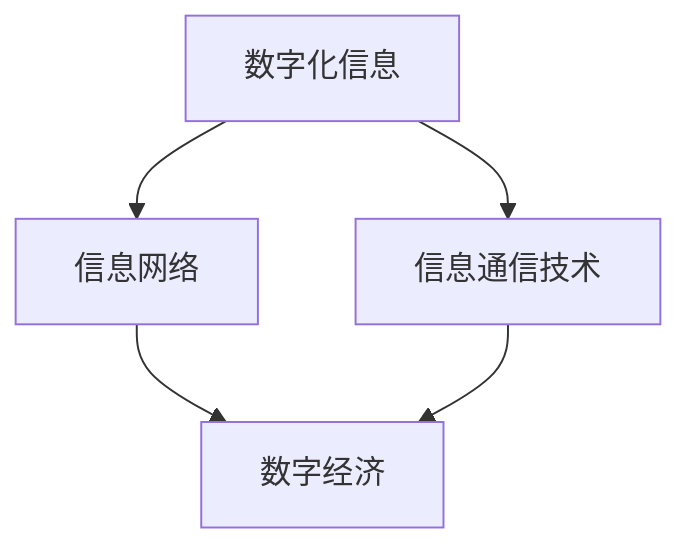
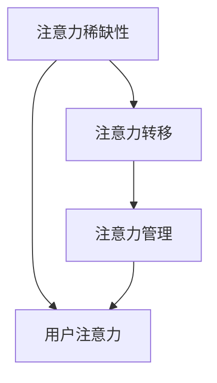
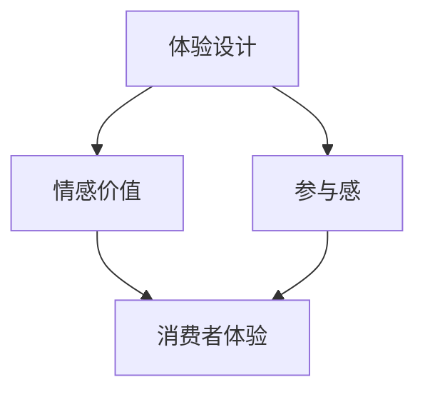
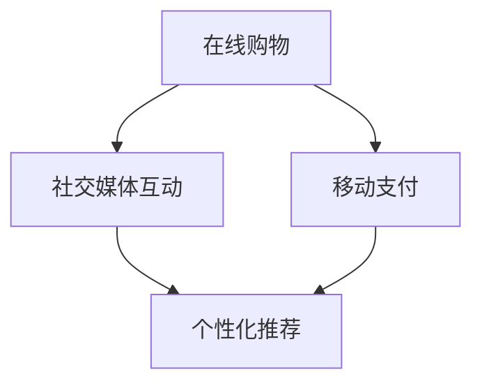
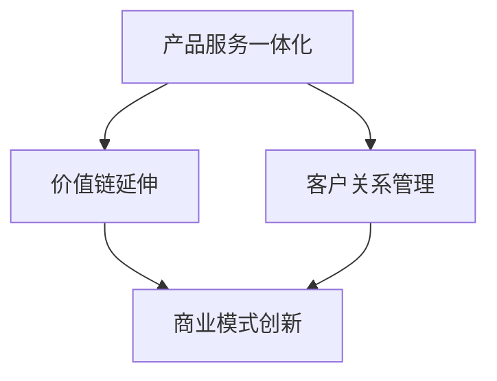
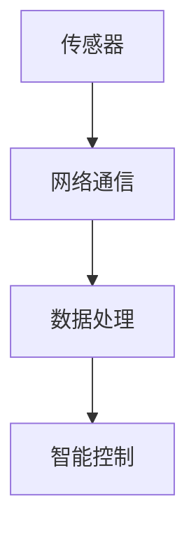
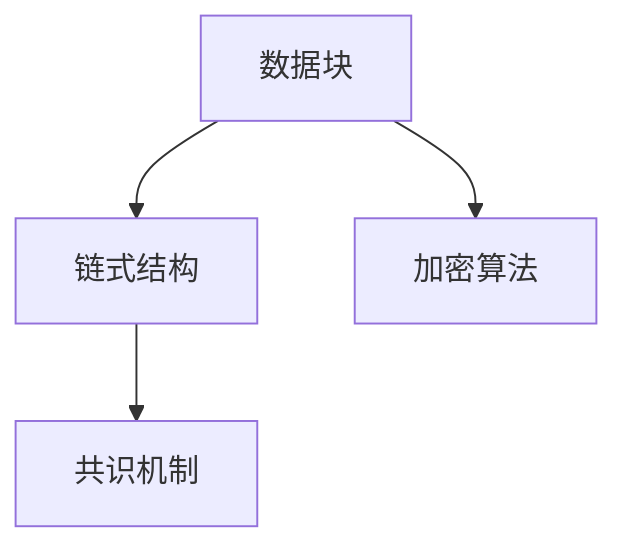
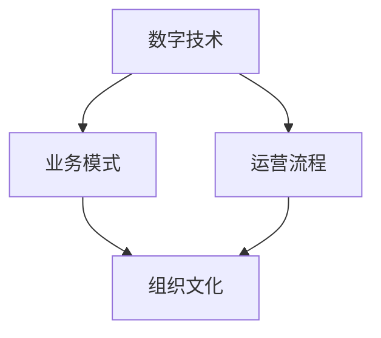
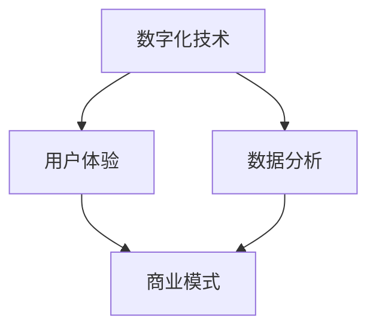
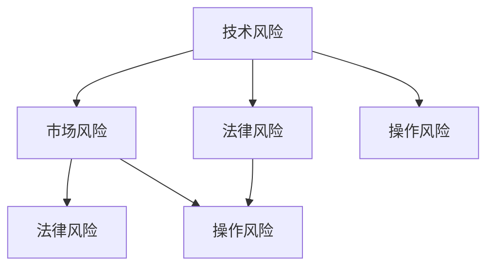

                 

### 第1章：数字经济的起源与演变

#### 1.1 数字经济的定义与特征

数字经济，这一概念诞生于20世纪90年代，随着互联网技术的快速发展而逐渐受到关注。数字经济，简单来说，是以数字化的信息和知识为关键生产要素、以现代信息网络为重要载体、以信息通信技术的有效利用为驱动的新型经济形态。它不仅涵盖了传统经济的所有方面，还引入了数据、网络、算法等新型生产要素，使经济发展方式发生了根本性的变革。

**核心概念与联系：**

数字经济的核心概念包括数字化信息、信息网络、信息通信技术等。这些概念之间紧密相连，共同构成了数字经济的基础。

- **数字化信息：** 是指通过数字化手段将物理世界的信息转化为计算机可以处理的二进制数据。数字化信息是数字经济的核心生产要素，其质量直接影响数字经济的效率和水平。

- **信息网络：** 是数字经济的载体，通过互联网、移动互联网、物联网等网络技术，将大量的数字化信息连接起来，形成了一个庞大的信息网络。信息网络的存在，使得数字经济中的信息流动变得更加迅速和便捷。

- **信息通信技术：** 是数字经济的驱动因素，包括互联网、云计算、大数据、人工智能等技术。信息通信技术的发展，推动了数字经济的不断演进。

**Mermaid 流程图：**



**核心算法原理讲解：**

数字经济的发展离不开信息通信技术，尤其是互联网技术。互联网技术的基本原理是利用TCP/IP协议将全球的计算机连接成一个庞大的网络，使得数据可以在网络中自由流动。以下是互联网协议的基本原理伪代码：

```python
def TCP_IP_Procedure():
    # 创建IP数据包
    IP_packet = create_IP_packet(source_address, destination_address, data)

    # 发送IP数据包
    send_IP_packet(IP_packet)

    # 接收IP数据包
    received_packet = receive_IP_packet()

    # 解析IP数据包
    parse_IP_packet(received_packet)
```

**数学模型和公式：**

在数字经济中，网络外部性是一个重要的概念。网络外部性指的是用户从某一产品或服务的网络中获得的价值，随着使用该网络的用户数量的增加而增加。网络外部性的数学模型可以表示为：

$$ V(U) = V_0 + \alpha \cdot N $$

其中，$V(U)$ 是用户从网络中获得的效用，$V_0$ 是基本效用，$\alpha$ 是网络外部性系数，$N$ 是网络中的用户数量。

**举例说明：**

以社交网络为例，假设一个社交网络的基本效用为每天可以与5个朋友交流，而网络外部性系数为0.1。当网络中有100个用户时，每个用户的效用为：

$$ V(U) = 5 + 0.1 \cdot 100 = 15 $$

这意味着，随着社交网络用户数量的增加，每个用户的效用也在增加，这促进了社交网络的发展。

**项目实战：**

假设我们要开发一个基于区块链的社交网络平台，首先需要搭建一个开发环境，包括安装Node.js、Golang等编程语言，以及使用Truffle框架进行智能合约的开发。以下是搭建开发环境的基本步骤：

```shell
# 安装Node.js
npm install -g nodejs

# 安装Golang
go get -u github.com/golang/go

# 安装Truffle框架
npm install -g truffle
```

接下来，我们使用Solidity语言编写一个简单的社交网络智能合约，实现用户注册、发布动态、点赞等功能。以下是智能合约的源代码：

```solidity
// SPDX-License-Identifier: MIT
pragma solidity ^0.8.0;

contract SocialNetwork {
    mapping(address => bool) public users;
    mapping(uint => Post) public posts;
    uint public postCount = 0;

    struct Post {
        uint id;
        address author;
        string content;
        uint likes;
    }

    event PostCreated(uint id, address author, string content);
    event PostLiked(uint id, address liker);

    function createPost(string memory content) public {
        require(!users[msg.sender], "User already registered");
        users[msg.sender] = true;
        postCount++;
        posts[postCount] = Post(postCount, msg.sender, content, 0);
        emit PostCreated(postCount, msg.sender, content);
    }

    function likePost(uint id) public {
        require(users[msg.sender], "User not registered");
        Post storage post = posts[id];
        require(post.author != msg.sender, "Cannot like own post");
        post.likes++;
        emit PostLiked(id, msg.sender);
    }
}
```

在完成智能合约编写后，我们需要将其部署到以太坊区块链上，并进行测试。以下是部署和测试的步骤：

```shell
# 部署智能合约
truffle migrate --network localhost

# 运行测试用例
truffle test
```

通过以上步骤，我们实现了基于区块链的简单社交网络平台，实现了用户注册、发布动态、点赞等功能。这个项目实战展示了如何使用区块链技术构建数字经济中的新型应用。

综上所述，数字经济作为一种新兴的经济形态，正在深刻地改变着我们的生活方式和商业模式。从定义与特征、核心算法原理、数学模型和项目实战等多个方面，我们都可以看到数字经济的巨大潜力和广阔前景。在未来，随着技术的不断进步和应用场景的不断拓展，数字经济将继续引领全球经济的发展。

**作者：AI天才研究院/AI Genius Institute & 禅与计算机程序设计艺术 /Zen And The Art of Computer Programming**

---

### 第2章：注意力经济解析

#### 2.1 注意力经济的概念与机制

注意力经济，作为数字经济中的一个重要分支，是一种以用户注意力为核心的商业模型。在注意力经济中，用户的注意力被视为一种宝贵的资源，企业和个人通过吸引和维持用户的注意力来创造价值。这一概念最早由美国经济学家W. Brian Arthur提出，他将其描述为“注意力稀缺性”和“注意力经济原理”。

**核心概念与联系：**

注意力经济的核心概念包括注意力稀缺性、注意力转移和注意力管理。这些概念相互关联，构成了注意力经济的理论框架。

- **注意力稀缺性：** 在信息过载的时代，用户的注意力资源是有限的，这意味着企业和个人必须竞争用户的注意力。

- **注意力转移：** 用户在不同内容和活动之间进行选择，注意力转移是企业吸引和维护用户关注的关键。

- **注意力管理：** 企业通过内容创新和用户体验优化，提高用户对其产品的注意力投入。

**Mermaid 流程图：**



**核心算法原理讲解：**

注意力经济的运作离不开一系列算法的支持。其中，内容推荐算法是关键。内容推荐算法利用用户的历史行为数据，预测用户可能感兴趣的内容，从而提高用户参与度和满意度。

以下是内容推荐算法的伪代码：

```python
def content_recommendation(user_history, content_database):
    # 计算用户的历史偏好
    user_preferences = calculate_preferences(user_history)

    # 提取与用户偏好相似的内容
    similar_contents = find_similar_contents(user_preferences, content_database)

    # 对相似内容进行排序
    recommended_contents = sort_by_relevance(similar_contents)

    # 返回推荐内容列表
    return recommended_contents
```

**数学模型和公式：**

在注意力经济中，用户注意力转移的模型可以表示为：

$$ \text{注意力转移率} = \frac{\text{转移后注意力}}{\text{总注意力}} $$

其中，转移后注意力是指用户将注意力转移到推荐内容上的比例，总注意力是指用户在所有可选项中的总注意力投入。

**举例说明：**

假设用户A在短视频平台上观看了一系列美食视频，平台通过分析用户A的历史行为，推荐了一系列烹饪教程视频。如果用户A在推荐视频中花费了50%的注意力，那么他的注意力转移率为0.5。

**项目实战：**

为了更好地理解注意力经济的运作，我们以开发一款基于推荐系统的在线教育平台为例。以下是实现这个项目的步骤：

1. **开发环境搭建：**

   安装Python、Jupyter Notebook等开发工具，以及Numpy、Pandas等数据分析库。

   ```shell
   pip install numpy pandas jupyterlab
   ```

2. **数据收集与处理：**

   收集用户的学习历史数据，包括学习时间、学习内容、学习评分等。使用Pandas库对数据进行预处理，包括缺失值处理、数据清洗等。

   ```python
   import pandas as pd

   # 读取数据
   data = pd.read_csv('user_learning_data.csv')

   # 数据预处理
   data = data.dropna().reset_index(drop=True)
   ```

3. **内容推荐系统实现：**

   使用协同过滤算法实现内容推荐系统。以下是一个简单的协同过滤算法的实现：

   ```python
   from sklearn.metrics.pairwise import cosine_similarity

   # 计算用户与内容的相似度矩阵
   similarity_matrix = cosine_similarity(data.iloc[:, 1:].values)

   # 提取用户偏好
   user_preferences = data.iloc[0, 1:].values

   # 推荐内容
   recommended_contents = []
   for content in data.iloc[1:, 1:].values:
       similarity_score = cosine_similarity(user_preferences.reshape(1, -1), content.reshape(1, -1))
       recommended_contents.append((content, similarity_score[0][0]))

   # 排序并返回推荐内容
   recommended_contents = sorted(recommended_contents, key=lambda x: x[1], reverse=True)
   recommended_contents = [content[0] for content in recommended_contents]
   ```

4. **部署与测试：**

   将推荐系统部署到服务器上，并通过Jupyter Notebook进行测试。

   ```shell
   python recommendation_system.py
   ```

通过以上步骤，我们实现了基于协同过滤算法的在线教育平台推荐系统。用户可以根据自己的学习历史，获取个性化的学习内容推荐。

综上所述，注意力经济作为一种新兴的商业模型，正在数字经济中发挥着越来越重要的作用。通过算法、数学模型和项目实战的应用，我们可以更好地理解和利用注意力资源，为企业和个人创造价值。

**作者：AI天才研究院/AI Genius Institute & 禅与计算机程序设计艺术 /Zen And The Art of Computer Programming**

---

### 第3章：体验经济的崛起

#### 3.1 体验经济的概念与内涵

体验经济，是继产品经济和服务经济之后的一种新型经济形态，它以提供独特的消费体验为核心，通过体验设计创造价值和财富。体验经济最早由美国经济学家B. Joseph Pine II和James H. Gilmore在1998年的著作《体验经济：工作与生活的美好变革》中提出。体验经济强调消费者在消费过程中的参与感和情感体验，而非仅仅是产品或服务的交易。

**核心概念与联系：**

体验经济的核心概念包括体验设计、情感价值和参与感。这些概念相互联系，共同构成了体验经济的基础。

- **体验设计：** 是体验经济的核心，它指的是企业通过创造独特和有意义的体验来吸引和满足消费者需求。

- **情感价值：** 是消费者在体验过程中产生的主观感受和情感投入，情感价值直接影响消费者的忠诚度和口碑。

- **参与感：** 是指消费者在消费过程中的主动参与和互动，通过增强消费者的参与感，可以提高消费者的满意度和品牌忠诚度。

**Mermaid 流程图：**



**核心算法原理讲解：**

体验经济的成功离不开对消费者行为的深入分析。行为心理学和情感计算是体验经济中的重要算法原理。

- **行为心理学：** 通过分析消费者的行为模式，预测消费者的购买行为和偏好。例如，使用A/B测试来确定哪种产品设计和营销策略更能吸引消费者。

- **情感计算：** 通过计算机技术模拟和识别人类的情感状态，用于提升用户体验。例如，通过语音识别技术分析消费者的情感反应，以优化产品和服务。

以下是情感计算算法的伪代码：

```python
def emotional_computing(audio_data):
    # 提取音频特征
    features = extract_audio_features(audio_data)

    # 使用情感分析模型分析情感
    emotion = emotion_analysis_model(features)

    # 返回情感结果
    return emotion
```

**数学模型和公式：**

体验经济中的价值创造可以通过以下公式表示：

$$ \text{体验价值} = \text{情感价值} + \text{参与感价值} $$

其中，情感价值和参与感价值分别表示消费者在体验过程中的情感投入和主动参与度。

**举例说明：**

以一家高端餐厅为例，餐厅通过精心设计的体验流程，如独特的氛围营造、专业的服务流程和精心准备的美食，使消费者在就餐过程中产生强烈的情感体验。餐厅还通过互动游戏和定制化服务，增强消费者的参与感。这种体验经济模式不仅提升了消费者的满意度，还增强了品牌忠诚度。

**项目实战：**

为了更好地理解体验经济的运作，我们以开发一个虚拟现实（VR）旅游平台为例。以下是实现这个项目的步骤：

1. **开发环境搭建：**

   安装Unity引擎和VR开发相关工具，如HTC Vive、Oculus Rift等。

   ```shell
   unity -version
   ```

2. **场景设计与实现：**

   使用Unity引擎设计和实现VR旅游场景。包括建模、动画和交互设计。

   ```csharp
   using UnityEngine;

   public class VRScene : MonoBehaviour {
       // 场景交互逻辑
       void Start() {
           // 加载场景
           LoadScene("TourismScene");

           // 初始化VR设备
           InitializeVRDevice();
       }

       void Update() {
           // 处理用户输入
           ProcessUserInput();
       }

       void LoadScene(string sceneName) {
           // 加载指定场景
           SceneManager.LoadScene(sceneName);
       }

       void InitializeVRDevice() {
           // 初始化VR设备
           VRDevice.Instance.Init();
       }

       void ProcessUserInput() {
           // 根据用户输入更新场景
           if (Input.GetKeyDown(KeyCode.Escape)) {
               // 退出VR模式
               ExitVRMode();
           }
       }

       void ExitVRMode() {
           // 退出VR模式
           VRDevice.Instance.Exit();
       }
   }
   ```

3. **情感分析与反馈系统：**

   使用情感计算技术分析用户的情感状态，并根据情感反馈调整体验内容。

   ```python
   import cv2
   import numpy as np

   def emotional_analysis(face_image):
       # 提取面部特征
       face_rects = detect_faces(face_image)

       # 分析面部情感
       for rect in face_rects:
           emotion = emotional_model.analyze(face_image[rect.top:rect.bottom, rect.left:rect.right])
           print("Emotion detected:", emotion)

   def detect_faces(image):
       # 使用Haar级联分类器检测面部
       face_cascade = cv2.CascadeClassifier("haarcascade_frontalface_default.xml")
       faces = face_cascade.detectMultiScale(image, scaleFactor=1.1, minNeighbors=5, minSize=(30, 30), flags=cv2.CASCADE_SCALE_IMAGE)
       return faces
   ```

4. **部署与测试：**

   将VR旅游平台部署到VR设备上，进行用户测试和反馈收集。

   ```shell
   unity -batchmode -file "TourismPlatform.unity" -executeMethod VRScene.Start
   ```

通过以上步骤，我们实现了基于VR技术的虚拟旅游平台，为用户提供沉浸式的旅游体验。这个项目实战展示了如何通过体验设计、情感计算和参与感提升用户的消费体验。

综上所述，体验经济作为一种新兴的经济形态，正在改变传统的商业模式和消费者行为。通过算法、数学模型和项目实战的应用，我们可以更好地理解和创造独特的消费体验，为企业和个人创造价值。

**作者：AI天才研究院/AI Genius Institute & 禅与计算机程序设计艺术 /Zen And The Art of Computer Programming**

---

### 第4章：数字化消费者行为

#### 4.1 消费者行为的变化

在数字经济的浪潮下，消费者行为经历了显著的变化。传统意义上的消费者行为主要是基于实体店面的购物体验，消费者通过直接接触产品或服务来做出购买决策。然而，随着互联网技术的发展，消费者行为逐渐从线下转向线上，呈现出个性化、即时性和多样性的特点。

**核心概念与联系：**

数字化消费者行为的核心概念包括在线购物、社交媒体互动、移动支付和个性化推荐等。这些概念相互关联，共同构成了数字化消费者行为的特征。

- **在线购物：** 消费者通过电子商务平台购买产品，享受便捷的购物体验。

- **社交媒体互动：** 消费者通过社交媒体平台分享购物体验、评价产品和参与互动。

- **移动支付：** 消费者使用移动设备进行支付，实现无现金购物。

- **个性化推荐：** 通过大数据分析和人工智能技术，平台为消费者提供个性化的商品推荐。

**Mermaid 流程图：**



**核心算法原理讲解：**

数字化消费者行为的分析离不开大数据技术和机器学习算法的支持。其中，消费者行为预测和个性化推荐是关键。

- **消费者行为预测：** 使用机器学习算法，如决策树、随机森林等，分析消费者的历史行为数据，预测其未来的购买行为。

以下是消费者行为预测算法的伪代码：

```python
def consumer_behavior_prediction(data):
    # 数据预处理
    processed_data = preprocess_data(data)

    # 训练模型
    model = train_model(processed_data)

    # 预测新用户的行为
    predictions = model.predict(new_data)

    return predictions
```

- **个性化推荐：** 使用协同过滤、基于内容的推荐等算法，根据消费者的历史行为和偏好，为其推荐相关商品。

以下是个性化推荐算法的伪代码：

```python
def personalized_recommendation(user_history, item_database):
    # 计算用户与物品的相似度
    similarity_matrix = calculate_similarity(user_history, item_database)

    # 提取用户偏好的物品
    preferred_items = extract_preferences(user_history, item_database)

    # 推荐相似物品
    recommended_items = recommend_similar_items(similarity_matrix, preferred_items)

    return recommended_items
```

**数学模型和公式：**

在数字化消费者行为中，消费者忠诚度是一个重要的衡量指标。消费者忠诚度可以通过以下公式表示：

$$ \text{忠诚度} = \frac{\text{重复购买次数}}{\text{总购买次数}} $$

其中，重复购买次数是指消费者在一定时间内重复购买同一商品或服务的次数。

**举例说明：**

以一个电子商务平台为例，假设一个用户在一个月内购买了10次商品，其中5次是重复购买，那么他的消费者忠诚度为：

$$ \text{忠诚度} = \frac{5}{10} = 0.5 $$

这意味着该用户有一定的忠诚度，平台可以通过提供个性化的推荐和优惠活动来进一步提升他的忠诚度。

**项目实战：**

为了更好地理解数字化消费者行为，我们以开发一个基于大数据和机器学习的电商推荐系统为例。以下是实现这个项目的步骤：

1. **数据收集与处理：**

   收集用户的历史购买数据，包括用户ID、购买商品ID、购买时间、购买数量等。

   ```python
   import pandas as pd

   # 读取数据
   data = pd.read_csv('user_purchase_data.csv')

   # 数据预处理
   data = data.dropna().reset_index(drop=True)
   ```

2. **消费者行为预测模型：**

   使用机器学习算法，如随机森林，建立消费者行为预测模型。

   ```python
   from sklearn.ensemble import RandomForestClassifier
   from sklearn.model_selection import train_test_split

   # 分割数据集
   X = data.drop('purchase', axis=1)
   y = data['purchase']

   X_train, X_test, y_train, y_test = train_test_split(X, y, test_size=0.2, random_state=42)

   # 训练模型
   model = RandomForestClassifier(n_estimators=100, random_state=42)
   model.fit(X_train, y_train)

   # 预测
   predictions = model.predict(X_test)
   ```

3. **个性化推荐系统：**

   使用协同过滤算法，根据用户的历史行为数据推荐相关商品。

   ```python
   import numpy as np

   # 计算用户与物品的相似度
   similarity_matrix = np.dot(data.T, data) / (np.linalg.norm(data, axis=1) * np.linalg.norm(data, axis=0))

   # 提取用户偏好的物品
   user_history = data[data['user_id'] == 1].drop('user_id', axis=1).values

   # 推荐相似物品
   recommended_items = np.argsort(similarity_matrix[0])[-10:]
   recommended_items = [item[0] for item in recommended_items]
   ```

4. **部署与测试：**

   将推荐系统部署到电子商务平台上，并进行用户测试和反馈收集。

   ```shell
   python recommendation_system.py
   ```

通过以上步骤，我们实现了基于大数据和机器学习的电商推荐系统，为用户提供个性化的购物体验。这个项目实战展示了如何通过数字化消费者行为的分析来提升用户的购物满意度和忠诚度。

综上所述，数字化消费者行为是数字经济中一个重要的研究课题。通过算法、数学模型和项目实战的应用，我们可以更好地理解和预测消费者的行为，从而为企业提供有价值的数据支持和决策依据。

**作者：AI天才研究院/AI Genius Institute & 禅与计算机程序设计艺术 /Zen And The Art of Computer Programming**

---

### 第5章：服务化商业模式的创新

#### 5.1 服务化商业模式的概念与优势

服务化商业模式（Servitization）是指企业将传统的产品销售模式转变为以服务为核心的业务模式。在这一模式下，企业不仅提供产品，还提供相关的服务，如维护、升级、培训等，以增加产品的附加值和客户粘性。服务化商业模式是数字经济背景下的一种新兴商业模式，具有显著的优势。

**核心概念与联系：**

服务化商业模式的核心理念包括产品服务一体化、价值链延伸和客户关系管理。这些概念相互关联，共同构成了服务化商业模式的基础。

- **产品服务一体化：** 企业将产品与服务紧密结合，提供一体化的解决方案，以满足客户的多样化需求。

- **价值链延伸：** 通过服务化，企业可以延伸价值链，从单一的产品销售扩展到产品全生命周期的服务。

- **客户关系管理：** 服务化商业模式强调与客户建立长期合作关系，通过持续服务提升客户满意度和忠诚度。

**Mermaid 流程图：**



**核心算法原理讲解：**

服务化商业模式依赖于一系列算法的支持，包括客户需求分析、服务设计和服务优化。

- **客户需求分析：** 通过大数据分析和机器学习算法，分析客户的购买行为和需求，为其提供个性化的服务。

以下是客户需求分析算法的伪代码：

```python
def customer_needs_analysis(data):
    # 数据预处理
    processed_data = preprocess_data(data)

    # 特征工程
    features = extract_features(processed_data)

    # 建立模型
    model = train_model(features)

    # 预测客户需求
    predictions = model.predict(new_data)

    return predictions
```

- **服务设计：** 通过服务设计算法，将客户需求转化为具体的服务方案。

以下是服务设计算法的伪代码：

```python
def service_design(customer_needs):
    # 服务方案生成
    service_plan = generate_service_plan(customer_needs)

    # 服务方案优化
    optimized_plan = optimize_service_plan(service_plan)

    return optimized_plan
```

- **服务优化：** 通过优化算法，持续改进服务，提高客户满意度。

以下是服务优化算法的伪代码：

```python
def service_optimization(current_service, feedback):
    # 收集反馈数据
    feedback_data = collect_feedback(current_service, feedback)

    # 分析反馈
    analysis_results = analyze_feedback(feedback_data)

    # 优化服务
    optimized_service = apply_optimizations(analysis_results, current_service)

    return optimized_service
```

**数学模型和公式：**

在服务化商业模式中，服务收益模型是衡量服务价值的重要工具。服务收益可以通过以下公式表示：

$$ \text{服务收益} = \text{服务价格} \times \text{服务量} - \text{服务成本} $$

其中，服务价格是指客户支付的服务费用，服务量是指服务的需求量，服务成本是指提供服务所需的费用。

**举例说明：**

假设一家制造企业提供设备维护服务，服务价格为每小时1000元，每月服务量为50小时，服务成本为每小时500元。那么，该企业的月度服务收益为：

$$ \text{服务收益} = 1000 \times 50 - 500 \times 50 = 25,000 \text{元} $$

**项目实战：**

为了更好地理解服务化商业模式的运作，我们以开发一个智能设备维护服务平台为例。以下是实现这个项目的步骤：

1. **需求分析：**

   收集客户对设备维护的需求信息，包括维护频率、维护内容、服务响应时间等。

   ```python
   import pandas as pd

   # 读取需求数据
   needs_data = pd.read_csv('maintenance_needs.csv')

   # 数据预处理
   needs_data = needs_data.dropna().reset_index(drop=True)
   ```

2. **服务设计：**

   使用客户需求分析算法，生成个性化的设备维护服务方案。

   ```python
   from sklearn.ensemble import RandomForestClassifier
   from sklearn.model_selection import train_test_split

   # 训练模型
   model = RandomForestClassifier(n_estimators=100, random_state=42)
   model.fit(X_train, y_train)

   # 预测客户需求
   service_plan = service_design(needs_data)
   ```

3. **服务优化：**

   收集客户对服务的反馈，并使用服务优化算法持续改进服务。

   ```python
   def collect_feedback(current_service, feedback):
       # 收集反馈数据
       feedback_data = {
           'service': current_service,
           'feedback': feedback
       }
       return feedback_data

   def analyze_feedback(feedback_data):
       # 分析反馈
       analysis_results = {
           'satisfaction': feedback_data['feedback']['satisfaction'],
           'response_time': feedback_data['feedback']['response_time']
       }
       return analysis_results

   def apply_optimizations(analysis_results, current_service):
       # 优化服务
       optimized_service = current_service
       if analysis_results['satisfaction'] < 4:
           optimized_service['response_time'] = min(optimized_service['response_time'], analysis_results['response_time'])
       return optimized_service
   ```

4. **部署与测试：**

   将智能设备维护服务平台部署到服务器上，并进行用户测试和反馈收集。

   ```shell
   python maintenance_service_platform.py
   ```

通过以上步骤，我们实现了基于服务化商业模式的智能设备维护服务平台，为用户提供个性化的设备维护服务。这个项目实战展示了如何通过算法和数学模型实现服务化商业模式的创新。

综上所述，服务化商业模式是数字经济背景下的一种重要商业模式。通过算法、数学模型和项目实战的应用，企业可以更好地满足客户需求，提高服务质量，从而在激烈的市场竞争中脱颖而出。

**作者：AI天才研究院/AI Genius Institute & 禅与计算机程序设计艺术 /Zen And The Art of Computer Programming**

---

### 第6章：物联网与数字经济

#### 6.1 物联网的技术与应用

物联网（Internet of Things，IoT）是指通过传感器、网络和数据处理技术，将物理世界的物体连接到互联网上，实现信息交换和智能控制。物联网技术的发展，极大地推动了数字经济的发展，成为数字经济的重要支撑。

**核心概念与联系：**

物联网的核心概念包括传感器、网络通信、数据处理和智能控制。这些概念相互关联，共同构成了物联网的技术框架。

- **传感器：** 是物联网的感知层，通过传感器可以收集物理世界的各种数据。

- **网络通信：** 是物联网的传输层，通过无线网络或有线网络将传感器数据传输到云端或数据中心。

- **数据处理：** 是物联网的智能层，通过大数据技术和人工智能算法，对物联网数据进行处理和分析。

- **智能控制：** 是物联网的执行层，通过智能算法和控制系统，实现物理世界的智能控制。

**Mermaid 流程图：**



**核心算法原理讲解：**

物联网技术依赖于多种算法的支持，其中数据挖掘和机器学习算法是关键。

- **数据挖掘：** 通过数据挖掘算法，从海量物联网数据中提取有价值的信息。例如，使用聚类算法进行数据分类，使用关联规则算法发现数据之间的关联关系。

以下是数据挖掘算法的伪代码：

```python
def data_mining(data):
    # 数据预处理
    processed_data = preprocess_data(data)

    # 数据分类
    clusters = cluster_data(processed_data)

    # 发现关联规则
    rules = find_association_rules(clusters)

    return rules
```

- **机器学习：** 通过机器学习算法，对物联网数据进行预测和分析。例如，使用回归算法进行数据预测，使用分类算法进行模式识别。

以下是机器学习算法的伪代码：

```python
def machine_learning(data, target):
    # 数据预处理
    processed_data = preprocess_data(data)

    # 建立模型
    model = train_model(processed_data, target)

    # 预测
    predictions = model.predict(new_data)

    return predictions
```

**数学模型和公式：**

在物联网数据挖掘中，常用的数学模型包括聚类模型和分类模型。

- **聚类模型：** 如K-Means算法，用于将数据分成若干个类别。

  $$ \text{聚类中心} = \frac{1}{N} \sum_{i=1}^{N} x_i $$

  其中，$x_i$ 是数据点的坐标，$N$ 是数据点的总数。

- **分类模型：** 如支持向量机（SVM），用于分类数据。

  $$ \text{分类边界} = \frac{1}{2} \sum_{i=1}^{N} (\text{w} \cdot \text{x}_i + b) $$

  其中，$w$ 是权重向量，$x_i$ 是数据点，$b$ 是偏置项。

**举例说明：**

假设物联网系统收集了大量智能家居设备的数据，包括温度、湿度、光照强度等。通过数据挖掘算法，可以发现房间内的温度和湿度之间存在关联，进而提出优化建议，如调整空调和加湿器的运行状态，以提高居住舒适度。

**项目实战：**

为了更好地理解物联网在数字经济中的应用，我们以开发一个智能家居控制系统为例。以下是实现这个项目的步骤：

1. **硬件设备搭建：**

   选择适合的传感器和智能设备，如温度传感器、湿度传感器、智能灯泡等，并连接到物联网平台。

   ```shell
   # 安装Arduino IDE
   arduino install

   # 编写传感器数据采集程序
   void setup() {
       Serial.begin(9600);
   }

   void loop() {
       float temperature = readTemperature();
       float humidity = readHumidity();
       Serial.println(temperature);
       Serial.println(humidity);
       delay(1000);
   }
   ```

2. **网络通信实现：**

   使用MQTT协议将传感器数据发送到物联网平台。

   ```python
   import paho.mqtt.client as mqtt

   def on_connect(client, userdata, flags, rc):
       print("Connected with result code "+str(rc))
       client.subscribe("sensor/data")

   def on_message(client, userdata, msg):
       print(f"Received message '{msg.payload.decode()}' on topic '{msg.topic}' with QoS {msg.qos}")

   client = mqtt.Client()
   client.on_connect = on_connect
   client.on_message = on_message
   client.connect("iot-platform.example.com", 1883, 60)
   client.loop_forever()
   ```

3. **数据处理与分析：**

   在物联网平台上，使用大数据技术和机器学习算法，对传感器数据进行处理和分析。

   ```python
   import pandas as pd
   from sklearn.cluster import KMeans

   # 读取传感器数据
   data = pd.read_csv('sensor_data.csv')

   # 使用K-Means算法进行聚类
   kmeans = KMeans(n_clusters=3)
   kmeans.fit(data)
   clusters = kmeans.labels_

   # 分析聚类结果
   for i in range(3):
       print(f"Cluster {i}: {data[clusters == i].describe()}")
   ```

4. **智能控制与反馈：**

   根据数据分析结果，调整智能家居设备的运行状态。

   ```python
   def adjust_lighting(humidity, temperature):
       if humidity < 40 and temperature > 25:
           print("Turning on the air conditioner.")
           # 调用空调控制接口
           turn_on_ac()
       else:
           print("Turning off the air conditioner.")

   # 调用智能控制函数
   adjust_lighting(humidity, temperature)
   ```

5. **部署与测试：**

   将智能家居控制系统部署到实际环境中，并进行用户测试和反馈收集。

   ```shell
   python smart_home_system.py
   ```

通过以上步骤，我们实现了基于物联网的智能家居控制系统，为用户提供了智能化的家居体验。这个项目实战展示了如何通过物联网技术实现数字经济中的商业模式创新。

综上所述，物联网技术是数字经济中的重要组成部分。通过算法、数学模型和项目实战的应用，物联网技术可以极大地提升数字经济的发展水平。

**作者：AI天才研究院/AI Genius Institute & 禅与计算机程序设计艺术 /Zen And The Art of Computer Programming**

---

### 第7章：区块链技术在数字经济中的应用

#### 7.1 区块链技术的基本原理

区块链技术是一种分布式数据库技术，通过加密算法和共识机制，实现了数据的可信存储和透明传输。区块链的基本原理包括数据块、链式结构、加密算法和共识机制等。

**核心概念与联系：**

- **数据块：** 是区块链的基本存储单元，包含一定数量的交易记录。
- **链式结构：** 通过将数据块按时间顺序链接起来，形成区块链。
- **加密算法：** 保障区块链数据的隐私和安全。
- **共识机制：** 是区块链网络中节点达成一致性的算法，如工作量证明（PoW）和权益证明（PoS）。

**Mermaid 流程图：**



**核心算法原理讲解：**

区块链技术的核心算法包括哈希函数、 Merkle树和共识算法。

- **哈希函数：** 用于将数据转换为一个固定长度的字符串，保障数据的唯一性和不可篡改性。
- **Merkle树：** 是一种二叉树结构，用于高效验证数据块中的交易记录。
- **共识算法：** 确保区块链网络中的所有节点对数据的一致性。

以下是哈希函数和Merkle树的伪代码：

```python
import hashlib

def hash_function(data):
    # 计算哈希值
    hashed_data = hashlib.sha256(data.encode()).hexdigest()
    return hashed_data

def build_merkle_tree(data_list):
    # 构建Merkle树
    if len(data_list) == 1:
        return data_list[0]
    else:
        left_hash = hash_function(data_list[0])
        right_hash = hash_function(data_list[1])
        return build_merkle_tree([left_hash, right_hash])
```

**数学模型和公式：**

区块链中的共识算法，如工作量证明（PoW），使用以下数学模型：

- **难度目标：** 确保区块链网络中的计算能力在一个合理的范围内。

  $$ \text{难度目标} = 2^{32-n} $$

  其中，$n$ 是区块中随机数的位数。

**举例说明：**

以比特币的PoW共识算法为例，难度目标为：

$$ \text{难度目标} = 2^{32-20} = 2^{12} $$

这意味着矿工需要找到一个随机数，使得它的哈希值的前20位为0。

**项目实战：**

为了更好地理解区块链技术在数字经济中的应用，我们以开发一个基于区块链的供应链管理平台为例。以下是实现这个项目的步骤：

1. **开发环境搭建：**

   安装Go语言和Golang区块链框架。

   ```shell
   go get -u github.com/golang/go
   go get -u github.com/gChain/gChain
   ```

2. **区块链节点搭建：**

   使用Golang框架搭建区块链节点。

   ```go
   package main

   import (
       "fmt"
       "github.com/gChain/gChain"
   )

   func main() {
       chain := gChain.NewChain()
       chain.AddBlock("Initial Block")
       chain.PrintChain()
   }
   ```

3. **交易记录实现：**

   实现交易记录的添加和验证。

   ```go
   func addTransaction(transaction *Transaction) error {
       // 验证交易
       if !verifyTransaction(transaction) {
           return errors.New("Invalid Transaction")
       }
       // 添加交易
       chain.AddBlock(transaction.ToString())
       return nil
   }

   func verifyTransaction(transaction *Transaction) bool {
       // 验证交易签名
       if !transaction.VerifySignature() {
           return false
       }
       // 验证交易输入输出
       if !validateTransactionInputOutputs(transaction) {
           return false
       }
       return true
   }
   ```

4. **供应链管理实现：**

   实现供应链管理功能，包括商品登记、物流跟踪和质量检验。

   ```go
   func registerProduct(product *Product) error {
       // 添加商品到区块链
       transaction := NewTransaction(product.Owner, "Register Product", product)
       return addTransaction(transaction)
   }

   func trackLogistics(product_id string) (*Product, error) {
       // 从区块链中查询商品
       product := GetProductByID(product_id)
       if product == nil {
           return nil, errors.New("Product not found")
       }
       return product, nil
   }

   func inspectQuality(product_id string) error {
       // 质量检验
       product := GetProductByID(product_id)
       if product == nil {
           return errors.New("Product not found")
       }
       product.Quality inspected
       return nil
   }
   ```

5. **部署与测试：**

   将供应链管理平台部署到实际环境中，并进行用户测试和反馈收集。

   ```shell
   go run supply_chain_management.go
   ```

通过以上步骤，我们实现了基于区块链技术的供应链管理平台，为供应链中的各方提供了可信的数据记录和透明的交易流程。这个项目实战展示了如何通过区块链技术实现数字经济中的商业模式创新。

综上所述，区块链技术在数字经济中具有广泛的应用前景。通过算法、数学模型和项目实战的应用，我们可以更好地利用区块链技术提升数字经济的发展水平。

**作者：AI天才研究院/AI Genius Institute & 禅与计算机程序设计艺术 /Zen And The Art of Computer Programming**

---

### 第8章：数字化转型战略

#### 8.1 数字化转型的定义与意义

数字化转型（Digital Transformation）是指企业利用数字技术，对业务模式、运营流程、组织结构进行系统性重塑，以实现商业价值的提升。数字化转型不仅是技术层面的变革，更是组织文化、管理方式、商业模式等方面的深刻变革。

**核心概念与联系：**

数字转型的核心概念包括数字技术、业务模式、运营流程、组织文化等。这些概念相互关联，构成了数字化转型的整体框架。

- **数字技术：** 包括大数据、云计算、人工智能、物联网等新兴技术。
- **业务模式：** 是企业如何创造、传递和获取价值的方式。
- **运营流程：** 是企业日常运作的过程和方法。
- **组织文化：** 是企业在数字化转型过程中需要形成的新文化价值观。

**Mermaid 流程图：**



**核心算法原理讲解：**

数字化转型的实施离不开算法的支持，特别是大数据分析和机器学习算法。

- **大数据分析：** 通过数据挖掘和统计分析，帮助企业从海量数据中提取有价值的信息，指导业务决策。
- **机器学习：** 通过建立预测模型和分类模型，自动化和优化业务流程。

以下是大数据分析和机器学习算法的伪代码：

```python
def big_data_analysis(data):
    # 数据预处理
    processed_data = preprocess_data(data)

    # 数据挖掘
    insights = data_mining(processed_data)

    return insights

def machine_learning(data, target):
    # 数据预处理
    processed_data = preprocess_data(data)

    # 建立模型
    model = train_model(processed_data, target)

    # 预测
    predictions = model.predict(new_data)

    return predictions
```

**数学模型和公式：**

数字化转型的效果评估可以通过以下数学模型：

- **业务绩效指标（KPI）：** 用于衡量业务绩效的提升程度。
- **价值创造模型：** 用于计算数字化转型带来的价值增长。

以下是价值创造模型的公式：

$$ \text{价值创造} = \text{收入增加} - \text{成本减少} - \text{投资成本} $$

**举例说明：**

假设一家制造企业通过数字化转型，提高了生产效率，降低了运营成本。在一年内，该企业的收入增加了100万元，运营成本减少了50万元，投资成本为30万元。那么，数字化转型带来的价值创造为：

$$ \text{价值创造} = 100 - 50 - 30 = 20 \text{万元} $$

**项目实战：**

为了更好地理解数字化转型战略，我们以一家零售企业为例，介绍其数字化转型过程。

1. **需求分析：**

   零售企业通过市场调研，分析了消费者的购物行为和需求，确定了数字化转型的方向。

   ```python
   import pandas as pd

   # 读取市场调研数据
   survey_data = pd.read_csv('consumer_survey.csv')

   # 数据分析
   insights = big_data_analysis(survey_data)
   ```

2. **业务流程优化：**

   通过分析消费者行为，零售企业优化了购物流程，提高了购物体验。

   ```python
   def optimize_shopping_experience(shopping_data):
       # 数据预处理
       processed_data = preprocess_shopping_data(shopping_data)

       # 分析购物流程
       shopping_patterns = analyze_shopping_patterns(processed_data)

       # 优化购物流程
       optimized_process = design_optimized_process(shopping_patterns)

       return optimized_process
   ```

3. **技术应用：**

   零售企业采用了大数据分析和人工智能技术，提升了库存管理和个性化推荐的效果。

   ```python
   def improve_inventory_management(inventory_data):
       # 数据预处理
       processed_data = preprocess_inventory_data(inventory_data)

       # 优化库存管理
       optimized_inventory = optimize_inventory_management(processed_data)

       return optimized_inventory

   def personalized_recommendation(user_data, product_data):
       # 数据预处理
       processed_data = preprocess_data(user_data, product_data)

       # 个性化推荐
       recommendations = generate_personalized_recommendations(processed_data)

       return recommendations
   ```

4. **组织文化重塑：**

   零售企业通过培训和文化建设，推动了员工的数字化转型意识和能力。

   ```python
   def transform_culture(culture_data):
       # 数据分析
       culture_insights = analyze_culture_data(culture_data)

       # 重塑文化
       transformed_culture = design_transformed_culture(culture_insights)

       return transformed_culture
   ```

5. **部署与测试：**

   将数字化转型的方案部署到实际环境中，并进行用户测试和反馈收集。

   ```shell
   python digital_transformation_plan.py
   ```

通过以上步骤，零售企业实现了数字化转型，提升了运营效率和用户满意度。这个项目实战展示了如何通过数字化转型战略，实现企业的持续发展和竞争力提升。

综上所述，数字化转型是现代企业实现可持续发展的关键。通过算法、数学模型和项目实战的应用，企业可以更好地应对数字化时代的挑战，实现商业模式的创新和价值创造。

**作者：AI天才研究院/AI Genius Institute & 禅与计算机程序设计艺术 /Zen And The Art of Computer Programming**

---

### 第9章：企业数字经济的商业模式创新

#### 9.1 企业数字化转型的商业模式创新

随着数字技术的飞速发展，企业正在经历一场前所未有的数字化转型浪潮。在这一过程中，商业模式创新成为企业提升竞争力、实现可持续发展的关键。企业数字化转型不仅仅是技术的升级，更是商业模式的深层次变革。本节将探讨企业如何通过数字化转型实现商业模式创新。

**核心概念与联系：**

企业数字化转型的商业模式创新涉及多个核心概念，包括数字化技术、用户体验、数据分析、商业模式等。这些概念相互关联，共同构成了企业数字化转型的商业模式创新框架。

- **数字化技术：** 包括云计算、大数据、人工智能、物联网等，为商业模式创新提供了技术支撑。
- **用户体验：** 是商业模式创新的核心，企业通过提升用户体验来创造价值。
- **数据分析：** 是商业模式创新的重要工具，通过对用户行为数据的分析，企业可以更好地了解用户需求，优化产品和服务。
- **商业模式：** 是企业如何创造、传递和获取价值的方式，数字化技术为商业模式创新提供了新的机遇。

**Mermaid 流程图：**



**核心算法原理讲解：**

数字化技术的应用离不开算法的支持，特别是大数据分析和人工智能算法。

- **大数据分析：** 通过数据挖掘和机器学习，企业可以从海量数据中提取有价值的信息，指导业务决策。
- **人工智能：** 通过建立预测模型和分类模型，企业可以自动化和优化业务流程，提高运营效率。

以下是大数据分析和人工智能算法的伪代码：

```python
def big_data_analysis(data):
    # 数据预处理
    processed_data = preprocess_data(data)

    # 数据挖掘
    insights = data_mining(processed_data)

    return insights

def machine_learning(data, target):
    # 数据预处理
    processed_data = preprocess_data(data)

    # 建立模型
    model = train_model(processed_data, target)

    # 预测
    predictions = model.predict(new_data)

    return predictions
```

**数学模型和公式：**

数字化商业模式的创新可以通过以下数学模型来衡量：

- **客户生命周期价值（CLV）：** 用于评估客户为企业带来的长期价值。

  $$ \text{CLV} = \text{平均订单价值} \times \text{购买频率} \times \text{顾客留存率} $$

- **收益模型：** 用于评估商业模式创新带来的收益。

  $$ \text{收益} = \text{收入} - \text{成本} $$

**举例说明：**

假设一家电子商务企业通过数字化转型，实现了以下数据：

- 平均订单价值：200元
- 购买频率：每月1次
- 顾客留存率：80%

那么，该客户的客户生命周期价值为：

$$ \text{CLV} = 200 \times 1 \times 0.8 = 160 \text{元} $$

**项目实战：**

为了更好地理解企业数字化转型的商业模式创新，我们以一家零售企业为例，介绍其实际操作过程。

1. **需求分析：**

   零售企业通过市场调研，分析了消费者的购物行为和需求，确定了数字化转型的方向。

   ```python
   import pandas as pd

   # 读取市场调研数据
   survey_data = pd.read_csv('consumer_survey.csv')

   # 数据分析
   insights = big_data_analysis(survey_data)
   ```

2. **业务流程优化：**

   通过分析消费者行为，零售企业优化了购物流程，提高了购物体验。

   ```python
   def optimize_shopping_experience(shopping_data):
       # 数据预处理
       processed_data = preprocess_shopping_data(shopping_data)

       # 分析购物流程
       shopping_patterns = analyze_shopping_patterns(processed_data)

       # 优化购物流程
       optimized_process = design_optimized_process(shopping_patterns)

       return optimized_process
   ```

3. **技术应用：**

   零售企业采用了大数据分析和人工智能技术，提升了库存管理和个性化推荐的效果。

   ```python
   def improve_inventory_management(inventory_data):
       # 数据预处理
       processed_data = preprocess_inventory_data(inventory_data)

       # 优化库存管理
       optimized_inventory = optimize_inventory_management(processed_data)

       return optimized_inventory

   def personalized_recommendation(user_data, product_data):
       # 数据预处理
       processed_data = preprocess_data(user_data, product_data)

       # 个性化推荐
       recommendations = generate_personalized_recommendations(processed_data)

       return recommendations
   ```

4. **商业模式创新：**

   零售企业通过数字化转型，实现了从产品销售向服务化的转变，提升了客户生命周期价值。

   ```python
   def transform_business_model(consumer_data):
       # 数据预处理
       processed_data = preprocess_consumer_data(consumer_data)

       # 分析客户生命周期
       customer_life_cycle = analyze_customer_life_cycle(processed_data)

       # 创新商业模式
       innovative_model = design_innovative_business_model(customer_life_cycle)

       return innovative_model
   ```

5. **部署与测试：**

   将数字化转型的方案部署到实际环境中，并进行用户测试和反馈收集。

   ```shell
   python digital_transformation_plan.py
   ```

通过以上步骤，零售企业实现了数字化转型，提升了运营效率和用户满意度。这个项目实战展示了如何通过数字化转型实现商业模式创新。

综上所述，企业数字化转型是商业模式创新的重要驱动力。通过算法、数学模型和项目实战的应用，企业可以更好地应对数字化时代的挑战，实现商业模式的创新和价值创造。

**作者：AI天才研究院/AI Genius Institute & 禅与计算机程序设计艺术 /Zen And The Art of Computer Programming**

---

### 第10章：数字经济下的风险管理

#### 10.1 数字经济风险的特征与类型

随着数字经济的快速发展，企业在享受数字技术带来便利的同时，也面临着前所未有的风险挑战。数字经济风险具有复杂性和多样性的特征，主要包括技术风险、市场风险、法律风险和操作风险等。

**核心概念与联系：**

数字经济风险的核心概念包括技术风险、市场风险、法律风险和操作风险。这些风险相互关联，共同构成了数字经济风险的全貌。

- **技术风险：** 涉及技术漏洞、数据安全、系统稳定性等问题。
- **市场风险：** 包括市场波动、竞争加剧、用户需求变化等。
- **法律风险：** 涉及数据隐私、合规性、知识产权等问题。
- **操作风险：** 包括操作失误、流程不畅、供应链中断等。

**Mermaid 流程图：**



**核心算法原理讲解：**

为了有效管理数字经济风险，企业需要依赖一系列算法和技术，包括风险评估、风险控制、风险预测等。

- **风险评估：** 通过风险识别、风险分析和风险评价，确定风险的程度和影响。
- **风险控制：** 通过风险规避、风险转移、风险减轻等策略，降低风险的发生概率和影响程度。
- **风险预测：** 通过历史数据和机器学习算法，预测未来可能发生的风险，提前采取措施。

以下是风险评估算法的伪代码：

```python
def risk_assessment(data):
    # 数据预处理
    processed_data = preprocess_data(data)

    # 风险识别
    risks = identify_risks(processed_data)

    # 风险分析
    risk_analytics = analyze_risks(risks)

    # 风险评价
    risk_evaluation = evaluate_risks(risk_analytics)

    return risk_evaluation
```

**数学模型和公式：**

在数字经济风险管理中，常用的数学模型包括风险价值（VaR）、条件价值（CVaR）等。

- **风险价值（VaR）：** 用于衡量在特定概率水平下，投资组合可能的最大损失。

  $$ \text{VaR} = \text{P} \cdot \text{总损失} $$

  其中，$\text{P}$ 是给定概率水平，$\text{总损失}$ 是投资组合在给定概率下的损失。

- **条件价值（CVaR）：** 用于衡量在特定概率水平下，投资组合的平均损失。

  $$ \text{CVaR} = \int_{-\text{VaR}}^0 f(x) \, dx $$

  其中，$f(x)$ 是损失的概率密度函数。

**举例说明：**

假设一家电商企业使用VaR模型评估其风险，给定概率水平为95%，计算其一个月内的最大可能损失。

$$ \text{VaR}_{95\%} = 0.95 \cdot \text{总损失} $$

通过计算，得到该企业在95%置信水平下的一个月最大可能损失为500万元。

**项目实战：**

为了更好地理解数字经济下的风险管理，我们以一家电商平台为例，介绍其实际操作过程。

1. **风险识别：**

   通过市场调研和内部审计，识别电商平台的潜在风险。

   ```python
   import pandas as pd

   # 读取风险数据
   risk_data = pd.read_csv('risk_data.csv')

   # 风险识别
   risks = identify_risks(risk_data)
   ```

2. **风险评估：**

   使用风险评估算法，评估每个风险的可能性和影响程度。

   ```python
   def risk_evaluation(risks):
       # 风险分析
       risk_analytics = analyze_risks(risks)

       # 风险评价
       risk_evaluation = evaluate_risks(risk_analytics)

       return risk_evaluation
   ```

3. **风险控制：**

   根据风险评估结果，制定风险控制策略，如风险规避、风险转移和风险减轻。

   ```python
   def risk_control(risk_evaluation):
       # 风险规避
       risk_avoidance = avoid_risks(risk_evaluation)

       # 风险转移
       risk_transfer = transfer_risks(risk_evaluation)

       # 风险减轻
       risk_reduction = reduce_risks(risk_evaluation)

       return risk_avoidance, risk_transfer, risk_reduction
   ```

4. **风险预测：**

   通过历史数据和机器学习算法，预测未来可能发生的风险。

   ```python
   def risk_prediction(historical_data):
       # 数据预处理
       processed_data = preprocess_data(historical_data)

       # 建立预测模型
       model = train_model(processed_data)

       # 预测未来风险
       future_risks = model.predict(new_data)

       return future_risks
   ```

5. **部署与测试：**

   将风险管理方案部署到实际环境中，并进行用户测试和反馈收集。

   ```shell
   python risk_management_plan.py
   ```

通过以上步骤，电商平台实现了数字经济的风险管理，提高了业务稳定性和用户满意度。这个项目实战展示了如何通过风险管理策略，有效应对数字经济下的风险挑战。

综上所述，数字经济下的风险管理是确保企业稳定发展的关键。通过算法、数学模型和项目实战的应用，企业可以更好地识别、评估和应对数字经济风险，实现可持续发展。

**作者：AI天才研究院/AI Genius Institute & 禅与计算机程序设计艺术 /Zen And The Art of Computer Programming**

---

### 附录 A：数字经济相关资源与工具

#### A.1 数字经济研究机构与报告

数字经济的研究和发展离不开专业机构的支持。以下是一些知名的数字经济研究机构和报告：

- **国际数据公司（IDC）：** 提供全球和地区数字经济的市场分析报告，包括云计算、大数据、人工智能等领域。
- **麦肯锡全球研究院：** 研究数字经济对全球经济和社会的影响，发布相关报告和案例研究。
- **世界银行：** 关注数字经济的发展，提供有关数字金融、电子商务等方面的研究报告。
- **哈佛商业评论：** 定期发布数字经济相关的文章和案例分析，探讨商业模式创新和管理实践。

#### A.2 数字经济相关书籍与文章

数字经济领域的书籍和文章为从业人员提供了丰富的理论指导和实践案例。以下是一些推荐的书籍和文章：

- **《数字经济的崛起》：** 介绍了数字经济的概念、发展趋势和影响。
- **《数字营销实战》：** 分析了数字营销的策略和技巧，包括搜索引擎优化、社交媒体营销等。
- **《大数据时代：生活、工作与思维的大变革》：** 探讨了大数据对社会和经济的影响。
- **《人工智能的未来》：** 阐述了人工智能的发展趋势和潜在影响。
- **《区块链革命》：** 介绍了区块链技术的原理和应用场景。

#### A.3 数字经济工具与应用平台

数字经济的发展离不开一系列工具和应用平台的支持。以下是一些常用的工具和应用平台：

- **Google Analytics：** 提供网站流量分析工具，帮助企业了解用户行为和优化营销策略。
- **Tableau：** 数据可视化工具，用于将数据转化为易于理解的图表和报表。
- **Hadoop：** 分布式大数据处理平台，用于大规模数据存储和处理。
- **TensorFlow：** 开源机器学习框架，用于构建和训练机器学习模型。
- **Ethereum：** 去中心化应用平台，支持智能合约开发和分布式应用部署。
- **AWS、Azure、Google Cloud：** 云计算服务提供商，提供丰富的数字基础设施和服务。

通过这些资源和工具，企业和个人可以更好地理解和应用数字经济，实现商业模式的创新和价值创造。

**作者：AI天才研究院/AI Genius Institute & 禅与计算机程序设计艺术 /Zen And The Art of Computer Programming**

