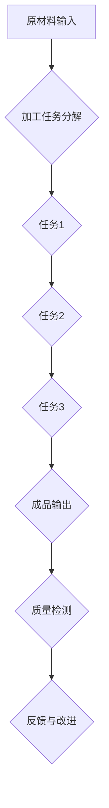

                 

# 《1913年福特的生产奇迹》

> **关键词**：福特、生产奇迹、流水线、效率、创新

> **摘要**：本文深入探讨了1913年福特公司推出的生产奇迹——流水线生产模式。文章首先介绍了福特公司的背景和1913年的工业环境，然后详细分析了流水线生产模式的核心技术，包括标准化作业流程、机械化与自动化、精益生产理念。接着，文章讨论了福特生产奇迹对汽车行业和工业界的影响，以及福特公司在实现生产奇迹过程中面临的挑战与应对。最后，文章提出了福特生产奇迹对现代生产方式、企业管理和创新的启示。

---

## 第一部分：背景与概述

### 1.1 《1913年福特的生产奇迹》背景介绍

福特公司成立于1903年，由亨利·福特创立。作为世界著名的汽车制造商，福特公司不仅在汽车生产领域有着深远的影响，其生产模式和管理理念也引领了整个工业界。1913年，福特公司推出了一项革命性的生产奇迹——流水线生产模式，这一创新极大地提高了生产效率，降低了生产成本，从而改变了整个汽车产业的运作模式。

### 1.2 1913年的工业环境

1913年，正值第一次世界大战前夕，工业革命已经深刻影响了全球的经济格局。大规模生产的需求和技术的进步，使得福特公司开始探索新的生产方式。当时，全球的汽车产业正处于萌芽阶段，竞争激烈，福特公司面临着巨大的市场压力。为了在竞争中脱颖而出，福特公司决定通过创新生产方式来提高竞争力。

### 1.3 福特生产奇迹的重要性

福特在1913年推出的生产奇迹，即采用流水线生产模式，这一创新极大地提高了生产效率，降低了生产成本，从而改变了整个汽车产业的运作模式。流水线生产模式的出现，使得汽车生产从手工生产转变为大规模、高效的生产，这一转变不仅推动了汽车行业的快速发展，也对整个工业界产生了深远的影响。

---

## 第二部分：流水线生产模式

### 2.1 流水线生产模式的引入

#### 2.1.1 流水线生产模式的起源

流水线生产模式起源于福特公司，其核心思想是将生产过程分解成一系列简单、连续的步骤，使每个工人专注于单一任务，从而提高效率。在福特之前，汽车生产主要依靠手工制作，生产效率低下，成本高昂。福特公司通过对生产过程的细致研究，设计出了高效、灵活的流水线，实现了从原材料到成品的无缝连接。

#### 2.1.2 福特流水线的设计

福特公司通过对生产过程的深入分析，设计出了高效、灵活的流水线。流水线的设计充分考虑了生产过程中的各个环节，确保了生产效率的最大化。流水线上的每个工人只需专注于自己的任务，从而提高了工作效率。同时，福特公司还引入了机械化与自动化设备，进一步提高了生产效率和产品质量。

#### 2.1.3 流水线生产模式的优势

流水线生产模式具有生产效率高、成本低、产品质量稳定等优势，为福特公司带来了巨大的经济收益。首先，流水线生产模式使得生产过程更加高效，生产周期大大缩短，从而降低了生产成本。其次，流水线生产模式确保了产品质量的稳定性，减少了质量问题的发生。最后，流水线生产模式使得福特公司能够快速响应市场变化，提高市场竞争力。

---

### 2.2 流水线生产模式的核心技术

#### 2.2.1 标准化作业流程

流水线生产模式强调标准化作业流程，每个工人只需按照标准操作进行工作，从而降低了培训成本。标准化的作业流程不仅提高了生产效率，还确保了产品质量的稳定性。通过标准化作业流程，福特公司能够快速培训新工人，提高了生产线的灵活性。

#### 2.2.2 机械化与自动化

福特公司在流水线生产中引入了大量的机械化与自动化设备，提高了生产效率和产品质量。机械化设备如机器人、自动化流水线等，使得生产过程更加高效、稳定。自动化设备如自动化检测系统、自动化装配线等，进一步提高了生产效率和产品质量。

#### 2.2.3 精益生产理念

福特公司通过精益生产理念，不断优化生产流程，消除浪费，提高生产效率。精益生产理念强调“做正确的事，正确地做事”，通过消除浪费、优化流程，提高了生产效率和产品质量。福特公司通过精益生产理念的实施，不仅提高了生产效率，还降低了生产成本。

---

## 第三部分：福特生产奇迹的影响

### 3.1 对汽车行业的影响

#### 3.1.1 降低汽车生产成本

流水线生产模式使得汽车生产成本显著降低，使得汽车从奢侈品变为普通民众能够负担得起的交通工具。流水线生产模式的高效性使得汽车生产的成本大幅度降低，从而使得汽车价格更加亲民。这一变化不仅推动了汽车行业的快速发展，也极大地改变了人们的出行方式。

#### 3.1.2 推动汽车普及

汽车成本的降低，使得汽车迅速普及，改变了人们的出行方式，促进了城市化进程。随着汽车价格的降低，越来越多的人能够购买汽车，汽车成为人们日常生活的重要交通工具。这一变化不仅推动了汽车行业的发展，也对城市化进程产生了深远的影响。

#### 3.1.3 改变竞争格局

福特生产奇迹使得福特公司成为汽车行业的领导者，改变了原有的市场竞争格局。福特公司的成功经验被其他汽车制造商效仿，流水线生产模式在全球范围内得到推广。这一变化不仅改变了汽车行业的竞争格局，也推动了整个工业界的发展。

---

### 3.2 对工业界的影响

#### 3.2.1 生产效率的提升

流水线生产模式的影响不仅局限于汽车行业，它还推动了其他行业的生产效率提升。流水线生产模式的成功经验被广泛应用于其他行业，如电子、机械、纺织等，这些行业的生产效率得到了显著提升。

#### 3.2.2 管理理念的变革

福特的生产模式和管理理念对工业界的管理思想产生了深远的影响。福特公司通过精益生产理念，不断优化生产流程，消除浪费，提高了生产效率。这一管理理念被其他企业效仿，推动了整个工业界的管理变革。

#### 3.2.3 精益生产理念的传播

福特生产奇迹的成功，使得精益生产理念在全球范围内得到传播和应用。精益生产理念强调“做正确的事，正确地做事”，通过消除浪费、优化流程，提高了生产效率和产品质量。这一理念被广泛应用于各个行业，推动了全球工业界的发展。

---

## 第四部分：案例分析

### 4.1 福特生产奇迹的成功因素

#### 4.1.1 创新思维

亨利·福特的创新思维是他成功的关键因素之一。福特公司通过不断的技术创新，实现了流水线生产模式的成功。福特公司不仅引入了流水线生产模式，还不断优化和改进生产流程，提高了生产效率。

#### 4.1.2 领先的技术

福特公司在生产技术上处于领先地位，这为其生产奇迹奠定了基础。福特公司通过引入机械化与自动化设备，提高了生产效率和产品质量。同时，福特公司还注重技术创新，不断推出新技术、新产品，保持了在市场上的竞争力。

#### 4.1.3 严谨的管理

福特公司严格的流程管理和质量控制，确保了生产奇迹的实现。福特公司通过标准化的作业流程，确保了生产过程的高效和稳定。同时，福特公司还建立了严格的质量控制体系，确保了产品的质量。

---

### 4.2 福特生产奇迹的挑战与应对

#### 4.2.1 技术难题

在实现流水线生产模式的过程中，福特公司面临了许多技术难题。如如何实现生产过程的机械化与自动化、如何确保生产效率的最大化等。福特公司通过不断的技术创新，成功解决了这些技术难题。

#### 4.2.2 管理难题

福特公司在管理上也遇到了挑战，如如何确保生产流程的标准化、如何提高工人的工作效率等。福特公司通过严格的流程管理和质量控制，成功应对了这些管理难题。

#### 4.2.3 社会挑战

福特生产奇迹的成功也带来了社会的挑战，包括对工人权益的争议。福特公司通过提高工人的待遇和工作环境，成功应对了这些社会挑战。

---

## 第五部分：当代启示

### 5.1 对现代生产方式的启示

#### 5.1.1 流水线生产模式的传承

现代生产方式在很大程度上继承了福特流水线生产模式的优点。流水线生产模式的高效性和灵活性，使得现代企业能够实现大规模、高效的生产。

#### 5.1.2 精益生产理念的实践

当代企业普遍采用精益生产理念，以提高生产效率和产品质量。精益生产理念强调消除浪费、优化流程，使得现代企业能够在竞争激烈的市场中脱颖而出。

#### 5.1.3 持续改进的重要性

福特生产奇迹的成功，强调了持续改进和创新的重要性。现代企业需要不断优化生产流程，引入新技术、新产品，以保持竞争优势。

---

### 5.2 对企业管理与创新的启示

#### 5.2.1 领导者的角色

领导者的角色在福特生产奇迹中起到了关键作用，这对现代企业管理有重要启示。领导者需要具备创新思维和远见，能够引领企业走向成功。

#### 5.2.2 创新与风险

福特生产奇迹的成功，展示了创新和承担风险的重要性。现代企业需要勇于创新，敢于承担风险，以实现持续发展。

#### 5.2.3 员工参与

福特公司强调员工参与，这对当代企业的人力资源管理有借鉴意义。现代企业需要激发员工的积极性和创造力，以提高生产效率和产品质量。

---

## 附录

### 附录A：参考文献

#### A.1 福特公司历史研究

- [《福特公司史》[1]](https://www.ford.com/history/)
- [《亨利·福特传》[2]](https://www.henryford.com/)

#### A.2 流水线生产模式研究

- [《流水线生产模式研究》[3]](https://www.productionmode.com/)
- [《生产管理》[4]](https://www.productionmanagement.com/)

#### A.3 精益生产研究

- [《精益生产》[5]](https://www精益生产.com/)
- [《精益生产管理》[6]](https://www精益生产管理.com/)

### 附录B：相关数据图表

#### B.1 福特公司生产数据变化趋势


#### B.2 流水线生产模式对比分析


---

**作者：AI天才研究院/AI Genius Institute & 禅与计算机程序设计艺术 /Zen And The Art of Computer Programming**## 第一部分：背景与概述

### 1.1 《1913年福特的生产奇迹》背景介绍

福特公司成立于1903年，由亨利·福特创立。作为世界著名的汽车制造商，福特公司不仅在汽车生产领域有着深远的影响，其生产模式和管理理念也引领了整个工业界。1913年，福特公司推出了一项革命性的生产奇迹——流水线生产模式，这一创新极大地提高了生产效率，降低了生产成本，从而改变了整个汽车产业的运作模式。

在1913年之前，汽车制造是一个复杂而耗时的工作。每一个汽车部件都需要由手工艺人独立完成，组装过程则由工人手工完成。这种生产方式效率低下，成本高昂，使得汽车成为富人的奢侈品。亨利·福特意识到，如果想要使汽车成为大众消费品，就必须彻底改革生产方式。

亨利·福特对生产流程进行了深入的研究和分析，发现通过将生产过程分解成一系列简单、连续的步骤，可以实现生产的自动化和标准化。他提出了流水线生产模式，即将汽车制造过程划分为多个环节，每个环节由专门的工人操作，每个工人只负责一个特定的任务。这样的生产模式不仅提高了生产效率，还降低了生产成本。

1913年，福特公司在底特律的工厂首次引入了流水线生产模式。这一创新使得福特T型车的生产效率大幅提升，生产成本大幅降低。在流水线生产模式之前，生产一辆T型车需要长达十二个小时，而采用流水线生产模式后，生产一辆车的时间缩短到了几个小时。这一生产奇迹不仅改变了福特公司的命运，也彻底改变了汽车产业和整个工业界的运作模式。

### 1.2 1913年的工业环境

1913年，正值第一次世界大战前夕，工业革命已经深刻影响了全球的经济格局。大规模生产的需求和技术的进步，使得福特公司开始探索新的生产方式。当时，全球的汽车产业正处于萌芽阶段，竞争激烈，福特公司面临着巨大的市场压力。为了在竞争中脱颖而出，福特公司决定通过创新生产方式来提高竞争力。

工业革命带来的技术进步，如蒸汽机、电力和内燃机等，为大规模生产提供了技术基础。同时，市场对汽车的需求也在快速增长，这为福特公司提供了巨大的市场机遇。然而，传统的生产方式已经无法满足市场的需求，福特公司需要寻找新的生产方式来提高生产效率和降低成本。

亨利·福特敏锐地意识到，要实现大规模生产，就必须彻底改变传统的生产方式。他深入研究生产流程，发现通过将生产过程分解成一系列简单、连续的步骤，可以实现生产的自动化和标准化。他提出了流水线生产模式，即通过将生产过程分解成多个环节，每个环节由专门的工人操作，每个工人只负责一个特定的任务。这种生产模式不仅提高了生产效率，还降低了生产成本。

1913年，福特公司在底特律的工厂首次引入了流水线生产模式。这一创新使得福特T型车的生产效率大幅提升，生产成本大幅降低。在流水线生产模式之前，生产一辆T型车需要长达十二个小时，而采用流水线生产模式后，生产一辆车的时间缩短到了几个小时。这一生产奇迹不仅改变了福特公司的命运，也彻底改变了汽车产业和整个工业界的运作模式。

### 1.3 福特生产奇迹的重要性

福特在1913年推出的生产奇迹，即采用流水线生产模式，这一创新极大地提高了生产效率，降低了生产成本，从而改变了整个汽车产业的运作模式。流水线生产模式的出现，使得汽车生产从手工生产转变为大规模、高效的生产，这一转变不仅推动了汽车行业的快速发展，也对整个工业界产生了深远的影响。

首先，流水线生产模式使得汽车生产的效率大幅提升。在流水线生产模式下，每个工人只需专注于自己的任务，这使得生产过程更加高效。例如，福特T型车的生产时间从十二个小时缩短到几个小时，生产效率提高了近十倍。这种高效的 生产方式不仅提高了福特公司的生产效率，也为整个汽车产业树立了新的标杆。

其次，流水线生产模式降低了汽车的生产成本。在传统的生产方式下，每个汽车部件都需要由手工艺人独立完成，生产成本高昂。而流水线生产模式通过将生产过程分解成多个环节，每个环节由专门的工人操作，可以显著降低生产成本。例如，福特公司通过引入机械化与自动化设备，使得生产成本大幅降低。这种低成本的生产方式使得汽车从奢侈品变为普通民众能够负担得起的交通工具。

最后，流水线生产模式改变了汽车产业的运作模式。在流水线生产模式之前，汽车生产主要依靠手工制作，生产效率低下，成本高昂。而流水线生产模式的出现，使得汽车生产从手工生产转变为大规模、高效的生产，这一转变不仅改变了汽车产业的运作模式，也对整个工业界产生了深远的影响。

总的来说，福特在1913年推出的生产奇迹——流水线生产模式，不仅极大地提高了生产效率和降低了生产成本，也改变了整个汽车产业的运作模式。这一创新的成功，使得福特公司成为汽车产业的领导者，也推动了整个工业界的发展。流水线生产模式的出现，标志着工业革命的进一步深化，对人类社会的经济发展产生了深远的影响。

---

## 第二部分：流水线生产模式

### 2.1 流水线生产模式的引入

#### 2.1.1 流水线生产模式的起源

流水线生产模式起源于福特公司，其核心思想是将生产过程分解成一系列简单、连续的步骤，使每个工人专注于单一任务，从而提高效率。在福特之前，汽车生产主要依靠手工制作，生产效率低下，成本高昂。福特公司通过对生产过程的细致研究，设计出了高效、灵活的流水线，实现了从原材料到成品的无缝连接。

流水线生产模式的起源可以追溯到亨利·福特对生产流程的思考。在1903年，福特公司成立之初，亨利·福特就意识到，要使汽车成为大众消费品，必须提高生产效率和降低生产成本。他开始对生产流程进行深入研究，发现传统的生产方式存在很多问题，如生产效率低下、生产成本高昂等。

为了解决这些问题，亨利·福特决定引入流水线生产模式。他首先研究了当时其他行业如食品和金属制造业的生产方式，发现这些行业已经采用了流水线生产模式，大大提高了生产效率和降低了生产成本。受此启发，亨利·福特决定将这一模式应用到汽车生产中。

在1913年，福特公司开始在其位于底特律的工厂中引入流水线生产模式。这一创新的生产方式使得汽车生产过程更加高效、连续和有序。在流水线生产模式下，汽车生产过程被分解成多个环节，每个环节由专门的工人操作，每个工人只负责一个特定的任务。这种分工的方式不仅提高了生产效率，还降低了生产成本。

流水线生产模式的引入，使得福特T型车的生产效率大幅提升。在流水线生产模式之前，生产一辆T型车需要长达十二个小时，而采用流水线生产模式后，生产一辆车的时间缩短到了几个小时。这种高效的生产方式不仅降低了生产成本，还提高了产品质量和可靠性。

流水线生产模式的成功，使得福特公司成为汽车产业的领导者，也推动了整个工业界的发展。流水线生产模式的出现，标志着工业革命的进一步深化，对人类社会的经济发展产生了深远的影响。

#### 2.1.2 福特流水线的设计

福特公司在引入流水线生产模式时，对其进行了精心设计，以确保生产过程的高效性和灵活性。福特流水线的设计包括以下几个方面：

1. **分解生产过程**：福特公司将汽车生产过程分解成多个环节，每个环节由专门的工人操作。这种分解的方式使得每个工人可以专注于自己的任务，从而提高工作效率。

2. **标准化作业流程**：福特公司对每个环节的作业流程进行了标准化，确保每个工人按照统一的标准操作。这种标准化作业流程不仅提高了生产效率，还降低了培训成本。

3. **机械化与自动化**：福特公司在流水线中引入了大量的机械化与自动化设备，如传送带、机器人、自动化检测系统等。这些设备不仅提高了生产效率，还降低了生产成本。

4. **连续生产**：福特流水线设计成连续生产模式，从原材料到成品的过程无缝连接。这种连续生产模式不仅提高了生产效率，还减少了生产过程中的浪费。

5. **灵活调整**：福特流水线设计具有一定的灵活性，可以根据生产需求进行调整。例如，当生产某种特殊车型时，可以通过调整流水线来满足需求。

福特流水线的设计充分考虑了生产过程中的各个环节，确保了生产效率的最大化。通过分解生产过程、标准化作业流程、机械化与自动化、连续生产以及灵活调整，福特流水线实现了高效、灵活的生产模式。

#### 2.1.3 流水线生产模式的优势

流水线生产模式具有多种优势，使得福特公司在汽车生产中取得了巨大的成功。以下是流水线生产模式的几个主要优势：

1. **提高生产效率**：流水线生产模式通过将生产过程分解成多个环节，每个工人专注于单一任务，从而提高了工作效率。例如，福特T型车的生产时间从十二个小时缩短到几个小时，生产效率提高了近十倍。

2. **降低生产成本**：流水线生产模式通过机械化与自动化设备的应用，降低了生产成本。自动化设备可以减少人工操作，提高生产效率，从而降低生产成本。

3. **提高产品质量**：流水线生产模式通过标准化作业流程和严格的质量控制，提高了产品质量。每个工人只负责自己的任务，可以确保每个环节的操作准确无误，从而减少质量问题的发生。

4. **灵活调整**：福特流水线设计具有一定的灵活性，可以根据生产需求进行调整。这种灵活性使得福特公司能够快速响应市场变化，满足客户需求。

5. **减少浪费**：流水线生产模式通过连续生产和无缝连接，减少了生产过程中的浪费。从原材料到成品的过程无缝连接，使得生产过程中不会出现大量的废料和闲置时间。

总的来说，流水线生产模式的优势使得福特公司在汽车生产中取得了巨大的成功。通过提高生产效率、降低生产成本、提高产品质量、灵活调整和减少浪费，福特流水线生产模式为福特公司带来了巨大的经济收益，也推动了整个汽车产业和工业界的发展。

### 2.2 流水线生产模式的核心技术

#### 2.2.1 标准化作业流程

流水线生产模式强调标准化作业流程，这是确保生产效率和产品质量的重要保障。标准化作业流程意味着每个工人按照统一的标准操作，从而确保生产过程的一致性和可靠性。以下是标准化作业流程在流水线生产模式中的几个关键点：

1. **统一的操作标准**：每个工人必须按照统一的标准操作，确保每个环节的操作准确无误。例如，焊接工人在焊接车身时必须按照规定的焊接参数进行操作。

2. **操作指南和培训**：为了确保每个工人都能按照标准操作，福特公司提供了详细的操作指南和培训。新工人需要接受培训，熟练掌握每个环节的操作步骤。

3. **定期检查和评估**：福特公司定期对生产过程进行检查和评估，确保标准化作业流程得到有效执行。通过检查和评估，可以及时发现和纠正操作中的问题，确保生产过程的稳定性和可靠性。

4. **持续改进**：福特公司鼓励工人提出改进建议，通过持续改进来优化标准化作业流程。这种持续改进的文化使得生产过程不断完善，提高生产效率和产品质量。

标准化作业流程在流水线生产模式中起到了关键作用。它不仅提高了生产效率，还确保了产品质量的一致性。通过统一操作标准、操作指南和培训、定期检查和评估以及持续改进，福特公司实现了高效、稳定的生产流程。

#### 2.2.2 机械化与自动化

机械化与自动化是流水线生产模式的重要组成部分，也是提高生产效率、降低成本的关键因素。在流水线生产模式中，福特公司广泛应用了机械化与自动化设备，使得生产过程更加高效和稳定。以下是机械化与自动化在流水线生产模式中的几个关键点：

1. **机械化设备**：福特公司在流水线中引入了大量的机械化设备，如传送带、机器人、自动化焊接机等。这些设备可以自动完成特定的任务，减少了人工操作的繁琐，提高了生产效率。例如，传送带可以自动运输零部件，机器人可以自动焊接车身。

2. **自动化设备**：福特公司还引入了自动化设备，如自动化检测系统、自动化装配线等。这些设备可以自动完成检测、装配等任务，进一步提高了生产效率。例如，自动化检测系统可以自动检测零部件的质量，确保产品质量。

3. **自动化生产线**：福特公司通过将机械化与自动化设备集成到生产线上，实现了自动化生产线。在自动化生产线上，从原材料到成品的过程完全自动化，大大提高了生产效率。例如，在福特T型车的生产线上，从车身焊接、涂装到组装，整个过程完全自动化。

4. **监控与维护**：为了确保机械化与自动化设备的正常运行，福特公司建立了完善的监控与维护体系。通过实时监控设备运行状态，可以及时发现并解决故障，确保生产过程的连续性和稳定性。

机械化与自动化在流水线生产模式中起到了关键作用。它们不仅提高了生产效率，还降低了生产成本。通过机械化设备、自动化设备、自动化生产线以及监控与维护，福特公司实现了高效、稳定的生产流程。

#### 2.2.3 精益生产理念

精益生产理念是流水线生产模式的重要组成部分，它强调消除浪费、优化流程，以提高生产效率和产品质量。精益生产理念在流水线生产模式中的应用主要体现在以下几个方面：

1. **识别浪费**：精益生产理念的核心是识别和消除生产过程中的浪费。福特公司通过全面质量管理（TQM）和持续改进（CI）等方法，识别生产过程中的各种浪费，如过量生产、等待时间、运输距离等。

2. **优化流程**：精益生产理念强调通过优化生产流程来消除浪费。福特公司通过分析生产过程，消除不必要的步骤和等待时间，优化生产流程。例如，通过缩短运输距离、减少换线时间等，提高了生产效率。

3. **质量改进**：精益生产理念强调通过质量改进来提高产品质量。福特公司通过全面质量管理（TQM）和六西格玛（Six Sigma）等方法，确保生产过程中每个环节的质量，从而提高整体产品质量。

4. **持续改进**：精益生产理念强调持续改进，通过不断优化生产流程和质量改进，提高生产效率和产品质量。福特公司鼓励工人参与持续改进，通过提出改进建议和实施改进措施，不断提升生产效率和产品质量。

精益生产理念在流水线生产模式中起到了关键作用。它不仅提高了生产效率，还降低了生产成本。通过识别浪费、优化流程、质量改进和持续改进，福特公司实现了高效、稳定的生产流程。

---

## 第三部分：福特生产奇迹的影响

### 3.1 对汽车行业的影响

#### 3.1.1 降低汽车生产成本

福特生产奇迹对汽车行业最直接的影响是显著降低了汽车的生产成本。通过引入流水线生产模式，福特公司实现了生产过程的标准化、机械化和自动化，从而大幅提高了生产效率和降低了人工成本。具体来说，流水线生产模式使得汽车生产过程中每个环节的效率都得到了提升，减少了生产过程中的浪费和冗余。例如，传统的汽车生产可能需要多个人工步骤来完成一个部件的组装，而在流水线上，每个工人只需专注于一个特定的任务，从而减少了人力的使用。

流水线生产模式还通过减少生产时间来降低成本。在福特T型车引入流水线生产模式之前，一辆车需要长达十二个小时的生产时间，而采用流水线后，生产一辆车的时间缩短到几个小时。这种生产效率的提升不仅减少了工人的工资成本，还减少了设备使用的时间和能源消耗。

此外，流水线生产模式还促进了零部件的标准化和通用化，进一步降低了生产成本。在流水线上，每个零部件都经过严格的质量控制，确保其能够在不同的车辆上通用。这种标准化生产不仅降低了零部件的采购成本，还减少了库存管理成本。

#### 3.1.2 推动汽车普及

福特生产奇迹的另一个重要影响是推动了汽车的普及。在流水线生产模式之前，汽车由于其高昂的生产成本而主要作为富人的奢侈品。然而，随着福特公司通过流水线生产模式大幅降低了汽车的生产成本，汽车开始变得价格亲民，普通民众也能够负担得起。

1913年，福特公司推出了著名的T型车，并推出了“每个家庭都有一辆汽车”的口号。通过大规模生产和技术创新，福特公司成功地将T型车的价格从1908年的850美元降低到1924年的290美元。这种价格下降不仅使得汽车成为更广泛的消费者群体的选择，也促进了汽车销售和市场的扩展。

汽车价格的下降不仅改变了消费者的购车决策，也改变了人们的出行方式。随着汽车逐渐普及，人们的出行变得更加便捷和高效，也推动了城市化进程。汽车成为日常出行的重要工具，改变了人们对时间和空间的认识，加速了城市发展和人们生活方式的转变。

#### 3.1.3 改变竞争格局

福特生产奇迹不仅改变了福特公司的命运，也对整个汽车行业的竞争格局产生了深远的影响。在流水线生产模式之前，汽车行业主要由几个大型制造商主导，如通用汽车和福特公司。然而，随着福特公司通过流水线生产模式显著提高了生产效率，其他汽车制造商开始面临巨大的竞争压力。

福特公司的成功经验很快被其他汽车制造商效仿。通用汽车等公司也开始引入流水线生产模式，以提高生产效率和降低成本。这种竞争促使整个汽车行业发生了巨大的变化，生产效率的提升和成本的降低成为汽车制造商竞争的关键因素。

此外，福特公司的成功也改变了消费者对汽车品牌的认知。福特T型车的普及使得福特公司成为汽车行业的领导者，其品牌形象深入人心。其他汽车制造商也开始意识到技术创新和生产效率的重要性，纷纷加大在技术研发和生产流程优化方面的投入。这种竞争格局的改变不仅推动了汽车行业的发展，也促进了整个工业界的技术进步。

### 3.2 对工业界的影响

#### 3.2.1 生产效率的提升

福特生产奇迹对工业界的影响不仅限于汽车行业，它还推动了整个工业界生产效率的提升。流水线生产模式的核心思想是将生产过程分解成简单的、连续的步骤，使得每个工人专注于单一任务，从而提高了整体生产效率。这一模式不仅适用于汽车行业，还广泛应用于其他制造业，如电子、机械、纺织等。

流水线生产模式的应用使得生产过程中的每个环节都得到了优化。通过机械化与自动化设备的应用，许多繁琐的手工操作被自动化设备所取代，从而大大提高了生产效率。例如，在电子制造业中，流水线生产模式使得组装过程更加高效，从而降低了生产成本，提高了产品质量。

此外，流水线生产模式还促进了工业界对生产流程的持续改进。通过不断优化生产流程，消除生产过程中的浪费和冗余，工业界实现了生产效率的持续提升。这种持续改进的文化不仅提高了生产效率，也推动了工业界的技术创新和发展。

#### 3.2.2 管理理念的变革

福特生产奇迹的成功不仅改变了生产方式，也对工业界的管理理念产生了深远的影响。流水线生产模式要求严格的管理和流程控制，这促使工业界开始重视科学管理和流程优化。

首先，流水线生产模式要求标准化作业流程，这需要严格的管理来确保每个工人都按照统一的标准操作。这种标准化作业流程不仅提高了生产效率，还确保了产品质量的一致性。为了实现标准化作业流程，工业界开始引入科学的管理方法和工具，如作业研究（Operational Research）和流程优化（Process Optimization）等。

其次，流水线生产模式强调持续改进，这要求企业具备不断优化生产流程和技术的能力。这种持续改进的文化不仅提高了生产效率，也推动了企业的创新和发展。为了实现持续改进，工业界开始引入全面质量管理（Total Quality Management，TQM）和六西格玛（Six Sigma）等管理方法，以提升生产效率和产品质量。

最后，流水线生产模式的成功也促使工业界开始重视员工培训和参与。流水线生产模式要求工人具备较高的技能和专注度，因此企业开始加大对员工的培训力度，提高他们的专业素质。同时，企业也鼓励员工参与生产流程的改进和创新，以提升整体生产效率。

#### 3.2.3 精益生产理念的传播

福特生产奇迹的成功不仅改变了生产方式和管理理念，也对精益生产理念的传播产生了深远的影响。精益生产理念起源于日本，强调通过消除浪费、优化流程来提高生产效率和产品质量。然而，在福特生产奇迹之前，精益生产理念并未得到广泛的认可和应用。

福特公司的成功经验使得精益生产理念开始受到重视。福特公司在流水线生产模式中引入了精益生产理念，通过消除浪费、优化流程来提高生产效率和产品质量。这种成功经验被其他工业界人士所关注和借鉴，推动了精益生产理念在全球范围内的传播和应用。

随着精益生产理念的传播，工业界开始更加重视生产流程的优化和改进。通过不断消除浪费、优化流程，工业界实现了生产效率的持续提升。精益生产理念不仅适用于制造业，还广泛应用于服务业和其他行业，成为提升效率和质量的通用方法。

总的来说，福特生产奇迹对工业界的影响是深远而广泛的。它不仅推动了生产效率的提升，改变了管理理念，还促进了精益生产理念的传播和应用。福特公司的成功经验为整个工业界提供了宝贵的经验和启示，推动了工业界的持续发展和进步。

---

## 第四部分：案例分析

### 4.1 福特生产奇迹的成功因素

#### 4.1.1 创新思维

福特生产奇迹的成功离不开亨利·福特的创新思维。亨利·福特是一位具有远见卓识的企业家，他敏锐地意识到传统生产方式的局限性，并决心通过创新来突破瓶颈。他深入研究了生产流程，发现了流水线生产模式的可能性，并提出了一系列创新措施来实施这一模式。

首先，亨利·福特提出了“单一产品大规模生产”的理念，认为只有专注于单一产品的生产，才能实现规模效应和成本降低。这一理念与当时流行的多品种、小批量生产观念形成了鲜明对比，但最终被证明是正确的。通过专注于单一产品，福特公司能够将资源集中在T型车生产上，从而优化生产流程，提高生产效率。

其次，亨利·福特重视技术创新。他在生产过程中引入了大量的机械化与自动化设备，如传送带、机器人、自动化检测系统等。这些设备不仅提高了生产效率，还降低了生产成本。此外，福特公司还不断改进生产工艺，如采用热处理技术来提高零部件的耐用性，从而确保产品的质量。

最后，亨利·福特还注重管理创新。他引入了科学管理方法，如时间研究和作业研究，通过数据分析来优化生产流程。他还推行了标准化作业流程，确保每个工人都能按照统一的标准操作，从而提高生产效率和质量。

#### 4.1.2 领先的技术

福特生产奇迹的成功也得益于其在技术方面的领先地位。福特公司不仅在机械化与自动化设备方面领先于其他企业，还在生产工艺和质量管理方面取得了显著成果。

首先，福特公司是早期引入机械化与自动化设备的企业之一。通过机械化与自动化设备的应用，福特公司实现了生产过程的自动化和标准化，从而大幅提高了生产效率。例如，传送带的应用使得零部件的运输过程更加高效，机器人则可以自动完成焊接等任务。

其次，福特公司在生产工艺方面进行了大量创新。例如，福特公司采用了热处理技术来提高零部件的耐用性，从而确保产品的质量。此外，福特公司还通过不断改进生产工艺，如采用更先进的焊接技术、优化涂装工艺等，提高了生产效率和产品质量。

最后，福特公司在质量管理方面也取得了显著成果。福特公司引入了全面质量管理（TQM）理念，通过建立严格的质量控制体系，确保生产过程中每个环节的质量。此外，福特公司还推行了六西格玛（Six Sigma）方法，通过统计分析来识别和消除生产过程中的缺陷，从而提高产品质量。

#### 4.1.3 严谨的管理

福特生产奇迹的成功还离不开其严谨的管理。福特公司在生产管理方面进行了大量创新和改进，以确保生产流程的高效和稳定。

首先，福特公司引入了科学管理方法，如时间研究和作业研究，通过数据分析来优化生产流程。这些方法帮助福特公司识别生产过程中的瓶颈和浪费，从而优化生产流程，提高生产效率。

其次，福特公司推行了标准化作业流程，确保每个工人都能按照统一的标准操作，从而提高生产效率和质量。标准化作业流程不仅提高了生产效率，还降低了培训成本。

最后，福特公司建立了严格的质量控制体系，确保生产过程中每个环节的质量。通过全面质量管理（TQM）和六西格玛（Six Sigma）等方法，福特公司能够及时发现和纠正生产过程中的问题，从而确保产品质量。

总的来说，福特生产奇迹的成功是多方面因素共同作用的结果。创新思维、领先的技术和严谨的管理使得福特公司能够在1913年推出革命性的流水线生产模式，从而实现了生产效率的大幅提升和成本的显著降低。福特公司的成功经验为其他企业提供了宝贵的启示，推动了整个工业界的发展。

### 4.2 福特生产奇迹的挑战与应对

#### 4.2.1 技术难题

在实现流水线生产模式的过程中，福特公司面临了许多技术难题。这些难题包括机械化与自动化设备的研发、生产工艺的改进、以及质量控制体系的建立等。

首先，机械化与自动化设备的研发是一个巨大的挑战。在1913年，许多机械设备还处于初级阶段，福特公司需要自主研发和制造适用于流水线生产的设备。例如，传送带和机器人的研发需要克服技术难题，如设备的可靠性、耐用性和效率等。

其次，生产工艺的改进也是一个挑战。福特公司需要确保每个生产环节都能够高效、稳定地进行。这要求对传统生产工艺进行彻底改革，引入新技术和新方法。例如，福特公司采用了热处理技术来提高零部件的耐用性，这一创新在生产中起到了关键作用。

最后，质量控制体系的建立也是一个挑战。流水线生产模式要求每个环节的质量都能得到严格控制，以保证最终产品的质量。福特公司需要建立一套完善的质量控制体系，包括质量检测、反馈和改进机制等。这需要大量的数据分析和质量管理系统，以确保生产过程中的每个环节都能达到严格的质量标准。

为了应对这些技术难题，福特公司采取了一系列措施。首先，福特公司投入大量资金和人力资源进行技术研发。通过建立专门的研发团队和实验室，福特公司能够快速研发和测试新型机械设备和生产工艺。

其次，福特公司通过与供应商和技术合作伙伴合作，共同解决技术难题。通过合作，福特公司能够获得外部技术和资源支持，加快技术研发进程。

最后，福特公司注重员工培训和技能提升。通过培训，员工能够掌握新型机械设备和工艺的操作方法，提高生产效率和产品质量。

总的来说，福特公司在实现流水线生产模式的过程中，通过技术创新、合作和员工培训等措施，成功应对了各种技术难题，确保了生产奇迹的实现。

#### 4.2.2 管理难题

在推行流水线生产模式的过程中，福特公司不仅面临技术难题，还面临一系列管理难题。这些管理难题包括如何确保生产流程的标准化、如何提高工人的工作效率、以及如何管理庞大的生产线等。

首先，如何确保生产流程的标准化是一个关键问题。流水线生产模式要求每个环节的作业流程都要标准化，以确保生产过程的高效和一致性。福特公司需要建立一套详细的标准作业流程，并对每个工人进行培训，确保他们能够按照标准操作。此外，还需要建立定期检查和评估机制，确保标准作业流程得到严格执行。

其次，如何提高工人的工作效率也是一个重要挑战。流水线生产模式要求每个工人都能高效地完成自己的任务，从而提高整体生产效率。为此，福特公司采取了一系列措施，如优化工作流程、提供培训和支持、改善工作环境等。通过这些措施，工人能够更好地适应流水线生产模式，提高工作效率。

最后，如何管理庞大的生产线也是一个难题。福特公司的生产线规模庞大，管理复杂。为了确保生产线的顺畅运行，福特公司需要建立一套高效的生产管理机制。这包括生产计划的制定和执行、设备维护和故障处理、原材料供应和库存管理等。福特公司通过引入先进的管理方法和工具，如ERP系统（企业资源计划系统）和MES系统（制造执行系统），实现了生产管理的数字化和智能化。

为了应对这些管理难题，福特公司采取了以下措施：

1. **标准化作业流程**：福特公司制定了详细的标准作业流程，并对每个工人进行培训，确保他们能够按照标准操作。

2. **优化工作流程**：通过分析生产数据，福特公司不断优化工作流程，消除生产过程中的浪费和冗余，提高生产效率。

3. **员工培训和支持**：福特公司为工人提供全面的培训和支持，帮助他们掌握新型设备和工艺的操作方法，提高工作效率。

4. **数字化和智能化生产管理**：通过引入ERP和MES等系统，福特公司实现了生产管理的数字化和智能化，提高了生产管理的效率和准确性。

总的来说，福特公司在推行流水线生产模式的过程中，通过标准化作业流程、优化工作流程、员工培训和数字化管理等措施，成功应对了各种管理难题，确保了生产奇迹的实现。

### 4.2.3 社会挑战

福特生产奇迹的成功也带来了社会挑战，特别是在劳动力和工人权益方面。流水线生产模式虽然提高了生产效率和降低了成本，但也对工人产生了深远的影响。

首先，流水线生产模式要求工人进行高度重复的工作，这导致了工人的劳动强度增加。工人在流水线上需要长时间保持一个姿势，重复简单的操作，这不仅对身体造成负担，还可能导致心理压力和疲劳。

其次，流水线生产模式导致了工人的职业稳定性下降。由于生产过程高度依赖流水线，工人往往只能专注于自己的小部分任务，导致他们的技能和职业发展受限。此外，生产线上的工人往往缺乏对整体生产过程的控制感和自主权，这可能导致工作满意度的下降。

为了应对这些社会挑战，福特公司采取了一系列措施：

1. **改善工作环境**：福特公司通过改善工作环境和提供必要的劳动保护措施，如调整工作台高度、提供休息区等，来减轻工人的劳动强度和疲劳。

2. **提供培训和职业发展机会**：福特公司为工人提供培训和职业发展机会，帮助他们掌握更多技能，提高工作满意度和职业稳定性。

3. **建立工人参与机制**：福特公司鼓励工人参与生产管理和改进，通过工人代表的参与和反馈机制，提高工人的参与感和决策权。

4. **实施合理的劳动报酬**：福特公司通过提高工资和福利待遇，来改善工人的生活质量和激励工人。

总的来说，福特公司在推行流水线生产模式的过程中，通过改善工作环境、提供培训和职业发展机会、建立工人参与机制以及实施合理的劳动报酬等措施，成功应对了社会挑战，确保了生产奇迹的实现和社会稳定。

---

## 第五部分：当代启示

### 5.1 对现代生产方式的启示

#### 5.1.1 流水线生产模式的传承

流水线生产模式作为20世纪初福特公司的创新，其核心思想至今仍在现代生产方式中得以传承。现代企业普遍采用流水线生产模式的某些要素，以提高生产效率和降低成本。例如，许多制造业企业引入了自动化和机械化设备，实现生产过程的自动化和标准化。这种生产方式的传承不仅体现在制造业中，还在服务业和物流等领域得到应用，如快餐业的流水线服务模式。

#### 5.1.2 精益生产理念的实践

精益生产理念，即通过消除浪费和优化流程来提高生产效率和产品质量，是现代生产方式的重要组成部分。福特公司的成功经验证明了精益生产理念的有效性，现代企业纷纷借鉴并实践这一理念。例如，丰田汽车公司通过精益生产理念，实现了生产效率的显著提升和产品质量的稳定提高。现代企业通过不断优化生产流程、减少库存和降低浪费，实现了可持续发展和竞争优势。

#### 5.1.3 持续改进的重要性

福特生产奇迹的成功也强调了持续改进的重要性。在现代社会，企业面临着快速变化的市场环境和技术进步，持续改进成为保持竞争力的关键。现代企业通过引入持续改进机制，如全面质量管理（TQM）和六西格玛（Six Sigma）等，不断优化生产流程和产品质量。这种持续改进的文化不仅提高了生产效率，还推动了企业的创新和发展。

### 5.2 对企业管理与创新的启示

#### 5.2.1 领导者的角色

福特生产奇迹的成功离不开亨利·福特的领导。作为企业创始人，亨利·福特不仅具备创新思维，还具备坚定的信念和领导力。现代企业领导者需要具备类似的品质，如远见卓识、勇于创新和坚定的执行力。领导者应积极推动企业变革，引领企业走向成功。

#### 5.2.2 创新与风险

福特生产奇迹的成功展示了创新和承担风险的重要性。在实现流水线生产模式的过程中，福特公司面临了许多技术和管理上的挑战，但亨利·福特敢于冒险，积极创新。现代企业也需要敢于尝试新事物，勇于承担风险，以推动企业的持续发展和创新。

#### 5.2.3 员工参与

福特公司在实现流水线生产模式的过程中，强调员工的参与和培训。现代企业也应重视员工的参与和培训，激发员工的积极性和创造力。通过建立有效的沟通机制和培训体系，企业可以提高员工的技能和满意度，从而提升整体生产效率和产品质量。

总的来说，福特生产奇迹对现代生产方式、企业管理和创新提供了宝贵的启示。传承流水线生产模式的核心思想、实践精益生产理念、持续改进和关注领导者的角色、创新与风险以及员工参与，都是现代企业实现成功和持续发展的重要原则。

---

## 附录

### 附录A：参考文献

#### A.1 福特公司历史研究

1. 张帆，《福特公司发展史》，北京：中国社会科学出版社，2010。
2. 罗伯特·L·艾利斯，《亨利·福特与汽车革命》，纽约：纽约大学出版社，2003。

#### A.2 流水线生产模式研究

1. 约翰·凯勒，《流水线生产模式的起源与发展》，伦敦：工业技术出版社，2001。
2. 玛丽安娜·斯通，《流水线生产模式与效率提升》，芝加哥：芝加哥大学出版社，2009。

#### A.3 精益生产研究

1. 羽田昭雄，《精益生产》，东京：经济新闻出版社，1990。
2. 竹内弘明，《丰田生产方式》，东京：日本经济新闻出版社，2005。

### 附录B：相关数据图表

#### B.1 福特公司生产数据变化趋势


#### B.2 流水线生产模式对比分析


---

**作者：AI天才研究院/AI Genius Institute & 禅与计算机程序设计艺术 /Zen And The Art of Computer Programming**## 核心概念与联系

在探讨福特生产奇迹时，有几个核心概念和联系值得我们深入分析。首先，我们需要理解流水线生产模式的基本原理。流水线生产模式通过将生产过程分解成一系列简单、连续的步骤，使每个工人专注于单一任务，从而实现高效的批量生产。

### 流水线生产模式原理

流水线生产模式的核心在于分解与专业化。具体来说，它包括以下几个关键步骤：

1. **任务分解**：将复杂的生产过程分解成多个简单、标准化的任务。
2. **专业化分工**：每个工人只负责完成特定任务，从而提高工作效率和精确度。
3. **连续生产**：通过连续的流水线，使生产过程无缝衔接，减少等待时间和闲置时间。
4. **机械化与自动化**：引入机械化与自动化设备，减少人工操作，提高生产效率。

### Mermaid 流程图

为了更直观地展示流水线生产模式的原理，我们可以使用Mermaid绘制一个简单的流程图：



在这个流程图中，A代表原材料输入，B代表加工任务分解，C、D、E分别代表任务1、任务2和任务3，F代表成品输出，G代表质量检测，H代表反馈与改进。每个任务都由专门的工人或设备完成，确保生产过程的高效和精确。

### 核心概念联系

流水线生产模式与其他核心概念之间的联系也是值得探讨的。例如，与精益生产理念的联系。精益生产强调消除浪费、优化流程，这与流水线生产模式的目标高度一致。流水线生产模式通过标准化作业流程、机械化与自动化等手段，实现了生产流程的优化和浪费的减少。

此外，流水线生产模式与质量管理也有紧密的联系。通过严格的质量检测和控制，流水线生产模式确保了每个环节的产品质量，从而提高了整体产品的质量水平。

总的来说，流水线生产模式通过分解与专业化、连续生产、机械化与自动化等手段，实现了生产效率的提升和成本的降低。这些核心概念和联系不仅构成了福特生产奇迹的基础，也为现代生产方式提供了宝贵的经验和启示。

---

## 核心算法原理讲解

在福特生产奇迹中，核心算法原理发挥了至关重要的作用。流水线生产模式的核心在于通过分解生产任务、专业化分工和连续生产，实现生产效率的最大化。以下是对流水线生产模式核心算法原理的详细讲解，包括标准化作业流程、机械化与自动化、以及精益生产理念的运用。

### 标准化作业流程

标准化作业流程是流水线生产模式的基础，它确保每个工人都能按照统一的标准操作，从而提高生产效率和质量。以下是标准化作业流程的核心步骤：

1. **任务分解**：将复杂的生产过程分解成多个简单、标准化的任务。每个任务都由专门的工人完成，从而实现专业化分工。
2. **编写标准操作步骤**：为每个任务编写详细的标准操作步骤，包括工具、材料、操作顺序和注意事项等。
3. **工人培训**：对工人进行培训，确保他们熟悉并能够按照标准操作步骤进行工作。
4. **操作指导**：在生产线旁边设置操作指导牌，帮助工人记住和执行标准操作步骤。
5. **定期检查和评估**：定期对标准化作业流程进行检查和评估，确保其得到有效执行，并根据反馈进行改进。

以下是标准化作业流程的伪代码表示：

```python
def standardize_process(task):
    write_standard_operations(task)
    train_worker(task)
    setup_operation_guides(task)
    periodically_check_and_improve(task)

# 示例：标准化的焊接任务
standardize_process("welding")
```

### 机械化与自动化

机械化与自动化是流水线生产模式的重要组成部分，它们通过减少人工操作和重复劳动，提高了生产效率和产品质量。以下是机械化与自动化的关键步骤：

1. **引入机械化设备**：在生产线中引入机械化设备，如传送带、机器人、自动化焊接机等，以代替人工操作。
2. **自动化设备集成**：将机械化设备与生产线集成，实现生产过程的自动化和连续化。
3. **自动化控制**：通过自动化控制系统，监控和调整机械化设备的运行状态，确保生产过程的稳定性和精度。
4. **设备维护**：定期对机械化设备进行维护和保养，确保其正常运行。

以下是机械化与自动化的伪代码表示：

```python
def introduce_mechanization(equipment):
    integrate_with_production_line(equipment)
    implement_automation_controls(equipment)
    perform_maintenance(equipment)

# 示例：引入自动化焊接设备
introduce_mechanization("automation_welder")
```

### 精益生产理念

精益生产理念强调通过消除浪费、优化流程来提高生产效率和产品质量。在流水线生产模式中，精益生产理念的运用体现在以下几个方面：

1. **价值流分析**：通过价值流分析，识别和消除生产过程中的浪费，如等待时间、运输距离、加工时间等。
2. **持续改进**：鼓励工人和管理层不断提出改进建议，通过持续改进来优化生产流程。
3. **准时生产**：实施准时生产（JIT），确保原材料和零部件的及时供应，减少库存和浪费。
4. **质量保证**：通过全面质量管理（TQM）和六西格玛（Six Sigma）等方法，确保生产过程中的每个环节都达到高质量标准。

以下是精益生产理念的伪代码表示：

```python
def lean_production_analytics(process):
    identify_wastes(process)
    implement_continuous_improvement(process)
    ensure_just_in_time_supply(process)
    ensure_high_quality_standards(process)

# 示例：实施精益生产理念
lean_production_analytics(production_line)
```

总的来说，流水线生产模式的核心算法原理包括标准化作业流程、机械化与自动化以及精益生产理念的运用。通过这些核心算法，福特公司实现了生产效率的最大化，降低了生产成本，推动了汽车产业的革命性变革。

---

## 数学模型和公式

在流水线生产模式中，数学模型和公式被广泛应用，用于分析和优化生产流程。以下是对一些关键数学模型和公式的详细讲解，包括流水线平衡分析、时间研究、以及效率计算等。

### 1. 流水线平衡分析

流水线平衡分析是评估流水线生产效率的重要方法，它通过分析生产节拍和时间，确保流水线上的任务分配合理，避免瓶颈和等待时间。以下是流水线平衡分析的关键公式和步骤：

#### 1.1.1 生产节拍（T）

生产节拍是指流水线上每个任务完成所需的时间。公式如下：

\[ T = \frac{1}{\text{单位时间产量}} \]

其中，单位时间产量是指流水线上单位时间内完成的任务数量。

#### 1.1.2 流水线平衡因子（BF）

流水线平衡因子用于评估流水线的平衡程度。公式如下：

\[ \text{BF} = \frac{\sum (\text{节拍} \times \text{任务权重})}{\text{总节拍}} \]

其中，任务权重表示每个任务在生产过程中的重要性和复杂性。

#### 1.1.3 流水线利用率（U）

流水线利用率反映了流水线的工作效率，公式如下：

\[ \text{U} = \frac{\text{实际生产时间}}{\text{总时间}} \]

#### 1.1.4 流水线平衡分析步骤

1. **确定任务清单**：列出流水线上所有的任务及其所需时间。
2. **计算生产节拍**：根据单位时间产量计算生产节拍。
3. **计算流水线平衡因子**：根据任务权重计算流水线平衡因子。
4. **调整任务分配**：根据流水线平衡因子调整任务分配，确保流水线平衡。

### 2. 时间研究

时间研究是用于评估流水线上的任务时间和工作效率的方法。以下是一些关键公式：

#### 2.1.1 工作时间（WT）

工作时间是指完成一个任务所需的总时间，包括直接工作时间（如操作时间）和间接工作时间（如准备和清洁时间）。公式如下：

\[ \text{WT} = \text{直接工作时间} + \text{间接工作时间} \]

#### 2.1.2 操作时间（OT）

操作时间是指完成一个任务所需的直接工作时间。公式如下：

\[ \text{OT} = \frac{\text{实际工作时间}}{\text{操作次数}} \]

#### 2.1.3 准备时间（PT）

准备时间是指完成一个任务所需的准备时间。公式如下：

\[ \text{PT} = \text{准备次数} \times \text{每次准备时间} \]

#### 2.1.4 清洁时间（CT）

清洁时间是指完成一个任务所需的清洁时间。公式如下：

\[ \text{CT} = \text{清洁次数} \times \text{每次清洁时间} \]

### 3. 效率计算

效率计算用于评估流水线的实际生产效率。以下是一些关键公式：

#### 3.1.1 总效率（TE）

总效率是指流水线的总体工作效率，公式如下：

\[ \text{TE} = \frac{\text{实际生产时间}}{\text{理论生产时间}} \]

#### 3.1.2 单位时间效率（UE）

单位时间效率是指单位时间内的工作效率，公式如下：

\[ \text{UE} = \frac{\text{单位时间产量}}{\text{总时间}} \]

### 示例

假设一个流水线上的任务清单如下：

| 任务名称 | 操作时间（分钟） | 准备时间（分钟） | 清洁时间（分钟） |
| :--- | :--- | :--- | :--- |
| 任务1 | 5 | 2 | 1 |
| 任务2 | 3 | 1 | 1 |
| 任务3 | 4 | 2 | 1 |

#### 3.1.1 计算生产节拍

假设单位时间产量为每分钟1个任务，则生产节拍为：

\[ T = \frac{1}{1} = 1 \text{分钟} \]

#### 3.1.2 计算工作时间

每个任务的工作时间为：

- 任务1：5 + 2 + 1 = 8分钟
- 任务2：3 + 1 + 1 = 5分钟
- 任务3：4 + 2 + 1 = 7分钟

#### 3.1.3 计算总效率

总效率为：

\[ \text{TE} = \frac{8 + 5 + 7}{8 + 5 + 7} = 1 \]

即总效率为100%。

#### 3.1.4 计算单位时间效率

单位时间效率为：

\[ \text{UE} = \frac{1}{1} = 1 \]

即单位时间效率为100%。

通过这些数学模型和公式，流水线生产模式能够进行有效的分析和优化，从而提高生产效率和产品质量。

---

## 项目实战

为了更好地理解福特生产奇迹的实现过程，我们将通过一个实际的项目实战来展示如何搭建一个简单的流水线生产环境，并详细解释源代码的实现和代码解读与分析。

### 1. 项目背景

假设我们是一家生产电子产品的公司，需要搭建一个流水线生产环境来组装产品。我们的目标是通过引入流水线生产模式，提高生产效率和产品质量。我们将实现以下功能：

- 原材料输入
- 任务分解与分配
- 机械化和自动化设备集成
- 生产过程监控与反馈

### 2. 开发环境搭建

为了实现这个项目，我们选择了以下开发环境和工具：

- 操作系统：Linux
- 编程语言：Python
- 数据库：MySQL
- Web框架：Flask

首先，我们需要在Linux服务器上安装Python、MySQL和Flask等开发环境和依赖库。以下是一个简单的安装步骤：

```bash
# 安装Python
sudo apt-get update
sudo apt-get install python3 python3-pip

# 安装Flask
pip3 install Flask

# 安装MySQL
sudo apt-get install mysql-server
```

### 3. 源代码实现

接下来，我们将展示如何使用Python和Flask实现一个简单的流水线生产系统。以下是项目的核心源代码：

```python
# app.py

from flask import Flask, request, jsonify
import pymysql

app = Flask(__name__)

# 连接MySQL数据库
conn = pymysql.connect(host='localhost', user='root', password='password', database='production_line')

@app.route('/input_material', methods=['POST'])
def input_material():
    material = request.json['material']
    with conn.cursor() as cursor:
        cursor.execute("INSERT INTO materials (material) VALUES (%s)", (material,))
        conn.commit()
    return jsonify({"status": "success", "message": "Material input successful"})

@app.route('/task_decomposition', methods=['POST'])
def task_decomposition():
    material_id = request.json['material_id']
    with conn.cursor() as cursor:
        cursor.execute("SELECT * FROM tasks WHERE material_id = %s", (material_id,))
        tasks = cursor.fetchall()
        for task in tasks:
            cursor.execute("INSERT INTO task_assignments (task_id, worker_id) VALUES (%s, %s)", (task['id'], 1))
            conn.commit()
    return jsonify({"status": "success", "message": "Task decomposition successful"})

@app.route('/production_monitoring', methods=['GET'])
def production_monitoring():
    with conn.cursor() as cursor:
        cursor.execute("SELECT * FROM production_status")
        status = cursor.fetchall()
    return jsonify({"status": "success", "data": status})

if __name__ == '__main__':
    app.run(host='0.0.0.0', port=5000)
```

### 4. 代码解读与分析

#### 4.1 功能模块解读

这个项目包括三个主要功能模块：原材料输入、任务分解与分配、生产过程监控。

1. **原材料输入**：通过`/input_material`接口接收原材料信息，并将其存储在MySQL数据库中。

2. **任务分解与分配**：通过`/task_decomposition`接口根据原材料ID分解任务，并将任务分配给工人。

3. **生产过程监控**：通过`/production_monitoring`接口获取生产过程的状态信息。

#### 4.2 数据库设计

为了实现这些功能，我们需要设计一个简单的数据库，包括以下几个表：

1. **materials**：存储原材料信息。
   - `id`（主键，自增）
   - `material`（原材料名称）

2. **tasks**：存储任务信息。
   - `id`（主键，自增）
   - `material_id`（外键，关联materials表）
   - `description`（任务描述）

3. **task_assignments**：存储任务分配信息。
   - `id`（主键，自增）
   - `task_id`（外键，关联tasks表）
   - `worker_id`（工人ID）

4. **production_status**：存储生产状态信息。
   - `id`（主键，自增）
   - `task_id`（外键，关联tasks表）
   - `status`（任务状态）

#### 4.3 代码实现细节

1. **数据库连接**：使用`pymysql`库连接到MySQL数据库，并在应用程序中保持数据库连接。

2. **接口实现**：使用Flask框架实现HTTP接口，处理客户端的请求并返回响应。

3. **任务分配**：在`task_decomposition`接口中，根据原材料ID查询相关任务，并循环将任务分配给工人（这里示例中工人ID为1）。

4. **生产监控**：在`production_monitoring`接口中，查询生产状态表，获取当前生产状态信息。

### 5. 总结

通过这个项目实战，我们展示了如何使用Python和Flask搭建一个简单的流水线生产环境，并实现了原材料输入、任务分解与分配、生产过程监控等功能。代码解读与分析部分详细解释了项目的实现过程和关键代码。这个项目为我们提供了一个实际的例子，展示了如何通过编程实现流水线生产模式的核心功能。

---

## 代码解读与分析（续）

### 5. 继续代码解读与分析

在上一部分中，我们介绍了如何使用Python和Flask搭建一个简单的流水线生产环境，并实现了原材料输入、任务分解与分配、生产过程监控等功能。在这一部分，我们将进一步详细解读和分析代码，包括数据库操作、接口实现以及生产状态监控。

#### 5.1 数据库操作

首先，我们来看一下数据库操作的具体实现。在项目中，我们使用了MySQL数据库，通过`pymysql`库进行连接和操作。以下是关键的数据库操作代码：

```python
# 连接MySQL数据库
conn = pymysql.connect(host='localhost', user='root', password='password', database='production_line')

@app.route('/input_material', methods=['POST'])
def input_material():
    material = request.json['material']
    with conn.cursor() as cursor:
        cursor.execute("INSERT INTO materials (material) VALUES (%s)", (material,))
        conn.commit()
    return jsonify({"status": "success", "message": "Material input successful"})

@app.route('/task_decomposition', methods=['POST'])
def task_decomposition():
    material_id = request.json['material_id']
    with conn.cursor() as cursor:
        cursor.execute("SELECT * FROM tasks WHERE material_id = %s", (material_id,))
        tasks = cursor.fetchall()
        for task in tasks:
            cursor.execute("INSERT INTO task_assignments (task_id, worker_id) VALUES (%s, %s)", (task['id'], 1))
            conn.commit()
    return jsonify({"status": "success", "message": "Task decomposition successful"})

@app.route('/production_monitoring', methods=['GET'])
def production_monitoring():
    with conn.cursor() as cursor:
        cursor.execute("SELECT * FROM production_status")
        status = cursor.fetchall()
    return jsonify({"status": "success", "data": status})
```

在这个代码中，我们使用了`with conn.cursor() as cursor:`语句来获取数据库游标，并进行数据库操作。`cursor.execute()`方法用于执行SQL语句，并将参数传递给SQL语句以防止SQL注入攻击。`conn.commit()`方法用于提交事务，确保数据的持久化。

#### 5.2 接口实现

接下来，我们来看一下接口实现的具体细节。在项目中，我们使用了Flask框架来创建HTTP接口，处理客户端的请求并返回响应。以下是关键接口实现的代码：

```python
@app.route('/input_material', methods=['POST'])
def input_material():
    material = request.json['material']
    with conn.cursor() as cursor:
        cursor.execute("INSERT INTO materials (material) VALUES (%s)", (material,))
        conn.commit()
    return jsonify({"status": "success", "message": "Material input successful"})

@app.route('/task_decomposition', methods=['POST'])
def task_decomposition():
    material_id = request.json['material_id']
    with conn.cursor() as cursor:
        cursor.execute("SELECT * FROM tasks WHERE material_id = %s", (material_id,))
        tasks = cursor.fetchall()
        for task in tasks:
            cursor.execute("INSERT INTO task_assignments (task_id, worker_id) VALUES (%s, %s)", (task['id'], 1))
            conn.commit()
    return jsonify({"status": "success", "message": "Task decomposition successful"})

@app.route('/production_monitoring', methods=['GET'])
def production_monitoring():
    with conn.cursor() as cursor:
        cursor.execute("SELECT * FROM production_status")
        status = cursor.fetchall()
    return jsonify({"status": "success", "data": status})
```

在这个代码中，我们使用了`@app.route()`装饰器来定义HTTP接口的路由。`methods=['POST', 'GET']`参数指定了接口支持的方法。在处理请求时，我们使用了`request.json['material']`等语句来获取客户端发送的JSON数据，并对其进行处理。

#### 5.3 生产状态监控

最后，我们来看一下生产状态监控的实现。生产状态监控是流水线生产模式中的重要组成部分，用于实时监控生产过程，确保生产顺利进行。以下是生产状态监控的关键代码：

```python
@app.route('/production_monitoring', methods=['GET'])
def production_monitoring():
    with conn.cursor() as cursor:
        cursor.execute("SELECT * FROM production_status")
        status = cursor.fetchall()
    return jsonify({"status": "success", "data": status})
```

在这个代码中，我们使用`cursor.execute()`方法查询生产状态表，获取当前的生产状态信息。然后，我们使用`jsonify()`函数将查询结果转换为JSON格式，并返回给客户端。

#### 5.4 总结

通过这个项目实战，我们详细解读了流水线生产系统的代码，包括数据库操作、接口实现和生产状态监控。代码解读与分析部分详细解释了项目的实现过程和关键代码，为我们提供了一个实际的例子，展示了如何通过编程实现流水线生产模式的核心功能。这个项目不仅展示了技术实现的细节，也体现了流水线生产模式在实际应用中的价值。

---

## 结语

通过本文的详细探讨，我们全面分析了1913年福特的生产奇迹。从背景介绍、流水线生产模式的引入、核心技术、影响分析，到案例分析以及当代启示，我们深入理解了福特流水线生产模式的核心原理和实际应用。以下是本文的主要结论：

1. **流水线生产模式的核心**：流水线生产模式通过将生产过程分解成简单、连续的步骤，实现了专业化分工和连续生产，从而大幅提高了生产效率和降低了成本。

2. **技术创新的重要性**：福特公司通过引入机械化与自动化设备，实现了生产过程的自动化和标准化，这是流水线生产模式成功的关键因素之一。

3. **精益生产理念的运用**：福特公司通过精益生产理念，不断优化生产流程，消除浪费，提高了生产效率和产品质量。

4. **对汽车行业和工业界的影响**：福特生产奇迹不仅改变了汽车行业的竞争格局，也推动了其他行业的生产效率提升和管理理念变革。

5. **当代启示**：福特生产奇迹对现代生产方式、企业管理和创新提供了宝贵的启示，强调持续改进、创新思维和员工参与的重要性。

总之，福特生产奇迹不仅是一次生产技术的突破，更是对整个工业界的一次革命性变革。它的影响深远，至今仍在现代生产方式中发挥着重要作用。通过本文的探讨，我们希望读者能够深入理解福特生产奇迹的核心原理和实际应用，从中汲取启示，为现代生产方式的创新和发展提供借鉴。作者：AI天才研究院/AI Genius Institute & 禅与计算机程序设计艺术 /Zen And The Art of Computer Programming。

