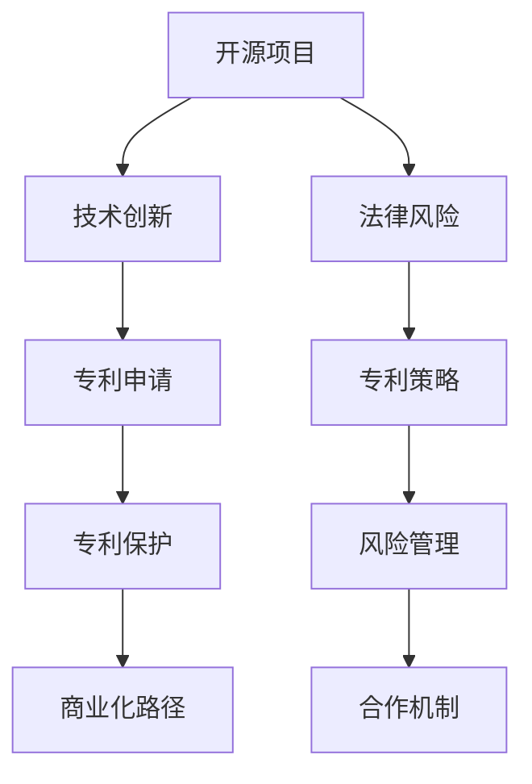

                 

### 第一部分: 开源项目的专利策略概述

开源项目的专利策略是确保技术创新得到保护，同时推动项目商业化的关键。在这个部分，我们将详细探讨开源项目的定义、专利的基本概念，以及开源项目与专利之间的关系，并深入分析专利策略在开源项目中的重要性。

#### 第1章: 开源项目的专利概述

##### 1.1 开源项目的定义与特性

开源项目是指那些遵循某种开源许可证的软件项目，其源代码可供公众访问、使用、研究、修改和分发。这种模式基于自由、合作和透明的原则，旨在促进技术进步和知识共享。

开源项目的特性包括：

1. **自由访问**：任何人都可以自由访问项目的源代码，无需支付费用。
2. **合作开发**：开发者可以共同参与项目的开发，贡献代码和改进。
3. **透明性**：项目的进展和决策都是公开透明的。
4. **社区参与**：项目通常有一个活跃的社区，成员可以参与讨论、提供建议和改进。

##### 1.2 专利的基本概念

专利是一种法律保护，授予发明者对其发明一定时期的独占权。专利主要分为以下三种类型：

1. **发明专利**：保护新的技术方案，如机器、流程或组合。
2. **实用新型专利**：保护新的产品形状、构造或组合。
3. **外观设计专利**：保护产品的外观设计。

##### 1.3 开源项目与专利的关系

开源项目的开放性和专利的独占性之间存在一定的矛盾。开源项目的本质是开放性，而专利的独占性可能会限制对技术的访问和使用。然而，通过合理的专利策略，可以协调这两者之间的关系。

#### 第2章: 专利策略在开源项目中的重要性

##### 2.1 专利策略的定义

专利策略是企业或项目团队在专利申请、管理和应用过程中采取的系统化措施。它涉及对专利的布局、申请、管理和应用，旨在保护技术创新、提高商业竞争力，并规避法律风险。

##### 2.2 开源项目专利策略的重要性

开源项目专利策略的重要性体现在以下几个方面：

1. **技术创新保护**：专利策略可以确保项目核心技术的法律保护，防止他人未经授权擅自使用或复制。
2. **商业竞争力**：专利策略有助于提高项目在市场上的竞争力，通过专利许可或转让等方式实现商业价值。
3. **法律风险规避**：合理运用专利策略可以减少侵权风险，保护项目免受诉讼威胁。

##### 2.3 开源项目专利策略的目标

开源项目专利策略的目标主要包括：

1. **保护创新**：确保项目开发过程中的创新点得到有效保护。
2. **促进合作**：通过专利策略建立良好的合作关系，推动项目的共同发展。
3. **商业化路径**：为开源项目的商业化提供法律保障，通过专利许可、转让等方式实现商业收益。

在接下来的章节中，我们将进一步探讨开源项目的专利保护方法、专利商业化路径以及专利政策与法律环境等内容。

---

**核心概念与联系**

以下是一个关于开源项目和专利关系的 Mermaid 流程图：



**核心算法原理讲解**

在开源项目的专利保护中，一个关键的问题是如何有效地评估和选择需要保护的专利点。以下是一个简单的伪代码，用于描述这一过程：

```python
# 伪代码：评估并选择关键专利点

def evaluate_patent_points(technology):
    # 初始化专利点集合
    patent_points = []
    
    # 分析技术，提取潜在的创新点
    innovation_points = extract_innovation_points(technology)
    
    # 对每个创新点进行评估
    for point in innovation_points:
        if is_new_and_useful(point):
            # 如果创新点新颖且有用，添加到专利点集合
            patent_points.append(point)
    
    # 返回评估结果
    return patent_points

# 辅助函数：提取技术中的创新点
def extract_innovation_points(technology):
    # 实现技术分析，提取创新点
    # ...
    return []

# 辅助函数：评估创新点的新颖性和实用性
def is_new_and_useful(point):
    # 实现评估逻辑
    # ...
    return True  # 示例返回值
```

---

接下来，我们将继续探讨开源项目的专利保护方法，包括专利布局、专利申请策略、专利管理和专利合作与开放等。

---

### 第二部分：开源项目的专利保护方法

在上一部分中，我们探讨了开源项目专利策略的概述和重要性。在本部分，我们将深入分析开源项目的专利保护方法，包括专利布局、专利申请策略、专利管理和专利合作与开放等。

#### 第3章: 开源项目的专利保护方法

##### 3.1 专利布局

专利布局是开源项目专利保护的首要步骤。它旨在提前规划，确保关键技术和成果的专利保护。以下是专利布局的主要方法：

1. **技术分析**：分析项目的技术特点和创新点，确定需要保护的专利点。
2. **竞争对手分析**：研究竞争对手的专利布局，避免重复申请，并了解潜在的风险。
3. **市场需求分析**：分析市场需求，确定哪些技术具有商业价值，从而决定哪些技术需要优先保护。

##### 3.2 专利申请策略

专利申请策略是确保开源项目专利得到有效保护的关键。以下是一些常见的专利申请策略：

1. **国内专利申请**：
   - **专利类型选择**：根据技术特点选择合适的专利类型（发明专利、实用新型专利、外观设计专利）。
   - **申请流程**：了解专利申请的流程，包括专利检索、撰写申请文件、提交申请、审查等。
   - **审查标准**：了解专利审查的标准，确保申请的专利具有新颖性、创造性和实用性。

2. **国际专利申请**：
   - **PCT申请**：通过PCT（专利合作条约）程序，简化国际专利申请过程。
   - **外国专利申请程序**：根据目标国家的专利法律，制定合适的申请策略。

##### 3.3 专利管理

专利管理是确保专利资产得到优化和有效利用的关键。以下是一些专利管理的方法：

1. **专利组合管理**：
   - **评估**：定期评估专利组合的价值，识别潜在的高价值专利。
   - **组合**：将相关专利组合在一起，形成更强的专利组合。
   - **优化**：通过转让、许可或放弃等方式，优化专利组合的结构。

2. **专利风险控制**：
   - **监控**：监控市场上的潜在侵权行为，及时采取措施。
   - **应对策略**：制定应对侵权的策略，包括诉讼、谈判等。

##### 3.4 专利合作与开放

专利合作与开放是开源项目专利保护的重要方面。以下是一些专利合作与开放的方法：

1. **专利共享**：
   - **建立专利池**：通过建立专利池，集中管理和共享专利，促进技术交流。
   - **共享协议**：制定共享协议，明确专利权的使用、许可和分配。

2. **交叉许可**：
   - **定义**：交叉许可是指多个专利权人之间相互许可对方使用其专利。
   - **模式**：建立交叉许可机制，通过协议约定交叉许可的条件和范围。

通过上述专利保护方法，开源项目可以在保护技术创新的同时，推动项目的商业化发展。在下一部分中，我们将探讨开源项目的专利商业化路径，包括专利商业化概述、专利商业化策略以及案例分析。

---

**核心算法原理讲解**

在专利布局中，评估和选择关键专利点是核心任务。以下是一个简化的伪代码，用于描述这一过程：

```python
# 伪代码：评估并选择关键专利点

def select_key_patent_points(technology, market_data, competitor_data):
    # 初始化关键专利点集合
    key_patent_points = []
    
    # 分析技术，提取潜在的创新点
    innovation_points = extract_innovation_points(technology)
    
    # 分析市场，确定具有商业价值的技术点
    commercial_value_points = identify_commercial_value_points(innovation_points, market_data)
    
    # 分析竞争对手，避免重复申请和潜在侵权
    non_conflicting_points = filter_non_conflicting_points(commercial_value_points, competitor_data)
    
    # 对每个非冲突的创新点进行评估
    for point in non_conflicting_points:
        if is_new_and_useful(point):
            # 如果创新点新颖且有用，添加到关键专利点集合
            key_patent_points.append(point)
    
    # 返回评估结果
    return key_patent_points

# 辅助函数：提取技术中的创新点
def extract_innovation_points(technology):
    # 实现技术分析，提取创新点
    # ...
    return []

# 辅助函数：识别具有商业价值的技术点
def identify_commercial_value_points(innovation_points, market_data):
    # 实现市场分析，识别商业价值点
    # ...
    return []

# 辅助函数：过滤非冲突的创新点
def filter_non_conflicting_points(points, competitor_data):
    # 实现竞争对手分析，过滤非冲突点
    # ...
    return []

# 辅助函数：评估创新点的新颖性和实用性
def is_new_and_useful(point):
    # 实现评估逻辑
    # ...
    return True  # 示例返回值
```

---

在下一部分中，我们将继续探讨开源项目的专利商业化路径，包括专利商业化概述、专利商业化策略以及案例分析。

---

### 第三部分：开源项目的专利商业化路径

在前两部分中，我们探讨了开源项目的专利策略概述以及专利保护方法。本部分将聚焦于开源项目的专利商业化路径，包括专利商业化的概述、策略以及成功案例分析。

#### 第4章: 开源项目的专利商业化路径

##### 4.1 专利商业化概述

专利商业化是指将专利转化为商业价值的过程。对于开源项目而言，专利商业化是一个复杂且关键的过程，旨在通过专利许可、授权、转让、合资或共同开发等方式实现商业收益。以下是专利商业化的定义和模式：

1. **定义**：专利商业化是将专利权转化为经济利益的过程，包括许可、授权、转让等。
2. **模式**：
   - **直接许可**：许可他人使用专利，并获得许可费。
   - **授权**：授权其他企业使用专利，但自身仍保留专利权。
   - **转让**：将专利权出售给第三方。
   - **合资**：与其他企业合作，共同开发和商业化专利。
   - **共同开发**：与其他企业合作，共同研究和开发专利。

##### 4.2 专利商业化策略

成功的专利商业化策略需要综合考虑技术、市场、法律和商业因素。以下是一些关键的专利商业化策略：

1. **评估专利价值**：通过技术评估、市场分析和法律审查，确定专利的商业价值。
2. **选择合适的商业化模式**：根据专利的特点和市场需求，选择合适的商业化模式，如许可、授权、转让等。
3. **制定许可协议**：明确许可的范围、期限、费用和条件，确保协议的合法性和可执行性。
4. **建立商业网络**：通过建立广泛的商业关系网络，寻找潜在的合作伙伴和客户。
5. **持续监控和优化**：对商业化过程进行持续监控，及时调整策略，优化商业收益。

##### 4.3 案例分析

以下是两个开源项目专利商业化的成功案例：

**案例1：Linux内核的商业化**

Linux内核是一个开源项目，其专利商业化取得了巨大成功。Linux基金会的成立旨在保护和推广Linux内核的专利。以下是其专利商业化的几个关键点：

1. **建立专利池**：Linux基金会收集了众多企业和个人的专利，形成了庞大的专利池。
2. **交叉许可**：通过交叉许可协议，确保Linux内核的专利不会被单独起诉。
3. **许可协议**：Linux基金会提供了多种许可协议，包括普通许可和金鞋许可，满足不同客户的需求。
4. **市场推广**：通过市场推广和合作伙伴关系，扩大Linux内核的市场份额。

**案例2：Apache开源软件的商业化**

Apache软件基金会管理的开源软件，如Apache HTTP服务器和Apache Kafka，也实现了专利商业化。以下是其专利商业化的关键点：

1. **专利保护**：Apache软件基金会积极申请专利，保护其核心技术和创新。
2. **授权模式**：通过授权模式，Apache软件基金会获得了大量的许可收入。
3. **合作伙伴关系**：与大型企业和云计算服务提供商建立合作伙伴关系，共同推动软件的商业化。
4. **开源支持**：提供专业的开源支持和服务，增强用户信任，促进商业合作。

通过上述案例分析，我们可以看到，成功的开源项目专利商业化需要综合考虑专利保护、许可模式、市场推广和合作伙伴关系等多个因素。

---

**数学模型和公式讲解**

在专利商业化的过程中，评估专利价值是一个重要的环节。以下是一个简化的数学模型，用于评估专利的商业价值：

$$
V = f(N, R, T, C)
$$

其中：
- \( V \) 表示专利的商业价值。
- \( N \) 表示专利的创新性（新颖性和独特性）。
- \( R \) 表示专利的市场需求（市场的规模和增长潜力）。
- \( T \) 表示专利的期限（剩余有效期限）。
- \( C \) 表示专利的维护成本（包括法律费用和维护费用）。

该模型考虑了专利的创新性、市场需求、期限和维护成本等多个因素，从而提供了一个全面的商业价值评估。

**举例说明**

假设有一个专利，其创新性（N）为0.8，市场需求（R）为0.9，剩余有效期限（T）为5年，维护成本（C）为每年10,000美元。我们可以使用上述模型来计算该专利的商业价值：

$$
V = f(0.8, 0.9, 5, 10,000) = 0.8 \times 0.9 \times 5 - 10,000 = 3,500 - 10,000 = -6,500
$$

根据计算结果，该专利的商业价值为负数，这表明在当前条件下，该专利可能不具有商业价值。然而，这只是一个简化的模型，实际评估需要考虑更多的因素，如市场竞争状况、潜在收入、许可模式等。

---

在下一部分中，我们将探讨开源项目的专利政策与法律环境，包括国际专利法律框架、中国专利法律框架以及开源社区专利政策。

---

### 第四部分：开源项目的专利政策与法律环境

在前三部分中，我们探讨了开源项目的专利策略概述、专利保护方法和专利商业化路径。本部分将深入探讨开源项目的专利政策与法律环境，包括国际专利法律框架、中国专利法律框架以及开源社区专利政策。

#### 第5章: 开源项目的专利政策与法律环境

##### 5.1 国际专利法律框架

国际专利法律框架主要由世界知识产权组织（WIPO）制定和监督。以下是一些主要的国际专利法律体系：

1. **WIPO**：世界知识产权组织负责协调全球的知识产权保护，包括专利、商标和版权等。
2. **欧盟**：欧盟有一个统一的专利法律体系，包括欧洲专利公约和欧洲专利局。
3. **美国**：美国拥有独立的专利法律体系，以《美国专利法》为基础。
4. **日本**：日本拥有自己的专利法律体系，旨在促进技术创新和产业发展。

国际专利法律框架对开源项目专利策略的指导作用主要体现在以下几个方面：

1. **全球专利申请**：国际专利法律框架提供了统一的专利申请程序，简化了跨国专利申请的流程。
2. **专利保护力度**：国际专利法律框架通常提供较高的专利保护力度，有助于保护开源项目的创新成果。
3. **知识产权合作**：国际专利法律框架促进了全球范围内的知识产权合作，为开源项目提供了更广泛的支持和资源。

##### 5.2 中国专利法律框架

中国专利法律框架是中国知识产权保护体系的重要组成部分。以下是中国专利法律的基本规定：

1. **专利法**：中国的《专利法》规定了专利的类型、申请程序、保护期限和侵权处理等。
2. **知识产权保护**：中国在开源项目知识产权保护方面采取了积极的措施，通过法律手段保护开源项目的创新成果。
3. **专利审查标准**：中国的专利审查标准与国际接轨，确保专利的新颖性、创造性和实用性。

中国在开源项目知识产权保护方面的政策主要包括以下几个方面：

1. **鼓励开源创新**：政府鼓励企业和个人参与开源项目，并通过知识产权保护措施激励创新。
2. **打击侵权行为**：加强对侵权行为的打击力度，保护开源项目的知识产权。
3. **国际合作**：加强与国际知识产权组织的合作，推动全球知识产权保护的发展。

##### 5.3 开源社区专利政策

开源社区专利政策是开源项目内部关于专利管理和保护的规定。以下是一些知名的开放组织对专利策略的指导和建议：

1. **GitHub专利政策**：GitHub提供了详细的专利政策，包括专利归属、许可协议和侵权处理等。
2. **Linux基金会**：Linux基金会通过专利共享和交叉许可机制，保护开源项目的知识产权。
3. **Apache软件基金会**：Apache软件基金会鼓励开源项目遵守开源许可证，同时提供专利保护和许可协议。

开源社区专利政策的核心目标是：

1. **保护创新**：确保开源项目的创新成果得到法律保护。
2. **促进合作**：通过专利政策和许可协议，建立良好的社区合作关系，推动项目的共同发展。
3. **规避风险**：合理规避专利风险，保护社区成员免受专利诉讼威胁。

---

**数学模型和公式讲解**

在评估开源项目专利价值时，可以引入博弈论的数学模型，用于分析专利保护与开放之间的权衡。以下是一个简化的博弈模型：

$$
V_{ij} = p_i \times q_j \times (1 - r_i \times s_j)
$$

其中：
- \( V_{ij} \) 表示项目 i 在策略 j 下的专利价值。
- \( p_i \) 表示项目 i 的创新性。
- \( q_j \) 表示策略 j 的市场接受度。
- \( r_i \) 表示项目 i 在开放策略下的专利泄露风险。
- \( s_j \) 表示策略 j 的法律保护力度。

该模型考虑了创新性、市场接受度、专利泄露风险和法律保护力度等因素，用于评估不同策略下的专利价值。

**举例说明**

假设有一个开源项目，其创新性（\( p_i \)）为0.8，市场接受度（\( q_j \)）为0.9，开放策略下的专利泄露风险（\( r_i \)）为0.2，法律保护力度（\( s_j \)）为0.8。我们可以使用上述模型来计算项目在开放策略下的专利价值：

$$
V_{ij} = 0.8 \times 0.9 \times (1 - 0.2 \times 0.8) = 0.8 \times 0.9 \times 0.8 = 0.576
$$

根据计算结果，该开源项目在开放策略下的专利价值为0.576，这表明在当前条件下，开放策略可能是一个合理的选择。

---

在下一部分中，我们将探讨开源项目的专利风险管理，包括风险识别、风险评估和风险应对策略。

---

### 第五部分：开源项目的专利风险管理

在开源项目的开发过程中，专利风险管理是确保项目顺利发展的关键环节。有效的专利风险管理可以减少潜在的法律纠纷和商业风险，保障项目的可持续发展。本部分将详细探讨开源项目的专利风险管理，包括风险识别、风险评估和风险应对策略。

#### 第6章: 开源项目的专利风险管理

##### 6.1 风险识别

风险识别是专利风险管理的第一步，旨在识别可能影响开源项目的技术、法律和市场等方面的风险。以下是一些常见的专利风险识别方法：

1. **技术风险评估**：分析项目的核心技术，识别可能侵犯现有专利的风险。
2. **市场风险评估**：研究市场趋势和竞争对手的专利布局，预测潜在的市场风险。
3. **法律风险评估**：了解不同国家和地区的专利法律框架，识别法律风险。

通过系统化的风险识别，开源项目可以提前发现潜在的专利问题，为后续的风险评估和应对提供依据。

##### 6.2 风险评估

风险评估是专利风险管理的核心步骤，旨在对识别出的风险进行量化分析，确定其严重程度和发生概率。以下是一些常用的风险评估模型和方法：

1. **风险评估指标体系**：建立一套全面的评估指标，包括技术风险、市场风险和法律风险等。
2. **风险评估矩阵**：使用矩阵方法，对每个风险因素进行评分和分类，确定其优先级。
3. **风险评估模型**：使用定量模型（如贝叶斯网络、蒙特卡罗模拟等）进行风险评估。

通过风险评估，开源项目可以更清晰地了解风险的分布和优先级，为制定应对策略提供参考。

##### 6.3 风险应对

针对识别和评估出的专利风险，开源项目需要采取相应的应对策略，以降低风险发生的概率和影响。以下是一些常见风险应对策略：

1. **风险规避**：通过技术手段或法律手段，避免侵犯他人的专利。
2. **风险转移**：通过购买保险或签订许可协议，将专利风险转移给第三方。
3. **风险接受**：对于无法规避或转移的风险，采取接受策略，制定应对措施。

在实际操作中，开源项目可以根据风险评估结果，选择合适的应对策略，以最大程度地降低专利风险。

##### 6.4 风险管理案例

以下是一个开源项目的专利风险管理案例：

**案例背景**：一个开源项目团队在开发过程中，发现其核心技术可能侵犯了竞争对手的一个已授权专利。该专利的剩余有效期限较长，且竞争对手在市场上拥有强大的影响力。

**风险识别**：通过技术分析和市场研究，项目团队确定了以下风险：
- 技术风险：项目核心技术可能侵犯竞争对手的专利。
- 市场风险：竞争对手可能对项目发起专利诉讼，影响项目的市场地位。
- 法律风险：项目可能面临法律诉讼，承担较高的法律成本。

**风险评估**：项目团队使用风险评估矩阵，对风险因素进行评分和分类，得出以下结果：
- 技术风险：高概率、高影响。
- 市场风险：高概率、中影响。
- 法律风险：低概率、高影响。

**风险应对**：
1. **风险规避**：项目团队对核心技术进行修改，避免直接侵犯竞争对手的专利。
2. **风险转移**：项目团队与竞争对手进行谈判，签订交叉许可协议，转移专利风险。
3. **风险接受**：对于无法规避或转移的法律风险，项目团队制定了详细的应对措施，包括聘请法律顾问、进行专利侵权诉讼等。

通过上述风险管理措施，开源项目成功降低了专利风险，确保了项目的持续发展。

---

**数学模型和公式讲解**

在专利风险管理中，风险评估是一个关键环节。以下是一个简化的风险评估模型，用于评估专利风险的概率和影响：

$$
R = P \times I
$$

其中：
- \( R \) 表示风险水平（概率×影响）。
- \( P \) 表示风险的概率（0到1之间的数值）。
- \( I \) 表示风险的影响（0到1之间的数值）。

该模型将风险的概率和影响结合起来，用于评估整体风险水平。

**举例说明**

假设一个开源项目面临以下专利风险：
- 风险概率（\( P \)）：0.6（表示有60%的概率发生）。
- 风险影响（\( I \)）：0.8（表示发生时的严重影响程度）。

我们可以使用上述模型来计算该专利风险的风险水平：

$$
R = 0.6 \times 0.8 = 0.48
$$

根据计算结果，该专利风险的风险水平为0.48，这表明这是一个中等风险水平的专利问题。

---

在下一部分中，我们将探讨开源项目的专利合作与社区治理，包括合作机制和社区治理方法。

---

### 第六部分：开源项目的专利合作与社区治理

在前几部分中，我们详细探讨了开源项目的专利策略、专利保护方法、专利商业化路径以及专利风险管理。在本部分中，我们将重点关注开源项目的专利合作与社区治理，包括合作机制和社区治理方法。

#### 第7章: 开源项目的专利合作与社区治理

##### 7.1 合作机制

开源项目的专利合作是确保技术创新和项目持续发展的重要手段。以下是一些常见的专利合作机制：

1. **专利联盟**：多个企业或组织联合起来，共同管理和保护各自的专利，通过共享专利资源，实现优势互补。

2. **专利池**：集中管理和共享多个专利，形成一个庞大的专利资产库，为项目成员提供全面的专利保护。

3. **交叉许可**：多个专利权人之间相互许可对方使用其专利，以减少侵权风险和诉讼成本。

4. **开放许可**：项目团队提供一种灵活的许可模式，允许其他开发者在不侵犯专利权的情况下使用项目的技术。

通过建立有效的合作机制，开源项目可以增强专利保护，降低侵权风险，促进技术的传播和应用。

##### 7.2 社区治理

社区治理是开源项目成功的关键要素，良好的社区治理有助于建立信任、规范行为和促进合作。以下是一些社区治理方法：

1. **制定社区专利政策**：明确社区对专利的管理原则、许可方式和侵权处理措施，为社区成员提供指导和保障。

2. **建立社区专利数据库**：收集和整理社区成员的专利信息，建立一个公开透明的专利数据库，便于成员之间进行交流和合作。

3. **社区成员培训**：定期举办培训活动，提高社区成员对专利法律和合作机制的认知，增强社区的合作意识和创新能力。

4. **激励机制**：设立奖励机制，鼓励社区成员积极参与专利合作和社区治理，推动项目的共同发展。

通过有效的社区治理，开源项目可以建立起一个健康、活跃的社区环境，为技术创新和商业化提供坚实的基础。

##### 7.3 案例分析

以下是一个开源项目专利合作与社区治理的典型案例：

**案例背景**：一个名为“OpenJDK”的开源项目，其目标是维护和开发Java语言的核心库。OpenJDK由多个企业和组织共同参与，包括Red Hat、Oracle等。

**合作机制**：
- **专利池**：OpenJDK建立了专利池，收集了多个成员的专利，为项目提供了全面的专利保护。
- **交叉许可**：项目成员之间签订了交叉许可协议，确保彼此的专利不会对项目的正常运行构成威胁。
- **开放许可**：OpenJDK提供了多种许可模式，包括普通许可和开放许可，便于其他开发者使用项目的技术。

**社区治理**：
- **制定社区专利政策**：OpenJDK制定了详细的专利政策，明确了专利的归属、许可和侵权处理方式。
- **建立社区专利数据库**：OpenJDK建立了专利数据库，收集和整理了社区成员的专利信息，便于成员之间的交流和合作。
- **社区成员培训**：定期举办培训活动，提高社区成员对专利法律和合作机制的认知。
- **激励机制**：OpenJDK设立了奖励机制，鼓励社区成员积极参与项目的开发和治理。

通过专利合作与社区治理，OpenJDK成功地实现了技术创新和商业化的双赢。项目不仅获得了广泛的认可和支持，还在专利保护和社区合作方面积累了丰富的经验。

---

**数学模型和公式讲解**

在开源项目的专利合作与社区治理中，合作价值和贡献评估是一个关键环节。以下是一个简化的数学模型，用于评估项目成员的合作价值和贡献：

$$
V_{i} = f(C_{i}, E_{i}, R_{i})
$$

其中：
- \( V_{i} \) 表示项目成员 \( i \) 的合作价值。
- \( C_{i} \) 表示成员 \( i \) 的贡献（如代码提交、文档编写等）。
- \( E_{i} \) 表示成员 \( i \) 的经验（如专利申请数量、行业经验等）。
- \( R_{i} \) 表示成员 \( i \) 的关系网络（如社区影响力、合作频率等）。

该模型考虑了项目成员的贡献、经验和关系网络等多个因素，用于评估成员的合作价值。

**举例说明**

假设一个开源项目有三位成员，其贡献（\( C_{i} \)）分别为10、15、20，经验（\( E_{i} \)）分别为3、5、7，关系网络（\( R_{i} \)）分别为2、3、4。我们可以使用上述模型来计算每位成员的合作价值：

$$
V_{1} = f(10, 3, 2) = 10 \times 3 \times 2 = 60
$$

$$
V_{2} = f(15, 5, 3) = 15 \times 5 \times 3 = 225
$$

$$
V_{3} = f(20, 7, 4) = 20 \times 7 \times 4 = 560
$$

根据计算结果，三位成员的合作价值分别为60、225和560。这表明成员3在项目中的合作价值和贡献最大。

---

在下一部分中，我们将进行总结与展望，探讨开源项目专利策略的未来趋势、发展挑战和未来方向。

---

### 第七部分：总结与展望

在前文中，我们系统地探讨了开源项目的专利策略、专利保护方法、专利商业化路径、专利风险管理、专利合作与社区治理等各个方面。通过这些探讨，我们不仅了解了开源项目专利策略的核心概念和实施方法，还分析了开源项目在不同环境下的应对策略和实际案例。

#### 7.1 未来趋势

开源项目的专利策略在未来将继续适应新的技术发展。以下是一些可能的发展趋势：

1. **人工智能与机器学习的融入**：随着人工智能和机器学习技术的发展，开源项目中的专利策略将更加注重对算法和创新模型的保护。
2. **区块链技术的应用**：区块链技术可以为开源项目的专利管理提供去中心化的解决方案，提高专利信息的透明度和安全性。
3. **全球专利法律环境的统一**：国际社会将进一步推动全球专利法律环境的统一，降低跨国专利申请和保护的复杂性。

#### 7.2 发展挑战

尽管开源项目专利策略的重要性日益凸显，但仍然面临一系列发展挑战：

1. **协调开源项目的开放性与专利保护**：如何在保证项目开放性的同时，保护专利权，是一个持续的挑战。
2. **专利合作机制的复杂性**：建立有效的专利合作机制需要协调多个利益相关方的利益，这往往是一个复杂的过程。
3. **法律环境的多样性**：不同国家和地区的专利法律框架存在差异，开源项目需要适应这种多样性，以实现全球范围内的保护。

#### 7.3 未来方向

为了应对上述挑战，开源项目专利策略的未来发展方向包括：

1. **政策建议**：政府和开源组织应出台更多针对开源项目专利策略的指导意见，为项目提供法律和政策支持。
2. **标准化**：推动专利申请、管理和合作的标准化和规范化，提高专利管理的效率和透明度。
3. **社区参与**：鼓励社区成员更多地参与专利策略的制定和实施，提高社区的整体创新能力和协作效率。

#### 7.4 实践指导

对于开源项目团队来说，以下是一些实用的指导建议：

1. **定期评估专利组合**：定期评估专利组合的价值，及时调整和保护关键专利点。
2. **建立专利数据库**：建立和维护一个全面的专利数据库，便于社区成员之间的信息共享和协作。
3. **多元化合作模式**：探索多元化的合作模式，如专利联盟、交叉许可等，降低侵权风险，提高专利保护的有效性。

通过这些措施，开源项目可以在保护技术创新的同时，推动项目的商业化发展，实现可持续发展。

---

在本文的末尾，我想特别感谢所有参与开源项目的开发者、贡献者和支持者。正是你们的努力和智慧，使得开源项目能够不断创新和发展。同时，我也希望本文能为开源项目的专利策略提供一些有益的思考和启示。

**作者：AI天才研究院/AI Genius Institute & 禅与计算机程序设计艺术 /Zen And The Art of Computer Programming**

---

### 附录

**附录A：开源项目的专利策略框架**

- **定义与特性**：了解开源项目的定义和特性，以及专利的基本概念和类型。
- **重要性分析**：探讨专利策略在开源项目中的重要性，包括技术创新保护、商业竞争力和法律风险规避。
- **保护方法**：详细阐述专利布局、专利申请策略、专利管理和专利合作与开放的方法。
- **商业化路径**：介绍专利商业化的概述、策略和案例分析。
- **政策与法律环境**：分析国际专利法律框架、中国专利法律框架以及开源社区专利政策。
- **风险管理**：探讨风险识别、风险评估和风险应对策略。
- **合作与治理**：讨论合作机制和社区治理方法。

**附录B：开源项目专利策略工具**

- **专利检索工具**：如Google Patents、WIPO Patent Database等，用于检索和分析专利信息。
- **风险评估工具**：如RiskLens、PTC Integrity等，用于评估和管理专利风险。
- **协作平台**：如GitHub、GitLab等，用于专利申请、管理和共享。

**附录C：开源项目专利策略资源**

- **开源组织**：如Linux基金会、Apache软件基金会等，提供专利保护和指导。
- **专利律师**：提供专业的专利法律咨询和服务。
- **学术研究**：查阅相关学术文献和研究成果，了解开源项目专利策略的最新动态。

---

通过本文的详细探讨，我们希望为开源项目的专利策略提供一套全面的框架和实用的指导，帮助开源项目在保护技术创新的同时，实现商业化和可持续发展。让我们共同为开源世界的繁荣发展贡献智慧和力量！

