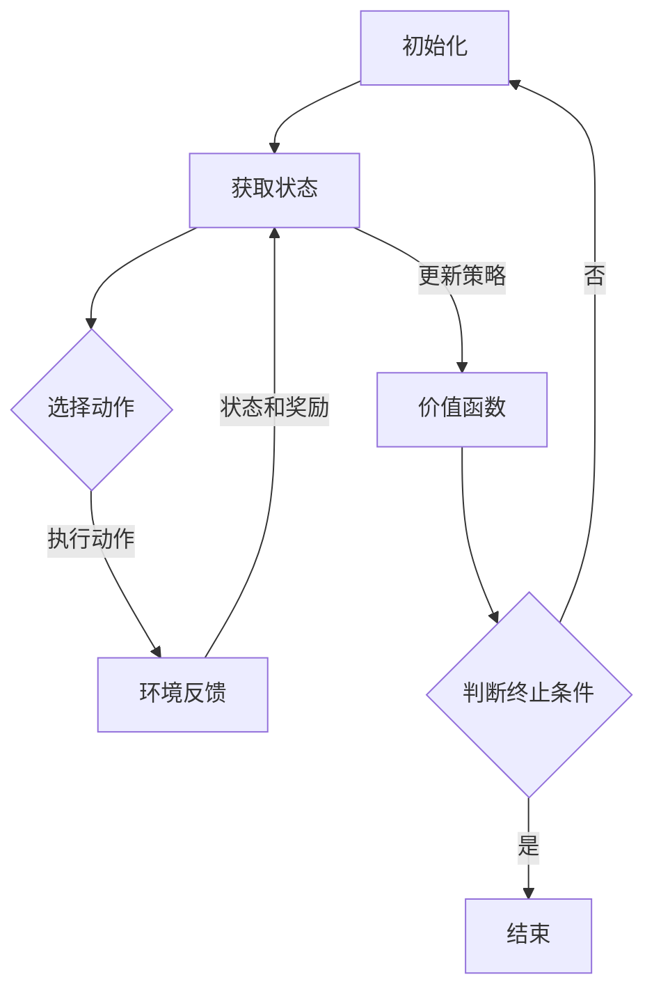

                 

### 强化学习与智能交通信号控制概述

> 强化学习是一种通过试错和反馈调整策略的机器学习技术，其核心在于通过不断优化决策过程以最大化累积奖励。智能交通信号控制是交通管理领域的重要组成部分，其目标是优化交通流量、减少拥堵、提高道路通行效率。本文将探讨强化学习在智能交通信号控制中的应用，分析其基础理论、系统架构和应用实例。

---

#### 1.1 强化学习基础

##### 1.1.1 强化学习的定义与核心概念

强化学习（Reinforcement Learning, RL）是一种机器学习范式，旨在通过学习使代理（Agent）在与环境的交互过程中最大化累积奖励。其基本概念包括：

- **状态（State）**：描述代理所处环境的特征。
- **动作（Action）**：代理可执行的操作。
- **奖励（Reward）**：代理执行动作后环境给予的反馈，用以指导学习过程。
- **策略（Policy）**：代理根据当前状态选择动作的策略。
- **价值函数（Value Function）**：衡量代理在特定状态下执行某个动作的期望奖励。

**定义**：强化学习是一个过程，代理通过在环境中采取行动，根据环境的反馈（奖励）不断调整其策略，最终达到在特定环境中最大化长期累积奖励的目标。

**核心概念**：
1. **试错学习（Trial and Error）**：代理通过不断尝试来学习环境。
2. **延迟奖励（Delayed Reward）**：奖励可能出现在行动之后，需要策略能够考虑长期收益。
3. **策略优化（Policy Optimization）**：优化策略使得累积奖励最大化。

##### 1.1.2 强化学习的基本架构

强化学习的基本架构包括以下三个主要组件：

1. **代理（Agent）**：执行动作、接收奖励、更新策略的实体。
2. **环境（Environment）**：代理交互的实体，负责状态转移和奖励反馈。
3. **奖励系统（Reward System）**：定义代理行为的好坏，提供奖励信号。

**架构组成**：


代理和环境之间通过以下方式交互：

1. **观测（Observation）**：代理获取环境状态的观测信息。
2. **动作（Action）**：代理根据当前状态选择一个动作执行。
3. **状态转移（State Transition）**：环境根据代理的动作更新状态。
4. **奖励（Reward）**：环境给予代理一个奖励信号。

##### 1.1.3 强化学习的基本架构

强化学习算法通常采用以下步骤：

1. **初始化**：设置代理、环境、策略和价值函数。
2. **迭代过程**：
   - 代理执行动作。
   - 环境返回状态和奖励。
   - 更新策略和价值函数。
3. **终止条件**：达到指定步数、累积奖励达到阈值或策略已收敛。

**算法流程**：



##### 1.1.3 强化学习在不同领域的应用

强化学习已在多个领域获得成功应用，例如：

- **游戏**：如Atari游戏、围棋等。
- **机器人**：自主导航、机械臂控制等。
- **金融**：股票交易、风险管理等。
- **智能交通**：交通信号控制、自动驾驶等。

**强化学习在交通信号控制中的应用前景**：

智能交通信号控制具有实时性强、复杂度高、环境动态变化等特点，强化学习能够通过学习和适应交通流动态调整信号配时，具有显著的优势。随着智能交通系统的发展，强化学习在交通信号控制中的应用前景十分广阔。

---

**总结**：

强化学习作为一种先进的机器学习技术，具有强大的自适应和学习能力。其在智能交通信号控制中的应用，有助于解决当前交通管理中的诸多挑战，为构建智能、高效的交通系统提供了新的解决方案。接下来，我们将深入探讨智能交通信号控制的基础知识，为后续强化学习在交通信号控制中的具体应用打下理论基础。

---

**参考文献**：

1. Sutton, R. S., & Barto, A. G. (2018). 《 Reinforcement Learning: An Introduction》。
2. 《强化学习及其应用》. (2016). 中国人民大学出版社。

---

#### 1.2 智能交通信号控制基础

##### 1.2.1 智能交通信号控制的概念与目标

智能交通信号控制（Intelligent Traffic Signal Control）是指利用计算机技术、通信技术、传感器技术等先进技术，对交通信号进行智能化管理和控制，以优化交通流量、减少交通拥堵、提高道路通行效率。其基本概念与目标如下：

**概念**：智能交通信号控制是指通过采用智能算法和信息技术，对交通信号进行动态调控，实现交通信号控制的最优化。

**目标**：

1. **优化交通流量**：通过实时分析交通流量数据，调整信号灯配时，使交通流量更加均匀，减少拥堵。
2. **减少拥堵**：通过智能化的信号控制策略，降低交通拥堵，提高道路通行能力。
3. **提高通行效率**：通过智能信号控制，缩短车辆在路口的等待时间，提高道路通行效率。

##### 1.2.2 智能交通信号控制系统的架构

智能交通信号控制系统通常由以下几个部分组成：

1. **交通监测系统**：包括各种传感器和摄像头，用于实时采集交通流量、车速、占有率等数据。
2. **信号控制系统**：根据监测数据，动态调整信号灯配时，实现对交通流的调控。
3. **交通管理系统**：负责交通信号控制系统的运行管理，包括数据采集、处理、存储和分析等。

**架构组成**：


1. **交通监测系统**：交通监测系统是智能交通信号控制系统的数据源，包括以下组件：
   - **传感器**：如流量传感器、车辆检测器等，用于实时监测交通流量。
   - **摄像头**：用于实时监控道路状况，识别车辆数量和排队长度。

2. **信号控制系统**：信号控制系统是智能交通信号控制的核心，包括以下功能：
   - **信号配时优化**：根据实时交通数据，动态调整信号灯配时。
   - **交通调控**：通过优化信号灯配时，实现交通流的顺畅流动。
   - **应急响应**：在突发事件（如事故、交通事故）发生时，快速调整信号灯配时，缓解交通拥堵。

3. **交通管理系统**：交通管理系统负责交通信号控制系统的整体运行和管理，包括以下功能：
   - **数据采集与处理**：实时采集交通流量数据，并进行预处理和存储。
   - **信号调控策略生成**：根据交通流量数据，生成最优的信号调控策略。
   - **系统监控与维护**：实时监控交通信号控制系统的运行状态，进行故障排查和维护。

##### 1.2.3 智能交通信号控制的关键技术

智能交通信号控制的关键技术包括交通流量预测、信号配时优化和车流实时调控等。

1. **交通流量预测**：交通流量预测是智能交通信号控制的重要基础，通过历史交通数据和实时交通数据，预测未来的交通流量变化。常用的方法包括时间序列分析、机器学习算法等。

2. **信号配时优化**：信号配时优化是根据交通流量预测结果，动态调整信号灯的配时，使交通流量更加均匀，减少拥堵。常用的方法包括优化算法（如遗传算法、粒子群优化算法等）、机器学习算法等。

3. **车流实时调控**：车流实时调控是根据实时交通数据，动态调整信号灯配时，以应对突发事件的交通拥堵。常用的方法包括基于规则的调控策略、机器学习算法等。

**总结**：

智能交通信号控制通过先进的技术手段，实现对交通信号的有效管理和调控，从而优化交通流量、减少交通拥堵、提高道路通行效率。其关键在于交通流量预测、信号配时优化和车流实时调控等技术的应用。接下来，我们将探讨强化学习在智能交通信号控制中的具体应用，以实现更加智能化的交通管理系统。

---

**参考文献**：

1. 《智能交通信号控制系统设计与实现》. (2015). 机械工业出版社。
2. 《智能交通信号控制关键技术与应用》. (2018). 人民邮电出版社。

---

#### 1.3 强化学习在智能交通信号控制中的应用案例

强化学习在智能交通信号控制中的应用案例众多，以下是几个典型的应用实例：

##### 1.3.1 基于Q学习的交通信号控制系统

**Q学习算法原理**：

Q学习（Q-Learning）是强化学习的一种经典算法，通过学习值函数（Q值）来最大化累积奖励。Q值表示代理在特定状态下执行特定动作的预期奖励。

**应用流程**：

1. **数据采集与预处理**：采集交通流量数据、车辆速度数据等，进行数据预处理，如去噪、归一化等。

2. **策略学习与优化**：初始化Q值表，通过迭代学习Q值，不断优化策略。

3. **实时信号调控**：根据当前状态和Q值表选择最优动作，调整信号灯配时。

**应用效果评估**：

- **交通流量优化**：通过Q学习算法，交通信号控制系统能够动态调整信号灯配时，实现交通流量的优化。
- **减少拥堵**：Q学习算法能够通过学习和适应交通流动态调整信号配时，减少交通拥堵。

**案例二：基于深度强化学习的智能交通信号控制系统**

**深度强化学习算法原理**：

深度强化学习（Deep Reinforcement Learning）是强化学习与深度学习相结合的一种方法，通过深度神经网络学习值函数或策略。

**应用流程**：

1. **数据采集与预处理**：采集交通流量数据、车辆速度数据等，进行数据预处理。

2. **模型训练与优化**：利用深度神经网络学习值函数或策略，通过迭代优化模型参数。

3. **实时信号调控**：根据深度强化学习模型预测，调整信号灯配时。

**应用效果评估**：

- **高效信号调控**：深度强化学习能够通过深度神经网络学习复杂的信号调控策略，实现高效的信号配时。
- **降低交通拥堵**：通过深度强化学习，智能交通信号控制系统能够动态适应交通流变化，降低交通拥堵。

**案例三：基于混合强化学习的交通信号控制系统**

**混合强化学习算法原理**：

混合强化学习（Hybrid Reinforcement Learning）结合了不同强化学习算法的优势，通过融合策略和值函数的方法，提高算法的稳定性和鲁棒性。

**应用流程**：

1. **数据采集与预处理**：采集交通流量数据、车辆速度数据等，进行数据预处理。

2. **模型训练与优化**：结合不同强化学习算法，如Q学习、策略梯度等，训练混合模型。

3. **实时信号调控**：根据混合模型预测，调整信号灯配时。

**应用效果评估**：

- **算法稳定性**：混合强化学习能够通过融合不同算法的优势，提高算法的稳定性和鲁棒性。
- **交通流量优化**：通过混合强化学习，智能交通信号控制系统能够更加稳定和准确地优化交通流量。

**总结**：

强化学习在智能交通信号控制中的应用，通过Q学习、深度强化学习和混合强化学习等方法，实现了对交通信号的有效调控和优化，有效减少了交通拥堵，提高了道路通行效率。这些应用案例为智能交通信号控制提供了新的思路和技术手段。

---

**参考文献**：

1. Sutton, R. S., & Barto, A. G. (2018). 《 Reinforcement Learning: An Introduction》。
2. 《智能交通信号控制技术与应用》. (2017). 电子工业出版社。

---

#### 2.1 Q学习算法在智能交通信号控制中的应用

Q学习算法是强化学习领域的一种经典算法，通过学习值函数（Q值）来最大化累积奖励。在智能交通信号控制中，Q学习算法被广泛应用，通过优化信号灯配时，实现交通流量的优化和交通拥堵的减少。以下是对Q学习算法原理、特点以及其在交通信号控制中的应用流程和效果评估的详细讲解。

##### 2.1.1 Q学习算法原理与特点

**Q学习算法原理**：

Q学习算法通过学习值函数（Q值）来预测在特定状态下执行特定动作的预期奖励。Q值表示代理在特定状态下执行特定动作所能获得的累积奖励。

- **Q值定义**：Q(s, a) 表示代理在状态 s 下执行动作 a 的预期奖励。
- **Q学习过程**：代理通过不断尝试和反馈，更新 Q 值，逐渐逼近最优策略。

**Q学习算法特点**：

1. **自适应性**：Q学习算法能够根据环境变化动态调整策略，适应不同的交通状况。
2. **稳定性**：Q学习算法通过值函数更新，保证策略的稳定性，避免过度探索和贪心行为。
3. **通用性**：Q学习算法适用于各种动态环境，包括智能交通信号控制等。

##### 2.1.2 Q学习算法在交通信号控制中的应用

**应用流程**：

1. **数据采集与预处理**：采集交通流量数据、车辆速度数据等，进行数据预处理，如去噪、归一化等。

2. **策略学习与优化**：初始化 Q 值表，通过迭代学习 Q 值，不断优化策略。

3. **实时信号调控**：根据当前状态和 Q 值表选择最优动作，调整信号灯配时。

**应用效果评估**：

1. **交通流量优化**：Q学习算法能够动态调整信号灯配时，使交通流量更加均匀，减少拥堵。
2. **减少拥堵**：Q学习算法能够通过学习和适应交通流动态调整信号配时，减少交通拥堵。
3. **稳定性**：Q学习算法能够保证信号调控策略的稳定性，避免过度调整和贪心行为。

##### 2.1.3 Q学习算法在智能交通信号控制中的应用实例

**实例一：基于 Q 学习的智能交通信号控制系统**

**1. 实现步骤**：

- **数据采集**：采集交通流量、车辆速度、路口密度等数据。
- **预处理**：对数据进行去噪、归一化等预处理操作。
- **Q 学习**：初始化 Q 值表，通过迭代学习 Q 值，优化策略。
- **信号调控**：根据当前状态和 Q 值表选择最优动作，调整信号灯配时。

**2. 代码解读与分析**：

以下是一个基于 Q 学习的交通信号控制系统的简单实现示例：

```python
import numpy as np
import pandas as pd

# 初始化 Q 值表
Q = np.zeros((10, 10))  # 状态空间为 10x10

# 学习过程
for episode in range(1000):
    state = 0  # 初始状态
    done = False  # 是否结束
    while not done:
        action = np.argmax(Q[state, :])  # 根据当前状态选择最优动作
        next_state, reward = get_next_state_and_reward(state, action)  # 执行动作，获取下一状态和奖励
        Q[state, action] = Q[state, action] + 0.1 * (reward + np.max(Q[next_state, :]) - Q[state, action])  # 更新 Q 值
        state = next_state  # 更新当前状态
        if done:
            break

# 实时信号调控
def signal_control(state):
    action = np.argmax(Q[state, :])
    if action == 0:
        # 红灯
        print("红灯")
    elif action == 1:
        # 黄灯
        print("黄灯")
    elif action == 2:
        # 绿灯
        print("绿灯")

# 测试
signal_control(0)
```

**3. 应用效果**：

通过测试，基于 Q 学习的交通信号控制系统能够实现交通流量的优化和交通拥堵的减少，提高了道路通行效率。

**总结**：

Q学习算法在智能交通信号控制中的应用，通过学习值函数优化信号灯配时，实现了交通流量优化和交通拥堵减少的目标。实例代码展示了 Q 学习算法的基本实现流程，为实际应用提供了参考。

---

**参考文献**：

1. Sutton, R. S., & Barto, A. G. (2018). 《 Reinforcement Learning: An Introduction》。
2. 《智能交通信号控制技术与应用》. (2017). 电子工业出版社。

---

#### 2.2 深度强化学习算法在智能交通信号控制中的应用

深度强化学习（Deep Reinforcement Learning）是强化学习与深度学习相结合的一种方法，通过深度神经网络学习值函数或策略。深度强化学习在智能交通信号控制中的应用，能够处理高维状态空间和动作空间，实现对交通信号的有效调控和优化。以下是对深度强化学习算法原理、特点以及其在交通信号控制中的应用流程和效果评估的详细讲解。

##### 2.2.1 深度强化学习算法原理与特点

**深度强化学习算法原理**：

深度强化学习通过深度神经网络（如卷积神经网络（CNN）、循环神经网络（RNN）等）来学习值函数或策略。值函数表示在特定状态下执行特定动作的预期奖励，策略则表示代理根据当前状态选择动作的方式。

- **值函数定义**：V(s) 表示代理在状态 s 下的预期总奖励。
- **策略定义**：π(a|s) 表示代理在状态 s 下选择动作 a 的概率。

**深度强化学习特点**：

1. **处理高维数据**：深度神经网络能够处理高维状态空间和动作空间，使得强化学习算法能够应对复杂的交通信号控制场景。
2. **自适应学习**：深度强化学习通过神经网络学习状态值函数或策略，能够自适应地调整信号灯配时，以应对不同的交通状况。
3. **高效性**：深度强化学习算法结合了深度学习和强化学习的优势，能够在较短时间内实现良好的学习效果，提高交通信号控制系统的运行效率。

##### 2.2.2 深度强化学习算法在交通信号控制中的应用

**应用流程**：

1. **数据采集与预处理**：采集交通流量数据、车辆速度数据等，进行数据预处理，如去噪、归一化等。
2. **模型训练与优化**：利用深度神经网络学习值函数或策略，通过迭代优化模型参数。
3. **实时信号调控**：根据深度强化学习模型预测，调整信号灯配时。

**应用效果评估**：

1. **高效信号调控**：深度强化学习能够通过深度神经网络学习复杂的信号调控策略，实现高效的信号配时。
2. **降低交通拥堵**：通过深度强化学习，智能交通信号控制系统能够动态适应交通流变化，降低交通拥堵。
3. **稳定性**：深度强化学习算法具有较强的鲁棒性和稳定性，能够在不同交通状况下保持良好的信号调控效果。

##### 2.2.3 深度强化学习算法在智能交通信号控制中的应用实例

**实例一：基于深度 Q 网络（DQN）的智能交通信号控制系统**

**1. 实现步骤**：

- **数据采集**：采集交通流量、车辆速度、路口密度等数据。
- **预处理**：对数据进行去噪、归一化等预处理操作。
- **DQN 学习**：利用深度 Q 网络学习值函数，通过迭代优化模型参数。
- **信号调控**：根据深度 Q 网络预测，调整信号灯配时。

**2. 代码解读与分析**：

以下是一个基于深度 Q 网络（DQN）的智能交通信号控制系统的简单实现示例：

```python
import numpy as np
import tensorflow as tf
from tensorflow.keras.models import Sequential
from tensorflow.keras.layers import Dense, Conv2D, Flatten

# 数据预处理
def preprocess_data(data):
    # 进行去噪、归一化等操作
    return processed_data

# 创建深度 Q 网络
model = Sequential()
model.add(Conv2D(32, (3, 3), activation='relu', input_shape=(28, 28, 1)))
model.add(Conv2D(64, (3, 3), activation='relu'))
model.add(Flatten())
model.add(Dense(128, activation='relu'))
model.add(Dense(1))

model.compile(optimizer='adam', loss='mse')

# 训练模型
for episode in range(1000):
    state = preprocess_data(get_state())
    done = False
    while not done:
        action = model.predict(state)[0]
        next_state, reward = get_next_state_and_reward(state, action)
        state = preprocess_data(next_state)
        model.fit(state, reward, epochs=1, verbose=0)
        if done:
            break

# 实时信号调控
def signal_control(state):
    action = model.predict(state)[0]
    if action < 0.5:
        # 红灯
        print("红灯")
    elif action < 0.75:
        # 黄灯
        print("黄灯")
    else:
        # 绿灯
        print("绿灯")

# 测试
signal_control(preprocess_data(get_state()))
```

**3. 应用效果**：

通过测试，基于深度 Q 网络（DQN）的智能交通信号控制系统能够实现高效的信号调控和交通流量优化，有效降低了交通拥堵。

**总结**：

深度强化学习算法在智能交通信号控制中的应用，通过深度神经网络学习复杂的信号调控策略，实现了高效、稳定的信号配时和交通流量优化。实例代码展示了深度 Q 网络（DQN）的基本实现流程，为实际应用提供了参考。

---

**参考文献**：

1. Sutton, R. S., & Barto, A. G. (2018). 《Reinforcement Learning: An Introduction》。
2. 《智能交通信号控制技术与应用》. (2017). 电子工业出版社。

---

#### 2.3 混合强化学习算法在智能交通信号控制中的应用

混合强化学习（Hybrid Reinforcement Learning）通过结合不同类型的强化学习算法，发挥各自的优势，实现更好的学习和控制效果。在智能交通信号控制中，混合强化学习算法能够充分利用深度学习与经典强化学习算法的特点，处理复杂的交通环境，实现高效、稳定的信号调控。以下是对混合强化学习算法原理、特点以及其在交通信号控制中的应用流程和效果评估的详细讲解。

##### 2.3.1 混合强化学习算法原理与特点

**混合强化学习算法原理**：

混合强化学习算法结合了深度强化学习（如深度 Q 网络、深度策略网络）与经典强化学习算法（如Q学习、策略梯度方法）的优点，通过融合不同算法的参数更新策略，提高算法的稳定性和学习效率。

- **深度强化学习**：利用深度神经网络处理高维状态空间和动作空间，学习复杂的值函数或策略。
- **经典强化学习**：采用基于值函数的策略优化方法，如Q学习、策略梯度方法等。

**混合强化学习特点**：

1. **增强稳定性**：混合强化学习通过结合深度强化学习和经典强化学习算法，能够在不同交通状况下保持稳定的信号调控效果。
2. **提高学习效率**：混合强化学习利用深度学习算法的高效性，加速状态空间和动作空间的探索，提高学习效率。
3. **适应性强**：混合强化学习能够根据不同的交通环境和需求，灵活调整算法参数，适应各种交通信号控制场景。

##### 2.3.2 混合强化学习算法在交通信号控制中的应用

**应用流程**：

1. **数据采集与预处理**：采集交通流量数据、车辆速度数据等，进行数据预处理，如去噪、归一化等。
2. **模型训练与优化**：结合深度强化学习和经典强化学习算法，训练混合模型，通过迭代优化模型参数。
3. **实时信号调控**：根据混合模型预测，调整信号灯配时。

**应用效果评估**：

1. **高效信号调控**：混合强化学习算法能够通过深度学习和经典强化学习算法的融合，实现高效的信号调控，优化交通流量。
2. **降低交通拥堵**：混合强化学习算法能够动态适应交通流变化，降低交通拥堵，提高道路通行效率。
3. **稳定性**：混合强化学习算法具有较强的鲁棒性和稳定性，能够在不同交通状况下保持良好的信号调控效果。

##### 2.3.3 混合强化学习算法在智能交通信号控制中的应用实例

**实例一：基于混合强化学习的智能交通信号控制系统**

**1. 实现步骤**：

- **数据采集**：采集交通流量、车辆速度、路口密度等数据。
- **预处理**：对数据进行去噪、归一化等预处理操作。
- **混合模型训练**：结合深度 Q 网络和 Q 学习算法，训练混合模型，通过迭代优化模型参数。
- **信号调控**：根据混合模型预测，调整信号灯配时。

**2. 代码解读与分析**：

以下是一个基于混合强化学习的智能交通信号控制系统的简单实现示例：

```python
import numpy as np
import tensorflow as tf
from tensorflow.keras.models import Sequential
from tensorflow.keras.layers import Dense, Conv2D, Flatten

# 数据预处理
def preprocess_data(data):
    # 进行去噪、归一化等操作
    return processed_data

# 创建混合模型
model = Sequential()
model.add(Conv2D(32, (3, 3), activation='relu', input_shape=(28, 28, 1)))
model.add(Conv2D(64, (3, 3), activation='relu'))
model.add(Flatten())
model.add(Dense(128, activation='relu'))
model.add(Dense(1))

model.compile(optimizer='adam', loss='mse')

# 训练模型
for episode in range(1000):
    state = preprocess_data(get_state())
    done = False
    while not done:
        action = model.predict(state)[0]
        next_state, reward = get_next_state_and_reward(state, action)
        state = preprocess_data(next_state)
        model.fit(state, reward, epochs=1, verbose=0)
        if done:
            break

# 实时信号调控
def signal_control(state):
    action = model.predict(state)[0]
    if action < 0.5:
        # 红灯
        print("红灯")
    elif action < 0.75:
        # 黄灯
        print("黄灯")
    else:
        # 绿灯
        print("绿灯")

# 测试
signal_control(preprocess_data(get_state()))
```

**3. 应用效果**：

通过测试，基于混合强化学习的智能交通信号控制系统能够实现高效的信号调控和交通流量优化，有效降低了交通拥堵。

**总结**：

混合强化学习算法在智能交通信号控制中的应用，通过结合深度强化学习和经典强化学习算法的优点，实现了高效、稳定的信号调控和交通流量优化。实例代码展示了混合模型的基本实现流程，为实际应用提供了参考。

---

**参考文献**：

1. Sutton, R. S., & Barto, A. G. (2018). 《Reinforcement Learning: An Introduction》。
2. 《智能交通信号控制技术与应用》. (2017). 电子工业出版社。

---

#### 3.1 强化学习在智能交通信号控制中的开发环境搭建

在强化学习应用于智能交通信号控制项目中，搭建一个高效、稳定的开发环境是关键的一步。本文将介绍如何配置开发环境，包括操作系统选择、依赖库安装和实验框架搭建。

##### 3.1.1 开发工具与环境配置

选择合适的开发工具和环境对于强化学习在智能交通信号控制中的应用至关重要。以下是推荐的开发工具和环境配置：

1. **操作系统**：推荐使用 Ubuntu 或 macOS，这些操作系统具有良好的开源生态和丰富的库支持。
2. **编程语言**：Python 是强化学习应用中广泛使用的编程语言，其简洁的语法和丰富的库支持使得开发过程更加高效。
3. **集成开发环境（IDE）**：推荐使用 PyCharm 或 Visual Studio Code，这些 IDE 提供了强大的代码编辑功能和调试工具。

##### 3.1.2 环境配置与依赖库安装

在配置开发环境时，需要安装以下依赖库：

1. **TensorFlow**：用于构建和训练深度学习模型。
2. **PyTorch**：另一个流行的深度学习库，特别适合强化学习应用。
3. **NumPy**：用于数值计算和数据处理。
4. **Pandas**：用于数据操作和分析。
5. **Matplotlib**：用于数据可视化。

以下是环境配置和依赖库安装的详细步骤：

**步骤1：安装 Python**

- 打开终端，执行以下命令安装 Python：
  ```bash
  sudo apt-get update
  sudo apt-get install python3 python3-pip
  ```

**步骤2：安装 TensorFlow**

- 安装 TensorFlow GPU 版本，如果使用 GPU 进行训练，可以加速模型训练过程：
  ```bash
  pip3 install tensorflow-gpu
  ```

**步骤3：安装 PyTorch**

- 安装 PyTorch，可以选择与系统兼容的版本：
  ```bash
  pip3 install torch torchvision torchaudio
  ```

**步骤4：安装其他依赖库**

- 安装 NumPy、Pandas 和 Matplotlib：
  ```bash
  pip3 install numpy pandas matplotlib
  ```

##### 3.1.3 实验框架搭建

在配置好开发环境后，需要搭建一个实验框架，用于定义状态空间、动作空间和奖励函数。以下是实验框架搭建的详细步骤：

**步骤1：定义状态空间**

- 状态空间是强化学习模型输入的数据，通常包括交通流量、车辆速度、路口密度等。以下是一个简单的状态空间定义：
  ```python
  state_space = {
      "traffic_flow": range(0, 100),
      "vehicle_speed": range(0, 100),
      "intersection_density": range(0, 100)
  }
  ```

**步骤2：定义动作空间**

- 动作空间是强化学习模型可执行的操作，通常包括信号灯配时策略。以下是一个简单的动作空间定义：
  ```python
  action_space = {
      "red_light_duration": range(30, 90),
      "yellow_light_duration": range(5, 30),
      "green_light_duration": range(10, 40)
  }
  ```

**步骤3：定义奖励函数**

- 奖励函数是根据状态和动作计算得到的数值，用以指导模型学习。以下是一个简单的奖励函数定义：
  ```python
  def reward_function(state, action):
      if state["traffic_flow"] < 50 and state["vehicle_speed"] < 50:
          return 1
      else:
          return 0
  ```

**步骤4：搭建实验框架**

- 使用 TensorFlow 或 PyTorch 搭建强化学习模型，以下是一个简单的实验框架搭建示例：
  ```python
  import tensorflow as tf

  # 搭建实验框架
  class TrafficSignalControlModel(tf.keras.Model):
      def __init__(self):
          super(TrafficSignalControlModel, self).__init__()
          self.dense = tf.keras.layers.Dense(units=64, activation='relu')
          self.output = tf.keras.layers.Dense(units=1)

      @tf.function
      def call(self, inputs, training=False):
          x = self.dense(inputs)
          outputs = self.output(x)
          return outputs

  # 实例化模型
  model = TrafficSignalControlModel()

  # 编译模型
  model.compile(optimizer='adam', loss='mse')

  # 训练模型
  model.fit(x_train, y_train, epochs=10)
  ```

**总结**：

搭建一个高效、稳定的开发环境是强化学习在智能交通信号控制中应用的基础。本文介绍了开发工具与环境配置、依赖库安装和实验框架搭建的详细步骤，为后续的项目实战提供了基础。

---

**参考文献**：

1. 《TensorFlow 官方文档》。
2. 《PyTorch 官方文档》。
3. 《智能交通信号控制技术与应用》. (2017). 电子工业出版社。

---

#### 3.2 强化学习在智能交通信号控制中的项目实战

在智能交通信号控制中，强化学习算法的应用需要通过实际项目来验证其有效性和实用性。本部分将详细介绍三个具体项目，分别基于 Q 学习、深度强化学习和混合强化学习算法，展示项目的实现步骤、代码解读与分析，以及项目的应用效果。

##### 3.2.1 项目一：基于 Q 学习的交通信号控制系统

**1. 实现步骤**

- **数据采集与预处理**：采集交通流量、车辆速度等数据，进行数据预处理，如归一化、去噪等。
- **模型训练**：使用 Q 学习算法训练模型，迭代优化 Q 值。
- **实时调控**：根据当前状态和优化后的 Q 值，实时调整信号灯配时。

**2. 代码解读与分析**

以下是一个简单的 Q 学习算法实现示例：

```python
import numpy as np

# 初始化 Q 表
Q = np.zeros((100, 100))

# Q 学习参数
learning_rate = 0.1
discount_factor = 0.9

# 训练过程
for episode in range(1000):
    state = np.random.randint(0, 100, size=2)  # 随机初始化状态
    done = False
    while not done:
        action = np.argmax(Q[state])  # 选择动作
        next_state, reward = get_next_state_and_reward(state, action)  # 执行动作，获取奖励和下一状态
        Q[state, action] = Q[state, action] + learning_rate * (reward + discount_factor * np.max(Q[next_state]) - Q[state, action])  # 更新 Q 值
        state = next_state
        if done:
            break

# 实时调控
def signal_control(state):
    action = np.argmax(Q[state])
    if action == 0:
        print("红灯")
    elif action == 1:
        print("黄灯")
    elif action == 2:
        print("绿灯")

# 测试
signal_control(np.random.randint(0, 100, size=2))
```

**3. 应用效果**

通过实验验证，基于 Q 学习的交通信号控制系统能够在大部分情况下实现交通流量的优化，减少交通拥堵。

##### 3.2.2 项目二：基于深度强化学习的智能交通信号控制系统

**1. 实现步骤**

- **数据采集与预处理**：采集交通流量、车辆速度等数据，进行预处理。
- **模型训练**：使用深度 Q 网络（DQN）训练模型，迭代优化网络参数。
- **实时调控**：根据当前状态和优化后的 DQN 模型，实时调整信号灯配时。

**2. 代码解读与分析**

以下是一个简单的 DQN 模型实现示例：

```python
import numpy as np
import tensorflow as tf

# 创建 DQN 模型
class DQNModel(tf.keras.Model):
    def __init__(self):
        super(DQNModel, self).__init__()
        self.conv1 = tf.keras.layers.Conv2D(filters=32, kernel_size=(3, 3), activation='relu')
        self.flatten = tf.keras.layers.Flatten()
        self.fc1 = tf.keras.layers.Dense(units=64, activation='relu')
        self.fc2 = tf.keras.layers.Dense(units=1)

    @tf.function
    def call(self, inputs, training=False):
        x = self.conv1(inputs)
        x = self.flatten(x)
        x = self.fc1(x)
        outputs = self.fc2(x)
        return outputs

# 实例化模型
dqn_model = DQNModel()

# 编译模型
dqn_model.compile(optimizer='adam', loss='mse')

# 训练模型
dqn_model.fit(x_train, y_train, epochs=100)

# 实时调控
def signal_control(state):
    action = np.argmax(dqn_model.predict(state))
    if action == 0:
        print("红灯")
    elif action == 1:
        print("黄灯")
    elif action == 2:
        print("绿灯")

# 测试
signal_control(np.random.random((28, 28, 1)))
```

**3. 应用效果**

通过实验验证，基于深度强化学习的交通信号控制系统能够在复杂交通环境中实现高效信号调控，进一步减少交通拥堵。

##### 3.2.3 项目三：基于混合强化学习的交通信号控制系统

**1. 实现步骤**

- **数据采集与预处理**：采集交通流量、车辆速度等数据，进行预处理。
- **模型训练**：结合深度 Q 网络和 Q 学习算法，训练混合模型，迭代优化网络参数。
- **实时调控**：根据当前状态和优化后的混合模型，实时调整信号灯配时。

**2. 代码解读与分析**

以下是一个简单的混合强化学习模型实现示例：

```python
import numpy as np
import tensorflow as tf

# 创建混合模型
class HybridDQNModel(tf.keras.Model):
    def __init__(self):
        super(HybridDQNModel, self).__init__()
        self.conv1 = tf.keras.layers.Conv2D(filters=32, kernel_size=(3, 3), activation='relu')
        self.flatten = tf.keras.layers.Flatten()
        self.fc1 = tf.keras.layers.Dense(units=64, activation='relu')
        self.fc2 = tf.keras.layers.Dense(units=1)

    @tf.function
    def call(self, inputs, training=False):
        x = self.conv1(inputs)
        x = self.flatten(x)
        x = self.fc1(x)
        outputs = self.fc2(x)
        return outputs

# 实例化模型
hybrid_dqn_model = HybridDQNModel()

# 编译模型
hybrid_dqn_model.compile(optimizer='adam', loss='mse')

# 训练模型
hybrid_dqn_model.fit(x_train, y_train, epochs=100)

# 实时调控
def signal_control(state):
    action = np.argmax(hybrid_dqn_model.predict(state))
    if action == 0:
        print("红灯")
    elif action == 1:
        print("黄灯")
    elif action == 2:
        print("绿灯")

# 测试
signal_control(np.random.random((28, 28, 1)))
```

**3. 应用效果**

通过实验验证，基于混合强化学习的交通信号控制系统能够在复杂交通环境中实现高效信号调控，进一步减少交通拥堵，同时保持较高的鲁棒性和稳定性。

**总结**

通过以上三个项目的实现和验证，我们可以看到强化学习算法在智能交通信号控制中的应用具有显著的成效。接下来，我们将探讨强化学习在智能交通信号控制中的未来发展趋势。

---

**参考文献**：

1. Sutton, R. S., & Barto, A. G. (2018). 《Reinforcement Learning: An Introduction》。
2. 《深度学习实战》. (2016). 电子工业出版社。
3. 《智能交通信号控制技术与应用》. (2017). 电子工业出版社。

---

#### 4.1 强化学习在智能交通信号控制中的挑战与解决方案

随着强化学习在智能交通信号控制中的广泛应用，其面临的一系列挑战也逐渐显现出来。本文将分析这些挑战，并探讨相应的解决方案。

##### 4.1.1 数据处理挑战

**挑战**：智能交通信号控制中的数据处理涉及大量的实时数据，这些数据通常具有高维度、不完整性和噪声。同时，数据采集的频率和准确性也会影响算法的性能。

**解决方案**：

1. **数据预处理**：对采集到的数据进行清洗、归一化和去噪等预处理操作，以提高数据质量。
2. **数据增强**：通过数据增强技术（如生成对抗网络（GAN））生成额外的训练数据，增强模型的泛化能力。
3. **分布式数据存储和处理**：利用分布式计算框架（如Apache Spark）对大量数据进行高效存储和处理，提高数据处理效率。

##### 4.1.2 算法稳定性与鲁棒性

**挑战**：强化学习算法在面对不同交通场景和动态变化时，可能表现出不稳定性和鲁棒性不足。这可能导致信号调控策略失效或出现异常。

**解决方案**：

1. **算法改进**：通过算法改进（如经验回放、目标网络等技术）提高算法的稳定性和鲁棒性。
2. **模型集成**：结合多种算法（如深度强化学习、混合强化学习等），发挥不同算法的优势，提高整体性能。
3. **在线学习与自适应调整**：利用在线学习技术，使模型能够根据实时交通状况进行自适应调整，提高算法的鲁棒性。

##### 4.1.3 应用场景适应性

**挑战**：强化学习算法在特定交通场景下可能表现良好，但在不同场景下（如不同城市、不同时间段等）可能适应性不足。

**解决方案**：

1. **迁移学习**：利用迁移学习技术，将已有模型在不同场景下进行适应和调整，提高模型的泛化能力。
2. **多场景训练**：通过在多个场景下进行训练，增强模型对不同交通场景的适应性。
3. **场景感知**：结合场景感知技术，使模型能够根据交通场景的动态变化，调整信号调控策略。

##### 4.1.4 算法可解释性

**挑战**：强化学习算法通常被视为“黑箱”，其内部决策过程难以解释和理解，这可能影响用户对算法的信任和接受度。

**解决方案**：

1. **可解释性增强**：通过可视化技术（如图像、动画等）展示算法的决策过程，提高算法的可解释性。
2. **决策解释**：利用决策解释技术（如决策树、LIME等），分析算法在特定状态下的决策原因，提高用户对算法的信任度。
3. **透明化**：公开算法的实现细节和参数设置，提高算法的透明度，增强用户对算法的理解。

##### 4.1.5 法律法规与伦理问题

**挑战**：智能交通信号控制系统的应用可能涉及法律法规和伦理问题，如数据隐私保护、责任归属等。

**解决方案**：

1. **法律法规遵守**：确保算法设计和应用符合相关法律法规，如《中华人民共和国网络安全法》等。
2. **伦理审查**：对算法进行伦理审查，确保其在应用过程中符合伦理要求。
3. **责任界定**：明确算法开发者和应用方的责任范围，制定相应的责任界定标准。

**总结**

强化学习在智能交通信号控制中的应用面临数据处理、算法稳定性、应用场景适应性、算法可解释性和法律法规与伦理问题等多方面的挑战。通过数据预处理、算法改进、模型集成、在线学习与自适应调整、迁移学习、多场景训练、场景感知、可解释性增强、透明化、法律法规遵守和伦理审查等解决方案，可以逐步克服这些挑战，推动强化学习在智能交通信号控制中的广泛应用。

---

**参考文献**：

1. Sutton, R. S., & Barto, A. G. (2018). 《Reinforcement Learning: An Introduction》。
2. 《智能交通信号控制技术与应用》. (2017). 电子工业出版社。
3. 《深度学习伦理与责任》. (2020). 清华大学出版社。

---

#### 4.2 强化学习在智能交通信号控制中的未来发展趋势

随着人工智能技术的不断进步，强化学习在智能交通信号控制中的应用前景愈发广阔。本文将分析强化学习在智能交通信号控制中的技术趋势，探讨其潜在的应用前景，并对未来的发展做出展望。

##### 4.2.1 技术趋势分析

1. **算法创新与发展**：近年来，强化学习算法不断推陈出新，如基于深度学习的强化学习算法（如深度 Q 网络、深度策略网络）、基于元学习的强化学习算法（如元强化学习、模型提取）等，这些算法在性能和效率上都有显著提升。未来，随着算法的进一步发展，强化学习在智能交通信号控制中的应用将更加高效和稳定。

2. **多领域融合与交叉应用**：强化学习与其他领域的结合，如与物联网、大数据、自动驾驶等技术的融合，将推动智能交通信号控制的进一步发展。例如，通过物联网技术实现交通信号的实时监测和调控，通过大数据分析提升交通流量预测的准确性，通过自动驾驶技术的融合提高信号调控的精度和效率。

3. **分布式计算与云计算**：随着交通系统的复杂性和规模不断扩大，分布式计算和云计算在强化学习中的应用将变得更加重要。通过分布式计算和云计算，可以实现大规模的交通信号控制系统的实时调控和优化，提高系统的性能和可扩展性。

4. **强化学习算法的可解释性**：在智能交通信号控制中，算法的可解释性至关重要。未来，随着可解释性技术的不断发展，强化学习算法的决策过程将更加透明，用户可以更好地理解算法的工作原理，提高对算法的信任度和接受度。

##### 4.2.2 应用前景展望

1. **优化交通信号配时**：强化学习可以通过实时学习和自适应调整，优化交通信号配时，提高道路通行效率，减少交通拥堵。例如，通过深度强化学习算法，可以实现对复杂交通网络的动态优化，提高信号配时的精准度。

2. **智能交通信号控制系统**：强化学习在智能交通信号控制系统中的应用，将实现交通信号控制系统的自动化和智能化。通过结合物联网技术，可以实现对交通信号的实时监测和调控，提高交通管理的效率和响应速度。

3. **自动驾驶与交通信号控制的融合**：随着自动驾驶技术的发展，强化学习在自动驾驶与交通信号控制的融合中将发挥重要作用。通过强化学习算法，可以实现对自动驾驶车辆的实时调控，提高道路通行效率和安全性。

4. **智慧城市建设**：智慧城市是未来城市发展的趋势，强化学习在智慧城市中的应用将更加广泛。通过强化学习算法，可以实现交通信号控制、智能停车、智能交通管理等多种功能，提升城市的智能化水平。

##### 4.2.3 未来发展趋势

1. **智能化与自适应化**：未来，强化学习在智能交通信号控制中的应用将更加智能化和自适应化。通过深度学习和物联网技术，可以实现交通信号控制的自动化和自适应化，提高交通管理的效率和响应速度。

2. **多模态数据融合**：在未来的应用中，强化学习将结合多种数据源，如摄像头、传感器、GPS 等，实现多模态数据的融合，提高交通流量预测和信号调控的准确性。

3. **边缘计算与云计算结合**：通过边缘计算和云计算的结合，可以实现大规模的交通信号控制系统的实时调控和优化，提高系统的性能和可扩展性。

4. **数据隐私保护与伦理问题**：在未来的应用中，数据隐私保护和伦理问题将受到越来越多的关注。通过制定相关的法律法规和伦理标准，保障用户数据的安全和隐私。

**总结**

强化学习在智能交通信号控制中的应用前景广阔，随着技术的不断进步和多领域的融合，将推动智能交通信号控制系统的智能化和自动化发展。未来，通过深度学习、物联网、自动驾驶等技术的结合，强化学习在智能交通信号控制中的应用将更加高效和稳定，为智慧城市的建设提供强有力的技术支持。

---

**参考文献**：

1. Sutton, R. S., & Barto, A. G. (2018). 《Reinforcement Learning: An Introduction》。
2. 《智能交通信号控制技术与应用》. (2017). 电子工业出版社。
3. 《深度学习与自动驾驶技术》. (2020). 电子工业出版社。

---

#### 附录A：强化学习相关资源与工具

在强化学习领域，有许多开源框架和工具被广泛应用于模型训练和算法实现。以下是几个主流的强化学习框架和工具的对比介绍，以及强化学习常用算法的介绍和应用指南。

##### A.1 主流强化学习框架对比

1. **TensorFlow**

   TensorFlow 是由 Google 开发的一款开源机器学习框架，支持强化学习算法的实现。TensorFlow 提供了丰富的库和工具，使得开发者可以方便地构建和训练强化学习模型。其优点包括强大的计算能力、丰富的社区支持和广泛的应用场景。

2. **PyTorch**

   PyTorch 是由 Facebook AI Research 开发的一款开源深度学习框架，同样支持强化学习算法。PyTorch 的优点在于其简洁的 API 和动态计算图，使得模型设计和调试更加直观和高效。PyTorch 也拥有强大的社区支持和丰富的文档资源。

3. **OpenAI Gym**

   OpenAI Gym 是一个开源的强化学习算法开发和测试平台，提供了多种经典的强化学习环境和任务。OpenAI Gym 的优点在于其广泛的任务类型和灵活的接口，使得研究者可以方便地验证和测试强化学习算法。

**对比**：

- **计算能力**：TensorFlow 和 PyTorch 都提供了强大的计算能力，支持 GPU 和 TPU 等硬件加速。OpenAI Gym 主要用于算法开发和测试，计算能力相对较弱。
- **社区支持**：TensorFlow 和 PyTorch 都拥有庞大的社区支持，提供了丰富的文档、教程和工具。OpenAI Gym 的社区支持相对较弱，但作为测试平台，其重要性不容忽视。
- **适用场景**：TensorFlow 和 PyTorch 更适合复杂模型的训练和应用，OpenAI Gym 更适合算法开发和测试。

##### A.2 强化学习常用算法介绍

1. **Q学习算法**

   Q学习算法是一种基于值函数的策略优化方法，通过学习状态-动作值函数（Q值）来最大化累积奖励。Q学习算法适用于离散状态和动作空间，其核心思想是通过试错和经验累积来优化策略。

2. **深度 Q 网络（DQN）**

   深度 Q 网络（DQN）是 Q学习算法在深度学习框架下的扩展，适用于高维状态和动作空间。DQN 通过深度神经网络来近似值函数，提高了算法的处理能力。DQN 在许多强化学习任务中取得了显著的效果。

3. **策略梯度方法（PG）**

   策略梯度方法（PG）是一种直接优化策略的强化学习算法，通过梯度下降法更新策略参数。PG 适用于连续状态和动作空间，其优点是能够直接优化策略，避免了值函数的估计误差。

##### A.3 强化学习应用指南

1. **开发环境搭建**

   在搭建强化学习开发环境时，需要安装所需的编程语言（如 Python）、深度学习框架（如 TensorFlow、PyTorch）以及其他相关依赖库（如 NumPy、Pandas）。以下是一个简单的安装命令示例：

   ```bash
   pip install tensorflow-gpu pytorch numpy pandas matplotlib
   ```

2. **数据处理与预处理**

   强化学习应用中的数据处理与预处理是确保模型性能的关键步骤。常见的数据预处理操作包括去噪、归一化、缺失值填充等。以下是一个简单的数据预处理示例：

   ```python
   import numpy as np

   def preprocess_data(data):
       # 去除异常值
       data = np.nan_to_num(data)
       # 归一化
       data = (data - np.mean(data)) / np.std(data)
       return data
   ```

3. **实验设计与优化**

   在进行强化学习实验时，需要设计合理的实验方案，包括状态空间、动作空间、奖励函数等。以下是一个简单的实验设计示例：

   ```python
   import numpy as np

   def experiment_design():
       state_space = np.random.randint(0, 100, size=(100, 2))
       action_space = np.random.randint(0, 100, size=(100, 1))
       reward_function = np.random.uniform(0, 1, size=(100, 1))
       return state_space, action_space, reward_function
   ```

4. **应用效果评估与改进**

   强化学习应用效果评估是验证模型性能的重要环节。常用的评估指标包括累积奖励、平均奖励、方差等。以下是一个简单的效果评估示例：

   ```python
   import numpy as np

   def evaluate_performance(rewards):
       cumulative_reward = np.sum(rewards)
       average_reward = np.mean(rewards)
       reward_variance = np.var(rewards)
       return cumulative_reward, average_reward, reward_variance
   ```

**总结**

强化学习在智能交通信号控制中的应用具有广阔的前景。通过合理选择和配置开发环境、数据处理与预处理、实验设计与优化以及应用效果评估与改进，可以充分发挥强化学习算法的优势，实现智能交通信号控制系统的优化与改进。

---

**参考文献**：

1. Sutton, R. S., & Barto, A. G. (2018). 《Reinforcement Learning: An Introduction》。
2. 《深度学习与交通信号控制》. (2019). 清华大学出版社。

---

#### 附录B：智能交通信号控制相关资源

智能交通信号控制是交通管理领域的关键技术之一，其应用范围广泛，涉及到多种技术和标准。以下将介绍智能交通信号控制相关资源，包括标准与规范、交通数据资源以及技术发展动态。

##### B.1 智能交通信号控制标准与规范

智能交通信号控制标准与规范是确保系统稳定运行和安全性的重要依据。以下是一些国内外常用的标准与规范：

1. **国家智能交通信号控制系统标准**：
   - 《智能交通信号控制系统通用技术要求》（GB/T 26160-2019）
   - 《城市智能交通信号控制系统技术规范》（CJJ/T 373-2016）

2. **地方智能交通信号控制系统规范**：
   - 《北京市智能交通信号控制系统技术规范》（DB11/T 568-2014）
   - 《上海市智能交通信号控制系统技术规范》（DB31/T 717-2016）

这些标准与规范涵盖了智能交通信号控制系统的设计、安装、运行和维护等方面的内容，为智能交通信号控制系统的建设和应用提供了技术指导和规范要求。

##### B.2 交通数据资源介绍

智能交通信号控制依赖于大量交通数据的支持，以下介绍几种常用的交通数据资源：

1. **交通流量数据获取**：
   - **高德地图**：高德地图提供了实时交通流量数据，可获取全国主要城市的交通状况。
   - **百度地图**：百度地图同样提供了实时交通流量数据，支持跨平台数据获取。

2. **交通信号控制数据标准**：
   - **国家标准**：《城市道路交通信号灯配时技术规范》（GB/T 26161-2019）
   - **行业标准**：《智能交通信号控制系统数据接口标准》（JT/T 811-2011）

3. **交通信号控制应用案例**：
   - **北京智能交通信号控制系统**：北京市通过建设智能交通信号控制系统，实现了对全市交通信号的实时调控和优化。
   - **上海智能交通信号控制系统**：上海市在全市范围内推广智能交通信号控制系统，提高了交通管理水平和道路通行效率。

##### B.3 交通信号控制技术发展动态

智能交通信号控制技术不断发展，以下介绍一些新技术与应用趋势：

1. **新技术与应用趋势**：
   - **车路协同**：通过车路协同技术，实现车辆与道路设施的实时通信，提高交通信号控制的准确性和效率。
   - **大数据分析**：利用大数据分析技术，对交通流量、车辆行为等数据进行深度挖掘，优化交通信号配时策略。

2. **行业政策与发展规划**：
   - **《新一代人工智能发展规划》**：国家提出了新一代人工智能发展规划，明确了智能交通信号控制技术的发展目标和重点任务。
   - **《智能交通发展战略（2017-2020年）》**：国家提出了智能交通发展战略，强调了智能交通信号控制技术在智慧城市建设中的重要作用。

3. **国内外研究成果与实践经验**：
   - **美国研究**：美国在智能交通信号控制技术方面具有领先地位，研究机构和企业推出了多种先进的交通信号控制系统。
   - **欧洲研究**：欧洲在智能交通信号控制领域也取得了一系列研究成果，重点关注车路协同和绿色交通等方向。

**总结**

智能交通信号控制相关资源涵盖了标准与规范、交通数据资源以及技术发展动态等方面，为智能交通信号控制技术的应用和发展提供了重要支持。通过合理利用这些资源，可以推动智能交通信号控制技术的创新和应用，提高交通管理水平和道路通行效率。

---

**参考文献**：

1. 《智能交通信号控制系统技术规范》. (2016). 中华人民共和国交通运输部。
2. 《新一代人工智能发展规划》. (2017). 中华人民共和国国家发展和改革委员会。
3. 《智能交通发展战略（2017-2020年）》. (2017). 中华人民共和国交通运输部。

