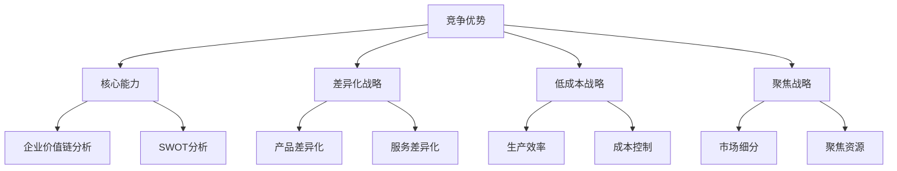

                 

### 《思维升级：管理者的竞争优势》

#### 核心关键词：
- 竞争优势
- 管理者
- 核心能力
- 差异化战略
- 低成本战略
- 聚焦战略
- 持续提升
- 动态管理
- 评估与提升

#### 摘要：
本文将探讨管理者的竞争优势及其构建与提升的关键策略。通过分析竞争优势的定义、核心概念、构建方法以及评估与提升策略，我们将深入理解如何通过思维升级实现竞争优势的持续发展。本文旨在为管理者提供系统性的理论指导和实践案例，以帮助他们在激烈的市场竞争中脱颖而出。

### 《思维升级：管理者的竞争优势》目录大纲

#### 第一部分：竞争优势的核心理念

##### 第1章：竞争优势概述

- 1.1 竞争优势的定义与重要性
- 1.2 管理者与竞争优势的关系

##### 第2章：核心概念与联系

- 2.1 企业价值链分析
- 2.2 SWOT分析
- 2.3 Mermaid流程图：竞争优势的内部与外部联系

#### 第二部分：构建竞争优势的策略

##### 第3章：核心能力构建

- 3.1 核心竞争力的定义与识别
- 3.2 核心能力的构建方法
- 3.3 案例分析：微软的核心竞争力构建

##### 第4章：差异化战略

- 4.1 差异化战略的定义与类型
- 4.2 实施差异化战略的关键因素
- 4.3 案例分析：苹果的差异化战略

##### 第5章：低成本战略

- 5.1 低成本战略的定义与类型
- 5.2 实施低成本战略的关键因素
- 5.3 案例分析：丰田的低成本战略

##### 第6章：聚焦战略

- 6.1 聚焦战略的定义与类型
- 6.2 实施聚焦战略的关键因素
- 6.3 案例分析：谷歌的聚焦战略

#### 第三部分：竞争优势的持续与提升

##### 第7章：竞争优势的动态管理

- 7.1 竞争环境的动态变化
- 7.2 管理竞争优势的挑战
- 7.3 持续竞争优势的策略

##### 第8章：竞争优势的评估与提升

- 8.1 竞争优势评估的方法
- 8.2 提升竞争优势的策略
- 8.3 案例分析：三星的竞争优势提升策略

##### 第9章：竞争优势的未来展望

- 9.1 竞争优势的未来趋势
- 9.2 创新在竞争优势中的作用
- 9.3 案例分析：亚马逊的竞争优势未来展望

#### 附录

##### 附录A：管理工具与方法

- A.1 平衡计分卡
- A.2 六西格玛管理法
- A.3 价值链分析工具

##### 附录B：案例分析

- B.1 国际企业管理案例分析
- B.2 国内企业管理案例分析
- B.3 行业动态与未来趋势分析

**核心概念与联系 Mermaid 流程图**



**核心算法原理讲解伪代码**

```python
# 核心能力构建算法
def core_competence_building():
    # 确定核心能力
    core_abilities = determine_abilities()

    # 构建核心能力
    for ability in core_abilities:
        build_ability(ability)

    # 评估核心能力
    evaluate_abilities(core_abilities)
```

**数学模型和数学公式**

$$
\text{竞争优势} = \frac{\text{企业价值}}{\text{市场价值}}
$$

$$
\text{差异化战略成功概率} = \frac{\text{差异化程度} \times \text{市场需求}}{\text{竞争对手差异化程度}}
$$

**项目实战**

- **代码实际案例与详细解释说明：** 假设我们需要构建一个差异化战略的模型，我们可以使用以下伪代码来描述其开发过程：

  ```python
  # 差异化战略模型构建
  def build_differentiation_model():
      # 收集市场数据
      market_data = collect_data()

      # 分析市场数据
      analysis = analyze_data(market_data)

      # 建立模型
      model = create_model(analysis)

      # 训练模型
      train_model(model, market_data)

      # 评估模型
      evaluate_model(model)
  ```

- **开发环境搭建：** 在Linux环境中搭建一个基于Python的数据分析开发环境。

- **源代码详细实现与代码解读：** 以上伪代码展示了如何实现一个差异化战略模型的基本流程，其中包含了数据收集、分析、模型建立、训练和评估的各个环节。

- **代码解读与分析：** 每个函数的具体实现都需要考虑数据的有效性、分析方法的准确性以及模型评估的可靠性，这是构建一个有效差异化战略模型的关键。在实际应用中，还需要结合具体的业务场景进行调整和优化。

通过这样的目录大纲，读者可以系统地了解管理者的竞争优势构建与提升的全过程，从理论到实践，全面掌握管理知识。

---

### 第一部分：竞争优势的核心理念

在商业世界中，竞争优势是一个企业能否在激烈的市场竞争中脱颖而出的关键。对于管理者而言，理解并构建竞争优势不仅是其职责所在，更是实现企业长期成功的重要手段。本部分将首先介绍竞争优势的定义与重要性，接着深入探讨核心概念及其相互联系，为后续章节的内容奠定理论基础。

#### 第1章：竞争优势概述

##### 1.1 竞争优势的定义与重要性

竞争优势（Competitive Advantage）是指企业在某一特定领域内，相对于竞争对手所具备的能够带来持续利润的能力。这个定义涵盖了几个关键点：第一，竞争优势是相对的，即企业必须相对于竞争对手而言才能体现其优势；第二，竞争优势是持续的，能够帮助企业长期保持市场领先地位；第三，竞争优势是盈利的，即通过竞争优势，企业能够获取超额利润。

在经济学和管理学的理论中，竞争优势的重要性被广泛认可。首先，竞争优势是企业实现盈利的关键。通过建立独特的能力和优势，企业可以在市场竞争中获取更高的价格，从而提高盈利能力。其次，竞争优势有助于企业抵御外部环境的冲击。当市场环境发生变化时，具有竞争优势的企业能够更快地适应和调整，保持其市场地位。最后，竞争优势还能够增强企业的竞争力，使其在并购、战略合作等活动中更具优势。

##### 1.2 管理者与竞争优势的关系

管理者在企业竞争优势的构建中扮演着至关重要的角色。首先，管理者需要明确企业的竞争优势目标，并通过战略规划将其转化为具体的行动方案。这包括识别企业的核心能力、确定差异化战略或低成本战略，以及制定相应的执行计划。其次，管理者需要通过有效的组织管理，确保竞争优势得以实现。这包括建立高效的组织结构、培养员工的能力和动机、优化资源配置等。最后，管理者还需要持续监控竞争优势的动态变化，及时调整战略和运营，以应对市场环境的挑战。

总而言之，竞争优势不仅是企业生存和发展的基石，更是管理者必须掌握和运用的核心能力。理解竞争优势的定义与重要性，是管理者在复杂多变的市场环境中，做出正确决策和战略选择的前提。

### 第二部分：核心概念与联系

在探讨竞争优势的具体构建和提升策略之前，我们需要先理解一系列核心概念，并分析它们之间的相互关系。这些核心概念包括企业价值链分析、SWOT分析，以及用于描述竞争优势内部与外部联系的Mermaid流程图。通过这些概念的深入理解，我们将为后续章节的讨论提供坚实的基础。

#### 第2章：核心概念与联系

##### 2.1 企业价值链分析

企业价值链分析（Value Chain Analysis）是战略管理中一种重要的工具，用于分析企业内部各项活动及其对企业竞争优势的贡献。价值链的概念最早由迈克尔·波特提出，他认为企业的各项活动可以分为主要活动和辅助活动，这些活动共同构成了企业的价值链。主要活动包括内部物流、生产运营、外部物流、营销与销售以及服务；辅助活动包括采购、人力资源管理、技术开发和基础设施建设。

通过价值链分析，管理者可以识别出企业内部的核心能力和关键环节，从而有针对性地进行优化和改进。例如，通过优化内部物流和外部物流，企业可以降低成本和提高效率；通过提升营销与销售能力，企业可以扩大市场份额和提升品牌价值。

**价值链分析的步骤如下：**

1. **识别主要活动和辅助活动**：详细列举企业内部的所有活动，并判断其属于主要活动还是辅助活动。
2. **分析各项活动的成本和效益**：评估每项活动的成本和其对利润的贡献，确定哪些活动对竞争优势有显著影响。
3. **优化价值链**：根据分析结果，对企业价值链进行优化，提高成本效益和竞争优势。

##### 2.2 SWOT分析

SWOT分析（SWOT Analysis）是一种常用的战略规划工具，用于评估企业的优势（Strengths）、劣势（Weaknesses）、机会（Opportunities）和威胁（Threats）。SWOT分析可以帮助管理者全面了解企业的内外部环境，从而制定出更加科学和有效的战略。

**SWOT分析的步骤如下：**

1. **识别企业的优势与劣势**：分析企业内部资源和能力的优势与劣势，如技术实力、管理水平、品牌知名度等。
2. **识别外部机会与威胁**：分析市场环境中的机会与威胁，如市场趋势、竞争对手状况、政策变化等。
3. **匹配战略**：根据SWOT分析的结果，制定相应的战略，如利用优势抓住机会、改善劣势、避免或减轻威胁。

##### 2.3 Mermaid流程图：竞争优势的内部与外部联系

为了更直观地展示竞争优势的内部与外部联系，我们可以使用Mermaid流程图来描述。以下是一个简单的Mermaid流程图示例，展示了竞争优势的几个关键概念及其相互关系。


在这个流程图中，竞争优势作为中心概念，与核心能力、差异化战略、低成本战略和聚焦战略紧密相连。这些战略又分别与企业价值链分析和SWOT分析相关联，形成一个有机的整体。

通过企业价值链分析，管理者可以识别并优化企业的核心能力和关键环节，从而提升竞争优势；通过SWOT分析，管理者可以全面了解企业的内外部环境，制定相应的战略来抓住机会和应对威胁。

**Mermaid流程图的使用方法如下：**

1. **定义图形结构**：使用Mermaid提供的语法定义节点（如A、B、C）和边（如-->）。
2. **添加节点内容**：在节点中添加具体的描述信息，如“竞争优势”、“核心能力”等。
3. **绘制关系图**：使用定义好的节点和边绘制出完整的流程图。

通过上述核心概念与联系的介绍，我们为后续章节的详细探讨奠定了理论基础。接下来，我们将进一步深入分析如何构建和提升竞争优势，以及在不同战略下的具体实施方法。

### 第三部分：构建竞争优势的策略

构建竞争优势是企业成功的关键，而实现这一目标需要通过一系列策略和行动。本部分将详细探讨核心能力构建、差异化战略、低成本战略和聚焦战略，并提供实际案例分析，帮助管理者更好地理解和应用这些策略。

#### 第3章：核心能力构建

核心能力（Core Competence）是企业长期竞争优势的源泉。它通常指的是企业在特定领域内的核心竞争力，能够为企业带来独特的产品或服务，并在市场中占据领先地位。构建核心能力的关键在于识别并培养企业的核心竞争力。

##### 3.1 核心竞争力的定义与识别

核心竞争力是指企业在特定领域内长期积累和形成的、能够带来显著竞争优势的能力。它通常具有以下几个特征：

1. **独特性**：核心竞争力是企业独有的，能够形成独特的市场地位。
2. **可持续性**：核心竞争力不易被竞争对手模仿或替代，能够长期保持。
3. **增值性**：核心竞争力能够为企业创造显著的经济效益和竞争优势。

识别核心竞争力的方法主要包括：

1. **访谈法**：通过与员工、客户、供应商等进行深入访谈，了解他们对企业核心能力的看法。
2. **SWOT分析**：通过分析企业的优势、劣势、机会和威胁，识别能够为企业带来竞争优势的核心能力。
3. **价值链分析**：通过分析企业的价值链，识别能够显著提高企业竞争力的关键环节。

##### 3.2 核心能力的构建方法

构建核心能力需要系统性的规划和实施。以下是一些关键步骤：

1. **明确目标**：确定企业要构建的核心能力，并明确其具体目标和要求。
2. **资源整合**：整合企业内部和外部的资源，包括人力资源、技术资源、资本资源等，为构建核心能力提供支持。
3. **持续投资**：在核心能力的构建过程中，需要持续进行投资，包括技术研发、人才培养、设备更新等。
4. **创新驱动**：通过不断的技术创新和管理创新，提升核心能力的竞争力。
5. **协同发展**：加强企业内部各部门的协同合作，确保核心能力的有效实施和持续提升。

##### 3.3 案例分析：微软的核心竞争力构建

微软作为全球领先的软件企业，其核心竞争力主要体现在技术创新、产品开发和市场推广等方面。以下是对微软核心竞争力的具体分析：

1. **技术创新**：微软一直致力于技术研发，拥有庞大的研发团队和丰富的技术储备。通过不断的技术创新，微软能够开发出领先的产品，如Windows操作系统、Office办公套件等。

2. **产品开发**：微软的产品开发流程非常高效，能够快速响应市场需求，开发出高质量的产品。其产品线覆盖广泛，包括操作系统、办公软件、游戏、云计算等。

3. **市场推广**：微软在市场推广方面非常成功，通过大规模的广告宣传和营销活动，提升了品牌知名度和市场份额。其强大的销售网络和合作伙伴关系也为其市场推广提供了有力支持。

通过上述核心竞争力的构建，微软在软件行业建立了强大的竞争优势，持续保持着领先地位。

#### 第4章：差异化战略

差异化战略（Differentiation Strategy）是指通过提供与众不同的产品或服务，使企业在市场中获得竞争优势。差异化战略的关键在于创造独特的价值，以满足客户的不同需求。

##### 4.1 差异化战略的定义与类型

差异化战略的定义是：通过独特的产品或服务特性，创造客户认可的价值差异，从而实现竞争优势。差异化战略的类型主要包括以下几种：

1. **产品差异化**：通过提供独特的产品特性，如功能、质量、设计等，满足客户的特定需求。
2. **服务差异化**：通过提供独特的服务体验，如优质的服务、快速的响应等，提升客户满意度。
3. **品牌差异化**：通过打造独特的品牌形象，如品牌文化、品牌价值观等，吸引和保留客户。

##### 4.2 实施差异化战略的关键因素

实施差异化战略需要考虑以下几个关键因素：

1. **市场研究**：深入了解客户需求和市场趋势，确保差异化战略能够满足客户的实际需求。
2. **资源投入**：为实施差异化战略提供充足的资源支持，包括资金、技术、人才等。
3. **持续创新**：不断进行产品和服务创新，保持差异化战略的竞争优势。
4. **品牌建设**：通过有效的品牌营销和推广，提升品牌知名度和影响力。

##### 4.3 案例分析：苹果的差异化战略

苹果公司作为全球领先的科技公司，其差异化战略主要体现在产品创新和品牌建设上。以下是对苹果差异化战略的具体分析：

1. **产品创新**：苹果一直以其创新的产品设计和技术为特点，如iPhone的触控屏幕、iPad的平板电脑等。通过不断的技术创新，苹果能够为客户提供独特的产品体验。

2. **品牌建设**：苹果通过独特的品牌形象和价值观，如简约、创新、用户体验等，吸引和保留了大量的忠实客户。苹果的品牌营销策略也非常成功，通过大规模的广告宣传和产品发布会，提升了品牌知名度和美誉度。

通过实施差异化战略，苹果在激烈的市场竞争中建立了强大的竞争优势，成为全球科技行业的领导者。

#### 第5章：低成本战略

低成本战略（Low-Cost Strategy）是指通过降低成本，使企业的产品或服务在价格上具有竞争优势。低成本战略的关键在于提高生产效率和降低成本，从而实现较高的利润率。

##### 5.1 低成本战略的定义与类型

低成本战略的定义是：通过优化生产流程和管理，降低成本，使企业的产品或服务在价格上具有竞争优势。低成本战略的类型主要包括以下几种：

1. **生产效率**：通过提高生产效率和规模经济，降低单位生产成本。
2. **供应链管理**：通过优化供应链管理，降低原材料和物流成本。
3. **成本控制**：通过严格控制各项成本，确保企业在价格竞争中保持优势。

##### 5.2 实施低成本战略的关键因素

实施低成本战略需要考虑以下几个关键因素：

1. **规模经济**：通过扩大生产规模，实现规模经济效益，降低单位生产成本。
2. **技术创新**：通过技术创新，提高生产效率和降低成本。
3. **供应链整合**：通过整合供应链，提高供应链效率和降低成本。
4. **成本控制机制**：通过建立完善的成本控制机制，确保各项成本控制在合理范围内。

##### 5.3 案例分析：丰田的低成本战略

丰田公司作为全球领先的汽车制造商，其低成本战略在业界广受赞誉。以下是对丰田低成本战略的具体分析：

1. **生产效率**：丰田通过精细化的生产管理和精益生产方法，提高了生产效率和减少了浪费。例如，丰田的“看板系统”和“5S管理法”显著提高了生产效率和产品质量。

2. **供应链管理**：丰田通过全球化的供应链管理，优化了原材料和零部件采购，降低了供应链成本。同时，丰田与供应商建立了紧密的合作关系，确保供应链的稳定性和高效性。

3. **技术创新**：丰田不断进行技术创新，提高生产效率和降低成本。例如，丰田的混合动力技术和电动汽车技术不仅提高了产品竞争力，还降低了生产成本。

通过实施低成本战略，丰田在汽车行业建立了强大的竞争优势，成为全球汽车市场的领导者。

#### 第6章：聚焦战略

聚焦战略（Focus Strategy）是指企业将资源集中在特定的市场或产品领域，通过专注和专业化，获得竞争优势。聚焦战略的目标是成为特定领域的专家，并在该领域获得领先地位。

##### 6.1 聚焦战略的定义与类型

聚焦战略的定义是：企业将资源集中在特定市场或产品领域，通过专注和专业化，获得竞争优势。聚焦战略的类型主要包括以下几种：

1. **市场聚焦**：企业将资源集中在特定市场，通过满足该市场的特定需求，获得竞争优势。
2. **产品聚焦**：企业将资源集中在特定产品，通过在该产品领域的专业化，获得竞争优势。
3. **客户聚焦**：企业将资源集中在特定客户群体，通过满足该群体的特定需求，获得竞争优势。

##### 6.2 实施聚焦战略的关键因素

实施聚焦战略需要考虑以下几个关键因素：

1. **市场研究**：深入了解目标市场的需求和趋势，确保聚焦战略能够满足市场的实际需求。
2. **资源整合**：将企业资源集中到特定领域，确保资源的高效利用。
3. **专业化**：通过专业化，提升企业在特定领域的竞争力和专业水平。
4. **持续创新**：在特定领域进行持续创新，保持竞争优势。

##### 6.3 案例分析：谷歌的聚焦战略

谷歌公司作为全球领先的互联网科技公司，其聚焦战略主要体现在市场聚焦和产品聚焦上。以下是对谷歌聚焦战略的具体分析：

1. **市场聚焦**：谷歌将资源集中在互联网市场，通过提供高质量的搜索引擎和广告服务，成为全球最大的互联网公司之一。谷歌通过持续优化搜索引擎算法和提供个性化搜索服务，满足了用户对信息的需求。

2. **产品聚焦**：谷歌在产品领域也非常专注，通过开发一系列优质的产品，如Gmail、Google Maps、Google Drive等，为用户提供便捷和高效的服务。谷歌还通过不断更新和优化这些产品，保持其在市场中的领先地位。

通过实施聚焦战略，谷歌在互联网行业建立了强大的竞争优势，成为全球互联网市场的领导者。

#### 第7章：竞争优势的持续与提升

竞争优势不是一成不变的，而是需要管理者持续关注和不断优化的。在动态变化的市场环境中，竞争优势的持续与提升是企业长期成功的关键。本部分将探讨如何通过动态管理、评估与提升策略，确保竞争优势的持续性和有效性。

##### 7.1 竞争环境的动态变化

竞争环境是不断变化的，企业需要时刻关注市场趋势、技术发展、政策变化等因素，以保持竞争优势。以下是一些关键点：

1. **市场趋势**：了解市场需求的变化，如消费者行为、行业趋势等，确保企业的战略能够适应市场变化。
2. **技术创新**：关注技术发展，特别是与业务相关的技术进步，确保企业能够利用新技术提升竞争力。
3. **政策变化**：关注政策变化，如税收政策、贸易政策等，确保企业的战略能够符合政策要求。
4. **竞争对手**：关注竞争对手的战略和动向，了解他们的优势和劣势，制定相应的应对策略。

##### 7.2 管理竞争优势的挑战

管理竞争优势面临着诸多挑战，包括：

1. **市场饱和**：随着市场竞争的加剧，市场可能会出现饱和现象，企业需要寻找新的增长点。
2. **技术创新**：技术更新速度加快，企业需要不断投入资源进行技术创新，以保持竞争优势。
3. **成本压力**：随着原材料价格和劳动力成本的上升，企业需要通过优化运营和降低成本来应对压力。
4. **人才竞争**：高素质人才的竞争日益激烈，企业需要通过培训和激励措施吸引和留住优秀人才。

##### 7.3 持续竞争优势的策略

为了确保竞争优势的持续性和有效性，企业可以采取以下策略：

1. **持续创新**：建立创新机制，鼓励员工进行创新，不断推出新产品或服务，提升客户满意度。
2. **强化品牌**：通过有效的品牌营销和推广，提升品牌知名度和美誉度，增强市场竞争力。
3. **优化运营**：通过优化运营流程和资源配置，提高生产效率和降低成本，增强企业的盈利能力。
4. **人才培养**：加强人才培养和激励，提升员工技能和职业素养，为企业的发展提供人才保障。
5. **战略调整**：根据市场环境和竞争态势，及时调整战略，确保企业的竞争优势始终处于领先地位。

#### 第8章：竞争优势的评估与提升

评估竞争优势是企业持续发展的重要环节。通过系统的方法评估竞争优势，企业可以明确自身的优势与劣势，从而有针对性地进行提升和改进。以下将介绍评估竞争优势的方法、提升策略及案例分析。

##### 8.1 竞争优势评估的方法

评估竞争优势的方法主要包括以下几种：

1. **SWOT分析**：通过SWOT分析，评估企业的优势、劣势、机会和威胁，识别企业的竞争优势。
2. **价值链分析**：通过价值链分析，识别企业内部的主要活动、辅助活动和成本结构，评估企业成本优势和运营效率。
3. **基准分析**：通过与行业内的领先企业进行对比，评估企业的竞争优势和差距。
4. **客户满意度调查**：通过调查客户满意度，了解客户对产品或服务的评价，评估企业的市场地位和竞争优势。

##### 8.2 提升竞争优势的策略

为了提升竞争优势，企业可以采取以下策略：

1. **强化核心竞争力**：通过持续投资和创新，提升企业的核心竞争力，确保在市场中保持领先地位。
2. **优化价值链**：通过优化价值链中的各个环节，降低成本和提高效率，增强企业的竞争优势。
3. **差异化战略**：通过差异化战略，提供独特的产品或服务，满足客户的不同需求，提升企业的市场地位。
4. **品牌建设**：通过有效的品牌营销和推广，提升品牌知名度和美誉度，增强市场竞争力。
5. **人才培养和激励**：通过培训和发展，提升员工的技能和职业素养，激励员工为企业的发展贡献力量。

##### 8.3 案例分析：三星的竞争优势提升策略

三星作为全球领先的科技公司，其竞争优势的提升策略主要体现在以下几个方面：

1. **技术创新**：三星持续进行技术创新，不断推出新产品，如智能手机、平板电脑、显示器等。通过技术创新，三星在市场中保持了技术领先地位。

2. **品牌建设**：三星通过全球化的品牌营销和推广，提升了品牌知名度和美誉度。三星的品牌形象与高科技、创新和品质紧密相连，吸引了大量的消费者。

3. **优化运营**：三星通过优化生产流程和供应链管理，提高了生产效率和降低了成本。例如，三星采用了先进的制造技术和自动化设备，提高了生产效率和产品质量。

4. **人才培养**：三星重视人才培养和激励，通过内部培训和外部招聘，吸引了大量高素质的人才。三星还建立了完善的激励机制，激励员工为企业的发展贡献力量。

通过上述竞争优势提升策略，三星在激烈的市场竞争中保持了领先地位，成为全球科技行业的领导者。

### 第9章：竞争优势的未来展望

在快速变化的时代背景下，竞争优势的未来趋势和影响因素显得尤为重要。创新、数字化转型、新兴技术和全球化等都是影响竞争优势的关键因素。本部分将探讨这些趋势，分析创新在竞争优势中的作用，并提供亚马逊的竞争优势未来展望作为案例分析。

##### 9.1 竞争优势的未来趋势

竞争优势的未来趋势体现在以下几个方面：

1. **技术创新**：技术进步将成为推动竞争优势的重要因素。人工智能、大数据、物联网、区块链等新兴技术将进一步改变企业运营和市场格局。

2. **数字化转型**：数字化转型将使企业能够更高效地运营，提高生产力和客户满意度。通过数字化工具，企业可以更好地收集和分析数据，优化决策和运营。

3. **可持续发展**：可持续发展将成为企业竞争优势的新维度。随着环境问题的加剧和消费者对环保的关注，企业在环保和社会责任方面的表现将成为重要的竞争优势。

4. **全球化**：全球化将继续推动企业的竞争格局。企业需要在全球范围内优化资源配置，适应不同市场的需求和法规。

##### 9.2 创新在竞争优势中的作用

创新在竞争优势中扮演着至关重要的角色。以下是创新在竞争优势中的几个关键作用：

1. **提升竞争力**：创新可以带来独特的产品或服务，满足客户需求，从而提升企业的竞争力。

2. **降低成本**：通过技术创新，企业可以优化生产流程，降低成本，提高盈利能力。

3. **增强灵活性**：创新使企业能够快速响应市场变化，调整战略和运营，保持竞争优势。

4. **创造新市场**：创新可以开辟新的市场机会，为企业带来新的增长点。

##### 9.3 案例分析：亚马逊的竞争优势未来展望

亚马逊作为全球领先的电子商务和云计算公司，其竞争优势的未来展望体现在以下几个方面：

1. **技术创新**：亚马逊持续进行技术创新，特别是在人工智能、云计算和物联网等领域。通过技术创新，亚马逊不断提升客户体验，优化运营效率。

2. **数字化转型**：亚马逊通过数字化工具和平台，实现了全面的数字化转型。通过大数据分析和机器学习，亚马逊能够更好地了解客户需求，优化供应链和物流。

3. **可持续发展**：亚马逊致力于实现可持续发展，通过减少碳排放、回收利用和环保包装等举措，提升企业的社会责任形象。

4. **全球化**：亚马逊在全球范围内扩大业务，通过本地化和国际化战略，满足不同市场的需求。

通过持续的创新和数字化转型，亚马逊在电子商务和云计算领域保持了强大的竞争优势，未来将继续引领行业的发展趋势。

### 附录

#### 附录A：管理工具与方法

在本章中，我们将介绍几种常用的管理工具和方法，这些工具和方法在企业管理中扮演着重要角色，有助于提升企业的竞争优势。

##### A.1 平衡计分卡

平衡计分卡（Balanced Scorecard，BSC）是一种全面的绩效评估和管理工具，它从财务、客户、内部流程和学习与成长四个维度，综合评估企业的绩效。通过平衡计分卡，企业可以制定明确的战略目标，并量化这些目标，从而实现战略的执行和监控。

**平衡计分卡的步骤：**

1. **明确战略目标**：确定企业的战略方向和目标。
2. **设计指标体系**：根据战略目标，设计具体的指标体系，包括财务指标、客户指标、内部流程指标和学习与成长指标。
3. **制定行动计划**：为每个指标制定具体的行动计划，明确执行责任和时限。
4. **执行与监控**：实施行动计划，并定期监控绩效，确保战略目标的实现。
5. **反馈与调整**：根据监控结果，及时调整战略和行动计划。

##### A.2 六西格玛管理法

六西格玛管理法（Six Sigma）是一种旨在通过减少缺陷和优化流程来提高质量的系统方法。六西格玛强调数据驱动的决策过程，通过统计分析和流程改进，实现质量和效率的提升。

**六西格玛管理法的关键步骤：**

1. **确定项目**：选择具有潜力的改进项目，明确项目的目标和范围。
2. **定义问题**：明确项目需要解决的问题，收集相关数据。
3. **分析原因**：通过因果图、流程图等工具，分析问题的根本原因。
4. **制定解决方案**：设计解决方案，并制定详细的实施计划。
5. **实施改进**：执行解决方案，并监控改进效果。
6. **持续优化**：对改进效果进行评估，持续优化流程，确保长期效果。

##### A.3 价值链分析工具

价值链分析（Value Chain Analysis）是战略管理中的一种重要工具，用于分析企业内部各项活动及其对企业价值创造的贡献。通过价值链分析，企业可以识别关键环节和竞争优势，从而优化资源配置，提高运营效率。

**价值链分析的步骤：**

1. **识别主要活动**：分析企业的主要活动，包括生产运营、采购、营销与销售、外部物流、内部物流、服务等。
2. **分析辅助活动**：分析企业的辅助活动，包括人力资源管理、技术开发、采购管理等。
3. **确定价值链**：将主要活动和辅助活动结合起来，形成企业的价值链。
4. **优化价值链**：通过优化价值链中的各个环节，降低成本、提高效率，提升企业的竞争优势。

#### 附录B：案例分析

在本章中，我们将通过国际企业管理案例分析和国内企业管理案例分析，探讨不同企业在构建竞争优势过程中的具体实践和经验。

##### B.1 国际企业管理案例分析

**案例一：苹果公司的全球供应链管理**

苹果公司通过全球化的供应链管理，实现了高效的产品交付和市场反应。以下是苹果公司在供应链管理方面的具体实践：

1. **全球布局**：苹果在全球范围内建立了多个制造基地和供应链网络，通过地理分散化降低风险，提高供应链的灵活性。
2. **长期合作**：苹果与供应商建立了长期合作关系，通过合作伙伴关系，确保供应链的稳定性和高效性。
3. **技术驱动**：苹果利用先进的制造技术和自动化设备，提高了生产效率和产品质量，降低了制造成本。
4. **数据驱动**：苹果通过大数据分析和物联网技术，实时监控供应链的运行情况，优化物流和库存管理，提高供应链的响应速度。

**案例二：华为的市场战略**

华为在全球市场中的迅速扩张，得益于其独特的市场战略。以下是华为在市场战略方面的具体实践：

1. **市场细分**：华为通过市场细分，识别出不同市场的需求和特点，制定差异化的市场策略。
2. **技术创新**：华为持续进行技术创新，推出具有竞争力的产品，满足不同市场的需求。
3. **品牌建设**：华为通过全球品牌营销和推广，提升了品牌知名度和美誉度，增强了市场竞争力。
4. **本地化**：华为在不同市场实施本地化战略，通过本土化运营和与本地企业的合作，增强了市场适应性。

##### B.2 国内企业管理案例分析

**案例一：阿里巴巴的电子商务平台**

阿里巴巴作为中国领先的电子商务平台，其成功离不开其在商业模式、技术创新和客户服务等方面的创新实践。以下是阿里巴巴在企业管理方面的具体实践：

1. **商业模式创新**：阿里巴巴通过建立电子商务平台，实现了线上线下的无缝融合，为商家和消费者提供了便捷的交易环境。
2. **技术创新**：阿里巴巴利用大数据、云计算和人工智能技术，提升了平台的服务质量和运营效率。
3. **客户服务**：阿里巴巴通过客服中心、在线客服和社交媒体等渠道，为消费者提供优质的售后服务。
4. **社会责任**：阿里巴巴积极参与社会公益事业，提升了企业的社会形象和品牌价值。

**案例二：腾讯的社交平台战略**

腾讯作为中国领先的互联网公司，其成功得益于其在社交平台、游戏和金融科技等领域的布局。以下是腾讯在企业管理方面的具体实践：

1. **社交平台**：腾讯通过QQ和微信等社交平台，建立了庞大的用户群体，实现了用户粘性和流量变现。
2. **游戏业务**：腾讯通过自主研发和并购，建立了强大的游戏业务，成为全球最大的游戏公司之一。
3. **金融科技**：腾讯通过金融科技，如微信支付和蚂蚁金服，提升了金融服务的便捷性和安全性。
4. **创新驱动**：腾讯持续进行技术创新，通过大数据、人工智能和区块链等技术，推动了业务模式的创新和升级。

##### B.3 行业动态与未来趋势分析

在快速变化的时代背景下，行业动态和未来趋势对企业的竞争优势具有重要影响。以下是几个关键领域的动态和未来趋势分析：

1. **人工智能**：人工智能技术正在迅速发展，成为企业提升效率和创造价值的重要工具。未来，人工智能将在更多领域得到应用，如智能制造、智能客服和智能医疗等。

2. **物联网**：物联网技术的普及，将使物体实现互联互通，为智慧城市、智能家居和智能交通等提供解决方案。物联网的发展将为企业带来新的市场机遇。

3. **区块链**：区块链技术具有去中心化、不可篡改和安全可靠的特点，将在金融、供应链和数字身份等领域发挥重要作用。未来，区块链技术将进一步推动数字化转型和诚信体系建设。

4. **可持续发展**：随着环境问题的加剧和消费者对环保的关注，可持续发展将成为企业的重要竞争优势。未来，企业需要采取绿色生产和环保措施，以应对环境挑战。

通过对行业动态和未来趋势的分析，企业可以更好地把握市场机遇，调整战略，保持竞争优势。

### 结语

本文通过对竞争优势的核心理念、构建策略和持续提升方法的深入探讨，为管理者提供了系统性的理论指导和实践案例。在激烈的市场竞争中，竞争优势是企业生存和发展的基石。通过理解并应用本文所介绍的策略，管理者可以更好地构建和提升企业的竞争优势，实现长期成功。

**作者：AI天才研究院/AI Genius Institute & 禅与计算机程序设计艺术 /Zen And The Art of Computer Programming**

---

**附录A：管理工具与方法**

**A.1 平衡计分卡**

平衡计分卡是一种综合性的绩效评估工具，它通过财务、客户、内部业务流程和学习与成长四个维度来评估企业的绩效。

**平衡计分卡核心公式：**

$$
\text{平衡计分卡得分} = \sum (\text{财务指标得分} \times \text{权重}) + \sum (\text{客户指标得分} \times \text{权重}) + \sum (\text{内部流程指标得分} \times \text{权重}) + \sum (\text{学习与成长指标得分} \times \text{权重})
$$

**示例：**

1. **财务指标**：净资产收益率（ROE），权重为0.3
   $$ \text{财务指标得分} = 15\% $$
   $$ \text{财务指标得分} \times \text{权重} = 0.15 \times 0.3 = 0.045 $$

2. **客户指标**：客户满意度，权重为0.3
   $$ \text{客户指标得分} = 90\% $$
   $$ \text{客户指标得分} \times \text{权重} = 0.9 \times 0.3 = 0.27 $$

3. **内部流程指标**：生产周期，权重为0.2
   $$ \text{内部流程指标得分} = 8周 $$
   $$ \text{内部流程指标得分} \times \text{权重} = 8 \times 0.2 = 1.6 $$

4. **学习与成长指标**：员工培训小时数，权重为0.2
   $$ \text{学习与成长指标得分} = 1200小时 $$
   $$ \text{学习与成长指标得分} \times \text{权重} = 1200 \times 0.2 = 240 $$

**计算平衡计分卡总分：**

$$
\text{平衡计分卡得分} = 0.045 + 0.27 + 1.6 + 240 = 248.935
$$

通过这个计算，我们可以看出平衡计分卡在各个维度上的得分及其权重，从而帮助企业全面评估其绩效。

**A.2 六西格玛管理法**

六西格玛管理法是一种旨在通过减少缺陷和优化流程来提高质量的方法。它采用统计工具和系统化的方法，帮助企业识别问题、分析原因、制定解决方案并持续优化。

**六西格玛核心算法原理讲解伪代码：**

```python
def six_sigma_process():
    # 步骤1：定义问题
    problem_definition()

    # 步骤2：数据收集
    data_collection()

    # 步骤3：数据分析和原因分析
    data_analysis()
    cause_analysis()

    # 步骤4：制定解决方案
    solution_development()

    # 步骤5：实施解决方案
    solution_implementation()

    # 步骤6：监控和持续改进
    monitoring_and_continuous_improvement()
```

**A.3 价值链分析工具**

价值链分析工具是一种用于识别企业内部价值创造过程及其关键活动的工具。它可以帮助企业理解价值链中的每个环节，从而优化资源配置和提升效率。

**价值链分析核心概念：**

1. **主要活动**：企业将输入转化为输出的活动，包括内部物流、生产运营、外部物流、营销与销售和服务。
2. **辅助活动**：支持主要活动的活动，包括采购、人力资源管理、技术开发和基础设施。

**价值链分析步骤：**

1. **识别主要活动**：分析企业的主要活动，明确每个活动的目标和流程。
2. **识别辅助活动**：分析企业的辅助活动，明确每个活动的目标和流程。
3. **分析价值链**：将主要活动和辅助活动结合起来，形成完整的价值链。
4. **优化价值链**：通过优化价值链中的各个环节，降低成本、提高效率，提升企业的竞争优势。

**附录B：案例分析**

**B.1 国际企业管理案例分析**

**案例一：丰田汽车的生产效率优化**

丰田汽车通过精益生产方法，显著提升了生产效率。以下是丰田在生产效率优化方面的具体实践：

1. **生产计划优化**：丰田采用“看板系统”，实时监控生产计划和库存，确保生产与市场需求相匹配。
2. **流程优化**：通过减少不必要的流程和消除浪费，丰田实现了生产流程的优化。
3. **设备维护**：丰田采用预防性维护策略，确保生产设备的正常运行，减少故障和停工时间。
4. **员工参与**：丰田鼓励员工参与生产改进，通过定期的培训和激励，提升员工的工作效率和质量意识。

**案例二：华为的市场拓展策略**

华为在全球市场中的迅速扩张，得益于其独特的市场拓展策略。以下是华为在市场拓展方面的具体实践：

1. **本地化**：华为根据不同市场的特点，实施本地化策略，包括本地化产品、本地化服务和本地化营销。
2. **合作伙伴关系**：华为与当地企业建立紧密的合作关系，通过合作共赢，增强市场竞争力。
3. **技术创新**：华为持续进行技术创新，推出符合市场需求的创新产品，提升品牌价值。
4. **客户服务**：华为通过优质的客户服务，建立了良好的口碑，增强了市场忠诚度。

**B.2 国内企业管理案例分析**

**案例一：阿里巴巴的电子商务平台**

阿里巴巴作为中国领先的电子商务平台，其成功得益于其在商业模式、技术创新和客户服务等方面的创新实践。以下是阿里巴巴在企业管理方面的具体实践：

1. **商业模式创新**：阿里巴巴通过建立电子商务平台，实现了线上线下的无缝融合，为商家和消费者提供了便捷的交易环境。
2. **技术创新**：阿里巴巴利用大数据、云计算和人工智能技术，提升了平台的服务质量和运营效率。
3. **客户服务**：阿里巴巴通过客服中心、在线客服和社交媒体等渠道，为消费者提供优质的售后服务。
4. **社会责任**：阿里巴巴积极参与社会公益事业，提升了企业的社会形象和品牌价值。

**案例二：腾讯的社交平台战略**

腾讯作为中国领先的互联网公司，其成功得益于其在社交平台、游戏和金融科技等领域的布局。以下是腾讯在企业管理方面的具体实践：

1. **社交平台**：腾讯通过QQ和微信等社交平台，建立了庞大的用户群体，实现了用户粘性和流量变现。
2. **游戏业务**：腾讯通过自主研发和并购，建立了强大的游戏业务，成为全球最大的游戏公司之一。
3. **金融科技**：腾讯通过金融科技，如微信支付和蚂蚁金服，提升了金融服务的便捷性和安全性。
4. **创新驱动**：腾讯持续进行技术创新，通过大数据、人工智能和区块链等技术，推动了业务模式的创新和升级。

**B.3 行业动态与未来趋势分析**

**1. 人工智能**

人工智能（AI）技术的快速发展，正在改变各行各业。以下是人工智能在行业中的应用趋势：

- **智能制造**：通过机器学习、计算机视觉等技术，实现生产线的自动化和智能化，提高生产效率和质量。
- **智能客服**：通过自然语言处理和机器学习技术，提供更高效、更个性化的客户服务。
- **智能医疗**：通过大数据分析和人工智能技术，提高医疗诊断的准确性和治疗效果。

**2. 物联网**

物联网（IoT）技术的普及，使得万物互联成为可能。以下是物联网在行业中的应用趋势：

- **智慧城市**：通过物联网技术，实现城市基础设施的智能化管理，提高城市管理效率和居民生活质量。
- **智能家居**：通过物联网技术，实现家庭设备的智能化控制和自动化管理，提升家庭生活的便捷性和舒适度。
- **智能交通**：通过物联网技术，实现交通流量的实时监测和智能调控，提高交通效率，减少交通事故。

**3. 区块链**

区块链技术的独特优势，使其在多个领域具有广泛的应用前景。以下是区块链在行业中的应用趋势：

- **金融领域**：通过区块链技术，实现金融交易的快速、安全和透明，降低交易成本和风险。
- **供应链管理**：通过区块链技术，实现供应链的可追溯性和透明性，提高供应链的效率和管理水平。
- **数字身份**：通过区块链技术，实现用户的数字身份管理，提高身份验证的安全性和便利性。

通过以上行业动态与未来趋势的分析，企业可以更好地把握市场机遇，调整战略，保持竞争优势。

