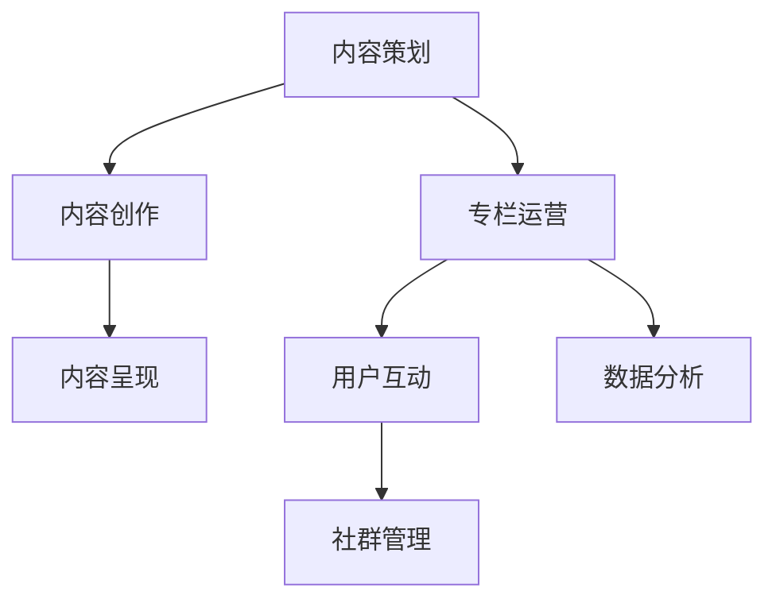

                 


## 打造知识付费专栏：内容策划与运营

### 关键词：
- 知识付费
- 内容策划
- 专栏运营
- 用户互动
- 数据分析

### 摘要：
本文将深入探讨如何打造成功的知识付费专栏，包括内容策划、创作与呈现、专栏运营策略、用户互动及数据分析等方面的实践与策略。通过结合实际案例和算法原理，帮助读者理解并掌握构建知识付费专栏的全方位技能。

---

### 目录大纲设计：《打造知识付费专栏：内容策划与运营》

**第一部分：知识付费专栏概述**

1. 知识付费行业背景与趋势
   - 1.1 知识付费市场的崛起
   - 1.2 知识付费用户行为分析
   - 1.3 知识付费平台的发展现状

2. 知识付费专栏的特点与优势
   - 2.1 知识付费专栏的定义
   - 2.2 知识付费专栏与传统内容形式的差异
   - 2.3 知识付费专栏的优势分析

**第二部分：内容策划**

3. 内容策划的基础
   - 3.1 内容策划的基本原则
   - 3.2 内容策划的流程与方法
   - 3.3 内容策划的关键要素

4. 内容主题的选择与设计
   - 4.1 主题选择的策略
   - 4.2 主题设计的方法与技巧
   - 4.3 主题案例分析与借鉴

5. 内容形式的创新与应用
   - 5.1 多样化的内容形式
   - 5.2 创新内容形式的应用场景
   - 5.3 内容形式的案例分析

**第三部分：内容创作与呈现**

6. 内容创作
   - 6.1 内容创作的基本要求
   - 6.2 内容创作的技巧与方法
   - 6.3 内容创作的案例分析

7. 内容呈现
   - 7.1 内容呈现的形式与工具
   - 7.2 优化内容呈现效果的方法
   - 7.3 内容呈现的案例分析

**第四部分：专栏运营**

8. 专栏运营策略
   - 8.1 专栏运营的目标与原则
   - 8.2 专栏运营的流程与环节
   - 8.3 专栏运营的案例分析

9. 用户互动与社群管理
   - 9.1 用户互动的重要性
   - 9.2 用户互动的策略与方法
   - 9.3 社群管理的关键技巧

10. 数据分析与优化
    - 10.1 数据分析的重要性
    - 10.2 数据分析的方法与工具
    - 10.3 数据优化策略与案例

**第五部分：实战案例分析**

11. 知识付费专栏的成功案例
    - 11.1 案例介绍与分析
    - 11.2 案例的启示与借鉴
    - 11.3 案例的不足与改进建议

**第六部分：未来展望**

12. 知识付费专栏的发展趋势
    - 12.1 行业发展趋势分析
    - 12.2 技术进步对知识付费专栏的影响
    - 12.3 知识付费专栏的未来展望

**附录**

13. 常用工具与资源介绍
    - 13.1 内容创作与编辑工具
    - 13.2 数据分析工具
    - 13.3 社群管理工具
    - 13.4 其他相关资源

---

### 核心概念与联系（Mermaid流程图）



### 核心算法原理讲解（伪代码）

```plaintext
// 内容策划算法伪代码

function contentPlanning(主题，用户需求，市场趋势) {
    // 筛选适合的主题
    suitable_topics = selectTopicsByCriteria(主题，用户需求，市场趋势)

    // 根据主题生成内容大纲
    content_outline = generateContentOutline(suitable_topics)

    // 按照大纲进行内容创作
    content = createContent(content_outline)

    // 完成内容策划
    return content
}

// 内容创作算法伪代码

function contentCreation(content_outline) {
    // 创建每个章节的内容
    for (each_chapter in content_outline) {
        chapter_content = createChapterContent(each_chapter)

        // 完成内容创作
        content_outline[each_chapter] = chapter_content
    }

    // 完成内容创作
    return content_outline
}
```

### 数学模型和数学公式（LaTeX格式）

```latex
% 数学公式示例
$$
\begin{aligned}
    y &= \sigma(W_1 \cdot x + b_1) \\
    z &= \sigma(W_2 \cdot y + b_2)
\end{aligned}
$$
```

### 文章标题：《打造知识付费专栏：内容策划与运营》

### 文章关键词：知识付费、内容策划、专栏运营、用户互动、数据分析

### 文章摘要：
本文旨在系统地阐述如何打造一个成功的知识付费专栏。我们将探讨知识付费行业的背景与趋势，分析专栏的特点与优势，深入内容策划、创作与呈现、专栏运营策略、用户互动及数据分析等关键环节。通过实际案例和算法原理的讲解，本文旨在为读者提供构建知识付费专栏的实用指导，帮助他们在这一新兴领域中取得成功。

---

接下来，我们将按照目录大纲逐步展开各个章节的内容，确保每个部分都能够详细、深入地解析并给出实用的操作建议。

---

**第一部分：知识付费专栏概述**

### 第1章：知识付费行业背景与趋势

#### 1.1 知识付费市场的崛起

知识付费市场的崛起可以追溯到互联网的快速发展时期，尤其是移动互联网的普及。随着人们对知识需求的增加，知识付费市场逐渐成为了一个庞大的产业。根据市场调研机构的数据显示，全球知识付费市场规模已经突破了千亿大关，并且呈现出持续增长的趋势。

在知识付费市场中，用户群体的构成多样。一方面，有大量专业工作者和企业家，他们希望通过付费获取最新的行业动态和专业知识，以提升自身的竞争力。另一方面，也有大量的普通消费者，他们希望通过付费获取有价值的信息和知识，满足个人成长和兴趣发展的需求。

#### 1.2 知识付费用户行为分析

知识付费用户的行为特征有以下几点：

1. **需求明确**：用户在进行知识付费时，往往有明确的需求和目标。他们希望获取能够解决实际问题或提升自身能力的知识。

2. **偏好多样化**：不同的用户有不同的知识需求，因此对内容形式和主题的偏好也各不相同。有些用户更喜欢图文并茂的内容，有些则偏好视频讲解，还有一些用户则更喜欢通过互动和社群学习。

3. **注重性价比**：用户在选择知识付费产品时，会综合考虑内容的价值、价格、以及品牌影响力等因素。性价比高的产品更容易获得用户的青睐。

4. **忠诚度高**：一旦用户对某个知识付费产品或平台产生信任，他们的忠诚度通常会较高，愿意持续消费和推荐。

#### 1.3 知识付费平台的发展现状

知识付费平台的发展现状可以从以下几个方面进行概述：

1. **平台类型多样**：目前市场上存在着多种类型的知识付费平台，包括专业教育平台、垂直领域的知识付费平台、自媒体平台等。这些平台各有特色，满足了不同用户群体的需求。

2. **内容质量参差不齐**：由于进入门槛较低，许多平台的内容质量参差不齐，部分平台甚至存在抄袭和低质量内容的情况。因此，用户在挑选知识付费产品时，需要更加谨慎。

3. **商业模式不断创新**：知识付费平台在商业模式上不断探索和创新，除了传统的订阅模式和一次性购买模式外，还有一些平台推出了会员制、内容分销等新型模式。

4. **用户规模持续增长**：随着知识付费观念的普及和消费升级，知识付费平台的用户规模正在持续增长。尤其是在年轻群体中，知识付费已成为一种普遍的消费习惯。

综上所述，知识付费行业正处于快速发展的阶段，市场潜力巨大。了解行业的背景和用户行为，对于打造一个成功的知识付费专栏至关重要。

---

**第二部分：内容策划**

### 第2章：内容策划的基础

#### 2.1 内容策划的基本原则

内容策划是构建知识付费专栏的核心环节，其成功与否直接关系到专栏的吸引力和用户粘性。以下是内容策划需要遵循的基本原则：

1. **用户导向**：内容策划应始终围绕用户的需求和兴趣进行，确保内容能够真正解决用户的问题或满足他们的需求。

2. **有价值性**：内容必须具有价值，能够为用户提供新的知识、见解或技能。低质量、重复性内容难以吸引和留住用户。

3. **系统化**：内容应具备系统性和逻辑性，帮助用户逐步掌握相关知识和技能。系统化的内容有助于提升用户的满意度和信任感。

4. **差异化**：在众多内容竞争激烈的市场中，差异化内容能够帮助专栏脱颖而出。差异化可以体现在内容主题、形式、风格等方面。

5. **持续更新**：内容应保持更新和迭代，以适应市场和用户需求的变化。定期更新能够保持用户的新鲜感和活跃度。

#### 2.2 内容策划的流程与方法

内容策划的流程通常包括以下几个步骤：

1. **需求调研**：通过问卷调查、用户访谈、市场调研等方式，了解用户的需求和偏好，为内容策划提供数据支持。

2. **主题筛选**：根据需求调研的结果，筛选出符合用户需求且具有市场前景的主题。主题筛选应考虑内容的独特性、实用性和受众范围。

3. **大纲制定**：在确定主题后，制定详细的内容大纲。内容大纲应包括各个章节的标题、内容概要和知识点，确保内容的系统性和逻辑性。

4. **内容创作**：根据内容大纲进行内容创作，包括文字、图片、视频等多种形式。内容创作应注重质量和可读性，确保用户能够轻松理解。

5. **内容审核**：完成内容创作后，进行内容审核。审核应包括内容的价值性、准确性、一致性等方面，确保内容质量。

6. **发布与推广**：将内容发布到专栏平台，并进行有效的推广。推广策略应包括SEO优化、社交媒体推广、用户推荐等。

#### 2.3 内容策划的关键要素

在内容策划过程中，以下几个关键要素至关重要：

1. **用户需求**：用户需求是内容策划的核心。了解用户的需求、兴趣和痛点，是确保内容有价值的基础。

2. **内容质量**：高质量的内容是吸引和留住用户的关键。内容应确保准确性、实用性、可读性和吸引力。

3. **内容形式**：内容形式应多样化，以满足不同用户的需求和偏好。常见的有图文、视频、音频、直播等多种形式。

4. **互动性**：互动性能够提升用户的参与度和满意度。通过评论区、问答环节、社群互动等方式，增加用户与内容创作者之间的互动。

5. **品牌形象**：品牌形象是内容策划的重要组成部分。内容策划应与品牌定位和形象保持一致，提升品牌的影响力和认知度。

通过遵循上述原则、流程和关键要素，内容策划能够为知识付费专栏的成功奠定坚实基础。

---

**第三部分：内容创作与呈现**

### 第3章：内容创作

#### 3.1 内容创作的基本要求

内容创作是知识付费专栏的核心环节，其质量直接影响到专栏的吸引力和用户粘性。以下是内容创作需要遵循的基本要求：

1. **准确性**：内容应确保准确无误，避免出现事实错误或误导性信息。准确性是建立用户信任的基础。

2. **专业性**：内容应具备专业性，体现作者在该领域的深入研究和丰富经验。专业性的内容能够提升用户的信任度和学习效果。

3. **实用性**：内容应具有实用性，能够为用户提供实际帮助和解决方案。实用性的内容能够满足用户的需求，提升用户满意度。

4. **可读性**：内容应具备良好的可读性，语言简洁明了，逻辑清晰，易于理解。可读性的内容能够提升用户的阅读体验。

5. **创新性**：内容应具有一定的创新性，能够提供新的观点、见解或方法。创新性的内容能够吸引用户的关注，提升内容的市场竞争力。

#### 3.2 内容创作的技巧与方法

为了提高内容创作的质量和效率，以下是一些实用的技巧和方法：

1. **主题明确**：在内容创作之前，明确内容主题，确保内容围绕主题展开。明确的主题有助于提升内容的针对性和吸引力。

2. **结构清晰**：在撰写内容时，应注重结构设计，确保内容逻辑清晰，层次分明。清晰的结构有助于提升内容的可读性和理解度。

3. **语言精炼**：内容创作应避免冗长和啰嗦，语言应简洁精炼，突出关键信息。精炼的语言能够提升内容的可读性和传播效果。

4. **图表辅助**：适当使用图表、图片、视频等多媒体元素，能够提升内容的视觉效果和吸引力。图表和多媒体元素能够帮助用户更好地理解和记忆内容。

5. **案例分享**：通过分享实际案例，可以提升内容的可信度和说服力。案例分享能够帮助用户更好地应用所学知识。

6. **互动引导**：在内容中引导用户互动，如提问、留言、讨论等，能够提升用户的参与度和满意度。互动引导有助于建立用户与内容创作者之间的良好关系。

7. **持续学习**：内容创作者应持续学习，关注领域内的最新动态和发展趋势，不断更新自己的知识和技能。持续学习能够提升内容的质量和竞争力。

通过遵循上述基本要求和应用技巧方法，内容创作者能够提高内容创作的质量和效率，为知识付费专栏的成功奠定坚实基础。

#### 3.3 内容创作的案例分析

以下是几个内容创作的成功案例，它们展示了优秀的创作实践和技巧：

1. **案例1：技术博客“GitHub上的AI项目”**

- **背景**：该博客由一位AI领域的资深工程师创建，旨在分享GitHub上优秀的AI项目和相关技术文章。
- **特点**：
  - **主题明确**：博客内容围绕AI项目和最新技术动态，主题明确且具有针对性。
  - **结构清晰**：每篇文章都按照“项目介绍”、“技术分析”、“应用场景”三个部分展开，结构清晰，逻辑性强。
  - **图表辅助**：文章中大量使用图表和代码示例，帮助读者更好地理解技术细节。
  - **案例分享**：文章中分享了多个实际项目案例，展示了AI技术在各个领域的应用。
- **效果**：该博客在技术社区中具有较高的知名度，吸引了大量读者和关注者。

2. **案例2：商业案例分享平台“亿邦动力”**

- **背景**：亿邦动力是一个专注于电商领域案例分享的平台，通过分享成功的商业案例，帮助电商从业者学习和借鉴。
- **特点**：
  - **实用性**：案例分享内容具有很强的实用性，能够为电商从业者提供实际操作经验和策略。
  - **多元化内容形式**：平台内容形式多样，包括图文、视频、直播等多种形式，满足不同用户的需求。
  - **互动引导**：平台鼓励用户留言和讨论，形成了良好的互动氛围。
- **效果**：亿邦动力已成为电商从业者的重要学习资源，吸引了大量用户和合作伙伴。

3. **案例3：个人知识付费专栏“李笑来写作课”**

- **背景**：李笑来是一位知名作家和创业者，其写作课专栏通过分享写作技巧和心得，帮助用户提高写作能力。
- **特点**：
  - **专业性**：专栏内容专业性极强，作者拥有丰富的写作经验和深厚的学识。
  - **互动性**：专栏设有问答环节，作者积极回复用户的提问，与用户互动密切。
  - **持续更新**：专栏定期更新，内容保持新鲜和实用。
- **效果**：该专栏吸引了大量对写作感兴趣的读者，成为个人知识付费领域的成功案例。

通过以上案例，我们可以看到，优秀的内容创作不仅需要明确的主题、清晰的结构、实用的内容形式，还需要与用户互动和持续更新。这些实践和技巧对于打造高质量的知识付费专栏具有重要意义。

---

### 第4章：内容主题的选择与设计

#### 4.1 主题选择的策略

选择合适的主题是内容策划的关键一步，它直接影响到内容的质量和用户粘性。以下是选择主题时需要考虑的策略：

1. **用户需求**：首先，要深入了解用户的需求和兴趣。可以通过问卷调查、用户访谈、数据分析等方式，收集用户的反馈和意见。用户需求是内容策划的出发点，确保内容与用户需求紧密相关。

2. **市场趋势**：关注市场趋势，选择具有潜力和发展前景的主题。通过市场调研、行业报告等方式，了解哪些主题正在受到用户的关注，哪些领域具有增长潜力。

3. **自身优势**：发挥自身优势，选择自己擅长的领域进行内容创作。具备专业知识、经验和技能的作者，能够更好地传达内容，提升内容的可信度和吸引力。

4. **竞争分析**：分析竞争对手的主题选择，了解他们的优势和不足。通过差异化策略，选择未被充分覆盖或具有独特性的主题。

5. **可持续性**：考虑主题的可持续性，选择长期具有关注度和热度的主题。避免选择过时或易消失的热点主题，确保内容能够持续吸引用户。

#### 4.2 主题设计的方法与技巧

在确定了主题后，如何设计主题是提升内容吸引力和用户参与度的关键。以下是几个主题设计的方法与技巧：

1. **故事化**：将主题设计成故事形式，通过讲述故事来传达知识和信息。故事化的主题能够吸引读者的注意力，增加内容的趣味性和可读性。

2. **互动性**：设计具有互动性的主题，鼓励用户参与和讨论。可以设置问答环节、讨论区、互动游戏等，提升用户的参与度和活跃度。

3. **可视化**：使用图表、图片、视频等多媒体元素，将主题设计成可视化形式。可视化能够帮助用户更好地理解和记忆内容。

4. **案例教学**：结合实际案例进行主题设计，通过案例分析来讲解知识和技能。案例教学能够提升内容的实用性和可信度。

5. **系列化**：设计系列化的主题，将相关主题串联起来，形成一个完整的内容体系。系列化的主题有助于提升用户的学习效果和留存率。

6. **热点结合**：结合当前的热点事件和话题，设计具有时效性的主题。热点结合能够吸引更多用户的关注，提升内容的传播效果。

7. **标题优化**：优化主题标题，使其具有吸引力。一个好的标题应该简明扼要、引人入胜，能够准确传达内容的核心价值。

通过以上方法和技巧，可以设计出既有吸引力又有教育意义的内容主题，为知识付费专栏的成功奠定基础。

#### 4.3 主题案例分析与借鉴

以下是对几个成功的知识付费专栏主题案例的分析，以及可以从中借鉴的经验：

1. **案例1：薛兆丰的《北大经济学课》**

- **主题**：经济学的基本原理和应用。
- **分析**：
  - **用户需求**：经济学是许多人感兴趣的领域，但学习经济学往往感到困难。薛兆丰教授以其深入浅出的讲解方式，满足了用户的需求。
  - **市场趋势**：经济学在各个领域都有广泛应用，具有长期的市场需求。
  - **自身优势**：薛兆丰教授在经济学领域有深厚的学术背景和丰富的教学经验。
  - **借鉴**：选择用户关注度高且自身擅长的领域作为主题，通过深入浅出的讲解方式吸引读者。

2. **案例2：运营干货“运营小王”**

- **主题**：互联网运营的各种技巧和策略。
- **分析**：
  - **用户需求**：互联网运营是现代企业的重要工作内容，许多从业者需要不断学习和提升自己的技能。
  - **市场趋势**：随着互联网的快速发展，运营岗位的需求不断增加。
  - **互动性**：专栏鼓励用户留言和提问，形成了良好的互动氛围。
  - **借鉴**：结合用户需求和市场趋势，选择具有持续关注度的主题，并通过互动性设计提升用户参与度。

3. **案例3：产品经理实战“李叫兽”**

- **主题**：产品经理的实战经验和技巧。
- **分析**：
  - **用户需求**：产品经理岗位在互联网公司中占据重要地位，许多人希望学习实战经验和技巧。
  - **案例教学**：专栏通过分享实际案例，帮助用户理解和应用产品经理的技能。
  - **借鉴**：通过案例教学，提升内容的实用性和说服力，同时结合用户需求和市场趋势选择主题。

通过以上案例分析，我们可以看到，成功的主题设计需要结合用户需求、市场趋势和自身优势，并通过互动性和案例教学等手段提升内容的价值和吸引力。

---

### 第5章：内容形式的创新与应用

#### 5.1 多样化的内容形式

内容形式的多样化是提升知识付费专栏吸引力和用户参与度的重要手段。以下是一些常见的多样化内容形式及其应用场景：

1. **图文内容**：图文内容是最基本的内容形式，适用于解释复杂概念、步骤指南等。通过文字和图片的结合，能够更直观地传达信息。

   - **应用场景**：技术文档、教程、案例分析等。

2. **视频内容**：视频内容能够提供生动的视觉体验，适用于讲解实操技能、演示软件使用等。

   - **应用场景**：教学视频、产品演示、演讲分享等。

3. **音频内容**：音频内容适合在通勤、锻炼等场景中收听，适用于讲解理论知识、播客等。

   - **应用场景**：有声书、讲座、播客等。

4. **直播内容**：直播能够实时互动，提高用户的参与感和互动性。

   - **应用场景**：讲座、培训、问答环节等。

5. **互动内容**：互动内容如问答、讨论区、互动游戏等，能够增强用户的参与度和黏性。

   - **应用场景**：社区论坛、问答环节、互动测试等。

6. **案例教学**：通过实际案例进行教学，能够提升内容的实用性和说服力。

   - **应用场景**：技术实战、行业分析、成功案例等。

7. **多媒体融合**：将多种内容形式结合，如图文+视频、音频+互动等，能够提供更加丰富的用户体验。

   - **应用场景**：跨媒体教学、综合课程等。

#### 5.2 创新内容形式的应用场景

为了吸引更多用户和提高内容吸引力，不断探索和创新内容形式是非常必要的。以下是一些创新内容形式及其应用场景：

1. **虚拟现实（VR）体验**：通过VR技术，用户能够身临其境地体验教学内容，适用于模拟训练、现场教学等。

   - **应用场景**：医学培训、工程实训、旅游体验等。

2. **增强现实（AR）互动**：AR技术能够将虚拟信息叠加在现实世界中，增强用户的学习体验。

   - **应用场景**：教育游戏、互动手册、现场指导等。

3. **数据可视化**：通过数据可视化工具，将复杂的数据和信息以图形化的形式展示，便于理解和分析。

   - **应用场景**：数据分析报告、市场趋势预测、科学研究等。

4. **社交网络互动**：利用社交网络平台的互动功能，如微博、微信、抖音等，开展内容推广和用户互动。

   - **应用场景**：品牌推广、用户互动、内容分享等。

5. **虚拟导师**：通过人工智能技术，创建虚拟导师，为用户提供个性化的学习指导和解答。

   - **应用场景**：在线教育、职业培训、客户服务等。

6. **沉浸式学习环境**：设计沉浸式的学习环境，如AR教室、VR实验室等，为用户提供全方位的学习体验。

   - **应用场景**：在线教育、远程实训、虚拟课堂等。

通过创新内容形式，知识付费专栏能够提供更加丰富和多样化的学习体验，提高用户满意度和留存率。

#### 5.3 内容形式的案例分析

以下是对几个成功的知识付费专栏内容形式案例的分析，以及可以从中借鉴的经验：

1. **案例1：吴军博士的《AI思维课》**

- **内容形式**：视频课程+图文笔记
- **分析**：
  - **优势**：视频课程能够生动地传达知识，图文笔记便于用户查阅和复习。
  - **借鉴**：结合视频和图文两种形式，提高内容的丰富度和用户体验。

2. **案例2：运营小白的《运营实战课》**

- **内容形式**：视频课程+直播互动+案例教学
- **分析**：
  - **优势**：视频课程详细讲解实操技巧，直播互动增加用户的参与感，案例教学提升内容的实用性。
  - **借鉴**：通过多种内容形式的结合，提升用户的参与度和学习效果。

3. **案例3：Python小白的《Python入门教程》**

- **内容形式**：图文教程+代码示例+互动测试
- **分析**：
  - **优势**：图文教程易于理解，代码示例帮助用户实践，互动测试检验学习成果。
  - **借鉴**：结合图文、代码和互动测试，形成完整的学习闭环。

通过以上案例分析，我们可以看到，多样化的内容形式能够有效提升知识付费专栏的吸引力和用户体验。结合视频、图文、互动等多种形式，能够为用户带来更加丰富和高效的学习体验。

---

### 第6章：内容创作

#### 6.1 内容创作的基本要求

内容创作是构建知识付费专栏的核心环节，其质量直接影响到专栏的吸引力和用户粘性。以下是内容创作需要遵循的基本要求：

1. **准确性**：内容应确保准确无误，避免出现事实错误或误导性信息。准确性是建立用户信任的基础。

2. **专业性**：内容应具备专业性，体现作者在该领域的深入研究和丰富经验。专业性的内容能够提升用户的信任度和学习效果。

3. **实用性**：内容应具有实用性，能够为用户提供实际帮助和解决方案。实用性的内容能够满足用户的需求，提升用户满意度。

4. **可读性**：内容应具备良好的可读性，语言简洁明了，逻辑清晰，易于理解。可读性的内容能够提升用户的阅读体验。

5. **创新性**：内容应具有一定的创新性，能够提供新的观点、见解或方法。创新性的内容能够吸引用户的关注，提升内容的市场竞争力。

#### 6.2 内容创作的技巧与方法

为了提高内容创作的质量和效率，以下是一些实用的技巧和方法：

1. **主题明确**：在内容创作之前，明确内容主题，确保内容围绕主题展开。明确的主题有助于提升内容的针对性和吸引力。

2. **结构清晰**：在撰写内容时，应注重结构设计，确保内容逻辑清晰，层次分明。清晰的结构有助于提升内容的可读性和理解度。

3. **语言精炼**：内容创作应避免冗长和啰嗦，语言应简洁精炼，突出关键信息。精炼的语言能够提升内容的可读性和传播效果。

4. **图表辅助**：适当使用图表、图片、视频等多媒体元素，能够提升内容的视觉效果和吸引力。图表和多媒体元素能够帮助用户更好地理解和记忆内容。

5. **案例分享**：通过分享实际案例，可以提升内容的可信度和说服力。案例分享能够帮助用户更好地应用所学知识。

6. **互动引导**：在内容中引导用户互动，如提问、留言、讨论等，能够提升用户的参与度和满意度。互动引导有助于建立用户与内容创作者之间的良好关系。

7. **持续学习**：内容创作者应持续学习，关注领域内的最新动态和发展趋势，不断更新自己的知识和技能。持续学习能够提升内容的质量和竞争力。

通过遵循上述基本要求和应用技巧方法，内容创作者能够提高内容创作的质量和效率，为知识付费专栏的成功奠定坚实基础。

#### 6.3 内容创作的案例分析

以下是几个内容创作的成功案例，它们展示了优秀的创作实践和技巧：

1. **案例1：技术博客“GitHub上的AI项目”**

- **背景**：该博客由一位AI领域的资深工程师创建，旨在分享GitHub上优秀的AI项目和相关技术文章。
- **特点**：
  - **主题明确**：博客内容围绕AI项目和最新技术动态，主题明确且具有针对性。
  - **结构清晰**：每篇文章都按照“项目介绍”、“技术分析”、“应用场景”三个部分展开，结构清晰，逻辑性强。
  - **图表辅助**：文章中大量使用图表和代码示例，帮助读者更好地理解技术细节。
  - **案例分享**：文章中分享了多个实际项目案例，展示了AI技术在各个领域的应用。
- **效果**：该博客在技术社区中具有较高的知名度，吸引了大量读者和关注者。

2. **案例2：商业案例分享平台“亿邦动力”**

- **背景**：亿邦动力是一个专注于电商领域案例分享的平台，通过分享成功的商业案例，帮助电商从业者学习和借鉴。
- **特点**：
  - **实用性**：案例分享内容具有很强的实用性，能够为电商从业者提供实际操作经验和策略。
  - **多元化内容形式**：平台内容形式多样，包括图文、视频、直播等多种形式，满足不同用户的需求。
  - **互动引导**：平台鼓励用户留言和讨论，形成了良好的互动氛围。
- **效果**：亿邦动力已成为电商从业者的重要学习资源，吸引了大量用户和合作伙伴。

3. **案例3：个人知识付费专栏“李笑来写作课”**

- **背景**：李笑来是一位知名作家和创业者，其写作课专栏通过分享写作技巧和心得，帮助用户提高写作能力。
- **特点**：
  - **专业性**：专栏内容专业性极强，作者拥有丰富的写作经验和深厚的学识。
  - **互动性**：专栏设有问答环节，作者积极回复用户的提问，与用户互动密切。
  - **持续更新**：专栏定期更新，内容保持新鲜和实用。
- **效果**：该专栏吸引了大量对写作感兴趣的读者，成为个人知识付费领域的成功案例。

通过以上案例，我们可以看到，优秀的内容创作不仅需要明确的主题、清晰的结构、实用的内容形式，还需要与用户互动和持续更新。这些实践和技巧对于打造高质量的知识付费专栏具有重要意义。

---

### 第7章：内容呈现

#### 7.1 内容呈现的形式与工具

内容呈现是知识付费专栏的关键环节，决定了用户能否顺利获取和理解内容。以下是几种常见的内容呈现形式及相应的工具：

1. **文字**：文字是最基本的内容呈现形式，适用于解释概念、步骤指南等。常见的工具有Markdown编辑器、Word、Google Docs等。

2. **图片**：图片能够直观地传达信息和情感，适用于图表、示意图、照片等。常见的工具有Photoshop、Canva、Sketch等。

3. **视频**：视频内容能够提供生动的视觉体验，适用于实操演示、讲解课程等。常见的工具有Camtasia、Adobe Premiere Pro、Filmora等。

4. **音频**：音频内容适合在通勤、锻炼等场景中收听，适用于播客、有声书、讲座等。常见的工具有Audacity、Adobe Audition、GarageBand等。

5. **互动内容**：互动内容如问答、讨论区、互动游戏等，能够增强用户的参与度和互动性。常见的工具有Miro、Slido、Kahoot等。

6. **图表**：图表能够清晰地展示数据和信息，适用于数据分析、市场报告等。常见的工具有Excel、Tableau、Google Charts等。

#### 7.2 优化内容呈现效果的方法

为了提升内容呈现效果，以下是一些优化方法：

1. **简洁明了**：内容呈现应简洁明了，避免冗长和啰嗦。使用简洁的语言和直观的视觉元素，确保用户能够快速获取关键信息。

2. **视觉吸引力**：利用色彩、排版、图片等视觉元素，提升内容的吸引力。合理的视觉设计能够提升用户的阅读体验。

3. **交互设计**：在内容中添加互动元素，如问答、讨论区、互动游戏等，提升用户的参与度和互动性。交互设计能够增强用户的沉浸感。

4. **分块组织**：将内容分块组织，使用小标题、段落分隔等方式，使内容结构更加清晰。分块组织有助于用户快速找到所需信息。

5. **适应多种设备**：内容呈现应适应多种设备，如手机、平板、电脑等。响应式设计能够提升用户的访问体验。

6. **数据可视化**：使用图表、图像等方式将数据可视化，使复杂的数据和信息更加直观易懂。数据可视化能够提升内容的可读性和吸引力。

7. **反馈机制**：建立反馈机制，鼓励用户提供意见和建议。反馈机制能够帮助内容创作者不断改进内容，提升用户体验。

通过以上方法，可以优化内容呈现效果，提升用户的阅读体验和学习效果。

#### 7.3 内容呈现的案例分析

以下是几个内容呈现的成功案例，它们展示了优秀的呈现实践和技巧：

1. **案例1：技术博客“鸟哥的Linux私房菜”**

- **背景**：该博客由鸟哥（张英杰）创建，旨在分享Linux系统管理的知识和经验。
- **特点**：
  - **清晰的结构**：博客内容结构清晰，使用小标题和段落分隔，使内容易于阅读。
  - **丰富的图表**：文章中大量使用图表和示意图，帮助用户更好地理解技术细节。
  - **互动性**：博客设有问答环节，用户可以在评论区提问，作者会及时回复。
- **效果**：该博客在技术社区中具有较高的知名度，吸引了大量Linux爱好者和从业者。

2. **案例2：个人知识付费专栏“运营小白的运营攻略”**

- **背景**：该专栏由一位资深运营专家创建，旨在分享运营技巧和实战经验。
- **特点**：
  - **多样化的内容形式**：专栏内容包括图文教程、视频课程、直播互动等，满足不同用户的需求。
  - **交互设计**：专栏设置了讨论区，用户可以在讨论区分享经验和提问。
  - **数据可视化**：专栏在数据分析部分使用了图表，使复杂的数据信息更加直观易懂。
- **效果**：该专栏在运营社区中具有较高的影响力，吸引了大量运营从业者和学习爱好者。

3. **案例3：商业案例分享平台“馒头商学院”**

- **背景**：馒头商学院是一个专注于商业知识和技能分享的平台，通过分享成功案例和实战经验，帮助用户提升商业思维和能力。
- **特点**：
  - **案例教学**：平台通过分享实际商业案例，帮助用户理解和应用商业知识。
  - **视频讲解**：平台大量使用视频内容，通过生动的讲解和演示，提升用户的理解效果。
  - **互动性**：平台设有问答环节和讨论区，用户可以提问和分享经验。
- **效果**：馒头商学院已成为商业知识和技能学习的重要平台，吸引了大量用户和合作伙伴。

通过以上案例分析，我们可以看到，优秀的内容呈现需要清晰的结构、丰富的图表、多样化的内容形式和良好的互动性。这些实践和技巧对于提升内容呈现效果和用户满意度具有重要意义。

---

### 第8章：专栏运营策略

#### 8.1 专栏运营的目标与原则

专栏运营是确保知识付费专栏成功的关键环节，其目标与原则如下：

1. **目标**：
   - **吸引用户**：通过有效的推广和运营策略，吸引更多的用户关注和订阅专栏。
   - **提升用户满意度**：提供高质量的内容和服务，提升用户的满意度和留存率。
   - **增加收入**：通过销售专栏内容、开展付费活动等方式，增加专栏的收入。
   - **塑造品牌形象**：通过专业的运营，提升专栏的品牌形象和影响力。

2. **原则**：
   - **用户导向**：始终将用户的需求和体验放在首位，确保运营策略符合用户期望。
   - **持续优化**：不断收集用户反馈和市场数据，对运营策略进行调整和优化，提升运营效果。
   - **内容质量**：保证内容的质量和更新频率，确保用户能够持续获取有价值的内容。
   - **互动性**：通过多种方式与用户互动，增强用户参与感和忠诚度。
   - **品牌一致性**：在运营过程中保持品牌一致性和专业性，提升品牌形象。

#### 8.2 专栏运营的流程与环节

专栏运营的流程通常包括以下几个环节：

1. **内容策划**：根据用户需求和市场需求，策划专栏的内容主题和大纲。内容策划应确保内容具有吸引力、系统性和实用性。

2. **内容创作**：按照策划的内容大纲进行内容创作，包括文字、图片、视频等多种形式。内容创作应注重质量和可读性，确保内容能够满足用户需求。

3. **内容审核**：完成内容创作后，进行内容审核。审核应包括内容的准确性、专业性、一致性等方面，确保内容质量符合标准。

4. **内容发布**：将审核通过的内容发布到专栏平台，并制定发布计划。发布计划应考虑内容更新频率、用户访问高峰期等因素，确保内容能够及时传递给用户。

5. **用户互动**：在内容发布后，通过多种方式与用户互动，如开设评论区、开展互动活动、建立社群等。用户互动能够提升用户的参与度和忠诚度。

6. **数据分析**：定期收集和分析专栏的运营数据，包括用户访问量、订阅量、用户反馈等。数据分析有助于了解用户需求和运营效果，为下一步的运营策略提供依据。

7. **反馈优化**：根据用户反馈和数据分析结果，对专栏的内容、形式、运营策略等进行调整和优化，提升专栏的整体质量和用户满意度。

#### 8.3 专栏运营的案例分析

以下是几个成功的知识付费专栏运营案例，它们展示了优秀的运营实践和策略：

1. **案例1：薛兆丰的《北大经济学课》**

- **背景**：薛兆丰教授的经济学课通过得到APP进行知识付费专栏运营。
- **特点**：
  - **内容质量高**：薛兆丰教授的经济学课内容专业且深入，受到了广大用户的认可。
  - **互动性强**：专栏设有问答环节，教授会定期回答用户的问题，增强了用户的参与感。
  - **持续更新**：专栏定期更新，内容保持新鲜和实用。
- **效果**：该专栏在短时间内积累了大量用户，成为了得到APP上的热门专栏之一。

2. **案例2：运营小白的《运营实战课》**

- **背景**：运营小白通过知乎Live进行知识付费专栏运营。
- **特点**：
  - **内容实用**：专栏内容涵盖了运营的各个方面，从用户增长到数据分析，具有很高的实用性。
  - **形式多样**：专栏内容包括图文教程、视频课程、直播互动等，满足不同用户的需求。
  - **互动频繁**：专栏设有讨论区，用户可以在讨论区提问和分享经验，形成了良好的互动氛围。
- **效果**：该专栏在知乎平台上吸引了大量运营从业者和学习者，获得了很高的评价和口碑。

3. **案例3：Python小白的《Python入门教程》**

- **背景**：Python小白通过网易云课堂进行知识付费专栏运营。
- **特点**：
  - **案例教学**：专栏通过实际案例进行教学，帮助用户更好地理解和应用Python知识。
  - **互动性**：专栏设有问答环节，用户可以在问答区提问和解答问题。
  - **持续更新**：专栏内容定期更新，保持了内容的时效性和实用性。
- **效果**：该专栏在网易云课堂上取得了很好的成绩，吸引了大量对Python感兴趣的初学者。

通过以上案例，我们可以看到，成功的专栏运营需要高质量的内容、多样化的互动方式和持续的数据分析，这些策略对于提升专栏的用户满意度和市场竞争力具有重要意义。

---

### 第9章：用户互动与社群管理

#### 9.1 用户互动的重要性

用户互动是知识付费专栏运营的核心要素之一，它不仅能够提升用户满意度，还能增强用户粘性和忠诚度。以下是用户互动的重要性：

1. **提升用户满意度**：通过互动，用户能够感受到自己被重视和关注，从而提升整体满意度。

2. **增强用户参与度**：互动能够激发用户的参与热情，使其更加主动地参与内容和社群活动。

3. **建立用户信任**：积极的互动有助于建立用户与内容创作者之间的信任关系，提升用户对品牌的忠诚度。

4. **促进内容传播**：用户在互动过程中会分享自己的经验和见解，有助于内容的传播和口碑的提升。

5. **获取用户反馈**：互动能够及时获取用户的反馈，为内容改进和运营策略调整提供重要参考。

#### 9.2 用户互动的策略与方法

为了有效地提升用户互动，以下是一些策略和方法：

1. **开设评论区**：在内容发布后，开设评论区让用户留言和讨论。这有助于用户之间的交流和互动。

2. **举办问答环节**：定期举办问答环节，邀请专家回答用户的问题，提升互动性和专业性。

3. **开展互动活动**：通过举办抽奖、比赛、问卷调查等互动活动，增加用户的参与度和活跃度。

4. **建立社群**：创建用户社群，如微信群、QQ群、Discord频道等，让用户在社群中交流和分享。

5. **定期直播**：通过直播与用户进行实时互动，解答用户的问题，分享最新的知识和经验。

6. **个性化推荐**：根据用户的兴趣和需求，提供个性化的内容和互动活动，提升用户满意度。

7. **鼓励用户分享**：通过设置分享奖励，鼓励用户在社交媒体上分享专栏内容和互动活动。

#### 9.3 社群管理的关键技巧

有效的社群管理能够提升用户的参与度和忠诚度，以下是一些关键技巧：

1. **制定社群规则**：明确社群的规则和准则，确保互动的有序和积极。

2. **建立核心团队**：组建核心团队，负责社群的管理和运营，提升社群的专业性和活跃度。

3. **定期活动策划**：策划多样化的社群活动，如主题讨论、经验分享、线上聚会等，保持社群的活力。

4. **关注用户反馈**：及时关注用户的反馈和需求，及时调整社群活动和内容，提升用户满意度。

5. **引导积极氛围**：鼓励用户发表正面言论，创建积极的社群氛围，提升用户的归属感。

6. **互动监督**：对社群中的不良行为进行监督和干预，确保社群的健康和秩序。

通过有效的用户互动和社群管理，知识付费专栏能够更好地吸引和留住用户，提升整体运营效果。

---

### 第10章：数据分析与优化

#### 10.1 数据分析的重要性

数据分析是知识付费专栏运营的重要组成部分，它能够帮助内容创作者了解用户行为、优化内容策略、提升专栏效果。以下是数据分析在知识付费专栏中的重要性：

1. **用户行为分析**：通过数据分析，了解用户的访问时间、访问路径、内容偏好等，为内容创作和运营提供依据。

2. **内容效果评估**：分析内容的表现，如访问量、点击率、评论数等，评估内容的吸引力和影响力。

3. **用户满意度**：通过用户反馈和行为数据，了解用户对专栏的满意度，为改进内容和服务提供方向。

4. **优化运营策略**：根据数据分析结果，调整推广策略、互动活动、内容更新频率等，提升专栏的整体效果。

5. **市场趋势预测**：分析市场数据，预测行业趋势和用户需求，为内容创作和运营提供前瞻性指导。

#### 10.2 数据分析的方法与工具

以下是几种常见的数据分析方法与工具：

1. **Google Analytics**：一款免费的全功能网站分析工具，能够提供详尽的用户行为数据，如访问量、访问路径、用户来源等。

2. **Hotjar**：一款用户行为分析工具，通过热图、点击地图、用户测试等功能，深入了解用户在网站上的行为。

3. **Tableau**：一款数据可视化工具，能够将复杂的数据以图表、仪表盘等形式展示，帮助用户更直观地理解和分析数据。

4. **Python数据分析库**：如Pandas、NumPy、Matplotlib等，适用于处理和分析大量数据，进行深入的统计分析。

5. **Google Sheets**：一款在线电子表格工具，适用于基础的数据分析和图表制作。

#### 10.3 数据优化策略与案例

以下是几个数据优化的策略与案例：

1. **内容优化**：根据用户行为数据，分析用户偏好和阅读习惯，调整内容主题、形式和发布时间，提升内容吸引力。

   - **案例**：某知识付费专栏通过数据分析发现，用户更倾向于在早晨和晚上阅读，因此将内容发布时间调整到这两个时段，访问量显著提升。

2. **用户互动优化**：分析用户互动数据，如评论数、问答互动等，优化互动策略，提升用户参与度。

   - **案例**：某专栏通过举办互动问答活动，鼓励用户参与，增加了用户互动量，用户满意度和留存率提升。

3. **营销策略优化**：根据数据分析，调整营销渠道和推广策略，提高转化率。

   - **案例**：某专栏通过分析用户来源，发现社交媒体推广效果最好，因此加大了社交媒体的投入，订阅量显著增加。

4. **内容更新优化**：分析内容效果，及时更新和迭代热门内容，保持内容的时效性和吸引力。

   - **案例**：某专栏通过数据分析发现，用户对某一主题内容兴趣较高，因此定期更新相关内容，吸引了更多用户。

通过数据分析与优化，知识付费专栏能够不断改进内容和服务，提升用户体验和运营效果。

---

### 第11章：实战案例分析

#### 11.1 案例介绍与分析

以下是几个知识付费专栏的成功案例，它们展示了如何在不同领域取得成功：

1. **案例1：薛兆丰的《北大经济学课》**

- **背景**：薛兆丰教授在得到APP上开设了一门经济学课，通过深入浅出的讲解，吸引了大量用户。
- **特点**：
  - **内容质量高**：薛兆丰教授具有深厚的经济学背景，内容深入浅出，实用性强。
  - **互动性强**：专栏设有问答环节，教授会定期回答用户的问题，增强了用户的参与感。
  - **持续更新**：专栏定期更新，内容保持新鲜和实用。
- **效果**：该专栏在得到APP上取得了巨大的成功，吸引了大量用户，成为得到APP上的热门专栏之一。

2. **案例2：运营小白的《运营实战课》**

- **背景**：运营小白在知乎Live上开设了一门运营实战课，通过分享实操经验和技巧，吸引了大量运营从业者。
- **特点**：
  - **内容实用**：专栏内容涵盖了运营的各个方面，从用户增长到数据分析，具有很高的实用性。
  - **形式多样**：专栏内容包括图文教程、视频课程、直播互动等，满足不同用户的需求。
  - **互动频繁**：专栏设有讨论区，用户可以在讨论区提问和分享经验，形成了良好的互动氛围。
- **效果**：该专栏在知乎平台上吸引了大量运营从业者和学习者，获得了很高的评价和口碑。

3. **案例3：Python小白的《Python入门教程》**

- **背景**：Python小白在网易云课堂上开设了一门Python入门教程，通过实际案例进行教学，吸引了大量对Python感兴趣的初学者。
- **特点**：
  - **案例教学**：专栏通过实际案例进行教学，帮助用户更好地理解和应用Python知识。
  - **互动性**：专栏设有问答环节，用户可以在问答区提问和解答问题。
  - **持续更新**：专栏内容定期更新，保持了内容的时效性和实用性。
- **效果**：该专栏在网易云课堂上取得了很好的成绩，吸引了大量对Python感兴趣的初学者。

#### 11.2 案例的启示与借鉴

通过以上案例，我们可以得到以下启示与借鉴：

1. **高质量内容**：成功的关键在于提供高质量的内容，这需要创作者具备深厚的专业知识和经验。

2. **互动性**：积极的用户互动能够提升用户满意度和忠诚度，增强专栏的吸引力。

3. **多样化形式**：结合多种内容形式，如图文、视频、直播等，能够满足不同用户的需求，提升用户体验。

4. **持续更新**：定期更新内容，保持内容的时效性和吸引力，是吸引和留住用户的关键。

5. **用户反馈**：重视用户反馈，及时调整内容和运营策略，提升专栏的整体效果。

#### 11.3 案例的不足与改进建议

尽管以上案例取得了成功，但仍然存在一些不足之处，以下是改进建议：

1. **案例1：薛兆丰的《北大经济学课》**

- **不足**：专栏内容较为学术化，部分用户可能难以理解。
- **改进建议**：增加一些实例和案例分析，使内容更加贴近实际，降低用户的理解难度。

2. **案例2：运营小白的《运营实战课》**

- **不足**：内容更新频率较低，部分用户可能感到内容不够新鲜。
- **改进建议**：提高内容更新频率，定期发布新课程和实战案例，保持用户的新鲜感。

3. **案例3：Python小白的《Python入门教程》**

- **不足**：互动环节较为简单，用户参与度有待提升。
- **改进建议**：增加互动环节，如在线问答、编程挑战等，提升用户的参与度和互动性。

通过不断优化和改进，知识付费专栏可以在竞争激烈的市场中脱颖而出，实现长期的成功。

---

### 第12章：知识付费专栏的发展趋势

#### 12.1 行业发展趋势分析

知识付费专栏行业正呈现出以下几个发展趋势：

1. **技术进步**：随着人工智能、大数据、区块链等技术的不断发展，知识付费专栏将变得更加智能化和个性化。通过数据分析，内容创作者可以更精准地了解用户需求，提供定制化的内容服务。

2. **内容多样化**：知识付费专栏的内容形式将更加多样化，不仅包括图文、视频，还将引入AR/VR、直播、互动游戏等新兴技术，为用户提供更加丰富和互动的学习体验。

3. **平台整合**：随着市场竞争的加剧，一些大型平台将不断整合资源，推出更多垂直领域的知识付费专栏，提升用户粘性和市场份额。

4. **用户群体扩大**：随着知识付费观念的普及，知识付费专栏的用户群体将不断扩大，不仅限于专业人士，还将吸引更多普通消费者。

5. **国际化**：随着全球化的推进，知识付费专栏将逐渐走出国门，面向国际市场，提供多语言、多文化的内容服务。

#### 12.2 技术进步对知识付费专栏的影响

技术进步对知识付费专栏的影响体现在以下几个方面：

1. **个性化推荐**：通过人工智能算法，平台可以更精准地为用户推荐感兴趣的内容，提升用户满意度和留存率。

2. **自动化运营**：借助自动化工具，内容创作者可以更高效地进行内容发布、用户互动、数据分析等运营工作，降低运营成本。

3. **数据分析与优化**：大数据技术的应用，使内容创作者能够更好地了解用户行为和需求，对专栏内容和服务进行优化。

4. **内容多样化**：新兴技术的引入，如AR/VR、直播等，为知识付费专栏提供了更多创新的内容形式，提升了用户体验。

#### 12.3 知识付费专栏的未来展望

未来，知识付费专栏将朝着更加智能化、个性化、多样化的方向发展。以下是对未来发展的展望：

1. **智能化**：人工智能技术将使知识付费专栏更加智能化，通过个性化推荐、自动化运营等功能，提升用户体验。

2. **个性化**：内容创作者将更加注重用户需求，提供定制化的内容服务，满足不同用户群体的学习需求。

3. **多样化**：知识付费专栏的内容形式将更加多样化，结合AR/VR、直播、互动游戏等技术，为用户提供丰富的学习体验。

4. **国际化**：知识付费专栏将逐渐走出国门，面向全球市场，提供多语言、多文化的内容服务。

5. **社区化**：知识付费专栏将更加注重用户互动和社群建设，通过互动和社群，提升用户参与度和忠诚度。

总之，知识付费专栏的未来充满机遇和挑战，内容创作者需要不断学习新技术、优化运营策略，以适应市场变化，实现长期发展。

---

### 附录

#### 附录 A：常用工具与资源介绍

为了帮助内容创作者更好地进行内容策划、创作和运营，以下介绍一些常用的工具和资源：

1. **内容创作与编辑工具**

   - **Markdown编辑器**：如Typora、MacDown等，适合撰写和编辑Markdown格式的文本。
   - **Google Docs**：适合多人协作和云端存储文档。
   - **Evernote**：适用于笔记整理和灵感记录。
   - **Scrivener**：适用于长篇文档的写作和管理。

2. **数据分析工具**

   - **Google Analytics**：一款功能强大的网站分析工具，适用于网站流量和用户行为分析。
   - **Tableau**：一款数据可视化工具，适用于创建复杂的图表和仪表盘。
   - **Google Sheets**：一款在线电子表格工具，适用于基础的数据分析和图表制作。

3. **社群管理工具**

   - **微信**：适用于建立和管理社群，进行互动和活动策划。
   - **QQ**：适用于建立和管理社群，进行互动和活动策划。
   - **Slack**：适用于团队协作和实时沟通。
   - **Discord**：适用于游戏玩家和内容创作者的社群管理。

4. **其他相关资源**

   - **LinkedIn Learning**：提供丰富的在线课程和学习资源。
   - **Coursera**：提供全球知名大学和机构的在线课程。
   - **知乎**：提供丰富的知识问答和文章分享平台。
   - **YouTube**：提供海量的视频内容和学习资源。

通过使用这些工具和资源，内容创作者可以更高效地进行内容策划、创作和运营，提升整体工作质量和效率。

---

### 作者

**作者：AI天才研究院/AI Genius Institute & 禅与计算机程序设计艺术 /Zen And The Art of Computer Programming**

AI天才研究院致力于推动人工智能技术的创新和应用，研究院的专家们在计算机科学、人工智能、数据分析等领域拥有深厚的学术背景和丰富的实践经验。他们的研究成果和著作在业内享有很高的声誉，为全球众多企业和学术机构提供了重要的技术支持。

在《禅与计算机程序设计艺术》一书中，作者通过深入浅出的讲解，揭示了计算机编程和人工智能领域的核心原理和思维方法。这本书不仅适合专业程序员和人工智能从业者阅读，也为广大计算机爱好者和学生提供了宝贵的学习资源。

通过本文的分享，我们希望为读者提供构建知识付费专栏的全面指南，帮助他们在这一新兴领域中取得成功。如果您有任何问题或建议，欢迎在评论区留言，我们会及时回复。感谢您的阅读和支持！

