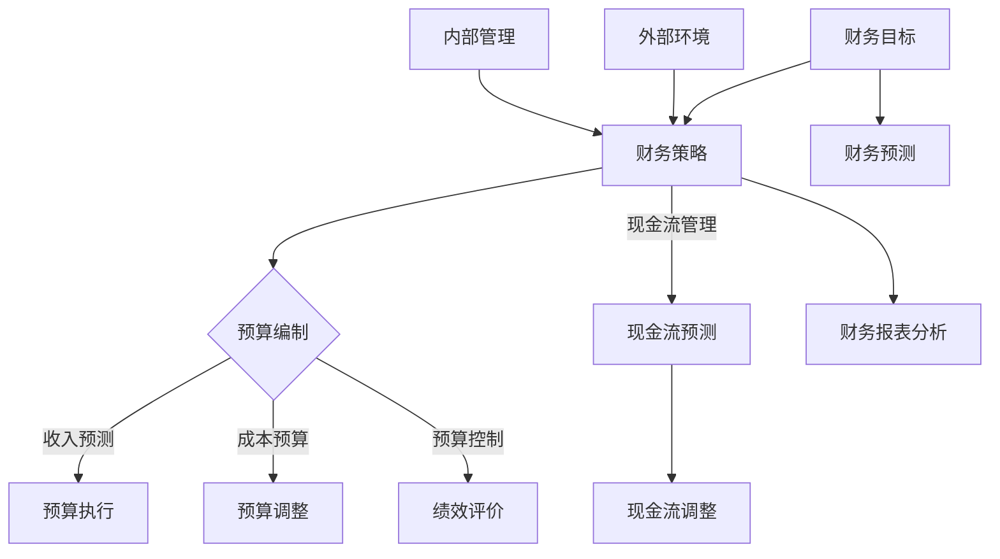

                 

## 《技术人如何进行创业项目的财务规划和预测》

> **关键词：** 创业财务规划、财务预测、现金流管理、预算编制、定量预测方法

**摘要：** 
本文旨在为技术人在创业项目的财务规划和预测方面提供一套系统的方法和实战指导。文章首先介绍了创业项目财务规划和预测的基础知识，包括财务目标与策略、财务报表分析等内容。接着，详细阐述了预算编制与现金流管理的具体步骤和方法。随后，探讨了财务预测的定量和定性方法及其应用，并介绍了相关的数据分析工具和财务软件。通过实际案例分析，文章展示了如何将理论应用于实践，并提出了财务规划和预测的挑战与解决策略。最后，对创业项目财务规划和预测的未来发展趋势进行了展望。

### 目录

1. **第一部分：创业项目财务规划和预测的基础知识**
    - **第1章：创业项目财务规划概述**
        1.1 财务目标与策略
        1.2 财务规划和预测的基本概念
        1.3 财务报表分析
2. **第二部分：创业项目财务规划的具体步骤**
    - **第2章：预算编制与管理**
        2.1 预算编制的过程
        2.2 预算控制与绩效评价
    - **第3章：现金流管理**
        3.1 现金流预测与分析
        3.2 现金流不足应对策略
3. **第三部分：创业项目财务预测方法与工具**
    - **第4章：财务预测方法与应用**
        4.1 定量预测方法
        4.2 定性预测方法
    - **第5章：财务预测工具与技术**
        5.1 数据分析工具
        5.2 财务软件与平台
4. **第四部分：创业项目财务规划和预测的案例分析**
    - **第6章：创业项目财务规划案例分析**
        6.1 案例背景介绍
        6.2 财务规划与预测实施
5. **第五部分：创业项目财务规划和预测的反思与建议**
    - **第7章：财务规划与预测的反思与建议**
        7.1 财务规划与预测的挑战与解决策略
        7.2 未来发展趋势与展望
6. **附录**
    - **附录A：财务规划和预测工具资源**

---

### 第一部分：创业项目财务规划和预测的基础知识

#### 第1章：创业项目财务规划概述

创业项目的财务规划是确保企业成功运营和实现长远目标的关键环节。对于一个技术人来说，理解财务规划和预测的基础知识，不仅有助于更好地管理资源，还能为创业项目提供稳定的发展方向。本章节将详细介绍创业项目的财务目标与策略、财务规划和预测的基本概念，以及财务报表分析的方法。

## 1.1 财务目标与策略

财务目标是企业发展的指南针，是财务规划的核心。对于创业项目而言，设定合理的财务目标至关重要。

### 1.1.1 财务目标设定

财务目标的设定应考虑以下方面：

- **短期目标**：如现金流管理、利润最大化、市场份额提升等。
- **长期目标**：如企业价值提升、市场领导地位、投资回报率等。

在设定财务目标时，需要遵循SMART原则（具体、可衡量、可实现、相关、时限）。

### 1.1.2 财务策略制定

财务策略是实现财务目标的行动计划。常见的财务策略包括：

- **成本控制策略**：通过优化成本结构和提高效率来降低成本。
- **收益增长策略**：通过市场开拓、产品创新和运营优化来增加收入。
- **风险分散策略**：通过多元化投资和风险管理来降低风险。

财务策略的制定应与企业战略目标相一致，同时要考虑内外部环境的影响。

## 1.2 财务规划和预测的基本概念

财务规划是制定和实施财务策略的过程，它包括以下几个方面：

### 1.2.1 财务规划的定义

财务规划是指为了实现企业的财务目标，通过预测、预算、决策和监控等环节，对企业的财务活动进行系统安排和部署。

### 1.2.2 财务预测的重要性

财务预测是财务规划的重要组成部分，它通过对企业未来财务状况的预测，为决策提供科学依据。财务预测的重要性体现在：

- **指导资源配置**：通过预测，可以合理分配资源，确保企业在关键领域有充足的资金支持。
- **风险评估**：通过预测，可以发现潜在的风险，提前采取措施进行规避。
- **战略规划**：财务预测有助于企业制定长期发展战略，确保企业稳定发展。

## 1.3 财务报表分析

财务报表分析是评估企业财务状况的重要手段。常见的财务报表包括资产负债表、利润表和现金流量表。

### 1.3.1 资产负债表解读

资产负债表反映了企业在特定时点的资产、负债和所有者权益状况。主要分析指标包括：

- **资产结构**：分析企业资产分布，判断资产流动性。
- **负债结构**：分析企业负债类型和期限，评估负债风险。
- **权益结构**：分析企业所有者权益占比，判断企业稳定性。

### 1.3.2 利润表分析

利润表反映了企业在一定时期内的收入、成本和利润状况。主要分析指标包括：

- **营业收入**：分析企业主营业务收入及其构成，判断市场竞争力。
- **成本费用**：分析企业成本费用结构，判断成本控制效果。
- **利润率**：分析企业利润率指标，判断盈利能力。

### 1.3.3 现金流量表解析

现金流量表反映了企业在一定时期内的现金流入和流出情况。主要分析指标包括：

- **经营活动现金流**：分析企业日常经营活动产生的现金流量，判断企业现金自给能力。
- **投资活动现金流**：分析企业投资活动产生的现金流量，判断投资决策效果。
- **筹资活动现金流**：分析企业筹资活动产生的现金流量，判断资本结构合理性。

通过以上分析，技术人可以更好地了解企业财务状况，为财务规划和预测提供有力支持。

## 第2章：预算编制与管理

预算编制是财务规划的核心环节，它通过对企业未来一定时期内的财务活动进行预测和安排，为企业发展提供指导。预算编制的质量直接关系到企业的财务稳定性和运营效率。本章将详细介绍预算编制的过程、预算控制与绩效评价方法，以及预算执行偏差分析。

### 2.1 预算编制的过程

预算编制是一个系统化的过程，通常包括以下步骤：

#### 2.1.1 收入预测

收入预测是预算编制的基础。收入预测的方法包括：

- **历史数据分析**：通过分析历史收入数据，找出收入变化规律，预测未来收入。
- **市场调查**：通过对市场和客户需求的调查，预测未来收入。
- **专家意见**：邀请行业专家对收入进行预测。

在预测过程中，应充分考虑市场环境、竞争态势、政策法规等因素。

#### 2.1.2 成本预算

成本预算包括直接成本和间接成本。直接成本通常与生产或销售直接相关，如原材料、人工等；间接成本则包括管理费用、销售费用等。成本预算的方法包括：

- **标准成本法**：根据标准成本数据编制预算。
- **作业成本法**：根据作业成本数据编制预算。
- **零基预算**：从零开始编制预算，重新评估所有成本项目。

在编制成本预算时，应充分考虑成本控制策略，尽量降低成本。

#### 2.1.3 预算调整与优化

在预算编制过程中，可能需要根据实际情况进行调整和优化。预算调整的常见原因包括：

- **市场变化**：如市场需求的波动，可能需要调整收入预测。
- **成本变化**：如原材料价格上涨，可能需要调整成本预算。
- **政策法规**：如税收政策的变化，可能需要调整预算。

在调整预算时，应确保预算的合理性和可执行性。

### 2.2 预算控制与绩效评价

预算控制是确保预算目标实现的重要手段。预算控制的方法包括：

- **目标控制**：将预算目标分解为可执行的任务，确保每个任务都有明确的责任人和时间表。
- **过程控制**：对预算执行过程中的关键环节进行监控，确保过程符合预算要求。
- **结果控制**：对预算执行结果进行评估，分析原因，提出改进措施。

#### 2.2.2 绩效评价指标体系

绩效评价是预算控制的重要组成部分。绩效评价指标体系包括：

- **财务指标**：如利润率、成本费用率、营业收入增长率等。
- **非财务指标**：如客户满意度、员工满意度、市场占有率等。

在设定绩效评价指标时，应充分考虑企业战略目标和行业特点。

### 2.2.3 预算执行偏差分析

预算执行偏差分析是评估预算执行效果的重要手段。常见的预算执行偏差分析方法包括：

- **趋势分析**：分析预算执行过程中的偏差趋势，找出偏差的主要原因。
- **因素分析**：分析导致预算执行偏差的主要因素，如市场需求变化、成本上升等。
- **责任分析**：分析预算执行偏差的责任归属，提出改进措施。

通过预算执行偏差分析，可以及时发现和纠正预算执行中的问题，确保预算目标的实现。

### 第3章：现金流管理

现金流管理是创业项目财务管理的核心环节，它关系到企业的生存和发展。良好的现金流管理能够确保企业资金链的稳定，提高资金使用效率。本章将详细介绍现金流预测与分析、现金流不足应对策略。

### 3.1 现金流预测与分析

现金流预测是确保企业现金流稳定的重要手段。现金流预测的方法包括：

#### 3.1.1 现金流预测方法

- **趋势预测法**：根据历史现金流数据，分析现金流的变化趋势，预测未来现金流。
- **回归分析法**：通过建立现金流与相关因素之间的回归模型，预测未来现金流。
- **情景分析法**：根据不同的市场环境，预测不同情景下的现金流。

在预测过程中，应充分考虑市场环境、竞争态势、政策法规等因素。

#### 3.1.2 现金流分析框架

现金流分析框架包括以下几个方面：

- **经营活动现金流**：分析企业日常经营活动产生的现金流量，包括销售收入、成本费用等。
- **投资活动现金流**：分析企业投资活动产生的现金流量，包括投资支出、投资回报等。
- **筹资活动现金流**：分析企业筹资活动产生的现金流量，包括借款、还款、股本融资等。

通过现金流分析，可以全面了解企业的现金流入和流出情况，为现金流管理提供依据。

### 3.2 现金流不足应对策略

现金流不足是创业项目面临的主要风险之一。应对现金流不足，需要采取以下策略：

#### 3.2.1 短期现金流管理

- **提高现金流流入**：通过市场拓展、产品创新、提高收款效率等手段，增加现金流流入。
- **优化现金流流出**：通过降低成本、提高采购效率、延长付款周期等手段，减少现金流流出。

#### 3.2.2 长期现金流规划

- **建立现金储备**：通过留存收益、融资等方式，建立现金储备，以应对突发情况。
- **优化资本结构**：通过调整资本结构，降低融资成本，提高资金使用效率。

#### 3.2.3 应对现金流危机的措施

- **紧急融资**：在现金流危机时，可以通过向银行借款、发行债券等方式进行紧急融资。
- **业务重组**：通过调整业务模式、优化产品结构、裁员等措施，提高企业盈利能力。

通过以上措施，可以确保企业现金流的稳定，提高企业的抗风险能力。

### 第四部分：创业项目财务预测方法与工具

#### 第4章：财务预测方法与应用

财务预测是创业项目财务管理的重要组成部分，它通过对企业未来财务状况的预测，为决策提供科学依据。本章将详细介绍财务预测的定量和定性方法及其应用，帮助技术人更好地进行财务预测。

### 4.1 定量预测方法

定量预测方法是基于历史数据和分析模型，通过数学计算和统计方法对财务状况进行预测。以下是一些常用的定量预测方法：

#### 4.1.1 时间序列分析

时间序列分析是一种基于历史时间序列数据，分析数据变化规律并预测未来趋势的方法。常见的时间序列分析方法包括：

- **移动平均法**：通过对历史数据进行移动平均处理，平滑数据波动，预测未来趋势。
- **指数平滑法**：在移动平均法的基础上，引入指数权重，使近期数据的影响更大，提高预测准确性。
- **ARIMA模型**：自回归积分滑动平均模型，通过分析时间序列的自身相关性，建立预测模型。

#### 4.1.2 模型选择与优化

在选择定量预测模型时，需要考虑数据的特点和预测目标。以下是一些常见的模型选择和优化方法：

- **回归分析**：通过建立自变量和因变量之间的关系，预测因变量的未来值。
- **神经网络**：通过神经网络模型，模拟人脑神经元的工作方式，实现非线性预测。
- **支持向量机**：通过支持向量机模型，进行非线性回归和分类，提高预测准确性。

在模型优化过程中，可以使用交叉验证、网格搜索等方法，选择最优模型参数，提高预测精度。

#### 4.1.3 误差分析与修正

在定量预测中，误差是不可避免的。通过误差分析，可以找出预测中的问题，并进行修正。常见的误差分析方法和修正策略包括：

- **残差分析**：分析预测值与实际值之间的差异，判断预测模型的准确性。
- **回归诊断**：通过回归诊断方法，检查模型假设的合理性，找出影响预测准确性的因素。
- **修正预测值**：通过调整模型参数或数据，修正预测值，提高预测准确性。

### 4.2 定性预测方法

定性预测方法是基于经验和主观判断，通过专家意见、市场调查、SWOT分析等方法，对财务状况进行预测。以下是一些常见的定性预测方法：

#### 4.2.1 专家意见法

专家意见法是一种基于专家经验和专业知识的预测方法。通过邀请行业专家、内部员工和管理层，对财务状况进行预测和分析。常见的方法包括：

- **头脑风暴**：组织专家进行头脑风暴，收集各种预测观点。
- **德尔菲法**：通过多轮问卷调查，收集专家意见，消除个人偏见，提高预测准确性。

#### 4.2.2 市场调查法

市场调查法是一种通过收集市场数据和用户反馈，对财务状况进行预测的方法。常见的方法包括：

- **问卷调查**：通过设计问卷，收集用户对产品、服务、市场的看法。
- **焦点小组**：组织一组用户，讨论市场趋势和预测。
- **案例分析**：通过分析成功或失败的案例，总结经验和教训，进行预测。

#### 4.2.3 SWOT分析

SWOT分析是一种通过分析企业的优势、劣势、机会和威胁，进行财务预测的方法。常见的方法包括：

- **优势分析**：分析企业的核心竞争力，预测未来的增长潜力。
- **劣势分析**：分析企业存在的问题和短板，预测未来的改进方向。
- **机会分析**：分析市场机会，预测企业的发展前景。
- **威胁分析**：分析市场风险和竞争压力，预测企业的风险和挑战。

通过定性预测方法，可以弥补定量预测方法的不足，提高预测的全面性和准确性。

### 第5章：财务预测工具与技术

在创业项目中，财务预测不仅需要科学的方法，还需要有效的工具和技术支持。本章将介绍几种常用的财务预测工具和技术，包括数据分析工具、财务软件与平台。

#### 5.1 数据分析工具

数据分析工具是进行财务预测的重要工具，可以帮助技术人高效地处理和分析数据。以下是一些常用的数据分析工具：

#### 5.1.1 Excel在财务预测中的应用

Excel是一款功能强大的电子表格软件，广泛应用于财务预测。在Excel中，可以进行以下操作：

- **数据录入**：通过电子表格，方便地录入和整理财务数据。
- **数据分析**：使用Excel的函数、公式和图表功能，对数据进行分析和可视化。
- **预测模型**：利用Excel的数据分析工具，如数据透视表、回归分析等，建立预测模型。

#### 5.1.2 数据库与SQL查询

数据库是存储和管理数据的系统，SQL是数据库查询语言。使用数据库和SQL，可以进行以下操作：

- **数据存储**：将财务数据存储在数据库中，保证数据的安全性和一致性。
- **数据查询**：通过SQL查询，快速检索和分析财务数据。
- **数据更新**：对数据库中的数据进行实时更新，保持数据的最新性。

#### 5.1.3 数据可视化工具

数据可视化工具可以帮助技术人将数据以图表、图形等形式直观地展示出来，便于分析和理解。以下是一些常用的数据可视化工具：

- **Tableau**：一款功能强大的数据可视化工具，可以创建丰富的图表和仪表盘。
- **Power BI**：一款由微软推出的数据可视化工具，与Excel紧密集成，便于数据分析。
- **Google Analytics**：一款由Google提供的数据分析平台，可以跟踪和分析网站流量。

#### 5.2 财务软件与平台

财务软件和平台是进行财务预测的重要工具，可以帮助技术人高效地管理财务数据和进行预测分析。以下是一些常用的财务软件和平台：

#### 5.2.1 会计软件的选择

会计软件是管理企业财务数据的工具，可以帮助技术人进行会计核算、报表生成和预算管理。以下是一些常用的会计软件：

- **QuickBooks**：一款适用于小型企业的会计软件，功能包括账务处理、报表生成等。
- **Xero**：一款云端的会计软件，提供实时财务报告、自动对账等功能。
- **Wave Accounting**：一款免费的开源会计软件，适用于小型企业。

#### 5.2.2 企业资源计划（ERP）系统

企业资源计划（ERP）系统是一种集成化的企业管理软件，可以覆盖企业的主要业务流程，包括财务、人力资源、供应链等。以下是一些常用的ERP系统：

- **SAP**：一款全球领先的企业管理软件，提供全面的功能和强大的定制能力。
- **Oracle**：一款功能强大的企业管理软件，适用于大型企业。
- **Microsoft Dynamics**：一款由微软推出的企业管理软件，涵盖财务、供应链、人力资源等多个领域。

#### 5.2.3 云计算与财务预测

云计算是一种通过互联网提供计算资源的服务，可以帮助技术人进行大规模数据处理和财务预测。以下是一些云计算平台：

- **Amazon Web Services（AWS）**：一款全球领先的云计算平台，提供多种服务和工具，适用于各种规模的业务。
- **Microsoft Azure**：一款由微软推出的云计算平台，提供全面的服务和工具，适用于企业级应用。
- **Google Cloud Platform（GCP）**：一款由Google推出的云计算平台，提供高性能、可靠的服务和工具。

通过以上财务预测工具和技术的应用，技术人可以更高效地进行财务预测，提高企业的管理水平和竞争力。

### 第6章：创业项目财务规划案例分析

#### 6.1 案例背景介绍

在本案例中，我们将分析一家名为“智能医疗科技公司”（SmartMedTech）的创业项目。SmartMedTech成立于2018年，致力于开发智能医疗设备，旨在提高医疗诊断的准确性和效率。公司的创始人是一位在医疗领域具有丰富经验的技术专家，他希望通过创新技术解决当前医疗行业中的痛点。

#### 6.1.1 企业概况

- **公司规模**：成立初期，公司规模较小，员工总数约50人。
- **业务模式**：主要业务包括研发、生产和销售智能医疗设备，以及提供相关的技术支持和维护服务。
- **市场定位**：定位于高端医疗市场，目标客户为大型医院和诊所。

#### 6.1.2 业务模式分析

SmartMedTech的业务模式可以概括为以下几点：

- **研发与创新**：公司注重研发，每年将营收的20%投入到新产品开发和技术创新中。
- **生产与质量控制**：公司采用先进的生产设备和严格的质量控制流程，确保产品的稳定性和可靠性。
- **销售与渠道**：通过直销和合作伙伴渠道，将产品推向市场。
- **客户服务**：提供完善的售后服务，包括设备安装、培训和技术支持。

#### 6.2 财务规划与预测实施

在SmartMedTech的财务规划与预测实施过程中，公司采取了一系列科学、严谨的步骤和方法。

##### 6.2.1 预算编制与执行

SmartMedTech在预算编制方面遵循以下步骤：

1. **收入预测**：通过市场调查和行业分析，预测未来一年的销售收入。考虑到市场需求的波动，收入预测分为乐观、正常和悲观三种情景。

2. **成本预算**：包括直接成本（如原材料、人工）和间接成本（如管理费用、销售费用）。采用标准成本法进行成本预算，并根据实际情况进行调整。

3. **预算调整与优化**：在预算编制过程中，充分考虑市场变化、成本波动等因素，进行预算调整和优化，确保预算的合理性和可执行性。

在预算执行过程中，公司采取了以下措施：

1. **目标分解**：将年度预算目标分解为季度和月度目标，明确各部门和员工的责任。

2. **过程监控**：定期对预算执行情况进行监控，及时发现和纠正偏差。

3. **绩效评价**：对预算执行情况进行绩效评价，根据评价结果进行奖惩。

##### 6.2.2 现金流管理

SmartMedTech重视现金流管理，采取以下策略：

1. **提高现金流流入**：通过市场拓展、产品创新和销售策略优化，增加销售收入。

2. **优化现金流流出**：通过采购优化、成本控制和管理费用降低，减少现金流流出。

3. **建立现金储备**：设立应急储备金，以应对突发情况。

4. **融资策略**：在现金流紧张时，通过银行贷款、股权融资等手段进行融资。

##### 6.2.3 财务预测与调整

SmartMedTech定期进行财务预测和调整，以确保财务规划的有效性。财务预测方法包括时间序列分析和回归分析，结合市场调查和专家意见进行修正。

在财务预测过程中，公司关注以下方面：

1. **收入预测**：根据市场需求、竞争态势和公司产品特点，预测未来收入。

2. **成本预测**：根据原材料价格、人工成本和市场变化，预测未来成本。

3. **利润预测**：结合收入和成本预测，预测未来利润。

4. **现金流量预测**：根据收入和成本预测，预测未来现金流量。

在财务预测调整过程中，公司根据市场变化、政策法规和公司实际情况，及时调整预测结果，确保财务规划的科学性和可行性。

### 第7章：创业项目财务规划和预测的反思与建议

#### 7.1 财务规划与预测的挑战与解决策略

在创业项目中，财务规划和预测面临诸多挑战。以下是几种常见的挑战及其解决策略：

##### 7.1.1 数据质量与准确性

**挑战**：创业项目初期，数据可能不完整或不准确，影响财务预测的准确性。

**解决策略**：

- **数据收集**：建立完善的数据收集体系，确保数据的完整性和准确性。
- **数据清洗**：对收集到的数据进行清洗，去除错误和重复数据，提高数据质量。
- **数据验证**：对数据来源和准确性进行验证，确保数据可靠。

##### 7.1.2 外部环境变化应对

**挑战**：市场环境、政策法规等外部因素的变化，可能对财务预测产生重大影响。

**解决策略**：

- **环境监测**：建立外部环境监测机制，及时获取相关信息。
- **情景分析**：进行不同情景下的财务预测，评估外部环境变化对财务状况的影响。
- **弹性规划**：在财务规划中考虑外部环境变化，制定灵活的应对策略。

##### 7.1.3 内部管理问题解决

**挑战**：内部管理问题，如成本控制不力、预算执行偏差等，可能影响财务预测的准确性。

**解决策略**：

- **制度建设**：建立完善的内部管理制度，规范财务流程和预算执行。
- **绩效评价**：对预算执行情况进行绩效评价，及时发现和纠正问题。
- **员工培训**：加强员工培训，提高财务管理能力和执行力。

#### 7.2 未来发展趋势与展望

随着信息技术的不断发展，创业项目的财务规划和预测将呈现以下趋势：

##### 7.2.1 财务数字化转型的趋势

**趋势**：随着大数据、云计算和人工智能技术的应用，财务数字化转型成为趋势。财务数字化可以提高数据处理的效率，优化财务流程，增强财务预测的准确性。

**展望**：未来，越来越多的创业项目将采用数字化工具和平台，实现财务数据的实时分析和预测。

##### 7.2.2 人工智能在财务预测中的应用

**趋势**：人工智能技术在财务预测中的应用越来越广泛，如机器学习、深度学习等算法在财务预测中的应用。

**展望**：未来，人工智能技术将为财务预测提供更强大的工具和方法，提高预测的准确性和可靠性。

##### 7.2.3 创业项目财务管理的未来发展

**趋势**：创业项目财务管理将更加重视风险管理、资金管理和绩效管理。

**展望**：未来，创业项目财务管理将更加智能化、精细化，为企业的可持续发展提供有力支持。

### 附录A：财务规划和预测工具资源

#### A.1 财务软件推荐

**QuickBooks**：适用于小型企业的会计软件，提供账务处理、报表生成等功能。

**Xero**：云端会计软件，提供实时财务报告、自动对账等功能。

**Wave Accounting**：免费的开源会计软件，适用于小型企业。

#### A.2 在线财务分析工具

**Google Analytics**：用于跟踪和分析网站流量，提供详细的数据报告。

**Tableau**：数据可视化工具，可以创建丰富的图表和仪表盘。

**Power BI**：微软推出的数据可视化工具，与Excel紧密集成。

#### A.3 相关书籍与资料推荐

**《创业企业财务管理》**：详细介绍创业企业的财务管理方法与实践。

**《创业企业的财务规划与融资》**：探讨创业企业的财务规划与融资策略。

**《现金流管理：创造财务自由的秘密》**：介绍现金流管理的重要性与方法。

---

通过以上对创业项目财务规划和预测的深入探讨，技术人可以更好地理解财务规划和预测的基础知识、具体步骤、方法和工具，为创业项目的成功实施提供有力支持。同时，随着信息技术的不断发展，财务规划和预测的方法和工具也将不断更新和优化，为创业项目的财务管理带来更多机遇和挑战。

---

### Mermaid 流程图示例

以下是一个用于描述创业项目财务规划和预测的核心概念与联系的 Mermaid 流程图示例：



在这个流程图中：

- **A 财务目标**：设定创业项目的财务目标。
- **B 财务策略**：制定实现财务目标的策略。
- **C 预算编制**：进行预算编制。
- **D 收入预测**：预测未来收入。
- **E 成本预算**：预测未来成本。
- **F 预算控制**：控制预算执行。
- **G 现金流管理**：管理现金流。
- **H 现金流调整**：调整现金流预测。
- **I 财务报表分析**：分析财务报表。
- **J 财务预测**：进行财务预测。
- **K 外部环境**：考虑外部环境因素对财务策略的影响。
- **L 内部管理**：考虑内部管理因素对财务策略的影响。

### 伪代码示例

以下是一个用于阐述核心算法原理的伪代码示例：

```plaintext
// 伪代码：线性回归模型预测收入

// 输入：历史收入数据集
function linear_regression(income_data) {
    // 计算平均值
    mean_income = sum(income_data) / length(income_data)
    mean_income_squared = sum(income_data^2) / length(income_data)
    
    // 计算斜率
    slope = (mean_income_squared - mean(income_data^2)) / (length(income_data) - 1)
    
    // 计算截距
    intercept = mean_income - slope * mean_income
    
    // 预测未来收入
    predicted_income = intercept + slope * future_income
    
    return predicted_income
}
```

### 数学公式示例

以下是一个用于详细讲解数学模型的数学公式示例：

```latex
$$
\begin{aligned}
    r(t) &= r_0 + at + \frac{1}{2}at^2 \\
    f(x) &= x^2 + 2x + 1
\end{aligned}
$$

在上面的公式中，\( r(t) \) 表示物体在时间 \( t \) 的位置，\( r_0 \) 为初始位置，\( a \) 为加速度。而 \( f(x) \) 是一个二次函数，表示一个开口向上的抛物线。这两个公式分别用于描述物理中的运动规律和数学中的函数关系。
```

### 项目实战的代码实际案例和详细解释说明

以下是一个使用 Python 和 Pandas 库进行现金流预测的代码实际案例：

```python
# 导入必要的库
import pandas as pd

# 读取现金流数据
data = pd.read_csv('cashflow_data.csv')

# 计算总收入和总支出
total_income = data['income'].sum()
total_expense = data['expense'].sum()

# 计算净现金流
net_cashflow = total_income - total_expense

# 预测未来现金流
future_income = data['income'].iloc[-1] * 1.05
future_expense = data['expense'].iloc[-1] * 1.03

# 预测未来净现金流
predicted_net_cashflow = future_income - future_expense

# 打印结果
print(f"总现金流: {net_cashflow}")
print(f"预测未来现金流: {predicted_net_cashflow}")
```

#### 代码解读与分析：

1. **导入库**：首先，我们导入 Pandas 库，用于数据操作和分析。

2. **读取数据**：使用 `pd.read_csv()` 函数读取名为 `cashflow_data.csv` 的 CSV 文件，该文件包含了现金流数据。

3. **计算总收入和总支出**：使用 `sum()` 函数分别计算收入和支出的总和。

4. **计算净现金流**：通过将总收入减去总支出，得到净现金流。

5. **预测未来现金流**：基于当前年份的收入和支出，分别乘以增长率（例如，假设收入增长率为5%，支出增长率为3%），预测未来一年的收入和支出。

6. **预测未来净现金流**：通过将预测的未来收入减去预测的未来支出，得到预测的净现金流。

7. **打印结果**：最后，使用 `print()` 函数打印计算结果。

这个案例展示了如何使用 Python 和 Pandas 库进行简单的现金流预测。在实际项目中，可能会使用更复杂的模型和算法来提高预测的准确性。此外，还会考虑其他因素，如季节性变化、市场趋势等，以获得更全面的预测结果。

### 作者信息

**作者：** AI 天才研究院/AI Genius Institute & 禅与计算机程序设计艺术 /Zen And The Art of Computer Programming

---

通过本文的详细讲解和实际案例，我们为技术人提供了一套全面的创业项目财务规划和预测的方法和工具。从基础知识的了解，到具体步骤的执行，再到方法的应用和工具的使用，每个环节都进行了深入的分析和阐述。希望本文能帮助读者更好地理解财务规划和预测的重要性，为创业项目的成功实施提供有力支持。随着技术的不断进步，财务规划和预测的方法和工具也将不断优化和更新，期待读者能够紧跟时代步伐，不断学习和实践，为创业项目的财务管理贡献自己的智慧和力量。

