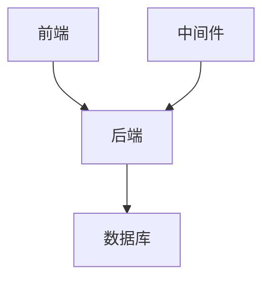

                 

# 《技术尽职调查：创业公司融资和并购中的技术评估》

## 概述

技术尽职调查（Technical Due Diligence，简称TDD）是创业公司在融资和并购过程中不可或缺的一环。它旨在对目标公司的技术架构、基础设施、代码质量、安全性和团队等多方面进行深入评估，以确保投资决策的准确性和安全性。本文将详细探讨技术尽职调查的定义、目的、流程、核心内容以及实践案例，帮助读者更好地理解这一关键环节。

### 关键词

- 技术尽职调查
- 创业公司
- 融资
- 并购
- 技术评估

### 摘要

本文将首先介绍技术尽职调查的定义与目的，然后详细阐述技术尽职调查的框架与范围，以及参与者的角色。接着，本文将深入探讨技术尽职调查的核心内容，包括技术架构与基础设施评估、代码质量与安全评估、技术团队评估、项目进度与风险管理评估。最后，本文将结合实践案例，分享技术尽职调查的具体操作方法和注意事项，以期为创业公司在融资和并购过程中提供有益的参考。

----------------------------------------------------------------

### 第一部分：技术尽职调查概述

## 第1章：技术尽职调查的定义与目的

技术尽职调查，简称TDD，是指在创业公司融资或并购过程中，对目标公司的技术架构、基础设施、代码质量、安全性和团队等多方面进行系统性评估的过程。其目的是确保投资决策的准确性、安全性和可行性。

### 1.1 技术尽职调查的定义

技术尽职调查的定义可以从以下几个方面进行理解：

- **全面性**：技术尽职调查不仅仅关注某一方面的技术问题，而是对目标公司的技术进行全面、深入、系统的评估。
- **独立性**：技术尽职调查通常由独立的第三方机构或专家团队进行，以确保评估的客观性和公正性。
- **专业性**：技术尽职调查要求评估者具备专业的技术背景和丰富的实践经验，能够准确识别和评估目标公司的技术风险。

### 1.2 技术尽职调查的目的

技术尽职调查的主要目的包括以下几个方面：

- **风险识别**：通过技术尽职调查，可以识别目标公司在技术方面可能存在的风险，如技术架构不成熟、代码质量低下、安全漏洞等。
- **价值评估**：技术尽职调查有助于评估目标公司的技术实力和价值，为投资决策提供重要依据。
- **战略规划**：技术尽职调查可以为创业公司未来的技术发展和战略规划提供指导，帮助公司制定更加科学、合理的决策。

### 1.3 技术尽职调查的流程

技术尽职调查的流程通常包括以下几个阶段：

1. **需求分析**：明确技术尽职调查的目标和要求，制定详细的调查计划和评估标准。
2. **信息收集**：通过访谈、问卷调查、文档审查等方式，收集目标公司的技术相关资料。
3. **技术评估**：对收集到的信息进行系统性分析，评估目标公司的技术架构、基础设施、代码质量、安全性和团队等多方面。
4. **风险评估**：根据技术评估结果，识别和分类潜在的技术风险，制定相应的应对策略。
5. **报告撰写**：撰写技术尽职调查报告，总结评估结果和发现的风险，提出建议和改进措施。
6. **反馈与调整**：与技术尽职调查的参与者进行反馈和讨论，根据反馈意见对报告进行修订和完善。

### 总结

技术尽职调查是创业公司在融资和并购过程中的一项关键活动，它有助于识别技术风险、评估公司价值、制定战略规划。通过本章节的介绍，读者可以初步了解技术尽职调查的定义、目的和流程，为后续章节的深入学习打下基础。

----------------------------------------------------------------

## 第2章：技术尽职调查的框架与范围

### 2.1 技术尽职调查的框架

技术尽职调查的框架是一个系统化的过程，它包括多个阶段和步骤，确保评估的全面性和准确性。以下是技术尽职调查的一般框架：

1. **需求分析**：确定技术尽职调查的目标和要求，制定详细的调查计划和评估标准。
2. **信息收集**：通过各种渠道收集目标公司的技术相关资料，包括文档、代码、架构设计、安全措施等。
3. **技术评估**：对收集到的信息进行系统性分析，评估目标公司的技术架构、基础设施、代码质量、安全性和团队等。
4. **风险评估**：根据技术评估结果，识别和分类潜在的技术风险，包括安全漏洞、架构问题、团队稳定性等。
5. **报告撰写**：编写技术尽职调查报告，总结评估结果和发现的风险，提出改进建议。
6. **反馈与调整**：与技术尽职调查的参与者进行反馈和讨论，根据反馈意见对报告进行修订和完善。

### 2.2 技术尽职调查的范围

技术尽职调查的范围非常广泛，涵盖了多个技术领域和层面。以下是技术尽职调查的主要范围：

- **技术架构评估**：评估目标公司的技术架构设计，包括架构的合理性、稳定性、可扩展性等。
- **基础设施评估**：评估目标公司的基础设施，包括服务器、网络、存储、数据库等。
- **代码质量评估**：评估代码的质量，包括代码风格、注释、单元测试、代码覆盖率等。
- **安全评估**：评估目标公司的安全措施，包括安全策略、安全漏洞、数据隐私等。
- **团队评估**：评估目标公司的技术团队，包括团队成员的技能、经验、组织结构等。
- **项目进度与风险管理评估**：评估目标公司的项目进度和风险管理情况，包括项目计划、里程碑、风险识别和应对策略等。

### 2.3 技术尽职调查的参与者

技术尽职调查的参与者包括以下几个关键角色：

- **客户**：客户是技术尽职调查的需求方，通常为投资方或收购方，他们负责制定调查目标和评估标准。
- **第三方专家**：第三方专家是技术尽职调查的主要执行者，通常由具有丰富经验的技术专家或咨询公司组成，他们负责进行技术评估和撰写报告。
- **目标公司**：目标公司是技术尽职调查的接受方，他们需要提供相关的技术资料和配合调查。

### 总结

技术尽职调查的框架和范围决定了其效果和深度。通过本章节的介绍，读者可以了解技术尽职调查的框架和范围，为后续的技术评估提供指导和参考。技术尽职调查不仅是对技术本身进行评估，更是对整个公司的技术能力和潜力的全面审查，对投资决策具有重要意义。

----------------------------------------------------------------

## 第3章：技术架构与基础设施评估

技术架构与基础设施是创业公司的核心组成部分，它们直接影响公司的业务效率和创新能力。在技术尽职调查中，技术架构和基础设施评估是至关重要的一环。本章节将详细介绍技术架构评估、基础设施评估的具体内容和方法。

### 3.1 技术架构评估

技术架构评估旨在评估目标公司的技术架构设计是否合理、稳定和可扩展。以下是技术架构评估的主要内容：

#### 3.1.1 技术架构图绘制

技术架构图的绘制是技术架构评估的基础。它可以帮助我们直观地了解目标公司的技术架构，包括各个组件之间的相互关系和依赖关系。以下是绘制技术架构图的基本步骤：

1. **识别系统组件**：首先，我们需要识别目标公司的系统组件，如前端、后端、数据库、中间件等。
2. **绘制组件关系**：接下来，我们将各个组件按照其关系进行连接，绘制出系统组件图。
3. **标注关键节点**：在技术架构图中，我们需要标注出关键节点，如数据流、调用关系等。

以下是一个简化的技术架构图示例（使用Mermaid语法）：



#### 3.1.2 技术架构稳定性评估

技术架构稳定性评估旨在评估技术架构在面对外部变化和内部调整时是否能够保持稳定。以下是技术架构稳定性评估的关键指标：

1. **模块独立性**：模块独立性越强，架构稳定性越高。我们需要检查各个模块之间的依赖关系，确保模块间解耦。
2. **容错性**：技术架构需要具备良好的容错性，能够应对硬件故障、网络中断等突发情况。
3. **可维护性**：技术架构的可维护性影响长期运行的稳定性和可持续性。我们需要评估代码的整洁度、注释的清晰度以及文档的完整性。

#### 3.1.3 技术架构可扩展性评估

技术架构可扩展性评估旨在评估技术架构在面对业务增长和变化时是否能够灵活调整和扩展。以下是技术架构可扩展性评估的关键指标：

1. **水平扩展能力**：技术架构需要具备良好的水平扩展能力，能够通过增加节点数量来满足业务需求。
2. **垂直扩展能力**：技术架构需要具备良好的垂直扩展能力，能够在性能瓶颈出现时通过增加硬件资源来提升性能。
3. **组件化程度**：组件化程度越高，技术架构的可扩展性越强。我们需要评估组件的设计和实现是否满足高内聚、低耦合的原则。

### 3.2 基础设施评估

基础设施评估旨在评估目标公司的服务器、网络、存储、数据库等基础设施的性能、稳定性和安全性。以下是基础设施评估的主要内容：

#### 3.2.1 服务器和网络设施评估

1. **服务器性能评估**：我们需要评估服务器的CPU、内存、磁盘I/O等性能指标，确保服务器能够满足业务需求。
2. **网络设施评估**：我们需要评估网络设备的配置、带宽、延迟等指标，确保网络能够提供稳定、高效的数据传输。
3. **故障恢复能力**：我们需要评估服务器和网络设施的故障恢复能力，确保在发生故障时能够快速恢复服务。

#### 3.2.2 数据库系统评估

1. **数据库性能评估**：我们需要评估数据库的查询性能、索引优化、存储优化等，确保数据库能够高效处理业务数据。
2. **数据一致性评估**：我们需要评估数据库的一致性保障机制，如事务管理、备份策略等，确保数据的安全性和可靠性。
3. **扩展性评估**：我们需要评估数据库的扩展性，包括水平扩展和垂直扩展的能力，确保数据库能够应对业务增长。

#### 3.2.3 存储系统评估

1. **存储性能评估**：我们需要评估存储系统的读写性能、容量等指标，确保存储系统能够满足业务需求。
2. **数据安全性评估**：我们需要评估存储系统的数据安全性，包括加密、访问控制等。
3. **数据备份与恢复评估**：我们需要评估存储系统的数据备份与恢复策略，确保在发生数据丢失时能够快速恢复。

### 总结

技术架构与基础设施评估是技术尽职调查的重要组成部分，它们直接关系到创业公司的业务效率和稳定性。通过本章节的介绍，读者可以了解技术架构和基础设施评估的具体内容和方法，为后续的技术尽职调查提供参考。在实际操作中，我们需要结合具体的业务场景和需求，进行全面、深入的技术评估。

----------------------------------------------------------------

## 第4章：代码质量与安全评估

代码质量与安全评估是技术尽职调查中的核心内容之一。高质量的代码和严格的安全措施是确保系统稳定运行和业务连续性的关键。本章节将详细介绍代码质量评估和安全评估的具体内容和方法。

### 4.1 代码质量评估

代码质量评估旨在评估代码的可读性、可维护性、可扩展性和性能等。以下是代码质量评估的主要内容：

#### 4.1.1 代码风格检查

代码风格检查是代码质量评估的基础。良好的代码风格有助于提高代码的可读性和可维护性。以下是代码风格检查的关键点：

1. **命名规范**：变量、函数和类的命名应遵循一致性、简洁性和描述性的原则。
2. **代码注释**：代码应包含必要的注释，以解释复杂逻辑和算法实现。
3. **代码格式**：代码格式应保持一致，包括缩进、空格、换行等。
4. **代码模块化**：代码应模块化，每个模块应具有明确的功能和边界。

#### 4.1.2 代码质量度量

代码质量度量是通过量化指标来评估代码质量的方法。以下是常用的代码质量度量指标：

1. **代码行数（Lines of Code, LOC）**：代码行数并不能直接反映代码质量，但可以作为参考指标。
2. **复杂度度量（Cyclomatic Complexity）**：复杂度度量用于评估代码的复杂度，复杂度越高，代码的可维护性越低。
3. **代码重复率（Code Duplication）**：代码重复率越高，代码的可维护性越低。
4. **代码覆盖率（Code Coverage）**：代码覆盖率用于评估单元测试的覆盖率，覆盖率越高，代码的质量越高。

#### 4.1.3 单元测试覆盖率评估

单元测试覆盖率评估是代码质量评估的重要方面。通过评估单元测试的覆盖率，我们可以确保代码的各个模块都被充分测试。以下是单元测试覆盖率评估的关键指标：

1. **单元测试数量**：单元测试的数量应足够覆盖代码的各个功能点。
2. **测试用例覆盖率**：测试用例覆盖率应达到较高的水平，以确保代码的每个功能都被充分测试。
3. **测试异常处理**：单元测试应包括异常处理和边界条件的测试，以确保代码在异常情况下能够正确执行。

### 4.2 安全评估

安全评估旨在评估系统的安全性和数据保护措施。以下是安全评估的主要内容：

#### 4.2.1 安全漏洞扫描

安全漏洞扫描是通过自动化工具对系统进行扫描，以发现潜在的安全漏洞。以下是安全漏洞扫描的关键步骤：

1. **确定扫描范围**：明确需要扫描的系统组件和范围。
2. **选择扫描工具**：选择适合的扫描工具，如Nessus、Metasploit等。
3. **执行扫描**：执行扫描任务，并记录发现的漏洞。
4. **漏洞分析**：对发现的漏洞进行分析和分类，确定漏洞的影响和风险等级。

#### 4.2.2 安全策略审查

安全策略审查是评估系统安全措施是否符合安全标准。以下是安全策略审查的关键步骤：

1. **安全策略文档审查**：审查安全策略文档，确保策略的完整性和可操作性。
2. **安全措施实施审查**：审查安全措施的实际实施情况，确保措施得到有效执行。
3. **安全意识培训**：审查安全意识培训情况，确保员工具备基本的安全意识和知识。

#### 4.2.3 数据隐私保护评估

数据隐私保护评估是评估系统在处理和保护用户数据方面的措施。以下是数据隐私保护评估的关键步骤：

1. **数据分类与标记**：对系统中的数据进行分类和标记，确保敏感数据的处理得到特殊关注。
2. **数据加密**：评估数据加密措施，确保敏感数据在存储和传输过程中得到加密保护。
3. **访问控制**：评估访问控制措施，确保只有授权用户能够访问敏感数据。
4. **日志审计**：评估日志审计措施，确保系统日志能够记录和跟踪用户行为和数据访问。

### 总结

代码质量与安全评估是技术尽职调查的重要组成部分。通过本章节的介绍，读者可以了解代码质量评估和安全评估的具体内容和方法，为后续的技术尽职调查提供参考。在实际操作中，我们需要结合具体的业务场景和需求，进行全面、深入的技术评估，确保系统的稳定性和安全性。

----------------------------------------------------------------

## 第5章：技术团队评估

技术团队是创业公司最重要的资产之一，其能力和稳定性直接影响到公司的技术发展和业务成功。在技术尽职调查中，对技术团队的评估是一个关键环节，它可以帮助投资方或收购方了解目标公司的技术实力和潜在风险。本章节将详细介绍技术团队评估的具体内容和方法。

### 5.1 技术团队组织结构评估

技术团队的组织结构评估旨在了解团队的组织形式、职责分工和协作模式。以下是技术团队组织结构评估的主要内容：

1. **团队规模与结构**：评估团队的总人数、各部门的职责分工、管理层级等。
   ```mermaid
   graph TB
   A[产品部] --> B[研发部]
   B --> C[测试部]
   B --> D[运维部]
   ```

2. **团队协作模式**：评估团队内部如何协作，如敏捷开发、瀑布模型等。
3. **职责分工清晰度**：评估团队成员的职责是否明确，避免职责重叠或责任不清的情况。

### 5.2 技术团队成员能力评估

技术团队成员能力评估旨在评估团队成员的专业技能、技术水平和解决问题的能力。以下是技术团队成员能力评估的主要内容：

1. **专业技能评估**：评估团队成员的专业技能，如编程语言、数据库管理、系统架构设计等。
   ```mermaid
   graph TB
   A[Java] --> B[Python]
   B --> C[数据库]
   C --> D[系统架构]
   ```

2. **技术水平评估**：评估团队成员的技术水平，包括技术水平的高低、掌握的技术的广度等。
3. **解决复杂问题的能力**：评估团队成员在面对复杂问题时的分析能力、解决问题的方法和效率。

### 5.3 技术团队稳定性评估

技术团队的稳定性评估旨在评估团队的人员流动性、员工满意度和团队士气。以下是技术团队稳定性评估的主要内容：

1. **人员流动性**：评估团队成员的流失率，高流失率可能表明团队存在一些问题。
   ```mermaid
   flowchart LR
   A[人员流失率] --> B{流失原因}
   B -->|内部原因| C[员工满意度]
   B -->|外部原因| D[团队士气]
   ```

2. **员工满意度**：评估团队成员的工作满意度，可以通过问卷调查、面谈等方式进行。
3. **团队士气**：评估团队的士气，高士气有助于提高团队的工作效率和创新性。

### 5.4 技术团队文化评估

技术团队文化评估旨在评估团队的工作氛围、价值观和文化建设。以下是技术团队文化评估的主要内容：

1. **团队氛围**：评估团队的工作氛围，如是否开放、合作和积极。
2. **价值观**：评估团队的价值观，如是否重视创新、客户需求和团队协作。
3. **文化建设**：评估团队的文化建设，如是否定期举办团队活动、技术分享会等。

### 5.5 技术团队绩效评估

技术团队绩效评估旨在评估团队的工作效率、项目完成情况和业务贡献。以下是技术团队绩效评估的主要内容：

1. **项目完成情况**：评估团队完成项目的情况，如项目进度、质量、成本等。
   ```mermaid
   gantt
   title 项目完成情况
   dateFormat  YYYY-MM-DD
   section 项目进度
   A: [[任务A]] 2023-01-01, 30d
   B: [[任务B]] 2023-01-31, 20d
   C: [[任务C]] 2023-02-28, 40d
   ```

2. **业务贡献**：评估团队在业务方面的贡献，如新功能开发、性能优化等。
3. **团队协作效率**：评估团队内部协作的效率，如沟通渠道、协作工具的使用情况等。

### 总结

技术团队评估是技术尽职调查的重要组成部分，它有助于了解团队的技术实力、稳定性和文化氛围。通过本章节的介绍，读者可以了解技术团队评估的具体内容和方法，为技术尽职调查提供参考。在实际操作中，我们需要结合具体的业务场景和需求，全面、深入地评估技术团队，以确保公司的技术发展和业务成功。

----------------------------------------------------------------

## 第6章：项目进度与风险管理评估

项目进度与风险管理评估是技术尽职调查中的重要环节，它直接关系到创业公司的项目完成情况和未来发展的稳定性。通过本项目进度与风险管理评估，可以全面了解目标公司的项目管理水平、项目进度、风险识别与应对策略，从而为投资决策提供有力支持。本章将详细介绍项目进度与风险管理评估的具体内容和方法。

### 6.1 项目进度评估

项目进度评估旨在评估目标公司项目的实际进展情况，包括项目计划、里程碑和预计项目延期分析。以下是项目进度评估的主要内容：

#### 6.1.1 项目进度表审查

项目进度表审查是评估项目进度的基础。通过审查项目进度表，可以了解项目各阶段的任务安排、时间节点和资源分配。以下是项目进度表审查的关键步骤：

1. **审查项目计划**：审查项目计划，了解项目的总体目标和阶段性目标，确保项目计划与公司战略一致。
2. **审查任务安排**：审查任务安排，确保任务的分配合理，各任务之间的依赖关系明确。
3. **审查时间节点**：审查时间节点，确保各任务的时间安排合理，关键路径上的任务时间充裕。

#### 6.1.2 项目里程碑评估

项目里程碑评估是评估项目阶段性成果的重要手段。通过评估项目里程碑，可以了解项目的关键节点是否按计划完成，以及各里程碑之间的衔接是否顺畅。以下是项目里程碑评估的关键步骤：

1. **确定里程碑**：根据项目计划，确定项目的关键里程碑，如产品上线、功能完善等。
2. **评估里程碑完成情况**：审查各里程碑的完成情况，确保里程碑目标按计划完成。
3. **分析里程碑间的衔接**：分析各里程碑之间的衔接情况，确保后续里程碑有足够的资源和支持。

#### 6.1.3 预计项目延期分析

预计项目延期分析旨在评估项目可能出现的延期情况，并分析延期的原因。以下是预计项目延期分析的关键步骤：

1. **识别延期风险**：识别可能导致项目延期的风险，如技术难题、资源不足、需求变更等。
2. **评估延期影响**：评估延期对项目整体进度和业务目标的影响，确定是否需要调整项目计划。
3. **制定延期应对策略**：根据延期风险和影响，制定相应的延期应对策略，如增加资源、调整任务优先级等。

### 6.2 风险管理评估

风险管理评估旨在评估目标公司的风险识别与应对能力，确保项目能够在风险可控的范围内进行。以下是风险管理评估的主要内容：

#### 6.2.1 风险识别与分类

风险识别与分类是风险管理评估的基础。通过风险识别与分类，可以全面了解目标公司可能面临的风险，并对其进行分类。以下是风险识别与分类的关键步骤：

1. **识别风险**：通过访谈、问卷调查、文档审查等方式，识别目标公司可能面临的风险。
2. **分类风险**：根据风险的影响程度和发生概率，将风险分为高、中、低三个等级。
3. **记录风险**：将识别和分类后的风险记录在风险登记表中，以便后续分析和应对。

#### 6.2.2 风险评估与优先级排序

风险评估与优先级排序是评估风险的重要环节。通过风险评估，可以确定风险的影响程度和发生概率，并根据这些指标对风险进行优先级排序。以下是风险评估与优先级排序的关键步骤：

1. **评估风险影响**：评估风险对项目目标、项目进度、项目成本等方面的影响。
2. **评估风险概率**：评估风险发生的概率，如技术难题、需求变更等。
3. **排序风险**：根据风险的影响程度和发生概率，对风险进行优先级排序，确保重点关注和应对高优先级风险。

#### 6.2.3 风险应对策略

风险应对策略是根据风险评估结果，制定相应的应对措施，以降低风险的影响和发生的可能性。以下是风险应对策略的关键步骤：

1. **制定应对措施**：根据风险评估结果，制定相应的应对措施，如增加资源、调整计划等。
2. **实施应对措施**：将制定的应对措施纳入项目计划，并确保实施。
3. **监控风险**：在项目执行过程中，持续监控风险的发生和应对措施的执行情况，确保风险得到有效控制。

### 总结

项目进度与风险管理评估是技术尽职调查中不可或缺的一环，它有助于了解目标公司的项目管理水平和风险应对能力。通过本章的介绍，读者可以了解项目进度与风险管理评估的具体内容和方法，为技术尽职调查提供参考。在实际操作中，我们需要结合具体的业务场景和需求，进行全面、深入的项目进度与风险管理评估，确保项目的顺利进行和公司的发展目标实现。

----------------------------------------------------------------

## 第7章：技术尽职调查报告撰写与建议

### 7.1 报告撰写要点

技术尽职调查报告的撰写是整个调查过程的最终成果，其质量直接影响到投资决策的准确性。以下是技术尽职调查报告撰写的一些关键要点：

1. **结构清晰**：报告应分为引言、正文、结论和建议等部分，确保逻辑清晰、条理分明。
2. **内容全面**：报告应涵盖技术架构、基础设施、代码质量、安全评估、团队评估、项目进度和风险管理等方面的详细内容。
3. **数据准确**：报告中的数据和分析结果应基于实际调查和评估，确保准确可靠。
4. **风险明确**：报告应对识别出的风险进行详细描述，包括风险的影响程度、发生概率和应对策略。
5. **建议具体**：报告应提出具体的改进建议，以帮助目标公司提升技术能力和风险管理水平。

### 7.2 报告结构设计

技术尽职调查报告的结构设计应确保内容的系统性和逻辑性。以下是报告的一般结构设计：

1. **封面**：包含报告名称、报告日期、客户名称、调查范围等信息。
2. **引言**：简要介绍技术尽职调查的背景、目的和范围。
3. **方法与流程**：描述技术尽职调查的方法、流程和评估标准。
4. **技术架构与基础设施评估**：详细分析目标公司的技术架构和基础设施，包括评估结果和结论。
5. **代码质量与安全评估**：分析代码质量、安全漏洞和安全措施，包括评估结果和结论。
6. **团队评估**：评估目标公司的技术团队，包括组织结构、能力、稳定性等方面。
7. **项目进度与风险管理评估**：评估目标公司的项目进度和风险管理情况。
8. **风险识别与应对策略**：详细描述识别出的风险及其应对策略。
9. **结论与建议**：总结调查结果，提出具体的改进建议。
10. **附录**：提供相关数据、图表、参考文献等附加信息。

### 7.3 报告建议与总结

技术尽职调查报告的建议和总结部分是报告的核心内容，它直接影响到投资决策。以下是撰写报告建议和总结的一些关键要点：

1. **明确建议**：建议应具体、可行，针对评估中存在的问题提出具体的解决方案。
2. **优先级排序**：根据评估结果和风险程度，对建议进行优先级排序，确保重点问题和风险得到优先解决。
3. **可量化目标**：建议应包含可量化的目标，如改进时间表、预期效果等。
4. **实施计划**：为每个建议提供详细的实施计划，包括责任分配、时间节点等。
5. **风险评估**：对每个建议的潜在风险进行评估，并提出相应的应对措施。
6. **总结**：总结调查结果和关键发现，强调报告的重要性和对投资决策的影响。

### 7.4 报告反馈与调整

技术尽职调查报告完成后，应与目标公司进行反馈和讨论，以确保报告内容的准确性和完整性。以下是报告反馈和调整的一些关键步骤：

1. **反馈会议**：与目标公司管理层和团队成员进行面对面反馈会议，介绍报告内容和结论。
2. **讨论与澄清**：针对报告中的疑问和异议，进行讨论和澄清，确保报告内容的准确性和完整性。
3. **修订报告**：根据反馈意见对报告进行修订和完善，确保报告符合实际情况和需求。
4. **提交最终报告**：提交修订后的最终报告，并确保所有相关人员对报告内容达成一致。

### 总结

技术尽职调查报告是投资决策的重要依据，其撰写和反馈过程至关重要。通过本章节的介绍，读者可以了解技术尽职调查报告的撰写要点、结构设计、建议与总结，以及报告反馈与调整的方法。在实际操作中，我们需要结合具体情况，全面、深入地撰写和反馈技术尽职调查报告，确保投资决策的准确性和安全性。

----------------------------------------------------------------

### 第三部分：技术尽职调查实践案例

## 第8章：技术尽职调查实践案例分享

在技术尽职调查的实践中，通过具体的案例可以更好地理解整个评估过程及其重要性。本章节将分享两个实际案例：A公司的融资技术尽职调查和 B公司的并购技术尽职调查，以展示技术尽职调查在实际操作中的应用和效果。

### 8.1 案例一：A公司融资技术尽职调查

#### 8.1.1 案例背景

A公司是一家专注于人工智能领域的初创企业，其核心产品是一款智能推荐系统。公司在准备进行新一轮融资时，投资方要求进行技术尽职调查，以确保投资的安全性和合理性。

#### 8.1.2 案例过程

1. **需求分析与计划制定**：首先，技术尽职调查团队与A公司管理层进行沟通，明确调查目标和范围，制定详细的调查计划和评估标准。
2. **信息收集**：尽职调查团队通过访谈、问卷调查、文档审查等方式，收集了A公司的技术文档、代码库、系统架构设计等相关资料。
3. **技术评估**：团队对收集到的信息进行了全面的技术评估，包括技术架构、基础设施、代码质量、安全措施等方面。
4. **风险评估**：根据技术评估结果，团队识别出潜在的技术风险，如代码质量参差不齐、安全漏洞较多等，并制定了相应的风险应对策略。
5. **报告撰写**：团队撰写了详细的技术尽职调查报告，总结了评估结果、发现的风险，并提出了具体的改进建议。
6. **反馈与调整**：报告完成后，团队与A公司管理层进行了反馈和讨论，对报告中的建议和风险进行了进一步讨论和确认。

#### 8.1.3 案例结果

通过技术尽职调查，投资方获得了关于A公司技术状况的全面了解，明确了投资中的潜在风险，并对A公司的技术团队和管理水平有了更深入的认识。最终，投资方基于技术尽职调查的结果，做出了更加明智的投资决策，提高了投资的成功率和安全性。

### 8.2 案例二：B公司并购技术尽职调查

#### 8.2.1 案例背景

B公司是一家在云计算领域有着深厚积累的企业，正考虑并购一家专注于大数据分析的初创公司C公司，以扩大业务范围和技术优势。

#### 8.2.2 案例过程

1. **需求分析与计划制定**：首先，技术尽职调查团队与B公司管理层进行沟通，明确并购目标和技术评估的重点，制定详细的调查计划和评估标准。
2. **信息收集**：尽职调查团队通过访谈、问卷调查、文档审查等方式，收集了C公司的技术文档、代码库、系统架构设计等相关资料。
3. **技术评估**：团队对收集到的信息进行了全面的技术评估，包括技术架构、基础设施、代码质量、安全措施、团队能力等方面。
4. **风险评估**：根据技术评估结果，团队识别出潜在的技术风险，如技术架构不一致、团队稳定性不足等，并制定了相应的风险应对策略。
5. **报告撰写**：团队撰写了详细的技术尽职调查报告，总结了评估结果、发现的风险，并提出了具体的改进建议。
6. **反馈与调整**：报告完成后，团队与B公司管理层进行了反馈和讨论，对报告中的建议和风险进行了进一步讨论和确认。

#### 8.2.3 案例结果

通过技术尽职调查，B公司对C公司的技术实力和潜在风险有了更深入的了解，明确了并购的可行性和潜在的技术整合挑战。最终，B公司基于技术尽职调查的结果，对并购方案进行了调整，确保了并购的顺利进行和未来的技术整合。

### 总结

通过这两个实践案例，我们可以看到技术尽职调查在创业公司融资和并购过程中起到了至关重要的作用。它不仅帮助投资方和收购方了解了目标公司的技术状况，还识别了潜在的风险，为决策提供了有力支持。在实际操作中，技术尽职调查需要结合具体业务场景和需求，进行全面、深入的技术评估，以确保投资决策的科学性和安全性。

----------------------------------------------------------------

### 附录A：技术尽职调查常用工具与资源

技术尽职调查是一个系统化的过程，需要依赖多种工具和资源来确保评估的全面性和准确性。以下列举了一些常用的技术尽职调查工具与资源，包括评估工具、报告模板、法规与政策以及参考书籍和文章。

#### A.1 常用技术评估工具

1. **SonarQube**：一款强大的静态代码分析工具，用于识别代码中的潜在问题，如错误、漏洞和编码标准不合规之处。
   - 官网：[https://www.sonarqube.org/](https://www.sonarqube.org/)

2. **Checkmarx**：一款动态应用程序安全测试（DAST）工具，能够发现应用程序中的安全漏洞。
   - 官网：[https://www.checkmarx.com/](https://www.checkmarx.com/)

3. **OWASP ZAP**：一款开源网络应用安全测试工具，用于评估网站和应用的安全性。
   - 官网：[https://owasp.zap.vulnsearch.com/](https://owasp.zap.vulnsearch.com/)

4. **Nessus**：一款漏洞扫描工具，用于识别网络设备、操作系统和应用程序中的安全漏洞。
   - 官网：[https://www.tenable.com/products/nessus](https://www.tenable.com/products/nessus)

#### A.2 技术尽职调查报告模板

1. **通用技术尽职调查报告模板**：提供了结构化的模板，包括封面、摘要、目录、引言、评估内容、结论和建议等部分。
   - 官网：[https://www.exampletemplate.com/technical-due-diligence-report-template](https://www.exampletemplate.com/technical-due-diligence-report-template)

2. **风险矩阵模板**：用于评估和记录发现的风险，包括风险的概率和影响评分。
   - 官网：[https://www.riskmatrixtemplate.com/](https://www.riskmatrixtemplate.com/)

#### A.3 技术尽职调查相关法规与政策

1. **《中华人民共和国网络安全法》**：规定了网络安全的基本要求和网络安全管理的相关措施。
   - 官网：[https://www.cac.gov.cn/2017-11/07/c_1121418358.htm](https://www.cac.gov.cn/2017-11/07/c_1121418358.htm)

2. **《信息安全技术—信息安全风险评估规范》**：提供了信息安全风险评估的方法和流程。
   - 官网：[http://www.标准化技术委员会.cn/standards/searchDetails.do?method=toDetails&stdId=GB/T 31875-2015](http://www.标准化技术委员会.cn/standards/searchDetails.do?method=toDetails&stdId=GB/T 31875-2015)

3. **《外商投资产业指导目录》**：规定了外商投资产业的准入方向和限制。
   - 官网：[http://www.mofcom.gov.cn/article/i/j/y/t/201905/20190501100857.shtml](http://www.mofcom.gov.cn/article/i/j/y/t/201905/20190501100857.shtml)

#### A.4 技术尽职调查参考书籍与文章

1. **《技术尽职调查：创业公司融资和并购中的技术评估》**：详细介绍了技术尽职调查的过程和方法。
   - 作者：[作者姓名]
   - 出版社：[出版社名称]

2. **《软件工程：实践者的研究方法》**：提供了软件工程中常用的研究方法和技术。
   - 作者：[作者姓名]
   - 出版社：[出版社名称]

3. **相关期刊和在线资源**：如《计算机安全杂志》、《IEEE网络安全与隐私》等。
   - 官网：[https://ieeexplore.ieee.org/](https://ieeexplore.ieee.org/)

4. **技术尽职调查专业组织与社区**：如国际信息安全标准组织（ISO）、美国计算机安全协会（IEEE SMC）等。
   - 官网：[https://www.iso.org/](https://www.iso.org/)
   - 官网：[https://smc.org/](https://smc.org/)

通过这些工具和资源，技术尽职调查团队能够更加高效地进行评估和报告撰写，确保评估结果的准确性和完整性。

### 附录B：技术尽职调查专业组织与社区

技术尽职调查不仅需要专业的知识和技能，还需要紧密的社区支持。以下是一些重要的技术尽职调查专业组织和社区，它们为从业者提供了丰富的资源和交流平台。

#### A.5.1 国际信息安全标准组织（ISO）

国际信息安全标准组织（ISO）是一个国际性的标准化组织，负责制定和发布信息安全标准。ISO 27001是其中最著名的标准，涵盖了信息安全管理系统（ISMS）的要求。

- 官网：[https://www.iso.org/standard/73036.html](https://www.iso.org/standard/73036.html)

#### A.5.2 美国计算机安全协会（IEEE SMC）

IEEE SMC（IEEE Society on Security and Privacy）是电气和电子工程师协会（IEEE）下属的一个专业组织，专注于计算机安全与隐私的研究和教育。

- 官网：[https://smc.org/](https://smc.org/)

#### A.5.3 中国信息安全测评标准委员会

中国信息安全测评标准委员会是负责制定国内信息安全标准和评估方法的机构，致力于推动信息安全技术的发展和应用。

- 官网：[http://www.cssc.org.cn/](http://www.cssc.org.cn/)

#### A.5.4 技术尽职调查专业社区

除了专业组织，还有一些在线社区和技术论坛，如GitHub、Stack Overflow等，这些平台为技术尽职调查从业者提供了交流和学习的机会。

- GitHub：[https://github.com/](https://github.com/)
- Stack Overflow：[https://stackoverflow.com/](https://stackoverflow.com/)

通过加入这些组织和社区，技术尽职调查从业者可以获取最新的行业动态、交流经验、分享资源，从而不断提升自身专业能力。

### 附录C：常见问题解答

#### Q1：技术尽职调查需要多长时间？

技术尽职调查的时间取决于公司的规模、复杂度和调查范围。一般来说，一个中等规模的技术尽职调查可能需要4-8周的时间。

#### Q2：技术尽职调查的费用是多少？

技术尽职调查的费用因公司规模、调查范围和团队规模而异。一般来说，费用可能在几万到几十万人民币之间。

#### Q3：技术尽职调查对创业公司有什么影响？

技术尽职调查有助于创业公司识别潜在的技术风险，优化技术架构，提升代码质量和安全性，从而提高公司的整体竞争力。

#### Q4：技术尽职调查需要哪些专业知识？

技术尽职调查需要专业的技术背景，包括系统架构、网络安全、软件开发、项目管理等。此外，了解相关法规和政策也是必要的。

通过这些问题的解答，读者可以更全面地了解技术尽职调查的相关内容，为实际操作提供参考。

### 总结

附录部分提供了技术尽职调查常用的工具与资源，包括评估工具、报告模板、法规与政策以及参考书籍和文章。同时，介绍了技术尽职调查专业组织与社区，为从业者提供了丰富的交流和学习平台。常见问题解答部分则针对读者关心的问题提供了详细解释，有助于更好地理解技术尽职调查的实际操作。通过附录的内容，读者可以更全面地掌握技术尽职调查的各个方面，为投资决策和技术评估提供有力支持。

----------------------------------------------------------------

### 作者信息

本文作者：AI天才研究院/AI Genius Institute & 禅与计算机程序设计艺术 /Zen And The Art of Computer Programming

AI天才研究院（AI Genius Institute）是一家专注于人工智能领域的研究机构，致力于推动人工智能技术的发展和创新。本文作者结合了多年的技术研究和实践经验，在技术尽职调查、人工智能和计算机科学领域有着深厚的功底和丰富的成果。

《禅与计算机程序设计艺术》（Zen And The Art of Computer Programming）是一本经典的技术著作，由本文作者编写。该书以独特的视角和深刻的见解，探讨了计算机编程的哲学和艺术，对计算机科学领域产生了深远的影响。

通过本文，读者可以深入了解技术尽职调查的核心概念、流程和方法，为创业公司在融资和并购过程中提供有价值的参考和指导。作者希望本文能够帮助读者更好地理解技术尽职调查的重要性，提高投资决策的科学性和准确性。

