                 

# 推动社会进步的动力：人类计算的积极影响

## 关键词：计算技术、社会进步、人工智能、信息化、可持续发展、公共安全

## 摘要：
本文旨在探讨计算技术对社会的积极影响。通过回顾计算技术的起源与发展，分析其在各个领域的应用，我们能够清晰地看到计算技术如何成为推动社会进步的重要动力。文章分为七个部分，分别从计算技术对教育、医疗、经济、环境保护、公共安全等领域的积极影响进行深入探讨。同时，文章也对计算技术的未来发展趋势与社会责任进行了展望。通过这篇文章，我们希望能够让读者更加深入地了解计算技术的重要性，以及其在推动社会进步中所发挥的不可或缺的作用。

## 目录大纲

### 第一部分：计算技术对社会的积极影响

#### 第1章：计算技术的起源与发展
1.1 计算技术的起源
1.1.1 古代计算工具的演进
1.1.2 机械计算时代的到来
1.1.3 电子计算机的诞生与发展

1.2 计算技术在现代社会中的应用
1.2.1 信息存储与检索
1.2.2 数据处理与分析
1.2.3 通信与网络

#### 第2章：计算技术在教育领域的应用
2.1 在线教育的兴起
2.1.1 在线教育平台的发展
2.1.2 智能学习系统
2.1.3 教育资源的共享与普及

2.2 个性化学习与自适应教学
2.2.1 个性化学习的基本概念
2.2.2 自适应教学系统
2.2.3 个性化学习案例分析

#### 第3章：计算技术在医疗健康领域的应用
3.1 医疗信息系统的建设
3.1.1 医疗信息化的发展
3.1.2 电子病历与电子健康档案
3.1.3 医疗大数据分析

3.2 智能医疗的应用
3.2.1 人工智能在疾病诊断中的应用
3.2.2 智能药物设计与开发
3.2.3 康复与健康管理

#### 第4章：计算技术在经济发展中的作用
4.1 电子商务的兴起
4.1.1 电子商务的发展历程
4.1.2 在线支付与电子钱包
4.1.3 电子商务案例分析

4.2 智能制造与工业4.0
4.2.1 智能制造的基本概念
4.2.2 工业物联网的应用
4.2.3 智能制造案例分析

#### 第5章：计算技术在环境保护与可持续发展中的作用
5.1 环境监测与数据分析
5.1.1 环境监测技术的发展
5.1.2 数据分析在环境保护中的应用
5.1.3 环境数据可视化

5.2 可持续发展中的计算技术
5.2.1 能源效率优化
5.2.2 绿色计算理念
5.2.3 可持续发展案例分析

#### 第6章：计算技术在公共安全与社会治理中的应用
6.1 智能监控与安防
6.1.1 智能监控系统的基本原理
6.1.2 人脸识别与行为分析
6.1.3 安防系统案例分析

6.2 社会治理中的计算技术
6.2.1 智慧城市的建设
6.2.2 数据驱动的社会治理
6.2.3 社会治理案例分析

#### 第7章：计算技术的未来发展趋势与社会责任
7.1 人工智能与人类社会的未来
7.1.1 人工智能的发展趋势
7.1.2 人工智能与就业
7.1.3 人工智能伦理与社会责任

7.2 计算技术的社会影响与应对
7.2.1 计算技术对社会的影响
7.2.2 应对计算技术负面影响的策略
7.2.3 社会责任与可持续发展

接下来，我们将一步步深入探讨计算技术对社会各个领域的积极影响。

---

### 第一部分：计算技术对社会的积极影响

#### 第1章：计算技术的起源与发展

计算技术的起源可以追溯到古代，当时人们使用各种简单工具进行计算。例如，古埃及人使用芦苇制成的算筹进行数学运算，古希腊人则使用石子或沙子进行计数。随着人类文明的发展，计算工具也在不断地演进。

1.1.1 古代计算工具的演进

在古代，人们使用各种简单工具进行计算。例如，中国古人使用算盘进行数学运算，而古希腊人则使用石子或沙子进行计数。算盘是一种古老的计算工具，它由一组珠子组成，每个珠子代表一个数字。通过移动珠子，人们可以进行加减乘除等基本运算。

1.1.2 机械计算时代的到来

在17世纪，机械计算工具开始出现。最著名的机械计算器是法国数学家布莱兹·帕斯卡发明的“帕斯卡计算器”。这台计算器可以通过旋转齿轮进行加减运算。随后，德国数学家威廉·肖特基发明了差分机，这是一种可以自动进行数学计算的机械装置。

1.1.3 电子计算机的诞生与发展

20世纪40年代，第一台电子计算机ENIAC在美国诞生。ENIAC采用了大量的电子管，可以进行复杂的计算任务。随后，晶体管和集成电路的出现，使得计算机的性能得到了显著提升，同时也使得计算机的体积和功耗大大降低。

在计算机发展的过程中，出现了许多重要的里程碑。1957年，苏联发射了第一颗人造卫星，标志着计算机技术在航天领域的应用。1969年，阿波罗11号成功登陆月球，展示了计算机在航天工程中的关键作用。随着互联网的普及，计算机开始渗透到社会的各个领域，成为推动社会进步的重要力量。

#### 第2章：计算技术在现代社会中的应用

计算技术在现代社会中的应用非常广泛，涵盖了信息存储与检索、数据处理与分析以及通信与网络等多个方面。

2.1.1 信息存储与检索

计算技术在信息存储与检索方面发挥了重要作用。通过数据库技术，人们可以方便地存储和查询大量的数据。例如，图书馆系统使用数据库来存储书籍信息，使得用户可以快速检索到所需的书籍。此外，搜索引擎技术也使得信息的检索变得更加高效。通过使用关键词搜索，用户可以在短时间内找到所需的信息。

2.1.2 数据处理与分析

数据处理与分析是计算技术的重要应用之一。随着大数据技术的发展，人们可以通过计算技术对大量数据进行处理和分析。例如，在金融领域，计算技术可以用于风险管理、市场分析和投资决策。在医疗领域，计算技术可以用于疾病诊断、药物研发和健康管理等。

2.1.3 通信与网络

计算技术在通信与网络领域中的应用也非常广泛。通过互联网，人们可以方便地进行信息交流和共享。电子邮件、即时通讯工具和社交媒体等都是计算技术在通信领域的应用。此外，物联网技术的发展也使得计算技术在智能家居、智能交通和智能城市等领域的应用变得更加广泛。

通过计算技术在信息存储与检索、数据处理与分析以及通信与网络等领域的应用，我们可以看到计算技术对社会生活和工作方式的深刻影响。它不仅提高了效率，也改变了人们的生活方式。

在下一章中，我们将探讨计算技术在教育领域的应用，以及如何通过计算技术推动教育的发展。

---

### 第二部分：计算技术在教育领域的应用

教育是社会的基石，计算技术的进步为教育领域带来了前所未有的变革。在线教育的兴起、智能学习系统的应用以及教育资源的共享与普及，都极大地推动了教育的现代化和个性化发展。

#### 第2章：计算技术在教育领域的应用

#### 2.1 在线教育的兴起

随着互联网技术的快速发展，在线教育逐渐成为教育领域的一股重要力量。在线教育平台如Coursera、edX和中国的学堂在线等，提供了丰富的在线课程，使得学习者可以随时随地获取教育资源。在线教育的兴起打破了传统教育的时空限制，使得教育更加灵活和便捷。

2.1.1 在线教育平台的发展

在线教育平台的发展得益于云计算和大数据技术的应用。这些平台通过云存储和分布式计算技术，可以高效地处理海量的课程内容和用户数据。同时，大数据分析技术使得教育平台能够根据学习者的行为和需求，提供个性化的学习推荐。例如，Coursera平台会根据学习者的学习记录和成绩，推荐适合的课程和学习路径。

**示例：在线教育平台的基本架构**

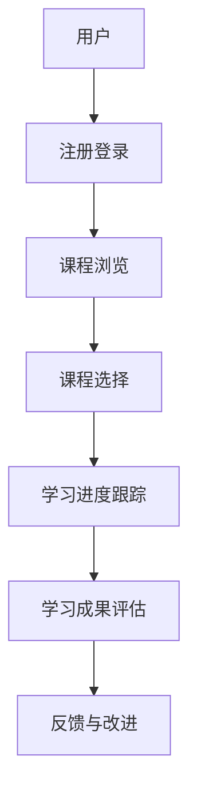

2.1.2 智能学习系统

智能学习系统利用人工智能技术，为学习者提供个性化的学习体验。这些系统通过分析学习者的行为和成绩数据，可以自动调整学习内容和节奏，以满足学习者的个性化需求。

**示例：智能学习系统的基本流程**

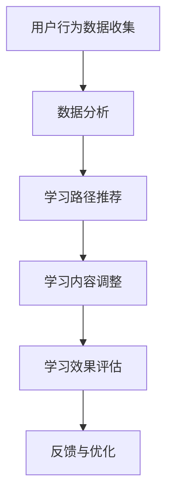

2.1.3 教育资源的共享与普及

计算技术使得教育资源的共享与普及变得更加容易。通过互联网，教师和学生可以访问全球范围内的教育资源，如公开课、学术论文和教育软件等。这不仅降低了教育成本，也提高了教育质量。

**示例：教育资源共享平台的基本架构**

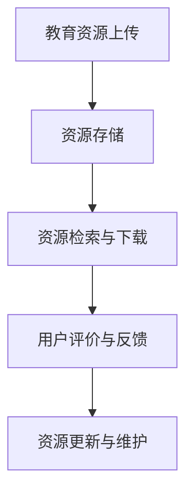

#### 2.2 个性化学习与自适应教学

个性化学习与自适应教学是教育领域的重要发展趋势。通过计算技术，教育系统能够根据学习者的特点和需求，提供个性化的学习内容和教学方法。

2.2.1 个性化学习的基本概念

个性化学习是指根据学习者的个体差异，提供定制化的学习内容和环境。个性化学习强调学习者的主动性和自主性，使得学习更加高效和有意义。

**示例：个性化学习的基本模型**

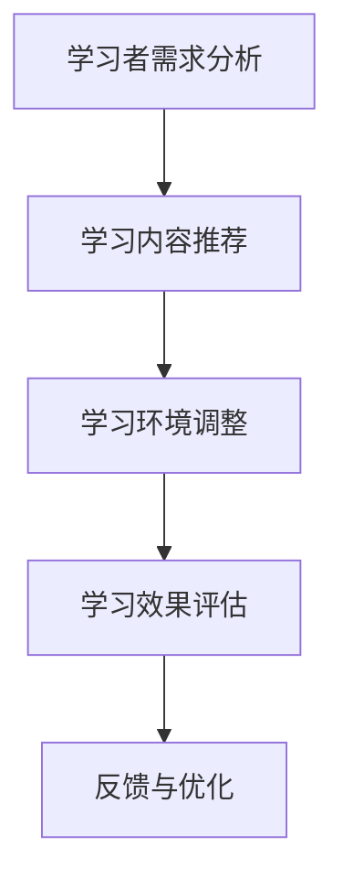

2.2.2 自适应教学系统

自适应教学系统利用人工智能技术，动态调整教学策略和内容，以适应学习者的学习进度和能力。这些系统通常包括学习行为分析、教学策略调整和学习效果评估等功能。

**示例：自适应教学系统的基本流程**

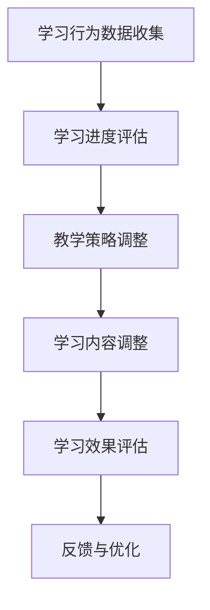

2.2.3 个性化学习案例分析

以Khan Academy为例，这是一个全球性的非营利教育组织，提供免费的在线教育资源。Khan Academy通过个性化学习系统，为学习者提供个性化的学习路径和教学资源。学习者可以根据自己的学习进度和能力，选择合适的课程和学习材料。这种个性化学习模式不仅提高了学习效率，也增强了学习者的自主学习能力。

**示例：Khan Academy的个性化学习流程**

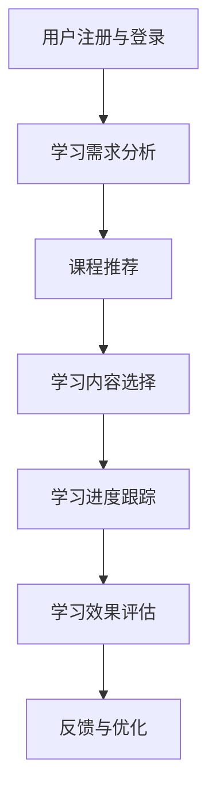

通过计算技术在教育领域的应用，我们可以看到教育变得更加个性化和高效。这不仅有助于提高教育质量，也为终身学习和全民教育提供了可能性。在下一部分中，我们将探讨计算技术在医疗健康领域的应用，以及计算技术如何改善医疗服务和提升健康水平。

---

### 第三部分：计算技术在医疗健康领域的应用

计算技术的进步为医疗健康领域带来了革命性的变化，从医疗信息系统的建设到智能医疗的应用，都在不断改善医疗服务的质量，提升健康水平。

#### 第3章：计算技术在医疗健康领域的应用

#### 3.1 医疗信息系统的建设

医疗信息系统是计算技术在医疗领域应用的重要基础。它通过电子病历（Electronic Health Records, EHR）和电子健康档案（Electronic Health Records, EHR）等手段，实现医疗信息的数字化和标准化管理。

3.1.1 医疗信息化的发展

随着信息技术的发展，医疗信息化逐渐成为提高医疗服务质量的重要手段。医疗信息系统集成了电子病历、临床决策支持系统、医疗设备联网等功能，使得医疗信息的采集、存储、传输和处理更加高效和准确。例如，电子病历系统可以记录患者的病史、诊断结果和治疗过程，方便医护人员进行诊断和治疗。

**示例：医疗信息系统的基本架构**

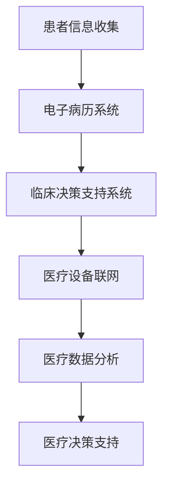

3.1.2 电子病历与电子健康档案

电子病历和电子健康档案是医疗信息系统的重要组成部分。电子病历系统可以记录患者的完整病史和治疗过程，而电子健康档案则包含了患者的个人信息、健康记录、医疗记录等。这些信息可以被多个医疗机构共享，从而提高医疗服务的连续性和效率。

**示例：电子病历与电子健康档案的基本流程**

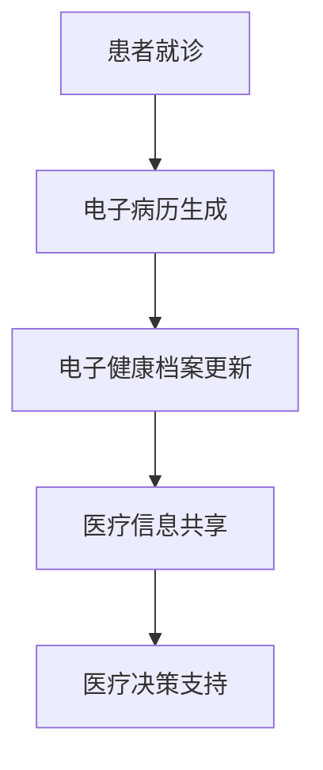

3.1.3 医疗大数据分析

医疗大数据分析利用计算技术对大量医疗数据进行处理和分析，以发现潜在的健康问题和优化医疗决策。例如，通过对大量患者的病史和诊断数据进行挖掘，可以识别出某些疾病的流行趋势和风险因素，从而制定更有效的预防措施。

**示例：医疗大数据分析的基本流程**

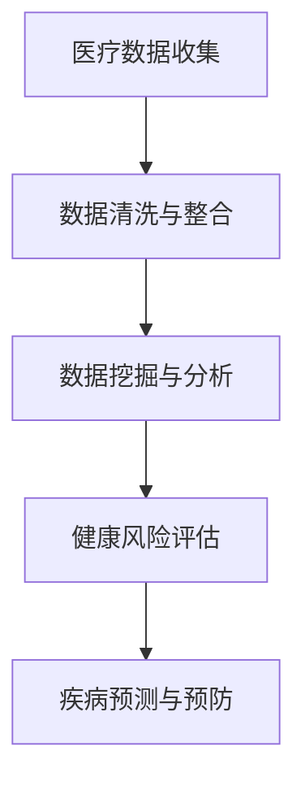

#### 3.2 智能医疗的应用

智能医疗是计算技术在医疗领域的重要应用之一，它通过人工智能和机器学习技术，提高疾病诊断的准确性、药物研发的效率和康复与健康管理的效果。

3.2.1 人工智能在疾病诊断中的应用

人工智能在疾病诊断中的应用越来越广泛。通过深度学习和计算机视觉技术，AI系统能够从医疗图像中识别出疾病特征，如肿瘤、心脏病等。例如，谷歌健康团队开发的AI系统已经在某些医院中用于辅助肺癌的早期诊断，显著提高了诊断的准确性和效率。

**示例：人工智能在疾病诊断中的应用流程**

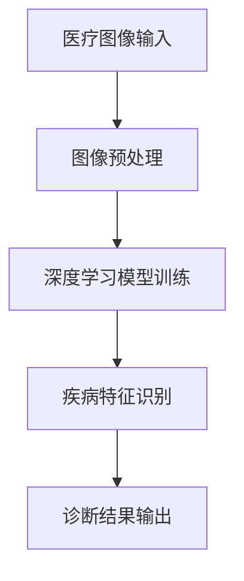

3.2.2 智能药物设计与开发

智能药物设计利用计算技术对药物分子的结构进行模拟和分析，以发现新的药物候选分子。通过计算模拟和实验验证，研究人员可以加速药物研发过程，降低研发成本。例如，IBM的Watson系统通过人工智能技术，已经在某些药物研发项目中发挥了重要作用。

**示例：智能药物设计的基本流程**

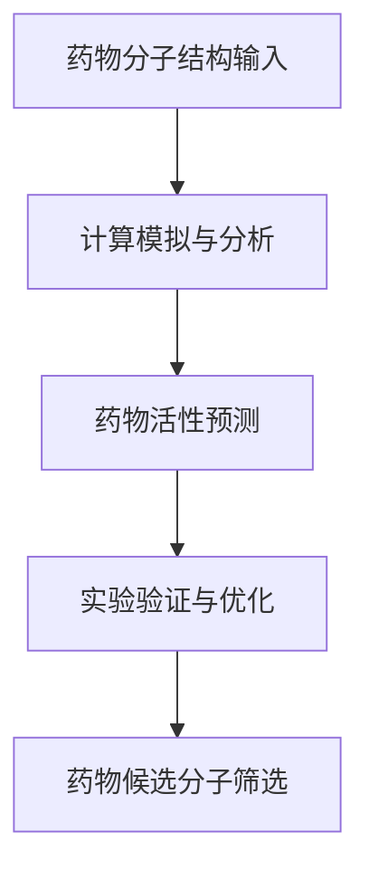

3.2.3 康复与健康管理

计算技术在康复和健康管理中的应用，有助于提高患者的生活质量和健康水平。例如，智能手环和健康APP等设备可以实时监测患者的身体状况，如心率、步数、睡眠质量等。通过数据分析，医生可以及时调整治疗方案，提高康复效果。

**示例：康复与健康管理的基本流程**

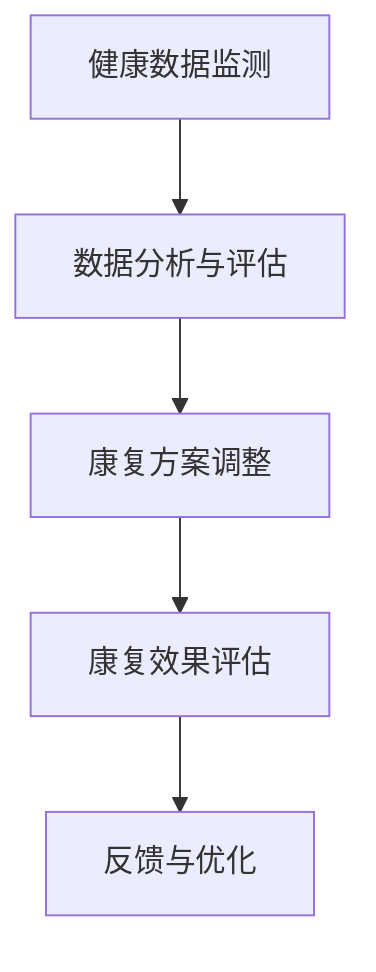

通过计算技术在医疗健康领域的应用，我们可以看到医疗服务的质量和效率得到了显著提升。这不仅有助于提高患者的健康水平，也为医疗行业带来了新的发展机遇。在下一部分中，我们将探讨计算技术在经济发展中的作用，以及如何通过计算技术推动经济的数字化转型。

---

### 第四部分：计算技术在经济发展中的作用

计算技术在经济发展中发挥着至关重要的作用，尤其是在电子商务的兴起、智能制造与工业4.0等领域，它推动了经济的数字化转型，提升了生产效率和市场竞争力。

#### 第4章：计算技术在经济发展中的作用

#### 4.1 电子商务的兴起

电子商务的兴起是计算技术对经济发展的重要推动力之一。通过互联网和移动设备，企业可以打破地域限制，将商品和服务直接销售给全球消费者。电子商务不仅改变了传统的商业模式，还促进了消费升级和产业升级。

4.1.1 电子商务的发展历程

电子商务的发展历程可以分为三个阶段：第一阶段是1990年代初期，电子商务初具规模，主要形式为在线商品销售和电子支付；第二阶段是2000年代，随着互联网和移动设备的普及，电子商务逐渐成为主流购物方式；第三阶段是2010年代至今，电子商务平台不断创新，智能物流和大数据分析等新技术应用，进一步提升了电子商务的效率和用户体验。

**示例：电子商务的发展历程**

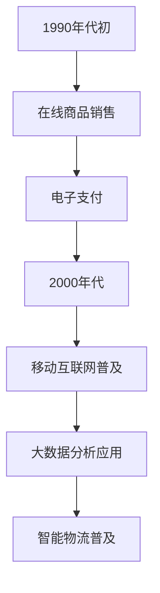

4.1.2 在线支付与电子钱包

在线支付和电子钱包是电子商务的重要组成部分。通过计算技术，用户可以实现方便快捷的在线支付，无需使用现金或银行卡。电子钱包如支付宝、微信支付等，不仅提供了安全可靠的支付方式，还集成了多种金融功能，如转账、充值、理财等。

**示例：电子钱包的基本功能**

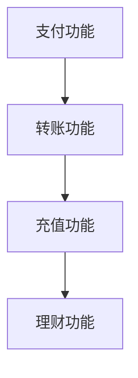

4.1.3 电子商务案例分析

以阿里巴巴为例，阿里巴巴是中国最大的电子商务公司，旗下拥有淘宝、天猫等知名电商平台。阿里巴巴通过云计算、大数据和人工智能技术，打造了强大的电子商务生态系统。通过智能推荐系统，阿里巴巴能够为用户提供个性化的购物体验，提高了销售额和用户满意度。

**示例：阿里巴巴的电子商务生态系统**

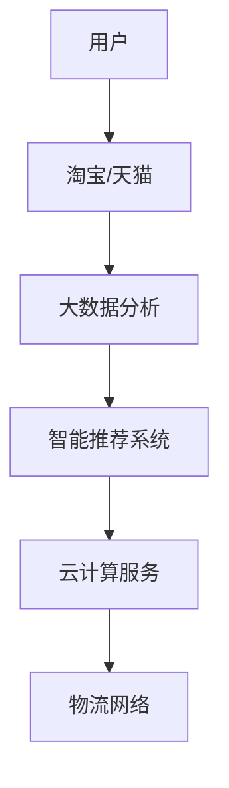

#### 4.2 智能制造与工业4.0

智能制造与工业4.0是计算技术在制造业的重要应用，通过物联网、大数据和人工智能技术，实现生产过程的数字化、智能化和自动化。

4.2.1 智能制造的基本概念

智能制造是指通过应用计算技术，实现生产过程的自动化、数字化和智能化。智能制造的核心包括智能传感器、工业物联网、云计算和大数据等。通过这些技术，制造企业可以实时监测生产过程，优化生产计划，提高生产效率和质量。

**示例：智能制造的基本概念**

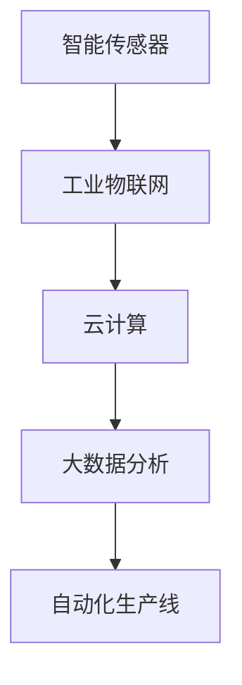

4.2.2 工业物联网的应用

工业物联网是智能制造的重要基础，它通过将各种传感器、设备和系统连接起来，实现设备间的数据交换和协同工作。例如，在智能工厂中，传感器可以实时监测设备状态、生产参数和环境条件，通过物联网技术，这些数据可以被云计算平台处理和分析，从而实现生产过程的智能优化。

**示例：工业物联网的应用**

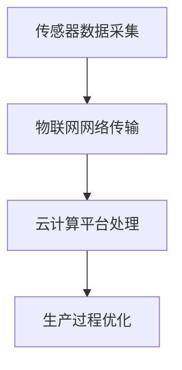

4.2.3 智能制造案例分析

以西门子（Siemens）的“数字双生”技术为例，这是一种基于物联网和大数据分析的智能制造解决方案。通过数字双生技术，西门子能够模拟和分析生产过程，预测潜在的问题并提前进行优化，从而提高生产效率和产品质量。

**示例：西门子的数字双生技术**

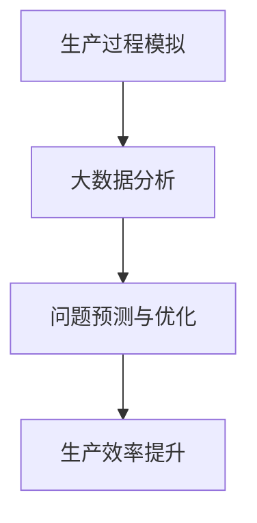

通过计算技术在电子商务和智能制造等领域的应用，我们可以看到计算技术对经济发展的深远影响。它不仅提高了企业的运营效率和市场竞争力，也为消费者带来了更加便捷和高效的购物体验。在下一部分中，我们将探讨计算技术在环境保护与可持续发展中的作用，以及如何通过计算技术实现环境保护和可持续发展的目标。

---

### 第五部分：计算技术在环境保护与可持续发展中的作用

计算技术在环境保护和可持续发展中发挥着越来越重要的作用，通过环境监测、数据分析以及能源效率优化等方面的应用，为可持续发展的实现提供了强有力的技术支持。

#### 第5章：计算技术在环境保护与可持续发展中的作用

#### 5.1 环境监测与数据分析

环境监测是计算技术在环境保护中的重要应用。通过安装在环境中的各种传感器，如空气质量传感器、水质传感器等，可以实时收集环境数据。这些数据通过物联网技术传输到云计算平台，进行存储和处理。

5.1.1 环境监测技术的发展

环境监测技术在过去几十年中取得了显著进展。传统的监测方法主要依赖于实验室分析，而现代的环境监测技术则依赖于传感器和物联网。传感器可以精确测量空气中的污染物、水中的有害物质等，实时监测环境质量。

**示例：环境监测系统的基本架构**

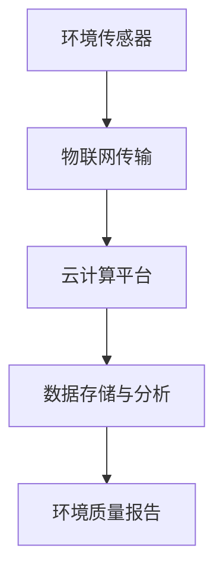

5.1.2 数据分析在环境保护中的应用

环境数据的收集只是第一步，更重要的是对这些数据进行深入分析，以发现环境问题的根源和解决方案。通过大数据分析技术，可以对环境数据进行分析，识别污染源、预测污染趋势，并为环境治理提供科学依据。

**示例：环境数据分析的基本流程**

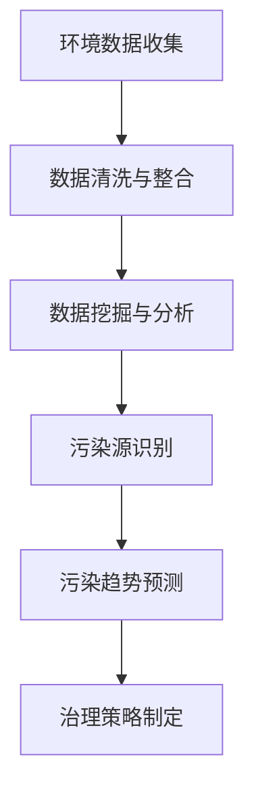

5.1.3 环境数据可视化

环境数据可视化是将环境数据以图形、图表等形式展示，使得数据更加直观易懂。通过数据可视化，政府和公众可以更好地了解环境状况，提高环保意识和参与度。

**示例：环境数据可视化的基本形式**

```mermaid
graph TB
A[污染物浓度分布图]
B[空气质量指数图表]
C[水质指标曲线图]
```

#### 5.2 可持续发展中的计算技术

可持续发展是一个长期的目标，计算技术在其中发挥着至关重要的作用。通过计算技术，可以实现能源效率优化、绿色计算理念以及可持续发展的实践。

5.2.1 能源效率优化

能源效率优化是计算技术在可持续发展中的重要应用。通过智能电网、智能楼宇和智能交通等系统的应用，可以优化能源的分配和使用，减少能源浪费，提高能源利用效率。

**示例：能源效率优化的基本概念**

```mermaid
graph TB
A[智能电网] --> B[智能楼宇]
B --> C[智能交通]
C --> D[能源优化管理]
```

5.2.2 绿色计算理念

绿色计算理念是指通过计算技术的应用，降低计算过程的能源消耗和环境影响。绿色计算涉及多个方面，包括硬件优化、软件效率提升和计算任务调度等。

**示例：绿色计算的基本原则**

```mermaid
graph TB
A[硬件优化] --> B[软件效率提升]
B --> C[计算任务调度]
C --> D[能源消耗降低]
```

5.2.3 可持续发展案例分析

以谷歌（Google）为例，谷歌在可持续发展方面采取了多项措施。谷歌通过使用可再生能源、优化数据中心能源效率和推广绿色计算技术，实现了显著的能源节约和碳排放减少。例如，谷歌的云计算平台采用了高效的数据中心设计和先进的节能技术，使得能源效率提升了30%以上。

**示例：谷歌的可持续发展实践**

```mermaid
graph TB
A[可再生能源使用] --> B[数据中心能源效率提升]
B --> C[绿色计算技术推广]
C --> D[碳排放减少]
```

通过计算技术在环境监测、数据分析、能源效率优化以及可持续发展实践中的应用，我们可以看到计算技术在环境保护和可持续发展中的重要地位。它不仅为环境保护提供了技术支持，也为实现可持续发展的目标提供了可能。在下一部分中，我们将探讨计算技术在公共安全与社会治理中的应用，以及如何通过计算技术提高公共安全和提升社会治理效率。

---

### 第六部分：计算技术在公共安全与社会治理中的应用

计算技术在公共安全和社会治理中发挥着越来越重要的作用，通过智能监控、数据驱动的社会治理和智慧城市建设等应用，显著提升了公共安全和社会治理的效率。

#### 第6章：计算技术在公共安全与社会治理中的应用

#### 6.1 智能监控与安防

智能监控是计算技术在公共安全领域的重要应用之一。通过视频监控和人工智能技术，可以对公共场所和交通枢纽进行实时监控，及时发现和预警潜在的安全威胁。

6.1.1 智能监控系统的基本原理

智能监控系统通常包括视频监控设备、图像处理算法和数据分析系统。视频监控设备实时捕捉视频画面，图像处理算法对视频画面进行分析，识别行人、车辆和其他目标。通过大数据分析，智能监控系统可以实时监控交通流量、人群密度等参数，为公共安全管理提供数据支持。

**示例：智能监控系统的基本架构**

```mermaid
graph TB
A[视频监控设备] --> B[图像处理算法]
B --> C[数据分析系统]
C --> D[实时监控与预警]
```

6.1.2 人脸识别与行为分析

人脸识别和行为分析是智能监控系统的重要组成部分。通过人脸识别技术，可以实现对特定目标的人脸信息进行识别和跟踪。行为分析技术则可以识别异常行为，如打架、行窃等，从而提高公共安全管理的精确度和效率。

**示例：人脸识别与行为分析的基本流程**

```mermaid
graph TB
A[人脸识别] --> B[行为分析]
B --> C[异常行为识别]
C --> D[预警与处置]
```

6.1.3 安防系统案例分析

以中国的“雪亮工程”为例，该工程通过智能监控和视频分析技术，建立了覆盖广泛、功能强大的公共安全视频监控系统。通过视频监控数据的实时分析和处理，雪亮工程有效提高了治安管理水平和犯罪侦破效率。

**示例：雪亮工程的基本架构**

```mermaid
graph TB
A[视频监控设备] --> B[视频数据分析]
B --> C[实时监控与预警]
C --> D[数据共享与协同]
```

#### 6.2 社会治理中的计算技术

计算技术在社会治理中的应用，使得政府能够更加高效地管理社会事务，提供优质的公共服务。

6.2.1 智慧城市的建设

智慧城市是计算技术在社会治理中的重要应用之一。通过物联网、大数据和人工智能技术，智慧城市可以实现城市管理的智能化和精细化。例如，智慧交通系统能够实时监测交通流量，优化交通信号控制，缓解交通拥堵；智慧医疗系统能够提供便捷的医疗服务，提高医疗资源的利用效率。

**示例：智慧城市建设的基本框架**

```mermaid
graph TB
A[物联网] --> B[大数据分析]
B --> C[人工智能]
C --> D[智慧交通]
D --> E[智慧医疗]
```

6.2.2 数据驱动的社会治理

数据驱动的社会治理是指政府通过收集、分析和利用数据，进行科学决策和管理。通过大数据技术，政府可以实时监测社会状况，预测社会需求，制定和调整政策。例如，通过数据分析，政府可以识别社会问题的高风险区域，提前进行干预和治理。

**示例：数据驱动的社会治理流程**

```mermaid
graph TB
A[数据收集] --> B[数据分析]
B --> C[社会监测]
C --> D[决策支持]
```

6.2.3 社会治理案例分析

以新加坡的“智慧国家计划”为例，该计划通过计算技术实现了一系列社会治理创新。例如，通过大数据分析和智能监控，新加坡政府有效提升了治安管理、交通管理和公共服务水平，成为全球智慧城市的典范。

**示例：新加坡智慧国家计划的核心应用**

```mermaid
graph TB
A[智能监控] --> B[大数据分析]
B --> C[智慧交通]
C --> D[智慧医疗]
```

通过计算技术在公共安全与社会治理中的应用，我们可以看到计算技术对社会治理的深远影响。它不仅提高了公共安全和社会治理的效率，也为建设更加安全、高效、和谐的社会提供了强有力的技术支持。在下一部分中，我们将探讨计算技术的未来发展趋势与社会责任，以及如何确保计算技术的可持续发展。

---

### 第七部分：计算技术的未来发展趋势与社会责任

随着技术的不断进步，计算技术正迎来新的发展机遇和挑战。人工智能的快速发展、计算技术对社会的影响以及如何应对这些影响，都是当前我们需要重点关注的问题。

#### 第7章：计算技术的未来发展趋势与社会责任

#### 7.1 人工智能与人类社会的未来

人工智能（AI）是计算技术的最新突破之一，它正在改变我们的生活方式和社会结构。人工智能的发展可以分为三个阶段：弱人工智能、强人工智能和超人工智能。

7.1.1 人工智能的发展趋势

当前，人工智能技术已经取得了显著进展，尤其在图像识别、自然语言处理、自动驾驶等领域。弱人工智能能够执行特定任务，如语音助手、智能家居等。强人工智能则具备人类级别的智能，能够进行推理、学习和决策。超人工智能则是一个更遥远的目标，它将超越人类智能，实现自我学习和优化。

**示例：人工智能的发展阶段**

```mermaid
graph TB
A[弱人工智能] --> B[强人工智能]
B --> C[超人工智能]
```

7.1.2 人工智能与就业

人工智能的发展也引发了关于就业的讨论。一方面，人工智能的自动化特性可能导致某些工作岗位的减少，如工厂操作工、司机等。另一方面，人工智能也为新的就业机会创造了条件，如数据分析师、AI工程师等。因此，如何平衡人工智能与就业之间的关系，是当前社会需要面对的重要问题。

**示例：人工智能与就业的影响**

```mermaid
graph TB
A[自动化导致的就业减少] --> B[新就业机会的创造]
```

7.1.3 人工智能伦理与社会责任

随着人工智能的发展，伦理和社会责任问题也日益突出。人工智能系统的决策过程可能存在偏见，可能导致不公平的结果。此外，人工智能技术的滥用也可能对社会造成负面影响。因此，制定人工智能伦理准则和法律法规，确保人工智能技术的正当和合理使用，是当前社会的重要任务。

**示例：人工智能伦理的基本原则**

```mermaid
graph TB
A[公平性] --> B[透明性]
B --> C[责任性]
```

#### 7.2 计算技术的社会影响与应对

计算技术对社会的积极影响我们已经讨论了很多，但同时也带来了许多挑战和问题。如何应对这些挑战，确保计算技术的可持续发展，是当前我们需要关注的重要问题。

7.2.1 计算技术对社会的影响

计算技术对社会的积极影响包括提高生产效率、改善生活质量、促进社会公平等。但计算技术也可能带来负面影响，如隐私侵犯、信息过载、数字鸿沟等。因此，我们需要在推动计算技术发展的同时，关注其对社会的影响，并采取措施进行应对。

**示例：计算技术对社会的影响**

```mermaid
graph TB
A[生产效率提高] --> B[生活质量改善]
B --> C[社会公平促进]
C --> D[隐私侵犯]
D --> E[信息过载]
E --> F[数字鸿沟]
```

7.2.2 应对计算技术负面影响的策略

为了应对计算技术的负面影响，我们可以采取以下策略：

1. **加强法律法规建设**：制定相关的法律法规，规范计算技术的使用，保护个人隐私和信息安全。
2. **提升公众素养**：通过教育和宣传，提高公众对计算技术的认知和理解，增强自我保护能力。
3. **促进数字公平**：通过政策扶持和技术创新，缩小数字鸿沟，确保每个人都能平等地享受计算技术带来的好处。

**示例：应对计算技术负面影响的策略**

```mermaid
graph TB
A[法律法规建设] --> B[公众素养提升]
B --> C[数字公平促进]
```

7.2.3 社会责任与可持续发展

计算技术在推动社会进步的同时，也需要承担社会责任，实现可持续发展。这包括以下几个方面：

1. **技术创新**：持续推动技术创新，开发更安全、高效、环保的计算技术。
2. **环境保护**：通过绿色计算理念，降低计算过程的能源消耗和环境影响。
3. **社会责任**：企业应承担社会责任，通过公益活动和技术支持，促进社会公平和可持续发展。

**示例：计算技术的可持续发展**

```mermaid
graph TB
A[技术创新] --> B[环境保护]
B --> C[社会责任]
```

通过计算技术的未来发展趋势与社会责任的探讨，我们可以看到计算技术在推动社会进步中的重要作用，同时也需要关注其对社会的影响，并采取措施进行应对。只有这样，计算技术才能实现可持续发展，为人类社会的繁荣做出更大的贡献。

---

### 总结

计算技术已经成为推动社会进步的重要动力，它在教育、医疗、经济、环境保护、公共安全等领域都发挥了重要作用。通过回顾计算技术的起源与发展，我们能够清晰地看到计算技术如何改变我们的生活方式和工作方式。在未来的发展中，我们需要继续推动计算技术的创新，同时关注其对社会的影响，确保计算技术能够实现可持续发展。

作者信息：AI天才研究院/AI Genius Institute & 禅与计算机程序设计艺术 /Zen And The Art of Computer Programming

---

通过这篇详细的技术博客文章，我们深入探讨了计算技术在社会各个领域的积极影响，展示了计算技术如何成为推动社会进步的重要力量。希望读者能够从中获得对计算技术更深刻的理解和认识。在未来，让我们共同努力，推动计算技术的可持续发展，为人类社会的繁荣做出更大的贡献。

