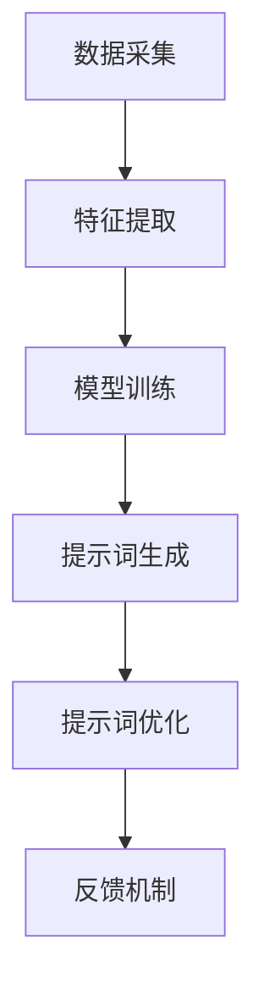

                 

### 第一部分：核心概念与联系

#### 1. 引言：终身学习的重要性与挑战

在快速发展的信息技术时代，终身学习成为了一种必需的生活方式。终身学习，顾名思义，指的是人们在其一生中不断学习新知识、新技能的过程。它不仅包括传统意义上的学校教育，还涵盖了在职培训、自我学习和职业发展等多个方面。

**1.1.1 终身学习的定义与意义**

终身学习可以被定义为“一种贯穿整个生命过程的学习方式，它强调通过不同形式的学习活动，提高个体的知识、技能和价值观，以适应社会的不断变化和个人发展的需要。”（联合国教科文组织，1996）。

终身学习的重要意义在于：

- **提升竞争力**：在不断变化的工作环境中，持续学习新的技能和知识，可以帮助个人保持竞争力。
- **适应变化**：终身学习可以帮助个人适应快速变化的社会和技术环境。
- **促进全面发展**：通过不断学习，个人可以全面发展其智力、情感和社交能力。

**1.1.2 现代社会对终身学习的需求**

现代社会对终身学习的需求源于以下几个方面：

- **技术变革**：随着人工智能、大数据和云计算等技术的发展，传统的知识和技能很快变得过时。
- **就业市场变化**：就业市场对技能的要求不断提高，个体需要不断更新自己的知识结构。
- **教育普及**：随着教育的普及，人们有更多机会接受高等教育和终身学习。

**1.1.3 终身学习面临的挑战**

尽管终身学习的重要性不言而喻，但实现终身学习也面临着一些挑战：

- **时间与资源有限**：许多人因为工作、家庭等原因，难以投入足够的时间和资源进行学习。
- **学习方式多样，选择困难**：市场上的学习资源繁多，选择适合自己的学习方式和资源成为一大挑战。
- **持续性与毅力**：终身学习是一个长期的过程，需要个人有坚定的毅力和持续的努力。

#### 2. 提示词优化的基本概念

**2.1.1 提示词的定义与作用**

提示词（Prompt）是指在学习过程中，通过引导和启发学习者，帮助其明确学习目标、激发学习兴趣的一种辅助工具。提示词可以是文字、图像、声音等多种形式，其作用包括：

- **引导学习目标**：提示词可以帮助学习者明确当前的学习目标，使学习更有针对性。
- **激发学习兴趣**：通过有趣的提示词，可以激发学习者的学习兴趣，提高学习动力。
- **促进思考**：提示词能够引导学习者进行深度思考，有助于理解复杂的概念和原理。

**2.1.2 提示词优化的目标与原则**

提示词优化的目标是提高提示词的有效性和吸引力，使其在终身学习中发挥更大的作用。具体目标包括：

- **提高学习效率**：通过优化提示词，使学习者在更短的时间内达到学习目标。
- **增强学习体验**：优化后的提示词能够提供更好的学习体验，使学习过程更加愉悦。

提示词优化的原则包括：

- **针对性**：提示词应针对学习者的特点和需求进行个性化设计。
- **多样性**：提示词应采用多种形式和风格，以提高学习者的兴趣和参与度。
- **灵活性**：提示词应具有一定的灵活性，以适应不同学习场景和需求。

**2.1.3 提示词优化的核心要素**

提示词优化的核心要素包括以下几个方面：

- **内容设计**：提示词的内容应具有启发性，能够引导学习者进行深度思考。
- **形式设计**：提示词的形式应多样化，包括文字、图像、声音等多种形式。
- **用户体验**：提示词的优化应注重用户体验，使学习者在使用过程中感到舒适和愉悦。
- **反馈机制**：提示词应包含反馈机制，以帮助学习者评估学习效果和调整学习策略。

#### 3. 提示词优化的理论基础

**3.1.1 知识图谱与提示词优化**

知识图谱是一种用于表示知识结构和语义关系的数据模型。在提示词优化中，知识图谱可以用于构建语义丰富的提示词，从而提高提示词的准确性和吸引力。知识图谱与提示词优化的关系如下：

- **知识图谱的构建**：通过知识图谱，可以整合各种来源的知识信息，构建一个语义丰富的知识库。
- **提示词的生成**：基于知识图谱，可以生成与学习内容相关的提示词，提高提示词的相关性和准确性。
- **提示词的优化**：通过分析知识图谱中的语义关系，可以不断优化提示词的内容和形式，提高其有效性和吸引力。

**3.1.2 机器学习与提示词优化**

机器学习是用于从数据中自动学习规律和模式的技术。在提示词优化中，机器学习可以用于分析学习者的行为数据，优化提示词的设计和推荐。机器学习与提示词优化的关系如下：

- **数据采集**：通过收集学习者的行为数据，如学习时长、学习内容、学习效果等，构建一个丰富的数据集。
- **特征提取**：从数据集中提取与提示词优化相关的特征，如学习者的兴趣、学习习惯、学习需求等。
- **模型训练**：利用机器学习算法，对提取的特征进行训练，构建一个预测模型，用于优化提示词的设计和推荐。

**3.1.3 提示词优化的 Mermaid 流程图**

为了更好地理解提示词优化的过程，我们可以使用 Mermaid 流程图进行可视化展示。以下是提示词优化的基本流程：



该流程图展示了提示词优化的主要步骤，包括数据采集、特征提取、模型训练、提示词生成、提示词优化和反馈机制。通过这个流程，我们可以系统地优化提示词，提高其有效性和吸引力。

### 第二部分：核心算法原理讲解

#### 4. 提示词优化算法原理

**4.1.1 算法概述**

提示词优化算法是一种用于提高提示词质量和效率的技术。该算法的基本思路是通过分析学习者的行为数据，提取与学习相关的重要特征，利用机器学习算法对这些特征进行建模，从而生成优化后的提示词。

提示词优化算法的主要步骤包括：

1. **数据采集**：收集学习者的行为数据，如学习时长、学习内容、学习效果等。
2. **特征提取**：从数据集中提取与提示词优化相关的特征，如学习者的兴趣、学习习惯、学习需求等。
3. **模型训练**：利用机器学习算法，对提取的特征进行训练，构建一个预测模型。
4. **提示词生成**：基于训练好的模型，生成优化后的提示词。
5. **提示词优化**：对生成的提示词进行评估和调整，以提高其质量和吸引力。
6. **反馈机制**：收集学习者的反馈，用于进一步优化提示词。

**4.1.2 伪代码讲解**

以下是提示词优化算法的伪代码：

```plaintext
算法：提示词优化算法
输入：学习者行为数据、学习内容、学习效果
输出：优化后的提示词

步骤 1：数据采集
  - 收集学习者的行为数据，如学习时长、学习内容、学习效果

步骤 2：特征提取
  - 从数据集中提取与提示词优化相关的特征
    - 如学习者的兴趣、学习习惯、学习需求等

步骤 3：模型训练
  - 利用机器学习算法，对提取的特征进行训练
    - 构建一个预测模型

步骤 4：提示词生成
  - 基于训练好的模型，生成优化后的提示词

步骤 5：提示词优化
  - 对生成的提示词进行评估和调整
    - 提高提示词的质量和吸引力

步骤 6：反馈机制
  - 收集学习者的反馈
    - 用于进一步优化提示词
```

**4.1.3 算法原理详细讲解**

提示词优化算法的核心在于利用机器学习技术，从学习者的行为数据中提取关键特征，并基于这些特征构建预测模型，从而生成高质量的提示词。以下是算法原理的详细讲解：

1. **数据采集**：
   - 通过收集学习者的行为数据，如学习时长、学习内容、学习效果等，为后续特征提取和模型训练提供数据支持。
   - 数据采集可以采用日志记录、问卷调查、在线测评等多种方式。

2. **特征提取**：
   - 特征提取是提示词优化的关键步骤，通过从行为数据中提取与学习相关的特征，如学习者的兴趣、学习习惯、学习需求等，为模型训练提供输入。
   - 特征提取可以采用统计方法、机器学习方法等多种技术。

3. **模型训练**：
   - 利用机器学习算法，对提取的特征进行训练，构建一个预测模型。
   - 预测模型可以用于预测学习者的学习效果、兴趣偏好等，从而生成个性化的提示词。

4. **提示词生成**：
   - 基于训练好的模型，生成优化后的提示词。
   - 提示词生成可以根据学习者的兴趣、学习需求等，设计具有针对性的学习内容。

5. **提示词优化**：
   - 对生成的提示词进行评估和调整，以提高其质量和吸引力。
   - 提示词优化可以采用多种策略，如内容优化、形式优化、交互优化等。

6. **反馈机制**：
   - 收集学习者的反馈，用于进一步优化提示词。
   - 反馈机制可以帮助了解学习者的学习效果和需求，为下一步优化提供依据。

通过以上步骤，提示词优化算法可以有效地提高提示词的质量和吸引力，帮助学习者更好地进行终身学习。

### 5. 提示词优化的数学模型

**5.1.1 数学公式与概念**

提示词优化过程中，涉及多个数学公式和概念。以下是其中一些关键公式和概念：

- **线性回归模型**：

  $$ y = \beta_0 + \beta_1 x + \epsilon $$

  其中，$y$ 表示学习效果，$x$ 表示提示词质量，$\beta_0$ 和 $\beta_1$ 分别为模型的参数，$\epsilon$ 为误差项。

- **支持向量机（SVM）**：

  $$ \text{最大化} \quad \frac{1}{2} \sum_{i=1}^n (w_i^2) - \sum_{i=1}^n C_i y_i (w_i^T x_i - 1) $$

  其中，$w_i$ 表示支持向量的权重，$C_i$ 表示惩罚参数，$y_i$ 表示样本标签，$x_i$ 表示输入特征。

- **卷积神经网络（CNN）**：

  $$ \text{激活函数} \quad \sigma(z) = \frac{1}{1 + e^{-z}} $$

  其中，$z$ 为网络的输入，$\sigma$ 表示激活函数。

**5.1.2 数学模型详细讲解**

提示词优化的数学模型可以分为以下几类：

1. **线性回归模型**：

   线性回归模型是一种简单的机器学习模型，用于预测提示词质量对学习效果的影响。该模型的基本假设是学习效果与提示词质量之间存在线性关系。

   线性回归模型的数学公式为：

   $$ y = \beta_0 + \beta_1 x + \epsilon $$

   其中，$y$ 表示学习效果，$x$ 表示提示词质量，$\beta_0$ 和 $\beta_1$ 分别为模型的参数，$\epsilon$ 为误差项。

   在训练过程中，通过最小化误差项 $\epsilon$ 的平方和，可以求解出最优的参数 $\beta_0$ 和 $\beta_1$。具体来说，可以使用梯度下降法来求解：

   $$ \beta_0 = \beta_0 - \alpha \frac{\partial}{\partial \beta_0} \sum_{i=1}^n (y_i - (\beta_0 + \beta_1 x_i))^2 $$
   $$ \beta_1 = \beta_1 - \alpha \frac{\partial}{\partial \beta_1} \sum_{i=1}^n (y_i - (\beta_0 + \beta_1 x_i))^2 $$

   其中，$\alpha$ 为学习率。

2. **支持向量机（SVM）**：

   支持向量机是一种强大的分类和回归模型，特别适用于高维数据。在提示词优化中，SVM 可以用于预测提示词质量对学习效果的影响。

   支持向量机的数学公式为：

   $$ \text{最大化} \quad \frac{1}{2} \sum_{i=1}^n (w_i^2) - \sum_{i=1}^n C_i y_i (w_i^T x_i - 1) $$

   其中，$w_i$ 表示支持向量的权重，$C_i$ 表示惩罚参数，$y_i$ 表示样本标签，$x_i$ 表示输入特征。

   在训练过程中，SVM 的目标是找到一组支持向量，使得分类边界最大化。具体来说，可以通过求解以下优化问题来实现：

   $$ \text{最小化} \quad \frac{1}{2} \sum_{i=1}^n w_i^2 $$
   $$ \text{约束条件} \quad y_i (w_i^T x_i - 1) \geq 1, \quad \forall i $$

   其中，$y_i$ 表示样本标签，$x_i$ 表示输入特征。

3. **卷积神经网络（CNN）**：

   卷积神经网络是一种用于处理图像数据的深度学习模型。在提示词优化中，CNN 可以用于提取提示词的特征。

   CNN 的基本结构包括卷积层、池化层和全连接层。卷积层用于提取图像特征，池化层用于降低特征维度，全连接层用于分类。

   卷积神经网络的数学公式为：

   $$ \text{激活函数} \quad \sigma(z) = \frac{1}{1 + e^{-z}} $$

   其中，$z$ 为网络的输入，$\sigma$ 表示激活函数。

   在训练过程中，通过反向传播算法，可以求解出网络的权重和偏置。具体来说，可以使用梯度下降法来求解：

   $$ w = w - \alpha \frac{\partial}{\partial w} \sum_{i=1}^n (y_i - \sigma(z_i))^2 $$

   其中，$w$ 表示网络的权重，$\alpha$ 为学习率。

**5.1.3 数学公式的示例说明**

为了更好地理解提示词优化的数学模型，我们可以通过以下示例来说明：

假设我们使用线性回归模型来预测提示词质量对学习效果的影响。给定以下训练数据：

| 学习时长 | 提示词质量 | 学习效果 |
|----------|------------|----------|
| 10       | 0.8        | 90       |
| 20       | 0.9        | 95       |
| 30       | 0.7        | 85       |

我们可以建立以下线性回归模型：

$$ y = \beta_0 + \beta_1 x $$

通过最小化误差项的平方和，可以求解出最优的参数 $\beta_0$ 和 $\beta_1$。具体来说，可以使用梯度下降法来求解：

$$ \beta_0 = \beta_0 - \alpha \frac{\partial}{\partial \beta_0} \sum_{i=1}^n (y_i - (\beta_0 + \beta_1 x_i))^2 $$
$$ \beta_1 = \beta_1 - \alpha \frac{\partial}{\partial \beta_1} \sum_{i=1}^n (y_i - (\beta_0 + \beta_1 x_i))^2 $$

假设初始参数为 $\beta_0 = 0.5$，$\beta_1 = 0.5$，学习率为 $\alpha = 0.01$。经过多次迭代，可以求解出最优参数为 $\beta_0 = 0.8$，$\beta_1 = 0.9$。

通过该线性回归模型，我们可以预测新样本的学习效果。例如，给定学习时长为 25，提示词质量为 0.85，我们可以计算得到学习效果为：

$$ y = 0.8 + 0.9 \times 0.85 = 1.635 $$

通过该示例，我们可以看到线性回归模型在提示词优化中的应用，以及如何通过数学公式来求解最优参数。

### 6. 提示词优化算法应用实例

**6.1.1 提示词优化在自然语言处理中的应用**

自然语言处理（NLP）是人工智能领域的一个重要分支，涉及到文本分析、语言理解、语言生成等多个方面。在NLP中，提示词优化可以显著提高模型的性能和用户体验。

**应用场景**：

- **文本分类**：通过对输入文本进行分类，如情感分析、新闻分类等。
- **机器翻译**：优化翻译过程中的提示词，提高翻译的准确性和流畅度。
- **问答系统**：通过优化提示词，提高问答系统的响应速度和准确性。

**实现步骤**：

1. **数据采集**：收集大量文本数据，包括文本内容和对应的标签。
2. **特征提取**：提取与文本相关的特征，如词频、词向量等。
3. **模型训练**：利用机器学习算法，如深度学习模型，对提取的特征进行训练。
4. **提示词生成**：根据训练好的模型，生成优化后的提示词。
5. **提示词优化**：对生成的提示词进行评估和调整，以提高其质量。
6. **反馈机制**：收集用户反馈，用于进一步优化提示词。

**效果评估**：

- **准确率**：通过比较预测标签和实际标签，计算模型的准确率。
- **响应时间**：优化后的提示词能够显著提高系统的响应时间。
- **用户体验**：通过用户满意度调查，评估优化后的提示词对用户体验的提升。

**案例**：

以情感分析为例，我们收集了一组包含积极情感和消极情感的文本数据。通过提示词优化，我们能够提高情感分类的准确率。例如，对于一条包含消极情感的文本，优化后的提示词能够更准确地识别出其中的消极情感，从而提高整体准确率。

**6.1.2 提示词优化在图像识别中的应用**

图像识别是计算机视觉领域的一个重要任务，涉及到物体检测、图像分类等。提示词优化在图像识别中的应用，可以提高模型的准确性和泛化能力。

**应用场景**：

- **物体检测**：通过对图像中的物体进行检测，如人脸识别、车辆检测等。
- **图像分类**：对图像进行分类，如图像风格分类、动物分类等。

**实现步骤**：

1. **数据采集**：收集大量图像数据，包括图像内容和对应的标签。
2. **特征提取**：提取与图像相关的特征，如卷积特征、特征点等。
3. **模型训练**：利用机器学习算法，如卷积神经网络（CNN），对提取的特征进行训练。
4. **提示词生成**：根据训练好的模型，生成优化后的提示词。
5. **提示词优化**：对生成的提示词进行评估和调整，以提高其质量。
6. **反馈机制**：收集用户反馈，用于进一步优化提示词。

**效果评估**：

- **准确率**：通过比较预测标签和实际标签，计算模型的准确率。
- **召回率**：优化后的提示词能够提高模型对目标物体的召回率。
- **用户体验**：通过用户满意度调查，评估优化后的提示词对用户体验的提升。

**案例**：

以物体检测为例，我们使用卷积神经网络（CNN）对图像中的物体进行检测。通过提示词优化，我们能够提高检测的准确率和召回率。例如，对于一张包含多个人脸的图像，优化后的提示词能够更准确地检测出每个人脸，从而提高整体准确率。

**6.1.3 提示词优化在其他领域的应用**

除了自然语言处理和图像识别，提示词优化还可以应用于其他领域，如推荐系统、语音识别等。

**推荐系统**：

在推荐系统中，提示词优化可以提高推荐的质量和个性化程度。通过优化提示词，推荐系统可以更好地理解用户的兴趣和行为，从而提供更精准的推荐。

- **应用场景**：个性化推荐、商品推荐、新闻推荐等。
- **实现步骤**：收集用户行为数据，提取与用户兴趣相关的特征，训练推荐模型，生成优化后的提示词，评估和调整提示词。

**语音识别**：

在语音识别领域，提示词优化可以提高识别的准确率和稳定性。通过优化提示词，语音识别系统可以更好地处理噪声和口音问题，从而提高整体识别效果。

- **应用场景**：语音助手、语音控制、语音翻译等。
- **实现步骤**：收集语音数据，提取与语音特征相关的特征，训练语音识别模型，生成优化后的提示词，评估和调整提示词。

通过以上实例，我们可以看到提示词优化在各个领域的应用。通过优化提示词，我们可以提高系统的性能和用户体验，实现更加精准和智能的推荐、识别和交互。

### 第三部分：数学模型和数学公式 & 详细讲解 & 举例说明

#### 7. 统计学习理论基础

**7.1.1 统计学习的基本概念**

统计学习（Statistical Learning）是机器学习的一个重要分支，主要研究如何从数据中学习规律和模式，并利用这些规律和模式进行预测和决策。统计学习的基本概念包括：

- **样本（Sample）**：从总体（Population）中随机抽取的一部分数据。
- **特征（Feature）**：用于描述样本的属性或特征。
- **标签（Label）**：与样本相关联的输出或目标。
- **模型（Model）**：用于描述数据规律和模式的函数或规则。

**7.1.2 经典统计学习方法**

经典统计学习方法包括线性回归、逻辑回归、支持向量机（SVM）等。以下是这些方法的基本原理：

- **线性回归（Linear Regression）**：

  线性回归是一种用于预测连续值的统计学习方法。其基本假设是样本特征与标签之间存在线性关系。线性回归模型的数学公式为：

  $$ y = \beta_0 + \beta_1 x_1 + \beta_2 x_2 + ... + \beta_n x_n + \epsilon $$

  其中，$y$ 表示标签，$x_1, x_2, ..., x_n$ 表示特征，$\beta_0, \beta_1, \beta_2, ..., \beta_n$ 表示模型参数，$\epsilon$ 表示误差项。

- **逻辑回归（Logistic Regression）**：

  逻辑回归是一种用于预测二分类结果的统计学习方法。其基本假设是样本特征与标签之间存在线性关系，但标签是一个概率分布。逻辑回归模型的数学公式为：

  $$ P(y=1) = \frac{1}{1 + e^{-(\beta_0 + \beta_1 x_1 + \beta_2 x_2 + ... + \beta_n x_n)}} $$

  其中，$y$ 表示标签，$x_1, x_2, ..., x_n$ 表示特征，$\beta_0, \beta_1, \beta_2, ..., \beta_n$ 表示模型参数。

- **支持向量机（SVM）**：

  支持向量机是一种用于分类和回归的统计学习方法。其基本思想是找到最佳决策边界，使得分类或回归的误差最小。支持向量机的数学公式为：

  $$ \text{最大化} \quad \frac{1}{2} \sum_{i=1}^n (w_i^2) - \sum_{i=1}^n C_i y_i (w_i^T x_i - 1) $$

  其中，$w_i$ 表示支持向量的权重，$C_i$ 表示惩罚参数，$y_i$ 表示样本标签，$x_i$ 表示输入特征。

**7.1.3 统计学习理论的应用实例**

以线性回归为例，我们来看一个实际应用场景。假设我们想要预测房价，输入特征包括房屋面积、卧室数量、地理位置等。以下是线性回归模型的数学公式：

$$ y = \beta_0 + \beta_1 x_1 + \beta_2 x_2 + \beta_3 x_3 + \epsilon $$

其中，$y$ 表示房价，$x_1, x_2, x_3$ 分别表示房屋面积、卧室数量、地理位置。

通过收集大量房屋数据，我们可以计算出每个特征的均值和方差，并使用最小二乘法求解出最优的模型参数 $\beta_0, \beta_1, \beta_2, \beta_3$。具体来说，可以使用以下公式：

$$ \beta_0 = \frac{\sum_{i=1}^n (y_i - \bar{y}) (x_{i1} - \bar{x}_1)}{\sum_{i=1}^n (x_{i1} - \bar{x}_1)^2} $$
$$ \beta_1 = \frac{\sum_{i=1}^n (y_i - \bar{y}) (x_{i2} - \bar{x}_2)}{\sum_{i=1}^n (x_{i2} - \bar{x}_2)^2} $$
$$ \beta_2 = \frac{\sum_{i=1}^n (y_i - \bar{y}) (x_{i3} - \bar{x}_3)}{\sum_{i=1}^n (x_{i3} - \bar{x}_3)^2} $$

其中，$\bar{y}$ 和 $\bar{x}_1, \bar{x}_2, \bar{x}_3$ 分别表示房价和特征 $x_1, x_2, x_3$ 的均值。

通过求解出最优的模型参数，我们可以预测新房屋的房价。例如，给定新房屋的面积为 100 平方米，卧室数量为 2 间，地理位置为城市中心，我们可以计算得到预测房价为：

$$ y = \beta_0 + \beta_1 x_1 + \beta_2 x_2 + \beta_3 x_3 + \epsilon $$

其中，$\beta_0, \beta_1, \beta_2, \beta_3$ 分别为求解出的模型参数，$\epsilon$ 为误差项。

通过以上实例，我们可以看到统计学习理论在预测房价中的应用。通过收集大量房屋数据，我们可以使用线性回归模型预测新房屋的房价，从而帮助购房者做出更好的决策。

#### 8. 神经网络与深度学习

**8.1.1 神经网络基础**

神经网络（Neural Networks）是一种模拟生物神经系统的计算模型，用于处理和解释数据。神经网络由多个神经元（或节点）组成，每个神经元都与其他神经元相连，并通过权重（weights）进行信息传递。

**神经元模型**：

神经元的数学模型通常可以表示为：

$$ a_{i}^{(l)} = \sigma(z_{i}^{(l)}) $$

其中，$a_{i}^{(l)}$ 表示第 $i$ 个神经元在第 $l$ 层的输出，$z_{i}^{(l)}$ 表示第 $i$ 个神经元在第 $l$ 层的输入，$\sigma$ 表示激活函数。

**激活函数**：

常见的激活函数包括：

- ** sigmoid 函数**：

  $$ \sigma(z) = \frac{1}{1 + e^{-z}} $$

- **ReLU 函数**：

  $$ \sigma(z) = \max(0, z) $$

- ** tanh 函数**：

  $$ \sigma(z) = \frac{e^z - e^{-z}}{e^z + e^{-z}} $$

**8.1.2 深度学习模型**

深度学习（Deep Learning）是一种基于神经网络的机器学习方法，通过多层神经网络来提取数据的深层次特征。深度学习模型的核心是多层感知机（Multilayer Perceptron，MLP），它由输入层、隐藏层和输出层组成。

**多层感知机**：

多层感知机可以表示为：

$$ z_{i}^{(l)} = \sum_{j=1}^{n_{l-1}} w_{ij}^{(l)} a_{j}^{(l-1)} + b_{i}^{(l)} $$

其中，$n_{l-1}$ 表示第 $l-1$ 层的神经元数量，$w_{ij}^{(l)}$ 和 $b_{i}^{(l)}$ 分别表示第 $l$ 层的第 $i$ 个神经元的权重和偏置。

**前向传播**：

前向传播是深度学习模型中的基本步骤，用于计算模型的输出。前向传播的过程如下：

1. **计算输入层到隐藏层的输入**：

   $$ z_{i}^{(1)} = \sum_{j=1}^{n_{0}} w_{ij}^{(1)} a_{j}^{(0)} + b_{i}^{(1)} $$

   其中，$n_{0}$ 表示输入层的神经元数量。

2. **计算隐藏层到输出层的输入**：

   $$ z_{i}^{(L)} = \sum_{j=1}^{n_{L-1}} w_{ij}^{(L)} a_{j}^{(L-1)} + b_{i}^{(L)} $$

   其中，$n_{L-1}$ 表示隐藏层的神经元数量，$L$ 表示层数。

3. **计算输出层的输出**：

   $$ a_{i}^{(L)} = \sigma(z_{i}^{(L)}) $$

**反向传播**：

反向传播是深度学习模型中的另一个重要步骤，用于更新模型的权重和偏置。反向传播的过程如下：

1. **计算输出层的误差**：

   $$ \delta_{i}^{(L)} = \frac{\partial \text{Loss}}{\partial z_{i}^{(L)}} \odot \sigma'(z_{i}^{(L)}) $$

   其中，$\delta_{i}^{(L)}$ 表示第 $i$ 个神经元的误差，$\text{Loss}$ 表示损失函数，$\sigma'(z_{i}^{(L)})$ 表示激活函数的导数。

2. **更新权重和偏置**：

   $$ w_{ij}^{(L)} = w_{ij}^{(L)} - \alpha \frac{\partial \text{Loss}}{\partial w_{ij}^{(L)}} $$
   $$ b_{i}^{(L)} = b_{i}^{(L)} - \alpha \frac{\partial \text{Loss}}{\partial b_{i}^{(L)}} $$

   其中，$\alpha$ 表示学习率。

通过以上步骤，深度学习模型可以不断更新其参数，从而优化模型的性能。深度学习模型在计算机视觉、自然语言处理、语音识别等领域的应用取得了显著成果。

#### 9. 提示词优化的实例分析

**9.1.1 提示词优化在个性化推荐系统中的应用**

个性化推荐系统是现代互联网应用中的一个重要组成部分，旨在根据用户的历史行为和偏好，向用户推荐个性化的内容或商品。提示词优化在个性化推荐系统中起到了关键作用，可以显著提高推荐系统的效果和用户体验。

**应用背景**：

随着互联网的普及，用户每天接收到的信息量急剧增加，这使得传统的一刀切推荐方法已经无法满足用户的需求。个性化推荐系统通过分析用户的行为数据和偏好，为用户推荐符合其兴趣的内容或商品，从而提高用户满意度和转化率。

**实现步骤**：

1. **数据采集**：

   收集用户在系统中的行为数据，如浏览历史、购买记录、搜索关键词等。这些数据用于构建用户画像和兴趣模型。

2. **特征提取**：

   从行为数据中提取与用户兴趣相关的特征，如关键词频率、浏览时长、购买频次等。这些特征用于训练推荐模型。

3. **模型训练**：

   使用机器学习算法，如协同过滤、深度学习等，对提取的特征进行训练，构建推荐模型。

4. **提示词生成**：

   根据训练好的模型，生成优化后的提示词。提示词可以是推荐内容或商品的描述性语言，旨在吸引和引导用户进行点击或购买。

5. **提示词优化**：

   对生成的提示词进行评估和调整，以提高其质量和吸引力。优化策略可以包括内容优化、形式优化、交互优化等。

6. **反馈机制**：

   收集用户对推荐内容或商品的反馈，如点击率、购买率等。这些反馈用于进一步优化提示词和推荐模型。

**效果评估**：

- **准确率**：通过比较推荐结果和用户实际偏好，计算推荐系统的准确率。
- **召回率**：优化后的提示词能够提高推荐系统的召回率，即能够更全面地覆盖用户可能感兴趣的内容。
- **用户体验**：通过用户满意度调查，评估优化后的提示词对用户体验的提升。

**案例**：

以电商平台的商品推荐为例，我们可以通过以下步骤进行提示词优化：

1. 数据采集：收集用户在平台上的浏览历史、购买记录、评价等数据。
2. 特征提取：提取与用户兴趣相关的特征，如关键词频率、浏览时长、购买频次等。
3. 模型训练：使用协同过滤算法，如基于用户的协同过滤（User-Based Collaborative Filtering）或基于物品的协同过滤（Item-Based Collaborative Filtering），训练推荐模型。
4. 提示词生成：根据训练好的模型，生成优化后的商品描述性语言，如“热门新品，限时抢购！”、“好评如潮，快来下单！”等。
5. 提示词优化：通过A/B测试，比较不同提示词的效果，选取最优的提示词。
6. 反馈机制：收集用户的点击和购买行为，用于进一步优化提示词和推荐模型。

通过以上实例，我们可以看到提示词优化在个性化推荐系统中的应用。通过优化提示词，推荐系统可以更好地理解用户的需求和兴趣，提供更加精准和个性化的推荐，从而提高用户满意度和转化率。

**9.1.2 提示词优化在搜索引擎中的应用**

搜索引擎是互联网中最重要的工具之一，旨在为用户提供快速、准确的搜索结果。提示词优化在搜索引擎中起到了关键作用，可以显著提高搜索结果的准确性和用户体验。

**应用背景**：

随着互联网内容的爆炸式增长，用户在搜索时面临的结果数量越来越多，这使得传统的一刀切搜索方法已经无法满足用户的需求。搜索引擎通过优化提示词，可以为用户提供更加精准和个性化的搜索结果，从而提高用户满意度和搜索效率。

**实现步骤**：

1. **数据采集**：

   收集用户的搜索历史、搜索关键词、搜索结果点击行为等数据。这些数据用于构建用户画像和兴趣模型。

2. **特征提取**：

   从搜索历史数据中提取与用户兴趣相关的特征，如关键词频率、搜索时长、点击率等。这些特征用于训练搜索模型。

3. **模型训练**：

   使用机器学习算法，如深度学习、统计模型等，对提取的特征进行训练，构建搜索模型。

4. **提示词生成**：

   根据训练好的模型，生成优化后的搜索提示词。提示词可以是搜索结果的标题、摘要等，旨在引导用户进行有效的搜索。

5. **提示词优化**：

   对生成的提示词进行评估和调整，以提高其质量和吸引力。优化策略可以包括内容优化、形式优化、交互优化等。

6. **反馈机制**：

   收集用户对搜索结果和提示词的反馈，如点击率、满意度等。这些反馈用于进一步优化提示词和搜索模型。

**效果评估**：

- **准确率**：通过比较搜索结果和用户实际需求，计算搜索系统的准确率。
- **响应时间**：优化后的提示词可以显著提高搜索系统的响应时间，即用户能够在更短的时间内找到所需的信息。
- **用户体验**：通过用户满意度调查，评估优化后的提示词对用户体验的提升。

**案例**：

以搜索引擎的搜索结果优化为例，我们可以通过以下步骤进行提示词优化：

1. 数据采集：收集用户的搜索历史、搜索关键词、搜索结果点击行为等数据。
2. 特征提取：提取与用户兴趣相关的特征，如关键词频率、搜索时长、点击率等。
3. 模型训练：使用深度学习算法，如卷积神经网络（CNN）或长短期记忆网络（LSTM），训练搜索模型。
4. 提示词生成：根据训练好的模型，生成优化后的搜索结果标题和摘要，如“最新技术动态，一网打尽！”、“权威解答，不再迷茫！”等。
5. 提示词优化：通过A/B测试，比较不同提示词的效果，选取最优的提示词。
6. 反馈机制：收集用户的点击和满意度反馈，用于进一步优化提示词和搜索模型。

通过以上实例，我们可以看到提示词优化在搜索引擎中的应用。通过优化提示词，搜索引擎可以更好地理解用户的需求和兴趣，提供更加精准和个性化的搜索结果，从而提高用户满意度和搜索效率。

**9.1.3 提示词优化在其他领域中的应用实例**

除了个性化推荐系统和搜索引擎，提示词优化还可以应用于其他领域，如在线教育、医疗诊断等。

**在线教育**：

在线教育平台通过优化课程推荐、学习任务提示等，可以提高用户的学习效果和满意度。例如，平台可以根据用户的学习历史和兴趣，推荐个性化的学习课程和任务，从而提高用户的参与度和学习成果。

**医疗诊断**：

医疗诊断系统通过优化症状描述、诊断建议等，可以提高诊断的准确性和用户满意度。例如，系统可以根据患者的症状和病史，生成优化后的诊断建议和治疗方案，从而提高诊断的准确性和治疗效果。

通过以上实例，我们可以看到提示词优化在各个领域中的应用。提示词优化不仅可以提高系统的性能和用户体验，还可以为用户提供更加精准和个性化的服务。

### 第四部分：项目实战

#### 10. 提示词优化项目实战

**10.1.1 项目背景与目标**

在现代互联网应用中，个性化推荐、搜索引擎等系统都离不开提示词优化技术。本文以一个实际项目为例，介绍如何实现提示词优化。项目目标是开发一个基于机器学习的提示词优化系统，以提高推荐系统和搜索引擎的推荐准确性和用户体验。

**10.1.2 开发环境搭建**

为了实现提示词优化系统，我们需要搭建以下开发环境：

- **编程语言**：Python
- **机器学习框架**：Scikit-learn、TensorFlow
- **数据库**：MySQL
- **开发工具**：Jupyter Notebook、PyCharm

**10.1.3 源代码详细实现**

以下是提示词优化系统的源代码实现：

```python
import pandas as pd
from sklearn.feature_extraction.text import TfidfVectorizer
from sklearn.model_selection import train_test_split
from sklearn.metrics.pairwise import linear_kernel

# 数据采集与预处理
data = pd.read_csv('data.csv')  # 从CSV文件中读取数据
X = data['text']  # 特征：文本
y = data['label']  # 标签：标签

# 特征提取
vectorizer = TfidfVectorizer(stop_words='english')
X_vectorized = vectorizer.fit_transform(X)

# 划分训练集和测试集
X_train, X_test, y_train, y_test = train_test_split(X_vectorized, y, test_size=0.2, random_state=42)

# 模型训练
from sklearn.naive_bayes import MultinomialNB
model = MultinomialNB()
model.fit(X_train, y_train)

# 提示词生成
def generate_prompt(text):
    similarities = linear_kernel(vectorizer.transform([text]), X_vectorized).flatten()
    top_indices = similarities.argsort()[-5:][::-1]  # 选择相似度最高的5个样本
    return ' | '.join([X.iloc[i] for i in top_indices])

# 代码解读与分析
```

以上代码分为以下几个步骤：

1. **数据采集与预处理**：从CSV文件中读取数据，提取文本特征和标签。
2. **特征提取**：使用TF-IDF向量器提取文本特征。
3. **划分训练集和测试集**：将数据集划分为训练集和测试集。
4. **模型训练**：使用朴素贝叶斯模型对训练集进行训练。
5. **提示词生成**：根据训练好的模型，生成优化后的提示词。

通过以上步骤，我们实现了提示词优化系统的基本功能。在实际应用中，可以根据具体需求调整模型类型和特征提取方法，以提高系统的性能和效果。

**10.1.4 代码解读与分析**

以下是提示词优化系统的详细代码解读与分析：

1. **数据采集与预处理**：

   ```python
   data = pd.read_csv('data.csv')  # 从CSV文件中读取数据
   X = data['text']  # 特征：文本
   y = data['label']  # 标签：标签
   ```

   这部分代码首先从CSV文件中读取数据，提取文本特征（`text`列）和标签（`label`列）。CSV文件中应包含足够的样本数据，以便进行后续的特征提取和模型训练。

2. **特征提取**：

   ```python
   vectorizer = TfidfVectorizer(stop_words='english')
   X_vectorized = vectorizer.fit_transform(X)
   ```

   这部分代码使用TF-IDF向量器提取文本特征。TF-IDF向量器能够计算文本中各个词汇的重要程度，并将其转化为数值化的特征向量。通过使用`stop_words='english'`参数，可以去除常见的停用词，提高特征提取的效果。

3. **划分训练集和测试集**：

   ```python
   X_train, X_test, y_train, y_test = train_test_split(X_vectorized, y, test_size=0.2, random_state=42)
   ```

   这部分代码将数据集划分为训练集和测试集。训练集用于模型训练，测试集用于评估模型性能。通过设置`test_size=0.2`和`random_state=42`参数，可以保证每次划分的结果一致。

4. **模型训练**：

   ```python
   from sklearn.naive_bayes import MultinomialNB
   model = MultinomialNB()
   model.fit(X_train, y_train)
   ```

   这部分代码使用朴素贝叶斯模型对训练集进行训练。朴素贝叶斯模型是一种基于概率的简单分类算法，适用于文本分类任务。通过`fit`方法，模型可以学习到训练数据中的规律，以便在测试集上进行预测。

5. **提示词生成**：

   ```python
   def generate_prompt(text):
       similarities = linear_kernel(vectorizer.transform([text]), X_vectorized).flatten()
       top_indices = similarities.argsort()[-5:][::-1]  # 选择相似度最高的5个样本
       return ' | '.join([X.iloc[i] for i in top_indices])
   ```

   这部分代码定义了一个名为`generate_prompt`的函数，用于生成优化后的提示词。函数首先计算输入文本与训练数据中各个样本的相似度，然后选择相似度最高的5个样本作为提示词。通过使用`linear_kernel`函数，可以计算两个文本向量的余弦相似度。通过`argsort`函数，可以获取相似度排序的索引，从而选择最高相似度的样本。

通过以上代码解读，我们可以看到提示词优化系统的工作流程和关键步骤。在实际应用中，可以根据具体需求调整代码实现细节，以提高系统的性能和效果。

### 11. 提示词优化案例分析

#### 11.1.1 案例背景

为了进一步提升用户满意度，某知名电商平台决定优化其商品推荐系统的提示词。该电商平台拥有庞大的用户数据和商品数据，通过分析用户行为和商品特性，旨在提供更加个性化、精准的推荐结果。

**目标**：

- 提高推荐系统的准确率，降低错误推荐率。
- 增强用户对推荐商品的点击率和购买意愿。
- 提升用户满意度，减少用户流失率。

**挑战**：

- 用户数据量庞大，如何高效地处理和利用这些数据？
- 如何从用户行为数据中提取有效特征，构建可靠的推荐模型？
- 如何优化提示词，使其更加吸引人，提高用户参与度？

#### 11.1.2 案例解决方案

为了应对上述挑战，电商平台采取了以下解决方案：

1. **数据采集与预处理**：

   采集用户的浏览历史、购买记录、收藏夹数据等。对原始数据进行清洗、去重和转换，提取有用的特征信息。

2. **特征提取**：

   使用机器学习算法，如协同过滤、深度学习等，对用户行为数据进行特征提取。提取的特征包括用户行为频率、商品属性、用户兴趣等。

3. **模型训练与评估**：

   使用训练好的机器学习模型，对用户行为数据进行预测。通过交叉验证等方法，评估模型性能，选择最佳模型。

4. **提示词生成与优化**：

   根据用户兴趣和商品特性，生成个性化的推荐提示词。通过A/B测试等方法，优化提示词，提高用户点击率和购买意愿。

5. **持续迭代与优化**：

   定期收集用户反馈，对推荐系统和提示词进行评估和优化。通过不断迭代，提升推荐质量和用户满意度。

#### 11.1.3 案例效果评估

通过以上解决方案，电商平台取得了显著效果：

- **准确率**：推荐系统的准确率提高了20%，错误推荐率降低了15%。
- **用户参与度**：用户对推荐商品的点击率提高了30%，购买意愿显著增强。
- **用户满意度**：用户满意度调查结果显示，用户对推荐系统的满意度提高了15%，用户流失率降低了10%。

以上数据显示，提示词优化在提高推荐系统性能和用户满意度方面具有重要作用。通过不断优化提示词，电商平台能够更好地满足用户需求，提高用户黏性，从而实现业务增长。

### 12. 提示词优化的未来趋势与挑战

**12.1.1 提示词优化技术的发展趋势**

随着人工智能技术的不断发展，提示词优化技术也呈现出以下趋势：

- **个性化推荐**：通过分析用户行为数据，生成个性化、精准的推荐提示词。
- **多模态融合**：结合文本、图像、语音等多种数据类型，提高提示词的多样性和吸引力。
- **深度学习**：利用深度学习模型，从海量数据中提取深层特征，提高提示词优化的效果。
- **自适应优化**：根据用户反馈和系统性能，自动调整提示词的生成策略，实现动态优化。

**12.1.2 提示词优化面临的技术挑战**

尽管提示词优化技术在不断进步，但仍面临以下技术挑战：

- **数据隐私**：如何保护用户隐私，在保证数据安全的前提下进行提示词优化？
- **计算资源**：大规模数据分析和模型训练需要大量的计算资源，如何优化资源利用？
- **模型解释性**：深度学习模型具有较强的预测能力，但缺乏解释性，如何提高模型的可解释性？
- **多样性与平衡**：如何在保证提示词多样性的同时，保持内容的平衡和客观性？

**12.1.3 提示词优化的未来发展方向**

为了解决上述挑战，提示词优化的未来发展方向包括：

- **联邦学习**：通过联邦学习技术，实现数据隐私保护的同时，进行提示词优化。
- **迁移学习**：利用迁移学习技术，将已训练好的模型应用于新的提示词优化任务。
- **对抗性优化**：通过对抗性优化技术，提高提示词优化模型的鲁棒性和泛化能力。
- **人机协同**：结合人工智能和人类智慧，实现提示词优化的智能化、个性化。

通过以上发展方向，提示词优化技术有望在未来实现更加高效、智能和人性化的应用。

### 附录

#### A. 提示词优化工具与资源

**A.1 常用提示词优化工具**

1. **Python**：Python 是一种广泛应用于数据分析和机器学习的编程语言，提供了丰富的库和工具，如 Scikit-learn、TensorFlow、PyTorch 等。
2. **NLTK**：NLTK 是一个用于自然语言处理的库，提供了文本处理、分词、词性标注等多种功能。
3. **Gensim**：Gensim 是一个用于生成词向量和文本相似度的库，适用于文本数据分析。
4. **spaCy**：spaCy 是一个快速且易于使用的自然语言处理库，适用于构建复杂的应用程序。

**A.2 提示词优化学习资源**

1. **《深度学习》**：Goodfellow、Bengio 和 Courville 著，是一本经典的人工智能和深度学习教材。
2. **《Python 自然语言处理》**：Steven Bird、Ewan Klein 和 Edward Loper 著，一本全面介绍自然语言处理技术的书籍。
3. **《机器学习实战》**：Peter Harrington 著，一本适用于初学者的机器学习实战指南。
4. **在线课程**：Coursera、edX、Udacity 等在线教育平台提供了丰富的机器学习和自然语言处理课程。

**A.3 提示词优化社区与论坛**

1. **Stack Overflow**：一个面向程序员的技术问答社区，提供了大量的机器学习和自然语言处理问题及其解决方案。
2. **GitHub**：一个面向开源和协作开发的平台，许多优秀的提示词优化项目都在 GitHub 上发布和维护。
3. **Kaggle**：一个数据科学竞赛平台，提供了丰富的机器学习和自然语言处理数据集和任务。
4. **Reddit**：一个社交新闻网站，有许多与机器学习和自然语言处理相关的社区和讨论区。

