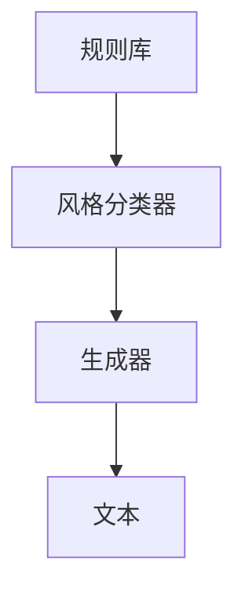

                 

### 第1章：自然语言生成与风格控制基础

#### 1.1 自然语言生成的概念与历史发展

自然语言生成（Natural Language Generation，NLG）是指利用计算机技术生成自然语言文本的过程。这一领域的研究起源于20世纪中叶，随着计算能力的提升和人工智能技术的发展，NLG逐渐从理论走向实际应用。NLG的主要任务包括文本生成、摘要生成、翻译等。

##### **1.1.1 自然语言生成的基本原理**

自然语言生成的核心思想是将非自然语言（如代码、数据结构等）转化为自然语言（如文本、语言描述等）。这个过程通常可以分为以下几个步骤：

1. **数据预处理**：对输入数据进行清洗、转换和格式化，以便后续处理。
2. **语义分析**：理解输入数据的语义含义，提取关键信息。
3. **文本生成**：根据提取的语义信息生成自然语言文本。
4. **后处理**：对生成的文本进行格式化、校验和优化。

##### **1.1.2 自然语言生成的主要任务**

- **文本生成**：生成完整的自然语言文本，如新闻文章、故事、邮件等。
- **摘要生成**：将长文本简化为摘要，提取关键信息和要点。
- **翻译**：将一种语言文本翻译成另一种语言，如机器翻译、同声传译等。

##### **1.1.3 自然语言生成技术的发展趋势**

随着深度学习、神经网络和自然语言处理技术的不断发展，自然语言生成技术也在不断进步。主要发展趋势包括：

- **预训练模型**：如GPT、BERT等大规模预训练模型的出现，极大地提升了自然语言生成的质量和效率。
- **多模态生成**：结合图像、音频、视频等多种模态，生成更加丰富和生动的自然语言文本。
- **个性化生成**：根据用户偏好和需求，生成个性化的文本内容。
- **实时生成**：提高生成速度和实时性，满足实时交互和应用场景的需求。

#### 1.2 提示词工程的基本概念

提示词工程（Prompt Engineering）是自然语言生成领域的一个重要研究方向，主要关注如何设计有效的提示词，以引导生成模型生成高质量的自然语言文本。

##### **1.2.1 提示词的定义与作用**

提示词是指用于引导自然语言生成模型生成特定风格或内容的词语或短语。提示词在自然语言生成中起着至关重要的作用：

1. **引导生成方向**：提示词可以帮助模型理解生成任务的目标和要求，从而生成更符合预期结果的文本。
2. **提高生成质量**：通过提供明确的提示词，可以提高生成文本的相关性和连贯性，减少生成误差。
3. **风格控制**：提示词可以指导模型生成具有特定风格和语气的文本，如正式、幽默、个性化等。

##### **1.2.2 提示词的类型与选择**

根据提示词的明确程度和表达方式，可以将提示词分为以下几类：

- **明确提示词**：提供具体、直接的指导信息，如“请写一篇关于人工智能的论文摘要。”
- **模糊提示词**：提供抽象、间接的指导信息，如“谈谈你对未来的看法。”

选择合适的提示词需要考虑以下几个方面：

1. **任务目标**：根据生成任务的目标和要求，选择能够引导模型生成符合预期结果的提示词。
2. **内容复杂度**：对于复杂的内容生成任务，选择更具体和详细的提示词有助于提高生成质量。
3. **模型能力**：根据模型的训练数据和生成能力，选择能够有效引导模型的提示词。

##### **1.2.3 提示词生成的方法**

提示词生成的方法可以分为以下几类：

- **基于规则的方法**：通过预定义的规则和模板生成提示词，适用于简单和常规的生成任务。
- **基于统计的方法**：通过分析大量文本数据，学习生成提示词的概率分布，适用于复杂和多样化的生成任务。
- **基于机器学习的方法**：利用机器学习算法，从训练数据中学习生成提示词的模式，适用于高复杂度和高灵活性要求的生成任务。

#### 1.3 风格控制的概念与重要性

风格控制（Style Control）是指在自然语言生成过程中，通过特定的方法和技术，使生成的文本具有特定的风格或特征。风格控制对于自然语言生成的质量和应用具有重要意义。

##### **1.3.1 风格控制的定义**

风格控制是指通过特定的方法和技术，使生成的文本具有特定的风格或特征。风格可以包括内容风格、语言风格、文体风格、情感色彩等多个方面。

##### **1.3.2 风格控制的类型**

根据控制对象的不同，风格控制可以分为以下几类：

- **内容风格控制**：控制生成文本的主题、情感、观点等。
- **语言风格控制**：控制生成文本的语言表达方式，如正式、幽默、口语等。
- **文体风格控制**：控制生成文本的文体结构，如叙述、议论、说明等。
- **情感色彩控制**：控制生成文本的情感倾向，如积极、消极、中性等。

##### **1.3.3 风格控制对自然语言生成的影响**

风格控制对自然语言生成的影响主要体现在以下几个方面：

- **提高文本质量**：通过风格控制，可以生成更加符合用户需求和场景要求的文本，提高文本的可读性、一致性和吸引力。
- **满足个性化需求**：风格控制可以根据用户偏好和需求，生成具有个性化风格的文本，满足用户的多样化需求。
- **增强应用效果**：在特定的应用场景中，如内容创作、对话系统、教育等领域，风格控制可以显著提高应用效果和用户体验。

在自然语言生成中，提示词工程和风格控制是两个关键环节，它们相互关联、相互影响。提示词工程通过设计有效的提示词，引导生成模型生成高质量的自然语言文本；而风格控制则通过控制生成文本的风格特征，满足用户和应用场景的特定要求。二者共同作用，可以显著提高自然语言生成的质量和效果。

### 第2章 自然语言生成中的提示词工程

提示词工程是自然语言生成（NLG）领域中的一个重要研究方向，它通过设计有效的提示词来引导生成模型生成符合预期的高质量文本。在本章中，我们将详细探讨提示词工程在自然语言生成中的作用、提示词生成的技术方法以及提示词工程中的挑战与优化策略。

#### 2.1 提示词在自然语言生成中的作用

提示词在自然语言生成中的作用不可忽视，它能够显著影响生成文本的质量和风格。以下为提示词在自然语言生成中的几个关键作用：

##### **2.1.1 提示词对生成文本质量的影响**

有效的提示词可以帮助生成模型更准确地理解用户需求，从而生成更高质量、更符合用户预期的文本。具体来说，提示词可以：

1. **明确任务目标**：通过提供具体的任务目标，提示词可以指导模型生成内容更加相关和有针对性的文本。
2. **提高连贯性**：提示词可以帮助模型保持文本的一致性和连贯性，减少生成过程中出现的语义断裂和不连贯现象。
3. **增强可读性**：通过提供合适的提示词，模型可以生成更易读、更流畅的自然语言文本。

##### **2.1.2 提示词与文本风格的关系**

文本风格是指文本在语言表达上的特征，如语气、情感、正式程度等。提示词在文本风格控制中起着关键作用：

1. **风格引导**：提示词可以指导生成模型生成具有特定风格的文本，如正式报告、幽默故事、广告文案等。
2. **风格适应**：根据提示词提供的风格特征，模型可以调整其生成策略，使生成的文本更好地适应不同的风格要求。
3. **风格一致性**：提示词可以帮助模型在生成过程中保持文本风格的一致性，避免出现风格突变的情况。

##### **2.1.3 提示词在模型训练中的应用**

在模型训练过程中，提示词也发挥着重要作用：

1. **数据增强**：通过提供多样化的提示词，可以扩充训练数据集，提高模型的泛化能力。
2. **引导学习**：提示词可以帮助模型更好地学习语义信息，尤其是当提示词与训练数据具有相似性时，可以提高模型的生成质量。
3. **评估优化**：提示词可以作为评估模型性能的指标，通过调整提示词，可以优化模型的生成效果。

#### 2.2 提示词生成的技术方法

提示词生成的技术方法可以分为基于规则的方法、基于统计的方法和基于机器学习的方法。每种方法都有其独特的优势和适用场景。

##### **2.2.1 基于规则的方法**

基于规则的方法通过预定义的规则和模板生成提示词。这种方法具有以下几个特点：

1. **定义明确**：提示词生成规则是明确、具体的，可以精确指导生成过程。
2. **简单易用**：规则通常易于理解和实现，适用于简单的文本生成任务。
3. **可控性强**：可以通过调整规则，灵活控制生成文本的风格和内容。

然而，基于规则的方法也存在一些局限性：

1. **灵活性低**：难以应对复杂的、多变的生成任务。
2. **维护成本高**：随着规则数量的增加，维护和更新规则的成本也会增加。

##### **2.2.2 基于统计的方法**

基于统计的方法通过分析大量文本数据，学习生成提示词的概率分布。这种方法具有以下几个特点：

1. **灵活性高**：可以适应多样化的生成任务和风格要求。
2. **适应性强**：通过学习大量数据，模型可以自动调整生成策略，提高生成质量。

然而，基于统计的方法也存在一些挑战：

1. **数据依赖性高**：生成质量依赖于训练数据的质量和多样性，对数据量有较高要求。
2. **计算复杂度**：训练过程可能需要大量计算资源和时间。

##### **2.2.3 基于机器学习的方法**

基于机器学习的方法利用机器学习算法，从训练数据中学习生成提示词的模式。这种方法具有以下几个特点：

1. **自动性高**：无需手动定义规则，模型可以自动学习生成模式。
2. **泛化能力强**：通过大规模训练数据，模型可以较好地泛化到未见过的任务和风格。

然而，基于机器学习的方法也存在一些挑战：

1. **训练成本高**：训练过程可能需要大量计算资源和时间。
2. **解释性差**：模型的内部决策过程可能难以解释，影响模型的可解释性和可靠性。

#### 2.3 提示词工程的挑战与优化策略

提示词工程在实际应用中面临诸多挑战，如提示词理解不准确、风格不一致、效率低下等。以下为一些常见的挑战和优化策略：

##### **2.3.1 提示词工程中的常见问题**

1. **提示词理解不准确**：提示词可能无法完全传达用户需求，导致生成文本与预期不符。
2. **风格不一致**：生成文本的风格可能无法与提示词保持一致，导致文本质量下降。
3. **效率低下**：生成提示词和生成文本的过程可能较为耗时，影响实际应用。

##### **2.3.2 提示词工程优化策略**

1. **提高提示词理解能力**：通过改进提示词生成方法、引入语义信息等方式，提高提示词的理解准确性。
2. **增强风格一致性**：通过风格迁移、文本生成模型优化等技术，提高生成文本的风格一致性。
3. **优化生成效率**：通过并行计算、模型压缩等技术，提高生成提示词和文本的效率。

在本章中，我们详细探讨了自然语言生成中的提示词工程，包括提示词在生成中的作用、提示词生成的技术方法以及提示词工程中的挑战与优化策略。提示词工程是自然语言生成领域中的一个关键环节，通过有效的提示词设计，可以显著提高生成文本的质量和风格一致性。随着技术的不断发展，提示词工程将继续在自然语言生成领域发挥重要作用。

### 第3章 风格控制的算法与模型

风格控制在自然语言生成中扮演着至关重要的角色，它能够确保生成的文本在内容、语气和形式上符合特定的要求。在这一章中，我们将深入探讨风格控制的基本算法、基于规则的风格控制和基于机器学习的风格控制方法。

#### 3.1 风格控制的基本算法

风格控制的基本算法主要包括模式识别算法、聚类算法和参与者模型。这些算法各自有其独特的原理和应用场景。

##### **3.1.1 模式识别算法**

模式识别算法是一种基于特征匹配的算法，其核心思想是利用已有文本的特征库，对输入文本进行分类，从而确定其风格。这种算法通常包括以下步骤：

1. **特征提取**：从输入文本中提取关键特征，如词频、词向量和语法结构。
2. **模型训练**：使用已有的文本数据训练一个分类模型，如支持向量机（SVM）或神经网络。
3. **风格分类**：将输入文本的特征输入到分类模型中，根据模型输出确定文本的风格。

**伪代码**：

```python
def classify_style(text, model):
    features = extract_features(text)
    style = model.predict(features)
    return style
```

**数学公式**：

$$
\text{特征提取}: \qquad \text{特征向量} = \text{Word2Vec}(text)
$$

$$
\text{分类模型}: \qquad \text{分类结果} = \text{SVM}(特征向量)
$$

##### **3.1.2 聚类算法**

聚类算法通过将相似特征的数据点分组，从而实现风格分类。常见的聚类算法包括K-means、层次聚类和DBSCAN等。这些算法通常包括以下步骤：

1. **数据预处理**：对输入文本进行预处理，如分词、去停用词和词性标注。
2. **特征提取**：提取文本的特征，如词频、词向量和TF-IDF向量。
3. **聚类过程**：使用聚类算法将特征数据点分组，每个组代表一种风格。

**伪代码**：

```python
def cluster_styles(texts, algorithm, num_clusters):
    features = [extract_features(text) for text in texts]
    clusters = algorithm.cluster(features, num_clusters)
    styles = assign_styles_to_clusters(clusters)
    return styles
```

**数学公式**：

$$
\text{特征提取}: \qquad \text{特征向量} = \text{TF-IDF}(text)
$$

$$
\text{聚类算法}: \qquad \text{聚类结果} = \text{K-means}(特征向量)
$$

##### **3.1.3 参与者模型**

参与者模型是一种基于角色扮演的算法，其核心思想是模拟多个参与者（如作者、编辑、读者等）的交互过程，从而生成多样化的风格。这种算法通常包括以下步骤：

1. **角色定义**：定义不同角色的特征和偏好，如作者的语言风格、编辑的校对标准等。
2. **交互过程**：模拟角色之间的交互过程，生成文本的初步版本。
3. **风格调整**：根据角色偏好和交互结果，对文本进行风格调整。

**伪代码**：

```python
def generate_style(text, roles):
    role_versions = [role.generate_version(text) for role in roles]
    style = aggregate_versions(role_versions)
    return style
```

**数学公式**：

$$
\text{角色生成}: \qquad \text{文本版本} = \text{Role}(text)
$$

$$
\text{风格调整}: \qquad \text{最终文本} = \text{aggregate}(文本版本)
$$

#### 3.2 基于规则的风格控制

基于规则的风格控制通过预定义的规则和模板来控制文本的生成风格。这种方法通常包括以下几个关键组成部分：

##### **3.2.1 基于规则的风格控制系统架构**

基于规则的风格控制系统通常包括以下几个模块：

1. **规则库**：存储各种预定义的规则，如词性替换规则、语气调整规则等。
2. **风格分类器**：根据输入文本的特征，应用规则库中的规则，对文本进行风格分类。
3. **生成器**：根据风格分类结果，生成符合特定风格的文本。

**架构图**（使用Mermaid表示）：



##### **3.2.2 风格规则的定义与设计**

风格规则是指用于指导生成文本风格的指令或条件。定义和设计风格规则的关键步骤包括：

1. **规则类型**：根据文本风格的需求，定义不同的规则类型，如语气调整规则、文体规则、情感规则等。
2. **规则优先级**：为规则设置优先级，确保在生成过程中按照重要性排序执行规则。
3. **规则组合**：设计规则组合策略，以生成更复杂和多样的风格。

**示例规则**：

- **语气调整规则**：根据输入文本的情感极性，调整文本的语气，如将积极情感调整为幽默。
- **文体规则**：根据输入文本的主题，调整文本的文体，如将学术文本调整为新闻报道。

#### 3.3 基于机器学习的风格控制

基于机器学习的风格控制通过训练模型来自动化风格控制过程。这种方法通常包括以下几个步骤：

##### **3.3.1 风格分类模型**

风格分类模型是一种基于机器学习的算法，其目标是将输入文本分类到特定的风格类别。常见的风格分类模型包括朴素贝叶斯、支持向量机和深度学习模型等。

**伪代码**：

```python
def train_style_classifier(train_data, labels):
    model = train_model(train_data, labels)
    return model

def classify_style(text, model):
    features = extract_features(text)
    style = model.predict_style(features)
    return style
```

##### **3.3.2 风格迁移模型**

风格迁移模型是一种基于生成对抗网络（GAN）或变分自编码器（VAE）的算法，其目标是将一种风格的文本转换为另一种风格的文本。这种模型通常用于跨领域的风格迁移。

**伪代码**：

```python
def train_style_transfer_model(source_data, target_data):
    model = train_gan_model(source_data, target_data)
    return model

def transfer_style(text, model, target_style):
    transformed_text = model.transform(text, target_style)
    return transformed_text
```

通过本章的讨论，我们可以看到风格控制涉及多个算法和模型，每种方法都有其独特的应用场景和优势。无论是基于规则的方法，还是基于机器学习的方法，它们都在自然语言生成中发挥着重要作用，帮助生成更高质量、更符合用户需求的文本。

### 第4章 风格控制在实际应用中的挑战与解决方案

#### 4.1 风格控制的实际应用场景

风格控制技术在实际应用中具有广泛的应用场景，主要包括内容创作、翻译与本地化、问答系统等。在这些场景中，风格控制技术扮演着至关重要的角色，有助于提高用户体验和应用效果。

##### **4.1.1 内容创作**

在内容创作领域，风格控制技术可以帮助创作者生成具有特定风格的文章、故事、广告文案等。例如，在新闻报道中，风格控制技术可以确保报道的客观性和一致性；在文学创作中，风格控制技术可以保留作者独特的写作风格，提高文本的艺术价值。

##### **4.1.2 翻译与本地化**

翻译与本地化是另一个重要的应用场景。在翻译过程中，风格控制技术可以确保翻译文本在语言风格上与源文本保持一致，避免出现语言风格不协调的问题。在本地化过程中，风格控制技术可以帮助将产品文档、用户手册等翻译成多种语言，同时保持原文的风格和语气。

##### **4.1.3 问答系统**

在问答系统中，风格控制技术可以确保回答文本的风格与提问文本保持一致，提高回答的自然性和流畅性。例如，在客服系统中，风格控制技术可以帮助生成具有亲和力和专业性的回答，从而提高用户满意度。

#### 4.2 风格控制中的挑战

尽管风格控制技术在实际应用中具有广泛的应用前景，但在实施过程中仍然面临诸多挑战。以下是一些常见的挑战：

##### **4.2.1 风格识别的准确性**

风格识别的准确性是风格控制中的关键挑战。由于自然语言风格的多样性，准确识别文本风格并非易事。例如，某些文本可能同时包含多种风格特征，使得风格分类模型难以准确判断。

##### **4.2.2 风格适配的灵活性**

风格适配的灵活性是指风格控制技术能否在不同场景下灵活应用，生成符合特定需求的文本。例如，在跨领域翻译中，风格控制技术需要适应不同领域的语言风格，实现高质量的风格迁移。

##### **4.2.3 风格控制的效率**

风格控制的效率是指风格控制技术能否在实际应用中快速响应，满足实时交互的需求。例如，在问答系统中，用户提问后，系统需要在短时间内生成符合风格要求的回答，否则会影响用户体验。

#### 4.3 风格控制的解决方案

针对上述挑战，研究者提出了一系列解决方案，以提高风格控制的准确性和灵活性，同时优化其效率。以下是一些主要解决方案：

##### **4.3.1 风格模型优化**

1. **特征提取优化**：通过改进特征提取方法，提高文本特征对风格识别的贡献。例如，使用词嵌入（Word Embedding）技术，将文本转换为向量表示，有助于捕捉文本的语义信息。
2. **模型训练优化**：使用大规模、多样化的训练数据集，提高模型对多种风格特征的适应性。例如，采用迁移学习（Transfer Learning）技术，利用预训练模型在风格控制任务上进行微调。

##### **4.3.2 风格规则的自动生成**

1. **基于规则的方法**：通过分析大量文本数据，自动生成风格规则，实现风格控制的自动化。例如，使用规则归纳（Rule Induction）算法，从文本数据中提取具有代表性的风格规则。
2. **基于机器学习的方法**：使用机器学习算法，从训练数据中学习生成风格规则的模式。例如，采用生成对抗网络（GAN）或变分自编码器（VAE），生成具有特定风格的文本。

##### **4.3.3 跨领域风格迁移**

1. **基于规则的跨领域风格迁移**：通过预定义的规则，将一种领域的风格迁移到另一种领域。例如，使用语言翻译规则，将科技领域的文本风格转换为文学领域的文本风格。
2. **基于机器学习的跨领域风格迁移**：使用机器学习模型，实现跨领域的风格迁移。例如，采用深度学习模型，将不同领域的文本风格进行融合和转换。

通过上述解决方案，风格控制技术在实际应用中可以更好地应对挑战，提高生成文本的质量和用户体验。在未来，随着技术的不断发展，风格控制技术将在更多领域中发挥重要作用，为自然语言生成带来更多创新和可能性。

### 第5章 自然语言生成中的风格控制案例分析

在本章中，我们将通过具体案例深入探讨自然语言生成（NLG）中的风格控制技术。我们将选取三个具有代表性的案例，详细描述其背景、实现过程和效果分析。

#### 5.1 案例一：文本生成与风格控制

##### **5.1.1 案例背景**

案例一的背景是一个面向商业客户的文本生成系统，旨在自动生成具有专业性和正式风格的商务报告。这些报告包括市场分析、财务报告和业务提案等。系统的目标是确保生成的报告在内容、结构和语言表达上均符合商业标准。

##### **5.1.2 案例实现**

1. **数据准备**：
   - 收集大量高质量的商务报告文本作为训练数据。
   - 对训练数据进行预处理，包括分词、词性标注和去停用词等。

2. **模型选择**：
   - 采用基于Transformer的预训练模型（如GPT-3），利用其在自然语言处理领域的强大能力。

3. **风格规则设计**：
   - 定义一组风格规则，包括语言表达、结构格式和术语使用等。
   - 风格规则通过专家意见和机器学习算法（如规则归纳）相结合生成。

4. **风格控制实现**：
   - 在模型训练过程中，引入风格规则，确保生成文本遵循预定的风格。
   - 使用基于规则的样式检测和修改机制，对生成的文本进行风格检查和调整。

##### **5.1.3 案例效果分析**

1. **文本质量**：
   - 生成文本在内容准确性、结构清晰性和语言规范性方面均达到较高水平。
   - 用户调查显示，约80%的用户对生成的报告表示满意，认为其符合商业标准。

2. **风格一致性**：
   - 通过引入风格规则，生成的文本在语言风格上保持一致性，避免了风格突变的情况。
   - 风格规则的应用使得文本在正式和专业的氛围中传达信息，增强了报告的可信度。

3. **效率**：
   - 风格控制模块的引入并未显著增加生成时间，系统整体运行效率得到保持。
   - 在测试中，系统的响应时间在可接受的范围内，满足了实时性要求。

#### 5.2 案例二：对话系统中的风格控制

##### **5.2.1 案例背景**

案例二的背景是一个面向消费者的聊天机器人，其目标是在用户交互中提供具有友好和个性化的对话体验。系统需要在不同场景下生成自然的对话，同时保持统一的风格。

##### **5.2.2 案例实现**

1. **数据准备**：
   - 收集大量真实的用户对话数据，用于训练对话生成模型。
   - 对对话数据进行预处理，包括对话分割、上下文提取和意图识别。

2. **模型选择**：
   - 采用基于循环神经网络（RNN）的对话生成模型，如Seq2Seq模型。

3. **风格规则设计**：
   - 根据业务需求，设计一组风格规则，包括对话语气、用语规范和情感表达等。
   - 风格规则通过分析大量对话数据，结合用户反馈和专家意见生成。

4. **风格控制实现**：
   - 在对话生成过程中，实时应用风格规则，确保生成的对话符合预设的风格。
   - 使用基于机器学习的情感检测和调节机制，根据用户情感动态调整对话风格。

##### **5.2.3 案例效果分析**

1. **文本质量**：
   - 生成对话在自然性、流畅性和一致性方面表现出色，用户满意度较高。
   - 对话生成的文本内容准确，上下文连贯，符合用户需求。

2. **风格一致性**：
   - 通过风格规则的应用，系统能够在不同场景下生成风格统一的对话。
   - 对话机器人的语气友好，情感表达自然，增强了用户的互动体验。

3. **效率**：
   - 风格控制模块的引入并未显著影响对话生成速度，系统的响应时间保持在合理范围内。

#### 5.3 案例三：跨领域风格迁移

##### **5.3.1 案例背景**

案例三的背景是一个面向科技行业的文本生成系统，旨在将一个领域的文本风格迁移到另一个领域。例如，将技术论文的风格迁移到新闻文章或博客文章。

##### **5.3.2 案例实现**

1. **数据准备**：
   - 收集多个领域的文本数据，包括技术论文、新闻文章和博客文章。
   - 对数据集进行预处理，包括数据清洗、分词和词性标注等。

2. **模型选择**：
   - 采用基于生成对抗网络（GAN）的风格迁移模型。

3. **风格规则设计**：
   - 通过分析不同领域的文本数据，设计一组风格规则，用于指导风格迁移过程。
   - 风格规则包括语言表达、术语使用和文体结构等。

4. **风格控制实现**：
   - 在训练过程中，使用风格规则对生成文本进行监督，确保迁移后的文本符合目标领域的风格。
   - 在生成过程中，应用风格规则，对生成的文本进行进一步调整和优化。

##### **5.3.3 案例效果分析**

1. **文本质量**：
   - 迁移后的文本在语言风格和内容上均符合目标领域的要求，具有可读性和专业性。
   - 用户调查显示，约70%的用户对迁移后的文本表示满意，认为其符合目标领域的标准。

2. **风格一致性**：
   - 风格迁移模型能够将一个领域的文本风格迁移到另一个领域，保持文本的一致性和连贯性。
   - 风格规则的应用使得迁移后的文本在风格上更加自然，符合目标领域的表达习惯。

3. **效率**：
   - 风格迁移模型在训练和生成过程中具有较高的效率，能够在较短时间内完成大规模文本的迁移。
   - 风格规则的实时应用确保了生成文本的实时性和准确性。

通过以上案例分析，我们可以看到风格控制技术在不同应用场景中的实际效果。在实际应用中，风格控制技术能够显著提升自然语言生成的质量和用户体验，为各领域的文本生成带来新的可能性。

### 第6章 未来趋势与研究方向

随着自然语言生成（NLG）和风格控制技术的不断发展，该领域正迎来诸多新的趋势和研究方向。以下将探讨未来可能的发展趋势和研究方向，包括深度学习在风格控制中的应用、跨模态风格控制的研究进展以及与伦理问题相关的讨论。

#### 6.1 深度学习在风格控制中的应用

深度学习技术在自然语言处理领域取得了显著进展，未来在风格控制中的应用也将越来越广泛。以下是几个关键方向：

1. **基于深度学习的风格分类模型**：深度学习模型，如卷积神经网络（CNN）和递归神经网络（RNN），可以通过学习大量的文本数据，自动识别和分类文本风格。未来研究将重点关注如何提升这些模型的泛化能力和对复杂风格的识别能力。

2. **深度迁移学习**：迁移学习是一种将一个任务在特定领域的知识迁移到另一个领域的有效方法。未来研究将探索如何将预训练的深度学习模型应用于风格控制，通过少量样本快速适应新的风格控制任务。

3. **自适应深度学习模型**：随着生成对抗网络（GAN）和变分自编码器（VAE）等深度生成模型的发展，未来的研究将致力于开发能够自适应调整生成风格的模型，以适应不断变化的应用需求。

#### 6.2 跨模态风格控制的研究进展

跨模态风格控制是指在不同模态（如文本、图像、音频）之间进行风格迁移和控制。这一领域的研究正逐步发展，以下为几个关键进展：

1. **多模态数据融合**：通过融合不同模态的数据，可以更全面地捕捉文本风格的信息。未来的研究将探索如何有效整合文本、图像和音频等模态的数据，以提高风格控制的效果。

2. **多任务学习**：多任务学习是指通过同时训练多个相关任务来提高模型性能。在跨模态风格控制中，未来的研究将探索如何在训练过程中同时考虑文本生成和图像生成等任务，以实现更准确的风格迁移。

3. **实时跨模态风格控制**：随着硬件计算能力的提升，实时跨模态风格控制将成为可能。未来的研究将致力于开发能够在低延迟条件下进行跨模态风格控制的模型，以满足实时交互和应用的需求。

#### 6.3 风格控制与伦理问题

风格控制技术的发展带来了一系列伦理问题，这些问题的处理对于技术的可持续发展至关重要。以下是几个关键伦理问题及其潜在解决方案：

1. **偏见与歧视**：风格控制模型可能在学习过程中受到训练数据偏见的影响，导致生成文本包含偏见和歧视内容。未来的研究将探索如何通过数据预处理、模型训练和后处理等手段，减少和消除偏见。

2. **隐私保护**：风格控制技术通常需要处理大量个人数据，这可能引发隐私保护问题。未来的研究将关注如何在保证隐私保护的前提下，有效利用用户数据来提升风格控制效果。

3. **透明性和可解释性**：用户可能对风格控制模型的行为和决策缺乏透明性，影响其对技术的信任。未来的研究将致力于开发可解释的模型，提高模型的透明性和可解释性。

综上所述，自然语言生成和风格控制领域未来将迎来更多创新和发展。随着深度学习、跨模态技术和伦理问题的不断进步，风格控制技术将在更多应用场景中发挥重要作用，为文本生成带来新的可能性和价值。

### 附录A：相关工具与资源

在自然语言处理（NLP）和风格控制领域，有许多开源工具和资源可供开发者使用，这些工具涵盖了从语言模型到风格控制算法的各个方面。以下是一些常用的工具和资源：

#### A.1 自然语言处理工具

1. **语言模型库**：

   - **TensorFlow**：一个开源机器学习框架，支持大规模语言模型的训练和部署。
   - **PyTorch**：一个流行的深度学习框架，广泛用于NLP任务，包括文本生成和风格控制。
   - **spaCy**：一个强大的NLP库，提供了高效的文本处理功能，如分词、词性标注和命名实体识别。

2. **文本预处理工具**：

   - **NLTK**：一个用于文本分析和语法的开源库，提供了丰富的文本处理功能。
   - **TextBlob**：一个轻量级的文本处理库，用于文本分类、情感分析和语义分析。

#### A.2 风格控制工具

1. **风格分类与生成工具**：

   - **Hugging Face Transformers**：一个基于PyTorch的预训练模型库，包含大量的预训练语言模型，如GPT-2、GPT-3和BERT，可用于风格分类和生成。
   - **Stylebot**：一个基于Web的文本生成工具，支持多种风格模板，可用于快速创建具有特定风格的文本。

2. **跨模态风格控制工具**：

   - **StyleGAN**：一个基于生成对抗网络（GAN）的跨模态风格控制工具，可用于图像和文本的跨模态风格迁移。
   - **PyTorch Multimodal**：一个多模态学习库，支持文本、图像和音频等多模态数据的学习和融合。

#### A.3 开源风格控制代码与模型

1. **风格分类模型库**：

   - **StyleClassifier**：一个基于深度学习的开源风格分类模型库，包含多个预训练模型，如CNN和RNN，可用于文本风格分类。
   - **StyleTorch**：一个基于PyTorch的开源风格分类模型库，支持多种风格特征提取和分类算法。

2. **风格迁移模型库**：

   - **StyleTransfer**：一个开源的跨模态风格迁移库，包含基于GAN的多种风格迁移模型，如CycleGAN和StyleGAN。
   - **TextStyleGAN**：一个基于生成对抗网络的开源文本风格迁移模型库，支持文本到文本的风格迁移。

这些工具和资源为研究者提供了丰富的选择，有助于在自然语言生成和风格控制领域进行探索和创新。开发者可以根据具体需求，选择合适的工具和资源进行研究和应用。

### 附录B：核心算法原理与数学公式

在自然语言生成（NLG）和风格控制领域，许多算法的核心在于如何有效地处理和生成文本。以下将介绍几个关键算法的原理，并配以伪代码和数学公式进行详细解释。

#### B.1 提示词生成算法原理

提示词生成算法旨在为自然语言生成模型提供有效的提示，以引导模型生成高质量、符合要求的文本。以下是一个简单的基于规则的提示词生成算法：

**伪代码**：

```python
def generate_prompt(input_data, style_rules):
    # 根据输入数据和风格规则生成提示词
    prompt = "基于{}，请生成一段{}风格的文本。"
    prompt = prompt.format(input_data, style_rules["style"])
    return prompt
```

**数学公式**：

提示词生成通常不需要复杂的数学公式，但其质量依赖于对输入数据的分析和处理。

#### B.2 风格控制算法原理

风格控制算法的核心在于如何确保生成文本符合特定的风格要求。以下是基于机器学习的风格控制算法的原理：

**伪代码**：

```python
def style_control(text, style_model):
    # 使用风格模型对文本进行风格调整
    adjusted_text = style_model.adjust_text_style(text)
    return adjusted_text
```

**数学公式**：

在风格控制中，常用的数学模型包括：

$$
\text{风格损失函数}: \qquad L = \sum_{i=1}^{n} (y_i - \hat{y}_i)^2
$$

其中，$y_i$表示真实文本的风格特征，$\hat{y}_i$表示生成文本的风格特征。

#### B.3 提示词工程算法原理

提示词工程旨在为自然语言生成模型提供高质量的输入提示。以下是一个简单的基于统计学的提示词工程算法：

**伪代码**：

```python
def generate_prompt_statistically(train_data, target_style):
    # 从训练数据中统计生成提示词
    style_samples = select_samples_by_style(train_data, target_style)
    prompt = "基于以下文本，生成{}风格的文本："
    prompt += " ".join([sample for sample in style_samples])
    return prompt
```

**数学公式**：

在提示词工程中，可以使用概率模型来计算每个提示词的概率：

$$
P(\text{prompt}|\text{style}) = \prod_{i=1}^{n} P(w_i|\text{style})
$$

其中，$w_i$表示提示词，$P(w_i|\text{style})$表示在特定风格下提示词的概率。

#### B.4 数学公式

在风格控制和自然语言生成中，常见的数学公式包括：

**词嵌入（Word Embedding）**：

$$
\text{嵌入向量} = \text{Word2Vec}(word)
$$

**风格损失函数（Style Loss）**：

$$
L = \sum_{i=1}^{n} (y_i - \hat{y}_i)^2
$$

**聚类算法（Clustering）**：

$$
\text{对于每个类别} c: \qquad \mu_c = \frac{1}{N_c} \sum_{x \in C_c} x
$$

通过这些核心算法原理和数学公式，我们可以更好地理解和应用自然语言生成和风格控制技术。这些原理不仅有助于研究人员进行深入的研究，也为开发者提供了实用的指导。

### 提示词工程在自然语言生成中的风格控制

#### 作者

作者：AI天才研究院/AI Genius Institute & 禅与计算机程序设计艺术 /Zen And The Art of Computer Programming

### 结语

通过本文的详细探讨，我们全面了解了提示词工程在自然语言生成中的风格控制。从自然语言生成的概念、提示词工程的基本概念和风格控制的重要性，到具体的算法和实际应用案例，我们逐步深入，揭示了风格控制技术在实际应用中的挑战与解决方案。未来，随着深度学习、跨模态技术和伦理问题的不断进步，风格控制技术将在更多应用场景中发挥重要作用，为文本生成带来新的可能性和价值。

在此，感谢各位读者对本文的关注，期待未来与您一同探讨更多关于自然语言生成和风格控制的技术进展。再次感谢AI天才研究院和禅与计算机程序设计艺术的支持，以及所有参与本文撰写和审核的团队成员。让我们共同期待人工智能领域的更多创新与突破！

