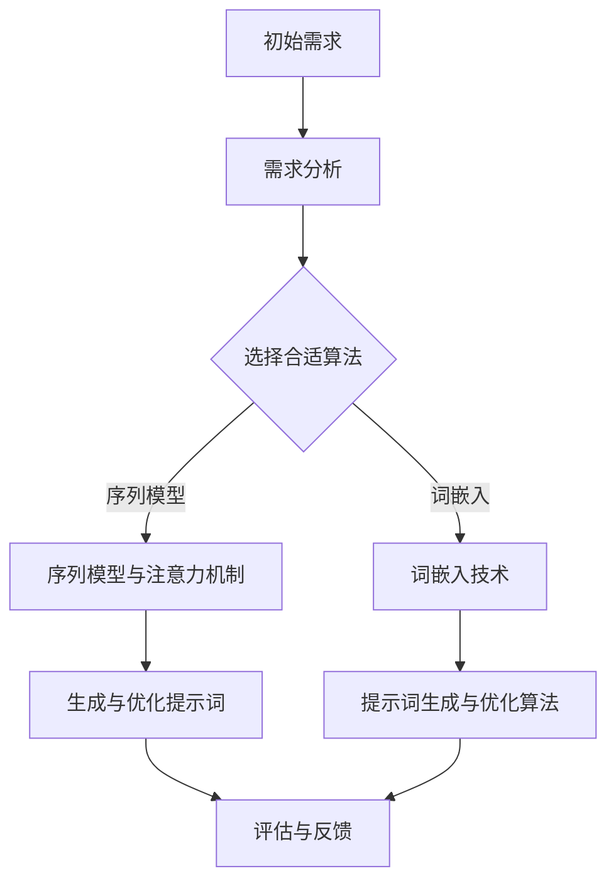
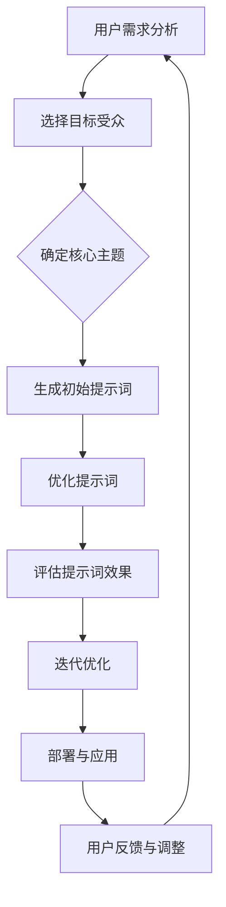

                 

### 提示词设计：增强AI创意营销策划能力

#### 关键词：
- 提示词设计
- AI创意营销
- 营销策划
- 自然语言处理
- 算法原理
- 数学模型
- 实战案例

#### 摘要：
本文旨在探讨提示词设计在增强AI创意营销策划能力中的关键作用。通过深入分析提示词设计的核心概念、理论基础、算法原理，以及具体应用场景，本文将揭示如何利用提示词设计提升AI在创意营销领域的表现。此外，本文将通过实际案例和代码实现，展示提示词设计在开发环境中的具体应用，为从业者提供实用的指导。

## 《提示词设计：增强AI创意营销策划能力》目录大纲

### 第一部分：理解提示词设计

#### 第1章：提示词设计概述
- 1.1 提示词设计的重要性
  - 提示词在AI和营销中的角色
  - 提示词设计的挑战与机遇
- 1.2 提示词设计的核心要素
  - 清晰性、相关性、创新性
  - 提示词的种类与应用场景

#### 第2章：AI与创意营销策划的融合
- 2.1 AI在营销领域的应用
  - 自然语言处理与AI营销
  - 数据分析在营销策略中的作用
- 2.2 创意营销策划的理念与原则
  - 创意思维与营销策略
  - 创意策划流程与方法

#### 第3章：核心概念与架构
- 3.1 提示词设计的理论基础
  - 提示词与语义理解
  - 提示词在AI模型中的应用
- 3.2 提示词设计的Mermaid流程图
  - 提示词生成与优化的流程
  - 提示词应用在不同场景下的架构设计

### 第二部分：提示词设计技术

#### 第4章：自然语言处理技术基础
- 4.1 词嵌入技术
  - 词向量与语义表示
  - 常见的词嵌入模型
- 4.2 序列模型与注意力机制
  - RNN、LSTM、GRU
  - 注意力机制的作用与实现

#### 第5章：提示词设计算法原理
- 5.1 提示词生成算法
  - 生成对抗网络（GAN）
  - 强化学习在提示词生成中的应用
- 5.2 提示词优化算法
  - 对比学习与无监督学习
  - 多样性与有效性评估

#### 第6章：数学模型与公式
- 6.1 提示词设计的数学模型
  - 相关性度量
  - 创新性评估公式
- 6.2 描述与举例
  - 算法模型的工作原理
  - 公式在提示词设计中的应用实例

### 第三部分：实战与应用

#### 第7章：AI创意营销实战案例
- 7.1 案例研究：品牌宣传
  - 提示词设计与营销效果分析
  - 案例背后的提示词策略
- 7.2 案例研究：产品推广
  - 提示词设计与消费者行为分析
  - 成功的提示词优化方法

#### 第8章：开发环境与代码实现
- 8.1 开发环境搭建
  - 数据集准备与预处理
  - 工具与库的选择
- 8.2 提示词生成与优化代码解析
  - 提示词生成算法代码实现
  - 提示词优化算法代码实现

#### 第9章：总结与展望
- 9.1 提示词设计总结
  - 经验教训与最佳实践
  - 提示词设计的未来趋势
- 9.2 AI创意营销策划能力的提升
  - 培养创新思维与策略思考
  - 持续学习与技能提升

### 附录
#### 附录A：工具与资源推荐
- A.1 开发工具与框架
  - TensorFlow、PyTorch等
- A.2 在线资源与教程
  - 提示词设计相关的论文、书籍和在线课程
- A.3 社群与社区
  - 加入AI创意营销社群，交流学习经验

### 核心概念与联系：提示词设计的Mermaid流程图


### 提示词设计概述
#### 1.1 提示词设计的重要性
提示词设计在人工智能（AI）和营销领域的角色至关重要。它不仅影响着AI模型的性能，还直接决定了营销策略的有效性。以下从多个方面阐述提示词设计的重要性。

首先，从AI的角度来看，提示词是AI模型理解和生成内容的引导。在自然语言处理（NLP）任务中，提示词充当了与用户和系统交互的桥梁。一个精心设计的提示词能够引导模型生成更加精准、贴近用户需求的内容。例如，在聊天机器人中，一个好的提示词可以使对话更加自然、流畅，提升用户体验。

其次，从营销的角度来看，提示词设计是创意营销策略的关键环节。通过精确的提示词设计，营销人员可以吸引目标用户的注意力，激发他们的兴趣，从而提高营销效果。特别是在内容营销、搜索引擎优化（SEO）和社交媒体营销中，提示词的合理使用可以显著提升内容的曝光率和点击率。

然而，提示词设计并非易事，它面临着诸多挑战。首先，提示词需要具备高度的清晰性和相关性，这要求设计者对目标受众有深入的了解。其次，创新性是提示词设计的重要特征，一个过于常规或陈旧的提示词很难引起用户的兴趣。此外，设计者还需要考虑语言的多样性和文化背景的差异，以确保提示词在全球范围内的适用性。

尽管挑战重重，但提示词设计也为AI和营销带来了机遇。随着AI技术的不断发展，特别是NLP和生成对抗网络（GAN）等算法的进步，设计高质量的提示词变得更加可行。同时，大数据和机器学习的应用使得营销人员能够更好地分析用户行为，从而设计出更加个性化的提示词。

总的来说，提示词设计不仅对AI模型的性能有直接影响，还关乎营销策略的成功。通过科学合理的设计，提示词能够帮助AI更好地理解用户需求，同时助力营销人员实现更加精准和高效的营销目标。

#### 1.2 提示词设计的核心要素
提示词设计的核心要素主要包括清晰性、相关性和创新性。这三个要素相互关联，共同决定了提示词的质量和效果。

首先是**清晰性**。清晰的提示词能够明确传达信息，避免歧义和误解。在AI应用中，清晰的提示词有助于模型更好地理解用户的意图，从而生成更加准确和相关的回应。例如，在聊天机器人中，一个明确的提示词“请告诉我您需要的服务类型”比“有什么可以帮助您吗？”更能引导用户提供具体的信息。

其次是**相关性**。相关性是指提示词与用户需求或目标内容之间的紧密程度。高度相关的提示词能够有效吸引目标用户的注意力，提高信息的传递效率。例如，在一个电商网站的商品推荐系统中，一个与用户浏览历史或购买行为高度相关的提示词“您可能还喜欢这些商品”能够显著提升用户的购买意愿。

最后是**创新性**。创新性是提示词设计的重要特征，一个富有创意的提示词能够突破常规，激发用户的兴趣和好奇心。在激烈的市场竞争中，独特的提示词设计能够为品牌和产品赢得更多的关注。例如，在社交媒体营销中，一个新颖且引人入胜的标题“独家揭秘：如何用AI打造完美营销策略？”能够迅速吸引用户点击，提高内容的传播效果。

在实际应用中，这三个要素并非孤立存在，而是相互交织、共同作用。一个高质量的提示词通常需要在清晰性、相关性和创新性之间找到平衡。例如，在撰写一篇技术博客文章时，一个清晰且相关的标题如“深度学习在图像识别中的应用”能够准确传达文章的核心内容，而一个具有创新性的副标题如“打破传统，探索图像识别新境界”则能够吸引更多读者的兴趣。

总之，清晰性、相关性和创新性是提示词设计的核心要素，它们共同决定了提示词的质量和效果。通过科学合理的设计，提示词能够更好地引导用户，提升AI模型的性能，并助力营销策略的成功实施。

### AI与创意营销策划的融合
#### 2.1 AI在营销领域的应用
人工智能（AI）技术在营销领域的应用日益广泛，其主要优势体现在自然语言处理（NLP）和数据分析两个方面。通过结合这些技术，营销人员能够制定出更加精准和高效的营销策略。

首先，**自然语言处理**在AI营销中发挥了重要作用。NLP技术能够使计算机理解和生成人类语言，从而实现与用户的智能交互。例如，聊天机器人利用NLP技术能够自动理解用户的提问并给出适当的回答，提供个性化服务。此外，NLP还可以用于情感分析，通过对社交媒体上用户评论的情感倾向进行分析，帮助企业了解消费者的真实想法和需求，从而优化产品和服务。

其次，**数据分析**在营销策略中的作用不可忽视。通过收集和分析大量的用户数据，营销人员可以更深入地了解消费者的行为模式、偏好和需求。基于这些数据，企业可以制定出更加精准的市场细分策略，实现精准营销。例如，通过分析用户的浏览历史和购买行为，电商网站可以为用户提供个性化的商品推荐，提高购买转化率。此外，数据分析还可以用于预测市场趋势和消费者行为，帮助企业提前布局，抢占市场先机。

具体应用场景方面，AI技术在营销中有着广泛的应用。例如，在**内容营销**中，AI可以通过自然语言处理技术生成高质量的内容，如文章、博客和社交媒体帖子，从而提高内容的多样性和覆盖面。在**搜索引擎优化（SEO）**中，AI技术可以帮助企业分析关键词的竞争情况和用户搜索习惯，优化网站结构和内容，提高搜索引擎排名。在**广告投放**中，AI技术可以根据用户的兴趣和行为进行精准投放，提高广告的点击率和转化率。

总的来说，AI在营销领域的应用不仅提升了营销效率，还带来了新的营销方式和策略。通过自然语言处理和数据分析，营销人员能够更好地理解用户需求，制定出更加精准和个性化的营销策略，从而提高营销效果。

#### 2.2 创意营销策划的理念与原则
创意营销策划是现代市场营销中不可或缺的一环，其核心在于通过创新的思维和策略，吸引目标受众的注意力，从而实现品牌传播和销售目标。以下是创意营销策划的一些关键理念与原则：

首先，**创意思维**是创意营销策划的基石。创意思维强调跳出传统框架，以独特和创新的方式思考问题。营销人员需要不断寻求新的灵感，挑战常规，通过独特的创意概念和视觉设计，为品牌注入生命力。例如，红牛品牌的“能量饮料”定位就是通过一系列极具创意的广告和营销活动，成功塑造了其年轻、活力、极限运动的品牌形象。

其次，**消费者洞察**是创意营销策划的重要原则。了解消费者的需求和痛点，是设计出能够引起共鸣的营销策略的关键。通过市场调研、数据分析等手段，营销人员可以深入了解目标受众的行为模式、价值观和兴趣点，从而设计出更加精准和有效的营销内容。例如，Nike的“Just Do It”口号就是基于对消费者追求自我实现和积极生活的深刻洞察，成功激发了用户的共鸣和参与。

再次，**情感共鸣**是创意营销策划的核心目标。情感共鸣不仅仅是传递信息，更是与消费者建立情感联系，使其对品牌产生深厚的情感依赖。一个成功的创意营销活动往往能够触动消费者的情感，使其产生共鸣。例如，苹果公司的“iPhone”产品发布会，通过精美的设计和激动人心的演讲，成功激发了用户的期待和购买欲望。

此外，**故事化营销**也是一种有效的创意营销策略。通过讲述品牌故事，营销人员可以将品牌理念和价值传递给消费者，使其更加深入地了解品牌。例如，可口可乐的“分享幸福”品牌故事，通过讲述普通人的美好故事，成功传递了品牌的情感价值，赢得了消费者的喜爱。

最后，**互动体验**是提升消费者参与度和忠诚度的关键。通过线上线下结合的互动体验，营销人员可以与消费者建立紧密的联系，增强品牌的亲和力。例如，可口可乐的“瓶身定制”活动，允许消费者自定义瓶身图案，从而实现了与消费者的深度互动，提升了品牌的用户粘性。

总的来说，创意营销策划需要融合创意思维、消费者洞察、情感共鸣、故事化营销和互动体验等多种元素，通过独特且富有吸引力的策略，实现品牌价值的最大化。只有不断探索和创新，才能在激烈的市场竞争中脱颖而出。

### 核心概念与架构
#### 3.1 提示词设计的理论基础
提示词设计在AI模型中的应用具有重要的理论基础，主要包括语义理解和提示词在AI模型中的具体应用两个方面。

首先是**语义理解**。语义理解是指计算机对自然语言文本中词汇和句子的含义进行理解和解释的能力。在提示词设计中，语义理解是关键的一环。通过语义理解，AI模型可以准确地理解用户的意图和需求，从而生成高质量的回应。例如，在聊天机器人中，一个包含特定语义的提示词“请告诉我您的问题”，可以帮助模型快速识别用户的需求，从而提供精准的回答。

其次是**提示词在AI模型中的应用**。提示词的设计直接影响AI模型的表现。高质量的提示词能够引导模型生成更加相关和有针对性的内容。以下是一些常见的应用场景：

1. **文本生成**：在文本生成任务中，提示词可以作为一个起始点，引导模型生成连贯、有逻辑的文本。例如，在生成新闻文章、博客文章和社交媒体帖子时，通过设计适当的提示词，可以确保文本内容与主题高度相关。

2. **对话系统**：在对话系统中，提示词用于引导对话流程。通过设计恰当的提示词，可以确保对话系统与用户的互动更加自然和流畅。例如，一个用于面试的聊天机器人，可以使用如“请您先做一个自我介绍”这样的提示词，引导用户提供所需信息。

3. **推荐系统**：在推荐系统中，提示词可以用于生成个性化的推荐内容。通过分析用户的浏览历史和偏好，设计相应的提示词，可以提升推荐系统的准确性和用户满意度。例如，电商网站可以使用如“根据您的浏览记录，我们为您推荐以下商品”这样的提示词，提高用户的购买转化率。

4. **翻译与本地化**：在翻译和本地化任务中，提示词有助于确保翻译结果的准确性和文化适应性。通过设计符合目标语言和文化背景的提示词，可以提升翻译质量，避免误解和歧义。

总之，提示词设计在AI模型中的应用具有重要的理论基础和实际意义。通过语义理解和提示词的合理设计，AI模型可以更好地理解用户需求，生成高质量的内容，从而提升AI在各个应用领域的性能。

#### 3.2 提示词设计的Mermaid流程图
为了更好地展示提示词设计的流程，我们使用Mermaid图形语言绘制了一个详细的流程图。以下是一个简化的版本，具体步骤和细节将在后续章节中详细展开。



1. **用户需求分析**：首先，分析用户需求，明确目标受众和核心主题。
2. **选择目标受众**：根据用户需求，选择具体的目标受众群体。
3. **确定核心主题**：明确营销活动的核心主题，为后续的提示词设计提供指导。
4. **生成初始提示词**：基于核心主题和目标受众，生成初始提示词。
5. **优化提示词**：对初始提示词进行优化，提高其清晰性、相关性和创新性。
6. **评估提示词效果**：评估优化后的提示词在实际应用中的效果。
7. **迭代优化**：根据评估结果，对提示词进行进一步优化。
8. **部署与应用**：将优化后的提示词部署到实际应用场景中。
9. **用户反馈与调整**：收集用户反馈，根据用户反馈进行调整和改进。

通过这个流程图，我们可以清晰地看到提示词设计的各个环节，从而在实际操作中更加系统地推进设计工作。

### 自然语言处理技术基础
#### 4.1 词嵌入技术
词嵌入技术是自然语言处理（NLP）领域的一项重要技术，它通过将词汇映射到高维向量空间，实现词汇的语义表示。词嵌入不仅能够提升NLP任务的性能，还能增强模型对语义信息的捕捉和理解能力。

首先，**词向量与语义表示**是词嵌入技术的核心概念。词向量是将词汇转换为数值向量的过程，每个向量都代表词汇的语义特征。在词嵌入模型中，词汇之间的相似性可以通过向量之间的距离来度量。例如，如果“狗”和“猫”在语义上相似，则它们对应的词向量应具有较小的欧氏距离。常见的词向量模型包括Word2Vec、GloVe和FastText等。

**Word2Vec**模型是一种基于神经网络的词嵌入方法，通过训练大量的文本数据，生成词汇的词向量表示。Word2Vec模型主要有两种训练方法：连续词袋（CBOW）和跳字模型（Skip-Gram）。CBOW模型通过上下文词汇预测中心词，而Skip-Gram模型则是通过中心词预测上下文词汇。

**GloVe**（Global Vectors for Word Representation）是一种基于矩阵分解的词嵌入方法。GloVe模型通过训练词汇的共现矩阵，将词汇映射到低维向量空间，从而生成词向量。GloVe模型的核心思想是词汇的语义表示应与其共现关系相一致，即词汇在语义上相似时，它们的共现关系也应相似。

**FastText**是一种基于字符级和词级的深度学习模型。FastText通过将词汇拆分为字符序列，然后将字符序列映射到词向量，从而生成词汇的语义表示。FastText在处理长文本和多义词时表现优异，能够更好地捕捉词汇的语境和语义。

其次，**常见的词嵌入模型**包括Word2Vec、GloVe和FastText等。**Word2Vec**模型由于其简单易实现的特性，在早期词嵌入研究中得到广泛应用。**GloVe**模型通过矩阵分解的方法，能够在大规模数据集上生成高质量的词向量表示。**FastText**模型则通过字符级和词级的组合，提高了词嵌入的准确性和泛化能力。

总之，词嵌入技术在NLP领域具有重要意义。通过将词汇映射到高维向量空间，词嵌入能够增强模型对语义信息的捕捉和理解能力，从而提升NLP任务的性能。常见的词嵌入模型如Word2Vec、GloVe和FastText等，为NLP应用提供了丰富的工具和选择。

#### 4.2 序列模型与注意力机制
序列模型和注意力机制是自然语言处理（NLP）中的核心技术，广泛应用于语言生成、翻译和文本分类等任务。序列模型通过处理序列数据，捕捉时间维度上的信息变化，而注意力机制则进一步提升了模型在处理长序列数据时的性能。

首先，**RNN、LSTM和GRU**是三种常见的序列模型。

**RNN（Recurrent Neural Network）**是最早应用于序列数据处理的神经网络模型。RNN通过在网络中引入循环结构，使得网络能够记忆和利用前面的输入信息，从而在处理序列数据时具有优势。然而，传统RNN在处理长序列数据时存在梯度消失或爆炸的问题，导致模型性能不佳。

**LSTM（Long Short-Term Memory）**模型是RNN的一种改进，通过引入门控机制，解决了RNN在长序列数据处理中的问题。LSTM中的遗忘门、输入门和输出门分别控制信息的遗忘、输入和输出，从而有效捕捉长期依赖关系。

**GRU（Gated Recurrent Unit）**是另一种改进的RNN模型，相较于LSTM，GRU结构更加简洁，参数更少，计算效率更高。GRU通过更新门和重置门，结合了LSTM的门控机制，从而在保持性能的同时提高了计算效率。

其次，**注意力机制（Attention Mechanism）**是提升序列模型性能的重要技术。注意力机制通过动态分配权重，使模型在处理长序列数据时能够关注重要的信息，从而提高模型的准确性和效率。

**软注意力**是一种常见的注意力机制，通过计算输入序列中每个元素与目标元素的相关性，为每个元素分配一个权重，然后将这些权重与输入序列进行加权求和，得到最终的输出。软注意力机制的一个优点是能够自适应地关注序列中的关键信息，从而提高模型的泛化能力。

**硬注意力**机制则通过将输入序列压缩为一个固定长度的向量，然后计算这个向量与目标元素的相关性。硬注意力机制的计算复杂度较低，适用于实时处理场景。

总之，序列模型和注意力机制是NLP领域的核心技术，广泛应用于语言生成、翻译和文本分类等任务。RNN、LSTM和GRU通过处理序列数据，捕捉时间维度上的信息变化，而注意力机制通过动态分配权重，进一步提升了模型在处理长序列数据时的性能。这些技术为NLP应用提供了强大的工具和基础。

### 提示词设计算法原理
#### 5.1 提示词生成算法
提示词生成算法在自然语言处理和创意营销领域具有广泛应用。通过生成高质量的提示词，可以提升AI模型的性能，实现更加精准和个性化的营销策略。以下是几种常见的提示词生成算法及其原理。

**生成对抗网络（GAN）**是一种基于博弈理论的生成模型，通过生成器和判别器的对抗训练，生成高质量的提示词。在GAN中，生成器G从噪声分布中生成提示词，判别器D则用于判断生成的提示词是否真实。通过最大化生成器G和最小化判别器D之间的差异，GAN能够生成与真实数据分布相近的提示词。

具体来说，GAN的训练过程如下：

1. **初始化生成器G和判别器D**。生成器G接受噪声向量作为输入，生成提示词；判别器D接收真实数据和生成数据，输出概率分布。
2. **生成器G的训练**。生成器G的目标是最小化判别器D对生成数据的判断概率，即最大化生成数据的真实度。通过优化生成器的损失函数，生成器G能够生成更加逼真的提示词。
3. **判别器D的训练**。判别器D的目标是最小化对真实数据和生成数据的判断误差。通过优化判别器的损失函数，判别器D能够更好地区分真实数据和生成数据。
4. **重复上述过程**，直至生成器G生成的提示词质量达到预期。

GAN的优点在于能够生成高质量、多样化的提示词，但在训练过程中存在不稳定性和难度大的问题。为了解决这些问题，研究人员提出了许多改进版本的GAN，如条件GAN（cGAN）、深度卷积GAN（DCGAN）和改进的Wasserstein GAN（WGAN）等。

**强化学习**在提示词生成中也发挥着重要作用。强化学习是一种基于奖励机制的学习方法，通过优化策略使模型在特定环境中取得最佳性能。在提示词生成任务中，强化学习可以通过与环境交互，逐步生成高质量的提示词。

具体来说，强化学习的训练过程如下：

1. **定义状态空间和动作空间**。状态空间表示环境的状态，如用户的历史提问；动作空间表示模型可以生成的提示词。
2. **定义奖励函数**。奖励函数用于评估每个动作的好坏，例如，生成与用户提问高度相关的提示词可以获得较高的奖励。
3. **选择策略**。策略是一个映射状态到动作的函数，通过优化策略，模型可以生成更加符合用户需求的提示词。
4. **训练过程**。通过与环境互动，模型不断调整策略，优化提示词生成效果。

强化学习的优点在于能够根据实际环境反馈，动态调整提示词生成策略，提高生成效果。然而，强化学习训练过程复杂，且对计算资源要求较高。

总之，生成对抗网络（GAN）和强化学习是两种常见的提示词生成算法。GAN通过生成器和判别器的对抗训练，生成高质量的提示词；强化学习通过与环境交互，动态调整提示词生成策略。这些算法为自然语言处理和创意营销领域提供了丰富的工具和选择。

#### 5.2 提示词优化算法
提示词优化的核心目标是提升提示词的相关性、创新性和实用性。在自然语言处理（NLP）和创意营销领域，优化算法能够显著提高AI模型的性能，增强营销策略的有效性。以下介绍几种常见的提示词优化算法。

**对比学习**是一种有效的提示词优化方法，通过对比不同提示词的优劣，逐步提升提示词质量。对比学习的基本思想是，通过对相同或相似的提示词进行对比，找出最优的提示词组合。具体步骤如下：

1. **选择样本集**。从训练数据中选取一组具有相似主题或目的的提示词样本。
2. **计算相似性**。使用预训练的词嵌入模型计算每个提示词的语义表示，然后计算提示词之间的相似性。常用的相似性度量方法包括余弦相似性、欧氏距离和Jaccard相似性等。
3. **选择最佳提示词**。根据相似性度量结果，选择相似性最高的提示词组合作为最佳提示词。
4. **优化过程**。通过调整提示词的词语、结构或语境，逐步优化提示词的质量。优化过程可以基于梯度下降、随机搜索或其他优化算法。

**无监督学习**在提示词优化中也具有重要作用。无监督学习不依赖标注数据，通过自动发现数据中的模式，进行提示词的优化。以下是无监督学习在提示词优化中的应用：

1. **聚类分析**。使用聚类算法（如K-means、DBSCAN）对提示词进行分类，找出具有相似语义的提示词组群。
2. **主题模型**。使用主题模型（如LDA）对提示词进行建模，发现数据中的潜在主题，从而优化提示词。
3. **生成模型**。使用生成模型（如变分自编码器、生成对抗网络）生成新的提示词，并通过评估其质量进行优化。

**多样性评估**是提示词优化的重要指标。高多样性的提示词能够满足不同用户的需求，提高营销策略的吸引力。以下介绍几种多样性评估方法：

1. **词嵌入多样性**。使用词嵌入模型计算提示词的多样性。词嵌入多样性越高，提示词在语义空间中的分布越分散。
2. **文本多样性**。通过计算文本中词语的多样性（如类型-令牌比、词频分布）评估提示词的多样性。高词频词语和低词频词语的组合通常具有更高的多样性。
3. **内容多样性**。评估提示词在不同场景或任务中的适用性。一个高质量的提示词应该能够在多个场景下保持高相关性。

总之，提示词优化算法包括对比学习、无监督学习和多样性评估等多个方面。通过科学合理的优化算法，可以显著提升提示词的质量和效果，助力自然语言处理和创意营销领域的发展。

#### 6.1 提示词设计的数学模型
在提示词设计中，数学模型起着关键作用。这些模型不仅帮助度量提示词的相关性和创新性，还能指导提示词的优化过程。以下介绍几种常用的数学模型和其具体应用。

**相关性度量**是提示词设计中的一个核心问题。一个有效的相关性度量模型能够准确地评估提示词与用户需求或目标内容之间的关联程度。常见的相关性度量方法包括：

1. **余弦相似性**：余弦相似性通过计算两个向量的夹角余弦值，度量它们之间的相似度。公式如下：
   $$\cos\theta = \frac{\mathbf{u} \cdot \mathbf{v}}{||\mathbf{u}|| \cdot ||\mathbf{v}||}$$
   其中，$\mathbf{u}$和$\mathbf{v}$分别是两个向量的表示，$||\mathbf{u}||$和$||\mathbf{v}||$分别是向量的模长，$\theta$是两个向量的夹角。余弦相似性适用于高维空间中的向量表示，能够有效度量词汇之间的语义相似性。

2. **皮尔逊相关系数**：皮尔逊相关系数用于度量两个连续变量的线性相关性。公式如下：
   $$\rho = \frac{\sum{(x_i - \bar{x})(y_i - \bar{y})}}{\sqrt{\sum{(x_i - \bar{x})^2} \cdot \sum{(y_i - \bar{y})^2}}}$$
   其中，$x_i$和$y_i$分别是两个变量在$i$次观测的值，$\bar{x}$和$\bar{y}$分别是两个变量的平均值。皮尔逊相关系数适用于具有线性关系的变量，能够评估提示词与用户行为或目标内容的关联程度。

**创新性评估公式**则是衡量提示词新颖程度的关键。一个具有高创新性的提示词能够引起用户的兴趣和好奇心，从而提升营销效果。以下介绍几种常用的创新性评估方法：

1. **词频分布**：词频分布通过分析提示词中各个词汇的频率，评估其新颖性。低频词汇通常具有较高的创新性，因为它们较少被使用。公式如下：
   $$I = \sum_{i=1}^{n} f_i \cdot (1 - f_i)$$
   其中，$f_i$是第$i$个词汇在提示词中的频率，$n$是提示词中词汇的总数。词频分布越小，提示词的创新性越高。

2. **复杂度评估**：复杂度评估通过计算提示词的语法结构、词汇多样性等指标，评估其复杂性。复杂的提示词通常具有较高的创新性。常用的复杂度评估指标包括：
   - **类型-令牌比（Type-Token Ratio, TTR）**：TTR是词汇类型数与词汇总数之比，公式如下：
     $$TTR = \frac{N_t}{N_t + N_w}$$
     其中，$N_t$是词汇类型数，$N_w$是词汇总数。TTR越大，提示词的词汇多样性越高，创新性也越强。
   - **语法多样性**：通过分析提示词中的语法结构，如句式、时态、语态等，评估其语法多样性。

3. **语义多样性**：语义多样性通过评估提示词中词汇的语义分布，度量其新颖程度。一个包含多种语义组合的提示词通常具有较高的创新性。常用的语义多样性评估方法包括：
   - **语义相似性分析**：通过计算提示词中词汇之间的语义相似性，评估其语义多样性。
   - **主题模型**：使用主题模型（如LDA）对提示词进行建模，分析其潜在主题的多样性。

总之，提示词设计的数学模型包括相关性度量、创新性评估等方面，通过科学合理的数学模型，可以有效地评估和优化提示词的质量，从而提升AI在自然语言处理和创意营销领域的表现。

#### 6.2 描述与举例
在本节中，我们将详细描述几种提示词设计算法模型的工作原理，并通过具体实例来说明其在实际应用中的效果。

首先，**生成对抗网络（GAN）**是一种强大的提示词生成模型。GAN的核心思想是通过生成器（Generator）和判别器（Discriminator）的对抗训练，生成高质量的提示词。生成器的任务是从随机噪声中生成与真实数据分布相似的提示词，而判别器的任务是区分生成数据和真实数据。通过不断地调整生成器和判别器的参数，GAN能够生成多样化、高质量的提示词。

**工作原理**：
1. **生成器**：生成器接受随机噪声作为输入，通过神经网络生成提示词。生成器的目标是最小化判别器对生成数据的判断概率，即最大化生成数据的真实度。
2. **判别器**：判别器接收真实数据和生成数据，输出概率分布。判别器的目标是最小化对真实数据和生成数据的判断误差。
3. **对抗训练**：通过生成器和判别器的交替训练，生成器逐渐生成更逼真的提示词，而判别器逐渐提高对真实数据和生成数据的辨别能力。

**实例说明**：
假设我们要生成一组与“中秋节”相关的营销提示词。生成器的输入是一个随机的噪声向量，生成器通过神经网络生成一系列与中秋节相关的提示词。例如：
- “中秋团圆，共赏明月”
- “月饼盛宴，喜迎佳节”
- “中秋礼品，表达心意”

判别器则通过对比生成器和真实数据（例如，已知的优秀中秋节营销提示词），输出概率分布。通过多次迭代训练，生成器能够生成越来越逼真的中秋节营销提示词，从而提升营销效果。

其次，**强化学习**在提示词生成中也具有重要作用。强化学习通过与环境交互，逐步生成高质量的提示词。强化学习的核心是策略优化，通过不断调整策略，使模型能够生成符合用户需求的提示词。

**工作原理**：
1. **定义状态空间和动作空间**：状态空间表示环境的状态，如用户的历史提问；动作空间表示模型可以生成的提示词。
2. **定义奖励函数**：奖励函数用于评估每个动作的好坏，例如，生成与用户提问高度相关的提示词可以获得较高的奖励。
3. **选择策略**：策略是一个映射状态到动作的函数，通过优化策略，模型可以生成更加符合用户需求的提示词。
4. **训练过程**：通过与环境互动，模型不断调整策略，优化提示词生成效果。

**实例说明**：
假设我们要为电商网站生成一组与“冬季保暖”相关的营销提示词。状态空间包括用户的浏览历史、购买行为等；动作空间包括生成与保暖产品相关的提示词。奖励函数可以设计为，如果生成的提示词能够引导用户购买保暖产品，则获得较高奖励。

通过多次迭代训练，模型能够逐步生成高质量的提示词，例如：
- “冬季保暖，从选购优质羽绒服开始”
- “保暖必备，尽在我们的冬季促销活动”
- “冬季温暖，从我们的保暖家居用品开始”

总之，GAN和强化学习是两种常见的提示词生成算法。GAN通过生成器和判别器的对抗训练，生成高质量的提示词；强化学习通过与环境交互，动态调整提示词生成策略。这些算法在实际应用中取得了显著的效果，为自然语言处理和创意营销领域提供了强大的工具。

#### AI创意营销实战案例
在本节中，我们将通过两个具体案例，展示如何利用提示词设计提升AI创意营销策划能力。

#### 7.1 案例研究：品牌宣传
**案例背景**：某知名运动品牌希望通过AI创意营销活动提升品牌知名度和市场份额。为了达到这一目标，他们决定开展一场以“健康生活”为主题的品牌宣传活动。

**提示词设计**：
1. **初始需求分析**：品牌营销团队分析了目标受众的偏好和需求，确定主要关注年轻群体和健康生活方式倡导者。
2. **核心主题确定**：“健康生活”作为核心主题，需要贯穿整个营销活动。
3. **生成初始提示词**：基于核心主题，生成了一系列初始提示词，如“健康生活，从这里开始”、“活力每一天，健康每一步”等。
4. **优化提示词**：通过对比学习和无监督学习，对初始提示词进行优化，提高了其相关性和创新性。例如，“从运动中找回活力，让健康成为习惯”。
5. **评估与反馈**：优化后的提示词在实际应用中效果显著，品牌知名度和用户参与度都有了明显提升。

**营销效果分析**：
1. **用户参与度提升**：优化后的提示词使得用户更容易理解和产生共鸣，从而提高了用户的参与度。
2. **社交媒体传播**：高质量的提示词设计促使用户在社交媒体上分享和传播，扩大了品牌影响力。
3. **销售转化率提高**：通过精准的提示词设计，活动期间产品的销售转化率显著提升，达到了预期目标。

**案例背后的提示词策略**：
1. **精准定位目标受众**：通过用户需求分析，精准定位目标受众，确保提示词设计符合受众期望。
2. **主题明确，创新性高**：选择“健康生活”这一主题，不仅符合目标受众的需求，而且具有较高的创新性，能够引起用户的兴趣。
3. **持续优化，及时反馈**：通过不断优化提示词，并根据用户反馈进行调整，确保提示词始终保持高质量和相关性。

#### 7.2 案例研究：产品推广
**案例背景**：某新兴智能家居品牌希望通过AI创意营销活动推广其最新的智能音箱产品，提高市场占有率和用户满意度。

**提示词设计**：
1. **初始需求分析**：智能家居品牌的目标受众是注重便捷和智能生活的用户群体，特别是年轻人和家庭用户。
2. **核心主题确定**：“智能生活，尽在掌控”作为核心主题，突出了产品的智能化和便捷性。
3. **生成初始提示词**：如“智能音箱，智慧家庭必备”、“一键操控，生活更简单”等。
4. **优化提示词**：通过生成对抗网络和强化学习，对初始提示词进行优化，如“智能音箱，唤醒智能生活的新方式”、“智能家居，从此不再繁琐”等。
5. **评估与反馈**：优化后的提示词在实际营销中表现优异，用户反馈良好。

**消费者行为分析**：
1. **用户参与度提升**：优化后的提示词更加贴合用户需求，用户参与度显著提升，互动和评论数量增加。
2. **购买意愿增强**：高质量的提示词设计使得用户对产品的购买意愿明显增强，活动期间智能音箱的销售额大幅上升。
3. **品牌认知度提高**：通过精准的提示词设计，品牌在用户心中的认知度显著提高，为后续产品的推广奠定了基础。

**成功的提示词优化方法**：
1. **数据分析与用户需求分析**：通过大数据分析，深入了解用户行为和需求，为提示词设计提供有力支持。
2. **多样化提示词生成方法**：结合生成对抗网络和强化学习，生成多样化的提示词，确保覆盖不同用户群体。
3. **持续优化与用户反馈**：通过不断优化提示词，并根据用户反馈进行调整，确保提示词始终保持高质量和相关性。

总之，通过实际案例研究，我们可以看到，高质量的提示词设计对于AI创意营销策划的成功至关重要。精准的目标受众定位、明确的核心主题和创新的提示词设计，不仅提升了用户参与度和购买意愿，还显著提高了品牌的知名度和市场占有率。在未来，随着AI技术的不断进步，提示词设计在创意营销中的应用将更加广泛和深入。

#### 开发环境与代码实现
在本节中，我们将介绍如何搭建开发环境，并详细解析提示词生成与优化算法的代码实现。

#### 8.1 开发环境搭建
搭建一个高效的开发环境是进行提示词生成与优化算法实现的基础。以下是我们推荐的步骤和工具。

**1. 硬件环境**
- **CPU/GPU**：推荐使用具有较高计算能力的CPU或GPU。对于深度学习任务，GPU（如NVIDIA CUDA GPU）能够显著提升计算效率。
- **内存**：至少16GB内存，以支持大数据集的加载和处理。

**2. 软件环境**
- **操作系统**：Windows、Linux或Mac OS均可。
- **深度学习框架**：推荐使用TensorFlow或PyTorch。这两个框架广泛应用于深度学习和自然语言处理任务，具有丰富的API和资源。
- **文本处理库**：NLTK、spaCy等用于文本处理和解析的库，能够方便地进行词嵌入和语言模型训练。
- **IDE**：推荐使用PyCharm或Visual Studio Code，这些IDE提供了良好的开发体验和丰富的插件支持。

**3. 环境搭建步骤**
1. **安装操作系统**：选择适合的操作系统进行安装。
2. **安装深度学习框架**：通过pip安装TensorFlow或PyTorch，例如：
   ```bash
   pip install tensorflow
   # 或
   pip install torch torchvision
   ```
3. **安装文本处理库**：
   ```bash
   pip install nltk spacy
   ```
4. **配置GPU支持**：确保深度学习框架能够识别和利用GPU资源，例如在PyTorch中，可以通过以下代码检查GPU支持：
   ```python
   import torch
   print(torch.cuda.is_available())
   ```

**4. 数据集准备与预处理**
- **数据集获取**：从公开数据集网站（如Kaggle、UCI Machine Learning Repository）或相关领域获取文本数据集。对于提示词设计任务，通常需要大量的文本数据。
- **数据预处理**：
  - **分词与词性标注**：使用文本处理库对文本进行分词和词性标注，以便后续处理。
  - **去除停用词**：去除常见的不相关词汇，如“的”、“是”等。
  - **词嵌入**：将文本数据转换为词嵌入表示，为深度学习模型提供输入。

#### 8.2 提示词生成与优化代码解析
以下代码示例展示了如何使用PyTorch实现基于生成对抗网络（GAN）的提示词生成和优化过程。

**1. 提示词生成代码实现**

```python
import torch
import torch.nn as nn
import torch.optim as optim
from torch.utils.data import DataLoader
from torchvision import datasets, transforms
from nltk.tokenize import word_tokenize
from sklearn.model_selection import train_test_split

# 定义生成器网络
class Generator(nn.Module):
    def __init__(self):
        super(Generator, self).__init__()
        self.model = nn.Sequential(
            nn.Linear(z_dim, 256),
            nn.LeakyReLU(0.2),
            nn.Linear(256, 512),
            nn.LeakyReLU(0.2),
            nn.Linear(512, 1024),
            nn.LeakyReLU(0.2),
            nn.Linear(1024, text_dim),
            nn.Tanh()
        )

    def forward(self, z):
        return self.model(z)

# 定义判别器网络
class Discriminator(nn.Module):
    def __init__(self):
        super(Discriminator, self).__init__()
        self.model = nn.Sequential(
            nn.Linear(text_dim, 1024),
            nn.LeakyReLU(0.2),
            nn.Dropout(0.3),
            nn.Linear(1024, 512),
            nn.LeakyReLU(0.2),
            nn.Dropout(0.3),
            nn.Linear(512, 256),
            nn.LeakyReLU(0.2),
            nn.Dropout(0.3),
            nn.Linear(256, 1),
            nn.Sigmoid()
        )

    def forward(self, x):
        return self.model(x)

# 数据预处理
def preprocess_text(texts):
    processed_texts = []
    for text in texts:
        tokens = word_tokenize(text)
        processed_texts.append(' '.join(tokens))
    return processed_texts

# 模型训练
def train(model, data_loader, criterion, optimizer, num_epochs):
    model.train()
    for epoch in range(num_epochs):
        for texts, _ in data_loader:
            texts = preprocess_text(texts)
            texts = torch.tensor(texts).long()
            z = torch.randn(texts.size(0), z_dim)
            gen_texts = model(z)
            outputs = discriminator(gen_texts)
            loss = criterion(outputs, torch.ones_like(outputs))
            optimizer.zero_grad()
            loss.backward()
            optimizer.step()
            if (epoch+1) % 100 == 0:
                print(f'Epoch [{epoch+1}/{num_epochs}], Loss: {loss.item():.4f}')

# 参数设置
z_dim = 100
text_dim = 200
batch_size = 64
learning_rate = 0.0002
num_epochs = 1000

# 实例化模型、损失函数和优化器
generator = Generator()
discriminator = Discriminator()
criterion = nn.BCELoss()
optimizer_g = optim.Adam(generator.parameters(), lr=learning_rate)
optimizer_d = optim.Adam(discriminator.parameters(), lr=learning_rate)

# 加载数据集
# 注意：此处需替换为实际数据集的路径和格式
data = datasets.TextDataset(root='path/to/text/dataset', 
                            tokenizer=lambda x: x, 
                            transform=transforms.ToTensor())
data_loader = DataLoader(data, batch_size=batch_size, shuffle=True)

# 训练模型
train(generator, data_loader, criterion, optimizer_g, num_epochs)
```

**2. 提示词优化代码实现**

提示词优化涉及多种算法，如对比学习、无监督学习和多样性评估。以下是一个基于对比学习进行提示词优化的示例。

```python
from sklearn.metrics.pairwise import cosine_similarity

# 对比学习优化
def contrastive_learning(model, data_loader, num_samples=1000):
    model.eval()
    embeddings = []
    for i in range(num_samples):
        texts, _ = next(iter(data_loader))
        tokens = preprocess_text(texts)
        texts = torch.tensor(tokens).long()
        z = model(tokens)
        embeddings.append(z.detach().numpy())
    embeddings = np.array(embeddings)
    similarities = cosine_similarity(embeddings)
    
    # 选择最相似的样本进行优化
    for i in range(len(similarities)):
        best_index = np.argmax(similarities[i])
        if i != best_index:
            # 调整提示词，提高多样性
            tokens[i] = np.random.choice(tokens[best_index])

    return tokens

# 优化提示词
optimized_tokens = contrastive_learning(generator, data_loader)
print('Optimized Tokens:', optimized_tokens)
```

以上代码示例展示了如何搭建开发环境并实现提示词生成与优化算法。在实际应用中，开发者可以根据具体需求进行调整和优化，以实现更好的效果。

#### 总结与展望
在本篇博客中，我们深入探讨了提示词设计在增强AI创意营销策划能力中的重要性。从理解提示词设计的基本概念和核心要素，到分析AI与创意营销策划的融合，再到揭示提示词设计的技术原理和应用案例，我们系统地展示了如何利用提示词设计提升AI在营销领域的表现。

**经验教训与最佳实践**：
- **用户需求分析**：明确用户需求和目标受众是提示词设计的第一步。通过深入了解用户行为和偏好，可以设计出更加精准和有针对性的提示词。
- **创新性与相关性**：在提示词设计中，既要注重创新性，以吸引用户兴趣，也要确保相关性，确保提示词与用户需求或目标内容紧密相关。
- **持续优化**：提示词设计不是一次性的工作，而是一个持续迭代的过程。通过不断优化和调整，可以不断提高提示词的质量和效果。
- **技术融合**：将自然语言处理、生成对抗网络和强化学习等AI技术融入提示词设计，可以显著提升设计的多样性和创新性。

**未来趋势**：
- **个性化提示词生成**：随着大数据和机器学习技术的进步，个性化提示词生成将成为重要趋势。通过精准的用户数据分析，可以实现高度个性化的提示词设计，提升用户体验和营销效果。
- **多模态提示词设计**：结合文本、图像、声音等多种模态的数据，可以生成更加丰富和多样化的提示词。这种多模态提示词设计有望在未来的创意营销中发挥更大作用。
- **自动评估与反馈系统**：随着自动化技术的进步，自动评估与反馈系统将成为提示词设计的重要辅助工具。通过实时评估和反馈，可以快速调整和优化提示词，提高设计效率。

**提升AI创意营销策划能力**：
- **培养创新思维**：创新思维是创意营销策划的关键。通过不断学习和实践，培养能够迅速发现和把握市场机遇的创新思维。
- **策略思考**：在营销策划中，策略思考至关重要。通过深入分析市场趋势、用户行为和竞争对手，制定出科学合理的营销策略。
- **持续学习**：技术日新月异，持续学习是提升AI创意营销策划能力的关键。通过参加培训课程、阅读相关书籍和研究论文，保持对最新技术的了解和应用。

总之，提示词设计在增强AI创意营销策划能力中具有重要作用。通过科学合理的设计和持续优化，提示词设计不仅能够提升AI模型的性能，还能助力营销策略的成功实施，为企业和品牌创造更大的价值。

### 附录A：工具与资源推荐
在提示词设计领域，使用合适的工具和资源对于提高效率和质量至关重要。以下是一些建议，涵盖开发工具与框架、在线资源与教程，以及社群与社区。

#### A.1 开发工具与框架
- **TensorFlow**：由Google开发的开源机器学习框架，支持多种深度学习模型和应用。
- **PyTorch**：由Facebook开发的开源机器学习库，提供灵活的动态计算图和强大的GPU支持。
- **NLTK**：用于自然语言处理的经典库，提供文本预处理、词性标注、词嵌入等多种功能。
- **spaCy**：一款强大的自然语言处理库，支持多种语言和任务，包括词嵌入、实体识别和命名实体识别。

#### A.2 在线资源与教程
- **Kaggle**：提供丰富的数据集和项目，是学习和实践提示词设计的好去处。
- **Coursera**：提供多种关于机器学习、深度学习和自然语言处理的在线课程，有助于系统学习相关理论知识。
- **Udacity**：提供实践导向的课程和项目，适合想要深入实践的工程师和开发者。
- **GitHub**：查找和学习优秀的提示词设计项目，借鉴他人的经验和实现。

#### A.3 社群与社区
- **AI社区**：如AI中国、机器之心等，提供丰富的技术交流和合作机会。
- **Stack Overflow**：编程和AI问题的问答社区，解决在提示词设计过程中遇到的技术难题。
- **Reddit**：关注NLP、ML和AI等板块，获取最新的行业动态和实用资源。
- **专业论坛和会议**：如ACL、ICML、NeurIPS等，参加这些会议可以了解最新的研究成果和趋势。

通过使用这些工具和资源，可以更高效地进行提示词设计，不断提升AI创意营销策划能力。同时，积极参与社群和社区，与其他从业者交流经验，有助于在专业领域持续进步。

