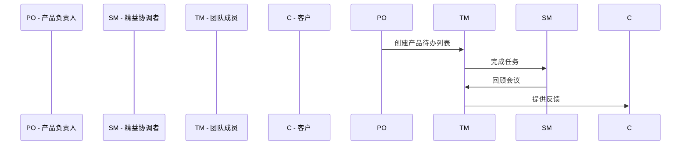

                 

## 敏捷项目管理：在复杂环境中快速交付

关键词：敏捷项目管理、敏捷方法论、团队协作、迭代开发、风险管理、项目监控、实战案例

摘要：
本文将深入探讨敏捷项目管理在复杂环境中的应用，从理论基础、实施过程到实战案例，全方位解析敏捷项目管理的核心概念、方法和实践。通过一步步的分析和推理，我们将了解如何在多变的市场需求和不确定的技术环境中，实现快速交付高质量的项目。

## 目录

1. 第一部分：敏捷项目管理的理论基础
    1.1 敏捷的概念与起源
    1.2 敏捷价值观与原则
    1.3 敏捷方法论概述
    1.4 敏捷项目管理工具与方法

2. 第二部分：敏捷项目实施过程
    2.1 敏捷项目规划
    2.2 敏捷项目执行
    2.3 敏捷项目监控与评估
    2.4 敏捷项目收尾

3. 第三部分：敏捷项目案例与应用
    3.1 案例一：互联网公司敏捷转型
    3.2 案例二：制造业敏捷项目实施
    3.3 案例三：金融行业敏捷应用

4. 第四部分：敏捷项目管理挑战与解决方案
    4.1 敏捷项目管理中的常见挑战
    4.2 挑战解决策略与方法
    4.3 敏捷项目管理最佳实践

5. 附录
    5.1 敏捷项目管理工具介绍
    5.2 敏捷项目文档模板
    5.3 敏捷项目模板与示例

### 1.1 敏捷的概念与起源

敏捷项目管理（Agile Project Management）起源于20世纪90年代末期，由一群软件开发专家在敏捷宣言（Manifesto for Agile Software Development）上签名，标志着敏捷开发运动的开端。敏捷宣言强调个体和互动的重要性、工作的软件胜过完备的文档、客户合作而非合同谈判、响应变化而不是遵循计划。

#### 敏捷的起源与发展

敏捷方法起源于软件开发领域，特别是在迭代开发和增量开发的思想上。传统的瀑布式开发方法在应对快速变化的需求时显得力不从心，而敏捷方法则提供了更灵活、适应性更强的解决方案。敏捷开发迅速在软件行业得到广泛应用，并逐渐扩展到其他领域，如产品开发、项目管理和IT服务。

#### 敏捷的定义与核心思想

敏捷项目管理是一种以人为核心、迭代、增量和协作的管理方法，旨在快速响应变化并持续交付有价值的成果。其核心思想包括：

- **个体和互动重于过程与工具**：强调团队协作和个体贡献。
- **可工作的软件重于详尽的文档**：重视实际可运行的软件，而非过多的文档。
- **客户合作重于合同谈判**：与客户保持紧密合作，及时调整项目方向。
- **响应变化重于遵循计划**：灵活应对需求变化，而非严格遵循原有计划。

#### 敏捷与传统项目管理的区别

- **项目管理方法**：敏捷项目管理采用迭代和增量的方式，而传统项目管理更多采用瀑布式的线性方法。
- **需求管理**：敏捷项目管理强调需求变更的可接受性，而传统项目管理通常要求需求稳定。
- **团队角色**：敏捷项目管理中强调团队成员的多样性和跨职能协作，而传统项目管理通常有明确的角色分工。
- **风险管理**：敏捷项目管理更注重风险的实时监控和调整，而传统项目管理则更倾向于提前规划和控制。

#### 敏捷方法论概述

敏捷方法论包括多种不同的方法，如Scrum、Kanban、XP（极限编程）等。每种方法都有其独特的特点和适用场景。

- **Scrum**：一种迭代和增量的项目管理方法，强调定期评审和回顾，以提高团队协作和项目透明度。
- **Kanban**：一种视觉化的项目管理工具，通过看板（Kanban板）来跟踪任务的状态和流程，以提高效率和响应速度。
- **XP（极限编程）**：一种以开发人员为中心的方法，强调代码质量、测试驱动开发和持续集成。

每种敏捷方法论都有其核心流程和特点，适用于不同的项目类型和团队结构。

## Mermaid 流程图：敏捷方法论的核心流程



通过上述流程图，我们可以看到敏捷项目中的关键角色和主要活动，包括产品负责人（PO）创建待办列表，团队成员（TM）完成任务，精益协调者（SM）组织回顾会议，并与客户保持紧密沟通。

### 1.2 敏捷价值观与原则

敏捷价值观是敏捷项目管理的基础，它们指导着项目团队在复杂和不确定的环境中工作。敏捷价值观包括以下四个核心原则：

1. **个体和互动重于过程与工具**：
   - 个体和互动是敏捷项目管理中的关键。团队协作和个体贡献比单一的工具或过程更加重要。
   - 通过增强团队沟通和协作，可以提高项目的成功率和效率。

2. **可工作的软件重于详尽的文档**：
   - 可工作的软件是项目最重要的成果。尽管文档很重要，但它们应该服务于软件，而不是取代软件。
   - 在敏捷项目管理中，文档应该简洁明了，以支持软件的开发和维护。

3. **客户合作重于合同谈判**：
   - 客户的需求和反馈是项目成功的关键。与客户的紧密合作比合同谈判更加重要。
   - 通过定期与客户沟通，可以更好地理解需求，并快速响应变化。

4. **响应变化重于遵循计划**：
   - 敏捷项目管理强调灵活性和适应性。面对变化，敏捷团队更倾向于调整计划，而不是严格遵循原有计划。
   - 通过快速迭代和反馈机制，敏捷团队可以更好地适应市场和技术变化。

#### 敏捷开发原则

敏捷开发原则是敏捷价值观的具体体现，它们为项目团队提供了实践指导。以下是敏捷开发原则：

1. **尽早并持续交付有价值的软件**：
   - 通过快速迭代和增量开发，敏捷团队可以尽早交付可工作的软件，并获得客户的反馈。
   - 这有助于确保项目方向正确，并在早期发现和解决潜在问题。

2. **欢迎需求变更，即使在开发后期**：
   - 敏捷项目管理认为需求变更是一个常态，而不是异常。
   - 通过灵活的迭代过程，敏捷团队可以更好地适应需求变更，并保持项目进度。

3. **频繁交付，通常是每个几周或一个月**：
   - 定期交付有助于保持项目进度和客户满意度。
   - 通过频繁的交付，团队可以更快地获得反馈，并调整项目方向。

4. **在团队内部构建项目，提倡可持续的开发速度**：
   - 通过促进团队内部协作和沟通，可以提高开发效率和质量。
   - 可持续的开发速度是指团队能够在不牺牲长期健康的前提下，持续高效地工作。

5. **保持简洁，避免不必要的复杂性**：
   - 在软件开发中，简洁性和清晰性是关键。
   - 通过避免不必要的复杂性，可以提高代码的可维护性和可扩展性。

6. **关注工作软件，而不是过度关注文档**：
   - 虽然文档很重要，但实际可运行的软件是项目的主要成果。
   - 通过关注工作软件，团队可以确保项目的实际价值和成果。

7. **客户在场，促进持续反馈**：
   - 客户的参与和反馈是项目成功的关键。
   - 通过让客户参与项目，团队可以更好地理解需求，并及时调整项目方向。

8. **团队自我组织，使团队更高效**：
   - 敏捷项目管理鼓励团队自我组织和决策。
   - 通过自我组织，团队可以更好地适应项目需求，并提高工作效率。

9. **定期反思，如何成为更加有效的团队**：
   - 通过定期的回顾和反思，团队可以识别和解决存在的问题，并持续改进。
   - 定期反思有助于团队不断进步，提高项目的成功率和效率。

### 敏捷价值观与敏捷开发原则的联系

敏捷价值观和敏捷开发原则相互关联，共同指导敏捷项目管理的实践。敏捷价值观提供了团队在项目管理中的基本理念，而敏捷开发原则则为具体实践提供了详细的指导。

- **价值观**为**原则**提供了基础。例如，个体和互动重于过程与工具的价值观指导了尽早并持续交付有价值的软件的原则。
- **原则**则实现了**价值观**的具体化。例如，通过频繁交付和团队自我组织，敏捷团队可以更好地响应变化和保持可持续的开发速度。

### 敏捷价值观与敏捷开发原则的实践案例

#### 案例一：互联网公司敏捷转型

某互联网公司决定采用敏捷方法进行产品开发，以应对快速变化的市场需求。以下是该公司在实践敏捷价值观和敏捷开发原则时的具体措施：

1. **价值观**：
   - **个体和互动重于过程与工具**：公司鼓励团队成员之间的开放沟通和协作，通过定期的站会和回顾会议，确保团队成员能够共享信息和知识。
   - **可工作的软件重于详尽的文档**：公司强调实际可运行的软件，鼓励团队成员编写简洁明了的代码和文档，确保项目成果的可维护性和可扩展性。
   - **客户合作重于合同谈判**：公司定期与客户沟通，确保对需求的理解一致，并通过迭代交付和反馈机制，快速响应客户的需求变化。
   - **响应变化重于遵循计划**：公司灵活调整项目计划，以应对市场需求和技术变化，确保项目能够持续交付有价值的产品。

2. **原则**：
   - **尽早并持续交付有价值的软件**：公司通过每周的迭代交付，确保客户能够快速获得产品功能，并获得及时的反馈。
   - **欢迎需求变更，即使在开发后期**：公司在开发过程中鼓励客户提出需求变更，并通过迭代过程进行调整，确保最终产品满足客户需求。
   - **频繁交付，通常是每个几周或一个月**：公司每两周进行一次迭代，确保项目进度可控，并及时获得客户反馈。
   - **在团队内部构建项目，提倡可持续的开发速度**：公司通过团队自我组织，确保团队成员能够在不牺牲长期健康的前提下，高效地工作。
   - **保持简洁，避免不必要的复杂性**：公司在开发过程中注重代码和系统的简洁性，避免引入不必要的复杂性，提高项目的可维护性。
   - **客户在场，促进持续反馈**：公司邀请客户参与项目的各个阶段，确保客户能够提供及时和准确的反馈，帮助团队更好地理解和满足客户需求。
   - **团队自我组织，使团队更高效**：公司鼓励团队成员自主决策，通过自我组织，提高团队的协作效率和项目的交付质量。
   - **定期反思，如何成为更加有效的团队**：公司定期组织反思会议，团队成员共同讨论项目中的问题和改进措施，不断优化团队的工作流程和方法。

通过以上措施，该公司在敏捷价值观和敏捷开发原则的指导下，成功实现了敏捷转型，项目交付速度显著提高，客户满意度不断提升。

#### 案例二：制造业敏捷项目实施

某制造企业决定采用敏捷方法进行新产品的开发，以应对市场需求的变化。以下是该公司在实践敏捷价值观和敏捷开发原则时的具体措施：

1. **价值观**：
   - **个体和互动重于过程与工具**：公司鼓励团队成员之间的开放沟通和协作，通过定期的站会和回顾会议，确保团队成员能够共享信息和知识。
   - **可工作的软件重于详尽的文档**：公司强调实际可运行的软件，鼓励团队成员编写简洁明了的代码和文档，确保项目成果的可维护性和可扩展性。
   - **客户合作重于合同谈判**：公司定期与客户沟通，确保对需求的理解一致，并通过迭代交付和反馈机制，快速响应客户的需求变化。
   - **响应变化重于遵循计划**：公司灵活调整项目计划，以应对市场需求和技术变化，确保项目能够持续交付有价值的产品。

2. **原则**：
   - **尽早并持续交付有价值的软件**：公司通过每周的迭代交付，确保客户能够快速获得产品功能，并获得及时的反馈。
   - **欢迎需求变更，即使在开发后期**：公司在开发过程中鼓励客户提出需求变更，并通过迭代过程进行调整，确保最终产品满足客户需求。
   - **频繁交付，通常是每个几周或一个月**：公司每两周进行一次迭代，确保项目进度可控，并及时获得客户反馈。
   - **在团队内部构建项目，提倡可持续的开发速度**：公司通过团队自我组织，确保团队成员能够在不牺牲长期健康的前提下，高效地工作。
   - **保持简洁，避免不必要的复杂性**：公司在开发过程中注重代码和系统的简洁性，避免引入不必要的复杂性，提高项目的可维护性。
   - **客户在场，促进持续反馈**：公司邀请客户参与项目的各个阶段，确保客户能够提供及时和准确的反馈，帮助团队更好地理解和满足客户需求。
   - **团队自我组织，使团队更高效**：公司鼓励团队成员自主决策，通过自我组织，提高团队的协作效率和项目的交付质量。
   - **定期反思，如何成为更加有效的团队**：公司定期组织反思会议，团队成员共同讨论项目中的问题和改进措施，不断优化团队的工作流程和方法。

通过以上措施，该公司在敏捷价值观和敏捷开发原则的指导下，成功实现了敏捷转型，项目交付速度显著提高，客户满意度不断提升。

### 敏捷价值观与敏捷开发原则在项目实施中的应用

在敏捷项目管理中，敏捷价值观和敏捷开发原则不仅提供了理论基础，更是在实际项目实施中发挥着关键作用。以下是敏捷价值观与敏捷开发原则在项目实施中的应用：

1. **价值观的应用**：
   - **个体和互动重于过程与工具**：项目团队重视成员之间的沟通和协作，鼓励开放式的讨论和知识共享。通过定期的团队会议和回顾会议，团队成员能够及时了解项目进展和问题，共同寻找解决方案。
   - **可工作的软件重于详尽的文档**：项目团队专注于实现可工作的软件，避免过多的文档编写。文档只是辅助工具，用于记录关键信息和对开发过程的指导。通过简洁明了的文档，团队成员能够快速了解项目背景和需求，提高工作效率。
   - **客户合作重于合同谈判**：项目团队与客户保持紧密合作，通过定期会议和反馈机制，确保对客户需求的理解一致，并快速响应需求变化。与客户的紧密合作有助于确保项目方向正确，提高客户满意度。
   - **响应变化重于遵循计划**：项目团队灵活应对需求变化，根据实际情况调整项目计划和资源分配。通过迭代开发和反馈机制，项目团队能够及时发现问题并进行调整，确保项目能够持续交付有价值的产品。

2. **原则的应用**：
   - **尽早并持续交付有价值的软件**：项目团队通过迭代开发和频繁交付，确保客户能够尽早获得产品功能，并获得及时的反馈。每完成一个迭代，团队都会与客户进行反馈交流，确保产品满足客户需求。
   - **欢迎需求变更，即使在开发后期**：项目团队鼓励客户在开发过程中提出需求变更，并通过迭代过程进行调整。通过这种方式，项目团队能够更好地适应市场需求和技术变化，确保最终产品满足客户需求。
   - **频繁交付，通常是每个几周或一个月**：项目团队定期进行迭代，确保项目进度可控，并及时获得客户反馈。每次迭代结束后，团队都会进行总结和反思，为下一个迭代做好准备。
   - **在团队内部构建项目，提倡可持续的开发速度**：项目团队通过自我组织和协作，确保团队成员能够在不牺牲长期健康的前提下高效地工作。团队内部建立良好的沟通和协作机制，提高项目交付质量和团队效率。
   - **保持简洁，避免不必要的复杂性**：项目团队注重代码和系统的简洁性，避免引入不必要的复杂性。通过简洁的代码和系统设计，团队能够提高代码的可维护性和可扩展性，降低未来的维护成本。
   - **客户在场，促进持续反馈**：项目团队邀请客户参与项目的各个阶段，确保客户能够提供及时和准确的反馈。通过与客户的紧密合作，团队能够更好地理解和满足客户需求，确保项目成功。
   - **团队自我组织，使团队更高效**：项目团队鼓励团队成员自主决策和自我管理，提高团队的协作效率和项目的交付质量。团队通过共同讨论和决策，确保项目方向正确，资源利用最大化。
   - **定期反思，如何成为更加有效的团队**：项目团队定期组织反思会议，共同讨论项目中的问题和改进措施。通过反思和总结，团队能够不断优化工作流程和方法，提高项目的成功率和效率。

通过敏捷价值观和敏捷开发原则的应用，项目团队能够更好地应对复杂环境中的各种挑战，实现快速交付高质量的项目。

### 敏捷方法论概述

敏捷方法论是一组实践和原则，用于指导项目团队在复杂和不确定的环境中工作。这些方法论提供了一系列框架和工具，帮助团队更好地管理项目，提高交付质量和效率。以下是几种常见的敏捷方法论：

#### Scrum

Scrum是最流行的敏捷方法论之一，它强调迭代和增量开发，以及团队的自我组织和协作。Scrum的核心流程包括：

1. **Sprint**：Scrum团队在每个迭代周期（Sprint）内完成一组预定的任务。Sprint通常是2-4周，结束后进行评审和回顾。
2. **产品待办列表（Product Backlog）**：这是一个任务清单，包含所有需要完成的工作项。产品负责人（Product Owner）负责维护这个列表，并确保任务有序排列。
3. **Sprint规划会议**：在Sprint开始时，团队与产品负责人一起制定Sprint目标，并确定要完成的任务。
4. **每日站会**：团队成员每天召开短暂的站会，讨论昨天的工作进展、今天的计划以及遇到的障碍。
5. **评审会议**：Sprint结束时，团队展示已完成的工作项，收集客户的反馈，并调整后续的Sprint计划。
6. **回顾会议**：回顾会议旨在总结Sprint过程中的经验教训，识别改进机会，并更新团队的工作流程。

#### Kanban

Kanban是一种视觉化的项目管理工具，它通过看板（Kanban板）来跟踪任务的状态和流程。Kanban的核心原则包括：

1. **可视化**：通过看板上的卡片和柱状图，团队成员可以清晰地看到任务的进度和状态。
2. **限制在制品（Work in Progress, WIP）**：限制每个阶段的工作量，以避免过度工作负荷。
3. **持续改进**：通过定期审查和回顾，团队可以发现瓶颈和改进机会。
4. **流动管理**：确保任务在团队中的流动顺畅，从开始到完成。

#### XP（极限编程）

XP是一种以开发人员为中心的敏捷方法论，强调高质量代码和高效的工作流程。XP的核心实践包括：

1. **简单设计**：开发团队遵循简单设计原则，避免过度设计。
2. **测试驱动开发（Test-Driven Development, TDD）**：在编写代码之前，先编写测试用例，确保代码的正确性。
3. **持续集成（Continuous Integration, CI）**：通过自动化测试和持续集成工具，确保代码的质量和稳定性。
4. **代码评审**：团队成员之间进行代码评审，确保代码质量和一致性。
5. **重构**：定期对代码进行重构，提高代码的可读性和可维护性。

#### 敏捷方法论的核心特点与优势

1. **迭代和增量开发**：敏捷方法论强调通过迭代和增量开发逐步实现项目目标，而不是一次性完成所有工作。这种方法有助于更好地应对需求变化，提高项目交付的灵活性。
2. **团队协作**：敏捷方法论强调团队成员之间的紧密协作和沟通。通过每日站会、回顾会议等实践，团队可以及时解决问题，提高工作效率。
3. **客户参与**：敏捷方法论鼓励客户在整个项目过程中保持参与，通过定期的反馈和评审，确保项目方向正确，满足客户需求。
4. **持续改进**：敏捷方法论强调通过定期回顾和反思，不断优化工作流程和方法。这种方法有助于团队不断进步，提高项目的成功率和效率。
5. **适应变化**：敏捷方法论允许项目团队在面对需求变化时灵活调整计划，而不是坚持原有的计划。这种适应性有助于团队更好地应对不确定性和市场变化。

#### 敏捷方法论在不同领域的应用场景

敏捷方法论不仅适用于软件开发领域，还可以应用于其他领域，如产品开发、项目管理、IT服务和企业转型等。以下是敏捷方法论在不同领域的应用场景：

1. **软件开发**：敏捷方法论在软件开发领域得到了广泛应用。通过迭代和增量开发，开发团队能够快速交付高质量的产品，并持续改进。
2. **产品开发**：敏捷方法论可以帮助产品团队更好地管理产品开发过程，确保产品能够快速响应市场需求，并持续迭代优化。
3. **项目管理**：敏捷方法论为项目管理者提供了一种灵活、高效的项目管理方法。通过迭代和反馈机制，项目管理者可以更好地应对项目中的不确定性和变化。
4. **IT服务**：敏捷方法论可以帮助IT服务团队更好地管理服务交付过程，提高客户满意度，并持续优化服务质量和效率。
5. **企业转型**：敏捷方法论可以帮助企业实现敏捷转型，提高组织的灵活性和响应速度，以适应快速变化的市场环境。

通过上述分析，我们可以看到敏捷方法论在复杂环境中的应用具有显著的优势。无论是在软件开发、产品开发、项目管理、IT服务还是企业转型中，敏捷方法论都为团队提供了一种灵活、高效的工作方式，有助于实现快速交付高质量的项目。

### 敏捷团队的角色与职责

敏捷团队的核心在于其成员的多样性和协作能力。敏捷团队通常由以下角色组成，每个角色在项目执行中承担着特定的职责和任务：

1. **产品负责人（Product Owner）**
   - **职责**：产品负责人是敏捷团队的核心领导者，负责制定产品愿景、确定产品需求、定义优先级，并确保团队聚焦于实现这些目标。
   - **任务**：产品负责人需要与利益相关者（如客户、市场团队）密切合作，收集需求和市场反馈，确保产品交付符合业务需求和用户期望。此外，产品负责人还需要编写用户故事，并将其放入产品待办列表（Product Backlog）中。

2. **团队成员（Team Member）**
   - **职责**：团队成员是敏捷团队的核心执行者，负责实现产品需求。每个成员通常拥有跨职能的技能，能够在项目中承担多个角色。
   - **任务**：团队成员的具体任务包括编写代码、设计解决方案、编写测试用例、进行代码评审等。团队成员需要积极参与每日站会，汇报自己的工作进展，确保团队成员之间的沟通和协作。

3. **精益协调者（Scrum Master）**
   - **职责**：精益协调者（通常称为Scrum Master）是敏捷团队的指导者和教练，负责确保团队遵循敏捷方法论，并帮助团队解决障碍。
   - **任务**：Scrum Master的任务包括组织每日站会、Sprint规划会议和回顾会议，确保会议顺利进行，并帮助团队解决项目中的问题和障碍。此外，Scrum Master还需要维护团队的工作环境和流程，促进团队协作和自我组织。

#### 敏捷团队的协作模式

敏捷团队的协作模式强调跨职能、自组织和紧密协作。以下是敏捷团队的主要协作模式：

1. **自组织团队（Self-Organized Team）**
   - **模式**：自组织团队由成员自主决定如何完成任务，而不是依赖外部指导。团队成员在项目启动时确定共同的目标，并在整个项目周期内自我管理。
   - **优势**：自组织团队可以提高成员的工作动力和创造力，减少依赖外部指导的时间和成本，增强团队的责任感和归属感。

2. **跨职能团队（Cross-Functional Team）**
   - **模式**：跨职能团队由不同专业领域的成员组成，如开发人员、测试人员、设计师等。团队成员在项目中共同工作，负责从需求分析到产品交付的整个流程。
   - **优势**：跨职能团队可以加速项目进展，减少沟通成本，提高项目质量。团队成员在项目中相互依赖，可以更好地解决复杂问题，提高整体效率。

3. **授权团队（Empowered Team）**
   - **模式**：授权团队拥有决策权和自主权，可以在项目执行过程中自主决定如何实现目标。团队成员不仅负责执行任务，还负责决策和解决项目中出现的问题。
   - **优势**：授权团队可以提高团队成员的参与度和责任感，减少外部干预，提高决策速度和项目灵活性。

#### 敏捷团队的敏捷工具与技术

敏捷团队通常使用一系列工具和技术来支持项目的执行和管理。以下是几种常见的敏捷工具和技术：

1. **日常站会（Daily Stand-up）**
   - **工具**：每日站会是一种简短的会议，通常持续10-15分钟，用于团队成员分享工作进展、遇到的问题和计划。
   - **技术**：团队成员在站会上依次回答以下问题：
     - 我昨天完成了什么？
     - 今天我计划做什么？
     - 我遇到了什么问题，需要团队帮助吗？

2. **产品待办列表（Product Backlog）**
   - **工具**：产品待办列表是一个任务清单，包含所有需要完成的工作项，由产品负责人维护。
   - **技术**：产品待办列表通常按照优先级排序，团队根据优先级和资源情况选择任务进行开发。

3. **燃尽图（Burn-down Chart）**
   - **工具**：燃尽图是一种可视化工具，用于跟踪项目进展和剩余工作量。
   - **技术**：燃尽图显示项目剩余工作量（通常为故事点或任务数量）随着时间的推移逐渐减少，帮助团队了解项目进度和风险。

4. **看板（Kanban Board）**
   - **工具**：看板是一种可视化工具，用于展示项目的状态和流程。
   - **技术**：看板上的卡片代表任务，不同列表示不同的工作阶段。团队成员可以通过看板实时跟踪任务状态和项目进展。

5. **Sprint回顾（Sprint Retrospective）**
   - **工具**：Sprint回顾是一种会议，用于总结迭代过程中的经验教训，识别改进机会。
   - **技术**：回顾会议通常包括团队成员分享正面反馈和改进建议，讨论如何优化工作流程和方法。

通过使用这些敏捷工具和技术，敏捷团队可以更好地管理项目，提高协作效率，实现快速交付高质量的项目。

### 敏捷项目管理工具与方法

在敏捷项目管理中，工具和方法的选择至关重要。这些工具和方法不仅能够提高团队的协作效率，还能够帮助团队更好地管理项目进度、资源和风险。以下将详细介绍几种常见的敏捷项目管理工具和方法。

#### 敏捷项目管理工具

1. **JIRA**
   - **功能**：JIRA是一款功能强大的敏捷项目管理工具，提供任务跟踪、敏捷迭代管理、报告生成等功能。JIRA允许团队创建和管理用户故事、任务、bug等，支持Sprint规划和燃尽图等可视化工具。
   - **优点**：JIRA易于使用，支持多种敏捷方法论，如Scrum和Kanban，可定制性强，能够满足不同规模和类型的项目需求。

2. **Trello**
   - **功能**：Trello是一款基于看板（Kanban）的敏捷项目管理工具，提供直观的任务卡片和灵活的视图。Trello允许团队将项目拆分为多个任务，并在不同的看板列中跟踪任务的状态。
   - **优点**：Trello界面简洁直观，易于上手，支持多种视图（如看板、列表、日历等），适合小团队和跨职能团队使用。

3. **Asana**
   - **功能**：Asana是一款功能丰富的项目管理工具，提供任务分配、进度跟踪和协作功能。Asana允许团队创建任务、子任务、甘特图等，支持实时协作和报告生成。
   - **优点**：Asana支持多种协作工具，如聊天、邮件、视频会议等，可定制性强，适合大型项目和复杂任务的管理。

4. **Confluence**
   - **功能**：Confluence是一款知识共享和协作平台，用于记录项目文档、需求和知识库。Confluence支持文档编写、共享、协作和版本控制，是敏捷项目团队不可或缺的工具。
   - **优点**：Confluence易于使用，支持多种文件格式（如Markdown、HTML等），可定制性强，适合团队知识管理和协作。

#### 敏捷迭代与增量开发

1. **迭代模型（Iteration）**
   - **定义**：迭代模型是一种重复的过程，用于逐步实现项目目标。每次迭代都包括需求分析、设计、开发、测试和交付等阶段。
   - **优点**：迭代模型允许团队逐步交付可工作的软件，及时获得客户反馈，并根据反馈调整项目方向。

2. **增量开发（Incremental Development）**
   - **定义**：增量开发是一种逐步构建项目的方法，每次迭代都增加新功能或改进现有功能。增量开发的核心思想是将项目划分为多个较小的部分，逐步实现。
   - **优点**：增量开发有助于降低项目风险，提高开发效率，并使团队能够更好地应对需求变化。

#### 敏捷风险管理

1. **敏捷风险管理原则**
   - **持续监控**：敏捷风险管理强调持续监控项目风险，确保在风险发生之前能够及时识别和应对。
   - **早期干预**：敏捷风险管理鼓励在风险发生的早期阶段进行干预，以减少风险对项目的影响。
   - **团队协作**：敏捷风险管理强调团队协作，确保每个成员都能参与风险识别和应对。

2. **敏捷风险识别与评估**
   - **风险识别**：通过定期的风险评审会议，团队识别项目中的潜在风险，并记录在风险登记册中。
   - **风险评估**：团队对识别的风险进行评估，确定风险的概率和影响，并根据评估结果制定风险应对策略。

3. **敏捷风险应对策略**
   - **风险规避**：通过改变项目计划或技术方案，避免风险的发生。
   - **风险减轻**：通过采取预防措施或增加资源，降低风险的概率或影响。
   - **风险接受**：对于无法规避或减轻的风险，团队可以接受风险，并制定应对计划以减少风险的影响。

通过选择合适的敏捷项目管理工具和方法，团队可以更好地管理项目进度、资源和风险，实现快速交付高质量的项目。

### 敏捷项目规划

敏捷项目规划是敏捷项目管理的重要组成部分，它为项目团队提供了一个明确的路线图，帮助团队确保项目目标的实现。以下是敏捷项目规划的关键步骤和方法：

#### 敏捷项目计划制定

1. **明确项目目标和范围**
   - **项目目标**：项目目标是指项目要实现的具体成果和业务价值。在项目规划阶段，团队需要明确项目目标，并将其细化为可量化的指标。
   - **项目范围**：项目范围是指项目需要完成的工作内容和边界。明确项目范围有助于避免项目范围的蔓延，确保项目在可控的范围内进行。

2. **创建产品待办列表（Product Backlog）**
   - **用户故事**：用户故事是敏捷项目中的基本需求单元，描述了用户期望的功能和操作。创建产品待办列表时，团队需要收集和编写用户故事。
   - **优先级排序**：用户故事按照优先级排序，确保团队首先实现高优先级的故事。通常，高优先级的故事对项目成功至关重要。

3. **定义迭代计划（Sprint Plan）**
   - **Sprint长度**：迭代（Sprint）是敏捷项目中的基本时间周期，通常为2-4周。在项目规划阶段，团队需要确定Sprint的长度，并制定相应的计划。
   - **任务分配**：根据用户故事和优先级，团队将任务分配给团队成员。每个Sprint的目标是完成一组预定的任务。

4. **制定项目时间表**
   - **里程碑**：项目时间表中的里程碑是项目中的重要时间节点，标志着项目关键阶段的完成。里程碑有助于团队了解项目的进度和风险。
   - **时间估算**：团队对每个任务进行时间估算，以确定项目的完成时间。时间估算应考虑任务复杂性、资源可用性等因素。

#### 敏捷项目范围管理

1. **项目范围定义**
   - **范围说明书**：项目范围说明书是项目范围的具体描述，包括项目目标、可交付成果、项目边界等。范围说明书应得到利益相关者的确认和批准。
   - **范围验证**：在项目执行过程中，团队需要验证项目范围是否得到正确实现。范围验证可以通过项目回顾会议、用户验收测试等方式进行。

2. **范围变更管理**
   - **变更请求**：在项目执行过程中，可能会出现需求变更、技术变更等。团队需要记录变更请求，并评估变更对项目进度、成本和风险的影响。
   - **变更控制**：对于通过评估的变更请求，团队需要制定变更控制计划，包括修改项目计划、资源分配等。变更控制应确保项目范围在可控范围内进行调整。

#### 敏捷项目时间管理

1. **时间估算方法**
   - **专家判断**：团队根据经验和技术知识对任务进行时间估算。专家判断适用于简单、熟悉的任务。
   - **类比估算**：团队通过比较类似项目的时间估算，得出当前项目的时间估算。类比估算适用于相似的项目。
   - **参数模型**：团队使用参数模型（如COCOMO模型）对任务进行时间估算。参数模型适用于复杂、大型项目。

2. **进度跟踪与控制**
   - **进度报告**：团队定期生成进度报告，包括已完成任务、未完成任务、项目进度等。进度报告有助于团队了解项目进展和风险。
   - **进度偏差分析**：团队对进度报告进行分析，识别进度偏差的原因。进度偏差分析有助于团队及时调整项目计划，确保项目按计划进行。
   - **进度控制措施**：团队采取进度控制措施，如增加资源投入、调整任务优先级、优化工作流程等，以确保项目按时完成。

通过敏捷项目规划，团队可以明确项目目标、范围和时间安排，确保项目在可控的范围内顺利进行。敏捷项目规划不仅有助于项目团队更好地管理项目，还能够提高项目的成功率和客户满意度。

### 敏捷项目执行

敏捷项目执行是敏捷项目管理过程中的关键环节，它涉及到团队在具体任务中的工作方式、任务管理、测试与验证以及沟通与协作等方面。以下是敏捷项目执行的主要内容和注意事项。

#### 敏捷项目需求管理

1. **敏捷需求收集方法**
   - **用户故事**：用户故事是一种简明扼要的需求描述，通常采用“作为……，我想……，以便……”的格式。用户故事有助于团队理解用户的需求，并确保需求的具体性和可实现性。
   - **优先级排序**：在收集需求后，团队需要对需求进行优先级排序，确保首先实现高优先级的需求。优先级排序有助于团队更好地分配资源和时间，确保项目按计划进行。

2. **敏捷需求验证与确认**
   - **验收标准**：验收标准是需求实现后需要满足的条件，用于确认需求是否被正确实现。验收标准应得到用户和其他利益相关者的确认和批准。
   - **用户验收测试（UAT）**：用户验收测试是需求验证的关键步骤，通过实际使用场景测试需求是否满足用户需求。UAT有助于发现潜在的问题和缺陷，确保需求的质量。

#### 敏捷项目测试与验证

1. **敏捷测试方法**
   - **单元测试**：单元测试是对代码的最小可测试部分进行测试，确保其按照预期工作。单元测试通常由开发人员编写，并与代码一起维护。
   - **集成测试**：集成测试是对系统中的多个组件进行测试，确保它们能够正确协同工作。集成测试通常在单元测试之后进行，用于发现组件间的接口问题。
   - **验收测试**：验收测试是需求验证的关键步骤，用于确认系统是否满足用户需求和业务目标。验收测试通常由用户或其他利益相关者执行。

2. **敏捷测试与验证流程**
   - **自动化测试**：敏捷项目通常采用自动化测试工具进行测试，以提高测试效率和覆盖率。自动化测试可以用于执行重复性的测试任务，如回归测试。
   - **持续集成（CI）**：持续集成是一种开发实践，通过自动化测试和构建工具，确保代码在每次提交时都经过测试和验证。持续集成有助于减少测试周期，提高代码质量。
   - **持续交付（CD）**：持续交付是一种进一步的开发实践，通过自动化部署和发布流程，确保代码快速、安全地交付给用户。持续交付有助于缩短交付周期，提高用户满意度。

#### 敏捷项目沟通与协作

1. **敏捷沟通机制**
   - **每日站会**：每日站会是敏捷团队的核心沟通机制，团队成员在站会上分享工作进展、遇到的问题和计划。每日站会通常持续10-15分钟，有助于团队保持透明和高效的沟通。
   - **回顾会议**：回顾会议是敏捷团队在每个迭代结束时召开的会议，用于总结经验、识别改进机会和制定改进计划。回顾会议有助于团队不断学习和优化工作流程。

2. **敏捷协作工具**
   - **看板**：看板是一种可视化工具，用于展示项目状态和任务流程。通过看板，团队可以实时跟踪任务的进度和状态，提高协作效率。
   - **项目管理工具**：如JIRA、Trello、Asana等，这些工具提供任务跟踪、进度监控、报告生成等功能，有助于团队更好地管理项目和协作。

通过有效的需求管理、测试与验证以及沟通与协作，敏捷项目执行能够实现快速交付高质量的项目，满足用户和利益相关者的需求。在执行过程中，团队需要保持灵活性，及时应对变化，以确保项目目标的实现。

### 敏捷项目监控与评估

敏捷项目监控与评估是确保项目顺利进行、及时识别和解决问题的关键环节。通过有效的监控和评估，团队可以实时了解项目进展、质量和风险，并采取相应的措施进行改进。以下是敏捷项目监控与评估的主要方法、指标和流程。

#### 敏捷项目监控方法

1. **进度监控**
   - **燃尽图**：燃尽图是一种常用的进度监控工具，通过显示剩余工作量与时间的关系，帮助团队了解项目的进展情况。燃尽图可以直观地展示项目是否按计划进行，以及可能出现的进度偏差。
   - **进度报告**：团队定期生成进度报告，包括已完成任务、未完成任务、项目进度等。进度报告有助于团队了解项目的当前状态，及时调整计划和资源。

2. **成本监控**
   - **成本报告**：团队定期生成成本报告，包括计划成本、实际成本、预算花费等。成本报告有助于团队了解项目的财务状况，确保项目在预算范围内进行。
   - **成本偏差分析**：团队对成本报告进行分析，识别成本偏差的原因。通过成本偏差分析，团队可以及时调整项目计划和资源分配，以控制成本。

3. **质量监控**
   - **质量报告**：团队定期生成质量报告，包括缺陷率、测试覆盖率、客户满意度等。质量报告有助于团队了解项目的质量状况，及时识别和解决质量问题。
   - **缺陷管理**：团队对发现的缺陷进行分类、优先级排序和追踪，确保每个缺陷都能得到及时处理和解决。

#### 敏捷项目评估指标

1. **进度指标**
   - **完成百分比**：已完成任务数与总任务数的比例，用于衡量项目的进度完成情况。
   - **延迟任务数**：超过预定完成时间的任务数量，用于衡量项目的进度延迟情况。

2. **成本指标**
   - **预算花费**：实际发生的成本，用于衡量项目的财务状况。
   - **实际成本**：实际花费的成本，包括直接成本和间接成本。

3. **质量指标**
   - **缺陷率**：缺陷数量与总代码量的比例，用于衡量项目的质量水平。
   - **测试覆盖率**：通过测试的用例数与总用例数的比例，用于衡量测试的全面性。
   - **客户满意度**：通过用户反馈和调查问卷等手段，评估客户的满意度。

#### 敏捷项目反馈与改进

1. **反馈机制**
   - **每日站会**：每日站会是团队沟通和反馈的重要渠道，团队成员在站会上分享工作进展、遇到的问题和计划，确保信息的透明和及时反馈。
   - **回顾会议**：回顾会议是每个迭代结束时的总结会议，团队共同讨论项目中的经验教训、成功和失败之处，并提出改进建议。

2. **改进措施**
   - **经验总结**：团队在回顾会议上总结经验教训，识别项目中的问题点和改进机会，制定改进计划。
   - **持续改进**：团队根据改进计划，实施持续改进措施，优化工作流程和方法，提高项目的效率和质量。

3. **改进流程**
   - **识别问题**：通过回顾会议和日常沟通，团队识别项目中的问题和不足之处。
   - **分析原因**：团队分析问题产生的原因，确定改进的优先级和策略。
   - **实施改进**：团队根据改进计划，采取具体的行动和措施，实施改进措施。
   - **跟踪效果**：团队对改进措施的实施效果进行跟踪和评估，确保改进措施的有效性。

通过敏捷项目监控与评估，团队可以实时掌握项目进展和质量，及时识别和解决问题，确保项目顺利交付。同时，通过反馈与改进，团队可以不断提升项目的效率和质量，实现持续优化。

### 敏捷项目收尾

敏捷项目收尾是项目生命周期中不可忽视的重要环节，它确保项目目标的最终实现，并为团队和利益相关者提供宝贵的经验和教训。以下是敏捷项目收尾的主要内容和方法。

#### 敏捷项目总结

1. **项目目标回顾**：在项目收尾阶段，团队需要回顾项目最初设定的目标，并评估项目是否实现了这些目标。通过回顾目标，团队可以了解项目的实际成果，并识别成功和失败之处。

2. **项目经验总结**：团队需要对项目的整个生命周期进行总结，包括项目规划、执行、监控和收尾等环节。经验总结应包括以下内容：
   - 项目成功的关键因素：分析项目成功的原因，总结团队和成员在项目中的优秀表现。
   - 项目失败的教训：识别项目中的问题和挑战，总结失败的教训，为未来项目提供改进方向。
   - 项目改进建议：根据经验总结，提出改进项目管理和团队协作的建议，以提高未来项目的成功率。

3. **项目文档归档**：项目收尾阶段需要对项目文档进行整理和归档，包括需求文档、设计文档、测试文档、项目管理文档等。归档的文档应确保可追溯性和可复用性，为后续项目提供参考。

#### 敏捷项目文档管理

1. **文档分类**：根据项目阶段和内容，将文档分为不同的类别，如项目计划文档、需求文档、设计文档、测试文档、会议记录等。分类有助于团队更好地管理和查找文档。

2. **文档归档**：将整理好的文档存储在统一的文档管理系统中，如Git、Confluence等。文档归档应确保版本控制和权限管理，防止文档丢失或被篡改。

3. **文档共享与更新**：确保团队成员能够及时获取和更新文档，通过文档共享平台（如SharePoint、Google Drive等）实现文档的协同编辑和实时更新。

#### 敏捷项目经验传承

1. **知识分享**：团队定期组织知识分享会议，将项目中的经验和教训分享给团队成员和其他相关方。知识分享有助于提高团队的技能和知识水平，促进团队的共同成长。

2. **敏捷知识库**：建立敏捷知识库，记录敏捷方法、工具、最佳实践等。知识库应包含详细的文档、案例和示例，为团队成员提供参考和指导。

3. **培训与培养**：为新成员提供敏捷培训和指导，帮助他们快速了解和掌握敏捷方法和工具。同时，鼓励团队成员参加相关的培训和认证，提高专业能力。

4. **持续改进**：通过定期回顾和反思项目，识别改进机会，并实施相应的改进措施。持续改进有助于团队不断优化敏捷实践，提高项目交付质量和效率。

通过敏捷项目收尾的总结、文档管理和经验传承，团队可以积累宝贵的项目经验，为未来的项目提供有益的参考和指导，实现持续改进和成长。

### 敏捷项目管理实战案例

在敏捷项目管理领域，许多公司和团队已经成功地应用了敏捷方法，实现了项目的高效交付和持续改进。以下我们将介绍几个不同行业的敏捷项目实战案例，包括互联网公司、制造业和金融行业的敏捷转型与项目实施。

#### 案例一：互联网公司敏捷转型

**背景**：某知名互联网公司由于传统瀑布式开发方法导致项目周期过长，产品迭代速度缓慢，无法满足市场需求。为了提高项目交付效率，公司决定进行敏捷转型。

**实施过程**：

1. **组织敏捷培训**：公司组织了全员敏捷培训，包括产品负责人、开发人员、测试人员等。培训内容包括敏捷方法论、Scrum框架、敏捷测试等，确保团队成员对敏捷有深入理解。

2. **团队重构**：公司拆分了原有的大型团队，组建了多个跨职能的小团队，每个团队负责不同的模块。小团队自主决策，提高了协作效率和沟通质量。

3. **引入敏捷工具**：公司引入了JIRA和Confluence等敏捷工具，用于任务跟踪、文档管理和知识共享。团队成员通过JIRA更新任务进度，并通过Confluence记录和共享项目文档。

4. **实施Scrum框架**：公司采用Scrum框架进行项目管理，每个迭代周期为两周。在每个迭代结束时，团队进行评审会议和回顾会议，收集客户反馈，并调整后续迭代计划。

**结果与启示**：

1. **项目周期显著缩短**：通过敏捷方法，项目周期从原来的数月缩短到数周，产品迭代速度大幅提升。

2. **客户满意度提高**：敏捷转型使公司能够更快地响应市场需求，客户满意度显著提高。

3. **团队协作效率提升**：小团队自主决策，沟通更加顺畅，协作效率大幅提升。

4. **持续改进**：通过定期回顾和反馈，团队不断优化敏捷实践，持续改进项目管理和团队协作。

#### 案例二：制造业敏捷项目实施

**背景**：某制造业企业为提高产品开发效率，决定引入敏捷方法进行项目管理。

**实施过程**：

1. **建立敏捷团队**：企业成立了敏捷转型团队，负责推动敏捷方法和工具的引入。团队成员包括项目经理、开发人员、测试人员等。

2. **敏捷培训**：转型团队对全体团队成员进行了敏捷培训，包括敏捷方法论、Scrum框架、敏捷测试等，确保团队成员熟悉敏捷实践。

3. **引入敏捷工具**：企业引入了JIRA和Confluence等敏捷工具，用于任务跟踪、文档管理和知识共享。团队成员通过JIRA更新任务进度，并通过Confluence记录和共享项目文档。

4. **实施Scrum和Kanban**：企业采用Scrum和Kanban框架进行项目管理。Scrum框架用于定期迭代和评审，Kanban框架用于任务流程的视觉化管理。

**结果与启示**：

1. **产品开发周期缩短**：通过敏捷方法，产品开发周期从原来的数月缩短到数周，项目交付速度显著提升。

2. **资源利用率提高**：敏捷方法使企业能够更好地分配和管理资源，提高了资源利用率。

3. **团队协作效率提升**：通过敏捷工具和框架，团队协作更加高效，沟通和协作质量得到提升。

4. **持续改进**：通过定期回顾和反馈，企业不断优化敏捷实践，持续改进项目管理和团队协作。

#### 案例三：金融行业敏捷应用

**背景**：某金融公司为提高金融产品开发效率，决定采用敏捷方法进行项目管理。

**实施过程**：

1. **敏捷培训**：公司对项目经理和开发人员进行了敏捷培训，包括敏捷方法论、Scrum框架、敏捷测试等，确保团队成员熟悉敏捷实践。

2. **团队重构**：公司建立了跨职能的敏捷开发团队，包括产品负责人、开发人员、测试人员等。团队成员具备多样化的技能，能够快速响应市场需求。

3. **实施Scrum和持续集成**：公司采用Scrum框架进行项目管理，每个迭代周期为两周。同时，引入持续集成工具（如Jenkins），实现自动化测试和构建，提高开发效率。

4. **客户参与**：公司鼓励客户全程参与项目，通过迭代评审会议和客户反馈，确保产品符合市场需求。

**结果与启示**：

1. **金融产品开发周期缩短**：通过敏捷方法，金融产品开发周期从原来的数月缩短到数周，项目交付速度显著提升。

2. **客户满意度提高**：敏捷方法使公司能够更快地响应客户需求，客户满意度显著提高。

3. **团队协作效率提升**：通过敏捷工具和框架，团队协作更加高效，沟通和协作质量得到提升。

4. **持续改进**：通过定期回顾和反馈，公司不断优化敏捷实践，持续改进项目管理和团队协作。

这些案例展示了不同行业在敏捷转型和项目实施中的成功经验。通过敏捷方法，企业能够提高项目交付效率、客户满意度和团队协作效率，实现持续改进和业务增长。

### 敏捷项目管理中的常见挑战与解决方案

敏捷项目管理在带来诸多优势的同时，也面临着一系列挑战。以下将介绍敏捷项目管理中常见的挑战，并提出相应的解决策略与方法。

#### 团队成员对敏捷方法的理解和接受程度不足

**挑战**：许多团队成员对敏捷方法论的理解不深入，或者不接受敏捷方法，导致敏捷转型和实施过程中遇到阻力。

**解决策略**：

1. **加强敏捷培训**：为团队成员提供系统的敏捷方法论培训，帮助他们深入了解敏捷原则、流程和实践。
2. **建立支持性文化**：鼓励团队成员分享敏捷实践中的经验和教训，营造一个开放、包容和支持敏捷方法的工作环境。
3. **逐步引入敏捷方法**：在项目初期，可以尝试将敏捷方法部分引入，通过成功的实践逐渐提高团队成员的接受度。

#### 敏捷转型过程中的组织文化冲突

**挑战**：敏捷转型可能会与现有的组织文化发生冲突，如强调自组织、灵活性和快速迭代与传统的权威、规划和标准化文化之间的矛盾。

**解决策略**：

1. **领导层支持**：高层领导应明确表示对敏捷转型的支持，并积极参与，为团队成员树立榜样。
2. **组织变革管理**：通过变革管理策略，逐步引导组织文化向敏捷方向转变，如调整组织结构、流程和绩效评估体系。
3. **建立敏捷社区**：创建敏捷社区，鼓励团队成员分享敏捷实践和经验，促进组织文化的变革。

#### 敏捷项目中的需求变更管理

**挑战**：在敏捷项目中，需求变更频繁且难以控制，可能导致项目范围蔓延、进度延误和资源浪费。

**解决策略**：

1. **明确变更流程**：制定明确的变更管理流程，包括变更请求的提交、评估、批准和实施，确保变更的可控性。
2. **优先级排序**：对需求变更进行优先级排序，确保高优先级的变更首先得到处理，并优先纳入后续迭代。
3. **增量开发**：通过增量开发，逐步实现需求变更，避免一次性引入大量变更导致的冲击。

#### 敏捷项目的资源分配和优先级管理

**挑战**：敏捷项目通常涉及多个迭代和多个需求，如何合理分配资源和管理优先级成为难题。

**解决策略**：

1. **资源池管理**：建立资源池，根据项目需求和优先级动态分配资源，确保资源的最优利用。
2. **迭代规划**：在迭代规划阶段，充分考虑资源的可用性和需求优先级，合理安排任务和团队工作负荷。
3. **优先级调整**：定期评估项目的进展和需求变化，根据实际情况调整任务优先级，确保项目能够按计划进行。

#### 挑战解决策略与方法的具体实施

**案例一**：互联网公司敏捷转型

**挑战**：团队成员对敏捷方法的理解不足，导致实施过程中遇到困难。

**解决策略与方法**：

1. **敏捷培训**：公司为全体团队成员提供了为期两周的敏捷方法论培训，内容涵盖敏捷原则、Scrum框架、敏捷测试等。
   - **培训内容**：包括敏捷宣言、敏捷价值观、Scrum角色和会议、用户故事编写、迭代规划和回顾会议等。
   - **培训形式**：采用课堂讲解、实战演练、案例分析等多种形式，确保团队成员能够全面理解敏捷方法论。

2. **建立支持性文化**：公司通过内部沟通平台和定期团队活动，鼓励团队成员分享敏捷实践和经验，营造一个开放和支持敏捷方法的工作环境。

3. **逐步引入敏捷方法**：公司在项目初期尝试引入敏捷方法，如每日站会、迭代规划和回顾会议等。通过成功的实践，逐步提高团队成员的接受度和参与度。

**案例二**：制造业敏捷项目实施

**挑战**：组织文化冲突导致敏捷转型受阻。

**解决策略与方法**：

1. **领导层支持**：公司高层领导积极参与敏捷转型的讨论和决策，明确表示对敏捷方法的支持，并鼓励团队成员尝试和实践敏捷方法。

2. **组织变革管理**：公司通过调整组织结构和流程，逐步引导组织文化向敏捷方向转变。例如，调整项目经理的职责，强调团队自组织和跨职能协作。

3. **建立敏捷社区**：公司创建了敏捷社区，定期组织敏捷分享会和培训活动，鼓励团队成员分享敏捷实践和经验，促进组织文化的变革。

**案例三**：金融行业敏捷应用

**挑战**：需求变更频繁且难以控制，导致项目范围蔓延和进度延误。

**解决策略与方法**：

1. **明确变更流程**：公司制定了详细的变更管理流程，包括变更请求的提交、评估、批准和实施。每个变更请求都需要经过详细评估，确保对项目的影响可控。

2. **优先级排序**：公司对需求变更进行优先级排序，确保高优先级的变更首先得到处理。同时，公司在迭代规划阶段，充分考虑需求优先级，合理安排任务和团队工作负荷。

3. **增量开发**：公司采用增量开发方法，逐步实现需求变更，避免一次性引入大量变更导致的冲击。通过逐步交付可工作的软件，公司能够更好地控制项目范围和进度。

通过上述案例，我们可以看到，针对敏捷项目管理中的常见挑战，可以采取一系列解决策略与方法，确保敏捷项目的顺利实施和成功交付。这些策略和方法不仅适用于特定行业和公司，也为其他敏捷项目提供了宝贵的参考和经验。

### 敏捷项目管理最佳实践

在敏捷项目管理中，最佳实践是确保项目成功交付、提高团队效率和质量的关键。以下是一些敏捷项目管理的最佳实践，包括敏捷教练团队的作用、敏捷回顾与改进、灵活应用敏捷方法和加强团队成员沟通和协作。

#### 建立敏捷教练团队

1. **敏捷教练的职责**：敏捷教练在敏捷项目中扮演着重要角色，负责指导、培训和辅导团队成员，确保他们理解并遵循敏捷方法论。敏捷教练的职责包括：
   - 敏捷方法论和工具的普及和培训。
   - 提供敏捷实践的建议和指导。
   - 协调团队成员之间的沟通和协作。
   - 监督敏捷实践的实施，确保项目按计划进行。

2. **敏捷教练团队的组成**：敏捷教练团队通常由经验丰富的敏捷专家组成，他们具备深厚的敏捷知识和实践经验。团队成员可以是全职敏捷教练，也可以是兼职顾问，以确保团队能够持续获得专业的指导和支持。

3. **敏捷教练团队的作用**：敏捷教练团队在项目中的关键作用包括：
   - 指导团队成员理解敏捷原则和实践。
   - 提供敏捷转型的策略和方案。
   - 协助团队解决敏捷实践中的问题和挑战。
   - 定期组织敏捷培训和分享会，促进团队成员的成长和进步。

#### 定期进行敏捷回顾与改进

1. **敏捷回顾会议**：敏捷回顾会议是每个迭代结束时的重要活动，用于总结经验、识别改进机会和制定改进计划。回顾会议应包括以下步骤：
   - **分享成功和失败的经验**：团队成员分享在迭代过程中遇到的成功和失败案例，讨论哪些做法有效，哪些需要改进。
   - **识别问题和瓶颈**：分析项目中的问题和瓶颈，讨论原因和解决方案。
   - **制定改进计划**：根据回顾结果，制定具体的改进措施和行动计划，确保在下一个迭代中实施。

2. **回顾报告**：回顾会议后，应编写回顾报告，记录回顾结果和改进措施。回顾报告应包括以下内容：
   - 回顾会议的总结和关键发现。
   - 识别的问题和瓶颈。
   - 改进计划和责任分配。
   - 预期的改进效果和监控措施。

3. **持续改进**：敏捷回顾和改进是一个持续的过程，团队应定期回顾和评估改进措施的实施效果，并根据实际情况进行调整。通过持续改进，团队可以不断提高项目的效率和质量。

#### 灵活应用敏捷方法

1. **适应项目需求**：敏捷方法虽然提供了一系列通用的实践和原则，但不同项目具有不同的特点和需求。团队应根据项目的具体情况，灵活应用敏捷方法，确保项目能够高效地实施。
   - **选择合适的敏捷方法论**：根据项目类型和团队规模，选择适合的敏捷方法论，如Scrum、Kanban或XP。
   - **定制化敏捷实践**：在项目实施过程中，团队可以根据实际需求，调整和定制敏捷实践，以确保项目能够顺利推进。

2. **持续优化**：团队应不断反思和优化敏捷实践，根据项目进展和反馈，调整敏捷方法和流程。通过持续优化，团队可以不断提高项目的交付能力和效率。

#### 加强团队成员沟通和协作

1. **建立良好的沟通机制**：团队应建立有效的沟通机制，确保团队成员之间的信息共享和协作。
   - **每日站会**：团队每天召开短暂的站会，讨论工作进展、问题和计划，确保团队成员对项目状态有共同的认识。
   - **定期会议**：团队定期召开会议，如迭代规划会议、评审会议和回顾会议，确保项目进展和问题的及时沟通和解决。

2. **使用协作工具**：团队应充分利用敏捷协作工具，如JIRA、Trello、Confluence等，进行任务跟踪、文档管理和知识共享。
   - **任务管理**：通过任务管理工具，团队可以清晰地了解任务进度和责任分配，确保任务按时完成。
   - **文档管理**：通过文档管理工具，团队可以方便地共享和更新文档，确保知识的传递和积累。
   - **知识共享**：通过知识共享平台，团队可以方便地记录和分享经验教训，促进团队的学习和成长。

通过建立敏捷教练团队、定期进行敏捷回顾与改进、灵活应用敏捷方法和加强团队成员沟通和协作，团队可以确保敏捷项目的成功实施，提高项目的交付质量和效率。

### 解决敏捷项目中的需求变更挑战

在敏捷项目中，需求变更是一个常见且具有挑战性的问题。客户需求的变化往往会影响项目进度、成本和质量，因此，如何有效地管理需求变更成为敏捷项目管理的关键。以下将详细介绍解决敏捷项目中需求变更挑战的策略和方法。

#### 建立明确的沟通机制

有效的沟通机制是管理需求变更的基础。通过建立明确的沟通机制，可以确保项目团队与客户、产品负责人和其他利益相关者之间的沟通渠道畅通，及时了解和响应需求变更。

1. **定期会议**：定期举行需求评审会议，让客户、产品负责人和开发团队共同参与，讨论和确认需求变更。通过会议，可以确保所有利益相关者对需求变更有共同的理解和共识。

2. **实时沟通工具**：利用实时沟通工具（如Slack、Microsoft Teams等），建立项目团队与客户之间的实时沟通渠道。这样，可以快速响应客户的需求变化，并确保需求变更的及时传达和处理。

3. **反馈机制**：建立反馈机制，确保客户能够及时获得项目进展和需求变更的反馈。通过定期的项目报告和客户满意度调查，可以了解客户的需求变化，并及时进行调整。

#### 采用增量开发

增量开发是一种逐步交付功能的方法，通过在多个迭代中逐步实现需求，可以有效地管理需求变更。以下是增量开发在解决需求变更挑战中的应用：

1. **迭代规划**：在每次迭代规划时，团队应根据客户需求制定迭代目标和任务。通过增量开发，可以在每个迭代中逐步实现部分功能，从而更好地适应需求变化。

2. **迭代交付**：在每个迭代结束时，团队应交付可工作的软件版本。通过迭代交付，可以及时获得客户的反馈，并根据反馈进行调整，确保需求变更能够被有效管理。

3. **迭代回顾**：在每次迭代结束后，团队应进行回顾会议，总结经验教训，并根据实际情况调整后续迭代计划。通过回顾和反思，可以不断提高项目对需求变更的适应能力。

#### 敏捷需求管理方法

敏捷需求管理方法包括用户故事、优先级排序和需求验证等，以下将详细介绍这些方法在解决需求变更挑战中的应用：

1. **用户故事**：用户故事是一种简明扼要的需求描述，通常采用“作为……，我想……，以便……”的格式。通过用户故事，团队可以清晰地了解客户的需求，并确保需求的具体性和可实现性。

2. **优先级排序**：在敏捷项目中，团队应根据需求的优先级排序，确保首先实现高优先级的需求。通过优先级排序，可以确保在资源有限的情况下，优先满足关键需求。

3. **需求验证**：在需求实现后，团队应进行需求验证，确保需求被正确理解和实现。需求验证可以通过用户验收测试（UAT）和内部测试等方式进行，确保需求的实现符合预期。

#### 评估需求变更的影响

在敏捷项目中，需求变更可能会对项目进度、成本和质量产生影响。因此，评估需求变更的影响是管理需求变更的关键步骤。以下将介绍评估需求变更影响的步骤和方法：

1. **影响评估**：在需求变更发生时，团队应立即进行影响评估，分析需求变更对项目进度、成本和质量的影响。影响评估应包括以下内容：
   - 变更对项目进度的影响：分析变更对项目计划的影响，确定是否需要调整项目时间表。
   - 变更对项目成本的影响：分析变更对项目预算的影响，确定是否需要增加预算或调整资源分配。
   - 变更对项目质量的影响：分析变更对项目质量的影响，确定是否需要增加测试和验证工作量。

2. **风险评估**：在影响评估的基础上，团队应进行风险评估，确定需求变更的风险等级和应对策略。风险评估应包括以下内容：
   - 风险识别：识别需求变更可能带来的风险，如项目延误、成本超支、质量下降等。
   - 风险评估：评估风险的概率和影响，确定风险等级。
   - 风险应对：制定风险应对策略，如风险规避、风险减轻、风险接受等。

3. **调整计划**：根据影响评估和风险评估的结果，团队应调整项目计划，确保需求变更能够在项目范围内得到妥善处理。调整计划应包括以下内容：
   - 调整时间表：根据变更影响，调整项目时间表，确保项目能够按时完成。
   - 调整预算：根据变更影响，调整项目预算，确保项目成本在可控范围内。
   - 调整资源分配：根据变更影响，调整资源分配，确保项目资源得到合理利用。

#### 与客户协商

在评估需求变更的影响后，团队应与客户进行协商，讨论需求变更的可行性、优先级和影响。以下是与客户协商的步骤和方法：

1. **需求变更沟通**：在需求变更发生时，团队应与客户进行沟通，解释变更的影响和原因。通过沟通，可以确保客户对需求变更有充分的了解和认可。

2. **需求变更优先级排序**：与客户一起对需求变更进行优先级排序，确定哪些需求变更需要优先处理，哪些需求变更可以延迟或放弃。

3. **调整项目计划**：根据客户的需求和优先级排序，团队应调整项目计划，确保变更能够被合理地纳入项目范围内。调整计划应考虑变更的影响，并确保项目能够按时、高质量地交付。

4. **风险评估和应对**：与客户一起评估需求变更的风险，并制定相应的应对策略。通过风险评估和应对，可以确保需求变更不会对项目带来负面影响。

#### 实施案例

假设某敏捷项目在第二个迭代中接收到一个新的需求变更，要求增加一个新的功能模块。以下是一个解决方案的示例：

1. **需求评审会议**：召开需求评审会议，讨论并确认新的需求。在会议上，客户、产品负责人和开发团队共同参与，明确新需求的功能细节和实现要求。

2. **需求变更管理**：在JIRA中创建一个新的需求卡片，记录需求变更的详细信息，如功能描述、优先级、预计完成时间等。通过JIRA，团队可以方便地跟踪和管理需求变更。

3. **影响评估**：评估需求变更对项目进度、成本和质量的影响。分析变更对当前迭代计划的影响，确定是否需要调整项目时间表和资源分配。

4. **与客户协商**：与客户沟通，解释需求变更的影响和原因，并协商调整项目范围和优先级。可能的选择包括调整迭代计划、增加资源投入或重新安排其他任务的优先级。

5. **更新项目计划**：根据协商结果，更新项目计划，确保新需求能够在既定时间内实现，同时不影响其他任务和项目进度。调整计划应包括修改时间表、预算和资源分配，以确保项目能够顺利推进。

6. **持续监控**：在整个迭代过程中，持续监控新需求的状态，确保按时交付，并及时调整项目计划以应对可能的新需求变更。

通过上述策略和方法，可以有效地管理敏捷项目中的需求变更，确保项目能够顺利进行，同时满足客户的需求。这种灵活和响应性的管理方式有助于团队在复杂和多变的环境中实现快速交付高质量的项目。

### 附录A：敏捷项目管理资源与工具

#### A.1 敏捷项目管理工具介绍

敏捷项目管理工具是支持敏捷团队进行任务跟踪、进度管理、协作和沟通的重要工具。以下是一些常用的敏捷项目管理工具：

1. **JIRA**：
   - **功能**：JIRA是一款功能强大的敏捷项目管理工具，支持任务跟踪、敏捷迭代管理、报告生成等功能。JIRA允许团队创建和管理用户故事、任务、bug等，支持Sprint规划和燃尽图等可视化工具。
   - **优点**：JIRA易于使用，支持多种敏捷方法论（如Scrum、Kanban），可定制性强，适合不同规模和类型的项目需求。

2. **Trello**：
   - **功能**：Trello是一款基于看板（Kanban）的敏捷项目管理工具，提供直观的任务卡片和灵活的视图。Trello允许团队将项目拆分为多个任务，并在不同的看板列中跟踪任务的状态。
   - **优点**：Trello界面简洁直观，易于上手，支持多种视图（如看板、列表、日历等），适合小团队和跨职能团队使用。

3. **Asana**：
   - **功能**：Asana是一款功能丰富的项目管理工具，提供任务分配、进度跟踪和协作功能。Asana允许团队创建任务、子任务、甘特图等，支持实时协作和报告生成。
   - **优点**：Asana支持多种协作工具（如聊天、邮件、视频会议等），可定制性强，适合大型项目和复杂任务的管理。

4. **Confluence**：
   - **功能**：Confluence是一款知识共享和协作平台，用于记录项目文档、需求和知识库。Confluence支持文档编写、共享、协作和版本控制，是敏捷项目团队不可或缺的工具。
   - **优点**：Confluence易于使用，支持多种文件格式（如Markdown、HTML等），可定制性强，适合团队知识管理和协作。

#### A.2 敏捷项目文档模板

敏捷项目文档是项目管理过程中重要的参考资料和沟通工具。以下是一些常见的敏捷项目文档模板：

1. **产品待办列表（Product Backlog）**：
   - **内容**：产品待办列表包含所有需要完成的工作项，如用户故事、任务等。每个工作项应包括标题、描述、优先级等信息。
   - **格式**：产品待办列表通常以表格或列表形式展示，便于团队管理和跟踪。

2. **迭代计划（Sprint Plan）**：
   - **内容**：迭代计划包括迭代目标、待完成任务、任务分配、时间安排等。迭代计划应确保团队能够在规定时间内完成预定任务。
   - **格式**：迭代计划通常以文档或电子表格形式展示，方便团队跟进和调整。

3. **每日站会记录（Daily Stand-up Notes）**：
   - **内容**：每日站会记录包括团队成员昨日的工作进展、今日的计划和遇到的问题。站会记录有助于团队了解项目进展和协作情况。
   - **格式**：每日站会记录通常以日志或会议纪要形式展示，便于团队成员查看和参考。

4. **回顾报告（Sprint Retrospective Report）**：
   - **内容**：回顾报告总结每个迭代过程中的经验、问题和改进措施。回顾报告有助于团队不断优化敏捷实践。
   - **格式**：回顾报告通常包括总结部分、问题识别、改进措施等，以文档或幻灯片形式展示。

#### A.3 敏捷项目模板与示例

敏捷项目模板是敏捷项目管理过程中常用的工具，可以帮助团队高效地规划和管理项目。以下是一些常见的敏捷项目模板：

1. **敏捷项目计划模板**：
   - **内容**：敏捷项目计划模板包括项目目标、范围、里程碑、资源分配、时间表等。计划模板应确保项目目标明确、资源合理分配、进度可控。
   - **格式**：敏捷项目计划模板通常以文档或电子表格形式展示，便于团队参考和调整。

2. **敏捷迭代报告模板**：
   - **内容**：敏捷迭代报告模板包括迭代目标、已完成任务、未完成任务、客户反馈、改进措施等。报告模板应确保团队能够清晰地了解迭代进展和改进方向。
   - **格式**：敏捷迭代报告模板通常以文档或幻灯片形式展示，方便团队汇报和交流。

3. **敏捷项目风险管理模板**：
   - **内容**：敏捷项目风险管理模板包括风险识别、风险评估、风险应对策略等。风险管理模板应确保团队能够及时发现和应对项目风险。
   - **格式**：敏捷项目风险管理模板通常以表格或文档形式展示，便于团队跟踪和管理风险。

示例：

**敏捷项目计划模板**

```markdown
# 项目名称：XX系统开发

## 项目目标
- 提高系统稳定性
- 提升用户满意度
- 实现快速迭代和交付

## 项目范围
- 功能模块1
- 功能模块2
- 功能模块3

## 里程碑
- 里程碑1：需求分析完成
- 里程碑2：系统设计完成
- 里程碑3：系统开发完成
- 里程碑4：系统测试完成

## 资源分配
- 开发人员：5人
- 测试人员：3人
- 产品负责人：1人

## 时间表
- 第一阶段：需求分析（1周）
- 第二阶段：系统设计（2周）
- 第三阶段：系统开发（4周）
- 第四阶段：系统测试（3周）

```

通过使用敏捷项目管理工具和模板，团队可以更加高效地规划和执行项目，确保项目目标的实现和持续改进。

### 总结与展望

敏捷项目管理作为一种灵活、高效的项目管理方法，已在众多行业中得到了广泛应用和认可。通过本文的详细分析和实例介绍，我们可以看到敏捷项目管理的核心概念、方法、实践以及在实际项目中的应用效果。

#### 总结

1. **敏捷项目管理的理论基础**：敏捷项目管理基于一系列核心概念和原则，如个体和互动重于过程与工具、可工作的软件重于详尽的文档、客户合作重于合同谈判、响应变化重于遵循计划等。这些价值观和原则为敏捷项目管理提供了指导。

2. **敏捷团队的角色与职责**：敏捷团队由产品负责人、团队成员和精益协调者组成。每个角色在项目中承担着特定的职责和任务，通过自组织、跨职能和授权团队模式，确保项目的高效执行。

3. **敏捷项目管理工具与方法**：敏捷项目管理工具如JIRA、Trello、Asana和Confluence，以及敏捷迭代与增量开发、敏捷风险管理等方法，为团队提供了强大的支持，提高了项目的透明度和协作效率。

4. **敏捷项目监控与评估**：通过进度监控、成本监控、质量监控等方法，敏捷项目团队能够实时掌握项目进展和质量，及时识别和解决问题，确保项目目标的实现。

5. **敏捷项目收尾**：敏捷项目收尾包括项目总结、文档管理和经验传承，确保项目经验的积累和传承，为未来项目提供宝贵的参考。

6. **实战案例**：通过互联网公司、制造业和金融行业的敏捷转型与项目实施案例，我们可以看到敏捷项目管理在不同行业中的应用效果和成功经验。

#### 展望

1. **持续改进**：敏捷项目管理强调持续改进，团队应定期回顾和反思项目，识别改进机会，并不断优化敏捷实践，提高项目交付质量和效率。

2. **行业应用拓展**：随着敏捷理念的普及，敏捷项目管理方法将继续在更多行业得到应用，如医疗、教育、政府等，为这些行业提供高效的项目管理解决方案。

3. **新兴技术结合**：随着人工智能、大数据、云计算等新兴技术的不断发展，敏捷项目管理将结合这些技术，提供更智能、更高效的项目管理工具和方法。

4. **人才培养**：敏捷项目管理对团队成员的技能和素质提出了更高的要求，未来需要更多具备敏捷思维和专业技能的人才，以应对复杂多变的项目环境。

总之，敏捷项目管理作为一种适应性和灵活性极高的项目管理方法，将在未来继续发挥重要作用，推动项目团队在复杂和不确定的环境中实现快速交付高质量的项目。通过不断探索和实践，敏捷项目管理将为企业和团队带来更大的价值。

