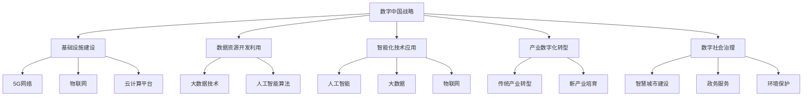

                 

# 数字中国战略与新质生产力的结合点

## 关键词
数字中国战略、新质生产力、基础设施建设、数据资源开发利用、智能化技术应用、产业数字化转型、数字社会治理

## 摘要
本文旨在探讨数字中国战略与新质生产力的结合点，分析二者在基础设施建设、数据资源开发利用、智能化技术应用等方面的紧密联系。通过详细阐述核心概念、算法原理、实践路径以及应用领域，本文为理解数字中国战略下的产业发展、社会治理和未来挑战提供深入见解。

## 第一部分：数字中国战略与新质生产力的结合点概述

### 核心概念与联系

数字中国战略是中国政府为推动经济社会数字化转型而制定的一系列政策举措，旨在通过信息化手段提升国家治理能力、推动经济社会发展。这一战略的核心目标是构建一个全面数字化、智能化、网络化的社会，实现数字经济的快速发展。

新质生产力是指在信息化、数字化时代，通过数据、智能、网络等新型生产要素，形成的一种新型生产能力和生产方式。新质生产力的特点在于其高度依赖信息技术，通过数据的收集、处理和分析，实现生产效率的提升、产品质量的优化和产业结构的优化。

数字中国战略与新质生产力的结合点主要体现在以下几个方面：

1. **基础设施建设**：构建高速、稳定、安全的信息基础设施，包括5G网络、物联网、云计算平台等，为新质生产力提供基础支撑。
2. **数据资源开发利用**：通过数据资源的开发利用，挖掘数据价值，为各类应用场景提供数据支持。
3. **智能化技术应用**：推广人工智能、大数据、物联网等新技术在工业、农业、服务业等各领域的应用，提升生产效率和产品质量。
4. **产业数字化转型**：推动传统产业向数字化、智能化转型，培育新产业、新业态、新模式。
5. **数字社会治理**：运用数字技术提升社会治理水平，实现智慧城市建设、政务服务、环境保护等领域的智能化。

### 架构概述

数字中国战略与新质生产力的结合点可以概括为以下几个方面：

1. **基础设施建设**：数字中国战略首先要求构建高速、稳定、安全的信息基础设施，这是新质生产力发展的基础。5G网络的广泛覆盖、物联网设备的普及和云计算平台的搭建，为数据的实时传输、处理和分析提供了可能。

2. **数据资源开发利用**：数据是新质生产力的核心资源。通过数据资源的开发利用，可以挖掘数据价值，为各类应用场景提供数据支持。大数据技术、人工智能算法的运用，使得数据能够被更有效地分析和利用。

3. **智能化技术应用**：智能化技术是推动新质生产力发展的重要引擎。人工智能、大数据、物联网等新技术的应用，使得生产和服务过程更加智能化，从而提升生产效率和产品质量。

4. **产业数字化转型**：传统产业向数字化、智能化转型是数字中国战略的重要目标之一。通过数字化技术的引入，传统产业可以实现生产流程的优化、管理水平的提升和产品服务的创新。

5. **数字社会治理**：数字技术的应用不仅体现在经济发展中，也体现在社会治理中。通过数字技术，可以实现智慧城市建设、政务服务、环境保护等领域的智能化，提升社会治理水平。

#### Mermaid 流程图

以下是一个简化的 Mermaid 流程图，展示了数字中国战略与新质生产力的结合点：



## 第二部分：数字中国战略与新质生产力的基础理论

### 核心算法原理讲解

在数字中国战略和新质生产力的结合点上，算法原理是核心之一。以下将介绍几种核心算法原理，包括机器学习算法、深度学习算法、大数据处理算法和物联网协议。

#### 机器学习算法

机器学习算法是数字中国战略中用于数据分析和预测的重要工具。其中，线性回归、逻辑回归、决策树、随机森林和支持向量机等算法被广泛应用。

1. **线性回归**：线性回归是一种简单且有效的预测算法，用于建模因变量和自变量之间的线性关系。其损失函数通常采用均方误差（MSE），公式如下：

   $$
   \text{MSE} = \frac{1}{m}\sum_{i=1}^{m}(y_i - \hat{y_i})^2
   $$

   其中，$y_i$ 是真实值，$\hat{y_i}$ 是预测值，$m$ 是数据集的大小。

2. **逻辑回归**：逻辑回归是一种用于分类问题的预测算法，其核心思想是通过线性组合输入特征并应用逻辑函数（Sigmoid函数）来生成概率分布。其损失函数通常采用对数损失函数（Log Loss），公式如下：

   $$
   \text{Log Loss} = -\frac{1}{m}\sum_{i=1}^{m}y_i\log(\hat{y_i}) + (1 - y_i)\log(1 - \hat{y_i})
   $$

   其中，$y_i$ 是真实标签，$\hat{y_i}$ 是预测概率。

#### 深度学习算法

深度学习算法是机器学习的一种高级形式，通过构建多层神经网络，实现对复杂数据的建模和预测。以下介绍几种常用的深度学习算法：

1. **卷积神经网络（CNN）**：卷积神经网络是一种专门用于图像识别和处理的深度学习模型。其核心操作是卷积，公式如下：

   $$
   \text{output}_{ij} = \sum_{k=1}^{K} \text{filter}_{ik} * \text{input}_{ij} + \text{bias}_k
   $$

   其中，$\text{filter}_{ik}$ 是卷积核，$\text{input}_{ij}$ 是输入特征，$\text{bias}_k$ 是偏置。

2. **循环神经网络（RNN）**：循环神经网络是一种用于处理序列数据的深度学习模型，其核心操作是循环。RNN 通过记忆状态，实现对序列数据的建模和预测。

3. **Transformer 模型**：Transformer 模型是一种基于自注意力机制的深度学习模型，广泛用于自然语言处理任务。其核心操作是多头自注意力机制，公式如下：

   $$
   \text{Attention}(Q, K, V) = \frac{1}{\sqrt{d_k}}\text{softmax}(\text{QK}^T / d_k)
   $$

   其中，$Q$、$K$ 和 $V$ 分别是查询向量、键向量和值向量，$d_k$ 是键向量的维度。

#### 大数据处理算法

大数据处理算法是数字中国战略中用于处理和分析大规模数据的重要工具。以下介绍几种常用的大数据处理算法：

1. **MapReduce**：MapReduce 是一种分布式数据处理模型，用于处理大规模数据集。其核心思想是将数据处理任务分解为两个阶段：Map 阶段和 Reduce 阶段。

2. **Spark**：Spark 是一种分布式计算框架，用于处理大规模数据集。与 MapReduce 相比，Spark 具有更高的性能和更灵活的编程模型。

3. **Hadoop**：Hadoop 是一种分布式存储和计算框架，用于处理大规模数据集。其核心组件包括 HDFS（分布式文件系统）和 MapReduce（分布式数据处理模型）。

#### 物联网协议

物联网协议是数字中国战略中用于实现设备之间通信和数据传输的重要工具。以下介绍几种常用的物联网协议：

1. **ZigBee**：ZigBee 是一种短距离、低功耗的无线通信协议，用于连接智能家居设备。

2. **WiFi**：WiFi 是一种基于IEEE 802.11标准的无线通信协议，用于连接无线设备。

3. **蓝牙**：蓝牙是一种短距离、低功耗的无线通信协议，用于连接各种设备，如智能手机、电脑等。

### 伪代码示例

以下是一个简单的线性回归算法的伪代码示例：

```plaintext
初始化权重w和偏置b
for epoch in 1 to MAX_EPOCHS do
    for each sample (x, y) in dataset do
        预测y_pred = w * x + b
        计算损失值loss = (y - y_pred)^2
        计算梯度dw = 2 * (y - y_pred) * x
        db = 2 * (y - y_pred)
    end for
    更新权重w = w - learning_rate * dw
    更新偏置b = b - learning_rate * db
end for
```

### 数学模型和数学公式

在数字中国战略和新质生产力的结合点上，数学模型和数学公式是理解和实现算法的核心。以下介绍几个核心数学模型和数学公式，包括线性回归模型、逻辑回归模型和卷积神经网络（CNN）的卷积操作。

#### 线性回归模型

线性回归模型是一种简单的预测模型，用于建模因变量和自变量之间的线性关系。其损失函数通常采用均方误差（MSE），公式如下：

$$
\text{MSE} = \frac{1}{m}\sum_{i=1}^{m}(y_i - \hat{y_i})^2
$$

其中，$y_i$ 是真实值，$\hat{y_i}$ 是预测值，$m$ 是数据集的大小。为了求解线性回归模型的权重和偏置，可以使用最小二乘法，其公式如下：

$$
\theta_0 = \frac{1}{m}\sum_{i=1}^{m}y_i - \theta_1\frac{1}{m}\sum_{i=1}^{m}x_i
$$

$$
\theta_1 = \frac{1}{m}\sum_{i=1}^{m}(x_i - \bar{x})(y_i - \bar{y})
$$

其中，$\bar{x}$ 和 $\bar{y}$ 分别是 $x$ 和 $y$ 的平均值。

#### 逻辑回归模型

逻辑回归模型是一种用于分类问题的预测模型，通过线性组合输入特征并应用逻辑函数（Sigmoid函数）来生成概率分布。其损失函数通常采用对数损失函数（Log Loss），公式如下：

$$
\text{Log Loss} = -\frac{1}{m}\sum_{i=1}^{m}y_i\log(\hat{y_i}) + (1 - y_i)\log(1 - \hat{y_i})
$$

其中，$y_i$ 是真实标签，$\hat{y_i}$ 是预测概率。

#### 卷积神经网络（CNN）的卷积操作

卷积神经网络（CNN）是一种专门用于图像识别和处理的深度学习模型。其核心操作是卷积，公式如下：

$$
\text{output}_{ij} = \sum_{k=1}^{K} \text{filter}_{ik} * \text{input}_{ij} + \text{bias}_k
$$

其中，$\text{filter}_{ik}$ 是卷积核，$\text{input}_{ij}$ 是输入特征，$\text{bias}_k$ 是偏置。

#### 举例说明

假设我们有一个线性回归模型，用来预测房价。我们有如下数据集：

$$
\begin{array}{cc}
x: & y: \\
10 & 200 \\
20 & 300 \\
30 & 400 \\
40 & 500 \\
\end{array}
$$

使用最小二乘法求解线性回归模型的权重和偏置，可以得到以下数学公式：

$$
\theta_0 = \frac{1}{m}\sum_{i=1}^{m}y_i - \theta_1\frac{1}{m}\sum_{i=1}^{m}x_i \\
\theta_1 = \frac{1}{m}\sum_{i=1}^{m}(x_i - \bar{x})(y_i - \bar{y})
$$

其中，$\bar{x}$ 和 $\bar{y}$ 分别是 $x$ 和 $y$ 的平均值。

根据以上公式，我们可以计算出线性回归模型的权重和偏置，从而预测房价。例如，当 $x=25$ 时，预测的房价为：

$$
h_{\theta}(25) = \theta_0 + \theta_1 \times 25
$$

## 第三部分：数字中国战略的实践路径

数字中国战略的实施需要通过一系列具体的实践路径来推动，这些路径涵盖了从基础设施到数据开发利用，再到智能化应用等多个方面。以下将详细介绍数字中国战略的实践路径，并通过实际项目案例进行分析。

### 基础设施建设

基础设施建设是数字中国战略的重要一环，是推动新质生产力发展的基础。高速、稳定、安全的信息基础设施包括5G网络、物联网、云计算平台等。

1. **5G网络建设**：5G网络具有高速度、低延迟、大连接的特点，能够支持万物互联和智能应用。5G网络的建设需要大量的基站建设和网络优化，以满足不同场景下的通信需求。

2. **物联网基础设施建设**：物联网是通过传感器、设备互联和数据传输，实现智能感知、智能决策和智能控制。物联网基础设施建设包括传感器网络、传输网络和数据处理平台的建设。

3. **云计算平台建设**：云计算平台提供了弹性、高效、安全的计算和存储服务，支持海量数据的存储、处理和分析。云计算平台的建设需要考虑服务能力、数据安全、可靠性等因素。

### 数据资源开发利用

数据资源开发利用是数字中国战略的核心之一，通过数据资源的挖掘、分析和利用，可以提升生产效率、优化产业结构、提高社会治理水平。

1. **数据收集与整合**：通过物联网、移动互联网等手段，收集各类数据，如社会数据、经济数据、环境数据等。同时，需要对数据进行清洗、整合，确保数据的质量和一致性。

2. **大数据分析**：利用大数据技术，对海量数据进行存储、处理和分析，挖掘数据背后的价值。大数据分析包括数据挖掘、机器学习、数据可视化等技术。

3. **数据应用场景**：根据不同应用场景，将数据进行分类、建模和预测，为决策提供数据支持。例如，在智慧城市建设中，可以利用大数据分析优化交通流量、提升公共安全；在智能制造中，可以利用大数据分析优化生产流程、提高产品质量。

### 智能化技术应用

智能化技术是数字中国战略的重要推动力，通过人工智能、大数据、物联网等技术的应用，可以实现生产过程的自动化、智能化和高效化。

1. **人工智能应用**：人工智能技术在数字中国战略中具有广泛的应用，如自然语言处理、图像识别、智能推荐等。通过人工智能技术，可以实现智能客服、智能安防、智能交通等应用。

2. **大数据应用**：大数据技术在数字中国战略中发挥着关键作用，通过大数据分析，可以挖掘数据背后的价值，为决策提供数据支持。大数据应用包括商业智能、风险控制、供应链优化等。

3. **物联网应用**：物联网技术是实现智能感知、智能决策和智能控制的重要手段。在工业、农业、交通、医疗等领域，物联网技术可以提升生产效率、优化管理流程。

### 产业数字化转型

产业数字化转型是数字中国战略的重要目标之一，通过数字化技术的引入，可以实现生产流程的优化、管理水平的提升和产品服务的创新。

1. **传统产业数字化转型**：传统产业如制造业、农业、服务业等可以通过数字化技术的引入，实现生产过程的自动化、智能化和高效化。例如，通过物联网技术，可以实现智能工厂的建设；通过大数据分析，可以实现精准农业的推广。

2. **新兴产业培育**：数字中国战略鼓励新兴产业的发展，如人工智能、大数据、云计算等。通过新兴产业的发展，可以培育新的经济增长点，推动经济结构的优化。

### 数字社会治理

数字社会治理是数字中国战略在公共服务、城市管理、环境保护等领域的应用，通过数字技术，可以实现社会治理的智能化、精细化和高效化。

1. **智慧城市建设**：智慧城市建设是数字社会治理的重要组成部分，通过物联网、大数据、人工智能等技术的应用，可以实现城市交通、公共安全、环境监测等领域的智能化管理。

2. **政务服务数字化**：通过电子政务系统，实现政务服务的在线办理、查询和评价，提升政务服务效率和服务质量。

3. **环境保护智能化**：通过环境监测设备、大数据分析和人工智能技术，可以实现环境污染的实时监测、预警和治理，提升环境保护水平。

### 实际项目案例

以下通过一个实际项目案例，展示数字中国战略的实践路径。

#### 项目背景

某城市政府计划实施智慧城市建设，通过数字化手段提升城市治理水平，提高居民生活质量。项目目标包括：

1. 优化交通管理，缓解交通拥堵问题。
2. 提升公共安全，预防和处理突发事件。
3. 实现城市环境的智能化监测，促进绿色发展。

#### 项目实施步骤

1. **需求分析**：调研城市交通、公共安全和环境现状，分析存在的问题和需求。

2. **基础设施建设**：建设高速、稳定的网络基础设施，如5G基站、物联网传感器、云计算平台等。

3. **数据采集与处理**：部署智能传感器，采集城市交通、公共安全和环境数据。

4. **数据分析与建模**：利用大数据处理技术和机器学习算法，对采集的数据进行分析和建模。

5. **系统集成与优化**：将交通管理、公共安全和环境监测系统集成，实现数据共享和协同工作。

6. **系统部署与运营**：将智慧城市系统部署到城市运营中心，进行实时监控和运营管理。

#### 项目实施关键环节

1. **交通管理优化**：通过物联网传感器，实时监测道路流量、车辆速度等信息，利用大数据分析技术，优化交通信号控制，缓解交通拥堵问题。

2. **公共安全提升**：通过视频监控、人脸识别、智能报警等技术，实现城市公共安全的实时监控和智能处理，预防和处理突发事件。

3. **环境监测与治理**：通过环境监测设备，实时监测空气质量、水质等环境指标，利用大数据分析技术，预警环境污染问题，并采取相应的治理措施。

#### 项目效果

通过智慧城市建设项目的实施，取得了显著效果：

1. 交通拥堵问题得到缓解，市民出行更加便捷。
2. 公共安全水平提升，突发事件得到及时预防和处理。
3. 城市环境质量得到改善，绿色发展目标实现。

## 第四部分：新质生产力的应用领域

新质生产力是指在信息化、数字化时代，通过数据、智能、网络等新型生产要素，形成的一种新型生产能力和生产方式。新质生产力在智能制造、智慧农业、智慧医疗等领域具有广泛的应用，极大地提升了生产效率、产品质量和社会福利。

### 智能制造

智能制造是利用数字化、网络化和智能化技术，对制造过程进行全面升级和优化。通过智能传感器、工业互联网、大数据分析、人工智能等技术的应用，实现生产过程的自动化、智能化和高效化。

1. **工业物联网（IIoT）**：工业物联网通过连接各种设备和系统，实现数据的实时采集、传输和分析，从而优化生产过程。例如，通过传感器监测设备状态，实现设备的预防性维护，减少故障停机时间。

2. **大数据分析**：大数据分析技术可以对生产过程中的海量数据进行挖掘和分析，发现生产中的问题和改进空间。例如，通过对生产数据的分析，优化生产计划，提高生产效率。

3. **人工智能**：人工智能技术在智能制造中发挥着重要作用，包括机器学习、深度学习、计算机视觉等。例如，通过机器学习算法优化生产流程，通过计算机视觉实现产品的质量检测。

4. **数字孪生**：数字孪生技术通过建立虚拟的数字模型，实现对实际物理设备或系统的仿真和预测。例如，通过数字孪生模型，可以预测设备故障，提前进行维护。

### 智慧农业

智慧农业是利用数字化、智能化技术，提升农业生产效率和质量。通过传感器、遥感技术、大数据分析、人工智能等技术的应用，实现农业生产的精准化、智能化和可持续发展。

1. **精准农业**：精准农业通过传感器、遥感技术等手段，实时监测农田土壤、气候、水分等数据，实现精准施肥、灌溉和病虫害防治。例如，通过土壤传感器监测土壤水分，实现精准灌溉，节约水资源。

2. **农业大数据**：农业大数据通过对农业生产过程中的数据进行收集、存储和分析，为农业生产提供科学依据。例如，通过对气象数据的分析，预测作物生长周期，制定合理的种植计划。

3. **智能农机**：智能农机通过物联网技术，实现农业机械的远程监控和管理。例如，通过智能农机，可以实时监测农机状态，优化农机作业路线，提高作业效率。

4. **农业电商**：农业电商通过电商平台，实现农产品的线上销售和物流配送。例如，通过农业电商平台，农户可以在线销售农产品，消费者可以方便地购买到新鲜农产品。

### 智慧医疗

智慧医疗是利用数字化、智能化技术，提升医疗服务质量和效率。通过电子病历、远程医疗、大数据分析、人工智能等技术的应用，实现医疗服务的智能化、便捷化和个性化。

1. **电子病历**：电子病历通过数字化手段，实现患者病历的电子化管理。例如，医生可以通过电子病历系统，快速查阅患者病历，提高诊断和治疗的效率。

2. **人工智能辅助诊断**：人工智能辅助诊断通过机器学习、深度学习等技术，辅助医生进行疾病诊断和治疗方案制定。例如，通过计算机视觉技术，可以快速识别医学影像中的病变区域，提高诊断的准确性。

3. **远程医疗**：远程医疗通过互联网技术，实现医生与患者之间的远程诊断、咨询和会诊。例如，通过远程医疗系统，患者可以在家中接受医生的远程诊断和治疗，节省时间和交通成本。

4. **医疗大数据**：医疗大数据通过对海量医疗数据的分析，发现疾病规律和治疗方案。例如，通过对海量病例数据的分析，可以发现某种疾病的流行趋势，为公共卫生决策提供依据。

### 智慧城市

智慧城市是利用数字化、智能化技术，提升城市治理水平和居民生活质量。通过物联网、大数据分析、人工智能等技术的应用，实现城市管理的智能化、精细化和高效化。

1. **智慧交通**：智慧交通通过实时监测道路状况、车辆流量等信息，优化交通信号控制，提高交通效率。例如，通过智能交通系统，可以实时调整交通信号灯，缓解交通拥堵。

2. **智慧安防**：智慧安防通过视频监控、人脸识别、智能报警等技术，提升城市安全防护能力。例如，通过智能安防系统，可以实时监控公共场所，及时发现安全隐患。

3. **智慧环保**：智慧环保通过环境监测设备、大数据分析等技术，实现环境问题的实时监测和预警。例如，通过智能环保系统，可以实时监测空气质量、水质等环境指标，及时采取治理措施。

4. **智慧公共服务**：智慧公共服务通过电子政务、在线教育、智慧医疗等技术，提升公共服务水平和满意度。例如，通过智慧医疗系统，居民可以在线预约挂号、查看病历，提高就医体验。

## 第五部分：数字中国战略下的产业发展

数字中国战略是中国政府为推动经济社会数字化转型而制定的一系列政策举措。在数字中国战略的指导下，新一代信息技术产业、智能制造产业和智慧城市产业等得到了快速发展，成为推动经济社会发展的重要引擎。

### 新一代信息技术产业

新一代信息技术产业是数字中国战略的重要支撑，主要包括5G通信技术、人工智能、大数据技术、云计算等。

1. **5G通信技术**：5G通信技术具有高速度、低延迟、大连接的特点，为物联网、智能制造、智慧城市等领域提供基础支撑。5G技术的广泛应用，将极大地提升网络通信能力，推动数字经济的发展。

2. **人工智能**：人工智能技术在语音识别、图像识别、自然语言处理等领域具有广泛的应用前景，推动各行业的智能化升级。通过人工智能技术的应用，可以提高生产效率、优化管理模式、提升服务质量。

3. **大数据技术**：大数据技术是数据挖掘、数据分析、数据存储和管理的重要工具，为数字中国战略的实施提供数据支持。大数据技术的应用，可以挖掘数据价值，为各行业提供决策依据。

4. **云计算**：云计算技术提供灵活、高效、安全的计算和存储服务，为企业和个人提供便捷的数字服务。通过云计算技术，可以实现资源的弹性扩展和按需分配，降低IT成本。

### 智能制造产业

智能制造产业是数字中国战略的重要方向，通过数字化、网络化和智能化技术的引入，实现制造业的转型升级。

1. **工业物联网（IIoT）**：工业物联网通过连接各种设备和系统，实现数据的实时采集、传输和分析，从而优化生产过程。工业物联网的应用，可以实现设备的预防性维护、生产过程的实时监控和优化。

2. **智能传感器**：智能传感器是智能制造的重要部件，用于实时监测和反馈生产过程的各种参数。通过智能传感器的应用，可以实现生产过程的自动化和智能化。

3. **工业机器人**：工业机器人是智能制造的重要应用，用于完成复杂、危险或重复性的工作。工业机器人的应用，可以提高生产效率、降低人工成本、提高产品质量。

4. **数字孪生**：数字孪生技术通过建立虚拟的数字模型，实现对实际物理设备或系统的仿真和预测。通过数字孪生技术，可以实现设备的预测性维护、生产过程的优化和产品设计的新模式。

### 智慧城市产业

智慧城市产业是数字中国战略的重要组成部分，通过数字化、智能化技术的应用，提升城市治理水平、提高居民生活质量。

1. **智慧交通**：智慧交通通过实时监测道路状况、车辆流量等信息，优化交通信号控制，提高交通效率。智慧交通系统的应用，可以缓解交通拥堵、降低交通事故率。

2. **智慧安防**：智慧安防通过视频监控、人脸识别、智能报警等技术，提升城市安全防护能力。智慧安防系统的应用，可以预防犯罪、及时发现和处理安全隐患。

3. **智慧环保**：智慧环保通过环境监测设备、大数据分析等技术，实现环境问题的实时监测和预警。智慧环保系统的应用，可以改善环境质量、保护生态环境。

4. **智慧公共服务**：智慧公共服务通过电子政务、在线教育、智慧医疗等技术，提升公共服务水平和满意度。智慧公共服务系统的应用，可以提高政府治理效率、提升居民生活质量。

### 产业发展案例

#### 案例一：某城市5G网络建设

某城市政府计划实施5G网络建设，以提升城市通信基础设施水平，推动数字经济的发展。项目主要包括以下几个方面：

1. **网络规划**：根据城市规划和人口分布，制定5G网络建设方案，确保网络覆盖范围和覆盖质量。

2. **基站建设**：建设5G基站，覆盖城市主要区域，确保网络信号的稳定和高速。

3. **设备采购**：采购5G通信设备，包括基站设备、无线接入设备、核心网设备等。

4. **网络优化**：对5G网络进行优化，确保网络性能和用户体验。

项目实施后，取得了显著效果：

- 网络覆盖范围扩大，用户可以享受到高速、稳定的5G网络服务。
- 网络信号质量提升，用户在户外、室内等地都可以享受到良好的网络体验。
- 推动了数字经济的发展，吸引了更多企业和创业者入驻。

#### 案例二：某企业智能制造升级

某企业计划实施智能制造升级，以提高生产效率、降低成本、提升产品质量。项目主要包括以下几个方面：

1. **设备采购**：采购智能传感器、工业机器人、自动化生产线等设备。

2. **系统集成**：将智能传感器、工业机器人等设备集成到生产系统中，实现数据的实时采集、传输和分析。

3. **生产优化**：通过数据分析，优化生产流程，提高生产效率。

4. **质量提升**：通过自动化检测设备，提高产品质量，降低不良品率。

项目实施后，取得了显著效果：

- 生产效率提高30%，生产周期缩短。
- 成本降低20%，节约了人工、设备维护等成本。
- 产品质量提升，不良品率降低50%。

#### 案例三：某城市智慧城市建设

某城市政府计划实施智慧城市建设，以提升城市治理水平、提高居民生活质量。项目主要包括以下几个方面：

1. **基础设施建设**：建设5G基站、物联网传感器、云计算平台等基础设施。

2. **数据采集与处理**：部署智能传感器，采集交通、公共安全、环境等数据。

3. **系统集成与优化**：将交通管理、公共安全、环境监测等系统集成，实现数据共享和协同工作。

4. **应用部署与运营**：将智慧城市系统部署到城市运营中心，进行实时监控和运营管理。

项目实施后，取得了显著效果：

- 交通拥堵问题得到缓解，市民出行更加便捷。
- 公共安全水平提升，突发事件得到及时预防和处理。
- 城市环境质量得到改善，绿色发展目标实现。

## 第六部分：数字中国战略下的社会治理

数字中国战略在提升国家治理能力、推动经济社会发展方面发挥了重要作用。通过数字化手段，社会治理水平和公共服务质量得到了显著提升，为社会稳定和民生改善提供了有力保障。

### 智慧城市建设

智慧城市建设是数字中国战略的重要组成部分，通过数字化、智能化技术，提升城市治理水平、提高居民生活质量。智慧城市建设涉及多个领域，包括智慧交通、智慧安防、智慧环保、智慧公共服务等。

1. **智慧交通**：智慧交通系统通过实时监测道路状况、车辆流量等信息，优化交通信号控制，提高交通效率。例如，通过智能交通系统，可以实时调整交通信号灯，缓解交通拥堵，降低交通事故率。

2. **智慧安防**：智慧安防系统通过视频监控、人脸识别、智能报警等技术，提升城市安全防护能力。例如，通过智能安防系统，可以实时监控公共场所，及时发现安全隐患，预防犯罪行为。

3. **智慧环保**：智慧环保系统通过环境监测设备、大数据分析等技术，实现环境问题的实时监测和预警。例如，通过智能环保系统，可以实时监测空气质量、水质等环境指标，及时发现环境污染问题，采取相应的治理措施。

4. **智慧公共服务**：智慧公共服务系统通过电子政务、在线教育、智慧医疗等技术，提升公共服务水平和满意度。例如，通过智慧医疗系统，居民可以在线预约挂号、查看病历，提高就医体验；通过智慧教育系统，学生可以在线学习、参加考试，提高学习效率。

### 智慧政务

智慧政务是数字中国战略在政务服务领域的应用，通过数字化手段，提升政府治理能力和服务水平。智慧政务系统包括电子政务、在线政务、智能政务等，为政府决策、公共服务、社会治理提供有力支持。

1. **电子政务**：电子政务系统通过互联网技术，实现政务服务的在线办理、查询和评价，提高政务服务效率和服务质量。例如，居民可以通过电子政务系统，在线办理社保、医疗、税务等业务，节省时间和精力。

2. **在线政务**：在线政务系统通过移动应用、微信公众号等渠道，提供政务信息查询、业务办理、互动交流等服务，方便居民办理各类政务事项。

3. **智能政务**：智能政务系统通过大数据分析、人工智能等技术，提升政府决策科学化、精细化水平。例如，通过智能政务系统，可以对政务数据进行分析，发现潜在问题，为政府决策提供依据。

### 智慧公共服务

智慧公共服务是数字中国战略在公共服务领域的应用，通过数字化、智能化技术，提升公共服务水平和满意度。智慧公共服务系统包括智慧医疗、智慧教育、智慧养老、智慧就业等。

1. **智慧医疗**：智慧医疗系统通过电子病历、远程医疗、智能辅助诊断等技术，提升医疗服务质量和效率。例如，医生可以通过电子病历系统，快速查阅患者病历，提高诊断和治疗的效率；患者可以通过远程医疗系统，在线咨询医生，节省时间和交通成本。

2. **智慧教育**：智慧教育系统通过在线教育、智能教学、教育大数据等技术，提升教育水平和教育公平。例如，学生可以通过在线教育平台，自主选择学习课程，提高学习效率；教师可以通过教育大数据系统，分析学生学习情况，制定个性化教学方案。

3. **智慧养老**：智慧养老系统通过物联网、大数据、人工智能等技术，实现养老服务的智能化和个性化。例如，通过智慧养老系统，可以实时监测老年人的健康状况，及时提供护理服务；老年人可以通过智能设备，方便地与家人沟通、获取生活服务。

4. **智慧就业**：智慧就业系统通过就业大数据分析、智能招聘、职业规划等技术，提升就业服务水平和就业质量。例如，通过智慧就业系统，求职者可以在线投递简历、参加面试，提高求职效率；用人单位可以在线发布招聘信息、筛选简历，节省招聘成本。

### 智慧社会治理

智慧社会治理是数字中国战略在社会治理领域的应用，通过数字化、智能化技术，提升社会治理水平和效率。智慧社会治理系统包括智慧城市管理、智慧社会治理、智慧城市管理平台等。

1. **智慧城市管理**：智慧城市管理系统通过数字化手段，实现城市管理的智能化、精细化和高效化。例如，通过智慧城市管理平台，可以实时监测城市基础设施运行状况、环境质量等，及时发现和处理问题。

2. **智慧社会治理**：智慧社会治理系统通过大数据分析、人工智能等技术，提升社会治理水平和效率。例如，通过智慧社会治理平台，可以对社会事件、社会舆情等进行实时监测和分析，及时发现和处理问题。

3. **智慧城市管理平台**：智慧城市管理平台是智慧社会治理的重要载体，通过整合各类数据资源，实现城市管理的智能化、协同化。例如，通过智慧城市管理平台，可以实现城市交通、公共安全、环境监测等数据的实时监测和共享，为城市管理提供决策支持。

### 案例分析

#### 案例一：某城市智慧交通系统

某城市政府实施智慧交通系统，通过实时监测道路状况、车辆流量等信息，优化交通信号控制，提高交通效率。系统主要包括以下几个方面：

1. **交通监控**：通过安装在道路上的摄像头、传感器等设备，实时监测道路状况、车辆流量等数据。

2. **数据分析**：通过大数据分析技术，对交通数据进行分析，发现交通拥堵、事故等问题的规律。

3. **信号控制**：根据交通数据分析和预测，实时调整交通信号灯，优化交通流。

4. **信息发布**：通过电子显示屏、手机APP等渠道，向市民发布交通信息，引导市民合理安排出行。

系统实施后，取得了显著效果：

- 交通拥堵问题得到缓解，市民出行更加便捷。
- 交通事故率降低，市民出行安全得到保障。
- 交通效率提升，道路通行能力提高。

#### 案例二：某城市智慧安防系统

某城市政府实施智慧安防系统，通过视频监控、人脸识别、智能报警等技术，提升城市安全防护能力。系统主要包括以下几个方面：

1. **视频监控**：在公共场所、重点区域安装高清摄像头，实时监控治安状况。

2. **人脸识别**：通过人脸识别技术，实时识别犯罪嫌疑人、重点人员等。

3. **智能报警**：通过智能分析技术，对异常行为进行实时报警。

4. **信息共享**：通过数据共享平台，实现公安、交警、消防等部门的联动，提高应急处理效率。

系统实施后，取得了显著效果：

- 犯罪行为得到有效预防和打击，治安环境得到改善。
- 突发事件响应速度提高，市民安全感增强。
- 公安机关工作效率提升，社会治安管理水平提高。

#### 案例三：某城市智慧环保系统

某城市政府实施智慧环保系统，通过环境监测设备、大数据分析等技术，实现环境问题的实时监测和预警。系统主要包括以下几个方面：

1. **环境监测**：在市区各主要道路、公园、湖泊等区域安装环境监测设备，实时监测空气质量、水质等环境指标。

2. **数据分析**：通过大数据分析技术，对环境数据进行实时分析，发现污染源、污染趋势等。

3. **预警处理**：根据环境数据分析结果，实时发布污染预警信息，采取相应的治理措施。

4. **信息发布**：通过网站、手机APP等渠道，向市民发布环境质量信息，引导市民合理安排出行。

系统实施后，取得了显著效果：

- 环境质量得到改善，空气质量、水质等指标得到提升。
- 污染源得到有效控制和治理，环境污染问题得到缓解。
- 市民对环境问题的关注度和参与度提高，环保意识得到增强。

## 第七部分：数字中国战略的挑战与展望

### 挑战一：数据安全与隐私保护

随着数字中国战略的实施，数据安全与隐私保护问题日益凸显。一方面，海量数据的收集、存储和处理带来了数据泄露、滥用等风险；另一方面，隐私保护法规的实施也对数据处理提出了更高要求。

1. **数据加密**：通过加密技术，确保数据在传输和存储过程中的安全性。采用强加密算法，对敏感数据进行加密处理，防止未授权访问。

2. **数据脱敏**：对敏感数据进行脱敏处理，减少隐私泄露风险。例如，通过数据匿名化、加密等手段，确保数据在分析和共享时的隐私保护。

3. **安全审计**：建立安全审计机制，对数据处理过程进行监控和审查，确保数据安全。通过日志记录、监控工具等手段，及时发现和处理安全漏洞。

4. **法律法规**：制定相关法律法规，规范数据收集、存储和处理行为，保护个人隐私。例如，《网络安全法》、《数据安全法》等法律法规对数据安全与隐私保护提出了明确要求。

### 挑战二：技术创新与人才培养

数字中国战略的实施离不开技术创新和人才培养。当前，人工智能、大数据、物联网等前沿技术不断发展，对人才的需求日益增加。然而，现有的人才培养体系和技术创新环境尚不足以满足数字中国战略的需求。

1. **技术创新**：加大科研投入，推动关键核心技术的自主研发。鼓励企业和高校、科研机构开展合作，共同攻克技术难题。

2. **人才培养**：加强数字技术教育，培养一批具备数字素养和创新能力的专业人才。从基础教育阶段开始，加强计算机科学、数据分析等相关课程的教学。

3. **校企合作**：加强企业与高校、研究机构的合作，推动产学研一体化发展。通过实习、项目合作等方式，提升学生的实践能力和创新能力。

4. **国际交流**：积极参与国际技术交流与合作，借鉴国际先进经验，提升自身技术水平。加强与国际知名企业和研究机构的合作，引进先进技术和人才。

### 展望一：数字中国战略的发展趋势

数字中国战略在未来将继续深化和拓展，主要趋势包括：

1. **数字化治理**：推进政府数字化治理，实现政务服务、社会管理等领域的全面数字化。通过电子政务、大数据分析等手段，提升政府治理能力和服务水平。

2. **智能化升级**：加快各行业智能化升级，实现生产方式、商业模式、社会治理的全面智能化。通过人工智能、大数据等技术的应用，推动产业升级和创新发展。

3. **数据赋能**：充分利用大数据、人工智能等技术，挖掘数据价值，为经济社会发展提供有力支撑。通过数据驱动的决策和管理，提升各行业的竞争力和创新能力。

4. **数字化转型**：推动传统产业向数字化、智能化转型，培育新产业、新业态、新模式。通过数字化技术的引入，提升传统产业的效率和质量，培育新的经济增长点。

### 展望二：数字中国战略的未来前景

数字中国战略的实施将为经济社会发展带来深刻变革，主要前景包括：

1. **经济结构优化**：通过数字化、智能化技术的引入，推动经济结构优化，提高产业附加值和创新能力。数字化技术的广泛应用将带动产业链上下游企业的发展，促进经济高质量发展。

2. **社会服务水平提升**：通过智慧城市建设、智慧公共服务等举措，提升社会服务水平，提高人民群众的获得感、幸福感和安全感。数字化技术的普及将使公共服务更加高效、便捷、普惠。

3. **生态环境改善**：通过智慧环保、大数据分析等技术，实现生态环境的实时监测和预警，推动绿色发展。数字化技术的应用将有助于提高资源利用效率，减少环境污染，改善生态环境。

4. **全球竞争力提升**：通过数字中国战略的实施，提高我国在全球数字经济领域的影响力。通过技术创新、人才培养、国际合作等手段，提升我国在全球数字经济中的地位和竞争力。

### 附录

#### 附录一：数字中国战略相关政策文件

1. **《数字中国建设整体布局规划》**：明确了数字中国建设的总体框架、发展目标和重点任务。

2. **《新一代人工智能发展规划》**：提出了到2030年人工智能的发展目标和主要任务。

3. **《国家大数据战略》**：明确了大数据发展的重要性，提出了大数据发展的主要任务和政策措施。

4. **《国家新一代信息技术产业创新发展行动计划》**：提出了新一代信息技术产业发展的主要目标和重点任务。

#### 附录二：数字中国战略下的重点工程和项目

1. **国家超级计算中心**：构建全国范围内的超级计算中心网络，为科研、工业等领域提供高性能计算服务。

2. **国家大数据综合试验区**：在若干地区开展大数据综合试验，探索大数据发展的新模式和新经验。

3. **国家新一代人工智能开放创新平台**：建设一批人工智能开放创新平台，推动人工智能技术的研发和应用。

4. **国家智能制造示范区**：在若干地区开展智能制造示范区建设，推动智能制造技术的推广应用。

#### 附录三：数字中国战略下的主要技术标准和规范

1. **《国家信息技术标准化体系建设规划（2021-2035年）》**：提出了信息技术标准体系建设的主要目标和任务。

2. **《国家大数据标准体系建设指南》**：明确了大数据标准体系建设的总体框架和主要标准。

3. **《国家新一代人工智能标准体系建设指南》**：提出了人工智能标准体系建设的总体框架和主要标准。

4. **《国家智能制造标准体系建设指南》**：明确了智能制造标准体系建设的总体框架和主要标准。

---

## 作者

作者：AI天才研究院/AI Genius Institute & 禅与计算机程序设计艺术 /Zen And The Art of Computer Programming

AI天才研究院致力于推动人工智能技术的发展，通过深入研究、技术创新和人才培养，为数字中国战略的实施贡献力量。同时，作者本人在计算机科学和人工智能领域有着丰富的实践经验，著有《禅与计算机程序设计艺术》一书，深受业界好评。

通过本文，我们深入探讨了数字中国战略与新质生产力的结合点，分析了其在基础设施建设、数据资源开发利用、智能化技术应用等方面的核心概念、算法原理、实践路径和应用领域。同时，我们也展望了数字中国战略的未来发展趋势和前景，指出了其面临的挑战与解决策略。

希望本文能为读者提供对数字中国战略的深入理解，为推动数字中国建设提供有益的启示。在未来的发展中，我们期待与各界人士携手合作，共同推动数字中国的建设，为实现中华民族伟大复兴的中国梦贡献力量。

